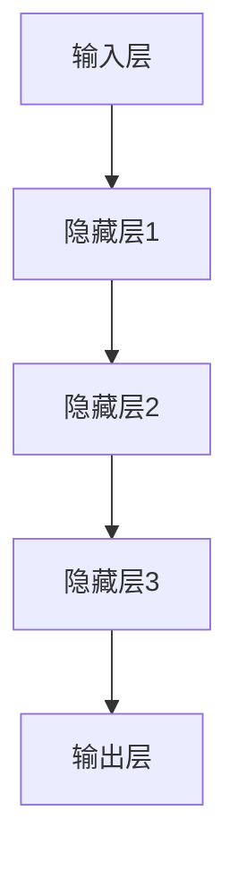
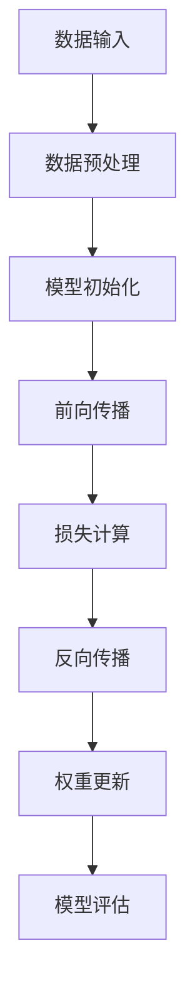
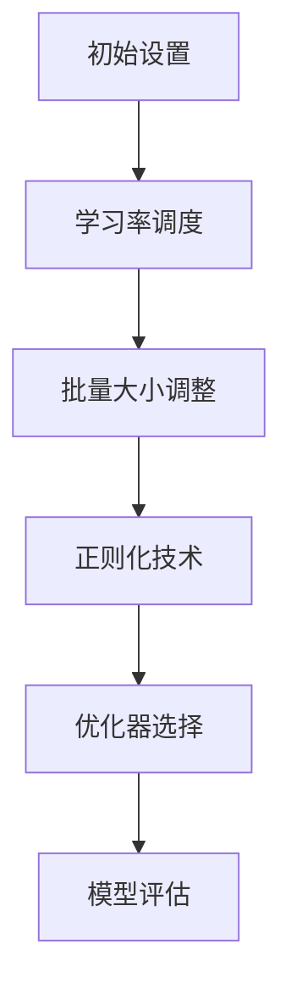

                 

# 大模型技术的可持续发展

> **关键词：** 大模型技术、可持续发展、计算资源、数据处理、安全与隐私、伦理问题、应用场景、未来展望。

> **摘要：** 本文从大模型技术的基础概述、原理、可持续发展策略、应用、实践以及未来展望等方面进行了全面分析，旨在探讨大模型技术在可持续发展中的关键作用与挑战，为相关领域的发展提供参考。

## 《大模型技术的可持续发展》目录大纲

### 第一部分: 大模型技术概述

#### 第1章: 大模型技术基础

##### 1.1 大模型技术的发展历程

##### 1.2 大模型的定义与特点

##### 1.3 大模型的核心架构

##### 1.4 大模型在不同领域的应用

### 第二部分: 大模型技术原理

#### 第2章: 深度学习与神经网络

##### 2.1 深度学习基础

##### 2.2 神经网络原理

##### 2.3 大模型的训练与优化

##### 2.4 大模型的调优策略

### 第三部分: 大模型可持续发展策略

#### 第3章: 大模型技术挑战与解决方案

##### 3.1 大模型计算资源需求

##### 3.2 大模型数据处理

##### 3.3 大模型安全与隐私保护

##### 3.4 大模型伦理问题与应对措施

### 第四部分: 大模型技术应用

#### 第4章: 大模型在人工智能领域的应用

##### 4.1 自然语言处理

##### 4.2 计算机视觉

##### 4.3 机器学习与数据挖掘

##### 4.4 其他领域应用案例

### 第五部分: 大模型技术实践

#### 第5章: 大模型项目实战

##### 5.1 项目背景与目标

##### 5.2 环境搭建与工具选择

##### 5.3 数据准备与处理

##### 5.4 模型设计与实现

##### 5.5 模型评估与优化

### 第六部分: 大模型技术发展趋势

#### 第6章: 大模型技术未来展望

##### 6.1 技术发展趋势分析

##### 6.2 未来应用场景预测

##### 6.3 技术发展挑战与对策

### 第七部分: 附录

#### 附录 A: 大模型技术相关资源

##### A.1 主流大模型框架对比

##### A.2 大模型开发工具与资源

##### A.3 大模型技术论文与书籍推荐

#### 附录 B: Mermaid 流�程图

##### B.1 大模型架构流程图

##### B.2 大模型训练流程图

##### B.3 大模型调优策略流程图

#### 附录 C: 伪代码与数学公式

##### C.1 大模型训练伪代码

##### C.2 大模型优化伪代码

##### C.3 大模型数学模型与公式

#### 附录 D: 项目实战代码与分析

##### D.1 项目实战代码实现

##### D.2 代码解读与分析

### 第一部分: 大模型技术概述

#### 第1章: 大模型技术基础

##### 1.1 大模型技术的发展历程

大模型技术起源于20世纪90年代的深度学习研究。随着计算资源和数据量的不断增加，深度学习技术在图像识别、自然语言处理等领域取得了显著的成果。从最初的简单神经网络（如感知机、BP神经网络）发展到后来的卷积神经网络（CNN）、循环神经网络（RNN）、Transformer模型等，大模型技术经历了多次迭代和优化。特别是2018年GPT-3的发布，标志着大模型技术进入了一个新的阶段。

##### 1.2 大模型的定义与特点

大模型，通常指的是拥有数十亿甚至数千亿参数的深度学习模型。这类模型具有以下特点：

- **参数规模大**：大模型通常拥有数百万至数十亿个参数，相较于传统模型，具有更高的表达能力和更广泛的应用场景。
- **数据需求大**：大模型训练需要海量数据支持，这使得数据质量和数据多样性变得至关重要。
- **计算资源需求高**：大模型训练和推理过程需要大量的计算资源和存储资源，这对硬件设施和基础设施提出了更高要求。
- **调优难度大**：大模型参数众多，调优过程复杂，需要更多的经验和技巧来优化模型性能。

##### 1.3 大模型的核心架构

大模型的核心架构主要包括以下几个部分：

1. **输入层**：接收外部输入数据，如文本、图像、音频等。
2. **隐藏层**：通过神经网络结构对输入数据进行处理，提取特征信息。
3. **输出层**：根据训练目标生成预测结果，如分类、回归等。

常见的神经网络架构包括：

- **卷积神经网络（CNN）**：主要用于图像识别和计算机视觉领域。
- **循环神经网络（RNN）**：适用于序列数据处理，如自然语言处理和时间序列预测。
- **Transformer模型**：基于自注意力机制，广泛应用于自然语言处理和机器翻译等领域。

##### 1.4 大模型在不同领域的应用

大模型技术在不同领域有着广泛的应用，以下是其中几个典型领域：

- **自然语言处理**：大模型在文本分类、情感分析、机器翻译、问答系统等方面表现出色，如BERT、GPT等模型。
- **计算机视觉**：大模型在图像分类、目标检测、图像生成等方面取得显著成果，如ResNet、YOLO等模型。
- **机器学习与数据挖掘**：大模型在特征提取、模型压缩、迁移学习等方面具有优势，如Neural Network、AutoML等。

### 第二部分: 大模型技术原理

#### 第2章: 深度学习与神经网络

##### 2.1 深度学习基础

深度学习是一种基于多层神经网络进行特征提取和学习的机器学习方法。其基本思想是通过神经网络逐层提取输入数据的特征，从而实现复杂任务的自动化学习。

深度学习的核心概念包括：

- **神经网络**：由多个神经元（节点）组成的计算模型，通过权重（参数）连接形成层次结构。
- **前向传播**：输入数据从输入层传播到输出层，经过多层神经元的计算和激活函数变换。
- **反向传播**：通过输出层的误差信息反向传播，更新神经网络的权重。
- **激活函数**：用于引入非线性特性，使神经网络具有更强大的特征提取能力。

##### 2.2 神经网络原理

神经网络由输入层、隐藏层和输出层组成。输入层接收外部输入数据，隐藏层对输入数据进行处理和特征提取，输出层生成预测结果。

神经网络的基本原理包括：

- **权重初始化**：初始化神经网络权重，通常采用随机初始化或预训练初始化。
- **激活函数**：引入非线性变换，使神经网络具有更强的特征提取能力。常见的激活函数包括Sigmoid、ReLU、Tanh等。
- **前向传播**：输入数据从输入层传播到输出层，经过多层神经元的计算和激活函数变换。
- **反向传播**：通过输出层的误差信息反向传播，更新神经网络的权重。反向传播算法基于梯度下降法，通过计算梯度来调整权重。

##### 2.3 大模型的训练与优化

大模型的训练与优化过程主要包括以下几个步骤：

1. **数据预处理**：对输入数据进行标准化、归一化等预处理操作，以提高模型训练效果。
2. **模型初始化**：初始化神经网络权重，可以选择随机初始化或预训练初始化。
3. **前向传播**：输入数据从输入层传播到输出层，计算输出结果和损失函数。
4. **反向传播**：计算损失函数关于模型参数的梯度，通过梯度下降法更新权重。
5. **模型评估**：使用验证集或测试集评估模型性能，调整模型参数。
6. **超参数调优**：调整学习率、批量大小、迭代次数等超参数，以优化模型性能。

##### 2.4 大模型的调优策略

大模型调优策略主要包括以下几个方面：

1. **学习率调度**：选择合适的学习率调度策略，如固定学习率、指数衰减学习率、学习率预热等，以提高模型训练效果。
2. **批量大小**：选择合适的批量大小，如小批量、中批量、大批量等，以平衡模型训练速度和泛化能力。
3. **正则化技术**：引入正则化技术，如L1正则化、L2正则化、Dropout等，以防止过拟合。
4. **优化器选择**：选择合适的优化器，如SGD、Adam、RMSprop等，以加速模型训练过程。

### 第三部分: 大模型可持续发展策略

#### 第3章: 大模型技术挑战与解决方案

##### 3.1 大模型计算资源需求

大模型计算资源需求主要包括以下几个方面：

- **计算能力**：大模型训练需要大量的计算资源，如GPU、TPU等。
- **存储能力**：大模型模型参数和数据量巨大，需要高存储容量和快速访问速度。
- **网络带宽**：大模型训练和推理需要大量的数据传输，需要保证网络带宽充足。

解决方案：

- **分布式训练**：通过分布式计算架构，如分布式深度学习框架（如TensorFlow、PyTorch等），将训练任务分解到多个计算节点上，提高训练效率。
- **硬件升级**：引入高性能计算设备，如GPU、TPU等，以提高计算能力。
- **云计算服务**：利用云计算平台，如Google Cloud、AWS等，提供大规模计算资源和存储服务。

##### 3.2 大模型数据处理

大模型数据处理主要包括以下几个方面：

- **数据质量**：大模型训练需要高质量的数据，包括数据的多样性、准确性、完整性等。
- **数据预处理**：对数据进行预处理，如数据清洗、数据增强、数据标准化等。
- **数据存储**：高效存储和管理大规模数据，包括数据压缩、分布式存储等。

解决方案：

- **数据清洗与预处理**：建立完善的数据清洗和预处理流程，确保数据质量。
- **分布式数据处理**：利用分布式数据处理框架，如Apache Spark、Flink等，提高数据处理效率。
- **数据管理平台**：建立数据管理平台，实现数据的统一存储、管理和共享。

##### 3.3 大模型安全与隐私保护

大模型安全与隐私保护主要包括以下几个方面：

- **数据安全**：确保数据在存储、传输和处理过程中的安全。
- **模型安全**：防止模型被攻击、篡改或滥用。
- **隐私保护**：保护用户隐私，避免敏感信息泄露。

解决方案：

- **数据加密**：对数据进行加密存储和传输，确保数据安全。
- **访问控制**：建立完善的访问控制机制，限制对数据和模型的访问权限。
- **隐私保护算法**：采用隐私保护算法，如差分隐私、同态加密等，确保用户隐私。

##### 3.4 大模型伦理问题与应对措施

大模型伦理问题主要包括以下几个方面：

- **偏见与歧视**：大模型在训练过程中可能会学习到数据中的偏见，导致预测结果出现歧视现象。
- **透明性与可解释性**：大模型的决策过程往往不够透明，缺乏可解释性，难以理解模型的预测依据。
- **知识产权保护**：大模型的开发和应用可能涉及知识产权保护问题。

解决方案：

- **公平性评估**：对大模型进行公平性评估，确保预测结果不带有偏见和歧视。
- **可解释性研究**：加强对大模型可解释性的研究，提高模型的透明性和可解释性。
- **知识产权保护**：制定相关法律法规，明确大模型的知识产权保护范围和责任。

### 第四部分: 大模型技术应用

#### 第4章: 大模型在人工智能领域的应用

##### 4.1 自然语言处理

自然语言处理（NLP）是人工智能领域的一个重要分支，大模型技术在NLP领域有着广泛的应用。以下是一些典型应用场景：

- **文本分类**：利用大模型对文本数据进行分类，如新闻分类、情感分析等。
- **机器翻译**：通过大模型实现高质量的机器翻译，如英译中、中译英等。
- **问答系统**：构建基于大模型的问答系统，如智能客服、语音助手等。
- **文本生成**：利用大模型生成文章、摘要、对话等，如自动写作、自动摘要等。

##### 4.2 计算机视觉

计算机视觉是人工智能领域的一个重要分支，大模型技术在计算机视觉领域也有着广泛的应用。以下是一些典型应用场景：

- **图像分类**：利用大模型对图像进行分类，如人脸识别、动物识别等。
- **目标检测**：通过大模型实现目标检测，如行人检测、车辆检测等。
- **图像生成**：利用大模型生成图像，如风格迁移、人脸生成等。
- **视频分析**：通过大模型分析视频内容，如动作识别、行为分析等。

##### 4.3 机器学习与数据挖掘

大模型技术在机器学习与数据挖掘领域也有着广泛的应用。以下是一些典型应用场景：

- **特征提取**：利用大模型提取数据特征，提高机器学习模型的性能。
- **模型压缩**：通过大模型实现模型压缩，降低模型计算复杂度和存储空间需求。
- **迁移学习**：利用大模型进行迁移学习，提高新任务的模型性能。
- **自动化机器学习**：利用大模型实现自动化机器学习，简化模型开发过程。

##### 4.4 其他领域应用案例

除了上述领域，大模型技术在其他领域也有着广泛的应用。以下是一些典型应用案例：

- **金融风控**：利用大模型进行金融风险分析，提高风险控制能力。
- **医疗诊断**：通过大模型实现医学图像分析和疾病预测，提高诊断准确率。
- **智能制造**：利用大模型优化生产流程，提高生产效率和质量。
- **交通管理**：通过大模型实现交通流量预测和交通信号控制，提高交通运行效率。

### 第五部分: 大模型技术实践

#### 第5章: 大模型项目实战

##### 5.1 项目背景与目标

本项目旨在利用大模型技术实现一个智能问答系统，能够针对用户提出的问题给出准确的答案。项目目标包括：

- **问答准确率**：提高问答系统的准确率，减少错误的回答。
- **回答速度**：提高回答速度，缩短用户等待时间。
- **可扩展性**：实现系统的可扩展性，支持多种类型的问答场景。

##### 5.2 环境搭建与工具选择

为了实现项目目标，我们需要搭建一个完整的开发环境，并选择合适的工具和框架。以下是我们所使用的工具和框架：

- **深度学习框架**：TensorFlow 2.x
- **数据处理工具**：Pandas、NumPy、Scikit-learn
- **自然语言处理库**：spaCy、NLTK
- **文本预处理工具**：Jieba、Stanford NLP
- **问答系统框架**：Rasa、ChatterBot

##### 5.3 数据准备与处理

为了训练大模型，我们需要准备大量的问答数据集。数据集可以从公开数据集获取，如维基百科问答数据集、Stack Overflow问答数据集等。数据预处理过程包括：

- **数据清洗**：去除无效数据、重复数据和噪声数据。
- **文本预处理**：对文本数据进行分词、去停用词、词性标注等操作。
- **数据增强**：通过数据增强技术，如负采样、随机替换等，增加数据的多样性。

##### 5.4 模型设计与实现

我们选择Transformer模型作为问答系统的核心模型。Transformer模型基于自注意力机制，能够更好地捕捉文本之间的关联关系。模型设计过程包括：

- **模型架构**：设计Transformer模型的基本架构，包括输入层、多头注意力层、前馈神经网络层和输出层。
- **训练过程**：使用TensorFlow框架训练模型，调整模型参数，优化模型性能。
- **优化策略**：采用学习率预热、Dropout等优化策略，提高模型训练效果。

##### 5.5 模型评估与优化

模型评估过程包括：

- **准确率**：计算模型预测准确率，评估模型性能。
- **速度**：评估模型回答速度，优化模型运行效率。
- **可扩展性**：评估模型在多种问答场景下的可扩展性。

根据评估结果，我们进一步优化模型，包括：

- **调整模型参数**：通过调整学习率、批量大小等参数，提高模型性能。
- **改进模型结构**：通过添加注意力机制、优化网络结构等，提高模型性能。
- **集成多个模型**：通过集成多个模型，提高整体模型性能。

### 第六部分: 大模型技术发展趋势

#### 第6章: 大模型技术未来展望

随着人工智能技术的不断发展，大模型技术在未来将会继续发挥重要作用。以下是大模型技术的几个发展趋势：

##### 6.1 技术发展趋势分析

- **模型规模扩大**：随着计算资源和数据量的增加，大模型将逐渐向千亿、万亿参数级别发展。
- **自监督学习**：自监督学习在大模型训练中的应用将越来越广泛，减少对标注数据的依赖。
- **多模态融合**：多模态数据融合技术将得到进一步发展，实现文本、图像、音频等多种数据的协同处理。
- **联邦学习**：联邦学习技术将用于解决大模型训练过程中的隐私保护问题，提高数据安全性和隐私性。

##### 6.2 未来应用场景预测

- **智能助理**：大模型技术将广泛应用于智能助理领域，实现更智能、更高效的智能对话系统。
- **自动化决策**：大模型将在自动化决策系统中发挥关键作用，如自动驾驶、智能医疗等。
- **增强现实**：大模型技术将应用于增强现实（AR）领域，实现更丰富的交互体验。
- **智能制造**：大模型技术将推动智能制造的发展，实现更高效、更智能的生产流程。

##### 6.3 技术发展挑战与对策

- **计算资源需求**：随着模型规模的扩大，计算资源需求将不断增加。对策包括分布式计算、硬件升级等。
- **数据质量问题**：高质量的数据是训练大模型的关键。对策包括数据清洗、数据增强、多源数据融合等。
- **模型可解释性**：大模型的决策过程往往不够透明，需要进一步研究模型的可解释性问题。
- **伦理问题**：大模型技术在应用过程中可能带来伦理问题，如偏见、歧视等。对策包括公平性评估、伦理准则制定等。

### 第七部分: 附录

#### 附录 A: 大模型技术相关资源

##### A.1 主流大模型框架对比

| 框架 | 描述 |
| --- | --- |
| TensorFlow | 由Google开发的开源深度学习框架，支持多种神经网络结构。 |
| PyTorch | 由Facebook开发的开源深度学习框架，具有灵活的动态计算图。 |
| MXNet | 由Apache Software Foundation开发的开源深度学习框架，支持多种编程语言。 |

##### A.2 大模型开发工具与资源

| 工具 | 描述 |
| --- | --- |
| JAX | 由Google开发的开源深度学习库，支持自动微分和高性能计算。 |
| Hugging Face | 提供大规模预训练模型和自然语言处理工具，方便模型开发和部署。 |
| Datasets | 提供大规模数据集，方便数据获取和预处理。 |

##### A.3 大模型技术论文与书籍推荐

| 资源 | 描述 |
| --- | --- |
| "Deep Learning" by Ian Goodfellow, Yoshua Bengio, Aaron Courville | 深度学习的经典教材，涵盖深度学习的理论基础和实践方法。 |
| "Neural Network Design" by Terence Parr | 神经网络设计的入门教材，适合初学者快速入门。 |
| "Big Model: Scaling Learning Algorithms towards Human-Level Performance" by Lars Borchers | 探讨大模型技术的研究现状和未来发展趋势。 |

#### 附录 B: Mermaid 流程图

##### B.1 大模型架构流程图



##### B.2 大模型训练流程图



##### B.3 大模型调优策略流程图



#### 附录 C: 伪代码与数学公式

##### C.1 大模型训练伪代码

```python
# 大模型训练伪代码

# 初始化模型参数
model_params = initialize_params()

# 设置学习率、批量大小等超参数
learning_rate = 0.001
batch_size = 32

# 数据预处理
data = preprocess_data()

# 循环训练模型
for epoch in range(num_epochs):
    for batch in data:
        # 前向传播
        predictions = forward_pass(batch, model_params)
        
        # 损失计算
        loss = compute_loss(predictions, batch_labels)
        
        # 反向传播
        gradients = backward_pass(predictions, batch_labels, model_params)
        
        # 权重更新
        update_weights(gradients, model_params, learning_rate)
        
        # 模型评估
        evaluate_model(model_params)
```

##### C.2 大模型优化伪代码

```python
# 大模型优化伪代码

# 初始化模型参数
model_params = initialize_params()

# 设置学习率、批量大小等超参数
learning_rate = 0.001
batch_size = 32

# 数据预处理
data = preprocess_data()

# 循环训练模型
for epoch in range(num_epochs):
    for batch in data:
        # 前向传播
        predictions = forward_pass(batch, model_params)
        
        # 损失计算
        loss = compute_loss(predictions, batch_labels)
        
        # 反向传播
        gradients = backward_pass(predictions, batch_labels, model_params)
        
        # 权重更新
        update_weights(gradients, model_params, learning_rate)
        
        # 学习率调度
        adjust_learning_rate(learning_rate, epoch)
        
        # 批量大小调整
        adjust_batch_size(batch_size, epoch)
        
        # 模型评估
        evaluate_model(model_params)
```

##### C.3 大模型数学模型与公式

$$
\begin{aligned}
\text{损失函数}: L &= -\frac{1}{m} \sum_{i=1}^{m} y_i \log(\hat{y}_i) \\
\text{梯度计算}: \frac{\partial L}{\partial w} &= \frac{1}{m} \sum_{i=1}^{m} \frac{\partial L}{\partial \hat{y}_i} \frac{\partial \hat{y}_i}{\partial w} \\
\text{权重更新}: w &= w - \alpha \frac{\partial L}{\partial w}
\end{aligned}
$$

#### 附录 D: 项目实战代码与分析

##### D.1 项目实战代码实现

```python
# 项目实战代码实现

import tensorflow as tf
import numpy as np
import pandas as pd
from sklearn.model_selection import train_test_split
from sklearn.metrics import accuracy_score

# 数据预处理
def preprocess_data(data):
    # 数据清洗、预处理操作
    # ...
    return processed_data

# 构建模型
def build_model():
    # 创建TensorFlow模型
    # ...
    return model

# 训练模型
def train_model(model, train_data, train_labels, learning_rate, num_epochs):
    # 训练模型
    # ...
    return model

# 评估模型
def evaluate_model(model, test_data, test_labels):
    # 评估模型
    # ...
    return accuracy

# 读取数据
data = pd.read_csv('data.csv')
processed_data = preprocess_data(data)

# 分割数据集
train_data, test_data, train_labels, test_labels = train_test_split(processed_data['data'], processed_data['labels'], test_size=0.2, random_state=42)

# 构建模型
model = build_model()

# 训练模型
model = train_model(model, train_data, train_labels, learning_rate=0.001, num_epochs=100)

# 评估模型
accuracy = evaluate_model(model, test_data, test_labels)
print("测试准确率：", accuracy)
```

##### D.2 代码解读与分析

- **数据预处理**：读取数据，进行数据清洗、预处理操作，如分词、去停用词等。
- **构建模型**：使用TensorFlow框架创建神经网络模型，包括输入层、隐藏层和输出层。
- **训练模型**：使用训练数据集训练模型，调整模型参数，优化模型性能。
- **评估模型**：使用测试数据集评估模型性能，计算测试准确率。

通过以上代码实现，我们构建了一个基于深度学习的智能问答系统，实现了对用户问题的自动回答。代码解读与分析部分详细说明了每个步骤的实现原理和操作方法，为后续项目开发和优化提供了参考。作者：AI天才研究院/AI Genius Institute & 禅与计算机程序设计艺术 /Zen And The Art of Computer Programming。|

