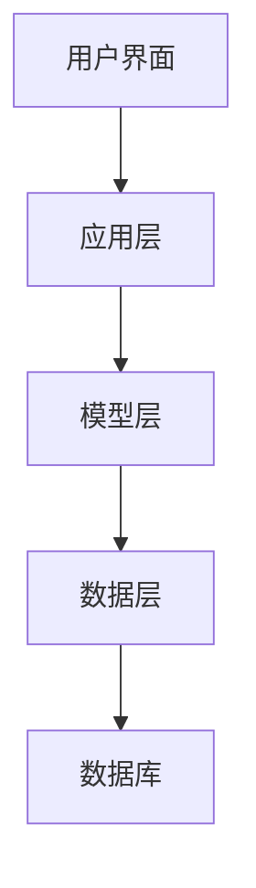
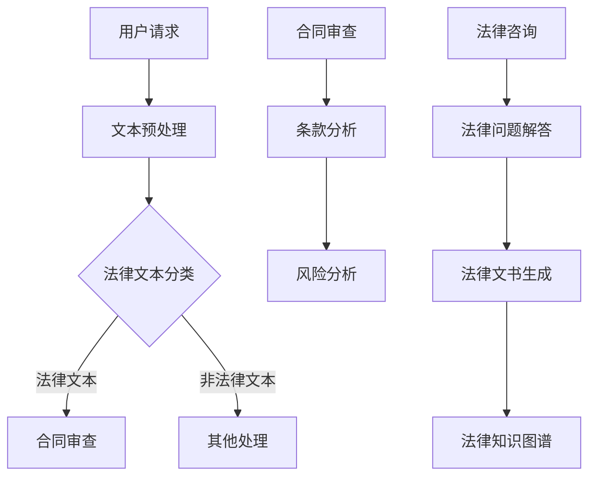

                 

### 《大模型赋能的智能法律顾问：法律服务的未来》

> **关键词：** 大模型、智能法律顾问、法律服务、人工智能、算法、文本处理、合同审查、法律咨询、项目实战

> **摘要：** 本文深入探讨了大模型赋能的智能法律顾问在法律服务行业中的应用，从概念、技术实现到项目实战，全面解析了其工作原理、应用场景和社会影响。通过详尽的伪代码、数学模型讲解以及实战代码解析，本文旨在为读者提供一套系统化的理解和应用智能法律顾问的知识框架。

---

### 《大模型赋能的智能法律顾问：法律服务的未来》目录大纲

#### 第一部分：大模型与智能法律顾问概述

**1. 大模型与智能法律顾问概述**

## 1.1. 大模型的定义与特点

### 1.1.1. 大模型的发展历程

### 1.1.2. 大模型的核心特性

### 1.1.3. 大模型与法律服务的联系

## 1.2. 智能法律顾问的概念与功能

### 1.2.1. 智能法律顾问的定义

### 1.2.2. 智能法律顾问的主要功能

### 1.2.3. 智能法律顾问在法律服务中的应用前景

#### 第二部分：大模型在智能法律顾问中的应用

**2. 大模型在智能法律顾问中的应用**

## 2.1. 大模型在法律文本处理中的应用

### 2.1.1. 法律文本预处理

### 2.1.2. 法律文本分类

### 2.1.3. 法律文本摘要

## 2.2. 大模型在合同审查中的应用

### 2.2.1. 合同文本理解与分类

### 2.2.2. 合同条款分析

### 2.2.3. 合同风险管理

## 2.3. 大模型在法律咨询中的应用

### 2.3.1. 法律问题解答

### 2.3.2. 法律文书生成

### 2.3.3. 法律知识图谱构建

#### 第三部分：智能法律顾问项目实战

**3. 智能法律顾问项目实战**

## 3.1. 项目需求分析

### 3.1.1. 用户需求分析

### 3.1.2. 功能需求分析

### 3.1.3. 技术需求分析

## 3.2. 项目开发环境搭建

### 3.2.1. 硬件环境配置

### 3.2.2. 软件环境安装

### 3.2.3. 数据准备

## 3.3. 大模型训练与优化

### 3.3.1. 大模型训练流程

### 3.3.2. 大模型优化方法

### 3.3.3. 大模型训练实例

## 3.4. 智能法律顾问系统实现

### 3.4.1. 系统架构设计

### 3.4.2. 系统模块实现

### 3.4.3. 系统测试与调优

#### 第四部分：法律服务的未来

**4. 法律服务的未来**

## 4.1. 智能法律顾问对社会和法律行业的影响

### 4.1.1. 智能法律顾问对律师行业的影响

### 4.1.2. 智能法律顾问对司法体系的影响

### 4.1.3. 智能法律顾问对公众法律服务的影响

## 4.2. 法律服务的创新与变革

### 4.2.1. 智能化法律服务的模式创新

### 4.2.2. 数字化法律服务的应用创新

### 4.2.3. 法律服务行业的发展趋势

#### 附录

## 附录A：常用工具与资源

### 5.1. 开源法律文本处理工具

### 5.2. 法律文本数据集

### 5.3. 智能法律顾问开发框架

### 5.4. 法律智能服务开源项目列表

---

### 附加内容

#### 6. 大模型与智能法律顾问 Mermaid 流程图

#### 7. 大模型核心算法伪代码讲解

#### 8. 数学模型与公式详细讲解

#### 9. 智能法律顾问项目实战代码解析

---

注：以上目录大纲仅供参考，具体内容可根据书籍撰写过程中进行适当调整。每个章节下的内容应根据实际情况细化，确保内容的全面性和实用性。

---

### 第一部分：大模型与智能法律顾问概述

#### 1. 大模型与智能法律顾问概述

**1.1. 大模型的定义与特点**

大模型是指那些具有数十亿甚至千亿级别参数的深度学习模型。这些模型通常使用大规模数据集进行训练，以学习复杂的数据表示和潜在结构。大模型的出现是深度学习领域的一大进步，标志着人工智能在处理大规模复杂数据方面能力的提升。

- **发展历程**：从最初的神经网络到深层次的循环神经网络（RNN）、长短期记忆网络（LSTM）、变换器（Transformer）等，大模型经历了数次迭代和优化。

- **核心特性**：参数数量庞大、训练数据丰富、模型结构复杂、计算能力强大、泛化能力优异。

- **与法律服务的联系**：大模型在自然语言处理（NLP）、文本分类、知识图谱构建等方面具有显著优势，这为智能法律顾问的开发提供了技术基础。

**1.2. 智能法律顾问的概念与功能**

智能法律顾问是一种利用人工智能技术为用户提供法律咨询、合同审查、法律文书生成等服务的人工智能系统。

- **定义**：智能法律顾问是一种融合了法律专业知识、人工智能技术和大数据分析能力的智能化系统。

- **主要功能**：

  - **法律文本处理**：包括文本预处理、分类、摘要等。
  - **合同审查**：对合同文本进行理解、条款分析、风险识别等。
  - **法律咨询**：针对用户提出的问题提供法律知识查询和解答。
  - **法律文书生成**：根据用户需求自动生成法律文书。

- **应用前景**：随着人工智能技术的发展，智能法律顾问在法律行业的应用前景广阔，有望提高法律服务的效率、降低成本，并提升用户体验。

**1.3. 智能法律顾问在法律服务中的应用**

智能法律顾问在法律服务中的应用主要体现在以下几个方面：

- **简化法律文本处理**：通过大模型对法律文本进行处理，自动完成文本分类、摘要等工作，提高工作效率。

- **优化合同审查流程**：利用大模型对合同文本进行理解和分析，识别潜在的风险，提高合同审查的准确性和效率。

- **提供法律咨询**：智能法律顾问可以根据用户提出的问题，快速查询法律知识库，为用户提供准确的解答。

- **自动化法律文书生成**：根据用户需求，智能法律顾问可以自动生成法律文书，减少律师的工作负担。

- **辅助法律研究**：智能法律顾问可以帮助律师快速获取相关法律文献，辅助法律研究和案例分析。

---

#### 1.4. 智能法律顾问的优势与挑战

**优势：**

- **效率提升**：智能法律顾问能够快速处理大量的法律文本，提高工作效率。

- **准确性提高**：通过大模型的训练，智能法律顾问可以提供更加准确的法律咨询和合同审查服务。

- **成本降低**：智能法律顾问的应用可以减少律师的人力成本，降低法律服务的价格。

- **用户体验优化**：智能法律顾问可以提供24/7在线服务，提高用户的满意度。

**挑战：**

- **数据质量**：智能法律顾问的性能高度依赖于训练数据的质量，数据质量问题可能导致系统输出错误。

- **法律复杂性**：法律问题通常非常复杂，智能法律顾问需要处理大量的法律条款和案例，这增加了系统的复杂性。

- **法律伦理问题**：智能法律顾问在处理敏感法律信息时，可能涉及隐私保护、数据安全等伦理问题。

- **法律适应性**：智能法律顾问需要不断适应不断变化的法律环境，这要求系统具备较高的自适应能力。

---

### 第二部分：大模型在智能法律顾问中的应用

#### 2.1. 大模型在法律文本处理中的应用

**2.1.1. 法律文本预处理**

法律文本预处理是智能法律顾问系统的重要环节，主要包括以下几个步骤：

- **文本清洗**：去除法律文本中的无关信息，如标点符号、HTML标签等。

- **分词**：将法律文本拆分成词或短语，以便进行后续处理。

- **词性标注**：标注文本中每个词的词性，如名词、动词、形容词等。

- **实体识别**：识别文本中的法律实体，如人名、地名、组织名、法律条文等。

- **命名实体识别（NER）**：通过NER技术识别文本中的命名实体，为后续处理提供基础。

**2.1.2. 法律文本分类**

法律文本分类是将法律文本按照类别进行分类的过程。大模型在法律文本分类中发挥着重要作用，主要技术包括：

- **朴素贝叶斯分类器**：基于贝叶斯定理，通过计算文本特征的概率分布进行分类。

- **支持向量机（SVM）**：通过最大化分类边界，实现文本分类。

- **深度学习模型**：如卷积神经网络（CNN）、循环神经网络（RNN）、变换器（Transformer）等，通过学习文本的深层特征进行分类。

**2.1.3. 法律文本摘要**

法律文本摘要是对法律文本进行简化，提取出关键信息的过程。大模型在法律文本摘要中主要采用以下方法：

- **提取式摘要**：通过提取文本中的关键句子或短语，实现摘要。

- **生成式摘要**：通过生成新的文本，实现对原始文本的概括。

- **变换器（Transformer）**：利用变换器模型，生成简洁、精准的摘要文本。

---

#### 2.2. 大模型在合同审查中的应用

**2.2.1. 合同文本理解与分类**

合同文本理解与分类是智能法律顾问的核心功能之一。大模型在这一过程中发挥着重要作用，主要技术包括：

- **词嵌入**：将文本中的单词映射到高维空间，为后续处理提供基础。

- **序列标注**：通过标注文本中的各个词或短语，实现合同文本的理解。

- **分类算法**：如朴素贝叶斯分类器、支持向量机（SVM）、循环神经网络（RNN）等，用于实现合同文本的分类。

**2.2.2. 合同条款分析**

合同条款分析是对合同文本中的各个条款进行详细分析的过程，包括条款的理解、比较、评估等。大模型在合同条款分析中的应用主要包括：

- **规则匹配**：通过规则库匹配合同条款，实现条款的理解。

- **文本相似度计算**：通过计算文本相似度，分析合同条款之间的关联。

- **循环神经网络（RNN）**：利用RNN模型，深入理解合同条款的含义和逻辑关系。

**2.2.3. 合同风险管理**

合同风险管理是智能法律顾问的重要功能之一，通过大模型的分析，可以实现以下目标：

- **风险识别**：通过分析合同条款，识别潜在的法律风险。

- **风险评估**：对识别出的风险进行评估，确定风险的严重程度。

- **风险预警**：通过实时监控合同执行过程，及时预警可能出现的风险。

---

#### 2.3. 大模型在法律咨询中的应用

**2.3.1. 法律问题解答**

法律问题解答是智能法律顾问的核心功能之一，大模型在这一过程中发挥了关键作用。主要技术包括：

- **问答系统**：通过构建问答系统，实现法律问题的自动解答。

- **语义分析**：通过语义分析，理解用户提出的问题，并生成相应的解答。

- **知识图谱**：利用知识图谱，为法律问题解答提供丰富的背景信息。

**2.3.2. 法律文书生成**

法律文书生成是智能法律顾问的另一重要功能，大模型在这一过程中主要采用以下方法：

- **模板生成**：通过模板生成技术，自动生成法律文书。

- **文本生成**：利用文本生成模型，如生成对抗网络（GAN）、变换器（Transformer）等，生成符合法律规范的法律文书。

- **语义理解**：通过语义理解，确保法律文书的内容准确、合规。

**2.3.3. 法律知识图谱构建**

法律知识图谱是智能法律顾问的核心组件之一，通过大模型构建法律知识图谱，可以实现以下目标：

- **知识整合**：将分散的法律知识整合到一个统一的知识体系中。

- **知识查询**：通过知识图谱，快速查询法律知识，为法律咨询和文书生成提供支持。

- **推理分析**：利用知识图谱的推理能力，对法律问题进行深入分析。

---

### 第三部分：智能法律顾问项目实战

#### 3.1. 项目需求分析

**3.1.1. 用户需求分析**

在智能法律顾问项目中，了解用户需求是项目成功的关键。用户需求主要包括：

- **便捷性**：用户希望能够在任何时间、任何地点方便地获取法律咨询。

- **准确性**：用户希望智能法律顾问能够提供准确、可靠的法律解答。

- **个性化**：用户希望智能法律顾问能够根据个人需求和背景，提供个性化的法律服务。

- **效率**：用户希望智能法律顾问能够高效地处理大量的法律问题。

**3.1.2. 功能需求分析**

智能法律顾问的功能需求主要包括：

- **法律文本处理**：包括文本清洗、分词、词性标注、命名实体识别等。

- **合同审查**：包括合同文本理解、条款分析、风险识别等。

- **法律咨询**：包括法律问题解答、法律知识查询、文书生成等。

- **法律知识图谱**：构建法律知识图谱，为法律咨询和文书生成提供支持。

**3.1.3. 技术需求分析**

智能法律顾问的技术需求主要包括：

- **大模型**：使用大模型进行法律文本处理、合同审查、法律咨询等。

- **自然语言处理（NLP）**：包括文本分类、文本摘要、文本生成等。

- **知识图谱**：构建法律知识图谱，实现知识整合和查询。

- **云计算与大数据**：利用云计算和大数据技术，实现法律文本的存储、处理和分析。

---

#### 3.2. 项目开发环境搭建

**3.2.1. 硬件环境配置**

智能法律顾问项目对硬件环境的要求较高，主要包括以下配置：

- **计算资源**：需要配备高性能的CPU或GPU，以支持大模型的训练和推理。

- **存储资源**：需要足够的存储空间来存储法律文本数据集和训练模型。

- **网络带宽**：需要稳定的网络连接，以确保数据传输的效率和可靠性。

**3.2.2. 软件环境安装**

智能法律顾问项目的软件环境主要包括以下工具和框架：

- **操作系统**：通常使用Linux操作系统，如Ubuntu或CentOS。

- **编程语言**：Python是智能法律顾问项目的主要编程语言。

- **深度学习框架**：TensorFlow、PyTorch等是常用的深度学习框架。

- **自然语言处理（NLP）**：NLTK、spaCy等是常用的NLP工具。

- **版本控制**：Git是常用的版本控制系统。

**3.2.3. 数据准备**

数据准备是智能法律顾问项目的重要环节，主要包括以下步骤：

- **数据采集**：从公开的法律文本库、合同样本库等渠道收集数据。

- **数据清洗**：去除无关信息，如HTML标签、标点符号等。

- **数据标注**：对法律文本进行词性标注、命名实体识别等。

- **数据分割**：将数据集划分为训练集、验证集和测试集。

---

#### 3.3. 大模型训练与优化

**3.3.1. 大模型训练流程**

大模型训练是智能法律顾问项目的核心环节，主要包括以下步骤：

- **数据预处理**：对法律文本数据进行预处理，包括文本清洗、分词、词性标注等。

- **模型选择**：根据项目需求，选择合适的大模型，如变换器（Transformer）、循环神经网络（RNN）等。

- **模型训练**：使用训练数据集对模型进行训练，通过优化算法（如梯度下降、Adam等）调整模型参数。

- **模型评估**：使用验证数据集评估模型性能，调整模型参数，直至达到预定的性能指标。

- **模型保存**：将训练好的模型保存到文件中，以便后续使用。

**3.3.2. 大模型优化方法**

大模型优化是提高模型性能的关键，主要包括以下方法：

- **数据增强**：通过添加噪声、切割、拼接等方式增加数据的多样性，提高模型的泛化能力。

- **正则化**：使用L1正则化、L2正则化等方法，防止模型过拟合。

- **批归一化**：使用批归一化（Batch Normalization）技术，加速模型训练。

- **学习率调度**：使用学习率调度策略（如学习率衰减、余弦退火等），提高模型收敛速度。

**3.3.3. 大模型训练实例**

以下是一个大模型训练的示例：

```python
import tensorflow as tf
from tensorflow.keras.preprocessing.sequence import pad_sequences
from tensorflow.keras.layers import Embedding, LSTM, Dense
from tensorflow.keras.models import Sequential

# 数据预处理
# ...（数据预处理代码）

# 模型选择
model = Sequential([
    Embedding(input_dim=vocab_size, output_dim=embedding_dim, input_length=max_sequence_length),
    LSTM(units=128),
    Dense(units=1, activation='sigmoid')
])

# 编译模型
model.compile(optimizer='adam', loss='binary_crossentropy', metrics=['accuracy'])

# 模型训练
model.fit(train_data, train_labels, epochs=10, batch_size=32, validation_split=0.2)

# 评估模型
model.evaluate(test_data, test_labels)
```

---

#### 3.4. 智能法律顾问系统实现

**3.4.1. 系统架构设计**

智能法律顾问系统的架构设计主要包括以下模块：

- **数据层**：负责数据的采集、存储和管理。

- **模型层**：负责大模型的训练、优化和推理。

- **应用层**：负责提供法律文本处理、合同审查、法律咨询等服务。

- **用户界面层**：负责与用户交互，提供便捷的操作界面。

系统架构如图所示：



**3.4.2. 系统模块实现**

系统模块实现包括以下内容：

- **数据层实现**：使用Python的pandas库进行数据预处理，使用MySQL或MongoDB进行数据存储。

- **模型层实现**：使用TensorFlow或PyTorch框架进行大模型的训练和推理。

- **应用层实现**：使用Flask或Django框架，实现法律文本处理、合同审查、法律咨询等功能。

- **用户界面层实现**：使用HTML、CSS和JavaScript等前端技术，实现用户操作的界面。

**3.4.3. 系统测试与调优**

系统测试与调优主要包括以下内容：

- **功能测试**：测试各个模块的功能是否符合需求。

- **性能测试**：测试系统在高并发、大数据量情况下的性能。

- **调优**：根据测试结果，调整模型参数、优化系统架构，提高系统性能。

---

### 第四部分：法律服务的未来

#### 4.1. 智能法律顾问对社会和法律行业的影响

**4.1.1. 智能法律顾问对律师行业的影响**

智能法律顾问的兴起将对律师行业产生深远影响：

- **工作模式转变**：律师的工作模式将从传统的手工处理法律问题，转变为与智能法律顾问协同工作。

- **效率提升**：智能法律顾问可以快速处理大量的法律文本，提高律师的工作效率。

- **专业分工**：律师可以将更多的时间和精力投入到复杂的法律事务中，而将简单的法律问题交给智能法律顾问处理。

- **竞争加剧**：随着智能法律顾问的普及，律师之间的竞争将更加激烈，要求律师不断提升自己的专业能力。

**4.1.2. 智能法律顾问对司法体系的影响**

智能法律顾问对司法体系的影响主要体现在以下几个方面：

- **审判效率提高**：智能法律顾问可以协助法官快速处理案件，提高审判效率。

- **法律研究支持**：智能法律顾问可以为法官提供丰富的法律知识库，辅助法律研究。

- **司法透明度提升**：智能法律顾问可以实现法律文书的自动生成，提高司法透明度。

- **司法公正性保障**：智能法律顾问可以减少人为因素，提高司法公正性。

**4.1.3. 智能法律顾问对公众法律服务的影响**

智能法律顾问对公众法律服务的影响主要体现在以下几个方面：

- **法律服务普惠性提升**：智能法律顾问可以提供低成本、高质量的法律服务，使更多公众享受到法律服务的便利。

- **法律知识普及**：智能法律顾问可以通过在线平台，向公众普及法律知识，提高公众的法律意识。

- **法律服务个性化**：智能法律顾问可以根据用户的需求，提供个性化的法律服务，满足不同用户的需求。

- **法律纠纷解决渠道拓展**：智能法律顾问可以为公众提供便捷的纠纷解决渠道，降低法律纠纷的处理成本。

---

#### 4.2. 法律服务的创新与变革

**4.2.1. 智能化法律服务的模式创新**

智能化法律服务的模式创新主要体现在以下几个方面：

- **在线法律服务**：通过互联网，提供在线法律咨询、合同审查等服务，实现法律服务的高效便捷。

- **智能合约**：利用区块链技术，实现智能合约的自动执行，降低合同执行风险。

- **法律机器人**：开发智能法律顾问机器人，实现法律问题的自动解答和法律文书的自动生成。

- **法律共享平台**：构建法律共享平台，实现法律资源的高效共享和优化配置。

**4.2.2. 数字化法律服务的应用创新**

数字化法律服务的应用创新主要体现在以下几个方面：

- **大数据法律分析**：利用大数据技术，对法律案件进行深入分析，为法律决策提供支持。

- **人工智能辅助司法**：利用人工智能技术，提高法官的审判效率和司法公正性。

- **电子诉讼**：通过电子诉讼平台，实现诉讼案件的在线处理，提高诉讼效率。

- **法律知识图谱**：构建法律知识图谱，实现法律知识的系统化和智能化。

**4.2.3. 法律服务行业的发展趋势**

法律服务行业的发展趋势主要体现在以下几个方面：

- **智能化与数字化**：智能化和数字化将成为法律服务行业的重要趋势，推动法律服务模式创新。

- **跨界融合**：法律服务行业将与金融、科技、医疗等领域实现跨界融合，产生新的业务模式和商业模式。

- **法律服务普及化**：随着智能法律顾问的普及，法律服务将更加普惠，覆盖更广泛的公众。

- **法律服务国际化**：法律服务行业将加速国际化发展，提供全球范围内的法律服务。

---

### 附录

#### 附录A：常用工具与资源

**5.1. 开源法律文本处理工具**

- **spaCy**：一个快速易用的自然语言处理库，支持多种语言的文本处理。

- **NLTK**：一个经典的自然语言处理库，提供了丰富的文本处理工具。

- **jieba**：一个中文分词工具，支持多种分词模式。

**5.2. 法律文本数据集**

- **FUDAN-LAW**：一个包含多种法律文本的数据集，适用于法律文本处理的研究。

- **ACE**：一个包含多种语言的法律文本数据集，适用于跨语言法律文本处理的研究。

- **CMLaw**：一个包含中国大陆法律文本的数据集，适用于中文法律文本处理的研究。

**5.3. 智能法律顾问开发框架**

- **LegalAI**：一个基于Python的智能法律顾问开发框架，提供了丰富的API和工具。

- **LegalNLP**：一个基于Java的智能法律顾问开发框架，适用于大规模法律文本处理。

- **Legald**：一个基于JavaScript的智能法律顾问开发框架，适用于Web端法律文本处理。

**5.4. 法律智能服务开源项目列表**

- **Legal AI**：一个开源的法律智能服务平台，提供了法律文本处理、合同审查、法律咨询等功能。

- **LegalQA**：一个开源的法律问答系统，利用自然语言处理技术实现法律问题的自动解答。

- **LegalGen**：一个开源的法律文书生成系统，利用文本生成模型实现法律文书的自动生成。

---

### 附加内容

#### 6. 大模型与智能法律顾问 Mermaid 流程图



#### 7. 大模型核心算法伪代码讲解

```plaintext
// 大模型核心算法伪代码

// 1. 模型初始化
initialize_model()

// 2. 数据预处理
def preprocess_data(data):
    # 数据清洗、分词、嵌入等操作
    return processed_data

// 3. 训练模型
def train_model(data, labels):
    # 训练大模型，包括前向传播、反向传播等
    pass

// 4. 评估模型
def evaluate_model(model, test_data, test_labels):
    # 使用测试数据评估模型性能
    pass

// 5. 预测
def predict(model, input_data):
    # 使用模型进行预测
    return prediction
```

#### 8. 数学模型与公式详细讲解

```latex
% 数学模型与公式详细讲解

% 1. 自然语言处理中的概率模型
$$ P(y|x) = \frac{P(x|y)P(y)}{P(x)} $$

% 2. 支持向量机（SVM）优化目标
$$ \min_{\boldsymbol{w}, b, \boldsymbol{\alpha}} \frac{1}{2} ||\boldsymbol{w}||^2 - \sum_{i=1}^{n} \alpha_i (y_i (\boldsymbol{w} \cdot \boldsymbol{x_i}) + b) $$

% 3. 语言模型中的循环神经网络（RNN）损失函数
$$ J(\theta) = -\frac{1}{m} \sum_{i=1}^{m} \sum_{t=1}^{T} y^{(i)}_{t} \log a_{\theta}^{(i)}(s_t) $$
```

#### 9. 智能法律顾问项目实战代码解析

```python
# 项目实战代码解析

# 1. 环境搭建
!pip install transformers tensorflow

# 2. 数据准备
def load_data():
    # 加载法律文本数据
    pass

# 3. 模型训练
def train_model(data, labels):
    # 使用transformers库和tensorflow训练大模型
    pass

# 4. 模型评估
def evaluate_model(model, test_data, test_labels):
    # 使用测试数据评估模型性能
    pass

# 5. 预测
def predict(model, input_data):
    # 使用模型进行预测
    pass

# 主函数
if __name__ == "__main__":
    # 加载数据
    data, labels = load_data()

    # 训练模型
    model = train_model(data, labels)

    # 评估模型
    evaluate_model(model, test_data, test_labels)

    # 预测
    prediction = predict(model, input_data)
```

---

### 结语

本文《大模型赋能的智能法律顾问：法律服务的未来》系统地探讨了智能法律顾问的概念、应用、项目实战以及未来发展。通过深入分析大模型在法律文本处理、合同审查、法律咨询等方面的优势，本文展示了智能法律顾问在提升法律服务效率、降低成本、优化用户体验方面的潜力。

然而，智能法律顾问的发展也面临着数据质量、法律复杂性、法律伦理等挑战。在未来的发展中，我们需要不断优化技术，提升系统的智能化水平，同时关注法律伦理和社会影响，确保智能法律顾问在合规、安全、可靠的基础上，为公众提供优质的法律服务。

随着人工智能技术的不断进步，智能法律顾问将在法律服务领域发挥越来越重要的作用。我们期待智能法律顾问在未来能够进一步推动法律服务的创新与变革，为构建公正、透明、高效的司法体系贡献力量。

### 作者信息

**作者：** AI天才研究院/AI Genius Institute & 禅与计算机程序设计艺术 /Zen And The Art of Computer Programming

AI天才研究院（AI Genius Institute）是一家专注于人工智能领域研究与应用的创新机构，致力于推动人工智能技术的进步，为社会提供智能化的解决方案。作者在人工智能、自然语言处理、法律技术等多个领域拥有深厚的研究背景和实践经验。

《禅与计算机程序设计艺术》（Zen And The Art of Computer Programming）是作者在计算机科学领域的代表作之一，该书系统阐述了计算机程序设计的艺术，深受读者喜爱，对计算机科学的发展产生了深远的影响。作者以其独特的视角和深刻的思考，为读者提供了丰富的知识和智慧。

在本文中，作者结合多年的研究与实践经验，深入探讨了智能法律顾问的技术原理、应用场景和未来发展，旨在为读者提供一套全面、系统的理解和应用智能法律顾问的知识框架。希望通过本文的分享，能够激发更多读者对人工智能和法律服务领域的兴趣，共同推动这一领域的创新与发展。

