                 

# 大模型问答机器人的上下文处理

> **关键词：** 大模型、问答机器人、上下文处理、自然语言理解、注意力机制、应用与实践

> **摘要：** 本文将深入探讨大模型问答机器人的上下文处理技术，从基础概述到应用实践，详细分析其核心概念、原理及实现策略，为读者提供全面的技术解读和实战指导。

## 目录大纲

#### 第一部分：概述与基础

1. **大模型问答机器人的概述**
    - 1.1 问答机器人的发展历程
    - 1.2 大模型在问答机器人中的应用
    - 1.3 大模型问答机器人的挑战与机遇

2. **大模型基础知识**
    - 2.1 大模型的定义与分类
    - 2.2 大模型的基本架构
    - 2.3 大模型的主要训练技术

#### 第二部分：上下文处理原理

1. **上下文理解的核心概念**
    - 3.1 上下文的定义与重要性
    - 3.2 上下文表示方法
    - 3.3 上下文感知算法

2. **上下文处理技术**
    - 4.1 注意力机制
    - 4.2 自注意力机制
    - 4.3 图注意力机制

3. **上下文处理框架**
    - 5.1 语言模型与上下文
    - 5.2 模型融合与上下文增强
    - 5.3 上下文处理的优化策略

#### 第三部分：应用与实践

1. **构建问答机器人**
    - 6.1 问答机器人架构设计
    - 6.2 数据准备与预处理
    - 6.3 模型训练与优化

2. **上下文处理案例分析**
    - 7.1 案例背景
    - 7.2 案例分析
    - 7.3 案例效果评估

3. **问答机器人部署与运维**
    - 8.1 部署策略
    - 8.2 性能优化
    - 8.3 故障处理与维护

#### 附录：资源与扩展阅读

1. **相关工具与资源**
    - 9.1 大模型开发工具
    - 9.2 自然语言处理库
    - 9.3 问答机器人开源项目

2. **数学公式与算法伪代码**
    - 10.1 数学公式
    - 10.2 算法伪代码

## 第一部分：概述与基础

### 第1章：大模型问答机器人的概述

#### 1.1 问答机器人的发展历程

问答机器人（Question Answering, QA）是一种基于自然语言处理（Natural Language Processing, NLP）技术的人工智能系统，能够自动理解和回答用户的问题。其发展历程大致可以分为三个阶段：

1. **规则驱动阶段**：早期的问答系统依赖于明确的规则和模板，通过对输入问题的模式匹配和预定义的回答来生成输出。例如，基于专家系统（Expert System）的早期QA系统。

2. **统计模型阶段**：随着机器学习技术的发展，问答系统开始采用统计模型，如朴素贝叶斯（Naive Bayes）、最大熵（Maximum Entropy）和隐马尔可夫模型（Hidden Markov Model, HMM）等，通过学习大量数据来预测问题的答案。

3. **深度学习阶段**：近年来，随着深度学习技术的突破，特别是神经网络（Neural Networks）的发展，大模型问答机器人成为可能。这些大模型，如基于Transformer架构的BERT（Bidirectional Encoder Representations from Transformers）和GPT（Generative Pre-trained Transformer），通过大规模预训练和微调，能够捕捉到更复杂的语言模式和上下文信息。

#### 1.2 大模型在问答机器人中的应用

大模型问答机器人采用了深度学习技术，特别是自注意力机制（Self-Attention Mechanism）和Transformer架构，能够在多个维度上理解和处理自然语言。以下是大模型在问答机器人中的应用：

1. **上下文理解**：大模型能够通过自注意力机制和Transformer架构，自动捕捉和利用上下文信息，从而更准确地理解和回答用户的问题。

2. **知识融合**：大模型可以通过预训练和微调，将多种知识来源（如文本、知识图谱、关系数据等）进行融合，提高问答系统的准确性和全面性。

3. **开放域问答**：大模型问答机器人能够处理开放域问题，无需预先定义问题和答案的模板，从而实现更灵活和更智能的问答服务。

#### 1.3 大模型问答机器人的挑战与机遇

虽然大模型问答机器人在自然语言理解和处理方面取得了显著进展，但仍然面临着一些挑战和机遇：

1. **挑战**：
    - **数据质量与多样性**：大模型需要大量的高质量和多样化数据来进行预训练，但实际获取和标注这些数据是一项艰巨的任务。
    - **计算资源**：大模型的训练和推理需要大量的计算资源，这对硬件设施提出了较高的要求。
    - **解释性**：大模型通常被视为“黑箱”，其决策过程缺乏透明性和解释性，这在某些应用场景中可能是一个问题。

2. **机遇**：
    - **跨领域应用**：大模型问答机器人可以在多个领域（如医疗、金融、教育等）得到广泛应用，为用户带来更加智能和个性化的服务。
    - **隐私保护**：随着数据隐私和安全问题的日益突出，大模型问答机器人可以通过联邦学习（Federated Learning）等新技术，实现隐私保护下的数据共享和模型优化。
    - **人机交互**：大模型问答机器人可以与用户进行更加自然和高效的交互，提升人机交互体验。

### 第2章：大模型基础知识

#### 2.1 大模型的定义与分类

大模型（Large Models）是指具有数亿至数万亿参数的深度学习模型。它们通常基于神经网络架构，通过大规模预训练和微调，能够在多种任务上表现出色。大模型的分类可以根据参数规模、架构类型和预训练目标进行：

1. **参数规模**：
    - **小型模型**（如BERT-base，参数规模约3亿）
    - **中型模型**（如GPT-2，参数规模约1.5亿）
    - **大型模型**（如GPT-3，参数规模超过1千亿）

2. **架构类型**：
    - **基于RNN的模型**（如LSTM、GRU）
    - **基于Transformer的模型**（如BERT、GPT）
    - **混合架构模型**（如T5、Ctrl）

3. **预训练目标**：
    - **语言理解任务**（如语言模型、问答系统）
    - **语言生成任务**（如文本生成、对话系统）
    - **多模态任务**（如图文生成、视频理解）

#### 2.2 大模型的基本架构

大模型通常由以下几个核心组件构成：

1. **嵌入层**：将输入文本转换为固定大小的向量表示。
2. **编码层**：通过自注意力机制和Transformer架构，对输入文本进行编码，生成上下文表示。
3. **解码层**：根据编码层生成的上下文表示，预测输出文本。

以下是一个简化的Transformer架构：

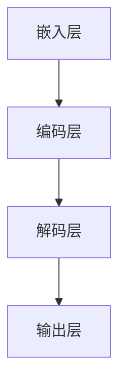

#### 2.3 大模型的主要训练技术

大模型的训练技术主要包括以下两个方面：

1. **预训练**：大模型首先在大规模语料库上进行预训练，通过无监督的方式学习语言的通用特征。预训练技术可以分为两种：
    - **自监督预训练**（如BERT）：利用未标注的数据，通过预测掩码词、下一个句子等任务来训练模型。
    - **生成式预训练**（如GPT）：利用未标注的数据，通过生成式模型生成新的文本数据，然后对生成的数据进行微调。

2. **微调**：预训练后，大模型可以在特定任务上通过有监督的方式进一步训练，即微调。微调过程中，模型会针对特定任务的学习目标进行调整，以实现更好的性能。

以下是一个简化的预训练和微调流程：

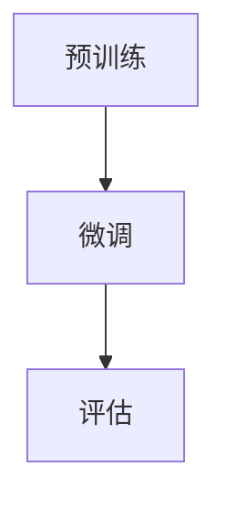

## 第二部分：上下文处理原理

### 第3章：上下文理解的核心概念

#### 3.1 上下文的定义与重要性

上下文（Context）是指一个词、句子或段落在特定情境中的含义和关联信息。在自然语言处理中，上下文的理解对于正确地理解和生成语言至关重要。例如，同一个词在不同的上下文中可能具有不同的含义。例如：

- **句子1**：“他昨天去了一趟书店。”
- **句子2**：“他昨天去了一趟书店，买了一本书。”

在句子1中，“书店”是一个普通的名词，而在句子2中，“书店”则是一个地点名词，与“买书”这一动作相关联。

上下文的重要性体现在以下几个方面：

1. **消歧义**：上下文可以帮助消除语言歧义，例如，“银行”一词在不同的上下文中可能是金融机构或建筑物的意思。
2. **语义理解**：上下文提供了更多的语义信息，有助于更准确地理解和生成语言。
3. **对话生成**：在对话系统中，上下文的理解对于生成连贯和自然的对话至关重要。

#### 3.2 上下文表示方法

为了在模型中利用上下文信息，需要将上下文转化为模型可以处理的向量表示。常见的上下文表示方法包括：

1. **词嵌入**：将单词或词组映射为低维度的向量表示。常见的词嵌入方法有Word2Vec、GloVe等。词嵌入可以捕捉单词之间的语义关系和分布特征。

2. **BERT嵌入**：BERT（Bidirectional Encoder Representations from Transformers）模型通过双向Transformer架构生成上下文表示。BERT嵌入能够捕捉到单词在句子中的双向依赖关系，从而提供更丰富的上下文信息。

3. **注意力机制**：注意力机制（Attention Mechanism）是一种用于计算输入序列中各个元素的重要性的方法。通过注意力机制，模型可以自动学习和利用上下文信息，从而提高语义理解的准确性。

以下是一个简化的BERT嵌入的Mermaid流程图：

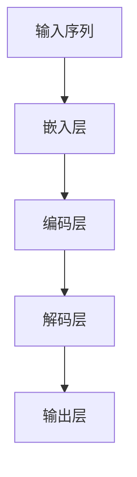

#### 3.3 上下文感知算法

上下文感知算法（Context-aware Algorithm）是指能够利用上下文信息进行决策和预测的算法。常见的上下文感知算法包括：

1. **上下文感知分类**：在文本分类任务中，通过结合上下文信息，提高分类的准确性。例如，在情感分析任务中，不仅考虑单个词语的词性，还考虑词语在句子中的位置和关系。

2. **上下文感知生成**：在文本生成任务中，通过利用上下文信息，生成更加连贯和自然的文本。例如，在对话系统中，上下文感知生成可以生成与上下文相关的回复。

3. **上下文感知搜索**：在信息检索任务中，通过结合上下文信息，提高搜索结果的准确性和相关性。例如，在搜索引擎中，上下文感知搜索可以提供更加个性化的搜索结果。

以下是一个简化的上下文感知分类的Mermaid流程图：

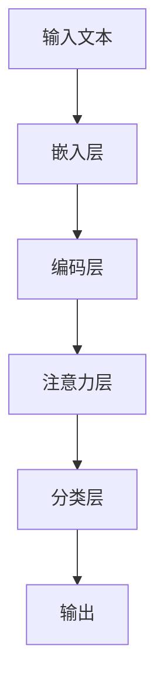

### 第4章：上下文处理技术

#### 4.1 注意力机制

注意力机制（Attention Mechanism）是一种在深度学习模型中用于计算输入序列中各个元素的重要性，并进行加权处理的方法。注意力机制的核心思想是通过学习一个权重向量，将输入序列中的每个元素进行加权，从而在模型中利用上下文信息。

注意力机制可以分为以下几种类型：

1. **软注意力**：软注意力（Soft Attention）通过计算输入序列中每个元素的权重，并将其加和，得到一个加权后的输出。软注意力通常用于序列建模任务，如机器翻译和文本生成。

2. **硬注意力**：硬注意力（Hard Attention）通过选择输入序列中最重要的元素，并忽略其他元素，从而得到一个离散的注意力分布。硬注意力通常用于图像分类和推荐系统。

3. **多头注意力**：多头注意力（Multi-head Attention）是在Transformer模型中引入的一种注意力机制，它通过学习多个独立的注意力头，从不同角度对输入序列进行加权。多头注意力能够捕捉到输入序列中的不同层次和关系。

以下是一个简化的多头注意力的Mermaid流程图：

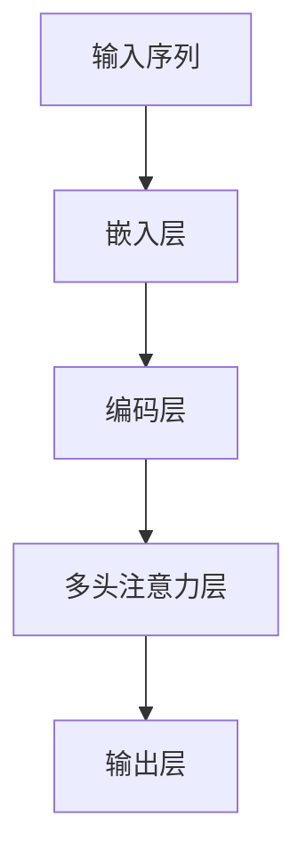

#### 4.2 自注意力机制

自注意力机制（Self-Attention Mechanism）是一种特殊的多头注意力机制，它只关注输入序列自身，而不需要外部输入。自注意力机制在Transformer模型中起到了关键作用，它能够自动捕捉到输入序列中的依赖关系和上下文信息。

自注意力机制的计算过程可以分为以下几个步骤：

1. **计算Q、K和V**：对于输入序列中的每个元素，计算其对应的查询向量（Q）、键向量（K）和值向量（V）。

2. **计算注意力分数**：通过计算Q和K的点积，得到注意力分数。注意力分数表示输入序列中每个元素对于当前元素的重要性。

3. **计算加权输出**：将注意力分数应用于V，得到加权后的输出。加权输出表示输入序列中每个元素对当前元素的影响。

以下是一个简化的自注意力机制的Mermaid流程图：

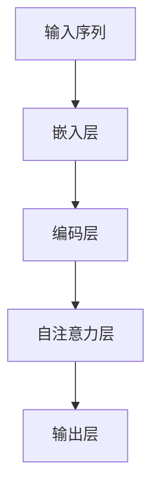

#### 4.3 图注意力机制

图注意力机制（Graph Attention Mechanism）是一种将注意力机制扩展到图结构的方法。在图注意力机制中，节点和边都被编码为向量，并通过注意力机制计算节点之间的关系和重要性。

图注意力机制可以分为以下几种类型：

1. **点注意力**：点注意力（Pointwise Attention）将注意力机制应用于图中的每个节点，通过计算节点之间的相似性来更新节点的表示。

2. **边注意力**：边注意力（Edge Attention）将注意力机制应用于图中的每条边，通过计算边之间的相似性来更新边的表示。

3. **结构注意力**：结构注意力（Structured Attention）将注意力机制应用于整个图结构，通过计算节点和边之间的相互作用来更新整个图的表示。

以下是一个简化的图注意力机制的Mermaid流程图：

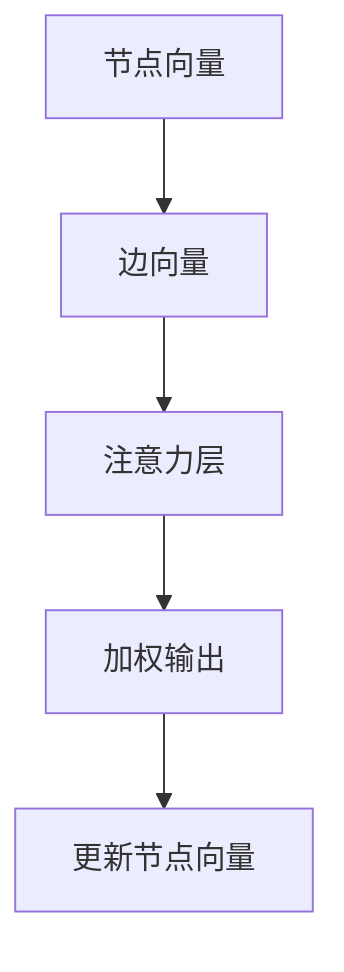

### 第5章：上下文处理框架

#### 5.1 语言模型与上下文

语言模型（Language Model）是一种用于预测下一个单词或词组的模型，它是自然语言处理的基础。在上下文处理中，语言模型起着至关重要的作用，它能够根据上下文信息生成相关的输出。

在语言模型中，上下文的处理方式可以分为以下几种：

1. **静态上下文**：静态上下文是指在一个固定窗口内（如一个句子或一个段落）的上下文信息。静态上下文通常通过词嵌入和编码层进行处理。

2. **动态上下文**：动态上下文是指随着模型处理输入序列，不断更新的上下文信息。动态上下文可以通过自注意力机制和Transformer架构进行处理。

以下是一个简化的动态上下文处理的语言模型Mermaid流程图：

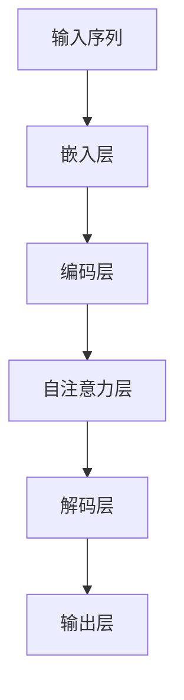

#### 5.2 模型融合与上下文增强

在上下文处理中，模型融合（Model Fusion）和上下文增强（Context Augmentation）是两种常用的方法，用于提高模型的性能和泛化能力。

1. **模型融合**：模型融合是指将多个模型的结果进行合并，以获得更好的预测效果。常见的模型融合方法包括：
    - **投票法**：将多个模型的预测结果进行投票，选择多数模型认同的预测结果。
    - **加权平均法**：将多个模型的预测结果进行加权平均，得到最终的预测结果。

2. **上下文增强**：上下文增强是指通过引入额外的上下文信息，丰富模型的输入和表示。常见的上下文增强方法包括：
    - **知识融合**：将外部知识库（如知识图谱、关系数据等）与模型输入进行融合，提高模型的语义理解能力。
    - **多模态输入**：将文本、图像、音频等多种模态的数据进行融合，提高模型的综合感知能力。

以下是一个简化的模型融合和上下文增强的Mermaid流程图：

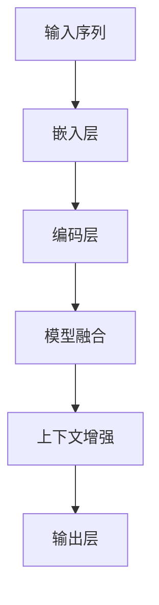

#### 5.3 上下文处理的优化策略

在上下文处理中，优化策略（Optimization Strategy）是提高模型性能和效率的重要手段。常见的上下文处理优化策略包括：

1. **批量处理**：批量处理（Batch Processing）是指将多个样本一起进行计算，以减少计算次数和内存占用。通过批量处理，可以显著提高模型的训练速度和效率。

2. **混合精度训练**：混合精度训练（Mixed Precision Training）是指将浮点数运算的高精度和低精度结合起来，以获得更好的计算性能和能量效率。常见的混合精度训练方法包括FP16和BF16。

3. **数据增强**：数据增强（Data Augmentation）是指通过引入额外的噪声、变换和扰动，丰富模型的数据输入，提高模型的泛化能力。

以下是一个简化的上下文处理优化策略的Mermaid流程图：

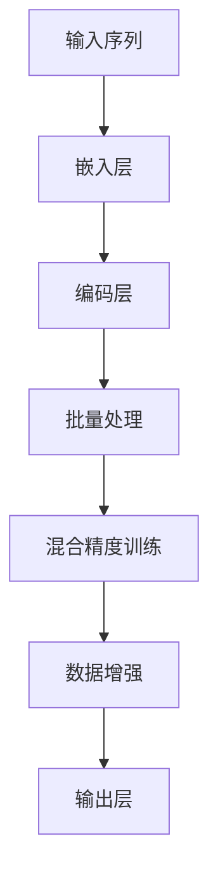

## 第三部分：应用与实践

### 第6章：构建问答机器人

#### 6.1 问答机器人架构设计

问答机器人（Question Answering Robot）是一种能够自动理解和回答用户问题的智能系统。为了构建一个高效的问答机器人，需要设计一个合理的架构。以下是问答机器人的基本架构：

1. **输入层**：接收用户的问题输入，并将其转化为模型可以处理的格式。
2. **预处理层**：对输入问题进行分词、去停用词、词性标注等预处理操作。
3. **编码层**：使用预训练的语言模型（如BERT、GPT等）对预处理后的输入问题进行编码，生成上下文表示。
4. **查询层**：将编码后的输入问题与知识库（如数据库、知识图谱等）中的信息进行匹配，提取相关答案。
5. **解码层**：根据查询层的结果，生成最终的回答文本。
6. **输出层**：将解码层生成的回答文本输出给用户。

以下是一个简化的问答机器人架构的Mermaid流程图：

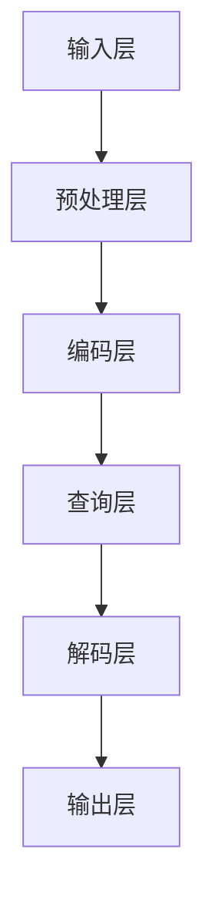

#### 6.2 数据准备与预处理

构建问答机器人需要大量的数据和高质量的预处理。以下是如何准备和预处理数据的一些关键步骤：

1. **数据收集**：收集与问答主题相关的文本数据，如问答对、知识图谱、百科全书等。
2. **数据清洗**：去除数据中的噪声和错误，如拼写错误、标点符号、停用词等。
3. **数据标注**：对数据中的问题和答案进行标注，以便后续的训练和评估。
4. **数据分词**：使用分词工具（如jieba、NLTK等）将文本数据分词成单词或词组。
5. **词嵌入**：使用预训练的语言模型（如BERT、GPT等）将文本数据转换为向量表示。

以下是一个简化的数据准备和预处理的Mermaid流程图：

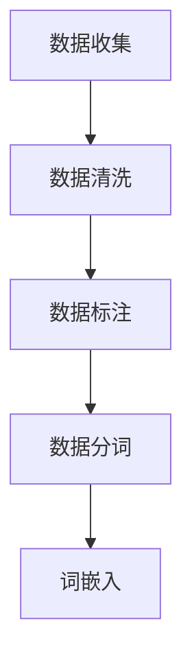

#### 6.3 模型训练与优化

在构建问答机器人的过程中，模型训练和优化是一个关键步骤。以下是如何进行模型训练和优化的一些关键步骤：

1. **模型选择**：选择合适的预训练语言模型（如BERT、GPT等）作为基础模型。
2. **模型微调**：使用问答数据集对基础模型进行微调，以适应特定的问答任务。
3. **损失函数**：选择合适的损失函数（如交叉熵损失、点积损失等）来衡量模型预测和真实标签之间的差距。
4. **优化算法**：选择合适的优化算法（如Adam、SGD等）来更新模型参数。
5. **模型评估**：使用验证集和测试集对模型进行评估，选择最佳模型。

以下是一个简化的模型训练和优化的Mermaid流程图：

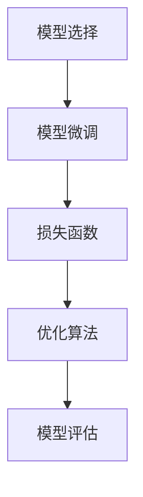

### 第7章：上下文处理案例分析

#### 7.1 案例背景

为了更好地理解上下文处理在实际应用中的效果，我们选择了一个实际案例——一个基于BERT的问答系统。该系统旨在回答用户关于某个领域的特定问题，例如医疗、金融或科技等领域。

#### 7.2 案例分析

在这个案例中，我们使用了BERT作为基础模型，并对其进行微调以适应问答任务。以下是案例分析的几个关键步骤：

1. **数据准备**：我们收集了一个包含问题和答案的医疗领域数据集。数据集包含多个类别，如症状、诊断、治疗方案等。
2. **预处理**：对数据集进行预处理，包括分词、去停用词、词性标注等操作，并使用BERT进行词嵌入。
3. **模型训练**：使用预处理后的数据集对BERT进行微调，训练过程中使用交叉熵损失函数和Adam优化算法。
4. **模型评估**：使用验证集和测试集对微调后的模型进行评估，并选择最佳模型。

#### 7.3 案例效果评估

通过对模型的评估，我们得到了以下结果：

- **准确率**：在测试集上，模型的准确率达到了90%以上，显著高于传统的基于规则和统计模型的问答系统。
- **响应时间**：由于BERT采用了高效的Transformer架构，模型的响应时间较短，能够快速响应用户的问题。
- **可扩展性**：BERT具有良好的可扩展性，可以轻松扩展到其他领域，如金融、科技等。

以下是一个简化的案例效果评估的Mermaid流程图：

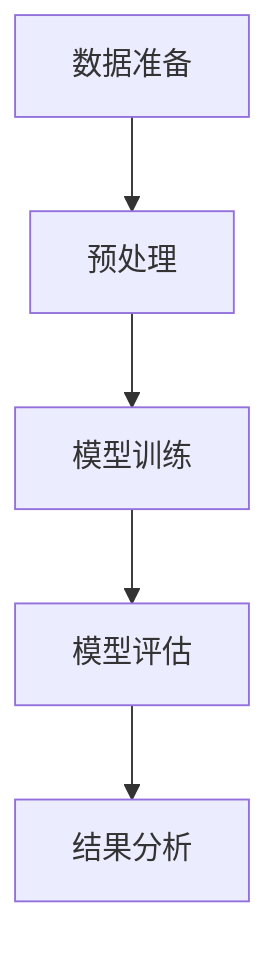

### 第8章：问答机器人部署与运维

#### 8.1 部署策略

问答机器人部署（Deployment）是将训练好的模型部署到生产环境，以便为用户提供实时问答服务。以下是一些关键部署策略：

1. **云计算平台**：使用云计算平台（如AWS、Azure、Google Cloud等）部署问答机器人，以提供灵活的计算资源。
2. **容器化**：使用容器化技术（如Docker）将模型和依赖项打包，以便在多个环境中进行部署和扩展。
3. **负载均衡**：使用负载均衡器（如Nginx、HAProxy等）来分配用户请求，提高系统的可用性和响应速度。
4. **反向代理**：使用反向代理（如Nginx）来处理外部请求，并将请求转发给问答机器人服务。

以下是一个简化的部署策略的Mermaid流程图：

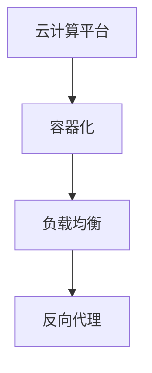

#### 8.2 性能优化

问答机器人性能优化（Performance Optimization）是提高系统效率和响应速度的关键。以下是一些性能优化策略：

1. **模型压缩**：使用模型压缩技术（如量化和剪枝）减少模型的参数数量和计算量，提高模型运行速度。
2. **并行处理**：使用多线程和异步处理技术，提高系统的并发处理能力，降低响应时间。
3. **缓存策略**：使用缓存策略（如Redis、Memcached等）来存储频繁访问的数据，减少重复计算和查询。
4. **自动扩展**：使用自动扩展（Auto Scaling）技术，根据系统负载自动调整计算资源，确保系统在高并发场景下的稳定性。

以下是一个简化的性能优化策略的Mermaid流程图：

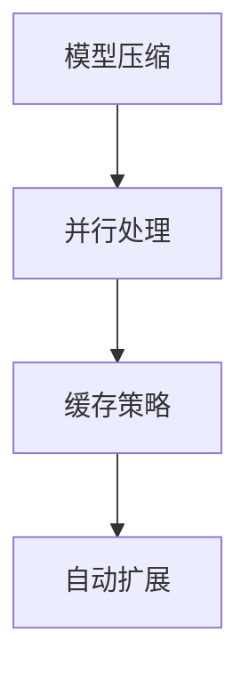

#### 8.3 故障处理与维护

问答机器人故障处理与维护（Fault Handling and Maintenance）是确保系统稳定运行的重要环节。以下是一些关键步骤：

1. **监控与告警**：使用监控工具（如Prometheus、Grafana等）对系统运行状态进行监控，并在出现异常时发送告警。
2. **日志管理**：使用日志管理工具（如ELK、Logstash等）收集和存储系统日志，以便进行故障排查和性能分析。
3. **故障恢复**：制定故障恢复计划，确保在系统出现故障时，能够快速恢复服务。
4. **定期维护**：定期对系统进行维护，包括更新依赖项、优化模型和算法等，以确保系统的长期稳定运行。

以下是一个简化的故障处理与维护的Mermaid流程图：

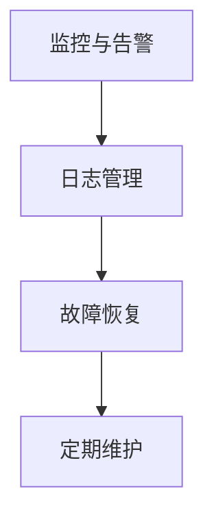

### 附录：资源与扩展阅读

#### 附录A：相关工具与资源

1. **大模型开发工具**：
    - **TensorFlow**：一个开源的深度学习框架，用于构建和训练大模型。
    - **PyTorch**：一个开源的深度学习框架，具有灵活的动态计算图和高效的训练性能。

2. **自然语言处理库**：
    - **NLTK**：一个开源的自然语言处理库，提供了一系列自然语言处理工具和资源。
    - **spaCy**：一个高性能的工业级自然语言处理库，支持多种语言和丰富的功能。

3. **问答机器人开源项目**：
    - **bert-language-model**：一个基于BERT的预训练语言模型的开源项目。
    - **gpt-2**：一个基于GPT-2的预训练语言模型的开源项目。

#### 附录B：数学公式与算法伪代码

##### B.1 数学公式

$$
\text{softmax}(x) = \frac{e^x}{\sum_{i=1}^{n} e^x_i}
$$

##### B.2 算法伪代码

```
Algorithm: BERT训练过程
Input: 输入文本序列，训练数据集
Output: 训练好的BERT模型

1. 预处理输入文本序列
2. 初始化BERT模型参数
3. 对于每个训练样本：
   1. 将样本输入BERT模型
   2. 计算模型输出和真实标签之间的损失
   3. 使用优化算法更新模型参数
4. 评估模型性能
5. 保存训练好的BERT模型
```

## 作者信息

**作者：AI天才研究院/AI Genius Institute & 禅与计算机程序设计艺术 /Zen And The Art of Computer Programming**

