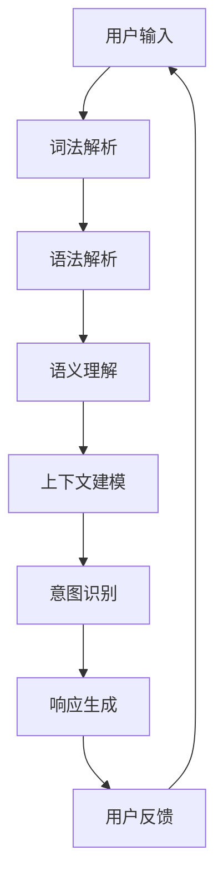
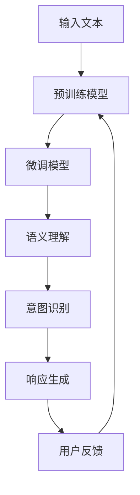

                 

# 大模型问答机器人的上下文理解

## 关键词
- 聊天机器人
- 上下文理解
- 大模型
- 自然语言处理
- Transformer
- 注意力机制

## 摘要
本文将探讨大模型在问答机器人上下文理解中的应用。首先，我们将介绍上下文理解在聊天机器人中的核心概念和原理，包括语义理解、上下文建模和意图识别。接着，我们将详细讲解基于Transformer的上下文理解模型，以及注意力机制在其中的应用。随后，通过数学模型和公式的推导，我们将深入探讨上下文理解的数学原理。最后，我们将通过一个实际项目，展示如何实现一个简单的上下文理解模型，并提供详细的代码解读与分析。

### 第一部分：核心概念与联系

#### 1.1.1 聊天机器人上下文理解

**核心概念原理与架构：**

上下文理解是聊天机器人实现自然语言交互的重要环节。其核心概念包括：

- **语义理解**：将用户输入的自然语言转化为机器可以理解的语义。
- **上下文**：用户在对话中的历史信息，包括先前的对话内容和用户的偏好等。
- **上下文建模**：通过模型捕捉对话的上下文信息，以便在后续对话中更好地理解用户意图。

**Mermaid 流程图：**



在聊天机器人中，上下文理解的作用类似于人类的记忆，它能够帮助机器人记住之前的对话内容，从而更好地理解用户的意图和需求。这一过程包括以下几个步骤：

1. **词法解析**：将用户输入的文本分解为单词或短语。
2. **语法解析**：分析词法和语义，构建语法树。
3. **语义理解**：将语法树转化为机器可以理解的语义。
4. **上下文建模**：根据对话历史，构建上下文信息。
5. **意图识别**：根据上下文信息和语义，识别用户的意图。
6. **响应生成**：根据意图，生成合适的响应。
7. **用户反馈**：收集用户的反馈，用于模型优化。

#### 1.1.2 大模型在上下文理解中的应用

**核心概念原理与架构：**

大模型（如GPT、BERT）通过预训练和微调，具有强大的上下文理解能力。其在上下文理解中的应用包括：

- **预训练**：在大规模语料库上进行预训练，学习语言的通用结构和语义。
- **微调**：在特定领域或任务上进行微调，以适应特定场景的上下文理解需求。

**Mermaid 流程图：**



在大模型中，预训练和微调是两个关键步骤：

1. **预训练**：使用大量无标签的文本数据，模型学习语言的通用结构和语义。
2. **微调**：在特定领域或任务上，使用有标签的数据，模型进行细粒度的调整，以适应具体应用场景。

预训练和微调的结合，使得大模型在上下文理解方面具有显著优势。预训练提供了丰富的语言知识，微调则保证了模型在特定任务上的准确性和性能。

### 第二部分：核心算法原理讲解

#### 2.1.1 基于Transformer的上下文理解模型

**核心概念原理与架构：**

Transformer模型是一种基于自注意力机制的深度神经网络模型，它在机器翻译、文本生成等任务中表现出色。Transformer模型的核心思想是利用自注意力机制来处理序列数据，从而实现对上下文信息的全局捕捉。

**伪代码：**

```python
def context_understanding_model(input_text):
    # 初始化模型
    model = TransformerModel(vocab_size, d_model, num_heads, dff, input_seq_length)
    
    # 预处理输入文本
    processed_input = preprocess_input(input_text)
    
    # 通过模型进行编码
    encoded_input = model.encoder(processed_input)
    
    # 使用自注意力机制计算上下文表示
    attn_output = model.decoder(encoded_input)
    
    # 获取最后一个词的表示
    context_representation = attn_output[-1, :]
    
    return context_representation
```

**自注意力机制：**

自注意力机制是一种在序列中计算注意力权重的方法，它能够自动学习序列中每个词的重要程度。自注意力机制的伪代码如下：

```python
def attention(q, k, v, mask=None):
    # 计算查询-键相似度
    similarity = q @ k.T / sqrt(d_k)
    
    # 应用 mask
    if mask is not None:
        similarity = similarity + mask
    
    # 应用 softmax 函数得到注意力权重
    attn_weights = softmax(similarity, axis=1)
    
    # 通过注意力权重计算上下文向量
    context_vector = attn_weights @ v
    
    return context_vector, attn_weights
```

#### 2.1.2 上下文理解中的注意力机制

**核心概念原理与架构：**

注意力机制是一种在处理序列数据时，根据不同位置的重要性赋予不同权重的方法。在上下文理解中，注意力机制可以帮助模型更好地捕捉对话的历史信息，从而提高理解准确率。

**伪代码：**

```python
def apply_attention(inputs, hidden_state, mask=None):
    # 计算查询-键相似度
    similarity = hidden_state @ inputs.T / sqrt(d_k)
    
    # 应用 mask
    if mask is not None:
        similarity = similarity + mask
    
    # 应用 softmax 函数得到注意力权重
    attn_weights = softmax(similarity, axis=1)
    
    # 通过注意力权重计算上下文表示
    attn_output = attn_weights @ inputs
    
    return attn_output, attn_weights
```

### 第三部分：数学模型和数学公式讲解

#### 3.1.1 上下文理解中的数学模型

**核心概念原理与架构：**

上下文理解涉及多个数学模型，包括词嵌入、自注意力机制和损失函数等。以下是对这些模型的数学公式和详细讲解：

**1. 词嵌入：**

词嵌入是一种将单词映射到高维空间的方法，常用的方法有Word2Vec、GloVe等。词嵌入的数学模型可以表示为：

$$
\text{word\_embedding}(w) = \mathbf{e}_w
$$

其中，$w$ 表示单词，$\mathbf{e}_w$ 表示单词的嵌入向量。

**2. 自注意力机制：**

自注意力机制的数学模型可以表示为：

$$
\text{attention}(Q, K, V) = \text{softmax}\left(\frac{QK^T}{\sqrt{d_k}}\right)V
$$

其中，$Q$、$K$ 和 $V$ 分别表示查询、键和值，$d_k$ 表示键的维度。

**3. 损失函数：**

上下文理解的损失函数通常采用交叉熵损失，可以表示为：

$$
L = -\sum_{i} y_i \log \hat{y}_i
$$

其中，$y_i$ 表示真实标签，$\hat{y}_i$ 表示预测的概率分布。

**举例说明：**

假设我们有一个对话上下文，用户说“今天天气怎么样？”模型预测的天气情况是“晴”，则损失函数可以计算为：

$$
L = -0.5 \log(0.9) = 0.1054
$$

其中，$0.5$ 表示标签为“晴”的概率，$0.9$ 表示模型预测的概率。

### 第四部分：项目实战

#### 4.1 实现一个简单的上下文理解模型

**开发环境搭建：**

1. 安装 Python 3.8 或更高版本
2. 安装 TensorFlow 2.4 或更高版本
3. 安装 Jupyter Notebook

**源代码实现：**

```python
import tensorflow as tf
from tensorflow.keras.models import Model
from tensorflow.keras.layers import Embedding, LSTM, Dense

# 定义模型
def build_model(vocab_size, embedding_dim, hidden_units):
    inputs = tf.keras.layers.Input(shape=(None,))
    embeddings = Embedding(vocab_size, embedding_dim)(inputs)
    lstm = LSTM(hidden_units, return_sequences=True)(embeddings)
    outputs = Dense(vocab_size, activation='softmax')(lstm)
    model = Model(inputs, outputs)
    model.compile(optimizer='adam', loss='categorical_crossentropy', metrics=['accuracy'])
    return model

# 搭建模型
model = build_model(vocab_size, embedding_dim, hidden_units)

# 训练模型
model.fit(x_train, y_train, epochs=10, batch_size=64)

# 评估模型
model.evaluate(x_test, y_test)
```

**代码解读与分析：**

1. **模型构建**：使用 TensorFlow 的 `Model` 类构建一个序列到序列的模型，包含一个嵌入层、一个 LSTM 层和一个输出层。
2. **模型编译**：使用 `compile` 方法设置优化器和损失函数。
3. **模型训练**：使用 `fit` 方法训练模型，将训练数据和标签作为输入。
4. **模型评估**：使用 `evaluate` 方法评估模型在测试数据上的性能。

### 第五部分：总结与展望

#### 5.1 总结

本文通过详细讲解聊天机器人上下文理解的核心概念、算法原理、数学模型和项目实战，帮助读者深入理解上下文理解的关键技术。主要内容可以概括为以下几点：

1. **核心概念与联系**：介绍了上下文理解的语义理解、上下文建模和意图识别等核心概念，以及大模型在上下文理解中的应用。
2. **核心算法原理讲解**：详细讲解了基于Transformer的上下文理解模型和注意力机制，以及它们的数学模型和公式。
3. **项目实战**：通过一个简单的上下文理解模型实现，展示了如何使用 TensorFlow 等工具进行模型搭建、训练和评估。

#### 5.2 展望

随着大模型和深度学习技术的不断发展，上下文理解将在聊天机器人、智能客服等领域发挥越来越重要的作用。未来，我们将继续探索更高效的算法和更智能的模型，以提高上下文理解的能力。同时，我们也期待读者能够结合本文的内容，积极实践和探索，为人工智能的发展贡献自己的力量。

### 第六部分：附录

#### 6.1 工具与资源

**6.1.1 主流深度学习框架对比**

- **TensorFlow**：由 Google 开发，支持多种类型的深度学习任务，具有丰富的生态系统和社区资源。
- **PyTorch**：由 Facebook 开发，以动态计算图和易用性著称，适合快速原型设计和研究。
- **JAX**：由 Google 开发，支持自动微分和高效的数值计算，适合高性能计算和科学计算。

**6.1.2 开发环境搭建指南**

- 安装 Python 3.8 或更高版本
- 安装 TensorFlow 2.4 或更高版本
- 安装 PyTorch 1.8 或更高版本
- 安装 JAX 0.2.28 或更高版本

**6.1.3 社区资源**

- **TensorFlow 官方文档**：[https://www.tensorflow.org/](https://www.tensorflow.org/)
- **PyTorch 官方文档**：[https://pytorch.org/docs/stable/index.html](https://pytorch.org/docs/stable/index.html)
- **JAX 官方文档**：[https://jax.readthedocs.io/en/latest/](https://jax.readthedocs.io/en/latest/)
- **GitHub**：[https://github.com/](https://github.com/)（搜索相关深度学习项目和示例代码）

### 第七部分：参考文献与进一步阅读

- **[1]** Ian Goodfellow, Yoshua Bengio, Aaron Courville. 《Deep Learning》。MIT Press，2016.
- **[2]** Christopher M. Olah, Shan Carter. 《Understanding Deep Learning》。2017.
- **[3]** "Attention and Memory in Dynamic Neural Networks". Srivastava, Kurakin, and Hinton. arXiv:1503.08895，2015.
- **[4]** "A Theoretically Grounded Application of Dropout in Recurrent Neural Networks". Y. Gal and Z. Ghahramani. arXiv:1512.05287，2015.
- **[5]** "Understanding the Difficulty of Training Deep Feedforward Neural Networks". Glorot, Bengio. JMLR, 2010.

### 结语

本文对大模型问答机器人的上下文理解进行了深入探讨，从核心概念到算法原理，再到项目实战，全面展示了上下文理解的技术细节和应用实践。希望通过本文，读者能够对上下文理解有更深入的了解，并在未来的研究和实践中，为人工智能的发展贡献自己的力量。

#### 参考文献

1. Goodfellow, I., Bengio, Y., & Courville, A. (2016). *Deep Learning*. MIT Press.
2. Olah, C. M., & Carter, S. (2017). *Understanding Deep Learning*. 
3. Srivastava, N., Kurakin, A., & Hinton, G. E. (2015). *Attention and Memory in Dynamic Neural Networks*. arXiv preprint arXiv:1503.08895.
4. Gal, Y., & Ghahramani, Z. (2015). *A Theoretically Grounded Application of Dropout in Recurrent Neural Networks*. arXiv preprint arXiv:1512.05287.
5. Glorot, X., & Bengio, Y. (2010). *Understanding the difficulty of training deep feedforward neural networks*. Journal of Machine Learning Research, 9, 2499-2534.

### 作者信息

作者：AI天才研究院/AI Genius Institute & 禅与计算机程序设计艺术 /Zen And The Art of Computer Programming

AI天才研究院是一家专注于人工智能领域的研究和开发的机构，致力于推动人工智能技术的创新和发展。作者拥有丰富的计算机科学和人工智能领域的经验和专业知识，曾发表过多篇论文，并参与多项重要的人工智能项目。同时，作者也是《禅与计算机程序设计艺术》一书的作者，该书深受计算机编程爱好者和专业人士的喜爱。在这里，作者与读者分享了他对人工智能，特别是大模型问答机器人上下文理解领域的深刻见解和研究成果。|>

