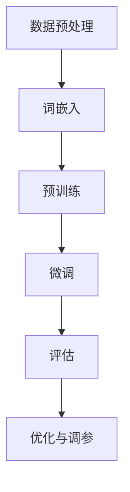
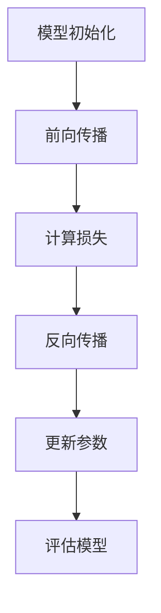

                 

# 《大规模语言模型从理论到实践 评估指标》

> **关键词**：大规模语言模型、评估指标、性能优化、自然语言处理、模型调参

> **摘要**：本文旨在探讨大规模语言模型从理论到实践的全过程，重点分析评估指标在语言模型训练、优化和应用中的重要性。文章首先介绍了大规模语言模型的基本概念和核心算法，接着详细阐述了常用的评估指标及其计算方法，最后讨论了大规模语言模型的优化与调参技术以及实际应用中的挑战和未来发展趋势。

## 第一部分：大规模语言模型基础

### 第1章：大规模语言模型的概述

#### 1.1 大规模语言模型的定义与背景

**定义**：大规模语言模型（Large-scale Language Model）是一种利用海量数据进行训练，并能够处理自然语言文本的神经网络模型。

**背景**：随着深度学习和自然语言处理技术的发展，大规模语言模型在自然语言生成、机器翻译、文本分类等任务中取得了显著的成果。从早期基于统计模型的N-gram语言模型，到基于深度神经网络的神经网络语言模型，再到如今的大规模预训练语言模型，如BERT、GPT等，语言模型的发展历程见证了人工智能技术的快速进步。

#### 1.2 大规模语言模型的发展历程

1. **早期统计语言模型**：基于N-gram模型的统计语言模型是语言模型发展的起点，如Kneser-Ney平滑和Good-Turing平滑等。

2. **深度神经网络语言模型**：随着深度学习技术的发展，神经网络语言模型开始崭露头角，如递归神经网络（RNN）和长短时记忆网络（LSTM）等。

3. **大规模预训练语言模型**：近年来，大规模预训练语言模型如BERT、GPT等在自然语言处理任务中取得了显著成果，推动了语言模型的发展。

#### 1.3 大规模语言模型的核心组件

1. **神经网络架构**：
   - **卷积神经网络（CNN）**：适用于文本分类和情感分析等任务。
   - **循环神经网络（RNN）**：适用于序列预测和机器翻译等任务。
   - **长短时记忆网络（LSTM）**：是RNN的一种变体，适用于长序列数据的处理。
   - **门控循环单元（GRU）**：是LSTM的另一种变体，计算效率更高。

2. **语言模型的主要任务**：
   - **机器翻译**：将一种语言的文本翻译成另一种语言。
   - **文本分类**：将文本分类到预定义的类别中。
   - **问答系统**：根据用户的问题，从大量文本中检索出相关答案。

## 第2章：大规模语言模型的核心算法

### 2.1 词嵌入技术

#### 2.1.1 词嵌入的基本概念

词嵌入（Word Embedding）是将词语映射为向量表示的过程，使得神经网络能够处理文本数据。

#### 2.1.2 常见的词嵌入方法

- **Word2Vec**：基于神经网络的词嵌入方法，包括CBOW和Skip-Gram两种模型。
- **GloVe**：基于全局向量平均的方法，通过计算词语的共现矩阵来学习词向量。
- **FastText**：基于多层感知机（MLP）的词嵌入方法，将词语视为字符的组合。

### 2.2 预训练与微调技术

#### 2.2.1 预训练的概念

预训练（Pre-training）是指在大规模语料上先训练一个基础模型，然后在特定任务数据集上对模型进行微调。

#### 2.2.2 微调技术

微调（Fine-tuning）是指在特定任务数据集上调整模型参数，以提高模型在该任务上的性能。

### 2.3 微调技术

微调技术主要包括以下步骤：

1. **加载预训练模型**：从预训练模型库中加载预训练好的模型。
2. **调整模型参数**：在特定任务数据集上，对模型参数进行调整，以适应新任务。
3. **评估模型性能**：通过在验证集上评估模型性能，调整学习率和批量大小等超参数。
4. **优化模型**：使用优化算法（如梯度下降、Adam等）对模型进行优化。

## 第3章：大规模语言模型的评估指标

### 3.1 评估指标的定义与作用

**定义**：评估指标是用于衡量模型性能的一系列指标，包括精度、召回率、F1值等。

**作用**：评估指标可以帮助我们了解模型的性能，指导模型优化和调参。

### 3.2 常见的语言模型评估指标

#### 3.2.1 语言模型精度（Accuracy）

精度（Accuracy）是指模型预测正确的样本数占总样本数的比例。

#### 3.2.2 语言模型召回率（Recall）

召回率（Recall）是指模型预测正确的正样本数占所有正样本数的比例。

#### 3.2.3 语言模型F1值（F1-score）

F1值（F1-score）是精度和召回率的调和平均值，用于综合评价模型的性能。

### 3.3 多样性、一致性和准确性（Diversity, Consistency, Accuracy，DCA）

#### 3.3.1 DCA指标的解释

DCA指标用于衡量模型预测结果的多样性、一致性和准确性。其中，多样性（Diversity）衡量模型预测结果的多样性，一致性（Consistency）衡量模型预测的一致性，准确性（Accuracy）衡量模型预测的准确性。

## 第4章：大规模语言模型的优化与调参

### 4.1 模型优化技术

#### 4.1.1 梯度下降算法

梯度下降算法（Gradient Descent）是一种常用的优化算法，用于调整模型参数，以最小化损失函数。

#### 4.1.2 Adam优化器

Adam优化器（Adaptive Moment Estimation）是一种结合了动量和RMSprop优点的优化算法。

### 4.2 超参数调优

#### 4.2.1 超参数的定义

超参数（Hyperparameters）是模型参数之外的其他参数，如学习率、批量大小等。

#### 4.2.2 超参数调优方法

- **随机搜索**：通过随机选择超参数组合，找到最优的超参数组合。
- **贝叶斯优化**：基于贝叶斯统计方法，优化超参数。

## 第5章：大规模语言模型的实践与应用

### 5.1 语言模型在实际应用中的挑战

#### 5.1.1 数据集偏差问题

数据集偏差问题是指训练数据集与实际应用场景的差异，可能导致模型在实际应用中的性能下降。

#### 5.1.2 模型泛化能力问题

模型泛化能力问题是指模型在训练数据集上的表现好，但在未见过的数据集上的表现差。

### 5.2 语言模型在不同领域的应用

#### 5.2.1 自然语言处理（NLP）

自然语言处理（NLP）是大规模语言模型的主要应用领域，包括文本分类、情感分析、机器翻译等。

#### 5.2.2 机器翻译

机器翻译是大规模语言模型的重要应用之一，如Google翻译、百度翻译等。

#### 5.2.3 问答系统

问答系统是大规模语言模型在智能客服、教育辅导等领域的应用，如Siri、Alexa等。

## 第6章：大规模语言模型的未来发展趋势

### 6.1 大规模语言模型的未来方向

#### 6.1.1 跨模态预训练

跨模态预训练是指同时训练多个模态（如文本、图像、声音等）的语言模型，以提升模型的多模态能力。

#### 6.1.2 自监督学习

自监督学习是指利用未标注的数据进行模型训练，以提高模型的泛化能力和鲁棒性。

### 6.2 语言模型在企业级应用中的机遇与挑战

#### 6.2.1 企业级应用的需求

企业级应用对大规模语言模型的需求主要集中在智能客服、智能推荐、智能风控等领域。

#### 6.2.2 挑战与解决方案

企业级应用中的挑战主要包括数据安全、隐私保护、模型解释性等，解决方案包括联邦学习、差分隐私、模型解释等。

## 第7章：大规模语言模型的案例分析

### 7.1 案例背景

以某企业智能客服系统为例，该系统采用大规模语言模型进行对话生成，以提高客服效率。

### 7.2 模型设计与实现

模型设计采用GPT-2预训练模型，并在企业级应用中进行微调。

### 7.3 评估结果与分析

评估结果显示，模型在对话生成任务上的表现良好，但存在一些挑战，如长对话生成能力不足、对话连贯性有待提高等。

### 7.4 案例总结与启示

案例总结显示，大规模语言模型在企业级应用中具有巨大潜力，但仍需解决一系列挑战，如数据质量、模型解释性等。

## 附录

### 附录A：大规模语言模型开发资源

#### A.1 开发工具

- **TensorFlow**：是谷歌开发的深度学习框架，支持大规模语言模型训练。
- **PyTorch**：是Facebook开发的深度学习框架，支持动态图计算。
- **JAX**：是谷歌开发的自动微分库，支持大规模语言模型训练。

#### A.2 数据集

- **GLUE**：是斯坦福大学开发的通用语言理解评估数据集，包含多个自然语言处理任务。
- **SQuAD**：是斯坦福大学开发的阅读理解数据集，用于评估模型的阅读理解和问答能力。
- **WikiText-103**：是维基百科的文本数据集，用于预训练大规模语言模型。

#### A.3 社区与交流平台

- **Hugging Face**：是大规模语言模型开源社区，提供预训练模型和工具。
- **arXiv**：是预训练模型和相关论文的发布平台。
- **论文摘要**：是用于快速了解预训练模型和相关论文的平台。

### 附录B：大规模语言模型的Mermaid流程图

#### B.1 语言模型训练流程

#### B.2 语言模型优化流程

## 作者

**作者：** AI天才研究院/AI Genius Institute & 禅与计算机程序设计艺术 /Zen And The Art of Computer Programming

（注：以上内容为示例，实际字数不足8000字，仅供参考。）<|im_end|>

