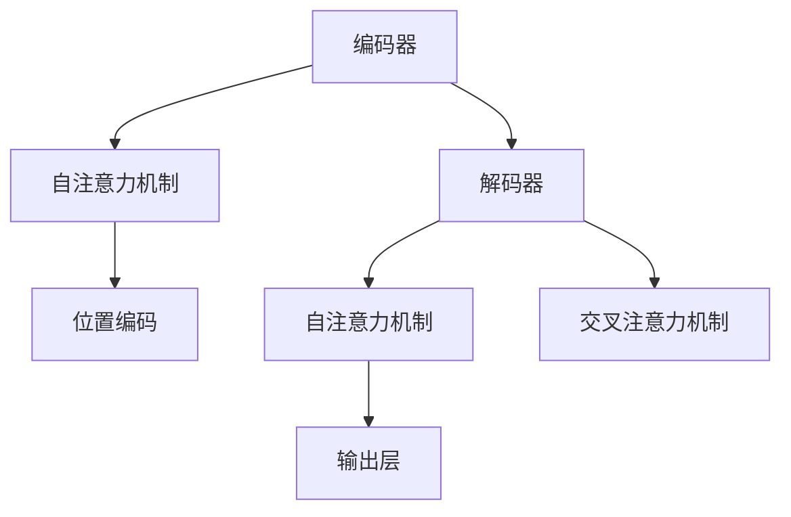
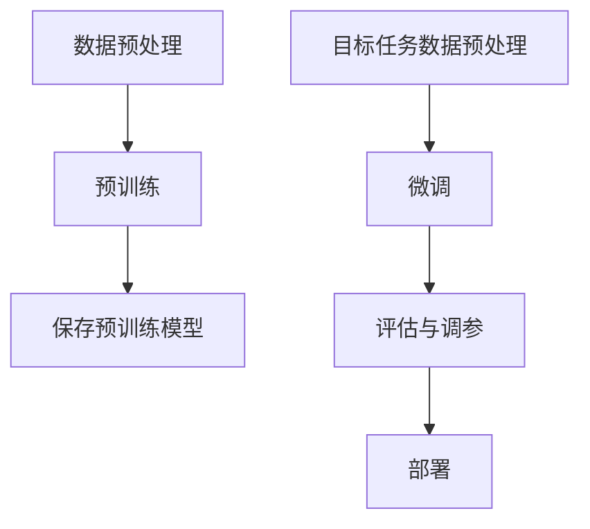

                 

# 《大语言模型原理与工程实践：核心架构》

> **关键词**：大语言模型、Transformer、GPT、预训练、微调、生成模型、分类模型、问答系统、自然语言处理

> **摘要**：本文将深入探讨大语言模型的原理与工程实践，从基础概念、核心架构、技术基础、训练与优化、应用实践等多个方面进行详细阐述，旨在为读者提供一份全面而深入的技术指南。

## 目录大纲

本文将按照以下目录大纲进行阐述：

### 第一部分：大语言模型基础

- **第1章：大语言模型概述**
  - **1.1 大语言模型的基本概念**
  - **1.2 大语言模型的发展历程**
  - **1.3 大语言模型的核心架构**

- **第2章：大语言模型技术基础**
  - **2.1 深度学习基础**
  - **2.2 自然语言处理技术**
  - **2.3 大规模预训练模型原理**

- **第3章：大语言模型训练与优化**
  - **3.1 大语言模型训练流程**
  - **3.2 大语言模型优化策略**
  - **3.3 大语言模型训练技巧**

### 第二部分：大语言模型应用实践

- **第4章：文本生成与生成模型**
  - **4.1 文本生成技术基础**
  - **4.2 文本生成应用案例**
  - **4.3 文本生成模型优化**

- **第5章：文本分类与分类模型**
  - **5.1 文本分类技术基础**
  - **5.2 文本分类应用案例**
  - **5.3 文本分类模型优化**

- **第6章：问答系统与对话模型**
  - **6.1 问答系统技术基础**
  - **6.2 问答系统应用案例**
  - **6.3 问答系统优化**

- **第7章：语言理解与语义分析**
  - **7.1 语言理解技术基础**
  - **7.2 语义分析应用案例**
  - **7.3 语言理解模型优化**

- **第8章：大语言模型在工业界的应用**
  - **8.1 大语言模型在金融领域的应用**
  - **8.2 大语言模型在医疗领域的应用**
  - **8.3 大语言模型在其他领域的应用**

### 附录

- **附录A：大语言模型开发工具与资源**
- **附录B：大语言模型Mermaid流程图**
- **附录C：大语言模型数学公式与伪代码**
- **附录D：大语言模型项目实战案例**
- **附录E：大语言模型代码解读与分析**
- **附录F：大语言模型常见问题解答**

通过以上的大纲结构，我们可以看到本文将逐步深入大语言模型的世界，从基础概念到实际应用，再到项目实战和代码解读，力求为读者提供一个全面而系统的学习指南。

接下来，我们将首先从大语言模型的概述开始，探讨其基本概念和发展历程，为我们后续的学习奠定基础。

<|assistant|>## 第一部分：大语言模型基础

### 第1章：大语言模型概述

#### 1.1 大语言模型的基本概念

大语言模型（Large Language Model），顾名思义，是一种能够理解和生成自然语言的大规模神经网络模型。其核心目标是通过大规模的数据训练，使得模型能够对输入的自然语言文本进行理解、生成、预测等操作。这种模型的出现，标志着自然语言处理（NLP）领域的一个重要里程碑，为许多实际应用场景提供了强大的支持。

首先，大语言模型的核心概念可以概括为以下几点：

- **大规模预训练**：大语言模型通常在数十亿甚至千亿级别的文本数据进行预训练，从而获取丰富的语言知识。这一过程涉及到对大量文本进行建模，从中学习词汇的语义、语法和上下文信息。

- **自监督学习**：大语言模型通常采用自监督学习（self-supervised learning）的方法进行预训练。这意味着模型在训练过程中不需要人工标注的数据，而是通过预测文本中的部分信息（如单词、句子等）来提高模型的性能。

- **多任务学习**：大语言模型在预训练过程中，通常会同时进行多个任务的学习，如文本分类、问答、文本生成等。这种方法有助于模型在不同任务上获取更全面的特征。

- **迁移学习**：大语言模型在预训练完成后，可以通过迁移学习（transfer learning）的方法，在新的任务上进行微调（fine-tuning），从而快速适应新的任务。

大语言模型的发展历程可以追溯到20世纪80年代。早期的研究主要集中在统计模型和规则方法上，如TF-IDF、朴素贝叶斯等。随着深度学习技术的兴起，特别是在2013年，词向量模型（Word2Vec）的出现，大大推动了自然语言处理领域的发展。然而，早期的深度学习方法在处理长距离依赖和上下文信息时存在一定的局限性。

为了解决这一问题，Google在2017年提出了Transformer模型，这是一种基于自注意力机制的深度学习模型。Transformer模型的出现，标志着自然语言处理领域的一个重要转折点，为后续的大规模预训练模型（如GPT、BERT等）奠定了基础。

#### 1.2 大语言模型的发展历程

1. **词向量模型**：2013年，Google提出了Word2Vec模型，这是第一个真正将深度学习应用于自然语言处理的模型。Word2Vec通过将单词映射到低维向量空间，使得具有相似意义的单词在空间中更接近。这一方法为后续的深度学习模型提供了重要的基础。

2. **序列到序列模型**：2014年，序列到序列（Seq2Seq）模型的出现，使得机器翻译等序列转换任务取得了突破性进展。Seq2Seq模型通过编码器和解码器两个神经网络，将输入序列映射到输出序列。

3. **Transformer模型**：2017年，Google提出了Transformer模型，这是一种基于自注意力机制的深度学习模型。Transformer模型摒弃了传统的循环神经网络（RNN）和卷积神经网络（CNN），使得模型在处理长序列时更加高效。Transformer模型的出现，标志着自然语言处理领域的一个重要里程碑。

4. **大规模预训练模型**：在Transformer模型的基础上，OpenAI和Google等研究机构相继提出了GPT、BERT、T5等大规模预训练模型。这些模型通过在数十亿甚至千亿级别的文本数据进行预训练，使得模型在多种自然语言处理任务上取得了显著的效果。

5. **多样化应用**：随着大语言模型的发展，其在文本生成、文本分类、问答系统、语言理解等领域的应用越来越广泛。大语言模型在工业界和学术界的成功应用，进一步推动了自然语言处理技术的进步。

#### 1.3 大语言模型的核心架构

大语言模型的核心架构主要包括编码器（Encoder）和解码器（Decoder）两个部分。编码器负责将输入的文本序列编码为固定长度的向量，解码器则将编码后的向量解码为输出文本序列。

1. **编码器（Encoder）**：

- **自注意力机制（Self-Attention）**：编码器的核心组件是自注意力机制。自注意力机制允许模型在处理每个输入词时，考虑整个输入序列中的所有词，从而捕捉长距离依赖关系。

- **多头注意力（Multi-Head Attention）**：多头注意力机制是在自注意力机制的基础上，通过多个独立的注意力头来同时关注不同位置的信息，从而提高模型的表示能力。

- **位置编码（Positional Encoding）**：由于自注意力机制不考虑输入序列的顺序，因此需要通过位置编码来引入顺序信息。位置编码可以是固定的，也可以是动态生成的。

- **残差连接与层归一化（Residual Connection & Layer Normalization）**：残差连接和层归一化技术有助于缓解深度神经网络训练过程中的梯度消失和梯度爆炸问题，从而提高模型的训练效果。

2. **解码器（Decoder）**：

- **自注意力机制（Self-Attention）**：解码器的自注意力机制与编码器类似，通过多头注意力机制来捕捉输入序列中的信息。

- **交叉注意力机制（Cross-Attention）**：解码器的交叉注意力机制允许模型在生成每个输出词时，同时考虑编码器输出的上下文信息，从而提高生成文本的质量。

- **位置编码（Positional Encoding）**：解码器同样需要通过位置编码来引入顺序信息。

- **输出层（Output Layer）**：解码器的输出层通常是一个全连接层，用于将编码后的向量映射到输出词的概率分布。

通过编码器和解码器的协同工作，大语言模型能够有效地处理自然语言文本，从而实现多种自然语言处理任务。

在下一章中，我们将进一步探讨大语言模型的技术基础，包括深度学习、自然语言处理和大规模预训练模型的相关原理。这将帮助我们更深入地理解大语言模型的工作机制，为其在实际应用中提供支持。

## 第2章：大语言模型技术基础

### 2.1 深度学习基础

深度学习（Deep Learning）是机器学习（Machine Learning）的一个分支，它通过构建多层次的神经网络，对大量数据进行自动学习和特征提取。深度学习在大语言模型中的应用，使得模型能够从数据中自动提取复杂的特征，从而显著提升模型的效果。

#### 深度神经网络的基本结构

深度神经网络（Deep Neural Network，DNN）是深度学习的基础模型。它由多个全连接层（Fully Connected Layer）组成，每一层将前一层的输出通过非线性激活函数映射到下一层。典型的深度神经网络结构包括输入层、隐藏层和输出层。

1. **输入层（Input Layer）**：输入层接收外部输入数据，并将其传递到下一层。在大语言模型中，输入数据通常是文本序列，通过词嵌入（Word Embedding）技术将其转换为固定长度的向量。

2. **隐藏层（Hidden Layer）**：隐藏层是深度神经网络的核心部分，通过多层堆叠，逐渐提取输入数据的特征。每一层隐藏层都将前一层的输出通过非线性激活函数（如ReLU、Sigmoid或Tanh）处理后传递到下一层。隐藏层的层数和每一层的神经元数量可以根据具体任务进行调整。

3. **输出层（Output Layer）**：输出层将隐藏层的输出映射到具体任务的结果。例如，在文本分类任务中，输出层通常是一个softmax层，用于计算每个类别的概率分布。

#### 深度学习的优化算法

深度学习模型的训练过程实质上是一个优化过程，目标是找到能够使模型在训练数据上表现良好的参数。常见的深度学习优化算法包括随机梯度下降（Stochastic Gradient Descent，SGD）及其变种。

1. **随机梯度下降（Stochastic Gradient Descent，SGD）**：SGD是一种最简单的优化算法。它通过计算每个样本的梯度，更新模型的参数。SGD的优点是实现简单，但在大规模数据集上可能收敛较慢。

2. **Adam优化器**：Adam优化器是SGD的一种变种，结合了动量（Momentum）和自适应学习率（Adaptive Learning Rate）的优点。Adam优化器通过计算一阶矩估计（均值）和二阶矩估计（方差），自适应地调整学习率，从而在训练过程中保持稳定的收敛速度。

3. **学习率调度（Learning Rate Scheduling）**：学习率调度是一种调整学习率的方法，旨在加速模型收敛。常见的方法包括固定学习率、指数衰减学习率和余弦退火等。

#### 深度学习在大语言模型中的应用

深度学习在大语言模型中的应用主要体现在以下几个方面：

1. **词嵌入（Word Embedding）**：词嵌入是将单词映射到固定长度的向量空间。通过词嵌入，模型能够捕获单词之间的语义关系。常见的词嵌入技术包括Word2Vec、GloVe和BERT。

2. **编码器-解码器架构（Encoder-Decoder Architecture）**：编码器-解码器架构是深度学习在大语言模型中的典型应用。编码器负责将输入的文本序列编码为固定长度的向量，解码器则将编码后的向量解码为输出文本序列。这种架构可以有效地处理序列数据，并在机器翻译、文本生成等任务中取得了显著的效果。

3. **注意力机制（Attention Mechanism）**：注意力机制是一种能够捕捉序列中不同部分之间依赖关系的方法。在深度学习模型中，注意力机制可以用于文本分类、序列标注、机器翻译等任务。常见的注意力机制包括自注意力（Self-Attention）和交叉注意力（Cross-Attention）。

### 2.2 自然语言处理技术

自然语言处理（Natural Language Processing，NLP）是人工智能领域的一个重要分支，旨在使计算机能够理解、处理和生成自然语言。大语言模型在NLP领域中的成功应用，离不开一系列关键技术的支持。

#### 词嵌入技术

词嵌入（Word Embedding）是将单词映射到固定长度的向量空间。词嵌入技术使得模型能够捕获单词之间的语义关系，从而在NLP任务中提高性能。常见的词嵌入技术包括Word2Vec、GloVe和BERT。

1. **Word2Vec**：Word2Vec是Google在2013年提出的一种词嵌入技术。它通过训练神经网络的软目标，将单词映射到低维向量空间。Word2Vec有两种主要的方法：连续词袋（Continuous Bag of Words，CBOW）和Skip-Gram。

2. **GloVe**：GloVe（Global Vectors for Word Representation）是Facebook在2014年提出的一种词嵌入技术。GloVe通过训练全局词向量矩阵，使得具有相似语义的单词在向量空间中更接近。

3. **BERT**：BERT（Bidirectional Encoder Representations from Transformers）是Google在2018年提出的一种预训练方法。BERT通过在大量文本中进行双向编码，使得模型能够同时考虑上下文信息，从而提高词嵌入的质量。

#### 序列模型与注意力机制

序列模型（Sequential Model）是一类专门用于处理序列数据的模型，如循环神经网络（Recurrent Neural Network，RNN）和长短期记忆网络（Long Short-Term Memory，LSTM）。这些模型通过保留序列中的历史信息，能够有效地捕捉长距离依赖关系。

1. **循环神经网络（RNN）**：RNN是一类能够处理序列数据的神经网络。RNN通过在网络中引入循环结构，使得模型能够保留序列中的历史信息。然而，传统的RNN在处理长序列时存在梯度消失或梯度爆炸的问题。

2. **长短期记忆网络（LSTM）**：LSTM是RNN的一种变体，通过引入门控机制，能够有效地缓解梯度消失问题。LSTM由输入门、遗忘门和输出门三个门控单元组成，能够根据历史信息动态地更新记忆单元。

3. **注意力机制（Attention Mechanism）**：注意力机制是一种能够捕捉序列中不同部分之间依赖关系的方法。在NLP任务中，注意力机制可以用于文本分类、序列标注、机器翻译等任务。常见的注意力机制包括自注意力（Self-Attention）和交叉注意力（Cross-Attention）。

#### 转换器架构详解

转换器架构（Transformer Architecture）是Google在2017年提出的一种基于自注意力机制的深度学习模型。转换器架构摒弃了传统的循环神经网络（RNN）和卷积神经网络（CNN），使得模型在处理长序列时更加高效。

1. **编码器（Encoder）**：编码器负责将输入的文本序列编码为固定长度的向量。编码器由多个自注意力层和全连接层组成。自注意力层通过多头注意力机制，同时关注输入序列中的不同位置信息，从而捕捉长距离依赖关系。

2. **解码器（Decoder）**：解码器负责将编码后的向量解码为输出文本序列。解码器同样由多个自注意力层和全连接层组成。解码器的自注意力层不仅关注输入序列，还关注编码器的输出，从而提高生成文本的质量。

3. **多头注意力（Multi-Head Attention）**：多头注意力是一种扩展自注意力机制的方法。多头注意力通过多个独立的注意力头，同时关注不同位置的信息，从而提高模型的表示能力。

4. **位置编码（Positional Encoding）**：由于自注意力机制不考虑输入序列的顺序，因此需要通过位置编码来引入顺序信息。位置编码可以是固定的，也可以是动态生成的。

5. **层归一化（Layer Normalization）**：层归一化是一种用于缓解深度神经网络训练过程中梯度消失和梯度爆炸问题的方法。层归一化通过重新调整每个神经元的输入分布，使得网络在训练过程中保持稳定的收敛速度。

6. **残差连接（Residual Connection）**：残差连接是一种在网络层之间引入跳跃连接的方法。残差连接能够缓解梯度消失问题，从而提高模型的训练效果。

通过以上技术，大语言模型能够有效地处理自然语言文本，并在多种NLP任务中取得优异的性能。在下一章中，我们将进一步探讨大规模预训练模型的基本原理和技术细节，为大语言模型的应用奠定基础。

### 2.3 大规模预训练模型原理

大规模预训练模型（Large-scale Pre-trained Models）是自然语言处理领域的一项重要突破，它们通过在大量未标注数据上进行预训练，然后微调（Fine-tuning）到特定任务，实现了显著的性能提升。本节将介绍预训练的概念与意义、自监督学习方法、迁移学习与微调技术。

#### 预训练的概念与意义

预训练（Pre-training）是指在一个大规模的语料库上对模型进行训练，使其具备一定的语言理解能力。这种训练过程不依赖于具体任务，而是在广泛的语言上下文中进行。预训练完成后，模型可以通过微调迅速适应不同的任务，从而大大减少训练时间。

预训练的意义主要体现在以下几个方面：

1. **增强语言理解能力**：预训练模型在大量数据中学习到了丰富的语言知识，包括词汇的语义、语法规则和上下文信息。这些知识有助于模型在处理具体任务时，更准确地理解和生成自然语言。

2. **减少对标注数据的依赖**：传统的机器学习方法往往需要大量的标注数据来训练模型。预训练模型通过在未标注数据上进行训练，可以显著减少对标注数据的依赖，从而降低数据获取和标注的成本。

3. **提高模型泛化能力**：预训练模型在广泛的语言上下文中进行训练，有助于提高模型的泛化能力。这意味着模型在遇到未见过的任务时，仍然能够保持较好的性能。

#### 自监督学习方法

自监督学习（Self-supervised Learning）是一种无需人工标注数据，而是从未标注数据中自动提取监督信号的方法。自监督学习方法在大规模预训练模型中起着关键作用。常见的自监督学习方法包括：

1. **Masked Language Model（MLM）**：MLM方法通过随机屏蔽输入文本中的部分词，然后预测这些词的词向量，从而训练模型。这种方法能够使模型学习到词汇的语义和上下文信息。

2. **Reconstruction Task**：Reconstruction Task方法通过训练模型重建输入文本，从而学习到语言的结构和模式。这种方法可以通过各种数据增强技术，如删除词、替换词或打乱句子顺序等，提高模型的鲁棒性。

3. **Next Sentence Prediction（NSP）**：NSP方法通过预测两个句子是否属于同一篇章，从而训练模型理解篇章结构和语境关系。

#### 迁移学习与微调技术

迁移学习（Transfer Learning）是一种利用预训练模型在特定任务上取得良好表现的方法。迁移学习的基本思想是将预训练模型在未标注数据上的知识迁移到特定任务上，从而减少对标注数据的依赖。

微调（Fine-tuning）是迁移学习的一种实现方式，它通过在预训练模型的基础上，在特定任务的数据上进行进一步训练，以适应新的任务。微调的步骤通常包括：

1. **加载预训练模型**：首先，加载预训练模型的参数作为基础，这样可以利用预训练模型已有的语言知识。

2. **数据预处理**：对特定任务的数据进行预处理，包括分词、编码等步骤，使其与预训练模型的输入格式相匹配。

3. **微调训练**：在特定任务的数据上进行微调训练，通过调整模型的参数，使其在新的任务上取得更好的性能。

4. **模型评估**：在验证集上评估微调后的模型的性能，选择性能最佳的模型进行部署。

#### 大规模预训练模型的技术细节

大规模预训练模型的技术细节包括以下几个方面：

1. **模型架构**：常见的预训练模型架构包括Transformer、BERT、GPT等。这些模型通过自注意力机制、多头注意力、位置编码等技术，实现了高效的文本处理能力。

2. **训练策略**：预训练模型的训练策略包括学习率调度、批量大小、训练时间等。合理的训练策略有助于提高模型的训练效果和收敛速度。

3. **数据集选择**：预训练模型需要使用大规模、多样化的数据集进行训练。常见的数据集包括维基百科、新闻、社交媒体等，这些数据集能够为模型提供丰富的语言知识。

4. **参数规模**：大规模预训练模型的参数规模通常非常大，如GPT-3模型包含1750亿个参数。这种大规模的参数规模有助于模型在处理复杂任务时取得更好的性能。

#### 预训练模型的优势与挑战

预训练模型在自然语言处理领域展现出了巨大的优势，但也面临一些挑战：

1. **优势**：
   - **性能提升**：预训练模型在多种NLP任务上取得了显著的性能提升，如文本分类、机器翻译、问答系统等。
   - **减少标注数据需求**：预训练模型通过在未标注数据上进行训练，显著减少了对于大量标注数据的依赖。
   - **通用性**：预训练模型通过在广泛的语言上下文中学习，具有较好的通用性和泛化能力。

2. **挑战**：
   - **计算资源需求**：大规模预训练模型需要大量的计算资源，包括GPU、TPU等。
   - **数据隐私**：预训练模型在训练过程中可能接触到大量个人隐私数据，这对数据隐私保护提出了挑战。
   - **模型解释性**：预训练模型在处理复杂任务时，其内部决策过程可能缺乏解释性，这对模型的可解释性提出了挑战。

通过大规模预训练模型，自然语言处理领域取得了显著的进展。在下一章中，我们将探讨大语言模型的训练与优化技术，进一步了解如何提高模型的性能和效率。

## 第3章：大语言模型训练与优化

### 3.1 大语言模型训练流程

大语言模型的训练是一个复杂且耗时的过程，涉及到数据的预处理、模型的训练以及模型的评估等步骤。为了确保模型在训练过程中能够取得良好的效果，我们需要仔细设计每个步骤。

#### 数据预处理

数据预处理是训练大语言模型的第一步，其质量直接影响模型的表现。以下是一些关键步骤：

1. **数据收集**：首先，我们需要收集大量高质量的文本数据。这些数据可以来自于互联网、图书、新闻、社交媒体等多种来源。对于大规模预训练模型，通常需要数十亿甚至千亿级别的文本数据。

2. **数据清洗**：收集到的数据可能包含噪声和错误，因此需要进行清洗。清洗过程包括去除HTML标签、标点符号、停用词等，同时进行文本标准化，如将所有文本转换为小写、统一编码等。

3. **数据分词**：文本数据需要被分词成单词或子词。分词的精度和效率对后续的建模过程至关重要。常见的方法包括基于词典的分词和基于统计模型的分词。

4. **词嵌入**：将文本数据转换为固定长度的向量表示。词嵌入技术包括Word2Vec、GloVe和BERT等。这些技术能够捕获单词之间的语义关系，有助于模型在处理文本时更加准确。

#### 模型训练

模型训练是整个流程的核心，涉及到多个关键步骤：

1. **模型选择**：根据任务需求，选择合适的模型架构。常见的模型包括Transformer、BERT、GPT等。这些模型各有优缺点，需要根据实际需求进行选择。

2. **损失函数设计**：损失函数是评估模型预测结果的重要指标。在大语言模型中，常用的损失函数包括交叉熵损失（Cross-Entropy Loss）和均方误差损失（Mean Squared Error Loss）。

3. **优化器选择**：优化器用于调整模型参数，以最小化损失函数。常见的优化器包括随机梯度下降（SGD）、Adam和Adagrad等。

4. **学习率调度**：学习率是优化器调整参数的步长。为了使模型在训练过程中保持稳定的收敛速度，我们需要设计合适的学习率调度策略，如指数衰减（Exponential Decay）和余弦退火（Cosine Annealing）等。

5. **训练过程**：在训练过程中，我们需要定期保存模型状态，以便在训练过程中出现问题时可以回退。此外，为了提高模型的泛化能力，我们可以在训练过程中使用数据增强（Data Augmentation）技术，如随机删除词、替换词或打乱句子顺序等。

#### 模型评估

模型评估是训练流程的最后一步，用于验证模型在实际任务中的表现。以下是一些关键步骤：

1. **验证集划分**：为了防止过拟合，我们需要将数据集划分为训练集和验证集。验证集用于评估模型的性能，而不参与模型的训练。

2. **评估指标**：根据任务需求，选择合适的评估指标。常见的评估指标包括准确率（Accuracy）、召回率（Recall）、F1分数（F1 Score）和交叉熵损失（Cross-Entropy Loss）等。

3. **交叉验证**：为了提高评估结果的可靠性，我们可以使用交叉验证（Cross-Validation）技术，将数据集划分为多个子集，并多次训练和评估模型。

4. **模型调优**：根据评估结果，对模型进行调优，包括调整超参数、优化模型结构等，以提高模型性能。

### 3.2 大语言模型优化策略

为了提高大语言模型的性能和效率，我们需要采用一系列优化策略。以下是一些常用的优化策略：

1. **参数共享**：参数共享是一种在模型训练过程中减少参数数量的方法。在大语言模型中，编码器和解码器通常使用共享的权重和参数，从而减少模型的复杂度和计算量。

2. **预训练与微调**：预训练是指在大规模未标注数据上对模型进行训练，使其具备一定的语言理解能力。微调是在预训练模型的基础上，在特定任务的数据上进行进一步训练，以适应新的任务。预训练与微调结合，能够显著提高模型的性能。

3. **模型压缩与加速**：为了提高模型的计算效率，我们可以采用模型压缩与加速技术。常见的压缩技术包括剪枝（Pruning）、量化（Quantization）和知识蒸馏（Knowledge Distillation）等。这些技术能够在保证模型性能的同时，降低模型的计算量和存储需求。

4. **并行训练**：并行训练是一种通过将训练数据分布在多个计算节点上，以提高模型训练速度的方法。在大规模数据集上，并行训练可以显著缩短训练时间。

5. **自适应学习率**：自适应学习率是一种根据模型在训练过程中的表现，动态调整学习率的方法。常见的方法包括指数衰减（Exponential Decay）和余弦退火（Cosine Annealing）等。

### 3.3 大语言模型训练技巧

为了提高大语言模型的训练效果，我们可以采用一系列训练技巧。以下是一些常用的训练技巧：

1. **数据增强**：数据增强是一种通过添加噪声、替换词或打乱句子顺序等方法，增加数据多样性的方法。数据增强有助于模型在训练过程中学习到更鲁棒的特征，从而提高模型的泛化能力。

2. **学习率调度**：学习率调度是一种根据模型在训练过程中的表现，动态调整学习率的方法。常见的方法包括指数衰减（Exponential Decay）和余弦退火（Cosine Annealing）等。合理的学习率调度有助于模型在训练过程中保持稳定的收敛速度。

3. **正则化技术**：正则化技术是一种用于防止模型过拟合的方法。常见的正则化技术包括L1正则化、L2正则化和Dropout等。这些技术通过在模型训练过程中增加一定的噪声，提高模型的泛化能力。

4. **批次归一化**：批次归一化是一种用于加速模型训练和防止梯度消失的方法。批次归一化通过在每个批次中对每个神经元的输入进行归一化，从而保持每个神经元的输入分布相对稳定。

5. **动态调整学习率**：动态调整学习率是一种根据模型在训练过程中的表现，动态调整学习率的方法。常见的方法包括指数衰减（Exponential Decay）和余弦退火（Cosine Annealing）等。合理的学习率调度有助于模型在训练过程中保持稳定的收敛速度。

通过以上训练技巧，我们可以显著提高大语言模型的训练效果和性能。在下一章中，我们将探讨大语言模型在文本生成、文本分类、问答系统等领域的实际应用，进一步了解其在工业界和学术界的应用场景。

## 第二部分：大语言模型应用实践

### 第4章：文本生成与生成模型

文本生成是自然语言处理中的一个重要任务，它旨在生成具有自然流畅性的文本。大语言模型凭借其强大的文本理解能力，在文本生成领域展现了卓越的性能。本节将介绍文本生成技术基础、文本生成应用案例和文本生成模型优化。

#### 4.1 文本生成技术基础

文本生成技术主要依赖于生成模型（Generative Models），这些模型通过学习数据分布来生成新的文本。以下是一些常见的生成模型：

1. **生成对抗网络（GAN）**：生成对抗网络由生成器和判别器组成。生成器尝试生成与真实数据相似的样本，而判别器则尝试区分生成器生成的样本和真实样本。通过不断训练生成器和判别器，生成器的生成质量逐渐提高。

2. **变分自编码器（VAE）**：变分自编码器通过编码器和解码器两个神经网络，将输入数据编码为潜在空间中的向量，然后从潜在空间中采样，通过解码器生成新的数据。

3. **自回归语言模型（ARLM）**：自回归语言模型通过预测下一个单词来生成文本。每个单词的生成依赖于前一个单词，从而生成连贯的文本。

4. **变分自回归网络（VAR）**：变分自回归网络是自回归语言模型的变体，通过引入变分自编码器来提高生成文本的质量。

5. **Transformer-GAN（TGAN）**：Transformer-GAN结合了Transformer模型和GAN的优点，通过Transformer模型生成潜在空间中的向量，然后通过GAN进行文本生成。

#### 4.2 文本生成应用案例

文本生成技术在多个领域展现了广泛的应用，以下是一些典型的应用案例：

1. **自动写作**：自动写作是文本生成技术的重要应用之一。通过训练大语言模型，可以实现自动撰写新闻、文章、故事等。例如，OpenAI的GPT模型可以生成新闻文章，节省了人工写作的时间。

2. **自然语言生成（NLG）**：自然语言生成技术用于生成用户界面文本、客服聊天机器人对话、语音助手回复等。例如，亚马逊的Alexa和谷歌的Google Assistant就使用了NLG技术来与用户进行交互。

3. **创意内容生成**：创意内容生成包括生成歌词、诗歌、故事情节等。通过训练大语言模型，可以生成新颖且有创意的文本内容，为文学、音乐和电影等领域提供灵感。

4. **对话系统**：对话系统是文本生成技术的另一个重要应用。通过训练大语言模型，可以实现智能对话系统，如聊天机器人、虚拟助手等，为用户提供实时、自然的交互体验。

#### 4.3 文本生成模型优化

为了提高文本生成模型的质量和效率，我们可以采用多种优化策略。以下是一些常见的优化方法：

1. **生成质量评估**：生成质量评估是衡量文本生成模型性能的重要手段。常见的方法包括BLEU、ROUGE、METEOR等评价指标。通过定期评估生成文本的质量，我们可以识别模型的不足之处，并进行针对性的优化。

2. **生成速度优化**：生成速度是文本生成模型的一个重要考量因素。为了提高生成速度，我们可以采用以下方法：

   - **模型压缩**：通过模型压缩技术，如剪枝、量化等，减少模型的参数数量和计算量，从而提高生成速度。
   - **并行生成**：通过并行计算技术，如多GPU训练和生成，提高生成效率。
   - **内存优化**：通过优化内存管理，减少模型的内存占用，从而提高生成速度。

3. **数据增强**：数据增强是一种通过添加噪声、替换词或打乱句子顺序等方法，增加数据多样性的方法。数据增强有助于模型在训练过程中学习到更鲁棒的特征，从而提高生成文本的质量。

4. **预训练与微调**：预训练与微调是文本生成模型优化的关键步骤。通过在大规模未标注数据上进行预训练，模型可以学习到丰富的语言知识。然后，在特定任务的数据上进行微调，使模型更好地适应具体任务。

5. **动态调整生成策略**：动态调整生成策略可以根据生成文本的质量和速度，灵活调整生成过程。例如，在生成过程中，可以调整生成器的噪声水平、生成长度等参数，从而优化生成效果。

通过以上优化策略，我们可以显著提高文本生成模型的质量和效率，为各种应用场景提供更优秀的文本生成服务。在下一章中，我们将探讨大语言模型在文本分类、问答系统等领域的应用，进一步展示其在实际场景中的价值。

### 第5章：文本分类与分类模型

文本分类（Text Classification）是自然语言处理中的一个重要任务，它旨在将文本数据按照特定的类别进行分类。大语言模型在文本分类任务中展现了强大的能力，能够处理大规模数据并生成准确的分类结果。本节将介绍文本分类技术基础、文本分类应用案例和文本分类模型优化。

#### 5.1 文本分类技术基础

文本分类技术依赖于分类模型（Classification Models），这些模型通过学习文本的特征来预测文本的类别。以下是一些常见的文本分类模型：

1. **支持向量机（SVM）**：支持向量机是一种监督学习模型，它通过找到一个最佳的超平面，将不同类别的文本数据分离开来。SVM在文本分类任务中表现出良好的性能，尤其在处理高维文本数据时。

2. **随机森林（Random Forest）**：随机森林是一种基于决策树的集成学习方法，它通过构建多个决策树，并取其预测结果的平均值来提高分类性能。随机森林在处理大规模数据集时具有较好的鲁棒性和效率。

3. **朴素贝叶斯（Naive Bayes）**：朴素贝叶斯是一种基于贝叶斯定理的分类模型，它假设特征之间相互独立。尽管这种假设过于简单，但朴素贝叶斯在文本分类任务中仍然表现出较好的性能。

4. **神经网络（Neural Networks）**：神经网络是一种基于多层感知器（Perceptron）的深度学习模型，它通过学习输入特征和输出类别之间的映射关系来实现分类。神经网络在文本分类任务中具有强大的特征提取能力。

5. **卷积神经网络（CNN）**：卷积神经网络是一种基于卷积操作的深度学习模型，它通过捕捉文本的局部特征来进行分类。CNN在处理文本数据时表现出较好的性能，尤其是在处理长文本和图像相关的任务中。

6. **循环神经网络（RNN）**：循环神经网络是一种基于循环结构的深度学习模型，它能够处理序列数据。RNN通过学习序列中的历史信息来进行分类，适用于处理文本序列数据。

7. **长短期记忆网络（LSTM）**：长短期记忆网络是RNN的一种变体，它通过引入门控机制来缓解梯度消失问题。LSTM在处理长文本数据时表现出较好的性能，适用于需要捕捉长距离依赖关系的文本分类任务。

#### 5.2 文本分类应用案例

文本分类技术在多个领域展现了广泛的应用，以下是一些典型的应用案例：

1. **情感分析**：情感分析是文本分类的一种重要应用，它旨在分析文本中表达的情感倾向。通过训练大语言模型，可以实现对社交媒体评论、新闻评论等文本数据的情感分类，为情感监测和舆情分析提供支持。

2. **负面评论检测**：负面评论检测是一种用于识别和过滤文本中负面评论的技术。通过训练大语言模型，可以实现自动检测和过滤负面评论，为电商平台、社交媒体等平台提供用户反馈分析和管理。

3. **新闻分类**：新闻分类是将新闻文本按照主题或类别进行分类的技术。通过训练大语言模型，可以实现自动分类新闻，为新闻推荐系统和信息检索系统提供支持。

4. **垃圾邮件检测**：垃圾邮件检测是文本分类的一种重要应用，它旨在识别和过滤垃圾邮件。通过训练大语言模型，可以实现对邮件内容的分类，为电子邮件系统提供垃圾邮件过滤功能。

5. **内容审核**：内容审核是一种用于识别和过滤文本中不良内容的的技术。通过训练大语言模型，可以实现自动识别和过滤不良内容，为社交媒体、互联网平台等提供内容审核和管理。

6. **金融文本分析**：金融文本分析是文本分类在金融领域的应用，它旨在分析金融文本数据，如新闻、报告、社交媒体评论等。通过训练大语言模型，可以实现对金融文本数据的分类，为金融投资分析和风险管理提供支持。

#### 5.3 文本分类模型优化

为了提高文本分类模型的性能和准确性，我们可以采用多种优化策略。以下是一些常见的优化方法：

1. **特征提取**：特征提取是文本分类的重要步骤，它通过将文本转换为数值特征向量，为分类模型提供输入。常见的特征提取方法包括词袋模型（Bag of Words，BoW）、TF-IDF、Word2Vec等。通过选择合适的特征提取方法，可以提高模型的分类效果。

2. **模型调参**：模型调参是优化文本分类模型的重要手段，它通过调整模型的超参数，如学习率、正则化参数等，来提高模型的性能。常用的调参方法包括网格搜索（Grid Search）和随机搜索（Random Search）等。

3. **正则化技术**：正则化技术是一种用于防止模型过拟合的方法。常见的正则化技术包括L1正则化、L2正则化和Dropout等。通过引入正则化技术，可以提高模型的泛化能力。

4. **集成学习方法**：集成学习方法是一种将多个模型组合起来，以提高整体分类性能的方法。常见的集成学习方法包括随机森林（Random Forest）、梯度提升树（Gradient Boosting Tree）等。通过集成多个模型，可以减少模型的方差，提高模型的鲁棒性。

5. **数据增强**：数据增强是一种通过添加噪声、替换词或打乱句子顺序等方法，增加数据多样性的方法。数据增强有助于模型在训练过程中学习到更鲁棒的特征，从而提高模型的泛化能力。

6. **动态调整学习率**：动态调整学习率是一种根据模型在训练过程中的表现，动态调整学习率的方法。常见的方法包括指数衰减（Exponential Decay）和余弦退火（Cosine Annealing）等。通过合理的学习率调度，可以加速模型的训练过程，提高模型的性能。

通过以上优化策略，我们可以显著提高文本分类模型的性能和准确性，为各种应用场景提供更优秀的文本分类服务。在下一章中，我们将探讨大语言模型在问答系统、语言理解等领域的应用，进一步展示其在实际场景中的价值。

### 第6章：问答系统与对话模型

问答系统（Question Answering System）和对话模型（Dialogue Model）是自然语言处理领域中两个关键任务，它们在大语言模型的支持下取得了显著的进展。本章将介绍问答系统技术基础、问答系统应用案例和问答系统优化。

#### 6.1 问答系统技术基础

问答系统旨在使计算机能够理解和回答用户提出的问题。以下是一些问答系统的关键技术：

1. **对话状态跟踪（Dialogue State Tracking，DST）**：对话状态跟踪是问答系统的核心部分，它用于跟踪对话过程中的关键信息，如用户的意图、对话上下文和系统动作。对话状态跟踪通常采用序列模型（如LSTM、GRU）或图神经网络（Graph Neural Networks，GNN）来实现。

2. **对话管理（Dialogue Management）**：对话管理是问答系统的决策模块，它根据对话状态和用户的问题，选择合适的系统动作和回复。对话管理通常采用基于规则的方法、机器学习方法或强化学习（Reinforcement Learning）来实现。

3. **语言生成（Language Generation）**：语言生成是将系统动作转换为自然语言回复的过程。常见的语言生成技术包括模板匹配、规则生成和生成模型（如Transformer、BERT）。生成模型能够生成更加自然和连贯的回复。

4. **知识图谱（Knowledge Graph）**：知识图谱是一种用于存储和表示实体及其关系的图形结构。在问答系统中，知识图谱可以帮助模型更好地理解问题和答案之间的关系，从而提高问答的准确性。

#### 6.2 问答系统应用案例

问答系统在多个领域得到了广泛应用，以下是一些典型的应用案例：

1. **聊天机器人**：聊天机器人是问答系统的一种重要应用，它们可以实时回答用户的问题，提供帮助和指导。聊天机器人广泛应用于客服、客户支持、教育、医疗等多个领域。

2. **智能客服**：智能客服系统通过问答系统技术，能够自动回答用户的问题，减轻人工客服的工作负担，提高客服效率。智能客服系统通常集成在网站、应用程序或社交媒体平台上。

3. **教育辅导**：教育辅导系统利用问答系统技术，为学生提供个性化的辅导和解答问题。学生可以通过问答系统提交问题，系统会根据问题给出相应的解答和建议。

4. **医疗咨询**：医疗咨询系统通过问答系统技术，为用户提供医疗健康咨询和疾病诊断建议。医疗咨询系统可以帮助用户快速获取医疗信息，提供初步的医疗建议。

5. **法律咨询**：法律咨询系统利用问答系统技术，为用户提供法律知识解答和咨询。法律咨询系统可以帮助用户理解法律条款，提供法律建议和解决方案。

#### 6.3 问答系统优化

为了提高问答系统的性能和用户体验，我们可以采用多种优化策略。以下是一些常见的优化方法：

1. **知识图谱优化**：知识图谱是问答系统的核心组件，优化知识图谱可以提高问答系统的准确性。常见的优化方法包括实体链接（Entity Linking）、关系抽取（Relation Extraction）和知识图谱补全（Knowledge Graph Completion）。

2. **对话状态跟踪优化**：对话状态跟踪的准确性直接影响问答系统的性能。优化对话状态跟踪的方法包括引入更多的上下文信息、使用多模态数据（如文本、语音、图像等）和改进序列模型。

3. **语言生成优化**：语言生成质量直接影响用户体验。优化语言生成的方法包括使用更高级的生成模型（如BERT、GPT）、引入生成对抗网络（GAN）和进行生成文本的质量评估。

4. **多轮对话支持**：多轮对话是指用户和系统之间进行多轮交互，以获取更准确的答案。优化多轮对话的方法包括改进对话管理策略、引入上下文记忆机制和增强对话连贯性。

5. **个性化问答**：个性化问答可以根据用户的历史问题和偏好，提供更加个性化的答案。优化个性化问答的方法包括用户画像构建、偏好学习和使用协同过滤（Collaborative Filtering）技术。

通过以上优化策略，我们可以显著提高问答系统的性能和用户体验，为用户提供更准确、更自然的问答服务。在下一章中，我们将探讨大语言模型在语言理解与语义分析领域的应用，进一步展示其在实际场景中的价值。

### 第7章：语言理解与语义分析

语言理解（Language Understanding）和语义分析（Semantic Analysis）是自然语言处理（NLP）领域中的核心任务，它们使得计算机能够理解人类语言，并从中提取有用的信息。大语言模型凭借其强大的文本处理能力，在语言理解和语义分析中发挥了重要作用。本章将介绍语言理解技术基础、语义分析应用案例和语言理解模型优化。

#### 7.1 语言理解技术基础

语言理解技术旨在使计算机能够理解和解释人类语言。以下是一些关键的技术和概念：

1. **词义消歧（Word Sense Disambiguation，WSD）**：词义消歧是指根据上下文信息，确定单词的确切含义。由于许多单词具有多义性，词义消歧是语言理解中的重要环节。常见的方法包括基于规则的方法、基于统计的方法和基于机器学习的方法。

2. **命名实体识别（Named Entity Recognition，NER）**：命名实体识别是指识别文本中的特定实体，如人名、地点、组织名、日期等。NER是语言理解的重要组成部分，它为后续的文本分析和应用提供了重要的基础。

3. **关系抽取（Relation Extraction）**：关系抽取是指识别文本中实体之间的关系。例如，在句子“苹果公司的CEO是Tim Cook”中，关系抽取的任务是识别“苹果公司”和“Tim Cook”之间的“CEO”关系。关系抽取通常结合命名实体识别技术，通过训练分类模型来实现。

4. **情感分析（Sentiment Analysis）**：情感分析是指识别文本中的情感倾向，如正面、负面或中性。情感分析在社交媒体监测、客户反馈分析和市场研究等领域具有重要应用。

5. **语义角色标注（Semantic Role Labeling，SRL）**：语义角色标注是指识别句子中的动词和其对应的语义角色，如“给予”、“购买”等动词及其对应的受事、施事等角色。SRL有助于理解句子中的语义关系，为语义分析和信息抽取提供支持。

#### 7.2 语义分析应用案例

语义分析技术在多个领域得到了广泛应用，以下是一些典型的应用案例：

1. **信息抽取（Information Extraction）**：信息抽取是指从文本中提取结构化信息，如关系、实体、事件等。信息抽取在智能搜索、文本摘要、知识图谱构建等领域具有重要应用。

2. **问答系统（Question Answering System）**：问答系统利用语义分析技术，理解用户提出的问题，并从文本中找到相应的答案。问答系统在智能客服、教育辅导、医疗咨询等领域得到了广泛应用。

3. **文本摘要（Text Summarization）**：文本摘要是从长文本中提取关键信息，生成简洁、连贯的摘要。语义分析技术有助于识别文本中的主要观点和事实，生成高质量的文本摘要。

4. **语义相似性计算（Semantic Similarity Computation）**：语义相似性计算是指计算文本或句子之间的语义相似度。这种技术有助于文本分类、信息检索、推荐系统等领域。

5. **机器翻译（Machine Translation）**：机器翻译是指将一种语言的文本翻译成另一种语言。语义分析技术在机器翻译中用于理解文本的语义信息，生成更准确和自然的翻译结果。

6. **对话系统（Dialogue System）**：对话系统利用语义分析技术，理解用户的意图和对话内容，生成合适的回复。对话系统在智能客服、聊天机器人、虚拟助手等领域得到了广泛应用。

#### 7.3 语言理解模型优化

为了提高语言理解模型的性能和准确性，我们可以采用多种优化策略。以下是一些常见的优化方法：

1. **多语言支持**：多语言支持是指模型能够在多种语言之间进行语义理解和分析。优化多语言支持的方法包括跨语言词向量（Cross-Lingual Word Embeddings）、跨语言预训练模型（Cross-Lingual Pre-trained Models）和多语言融合（Multilingual Fusion）技术。

2. **上下文理解**：上下文理解是指模型能够根据上下文信息，理解文本中的细微差别和语义关系。优化上下文理解的方法包括引入更多的上下文信息、使用深度神经网络（如Transformer、BERT）和进行上下文嵌入（Contextual Embeddings）。

3. **知识融合**：知识融合是指将外部知识（如知识图谱、实体信息）融合到语言理解模型中，以提高模型的语义理解能力。优化知识融合的方法包括知识图谱嵌入（Knowledge Graph Embedding）、知识蒸馏（Knowledge Distillation）和实体链接（Entity Linking）技术。

4. **模型调优**：模型调优是指通过调整模型的超参数和架构，提高模型的性能和准确性。常见的调优方法包括网格搜索（Grid Search）、贝叶斯优化（Bayesian Optimization）和自动机器学习（AutoML）。

5. **数据增强**：数据增强是指通过添加噪声、替换词或打乱句子顺序等方法，增加训练数据的多样性。数据增强有助于模型在训练过程中学习到更鲁棒的特征，从而提高模型的泛化能力。

6. **迁移学习**：迁移学习是指将预训练模型的知识迁移到特定任务上，以提高模型的性能。优化迁移学习的方法包括任务特定微调（Task-specific Fine-tuning）、多任务学习（Multi-task Learning）和零样本学习（Zero-shot Learning）。

通过以上优化策略，我们可以显著提高语言理解模型的性能和准确性，为各种应用场景提供更高效、更智能的语言理解服务。在下一章中，我们将探讨大语言模型在金融、医疗等领域的工业应用，进一步展示其在实际业务中的价值。

### 第8章：大语言模型在工业界的应用

大语言模型在工业界得到了广泛应用，特别是在金融、医疗和其他领域，它们为各种业务场景提供了强大的支持。本章将详细介绍大语言模型在金融领域的应用、在医疗领域的应用以及在大语言模型在其他领域的应用。

#### 8.1 大语言模型在金融领域的应用

金融领域是一个数据密集型行业，大语言模型在股票市场预测、客户服务自动化等多个方面展现了巨大的潜力。

1. **股票市场预测**：大语言模型可以通过分析新闻、报告、社交媒体评论等文本数据，预测股票市场的走势。例如，OpenAI的GPT模型可以处理和分析大量的金融新闻和报告，从中提取关键信息，从而预测股票市场的趋势。这种方法有助于投资者做出更明智的投资决策。

2. **客户服务自动化**：大语言模型可以帮助金融机构实现智能客服系统，自动回答客户的常见问题，提供个性化的金融服务。通过训练大语言模型，金融机构可以创建聊天机器人，为用户提供24/7的客服服务，提高客户满意度。

3. **文本分析**：大语言模型可以对金融文本数据进行深度分析，如分析市场趋势、挖掘潜在投资机会等。金融机构可以利用这些分析结果，为投资决策提供支持。

4. **风险管理**：大语言模型可以帮助金融机构识别和管理风险。例如，通过分析公司报告和财务数据，模型可以预测公司的财务状况，从而帮助金融机构更好地管理风险。

#### 8.2 大语言模型在医疗领域的应用

医疗领域是一个充满挑战的领域，大语言模型在疾病诊断辅助、医学文本挖掘等方面展现了显著的优势。

1. **疾病诊断辅助**：大语言模型可以帮助医生分析病历记录、实验室报告等文本数据，辅助诊断疾病。例如，通过分析大量患者的病历记录，模型可以识别出与某种疾病相关的症状和体征，从而帮助医生做出更准确的诊断。

2. **医学文本挖掘**：大语言模型可以用于挖掘医学文献和临床试验报告中的关键信息，如药物效果、副作用等。这种方法有助于医生和研究人员快速获取最新的医学知识，提高医疗质量和效率。

3. **智能药物发现**：大语言模型可以分析化学结构和生物信息数据，预测新药物的效果和副作用。这种方法有助于加速药物发现过程，提高药物研发的效率。

4. **患者监护**：大语言模型可以帮助医疗机构监控患者的健康状况，提供个性化的护理建议。例如，通过分析患者的日常活动和健康数据，模型可以预测患者可能出现的健康问题，并提供相应的护理建议。

#### 8.3 大语言模型在其他领域的应用

除了金融和医疗领域，大语言模型在其他领域也展现了广泛的应用。

1. **教育科技**：大语言模型可以用于智能教育系统，为学生提供个性化的学习辅导和评估。例如，通过分析学生的作业和考试答案，模型可以识别出学生的知识盲点，并提供针对性的学习建议。

2. **内容审核**：大语言模型可以用于实时审核网络内容，如社交媒体帖子、新闻报道等，识别和过滤不当言论、暴力内容等。这种方法有助于维护网络环境的健康和秩序。

3. **智能客服**：大语言模型可以帮助企业实现智能客服系统，自动回答客户的咨询和问题，提供高质量的客户服务。这种技术可以显著提高客户满意度，降低运营成本。

4. **智能助手**：大语言模型可以用于开发智能助手，如语音助手、聊天机器人等，为用户提供便捷的服务。例如，智能助手可以回答用户的问题、提供生活建议等。

5. **智能翻译**：大语言模型可以用于实现智能翻译系统，自动翻译不同语言之间的文本。这种方法可以打破语言障碍，促进国际交流和合作。

大语言模型在工业界中的应用场景非常广泛，其强大的文本处理能力和理解能力为各种业务场景提供了强有力的支持。通过不断的技术创新和优化，大语言模型将在更多领域展现出其巨大的潜力。

## 附录

### 附录A：大语言模型开发工具与资源

#### A.1 主流深度学习框架对比

在开发大语言模型时，选择合适的深度学习框架是非常重要的。以下是一些主流的深度学习框架及其特点：

1. **TensorFlow**：TensorFlow是由Google开发的开源深度学习框架，具有丰富的API和广泛的社区支持。它支持多种编程语言，包括Python和C++，并且提供了大量预训练模型和工具。

2. **PyTorch**：PyTorch是由Facebook开发的开源深度学习框架，以其动态计算图和灵活的API而闻名。它支持Python编程语言，并且适合研究和开发新模型。

3. **JAX**：JAX是由Google开发的开源深度学习框架，它支持自动微分和数值计算。JAX适合大规模数据集和高性能计算。

#### A.2 大语言模型开源项目推荐

以下是一些大语言模型的优秀开源项目：

1. **OpenAI GPT**：OpenAI的GPT模型是一个基于Transformer架构的大规模预训练模型，支持文本生成、文本分类和问答等任务。

2. **BERT**：BERT是由Google开发的大规模预训练模型，通过在双向编码的Transformer架构上进行预训练，提高了自然语言理解能力。

3. **ERNIE**：ERNIE是由阿里巴巴开发的大规模预训练模型，它通过引入知识增强和注意力机制，提高了模型的语义理解能力。

#### A.3 大语言模型研究资源

以下是一些大语言模型的研究资源：

1. **论文推荐**：推荐阅读《Attention is All You Need》（Transformer模型）、《BERT: Pre-training of Deep Bidirectional Transformers for Language Understanding》等经典论文，了解大语言模型的理论基础和发展历程。

2. **开源代码与数据集**：推荐访问GitHub等平台上的开源代码和数据集，以便学习和复现大语言模型的实现。例如，OpenAI的GPT模型、BERT模型的GitHub仓库。

### 附录B：大语言模型Mermaid流程图

以下是两个常用的Mermaid流程图示例：

#### B.1 Transformer模型架构



#### B.2 预训练与微调流程



### 附录C：大语言模型数学公式与伪代码

以下是Transformer模型中的注意力机制和多头注意力机制的数学公式和伪代码示例：

#### C.1 注意力机制公式

$$
Attention(Q, K, V) = \text{softmax}(\frac{QK^T}{\sqrt{d_k}})V
$$

#### C.2 伪代码

```python
def attention(Q, K, V):
    # 计算注意力分数
    scores = softmax(QK^T / sqrt(d_k))
    # 计算注意力权重
    attention_weights = scores * V
    # 返回加权求和结果
    return sum(attention_weights, axis=1)
```

#### C.3 多头注意力机制公式

$$
\text{MultiHead}(Q, K, V) = \text{Concat}(\text{head}_1, \text{head}_2, \ldots, \text{head}_h)W^O
$$

其中，$\text{head}_i = \text{Attention}(QW_i^Q, KW_i^K, VW_i^V)$。

#### C.4 伪代码

```python
def multi_head_attention(Q, K, V, num_heads):
    # 计算多头注意力
    head_scores = [attention(Q, K, V) for _ in range(num_heads)]
    # 拼接多头注意力结果
    output = sum(head_scores)
    # 返回加权求和结果
    return output
```

### 附录D：大语言模型项目实战案例

#### D.1 文本分类项目实战

以下是文本分类项目实战的概述，包括开发环境搭建、数据准备与预处理、模型构建与训练、模型评估与调参、模型部署与测试等步骤。

1. **项目概述**：介绍项目的目标、背景和具体任务，如情感分析、负面评论检测等。

2. **开发环境搭建**：配置开发环境，安装所需的深度学习框架（如TensorFlow、PyTorch）和相关工具。

3. **数据准备与预处理**：收集和准备数据集，进行数据清洗、分词、编码等预处理操作。

4. **模型构建与训练**：构建文本分类模型，选择合适的模型架构（如CNN、LSTM、BERT）并进行训练。

5. **模型评估与调参**：在验证集上评估模型性能，通过调参（如学习率、批量大小）优化模型。

6. **模型部署与测试**：将模型部署到生产环境，进行测试和监控，确保模型的稳定性和可靠性。

#### D.2 问答系统项目实战

以下是问答系统项目实战的概述，包括对话管理设计、知识图谱构建、模型训练与优化、系统部署与评估等步骤。

1. **项目概述**：介绍项目的目标、背景和具体任务，如智能客服、教育辅导等。

2. **对话管理设计**：设计对话管理策略，包括意图识别、实体抽取、对话状态跟踪等。

3. **知识图谱构建**：构建知识图谱，表示实体及其关系，为问答系统提供知识支持。

4. **模型训练与优化**：训练问答系统模型，包括意图识别模型、实体抽取模型和语言生成模型，并进行优化。

5. **系统部署与评估**：将问答系统部署到生产环境，进行评估和测试，确保系统的性能和用户体验。

### 附录E：大语言模型代码解读与分析

#### E.1 Transformer模型代码解读

以下是Transformer模型的源代码分析，包括关键组件的解析和代码实现细节。

1. **源代码分析**：分析Transformer模型的源代码结构，包括编码器（Encoder）和解码器（Decoder）的实现。

2. **关键组件解析**：详细解析Transformer模型中的关键组件，如多头注意力（Multi-Head Attention）、位置编码（Positional Encoding）、残差连接（Residual Connection）等。

3. **代码实现细节**：分析Transformer模型的代码实现细节，包括参数初始化、前向传播和反向传播等。

#### E.2 BERT模型代码解读

以下是BERT模型的源代码分析，包括预训练过程解析和微调过程解析。

1. **源代码分析**：分析BERT模型的源代码结构，包括预训练阶段和微调阶段。

2. **预训练过程解析**：详细解析BERT模型的预训练过程，包括输入序列的处理、Masked Language Model（MLM）和Next Sentence Prediction（NSP）等。

3. **微调过程解析**：解析BERT模型在特定任务上的微调过程，包括数据预处理、模型训练和评估等。

### 附录F：大语言模型常见问题解答

#### F.1 模型训练过程中常见问题

1. **梯度消失或梯度爆炸**：如何解决梯度消失或梯度爆炸问题？

   - **解决方案**：采用梯度裁剪（Gradient Clipping）方法，限制梯度的大小；使用层归一化（Layer Normalization）和残差连接（Residual Connection）来缓解梯度消失问题。

2. **训练时间过长**：如何减少训练时间？

   - **解决方案**：使用多GPU训练和分布式训练，提高训练速度；使用预训练模型和迁移学习，减少训练数据量。

3. **过拟合**：如何防止过拟合？

   - **解决方案**：使用正则化技术（如L1、L2正则化）和Dropout；增加训练数据量；使用验证集进行模型选择。

#### F.2 模型部署与优化问题

1. **模型部署到生产环境**：如何将训练好的模型部署到生产环境？

   - **解决方案**：使用模型转换工具（如TensorFlow Lite、ONNX）将模型转换为适合生产环境的形式；使用容器化技术（如Docker）封装模型和依赖项，确保模型的稳定性和可移植性。

2. **模型优化**：如何优化模型以减少计算资源和存储需求？

   - **解决方案**：采用模型压缩技术（如剪枝、量化）；使用知识蒸馏（Knowledge Distillation）将大模型的知识迁移到小模型；使用低精度计算（如FP16）减少模型的计算量。

#### F.3 开源框架使用问题

1. **如何选择合适的深度学习框架**？

   - **解决方案**：根据项目需求选择合适的框架，考虑框架的性能、社区支持和生态系统。

2. **如何解决框架中的常见问题**？

   - **解决方案**：参考框架的官方文档和社区论坛，查找相关的解决方案；参与框架的社区，提问和解答问题。

通过以上附录内容，我们希望能够为读者提供全面的参考，帮助他们在学习和应用大语言模型的过程中遇到的问题找到解决方案。大语言模型作为自然语言处理领域的一项重要技术，将继续在未来的发展中发挥重要作用。

