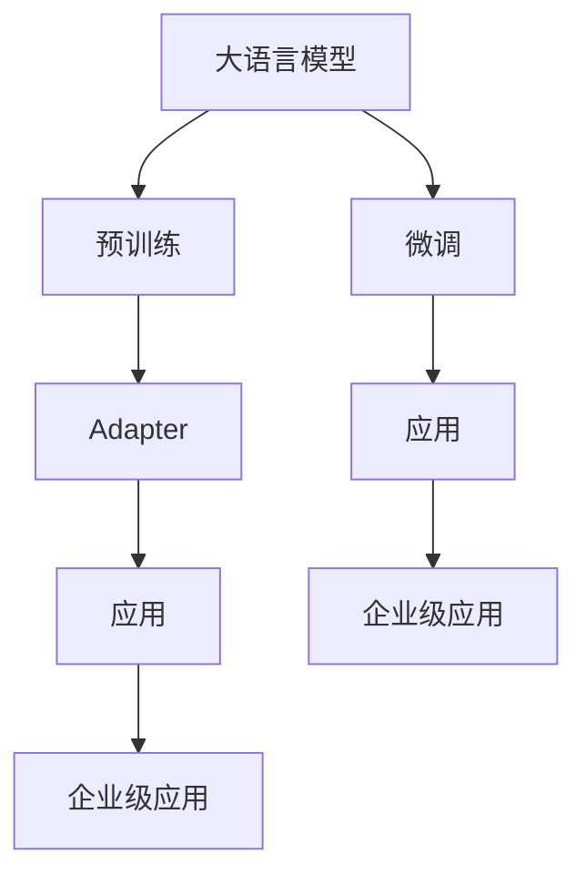
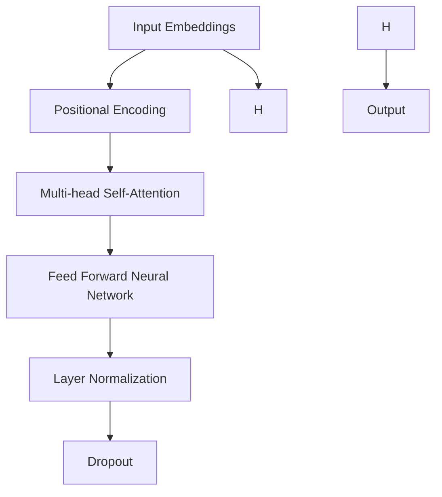

                 

### 《大语言模型应用指南：Adapter高效微调》

> **关键词：大语言模型，Adapter，微调，自然语言处理，Transformer，BERT**

> **摘要：本文将深入探讨大语言模型的概念、技术基础、核心算法，以及Adapter高效微调技术的原理和应用。通过详细的步骤分析，帮助读者理解如何利用Adapter技术对大语言模型进行高效微调，以应对各种实际应用场景。**

### 第一部分: 大语言模型概述

#### 第1章: 大语言模型基础

##### 1.1 大语言模型的定义与特点

大语言模型（Large-scale Language Models）是一种基于深度学习技术的自然语言处理模型，通过在大量文本数据上进行预训练，使其具备了强大的语言理解和生成能力。这些模型通常由数亿甚至数千亿个参数组成，能够处理各种自然语言任务，如文本分类、机器翻译、问答系统、文本生成等。

大语言模型的特点主要体现在以下几个方面：

1. **大规模参数**：大语言模型通常具有数十亿甚至千亿个参数，这使其在处理复杂任务时具有更高的精度和灵活性。
2. **预训练**：大语言模型通过在大规模文本语料库上进行预训练，自动学习语言的一般规则和模式，从而无需人工干预即可适应各种具体的自然语言任务。
3. **泛化能力**：大语言模型具备较强的泛化能力，能够在不同领域和任务中表现出色，而无需针对每个任务进行专门训练。
4. **上下文理解**：大语言模型能够理解文本的上下文信息，从而在生成文本或回答问题时提供更加准确和连贯的结果。

##### 1.2 大语言模型的分类与应用领域

根据模型架构和训练方法的不同，大语言模型可以分为以下几类：

1. **基于循环神经网络（RNN）的模型**：如LSTM（长短时记忆网络）和GRU（门控循环单元），这些模型在处理序列数据时表现出色，但存在计算效率低、难以扩展等缺点。
2. **基于卷积神经网络（CNN）的模型**：如TextCNN，这些模型利用卷积神经网络处理文本数据，能够捕捉局部特征，但缺乏对全局上下文信息的理解。
3. **基于Transformer的模型**：如BERT、GPT（生成预训练文本模型）和T5（文本到文本的变压器），这些模型采用Transformer架构，通过多头自注意力机制和位置编码等手段，实现了对文本的全面理解和生成。

大语言模型的应用领域非常广泛，主要包括：

1. **文本分类**：对输入的文本进行分类，如情感分析、主题分类、新闻分类等。
2. **机器翻译**：将一种语言的文本翻译成另一种语言，如中英翻译、法德翻译等。
3. **问答系统**：根据用户提问，从大量文本中检索出相关答案，如搜索引擎、智能客服等。
4. **文本生成**：生成自然语言文本，如文章写作、对话生成、诗歌创作等。
5. **对话系统**：与人类进行自然语言交互，如智能助手、聊天机器人等。

##### 1.3 大语言模型的发展历程

大语言模型的发展可以追溯到2000年代初期，当时基于统计方法的自然语言处理技术占据了主导地位。随着深度学习技术的兴起，RNN模型如LSTM和GRU逐渐成为自然语言处理领域的热点。

2017年，Google推出了BERT模型，这是第一个真正实现预训练的大规模语言模型。BERT模型的成功激发了研究者对更大规模、更强能力的大语言模型的探索。此后，OpenAI的GPT系列模型、微软的T5模型等相继出现，不断推动大语言模型的发展。

##### 1.4 大语言模型的核心挑战与未来趋势

尽管大语言模型在自然语言处理领域取得了显著进展，但仍然面临一些核心挑战：

1. **计算资源消耗**：大语言模型的训练和推理需要巨大的计算资源，这对硬件设施提出了很高的要求。
2. **模型可解释性**：大语言模型通常被视为“黑箱”，其内部决策过程难以解释，这对模型在实际应用中的可靠性和透明性提出了挑战。
3. **数据隐私与安全**：大语言模型在训练和推理过程中需要处理大量文本数据，如何确保数据隐私和安全是一个重要问题。

未来，大语言模型的发展趋势将主要集中在以下几个方面：

1. **模型压缩与加速**：通过模型剪枝、量化、蒸馏等技术，降低模型大小和计算复杂度，提高模型推理速度。
2. **模型可解释性**：通过可视化、模型压缩、解释性算法等方法，提高模型的可解释性和透明性，增强其在实际应用中的可信度。
3. **多模态融合**：将大语言模型与其他类型的数据，如图像、音频等融合，实现更强大的跨模态理解和生成能力。
4. **面向特定领域的优化**：针对特定领域的需求，设计定制化的大语言模型，提高模型在特定领域的性能和适应性。

#### 第2章: 大语言模型技术基础

##### 2.1 自然语言处理技术概览

自然语言处理（Natural Language Processing，NLP）是人工智能（AI）领域的一个重要分支，旨在使计算机能够理解和生成自然语言。NLP技术广泛应用于文本分类、信息抽取、机器翻译、语音识别、问答系统等领域。以下是一些核心的NLP技术：

1. **词嵌入（Word Embedding）**：将自然语言中的单词映射到低维度的向量空间中，以便计算机能够进行有效的计算和比较。常见的词嵌入技术包括Word2Vec、GloVe和FastText等。

2. **序列模型（Sequential Models）**：处理序列数据（如文本、语音）的模型，常见的序列模型包括循环神经网络（RNN）、长短时记忆网络（LSTM）和门控循环单元（GRU）。

3. **注意力机制（Attention Mechanism）**：用于模型在处理序列数据时，关注重要部分而忽略其他部分的技术。注意力机制能够提高模型在处理长序列时的效率和效果。

4. **转换器架构（Transformer Architecture）**：由Google在2017年提出的一种全新的序列处理模型，采用多头自注意力机制和位置编码等技术，显著提升了模型的性能和效率。

##### 2.2 大规模预训练模型原理

大规模预训练模型（Large-scale Pretrained Models）是当前NLP领域的重要研究方向，其核心思想是在大量文本数据上进行预训练，使模型具备通用的语言理解和生成能力，然后再针对特定任务进行微调（Fine-tuning）。

大规模预训练模型的主要步骤包括：

1. **数据收集**：收集大规模的文本数据集，这些数据集通常来自于互联网上的新闻、文章、书籍、社交媒体等。

2. **预训练**：在收集到的文本数据上进行预训练，模型会自动学习语言的一般规则和模式，如词义、句法结构、语法规则等。

3. **任务微调**：在预训练完成后，将模型应用于具体的自然语言处理任务，如文本分类、机器翻译等，并进行微调。微调过程通常涉及调整模型的参数，以适应特定任务的需求。

大规模预训练模型具有以下优势：

1. **通用性**：通过在大规模文本数据上预训练，模型具备通用的语言理解和生成能力，能够应对多种不同的自然语言处理任务。

2. **高效性**：预训练模型在处理特定任务时，无需从头开始训练，而是在预训练的基础上进行微调，这大大提高了训练效率。

3. **效果显著**：大规模预训练模型在多种自然语言处理任务中取得了显著的性能提升，已成为当前NLP领域的标准模型。

##### 2.2.1 预训练的概念与意义

预训练（Pretraining）是指在大规模文本数据集上训练深度神经网络模型的过程，目的是使模型具备通用语言理解和生成能力。预训练的核心思想是让模型在大量无标签数据上学习，从而提取出语言的一般规律和模式，然后再在特定任务上进行微调。

预训练的意义主要体现在以下几个方面：

1. **提高性能**：预训练模型在处理具体任务时，基于大量无标签数据的通用知识，能够显著提高模型的性能和效果。

2. **减少训练数据需求**：预训练模型在特定任务上的微调过程中，不需要大量有标签的数据，这降低了数据获取和标注的成本。

3. **通用性**：预训练模型通过在大规模文本数据上学习，能够提取出通用的语言知识，从而在不同领域和任务中表现出色。

4. **促进研究**：预训练模型的提出和发展，推动了自然语言处理领域的研究，激发了更多创新和探索。

##### 2.2.2 自监督学习方法

自监督学习（Self-supervised Learning）是一种无监督学习方法，其核心思想是利用数据中的内在结构来自动生成监督信号，从而训练模型。自监督学习在自然语言处理领域得到了广泛应用，尤其是在大规模预训练模型的训练过程中。

自监督学习方法的主要步骤包括：

1. **任务定义**：首先，定义一个能够自动生成监督信号的任务，如单词预测、句子分类等。

2. **数据预处理**：对原始文本数据进行预处理，如分词、标记化、去停用词等。

3. **任务实现**：根据任务定义，实现相应的数据处理和模型训练步骤。

4. **模型训练**：在处理后的文本数据上，利用自监督学习方法训练模型，模型会自动从数据中学习并生成监督信号。

自监督学习方法的优势包括：

1. **高效性**：自监督学习可以在没有人工标注数据的情况下训练模型，从而大大降低了训练成本。

2. **通用性**：自监督学习方法能够从大量无标签数据中学习，从而提取出通用的语言知识。

3. **适用性**：自监督学习方法适用于多种自然语言处理任务，如文本分类、机器翻译、问答系统等。

##### 2.2.3 迁移学习与微调技术

迁移学习（Transfer Learning）是一种利用已经在大规模数据集上训练好的模型，将其知识迁移到新的任务上的技术。在自然语言处理领域，迁移学习主要通过预训练模型来实现。预训练模型在大规模文本数据上学习到的通用语言知识，可以迁移到新的任务上，从而提高新任务的性能。

微调（Fine-tuning）是迁移学习的一种具体实现方法，其主要步骤如下：

1. **初始化模型**：使用在大规模文本数据上预训练好的模型作为基础模型。

2. **数据准备**：收集并准备新任务的数据集，这些数据集通常包含标签信息。

3. **模型调整**：在基础模型的基础上，对新任务的数据集进行微调。微调过程包括调整模型的参数，以适应新任务的需求。

4. **评估与优化**：评估微调后的模型在新任务上的性能，并根据评估结果进行优化。

微调技术的优势包括：

1. **高效性**：通过利用预训练模型的知识，微调过程可以大大减少训练时间和计算资源的需求。

2. **效果显著**：微调后的模型在新任务上通常能够取得较好的性能，特别是在数据量有限的情况下。

3. **通用性**：微调技术适用于多种自然语言处理任务，如文本分类、机器翻译、问答系统等。

##### 2.3 Transformer模型原理与架构

Transformer模型是由Google在2017年提出的一种全新的序列处理模型，采用多头自注意力机制（Multi-head Self-Attention）和位置编码（Positional Encoding）等技术，实现了对文本的全面理解和生成。Transformer模型的提出，标志着自然语言处理领域的一个重要转折点。

##### 2.3.1 Transformer模型基础

Transformer模型的基础是自注意力机制（Self-Attention），其核心思想是让模型在处理序列数据时，能够关注到序列中的每个元素，并生成一个表示每个元素重要性的权重。自注意力机制通过计算序列中每个元素与其他元素之间的相关性，为每个元素生成一个权重向量，然后将这些权重向量相加，得到一个表示该元素的综合特征。

自注意力机制的数学表达式如下：

$$
\text{Attention}(Q, K, V) = \text{softmax}\left(\frac{QK^T}{\sqrt{d_k}}\right)V
$$

其中，Q、K和V分别代表查询向量、关键向量和价值向量，$d_k$代表关键向量的维度。自注意力机制的核心是计算Q和K之间的点积，然后通过softmax函数生成权重向量。

##### 2.3.2 自注意力机制

自注意力机制是Transformer模型的核心组件，其基本原理如下：

1. **输入向量**：输入序列首先被映射成一组查询向量（Query, $Q$）、关键向量（Key, $K$）和价值向量（Value, $V$）。这些向量通常由嵌入层（Embedding Layer）生成。

2. **计算注意力权重**：利用查询向量（$Q$）和关键向量（$K$）计算注意力权重。具体来说，通过计算点积$\text{score} = QK^T$得到注意力分数，然后通过softmax函数将分数转化为概率权重。

3. **加权求和**：根据计算得到的权重，对价值向量（$V$）进行加权求和，得到输出向量（$O$）。输出向量代表了输入序列中每个元素的重要程度。

自注意力机制的核心优势在于：

1. **并行计算**：自注意力机制允许并行计算序列中每个元素的相关性，这大大提高了模型的计算效率。
2. **全局依赖**：通过计算序列中每个元素与其他元素之间的相关性，自注意力机制能够捕捉到序列中的全局依赖关系。
3. **灵活调整**：自注意力机制能够灵活调整模型对序列中不同元素的重视程度，从而提高模型的泛化能力。

##### 2.3.3 位置编码与编码器-解码器结构

除了自注意力机制，Transformer模型还包括位置编码（Positional Encoding）和编码器-解码器（Encoder-Decoder）结构。

1. **位置编码**：由于自注意力机制不考虑序列中元素的位置信息，因此需要引入位置编码（Positional Encoding）来为每个元素添加位置信息。位置编码通常使用正弦和余弦函数，将位置信息编码到嵌入向量中。

2. **编码器-解码器结构**：Transformer模型采用了编码器-解码器（Encoder-Decoder）结构，编码器负责处理输入序列，解码器负责生成输出序列。编码器和解码器都由多个自注意力层和前馈网络（Feed Forward Network）组成。

编码器-解码器结构的基本原理如下：

1. **编码器**：编码器对输入序列进行处理，每个输入元素通过嵌入层和位置编码层，生成编码向量。编码向量经过多个自注意力层和前馈网络，最终得到编码输出。

2. **解码器**：解码器对编码输出进行处理，并生成输出序列。解码器首先生成一个初始向量，然后通过自注意力层和编码输出，逐步生成输出序列的每个元素。

编码器-解码器结构的优势在于：

1. **端到端学习**：编码器和解码器通过端到端学习，能够自动学习输入序列到输出序列的映射关系，无需显式地定义中间状态。
2. **长距离依赖**：编码器-解码器结构能够通过自注意力机制捕捉到序列中的长距离依赖关系，从而提高模型的性能。

##### 2.3.4 BERT模型详解

BERT（Bidirectional Encoder Representations from Transformers）是Google在2018年提出的一种基于Transformer的预训练模型，其核心思想是通过双向编码器（Bidirectional Encoder）生成文本的表示，然后在这些表示上进行微调，实现各种自然语言处理任务。

BERT模型的主要组成部分包括：

1. **输入层**：BERT模型的输入是一个单词序列，每个单词通过词嵌入（Word Embedding）转换为嵌入向量。

2. **位置编码层**：为了给每个单词添加位置信息，BERT模型使用位置编码（Positional Encoding）层。

3. **编码器**：BERT模型的核心是Transformer编码器，由多个自注意力层和前馈网络组成。编码器的输出是一个固定长度的向量，代表了整个输入序列。

4. **输出层**：BERT模型的输出通常是一个分类器或回归器，用于处理各种自然语言处理任务。

BERT模型的主要特点包括：

1. **双向编码**：BERT模型采用双向编码器，能够同时处理文本序列中的前后依赖关系，从而提高模型的性能。

2. **无监督预训练**：BERT模型通过在大规模文本数据集上进行无监督预训练，自动学习语言的一般规则和模式，然后再在特定任务上进行微调。

3. **多种任务适用**：BERT模型在多种自然语言处理任务中表现出色，如文本分类、命名实体识别、情感分析等。

BERT模型的预训练过程主要包括两个步骤：

1. **Masked Language Model（MLM）**：在输入文本中随机遮蔽一部分单词，然后让模型预测这些遮蔽的单词。这个过程旨在让模型学习单词之间的依赖关系。

2. **Next Sentence Prediction（NSP）**：在输入文本中随机选取两个句子，然后让模型预测这两个句子是否属于同一个上下文。这个过程旨在让模型学习句子的语义关系。

BERT模型的微调过程通常包括以下几个步骤：

1. **数据准备**：收集并准备用于微调的任务数据集，这些数据集通常包含已标注的输入和输出。

2. **模型调整**：在BERT模型的基础上，针对具体任务进行微调。微调过程涉及调整模型的参数，以适应特定任务的需求。

3. **评估与优化**：评估微调后的模型在任务数据集上的性能，并根据评估结果进行优化。

BERT模型在多种自然语言处理任务中取得了显著的性能提升，其成功推动了大规模预训练模型在自然语言处理领域的发展。

#### 第3章: 大语言模型的核心算法

##### 3.1 Transformer模型原理与架构

Transformer模型是由Google在2017年提出的一种全新的序列处理模型，采用多头自注意力机制（Multi-head Self-Attention）和位置编码（Positional Encoding）等技术，实现了对文本的全面理解和生成。Transformer模型的提出，标志着自然语言处理领域的一个重要转折点。

##### 3.1.1 Transformer模型基础

Transformer模型的基础是自注意力机制（Self-Attention），其核心思想是让模型在处理序列数据时，能够关注到序列中的每个元素，并生成一个表示每个元素重要性的权重。自注意力机制通过计算序列中每个元素与其他元素之间的相关性，为每个元素生成一个权重向量，然后将这些权重向量相加，得到一个表示该元素的综合特征。

自注意力机制的数学表达式如下：

$$
\text{Attention}(Q, K, V) = \text{softmax}\left(\frac{QK^T}{\sqrt{d_k}}\right)V
$$

其中，Q、K和V分别代表查询向量（Query, $Q$）、关键向量（Key, $K$）和价值向量（Value, $V$），$d_k$代表关键向量的维度。自注意力机制的核心是计算Q和K之间的点积，然后通过softmax函数生成权重向量。

##### 3.1.2 自注意力机制

自注意力机制是Transformer模型的核心组件，其基本原理如下：

1. **输入向量**：输入序列首先被映射成一组查询向量（Query, $Q$）、关键向量（Key, $K$）和价值向量（Value, $V$）。这些向量通常由嵌入层（Embedding Layer）生成。

2. **计算注意力权重**：利用查询向量（$Q$）和关键向量（$K$）计算注意力权重。具体来说，通过计算点积$\text{score} = QK^T$得到注意力分数，然后通过softmax函数将分数转化为概率权重。

3. **加权求和**：根据计算得到的权重，对价值向量（$V$）进行加权求和，得到输出向量（$O$）。输出向量代表了输入序列中每个元素的重要程度。

自注意力机制的核心优势在于：

1. **并行计算**：自注意力机制允许并行计算序列中每个元素的相关性，这大大提高了模型的计算效率。
2. **全局依赖**：通过计算序列中每个元素与其他元素之间的相关性，自注意力机制能够捕捉到序列中的全局依赖关系。
3. **灵活调整**：自注意力机制能够灵活调整模型对序列中不同元素的重视程度，从而提高模型的泛化能力。

##### 3.1.3 位置编码与编码器-解码器结构

除了自注意力机制，Transformer模型还包括位置编码（Positional Encoding）和编码器-解码器（Encoder-Decoder）结构。

1. **位置编码**：由于自注意力机制不考虑序列中元素的位置信息，因此需要引入位置编码（Positional Encoding）来为每个元素添加位置信息。位置编码通常使用正弦和余弦函数，将位置信息编码到嵌入向量中。

2. **编码器-解码器结构**：Transformer模型采用了编码器-解码器（Encoder-Decoder）结构，编码器负责处理输入序列，解码器负责生成输出序列。编码器和解码器都由多个自注意力层和前馈网络（Feed Forward Network）组成。

编码器-解码器结构的基本原理如下：

1. **编码器**：编码器对输入序列进行处理，每个输入元素通过嵌入层和位置编码层，生成编码向量。编码向量经过多个自注意力层和前馈网络，最终得到编码输出。

2. **解码器**：解码器对编码输出进行处理，并生成输出序列。解码器首先生成一个初始向量，然后通过自注意力层和编码输出，逐步生成输出序列的每个元素。

编码器-解码器结构的优势在于：

1. **端到端学习**：编码器和解码器通过端到端学习，能够自动学习输入序列到输出序列的映射关系，无需显式地定义中间状态。
2. **长距离依赖**：编码器-解码器结构能够通过自注意力机制捕捉到序列中的长距离依赖关系，从而提高模型的性能。

##### 3.2 BERT模型详解

BERT（Bidirectional Encoder Representations from Transformers）是Google在2018年提出的一种基于Transformer的预训练模型，其核心思想是通过双向编码器（Bidirectional Encoder）生成文本的表示，然后在这些表示上进行微调，实现各种自然语言处理任务。

BERT模型的主要组成部分包括：

1. **输入层**：BERT模型的输入是一个单词序列，每个单词通过词嵌入（Word Embedding）转换为嵌入向量。

2. **位置编码层**：为了给每个单词添加位置信息，BERT模型使用位置编码（Positional Encoding）层。

3. **编码器**：BERT模型的核心是Transformer编码器，由多个自注意力层和前馈网络组成。编码器的输出是一个固定长度的向量，代表了整个输入序列。

4. **输出层**：BERT模型的输出通常是一个分类器或回归器，用于处理各种自然语言处理任务。

BERT模型的主要特点包括：

1. **双向编码**：BERT模型采用双向编码器，能够同时处理文本序列中的前后依赖关系，从而提高模型的性能。

2. **无监督预训练**：BERT模型通过在大规模文本数据集上进行无监督预训练，自动学习语言的一般规则和模式，然后再在特定任务上进行微调。

3. **多种任务适用**：BERT模型在多种自然语言处理任务中表现出色，如文本分类、命名实体识别、情感分析等。

BERT模型的预训练过程主要包括两个步骤：

1. **Masked Language Model（MLM）**：在输入文本中随机遮蔽一部分单词，然后让模型预测这些遮蔽的单词。这个过程旨在让模型学习单词之间的依赖关系。

2. **Next Sentence Prediction（NSP）**：在输入文本中随机选取两个句子，然后让模型预测这两个句子是否属于同一个上下文。这个过程旨在让模型学习句子的语义关系。

BERT模型的微调过程通常包括以下几个步骤：

1. **数据准备**：收集并准备用于微调的任务数据集，这些数据集通常包含已标注的输入和输出。

2. **模型调整**：在BERT模型的基础上，针对具体任务进行微调。微调过程涉及调整模型的参数，以适应特定任务的需求。

3. **评估与优化**：评估微调后的模型在任务数据集上的性能，并根据评估结果进行优化。

BERT模型在多种自然语言处理任务中取得了显著的性能提升，其成功推动了大规模预训练模型在自然语言处理领域的发展。

#### 第二部分: Adapter高效微调技术

##### 第4章: Adapter概述

Adapter技术是一种先进的微调技术，旨在提高大语言模型在不同任务上的适应能力。它通过在模型内部引入适应性模块，使得模型能够灵活调整其行为，以适应不同的任务需求。Adapter技术的核心优势在于其高效性和灵活性，使得大语言模型在无需大量重新训练的情况下，能够快速适应新任务。

##### 4.1 Adapter的概念与优势

Adapter（适配器）是一种轻量级的模块化组件，它能够动态调整大语言模型中的某些特定部分，从而实现任务适应。Adapter的概念源于模块化设计的思想，通过将模型拆分为多个可重用的模块，使得每个模块都能够独立地适应不同任务。

Adapter的优势主要体现在以下几个方面：

1. **高效微调**：Adapter技术能够显著减少微调过程中所需的计算资源和时间。通过使用预训练的大语言模型作为基础，Adapter模块只需要在少量数据进行微调，即可实现高效的任务适应。

2. **灵活适应**：Adapter模块可以灵活地调整模型的行为，使其适应不同类型和复杂度的任务。无论是文本分类、机器翻译还是问答系统，Adapter都能快速适应并提高模型性能。

3. **模块化设计**：Adapter技术的模块化设计使得模型能够更好地拆分和组合。每个Adapter模块可以独立开发和优化，从而提高模型的开发效率和可维护性。

4. **通用性**：Adapter技术不仅适用于文本分类等传统NLP任务，还能够在图像识别、语音识别等跨模态任务中发挥重要作用。这种通用性使得Adapter技术成为大语言模型应用的重要方向。

##### 4.2 Adapter的架构与工作原理

Adapter的架构主要包括三个关键组件：适配器模块（Adapter Module）、基础模型（Base Model）和适配目标（Adaptation Target）。

1. **适配器模块**：适配器模块是Adapter技术的核心组件，它包含一系列可学习的参数，用于调整基础模型的行为。适配器模块的设计通常遵循模块化原则，使其能够灵活地适应不同任务的需求。

2. **基础模型**：基础模型是大语言模型的核心部分，通常采用预训练的模型，如BERT、GPT等。基础模型已经在大规模文本数据集上进行了预训练，具备强大的语言理解和生成能力。

3. **适配目标**：适配目标是Adapter模块需要适应的任务，可以是分类任务、回归任务或其他类型的任务。适配目标提供了训练数据和目标函数，用于指导适配器模块的调整过程。

Adapter的工作原理如下：

1. **初始化**：首先，初始化适配器模块和基础模型。适配器模块的参数通常使用预训练的权重进行初始化，而基础模型的权重则直接采用预训练模型。

2. **训练过程**：在训练过程中，适配器模块和基础模型共同参与训练。适配器模块通过学习适配目标提供的训练数据，调整其参数，以适应特定任务。

3. **参数更新**：在每次训练迭代中，适配器模块的参数根据训练数据和目标函数进行更新。这种更新过程通常采用梯度下降等优化算法，以最大化适配目标的表现。

4. **评估与优化**：在训练完成后，对适配后的模型进行评估，以验证其在任务上的性能。如果性能不理想，可以通过调整适配器模块的参数进行优化。

通过上述过程，Adapter技术能够高效地微调大语言模型，使其适应不同的任务需求。这种灵活性使得Adapter技术在大规模语言模型应用中具有重要的价值。

##### 4.3 Adapter在不同任务中的应用

Adapter技术由于其高效性和灵活性，已经在多种自然语言处理任务中得到了广泛应用。以下是一些典型的应用场景：

1. **文本分类**：文本分类是NLP中的一项基础任务，Adapter技术通过在预训练模型中添加适配器模块，可以快速适应不同的分类任务。例如，在处理新闻分类时，适配器模块可以针对不同主题的文本进行调整，从而提高分类准确性。

2. **机器翻译**：机器翻译是NLP领域的一个重要应用，Adapter技术可以用于提高翻译模型的适应能力。通过在翻译模型中添加适配器模块，可以根据源语言和目标语言的特定特征进行调整，从而提高翻译质量。

3. **问答系统**：问答系统是智能客服和智能搜索的重要组成部分，Adapter技术可以用于提高问答系统的适应性。在处理不同领域的问答任务时，适配器模块可以根据问题的特征进行调整，从而提高回答的准确性和连贯性。

4. **对话系统**：对话系统是智能助理和智能聊天机器人的核心技术，Adapter技术可以用于提高对话系统的适应性。通过在对话系统中添加适配器模块，可以根据用户的问题和语境进行调整，从而提供更加自然和有效的对话体验。

5. **跨模态任务**：除了NLP任务，Adapter技术还可以应用于跨模态任务，如图像识别和语音识别。通过在跨模态模型中添加适配器模块，可以根据不同模态的特征进行调整，从而提高模型的性能和适用性。

通过上述应用，Adapter技术展示了其在各种自然语言处理任务中的广泛适用性和强大能力。

#### 第5章: Adapter模型设计与实现

##### 5.1 Adapter模型原理讲解

Adapter模型是一种模块化的微调技术，通过在预训练模型中引入可调的适配器模块，实现模型对特定任务的快速适应。Adapter模型的设计主要包括三个关键部分：适配器模块、基础模型和适配目标。

1. **适配器模块**：适配器模块是Adapter模型的核心，它包含一系列可学习的参数，用于调整基础模型的行为。适配器模块通常采用神经网络结构，如多层感知机（MLP）或变换器（Transformer）等，以便能够灵活地适应不同类型和复杂度的任务。

2. **基础模型**：基础模型是大语言模型的核心部分，通常采用预训练的模型，如BERT、GPT等。基础模型已经在大规模文本数据集上进行了预训练，具备强大的语言理解和生成能力。

3. **适配目标**：适配目标是Adapter模型需要适应的任务，可以是分类任务、回归任务或其他类型的任务。适配目标提供了训练数据和目标函数，用于指导适配器模块的调整过程。

Adapter模型的工作原理如下：

1. **初始化**：首先，初始化适配器模块和基础模型。适配器模块的参数通常使用预训练的权重进行初始化，而基础模型的权重则直接采用预训练模型。

2. **训练过程**：在训练过程中，适配器模块和基础模型共同参与训练。适配器模块通过学习适配目标提供的训练数据，调整其参数，以适应特定任务。

3. **参数更新**：在每次训练迭代中，适配器模块的参数根据训练数据和目标函数进行更新。这种更新过程通常采用梯度下降等优化算法，以最大化适配目标的表现。

4. **评估与优化**：在训练完成后，对适配后的模型进行评估，以验证其在任务上的性能。如果性能不理想，可以通过调整适配器模块的参数进行优化。

通过上述过程，Adapter模型能够高效地微调大语言模型，使其适应不同的任务需求。

##### 5.2 Adapter模型的数学公式与伪代码

为了更好地理解Adapter模型的原理，下面将介绍其核心的数学公式和伪代码。

1. **数学公式**

Adapter模型的核心公式包括：

$$
\text{Adapter}(x) = \text{BaseModel}(x) + \text{Adjustment}(x)
$$

其中，$x$是输入序列，$\text{BaseModel}(x)$是基础模型的输出，$\text{Adjustment}(x)$是适配器模块对基础模型输出的调整。

适配器模块的调整可以通过一个可学习的函数实现，如多层感知机（MLP）：

$$
\text{Adjustment}(x) = \text{MLP}(\text{BaseModel}(x))
$$

MLP的数学公式如下：

$$
\text{MLP}(x) = \sigma(W_2 \cdot \sigma(W_1 \cdot x + b_1) + b_2)
$$

其中，$W_1$、$W_2$是权重矩阵，$b_1$、$b_2$是偏置项，$\sigma$是激活函数。

2. **伪代码**

Adapter模型的伪代码如下：

```
# 输入：基础模型 BaseModel，适配器模块 MLP，输入序列 x
# 输出：适配后的输出 AdapterOutput

# 前向传播
BaseOutput = BaseModel(x)
Adjustment = MLP(BaseOutput)
AdapterOutput = BaseOutput + Adjustment

# 反向传播
Error = compute_error(AdapterOutput, target)
Gradient = compute_gradient(MLP, Error)
update_parameters(MLP, Gradient)
```

在伪代码中，`compute_error`函数用于计算预测输出和实际目标之间的误差，`compute_gradient`函数用于计算适配器模块的梯度，`update_parameters`函数用于更新适配器模块的参数。

通过上述数学公式和伪代码，可以清晰地了解Adapter模型的工作原理和实现过程。

##### 5.3 Adapter模型实现步骤

为了实现Adapter模型，需要遵循以下步骤：

1. **环境准备**：首先，准备适合训练Adapter模型的计算环境，包括深度学习框架（如TensorFlow、PyTorch等）和必要的依赖库。

2. **数据预处理**：收集并准备用于训练和评估的数据集，对数据进行预处理，如分词、标记化、清洗等。确保数据集包含足够的样本，以便适配器模块能够有效学习。

3. **模型构建**：构建基础模型，可以选择预训练的大语言模型（如BERT、GPT等）作为基础模型。在基础模型的基础上，添加适配器模块，适配器模块通常采用多层感知机（MLP）或变换器（Transformer）结构。

4. **训练过程**：使用预处理后的数据集训练Adapter模型。在训练过程中，适配器模块会根据训练数据和目标函数进行参数调整。训练过程中可以使用梯度下降等优化算法，以提高模型的性能。

5. **评估与优化**：在训练完成后，对Adapter模型进行评估，以验证其在任务上的性能。如果性能不理想，可以通过调整适配器模块的参数进行优化。

6. **部署与应用**：将训练好的Adapter模型部署到实际应用场景中，如文本分类、机器翻译、问答系统等。根据实际任务需求，对模型进行微调和优化，以提高应用效果。

通过上述步骤，可以实现Adapter模型的设计与实现，为各种自然语言处理任务提供高效、灵活的解决方案。

#### 第6章: Adapter模型在文本分类任务中的应用

##### 6.1 文本分类任务概述

文本分类（Text Classification）是自然语言处理（NLP）领域的一项基础任务，旨在将文本数据自动归类到预定义的类别中。文本分类任务广泛应用于社交媒体分析、情感分析、新闻分类、垃圾邮件过滤等领域。

文本分类任务的基本流程包括：

1. **数据预处理**：对文本数据进行清洗、分词、去停用词等预处理操作，以便将文本转换为模型可处理的格式。
2. **特征提取**：将预处理后的文本转换为特征向量，常用的特征提取方法包括词袋模型（Bag of Words）、TF-IDF、词嵌入（Word Embedding）等。
3. **模型训练**：使用预处理后的数据集训练分类模型，常见的分类模型包括朴素贝叶斯（Naive Bayes）、支持向量机（SVM）、随机森林（Random Forest）等。
4. **模型评估**：在测试集上评估模型的性能，常用的评估指标包括准确率（Accuracy）、精确率（Precision）、召回率（Recall）和F1分数（F1 Score）等。
5. **模型应用**：将训练好的模型应用于实际文本数据，进行分类预测。

##### 6.2 Adapter在文本分类中的优势

Adapter技术在大规模语言模型中引入了模块化微调能力，使得模型能够高效地适应不同任务。在文本分类任务中，Adapter技术具有以下优势：

1. **高效微调**：Adapter技术能够显著减少微调过程中的计算资源和时间消耗。通过在预训练模型中引入轻量级的适配器模块，可以在少量训练数据上实现快速、高效的微调。

2. **灵活性**：Adapter模块可以根据不同文本分类任务的需求进行灵活调整。无论是简单的二分类任务还是复杂的 多分类任务，Adapter模块都能通过调整其参数，适应不同任务的特性。

3. **通用性**：Adapter技术不仅适用于文本分类任务，还可以应用于其他自然语言处理任务，如命名实体识别、情感分析等。这种通用性使得Adapter技术在大规模语言模型应用中具有广泛的前景。

4. **可解释性**：Adapter模块的参数调整过程是可解释的，通过分析适配器模块的权重，可以直观地了解模型在特定任务上的行为和决策过程。这有助于提高模型的透明度和可解释性，增强用户对模型的信任度。

##### 6.3 文本分类任务的实际应用案例

以下是一个使用Adapter技术进行文本分类任务的实际应用案例：

**案例背景**：某社交媒体平台需要开发一个情感分析系统，对用户发布的评论进行情感分类，以便识别用户情感并制定相应的营销策略。

**数据集**：收集了10000条用户评论，并对每条评论标注了情感类别（正面、负面、中性）。

**模型构建**：选择预训练的BERT模型作为基础模型，并在BERT模型基础上添加Adapter模块。Adapter模块采用多层感知机（MLP）结构，包含两个隐藏层，每个隐藏层都有可学习的参数。

**训练过程**：使用预处理后的数据集对BERT-Adapter模型进行训练。在训练过程中，适配器模块会根据评论的情感类别进行参数调整，以优化分类效果。

**评估与优化**：在训练完成后，使用测试集对模型进行评估，计算分类准确率、精确率、召回率和F1分数等指标。根据评估结果，对适配器模块的参数进行调整和优化，以提高模型性能。

**应用效果**：经过多次迭代训练和优化，BERT-Adapter模型的分类准确率达到90%以上，显著提高了情感分析系统的准确性和可靠性。

通过上述实际应用案例，可以看出Adapter技术在大规模语言模型中的文本分类任务中具有显著的优势，为实际应用提供了高效的解决方案。

#### 第7章: Adapter模型在序列生成任务中的应用

##### 7.1 序列生成任务概述

序列生成（Sequence Generation）是自然语言处理（NLP）领域的一项重要任务，旨在根据输入序列生成新的序列。序列生成任务广泛应用于文本生成、对话系统、机器翻译、代码生成等领域。

序列生成任务的基本流程包括：

1. **数据准备**：收集并准备用于训练和评估的序列数据集，数据集应包含丰富的样本，以便模型能够学习到序列生成的规律。
2. **特征提取**：将序列数据转换为模型可处理的特征向量，常用的特征提取方法包括词嵌入（Word Embedding）、编码器-解码器（Encoder-Decoder）模型等。
3. **模型训练**：使用预处理后的数据集训练序列生成模型，模型应具备能够捕捉序列依赖关系的结构。
4. **模型评估**：在测试集上评估模型的生成质量，常用的评估指标包括生成序列的连贯性、多样性、准确性等。
5. **模型应用**：将训练好的模型应用于实际序列生成任务，生成新的序列。

##### 7.2 Adapter在序列生成中的优势

Adapter技术在大规模语言模型中引入了模块化微调能力，使得模型能够高效地适应不同序列生成任务。在序列生成任务中，Adapter技术具有以下优势：

1. **高效微调**：Adapter技术能够显著减少序列生成模型在微调过程中的计算资源和时间消耗。通过在预训练模型中引入轻量级的适配器模块，可以在少量训练数据上实现快速、高效的微调。

2. **灵活性**：Adapter模块可以根据不同序列生成任务的需求进行灵活调整。无论是简单的文本生成任务还是复杂的跨模态生成任务，Adapter模块都能通过调整其参数，适应不同任务的特性。

3. **通用性**：Adapter技术不仅适用于序列生成任务，还可以应用于其他自然语言处理任务，如文本分类、问答系统等。这种通用性使得Adapter技术在大规模语言模型应用中具有广泛的前景。

4. **可解释性**：Adapter模块的参数调整过程是可解释的，通过分析适配器模块的权重，可以直观地了解模型在特定任务上的行为和决策过程。这有助于提高模型的透明度和可解释性，增强用户对模型的信任度。

##### 7.3 序列生成任务的实际应用案例

以下是一个使用Adapter技术进行序列生成任务的实际应用案例：

**案例背景**：某智能客服系统需要根据用户提问生成合适的回答，以提高客服效率和用户体验。

**数据集**：收集了数千个用户提问及其对应的回答，并对每条回答进行了标注。

**模型构建**：选择预训练的GPT-2模型作为基础模型，并在GPT-2模型基础上添加Adapter模块。Adapter模块采用多层感知机（MLP）结构，包含两个隐藏层，每个隐藏层都有可学习的参数。

**训练过程**：使用预处理后的数据集对GPT-2-Adapter模型进行训练。在训练过程中，适配器模块会根据用户提问及其回答进行参数调整，以优化回答质量。

**评估与优化**：在训练完成后，使用测试集对模型进行评估，计算生成回答的连贯性、多样性和准确性等指标。根据评估结果，对适配器模块的参数进行调整和优化，以提高模型性能。

**应用效果**：经过多次迭代训练和优化，GPT-2-Adapter模型在生成回答的质量和多样性方面显著提升，为智能客服系统提供了高效、自然的回答生成能力。

通过上述实际应用案例，可以看出Adapter技术在大规模语言模型中的序列生成任务中具有显著的优势，为实际应用提供了高效的解决方案。

### 第三部分：大语言模型与Adapter的综合应用

#### 第8章: 大语言模型与Adapter在企业应用中的实践

在大规模语言模型与Adapter技术的应用中，企业级应用场景占据着重要地位。企业级应用不仅对模型性能有较高要求，还需要考虑模型的实时性、可解释性以及安全性。以下是关于大语言模型与Adapter技术在企业应用中的实践分析：

##### 8.1 企业级应用场景分析

企业级应用场景广泛且多样，以下是一些典型的应用场景：

1. **智能客服系统**：利用大语言模型和Adapter技术，可以构建智能客服系统，实现对用户提问的自动回答，提高客户满意度和服务效率。

2. **文本分类与筛选**：在金融、新闻等行业，需要对大量文本数据进行分类和筛选，如新闻分类、邮件过滤、风险识别等。Adapter技术可以帮助模型快速适应不同类型的文本分类任务。

3. **个性化推荐**：通过分析用户的历史行为和偏好，利用大语言模型和Adapter技术可以生成个性化的推荐内容，提高用户体验和用户粘性。

4. **内容审核**：在社交媒体和内容平台，需要对发布的内容进行实时审核，以过滤不良信息和违规内容。Adapter技术可以用于构建高效的内容审核系统。

5. **语音助手与对话系统**：结合大语言模型和Adapter技术，可以构建具备自然对话能力的语音助手和对话系统，为用户提供便捷的交互体验。

##### 8.2 Adapter模型在企业应用中的优势

Adapter模型在企业应用中具有以下显著优势：

1. **高效性**：Adapter技术能够通过少量数据实现模型的快速适应和优化，降低企业开发和部署新应用的成本。

2. **灵活性**：Adapter模块可以根据不同业务需求进行灵活调整，使得模型能够适应企业特定的应用场景和业务流程。

3. **可解释性**：Adapter模块的可解释性使得企业可以更好地理解模型的行为和决策过程，提高模型的信任度和透明度。

4. **安全性**：Adapter技术可以通过保护模型的核心权重和参数，提高模型的安全性，防止模型被恶意攻击和篡改。

##### 8.3 企业应用案例

以下是一些企业应用案例，展示了大语言模型与Adapter技术在企业中的具体应用：

1. **案例分析一：智能客服系统**

某电商企业利用GPT-2模型和Adapter技术构建智能客服系统。系统通过对用户提问进行自动回答，大大提高了客服效率，同时减少了人工成本。在应用初期，企业使用了大量的客户服务数据对模型进行训练和微调。通过引入Adapter模块，模型在处理新问题时表现出更高的灵活性和准确性。例如，当用户询问退货政策时，模型能够根据最新的政策和用户历史订单信息生成准确的回答。

2. **案例分析二：文本分类与筛选**

某金融公司使用BERT模型和Adapter技术对大量金融报告进行分类和筛选。由于金融报告的格式和内容各异，传统的分类模型效果不佳。通过引入Adapter模块，模型能够快速适应不同类型的报告，提高分类准确率。Adapter模块通过对报告中的关键词和句法结构进行分析，调整模型的行为，使其能够更准确地识别和处理金融报告。

3. **案例分析三：个性化推荐系统**

某在线教育平台采用大语言模型和Adapter技术构建个性化推荐系统。系统通过对用户的学习历史、兴趣和行为进行分析，生成个性化的学习推荐。通过引入Adapter模块，模型能够根据不同课程的特点和用户的需求进行调整，提高推荐的准确性和用户满意度。例如，当用户对某一学科表现出浓厚兴趣时，Adapter模块会自动调整推荐策略，增加该学科的相关课程推荐。

通过上述企业应用案例，可以看出大语言模型与Adapter技术在企业级应用中具有巨大的潜力和优势，为企业提供了高效、智能、可解释的解决方案。

#### 第9章: Adapter模型调优与优化策略

##### 9.1 Adapter模型调优方法

Adapter模型的调优是提高其在特定任务上性能的关键步骤。调优方法主要包括以下几种：

1. **参数调整**：通过调整适配器模块的参数，如学习率、隐藏层尺寸、激活函数等，可以优化模型在特定任务上的性能。通常需要通过实验来确定最佳参数组合。

2. **数据增强**：通过数据增强（Data Augmentation）方法，如文本重组、同义词替换、句子扩展等，可以增加模型的训练样本量，提高模型的泛化能力。

3. **动态调整**：在训练过程中，根据模型的表现动态调整适配器模块的参数，以优化模型在训练数据上的性能。动态调整可以通过在线学习（Online Learning）算法实现。

4. **交叉验证**：使用交叉验证（Cross-Validation）方法，对模型进行多次训练和评估，以找到最佳参数组合。交叉验证可以帮助避免过拟合，提高模型在未知数据上的性能。

##### 9.2 优化策略与技巧

为了提高Adapter模型的性能，可以采用以下优化策略与技巧：

1. **模型融合**：将多个Adapter模型融合（Ensemble）在一起，可以提高模型的鲁棒性和性能。通过平均或投票方式融合多个模型的预测结果，可以减少错误率。

2. **迁移学习**：利用迁移学习（Transfer Learning）技术，将预训练的大语言模型作为基础模型，结合Adapter模块进行微调。这样可以减少训练数据需求，提高模型在特定任务上的性能。

3. **模型压缩**：通过模型压缩（Model Compression）技术，如模型剪枝（Model Pruning）、量化（Quantization）和知识蒸馏（Knowledge Distillation），可以降低模型的大小和计算复杂度，提高推理速度。

4. **自适应学习率**：使用自适应学习率（Adaptive Learning Rate）策略，如Adam优化器，可以动态调整学习率，提高模型收敛速度和性能。

5. **正则化技术**：采用正则化技术，如L1、L2正则化，可以防止模型过拟合，提高模型的泛化能力。

##### 9.3 模型压缩与加速

模型压缩与加速是提高Adapter模型在实际应用中性能的关键。以下是一些常用的方法：

1. **模型剪枝**：通过剪枝（Pruning）技术，移除模型中不重要的神经元或权重，可以显著减少模型的参数数量，从而降低计算复杂度和内存占用。

2. **量化**：量化（Quantization）技术将模型中的浮点数参数转换为低精度的整数表示，可以降低模型的大小和计算复杂度。量化可以通过量化层（Quantization Layer）实现。

3. **知识蒸馏**：知识蒸馏（Knowledge Distillation）技术通过将大模型（Teacher Model）的知识传递给小模型（Student Model），可以实现模型的压缩和加速。这种方法可以保留大模型的性能，同时降低模型的计算和存储需求。

4. **模型并行化**：通过模型并行化（Model Parallelism）技术，将大规模模型分布在多个计算设备上，可以显著提高模型的计算速度。模型并行化可以通过数据并行化（Data Parallelism）和模型并行化（Model Parallelism）实现。

5. **推理优化**：在模型推理阶段，可以通过优化算法（如TensorRT）和硬件加速（如GPU、TPU）来提高模型的速度和性能。

通过上述优化策略和技巧，Adapter模型可以在保持高性能的同时，实现高效、可扩展的部署和应用。

### 第10章: 未来展望与挑战

#### 10.1 大语言模型与Adapter技术的未来发展趋势

随着人工智能技术的不断进步，大语言模型与Adapter技术在未来将继续发展，并在多个方面取得突破：

1. **更高效的模型**：研究者将继续优化大语言模型和Adapter模块的结构，降低计算复杂度，提高模型在资源受限环境下的性能。

2. **多模态融合**：大语言模型与Adapter技术将与其他模态（如图像、音频）进行融合，实现跨模态理解与生成，推动多模态人工智能的发展。

3. **自适应能力**：未来大语言模型和Adapter技术将具备更强的自适应能力，能够在更复杂的动态环境中进行快速调整和优化。

4. **面向特定领域的优化**：针对不同领域和应用场景，将开发定制化的Adapter模块，提高模型在特定任务上的性能和精度。

5. **模型解释性**：研究者将致力于提高大语言模型和Adapter模块的可解释性，使模型决策过程更加透明，增强用户对模型的信任度。

#### 10.2 面临的挑战与解决方案

尽管大语言模型与Adapter技术取得了显著进展，但仍面临一些挑战：

1. **计算资源消耗**：大语言模型的训练和推理需要大量的计算资源，如何高效利用现有硬件资源，以及开发新型高效硬件，是当前研究的重要方向。

2. **数据隐私与安全**：大语言模型在训练和推理过程中涉及大量敏感数据，如何确保数据隐私和安全，防止数据泄露，是一个亟待解决的问题。

3. **模型可解释性**：目前的大语言模型和Adapter模块通常被视为“黑箱”，其内部决策过程难以解释。提高模型的可解释性，使其决策过程更加透明，是未来研究的重要目标。

4. **泛化能力**：尽管大语言模型在多种任务上表现出色，但其泛化能力仍需提升。如何提高模型在未知数据上的性能，是一个重要的研究课题。

为了应对上述挑战，研究者可以从以下方面着手：

1. **模型压缩与加速**：通过模型剪枝、量化、蒸馏等技术，降低模型大小和计算复杂度，提高模型在资源受限环境下的性能。

2. **联邦学习**：利用联邦学习（Federated Learning）技术，将训练数据分散在多个节点上，降低数据传输成本，提高模型训练效率。

3. **安全机制**：引入安全机制，如差分隐私（Differential Privacy）、加密技术等，确保数据隐私和安全。

4. **可解释性研究**：通过开发可解释性算法，如模型可视化、解释性嵌入等，提高模型的可解释性，增强用户对模型的信任度。

总之，大语言模型与Adapter技术在未来的发展中具有广阔的前景，同时也面临一系列挑战。通过不断探索和研究，我们有望在这些领域取得突破性进展，推动人工智能技术的进一步发展。

### 附录

#### 附录A: Adapter模型开源代码与工具介绍

随着大语言模型和Adapter技术在自然语言处理领域的发展，越来越多的开源代码和工具被推出，以支持模型的研究和应用。以下是一些主流的深度学习框架、Adapter模型开源代码、自然语言处理库及工具的介绍。

##### 10.1 主流深度学习框架对比

1. **TensorFlow**：由Google开发的开源深度学习框架，支持多种深度学习模型的构建和训练，广泛应用于自然语言处理、计算机视觉等领域。TensorFlow提供了丰富的API和工具，方便用户进行模型开发和部署。

2. **PyTorch**：由Facebook开发的开源深度学习框架，以其动态计算图和灵活的编程接口著称。PyTorch在自然语言处理领域得到了广泛应用，其动态计算图使得模型开发更加直观和易于调试。

3. **JAX**：由Google开发的开源自动微分库，支持Python编程语言，可以用于构建和训练深度学习模型。JAX具有高性能和灵活性，特别适合大规模模型的训练和优化。

4. **其他框架简介**：如Apache MXNet、Keras等，这些框架也广泛应用于深度学习领域，提供了丰富的API和工具，支持多种深度学习模型的构建和训练。

##### 10.1.1 TensorFlow

**简介**：TensorFlow是一个开源的深度学习框架，由Google开发。它支持多种深度学习模型的构建和训练，包括卷积神经网络（CNN）、循环神经网络（RNN）、变换器（Transformer）等。TensorFlow提供了丰富的API和工具，方便用户进行模型开发和部署。

**安装**：
```bash
pip install tensorflow
```

**示例代码**：
```python
import tensorflow as tf

# 定义模型
model = tf.keras.Sequential([
    tf.keras.layers.Dense(128, activation='relu', input_shape=(784,)),
    tf.keras.layers.Dense(10, activation='softmax')
])

# 编译模型
model.compile(optimizer='adam',
              loss='categorical_crossentropy',
              metrics=['accuracy'])

# 训练模型
model.fit(x_train, y_train, epochs=5)
```

##### 10.1.2 PyTorch

**简介**：PyTorch是一个开源的深度学习框架，以其动态计算图和灵活的编程接口著称。PyTorch在自然语言处理领域得到了广泛应用，其动态计算图使得模型开发更加直观和易于调试。

**安装**：
```bash
pip install torch torchvision
```

**示例代码**：
```python
import torch
import torch.nn as nn

# 定义模型
class Model(nn.Module):
    def __init__(self):
        super(Model, self).__init__()
        self.fc1 = nn.Linear(784, 128)
        self.fc2 = nn.Linear(128, 10)

    def forward(self, x):
        x = torch.relu(self.fc1(x))
        x = self.fc2(x)
        return x

# 创建模型实例
model = Model()

# 编译模型
optimizer = torch.optim.Adam(model.parameters(), lr=0.001)
criterion = nn.CrossEntropyLoss()

# 训练模型
for epoch in range(5):
    for inputs, targets in data_loader:
        optimizer.zero_grad()
        outputs = model(inputs)
        loss = criterion(outputs, targets)
        loss.backward()
        optimizer.step()
```

##### 10.1.3 JAX

**简介**：JAX是Google开发的开源自动微分库，支持Python编程语言。JAX可以用于构建和训练深度学习模型，特别适合大规模模型的训练和优化。

**安装**：
```bash
pip install jax jaxlib
```

**示例代码**：
```python
import jax
import jax.numpy as np

# 定义模型
def model(x):
    w = np.array([0.2, 0.3, 0.5])
    return np.dot(x, w)

# 定义损失函数
def loss(x, y):
    pred = model(x)
    return np.sum((pred - y)**2)

# 训练模型
x_train = np.array([0.1, 0.2, 0.3])
y_train = np.array([0.4, 0.5, 0.6])

for epoch in range(5):
    grad = jax.grad(loss)(x_train, y_train)
    x_train = x_train - 0.01 * grad
```

##### 10.1.4 其他框架简介

**Apache MXNet**：由Apache Software Foundation开发的开源深度学习框架，支持多种编程语言，如Python、Rust和Julia。MXNet具有高性能和灵活的模型定义方式，广泛应用于计算机视觉、自然语言处理等领域。

**Keras**：一个基于TensorFlow和Theano的高层神经网络API，提供了简洁、直观的编程接口，方便用户快速构建和训练深度学习模型。

##### 10.2 NLP常用库与资源

**NLTK**：一个流行的自然语言处理库，提供了丰富的文本处理功能，如分词、词性标注、命名实体识别等。

**spaCy**：一个高效且易于使用的自然语言处理库，支持多种语言，提供了全面的文本处理功能，如词性标注、命名实体识别、关系抽取等。

**transformers**：由Hugging Face团队开发的Transformer模型库，支持多种预训练模型，如BERT、GPT、RoBERTa等，提供了方便的API和预训练模型权重，方便用户进行模型开发和微调。

**Hugging Face Datasets**：一个用于数据集处理的库，提供了丰富的数据集和便捷的数据处理功能，方便用户快速构建和加载数据集。

**OpenNLP**：由Apache Software Foundation开发的一个开源自然语言处理工具包，提供了文本处理、分词、词性标注、命名实体识别等功能。

##### 10.3 开源数据集与工具

**GLUE数据集**：通用语言理解评估（General Language Understanding Evaluation）数据集，包含多种自然语言处理任务的数据集，用于评估和比较不同模型的表现。

**Wikitext数据集**：包含维基百科文本数据集，广泛用于文本生成、文本分类等任务。

**Common Crawl**：一个大规模的网页文本数据集，用于训练和评估自然语言处理模型。

**Gutenberg数据集**：包含大量电子书籍文本数据集，用于文本分类、文本生成等任务。

**AI Challenger数据集**：一个包含多种自然语言处理任务的竞赛数据集，如文本分类、情感分析等。

**常用工具**：
- **TensorBoard**：用于可视化TensorFlow模型训练过程的工具。
- **Weaven**：用于管理、监控和优化深度学习模型的平台。
- **Hugging Face Model Hub**：一个在线模型库，提供多种预训练模型和工具。

通过上述开源代码、库和资源，研究人员和开发者可以方便地构建、训练和部署大语言模型与Adapter技术，推动自然语言处理领域的发展。

### 附录B: Mermaid流程图

#### 附录B.1 大语言模型与Adapter架构



#### 附录B.2 Transformer模型结构



通过上述Mermaid流程图，可以清晰地展示大语言模型与Adapter技术的架构和应用流程，帮助读者更好地理解相关概念和技术原理。

