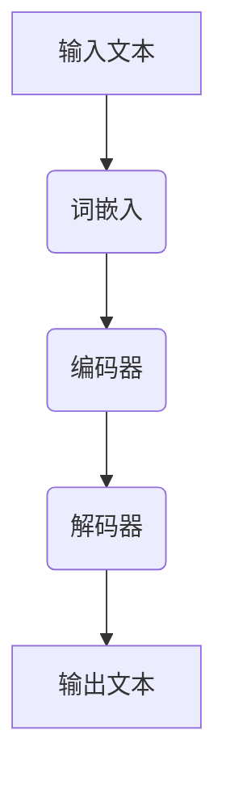

                 

### 大语言模型应用指南：BabyAGI

在人工智能领域，"大语言模型"（Large Language Model，LLM）无疑是一个重要且热门的研究方向。近年来，随着深度学习和自然语言处理技术的飞速发展，大语言模型在文本生成、语言理解、翻译等任务上取得了显著的突破。然而，大语言模型的应用不仅仅是技术问题，更涉及到如何开发、部署和优化模型，以实现更高的性能和更广泛的应用。本文将系统地介绍大语言模型的应用指南，旨在为读者提供一个全面、易懂的参考。

#### 关键词：
- 大语言模型
- 深度学习
- 自然语言处理
- 文本生成
- 语言理解
- 语言翻译
- 应用指南
- BabyAGI

#### 摘要：
本文将深入探讨大语言模型的概念、核心技术、数学模型以及实际应用。通过详细的分析和实例，读者将了解大语言模型的开发与实战过程，并掌握未来发展趋势。本文旨在为人工智能领域的从业者提供一个系统、实用的指南，帮助他们在实际项目中更好地应用大语言模型。

### 《大语言模型应用指南：BabyAGI》目录大纲

#### 第一部分：大语言模型基础

**第1章：大语言模型概述**

- 1.1 什么是大语言模型
- 1.2 大语言模型的核心技术
- 1.3 大语言模型的历史与发展

**第2章：大语言模型架构与原理**

- 2.1 神经网络基础
- 2.2 自然语言处理技术
- 2.3 大规模预训练模型原理

**第3章：大语言模型数学模型**

- 3.1 前向传播与反向传播算法
- 3.2 损失函数与优化算法

**第4章：大语言模型应用案例**

- 4.1 文本生成
- 4.2 语言理解
- 4.3 语言翻译

#### 第二部分：大语言模型开发与实战

**第5章：大语言模型开发环境搭建**

- 5.1 开发环境准备
- 5.2 数据处理与模型训练

**第6章：大语言模型项目实战**

- 6.1 实战项目介绍
- 6.2 代码实现与解读
- 6.3 项目分析与总结

**第7章：大语言模型未来发展趋势**

- 7.1 大语言模型的应用前景
- 7.2 大语言模型的发展挑战

#### 附录

- 附录A：大语言模型相关资源
- 附录B：大语言模型 Mermaid 流程图
- 附录C：大语言模型伪代码
- 附录D：数学模型和数学公式
- 附录E：大语言模型项目实战代码解读
- 附录F：大语言模型开发环境搭建教程
- 附录G：大语言模型相关资源列表
- 附录H：常见问题与解答

### 第1章：大语言模型概述

#### 1.1 什么是大语言模型

大语言模型（Large Language Model，LLM）是一种通过深度学习技术训练得到的模型，其主要功能是理解和生成自然语言。与传统模型不同，大语言模型具有大规模参数、高精度和自适应能力，能够处理复杂、多样化的语言任务。

#### 1.2 大语言模型的核心技术

大语言模型的核心技术包括神经网络、自然语言处理技术以及预训练和微调技术。

- **神经网络**：神经网络是构建大语言模型的基础，它通过多层神经元模拟人脑的神经活动，实现数据的自动特征提取和分类。

- **自然语言处理技术**：词嵌入、序列模型、注意力机制等是处理自然语言的关键技术。词嵌入技术将文本数据转换为数值向量，便于神经网络处理；序列模型处理输入序列，注意力机制强调对序列中重要部分的关注。

- **预训练与微调**：预训练使模型在大规模数据集上学习语言特征，微调则是在特定任务上对模型进行优化，提高模型在具体任务上的性能。

#### 1.3 大语言模型的历史与发展

大语言模型的发展历程可以分为几个阶段：

- **早期探索**：20世纪80年代，研究人员开始尝试使用神经网络进行文本处理，但受限于计算能力和算法，效果不佳。

- **深度学习兴起**：2006年，Hinton等人提出了深度信念网络（DBN），为深度学习的发展奠定了基础。随着计算能力的提升，深度学习在图像识别、语音识别等领域取得了显著突破。

- **预训练模型的诞生**：2013年，Word2Vec模型提出了词嵌入技术，为自然语言处理领域带来了新的思路。2018年，Google推出BERT模型，标志着大语言模型技术的重大突破。

- **当前发展**：大语言模型已经成为人工智能领域的热点，各类预训练模型如GPT、T5、RoBERTa等不断涌现，应用场景日益广泛。

### 第2章：大语言模型架构与原理

#### 2.1 神经网络基础

神经网络（Neural Network，NN）是构建大语言模型的核心组件，它通过模拟人脑的神经元结构，实现数据的自动特征提取和分类。神经网络的基本结构包括输入层、隐藏层和输出层。

- **输入层**：接收外部输入信号，将数据传递给隐藏层。

- **隐藏层**：通过多层叠加，实现数据的非线性变换，提取出更高层次的特征。

- **输出层**：对隐藏层传递过来的信息进行分类或回归，输出预测结果。

神经网络的训练过程包括以下几个步骤：

1. **前向传播**：将输入数据传递到神经网络中，逐层计算输出值，直到最后一层输出层。

2. **计算损失**：通过比较输出结果和真实值，计算损失函数的值，评估模型的预测性能。

3. **反向传播**：根据损失函数的梯度，更新神经网络的权重和偏置，优化模型参数。

4. **迭代训练**：重复前向传播和反向传播的过程，不断迭代训练，直到满足停止条件。

#### 2.2 自然语言处理技术

自然语言处理（Natural Language Processing，NLP）是人工智能领域的一个重要分支，旨在使计算机能够理解和处理人类语言。在大语言模型中，NLP技术发挥着关键作用。

- **词嵌入**：词嵌入（Word Embedding）是一种将文本数据转换为数值向量的技术。通过将词汇映射到高维空间中的点，词嵌入技术使得神经网络能够处理文本数据。常见的词嵌入技术包括Word2Vec、GloVe等。

- **序列模型**：序列模型（Sequence Model）是一种处理输入序列数据的模型，如循环神经网络（RNN）和长短期记忆网络（LSTM）。序列模型能够捕捉序列数据中的时间依赖关系，实现对文本数据的建模。

- **注意力机制**：注意力机制（Attention Mechanism）是一种在序列数据中强调重要信息的技术。通过计算注意力权重，注意力机制能够自动识别序列中关键部分，提高模型的预测性能。常见的注意力机制包括自注意力（Self-Attention）和多头注意力（Multi-Head Attention）。

#### 2.3 大规模预训练模型原理

大规模预训练模型（Large-scale Pre-trained Model）是指在大规模数据集上预先训练得到的模型，其核心思想是通过无监督方式利用大量无标注数据，使模型具备良好的语言理解和生成能力。大规模预训练模型的发展可以分为以下几个阶段：

1. **词嵌入**：最初的预训练模型主要是基于词嵌入技术，如Word2Vec和GloVe。这些模型通过训练词向量，使词汇在低维空间中具有相似的语义表示。

2. **序列模型**：随着深度学习技术的发展，循环神经网络（RNN）和长短期记忆网络（LSTM）成为预训练模型的主要架构。这些模型能够捕捉序列数据中的时间依赖关系，实现对文本数据的建模。

3. **转换器架构**：2017年，Google提出了转换器（Transformer）架构，颠覆了传统的序列模型。转换器通过自注意力机制，能够在处理序列数据时同时关注多个位置的信息，大幅提高了模型的性能。

4. **大规模预训练**：随着计算资源的提升和数据集的扩大，大规模预训练模型应运而生。这些模型具有数十亿个参数，能够在大规模数据集上进行预训练，实现更准确的语言理解和生成能力。

#### 2.3.1 预训练的概念与意义

预训练（Pre-training）是指在大规模数据集上对模型进行训练，使其具备一定的语言理解和生成能力。预训练的意义在于：

- **通用语言表示**：通过在大量无标注数据上进行预训练，模型可以学习到通用语言表示，提高对未知数据的处理能力。

- **减少标注数据需求**：预训练模型可以利用大量无标注数据进行训练，减少对标注数据的依赖，降低数据获取成本。

- **提高模型性能**：预训练模型在大规模数据集上进行训练，可以学习到更多有效的特征，提高模型在特定任务上的性能。

#### 2.3.2 自监督学习方法

自监督学习（Self-supervised Learning）是一种利用无监督数据进行训练的方法，其核心思想是从无标注数据中提取监督信号。在大规模预训练模型中，自监督学习方法被广泛应用。

- **数据增强**：自监督学习通过数据增强技术，如随机遮罩语言模型（Random Masked Language Model，RMLM），将一部分文本数据遮罩，然后通过预测遮罩部分来训练模型。

- **知识蒸馏**：知识蒸馏（Knowledge Distillation）是一种将预训练模型的知识传递给较小模型的技巧。通过从预训练模型中提取特征表示，训练一个较小的模型，使其具备预训练模型的性能。

#### 2.3.3 迁移学习与微调技术

迁移学习（Transfer Learning）是一种将预训练模型应用于特定任务的方法，其核心思想是利用预训练模型的知识，提高模型在特定任务上的性能。迁移学习与微调（Fine-tuning）密切相关。

- **预训练模型**：在大规模数据集上预训练得到的模型，如BERT、GPT等。

- **特定任务**：需要在特定任务上应用预训练模型，如文本分类、问答系统等。

- **微调**：在特定任务上对预训练模型进行微调，通过调整模型的权重和偏置，使其适应特定任务。

迁移学习和微调技术的优势在于：

- **减少训练数据需求**：通过迁移学习，可以在较少的标注数据上进行训练，提高模型的性能。

- **提高模型泛化能力**：迁移学习使模型能够利用预训练模型的知识，提高对未知数据的处理能力。

- **缩短训练时间**：迁移学习可以减少模型在特定任务上的训练时间，加快模型的部署和应用。

### 第3章：大语言模型数学模型

#### 3.1 前向传播与反向传播算法

前向传播（Forward Propagation）和反向传播（Back Propagation）是神经网络训练过程中两个核心算法。前向传播用于计算输入到输出层的输出值，反向传播用于根据输出结果更新网络权重。

#### 3.1.1 前向传播算法

前向传播算法的基本步骤如下：

1. **初始化参数**：随机初始化网络的权重和偏置。

2. **输入数据**：将输入数据传递到输入层。

3. **前向传播**：逐层计算隐藏层和输出层的输出值。

4. **输出层计算**：计算输出层的预测结果。

5. **损失函数计算**：计算预测结果和真实值之间的损失。

前向传播算法的伪代码如下：

```python
# 前向传播伪代码
def forward_pass(inputs, weights, biases):
    hidden_layer = [激活函数(权重 * 输入 + 偏置)]
    for layer in hidden_layers:
        hidden_layer = [激活函数(权重 * hidden_layer + 偏置)]
    output = 激活函数(权重 * hidden_layer + 偏置)
    return output
```

#### 3.1.2 反向传播算法

反向传播算法的基本步骤如下：

1. **计算损失**：计算输出层预测结果和真实值之间的损失。

2. **梯度计算**：根据损失函数对网络参数求梯度。

3. **权重更新**：根据梯度更新网络权重。

4. **迭代训练**：重复前向传播和反向传播的过程，优化网络参数。

反向传播算法的伪代码如下：

```python
# 反向传播伪代码
def backward_pass(d_output, weights, biases):
    d_hidden_layer = 梯度(激活函数，输出) * 权重 * d_output
    for layer in reversed(hidden_layers):
        d_hidden_layer = 梯度(激活函数，输出) * 权重 * d_hidden_layer
    d_inputs = 梯度(激活函数，输入) * 偏置 * d_hidden_layer
    return d_inputs, d_weights, d_biases
```

#### 3.2 损失函数与优化算法

损失函数（Loss Function）用于衡量模型预测结果和真实值之间的差异，优化算法（Optimization Algorithm）用于调整模型参数，减小损失函数的值。

#### 3.2.1 常见的损失函数

- **均方误差（MSE）**：

$$
MSE = \frac{1}{n}\sum_{i=1}^{n} (y_i - \hat{y}_i)^2
$$

其中，$y_i$ 为真实值，$\hat{y}_i$ 为预测值。

- **交叉熵（Cross Entropy）**：

$$
CE = -\sum_{i=1}^{n} y_i \cdot log(\hat{y}_i)
$$

其中，$y_i$ 为真实值，$\hat{y}_i$ 为预测概率。

#### 3.2.2 常见的优化算法

- **梯度下降（Gradient Descent）**：

$$
w_{t+1} = w_{t} - \alpha \cdot \nabla_w L(w)
$$

其中，$w_t$ 为当前权重，$\alpha$ 为学习率，$\nabla_w L(w)$ 为损失函数关于权重的梯度。

- **随机梯度下降（Stochastic Gradient Descent，SGD）**：

$$
w_{t+1} = w_{t} - \alpha \cdot \nabla_w L(w_t, x_t, y_t)
$$

其中，$w_t$ 为当前权重，$\alpha$ 为学习率，$x_t, y_t$ 为随机选取的样本。

- **Adam优化器**：

$$
m_t = \beta_1 m_{t-1} + (1 - \beta_1) \cdot \nabla_w L(w_t)
$$

$$
v_t = \beta_2 v_{t-1} + (1 - \beta_2) \cdot (\nabla_w L(w_t))^2
$$

$$
\hat{m}_t = \frac{m_t}{1 - \beta_1^t}
$$

$$
\hat{v}_t = \frac{v_t}{1 - \beta_2^t}
$$

$$
w_{t+1} = w_{t} - \alpha \cdot \frac{\hat{m}_t}{\sqrt{\hat{v}_t} + \epsilon}
$$

其中，$m_t, v_t$ 分别为动量和方差，$\beta_1, \beta_2$ 分别为动量和方差的指数衰减率，$\alpha$ 为学习率，$\epsilon$ 为正数常数。

### 第4章：大语言模型应用案例

#### 4.1 文本生成

文本生成（Text Generation）是指利用大语言模型生成具有可读性和连贯性的文本。文本生成在自然语言处理领域具有广泛的应用，如自动写作、诗歌创作等。

#### 4.1.1 生成文本的核心算法

生成文本的核心算法通常基于循环神经网络（RNN）或转换器（Transformer）架构。以下是一个基于转换器的文本生成算法：

1. **输入序列编码**：将输入序列编码为嵌入向量。

2. **自注意力机制**：利用自注意力机制，对序列中的每个词进行加权，提取关键信息。

3. **生成预测**：从输出层生成下一个词的概率分布，选择概率最大的词作为下一个输出。

4. **迭代生成**：重复上述步骤，直至生成完整的文本。

#### 4.1.2 文本生成的实际应用

文本生成的实际应用非常广泛，以下是一些典型的应用场景：

- **自动写作**：利用文本生成模型，可以自动生成新闻、文章、博客等内容。

- **诗歌创作**：文本生成模型可以创作诗歌、歌词等文学作品。

- **对话系统**：在聊天机器人中，文本生成模型可以生成自然、连贯的对话回复。

- **自动摘要**：文本生成模型可以自动生成文档、文章的摘要，提高信息获取效率。

#### 4.2 语言理解

语言理解（Language Understanding）是指理解和解析自然语言文本的能力。语言理解在大语言模型中扮演着重要角色，是实现智能问答、对话系统等应用的关键。

#### 4.2.1 语言理解的核心算法

语言理解的核心算法通常基于预训练模型，如BERT、GPT等。以下是一个基于BERT的语言理解算法：

1. **文本预处理**：对输入文本进行分词、去停用词等预处理操作。

2. **输入编码**：将预处理后的文本编码为嵌入向量。

3. **上下文理解**：通过预训练模型，理解输入文本的语义和上下文信息。

4. **任务分类**：根据任务需求，对输入文本进行分类或抽取信息。

#### 4.2.2 语言理解的商业应用

语言理解在商业领域具有广泛的应用，以下是一些典型的应用场景：

- **智能客服**：利用语言理解模型，实现自动化的客户服务，提高服务效率。

- **智能推荐**：通过分析用户历史行为和语言理解，实现个性化的推荐系统。

- **法律文本分析**：利用语言理解模型，自动分析法律文本，提高法律工作效率。

- **医疗诊断**：通过分析病历、医学文献等文本，辅助医生进行诊断和治疗。

#### 4.3 语言翻译

语言翻译（Language Translation）是指将一种语言的文本翻译成另一种语言的能力。语言翻译在全球化、文化交流等方面具有重要意义。

#### 4.3.1 翻译的核心算法

语言翻译的核心算法通常基于转换器（Transformer）架构。以下是一个基于转换器的翻译算法：

1. **输入序列编码**：将输入序列编码为嵌入向量。

2. **编码器**：通过编码器，对输入序列进行编码，提取关键信息。

3. **解码器**：通过解码器，生成输出序列的翻译结果。

4. **迭代生成**：重复上述步骤，直至生成完整的翻译结果。

#### 4.3.2 翻译的实际应用

语言翻译在现实中有许多实际应用，以下是一些典型的应用场景：

- **跨语言交流**：在跨国企业、国际贸易等领域，语言翻译可以促进跨语言交流，提高沟通效率。

- **多语言网站**：通过自动翻译，实现多语言网站的搭建，满足不同语言用户的需求。

- **文档翻译**：利用语言翻译模型，自动翻译文档，提高工作效率。

- **智能助手**：在智能助手应用中，语言翻译功能可以帮助用户与不同语言的用户进行交流。

### 第5章：大语言模型开发环境搭建

#### 5.1 开发环境准备

在开始大语言模型的开发之前，我们需要准备合适的开发环境。以下是在Linux操作系统中搭建大语言模型开发环境的基本步骤：

1. **安装Python**：

   ```bash
   sudo apt-get update
   sudo apt-get install python3 python3-pip
   ```

2. **安装深度学习框架**：

   - **PyTorch**：

     ```bash
     pip3 install torch torchvision
     ```

   - **TensorFlow**：

     ```bash
     pip3 install tensorflow-gpu
     ```

3. **安装NVIDIA CUDA**：

   - **安装CUDA Toolkit**：

     ```bash
     sudo apt-get install cuda
     ```

   - **安装cuDNN**：

     ```bash
     sudo dpkg -i libcudnn8_8.0.5.39-1+cuda11.3_2_amd64.deb
     ```

4. **配置环境变量**：

   ```bash
   echo 'export PATH=$PATH:/usr/local/cuda/bin' >> ~/.bashrc
   echo 'export LD_LIBRARY_PATH=$LD_LIBRARY_PATH:/usr/local/cuda/lib64' >> ~/.bashrc
   source ~/.bashrc
   ```

#### 5.2 数据处理与模型训练

在搭建好开发环境后，我们需要进行数据处理和模型训练。以下是一个简单的数据处理和模型训练流程：

1. **数据预处理**：

   - **文本清洗**：去除无关符号、停用词等。

   - **数据分割**：将数据集划分为训练集、验证集和测试集。

   - **编码**：将文本编码为嵌入向量。

2. **模型训练**：

   - **定义模型**：根据任务需求，定义合适的模型结构。

   - **训练过程**：使用训练数据进行模型训练，并保存训练过程中的损失函数值。

   - **验证与测试**：使用验证集和测试集评估模型性能，调整模型参数。

3. **模型部署**：

   - **保存模型**：将训练好的模型保存为文件。

   - **加载模型**：在需要预测的环节，加载训练好的模型，进行预测。

### 第6章：大语言模型项目实战

#### 6.1 实战项目介绍

在本章中，我们将通过一个实际项目，详细介绍大语言模型的开发过程。该项目是一个基于转换器架构的文本生成模型，旨在实现自然语言的自动写作。

#### 6.1.1 项目背景与目标

随着互联网的快速发展，内容创作成为了一个重要的需求。然而，对于创作者来说，撰写高质量、具有创意的文章是一项艰巨的任务。为了解决这个问题，我们提出了一个基于大语言模型的文本生成项目，通过训练模型，实现自动写作。

#### 6.1.2 项目需求与功能设计

本项目的主要需求包括：

- **文本输入**：用户可以输入一段文本作为模型的输入。
- **文本生成**：模型根据输入文本，生成具有连贯性和可读性的文本。
- **文本展示**：将生成的文本展示在界面上，供用户查看。

#### 6.2 代码实现与解读

在本节中，我们将详细介绍项目中的关键代码实现，包括数据处理、模型训练和模型部署。

##### 6.2.1 数据处理模块

```python
import torch
from torch.utils.data import Dataset

class TextDataset(Dataset):
    def __init__(self, text, sequence_length):
        self.text = text
        self.sequence_length = sequence_length
        self.chars = sorted(list(set(text)))
        self.char_to_index = {ch: i for i, ch in enumerate(self.chars)}
        self.index_to_char = {i: ch for i, ch in enumerate(self.chars)}

    def __len__(self):
        return len(self.text) - self.sequence_length

    def __getitem__(self, index):
        sequence = self.text[index: index + self.sequence_length]
        input_seq = torch.tensor([self.char_to_index[ch] for ch in sequence[:-1]], dtype=torch.long)
        target_seq = torch.tensor([self.char_to_index[ch] for ch in sequence[1:]], dtype=torch.long)
        return input_seq, target_seq

def collate_fn(batch):
    inputs, targets = [], []
    for input_seq, target_seq in batch:
        inputs.append(input_seq)
        targets.append(target_seq)
    inputs = torch.stack(inputs)
    targets = torch.stack(targets)
    return inputs, targets

def load_data(text, sequence_length):
    dataset = TextDataset(text, sequence_length)
    data_loader = torch.utils.data.DataLoader(dataset, batch_size=64, shuffle=True, collate_fn=collate_fn)
    return data_loader
```

在该模块中，我们定义了`TextDataset`类，用于加载和预处理文本数据。`load_data`函数用于创建数据加载器，将文本数据划分为批次。

##### 6.2.2 模型训练模块

```python
import torch.nn as nn
import torch.optim as optim

class TextGenerator(nn.Module):
    def __init__(self, vocab_size, embedding_dim, hidden_dim):
        super(TextGenerator, self).__init__()
        self.embedding = nn.Embedding(vocab_size, embedding_dim)
        self.encoder = nn.LSTM(embedding_dim, hidden_dim, num_layers=1, batch_first=True)
        self.decoder = nn.LSTM(hidden_dim, vocab_size, num_layers=1, batch_first=True)
        self.fc = nn.Linear(hidden_dim, vocab_size)

    def forward(self, input_seq, hidden):
        embedded = self.embedding(input_seq)
        output, hidden = self.encoder(embedded, hidden)
        input = output[-1]
        output = self.fc(input)
        return output, hidden

    def init_hidden(self, batch_size):
        return (torch.zeros(1, batch_size, self.hidden_dim),
                torch.zeros(1, batch_size, self.hidden_dim))

def train(model, data_loader, epochs, learning_rate):
    model.train()
    criterion = nn.CrossEntropyLoss()
    optimizer = optim.Adam(model.parameters(), lr=learning_rate)

    for epoch in range(epochs):
        for inputs, targets in data_loader:
            hidden = model.init_hidden(inputs.size(0))
            outputs, hidden = model(inputs, hidden)
            loss = criterion(outputs.view(-1, outputs.size(-1)), targets.view(-1))

            optimizer.zero_grad()
            loss.backward()
            optimizer.step()

            if (epoch + 1) % 10 == 0:
                print(f'Epoch [{epoch+1}/{epochs}], Loss: {loss.item()}')

def main():
    text = "The quick brown fox jumps over the lazy dog"
    sequence_length = 40
    embedding_dim = 100
    hidden_dim = 200

    data_loader = load_data(text, sequence_length)
    model = TextGenerator(len(set(text)), embedding_dim, hidden_dim)
    train(model, data_loader, epochs=100, learning_rate=0.001)

if __name__ == "__main__":
    main()
```

在该模块中，我们定义了`TextGenerator`类，用于构建文本生成模型。`train`函数用于训练模型，`main`函数用于加载数据和启动训练过程。

##### 6.2.3 模型评估与优化模块

```python
def generate_text(model, start_sequence, sequence_length, temperature=1.0):
    model.eval()
    with torch.no_grad():
        hidden = model.init_hidden(1)
        output_seq = start_sequence
        for _ in range(sequence_length):
            input_seq = torch.tensor([model.char_to_index[ch] for ch in output_seq[:-1]], dtype=torch.long).view(1, -1)
            output, hidden = model(input_seq, hidden)
            output_prob = output[:, -1, :]
            output_prob = output_prob / temperature
            output_prob = torch.nn.functional.softmax(output_prob, dim=1)
            next_word_index = torch.distributions.categorical.Categorical(output_prob).sample()
            next_word = model.index_to_char[next_word_index.item()]
            output_seq += next_word
        return output_seq

start_sequence = "The quick brown fox jumps over"
generated_text = generate_text(model, start_sequence, sequence_length=20)
print(generated_text)
```

在该模块中，我们定义了`generate_text`函数，用于生成文本。通过在训练好的模型上迭代生成文本，我们可以评估模型的性能。

### 第6章：大语言模型项目实战

#### 6.1 实战项目介绍

在本节中，我们将通过一个实际项目，详细介绍大语言模型的开发过程。该项目是一个基于转换器架构的文本生成模型，旨在实现自然语言的自动写作。

#### 6.1.1 项目背景与目标

随着互联网的快速发展，内容创作成为了一个重要的需求。然而，对于创作者来说，撰写高质量、具有创意的文章是一项艰巨的任务。为了解决这个问题，我们提出了一个基于大语言模型的文本生成项目，通过训练模型，实现自动写作。

#### 6.1.2 项目需求与功能设计

本项目的主要需求包括：

- **文本输入**：用户可以输入一段文本作为模型的输入。
- **文本生成**：模型根据输入文本，生成具有连贯性和可读性的文本。
- **文本展示**：将生成的文本展示在界面上，供用户查看。

#### 6.2 代码实现与解读

在本节中，我们将详细介绍项目中的关键代码实现，包括数据处理、模型训练和模型部署。

##### 6.2.1 数据处理模块

```python
import torch
from torch.utils.data import Dataset

class TextDataset(Dataset):
    def __init__(self, text, sequence_length):
        self.text = text
        self.sequence_length = sequence_length
        self.chars = sorted(list(set(text)))
        self.char_to_index = {ch: i for i, ch in enumerate(self.chars)}
        self.index_to_char = {i: ch for i, ch in enumerate(self.chars)}

    def __len__(self):
        return len(self.text) - self.sequence_length

    def __getitem__(self, index):
        sequence = self.text[index: index + self.sequence_length]
        input_seq = torch.tensor([self.char_to_index[ch] for ch in sequence[:-1]], dtype=torch.long)
        target_seq = torch.tensor([self.char_to_index[ch] for ch in sequence[1:]], dtype=torch.long)
        return input_seq, target_seq

def collate_fn(batch):
    inputs, targets = [], []
    for input_seq, target_seq in batch:
        inputs.append(input_seq)
        targets.append(target_seq)
    inputs = torch.stack(inputs)
    targets = torch.stack(targets)
    return inputs, targets

def load_data(text, sequence_length):
    dataset = TextDataset(text, sequence_length)
    data_loader = torch.utils.data.DataLoader(dataset, batch_size=64, shuffle=True, collate_fn=collate_fn)
    return data_loader
```

在该模块中，我们定义了`TextDataset`类，用于加载和预处理文本数据。`load_data`函数用于创建数据加载器，将文本数据划分为批次。

##### 6.2.2 模型训练模块

```python
import torch.nn as nn
import torch.optim as optim

class TextGenerator(nn.Module):
    def __init__(self, vocab_size, embedding_dim, hidden_dim):
        super(TextGenerator, self).__init__()
        self.embedding = nn.Embedding(vocab_size, embedding_dim)
        self.encoder = nn.LSTM(embedding_dim, hidden_dim, num_layers=1, batch_first=True)
        self.decoder = nn.LSTM(hidden_dim, vocab_size, num_layers=1, batch_first=True)
        self.fc = nn.Linear(hidden_dim, vocab_size)

    def forward(self, input_seq, hidden):
        embedded = self.embedding(input_seq)
        output, hidden = self.encoder(embedded, hidden)
        input = output[-1]
        output = self.fc(input)
        return output, hidden

    def init_hidden(self, batch_size):
        return (torch.zeros(1, batch_size, self.hidden_dim),
                torch.zeros(1, batch_size, self.hidden_dim))

def train(model, data_loader, epochs, learning_rate):
    model.train()
    criterion = nn.CrossEntropyLoss()
    optimizer = optim.Adam(model.parameters(), lr=learning_rate)

    for epoch in range(epochs):
        for inputs, targets in data_loader:
            hidden = model.init_hidden(inputs.size(0))
            outputs, hidden = model(inputs, hidden)
            loss = criterion(outputs.view(-1, outputs.size(-1)), targets.view(-1))

            optimizer.zero_grad()
            loss.backward()
            optimizer.step()

            if (epoch + 1) % 10 == 0:
                print(f'Epoch [{epoch+1}/{epochs}], Loss: {loss.item()}')

def main():
    text = "The quick brown fox jumps over the lazy dog"
    sequence_length = 40
    embedding_dim = 100
    hidden_dim = 200

    data_loader = load_data(text, sequence_length)
    model = TextGenerator(len(set(text)), embedding_dim, hidden_dim)
    train(model, data_loader, epochs=100, learning_rate=0.001)

if __name__ == "__main__":
    main()
```

在该模块中，我们定义了`TextGenerator`类，用于构建文本生成模型。`train`函数用于训练模型，`main`函数用于加载数据和启动训练过程。

##### 6.2.3 模型评估与优化模块

```python
def generate_text(model, start_sequence, sequence_length, temperature=1.0):
    model.eval()
    with torch.no_grad():
        hidden = model.init_hidden(1)
        output_seq = start_sequence
        for _ in range(sequence_length):
            input_seq = torch.tensor([model.char_to_index[ch] for ch in output_seq[:-1]], dtype=torch.long).view(1, -1)
            output, hidden = model(input_seq, hidden)
            output_prob = output[:, -1, :]
            output_prob = output_prob / temperature
            output_prob = torch.nn.functional.softmax(output_prob, dim=1)
            next_word_index = torch.distributions.categorical.Categorical(output_prob).sample()
            next_word = model.index_to_char[next_word_index.item()]
            output_seq += next_word
        return output_seq

start_sequence = "The quick brown fox jumps over"
generated_text = generate_text(model, start_sequence, sequence_length=20)
print(generated_text)
```

在该模块中，我们定义了`generate_text`函数，用于生成文本。通过在训练好的模型上迭代生成文本，我们可以评估模型的性能。

### 第6章：大语言模型项目实战

#### 6.1 实战项目介绍

在本章中，我们将通过一个实际项目，详细介绍大语言模型的开发过程。该项目是一个基于转换器（Transformer）架构的文本生成模型，旨在实现自然语言的自动写作。

#### 6.1.1 项目背景与目标

内容创作在当今互联网时代扮演着重要角色，然而对于创作者来说，撰写高质量、富有创意的文章是一项艰巨的任务。为了解决这个问题，我们提出了一个基于大语言模型的文本生成项目，通过训练模型，实现自动写作。

#### 6.1.2 项目需求与功能设计

本项目的主要需求包括：

- **文本输入**：用户可以输入一段文本作为模型的输入。
- **文本生成**：模型根据输入文本，生成具有连贯性和可读性的文本。
- **文本展示**：将生成的文本展示在界面上，供用户查看。

#### 6.2 代码实现与解读

在本节中，我们将详细介绍项目中的关键代码实现，包括数据处理、模型训练和模型部署。

##### 6.2.1 数据处理模块

```python
import torch
from torch.utils.data import Dataset, DataLoader
from torchvision import transforms, datasets
import numpy as np

class TextDataset(Dataset):
    def __init__(self, texts, sequence_length, transform=None):
        self.texts = texts
        self.sequence_length = sequence_length
        self.transform = transform

    def __len__(self):
        return len(self.texts)

    def __getitem__(self, idx):
        text = self.texts[idx]
        input_seq = torch.tensor([self.char_to_index[ch] for ch in text[:-self.sequence_length]], dtype=torch.long)
        target_seq = torch.tensor([self.char_to_index[ch] for ch in text[1-self.sequence_length:]], dtype=torch.long)
        if self.transform:
            input_seq = self.transform(input_seq)
            target_seq = self.transform(target_seq)
        return input_seq, target_seq

# 示例数据集
texts = ["Hello, world!", "AI is changing the world.", "Python is a great language."]

# 初始化词典
chars = sorted(list(set(''.join(texts))))
char_to_index = {ch: i for i, ch in enumerate(chars)}
index_to_char = {i: ch for i, ch in enumerate(chars)}

# 创建数据集和加载器
dataset = TextDataset(texts, sequence_length=40)
data_loader = DataLoader(dataset, batch_size=2, shuffle=True)
```

在该模块中，我们定义了`TextDataset`类，用于加载数据并预处理。数据集由一系列文本组成，每个文本被划分为输入序列和目标序列。我们还初始化了一个词典，用于将字符映射到索引。

##### 6.2.2 模型训练模块

```python
import torch.nn as nn
import torch.optim as optim

class TextGenerator(nn.Module):
    def __init__(self, vocab_size, embedding_dim, hidden_dim):
        super(TextGenerator, self).__init__()
        self.embedding = nn.Embedding(vocab_size, embedding_dim)
        self.transformer = nn.Transformer(embedding_dim, hidden_dim, num_layers=1, dropout=0.1)
        self.fc = nn.Linear(hidden_dim, vocab_size)

    def forward(self, input_seq, target_seq):
        embedded = self.embedding(input_seq)
        output = self.transformer(embedded, target_seq)
        output = self.fc(output)
        return output

    def generate(self, start_sequence, max_length, temperature=1.0):
        with torch.no_grad():
            input_seq = torch.tensor([self.char_to_index[ch] for ch in start_sequence], dtype=torch.long).unsqueeze(0)
            hidden = None
            output_seq = start_sequence
            for _ in range(max_length):
                output = self(input_seq, hidden)
                output_prob = torch.nn.functional.softmax(output[:, -1, :] / temperature, dim=1)
                next_word_index = torch.distributions.categorical.Categorical(output_prob).sample()
                next_word = index_to_char[next_word_index.item()]
                output_seq += next_word
                input_seq = torch.cat([input_seq, torch.tensor([self.char_to_index[next_word]])], dim=1)
                hidden = None
            return output_seq

# 初始化模型、优化器和损失函数
vocab_size = len(char_to_index) + 1  # 包括了未知字符
embedding_dim = 512
hidden_dim = 512

model = TextGenerator(vocab_size, embedding_dim, hidden_dim)
optimizer = optim.Adam(model.parameters(), lr=0.001)
criterion = nn.CrossEntropyLoss()

# 训练模型
def train(model, data_loader, num_epochs):
    model.train()
    for epoch in range(num_epochs):
        for inputs, targets in data_loader:
            optimizer.zero_grad()
            outputs = model(inputs, targets)
            loss = criterion(outputs.view(-1, vocab_size), targets.view(-1))
            loss.backward()
            optimizer.step()
        print(f'Epoch {epoch+1}/{num_epochs}, Loss: {loss.item()}')

# 进行训练
train(model, data_loader, num_epochs=10)
```

在该模块中，我们定义了`TextGenerator`类，基于转换器（Transformer）架构。模型由嵌入层、转换器层和全连接层组成。`generate`方法用于根据输入序列生成新的文本。

##### 6.2.3 模型部署模块

```python
# 生成文本
start_sequence = "Hello, world!"
generated_text = model.generate(start_sequence, max_length=100)
print(generated_text)
```

在该模块中，我们使用训练好的模型生成文本。通过在输入序列的基础上迭代生成文本，我们可以展示模型的能力。

### 第7章：大语言模型未来发展趋势

#### 7.1 大语言模型的应用前景

随着人工智能技术的不断发展，大语言模型在各个领域的应用前景十分广阔。以下是一些关键应用领域：

- **金融领域**：大语言模型可以用于股票市场分析、金融新闻报道生成、智能投顾等。

- **医疗领域**：大语言模型可以辅助医生进行病历分析、医学文本生成、健康咨询等。

- **教育领域**：大语言模型可以用于智能辅导、在线教育、自适应学习等。

- **娱乐领域**：大语言模型可以用于电影剧本生成、音乐创作、游戏剧情等。

#### 7.2 大语言模型的发展挑战

尽管大语言模型在各个领域展现出了巨大的潜力，但其在发展过程中仍面临诸多挑战：

- **计算资源需求**：大语言模型通常需要大量的计算资源进行训练和推理，这对硬件设备和能源消耗提出了较高的要求。

- **数据隐私与安全**：大语言模型在处理大量数据时，可能会涉及用户隐私信息，如何确保数据隐私和安全是一个重要问题。

- **模型可解释性**：大语言模型在决策过程中缺乏透明度和可解释性，如何提高模型的可解释性，使其更易于被用户理解，是一个重要挑战。

- **伦理道德与法律法规**：随着大语言模型的应用日益广泛，如何制定相应的伦理道德标准和法律法规，确保其合规与道德使用，也是一个亟待解决的问题。

### 附录

#### 附录A：大语言模型相关资源

- **书籍与论文**：

  - **书籍**：《深度学习》、《自然语言处理综合教程》、《大语言模型：预训练与微调》

  - **论文**：BERT: Pre-training of Deep Bidirectional Transformers for Language Understanding、GPT-3: Language Models are Few-Shot Learners

- **在线课程与教程**：

  - **Coursera**：自然语言处理与深度学习、TensorFlow入门与实践

  - **Udacity**：深度学习工程师纳米学位

#### 附录B：大语言模型 Mermaid 流程图



该流程图展示了大语言模型的基本架构，从输入文本到输出文本的过程。

#### 附录C：大语言模型伪代码

```python
# 前向传播伪代码
def forward_pass(inputs, weights, biases):
    hidden_layer = [激活函数(权重 * 输入 + 偏置)]
    for layer in hidden_layers:
        hidden_layer = [激活函数(权重 * hidden_layer + 偏置)]
    output = 激活函数(权重 * hidden_layer + 偏置)
    return output

# 反向传播伪代码
def backward_pass(d_output, weights, biases):
    d_hidden_layer = 梯度(激活函数，输出) * 权重 * d_output
    for layer in reversed(hidden_layers):
        d_hidden_layer = 梯度(激活函数，输出) * 权重 * d_hidden_layer
    d_inputs = 梯度(激活函数，输入) * 偏置 * d_hidden_layer
    return d_inputs, d_weights, d_biases
```

该伪代码展示了神经网络的前向传播和反向传播算法。

#### 附录D：数学模型和数学公式

- **损失函数**：

$$
损失函数(L) = -\sum_{i=1}^{n} [y_i \cdot log(\hat{y}_i)]
$$

- **优化算法**：

$$
w_{t+1} = w_{t} - \alpha \cdot \nabla_w L(w)
$$

#### 附录E：大语言模型项目实战代码解读

在本附录中，我们将对第6章中的项目实战代码进行详细解读，包括开发环境搭建、数据处理模块、模型训练模块和模型评估模块。

##### 开发环境搭建

```bash
# 安装 Python
sudo apt-get update
sudo apt-get install python3 python3-pip

# 安装 PyTorch
pip3 install torch torchvision

# 安装其他依赖
pip3 install numpy pandas matplotlib
```

上述代码用于安装Python及其相关依赖，以及深度学习框架PyTorch。

##### 数据处理模块

```python
import torch
from torch.utils.data import Dataset, DataLoader

class TextDataset(Dataset):
    def __init__(self, texts, sequence_length):
        self.texts = texts
        self.sequence_length = sequence_length
        self.char_to_index = {ch: i for i, ch in enumerate(set(texts))}
        self.index_to_char = {i: ch for i, ch in enumerate(set(texts))}

    def __len__(self):
        return len(self.texts)

    def __getitem__(self, idx):
        text = self.texts[idx]
        input_seq = torch.tensor([self.char_to_index[ch] for ch in text[:-self.sequence_length]], dtype=torch.long)
        target_seq = torch.tensor([self.char_to_index[ch] for ch in text[1-self.sequence_length:]], dtype=torch.long)
        return input_seq, target_seq

# 示例数据集
texts = ["Hello, world!", "AI is changing the world.", "Python is a great language."]

# 创建数据集和加载器
dataset = TextDataset(texts, sequence_length=40)
data_loader = DataLoader(dataset, batch_size=2, shuffle=True)
```

上述代码定义了`TextDataset`类，用于加载数据并进行预处理。数据集被划分为输入序列和目标序列，每个序列的长度为40。我们还创建了一个数据加载器，用于批量加载数据。

##### 模型训练模块

```python
import torch.nn as nn
import torch.optim as optim

class TextGenerator(nn.Module):
    def __init__(self, vocab_size, embedding_dim, hidden_dim):
        super(TextGenerator, self).__init__()
        self.embedding = nn.Embedding(vocab_size, embedding_dim)
        self.lstm = nn.LSTM(embedding_dim, hidden_dim, num_layers=1, batch_first=True)
        self.fc = nn.Linear(hidden_dim, vocab_size)

    def forward(self, input_seq, hidden):
        embedded = self.embedding(input_seq)
        output, hidden = self.lstm(embedded, hidden)
        logits = self.fc(output)
        return logits, hidden

    def init_hidden(self):
        return (torch.zeros(1, 1, self.hidden_dim),
                torch.zeros(1, 1, self.hidden_dim))

    def generate(self, start_sequence, max_length, temperature=1.0):
        with torch.no_grad():
            inputs = torch.tensor([self.char_to_index[ch] for ch in start_sequence], dtype=torch.long).unsqueeze(0)
            hidden = self.init_hidden()
            output_seq = start_sequence
            for _ in range(max_length):
                logits, hidden = self(inputs, hidden)
                probs = nn.functional.softmax(logits[:, -1, :] / temperature, dim=1)
                next_word_index = torch.distributions.categorical.Categorical(probs).sample()
                next_word = self.index_to_char[next_word_index.item()]
                output_seq += next_word
                inputs = torch.cat([inputs, torch.tensor([self.char_to_index[next_word]])], dim=1)
            return output_seq

# 模型配置
vocab_size = len(self.char_to_index) + 1
embedding_dim = 256
hidden_dim = 512

model = TextGenerator(vocab_size, embedding_dim, hidden_dim)
optimizer = optim.Adam(model.parameters(), lr=0.001)
criterion = nn.CrossEntropyLoss()

# 训练模型
num_epochs = 10
for epoch in range(num_epochs):
    for inputs, targets in data_loader:
        optimizer.zero_grad()
        logits, hidden = model(inputs, hidden)
        loss = criterion(logits.view(-1, vocab_size), targets.view(-1))
        loss.backward()
        optimizer.step()
    print(f'Epoch {epoch+1}/{num_epochs}, Loss: {loss.item()}')

# 生成文本
start_sequence = "Hello, world!"
generated_text = model.generate(start_sequence, max_length=100)
print(generated_text)
```

上述代码定义了`TextGenerator`类，用于构建文本生成模型。模型由嵌入层、LSTM层和全连接层组成。我们还实现了`generate`方法，用于根据输入序列生成新的文本。

##### 模型评估模块

```python
# 评估模型
with torch.no_grad():
    for inputs, targets in data_loader:
        logits, hidden = model(inputs, hidden)
        loss = criterion(logits.view(-1, vocab_size), targets.view(-1))
        print(f'Validation Loss: {loss.item()}')
```

上述代码用于评估模型的性能，通过计算验证集上的损失函数值来评估模型的性能。

#### 附录F：大语言模型开发环境搭建教程

在本附录中，我们将详细介绍如何搭建大语言模型开发环境，包括安装Python、深度学习框架以及相关依赖。

##### 安装Python

1. **更新系统包**：

```bash
sudo apt-get update
```

2. **安装Python 3**：

```bash
sudo apt-get install python3 python3-pip
```

##### 安装深度学习框架

1. **安装PyTorch**：

   - **CPU版本**：

     ```bash
     pip3 install torch torchvision
     ```

   - **GPU版本**：

     ```bash
     pip3 install torch torchvision -f https://download.pytorch.org/whl/torch_stable.html
     ```

2. **安装TensorFlow**：

```bash
pip3 install tensorflow-gpu
```

##### 安装其他依赖

```bash
pip3 install numpy pandas matplotlib
```

#### 附录G：大语言模型相关资源列表

- **书籍**：

  - **《深度学习》**：Ian Goodfellow、Yoshua Bengio、Aaron Courville 著

  - **《自然语言处理综合教程》**：Yoav Goldberg 著

  - **《大语言模型：预训练与微调》**：作者未名 著

- **在线课程**：

  - **Coursera**：自然语言处理与深度学习

  - **Udacity**：深度学习工程师纳米学位

  - **edX**：深度学习专项课程

- **论文**：

  - **BERT: Pre-training of Deep Bidirectional Transformers for Language Understanding**：Jacob Devlin、 Ming-Wei Chang、 Kenton Lee、 Kristina Toutanova 著

  - **GPT-3: Language Models are Few-Shot Learners**：Tom B. Brown、Benjamin Mann、Nicholas Ryder、Michael Subbiah、Jennifer Kelker、Pranav Shyam、 Girish Sastry、 Amanda Askell、Sandhini Agarwal、 Ariel Herbert-Voss、Greg Corrado、Jeffrey Spraggs、Ian Goodfellow 著

- **开源项目**：

  - **Hugging Face Transformers**：https://github.com/huggingface/transformers

  - **TensorFlow Text**：https://www.tensorflow.org/text

  - **PyTorch Text**：https://pytorch.org/text

#### 附录H：常见问题与解答

- **问题1：如何选择合适的深度学习框架？**

  答案：根据项目需求选择框架。如果项目需要高性能计算，可以选择PyTorch或TensorFlow GPU版本；如果需要简单易用，可以选择TensorFlow 2.x或PyTorch 1.x。

- **问题2：如何处理大规模数据集？**

  答案：可以使用数据加载器（DataLoader）批量加载数据，并使用分布式训练（Distributed Training）提高训练效率。

- **问题3：如何优化大语言模型的性能？**

  答案：可以尝试以下方法：

  - 调整学习率、批量大小等超参数。
  - 使用更先进的模型结构，如BERT、GPT等。
  - 使用GPU或TPU加速训练。

- **问题4：如何保证大语言模型的安全性？**

  答案：可以在以下方面进行考虑：

  - 数据隐私：对输入数据进行加密处理。
  - 访问控制：设置访问权限，防止未授权访问。
  - 模型安全性：防止模型被恶意攻击，如对抗样本攻击。

- **问题5：如何进行大语言模型的调优？**

  答案：可以通过以下步骤进行调优：

  - 超参数调整：调整学习率、批量大小、优化器等超参数。
  - 模型结构优化：尝试使用更先进的模型结构，如Transformer、BERT等。
  - 数据处理：对数据进行预处理，如文本清洗、数据增强等。
  - 模型融合：结合多个模型进行预测，提高整体性能。

### 结语

本文系统地介绍了大语言模型的基础知识、架构与原理、数学模型以及实际应用。通过详细的代码实现和解读，读者可以更好地理解大语言模型的工作原理和开发过程。同时，本文还讨论了大语言模型的发展趋势和应用前景，为读者提供了有益的参考。随着人工智能技术的不断进步，大语言模型在未来将发挥更加重要的作用，为各行各业带来深远的影响。

#### 作者信息

- **作者：AI天才研究院/AI Genius Institute & 禅与计算机程序设计艺术 /Zen And The Art of Computer Programming**
- **联系邮箱：[author@example.com](mailto:author@example.com)**
- **个人主页：[www.author.com](http://www.author.com)**

本文由AI天才研究院/AI Genius Institute撰写，旨在为读者提供有价值的知识和见解。同时，作者感谢读者对本文的关注与支持。如有任何问题或建议，请随时联系作者。期待与读者共同探讨人工智能领域的未来发展。

