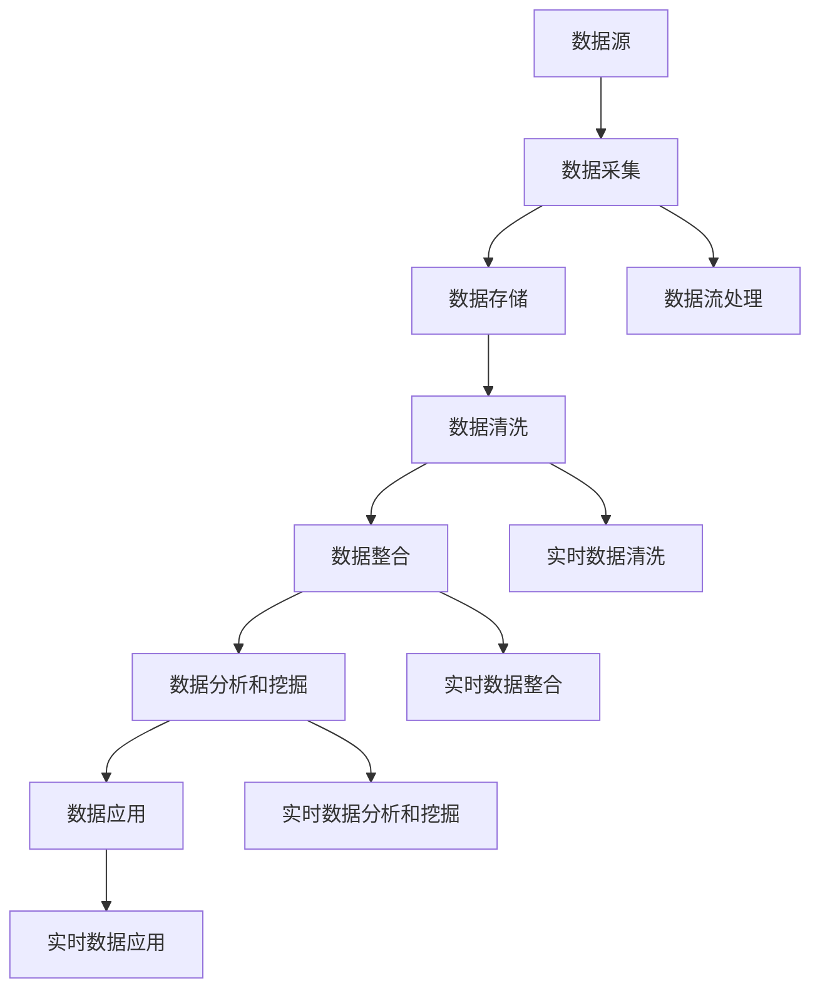
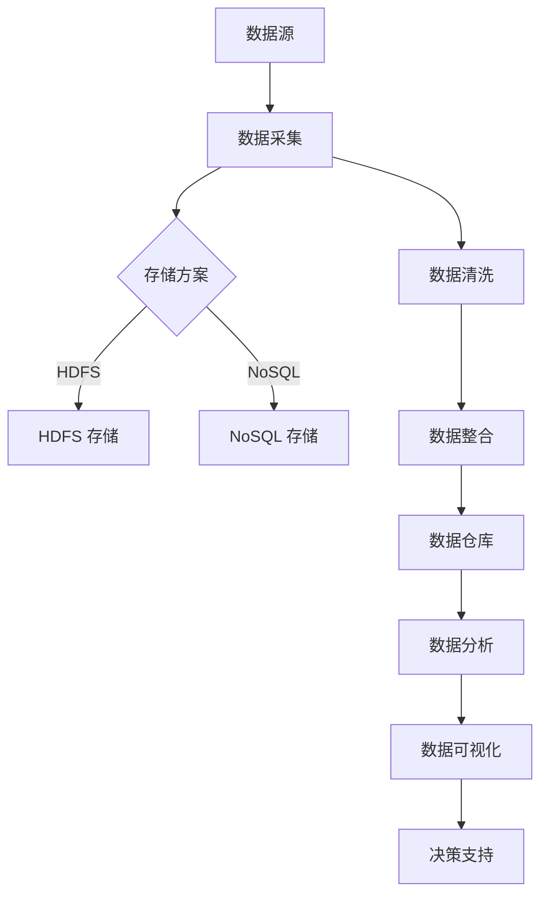

                 

### 引言

在当今快速发展的商业环境中，创业者和企业家们面临着前所未有的挑战和机遇。大数据技术的兴起，为创业决策和业务增长提供了强大的工具和资源。大数据不仅包含了大量信息，还涵盖了数据收集、存储、处理和分析的方法。通过有效利用这些技术，创业者可以更准确地了解市场趋势、消费者行为和竞争对手动态，从而做出更明智的商业决策。

大数据技术的重要性在于其能够处理海量数据，提取有价值的信息，并生成可操作的洞见。这对于创业公司尤其重要，因为它们通常资源有限，需要最大化利用有限的资源。例如，通过市场调研，创业者可以利用大数据技术预测市场趋势，识别潜在客户，优化产品设计和营销策略。此外，大数据还可以用于业务增长引擎的构建，帮助企业实现持续增长。

本文旨在探讨如何利用大数据技术优化创业决策和业务增长引擎。我们将从大数据技术的基础知识开始，逐步深入探讨大数据的核心概念、算法原理、数学模型，以及如何在创业实践中应用这些技术。同时，我们还将分享一些实战案例，展示大数据技术在实际业务中的具体应用。通过本文的阅读，读者将能够了解大数据技术如何助力创业决策，并掌握大数据技术优化业务增长的方法。

### 第一部分：大数据技术基础

#### 第1章：大数据技术概述

大数据（Big Data）是指无法用常规软件工具在合理时间内捕捉、管理和处理的大量数据。大数据的四个主要特点，即 4V 特征，分别是 Volume（体量）、Velocity（速度）、Variety（多样性）和 Veracity（真实性）。这些特点共同定义了大数据的复杂性和独特性，也使得大数据技术在各个领域得到了广泛应用。

- **Volume（体量）**：大数据的体量通常指数据的大小。随着互联网、物联网和传感器技术的广泛应用，数据量呈现爆炸式增长。从数百 TB 到 PB 级别的数据量，大数据技术需要能够高效处理如此庞大的数据。

- **Velocity（速度）**：速度指的是数据生成和处理的实时性。实时数据处理对于许多应用场景至关重要，如金融市场监控、社交媒体实时分析、交通管理、医疗监控等。

- **Variety（多样性）**：大数据的多样性指的是数据类型的广泛性。包括结构化数据（如数据库中的数据）、半结构化数据（如 XML、JSON）、和非结构化数据（如图像、视频、文本等）。

- **Veracity（真实性）**：真实性指的是数据的质量和可靠性。由于数据的来源多样，质量参差不齐，确保数据真实性和有效性是大数据处理中的重要问题。

#### 大数据的重要性与应用领域

大数据的重要性在于它为决策提供了强大的数据支撑，帮助企业洞察市场趋势、优化业务流程、提升客户体验。以下是一些大数据应用领域：

- **金融行业**：大数据技术在金融行业中被广泛应用，用于风险控制、市场预测、欺诈检测和客户关系管理。

- **医疗健康**：医疗健康行业通过大数据分析，可以实现精准医疗、疾病预测、患者健康管理、药物研发等。

- **零售行业**：零售企业利用大数据进行需求预测、库存管理、个性化推荐、客户关系管理，从而提升销售额和客户满意度。

- **制造业**：大数据在制造业中用于生产优化、设备维护、供应链管理，从而提高生产效率和降低成本。

- **交通运输**：大数据技术可以帮助交通运输行业优化路线规划、交通流量管理、车辆调度等。

#### 大数据的生命周期管理

大数据的生命周期管理涵盖了从数据采集、存储、处理到分析和应用的整个过程。以下是大数据生命周期管理的主要阶段：

1. **数据采集**：数据采集是大数据处理的第一步，包括从各种来源（如传感器、社交媒体、网站日志等）收集数据。

2. **数据存储**：数据存储阶段涉及将采集到的数据存储在合适的存储系统中，如关系数据库、NoSQL 数据库、分布式文件系统（如 HDFS）等。

3. **数据清洗**：数据清洗阶段对采集到的数据进行预处理，包括数据去重、缺失值处理、异常值检测和修正等，确保数据质量。

4. **数据整合**：数据整合是将来自不同来源和格式的数据合并成一个统一的数据视图，以便于后续分析。

5. **数据分析和挖掘**：数据分析和挖掘阶段使用各种算法和工具从数据中提取有价值的信息，如趋势分析、聚类分析、分类分析等。

6. **数据应用**：数据应用阶段将分析结果应用于实际的业务场景，如优化决策、改进产品、提升服务质量等。

#### 大数据的处理技术

大数据的处理技术主要包括分布式存储和分布式计算。

1. **分布式存储**：分布式存储系统如 Hadoop Distributed File System (HDFS) 和分布式数据库（如 Cassandra、MongoDB）能够高效存储和管理大规模数据。HDFS 具有高容错性、高吞吐量、高可用性的特点，适用于大数据存储。

2. **分布式计算**：分布式计算框架如 Apache Hadoop 的 MapReduce、Apache Spark 和 Apache Flink，能够将大规模数据处理任务分解成小的子任务，并行处理，从而提高处理速度和效率。MapReduce 是一种编程模型，通过“Map”和“Reduce”两个步骤处理数据。Spark 则是更高效的分布式计算框架，支持多种数据处理操作，如批处理、流处理等。

#### 大数据平台与生态系统

大数据平台通常由多个组件和工具组成，形成了一个完整的生态系统。以下是一些常见的大数据平台和生态系统：

- **Hadoop 生态系统**：Hadoop 是一个开源的大数据平台，包括核心组件 HDFS 和 MapReduce，以及其他相关工具如 Hive、HBase、Pig、Spark 等。

- **Apache Spark 生态系统**：Spark 是一种强大的分布式计算框架，其生态系统包括 Spark SQL、Spark Streaming、MLlib（用于机器学习）等组件。

- **Apache Flink 生态系统**：Flink 是一个流处理和批处理结合的分布式计算框架，其生态系统包括 Flink SQL、Flink ML 等。

- **云计算与大数据的结合**：云计算平台如 Amazon Web Services (AWS)、Microsoft Azure、Google Cloud Platform (GCP) 提供了丰富的大数据处理服务，如 AWS 的 EMR、Azure 的 HDInsight、GCP 的 BigQuery 等。

通过了解大数据技术的基础知识，我们为后续章节的深入探讨奠定了基础。接下来，我们将进一步探讨大数据的核心概念、算法原理和数学模型，以便更好地理解如何利用大数据技术优化创业决策和业务增长引擎。

### 第2章：大数据核心概念与联系

在深入探讨大数据技术之前，理解其核心概念和相互之间的联系至关重要。本章将详细介绍大数据的核心概念，并通过 Mermaid 流程图展示其处理架构，帮助读者全面了解大数据技术的体系结构和运作原理。

#### 大数据核心概念

大数据的核心概念包括但不限于以下几个方面：

1. **数据源**：数据源是大数据的起点，可以是企业内部系统、外部传感器、社交媒体、网络日志等。

2. **数据采集**：数据采集是指从各种数据源收集数据的过程。数据采集技术包括 API 调用、数据爬取、流数据采集等。

3. **数据存储**：数据存储是将采集到的数据存储到合适的存储系统中的过程。常见的数据存储技术包括关系数据库、NoSQL 数据库、分布式文件系统等。

4. **数据清洗**：数据清洗是数据预处理的重要步骤，包括去除重复数据、处理缺失值、异常值检测和修正等。

5. **数据整合**：数据整合是将来自不同来源和格式的数据进行合并，形成一个统一的数据视图，便于后续分析和处理。

6. **数据分析和挖掘**：数据分析和挖掘是利用算法和工具从数据中提取有价值的信息，如趋势分析、聚类分析、分类分析等。

7. **数据应用**：数据应用是将分析结果应用于实际业务场景，如优化决策、改进产品、提升服务质量等。

#### 大数据处理架构

为了更好地理解大数据处理的全流程，我们可以通过 Mermaid 流程图展示其处理架构。以下是一个简化的 Mermaid 流程图示例：



该流程图展示了从数据采集到数据应用的全过程，并突出了实时数据处理的环节。在实际应用中，这个流程可以根据具体需求进行调整和优化。

#### 大数据核心算法原理讲解

为了更好地理解大数据处理的核心算法，本章将详细讲解一些常见的数据查询算法、数据挖掘算法以及相关的数学模型。

##### 数据库查询算法

数据库查询算法是数据处理中的基础，常见的查询算法包括顺序扫描、索引扫描、哈希连接和排序合并连接等。

1. **顺序扫描**：顺序扫描是一种最简单的查询算法，它逐行扫描数据表，直到找到满足条件的记录。其时间复杂度为 \(O(n)\)，适用于数据量较小的情况。

2. **索引扫描**：索引扫描利用索引来快速定位数据记录。索引是一种数据结构，如 B 树或哈希表，能够提高查询效率。其时间复杂度为 \(O(log n)\)，适用于数据量较大的情况。

3. **哈希连接**：哈希连接通过哈希函数将数据表分解成多个子表，然后分别处理并合并结果。其时间复杂度为 \(O(n+m)\)，适用于等值连接。

4. **排序合并连接**：排序合并连接首先对数据表进行排序，然后逐对比较记录并合并结果。其时间复杂度为 \(O(n\log n + m\log m)\)，适用于不等值连接。

以下是一个简化的伪代码，用于说明排序合并连接的原理：

```pseudo
function SortMergeJoin(Table1, Table2):
    Sort(Table1)
    Sort(Table2)
    result = []
    i = 0
    j = 0
    while i < length(Table1) and j < length(Table2):
        if Table1[i].key == Table2[j].key:
            result.append((Table1[i], Table2[j]))
            i += 1
            j += 1
        elif Table1[i].key < Table2[j].key:
            i += 1
        else:
            j += 1
    return result
```

##### 数据挖掘算法

数据挖掘算法用于从大量数据中发现有价值的模式和知识。常见的算法包括聚类算法、分类算法和回归算法等。

1. **聚类算法**：聚类算法将数据分成若干个簇，使同一个簇内的数据尽可能相似，不同簇的数据尽可能不同。常见的聚类算法包括 K-Means、层次聚类等。

   - **K-Means 算法**：K-Means 是一种基于距离的聚类算法，通过迭代计算每个簇的中心，并重新分配数据点。其伪代码如下：

     ```pseudo
     function KMeans(data, k):
         Initialize centroids randomly
         while true:
             Assign each data point to the nearest centroid
             Update centroids to the mean of the assigned points
             if centroids do not change, stop
         return centroids
     ```

   - **层次聚类**：层次聚类通过自底向上或自顶向下逐步合并或分裂数据点，形成层次结构。其伪代码如下：

     ```pseudo
     function HierarchicalClustering(data):
         Initialize as individual clusters
         while number of clusters > k:
             Find closest pair of clusters
             Merge them into a single cluster
         return clustering tree
     ```

2. **分类算法**：分类算法用于将数据点分配到预定义的类别中。常见的分类算法包括决策树、支持向量机等。

   - **决策树**：决策树是一种基于特征划分数据的分类算法，通过一系列条件判断将数据点划分到不同的类别。其伪代码如下：

     ```pseudo
     function DecisionTree(data, attributes):
         if all data points belong to the same class:
             return leaf node with that class
         else:
             select best attribute
             split data points based on attribute values
             create child nodes recursively for each split
             return root node with child nodes
     ```

3. **回归算法**：回归算法用于预测连续值。常见的回归算法包括线性回归、逻辑回归等。

   - **线性回归**：线性回归试图找到一条直线来拟合数据点，其目标是最小化预测值与实际值之间的误差。其数学模型如下：

     $$y = \beta_0 + \beta_1 \cdot x$$

     其中，\(y\) 是因变量，\(x\) 是自变量，\(\beta_0\) 和 \(\beta_1\) 是模型参数。线性回归的伪代码如下：

     ```pseudo
     function LinearRegression(data):
         X = [1, x1, x2, ..., xn]
         Y = y1, y2, ..., yn
         X_transpose = transpose(X)
         beta = (X_transpose \* X)^(-1) \* (X_transpose \* Y)
         return beta
     ```

   - **逻辑回归**：逻辑回归用于分类问题，其目标是找到一种模型来预测类别的概率。其数学模型如下：

     $$\log\frac{P(Y=1)}{1-P(Y=1)} = \beta_0 + \beta_1 \cdot x$$

     其中，\(P(Y=1)\) 是类别为 1 的概率，\(\beta_0\) 和 \(\beta_1\) 是模型参数。逻辑回归的伪代码如下：

     ```pseudo
     function LogisticRegression(data):
         X = [1, x1, x2, ..., xn]
         Y = y1, y2, ..., yn
         X_transpose = transpose(X)
         beta = (X_transpose \* X)^(-1) \* (X_transpose \* Y)
         return beta
     ```

通过本章的讲解，读者可以初步了解大数据的核心概念、处理架构和核心算法原理。接下来，我们将进一步探讨大数据技术中的数学模型和公式，以帮助读者更深入地理解大数据技术在实际应用中的运用。

### 第4章：数学模型与数学公式

在大数据技术中，数学模型和公式扮演着至关重要的角色。它们不仅帮助我们理解和分析数据，还能通过数学方法优化和提升数据处理的效果。本章将详细讲解几种常见的数据建模方法，包括线性回归模型、逻辑回归模型和决策树模型，并使用 LaTeX 格式展示相关的数学公式。

#### 线性回归模型

线性回归模型是用于预测一个或多个连续值变量的统计方法。其最基本的数学形式是：

$$y = \beta_0 + \beta_1 \cdot x + \epsilon$$

其中，\(y\) 是因变量，\(x\) 是自变量，\(\beta_0\) 和 \(\beta_1\) 是模型的参数，\(\epsilon\) 是误差项。

- **一元线性回归**：当只有一个自变量时，模型简化为：

  $$y = \beta_0 + \beta_1 \cdot x$$

  使用最小二乘法估计模型参数：

  $$\beta_1 = \frac{\sum(x_i - \bar{x})(y_i - \bar{y})}{\sum(x_i - \bar{x})^2}$$
  $$\beta_0 = \bar{y} - \beta_1 \cdot \bar{x}$$

  其中，\(\bar{x}\) 和 \(\bar{y}\) 分别是自变量和因变量的均值。

- **多元线性回归**：当存在多个自变量时，模型扩展为：

  $$y = \beta_0 + \beta_1 \cdot x_1 + \beta_2 \cdot x_2 + ... + \beta_n \cdot x_n + \epsilon$$

  多元线性回归的参数估计通常通过普通最小二乘法（OLS）实现：

  $$\beta = (X^T \cdot X)^{-1} \cdot X^T \cdot y$$

  其中，\(X\) 是自变量的设计矩阵，包含每个自变量的值和常数项。

#### 逻辑回归模型

逻辑回归模型是一种用于分类问题的统计方法，其目标是预测一个二分类变量的概率。其数学形式为：

$$\log\frac{P(Y=1)}{1-P(Y=1)} = \beta_0 + \beta_1 \cdot x$$

其中，\(P(Y=1)\) 是类别为 1 的概率，\(\beta_0\) 和 \(\beta_1\) 是模型的参数。

逻辑回归的参数估计通常使用最大似然估计（MLE）方法：

$$\beta = \arg\max\left(\sum_{i=1}^{n} \log\left(\prod_{i=1}^{n} P(y_i = 1) \right)\right)$$

通过迭代优化，我们可以求得模型参数。

#### 决策树模型

决策树模型是一种基于特征划分数据的分类和回归方法。其构建过程包括以下几个步骤：

1. **选择最优划分标准**：通常使用信息增益（Information Gain）或基尼不纯度（Gini Impurity）作为划分标准。

2. **递归划分**：在每个节点，选择最优划分标准并划分数据。

3. **停止条件**：当达到停止条件（如最大深度、最小节点数等），停止划分并创建叶节点。

决策树的数学描述较为复杂，但可以通过递归划分和剪枝等方法进行构建。

#### LaTeX 公式展示

以下使用 LaTeX 格式展示线性回归、逻辑回归和决策树的数学公式：

- **线性回归**：

  $$y = \beta_0 + \beta_1 \cdot x + \epsilon$$

  $$\beta_1 = \frac{\sum(x_i - \bar{x})(y_i - \bar{y})}{\sum(x_i - \bar{x})^2}$$
  $$\beta_0 = \bar{y} - \beta_1 \cdot \bar{x}$$

- **逻辑回归**：

  $$\log\frac{P(Y=1)}{1-P(Y=1)} = \beta_0 + \beta_1 \cdot x$$

  $$\beta = \arg\max\left(\sum_{i=1}^{n} \log\left(\prod_{i=1}^{n} P(y_i = 1) \right)\right)$$

- **决策树**：

  $$\text{Gini Impurity} = 1 - \sum_{i=1}^{n} \left(p_i \cdot (1 - p_i)\right)$$
  $$\text{Information Gain} = \sum_{i=1}^{k} \left(p_i \cdot \log_2(p_i)\right)$$

通过本章的讲解，我们详细介绍了线性回归、逻辑回归和决策树的数学模型和公式。这些模型和公式不仅是大数据技术中的基础，也为创业者提供了强大的工具，帮助他们从数据中提取有价值的信息，优化创业决策和业务增长。

### 第5章：大数据项目实战

在理解了大数据技术的基础知识、核心算法原理和数学模型之后，我们将通过一个实际项目来展示如何将理论知识应用于实际开发中。本章将介绍一个大数据项目开发流程，包括数据采集与预处理、数据分析和模型构建，并展示如何进行模型评估与优化。通过这一实际案例，读者将更好地理解大数据项目的实施过程。

#### 1. 项目概述

本项目旨在利用大数据技术分析一家电商平台的用户行为数据，以优化产品推荐和营销策略。项目的主要目标包括：

- 分析用户购买行为，识别高价值客户。
- 建立用户画像，为个性化推荐提供依据。
- 优化营销活动，提高转化率和用户满意度。

#### 2. 项目开发流程

项目开发流程可以分为以下几个阶段：

1. **数据采集与预处理**

   - **数据源**：电商平台的数据源包括用户行为数据（如浏览记录、购买记录、评论等）和外部数据（如社交媒体数据、市场调研数据等）。
   - **数据采集**：使用 API 调用和爬虫技术采集用户行为数据和外部数据。
   - **数据预处理**：对采集到的数据进行清洗、去重、格式转换等操作，以确保数据质量。

2. **数据存储**

   - **选择存储系统**：根据数据规模和访问模式，选择合适的存储系统。本项目使用 Hadoop 分布式文件系统（HDFS）存储用户行为数据和外部数据。
   - **数据存储结构**：将用户行为数据和外部数据存储为分布式文件，以便后续处理和分析。

3. **数据分析与模型构建**

   - **数据探索性分析**：使用数据可视化工具（如 Tableau、Python 的 Matplotlib 库）对用户行为数据进行初步分析，了解数据分布、趋势等。
   - **特征工程**：提取与用户行为相关的特征，如购买频率、购买金额、浏览时长等。使用统计方法（如相关性分析、主成分分析）筛选和优化特征。
   - **模型构建**：使用机器学习算法（如 K-Means 聚类、决策树、逻辑回归）构建用户画像和预测模型。对于推荐系统，可以使用协同过滤算法（如基于用户的协同过滤、基于项目的协同过滤）。

4. **模型评估与优化**

   - **模型评估**：使用交叉验证、A/B 测试等方法评估模型性能，如准确率、召回率、F1 分数等。
   - **模型优化**：根据评估结果调整模型参数，优化模型性能。例如，调整聚类算法的簇数、调整决策树的最大深度等。

5. **模型部署与应用**

   - **模型部署**：将训练好的模型部署到生产环境中，以实时分析用户行为数据，生成推荐结果和营销策略。
   - **模型监控与更新**：监控模型性能，定期更新模型，以适应数据变化和业务需求。

#### 3. 项目实战案例

以下是一个具体的代码实战案例，展示如何使用 Python 和相关大数据技术工具进行数据采集、预处理、分析和模型构建。

**代码实战：数据采集与预处理**

```python
# 导入必要的库
import pandas as pd
import numpy as np
from sklearn.model_selection import train_test_split
from sklearn.preprocessing import StandardScaler

# 数据采集
user_behavior_data = pd.read_csv('user_behavior_data.csv')
external_data = pd.read_csv('external_data.csv')

# 数据预处理
# 去重
data = pd.concat([user_behavior_data, external_data], axis=1).drop_duplicates()

# 格式转换
data['purchase_date'] = pd.to_datetime(data['purchase_date'])
data['days_since_last_purchase'] = (pd.datetime.now() - data['purchase_date']).dt.days

# 特征工程
features = ['days_since_last_purchase', 'total_purchase_amount', 'average_purchase_amount']
X = data[features]
y = data['is_high_value_customer']

# 数据标准化
scaler = StandardScaler()
X_scaled = scaler.fit_transform(X)

# 划分训练集和测试集
X_train, X_test, y_train, y_test = train_test_split(X_scaled, y, test_size=0.2, random_state=42)
```

**代码实战：模型构建与评估**

```python
# 导入必要的库
from sklearn.ensemble import RandomForestClassifier
from sklearn.metrics import accuracy_score, classification_report

# 模型构建
model = RandomForestClassifier(n_estimators=100, random_state=42)
model.fit(X_train, y_train)

# 模型评估
y_pred = model.predict(X_test)
print("Accuracy:", accuracy_score(y_test, y_pred))
print(classification_report(y_test, y_pred))
```

**代码实战：模型优化**

```python
# 调整模型参数
model = RandomForestClassifier(n_estimators=200, max_depth=10, random_state=42)
model.fit(X_train, y_train)

# 重新评估模型
y_pred = model.predict(X_test)
print("Accuracy:", accuracy_score(y_test, y_pred))
print(classification_report(y_test, y_pred))
```

通过以上实战案例，我们展示了如何利用大数据技术进行数据采集、预处理、分析和模型构建。这些步骤不仅体现了大数据项目的开发流程，也为创业者提供了具体的实践指导，帮助他们更好地利用大数据优化业务决策和业务增长。

### 第6章：大数据在创业决策中的应用

#### 6.1 创业者如何利用大数据进行市场调研

市场调研是创业者制定战略计划的重要步骤，大数据技术为市场调研提供了强大的工具。通过大数据分析，创业者可以获取更准确、全面的市场信息，从而做出更明智的商业决策。

1. **市场趋势分析**：大数据技术可以实时收集和分析市场数据，帮助创业者了解行业发展趋势。例如，通过对电商平台销售数据的分析，创业者可以识别出当前市场上最受欢迎的产品类别，预测未来市场的需求变化。使用时间序列分析方法，创业者可以识别出季节性趋势和周期性波动，为制定销售策略提供依据。

2. **消费者行为分析**：大数据技术可以帮助创业者深入了解消费者的行为模式。通过对社交媒体数据、用户评论、购买记录等信息的分析，创业者可以了解消费者的兴趣、偏好和需求。例如，使用聚类分析算法，可以将消费者分为不同的群体，针对不同群体的特征制定个性化营销策略。

3. **竞争对手分析**：大数据技术还可以用于监控竞争对手的动态。通过分析竞争对手的营销策略、产品定价、市场份额等数据，创业者可以识别出竞争对手的优势和劣势，从而制定相应的竞争策略。例如，通过分析竞争对手的网站流量和搜索引擎关键词，创业者可以优化自己的网站和搜索引擎优化策略，提高品牌曝光率。

**案例**：一家初创公司希望通过大数据分析了解其目标市场的需求。他们收集了社交媒体上的用户评论、电商平台的数据和行业报告。通过文本分析技术，他们提取了消费者关心的关键话题，并使用聚类分析将这些话题分为不同的群体。基于这些分析结果，公司针对性地调整了产品功能和营销策略，从而提高了用户满意度和市场份额。

#### 6.2 创业者如何利用大数据进行产品设计

大数据技术不仅可以帮助创业者进行市场调研，还可以在产品设计中发挥重要作用。通过大数据分析，创业者可以更准确地了解用户需求，优化产品设计，提高用户满意度。

1. **产品需求分析**：大数据技术可以帮助创业者识别用户在产品使用过程中遇到的问题和需求。通过对用户反馈数据的分析，创业者可以发现用户对产品的哪些方面感到满意，哪些方面需要改进。例如，通过对用户评论的分析，公司可以识别出用户最关心的功能需求，从而优化产品的功能设计。

2. **用户画像与行为分析**：通过大数据技术，创业者可以创建详细的用户画像，了解用户的基本信息、行为特征和需求。例如，通过对用户购买记录和行为轨迹的分析，公司可以识别出不同用户群体的特征，从而为个性化推荐和定制化服务提供依据。

3. **产品迭代与优化**：大数据技术可以帮助创业者快速评估产品迭代的效果。通过分析用户对产品更新的反馈数据，创业者可以识别出哪些更新受到了用户的欢迎，哪些更新需要进一步优化。例如，公司可以通过 A/B 测试，比较不同版本产品的用户满意度，从而优化产品设计和用户体验。

**案例**：一家创业公司开发了智能家居设备。通过大数据分析，他们发现用户对设备的使用频率和时间存在明显差异。基于这些分析结果，公司针对性地优化了设备的功能和交互界面，增加了用户常用的功能，并改进了设备的使用体验。这些优化措施显著提高了用户满意度和产品竞争力。

#### 6.3 创业者如何利用大数据进行营销推广

大数据技术在营销推广中具有广泛应用，可以帮助创业者制定更精准、高效的营销策略。

1. **精准营销策略**：通过大数据分析，创业者可以了解潜在客户的需求和偏好，从而实现精准营销。例如，通过对用户行为数据的分析，公司可以识别出最有可能购买产品的用户群体，并针对这些用户群体进行个性化的广告投放。

2. **社交媒体数据分析**：社交媒体平台是用户表达意见和需求的重要渠道。通过大数据分析，创业者可以了解用户在社交媒体上的言论和行为，从而制定有效的社交媒体营销策略。例如，公司可以通过分析社交媒体上的热点话题和用户情绪，制定相应的营销活动，提高品牌知名度和用户参与度。

3. **广告投放效果分析**：大数据技术可以帮助创业者实时监控广告投放的效果，优化广告策略。例如，通过分析广告点击率、转化率等指标，公司可以调整广告内容和投放渠道，提高广告的投资回报率。

**案例**：一家创业公司通过大数据分析发现，他们的目标用户主要集中在年轻人群中，且这些用户喜欢通过社交媒体获取信息。基于这些分析结果，公司制定了以社交媒体为核心的精准营销策略。他们在社交媒体上投放了针对年轻人的个性化广告，并开展了社交媒体活动，吸引了大量目标用户，从而提高了品牌知名度和销售额。

通过本章的探讨，我们了解了大数据技术在创业决策中的应用。从市场调研到产品设计，再到营销推广，大数据技术为创业者提供了丰富的数据支持和洞察力，帮助他们更好地应对市场变化，实现业务增长。

### 第7章：大数据在业务增长引擎中的应用

#### 7.1 业务增长引擎的概念与构建

业务增长引擎是指一套系统的策略和工具，旨在帮助企业实现持续、可衡量的业务增长。构建一个有效的业务增长引擎需要明确以下几个关键要素：

1. **目标设定**：企业需要明确业务增长的目标，包括短期和长期目标。例如，提高市场份额、增加客户数量、提高销售额等。

2. **数据驱动决策**：业务增长引擎的核心是数据驱动决策。企业需要收集和分析大量的数据，包括用户行为、市场趋势、竞争对手动态等，以便做出更加准确和高效的决策。

3. **策略制定**：基于数据分析结果，企业需要制定具体的策略，包括市场营销策略、产品优化策略、客户关系管理策略等。

4. **执行与监控**：企业需要将策略转化为具体的行动，并建立监控机制，确保策略得到有效执行。监控指标包括销售额、客户增长率、市场占有率等。

5. **持续优化**：业务增长是一个持续的过程，企业需要不断优化策略和工具，以适应市场变化和客户需求。

构建业务增长引擎的具体步骤如下：

1. **数据收集**：收集与企业运营相关的数据，包括销售数据、客户数据、市场数据等。

2. **数据整合**：将不同来源的数据进行整合，形成统一的数据视图。

3. **数据清洗**：对数据进行清洗，包括去重、缺失值处理、异常值检测和修正等。

4. **数据分析**：使用数据分析工具和算法，从数据中提取有价值的信息。

5. **策略制定**：基于数据分析结果，制定具体的业务增长策略。

6. **执行与监控**：实施策略，并监控策略执行的效果。

7. **优化与调整**：根据监控结果，优化和调整策略，以实现业务增长目标。

#### 7.2 大数据驱动业务增长的关键因素

大数据技术为业务增长提供了强大的工具和资源，以下是一些关键因素，这些因素有助于企业利用大数据实现业务增长：

1. **数据驱动决策**：数据驱动决策是企业成功的关键。通过大数据分析，企业可以深入了解市场趋势、消费者行为和竞争对手动态，从而制定更准确和高效的决策。

2. **数据分析工具与平台**：企业需要选择合适的数据分析工具和平台，以便高效处理和分析海量数据。常见的工具包括 Hadoop、Spark、Flink 等。这些工具提供了强大的数据处理和分析能力，帮助企业从数据中提取有价值的信息。

3. **数据可视化与分析**：数据可视化是将复杂的数据以图形化方式展示，帮助企业更直观地理解和分析数据。通过数据可视化，企业可以更好地发现数据中的模式和趋势，从而做出更明智的决策。

4. **实时数据处理**：实时数据处理能力是企业利用大数据进行业务增长的关键。实时数据处理可以帮助企业快速响应市场变化和客户需求，从而实现业务增长。

5. **用户画像与个性化推荐**：通过大数据分析，企业可以创建详细的用户画像，了解用户的基本信息、行为特征和需求。基于用户画像，企业可以提供个性化的产品和服务，提高用户满意度和忠诚度，从而实现业务增长。

6. **精准营销策略**：大数据技术可以帮助企业实现精准营销。通过分析用户行为数据和市场趋势，企业可以识别出潜在的高价值客户，并针对这些客户制定个性化的营销策略，提高营销效果。

#### 7.3 大数据在业务增长中的实战案例

以下是一些具体的实战案例，展示大数据技术在业务增长中的实际应用：

**案例一：电商行业业务增长案例**

某电商平台通过大数据技术优化其业务增长策略。首先，他们通过大数据分析，识别出潜在的高价值客户，并针对这些客户进行精准营销。其次，他们使用用户画像和个性化推荐系统，提高用户的购物体验和满意度。最后，他们通过实时数据处理和监控，快速响应市场变化和客户需求，优化库存管理和供应链流程。通过这些措施，该电商平台的销售额和客户满意度显著提高，实现了业务的快速增长。

**案例二：互联网金融行业业务增长案例**

某互联网金融公司利用大数据技术提升其业务增长。他们通过数据分析，识别出潜在的风险客户，并采取相应的风险管理措施，降低违约率。其次，他们使用用户画像和信用评分模型，为客户提供个性化的贷款产品和服务，提高客户的满意度和忠诚度。最后，他们通过实时数据处理和监控，快速响应市场变化和客户需求，优化风险控制和业务流程。通过这些措施，该互联网金融公司的业务规模和市场份额显著提升，实现了业务的快速增长。

通过这些实战案例，我们可以看到大数据技术在业务增长中的重要作用。通过数据驱动决策、精准营销、用户画像和实时数据处理，企业可以优化业务流程，提高客户满意度，实现持续的业务增长。

### 第8章：大数据技术在初创企业中的应用

初创企业通常面临着资源有限、市场竞争激烈等挑战。大数据技术的引入，可以帮助初创企业优化资源配置、降低成本、提升客户满意度，从而在激烈的市场环境中脱颖而出。以下将详细探讨大数据技术在初创企业中的应用，包括资源优化、风险管理和客户关系管理。

#### 8.1 初创企业如何利用大数据进行资源优化

资源优化是初创企业成功的关键。通过大数据技术，初创企业可以更高效地利用有限的资源。

1. **成本控制**：大数据技术可以帮助初创企业优化成本结构。通过对历史数据的分析，企业可以识别出成本高昂的业务环节，并提出改进措施。例如，通过分析供应链数据，企业可以优化库存管理，降低库存成本。

2. **人员调配**：通过大数据分析，初创企业可以更准确地预测员工需求，合理安排人力资源。例如，通过对员工绩效数据和项目进度的分析，企业可以识别出高绩效员工，并为其提供更多发展机会。

3. **市场机会识别**：大数据技术可以帮助初创企业识别市场机会。通过对市场趋势和消费者行为数据的分析，企业可以预测未来市场的需求变化，及时调整产品策略，抢占市场先机。

**案例**：一家初创公司通过大数据分析，识别出其产品在特定地区的需求量较高。基于这一分析结果，公司决定优先在该地区扩大市场投入，从而实现了销售业绩的显著增长。

#### 8.2 初创企业如何利用大数据进行风险管理

风险管理是初创企业发展的关键环节。大数据技术可以帮助初创企业更好地识别和管理风险。

1. **市场风险分析**：通过大数据分析，初创企业可以了解市场变化和竞争对手动态，从而识别潜在的市场风险。例如，通过对社交媒体数据的分析，企业可以了解消费者对产品的反馈和意见，及时调整产品策略。

2. **财务风险分析**：大数据技术可以帮助初创企业监控财务风险。通过对财务数据的分析，企业可以识别出潜在的风险点，并提出应对措施。例如，通过分析现金流数据，企业可以预测未来的现金流状况，从而确保资金链的安全。

3. **运营风险分析**：通过大数据分析，初创企业可以识别运营中的潜在风险。例如，通过对设备运行数据的分析，企业可以预测设备故障，提前进行维护，从而降低设备故障带来的运营风险。

**案例**：一家初创公司在扩展业务时，通过大数据分析，发现某些地区的市场需求较低。为了避免资源浪费，公司决定暂停在该地区的业务扩展，从而避免了潜在的市场风险。

#### 8.3 初创企业如何利用大数据进行客户关系管理

客户关系管理（CRM）是初创企业提升客户满意度和忠诚度的关键。大数据技术可以帮助初创企业更全面地了解客户，提供个性化的服务。

1. **客户行为分析**：通过大数据分析，初创企业可以深入了解客户的行为习惯和需求。例如，通过对购买记录和浏览行为的分析，企业可以识别出客户的偏好，从而提供个性化的产品推荐。

2. **客户生命周期管理**：大数据技术可以帮助初创企业更全面地了解客户生命周期，从而制定有效的客户关系管理策略。例如，通过对客户互动数据的分析，企业可以识别出不同生命周期的客户特征，制定针对性的营销和客户服务策略。

3. **客户满意度评估**：通过大数据分析，初创企业可以实时监控客户满意度，及时发现问题并采取改进措施。例如，通过对客户反馈数据的分析，企业可以识别出客户不满意的原因，从而优化产品和服务。

**案例**：一家初创公司通过大数据分析，发现部分客户对其产品满意度较低。通过进一步分析，公司识别出导致客户不满的具体原因，如产品性能不稳定。基于这一分析结果，公司决定改进产品设计和质量控制，从而提高了客户满意度和忠诚度。

通过本章的探讨，我们了解了大数据技术在初创企业中的应用。从资源优化、风险管理到客户关系管理，大数据技术为初创企业提供了丰富的工具和资源，帮助它们在激烈的市场竞争中脱颖而出。

### 第9章：大数据技术在企业运营管理中的应用

大数据技术在企业运营管理中的应用越来越广泛，它能够为企业提供实时的运营数据分析和预测，从而优化业务流程、提高运营效率。以下将详细探讨大数据技术在企业运营管理中的应用，包括运营数据分析、供应链管理以及人力资源管理。

#### 9.1 企业运营数据分析

运营数据分析是企业利用大数据技术对日常运营中的各项指标进行监控和分析的过程。通过运营数据分析，企业可以识别出业务中的潜在问题和机会，从而优化运营策略。

1. **关键绩效指标（KPI）监控**：企业可以设定一系列关键绩效指标，如销售额、客户满意度、生产效率等，并通过大数据技术实时监控这些指标。例如，通过对销售数据的实时监控，企业可以及时调整促销策略，提高销售额。

2. **异常检测**：大数据技术可以帮助企业快速识别运营中的异常情况。通过分析历史数据，企业可以建立异常检测模型，当实际数据偏离预期时，系统能够自动发出警报，帮助企业及时采取措施。

3. **预测分析**：企业可以利用大数据技术进行预测分析，如预测市场需求、库存需求等。通过预测分析，企业可以更精准地制定生产计划和供应链策略，从而减少库存成本和缺货风险。

**案例**：一家制造企业通过大数据分析，预测了未来一个月的产品需求量。基于这一预测，企业调整了生产计划，优化了资源配置，从而避免了因需求波动导致的库存积压和生产延误。

#### 9.2 大数据在供应链管理中的应用

供应链管理是企业运营的核心环节，大数据技术能够帮助企业优化供应链流程，提高供应链效率。

1. **供应链可视化**：通过大数据技术，企业可以建立供应链的可视化模型，实时监控供应链各个环节的运作情况。例如，企业可以使用大数据平台展示库存水平、运输进度、供应商信息等，以便快速响应供应链中的问题。

2. **库存优化与调配**：大数据分析可以帮助企业优化库存管理。通过对历史销售数据、季节性需求等数据的分析，企业可以更准确地预测库存需求，减少库存过剩和缺货现象。例如，一家零售企业通过大数据分析，优化了库存水平，减少了库存成本，同时确保了产品的及时供应。

3. **供应链风险管理**：大数据技术可以帮助企业识别供应链中的潜在风险，如供应商信用风险、物流延误等。通过分析供应链数据，企业可以提前发现风险，并制定应对措施，降低供应链中断的风险。

**案例**：一家电商企业通过大数据分析，发现其物流供应商存在信用风险。基于这一分析结果，企业提前与多家供应商建立了合作关系，从而确保了物流供应链的稳定和安全。

#### 9.3 大数据在人力资源管理中的应用

人力资源管理是企业运营管理的重要组成部分，大数据技术能够帮助企业优化人才招聘、员工绩效评估和员工激励等环节。

1. **人才招聘与筛选**：大数据技术可以帮助企业更高效地进行人才招聘。通过分析简历数据和社交网络数据，企业可以快速筛选出符合职位要求的人才。例如，一家科技公司通过大数据分析，筛选出具有特定技能和经验的候选人，提高了招聘效率。

2. **员工绩效评估**：大数据技术可以帮助企业建立科学的员工绩效评估体系。通过对员工工作数据、客户反馈等数据的分析，企业可以全面了解员工的工作表现，为绩效评估提供客观依据。

3. **员工激励与留任**：大数据技术可以帮助企业制定有针对性的员工激励策略。通过分析员工的工作满意度和离职原因等数据，企业可以识别出员工的需求和痛点，从而制定有效的激励措施，提高员工的工作满意度和留任率。

**案例**：一家咨询公司通过大数据分析，发现员工离职的主要原因是工作压力大和缺乏职业发展机会。基于这一分析结果，公司调整了工作安排和晋升机制，为员工提供更多的职业发展机会，从而有效降低了员工离职率。

通过本章的探讨，我们了解了大数据技术在企业运营管理中的多种应用。从运营数据分析到供应链管理，再到人力资源管理，大数据技术为企业提供了丰富的工具和资源，帮助企业在竞争激烈的市场中实现高效运营和管理。

### 第10章：大数据技术的未来发展趋势

大数据技术正经历着快速的发展，并在多个领域展现出广阔的应用前景。以下章节将探讨大数据技术的未来发展趋势，包括大数据与物联网的结合、大数据与人工智能的结合以及大数据与区块链的结合。

#### 10.1 大数据的未来发展前景

大数据技术将继续扩展其应用范围，为各行各业带来新的变革。

1. **大数据与物联网的结合**：随着物联网（IoT）设备的普及，大量传感器和设备将生成海量数据。这些数据将为企业提供宝贵的洞见，帮助优化生产流程、提升服务质量、实现设备预测性维护等。

2. **大数据与人工智能的结合**：人工智能（AI）技术的发展将进一步加强大数据的处理和分析能力。通过机器学习算法，大数据技术将能够从海量数据中提取更复杂、更精细的模式和趋势，从而为企业提供更精准的预测和决策支持。

3. **大数据与区块链的结合**：区块链技术为数据的安全性和透明性提供了保障。大数据与区块链的结合将提升数据治理和数据共享的效率，为数据驱动的商业决策提供可靠的基础。

#### 10.2 大数据技术的新兴应用领域

大数据技术将在多个新兴领域发挥重要作用。

1. **健康医疗大数据**：医疗健康大数据将帮助提高疾病预测、诊断和治疗的准确性。通过分析患者数据、基因数据和医疗设备数据，医疗行业将实现精准医疗，改善患者护理效果。

2. **智慧城市大数据**：智慧城市大数据将用于交通管理、能源管理、环境监测等领域，提升城市管理的效率和可持续性。例如，通过实时数据分析，城市管理者可以优化交通信号控制，减少交通拥堵。

3. **金融科技大数据**：金融科技（FinTech）行业将利用大数据技术实现更加精准的风险评估、信用评分和投资决策。例如，通过分析用户行为数据，金融机构可以提供个性化的金融产品和服务，提高客户满意度。

#### 10.3 大数据技术的潜在挑战

尽管大数据技术前景广阔，但其在发展过程中仍面临一系列挑战。

1. **数据隐私与安全**：随着数据量的增加，数据隐私和安全问题日益突出。企业需要确保数据在收集、存储和处理过程中的安全性，遵守相关法律法规，以保护用户隐私。

2. **数据治理与标准化**：数据治理和数据标准化是大数据技术有效应用的基础。企业需要建立完善的数据治理框架，确保数据质量、一致性和可追溯性。

3. **大数据人才培养**：大数据技术的快速发展对人才的需求日益增长。企业需要培养和引进具有大数据技能的专业人才，以支持大数据技术的创新和应用。

通过本章的探讨，我们了解了大数据技术的未来发展趋势和新兴应用领域，以及面临的挑战。大数据技术的持续创新和应用，将为企业和社会带来更多价值。

### 第11章：大数据技术的挑战与解决方案

尽管大数据技术带来了众多机遇，但其在实际应用中也面临诸多挑战。本章将探讨大数据技术在数据隐私与安全、数据治理与标准化以及大数据人才培养方面的挑战，并提出相应的解决方案。

#### 11.1 数据隐私与安全挑战

大数据技术的广泛应用使得数据隐私和安全问题日益突出。随着数据量的增加，数据的泄露、滥用和窃取风险也随之上升。

**挑战**：

1. **数据泄露**：企业内部数据泄露可能导致用户隐私受到侵犯，给企业声誉造成严重影响。

2. **数据滥用**：未经授权的访问和数据滥用可能导致敏感信息被用于不当用途，如诈骗、身份盗窃等。

3. **数据安全**：大数据技术通常涉及分布式存储和处理，增加了数据安全管理的复杂性。

**解决方案**：

1. **数据加密**：对敏感数据进行加密，确保数据在传输和存储过程中的安全性。

2. **访问控制**：实施严格的访问控制策略，确保只有授权用户能够访问敏感数据。

3. **安全审计**：定期进行安全审计，监控数据访问行为，及时发现和防范潜在的安全风险。

4. **法律法规遵守**：遵守相关法律法规，如《通用数据保护条例》（GDPR）等，确保数据隐私保护措施得到有效执行。

#### 11.2 数据治理与标准化挑战

数据治理和数据标准化是大数据技术有效应用的基础。然而，在数据多样性和复杂性增加的情况下，数据治理和标准化面临以下挑战。

**挑战**：

1. **数据质量**：数据质量参差不齐，数据缺失、数据冗余和数据不一致等问题影响数据分析和决策的准确性。

2. **数据一致性**：不同来源和格式的数据在整合过程中可能存在一致性问题，影响数据分析的结果。

3. **数据追溯性**：在大规模数据处理过程中，数据来源和数据处理过程难以追溯，影响数据的可信度和透明度。

**解决方案**：

1. **数据质量管理**：建立数据质量管理框架，包括数据清洗、去重、缺失值处理等步骤，确保数据质量。

2. **数据标准化**：制定统一的数据标准和规范，确保数据在不同系统、不同部门之间的一致性。

3. **数据审计与追溯**：建立数据审计和追溯机制，确保数据来源和处理过程可追溯，提高数据的透明度和可信度。

4. **数据治理框架**：建立完善的数据治理框架，包括数据策略、数据架构、数据安全和合规等组成部分，确保数据治理措施得到有效执行。

#### 11.3 大数据人才培养与队伍建设

大数据技术的快速发展对人才需求提出了新的要求。大数据人才的培养和队伍建设成为企业面临的重大挑战。

**挑战**：

1. **人才缺口**：大数据技术涉及的领域广泛，专业人才供不应求。

2. **技能更新**：大数据技术更新迅速，人才培养需要跟上技术发展的步伐。

3. **综合素质**：大数据人才不仅需要具备技术技能，还需要具备业务理解和创新能力。

**解决方案**：

1. **教育培训**：加强大数据相关课程和培训，提高学生的技术能力和业务理解。

2. **企业内部培训**：企业应定期开展内部培训，提升现有员工的大数据技能。

3. **引进人才**：通过招聘、合作等方式引进具有大数据背景的高端人才。

4. **跨界合作**：与企业、高校和科研机构建立合作，共同培养大数据人才。

通过本章的探讨，我们了解了大数据技术在数据隐私与安全、数据治理与标准化以及大数据人才培养方面的挑战，并提出了相应的解决方案。随着大数据技术的不断发展和应用，解决这些挑战将为企业和社会带来更多价值。

### 附录A：大数据技术相关工具与资源

大数据技术的发展离不开各类工具和资源的支持。以下列出了一些常见的大数据技术工具与框架，以及相关的学习资源，帮助读者更好地掌握大数据技术。

#### 大数据技术工具与框架

1. **Hadoop**：Apache Hadoop 是一个开源的大数据平台，包括分布式存储系统（HDFS）和分布式计算框架（MapReduce）。它能够处理和分析大规模数据集。

2. **Spark**：Apache Spark 是一个快速的分布式计算引擎，支持多种数据处理操作，如批处理、流处理和机器学习。它提供了与 Hadoop 相似的生态系统，但具有更高的性能。

3. **Flink**：Apache Flink 是一个流处理和批处理结合的分布式计算框架，提供了低延迟、高吞吐量的数据处理能力。

4. **Hive**：Apache Hive 是一个基于 Hadoop 的数据仓库工具，用于处理和分析大规模数据集。它提供了一种类似于 SQL 的查询语言（HiveQL），方便用户进行数据分析。

5. **Impala**：Impala 是一个开源的大数据查询引擎，专门为 Hadoop 集群设计。它提供了高性能的 SQL 查询能力，适用于实时数据分析。

#### 大数据技术学习资源

1. **在线课程**：
   - Coursera 上的“大数据分析”课程：由约翰·霍普金斯大学提供，涵盖了大数据处理的基础知识。
   - Udacity 的“大数据工程师纳米学位”课程：提供了从数据采集到数据分析的全套培训。

2. **技术博客**：
   - 《Hadoop 权威指南》博客：提供了 Hadoop 相关的深入讲解和案例分析。
   - Data Engineering Blog：涵盖了数据工程、大数据处理和数据分析的相关内容。

3. **论坛与社群**：
   - Stack Overflow：大数据技术相关问题的问答社区。
   - LinkedIn 大数据群组：专业的大数据讨论平台，汇集了大量大数据从业者。

4. **参考书籍**：
   - 《大数据技术基础》：系统介绍了大数据处理的基本概念和工具。
   - 《大数据技术实战》：通过实际案例，深入讲解了大数据技术的应用。
   - 《大数据之路》：从战略和实施层面，探讨了大数据技术在企业中的应用。

通过使用这些工具和资源，读者可以更好地学习和掌握大数据技术，从而在创业决策和业务增长中发挥大数据的潜力。

### 附录B：Mermaid 流程图示例

以下是一个使用 Mermaid 语言编写的流程图示例，展示了大数据处理的基本流程：



在这个流程图中：

- **A**：数据源，包括各种来源的数据。
- **B**：数据采集，从不同数据源收集数据。
- **C**：存储方案，根据数据类型选择合适的存储方案。
- **D**：HDFS 存储，使用 Hadoop 分布式文件系统存储数据。
- **E**：NoSQL 存储，使用 NoSQL 数据库存储非结构化数据。
- **F**：数据清洗，对数据进行预处理，确保数据质量。
- **G**：数据整合，将不同来源的数据进行整合。
- **H**：数据仓库，将整合后的数据存储在数据仓库中。
- **I**：数据分析，使用数据分析工具对数据进行分析。
- **J**：数据可视化，将分析结果通过图表等形式进行可视化。
- **K**：决策支持，基于数据分析结果进行决策支持。

通过 Mermaid 流程图，读者可以更直观地理解大数据处理的基本流程。这个示例仅为入门级别的流程图，实际的大数据处理流程会更加复杂和多样化。

