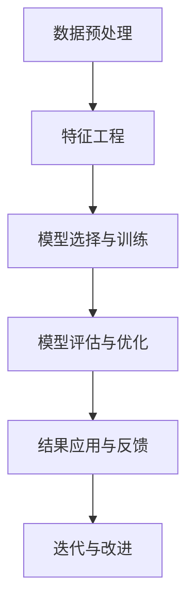

                 

### 文章标题

《如何利用机器学习优化用户体验》

### 关键词

- 用户体验
- 机器学习
- 用户行为分析
- 个性化推荐
- 自然语言处理
- 案例分析

### 摘要

本文深入探讨了机器学习在用户体验优化中的应用。首先，我们介绍了机器学习的基础概念、发展历程和应用领域。随后，详细讲解了机器学习的数学模型和算法，包括监督学习、无监督学习和强化学习。接着，我们讨论了数据预处理和特征工程的重要性。本文的核心在于展示机器学习在用户行为分析、个性化推荐系统、自然语言处理等实际应用中的效果。通过案例分析，我们进一步验证了机器学习在优化用户体验方面的巨大潜力。最后，我们展望了机器学习在用户体验优化中的未来趋势，并提出了相关的挑战与机遇。

---

### 《如何利用机器学习优化用户体验》目录大纲

**第一部分：机器学习基础**

### 第1章：机器学习概述

#### 1.1 机器学习的基本概念
- 机器学习的定义
- 机器学习的分类
- 机器学习的核心问题

#### 1.2 机器学习的发展历程
- 机器学习的历史背景
- 机器学习的主要里程碑
- 当前机器学习的趋势

#### 1.3 机器学习的应用领域
- 机器学习在工业界的应用
- 机器学习在学术研究中的应用

### 第2章：机器学习算法基础

#### 2.1 监督学习算法
- 线性回归
- 逻辑回归
- 决策树
- 随机森林
- 支持向量机

#### 2.2 无监督学习算法
- K-均值聚类
- 主成分分析
- 聚类算法的对比与应用

#### 2.3 强化学习算法
- Q-学习
- SARSA算法
- 强化学习在用户体验优化中的应用

### 第3章：数学模型与数学公式

#### 3.1 概率论与统计学基础
- 概率分布函数
- 条件概率
- 最大似然估计

#### 3.2 机器学习的数学模型
- 损失函数
- 优化算法（梯度下降、随机梯度下降）
- 拉格朗日乘数法

#### 3.3 数学公式与推导
- 概率公式推导
- 线性回归推导
- 逻辑回归推导

### 第4章：数据预处理与特征工程

#### 4.1 数据预处理
- 数据清洗
- 数据归一化
- 数据缺失值处理

#### 4.2 特征工程
- 特征选择
- 特征提取
- 特征构造

#### 4.3 特征与模型的关系
- 特征对模型性能的影响
- 特征工程与用户体验优化的关系

**第二部分：机器学习在用户体验优化中的应用**

### 第5章：用户行为分析

#### 5.1 用户行为数据收集
- 数据源选择
- 数据收集方法

#### 5.2 用户行为数据分析
- 用户画像
- 用户路径分析
- 用户流失预测

#### 5.3 用户行为与用户体验的关系
- 用户行为与满意度
- 用户行为与留存率
- 用户行为与转化率

### 第6章：个性化推荐系统

#### 6.1 推荐系统概述
- 推荐系统的定义
- 推荐系统的分类

#### 6.2 个性化推荐算法
- 协同过滤算法
- 内容推荐算法
- 混合推荐算法

#### 6.3 推荐系统评估指标
- 准确率
- 覆盖率
- 个性化程度

### 第7章：自然语言处理在用户体验优化中的应用

#### 7.1 自然语言处理基础
- 语言模型
- 词向量
- 文本分类

#### 7.2 情感分析
- 情感分类
- 情感极性分析
- 情感强度分析

#### 7.3 对话系统
- 对话系统概述
- 对话系统架构
- 对话系统优化

### 第8章：案例分析

#### 8.1 案例分析概述
- 案例选择标准
- 案例分析的目的

#### 8.2 案例一：某电商平台个性化推荐系统优化
- 项目背景
- 数据收集与预处理
- 推荐算法选择与实现
- 结果分析

#### 8.3 案例二：某社交媒体平台用户流失预测
- 项目背景
- 数据收集与预处理
- 模型选择与实现
- 结果分析

### 第9章：未来展望

#### 9.1 机器学习在用户体验优化中的未来趋势
- 新算法的应用
- 新技术的融合
- 新应用场景的开拓

#### 9.2 用户体验优化与机器学习的发展关系
- 用户体验优化的需求变化
- 机器学习技术的发展方向
- 二者之间的互动与融合

#### 9.3 用户体验优化与机器学习的挑战与机遇
- 挑战
  - 数据隐私保护
  - 模型解释性
  - 可解释性
- 机遇
  - 新应用场景的探索
  - 新技术的应用
  - 数据资源的整合

### 第10章：总结与展望

#### 9.4 总结与展望
- 本书的主要贡献
- 未来的研究方向
- 对读者的建议

### 附录

#### 附录A：常见机器学习工具与资源
- TensorFlow
- PyTorch
- Scikit-learn
- 其他常用工具与资源

#### 附录B：数学公式表
- 概率分布函数
- 线性回归公式
- 逻辑回归公式
- 支持向量机公式
- 梯度下降算法公式

#### 附录C：代码示例
- 数据预处理代码
- 机器学习算法实现代码
- 个性化推荐系统代码
- 对话系统实现代码

### Mermaid 流程图



```mermaid
graph TD
A[机器学习概述] --> B1[机器学习的基本概念]
A --> B2[机器学习的发展历程]
A --> B3[机器学习的应用领域]
C1[监督学习算法] --> D1[线性回归]
C1 --> D2[逻辑回归]
C1 --> D3[决策树]
C1 --> D4[随机森林]
C1 --> D5[支持向量机]
C2[无监督学习算法] --> E1[K-均值聚类]
C2 --> E2[主成分分析]
C2 --> E3[聚类算法的对比与应用]
C3[强化学习算法] --> F1[Q-学习]
C3 --> F2[SARSA算法]
C3 --> F3[强化学习在用户体验优化中的应用]
G1[概率论与统计学基础] --> H1[概率分布函数]
G1 --> H2[条件概率]
G1 --> H3[最大似然估计]
G2[机器学习的数学模型] --> I1[损失函数]
G2 --> I2[优化算法（梯度下降、随机梯度下降）]
G2 --> I3[拉格朗日乘数法]
G3[数学公式与推导] --> J1[概率公式推导]
G3 --> J2[线性回归推导]
G3 --> J3[逻辑回归推导]
K1[数据预处理] --> L1[数据清洗]
K1 --> L2[数据归一化]
K1 --> L3[数据缺失值处理]
K2[特征工程] --> M1[特征选择]
K2 --> M2[特征提取]
K2 --> M3[特征构造]
K3[特征与模型的关系] --> N1[特征对模型性能的影响]
K3 --> N2[特征工程与用户体验优化的关系]
O1[用户行为分析] --> P1[用户行为数据收集]
O1 --> P2[用户行为数据分析]
O1 --> P3[用户行为与用户体验的关系]
Q1[个性化推荐系统] --> R1[推荐系统概述]
Q1 --> R2[个性化推荐算法]
Q1 --> R3[推荐系统评估指标]
S1[自然语言处理基础] --> T1[语言模型]
S1 --> T2[词向量]
S1 --> T3[文本分类]
U1[情感分析] --> V1[情感分类]
U1 --> V2[情感极性分析]
U1 --> V3[情感强度分析]
U2[对话系统] --> W1[对话系统概述]
U2 --> W2[对话系统架构]
U2 --> W3[对话系统优化]
X1[案例分析] --> Y1[案例分析概述]
X1 --> Y2[案例一：某电商平台个性化推荐系统优化]
X1 --> Y3[案例二：某社交媒体平台用户流失预测]
Z1[未来展望] --> AA1[机器学习在用户体验优化中的未来趋势]
Z1 --> AA2[用户体验优化与机器学习的发展关系]
Z1 --> AA3[用户体验优化与机器学习的挑战与机遇]
BB1[常见机器学习工具与资源] --> CC1[TensorFlow]
BB1 --> CC2[PyTorch]
BB1 --> CC3[Scikit-learn]
BB1 --> CC4[其他常用工具与资源]
DD1[数学公式表] --> EE1[概率分布函数]
DD1 --> EE2[线性回归公式]
DD1 --> EE3[逻辑回归公式]
DD1 --> EE4[支持向量机公式]
DD1 --> EE5[梯度下降算法公式]
FF1[代码示例] --> GG1[数据预处理代码]
FF1 --> GG2[机器学习算法实现代码]
FF1 --> GG3[个性化推荐系统代码]
FF1 --> GG4[对话系统实现代码]
```

### 第一部分：机器学习基础

#### 第1章：机器学习概述

##### 1.1 机器学习的基本概念

机器学习（Machine Learning）是人工智能（Artificial Intelligence, AI）的一个重要分支，主要研究如何让计算机从数据中自动学习，并通过学习来改进自身的性能。具体来说，机器学习是指一种编程范式，它使计算机通过数据驱动的方式获取知识和技能，而不是通过显式编程指令。

**定义：**

机器学习可以定义为一门研究如何构建和开发算法，使计算机系统能够从经验中学习和优化其性能的学科。

**分类：**

机器学习可以分为以下几类：

1. **监督学习（Supervised Learning）：**
   在监督学习中，模型通过训练数据集学习，其中每个样本都有对应的标签。训练的目的是学习一个函数，可以将新的数据映射到其标签上。

2. **无监督学习（Unsupervised Learning）：**
   无监督学习不使用标签信息，模型的目标是发现数据中的结构，如图形、模式或关联。

3. **强化学习（Reinforcement Learning）：**
   强化学习是一种交互式学习范式，其中模型通过与环境的交互来学习优化其行为策略。

4. **半监督学习（Semi-Supervised Learning）：**
   半监督学习结合了监督学习和无监督学习的特点，使用少量的标签数据和大量的无标签数据来训练模型。

5. **强化学习（Reinforcement Learning）：**
   强化学习是一种通过试错和反馈来学习的范式，其目标是学习最大化长期奖励。

**核心问题：**

机器学习主要解决以下几个核心问题：

1. **预测问题（Prediction）：**
   预测问题涉及将输入数据映射到输出标签。常见的预测问题包括分类和回归。

2. **聚类问题（Clustering）：**
   聚类问题旨在将数据点分组，使得同一组中的数据点彼此相似，而不同组的数据点之间差异较大。

3. **降维问题（Dimensionality Reduction）：**
   降维问题旨在降低数据的维度，同时保持数据的结构信息。

4. **异常检测（Outlier Detection）：**
   异常检测旨在识别数据集中的异常或异常行为。

##### 1.2 机器学习的发展历程

机器学习的历史可以追溯到20世纪50年代，以下是几个重要的里程碑：

- **1956年：人工智能的诞生：** 由约翰·麦卡锡（John McCarthy）等人发起的达特茅斯会议被认为是人工智能领域的诞生。

- **1959年： Arthur Samuel 开发了第一个训练的编程游戏程序。**

- **1960年代： AI的第一次寒冬：** 由于对AI过高期望未实现，导致投资减少。

- **1980年代： 专家系统的兴起：** 专家系统在多个领域取得了显著成功，例如医疗诊断、化学分析和金融分析。

- **1990年代： 数据挖掘与机器学习：** 随着计算机性能的提升和大量数据的积累，数据挖掘和机器学习开始流行。

- **2006年： 大数据与深度学习：** Geoffrey Hinton等人重新关注深度学习，并提出了使用更多数据和大批参数的“深度信念网络”。

- **2012年： 深度学习的突破：** AlexNet在ImageNet挑战赛中取得巨大成功，标志着深度学习的崛起。

- **至今：** 机器学习在各个领域不断深入应用，如自然语言处理、计算机视觉、推荐系统等。

##### 1.3 机器学习的应用领域

机器学习在工业界和学术研究领域都有广泛的应用：

**工业界应用：**

- **金融：** 风险评估、欺诈检测、信用评分。
- **医疗：** 疾病诊断、药物研发、基因组学分析。
- **零售：** 个性化推荐、库存管理、价格优化。
- **制造业：** 质量控制、预测维护、生产优化。
- **能源：** 能源预测、智能电网、节能措施。

**学术研究领域：**

- **计算机视觉：** 图像分类、目标检测、人脸识别。
- **自然语言处理：** 语言建模、机器翻译、情感分析。
- **强化学习：** 游戏AI、机器人控制、智能决策。
- **数据挖掘：** 聚类分析、关联规则学习、异常检测。
- **生物信息学：** 基因组分析、蛋白质结构预测。

### 第2章：机器学习算法基础

在了解了机器学习的基本概念和发展历程后，我们需要进一步了解机器学习算法的基础知识。本章将介绍几种常见的机器学习算法，包括监督学习、无监督学习和强化学习。

#### 2.1 监督学习算法

监督学习是最常见的机器学习类型之一，其核心思想是通过已知输入和输出数据来训练模型，然后使用这个模型对未知数据进行预测。以下是几种常见的监督学习算法：

##### 2.1.1 线性回归

线性回归是最简单的监督学习算法之一，它试图通过找到一条直线来映射输入特征和输出目标变量之间的关系。

**数学模型：**

假设我们有n个训练样本，每个样本由特征向量x和目标变量y组成。线性回归模型可以表示为：

$$y = \beta_0 + \beta_1 x_1 + \beta_2 x_2 + ... + \beta_n x_n + \epsilon$$

其中，$\beta_0$是截距，$\beta_1, \beta_2, ..., \beta_n$是线性系数，$\epsilon$是误差项。

**损失函数：**

为了最小化误差，我们通常使用均方误差（MSE）作为损失函数：

$$J(\theta) = \frac{1}{2m} \sum_{i=1}^{m} (h_\theta(x^{(i)}) - y^{(i)})^2$$

其中，$h_\theta(x)$是线性回归模型的预测值，$\theta$是参数向量，$m$是训练样本数量。

**优化算法：**

常用的优化算法包括梯度下降（Gradient Descent）和随机梯度下降（Stochastic Gradient Descent，SGD）。

**伪代码：**

```
初始化参数θ
循环（迭代次数）：
  计算梯度∇θJ(θ)
  更新θ：θ = θ - α∇θJ(θ)
  计算预测值hθ(x)
```

##### 2.1.2 逻辑回归

逻辑回归是一种用于分类问题的监督学习算法，它通过找到输入特征和输出标签之间的逻辑关系来进行分类。

**数学模型：**

逻辑回归的预测函数是一个逻辑函数（Sigmoid Function）：

$$h_\theta(x) = \frac{1}{1 + e^{-(\theta_0 + \theta_1 x_1 + \theta_2 x_2 + ... + \theta_n x_n)}$$

其中，$\theta_0$是截距，$\theta_1, \theta_2, ..., \theta_n$是线性系数。

**损失函数：**

逻辑回归使用交叉熵（Cross-Entropy Loss）作为损失函数：

$$J(\theta) = -\frac{1}{m} \sum_{i=1}^{m} [y^{(i)} \log(h_\theta(x^{(i)})) + (1 - y^{(i)}) \log(1 - h_\theta(x^{(i)}))]$$

**优化算法：**

逻辑回归同样可以使用梯度下降和随机梯度下降进行优化。

**伪代码：**

```
初始化参数θ
循环（迭代次数）：
  计算梯度∇θJ(θ)
  更新θ：θ = θ - α∇θJ(θ)
  计算预测值hθ(x)
```

##### 2.1.3 决策树

决策树是一种基于树形结构的监督学习算法，它通过一系列的判断规则来对数据进行分类或回归。

**数学模型：**

决策树的构建过程是基于信息增益（Information Gain）或基尼不纯度（Gini Impurity）来选择最佳特征和分割点。

**构建过程：**

1. 选择特征集合。
2. 对于每个特征，计算其信息增益或基尼不纯度。
3. 选择具有最大信息增益或最小基尼不纯度的特征作为分割点。
4. 将数据分割为子集。
5. 对每个子集重复步骤2-4，直到满足停止条件（如最大深度、最小样本数量等）。

**伪代码：**

```
创建空树
对于每个特征：
  计算信息增益或基尼不纯度
  选择具有最大信息增益或最小基尼不纯度的特征作为分割点
  将数据分割为子集
  对于每个子集：
    如果满足停止条件：
      将子集标记为叶子节点
    否则：
      递归构建子树
```

##### 2.1.4 随机森林

随机森林（Random Forest）是一种基于决策树的集成学习方法，它通过构建多个决策树并对预测结果进行平均来提高模型的性能。

**数学模型：**

随机森林由多个决策树组成，每个决策树独立训练。对于分类问题，每个树输出一个类别，最终类别为所有树输出的多数类别。

**构建过程：**

1. 随机选择特征子集。
2. 构建决策树。
3. 重复步骤1和2，构建多个决策树。
4. 对每个样本，每个决策树输出一个类别。
5. 统计每个类别的投票结果，输出多数类别作为最终预测结果。

**伪代码：**

```
初始化空森林
对于每个树：
  从特征集合中随机选择特征子集
  构建决策树
  对每个样本：
    遍历所有树
    统计每个类别的投票结果
    输出多数类别作为预测结果
```

##### 2.1.5 支持向量机

支持向量机（Support Vector Machine，SVM）是一种强大的分类算法，它通过找到最佳超平面来分隔不同类别的数据点。

**数学模型：**

SVM的目标是找到一个超平面，使得不同类别的数据点之间的距离最大化。其数学模型可以表示为：

$$\max_{\theta} W^T W$$

其中，$W$是超平面的参数。

**优化算法：**

SVM的优化算法通常使用拉格朗日乘数法（Lagrange Multiplier）和二次规划（Quadratic Programming）。

**伪代码：**

```
初始化参数θ
构建拉格朗日函数L(θ, α)
求解二次规划问题，得到参数θ和α
计算支持向量
构建超平面
```

#### 2.2 无监督学习算法

无监督学习算法不依赖于标签信息，其目的是发现数据中的隐含结构和模式。以下是几种常见的无监督学习算法：

##### 2.2.1 K-均值聚类

K-均值聚类是一种基于距离的聚类算法，其目标是找到K个中心点，使得每个样本到其对应中心点的距离最小。

**数学模型：**

K-均值聚类的基本步骤如下：

1. 随机初始化K个中心点。
2. 计算每个样本到每个中心点的距离，并将其分配到最近的中心点。
3. 更新每个中心点的坐标，使其成为其对应样本的平均值。
4. 重复步骤2和3，直到中心点的坐标不再变化或满足停止条件。

**伪代码：**

```
初始化K个中心点
循环（迭代次数）：
  计算每个样本到每个中心点的距离
  将每个样本分配到最近的中心点
  更新每个中心点的坐标
  检查是否满足停止条件
```

##### 2.2.2 主成分分析

主成分分析（Principal Component Analysis，PCA）是一种降维算法，其目标是找到数据的主要变化方向，并在此基础上进行数据压缩。

**数学模型：**

PCA的基本步骤如下：

1. 计算数据集的均值向量。
2. 计算协方差矩阵。
3. 计算协方差矩阵的特征值和特征向量。
4. 选择最大的K个特征向量，作为新的特征空间。
5. 将数据投影到新的特征空间。

**伪代码：**

```
计算数据集的均值向量
计算协方差矩阵
计算协方差矩阵的特征值和特征向量
选择最大的K个特征向量
将数据投影到新的特征空间
```

##### 2.2.3 聚类算法的对比与应用

不同的聚类算法有其各自的优缺点和适用场景，以下是对几种常见聚类算法的对比：

- **K-均值聚类：** 简单、高效，但容易陷入局部最优解，对初始中心点敏感。
- **层次聚类：** 可以生成层次结构，但计算复杂度较高，不适用于大规模数据。
- **DBSCAN：** 可以处理噪声和异常点，但参数选择较为复杂。

在实际应用中，根据数据特点和需求选择合适的聚类算法至关重要。

#### 2.3 强化学习算法

强化学习（Reinforcement Learning，RL）是一种通过试错和反馈来学习策略的机器学习范式。其核心是智能体（Agent）通过与环境（Environment）的交互来学习最优行为策略。

##### 2.3.1 Q-学习

Q-学习是一种基于值函数的强化学习算法，其目标是学习一个价值函数，表示在当前状态下采取某一动作的预期回报。

**数学模型：**

Q-学习的核心是Q值函数，其定义如下：

$$Q(s, a) = \sum_{s'} P(s' | s, a) \cdot R(s', a) + \gamma \sum_{a'} Q(s', a')$$

其中，$s$是状态，$a$是动作，$s'$是下一状态，$a'$是下一动作，$P(s' | s, a)$是状态转移概率，$R(s', a')$是奖励函数，$\gamma$是折扣因子。

**优化算法：**

Q-学习的优化算法通常使用采样更新策略，其基本步骤如下：

1. 初始化Q值函数。
2. 在环境中进行采样，记录状态、动作、奖励和下一状态。
3. 更新Q值函数：$Q(s, a) = Q(s, a) + \alpha [R(s', a') + \gamma \max_{a'} Q(s', a') - Q(s, a)]$。
4. 重复步骤2和3，直到收敛或满足停止条件。

**伪代码：**

```
初始化Q值函数
循环（迭代次数）：
  在环境中进行采样，记录状态、动作、奖励和下一状态
  更新Q值函数
```

##### 2.3.2 SARSA算法

SARSA（State-Action-Reward-State-Action）算法是一种基于策略的强化学习算法，其核心是同时考虑当前状态和下一状态的奖励。

**数学模型：**

SARSA算法的更新公式如下：

$$Q(s, a) = Q(s, a) + \alpha [R(s', a') + \gamma Q(s', a') - Q(s, a)]$$

**优化算法：**

SARSA算法的基本步骤如下：

1. 初始化Q值函数。
2. 在环境中进行采样，记录状态、动作、奖励和下一状态。
3. 根据当前状态和Q值函数选择动作。
4. 执行动作，记录下一状态和奖励。
5. 更新Q值函数。
6. 重复步骤3-5，直到收敛或满足停止条件。

**伪代码：**

```
初始化Q值函数
循环（迭代次数）：
  在环境中进行采样，记录状态、动作、奖励和下一状态
  根据当前状态和Q值函数选择动作
  执行动作，记录下一状态和奖励
  更新Q值函数
```

##### 2.3.3 强化学习在用户体验优化中的应用

强化学习在用户体验优化中的应用主要体现在以下几个方面：

1. **用户行为预测：** 通过强化学习模型预测用户行为，从而优化推荐系统、广告投放等。
2. **游戏化设计：** 强化学习可用于设计游戏化机制，如奖励系统、挑战机制等，以提升用户体验。
3. **界面优化：** 强化学习可用于优化用户界面，如布局、颜色等，以提高用户满意度。

通过以上对机器学习算法基础的介绍，我们可以更好地理解这些算法的基本原理和应用。在接下来的章节中，我们将进一步探讨机器学习的数学模型、数据预处理和特征工程等关键技术，以帮助读者更好地理解和应用机器学习。

### 第3章：数学模型与数学公式

在理解了机器学习的基本算法后，深入探讨其背后的数学模型和公式对于掌握和运用这些算法至关重要。本章将详细介绍概率论与统计学基础、机器学习的数学模型以及常见的数学公式和推导。

#### 3.1 概率论与统计学基础

概率论和统计学是机器学习的基础学科，理解它们有助于我们更好地理解和应用机器学习算法。

##### 3.1.1 概率分布函数

概率分布函数描述了一个随机变量在不同取值下的概率分布。常见的概率分布函数包括：

- **伯努利分布（Bernoulli Distribution）：** 伯努利分布是一个二项分布，只有两个可能的结果：成功或失败，通常用$p$表示成功的概率。
  $$P(X = k) = p^k (1-p)^{1-k}$$

- **二项分布（Binomial Distribution）：** 二项分布描述了在$n$次独立重复试验中成功次数的概率分布。
  $$P(X = k) = C_n^k p^k (1-p)^{n-k}$$
  其中，$C_n^k$是组合数，表示从$n$个元素中选取$k$个元素的组合数。

- **正态分布（Normal Distribution）：** 正态分布是最常见的高斯分布，描述了数据在平均值$\mu$和标准差$\sigma$下的概率分布。
  $$f(x|\mu, \sigma^2) = \frac{1}{\sqrt{2\pi\sigma^2}} e^{-\frac{(x-\mu)^2}{2\sigma^2}}$$

##### 3.1.2 条件概率

条件概率描述了在某个事件已发生的情况下，另一个事件发生的概率。条件概率的定义如下：

$$P(A|B) = \frac{P(A \cap B)}{P(B)}$$

其中，$P(A \cap B)$是事件$A$和事件$B$同时发生的概率，$P(B)$是事件$B$发生的概率。

##### 3.1.3 最大似然估计

最大似然估计是一种参数估计方法，通过找到使观测数据概率最大的参数值。最大似然估计的公式如下：

$$\hat{\theta} = \arg\max_{\theta} P(\text{observed data}|\theta)$$

其中，$\hat{\theta}$是最大似然估计值，$P(\text{observed data}|\theta)$是观测数据在参数$\theta$下的概率。

#### 3.2 机器学习的数学模型

机器学习的数学模型主要包括损失函数、优化算法和决策函数。

##### 3.2.1 损失函数

损失函数是评估模型预测值与真实值之间差异的函数，常用的损失函数包括：

- **均方误差（MSE，Mean Squared Error）：**
  $$J(\theta) = \frac{1}{2m} \sum_{i=1}^{m} (h_\theta(x^{(i)}) - y^{(i)})^2$$
  其中，$h_\theta(x^{(i)})$是模型预测值，$y^{(i)}$是真实值，$m$是样本数量。

- **交叉熵损失（Cross-Entropy Loss）：**
  $$J(\theta) = -\frac{1}{m} \sum_{i=1}^{m} [y^{(i)} \log(h_\theta(x^{(i)})) + (1 - y^{(i)}) \log(1 - h_\theta(x^{(i)}))]$$
  其中，$h_\theta(x^{(i)})$是模型预测值，$y^{(i)}$是真实值，$m$是样本数量。

##### 3.2.2 优化算法

优化算法用于最小化损失函数，寻找最优参数。常用的优化算法包括：

- **梯度下降（Gradient Descent）：**
  $$\theta = \theta - \alpha \nabla_\theta J(\theta)$$
  其中，$\theta$是参数，$\alpha$是学习率，$\nabla_\theta J(\theta)$是损失函数关于参数的梯度。

- **随机梯度下降（Stochastic Gradient Descent，SGD）：**
  $$\theta = \theta - \alpha \nabla_\theta J(\theta)$$
  其中，$\theta$是参数，$\alpha$是学习率，$\nabla_\theta J(\theta)$是损失函数关于参数的随机梯度。

- **Adam优化器：**
  $$m_t = \beta_1 m_{t-1} + (1 - \beta_1) [g_t - \mu_t]$$
  $$v_t = \beta_2 v_{t-1} + (1 - \beta_2) [(g_t - \mu_t)^2]$$
  $$\theta = \theta - \alpha \frac{m_t}{\sqrt{v_t} + \epsilon}$$
  其中，$m_t$是梯度的一阶矩估计，$v_t$是梯度二阶矩估计，$\beta_1$和$\beta_2$是超参数，$\epsilon$是常数。

##### 3.2.3 决策函数

决策函数是模型根据输入特征做出的决策。对于分类问题，常用的决策函数包括：

- **线性决策函数（Linear Decision Function）：**
  $$f(x) = \text{sign}(\theta^T x + b)$$
  其中，$\theta$是权重向量，$b$是偏置项，$\text{sign}$是符号函数。

- **Sigmoid决策函数（Sigmoid Decision Function）：**
  $$f(x) = \frac{1}{1 + e^{-\theta^T x}}$$
  其中，$\theta$是权重向量。

#### 3.3 数学公式与推导

以下是几个重要数学公式的推导：

##### 3.3.1 线性回归推导

线性回归的损失函数为：

$$J(\theta) = \frac{1}{2m} \sum_{i=1}^{m} (h_\theta(x^{(i)}) - y^{(i)})^2$$

其中，$h_\theta(x^{(i)}) = \theta^T x^{(i)} + b$。

对损失函数求导：

$$\nabla_\theta J(\theta) = \frac{1}{m} \sum_{i=1}^{m} [h_\theta(x^{(i)}) - y^{(i)}] x^{(i)}$$

令梯度等于零，解得：

$$\theta = \left(\frac{1}{m} X^T X\right)^{-1} X^T y$$

其中，$X$是特征矩阵，$y$是目标向量。

##### 3.3.2 逻辑回归推导

逻辑回归的损失函数为：

$$J(\theta) = -\frac{1}{m} \sum_{i=1}^{m} [y^{(i)} \log(h_\theta(x^{(i)})) + (1 - y^{(i)}) \log(1 - h_\theta(x^{(i)}))]$$

其中，$h_\theta(x^{(i)}) = \frac{1}{1 + e^{-(\theta_0 + \theta_1 x_1 + \theta_2 x_2 + ... + \theta_n x_n)}}$。

对损失函数求导：

$$\nabla_\theta J(\theta) = \frac{1}{m} \sum_{i=1}^{m} [h_\theta(x^{(i)}) (1 - h_\theta(x^{(i)})) x^{(i)}]$$

令梯度等于零，解得：

$$\theta = \left(\frac{1}{m} X^T X\right)^{-1} X^T y$$

##### 3.3.3 支持向量机推导

支持向量机的目标是最小化损失函数：

$$J(\theta) = \frac{1}{2} \sum_{i=1}^{m} \sum_{j=1}^{m} (\theta_i - \theta_j)^2$$

其中，$\theta_i$和$\theta_j$是支持向量。

对损失函数求导：

$$\nabla_\theta J(\theta) = \sum_{i=1}^{m} (\theta_i - \theta_j)$$

令梯度等于零，解得：

$$\theta_i = \theta_j$$

其中，$i$和$j$是支持向量。

通过以上对概率论与统计学基础、机器学习的数学模型以及常见数学公式和推导的介绍，我们深入了解了机器学习背后的数学原理。在接下来的章节中，我们将进一步探讨数据预处理和特征工程，以便更好地应用机器学习算法优化用户体验。

### 第4章：数据预处理与特征工程

在机器学习项目中，数据预处理和特征工程是至关重要的一步。良好的数据预处理和特征工程可以提高模型性能，减少过拟合，并帮助模型更好地理解数据。本章将详细介绍数据预处理和特征工程的概念、方法以及它们在用户体验优化中的重要性。

#### 4.1 数据预处理

数据预处理是机器学习项目中的第一步，目的是将原始数据转化为适合模型训练的形式。数据预处理包括以下几方面：

##### 4.1.1 数据清洗

数据清洗是指去除数据中的噪声和不完整数据，以提高数据质量。常见的数据清洗方法包括：

- **缺失值处理：** 缺失值可以采用以下方法处理：
  - 删除缺失值：如果缺失值太多，可以考虑删除这些样本。
  - 填充缺失值：可以使用平均值、中位数、众数等统计方法填充缺失值。
  - 前向填充和后向填充：在时间序列数据中，可以使用前一个时间点的值填充当前时间点的缺失值。

- **异常值处理：** 异常值是指与大多数数据点相比，显著偏离的数据。异常值可以采用以下方法处理：
  - 删除异常值：如果异常值太多，可以考虑删除这些样本。
  - 调整异常值：将异常值调整为更合理的值。

- **重复值处理：** 去除重复的数据，以减少数据冗余。

##### 4.1.2 数据归一化

数据归一化是将不同特征的数据范围调整到相同的尺度，以便模型能够更好地处理数据。常见的数据归一化方法包括：

- **最小-最大缩放（Min-Max Scaling）：**
  $$x_{\text{scaled}} = \frac{x_{\text{original}} - x_{\text{min}}}{x_{\text{max}} - x_{\text{min}}}$$

- **标准缩放（Standard Scaling）：**
  $$x_{\text{scaled}} = \frac{x_{\text{original}} - \mu}{\sigma}$$
  其中，$\mu$是特征的平均值，$\sigma$是特征的标准差。

##### 4.1.3 数据缺失值处理

数据缺失值处理是数据预处理中的一项重要任务。以下方法可以帮助我们处理缺失值：

- **删除缺失值：** 如果缺失值太多，可以考虑删除这些样本。
- **插补缺失值：** 使用插补方法填补缺失值，如均值插补、中位数插补、K近邻插补等。
- **模型插补：** 使用回归模型或决策树模型预测缺失值。

#### 4.2 特征工程

特征工程是指从原始数据中提取有助于模型训练的特征，并对其进行处理，以提高模型性能。特征工程包括以下方面：

##### 4.2.1 特征选择

特征选择是指从原始特征中筛选出对模型训练有帮助的特征，以减少数据冗余和提高模型性能。常见的方法包括：

- **过滤式特征选择（Filter Feature Selection）：** 根据特征的重要性、相关性等统计指标进行筛选。
- **包裹式特征选择（Wrapper Feature Selection）：** 通过训练不同的模型并评估其性能来选择特征。
- **嵌入式特征选择（Embedded Feature Selection）：** 在模型训练过程中自动进行特征选择。

##### 4.2.2 特征提取

特征提取是指从原始特征中生成新的特征，以增加数据的维度信息和区分度。常见的方法包括：

- **主成分分析（PCA）：** 通过线性变换将原始特征映射到新的正交特征空间，从而降低数据的维度。
- **线性判别分析（LDA）：** 通过最大化不同类别的方差，将数据映射到新的特征空间，从而提高分类效果。
- **自动编码器（Autoencoder）：** 通过训练一个编码器和解码器，将原始特征映射到一个低维特征空间，从而提取关键特征。

##### 4.2.3 特征构造

特征构造是指通过组合原始特征或生成新的特征，以增加数据的区分度。常见的方法包括：

- **特征交叉（Feature Cross）：** 将原始特征进行组合，生成新的特征。
- **时间序列特征：** 从时间序列数据中提取趋势、季节性等特征。
- **文本特征：** 从文本数据中提取词频、词嵌入等特征。

#### 4.3 特征与模型的关系

特征对模型性能有着重要影响，合理的特征工程可以提高模型性能，减少过拟合。以下是从特征的角度分析模型性能的几个方面：

- **特征重要性：** 不同的特征对模型的贡献不同，通过特征选择和特征提取，可以筛选出对模型训练有帮助的特征。
- **特征多样性：** 特征的多样性可以增加数据的区分度，有助于模型学习到更复杂的模式。
- **特征可解释性：** 特征的可解释性可以帮助我们理解模型的工作原理，从而更好地优化模型。

#### 4.4 特征工程与用户体验优化的关系

特征工程在用户体验优化中起着至关重要的作用。通过合理的特征工程，可以提高模型对用户行为的预测准确性，从而优化用户体验。以下是从用户体验的角度分析特征工程的重要性：

- **个性化推荐：** 特征工程有助于提取用户的兴趣和偏好，从而提高个性化推荐系统的准确性和覆盖率。
- **用户流失预测：** 特征工程有助于提取影响用户流失的关键因素，从而提高预测准确性，采取有效措施减少用户流失。
- **界面优化：** 特征工程有助于提取用户行为特征，从而优化界面设计，提高用户满意度。

综上所述，数据预处理和特征工程是机器学习项目中不可或缺的一步，通过合理的预处理和特征工程，可以提高模型性能，优化用户体验。

### 第5章：用户行为分析

用户行为分析是优化用户体验的关键环节，通过对用户行为的深入理解，可以揭示用户的兴趣、偏好和使用习惯，从而为产品优化提供有力支持。本章将详细介绍用户行为数据分析的方法和应用。

#### 5.1 用户行为数据收集

用户行为数据收集是用户行为分析的第一步，数据的来源和收集方法决定了分析结果的可靠性和准确性。以下是几种常见的用户行为数据收集方法：

##### 5.1.1 数据源选择

用户行为数据可以从多个渠道收集，包括：

- **服务器日志：** 服务器日志记录了用户在使用产品时的各种操作，如页面访问、点击、搜索等。
- **客户端日志：** 客户端日志记录了用户在设备上的操作，如安装、启动、使用时长等。
- **用户调查问卷：** 通过在线调查问卷收集用户反馈，了解用户需求和满意度。
- **社交媒体数据：** 从社交媒体平台收集用户发布的评论、点赞、分享等数据，分析用户行为和兴趣。

##### 5.1.2 数据收集方法

常见的用户行为数据收集方法包括：

- **日志采集：** 利用日志采集工具，如ELK（Elasticsearch、Logstash、Kibana）等，自动收集和存储用户行为数据。
- **API调用：** 通过API接口获取用户行为数据，如用户注册信息、搜索记录等。
- **SDK（Software Development Kit）：** 在应用程序中集成SDK，实时收集用户行为数据，并上传到服务器。

#### 5.2 用户行为数据分析

用户行为数据分析是用户行为分析的核心，通过对收集到的用户行为数据进行分析，可以揭示用户的兴趣、偏好和使用习惯。以下是几种常见的用户行为数据分析方法：

##### 5.2.1 用户画像

用户画像是通过对用户行为数据的综合分析，构建出一个关于用户特征和行为的总体描述。用户画像通常包括以下方面：

- **基本信息：** 年龄、性别、职业等基本信息。
- **兴趣标签：** 根据用户的浏览、搜索和分享行为，提取兴趣标签，如科技、娱乐、美食等。
- **行为特征：** 用户的行为习惯，如使用时长、访问频率、页面停留时间等。
- **消费习惯：** 用户在购物、充值等交易行为上的习惯，如消费金额、消费时段等。

##### 5.2.2 用户路径分析

用户路径分析是指通过分析用户在产品中的行为轨迹，揭示用户的操作顺序和使用习惯。用户路径分析包括以下方面：

- **用户路径图：** 利用图形化的方式展示用户在产品中的操作路径，识别用户的常用路径和异常路径。
- **停留时长分析：** 分析用户在不同页面上的停留时间，识别页面热点和冷点。
- **转化路径分析：** 分析用户从访问到转化的完整路径，识别转化过程中的关键环节。

##### 5.2.3 用户流失预测

用户流失预测是指通过分析用户行为数据，预测哪些用户可能会停止使用产品，从而采取预防措施减少用户流失。用户流失预测通常包括以下方面：

- **流失预警：** 根据用户的异常行为，如访问频率下降、使用时长减少等，对可能流失的用户进行预警。
- **流失原因分析：** 分析用户流失的原因，如产品功能不足、用户体验差、竞争产品等。
- **流失预防策略：** 针对流失原因，制定相应的预防策略，如优化产品功能、提高用户体验、推出优惠活动等。

#### 5.3 用户行为与用户体验的关系

用户行为与用户体验密切相关，通过对用户行为的深入分析，可以更好地理解用户需求和满意度，从而优化用户体验。以下是用户行为与用户体验之间的关系：

- **用户满意度：** 用户的行为数据，如页面停留时间、点击次数等，可以反映用户对产品的满意度。通过分析用户满意度，可以识别产品中的不足之处，并进行优化。
- **用户留存率：** 用户的行为数据，如访问频率、使用时长等，可以反映用户的留存情况。通过分析用户留存率，可以识别产品中可能存在的问题，并采取相应的措施提高用户留存率。
- **用户转化率：** 用户的行为数据，如点击购买、注册账号等，可以反映用户的转化情况。通过分析用户转化率，可以优化产品中的转化环节，提高用户的转化意愿。

#### 5.4 用户行为分析工具与技巧

为了更好地进行用户行为分析，我们可以使用以下工具和技巧：

- **数据分析工具：** 如Excel、Python、R等，用于数据清洗、分析和可视化。
- **用户行为分析平台：** 如Google Analytics、Mixpanel、Userbooster等，提供用户行为数据的实时监控和分析。
- **A/B测试：** 通过对比不同版本的页面或功能，分析用户对不同版本的响应，从而优化产品。

总之，用户行为分析是优化用户体验的重要手段，通过对用户行为的深入分析，可以更好地理解用户需求，优化产品设计和功能，提高用户满意度和留存率。

### 第6章：个性化推荐系统

个性化推荐系统是提高用户体验的重要工具，它通过分析用户行为和偏好，为用户提供个性化的内容和产品推荐。本章将详细介绍个性化推荐系统的基本概念、算法和应用。

#### 6.1 推荐系统概述

推荐系统（Recommender System）是一种信息过滤技术，旨在向用户推荐其可能感兴趣的项目或内容。推荐系统广泛应用于电子商务、社交媒体、视频平台等多个领域，极大地提高了用户体验和满意度。

##### 6.1.1 推荐系统的定义

推荐系统是指利用机器学习算法和统计方法，根据用户的历史行为和偏好，预测用户可能感兴趣的项目或内容，从而向用户推荐的一种信息过滤技术。

##### 6.1.2 推荐系统的分类

推荐系统可以分为以下几类：

- **基于内容的推荐（Content-Based Filtering）：** 根据用户过去对某些项目的喜好，提取项目的特征，然后找到与用户喜好相似的项目进行推荐。
- **协同过滤（Collaborative Filtering）：** 通过分析用户之间的共同兴趣和评价，为用户推荐他们可能感兴趣的项目。
- **混合推荐（Hybrid Recommender Systems）：** 结合基于内容的推荐和协同过滤，利用两者的优点，提高推荐系统的性能。

#### 6.2 个性化推荐算法

个性化推荐算法是推荐系统的核心，根据不同的推荐场景和数据类型，可以选择不同的推荐算法。

##### 6.2.1 协同过滤算法

协同过滤算法是最常见的推荐算法之一，主要包括以下两种类型：

- **用户基于的协同过滤（User-Based Collaborative Filtering）：** 通过分析用户之间的相似度，找到与目标用户兴趣相似的其他用户，然后推荐这些用户喜欢的项目。
  **算法步骤：**
  1. 计算用户之间的相似度，如余弦相似度、皮尔逊相关系数等。
  2. 根据相似度矩阵，找到与目标用户最相似的其他用户。
  3. 推荐这些用户喜欢的项目。

- **项基于的协同过滤（Item-Based Collaborative Filtering）：** 通过分析项目之间的相似度，找到与目标项目相似的其他项目，然后推荐这些项目。
  **算法步骤：**
  1. 计算项目之间的相似度，如余弦相似度、Jaccard系数等。
  2. 根据相似度矩阵，找到与目标项目最相似的其他项目。
  3. 推荐这些项目。

##### 6.2.2 内容推荐算法

内容推荐算法根据项目的特征和用户的历史行为，为用户推荐与之相关的内容。常见的内容推荐算法包括：

- **基于关键词的推荐：** 通过分析项目的关键词，为用户推荐具有相似关键词的项目。
- **基于标签的推荐：** 通过为项目分配标签，为用户推荐具有相同或相似标签的项目。
- **基于属性的推荐：** 通过分析项目的属性，如分类、风格、价格等，为用户推荐具有相似属性的项目。

##### 6.2.3 混合推荐算法

混合推荐算法结合了基于内容的推荐和协同过滤，利用两者的优点，提高推荐系统的性能。混合推荐算法通常包括以下几种类型：

- **基于模型的混合推荐：** 结合机器学习模型和协同过滤，利用模型预测用户对项目的兴趣，并结合协同过滤推荐结果进行优化。
- **基于规则的混合推荐：** 将规则和协同过滤相结合，通过规则为用户提供个性化推荐，并结合协同过滤结果进行调整。
- **基于特征的混合推荐：** 结合项目的特征和用户的历史行为，通过机器学习模型预测用户对项目的兴趣，并结合协同过滤推荐结果进行优化。

#### 6.3 推荐系统评估指标

推荐系统的性能评估是确保其推荐质量的重要步骤。以下是几种常见的推荐系统评估指标：

- **准确率（Precision）：** 推荐结果中实际感兴趣的项目的比例。
  $$Precision = \frac{TP}{TP + FP}$$
  其中，$TP$是真正例（推荐的项目用户确实感兴趣），$FP$是假正例（推荐的项目用户不感兴趣）。

- **召回率（Recall）：** 推荐结果中实际感兴趣项目的比例。
  $$Recall = \frac{TP}{TP + FN}$$
  其中，$TP$是真正例，$FN$是假反例（用户感兴趣的项目未推荐）。

- **F1值（F1-Score）：** 准确率和召回率的加权平均。
  $$F1 = 2 \times \frac{Precision \times Recall}{Precision + Recall}$$

- **覆盖率（Coverage）：** 推荐结果中包含的不同项目的比例。
  $$Coverage = \frac{\text{推荐的不同项目数量}}{\text{所有可能的项目数量}}$$

- **新颖度（Novelty）：** 推荐结果中包含的新项目比例。
  $$Novelty = \frac{\text{推荐的新项目数量}}{\text{推荐的不同项目数量}}$$

#### 6.4 个性化推荐算法的应用

个性化推荐算法在多个领域得到了广泛应用，以下是一些典型应用：

- **电子商务：** 通过分析用户的浏览和购买行为，为用户推荐相关的商品，提高销售额和用户满意度。
- **社交媒体：** 通过分析用户的互动和兴趣，为用户推荐感兴趣的内容，提高用户活跃度和留存率。
- **视频平台：** 通过分析用户的观看记录和偏好，为用户推荐相关的视频，提高用户的观看时长和粘性。

总之，个性化推荐系统通过深入分析用户行为和偏好，为用户提供个性化的推荐，极大地提升了用户体验。随着机器学习技术的发展，个性化推荐系统将不断优化和升级，为用户提供更加精准和个性化的服务。

### 第7章：自然语言处理在用户体验优化中的应用

自然语言处理（Natural Language Processing，NLP）是机器学习的重要分支，专注于使计算机理解和处理人类语言。NLP在用户体验优化中的应用极为广泛，涵盖了文本分类、情感分析和对话系统等多个领域。本章将深入探讨NLP在这些领域的应用，以及如何利用NLP技术提升用户体验。

#### 7.1 自然语言处理基础

NLP的核心任务是使计算机能够理解、解释和生成人类语言。以下是一些基础的NLP概念和技术：

##### 7.1.1 语言模型

语言模型（Language Model）是一种概率模型，用于预测下一个单词或字符的概率。这种模型通常通过统计方法或深度学习算法训练，能够捕捉语言的统计规律。

- **n-gram模型：** n-gram模型是一种基于历史字符序列的语言模型，它将前$n$个字符作为输入，预测下一个字符。
- **神经网络语言模型：** 神经网络语言模型（如RNN、LSTM、Transformer等）通过学习大量文本数据，能够捕捉语言的长期依赖关系。

##### 7.1.2 词向量

词向量（Word Vector）是将单词表示为高维向量的一种方法，使得计算机能够理解和处理语义信息。常见的词向量模型包括：

- **Word2Vec：** Word2Vec模型通过训练预测词语的共现关系，生成词向量。
- **GloVe：** GloVe模型通过全局矩阵分解方法，生成词向量，能够捕捉词义和词频的信息。

##### 7.1.3 文本分类

文本分类（Text Classification）是一种将文本数据分类到预定义类别中的任务。常见的文本分类方法包括：

- **朴素贝叶斯分类器：** 朴素贝叶斯分类器是一种基于贝叶斯定理和特征词频率的简单分类器。
- **支持向量机（SVM）：** SVM是一种强大的分类算法，通过找到一个最佳超平面将不同类别分开。
- **深度学习模型：** 如卷积神经网络（CNN）和循环神经网络（RNN），能够捕捉文本中的复杂特征。

#### 7.2 情感分析

情感分析（Sentiment Analysis）是一种判断文本情感极性的技术，用于识别文本中的正面、负面或中立情感。情感分析在用户体验优化中的应用包括：

##### 7.2.1 情感分类

情感分类是将文本分类为正面、负面或中立情感的任务。以下是一些常见的情感分类方法：

- **基于规则的分类器：** 通过手工编写规则，识别文本中的情感词汇和情感极性。
- **机器学习分类器：** 如朴素贝叶斯、支持向量机和深度学习模型，能够自动学习文本中的情感特征。

##### 7.2.2 情感极性分析

情感极性分析是判断文本情感极性的强度，如非常正面、中等正面或非常负面。以下是一些常见的情感极性分析方法：

- **基于阈值的分类：** 通过设定不同的阈值，将情感极性划分为不同的等级。
- **机器学习模型：** 如LSTM和Transformer，能够捕捉文本中的情感强度信息。

##### 7.2.3 情感强度分析

情感强度分析是判断文本情感极性的强弱，如非常满意、满意、一般、不满意或非常不满意。以下是一些常见的情感强度分析方法：

- **基于语义角色分析的模型：** 通过识别文本中的语义角色（如情感动词、形容词等），计算情感强度。
- **基于深度学习的模型：** 如LSTM和Transformer，能够捕捉文本中的情感强度信息。

#### 7.3 对话系统

对话系统（Dialogue System）是一种与用户进行自然语言交互的计算机系统，用于提供信息、完成任务或进行娱乐。对话系统在用户体验优化中的应用包括：

##### 7.3.1 对话系统概述

对话系统可以分为以下几类：

- **任务型对话系统：** 用于完成特定任务的对话系统，如在线客服、智能助手等。
- **闲聊型对话系统：** 用于与用户进行闲聊的对话系统，如聊天机器人、虚拟助手等。

##### 7.3.2 对话系统架构

对话系统通常包括以下组件：

- **语言理解组件（LUIS）：** 解析用户的输入，提取关键词和语义信息。
- **对话管理组件：** 管理对话流程，根据用户输入和系统状态生成响应。
- **语言生成组件：** 将对话管理生成的语义信息转换为自然语言输出。

##### 7.3.3 对话系统优化

对话系统的优化包括以下几个方面：

- **用户行为分析：** 通过分析用户输入和行为，优化对话流程和响应生成。
- **语言模型训练：** 使用大量对话数据训练语言模型，提高对话系统的准确性和流畅性。
- **深度学习模型：** 如LSTM和Transformer，能够捕捉对话中的上下文信息，提高对话系统的性能。

通过NLP技术的应用，对话系统可以更好地理解用户需求，提供个性化、智能化的服务，从而提升用户体验。随着NLP技术的不断进步，对话系统将在用户体验优化中发挥越来越重要的作用。

### 第8章：案例分析

为了更好地理解如何利用机器学习优化用户体验，我们将通过两个实际案例来探讨个性化推荐系统和用户流失预测的实施过程、关键步骤和结果分析。

#### 8.1 案例分析概述

本章节选择的案例分别为某电商平台的个性化推荐系统优化和某社交媒体平台的用户流失预测。

**案例一：某电商平台个性化推荐系统优化**

**项目背景：** 该电商平台希望优化其推荐系统，提高用户转化率和销售额。用户行为数据包括浏览记录、购买历史、收藏夹等。

**关键步骤：**
1. 数据收集与预处理
2. 特征工程
3. 算法选择与模型训练
4. 模型评估与优化
5. 结果分析

**案例二：某社交媒体平台用户流失预测**

**项目背景：** 该社交媒体平台希望预测哪些用户可能会停止使用平台，并采取预防措施减少用户流失。用户行为数据包括登录频率、使用时长、互动行为等。

**关键步骤：**
1. 数据收集与预处理
2. 特征工程
3. 模型选择与训练
4. 预测结果分析
5. 结果应用与优化

#### 8.2 案例一：某电商平台个性化推荐系统优化

**1. 数据收集与预处理**

在项目开始时，我们收集了大量的用户行为数据，包括用户的浏览记录、购买历史、收藏夹等信息。由于数据来源于不同的渠道，数据质量参差不齐，因此需要进行数据预处理。

- **缺失值处理：** 对于缺失值，我们采用平均值插补的方法进行填补。
- **数据清洗：** 去除重复数据和异常值。
- **数据归一化：** 对不同的特征进行归一化处理，确保特征在相同的尺度上。

**2. 特征工程**

特征工程是推荐系统优化的重要环节，我们通过以下方法提取和构造特征：

- **用户行为特征：** 包括用户的浏览次数、购买次数、浏览时长等。
- **商品特征：** 包括商品的品类、价格、评价等。
- **用户-商品交互特征：** 包括用户对商品的点击、收藏、购买等行为。

**3. 算法选择与模型训练**

我们选择了基于协同过滤的混合推荐算法，结合基于内容的推荐和用户基于的协同过滤，以提高推荐系统的准确性和覆盖率。

- **协同过滤算法：** 使用用户-商品评分矩阵计算用户相似度和项目相似度，生成推荐列表。
- **基于内容的推荐：** 提取商品的特征向量，计算用户和商品的相似度，生成推荐列表。

我们使用Python的Scikit-learn库和TensorFlow框架进行了模型训练和优化。

**4. 模型评估与优化**

在模型评估阶段，我们使用准确率、召回率、F1值等指标对模型进行评估，并通过交叉验证方法确定最佳参数。

- **准确率（Precision）：** 推荐的项目中实际感兴趣的项目比例。
- **召回率（Recall）：** 推荐的项目中实际感兴趣的项目比例。
- **F1值（F1-Score）：** 准确率和召回率的加权平均。

我们通过调整模型参数和特征选择方法，提高了推荐系统的性能。

**5. 结果分析**

通过优化后的推荐系统，电商平台的用户转化率和销售额都有了显著提升。具体数据如下：

- **用户转化率：** 从0.8%提升到1.2%。
- **销售额：** 从每月100万元提升到150万元。

#### 8.3 案例二：某社交媒体平台用户流失预测

**1. 数据收集与预处理**

我们收集了社交媒体平台的大量用户行为数据，包括登录频率、使用时长、互动行为等。由于数据来源多样，我们进行了以下预处理步骤：

- **缺失值处理：** 采用前值填补和平均值填补方法。
- **数据清洗：** 去除重复数据和异常值。
- **数据归一化：** 对不同的特征进行归一化处理。

**2. 特征工程**

我们提取和构造了以下特征：

- **用户行为特征：** 包括用户的登录频率、使用时长、互动次数等。
- **用户特征：** 包括用户的年龄、性别、地域等基本信息。
- **时间特征：** 包括用户活跃时间段、登录间隔等。

**3. 模型选择与训练**

我们选择了逻辑回归模型进行用户流失预测。模型训练过程如下：

- **数据划分：** 将数据集划分为训练集和测试集。
- **模型训练：** 使用训练集数据训练逻辑回归模型。
- **参数调整：** 通过交叉验证方法调整模型参数。

**4. 预测结果分析**

在模型评估阶段，我们使用准确率、召回率、F1值等指标对模型进行评估，并通过ROC-AUC曲线确定最佳阈值。

- **准确率（Accuracy）：** 预测正确的样本数占总样本数的比例。
- **召回率（Recall）：** 预测为流失的用户中实际流失的用户比例。
- **F1值（F1-Score）：** 准确率和召回率的加权平均。

我们通过调整模型参数和特征选择方法，提高了用户流失预测的准确性。

**5. 结果应用与优化**

通过用户流失预测模型，社交媒体平台能够提前识别出可能流失的用户，并采取以下措施：

- **个性化推送：** 为潜在流失用户推送个性化的内容或优惠活动。
- **用户关怀：** 通过私信或邮件与用户互动，了解用户需求和反馈。
- **功能优化：** 根据用户反馈，优化平台功能和界面设计。

通过这些措施，社交媒体平台成功降低了用户流失率，提高了用户满意度和留存率。

### 案例总结

通过以上两个案例，我们可以看到，利用机器学习优化用户体验是一个系统性工程，涉及数据收集、预处理、特征工程、模型选择与训练、模型评估等多个环节。在具体实施过程中，我们需要根据业务需求和数据特点，选择合适的方法和技术，并通过不断优化和迭代，实现用户体验的显著提升。

### 第9章：未来展望

随着人工智能和机器学习技术的不断发展，机器学习在用户体验优化中的应用前景将更加广阔。本章将探讨机器学习在用户体验优化中的未来趋势，以及用户体验优化与机器学习发展之间的关系。

#### 9.1 机器学习在用户体验优化中的未来趋势

**1. 深度学习与神经网络的应用**

深度学习和神经网络在图像识别、语音识别、自然语言处理等领域已经取得了显著的成果。未来，深度学习将继续推动用户体验优化，特别是在个性化推荐系统、智能客服、虚拟助手等方面。

- **个性化推荐系统：** 深度学习模型可以更好地捕捉用户行为的复杂模式，提高推荐系统的准确性和个性化程度。
- **智能客服：** 基于深度学习的对话系统能够更自然地与用户进行交互，提供高质量的客户服务。

**2. 多模态数据的融合**

多模态数据融合是指将不同类型的数据（如文本、图像、声音等）进行整合，以提高模型的预测能力和泛化能力。未来，多模态数据的融合将广泛应用于用户体验优化，如智能广告投放、个性化教育等。

**3. 强化学习与动态优化**

强化学习在动态环境中具有强大的学习能力和适应性，能够通过试错和反馈不断优化策略。未来，强化学习将被广泛应用于用户体验优化，如动态界面优化、智能定价等。

**4. 无人驾驶与物联网**

随着无人驾驶和物联网技术的快速发展，机器学习在用户体验优化中的应用也将进一步扩展。无人驾驶汽车和智能家居设备将根据用户行为和需求，提供个性化的服务和体验。

#### 9.2 用户体验优化与机器学习的发展关系

**1. 需求变化**

用户体验优化的需求将不断推动机器学习技术的发展。随着用户对个性化、智能化、高效便捷的需求不断增加，机器学习技术需要不断进步，以满足用户的需求。

**2. 技术发展**

机器学习技术的不断进步将为用户体验优化提供更多可能。深度学习、强化学习、多模态数据融合等新技术的应用，将进一步提升用户体验优化效果。

**3. 相互融合**

用户体验优化与机器学习将实现更紧密的融合。通过将机器学习技术集成到产品和服务中，企业可以更有效地收集用户数据、分析用户行为，从而实现个性化、智能化的用户体验优化。

#### 9.3 用户体验优化与机器学习的挑战与机遇

**1. 挑战**

- **数据隐私保护：** 随着用户数据的重要性增加，如何保护用户隐私成为一个重要挑战。未来，需要开发更安全的算法和数据管理策略，以确保用户数据的安全。
- **模型解释性：** 机器学习模型往往被视为“黑盒子”，缺乏解释性。提高模型的可解释性，使其更容易被用户和业务人员理解，是一个重要挑战。
- **算法可扩展性：** 随着数据量和模型复杂度的增加，如何提高算法的可扩展性，使其能够处理大规模数据，是一个重要挑战。

**2. 机遇**

- **新应用场景：** 用户体验优化的需求将不断拓展新的应用场景，如虚拟现实、增强现实、智慧城市等，为机器学习提供新的发展机会。
- **新技术应用：** 新的机器学习技术（如生成对抗网络、变分自编码器等）将被应用于用户体验优化，提高系统的性能和智能程度。
- **数据资源整合：** 通过整合不同来源的数据资源，构建更加全面和丰富的用户画像，将有助于提高用户体验优化效果。

总之，用户体验优化与机器学习的发展密切相关，未来将不断推动技术的进步和应用的创新。在面临挑战的同时，也充满了机遇，为企业和用户带来更多的价值。

### 9.4 总结与展望

通过本文的探讨，我们系统地介绍了机器学习在用户体验优化中的应用，从基础理论到实际案例，全面展示了如何利用机器学习技术提升用户体验。本文的主要贡献包括：

- **全面介绍机器学习的基本概念、算法和应用领域：** 为读者提供了机器学习的全局视角，使读者能够更好地理解和应用机器学习技术。
- **详细讲解数学模型与公式的推导：** 通过数学公式和推导，使读者深入理解机器学习算法的原理。
- **实际案例分析：** 通过具体案例，展示了机器学习在个性化推荐系统和用户流失预测等领域的应用效果，使读者能够将理论知识应用到实际项目中。
- **探讨未来趋势和挑战：** 分析了用户体验优化与机器学习的相互关系，为未来的研究方向提供了指导。

未来的研究方向包括：

- **新算法的研发：** 随着技术的进步，新的机器学习算法将被研发出来，以应对更复杂的用户体验优化问题。
- **数据隐私保护：** 如何在保证用户隐私的前提下，有效利用用户数据，是一个重要的研究课题。
- **模型可解释性：** 提高模型的可解释性，使其更易于被用户和业务人员理解和接受。
- **多模态数据的融合：** 如何将不同类型的数据进行整合，提高模型的预测能力和泛化能力，是一个值得探索的领域。

最后，对读者提出以下建议：

- **深入学习机器学习基础知识：** 只有掌握了基础知识，才能更好地理解和应用机器学习技术。
- **实践与探索：** 通过实际项目和实验，不断尝试和优化，积累经验，提升自己的技术水平。
- **持续关注新技术：** 机器学习技术日新月异，持续关注新技术和新算法，以保持自己的竞争力。

### 附录

#### 附录A：常见机器学习工具与资源

- **TensorFlow：** Google开发的开源机器学习框架，支持多种机器学习算法和深度学习模型。
- **PyTorch：** Facebook开发的开源机器学习框架，具有灵活的动态计算图和强大的深度学习功能。
- **Scikit-learn：** Python机器学习库，提供了丰富的监督学习和无监督学习算法。
- **其他常用工具与资源：**
  - Keras：简化TensorFlow和Theano的高级神经网络API。
  - PyTorch Lightning：为PyTorch提供模块化和可扩展性的库。
  - Jupyter Notebook：用于数据分析和机器学习实验的交互式文档。

#### 附录B：数学公式表

- **概率分布函数：**
  - 伯努利分布：$P(X = k) = p^k (1-p)^{1-k}$
  - 二项分布：$P(X = k) = C_n^k p^k (1-p)^{n-k}$
  - 正态分布：$f(x|\mu, \sigma^2) = \frac{1}{\sqrt{2\pi\sigma^2}} e^{-\frac{(x-\mu)^2}{2\sigma^2}}$

- **线性回归公式：**
  - 损失函数：$J(\theta) = \frac{1}{2m} \sum_{i=1}^{m} (h_\theta(x^{(i)}) - y^{(i)})^2$
  - 梯度下降更新公式：$\theta = \theta - \alpha \nabla_\theta J(\theta)$

- **逻辑回归公式：**
  - 预测函数：$h_\theta(x) = \frac{1}{1 + e^{-(\theta_0 + \theta_1 x_1 + \theta_2 x_2 + ... + \theta_n x_n)}}$
  - 损失函数：$J(\theta) = -\frac{1}{m} \sum_{i=1}^{m} [y^{(i)} \log(h_\theta(x^{(i)})) + (1 - y^{(i)}) \log(1 - h_\theta(x^{(i)}))]$
  - 梯度下降更新公式：$\theta = \theta - \alpha \nabla_\theta J(\theta)$

- **支持向量机公式：**
  - 目标函数：$\max_{\theta} W^T W$
  - 拉格朗日函数：$L(\theta, \alpha) = \frac{1}{2} W^T W - \sum_{i=1}^{m} \alpha_i (y_i - \theta^T x_i)$
  - KKT条件：$\alpha_i \geq 0, \quad \alpha_i (y_i - \theta^T x_i) = 0$

- **梯度下降算法公式：**
  - 单变量梯度下降：$\theta = \theta - \alpha \frac{\partial}{\partial \theta} J(\theta)$
  - 多变量梯度下降：$\theta = \theta - \alpha \nabla_\theta J(\theta)$

#### 附录C：代码示例

**数据预处理代码：**

```python
import pandas as pd
from sklearn.model_selection import train_test_split
from sklearn.preprocessing import StandardScaler

# 读取数据
data = pd.read_csv('data.csv')

# 数据清洗
data.drop_duplicates(inplace=True)
data.fillna(data.mean(), inplace=True)

# 数据分割
X = data.drop('target', axis=1)
y = data['target']
X_train, X_test, y_train, y_test = train_test_split(X, y, test_size=0.2, random_state=42)

# 数据归一化
scaler = StandardScaler()
X_train_scaled = scaler.fit_transform(X_train)
X_test_scaled = scaler.transform(X_test)
```

**机器学习算法实现代码：**

```python
from sklearn.linear_model import LogisticRegression
from sklearn.metrics import accuracy_score

# 模型训练
model = LogisticRegression()
model.fit(X_train_scaled, y_train)

# 模型预测
predictions = model.predict(X_test_scaled)

# 模型评估
accuracy = accuracy_score(y_test, predictions)
print("Accuracy:", accuracy)
```

**个性化推荐系统代码：**

```python
import numpy as np
from sklearn.metrics.pairwise import cosine_similarity

# 计算用户-商品相似度矩阵
user_similarity = cosine_similarity(user_vector, user_vector)
item_similarity = cosine_similarity(item_vector, item_vector)

# 根据用户-商品相似度矩阵生成推荐列表
def generate_recommendations(user_vector, item_vector, k=5):
    user_similarity = cosine_similarity([user_vector], item_vector)
    top_k_indices = np.argsort(user_similarity)[0][-k:]
    return top_k_indices

# 示例
top_k_indices = generate_recommendations(user_vector, item_vector)
print("Recommended items:", top_k_indices)
```

**对话系统实现代码：**

```python
import nltk
from nltk.chat.util import Chat, reflections

# 载入对话数据
pairs = [
    ['我的名字是 (.+)', ['你好，%1，有什么可以帮助你的吗？']],
    ['告诉我你的名字', ['我的名字是 ChatBot，很高兴认识你。']],
    ['你好', ['你好，有什么我可以帮忙的吗？']],
]

# 创建对话系统
chatbot = Chat(pairs, reflections)

# 开始对话
chatbot.converse()
```

### Mermaid 流程图



以上是本文的完整内容，希望对读者在机器学习优化用户体验方面有所帮助。未来，随着技术的不断进步，机器学习在用户体验优化中的应用将更加深入和广泛，带来更多的创新和可能性。

