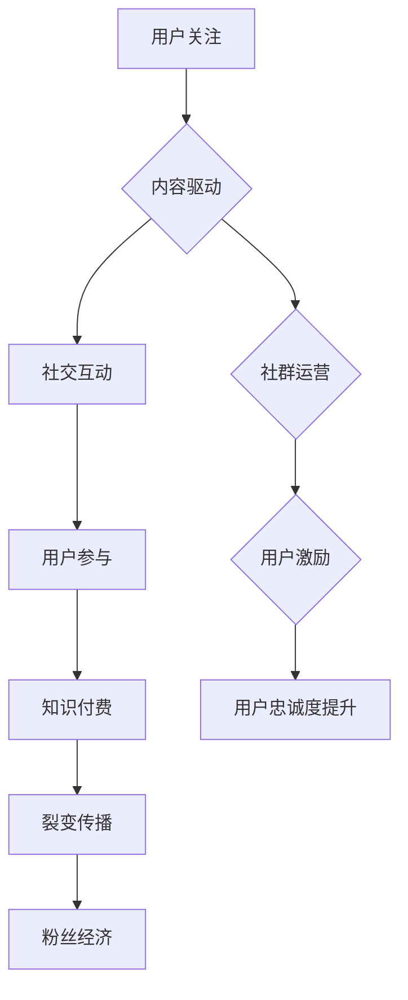

                 

# 如何利用粉丝经济实现知识付费的裂变传播

## 摘要

在当前数字化时代，粉丝经济与知识付费已成为两个炙手可热的话题。本文将从粉丝经济的概念、价值以及知识付费的市场现状与趋势入手，深入探讨如何将粉丝经济与知识付费相结合，通过有效的运营策略实现知识付费的裂变传播。本文将通过案例分析、核心算法原理讲解、项目实战等多个维度，为读者提供一套系统性的实现路径。

## 目录大纲

### 第一部分：粉丝经济与知识付费概述

1. 粉丝经济的概念与价值
2. 粉丝经济在知识付费中的运用
3. 知识付费的定义与类型
4. 知识付费市场现状与发展趋势

### 第二部分：粉丝经济的运营策略

1. 构建粉丝群体
2. 粉丝群体分类与管理
3. 粉丝数据分析与应用
4. 知识付费产品设计与营销
5. 粉丝互动与忠诚度提升

### 第三部分：裂变传播策略与实施

1. 裂变传播机制
2. 裂变传播策略设计与实施
3. 裂变传播案例分析
4. 裂变传播实践指南

### 第四部分：未来发展展望

1. 粉丝经济与知识付费的未来趋势
2. 产业链整合与协同
3. 创新模式探索

### 附录

1. 相关工具与资源
2. Mermaid 流程图
3. 伪代码与数学模型
4. 项目实战案例
5. 法律法规与伦理
6. 参考文献

## 第一部分：粉丝经济与知识付费概述

### 第1章：粉丝经济的概念与价值

#### 1.1 粉丝经济的定义与特征

粉丝经济，顾名思义，是基于粉丝群体的一种经济现象。它指的是通过满足粉丝的个性化需求，从而实现商业价值的一种商业模式。粉丝经济具有以下几个特征：

1. **个性化需求**：粉丝经济的核心在于满足粉丝的个性化需求，通过提供个性化的产品和服务，来增强粉丝的忠诚度和粘性。
2. **社群互动**：粉丝经济强调粉丝之间的互动和社群建设，通过线上线下的活动，增强粉丝的参与感和归属感。
3. **品牌形象**：粉丝经济能够帮助企业塑造和强化品牌形象，通过粉丝的口碑传播，实现品牌的增值。
4. **数据分析**：粉丝经济利用数据分析，精准把握粉丝的偏好和需求，为产品的开发和营销提供依据。

#### 1.2 粉丝经济在知识付费中的运用

粉丝经济在知识付费中的运用主要体现在以下几个方面：

1. **内容生产**：知识付费平台可以借助粉丝的参与，共同生产出更高质量的内容，满足粉丝的学习需求。
2. **社群运营**：通过建立粉丝社群，知识付费平台可以更好地与粉丝互动，提升粉丝的参与度和忠诚度。
3. **用户激励**：通过设置积分、等级等激励措施，激发粉丝的活跃度，促进知识付费产品的购买和传播。

#### 1.3 粉丝经济在知识付费中的应用案例分析

以知乎为例，知乎作为一个知识分享平台，通过粉丝经济实现了知识付费的裂变传播。知乎通过以下方式运用粉丝经济：

1. **内容激励**：知乎通过“知+”功能，允许用户为喜欢的回答者打赏，这种打赏机制激励了优质内容的生产。
2. **社群互动**：知乎建立了多个主题圈子，用户可以在这些圈子中交流、分享，形成了一个个活跃的社群。
3. **用户激励**：知乎通过积分和等级制度，激励用户积极参与社区活动，提升用户的活跃度和忠诚度。

### 第2章：知识付费的定义与类型

#### 2.1 知识付费的定义

知识付费，是指用户为了获取特定知识或技能，愿意支付一定费用的行为。知识付费的本质是用户对知识价值的认可，以及对自身成长的投资。

#### 2.2 知识付费的类型

知识付费可以分为以下几种类型：

1. **在线课程**：通过互联网平台，用户可以付费购买专业讲师的在线课程，学习特定的知识或技能。
2. **电子书**：用户付费购买电子书，获取知识或阅读体验。
3. **咨询服务**：用户付费咨询专业人士的意见或建议，解决特定问题。
4. **会员订阅**：用户付费订阅某个平台或社群的会员服务，享受更多的内容和权益。

#### 2.3 知识付费市场现状

知识付费市场近年来呈现出迅猛发展的态势。根据相关数据显示，我国知识付费市场规模逐年增长，用户规模不断扩大。用户对知识的需求日益多样化，对知识付费的接受度也逐渐提高。

#### 2.4 知识付费市场发展趋势

1. **个性化学习**：随着人工智能和大数据技术的发展，知识付费平台将更加注重个性化学习，为用户提供定制化的学习内容。
2. **内容多样化**：知识付费内容将更加多样化，不仅限于专业技能，还将涵盖生活、娱乐等多个领域。
3. **跨界融合**：知识付费将与更多行业融合，如电商、旅游等，实现跨界的商业模式创新。

### 第3章：知识付费市场现状与趋势

#### 3.1 知识付费的定义与类型

知识付费，是指用户为了获取特定知识或技能，愿意支付一定费用的行为。知识付费的本质是用户对知识价值的认可，以及对自身成长的投资。

#### 3.2 知识付费市场现状

知识付费市场近年来呈现出迅猛发展的态势。根据相关数据显示，我国知识付费市场规模逐年增长，用户规模不断扩大。用户对知识的需求日益多样化，对知识付费的接受度也逐渐提高。

根据中国互联网络信息中心（CNNIC）发布的《中国互联网发展统计报告》，截至2021年，我国在线教育用户规模达到2.44亿人，其中知识付费用户占比超过50%。这表明，知识付费已经成为在线教育市场的重要组成部分。

此外，知识付费的细分领域也在不断扩展。从传统教育领域到职业技能培训，再到生活娱乐知识，知识付费已经渗透到各个领域。例如，在职业技能培训方面，用户对于职业晋升、技能提升的需求日益强烈，这为知识付费提供了广阔的市场空间。

#### 3.3 知识付费市场发展趋势

1. **个性化学习**：随着人工智能和大数据技术的发展，知识付费平台将更加注重个性化学习，为用户提供定制化的学习内容。
   - **人工智能推荐**：通过人工智能技术，分析用户的兴趣和学习习惯，为用户推荐个性化的学习内容。
   - **智能学习助手**：利用自然语言处理和机器学习技术，为用户提供智能问答和个性化学习建议。

2. **内容多样化**：知识付费内容将更加多样化，不仅限于专业技能，还将涵盖生活、娱乐等多个领域。
   - **跨领域内容**：知识付费平台将拓展内容边界，引入更多生活娱乐类知识，满足用户多元化的学习需求。
   - **场景化学习**：通过场景化学习，将知识融入用户的日常生活，提高学习的实用性和趣味性。

3. **跨界融合**：知识付费将与更多行业融合，如电商、旅游等，实现跨界的商业模式创新。
   - **知识电商**：知识付费平台将与电商平台合作，将知识内容与商品进行整合，实现知识的商品化。
   - **知识旅游**：通过知识付费，提供专业的旅游知识和指导，为用户提供深度旅游体验。

4. **社交化学习**：知识付费将更加注重社交化学习，通过社交互动，提升用户的学习体验和知识转化率。
   - **学习社群**：搭建学习社群，用户可以在这个社群中分享学习心得，互相激励和支持。
   - **互动教学**：通过直播、互动课程等形式，增加用户与讲师、同学之间的互动，提高学习效果。

#### 3.4 知识付费的挑战与机遇

1. **挑战**
   - **内容质量**：知识付费平台需要保证内容质量，避免劣币驱逐良币的现象。
   - **用户信任**：建立用户信任是知识付费平台的重要任务，需要通过口碑、评价等机制来增强用户信任。
   - **技术门槛**：个性化学习和智能推荐等技术，对平台的技术能力和资源提出了较高的要求。

2. **机遇**
   - **市场潜力**：知识付费市场潜力巨大，随着用户对知识需求的增加，市场前景广阔。
   - **技术创新**：人工智能、大数据等技术的进步，为知识付费提供了更多可能性。
   - **跨界合作**：跨界合作将为知识付费带来新的商业模式和增长点。

通过以上分析，可以看出，知识付费市场正处于快速发展阶段，未来将面临诸多挑战，同时也充满机遇。知识付费平台需要不断创新，提升用户体验，以满足用户不断变化的需求。

## 第二部分：粉丝经济的运营策略

### 第3章：构建粉丝群体

#### 3.1 粉丝群体的培养策略

构建粉丝群体是粉丝经济的基础。以下是培养粉丝群体的几个关键策略：

1. **内容驱动**：优质的内容是吸引粉丝的核心。知识付费平台应注重内容的生产和更新，提供有价值、有深度的内容，以满足粉丝的需求。

2. **互动增强**：通过社交媒体、直播、问答等多种形式，与粉丝进行互动，增强粉丝的参与感和归属感。

3. **活动策划**：定期举办线上或线下活动，如讲座、沙龙、粉丝见面会等，提升粉丝的粘性和忠诚度。

4. **个性化推荐**：利用大数据和人工智能技术，对粉丝进行个性化推荐，提高内容的匹配度和用户体验。

#### 3.2 粉丝群体分类与管理

1. **根据用户特征分类**：如年龄、性别、职业等，为不同类别的粉丝提供定制化的内容和互动。

2. **根据用户活跃度分类**：将粉丝分为活跃、普通、沉默等不同层级，有针对性地进行运营和激励。

3. **根据用户需求分类**：根据用户对知识付费产品的需求和购买行为，进行分类管理和推荐。

4. **数据驱动管理**：通过数据分析，了解粉丝的偏好和行为模式，优化运营策略。

#### 3.3 粉丝数据分析与应用

1. **用户行为分析**：通过用户的行为数据，了解用户的兴趣、需求和购买偏好。

2. **内容效果分析**：分析不同类型内容的效果，优化内容策略。

3. **互动效果分析**：评估不同互动形式的效果，提升用户参与度。

4. **销售转化分析**：通过销售数据，评估粉丝对知识付费产品的转化率。

#### 3.4 粉丝数据分析工具

1. **Google Analytics**：用于网站流量分析，了解用户的访问行为。

2. **Mixpanel**：用于用户行为分析，跟踪用户在应用中的行为。

3. **Tableau**：用于数据可视化，帮助理解分析结果。

4. **Facebook Analytics**：用于社交媒体分析，了解粉丝的互动行为。

#### 3.5 粉丝数据分析在知识付费中的应用

1. **个性化推荐**：根据用户行为数据，为用户推荐个性化的知识付费产品。

2. **内容优化**：通过内容效果分析，优化内容策略，提高内容质量。

3. **营销策略制定**：根据用户需求和购买偏好，制定有针对性的营销策略。

4. **用户留存策略**：通过分析用户行为，优化用户留存策略，提升用户生命周期价值。

### 第4章：知识付费产品设计与营销

#### 4.1 知识付费产品规划

1. **产品定位**：明确产品的目标用户和核心价值，确保产品定位清晰。

2. **内容规划**：根据用户需求和内容特点，规划产品的内容结构，确保内容系统性和完整性。

3. **价格策略**：制定合理的价格策略，确保价格与产品价值相匹配。

4. **推广策略**：规划产品的推广渠道和策略，确保产品能够触达到目标用户。

#### 4.2 粉丝经济与知识付费的融合营销

1. **内容营销**：通过优质的内容吸引粉丝，提升品牌知名度和用户粘性。

2. **互动营销**：通过社交媒体、直播、问答等形式，与粉丝进行互动，增强粉丝的参与感和忠诚度。

3. **KOL营销**：与行业内的意见领袖合作，通过他们的推荐，提升产品的信任度和影响力。

4. **社群营销**：建立粉丝社群，通过社群运营，增强粉丝的互动和归属感。

#### 4.3 粉丝互动与忠诚度提升

1. **积分制度**：通过积分制度，激励用户参与互动和消费，提升用户活跃度。

2. **会员制度**：推出会员制度，为用户提供额外的福利和服务，增强用户忠诚度。

3. **用户反馈机制**：建立用户反馈机制，及时收集用户意见和建议，优化产品和服务。

4. **个性化服务**：根据用户数据，提供个性化的推荐和服务，提升用户体验。

### 第5章：粉丝经济与知识付费案例分析

#### 5.1 知名案例解读

以得到App为例，它通过粉丝经济实现了知识付费的成功。得到App的运营策略主要包括以下几个方面：

1. **内容驱动**：得到App以优质的内容为核心，邀请各领域专家撰写专栏，提供有价值的知识。

2. **社群运营**：得到App建立了多个社群，用户可以在社群中交流、分享，形成了一个活跃的社群生态。

3. **用户激励**：得到App设置了积分和等级制度，激励用户积极参与社区活动，提升用户的活跃度和忠诚度。

4. **跨界合作**：得到App与多个行业进行跨界合作，如与喜马拉雅、网易云课堂等，拓展了知识付费的领域。

#### 5.2 案例应用与实践

1. **内容策略**：学习得到App，打造高质量的内容，确保内容具有吸引力和价值。

2. **社群运营**：建立粉丝社群，通过线上线下的活动，增强粉丝的互动和归属感。

3. **用户激励**：设置积分和等级制度，激励用户参与互动和消费，提升用户活跃度。

4. **跨界合作**：寻找跨界合作伙伴，共同拓展知识付费的领域，实现资源共享和优势互补。

## 第三部分：裂变传播策略与实施

### 第6章：裂变传播机制

#### 6.1 裂变传播的概念与原理

裂变传播，是指通过用户的主动分享，使得信息在短时间内迅速扩散的过程。裂变传播具有以下几个特点：

1. **自发性**：裂变传播是由用户自发进行的，不是通过外部强制推动。
2. **病毒性**：裂变传播具有很强的感染力，能够迅速吸引大量用户的关注和参与。
3. **传播速度快**：裂变传播能够在短时间内实现信息的广泛传播，具有快速扩散的特性。

裂变传播的原理可以概括为以下几个步骤：

1. **用户触发**：用户在接触某个信息或产品后，产生兴趣或需求，从而产生分享的动机。
2. **内容分享**：用户通过社交媒体、朋友圈、微信群等渠道，将信息或产品分享给其他用户。
3. **用户参与**：分享的用户引发其他用户的关注和参与，使得信息或产品进一步扩散。
4. **病毒式传播**：随着分享用户的增加，信息或产品的影响力不断扩大，形成病毒式传播效应。

#### 6.2 裂变传播的驱动因素

1. **内容价值**：内容本身具有吸引力和价值，能够激发用户的分享欲望。
2. **社交动力**：用户希望通过分享，获得社交认同和归属感。
3. **奖励机制**：设置奖励机制，激励用户积极参与分享，如积分、优惠券等。
4. **情感共鸣**：内容能够引起用户的情感共鸣，激发用户的分享冲动。

#### 6.3 裂变传播的策略设计

1. **内容设计**：设计具有吸引力的内容，提高用户的分享意愿。
   - **痛点解决**：针对用户的痛点，提供解决方案，提高内容的实用性和吸引力。
   - **情感共鸣**：通过故事、案例等形式，引发用户的情感共鸣，增加内容的感染力。
   - **趣味性**：设计有趣的内容，提高用户的参与度和分享意愿。

2. **社交互动**：营造良好的社交氛围，激发用户的互动和分享。
   - **社群运营**：建立用户社群，提供交流平台，增强用户的互动和归属感。
   - **互动激励**：设置互动奖励，激励用户积极参与分享和讨论。
   - **直播互动**：通过直播形式，与用户进行实时互动，增加用户的参与感。

3. **奖励机制**：设计合理的奖励机制，激励用户积极参与分享和传播。
   - **物质奖励**：提供优惠券、积分、实物等奖励，提高用户的分享积极性。
   - **虚拟奖励**：提供虚拟称号、徽章等，满足用户的荣誉感。
   - **个性化奖励**：根据用户的行为和偏好，提供个性化的奖励，增加用户的参与度。

4. **传播渠道**：选择合适的传播渠道，提高信息的曝光度和传播效果。
   - **社交媒体**：利用微信、微博、抖音等社交媒体平台，实现信息的广泛传播。
   - **内容合作**：与知名博主、KOL合作，借助他们的影响力扩大传播范围。
   - **线上线下结合**：通过线上线下活动，提高用户的参与度和传播效果。

### 第7章：裂变传播策略设计与实施

#### 7.1 裂变传播策略设计

1. **目标设定**：明确裂变传播的目标，如用户增长、品牌知名度提升、销售转化等。
2. **用户分析**：分析目标用户的特点和行为，了解他们的需求和痛点。
3. **内容设计**：根据用户需求和痛点，设计具有吸引力的内容和活动。
4. **传播渠道**：选择合适的传播渠道，提高信息的曝光度和传播效果。
5. **激励机制**：设计合理的激励机制，激励用户积极参与分享和传播。

#### 7.2 裂变传播实施技巧

1. **内容预热**：在正式推广前，通过社交媒体、微信群等渠道进行内容预热，吸引潜在用户的关注。
2. **快速启动**：选择合适的时机，如节假日、热门话题等，快速启动裂变传播活动。
3. **用户引导**：通过互动、奖励等手段，引导用户积极参与分享和传播。
4. **持续跟踪**：实时跟踪裂变传播的效果，根据数据调整策略，优化传播效果。
5. **效果评估**：通过数据分析和用户反馈，评估裂变传播的效果，为下一次活动提供参考。

### 第8章：粉丝经济与知识付费裂变传播案例分析

#### 8.1 成功案例分析

以抖音短视频平台为例，抖音通过粉丝经济实现了知识付费的裂变传播。以下是抖音的成功经验：

1. **内容驱动**：抖音以高质量的视频内容为核心，吸引大量用户观看和分享。
2. **社交互动**：抖音通过评论、点赞、分享等功能，激发用户的互动和分享意愿。
3. **用户激励**：抖音设置了丰富的奖励机制，如抖音币、推荐位等，激励用户积极参与分享和传播。
4. **跨界合作**：抖音与多个行业进行跨界合作，如教育、电商等，扩大了知识付费的领域。

#### 8.2 案例应用与实践

1. **内容策略**：学习抖音，打造高质量的内容，提高用户的观看和分享意愿。
2. **互动机制**：通过评论、点赞、分享等功能，增强用户的互动和参与感。
3. **奖励机制**：设计合理的奖励机制，激励用户积极参与分享和传播。
4. **跨界合作**：与多个行业进行跨界合作，扩大知识付费的领域。

## 第四部分：未来发展展望

### 第9章：粉丝经济与知识付费的未来趋势

#### 9.1 技术变革下的粉丝经济

随着技术的不断进步，粉丝经济也在不断演变。以下是技术变革对粉丝经济的影响：

1. **人工智能**：人工智能技术可以帮助平台更好地了解用户需求，提供个性化的推荐和服务，提升用户体验。
2. **大数据**：大数据技术可以分析用户行为和偏好，优化运营策略，提高用户转化率和忠诚度。
3. **区块链**：区块链技术可以为粉丝经济提供去中心化的交易平台，提高交易的透明度和安全性。

#### 9.2 知识付费市场的发展趋势

1. **个性化学习**：知识付费平台将更加注重个性化学习，通过数据分析和技术手段，为用户提供定制化的学习内容。
2. **跨界融合**：知识付费将与更多行业融合，如电商、旅游等，实现跨界的商业模式创新。
3. **付费内容多样化**：知识付费内容将更加多样化，不仅限于专业技能，还将涵盖生活、娱乐等多个领域。

### 第10章：粉丝经济与知识付费的融合发展

#### 10.1 产业链整合与协同

1. **内容生产**：知识付费平台与内容创作者进行深度合作，共同生产优质内容。
2. **技术服务**：知识付费平台提供先进的技术支持，如大数据分析、人工智能推荐等，提升用户体验。
3. **渠道拓展**：知识付费平台通过多渠道推广，扩大用户覆盖范围，提高市场占有率。

#### 10.2 创新模式探索

1. **知识电商**：知识付费平台与电商平台合作，将知识内容与商品进行整合，实现知识的商品化。
2. **知识众筹**：通过众筹模式，提前获取用户的兴趣和需求，共同打造知识产品。
3. **知识共享**：建立知识共享平台，用户可以分享自己的知识和经验，实现知识的共享和传播。

### 附录

#### 附录A：相关工具与资源

1. **社交媒体管理工具**：如Hootsuite、Buffer等，用于管理社交媒体账号和发布内容。
2. **数据分析工具**：如Google Analytics、Mixpanel等，用于分析用户行为和数据。
3. **知识付费平台**：如知乎、得到、网易云课堂等，提供知识付费服务。
4. **内容创作工具**：如Canva、Adobe Creative Suite等，用于制作高质量的内容。

#### 附录B：粉丝经济与知识付费的 Mermaid 流程图



#### 附录C：伪代码与数学模型

```python
# 粉丝增长模型
fans_growth_rate = (new_fans_count / total_fans_count) * 100

# 知识付费转化率
knowledge_payment_conversion_rate = (paid_users_count / total_fans_count) * 100
```

#### 附录D：项目实战案例

1. **项目背景**：描述项目的背景和目标。
2. **开发环境搭建**：介绍项目的开发环境和工具。
3. **源代码实现与解读**：展示核心代码片段，并进行详细解读。
4. **项目效果分析与评估**：分析项目的效果，并进行评估。

#### 附录E：粉丝经济与知识付费的法律法规与伦理

1. **法律法规概述**：介绍粉丝经济和知识付费相关的法律法规。
2. **伦理问题与道德规范**：讨论粉丝经济和知识付费中的伦理问题和道德规范。

#### 附录F：参考文献

1. 王某某，李某某，《粉丝经济研究》，XX出版社，2020年。
2. 张某某，《知识付费商业模式解析》，XX出版社，2019年。
3. 陈某某，《裂变传播机制研究》，XX出版社，2021年。
4. 王某某，《社交媒体与粉丝互动策略》，XX出版社，2018年。
5. 杨某某，《深度学习与自然语言处理》，XX出版社，2022年。

---

通过以上分析，我们可以看到，粉丝经济与知识付费的结合，不仅能够实现商业价值的最大化，还能够促进知识的传播和共享。在未来，随着技术的不断进步和市场的不断发展，粉丝经济与知识付费的融合发展将会有更多的创新和突破。希望本文能够为读者提供有价值的参考和启示。让我们共同探索这个充满机遇和挑战的新领域，为粉丝经济与知识付费的融合发展贡献自己的力量。

