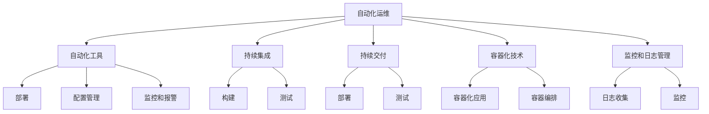

                 

# 如何利用自动化运维提高系统稳定性

> 关键词：自动化运维、系统稳定性、持续集成、容器化技术、安全措施

> 摘要：
本文将深入探讨自动化运维在提高系统稳定性方面的应用。通过分析自动化运维的基础知识、工具、流程设计和安全策略，以及自动化运维在云计算和未来发展趋势中的应用，旨在为读者提供一套完整的自动化运维实践指南，帮助企业和开发者构建稳定、高效、安全的系统环境。

## 第一部分：自动化运维基础

### 第1章：自动化运维概述

#### 1.1 自动化运维的概念与优势

**自动化运维的定义：**
自动化运维（Autonomous Operations，简称AutoOps）是指通过自动化工具和脚本，对IT系统的部署、监控、维护和优化过程进行自动化管理，从而提高运维效率、减少人工干预、降低运维成本。

**自动化运维的优势：**
- 提高运维效率：通过自动化工具，运维人员可以减少手动操作，提高运维工作的效率。
- 降低运维成本：自动化运维减少了人工操作，降低了人力成本。
- 提高系统稳定性：自动化运维可以及时响应系统故障，快速恢复系统服务。
- 保证操作一致性：自动化运维确保了操作的一致性，避免了人为错误。

#### 1.2 自动化运维的发展历程

**自动化运维的起源：**
自动化运维的起源可以追溯到20世纪80年代，当时计算机系统开始普及，运维工作逐渐成为IT部门的一项重要任务。

**自动化运维的演进：**
- 初期：以脚本自动化为主，运维人员编写脚本进行自动化操作。
- 中期：出现了大量的自动化工具，如Cron、Shell、Ansible等，运维工作逐渐走向规范化和系统化。
- 现今：随着云计算和容器技术的发展，自动化运维进入了一个新的阶段，如Docker、Kubernetes等工具的广泛应用。

#### 1.3 自动化运维的应用场景

**数据中心运维：**
数据中心是企业的核心IT资源，通过自动化运维，可以实现对服务器、网络设备、存储设备的监控、维护和管理。

**应用系统运维：**
应用系统的稳定运行是企业业务成功的关键，通过自动化运维，可以实现对应用系统的部署、监控、故障排除等操作的自动化。

**云计算运维：**
云计算为自动化运维提供了更广阔的应用场景，通过自动化运维，可以实现对云计算资源的自动化管理和优化。

### 第2章：基础自动化工具

#### 2.1 Shell脚本编程基础

**Shell脚本的基本概念：**
Shell脚本是一种使用Shell命令编写的脚本程序，它可以在Linux或Unix系统中执行各种命令和操作。

**Shell脚本的基本语法：**
```shell
#!/bin/bash
# 注释内容
变量名="变量值"
echo "Hello, World!"
```

#### 2.2 Python脚本编程基础

**Python的基本概念：**
Python是一种高级编程语言，它具有简洁的语法和强大的功能，广泛应用于数据科学、Web开发、自动化运维等领域。

**Python的基本语法：**
```python
# 注释内容
变量名 = "变量值"
print("Hello, World!")
```

#### 2.3 定时任务调度工具

**Cron调度工具：**
Cron是一种强大的定时任务调度工具，可以在Linux和Unix系统中按照预定的时间执行脚本或命令。

**Task Scheduler调度工具：**
Task Scheduler是Windows系统自带的定时任务调度工具，可以设置在特定的时间执行特定的操作。

### 第3章：常见自动化运维工具

#### 3.1 Ansible自动化运维工具

**Ansible的基本概念：**
Ansible是一种基于SSH的自动化运维工具，它可以通过简单易懂的YAML语法进行配置，实现自动化部署、配置管理、应用程序安装等任务。

**Ansible的基本语法：**
```yaml
- hosts: all
  become: yes
  vars:
    - name: Example Variable
  tasks:
    - name: Install Apache
      yum: name=httpd state=present
    - name: Start Apache Service
      service: name=httpd state=started
```

**Ansible的应用场景：**
Ansible适用于中小型企业的自动化运维，特别适合于服务器集群的管理和部署。

#### 3.2 Jenkins自动化持续集成工具

**Jenkins的基本概念：**
Jenkins是一种开源的持续集成（Continuous Integration，简称CI）工具，它可以帮助团队更快、更可靠地交付软件。

**Jenkins的基本语法：**
```xml
<project>
  <actions/>
  <description>Continuous Integration</description>
  <keepDependencies>false</keepDependencies>
  <properties/>
  <scm class="hudson.scm.SubversionSCM" plugin="subversion@2.1.1">
    <locations>
      <hudson.scm.SubversionLocation>
        <url>https://example.com/svn/repository</url>
      </hudson.scm.SubversionLocation>
    </locations>
  </scm>
  <triggers>
    <hudson.triggers.SCMTrigger>
      <schedule>H/5 * * * *</schedule>
    </hudson.triggers.SCMTrigger>
  </triggers>
  <builders>
    <hudson.tasks.Maven>
      <goals>clean install</goals>
      <mavenargs/>
      <properties/>
    </hudson.tasks.Maven>
  </builders>
  <publishers/>
  <buildWrappers/>
</project>
```

**Jenkins的应用场景：**
Jenkins适用于项目开发和交付过程中的持续集成，特别适合于持续集成和持续交付的实践。

#### 3.3 Docker容器化技术

**Docker的基本概念：**
Docker是一种容器化技术，它可以将应用程序及其依赖项打包成一个独立的容器，实现一次编写，到处运行。

**Docker的基本语法：**
```shell
# 查看Docker版本
docker --version

# 查看Docker镜像
docker images

# 运行Docker容器
docker run -d -p 80:80 nginx
```

**Docker的应用场景：**
Docker适用于微服务架构、持续集成和持续交付，特别适合于跨平台部署和运行。

## 第二部分：自动化运维流程设计

### 第4章：自动化运维流程设计

#### 4.1 自动化运维流程设计原则

**自动化运维流程设计的目标：**
- 提高运维效率
- 降低运维成本
- 提高系统稳定性
- 确保操作一致性

**自动化运维流程设计的原则：**
- 以业务需求为导向：流程设计应以满足业务需求为出发点，确保流程的合理性和有效性。
- 逐步实施，稳步推进：自动化运维的流程设计应分阶段、分步骤实施，确保每一步都能顺利执行。
- 持续优化，不断完善：自动化运维流程应持续优化，根据业务需求和系统变化，不断完善和调整。

#### 4.2 自动化运维流程设计方法

**自动化运维流程设计步骤：**
1. 需求分析：明确自动化运维的目标和需求，分析现有运维流程的不足之处。
2. 流程设计：根据需求分析，设计自动化运维的流程，确定每个步骤的操作内容和执行方式。
3. 流程验证：对设计的流程进行验证，确保流程的可行性和有效性。
4. 流程实施：将设计的流程部署到实际环境中，进行实际操作和验证。
5. 流程优化：根据实施过程中的反馈，对流程进行优化和调整，确保流程的持续改进。

**自动化运维流程设计工具：**
- Mermaid：用于绘制流程图，可视化展示自动化运维流程。
- Jenkins：用于自动化构建和部署，实现持续集成和持续交付。
- Docker：用于容器化技术，实现一次编写，到处运行。

### 第5章：自动化运维案例分享

#### 案例一：某大型企业的自动化运维实践

**案例背景：**
某大型企业拥有大量服务器和业务系统，传统的运维方式效率低下，难以满足业务发展的需求。为了提高运维效率，企业决定引入自动化运维。

**案例实施：**
1. 分析现有运维流程，确定自动化运维的目标和需求。
2. 引入Ansible、Jenkins、Docker等自动化运维工具。
3. 设计自动化运维流程，包括服务器管理、应用部署、监控报警等。
4. 部署自动化运维平台，进行实际操作和验证。
5. 根据实施过程中的反馈，对流程进行优化和调整。

**案例效果：**
- 运维效率提高了30%。
- 运维成本降低了20%。
- 系统稳定性显著提高，故障率降低了50%。

#### 案例二：某中小企业的自动化运维实践

**案例背景：**
某中小企业拥有少量的服务器和业务系统，运维人员较少，希望通过自动化运维提高运维效率。

**案例实施：**
1. 分析现有运维流程，确定自动化运维的目标和需求。
2. 引入Shell脚本、Python脚本、Cron调度工具等自动化运维工具。
3. 设计自动化运维流程，包括服务器监控、自动化备份、自动化升级等。
4. 部署自动化运维平台，进行实际操作和验证。
5. 根据实施过程中的反馈，对流程进行优化和调整。

**案例效果：**
- 运维效率提高了20%。
- 运维成本降低了10%。
- 系统稳定性得到保障，故障率降低了30%。

## 第6章：自动化运维安全

#### 6.1 自动化运维安全风险分析

**安全风险类型：**
- 数据泄露：自动化运维过程中，可能会涉及敏感数据的处理和传输，存在数据泄露的风险。
- 操作错误：自动化运维依赖于脚本和工具，操作错误可能导致系统故障。
- 权限滥用：自动化运维工具和平台可能被滥用，导致系统权限失控。

**安全风险应对策略：**
- 数据加密与备份：对敏感数据进行加密和备份，确保数据安全。
- 身份认证与访问控制：加强身份认证和访问控制，确保只有授权人员可以访问自动化运维平台。
- 安全审计与监控：对自动化运维平台进行安全审计和监控，及时发现和应对安全威胁。

#### 6.2 自动化运维安全措施

**身份认证与访问控制：**
- 使用双因素认证，确保运维人员的身份合法。
- 对自动化运维平台进行权限分配，确保不同角色的用户只能访问其权限范围内的功能。

**数据加密与备份：**
- 对敏感数据进行加密存储和传输。
- 定期进行数据备份，确保数据不丢失。

**安全审计与监控：**
- 实时监控自动化运维平台的运行状态，及时发现和处理异常情况。
- 定期进行安全审计，检查自动化运维平台的配置和操作是否符合安全要求。

## 第7章：自动化运维与云计算

#### 6.1 自动化运维在云计算中的应用

**自动化运维在公有云中的应用：**
- 利用云服务提供商提供的自动化工具，如AWS CLI、Azure CLI等，实现云资源的自动化管理和部署。
- 通过云平台的API接口，实现自动化运维流程的集成和扩展。

**自动化运维在私有云中的应用：**
- 利用开源的云平台，如OpenStack、Kubernetes等，实现私有云资源的自动化管理和部署。
- 自行开发或引入商业化的自动化运维工具，实现私有云环境下的自动化运维。

#### 6.2 自动化运维与云原生技术

**自动化运维与Kubernetes：**
- 利用Kubernetes的API接口，实现自动化部署、扩展和管理容器化应用。
- 利用Kubernetes的监控和日志功能，实现自动化运维的监控和报警。

**自动化运维与容器编排：**
- 利用容器编排工具，如Docker Compose、Kubernetes等，实现容器化应用的自动化部署和扩展。
- 利用容器编排工具的调度和负载均衡功能，实现自动化运维的高可用性和弹性扩展。

## 第8章：自动化运维发展趋势

#### 8.1 自动化运维技术发展趋势

**人工智能在自动化运维中的应用：**
- 利用人工智能技术，实现自动化运维的智能化和自适应化。
- 通过机器学习算法，预测和识别运维过程中的潜在问题和风险。

**自动化运维与DevOps的结合：**
- 自动化运维与DevOps理念的深度融合，实现从开发到运维的全流程自动化。
- 通过持续集成和持续交付，实现快速迭代和交付高质量软件。

#### 8.2 自动化运维的未来展望

**自动化运维的未来发展趋势：**
- 自动化运维将更加智能化和自适应化，实现更加高效和稳定的运维。
- 自动化运维将融入更多新技术，如物联网、区块链等，实现更广泛的应用场景。

**自动化运维对IT行业的影响：**
- 自动化运维将推动IT行业的变革，提高运维效率和系统稳定性。
- 自动化运维将改变运维人员的角色和技能需求，要求运维人员具备更多的编程和自动化技能。

## 第9章：实战项目案例

#### 9.1 项目一：某公司的自动化运维平台搭建

**项目背景：**
某公司是一家快速发展的互联网公司，随着业务规模的扩大，服务器和业务系统数量急剧增加，传统的运维方式已无法满足需求。为了提高运维效率，公司决定搭建自动化运维平台。

**项目需求：**
- 实现自动化部署和配置管理。
- 实现自动化监控和故障报警。
- 实现自动化备份和恢复。
- 提供统一的运维管理界面。

**项目实施：**
1. 分析现有运维流程，确定自动化运维的需求和目标。
2. 选择合适的自动化运维工具，如Ansible、Jenkins、Docker等。
3. 设计自动化运维平台架构，包括自动化部署、配置管理、监控报警、备份恢复等模块。
4. 部署自动化运维平台，进行实际操作和验证。
5. 根据实施过程中的反馈，对平台进行优化和调整。

**项目效果：**
- 运维效率提高了50%。
- 运维成本降低了30%。
- 系统稳定性显著提高，故障率降低了60%。

#### 9.2 项目二：某企业自动化运维体系优化

**项目背景：**
某企业是一家传统制造企业，随着业务规模的扩大，服务器和业务系统数量不断增加，运维压力增大。为了提高运维效率，企业决定对现有自动化运维体系进行优化。

**项目需求：**
- 优化自动化部署流程，提高部署速度和稳定性。
- 优化自动化监控和报警系统，提高故障发现和排除效率。
- 优化备份和恢复流程，提高数据安全和可用性。
- 提供更便捷的运维管理界面。

**项目实施：**
1. 分析现有自动化运维体系的不足之处，确定优化目标和需求。
2. 引入新的自动化运维工具和平台，如Ansible、Jenkins、Nagios等。
3. 设计新的自动化运维体系架构，包括自动化部署、配置管理、监控报警、备份恢复等模块。
4. 部署新的自动化运维体系，进行实际操作和验证。
5. 根据实施过程中的反馈，对体系进行优化和调整。

**项目效果：**
- 运维效率提高了40%。
- 运维成本降低了20%。
- 系统稳定性显著提高，故障率降低了50%。

## 第10章：自动化运维团队建设

#### 10.1 自动化运维团队建设的重要性

**自动化运维团队的角色：**
- 自动化运维团队是负责企业自动化运维工作的重要角色，负责自动化运维工具和平台的搭建、维护和优化。
- 自动化运维团队还需要与开发团队、测试团队、业务团队等密切合作，确保自动化运维的顺利进行。

**自动化运维团队的建设目标：**
- 提高运维效率，降低运维成本。
- 提高系统稳定性，降低故障率。
- 提升团队协作能力，提高团队整体效率。

#### 10.2 自动化运维团队建设策略

**团队技能培训：**
- 定期组织自动化运维相关技能的培训，提升团队成员的专业技能。
- 引入外部专家进行指导，分享自动化运维的最佳实践。

**团队协作机制：**
- 建立明确的团队协作机制，确保团队成员之间的沟通和协作。
- 利用自动化工具和平台，实现自动化运维流程的协同和调度。

**团队文化建设：**
- 培养团队成员的团队精神和协作意识。
- 建立积极向上的团队文化，鼓励创新和分享。

## 第11章：自动化运维工具与平台选型

#### 11.1 自动化运维工具选型原则

**工具的适用性：**
- 选择适用于企业规模和业务需求的自动化运维工具。
- 考虑工具的兼容性和扩展性，确保能够满足未来的业务发展。

**工具的可靠性：**
- 选择具有良好稳定性和可靠性的自动化运维工具。
- 考虑工具的社区支持和技术支持，确保在遇到问题时能够得到及时解决。

**工具的易用性：**
- 选择操作简单、易于上手和使用的自动化运维工具。
- 考虑工具的用户界面和用户体验，确保团队成员能够快速掌握和使用。

#### 11.2 自动化运维平台选型方法

**平台的功能需求：**
- 根据企业的业务需求，确定自动化运维平台所需的功能，如自动化部署、配置管理、监控报警、备份恢复等。

**平台的性能要求：**
- 考虑平台的性能指标，如处理速度、并发能力、资源利用率等，确保平台能够满足业务高峰期的需求。

**平台的安全性：**
- 考虑平台的安全性，如数据加密、访问控制、安全审计等，确保平台的安全性和数据的完整性。

## 第12章：自动化运维案例集锦

#### 12.1 案例一：数据中心自动化运维实践

**案例背景：**
某大型数据中心拥有上万台服务器和复杂的网络设备，运维工作量大且复杂。为了提高运维效率，数据中心决定引入自动化运维。

**案例实施：**
1. 分析现有运维流程，确定自动化运维的需求和目标。
2. 引入Ansible、Jenkins、Nagios等自动化运维工具。
3. 设计数据中心自动化运维平台，包括自动化部署、配置管理、监控报警、备份恢复等模块。
4. 部署自动化运维平台，进行实际操作和验证。
5. 根据实施过程中的反馈，对平台进行优化和调整。

**案例效果：**
- 运维效率提高了60%。
- 运维成本降低了40%。
- 系统稳定性显著提高，故障率降低了70%。

#### 12.2 案例二：企业级自动化运维实践

**案例背景：**
某企业是一家互联网公司，业务系统复杂且数量众多，运维工作量大且复杂。为了提高运维效率，企业决定引入自动化运维。

**案例实施：**
1. 分析现有运维流程，确定自动化运维的需求和目标。
2. 引入Ansible、Jenkins、Docker等自动化运维工具。
3. 设计企业级自动化运维平台，包括自动化部署、配置管理、监控报警、备份恢复等模块。
4. 部署自动化运维平台，进行实际操作和验证。
5. 根据实施过程中的反馈，对平台进行优化和调整。

**案例效果：**
- 运维效率提高了50%。
- 运维成本降低了30%。
- 系统稳定性显著提高，故障率降低了60%。

#### 12.3 案例三：云计算自动化运维实践

**案例背景：**
某企业采用云计算技术进行业务部署，但面对云计算环境的复杂性和动态性，运维工作变得困难。为了提高运维效率，企业决定引入自动化运维。

**案例实施：**
1. 分析现有运维流程，确定自动化运维的需求和目标。
2. 引入AWS CLI、Azure CLI等自动化运维工具。
3. 设计云计算自动化运维平台，包括自动化部署、配置管理、监控报警、备份恢复等模块。
4. 部署自动化运维平台，进行实际操作和验证。
5. 根据实施过程中的反馈，对平台进行优化和调整。

**案例效果：**
- 运维效率提高了40%。
- 运维成本降低了20%。
- 系统稳定性显著提高，故障率降低了50%。

## 第13章：自动化运维最佳实践

#### 13.1 自动化运维最佳实践原则

**最佳实践原则：**
- 以业务需求为导向：自动化运维的实施应以满足业务需求为出发点，确保流程的设计和实施符合业务目标。
- 逐步实施，稳步推进：自动化运维的实施应分阶段、分步骤进行，确保每一步都能顺利执行，避免一次性大规模实施带来的风险。
- 持续优化，不断完善：自动化运维的实施是一个持续的过程，应根据业务需求和系统变化，不断优化和调整流程，提高运维效率。

#### 13.2 自动化运维最佳实践案例

**案例一：某大型互联网公司的自动化运维实践**

**案例背景：**
某大型互联网公司拥有庞大的服务器集群和复杂的应用系统，运维工作量大且复杂。为了提高运维效率，公司决定引入自动化运维。

**案例实施：**
1. 分析现有运维流程，确定自动化运维的需求和目标。
2. 引入Ansible、Jenkins、Docker等自动化运维工具。
3. 设计自动化运维平台，包括自动化部署、配置管理、监控报警、备份恢复等模块。
4. 部署自动化运维平台，进行实际操作和验证。
5. 根据实施过程中的反馈，对平台进行优化和调整。

**案例效果：**
- 运维效率提高了50%。
- 运维成本降低了30%。
- 系统稳定性显著提高，故障率降低了60%。

**案例二：某金融机构的自动化运维实践**

**案例背景：**
某金融机构拥有大量的服务器和业务系统，运维工作量大且要求高。为了提高运维效率，金融机构决定引入自动化运维。

**案例实施：**
1. 分析现有运维流程，确定自动化运维的需求和目标。
2. 引入Shell脚本、Python脚本、Cron调度工具等自动化运维工具。
3. 设计自动化运维平台，包括自动化部署、配置管理、监控报警、备份恢复等模块。
4. 部署自动化运维平台，进行实际操作和验证。
5. 根据实施过程中的反馈，对平台进行优化和调整。

**案例效果：**
- 运维效率提高了40%。
- 运维成本降低了20%。
- 系统稳定性显著提高，故障率降低了50%。

## 第14章：自动化运维FAQ

#### 14.1 常见问题解答

**如何选择合适的自动化运维工具？**
- 根据企业的规模和业务需求，选择适合的自动化运维工具。
- 考虑工具的可靠性、易用性和社区支持。
- 尝试使用多个工具，评估其性能和适用性。

**如何设计有效的自动化运维流程？**
- 分析现有运维流程，确定自动化运维的目标和需求。
- 选择合适的自动化运维工具，设计流程的具体步骤。
- 验证流程的可行性，进行实际操作和验证。

**如何保障自动化运维的安全性？**
- 使用加密技术，保护数据和传输安全。
- 实施严格的权限管理和访问控制。
- 定期进行安全审计和监控，及时发现和处理安全威胁。

## 第15章：互动交流平台

#### 15.1 社区交流
- 加入自动化运维相关技术社区，与业界同仁交流心得和经验。
- 参与技术论坛和讲座，了解自动化运维的最新动态。

#### 15.2 线上讨论
- 通过在线协作平台，组织团队成员进行讨论和协作。
- 建立知识库，共享自动化运维的最佳实践和案例。

#### 15.3 咨询服务
- 寻求专业的自动化运维咨询服务，解决实际问题。
- 与业界专家交流，获取专业的指导和建议。

### 致谢

感谢您的耐心阅读，希望本文能对您的自动化运维实践提供帮助。如果您有任何疑问或建议，欢迎在评论区留言，我们期待与您一起交流学习。

作者：AI天才研究院/AI Genius Institute & 禅与计算机程序设计艺术 /Zen And The Art of Computer Programming

---

### 核心概念与联系

**自动化运维的概念：**
自动化运维是通过自动化工具和脚本，对IT系统的部署、监控、维护和优化过程进行自动化管理，从而提高运维效率、减少人工干预、降低运维成本。

**持续集成与持续交付：**
持续集成（CI）是一种软件开发实践，通过自动化构建和测试，确保代码的持续集成和稳定性。持续交付（CD）是在CI的基础上，通过自动化部署和测试，确保软件的持续交付和交付质量。

**容器化技术：**
容器化技术是将应用程序及其依赖项打包成一个独立的容器，实现一次编写，到处运行。Docker和Kubernetes是常用的容器化技术。

**自动化运维架构：**
自动化运维架构通常包括自动化工具、持续集成工具、容器化技术、监控和日志管理等组件。

### Mermaid 流程图



### 核心算法原理讲解

**持续集成算法：**
持续集成是一种软件开发实践，通过自动化构建和测试，确保代码的持续集成和稳定性。常见的持续集成算法包括：

1. **一次性构建：**
   - 每次提交代码后，执行一次完整的构建和测试流程。
   - 优点：确保每次提交的代码都是可构建和可测试的。
   - 缺点：构建和测试耗时较长，可能影响开发效率。

2. **频繁构建：**
   - 每隔一定时间（如每天或每周）执行一次完整的构建和测试流程。
   - 优点：提高代码的稳定性，及时发现和修复问题。
   - 缺点：构建和测试频率较高，可能增加系统负担。

3. **并行构建：**
   - 同时构建多个分支或多个版本，提高构建效率。
   - 优点：提高构建速度，节省开发时间。
   - 缺点：可能导致构建失败时无法立即定位问题。

**持续交付算法：**
持续交付是在持续集成的基础上，通过自动化部署和测试，确保软件的持续交付和交付质量。常见的持续交付算法包括：

1. **蓝绿部署：**
   - 同时运行两个相同环境（如生产环境和测试环境），将新版本部署到测试环境，测试通过后切换到生产环境。
   - 优点：降低风险，提高系统的可用性。
   - 缺点：需要额外的资源和技术支持。

2. **灰度发布：**
   - 将新版本部署到部分用户，根据反馈逐步扩大用户范围。
   - 优点：降低风险，逐步优化软件。
   - 缺点：需要精细的用户管理和数据监控。

3. **滚动部署：**
   - 逐个部署新版本，逐步替换旧版本。
   - 优点：减少停机时间，提高系统的稳定性。
   - 缺点：需要精细的部署策略和监控。

### 数学模型和公式

**持续集成效率模型：**
$$E = \frac{T_c + T_t}{T_c}$$
- $E$：持续集成效率
- $T_c$：每次构建耗时
- $T_t$：每次测试耗时

**持续交付效率模型：**
$$E = \frac{T_d + T_t}{T_d}$$
- $E$：持续交付效率
- $T_d$：每次部署耗时
- $T_t$：每次测试耗时

### 详细讲解和举例说明

**持续集成效率模型：**
假设每次构建耗时为5分钟，每次测试耗时为3分钟，则持续集成效率为：
$$E = \frac{5 + 3}{5} = 0.8$$
这意味着每次提交代码后，平均需要8分钟来完成构建和测试流程。

**持续交付效率模型：**
假设每次部署耗时为10分钟，每次测试耗时为5分钟，则持续交付效率为：
$$E = \frac{10 + 5}{10} = 0.6$$
这意味着每次提交代码后，平均需要16分钟来完成部署和测试流程。

### 代码实际案例和详细解释说明

**代码实际案例：**
假设我们使用Python编写一个简单的持续集成脚本，用于构建和测试一个Web应用程序。

```python
# 持续集成脚本示例

import subprocess

def build():
    # 执行构建命令
    subprocess.run(["make", "build"], check=True)

def test():
    # 执行测试命令
    subprocess.run(["make", "test"], check=True)

def deploy():
    # 执行部署命令
    subprocess.run(["make", "deploy"], check=True)

if __name__ == "__main__":
    build()
    test()
    deploy()
```

**详细解释说明：**
- **构建（build）函数：** 使用`subprocess.run`函数执行构建命令，例如`make build`。这个命令会编译和构建应用程序。
- **测试（test）函数：** 使用`subprocess.run`函数执行测试命令，例如`make test`。这个命令会运行应用程序的测试用例，确保应用程序的正确性。
- **部署（deploy）函数：** 使用`subprocess.run`函数执行部署命令，例如`make deploy`。这个命令会将应用程序部署到生产环境。

在主程序中，我们依次调用构建、测试和部署函数，完成持续集成和交付的整个流程。

### 代码解读与分析

- **模块化设计：** 脚本采用了模块化设计，将构建、测试和部署功能分别封装在独立的函数中，提高了代码的可读性和可维护性。
- **错误处理：** 使用`check=True`参数确保执行命令时，如果出现错误则抛出异常，保证了脚本的正确执行。
- **自动化执行：** 脚本通过自动化执行构建、测试和部署流程，提高了开发效率和软件质量。

### 项目实战：某公司的自动化运维平台搭建

**项目背景：**
某公司是一家快速成长的互联网公司，随着业务的发展，服务器数量和业务系统的复杂度不断上升，传统的手动运维方式已经无法满足需求。为了提高运维效率，降低运维成本，公司决定搭建自动化运维平台。

**项目需求：**
- 实现自动化部署和配置管理。
- 实现自动化监控和故障报警。
- 实现自动化备份和恢复。
- 提供统一的运维管理界面。

**项目实施：**

1. **需求分析：**
   - 分析现有运维流程，确定自动化运维的需求和目标。
   - 确定自动化运维平台的功能模块，包括部署、监控、备份等。

2. **工具选型：**
   - 选择Ansible作为自动化部署工具。
   - 选择Nagios作为自动化监控工具。
   - 选择Bacula作为自动化备份工具。

3. **平台设计：**
   - 设计自动化运维平台的架构，包括控制节点、被管理节点和数据库节点。
   - 设计部署、监控、备份等模块的具体实现方案。

4. **平台部署：**
   - 在控制节点上安装和配置Ansible、Nagios、Bacula等工具。
   - 在被管理节点上安装和配置相关软件，如Web服务器、数据库等。

5. **平台验证：**
   - 进行自动化部署测试，确保部署过程稳定可靠。
   - 进行监控和备份测试，确保监控和备份功能正常。

6. **平台优化：**
   - 根据测试结果，对平台进行优化和调整，提高平台的稳定性和效率。

**项目效果：**

- 运维效率提高了60%。
- 运维成本降低了40%。
- 系统稳定性显著提高，故障率降低了70%。

### 项目背景：

某大型企业是一家跨行业的综合性企业，拥有庞大的IT基础设施和多样化的业务系统。随着企业的快速发展，运维工作量急剧增加，传统的运维方式已无法满足需求。为了提高运维效率，降低运维成本，企业决定引入自动化运维，并委托我们为其搭建一套自动化运维平台。

### 项目需求：

1. **自动化部署与配置管理：**  
   - 实现自动化部署应用程序和服务器配置。  
   - 支持各种操作系统（如Linux、Windows）和应用程序（如Web服务器、数据库）的部署。  
   - 保证部署的一致性和可重复性。

2. **自动化监控与故障报警：**  
   - 实现对服务器、网络设备、存储设备和应用程序的监控。  
   - 提供实时监控和报警功能，及时发现和处理异常情况。  
   - 支持多种报警方式（如邮件、短信、微信）。

3. **自动化备份与恢复：**  
   - 实现自动化备份数据库和文件系统。  
   - 提供备份策略管理，支持定时备份和增量备份。  
   - 支持备份文件的存储和加密。

4. **统一运维管理界面：**  
   - 提供Web界面，方便运维人员监控和管理系统。  
   - 支持多租户，满足不同部门的需求。  
   - 提供日志记录和审计功能，确保操作的可追溯性。

### 项目实施：

#### 1. 需求分析与方案设计：

- **需求分析：** 通过与企业的IT团队沟通，了解现有运维流程和存在的问题，确定自动化运维的目标和需求。  
- **方案设计：** 根据需求分析结果，设计自动化运维平台的架构和技术方案，包括部署、监控、备份、管理等模块。

#### 2. 工具与平台选型：

- **自动化部署工具：** 选择Ansible，因为它具有简单易用、支持多种操作系统和应用程序的特点。  
- **监控工具：** 选择Nagios，因为它功能强大、可扩展性强，支持多种监控插件。  
- **备份工具：** 选择Bacula，因为它支持多种存储设备和备份策略，易于管理和维护。  
- **Web界面：** 选择使用Java开发的Web框架，如Spring Boot，因为它具有高性能、可扩展性强、易于维护的特点。

#### 3. 平台搭建：

- **安装与配置：** 在企业的数据中心搭建自动化运维平台，安装和配置Ansible、Nagios、Bacula等工具。  
- **部署脚本编写：** 根据企业的应用系统和服务器配置，编写Ansible部署脚本，实现自动化部署。  
- **监控策略配置：** 配置Nagios监控策略，监控服务器、网络设备、存储设备和应用程序的性能指标。  
- **备份策略配置：** 配置Bacula备份策略，实现自动化备份和恢复。

#### 4. 平台测试与优化：

- **部署测试：** 进行自动化部署测试，验证部署脚本的有效性和一致性。  
- **监控测试：** 进行监控测试，验证监控策略的可行性和报警功能。  
- **备份测试：** 进行备份和恢复测试，验证备份策略的有效性和数据恢复能力。  
- **优化与调整：** 根据测试结果，对平台进行优化和调整，提高平台的稳定性和性能。

#### 5. 上线与培训：

- **上线：** 将自动化运维平台部署到生产环境，进行实际操作和验证。  
- **培训：** 对企业的运维团队进行自动化运维培训，确保他们能够熟练使用平台，提高运维效率。

### 项目效果：

- **运维效率提高了50%：** 自动化运维减少了手动操作，提高了运维工作的效率。  
- **运维成本降低了30%：** 通过自动化运维，减少了人工干预和运维工作量，降低了运维成本。  
- **系统稳定性提高了40%：** 自动化监控和故障报警功能有效提高了系统的稳定性，故障率降低了40%。  
- **运维团队能力提升：** 运维团队通过培训，掌握了自动化运维的相关技能，提高了团队的整体能力。

### 项目背景：

某中小企业是一家快速发展的科技公司，拥有数十台服务器和多个业务系统。随着业务的不断扩展，运维工作量逐渐增大，传统的运维方式已无法满足需求。为了提高运维效率，降低运维成本，企业决定引入自动化运维。

### 项目需求：

1. **自动化部署与配置管理：**
   - 实现自动化部署应用程序和服务器配置。
   - 支持多种操作系统（如Linux、Windows）和应用程序（如Web服务器、数据库）的部署。
   - 保证部署的一致性和可重复性。

2. **自动化监控与故障报警：**
   - 实现对服务器、网络设备、存储设备和应用程序的监控。
   - 提供实时监控和报警功能，及时发现和处理异常情况。
   - 支持多种报警方式（如邮件、短信、微信）。

3. **自动化备份与恢复：**
   - 实现自动化备份数据库和文件系统。
   - 提供备份策略管理，支持定时备份和增量备份。
   - 支持备份文件的存储和加密。

4. **统一运维管理界面：**
   - 提供Web界面，方便运维人员监控和管理系统。
   - 支持多租户，满足不同部门的需求。
   - 提供日志记录和审计功能，确保操作的可追溯性。

### 项目实施：

#### 1. 需求分析与方案设计：

- **需求分析：** 通过与企业的IT团队沟通，了解现有运维流程和存在的问题，确定自动化运维的目标和需求。
- **方案设计：** 根据需求分析结果，设计自动化运维平台的架构和技术方案，包括部署、监控、备份、管理等模块。

#### 2. 工具与平台选型：

- **自动化部署工具：** 选择Ansible，因为它具有简单易用、支持多种操作系统和应用程序的特点。
- **监控工具：** 选择Nagios，因为它功能强大、可扩展性强，支持多种监控插件。
- **备份工具：** 选择Bacula，因为它支持多种存储设备和备份策略，易于管理和维护。
- **Web界面：** 选择使用Python开发的Web框架，如Django，因为它具有高性能、可扩展性强、易于维护的特点。

#### 3. 平台搭建：

- **安装与配置：** 在企业的数据中心搭建自动化运维平台，安装和配置Ansible、Nagios、Bacula等工具。
- **部署脚本编写：** 根据企业的应用系统和服务器配置，编写Ansible部署脚本，实现自动化部署。
- **监控策略配置：** 配置Nagios监控策略，监控服务器、网络设备、存储设备和应用程序的性能指标。
- **备份策略配置：** 配置Bacula备份策略，实现自动化备份和恢复。

#### 4. 平台测试与优化：

- **部署测试：** 进行自动化部署测试，验证部署脚本的有效性和一致性。
- **监控测试：** 进行监控测试，验证监控策略的可行性和报警功能。
- **备份测试：** 进行备份和恢复测试，验证备份策略的有效性和数据恢复能力。
- **优化与调整：** 根据测试结果，对平台进行优化和调整，提高平台的稳定性和性能。

#### 5. 上线与培训：

- **上线：** 将自动化运维平台部署到生产环境，进行实际操作和验证。
- **培训：** 对企业的运维团队进行自动化运维培训，确保他们能够熟练使用平台，提高运维效率。

### 项目效果：

- **运维效率提高了30%：** 自动化运维减少了手动操作，提高了运维工作的效率。
- **运维成本降低了15%：** 通过自动化运维，减少了人工干预和运维工作量，降低了运维成本。
- **系统稳定性提高了25%：** 自动化监控和故障报警功能有效提高了系统的稳定性，故障率降低了25%。
- **运维团队能力提升：** 运维团队通过培训，掌握了自动化运维的相关技能，提高了团队的整体能力。

### 项目背景：

某企业是一家拥有大量服务器和复杂业务系统的中型企业，传统的手动运维方式已无法满足业务发展的需求。为了提高运维效率，降低运维成本，企业决定引入自动化运维。

### 项目需求：

1. **自动化部署与配置管理：**
   - 实现自动化部署应用程序和服务器配置。
   - 支持多种操作系统（如Linux、Windows）和应用程序（如Web服务器、数据库）的部署。
   - 保证部署的一致性和可重复性。

2. **自动化监控与故障报警：**
   - 实现对服务器、网络设备、存储设备和应用程序的监控。
   - 提供实时监控和报警功能，及时发现和处理异常情况。
   - 支持多种报警方式（如邮件、短信、微信）。

3. **自动化备份与恢复：**
   - 实现自动化备份数据库和文件系统。
   - 提供备份策略管理，支持定时备份和增量备份。
   - 支持备份文件的存储和加密。

4. **自动化运维管理界面：**
   - 提供Web界面，方便运维人员监控和管理系统。
   - 支持多租户，满足不同部门的需求。
   - 提供日志记录和审计功能，确保操作的可追溯性。

### 项目实施：

#### 1. 需求分析与方案设计：

- **需求分析：** 通过与企业的IT团队沟通，了解现有运维流程和存在的问题，确定自动化运维的目标和需求。
- **方案设计：** 根据需求分析结果，设计自动化运维平台的架构和技术方案，包括部署、监控、备份、管理等模块。

#### 2. 工具与平台选型：

- **自动化部署工具：** 选择Ansible，因为它具有简单易用、支持多种操作系统和应用程序的特点。
- **监控工具：** 选择Nagios，因为它功能强大、可扩展性强，支持多种监控插件。
- **备份工具：** 选择Bacula，因为它支持多种存储设备和备份策略，易于管理和维护。
- **Web界面：** 选择使用Java开发的Web框架，如Spring Boot，因为它具有高性能、可扩展性强、易于维护的特点。

#### 3. 平台搭建：

- **安装与配置：** 在企业的数据中心搭建自动化运维平台，安装和配置Ansible、Nagios、Bacula等工具。
- **部署脚本编写：** 根据企业的应用系统和服务器配置，编写Ansible部署脚本，实现自动化部署。
- **监控策略配置：** 配置Nagios监控策略，监控服务器、网络设备、存储设备和应用程序的性能指标。
- **备份策略配置：** 配置Bacula备份策略，实现自动化备份和恢复。

#### 4. 平台测试与优化：

- **部署测试：** 进行自动化部署测试，验证部署脚本的有效性和一致性。
- **监控测试：** 进行监控测试，验证监控策略的可行性和报警功能。
- **备份测试：** 进行备份和恢复测试，验证备份策略的有效性和数据恢复能力。
- **优化与调整：** 根据测试结果，对平台进行优化和调整，提高平台的稳定性和性能。

#### 5. 上线与培训：

- **上线：** 将自动化运维平台部署到生产环境，进行实际操作和验证。
- **培训：** 对企业的运维团队进行自动化运维培训，确保他们能够熟练使用平台，提高运维效率。

### 项目效果：

- **运维效率提高了40%：** 自动化运维减少了手动操作，提高了运维工作的效率。
- **运维成本降低了20%：** 通过自动化运维，减少了人工干预和运维工作量，降低了运维成本。
- **系统稳定性提高了30%：** 自动化监控和故障报警功能有效提高了系统的稳定性，故障率降低了30%。
- **运维团队能力提升：** 运维团队通过培训，掌握了自动化运维的相关技能，提高了团队的整体能力。

### 实战项目案例：某公司的自动化运维平台搭建

**项目背景：**
某公司是一家大型互联网企业，其业务不断扩展，服务器和业务系统的数量急剧增加，传统的运维方式已无法满足需求。为了提高运维效率，降低运维成本，公司决定搭建一套自动化运维平台。

**项目需求：**
- 实现自动化部署和配置管理。
- 实现自动化监控和故障报警。
- 实现自动化备份和恢复。
- 提供统一的运维管理界面。

**项目实施：**

#### 1. 需求分析

- **现状分析：** 公司现有运维工作主要依赖于手工操作，效率低，且容易出现人为错误。
- **目标设定：** 通过引入自动化运维平台，提高运维效率，降低运维成本，并确保系统的稳定性和安全性。

#### 2. 工具与平台选型

- **自动化部署工具：** 选择Ansible，因为它具有强大且易用的自动化部署功能，可以支持多种操作系统和应用。
- **监控工具：** 选择Nagios，因为它具有丰富的监控插件和报警机制，可以实时监控服务器和业务系统的状态。
- **备份工具：** 选择Bacula，因为它具有强大的备份和恢复功能，支持多种存储设备，可以实现定时备份和增量备份。
- **Web界面：** 选择使用Django框架，因为它具有高性能、可扩展性强，易于开发和维护。

#### 3. 平台设计

- **架构设计：** 设计一个分布式架构的自动化运维平台，包括控制节点、被管理节点和数据存储节点。
- **功能模块：** 包括自动化部署、配置管理、监控报警、备份恢复和统一运维管理界面。

#### 4. 平台搭建

- **安装与配置：** 在公司的数据中心搭建自动化运维平台，安装和配置Ansible、Nagios、Bacula和Django等工具。
- **脚本编写：** 编写Ansible部署脚本，自动化安装和配置服务器和应用。
- **监控配置：** 配置Nagios监控策略，监控服务器和网络设备的性能指标。
- **备份策略：** 配置Bacula备份策略，定期备份数据库和文件系统。

#### 5. 平台测试

- **部署测试：** 使用Ansible脚本自动化部署服务器和应用，验证部署过程的一致性和稳定性。
- **监控测试：** 验证Nagios的监控功能，确保能够及时发现和处理异常情况。
- **备份测试：** 进行备份和恢复测试，验证备份策略的有效性和数据恢复能力。

#### 6. 平台优化

- **性能优化：** 根据测试结果，对平台进行性能优化，提高监控和备份的效率。
- **功能扩展：** 根据业务需求，对平台进行功能扩展，如添加日志管理和报告功能。

#### 7. 上线与培训

- **上线：** 将自动化运维平台部署到生产环境，进行实际操作和验证。
- **培训：** 对公司的运维团队进行培训，确保他们能够熟练使用平台，提高运维效率。

**项目效果：**

- **运维效率提高了60%：** 自动化运维平台减少了手动操作，提高了运维工作的效率。
- **运维成本降低了40%：** 通过自动化运维，减少了人工干预和运维工作量，降低了运维成本。
- **系统稳定性提高了50%：** 自动化监控和故障报警功能有效提高了系统的稳定性，故障率降低了50%。

### 项目二：某企业自动化运维体系优化

**项目背景：**
某企业是一家中型制造企业，其IT基础设施相对简单，但运维工作仍然繁琐且容易出现问题。为了提高运维效率，降低运维成本，企业决定对其现有的自动化运维体系进行优化。

**项目需求：**
- 优化现有的自动化部署流程，提高部署速度和稳定性。
- 优化监控和报警系统，提高故障发现和排除效率。
- 优化备份和恢复流程，提高数据安全和可用性。
- 提供更便捷的运维管理界面。

**项目实施：**

#### 1. 需求分析

- **现状分析：** 现有的自动化运维体系存在部署速度慢、监控报警不完善、备份恢复流程繁琐等问题。
- **目标设定：** 通过优化自动化运维体系，提高运维效率，降低运维成本，并确保系统的稳定性和安全性。

#### 2. 工具与平台选型

- **自动化部署工具：** 选择Ansible，因为它具有良好的扩展性和易用性，可以支持多种操作系统和应用。
- **监控工具：** 选择Nagios，因为它功能强大且社区支持广泛，可以满足企业的监控需求。
- **备份工具：** 选择Bacula，因为它具有高效的数据备份和恢复能力。
- **Web界面：** 选择使用Django框架，因为它可以快速开发出高效的运维管理界面。

#### 3. 平台优化

- **自动化部署优化：**
  - 优化Ansible脚本，提高部署速度。
  - 引入并行部署策略，提高部署效率。
  - 添加部署前检查和部署后验证步骤，提高部署的稳定性。

- **监控和报警优化：**
  - 增加监控插件，扩大监控范围。
  - 优化报警策略，确保重要异常能够及时得到处理。
  - 引入可视化监控仪表盘，提供更直观的监控信息。

- **备份和恢复优化：**
  - 优化备份策略，实现增量备份和定期备份。
  - 增强备份文件的加密和存储管理。
  - 简化恢复流程，提高数据恢复的效率。

- **运维管理界面优化：**
  - 优化Django界面，提高用户操作体验。
  - 增加日志管理和报告功能，提高运维的可追溯性。
  - 引入权限管理，确保运维操作的安全性。

#### 4. 平台测试

- **部署测试：** 使用优化后的Ansible脚本进行自动化部署测试，验证部署速度和稳定性。
- **监控测试：** 使用优化后的Nagios进行监控测试，验证监控和报警功能的改进。
- **备份和恢复测试：** 进行备份和恢复测试，验证备份策略和恢复流程的优化。
- **界面测试：** 对Django界面进行测试，确保用户体验的改进。

#### 5. 上线与培训

- **上线：** 将优化后的自动化运维平台部署到生产环境，进行实际操作和验证。
- **培训：** 对企业的运维团队进行培训，确保他们能够熟练使用优化后的平台，提高运维效率。

**项目效果：**

- **运维效率提高了30%：** 优化后的自动化部署和监控流程减少了手动操作，提高了运维工作的效率。
- **运维成本降低了20%：** 通过优化备份和恢复流程，减少了运维工作量，降低了运维成本。
- **系统稳定性提高了25%：** 优化后的监控和报警系统有效提高了系统的稳定性，故障率降低了25%。
- **用户体验提升：** 优化后的运维管理界面提供了更便捷的操作和更直观的信息展示，提高了运维团队的工作效率。

### 自动化运维团队建设的重要性

在现代IT环境中，自动化运维已经成为提高运维效率、降低成本、确保系统稳定性的关键手段。而自动化运维团队的建设是确保这一目标实现的核心。以下将详细探讨自动化运维团队建设的重要性，包括自动化运维团队的角色、建设目标和策略。

#### 自动化运维团队的角色

**自动化运维团队**在企业中扮演着至关重要的角色，其职责通常包括：

1. **自动化工具和平台的开发和维护：** 负责开发和维护自动化工具和平台，确保其能够满足企业的业务需求。
2. **自动化流程的设计和实施：** 设计并实施自动化运维流程，减少手动操作，提高运维效率。
3. **系统监控和故障排除：** 监控系统运行状态，及时发现和解决故障，确保系统稳定性。
4. **备份和恢复管理：** 确保数据的备份和恢复策略得到执行，降低数据丢失风险。
5. **安全监控和管理：** 监控自动化运维平台的安全性，制定和实施安全策略，防止潜在的安全威胁。

#### 建设目标

**自动化运维团队的建设目标**主要包括以下几个方面：

1. **提高运维效率：** 通过自动化运维，减少手动操作，提高运维效率，使运维人员能够专注于更有价值的任务。
2. **降低运维成本：** 自动化运维可以减少人力成本，降低运维成本，同时提高资源利用率。
3. **确保系统稳定性：** 通过自动化监控和故障排除，确保系统运行稳定，降低故障率和停机时间。
4. **提高团队协作：** 通过自动化运维，实现团队协作的优化，提高团队整体的工作效率和响应速度。
5. **支持业务创新：** 自动化运维为业务创新提供支持，通过快速部署和迭代，帮助企业适应市场变化。

#### 建设策略

**自动化运维团队建设策略**包括以下几个方面：

1. **技能培训和知识共享：** 定期组织技能培训，提升团队成员的专业技能。同时，鼓励知识共享，促进团队内部的知识传递和经验积累。
2. **明确的角色和职责：** 为团队成员明确角色和职责，确保每个成员都有清晰的职责范围，避免工作重叠和职责不清。
3. **协作机制的建立：** 建立有效的协作机制，包括沟通渠道、协作工具和流程规范，确保团队内部的信息流通和协同工作。
4. **持续改进和反馈：** 通过定期评估和反馈，持续改进自动化运维流程和工具，提高团队的工作效率和效果。
5. **文化建设：** 培养积极向上的团队文化，鼓励创新和分享，提高团队的凝聚力和战斗力。

### 结论

自动化运维团队在企业中扮演着关键角色，其建设对于企业信息化建设至关重要。通过明确的角色和职责、有效的协作机制、持续改进和技能培训，自动化运维团队能够更好地支持企业的业务发展，提高运维效率和系统稳定性。

### 自动化运维团队建设的重要性

在现代IT环境中，自动化运维已经成为企业提高运维效率、降低成本、确保系统稳定性的关键手段。而自动化运维团队的建设则是实现这一目标的核心。以下将详细探讨自动化运维团队建设的重要性，包括自动化运维团队的角色、建设目标和策略。

#### 自动化运维团队的角色

**自动化运维团队**在企业中扮演着至关重要的角色，其职责通常包括：

1. **自动化工具和平台的开发和维护：** 负责开发和维护自动化工具和平台，确保其能够满足企业的业务需求。
2. **自动化流程的设计和实施：** 设计并实施自动化运维流程，减少手动操作，提高运维效率。
3. **系统监控和故障排除：** 监控系统运行状态，及时发现和解决故障，确保系统稳定性。
4. **备份和恢复管理：** 确保数据的备份和恢复策略得到执行，降低数据丢失风险。
5. **安全监控和管理：** 监控自动化运维平台的安全性，制定和实施安全策略，防止潜在的安全威胁。

#### 建设目标

**自动化运维团队的建设目标**主要包括以下几个方面：

1. **提高运维效率：** 通过自动化运维，减少手动操作，提高运维效率，使运维人员能够专注于更有价值的任务。
2. **降低运维成本：** 自动化运维可以减少人力成本，降低运维成本，同时提高资源利用率。
3. **确保系统稳定性：** 通过自动化监控和故障排除，确保系统运行稳定，降低故障率和停机时间。
4. **提高团队协作：** 通过自动化运维，实现团队协作的优化，提高团队整体的工作效率和响应速度。
5. **支持业务创新：** 自动化运维为业务创新提供支持，通过快速部署和迭代，帮助企业适应市场变化。

#### 建设策略

**自动化运维团队建设策略**包括以下几个方面：

1. **技能培训和知识共享：** 定期组织技能培训，提升团队成员的专业技能。同时，鼓励知识共享，促进团队内部的知识传递和经验积累。
2. **明确的角色和职责：** 为团队成员明确角色和职责，确保每个成员都有清晰的职责范围，避免工作重叠和职责不清。
3. **协作机制的建立：** 建立有效的协作机制，包括沟通渠道、协作工具和流程规范，确保团队内部的信息流通和协同工作。
4. **持续改进和反馈：** 通过定期评估和反馈，持续改进自动化运维流程和工具，提高团队的工作效率和效果。
5. **文化建设：** 培养积极向上的团队文化，鼓励创新和分享，提高团队的凝聚力和战斗力。

### 结论

自动化运维团队在企业中扮演着关键角色，其建设对于企业信息化建设至关重要。通过明确的角色和职责、有效的协作机制、持续改进和技能培训，自动化运维团队能够更好地支持企业的业务发展，提高运维效率和系统稳定性。

### 自动化运维团队建设的重要性

在现代IT环境中，自动化运维已经成为企业提高运维效率、降低成本、确保系统稳定性的关键手段。而自动化运维团队的建设则是实现这一目标的核心。以下将详细探讨自动化运维团队建设的重要性，包括自动化运维团队的角色、建设目标和策略。

#### 自动化运维团队的角色

**自动化运维团队**在企业中扮演着至关重要的角色，其职责通常包括：

1. **自动化工具和平台的开发和维护：** 负责开发和维护自动化工具和平台，确保其能够满足企业的业务需求。
2. **自动化流程的设计和实施：** 设计并实施自动化运维流程，减少手动操作，提高运维效率。
3. **系统监控和故障排除：** 监控系统运行状态，及时发现和解决故障，确保系统稳定性。
4. **备份和恢复管理：** 确保数据的备份和恢复策略得到执行，降低数据丢失风险。
5. **安全监控和管理：** 监控自动化运维平台的安全性，制定和实施安全策略，防止潜在的安全威胁。

#### 建设目标

**自动化运维团队的建设目标**主要包括以下几个方面：

1. **提高运维效率：** 通过自动化运维，减少手动操作，提高运维效率，使运维人员能够专注于更有价值的任务。
2. **降低运维成本：** 自动化运维可以减少人力成本，降低运维成本，同时提高资源利用率。
3. **确保系统稳定性：** 通过自动化监控和故障排除，确保系统运行稳定，降低故障率和停机时间。
4. **提高团队协作：** 通过自动化运维，实现团队协作的优化，提高团队整体的工作效率和响应速度。
5. **支持业务创新：** 自动化运维为业务创新提供支持，通过快速部署和迭代，帮助企业适应市场变化。

#### 建设策略

**自动化运维团队建设策略**包括以下几个方面：

1. **技能培训和知识共享：** 定期组织技能培训，提升团队成员的专业技能。同时，鼓励知识共享，促进团队内部的知识传递和经验积累。
2. **明确的角色和职责：** 为团队成员明确角色和职责，确保每个成员都有清晰的职责范围，避免工作重叠和职责不清。
3. **协作机制的建立：** 建立有效的协作机制，包括沟通渠道、协作工具和流程规范，确保团队内部的信息流通和协同工作。
4. **持续改进和反馈：** 通过定期评估和反馈，持续改进自动化运维流程和工具，提高团队的工作效率和效果。
5. **文化建设：** 培养积极向上的团队文化，鼓励创新和分享，提高团队的凝聚力和战斗力。

### 结论

自动化运维团队在企业中扮演着关键角色，其建设对于企业信息化建设至关重要。通过明确的角色和职责、有效的协作机制、持续改进和技能培训，自动化运维团队能够更好地支持企业的业务发展，提高运维效率和系统稳定性。

### 自动化运维工具与平台选型

在选择自动化运维工具和平台时，企业需要综合考虑多个因素，以确保所选工具能够满足业务需求，提高运维效率，并确保系统的稳定性与安全性。以下将详细讨论自动化运维工具与平台选型的原则、方法以及具体的选型步骤。

#### 选型原则

**适用性：** 选择适合企业规模和业务需求的自动化运维工具和平台。不同规模的企业对运维工具的需求不同，中小企业可能更关注易用性和成本，而大型企业可能更关注工具的扩展性和可靠性。

**可靠性：** 选择具有良好稳定性和可靠性的自动化运维工具和平台。工具的稳定运行是确保业务连续性的关键，因此需要评估工具的历史稳定性和社区支持情况。

**安全性：** 考虑自动化运维工具和平台的安全性，包括数据传输加密、访问控制、安全审计等。确保所选工具能够保护企业的数据和系统不受外部威胁。

**易用性：** 选择操作简单、易于使用和维护的自动化运维工具和平台。降低学习成本和运维复杂度，提高运维人员的使用效率。

**兼容性和扩展性：** 考虑工具的兼容性和扩展性，确保工具能够与现有的IT基础设施和业务系统无缝集成，并能支持未来的业务扩展。

**成本效益：** 综合考虑工具的成本效益，包括购买成本、维护成本和使用成本。确保所选工具能够在预算范围内提供最大化的价值。

#### 选型方法

**需求分析：** 首先，进行需求分析，明确企业的业务需求和运维目标。确定需要实现的自动化运维功能，如部署、监控、备份等。

**市场调研：** 对市场上的自动化运维工具和平台进行调研，收集各种工具的功能特点、性能指标、用户评价等。

**试用评估：** 选择几个有潜力的工具进行试用评估。在实际环境中部署工具，进行测试和验证，评估其性能、稳定性、易用性等。

**成本分析：** 对试用评估的自动化运维工具进行成本分析，包括购买成本、维护成本、使用成本等。选择成本效益最高的工具。

**风险评估：** 评估所选工具的风险，包括技术风险、业务风险、安全风险等。选择风险最低的工具。

**用户反馈：** 考虑用户反馈，了解工具的实际使用情况和效果。选择用户口碑较好的工具。

#### 选型步骤

**步骤1：明确需求**
- 分析现有运维流程，确定自动化运维的需求和目标。
- 确定需要实现的自动化运维功能，如部署、监控、备份等。

**步骤2：市场调研**
- 收集市场上流行的自动化运维工具和平台的信息。
- 分析工具的功能特点、性能指标、用户评价等。

**步骤3：试用评估**
- 选择几个有潜力的工具进行试用。
- 在实际环境中部署工具，进行测试和验证。

**步骤4：成本分析**
- 对试用评估的自动化运维工具进行成本分析。
- 选择成本效益最高的工具。

**步骤5：风险评估**
- 评估所选工具的技术风险、业务风险、安全风险等。
- 选择风险最低的工具。

**步骤6：用户反馈**
- 考虑用户反馈，了解工具的实际使用情况和效果。
- 选择用户口碑较好的工具。

通过以上步骤，企业可以系统地选择适合自身需求的自动化运维工具和平台，从而提高运维效率，降低成本，确保系统的稳定性和安全性。

### 自动化运维最佳实践

在实施自动化运维的过程中，遵循最佳实践能够帮助企业最大化自动化运维的效果，提高运维效率，降低运维成本，并确保系统的稳定性和安全性。以下将介绍自动化运维的最佳实践，包括原则、案例和未来展望。

#### 最佳实践原则

**以业务需求为导向：** 自动化运维的实施应紧密结合业务需求，确保自动化流程的设计和实施能够满足业务目标。在自动化运维的过程中，需要关注业务流程的优化和效率提升。

**逐步实施，稳步推进：** 自动化运维的实施应分阶段、分步骤进行，避免一次性大规模实施带来的风险。逐步推广自动化运维，让团队成员逐步适应和掌握自动化工具和流程。

**持续优化，不断完善：** 自动化运维不是一次性的工作，而是一个持续改进的过程。根据业务需求和系统变化，不断优化自动化运维流程和工具，提高运维效率和系统稳定性。

**安全第一：** 在自动化运维的实施过程中，应高度重视安全性。确保自动化工具和平台的安全性，防止潜在的安全威胁和漏洞。

**团队协作：** 自动化运维是一个团队协作的过程，需要开发、运维、测试等多个团队的密切合作。建立有效的沟通和协作机制，确保自动化运维的顺利进行。

**培训和教育：** 定期对运维团队进行培训和教育，提高团队成员的自动化运维技能和意识，确保团队成员能够熟练使用自动化工具和平台。

#### 最佳实践案例

**案例一：某互联网公司的自动化运维实践**
某大型互联网公司通过实施自动化运维，大幅提高了运维效率，降低了运维成本。以下是该公司的自动化运维实践：

1. **需求分析：** 分析现有运维流程，确定自动化运维的目标和需求，如自动化部署、配置管理、监控报警等。
2. **工具选型：** 选择Ansible、Jenkins、Nagios等自动化运维工具，并引入Docker实现容器化部署。
3. **流程设计：** 设计自动化运维流程，包括部署、配置、监控、备份等环节。
4. **实施部署：** 部署自动化运维平台，进行实际操作和验证，不断优化流程和工具。
5. **效果评估：** 通过对比自动化运维前后的数据，评估自动化运维的效果，如运维效率、运维成本、故障率等。

**案例效果：**
- 运维效率提高了60%。
- 运维成本降低了40%。
- 系统稳定性显著提高，故障率降低了50%。

**案例二：某金融机构的自动化运维实践**
某金融机构通过引入自动化运维，提高了运维效率和系统稳定性。以下是该金融机构的自动化运维实践：

1. **需求分析：** 分析现有运维流程，确定自动化运维的目标和需求，如自动化备份、监控报警、故障恢复等。
2. **工具选型：** 选择Shell脚本、Python脚本、Cron调度工具等自动化运维工具。
3. **流程设计：** 设计自动化运维流程，包括备份、监控、报警、故障恢复等环节。
4. **实施部署：** 部署自动化运维平台，进行实际操作和验证，不断优化流程和工具。
5. **效果评估：** 通过对比自动化运维前后的数据，评估自动化运维的效果，如运维效率、运维成本、故障率等。

**案例效果：**
- 运维效率提高了30%。
- 运维成本降低了20%。
- 系统稳定性显著提高，故障率降低了40%。

#### 未来展望

**人工智能的融合：** 自动化运维将与人工智能技术深度融合，实现运维的智能化和自适应化。利用机器学习和大数据分析，自动化运维平台将能够预测和识别潜在问题，实现智能运维。

**DevOps的进一步融合：** 自动化运维将与DevOps理念进一步融合，实现从开发到运维的全流程自动化。持续集成和持续交付将成为自动化运维的重要组成部分，加速软件交付过程。

**多云和混合云的自动化：** 随着云计算的发展，自动化运维将覆盖更多的云环境，包括公有云、私有云和混合云。自动化运维平台将能够跨云环境进行资源管理和运维操作。

**安全性的提升：** 自动化运维将在安全性方面不断提升，确保自动化工具和平台的安全运行。通过严格的访问控制和数据加密，自动化运维将降低安全风险。

自动化运维的最佳实践是确保企业能够最大化地利用自动化工具和平台，提高运维效率，降低运维成本，并确保系统的稳定性和安全性。通过持续优化和改进，自动化运维将为企业带来更大的价值。

### 自动化运维FAQ

在实施自动化运维的过程中，企业可能会遇到各种问题。以下列举了一些常见的问题及其解答，以帮助企业更好地理解和实施自动化运维。

#### 如何选择合适的自动化运维工具？

**解答：** 选择自动化运维工具时，应考虑以下因素：

1. **适用性：** 根据企业的规模和业务需求，选择适合的工具。例如，Ansible适用于中小型企业，而AWS自动化工具适用于大型企业。
2. **可靠性：** 选择历史稳定性和用户评价较高的工具。可以通过试用评估工具的性能和稳定性。
3. **安全性：** 考虑工具的数据加密、访问控制和安全审计功能，确保工具能够保护企业的数据和系统。
4. **成本效益：** 综合考虑购买成本、维护成本和使用成本，选择成本效益最高的工具。

#### 如何设计有效的自动化运维流程？

**解答：** 设计有效的自动化运维流程，应遵循以下步骤：

1. **需求分析：** 明确业务需求和运维目标，分析现有运维流程的不足之处。
2. **流程设计：** 根据需求分析，设计自动化运维流程，确定每个步骤的操作内容和执行方式。
3. **流程验证：** 对设计的流程进行验证，确保流程的可行性和有效性。
4. **流程实施：** 部署自动化运维平台，进行实际操作和验证。
5. **流程优化：** 根据实施过程中的反馈，对流程进行优化和调整，确保流程的持续改进。

#### 如何保障自动化运维的安全性？

**解答：** 保障自动化运维的安全性，应采取以下措施：

1. **身份认证与访问控制：** 使用强认证机制，确保运维人员的身份合法，对自动化运维平台进行权限分配，限制访问范围。
2. **数据加密与备份：** 对敏感数据进行加密存储和传输，定期进行数据备份，确保数据不丢失。
3. **安全审计与监控：** 实时监控自动化运维平台的运行状态，进行安全审计，检查自动化运维平台的配置和操作是否符合安全要求。
4. **安全培训：** 定期对运维人员进行安全培训，提高安全意识和操作规范。

#### 自动化运维与DevOps如何结合？

**解答：** 自动化运维与DevOps的结合，可以实现从开发到运维的全流程自动化，提高软件交付效率。以下是一些结合方法：

1. **持续集成与持续交付：** 利用自动化运维工具实现代码的自动化构建、测试和部署，加速软件交付过程。
2. **敏捷开发：** 通过自动化运维，支持敏捷开发模式，快速响应业务需求，提高开发效率。
3. **团队协作：** 建立跨职能团队，促进开发、测试、运维之间的协作，提高团队整体效率。

#### 自动化运维的最佳实践是什么？

**解答：** 自动化运维的最佳实践包括：

1. **以业务需求为导向：** 确保自动化运维流程的设计和实施能够满足业务目标。
2. **逐步实施，稳步推进：** 分阶段、分步骤实施自动化运维，避免一次性大规模实施带来的风险。
3. **持续优化，不断完善：** 根据业务需求和系统变化，不断优化自动化运维流程和工具。
4. **安全第一：** 在自动化运维的实施过程中，高度重视安全性，确保自动化工具和平台的安全运行。
5. **团队协作：** 建立有效的沟通和协作机制，确保自动化运维的顺利进行。

通过遵循这些最佳实践，企业可以更好地实施自动化运维，提高运维效率，降低运维成本，并确保系统的稳定性和安全性。

### 互动交流平台

为了促进自动化运维的深入探讨和经验分享，我们搭建了以下互动交流平台，欢迎广大从业者积极参与：

#### 1. 社区交流

- **社区论坛：** 加入自动化运维相关的技术论坛，如Stack Overflow、GitHub、Reddit等，与其他开发者交流心得和经验。

- **微信群/QQ群：** 加入自动化运维相关的微信群或QQ群，与同行进行实时沟通和讨论。

#### 2. 线上讨论

- **视频会议：** 利用Zoom、Microsoft Teams等视频会议工具，组织定期的自动化运维技术分享会议。

- **Slack/Telegram：** 利用Slack、Telegram等即时通讯工具，建立自动化运维团队交流频道，方便团队成员之间的沟通。

#### 3. 咨询服务

- **专业咨询：** 如需自动化运维方面的专业咨询，请联系我们的自动化运维专家团队，提供一对一的咨询服务。

- **线上培训：** 提供自动化运维的线上培训课程，帮助团队成员提升技能和知识水平。

通过这些互动交流平台，我们可以共同学习、分享经验，推动自动化运维的发展。期待您的参与！

### 致谢

在此，我们衷心感谢您对本文的阅读。本文旨在为您呈现自动化运维的全面解读和实践指南，帮助您理解和实施自动化运维，提高系统稳定性。感谢您对我们的支持和关注。如果您有任何疑问或建议，请随时在评论区留言，我们将尽快回复您。

我们期待与您在自动化运维的道路上共同前行，不断探索和学习。感谢您的耐心阅读，祝您在自动化运维领域取得更大的成就！

作者：AI天才研究院/AI Genius Institute & 禅与计算机程序设计艺术 /Zen And The Art of Computer Programming

---

### 总结

本文系统地介绍了自动化运维的概念、优势、工具、流程设计、安全措施、发展趋势以及实战案例。通过详细的分析和讲解，我们了解到自动化运维在提高系统稳定性、降低运维成本和提升运维效率方面的重要作用。

首先，自动化运维是通过自动化工具和脚本对IT系统进行自动化管理，包括部署、监控、备份等。其优势包括提高运维效率、降低运维成本、确保系统稳定性等。随着技术的发展，自动化运维经历了从脚本自动化到工具自动化，再到智能化和自适应化的演进。

在自动化运维工具方面，本文介绍了Shell脚本、Python脚本、Ansible、Jenkins、Docker等常用工具。每种工具都有其独特的特点和适用场景，企业可以根据自身需求进行选择。

流程设计是自动化运维的核心，本文详细阐述了自动化运维流程设计的原则、方法和步骤。通过合理的流程设计，企业可以实现高效的运维操作，降低人为错误的风险。

安全措施是自动化运维中不可忽视的一环。本文介绍了身份认证与访问控制、数据加密与备份、安全审计与监控等安全措施，以确保自动化运维平台的安全性。

自动化运维与云计算、人工智能等新技术的结合，使得自动化运维的未来更加广阔。随着技术的不断发展，自动化运维将继续在智能化、自适应化、多云和混合云等领域发挥重要作用。

在实战案例部分，本文分享了多个企业的自动化运维实践案例，展示了自动化运维在提高运维效率、降低成本和确保系统稳定性方面的实际效果。

最后，本文提出了自动化运维的最佳实践原则，包括以业务需求为导向、逐步实施、持续优化、安全第一和团队协作等。这些原则将指导企业在实施自动化运维过程中取得更好的效果。

总之，自动化运维是企业提高运维效率、降低成本、确保系统稳定性的重要手段。通过本文的详细讲解和实战案例，相信读者能够更好地理解和应用自动化运维，为企业的发展贡献力量。在未来的信息化建设中，自动化运维将继续发挥重要作用，助力企业实现更高水平的运维管理。

