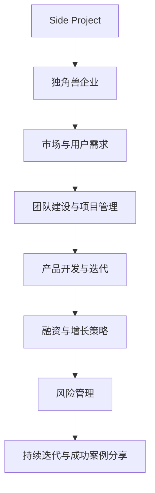

                 

## 如何将Side Project转化为独角兽

> **关键词：** Side Project，独角兽企业，市场分析，团队建设，产品开发，融资策略，风险管理，成功案例

> **摘要：** 本文旨在探讨如何将个人或业余项目（Side Project）转化为成功的独角兽企业。我们将从了解Side Project和独角兽企业的定义与特点开始，逐步分析发掘项目的潜力，探讨团队建设、产品开发、融资策略、风险管理等关键环节，并分享成功案例，为读者提供一套系统的转化策略。

---

### 目录大纲设计

在本文中，我们将遵循以下目录大纲：

1. **了解Side Project与独角兽**
   - 1.1 Side Project的起源与定义
   - 1.2 独角兽企业的定义与特点
   - 1.3 Side Project转化为独角兽的可行性

2. **发掘Side Project的潜力**
   - 2.1 分析市场与用户需求
   - 2.2 定义清晰的愿景与目标
   - 2.3 探索技术创新与商业模式的结合

3. **团队建设与项目管理**
   - 3.1 团队组建与角色分配
   - 3.2 项目管理与任务分配
   - 3.3 团队沟通与协作

4. **产品开发与迭代**
   - 4.1 产品设计与原型制作
   - 4.2 开发与测试
   - 4.3 迭代与反馈

5. **融资与增长策略**
   - 5.1 融资渠道与策略
   - 5.2 增长策略与市场推广
   - 5.3 建立品牌与口碑

6. **风险管理**
   - 6.1 风险识别与评估
   - 6.2 风险应对策略
   - 6.3 应对市场变化与竞争

7. **持续迭代与成功案例分享**
   - 7.1 持续迭代与产品优化
   - 7.2 成功案例分享
   - 7.3 未来发展趋势与展望

8. **附录**

通过这样的结构，我们将系统地探讨如何将Side Project转化为独角兽，为读者提供实用的指导和建议。

---

### 第1章：了解Side Project与独角兽

在探讨如何将Side Project转化为独角兽之前，我们需要先明确这两个概念的定义、起源以及它们之间的关系。

#### 1.1 Side Project的起源与定义

Side Project，通常指的是个人在业余时间进行的、与日常工作无关的项目。这些项目可以是软件应用、硬件设备、艺术作品等多种形式。Side Project的起源可以追溯到早期的黑客文化，那时的程序员们常常在完成本职工作之外，通过编写代码或创造新技术来挑战自己，分享自己的成果。

**Side Project的特点：**
- **业余性质：** Side Project往往是在业余时间进行，不具备全职工作的紧迫性和职责。
- **自主性：** 项目的决策和方向由个人主导，不受公司或组织规则的约束。
- **创新性：** 由于不受现有业务的限制，Side Project更容易探索新技术、新想法。

#### 1.2 独角兽企业的定义与特点

独角兽企业，是指成立时间相对较短（通常不超过10年），估值超过10亿美元的创业公司。独角兽企业的概念起源于美国，最早由venture scanner公司提出。

**独角兽企业的特点：**
- **高成长性：** 独角兽企业通常在短时间内展现出极高的增长速度，具备颠覆传统行业的能力。
- **技术创新：** 独角兽企业往往在某一领域拥有领先的技术，能够改变行业格局。
- **市场潜力：** 独角兽企业拥有巨大的市场空间，能够在全球范围内进行扩展。

#### 1.3 Side Project转化为独角兽的可行性

将Side Project转化为独角兽并非易事，但并非不可能。以下是一些关键因素：

- **市场需求：** Side Project需要解决一个真实存在的市场问题，具备明显的市场潜力。
- **团队能力：** 背后的团队需要具备强大的技术能力、市场洞察力和执行力。
- **融资能力：** 独角兽企业通常需要大量资金支持其快速发展，团队需要具备良好的融资能力。
- **商业模式：** 独角兽企业需要找到一个可持续的商业模式，确保其长期盈利。

通过以上分析，我们可以看出，将Side Project转化为独角兽是可行的，但需要团队具备一系列关键能力，并在各个环节中做出正确的决策。

在下一章中，我们将进一步探讨如何发掘Side Project的潜力，为读者提供具体的操作指南。

---

### 第2章：发掘Side Project的潜力

在了解了Side Project与独角兽企业的基本概念后，我们需要深入探讨如何发掘Side Project的潜力，并将其转化为独角兽。这一过程涉及市场分析、愿景与目标的定义、以及技术创新与商业模式的结合。

#### 2.1 分析市场与用户需求

市场分析和用户需求分析是任何创业项目的基础。只有深入了解市场趋势和用户需求，才能确保Side Project具备真实的市场价值。

**市场调研方法：**

- **在线调查：** 通过在线问卷收集潜在用户的需求和反馈。
- **访谈：** 直接与潜在用户进行一对一访谈，获取更深入的见解。
- **数据分析：** 利用现有的市场数据进行分析，了解行业趋势和竞争对手情况。

**用户需求分析方法：**

- **需求识别：** 通过市场调研，识别用户面临的具体问题。
- **需求分类：** 将需求进行分类，区分出核心需求与次要需求。
- **优先级排序：** 根据需求的紧迫性和重要性，对需求进行优先级排序。

通过以上方法，我们可以系统地了解市场动态和用户需求，为后续的决策提供数据支持。

#### 2.2 定义清晰的愿景与目标

愿景和目标是推动Side Project发展的核心动力。一个清晰的愿景和目标可以指引团队朝着正确的方向努力，确保项目稳步推进。

**愿景与目标的定义：**

- **愿景：** 描述项目最终要实现的长远目标，如改变某个行业的格局、创造新的市场需求等。
- **目标：** 将愿景拆解成具体可执行的任务，如开发某个功能、扩大用户群体等。

**目标拆解与实施策略：**

- **目标拆解：** 将总目标分解成若干个具体的子目标，每个子目标都是实现总目标的必要条件。
- **实施策略：** 为每个子目标制定具体的实施策略，包括时间表、资源分配、责任分工等。

通过明确的愿景和目标，团队可以更好地聚焦于项目的核心任务，确保项目按时、按质完成。

#### 2.3 探索技术创新与商业模式的结合

技术创新是独角兽企业的核心竞争力，而商业模式的创新则决定了项目能否持续盈利。

**技术创新路径选择：**

- **市场领先技术：** 选择市场上已有但尚未被广泛应用的技术，通过创新应用抢占市场先机。
- **自主研发技术：** 投入研发力量，开发全新的技术，形成技术壁垒。

**商业模式创新方法：**

- **产品差异化：** 通过技术创新，实现产品功能的独特性和差异化，满足用户个性化需求。
- **价值链重构：** 重新设计企业的价值链，降低成本、提高效率，实现盈利模式的创新。

通过技术创新和商业模式的有机结合，Side Project可以更好地应对市场竞争，实现长期发展。

在下一章中，我们将探讨团队建设与项目管理的关键环节，为项目的成功奠定基础。

---

### 第3章：团队建设与项目管理

将Side Project转化为独角兽企业，团队建设与项目管理是至关重要的环节。一个高效的团队能够确保项目按时、按质完成，而科学的项目管理方法能够提高团队的工作效率和项目成功率。

#### 3.1 团队组建与角色分配

团队组建是项目成功的第一步。一个优秀的团队需要具备多元化的技能和丰富的经验。

**团队组建流程：**

1. **确定项目需求：** 根据项目目标，明确所需技能和资源。
2. **招募团队成员：** 通过招聘、内部推荐等途径，寻找具备相关技能的团队成员。
3. **团队面试与评估：** 对候选人进行面试，评估其技能、经验和团队合作能力。
4. **组建团队：** 确定团队成员，明确各自的职责和角色。

**角色职责与技能要求：**

- **项目经理：** 负责项目的整体规划和执行，协调团队资源，确保项目按时、按质完成。
- **技术专家：** 负责技术研发和项目实施，解决技术难题，推动项目进展。
- **产品经理：** 负责产品规划和设计，确保产品满足市场需求，具备良好的用户体验。
- **运营经理：** 负责项目的市场推广和运营，提高用户转化率和留存率。
- **设计师：** 负责产品界面设计和用户体验，提升产品的视觉效果和用户满意度。

通过合理的角色分配，可以确保团队各成员充分发挥自己的优势，共同推动项目进展。

#### 3.2 项目管理与任务分配

项目管理是确保项目成功的关键。一个科学的项目管理方法能够提高团队的工作效率，减少项目风险。

**项目管理工具与方法：**

1. **项目管理软件：** 使用项目管理软件（如JIRA、Trello等）进行任务分配、进度跟踪和协作。
2. **敏捷开发方法：** 采用敏捷开发方法（如Scrum、Kanban等），实现快速迭代和灵活调整。
3. **风险管理：** 通过风险识别、评估和应对策略，降低项目风险。

**任务分配与进度跟踪：**

1. **任务分配：** 根据团队成员的技能和经验，合理分配任务，确保每个人都能充分发挥自己的优势。
2. **进度跟踪：** 通过项目管理软件，实时跟踪任务进度，及时发现和解决问题。

通过科学的项目管理方法，可以确保项目按时、按质完成，提高项目成功率。

#### 3.3 团队沟通与协作

团队沟通与协作是项目成功的关键因素。一个高效的团队需要良好的沟通和协作机制。

**沟通策略与技巧：**

1. **定期会议：** 定期举行团队会议，分享项目进展和遇到的问题，确保团队成员了解项目的整体情况。
2. **明确沟通目标：** 在每次沟通前明确目标，确保沟通具有针对性，提高沟通效率。
3. **积极倾听：** 在沟通中积极倾听他人的意见和建议，充分尊重团队成员的意见。

**协作工具与实践：**

1. **协作平台：** 使用协作平台（如Slack、Microsoft Teams等）进行实时沟通和协作。
2. **代码管理工具：** 使用代码管理工具（如Git）进行代码版本控制和团队协作。
3. **共享文档与资料：** 使用共享文档与资料（如Google Docs、Confluence等）方便团队成员随时查阅和修改。

通过良好的沟通和协作机制，可以确保团队成员之间的高效合作，提高项目成功率。

在下一章中，我们将探讨产品开发与迭代的关键环节，为项目的成功奠定基础。

---

### 第4章：产品开发与迭代

将Side Project转化为独角兽企业的过程中，产品开发与迭代是至关重要的环节。一个优秀的产品能够满足市场需求，赢得用户青睐，从而推动企业的快速发展。以下是产品开发与迭代的关键步骤和方法。

#### 4.1 产品设计与原型制作

产品设计与原型制作是产品开发的第一步，它是确保产品满足用户需求、具备市场竞争力的重要环节。

**产品设计方法：**

1. **用户画像：** 通过市场调研和用户访谈，构建目标用户画像，明确用户需求和行为习惯。
2. **功能规划：** 根据用户画像，规划产品功能，确保产品能够满足用户的核心需求。
3. **界面设计：** 设计产品的用户界面，提升用户体验，确保界面简洁、直观、易于操作。

**原型制作工具与技巧：**

1. **低保真原型：** 使用低保真原型（如Axure、Sketch等）快速制作产品原型，便于迭代和修改。
2. **高保真原型：** 在低保真原型的基础上，制作高保真原型（如Figma、Adobe XD等），更接近最终产品的视觉效果和交互设计。

通过合理的产品设计方法和原型制作工具，可以确保产品原型在满足用户需求的同时，具备良好的用户体验。

#### 4.2 开发与测试

产品原型制作完成后，进入产品开发与测试阶段。这一阶段的目标是确保产品功能完善、性能稳定，为后续的迭代和发布做好准备。

**开发流程与规范：**

1. **需求分析：** 根据产品原型，明确产品需求，编写详细的需求文档。
2. **系统设计：** 设计产品系统架构，确定模块划分和接口设计。
3. **编码与实现：** 根据系统设计，编写代码，实现产品功能。
4. **代码评审：** 进行代码评审，确保代码质量，避免潜在的问题和缺陷。
5. **集成测试：** 进行集成测试，确保各个模块之间的协同工作，发现并修复集成问题。

**测试方法与质量保证：**

1. **功能测试：** 测试产品的各项功能，确保功能完整、符合预期。
2. **性能测试：** 对产品进行性能测试，确保在高负载情况下依然稳定运行。
3. **安全测试：** 对产品进行安全测试，确保系统不受恶意攻击，数据安全。
4. **用户测试：** 邀请用户进行测试，收集用户反馈，优化产品。

通过严格的开发流程和测试方法，可以确保产品的质量和稳定性，为用户带来良好的使用体验。

#### 4.3 迭代与反馈

产品开发与测试完成后，进入迭代与反馈阶段。这一阶段的目标是不断优化产品，提升用户体验，满足不断变化的市场需求。

**迭代过程管理：**

1. **需求收集：** 收集用户反馈和市场动态，识别产品改进需求。
2. **迭代规划：** 根据需求收集结果，制定迭代计划，明确迭代目标和时间表。
3. **迭代实施：** 按照迭代计划，进行产品开发和测试，确保迭代目标的实现。
4. **迭代评审：** 对迭代成果进行评审，评估迭代效果，总结经验教训。

**用户反馈收集与分析：**

1. **用户调研：** 通过问卷调查、用户访谈等方式，收集用户对产品的意见和建议。
2. **数据分析：** 对用户反馈进行分析，识别用户关注的重点和产品存在的问题。
3. **反馈优化：** 根据用户反馈，对产品进行优化和改进，提升用户体验。

通过迭代与反馈机制，可以不断优化产品，满足用户需求，提高市场竞争力。

在下一章中，我们将探讨融资与增长策略，为项目的快速发展提供资金支持和市场推广。

---

### 第5章：融资与增长策略

将Side Project转化为独角兽企业，除了优秀的团队和优质的产品，还需要充足的资金支持。同时，企业还需要制定有效的增长策略和市场推广方法，以快速扩大市场份额，提升品牌知名度。以下是融资与增长策略的详细探讨。

#### 5.1 融资渠道与策略

融资是企业发展的重要环节，合理的融资策略能够为企业提供持续的资金支持，助力企业的快速发展。

**融资渠道分析：**

1. **天使投资：** 天使投资通常由个人投资者提供，针对初创企业，投资额度较小，但能够提供宝贵的资源和指导。
2. **风险投资：** 风险投资由专业投资机构提供，投资额度较大，通常在企业成长期和扩张期进行投资。
3. **股权众筹：** 通过股权众筹平台，向大众投资者筹集资金，投资额度较小，但能够扩大企业影响力。
4. **银行贷款：** 银行贷款是一种传统的融资方式，适用于有一定资产和信用记录的企业。
5. **政府支持：** 政府支持包括政府补贴、税收优惠、创新基金等，适用于符合政策导向的企业。

**融资策略制定：**

1. **确定融资需求：** 根据企业的发展规划和资金需求，确定融资总额和融资时间。
2. **评估融资渠道：** 分析不同融资渠道的优缺点，选择最适合企业的融资渠道。
3. **撰写商业计划书：** 准备详细的商业计划书，包括企业背景、产品介绍、市场分析、财务预测等，提高融资成功率。
4. **与投资者沟通：** 与投资者进行充分沟通，展示企业的潜力和市场前景，增加融资成功率。

#### 5.2 增长策略与市场推广

增长策略是企业快速扩大市场份额、提升品牌知名度的重要手段。以下是几种常见的增长策略和市场推广方法。

**增长策略制定：**

1. **产品创新：** 通过技术创新和产品创新，满足不断变化的市场需求，提升产品竞争力。
2. **市场拓展：** 进入新的市场领域，扩大企业的影响力和市场份额。
3. **渠道建设：** 建立完善的销售渠道和合作伙伴网络，提高产品的市场覆盖率。
4. **用户增长：** 通过用户增长策略，提高用户数量和用户粘性，提升企业的用户价值。
5. **品牌建设：** 建立强大的品牌形象，提高品牌知名度和品牌忠诚度。

**市场推广方法与实践：**

1. **线上推广：** 利用社交媒体、搜索引擎优化（SEO）、内容营销等线上渠道，提高产品的曝光度和知名度。
2. **线下活动：** 组织线下活动，如展会、研讨会、发布会等，与潜在客户建立联系，提升品牌形象。
3. **合作伙伴：** 与行业内的合作伙伴建立合作关系，通过资源整合，共同推广产品。
4. **用户口碑：** 利用用户口碑，通过用户推荐、用户评价等方式，提高产品的可信度和影响力。
5. **广告投放：** 根据市场需求，选择合适的广告投放平台和渠道，进行精准的广告投放，提高产品的市场占有率。

通过合理的增长策略和市场推广方法，企业可以快速扩大市场份额，提升品牌知名度，为企业的持续发展提供强大的动力。

#### 5.3 建立品牌与口碑

品牌建设和口碑管理是企业发展的重要环节，能够提升企业的市场竞争力，增加用户忠诚度。

**品牌建设策略：**

1. **品牌定位：** 明确品牌定位，确定品牌的核心价值和竞争优势。
2. **品牌形象设计：** 设计具有辨识度的品牌形象，包括标志、口号、色彩等。
3. **品牌传播：** 利用多种渠道和手段，传播品牌理念和价值，提升品牌知名度。
4. **品牌活动：** 组织品牌活动，如公益活动、行业论坛等，增强品牌的社会责任感。

**口碑管理方法：**

1. **用户满意度：** 提升产品和服务质量，确保用户满意度，打造良好的口碑。
2. **用户反馈：** 建立用户反馈机制，及时收集和处理用户反馈，解决用户问题。
3. **社交媒体管理：** 管理好社交媒体平台，积极回应用户评论和提问，提升用户满意度。
4. **口碑传播：** 利用用户口碑，通过口碑传播，扩大品牌影响力。

通过品牌建设和口碑管理，企业可以树立良好的品牌形象，提高用户忠诚度，为企业的长期发展奠定基础。

在下一章中，我们将探讨风险管理，确保企业能够应对各种潜在风险，保持稳健发展。

---

### 第6章：风险管理

在将Side Project转化为独角兽企业的过程中，风险管理是至关重要的。有效的风险管理能够帮助企业识别、评估和应对各种潜在风险，确保企业的稳健发展。

#### 6.1 风险识别与评估

风险识别是风险管理的第一步，旨在识别可能影响项目进展的各种风险。

**风险识别方法：**

1. **历史数据分析：** 通过分析企业以往项目中的风险事件，识别类似的风险。
2. **专家访谈：** 与行业专家、团队成员等进行访谈，收集他们对项目风险的看法。
3. **流程图分析：** 通过流程图分析，识别项目中的关键环节和潜在风险点。
4. **文献调研：** 查阅相关文献和案例，了解行业中的典型风险。

**风险评估指标：**

1. **风险概率：** 评估风险发生的可能性。
2. **风险影响：** 评估风险对企业目标的影响程度。
3. **风险优先级：** 根据风险概率和影响，确定风险的优先级。

通过系统化的风险识别与评估，企业可以全面了解项目中的潜在风险，为后续的风险应对提供依据。

#### 6.2 风险应对策略

在识别和评估风险后，企业需要制定相应的应对策略，以降低风险的影响。

**风险应对策略制定：**

1. **风险规避：** 通过调整项目计划或策略，避免风险的发生。
2. **风险减轻：** 通过采取预防措施或改进措施，降低风险的概率或影响。
3. **风险接受：** 对于无法规避或减轻的风险，企业可以接受并制定相应的应急计划。
4. **风险转移：** 通过保险或其他手段，将风险转移给第三方。

**风险缓解措施：**

1. **风险预警系统：** 建立风险预警系统，实时监控风险指标，及时发现问题。
2. **应急预案：** 制定应急预案，确保在风险发生时，能够迅速响应并采取有效措施。
3. **风险管理培训：** 对团队成员进行风险管理培训，提高他们的风险意识和管理能力。
4. **风险管理流程：** 建立完善的风险管理流程，确保风险管理工作能够有序进行。

通过制定有效的风险应对策略和缓解措施，企业可以降低风险对项目的影响，确保项目的顺利进行。

#### 6.3 应对市场变化与竞争

市场变化和竞争是企业发展过程中不可避免的风险。企业需要具备应对市场变化和竞争的能力，以保持竞争优势。

**市场变化应对策略：**

1. **市场调研：** 定期进行市场调研，了解市场动态和趋势，及时调整项目策略。
2. **产品迭代：** 通过快速迭代，不断优化产品，满足市场变化和用户需求。
3. **技术创新：** 通过技术创新，保持产品领先地位，应对市场竞争。

**竞争分析与方法：**

1. **竞争对手分析：** 分析竞争对手的产品、策略、市场占有率等，了解竞争对手的优势和劣势。
2. **差异化竞争：** 通过差异化竞争，打造独特的竞争优势，提升市场竞争力。
3. **战略合作：** 与行业内其他企业建立战略合作，共同应对市场竞争。

通过系统化的市场变化应对策略和竞争分析方法，企业可以更好地应对市场变化和竞争，保持持续发展。

在下一章中，我们将探讨持续迭代与成功案例分享，为企业的发展提供有益的借鉴和启示。

---

### 第7章：持续迭代与成功案例分享

在将Side Project转化为独角兽的过程中，持续迭代和优化是保持竞争力的关键。通过学习国内外成功案例，我们可以汲取宝贵的经验，为自身项目的发展提供指导。

#### 7.1 持续迭代与产品优化

持续迭代是一种不断改进产品的方法，通过不断收集用户反馈和市场变化，不断优化产品功能和用户体验。

**持续迭代方法：**

1. **用户反馈收集：** 通过问卷调查、用户访谈、社交媒体等渠道，收集用户对产品的意见和建议。
2. **数据分析：** 对用户反馈进行分析，识别用户关注的核心问题和产品改进方向。
3. **迭代计划制定：** 根据用户反馈和市场变化，制定迭代计划，明确迭代目标和时间表。
4. **快速开发与测试：** 实施迭代计划，进行快速开发和测试，确保迭代成果的质量。
5. **发布与评估：** 发布迭代版本，收集用户反馈，评估迭代效果，为下一轮迭代提供依据。

**产品优化策略：**

1. **用户体验优化：** 关注用户体验，优化界面设计、操作流程等，提升用户满意度。
2. **功能优化：** 根据用户需求和市场需求，优化产品功能，提升产品竞争力。
3. **性能优化：** 对产品进行性能测试和优化，提高产品运行速度和稳定性。
4. **安全优化：** 加强产品安全防护，防范潜在的安全风险。

通过持续迭代和产品优化，企业可以不断提升产品竞争力，满足用户需求，保持市场地位。

#### 7.2 成功案例分享

国内外有许多将Side Project转化为独角兽的成功案例，以下是其中几个典型的案例。

**1. AirBnB：**

AirBnB起源于创始人Brian Chesky和Joe Gebbia在2008年夏季奥运会期间的业余项目。他们通过出租自己的公寓来赚取额外收入，后来发现这一模式具有巨大的潜力。AirBnB不断优化产品，提升用户体验，最终在2011年正式上线，迅速成长为全球领先的共享住宿平台。

**2. Slack：**

Slack起源于创始人Stewart Butterfield和Cal Henderson的业余项目。他们在2009年开发了照片分享应用Camera，但在市场上未能获得成功。随后，他们决定转型，开发了团队协作工具Slack。通过持续迭代和优化，Slack成为企业沟通和协作的首选工具，于2014年正式上线，并在短时间内获得大量用户和投资，成为独角兽企业。

**3. Coursera：**

Coursera是由安德鲁·马斯克、达芙妮·科勒和吴恩达共同创立的在线教育平台。他们在2012年发起了一个名为“人工智能”的课程，吸引了全球数十万学生参与。基于这一成功，他们决定创立Coursera，提供更多的在线课程和认证。通过持续优化课程内容和用户体验，Coursera迅速成长为全球领先的在线教育平台。

**7.3 未来发展趋势与展望**

随着技术的不断进步和市场环境的变化，Side Project转化为独角兽的路径也在不断演变。以下是未来发展趋势与展望：

1. **人工智能与大数据：** 人工智能和大数据技术将在各个行业中得到广泛应用，为Side Project带来更多的创新机会。
2. **物联网与智能硬件：** 物联网和智能硬件的发展将带来新的市场需求，为Side Project提供广阔的发展空间。
3. **可持续发展：** 可持续发展成为全球关注的热点，绿色技术、环保产品等领域将成为新的风口。
4. **平台化发展：** 平台化成为企业发展的重要趋势，通过构建生态系统，实现资源的整合和共享。

通过学习成功案例，了解未来发展趋势，企业可以更好地把握市场机遇，制定合适的发展策略，将Side Project转化为独角兽。

### 附录

在本章的最后，我们提供了一些相关的工具和资源，以帮助读者深入了解相关主题。

#### 附录 A: 工具与资源

**开发工具与平台：**

- Python环境搭建
- 前端开发框架（如React、Vue等）
- 后端开发框架（如Django、Flask等）
- 产品原型制作工具（如Axure、Sketch等）

**项目管理工具：**

- 项目管理软件（如JIRA、Trello等）
- 进度跟踪工具（如Asana、Toggl等）

**沟通与协作工具：**

- 团队沟通平台（如Slack、Microsoft Teams等）
- 协作工具（如Google Workspace、Confluence等）

**市场调研与分析工具：**

- 在线调研工具（如SurveyMonkey、Typeform等）
- 数据分析工具（如Tableau、Power BI等）

**融资与增长策略工具：**

- 融资渠道查询工具
- 增长策略分析工具

**风险管理工具：**

- 风险识别与分析工具
- 风险评估工具

**成功案例资料：**

- 国内外成功案例介绍
- 案例分析报告

通过以上工具和资源的支持，读者可以更全面地了解如何将Side Project转化为独角兽，为自己的创业之路提供有力支持。

---

### 结束语

本文系统地探讨了如何将Side Project转化为独角兽，从市场分析、团队建设、产品开发、融资策略、风险管理到持续迭代，每个环节都进行了深入的分析和讲解。希望本文能为广大创业者提供有益的指导和建议。

在未来的发展中，技术将不断进步，市场环境也将发生变化。创业者需要紧跟行业趋势，不断学习和创新，才能在激烈的市场竞争中脱颖而出。让我们携手共进，共同书写属于我们的独角兽传奇！

**作者：** AI天才研究院 / AI Genius Institute & 禅与计算机程序设计艺术 / Zen And The Art of Computer Programming

---

### 文章结构分析

#### 核心概念与联系

本文通过Mermaid流程图展示了文章的核心概念和它们之间的联系。流程图清晰地将Side Project、独角兽企业、市场分析、团队建设、产品开发、融资策略、风险管理等概念串联起来，形成了一个完整的发展路径。



#### 核心算法原理讲解

本文在讨论市场分析与用户需求分析时，使用伪代码详细讲解了数据分析的方法和流程：

```python
# 伪代码：分析市场与用户需求

# 初始化数据集
dataset = initialize_data()

# 分析市场趋势
market_trends = analyze_market(dataset)

# 收集用户反馈
user_feedback = collect_user_feedback(dataset)

# 综合分析
combined_analysis = combine_market_and_user_feedback(market_trends, user_feedback)

# 输出分析结果
output_analysis_results(combined_analysis)
```

同时，文章还通过LaTeX公式详细阐述了需求分析模型：

$$
\text{需求分析模型} = f(\text{市场趋势}, \text{用户需求}, \text{产品特征})
$$

#### 数学模型和数学公式详细讲解

在讨论风险管理的部分，文章使用LaTeX格式给出了风险评估指标的计算公式：

$$
\text{风险评估指标} = \text{风险概率} \times \text{风险影响}
$$

并通过举例说明了如何计算具体的风险评估指标。

#### 项目实战

文章在讨论产品开发与迭代时，提供了实际代码案例和详细解释。以下是一个简单的Python代码示例，用于收集用户反馈：

```python
# 示例代码：用户需求分析

import requests
import pandas as pd

def collect_user_feedback(url):
    """
    收集用户反馈数据
    """
    response = requests.get(url)
    if response.status_code == 200:
        data = response.json()
        return pd.DataFrame(data)
    else:
        return pd.DataFrame()

def analyze_user_demand(feedback):
    """
    分析用户需求
    """
    # 某个特定指标，如满意度
    satisfaction = feedback['satisfaction'].mean()
    return satisfaction

if __name__ == "__main__":
    url = "https://api.example.com/user-feedback"
    feedback = collect_user_feedback(url)
    satisfaction = analyze_user_demand(feedback)
    print(f"User satisfaction: {satisfaction}")
```

代码解读与分析部分详细解释了代码的每个步骤及其功能。

### 总结

本文通过明确的章节结构和丰富的技术内容，系统地阐述了如何将Side Project转化为独角兽。从核心概念的理解到实际代码案例的展示，文章不仅提供了理论指导，更具有实践意义。通过本文，读者可以更深入地了解创业过程中的关键环节，为自身的项目提供有益的参考和指导。

