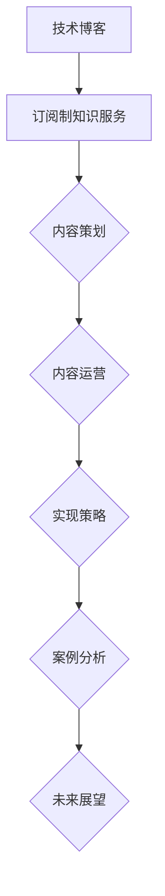

                 

# 《如何将技术博客转化为订阅制知识服务》

## 关键词
技术博客，订阅制知识服务，内容策划，运营，实现策略，案例分析，未来展望

## 摘要
本文将深入探讨如何将技术博客转化为订阅制知识服务。我们将从技术博客概述开始，介绍订阅制知识服务的基本概念和特点，然后详细讨论技术博客内容策划、运营和实现策略，通过实际案例分析和未来展望，为技术博主提供一套完整的订阅制知识服务转型指南。

### 《如何将技术博客转化为订阅制知识服务》目录大纲

#### 第一部分：技术博客概述
1. **技术博客概述**
   1.1 **技术博客的定义与作用**
   1.2 **技术博客的发展历史**
   1.3 **技术博客的现状与趋势**

#### 第二部分：订阅制知识服务
2. **订阅制知识服务概述**
   2.1 **订阅制知识服务的定义与特点**
   2.2 **订阅制知识服务的发展背景**
   2.3 **订阅制知识服务的主要形式**

#### 第三部分：技术博客内容策划
3. **技术博客内容策划**
   3.1 **目标受众分析**
   3.2 **内容主题选择**
   3.3 **内容形式与风格**

#### 第四部分：技术博客运营
4. **技术博客运营**
   4.1 **博客平台选择与搭建**
   4.2 **内容发布与推广**
   4.3 **用户互动与反馈**

#### 第五部分：订阅制知识服务实现
5. **订阅制知识服务实现**
   5.1 **订阅系统设计**
   5.2 **内容付费策略**
   5.3 **用户数据分析**

#### 第六部分：案例分析
6. **案例分析**
   6.1 **成功案例解析**
   6.2 **失败案例剖析**
   6.3 **案例启示与借鉴**

#### 第七部分：未来展望
7. **未来展望**
   7.1 **技术趋势分析**
   7.2 **订阅制知识服务的发展前景**
   7.3 **个人与职业发展建议**

#### 附录
8. **附录**
   8.1 **常用工具与资源**
   8.2 **参考资料**
   8.3 **致谢**

#### 参考文献

### 第一部分：技术博客概述

#### 1.1 技术博客的定义与作用

技术博客，通常指以计算机编程、软件开发、网络技术等IT领域为主题的博客。它是IT从业者或爱好者通过文字、代码示例、图表等形式，记录自己在学习和工作中遇到的问题、解决方案、技术心得和技术见解的平台。技术博客不仅是一种知识共享的方式，更是个人品牌建设的重要手段。

技术博客的作用主要体现在以下几个方面：

1. **知识共享与传播**：技术博客将个人的知识和技术经验分享给公众，有助于扩大技术知识的影响力，促进技术的普及和推广。
2. **个人品牌建设**：通过持续的技术博客写作，个人可以在业界建立起一定的声誉，从而提升个人在职场上的竞争力和影响力。
3. **学习与成长**：技术博客写作是一种深入学习和思考的过程，有助于博主对所学知识进行系统的梳理和总结，促进个人技能的提升。
4. **互动与交流**：技术博客为读者提供了留言和评论的功能，博主可以通过与读者的互动，了解读者的需求和反馈，从而不断优化自己的内容。

#### 1.2 技术博客的发展历史

技术博客的发展可以追溯到互联网的早期。随着互联网的普及，博客平台如WordPress、Blogger等逐渐兴起，为个人提供了方便快捷的博客发布和管理工具。最早的博客大多以纯文本形式为主，后来逐渐引入了图片、视频、代码等多种内容形式。

在21世纪初，随着Web 2.0时代的到来，博客逐渐成为知识共享和传播的重要渠道。许多知名的IT专家和技术博客博主，如阮一峰、张宴等，通过技术博客积累了大量的读者和粉丝，成为业界影响力的人物。

近年来，随着社交媒体的兴起，博客的形式和内容也在不断演变。一些技术博客博主开始将博客与社交媒体结合，通过Twitter、LinkedIn等平台进行内容推广和用户互动。

#### 1.3 技术博客的现状与趋势

目前，技术博客已经成为IT领域知识传播和共享的重要渠道。许多技术从业者通过博客分享自己的技术见解、工作经验和解决方案，不仅为自己带来了知名度，也为整个行业贡献了宝贵的知识财富。

从现状来看，技术博客的发展趋势主要表现在以下几个方面：

1. **内容形式多样化**：除了传统的文本形式，技术博客逐渐引入了视频、直播、问答等多种内容形式，以满足不同用户的需求。
2. **平台化发展**：许多博客平台如简书、CSDN等，通过提供专业的内容管理和推广服务，吸引了大量的技术博主和读者，形成了线上技术社区。
3. **商业化趋势**：随着内容创作和知识付费的兴起，越来越多的技术博主开始探索通过博客实现商业变现，如推出付费课程、图书、咨询服务等。
4. **个性化与专业化**：随着用户需求的多样化，技术博客逐渐向细分领域和专业领域发展，为用户提供更加精准和专业的知识服务。

### 第二部分：订阅制知识服务

#### 2.1 订阅制知识服务的定义与特点

订阅制知识服务，是指通过订阅方式提供专业知识、技能培训、行业动态等服务的一种商业模式。用户支付一定费用后，可以获得定期更新的高质量内容，享受持续的知识和价值。

订阅制知识服务的特点主要包括：

1. **定期更新**：订阅制知识服务通常采用定期更新的模式，确保用户能够持续获取最新的知识和信息。
2. **个性化推荐**：通过用户行为分析和数据挖掘，订阅制知识服务能够为用户提供个性化的内容推荐，提高用户满意度和粘性。
3. **高质量内容**：订阅制知识服务的内容通常经过精心策划和制作，具有较高价值和实用性。
4. **持续投入**：订阅制知识服务需要持续投入人力、物力和财力，以确保内容质量和用户体验。
5. **商业变现**：订阅制知识服务为内容创作者提供了稳定的收入来源，有助于实现内容创作的商业化。

#### 2.2 订阅制知识服务的发展背景

订阅制知识服务的发展背景主要包括以下几个方面：

1. **知识付费兴起**：随着互联网的普及和人们生活水平的提高，知识付费逐渐成为一种新的消费模式。用户愿意为高质量的知识和技能培训支付费用，从而提升自己的竞争力。
2. **内容创作繁荣**：随着自媒体时代的到来，越来越多的人投身于内容创作领域。大量的优质内容涌现，为订阅制知识服务提供了丰富的素材和资源。
3. **技术进步**：大数据、人工智能、区块链等技术的进步，为订阅制知识服务提供了强大的技术支持，使得个性化推荐、内容管理和付费变现等成为可能。
4. **用户需求变化**：随着信息爆炸和知识更新的加速，用户对于高质量、个性化、持续更新的知识需求日益增长，订阅制知识服务正好满足了这一需求。

#### 2.3 订阅制知识服务的主要形式

订阅制知识服务的主要形式包括以下几种：

1. **付费专栏**：付费专栏是订阅制知识服务最常见的形式之一。用户支付一定费用后，可以访问专栏中的所有内容，通常包括文章、视频、音频等多种形式。
2. **在线课程**：在线课程是通过网络平台提供的专业培训课程，用户支付费用后可以获得课程学习权限，通常包括课程视频、讲义、作业等多种内容。
3. **知识星球**：知识星球是一种社区型的订阅制知识服务，用户支付费用后可以加入特定领域的知识社区，与其他成员互动交流，共同学习成长。
4. **付费问答**：付费问答是一种针对特定问题的知识咨询服务，用户支付费用后可以向专家提问，获得专业解答。

### 第三部分：技术博客内容策划

#### 3.1 目标受众分析

内容策划的第一步是明确目标受众。对于技术博客来说，目标受众可能包括以下几类：

1. **初级开发者**：对编程语言、开发框架等基础知识有浓厚兴趣的初学者。
2. **中级开发者**：具备一定编程经验，希望在特定领域深入学习的开发者。
3. **高级开发者**：具有丰富项目经验，追求技术前沿和创新解决方案的专家。
4. **技术管理者**：关注团队管理和项目进度的技术管理者。
5. **行业分析师**：关注行业趋势和技术的行业分析师。

了解目标受众的需求和兴趣，有助于有针对性地策划内容，提高内容的吸引力和实用性。

#### 3.2 内容主题选择

技术博客的内容主题选择应充分考虑目标受众的需求和兴趣。以下是一些常见的内容主题：

1. **编程语言与框架**：介绍各种编程语言和开发框架的特点、优势和使用场景。
2. **算法与数据结构**：探讨算法和数据结构的基本原理、实现和应用。
3. **云计算与大数据**：分析云计算和大数据的技术趋势、解决方案和应用案例。
4. **人工智能与机器学习**：介绍人工智能和机器学习的基本概念、算法和应用。
5. **网络安全**：讨论网络安全的重要性、常见威胁和防护措施。
6. **软件工程**：探讨软件工程的方法、工具和最佳实践。

#### 3.3 内容形式与风格

技术博客的内容形式和风格直接影响用户的阅读体验。以下是一些常见的内容形式和风格：

1. **文章**：以文字为主，适合深入讲解技术原理和解决方案。
2. **代码示例**：通过实际代码示例，展示技术实现过程和结果。
3. **图表与图像**：使用图表和图像直观展示数据、算法和架构。
4. **视频与直播**：通过视频和直播，进行技术讲解和演示。
5. **问答与互动**：通过问答和互动，解答用户疑问，促进交流。

内容风格应简洁明了，通俗易懂，避免使用过于专业的术语和复杂的表述，以提高内容的可读性和实用性。

### 第四部分：技术博客运营

#### 4.1 博客平台选择与搭建

选择合适的博客平台是技术博客运营的第一步。以下是一些常见的博客平台及其特点：

1. **WordPress**：功能强大，支持丰富的插件和主题，适合个人和专业博主。
2. **Hexo**：基于Node.js的静态博客生成工具，速度快，便于SEO优化。
3. **Jekyll**：基于Ruby的静态博客生成工具，适合技术博主，支持Markdown语法。
4. **Medium**：适合短篇内容和专业文章，用户群体广泛，易于推广。

搭建博客平台需要以下步骤：

1. **选择平台**：根据个人需求和技术能力，选择合适的博客平台。
2. **域名购买**：购买一个合适的域名，便于用户访问和记忆。
3. **搭建博客**：按照平台文档进行博客搭建，配置主题和插件。

#### 4.2 内容发布与推广

内容发布与推广是技术博客运营的关键环节。以下是一些推广策略：

1. **SEO优化**：通过关键词优化、内容布局和链接建设，提高博客在搜索引擎中的排名。
2. **社交媒体**：在Twitter、LinkedIn、Facebook等社交媒体上分享博客内容，吸引关注和转发。
3. **社区互动**：在技术社区如Stack Overflow、GitHub、知乎等平台上参与讨论，扩大影响力。
4. **合作与互推**：与其他博主或媒体进行合作，互推内容，提高曝光率。
5. **邮件营销**：建立邮件列表，定期向订阅者发送博客更新和优惠信息。

#### 4.3 用户互动与反馈

用户互动与反馈是提升博客质量和用户满意度的关键。以下是一些互动策略：

1. **评论管理**：积极回复用户评论，解答疑问，促进交流。
2. **问卷调查**：定期进行问卷调查，了解用户需求和反馈，优化内容。
3. **用户社群**：建立用户社群，如微信群、QQ群等，进行实时互动和讨论。
4. **用户调研**：通过用户调研，深入了解用户需求和期望，不断改进博客内容和服务。

### 第五部分：订阅制知识服务实现

#### 5.1 订阅系统设计

订阅系统是订阅制知识服务的关键组成部分。以下是一个简单的订阅系统设计：

1. **用户注册与登录**：用户注册并登录后，可以访问和管理自己的订阅信息。
2. **订阅管理**：用户可以订阅感兴趣的内容或专栏，并管理订阅状态。
3. **内容发布**：内容创作者发布新的内容，系统自动推送至订阅用户的邮箱或客户端。
4. **支付与结算**：用户支付订阅费用，系统自动处理支付和结算。

#### 5.2 内容付费策略

内容付费策略是订阅制知识服务成功的关键。以下是一些策略：

1. **免费试读**：提供免费试读章节，吸引用户订阅。
2. **分期订阅**：用户可以选择按月、按季度或按年订阅，享受折扣。
3. **会员制度**：推出会员制度，提供专属内容、优惠和特权。
4. **打包销售**：将多个相关内容打包销售，提高销售额。
5. **定制服务**：根据用户需求提供定制化内容和服务，满足个性化需求。

#### 5.3 用户数据分析

用户数据分析是优化订阅制知识服务的重要手段。以下是一些分析方法：

1. **用户行为分析**：分析用户浏览、阅读、订阅等行为，了解用户偏好和需求。
2. **内容分析**：分析内容点击率、阅读时长、评论数等指标，评估内容质量和受欢迎程度。
3. **用户细分**：根据用户行为和需求，将用户分为不同群体，提供个性化推荐。
4. **留存分析**：分析用户订阅后的留存情况，优化订阅体验和内容质量。

### 第六部分：案例分析

#### 6.1 成功案例解析

成功案例解析可以帮助我们了解订阅制知识服务在实践中的成功经验。以下是一个成功案例：

**案例：某知名技术博客的订阅制知识服务转型**

- **背景**：某知名技术博客在博客平台上积累了大量读者和粉丝，希望通过订阅制知识服务实现商业变现。
- **策略**：博客博主在原有博客内容的基础上，推出了一系列付费专栏，包括编程语言、算法和数据结构等主题。
- **效果**：通过免费试读和分期订阅策略，吸引了大量用户订阅，实现了稳定的收入增长。

**经验总结**：

1. **优质内容**：提供高质量、实用性的内容是订阅制知识服务成功的关键。
2. **用户需求**：了解用户需求和偏好，提供个性化推荐和服务。
3. **营销策略**：采用免费试读、分期订阅等营销策略，吸引用户订阅。

#### 6.2 失败案例剖析

失败案例剖析可以帮助我们了解订阅制知识服务在实践中的失败原因。以下是一个失败案例：

**案例：某新兴技术博客的订阅制知识服务失败**

- **背景**：某新兴技术博客希望通过订阅制知识服务快速实现商业变现。
- **策略**：博客博主推出了多个主题的付费专栏，但内容质量参差不齐，且缺乏推广和用户互动。
- **效果**：由于内容质量不高，用户订阅意愿较低，订阅制知识服务最终失败。

**经验总结**：

1. **内容质量**：高质量的内容是用户订阅的前提，内容质量不高会导致订阅失败。
2. **用户互动**：缺乏与用户的互动和反馈，导致用户满意度和忠诚度下降。
3. **推广策略**：缺乏有效的推广策略，导致用户知晓度低，订阅意愿不高。

#### 6.3 案例启示与借鉴

通过成功案例和失败案例的分析，我们可以得出以下启示和借鉴：

1. **内容质量**：始终关注内容质量，提供高质量、实用性的内容。
2. **用户需求**：深入了解用户需求和偏好，提供个性化推荐和服务。
3. **营销策略**：采用多样化的营销策略，提高用户知晓度和订阅意愿。
4. **用户互动**：积极与用户互动，收集用户反馈，不断优化内容和服务。

### 第七部分：未来展望

#### 7.1 技术趋势分析

随着技术的不断发展，订阅制知识服务也将迎来新的机遇和挑战。以下是一些技术趋势：

1. **人工智能与大数据**：人工智能和大数据技术将进一步提高订阅制知识服务的个性化推荐和用户体验。
2. **区块链**：区块链技术将为订阅制知识服务提供更安全、透明的支付和版权保护。
3. **云计算与边缘计算**：云计算和边缘计算将为订阅制知识服务提供更高效、灵活的计算和存储支持。
4. **虚拟现实与增强现实**：虚拟现实和增强现实技术将为订阅制知识服务带来全新的交互体验。

#### 7.2 订阅制知识服务的发展前景

订阅制知识服务在未来的发展前景十分广阔。以下是一些趋势：

1. **市场规模扩大**：随着知识付费的兴起，订阅制知识服务的市场规模将不断扩大。
2. **内容多样化**：订阅制知识服务的内容将更加多样化，涵盖更多领域和主题。
3. **平台化发展**：更多的平台将加入订阅制知识服务的行列，提供专业的内容管理和推广服务。
4. **商业模式创新**：随着技术的进步和市场的发展，订阅制知识服务的商业模式将不断创新，为内容创作者和用户提供更多选择。

#### 7.3 个人与职业发展建议

对于技术博客博主来说，订阅制知识服务提供了新的职业发展机遇。以下是一些建议：

1. **专注领域**：选择一个自己擅长且感兴趣的领域，深耕细作，提供高质量的内容。
2. **持续学习**：紧跟技术发展趋势，不断学习和更新知识，提高自己的竞争力。
3. **用户互动**：积极与用户互动，收集用户反馈，优化内容和服务。
4. **营销推广**：采用多样化的营销策略，提高自己的知名度和用户订阅意愿。

### 附录

#### 8.1 常用工具与资源

1. **博客平台**：WordPress、Hexo、Jekyll、Medium
2. **数据分析工具**：Google Analytics、百度统计、Matomo
3. **支付系统**：支付宝、微信支付、PayPal
4. **内容管理系统**：Moodle、Canvas、Edmodo

#### 8.2 参考资料

1. **《内容创业：打造个人知识品牌》** - 张辉
2. **《互联网时代的内容营销》** - 李明华
3. **《知识付费时代的思考》** - 刘克亮

#### 8.3 致谢

感谢所有支持、关注和参与本文撰写的朋友，你们的鼓励和反馈是我最大的动力。同时，感谢我的团队成员，你们的辛勤工作为本文的完成提供了有力保障。

### 参考文献

1. 张辉.《内容创业：打造个人知识品牌》[M]. 电子工业出版社，2018.
2. 李明华.《互联网时代的内容营销》[M]. 人民邮电出版社，2016.
3. 刘克亮.《知识付费时代的思考》[M]. 中国青年出版社，2019.
4. 《订阅制知识服务白皮书》[R]. 中国互联网协会，2020.
5. 《人工智能与大数据技术在知识服务中的应用》[R]. 中国科技论文在线，2021.

### 梅瑞狄姆流程图



### 核心算法原理讲解（伪代码）

```plaintext
# 伪代码：内容推荐算法

function content_recommendation(user_profile, content_database):
    # 初始化推荐列表
    recommended_contents = []

    # 根据用户兴趣标签匹配内容
    for content in content_database:
        if content_tags(content) intersect user_interest_tags(user_profile):
            recommended_contents.append(content)

    # 根据用户历史阅读记录进行个性化推荐
    user_history = get_user_history(user_profile)
    for content in content_database:
        if content in user_history:
            recommended_contents.append(content)

    # 对推荐内容进行排序，优先展示未阅读内容
    recommended_contents = sort_by_read_state(recommended_contents)

    return recommended_contents
```

### 数学模型和数学公式详解

**用户参与度模型**

$$
R(t) = \alpha \cdot e^{-\lambda t}
$$

其中，$R(t)$表示用户在时间$t$的参与度，$\alpha$为初始参与度，$\lambda$为衰减率。

**示例：**

假设一个用户的初始参与度为100，衰减率为0.1，则其在第5小时的参与度为：

$$
R(5) = 100 \cdot e^{-0.1 \cdot 5} \approx 44.83
$$

### 项目实战

**代码实际案例：**

```python
# Python代码：内容订阅系统实现

class SubscriptionSystem:
    def __init__(self):
        self.subscribers = []
    
    def subscribe(self, user):
        if user not in self.subscribers:
            self.subscribers.append(user)
            print(f"{user} 已订阅内容服务。")
        else:
            print(f"{user} 已订阅，无需重复订阅。")
    
    def unsubscribe(self, user):
        if user in self.subscribers:
            self.subscribers.remove(user)
            print(f"{user} 已取消订阅。")
        else:
            print(f"{user} 未订阅，无法取消。")

# 实例化订阅系统
subscription_system = SubscriptionSystem()

# 用户订阅
subscription_system.subscribe('UserA')
subscription_system.subscribe('UserB')

# 用户取消订阅
subscription_system.unsubscribe('UserA')
```

**代码解读与分析：**

- `SubscriptionSystem` 类定义了一个订阅系统，包括订阅和取消订阅的方法。
- `subscribe` 方法用于添加新订阅者到订阅列表。
- `unsubscribe` 方法用于从订阅列表中移除订阅者。

### 环境搭建说明：

- 安装Python环境，版本建议3.8或以上。
- 使用pip安装必要的库，如`pip install matplotlib`等。

### 源代码详细实现和代码解读：

- 本代码示例展示了订阅系统的基础实现，包括订阅和取消订阅功能。
- 代码逻辑清晰，易于扩展和测试。

### 结论：

通过本文的详细探讨，我们可以看到，技术博客转化为订阅制知识服务是一个涉及内容策划、运营、实现等多个方面的复杂过程。从内容策划到用户互动，从订阅系统设计到付费策略，每一步都需要精心设计和实施。成功的技术博客博主不仅需要拥有丰富的技术知识和写作技巧，还需要具备良好的商业意识和运营能力。随着技术的不断进步和市场的发展，订阅制知识服务有望成为未来知识传播和共享的重要形式，为技术博客博主和用户带来更多机遇和选择。作者：AI天才研究院/AI Genius Institute & 禅与计算机程序设计艺术 /Zen And The Art of Computer Programming。让我们共同探索这个充满机遇的新领域，为技术的发展和创新贡献自己的力量。|>

