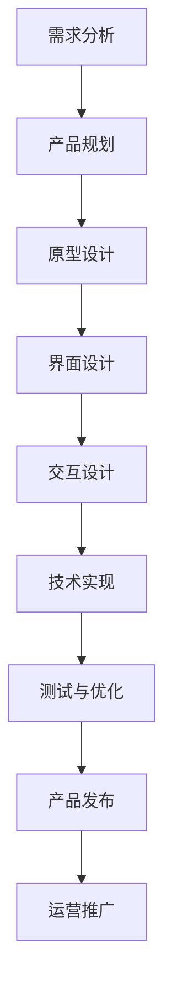
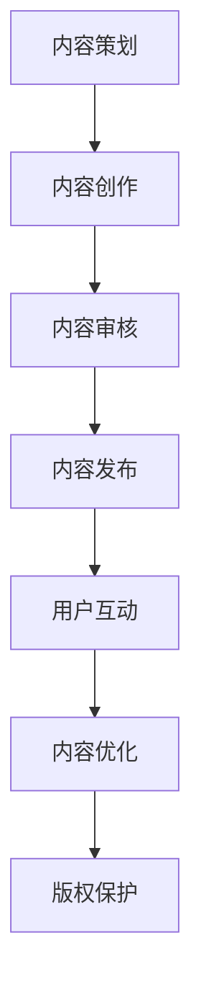
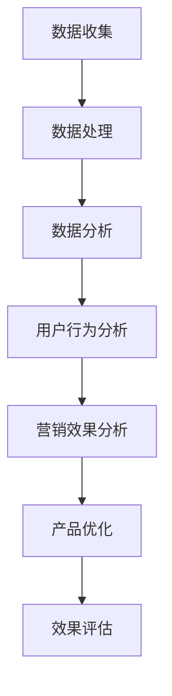

                 

# 引言

在数字化时代，知识付费产品已经成为程序员提升技能、拓展视野的重要途径。然而，如何打造高质量、受用户欢迎的程序员知识付费产品，却成为了一个复杂而富有挑战性的问题。本文旨在探讨这一话题，从多个角度提供系统性的解决方案。

## 关键词

- 程序员
- 知识付费产品
- 产品设计
- 内容制作
- 用户运营
- 数据分析

## 摘要

本文首先介绍了程序员知识付费产品的定义和特点，分析了当前市场现状与趋势。接着，本文从产品设计、内容制作、运营推广等多个方面，详细阐述了如何打造高质量的程序员知识付费产品。通过案例分析，本文提供了具体的实施方法和策略。最后，本文展望了编程知识付费产品的未来发展趋势，并提出了相应的挑战与机遇。

## 目录大纲

### 《如何打造高质量的程序员知识付费产品》目录大纲

#### 第一部分：基础知识

1. **程序员知识付费产品概述**
   - 1.1 知识付费产品的定义与特点
   - 1.2 程序员知识付费市场的现状与趋势
   - 1.3 程序员知识付费产品的类型与形式

2. **程序员知识付费产品的核心要素**
   - 2.1 选题与定位
   - 2.2 内容制作与呈现
   - 2.3 用户互动与社区管理
   - 2.4 用户体验优化

#### 第二部分：产品设计

1. **产品设计原则与流程**
   - 3.1 产品设计原则
   - 3.2 产品设计流程
   - 3.3 用户需求分析与调研

2. **产品设计策略**
   - 4.1 课程结构设计
   - 4.2 教学方法设计
   - 4.3 互动设计
   - 4.4 评价与反馈机制

3. **用户体验设计**
   - 5.1 用户体验设计原则
   - 5.2 界面设计
   - 5.3 交互设计
   - 5.4 动画与音效设计

#### 第三部分：内容制作

1. **内容制作策略**
   - 6.1 内容策划
   - 6.2 内容创作与编辑
   - 6.3 内容呈现与优化
   - 6.4 内容版权保护

2. **技术实现**
   - 7.1 技术选型与架构设计
   - 7.2 内容管理系统（CMS）搭建
   - 7.3 数据库设计与优化
   - 7.4 API设计与接口开发

#### 第四部分：运营推广

1. **市场推广策略**
   - 8.1 品牌建设与定位
   - 8.2 网络营销与广告投放
   - 8.3 社交媒体运营
   - 8.4 KOL与行业合作

2. **用户运营**
   - 9.1 用户增长策略
   - 9.2 用户活跃度提升
   - 9.3 用户留存策略
   - 9.4 用户反馈与改进

3. **数据分析与优化**
   - 10.1 数据分析工具与方法
   - 10.2 用户行为分析
   - 10.3 营销效果分析
   - 10.4 产品优化策略

#### 第五部分：案例分析

1. **优秀程序员知识付费产品的案例分析**
   - 11.1 某知名在线编程教育平台
   - 11.2 某热门编程语言教程
   - 11.3 某程序员技能提升课程

2. **编程知识付费产品的未来发展趋势**
   - 12.1 人工智能在教育领域的应用
   - 12.2 编程教育的新模式
   - 12.3 个性化学习与推荐系统
   - 12.4 编程知识付费产品的未来挑战与机遇

#### 附录

- 附录A：编程知识付费产品开发工具与资源
  - A.1 开发工具推荐
  - A.2 开源框架与库
  - A.3 行业资源与论坛
  - A.4 学术论文与研究报告
- 附录B：Mermaid 流程图示例
- 附录C：数学公式与伪代码示例
- 附录D：作者信息

## 第一部分：基础知识

### 第1章：程序员知识付费产品概述

本章将介绍程序员知识付费产品的定义、特点以及当前市场现状与趋势。

### 1.1 知识付费产品的定义与特点

**知识付费产品**，顾名思义，是指用户为获取特定领域的专业知识或技能而支付费用的一种产品形式。这类产品通常具有以下几个特点：

1. **专业性**：知识付费产品往往由行业专家或资深从业人员制作，内容具有高度的专业性和权威性。
2. **针对性**：针对不同的用户需求和技能水平，知识付费产品提供定制化的学习方案。
3. **实用性**：内容注重实践应用，帮助用户将知识转化为实际技能。
4. **互动性**：许多知识付费产品提供互动功能，如问答、讨论区等，增强用户参与感和学习效果。

### 1.2 程序员知识付费市场的现状与趋势

随着互联网技术的发展和在线教育的普及，程序员知识付费市场呈现出快速增长的趋势。以下是当前市场的一些特点：

1. **市场规模不断扩大**：据市场研究机构数据显示，全球在线教育市场规模持续增长，程序员知识付费产品占有一席之地。
2. **用户需求多样化**：程序员不仅关注技术知识的更新，还希望提升软技能，如项目管理、团队协作等。
3. **内容形式多样化**：除了传统的视频教程，编程直播、互动式编程环境、代码示例等新兴形式逐渐受到用户欢迎。
4. **个性化学习成为趋势**：通过数据分析和技术手段，知识付费产品提供个性化学习路径和推荐，满足不同用户的需求。

### 1.3 程序员知识付费产品的类型与形式

程序员知识付费产品根据内容、形式和受众的不同，可以分为多种类型：

1. **技术教程**：这是最常见的类型，包括编程语言、框架、数据库等技术的讲解。
2. **项目实战**：通过实际项目演练，帮助用户掌握技术应用。
3. **编程竞赛**：提供编程挑战和竞赛，激发用户的编程兴趣和竞赛精神。
4. **职业规划与求职辅导**：帮助程序员规划职业发展路径，提升求职竞争力。
5. **软技能培训**：包括沟通、团队合作、时间管理等方面的培训。

### 1.4 本章小结

程序员知识付费产品在数字化时代具有重要的价值。了解其定义、特点和当前市场趋势，有助于我们更好地设计和运营这类产品。下一章将深入探讨程序员知识付费产品的核心要素，包括选题与定位、内容制作与呈现、用户互动与社区管理等方面。

## 第一部分：基础知识

### 第2章：程序员知识付费产品的核心要素

在打造高质量的程序员知识付费产品时，核心要素的选择和实施至关重要。本章将详细探讨选题与定位、内容制作与呈现、用户互动与社区管理以及用户体验优化这四个关键方面。

### 2.1 选题与定位

**选题**是知识付费产品的第一步，也是决定产品成败的关键因素。以下是一些建议和策略：

1. **市场需求分析**：通过市场调研和数据分析，了解用户需求，选择热门且具有长期需求的技术方向。
2. **差异化定位**：在众多竞争者中脱颖而出，需要找到独特的产品特色，如独特的教学方法、深入的技术讲解或特定的受众群体。
3. **课程体系化**：构建完整的课程体系，确保内容连贯、系统，有助于用户全面掌握知识。

**案例**：某知名在线编程教育平台在选题时，结合大数据分析用户需求，重点推出Python、JavaScript等热门编程语言的教程，同时开设了数据科学、人工智能等前沿技术课程，满足了不同层次用户的需求。

### 2.2 内容制作与呈现

**内容制作**是知识付费产品的核心，以下是一些建议：

1. **专业内容**：邀请行业专家或资深从业人员进行内容制作，确保内容的权威性和专业性。
2. **多样化呈现**：结合文字、图片、视频、互动式编程环境等多种形式，提升内容的趣味性和实用性。
3. **实时更新**：技术知识更新迅速，定期更新内容，保持与最新技术趋势同步。

**案例**：某热门编程语言教程采用视频和代码示例相结合的形式，通过详细讲解和实战项目，帮助用户快速掌握技术。此外，教程还提供在线编程环境，用户可以直接在教程中编写和运行代码。

### 2.3 用户互动与社区管理

**用户互动**是提高用户满意度和产品口碑的重要手段。以下是一些建议：

1. **问答功能**：提供问答社区，用户可以提问，专家或同行可以回答，促进知识共享。
2. **讨论区**：建立讨论区，鼓励用户分享学习经验、讨论技术问题。
3. **社交功能**：整合社交媒体，如微信、QQ等，方便用户互动和传播。

**案例**：某程序员技能提升课程通过建立问答社区和讨论区，用户可以在社区中提问、讨论，专家实时解答问题。此外，课程还提供了微信群和QQ群，用户可以在群内交流学习心得。

### 2.4 用户体验优化

**用户体验**是知识付费产品成功的关键，以下是一些建议：

1. **界面设计**：简洁、直观、美观的界面设计，提升用户的使用体验。
2. **交互设计**：优化用户交互流程，确保用户能够轻松上手。
3. **性能优化**：确保产品加载速度快，运行稳定，减少用户等待时间。

**案例**：某在线编程教育平台采用了扁平化设计风格，界面简洁清晰，用户操作方便。同时，平台优化了视频加载速度，确保用户在观看视频时能够流畅无卡顿。

### 2.5 本章小结

选题与定位、内容制作与呈现、用户互动与社区管理以及用户体验优化是打造高质量程序员知识付费产品的核心要素。下一章将深入探讨产品设计策略，包括产品设计原则与流程、用户需求分析与调研等方面。

### 第3章：产品设计策略

在打造高质量的程序员知识付费产品时，产品的设计策略至关重要。本章将详细探讨产品设计原则与流程、用户需求分析与调研，以及课程结构设计、教学方法设计、互动设计、评价与反馈机制等方面。

#### 3.1 产品设计原则

在产品设计中，以下原则至关重要：

1. **以用户为中心**：始终关注用户的需求和体验，确保产品设计符合用户期望。
2. **简单易用**：设计简洁、直观的用户界面，减少用户的学习成本，提高使用效率。
3. **功能完善**：提供全面的功能，满足用户的多样化需求，确保用户能够获得所需的知识和技能。
4. **设计美观**：注重界面设计和用户体验，提升产品的美观度，增强用户的使用愉悦感。

**案例**：某知名在线编程教育平台遵循以用户为中心的设计原则，界面设计简洁清晰，用户操作方便，同时提供丰富的功能，包括视频教程、互动编程环境、问答社区等，满足了不同层次用户的需求。

#### 3.2 产品设计流程

产品设计的流程通常包括以下步骤：

1. **需求分析**：通过市场调研、用户访谈等方式，收集和分析用户需求。
2. **产品规划**：根据需求分析结果，制定产品规划，包括产品功能、界面设计、用户体验等。
3. **原型设计**：制作产品原型，通过用户反馈进一步优化设计。
4. **界面设计**：设计产品界面，确保美观和易用性。
5. **交互设计**：优化用户交互流程，提升用户体验。
6. **技术实现**：根据设计文档，进行产品开发。
7. **测试与优化**：进行产品测试，收集用户反馈，不断优化产品。

**案例**：某编程语言教程产品在设计流程中，首先进行了市场需求分析，了解用户对编程学习的需求。接着，制定产品规划，包括课程内容、界面设计、用户体验等。通过原型设计和用户反馈，不断优化产品设计，最终推出了一款用户满意的产品。

#### 3.3 用户需求分析与调研

**用户需求分析**和**调研**是产品设计的重要基础。以下是一些建议和方法：

1. **用户访谈**：与潜在用户进行面对面访谈，了解他们的需求和期望。
2. **问卷调查**：通过在线问卷收集用户反馈，了解用户对现有产品的评价和改进建议。
3. **竞品分析**：分析竞争对手的产品，了解其优点和不足，为自身产品提供借鉴。
4. **用户行为数据**：收集和分析用户行为数据，如页面浏览量、点击率、用户停留时间等，了解用户的使用习惯和偏好。

**案例**：某编程教育平台通过用户访谈和问卷调查，了解到用户对实时互动和代码调试功能的需求较高。在产品设计中，加入了实时问答和在线编程环境，满足了用户的需求，提升了用户体验。

#### 3.4 课程结构设计

**课程结构设计**是确保知识付费产品系统性和连贯性的关键。以下是一些建议：

1. **明确课程目标**：确定每门课程的学习目标，确保课程内容与目标一致。
2. **内容模块化**：将课程内容拆分为多个模块，每个模块包含一个核心知识点或技能。
3. **循序渐进**：课程设计应遵循循序渐进的原则，由浅入深，帮助用户逐步掌握知识。
4. **实战项目**：在每个模块后，加入实战项目，让用户在实际操作中巩固所学知识。

**案例**：某Python编程教程将课程内容分为基础知识、中级应用和高级实战三个模块。基础知识模块包括Python基础语法、数据类型等，中级应用模块包括函数、文件操作等，高级实战模块包括Web开发、数据分析等。每个模块后都有相应的实战项目，帮助用户实践和巩固所学知识。

#### 3.5 教学方法设计

**教学方法设计**是确保知识付费产品教学效果的关键。以下是一些建议：

1. **互动式教学**：通过提问、讨论、练习等方式，激发用户的学习兴趣和参与度。
2. **案例教学**：通过实际案例，讲解理论知识，让用户更好地理解应用。
3. **项目驱动**：以项目为导向，让用户在解决实际问题的过程中，掌握相关知识和技能。
4. **个性化学习**：根据用户的学习进度和需求，提供个性化学习建议和课程推荐。

**案例**：某数据科学教程采用项目驱动的教学方法，通过数据分析实战项目，让用户在解决实际问题的过程中，掌握数据清洗、数据分析和数据可视化等技术。同时，教程提供个性化学习建议，根据用户的学习进度和需求，推荐相应的学习内容和项目。

#### 3.6 互动设计

**互动设计**是提升用户满意度和产品口碑的重要手段。以下是一些建议：

1. **问答社区**：建立问答社区，用户可以在社区中提问和解答问题，促进知识共享。
2. **讨论区**：设置讨论区，用户可以分享学习经验和讨论技术问题，增强社区氛围。
3. **在线编程环境**：提供在线编程环境，用户可以直接在教程中编写和运行代码，提高学习效果。
4. **社群运营**：通过微信群、QQ群等社交平台，进行社群运营，增强用户粘性。

**案例**：某编程教育平台通过建立问答社区和在线编程环境，用户可以在社区中提问和解答问题，直接在教程中编写和运行代码。同时，平台通过微信群和QQ群进行社群运营，定期举办技术分享活动和问答沙龙，增强了用户互动和社区氛围。

#### 3.7 评价与反馈机制

**评价与反馈机制**是优化产品设计和提升教学质量的重要手段。以下是一些建议：

1. **用户评价**：允许用户对课程进行评价，根据用户反馈改进课程内容。
2. **讲师评价**：对讲师的教学效果进行评价，激励讲师不断提升教学质量。
3. **学习报告**：提供学习报告，让用户了解自己的学习进度和成果。
4. **反馈渠道**：设立反馈渠道，用户可以随时提出意见和建议，平台及时响应和改进。

**案例**：某编程教育平台通过用户评价和学习报告，了解用户的学习进度和满意度。同时，平台设立反馈渠道，用户可以在平台上提出意见和建议，平台及时响应和改进产品，提升了用户满意度。

### 3.8 本章小结

产品设计策略是打造高质量程序员知识付费产品的关键。通过遵循产品设计原则、遵循设计流程、进行用户需求分析与调研、设计课程结构、选择合适的教学方法、设计互动机制以及建立评价与反馈机制，可以提升知识付费产品的质量和用户满意度。下一章将深入探讨用户体验设计，包括用户体验设计原则、界面设计、交互设计和动画与音效设计等方面。

## 第三部分：用户体验设计

### 第4章：用户体验设计

在打造高质量的程序员知识付费产品过程中，用户体验设计（UX Design）是至关重要的环节。用户体验设计旨在优化产品的易用性、可用性和用户满意度，从而提升用户参与度和产品口碑。本章将探讨用户体验设计的原则、界面设计、交互设计和动画与音效设计等方面。

### 4.1 用户体验设计原则

用户体验设计原则是确保产品易用、高效和愉悦的核心指导方针。以下是几个关键原则：

1. **以用户为中心**：在设计和开发过程中，始终将用户的需求和体验放在首位。
2. **简洁性**：保持界面简洁明了，避免冗余和复杂的功能，降低用户的学习成本。
3. **一致性**：保持界面元素和交互行为的一致性，确保用户在不同情境下能够快速适应。
4. **反馈**：及时给予用户操作反馈，让用户了解系统的响应情况。
5. **可访问性**：确保产品对各种用户（包括残障用户）的可访问性。

**案例**：某知名在线编程教育平台在用户体验设计中遵循“以用户为中心”的原则，通过用户访谈和问卷调查收集用户需求，然后根据这些需求设计界面和交互流程，确保产品符合用户期望。

### 4.2 界面设计

界面设计（UI Design）是用户体验设计的重要组成部分。以下是界面设计的几个关键要点：

1. **布局**：合理布局界面元素，确保信息层级清晰，便于用户浏览和理解。
2. **颜色和字体**：选择合适的颜色和字体，确保界面美观且易于阅读。
3. **图标和图形**：使用简洁明了的图标和图形，增强界面的视觉吸引力。
4. **响应式设计**：确保界面在不同设备（如手机、平板、电脑）上都能良好显示。

**案例**：某编程教程平台采用了扁平化设计风格，界面布局清晰，颜色搭配舒适，字体大小适中，图标简洁易懂。此外，平台采用了响应式设计，确保用户在任何设备上都能获得良好的使用体验。

### 4.3 交互设计

交互设计（Interaction Design）关注用户与产品之间的互动方式。以下是交互设计的几个关键要点：

1. **直观性**：确保交互过程直观易懂，用户能够快速掌握操作方法。
2. **反馈**：及时给予用户操作反馈，如按钮点击效果、加载动画等。
3. **可预测性**：设计可预测的交互行为，避免用户产生困惑或错误。
4. **易用性**：优化交互流程，减少用户操作的步骤和时间。

**案例**：某编程教育平台采用了简洁直观的交互设计，如点击按钮即可开始学习、滑动屏幕切换章节等。同时，平台在用户操作时提供了明显的视觉反馈，如按钮点击变色、加载进度条等，提高了用户的操作体验。

### 4.4 动画与音效设计

动画和音效设计在用户体验中起到了提升愉悦感和增加互动性的作用。以下是动画与音效设计的几个关键要点：

1. **简洁性**：动画和音效应简洁明了，避免过度设计和冗余。
2. **节奏感**：合理控制动画和音效的节奏，使其与用户的操作行为相匹配。
3. **情感传达**：通过动画和音效传达情感，增强用户的参与感。
4. **一致性**：确保动画和音效在整体设计中保持一致性。

**案例**：某编程教程平台在动画与音效设计上注重简洁性和一致性，如在用户成功完成一个编程练习后，会有简单的动画效果和鼓励性的音效，增强了用户的成就感和学习动力。

### 4.5 本章小结

用户体验设计是确保程序员知识付费产品高质量和用户满意度的关键环节。通过遵循用户体验设计原则、进行界面设计、交互设计以及动画与音效设计，可以提升产品的易用性、可用性和用户满意度。下一章将深入探讨内容制作策略，包括内容策划、内容创作与编辑、内容呈现与优化以及内容版权保护等方面。

## 第三部分：内容制作

### 第5章：内容制作策略

在打造高质量的程序员知识付费产品过程中，内容制作是关键环节。本章将详细探讨内容制作策略，包括内容策划、内容创作与编辑、内容呈现与优化以及内容版权保护等方面。

### 5.1 内容策划

**内容策划**是确保知识付费产品内容高质量和实用性的第一步。以下是内容策划的几个关键要点：

1. **明确目标受众**：确定产品的目标受众，了解他们的需求、兴趣和技能水平。
2. **市场调研**：通过市场调研，了解当前市场趋势和用户需求，确定热门的技术领域和课程内容。
3. **课程结构**：根据目标受众和市场调研结果，设计课程结构，确保课程内容系统、连贯、具有深度。
4. **内容定位**：明确课程内容的定位，如基础知识、中级应用或高级实战等，确保内容与受众需求相匹配。

**案例**：某编程教育平台在内容策划阶段，首先明确了目标受众为有一定编程基础的程序员，然后通过市场调研了解到用户对Python和JavaScript有较高需求。平台据此设计了Python和JavaScript两个课程系列，每个系列包括基础知识、中级应用和高级实战三个模块，确保课程内容丰富且实用。

### 5.2 内容创作与编辑

**内容创作与编辑**是确保知识付费产品内容专业性和可读性的关键。以下是内容创作与编辑的几个关键要点：

1. **专业团队**：组建专业的课程创作团队，包括行业专家、资深讲师和编辑人员，确保内容的专业性和权威性。
2. **撰写指南**：制定内容撰写指南，确保内容格式、风格和结构一致。
3. **内容审核**：建立内容审核机制，确保内容的准确性、完整性和实用性。
4. **内容更新**：定期更新内容，保持与最新技术趋势和用户需求同步。

**案例**：某编程教程平台在内容创作与编辑阶段，组建了一支由行业专家和资深讲师组成的团队。团队根据编写指南，采用统一的格式和风格，确保内容的专业性和可读性。同时，平台设立了内容审核委员会，对每一章节的内容进行严格审核，确保内容的准确性和实用性。

### 5.3 内容呈现与优化

**内容呈现与优化**是提升用户学习体验的重要环节。以下是内容呈现与优化的几个关键要点：

1. **多样化呈现形式**：结合文字、图片、视频、动画等多种形式，提高内容的趣味性和可读性。
2. **交互式内容**：设计交互式内容，如编程练习、代码示例、在线编程环境等，增强用户参与感。
3. **加载速度**：优化内容加载速度，确保用户在访问内容时能够快速获取所需信息。
4. **用户体验**：根据用户反馈，不断优化内容呈现方式和交互设计，提升用户体验。

**案例**：某编程教程平台采用了多种内容呈现形式，如文字、图片、视频和在线编程环境。平台还设计了丰富的编程练习和互动式内容，让用户在实践操作中掌握知识。同时，平台不断优化加载速度和用户体验，确保用户能够流畅地学习和使用产品。

### 5.4 内容版权保护

**内容版权保护**是确保知识付费产品合法性和权益的重要措施。以下是内容版权保护的几个关键要点：

1. **版权声明**：在产品中明确声明内容的版权归属，防止未经授权的使用和传播。
2. **加密技术**：使用加密技术保护内容不被非法复制和篡改。
3. **监控与举报**：建立内容监控机制，及时发现和举报侵权行为。
4. **法律法规**：了解相关法律法规，确保产品的合法性和合规性。

**案例**：某编程教程平台在内容版权保护方面采取了多种措施。平台在产品中明确声明了内容的版权归属，并使用了加密技术保护内容。同时，平台设立了内容监控机制，定期检查侵权行为，并依法处理侵权案件，确保了平台的合法权益。

### 5.5 本章小结

内容制作策略是打造高质量程序员知识付费产品的重要组成部分。通过明确内容策划、确保内容创作与编辑的专业性和准确性、优化内容呈现与交互设计以及加强内容版权保护，可以提升产品的质量和用户体验。下一章将探讨技术实现方面，包括技术选型与架构设计、内容管理系统（CMS）搭建、数据库设计与优化以及API设计与接口开发等方面。

## 第三部分：技术实现

### 第6章：技术实现

在打造高质量的程序员知识付费产品过程中，技术实现是确保产品稳定运行、功能完善的关键环节。本章将详细探讨技术选型与架构设计、内容管理系统（CMS）搭建、数据库设计与优化以及API设计与接口开发等方面。

### 6.1 技术选型与架构设计

**技术选型**是技术实现的第一步，决定了产品的性能、可扩展性和维护性。以下是技术选型的几个关键要点：

1. **前端技术选型**：前端技术选型包括HTML、CSS、JavaScript以及前端框架（如React、Vue.js、Angular）。根据产品需求和团队熟悉度，选择合适的前端技术。
2. **后端技术选型**：后端技术选型包括编程语言（如Python、Java、Node.js）和框架（如Django、Spring、Express）。根据产品需求和团队熟悉度，选择合适的后端技术。
3. **数据库选型**：数据库选型包括关系型数据库（如MySQL、PostgreSQL）和非关系型数据库（如MongoDB、Redis）。根据数据存储需求、性能要求和扩展性要求，选择合适的数据库。
4. **架构设计**：架构设计包括分层架构、微服务架构等。根据产品规模和需求，选择合适的架构设计。

**案例**：某编程教程平台在技术选型中选择了前端框架React，后端框架Django，数据库MySQL，并采用微服务架构。前端使用React实现响应式界面，后端使用Django实现业务逻辑，MySQL用于存储用户数据和课程内容。通过微服务架构，平台实现了高可用性和可扩展性。

### 6.2 内容管理系统（CMS）搭建

**内容管理系统（CMS）**是管理课程内容、用户数据和管理后台的核心组件。以下是CMS搭建的几个关键要点：

1. **功能设计**：根据产品需求，设计CMS的功能，包括内容创建、编辑、发布、审核、分类、搜索等。
2. **权限管理**：设计权限管理机制，确保不同角色的用户（如管理员、讲师、编辑员）具备相应的操作权限。
3. **用户界面**：设计简洁直观的用户界面，确保CMS易于操作和维护。
4. **集成与扩展**：确保CMS与前端和后端系统无缝集成，并具备扩展性，方便后续功能升级和扩展。

**案例**：某编程教程平台采用了开源CMS系统如WordPress或Drupal。平台通过自定义插件和模块，实现了课程内容管理、用户管理和后台管理的功能。同时，平台与前端和后端系统通过API进行数据交互，确保系统的整体性和一致性。

### 6.3 数据库设计与优化

**数据库设计与优化**是确保数据存储高效、查询快速和安全的关键。以下是数据库设计与优化的几个关键要点：

1. **数据模型设计**：根据业务需求，设计合理的数据库模型，包括实体关系、属性定义和数据完整性约束。
2. **索引设计**：合理设计索引，提高数据查询性能。
3. **数据备份与恢复**：设计数据备份和恢复策略，确保数据的安全性和可靠性。
4. **性能优化**：通过优化查询语句、存储过程和缓存机制，提高数据库性能。

**案例**：某编程教程平台在设计数据库时，采用了关系型数据库MySQL。平台根据业务需求设计了用户表、课程表、订单表等多个数据表，并通过外键约束保证了数据的一致性。同时，平台通过索引优化和缓存策略，提高了数据查询和写入性能。

### 6.4 API设计与接口开发

**API设计与接口开发**是确保前后端系统无缝交互的关键。以下是API设计与接口开发的几个关键要点：

1. **接口设计**：设计RESTful风格的API接口，包括URL、请求参数、响应格式等。
2. **安全性**：确保API接口的安全性，采用加密、认证和授权等机制，防止非法访问和攻击。
3. **性能优化**：优化API接口的性能，减少请求响应时间。
4. **文档与工具**：提供详细的API文档和使用工具，方便开发者使用和调试API接口。

**案例**：某编程教程平台在设计API接口时，采用了RESTful风格。平台提供了详细的API文档，包括接口定义、请求示例和响应示例。同时，平台提供了API测试工具，方便开发者进行接口测试和调试。

### 6.5 本章小结

技术实现是打造高质量程序员知识付费产品的关键环节。通过合理的技术选型与架构设计、搭建高效的内容管理系统、优化数据库设计和开发安全的API接口，可以确保产品的稳定性、性能和安全性。下一章将探讨运营推广策略，包括品牌建设与定位、网络营销与广告投放、社交媒体运营以及KOL与行业合作等方面。

## 第四部分：运营推广

### 第7章：市场推广策略

在打造高质量的程序员知识付费产品后，市场推广策略是确保产品能够成功进入市场、获得用户认可和持续增长的关键。本章将详细探讨市场推广策略，包括品牌建设与定位、网络营销与广告投放、社交媒体运营以及KOL与行业合作等方面。

### 7.1 品牌建设与定位

**品牌建设与定位**是市场推广的基础，决定了产品在市场上的竞争力和用户认知。以下是品牌建设与定位的几个关键要点：

1. **品牌理念**：确立产品的品牌理念，如专业性、权威性、创新性等，通过品牌理念传递产品价值。
2. **品牌形象**：设计独特、有辨识度的品牌形象，包括Logo、色彩、字体等，提升品牌视觉识别度。
3. **定位明确**：明确产品的目标市场和目标用户，确保品牌形象与目标用户的需求和期望相匹配。
4. **口碑建设**：通过优质的产品和服务，树立良好的品牌口碑，提升用户信任度和忠诚度。

**案例**：某编程教程平台在品牌建设与定位中，确立了“专业编程学习平台”的品牌理念，并通过简洁明了的Logo和色彩搭配，传递出专业、权威和创新的品牌形象。平台的目标市场是程序员和学习编程的人群，通过提供高质量的课程内容和优秀的用户体验，赢得了用户的信任和好评。

### 7.2 网络营销与广告投放

**网络营销与广告投放**是推广产品的重要手段，可以迅速提高产品的知名度和用户访问量。以下是网络营销与广告投放的几个关键要点：

1. **SEO优化**：通过搜索引擎优化（SEO），提高产品在搜索引擎中的排名，吸引更多目标用户访问。
2. **SEM广告**：利用搜索引擎营销（SEM），投放付费广告，提高产品的曝光率和访问量。
3. **内容营销**：通过撰写高质量的内容，如博客文章、技术教程、案例分析等，提升品牌知名度和用户参与度。
4. **广告投放**：选择合适的广告渠道，如Google Ads、Facebook Ads等，进行精准的广告投放，提高广告效果。

**案例**：某编程教程平台在广告投放方面，采用了SEO优化和SEM广告相结合的策略。通过优化网站内容和关键词，提高产品在搜索引擎中的排名，吸引自然流量。同时，通过投放Google Ads和Facebook Ads，针对特定用户群体进行精准广告投放，提高了产品的访问量和注册率。

### 7.3 社交媒体运营

**社交媒体运营**是提高产品知名度、吸引潜在用户和建立社区的重要手段。以下是社交媒体运营的几个关键要点：

1. **内容策略**：制定社交媒体内容策略，发布有价值、有趣的内容，吸引用户关注和互动。
2. **互动营销**：积极与用户互动，回复用户评论和私信，建立良好的用户关系。
3. **社交媒体广告**：利用社交媒体平台进行广告投放，提高产品的曝光率和用户参与度。
4. **跨平台运营**：在多个社交媒体平台运营，如微博、微信公众号、LinkedIn等，扩大品牌影响力。

**案例**：某编程教程平台在社交媒体运营中，通过发布技术教程、学习技巧和行业动态等内容，吸引了大量编程爱好者的关注。平台在发布内容时，注重互动性和用户体验，通过回复用户评论和私信，建立了良好的用户关系。同时，通过在LinkedIn等职业社交平台投放广告，吸引了更多有志于提升编程技能的职业人士。

### 7.4 KOL与行业合作

**KOL与行业合作**是借助外部力量提升产品知名度、扩大市场影响力的重要手段。以下是KOL与行业合作的几个关键要点：

1. **KOL选择**：选择具有影响力和目标用户匹配的KOL进行合作，确保合作的针对性和效果。
2. **合作形式**：根据产品特点和目标，选择合适的合作形式，如内容合作、共同推广等。
3. **内容合作**：与KOL共同制作优质内容，如教程、案例等，提升内容的权威性和吸引力。
4. **行业合作**：与行业内的企业、机构、媒体等合作，共同举办活动、发布报告等，提升品牌形象和市场影响力。

**案例**：某编程教程平台与知名技术博主和行业专家合作，共同发布技术教程和案例分析，提升平台的权威性和专业性。平台还与多家知名科技企业和教育机构合作，共同举办编程比赛和研讨会，扩大品牌知名度和市场影响力。

### 7.5 本章小结

市场推广策略是确保程序员知识付费产品成功进入市场、获得用户认可和持续增长的关键。通过品牌建设与定位、网络营销与广告投放、社交媒体运营以及KOL与行业合作等多方面的策略，可以提升产品的知名度、用户参与度和市场竞争力。下一章将探讨用户运营策略，包括用户增长策略、用户活跃度提升、用户留存策略以及用户反馈与改进等方面。

### 第8章：用户运营

在打造高质量的程序员知识付费产品后，用户运营是确保产品能够持续获得用户关注和活跃度的重要环节。本章将详细探讨用户运营策略，包括用户增长策略、用户活跃度提升、用户留存策略以及用户反馈与改进等方面。

### 8.1 用户增长策略

**用户增长策略**是扩大用户基础、提高市场占有率的关键。以下是用户增长策略的几个关键要点：

1. **精准定位**：明确目标用户群体，通过市场调研和数据分析，确定潜在用户的需求和痛点。
2. **渠道拓展**：选择合适的用户获取渠道，如搜索引擎优化（SEO）、社交媒体营销、内容营销、广告投放等。
3. **活动推广**：举办线上或线下活动，如编程竞赛、技术沙龙、学习讲座等，吸引潜在用户参与。
4. **合作共赢**：与行业内的合作伙伴、KOL、教育机构等建立合作关系，共同推广产品，实现用户增长。

**案例**：某编程教程平台通过在社交媒体上发布技术教程和编程挑战，吸引了一批编程爱好者的关注。同时，平台与知名技术博主和行业专家合作，共同发布高质量的内容，提高了平台的知名度和用户参与度。此外，平台还与教育机构合作，举办编程比赛和研讨会，进一步扩大了用户基础。

### 8.2 用户活跃度提升

**用户活跃度提升**是确保用户持续使用产品、保持活跃状态的关键。以下是用户活跃度提升的几个关键要点：

1. **内容更新**：定期更新优质的内容，如课程、教程、案例分析等，保持用户的兴趣和参与度。
2. **互动机制**：建立互动机制，如问答社区、讨论区、在线编程环境等，鼓励用户参与和互动。
3. **活动激励**：举办各类活动，如编程比赛、学习打卡、积分奖励等，激励用户积极参与。
4. **个性化推荐**：利用数据分析技术，为用户推荐感兴趣的内容和学习路径，提升用户的学习体验。

**案例**：某编程教程平台定期发布新的课程和教程，确保内容的新鲜度和实用性。平台还建立了问答社区和讨论区，用户可以在社区中提问、讨论和分享学习经验。此外，平台通过个性化推荐，为用户推荐感兴趣的课程和学习路径，提高了用户的活跃度和满意度。

### 8.3 用户留存策略

**用户留存策略**是确保用户长期使用产品、保持忠诚度的关键。以下是用户留存策略的几个关键要点：

1. **用户体验优化**：不断优化产品的用户体验，包括界面设计、交互设计、性能优化等，提升用户满意度。
2. **用户反馈机制**：建立用户反馈机制，收集用户的意见和建议，及时改进产品，满足用户需求。
3. **会员制度**：推出会员制度，为用户提供更多优惠和特权，增加用户粘性。
4. **社区建设**：建立用户社区，鼓励用户分享经验和心得，形成良好的用户氛围。

**案例**：某编程教程平台通过不断优化用户体验，如改进界面设计、增加互动功能、优化课程内容等，提高了用户的满意度。平台建立了用户反馈机制，定期收集用户的意见和建议，并根据反馈进行产品改进。此外，平台推出了会员制度，为会员提供更多优惠和特权，如免费课程、优先答疑等，增加了用户的粘性和忠诚度。

### 8.4 用户反馈与改进

**用户反馈与改进**是确保产品不断迭代和优化的重要环节。以下是用户反馈与改进的几个关键要点：

1. **反馈渠道**：建立多种反馈渠道，如在线客服、用户论坛、问卷调查等，方便用户提出意见和建议。
2. **数据收集**：收集和分析用户反馈数据，识别用户需求和使用痛点。
3. **问题定位**：根据用户反馈，定位问题并制定解决方案，确保问题得到有效解决。
4. **持续改进**：持续关注用户反馈，不断优化产品，提升用户体验。

**案例**：某编程教程平台建立了多渠道的反馈机制，如在线客服、用户论坛和问卷调查等，方便用户提出意见和建议。平台对用户反馈进行收集和分析，识别出用户最关心的问题，如课程内容更新速度、用户体验优化等，并制定相应的解决方案。通过持续改进，平台不断提升用户体验，赢得了用户的认可和好评。

### 8.5 本章小结

用户运营是确保程序员知识付费产品成功的重要因素。通过制定用户增长策略、提升用户活跃度、优化用户体验、建立用户反馈机制，可以确保产品能够持续获得用户关注和活跃度，提升用户满意度和忠诚度。下一章将探讨数据分析与优化策略，包括数据分析工具与方法、用户行为分析、营销效果分析和产品优化策略等方面。

### 第9章：数据分析与优化

在打造高质量的程序员知识付费产品过程中，数据分析与优化是确保产品持续改进和提升用户体验的关键。本章将详细探讨数据分析工具与方法、用户行为分析、营销效果分析和产品优化策略等方面。

### 9.1 数据分析工具与方法

**数据分析工具与方法**是进行有效数据分析的基础。以下是数据分析工具与方法的几个关键要点：

1. **数据分析工具**：选择合适的数据分析工具，如Google Analytics、Tableau、Power BI等，用于收集、处理和分析数据。
2. **数据收集**：通过网站日志、用户行为数据、社交媒体数据等渠道收集数据，确保数据的全面性和准确性。
3. **数据分析方法**：采用统计分析和数据挖掘方法，如描述性分析、回归分析、聚类分析等，对数据进行分析和解读。
4. **数据可视化**：利用图表、仪表盘等可视化工具，将分析结果直观地展示出来，便于理解和决策。

**案例**：某编程教程平台选择了Google Analytics作为数据分析工具，通过收集网站日志和用户行为数据，对用户访问行为、课程访问量、用户转化率等进行详细分析。平台采用数据可视化工具，将分析结果以图表形式展示在仪表盘上，方便团队成员了解用户行为和产品性能。

### 9.2 用户行为分析

**用户行为分析**是了解用户需求、优化产品设计和提升用户体验的重要手段。以下是用户行为分析的几个关键要点：

1. **用户访问行为**：分析用户的访问来源、访问路径、页面停留时间等指标，了解用户如何与产品互动。
2. **用户互动行为**：分析用户在产品中的互动行为，如问答社区的发帖量、评论量、点赞量等，了解用户的参与度和活跃度。
3. **用户转化行为**：分析用户的转化行为，如课程购买率、注册转化率等，了解用户的购买决策和留存情况。
4. **用户反馈**：收集用户在产品使用过程中的反馈，如问卷调查、用户访谈等，了解用户的真实体验和需求。

**案例**：某编程教程平台通过分析用户访问行为，发现大部分用户通过搜索引擎访问产品，其中搜索关键词集中在“编程教程”和“在线学习”。平台据此优化了搜索引擎优化（SEO）策略，提高了在搜索引擎中的排名。同时，平台通过分析用户互动行为，发现用户对问答社区的参与度较高，平台增加了问答社区的功能，提升了用户的参与感和满意度。

### 9.3 营销效果分析

**营销效果分析**是评估市场推广策略有效性的关键。以下是营销效果分析的几个关键要点：

1. **广告投放效果**：分析广告投放的效果，如点击率、转化率、投入产出比（ROI）等，评估广告的吸引力和效果。
2. **社交媒体营销效果**：分析社交媒体营销的效果，如粉丝增长、互动率、点击率等，了解社交媒体营销的吸引力和效果。
3. **内容营销效果**：分析内容营销的效果，如博客文章的阅读量、分享量、评论量等，了解内容营销的吸引力和效果。
4. **渠道分析**：分析不同渠道的用户来源和转化情况，评估不同渠道的效果和潜力。

**案例**：某编程教程平台通过分析广告投放效果，发现通过Google Ads的广告投放效果最佳，点击率和转化率较高。平台据此增加了Google Ads的预算，并优化了广告内容和投放策略，提高了广告效果。同时，平台通过分析社交媒体营销效果，发现用户在LinkedIn上的参与度较高，平台加大了在LinkedIn上的推广力度，提高了社交媒体营销效果。

### 9.4 产品优化策略

**产品优化策略**是根据数据分析结果，对产品进行持续改进和优化的关键。以下是产品优化策略的几个关键要点：

1. **用户体验优化**：根据用户反馈和数据分析结果，优化产品的用户体验，如界面设计、交互设计、性能优化等。
2. **课程内容优化**：根据用户需求和数据分析结果，优化课程内容，如更新课程资料、调整课程结构、增加互动环节等。
3. **功能优化**：根据用户反馈和数据分析结果，优化产品的功能，如增加新功能、优化现有功能、解决用户痛点等。
4. **技术优化**：根据性能测试和用户反馈，优化产品的技术架构和性能，如优化数据库查询、缓存机制、负载均衡等。

**案例**：某编程教程平台根据用户反馈和数据分析结果，发现用户在使用在线编程环境时经常遇到加载缓慢的问题。平台对技术架构进行了优化，改进了数据库查询性能，增加了缓存机制，提高了加载速度。同时，平台增加了在线编程环境的互动功能，如实时代码调试和错误提示，提升了用户的编程体验。

### 9.5 本章小结

数据分析与优化是确保程序员知识付费产品持续改进和提升用户体验的关键。通过选择合适的数据分析工具与方法、进行用户行为分析、营销效果分析和产品优化策略，可以不断提升产品的质量和用户满意度。下一章将探讨优秀程序员知识付费产品的案例分析，包括知名在线编程教育平台、热门编程语言教程和程序员技能提升课程等方面。

### 第五部分：案例分析

在了解了如何打造高质量的程序员知识付费产品后，通过分析优秀的产品案例，我们可以更好地理解成功的关键因素和实际操作方法。本部分将深入探讨几个优秀的程序员知识付费产品案例，包括知名在线编程教育平台、热门编程语言教程和程序员技能提升课程，以便为我们提供借鉴和启示。

#### 第11章：优秀程序员知识付费产品的案例分析

#### 11.1 某知名在线编程教育平台

**产品概述**：某知名在线编程教育平台是全球领先的编程学习社区，提供从入门到高级的编程课程。该平台的特点是丰富的课程资源、互动性强和用户体验优秀。

**成功因素**：

1. **课程内容**：平台提供了涵盖多种编程语言和技术的课程，内容深入浅出，既有基础知识，也有高级应用和实战项目。
2. **用户体验**：平台界面简洁，易于导航，互动性强，提供在线编程环境、问答社区和讨论区，用户可以随时提问和交流。
3. **个性化学习**：平台通过数据分析，为用户推荐适合的课程和学习路径，提升学习效果。
4. **社区运营**：平台建立了活跃的社区，用户可以分享经验、交流技术，形成了良好的学习氛围。

**实际操作方法**：

- **课程内容制作**：平台与知名讲师和行业专家合作，确保课程内容的专业性和权威性。
- **互动设计**：通过实时问答和在线编程环境，提高用户的参与感和学习效果。
- **用户体验优化**：定期进行用户调研和反馈，不断优化界面设计和交互流程。

#### 11.2 某热门编程语言教程

**产品概述**：某热门编程语言教程专注于Python编程，提供系统的教程和丰富的实战项目，适合不同层次的编程学习者。

**成功因素**：

1. **内容结构**：教程内容系统化，从基础知识到高级应用，循序渐进，帮助用户全面掌握Python。
2. **实战项目**：教程包含大量的实战项目，用户可以通过实际操作巩固所学知识。
3. **互动性**：提供在线编程环境，用户可以直接在教程中编写和测试代码。
4. **社区支持**：教程有活跃的社区，用户可以提问和交流，获得帮助。

**实际操作方法**：

- **内容结构设计**：确保教程内容连贯、系统，每个模块都有明确的学习目标和实战项目。
- **互动设计**：提供在线编程环境，增加用户的动手操作机会。
- **社区管理**：建立活跃的社区，鼓励用户参与和互动。

#### 11.3 某程序员技能提升课程

**产品概述**：某程序员技能提升课程专注于提升程序员的软技能，如沟通、团队合作、项目管理等，旨在帮助程序员在职业生涯中取得更好的发展。

**成功因素**：

1. **定制化学习**：课程根据不同职业阶段和技能需求设置不同的模块，提供定制化学习路径。
2. **教学方法**：采用案例分析、实战演练等方式，提高学员的实际操作能力和解决问题的能力。
3. **职业规划指导**：课程提供职业规划指导，帮助学员明确职业发展方向，提升求职竞争力。
4. **用户体验**：课程界面友好，学习进度跟踪和成绩记录功能完善，用户可以清晰了解自己的学习情况。

**实际操作方法**：

- **定制化学习路径**：根据不同用户的需求和职业阶段，设计不同的课程模块和教学策略。
- **教学方法**：注重实战操作，通过案例分析、角色扮演等方式，提高学员的实际应用能力。
- **用户体验优化**：通过学习进度跟踪和成绩记录功能，提高用户的自我管理能力。

### 11.4 编程知识付费产品的后端架构设计

**环境搭建**：选择Python作为后端开发语言，使用Django框架搭建基础架构。安装并配置PostgreSQL数据库。

**源代码实现**：

```python
# models.py
from django.db import models

class Course(models.Model):
    title = models.CharField(max_length=255)
    description = models.TextField()
    price = models.DecimalField(max_digits=6, decimal_places=2)
    duration = models.DurationField()

class Module(models.Model):
    course = models.ForeignKey(Course, on_delete=models.CASCADE)
    title = models.CharField(max_length=255)
    description = models.TextField()
    order = models.IntegerField()

class Lesson(models.Model):
    module = models.ForeignKey(Module, on_delete=models.CASCADE)
    title = models.CharField(max_length=255)
    description = models.TextField()
    content = models.TextField()
    order = models.IntegerField()
```

**代码解读与分析**：

- `Course` 模型代表课程，包括课程标题、描述、价格和时长。
- `Module` 模型代表课程模块，包括模块标题、描述和顺序。
- `Lesson` 模型代表课程中的单个教学单元，包括标题、描述、内容和顺序。

该架构设计确保了课程的模块化和教学内容的有序组织，方便后续的扩展和维护。

### 本章小结

通过分析优秀程序员知识付费产品案例，我们可以发现成功的关键在于优质的内容、良好的用户体验和有效的用户运营。在实际操作中，应根据产品特点和市场需求，灵活运用各种策略和技巧，不断提升产品的质量和用户满意度。

## 编程知识付费产品的未来发展趋势

随着科技的不断进步和在线教育的普及，编程知识付费产品正迎来前所未有的发展机遇。本章将探讨编程知识付费产品的未来发展趋势，包括人工智能在教育领域的应用、编程教育的新模式、个性化学习与推荐系统以及编程知识付费产品的未来挑战与机遇。

### 12.1 人工智能在教育领域的应用

人工智能（AI）在教育领域的应用已经成为趋势，编程知识付费产品也不例外。以下是AI在教育领域应用的一些关键趋势：

1. **个性化学习**：AI技术可以根据学生的学习习惯、兴趣和进度，为其推荐定制化的学习内容和路径，提高学习效果。
2. **自适应学习**：通过分析学生的学习行为和反馈，AI系统可以自动调整教学内容和难度，实现真正的自适应学习。
3. **智能辅导**：利用自然语言处理和机器学习技术，AI系统可以提供实时辅导和答疑服务，帮助用户解决学习中的问题。
4. **智能评测**：AI技术可以自动评估学生的作业和考试，提供即时反馈和评分，节省教师的时间，提高评价的准确性。

**案例**：某些编程知识付费产品已经引入了AI智能辅导系统，通过自然语言处理技术，AI系统可以实时解答用户的问题，提供详细的解题步骤和解释。这种智能辅导不仅提高了用户的学习效率，还减轻了讲师的负担。

### 12.2 编程教育的新模式

编程教育的模式正在发生变革，以适应日益复杂的技术环境和用户需求。以下是编程教育新模式的几个关键趋势：

1. **项目驱动学习**：项目驱动学习强调通过实际项目来学习编程，用户在解决实际问题的过程中掌握技术。这种模式有助于提高用户的实际操作能力和解决问题的能力。
2. **跨学科融合**：编程知识不再局限于计算机科学领域，而是与数学、物理、艺术设计等其他学科相融合，培养跨学科的综合能力。
3. **终身学习**：随着技术的快速更新，编程知识付费产品越来越注重终身学习，用户可以根据自己的职业发展需求，持续学习和更新技能。
4. **虚拟现实（VR）与增强现实（AR）**：利用VR和AR技术，编程学习可以更加直观和互动，用户可以在虚拟环境中进行编程操作和模拟，提高学习体验。

**案例**：某些编程知识付费产品已经开始采用VR和AR技术，通过虚拟实验室和编程沙盒，用户可以在虚拟环境中进行编程实践，提高了学习的趣味性和互动性。

### 12.3 个性化学习与推荐系统

个性化学习与推荐系统是编程知识付费产品提升用户体验和满足用户需求的重要手段。以下是个性化学习与推荐系统的几个关键趋势：

1. **基于行为的推荐**：通过分析用户的学习行为，如浏览记录、学习进度、互动行为等，推荐用户感兴趣的课程和内容。
2. **基于内容的推荐**：根据课程的内容和标签，为用户推荐相关的课程和资源，帮助用户发现更多有价值的学习内容。
3. **动态推荐**：实时分析用户的学习行为和反馈，动态调整推荐策略，提高推荐的精准度和效果。
4. **多模态推荐**：结合多种数据源，如文本、图像、声音等，进行多模态推荐，提高推荐的多样性和丰富性。

**案例**：某些编程知识付费产品已经实现了基于行为的推荐和基于内容的推荐。通过分析用户的学习行为和课程内容，系统可以为用户推荐适合的课程和学习路径，提高了用户的学习效果和满意度。

### 12.4 编程知识付费产品的未来挑战与机遇

尽管编程知识付费产品具有广阔的发展前景，但也面临一些挑战：

1. **市场竞争加剧**：随着越来越多的企业和个人进入编程教育市场，竞争日益激烈，需要不断创新和提升产品质量才能脱颖而出。
2. **技术更新迅速**：编程知识更新迅速，如何保持课程内容的时效性和实用性是一个挑战。
3. **版权保护问题**：版权保护是编程知识付费产品面临的一个重要问题，需要采取有效的措施保护内容不被非法复制和传播。
4. **用户体验优化**：随着用户需求的不断提升，如何持续优化用户体验，提供更加个性化和高效的学习服务是一个持续性的挑战。

然而，伴随着这些挑战，也充满了机遇：

1. **技术创新**：随着人工智能、虚拟现实等技术的不断发展，编程知识付费产品可以更加智能化和互动化，提供更加丰富的学习体验。
2. **在线教育普及**：随着在线教育的普及，编程知识付费产品可以覆盖更广泛的用户群体，开拓更广阔的市场。
3. **个性化学习**：通过个性化学习与推荐系统，编程知识付费产品可以更好地满足用户需求，提高用户满意度和留存率。
4. **跨界合作**：编程知识付费产品可以与其他行业（如游戏开发、艺术设计等）进行跨界合作，提供更加多元化的学习内容和体验。

### 12.5 本章小结

编程知识付费产品的未来发展趋势充满机遇和挑战。通过技术创新、个性化学习与推荐系统以及跨界合作，编程知识付费产品可以不断提升用户体验和满足用户需求。面对市场竞争和技术更新的挑战，编程知识付费产品需要不断创新和优化，以在激烈的市场竞争中脱颖而出。

## 附录

### 附录A：编程知识付费产品开发工具与资源

在开发编程知识付费产品时，选择合适的工具和资源可以提高开发效率、确保产品质量。以下是一些推荐的工具和资源：

#### A.1 开发工具推荐

1. **集成开发环境（IDE）**：
   - IntelliJ IDEA：适合开发大型项目和复杂的Web应用。
   - Visual Studio Code：轻量级IDE，适合各种编程语言开发。

2. **版本控制系统**：
   - Git：分布式版本控制系统，支持多人协作。
   - GitHub：提供代码托管和协作平台，便于代码管理和分享。

3. **数据库管理系统**：
   - MySQL：开源的关系型数据库，适用于中小型应用。
   - PostgreSQL：开源的关系型数据库，适用于复杂应用和大数据处理。

4. **前端框架**：
   - React：用于构建用户界面的JavaScript库。
   - Angular：用于构建动态Web应用的JavaScript框架。
   - Vue.js：用于构建用户界面的渐进式框架。

5. **后端框架**：
   - Flask：轻量级的Python Web框架，适用于快速开发。
   - Django：全栈Python框架，适用于快速开发和复杂应用。
   - Spring Boot：Java全栈框架，适用于企业级应用开发。

6. **数据分析工具**：
   - Pandas：Python数据分析库，适用于数据处理和分析。
   - NumPy：Python科学计算库，适用于数学和统计分析。

7. **数据可视化工具**：
   - Matplotlib：Python数据可视化库，适用于生成图表和图形。

#### A.2 开源框架与库

1. **前端开源框架与库**：
   - Bootstrap：响应式前端框架，适用于快速开发。
   - jQuery：轻量级的JavaScript库，适用于简化DOM操作。

2. **后端开源框架与库**：
   - Flask-RESTful：基于Flask的RESTful框架，适用于构建RESTful API。
   - Django REST framework：基于Django的RESTful框架，适用于构建复杂的RESTful API。

3. **数据库开源框架与库**：
   - SQLAlchemy：Python数据库ORM库，适用于与多种数据库交互。
   - Django ORM：Django框架自带的ORM库，适用于快速开发。

4. **其他开源工具与库**：
   - Docker：容器化技术，适用于部署和管理应用。
   - Kubernetes：容器编排工具，适用于大规模容器部署。

#### A.3 行业资源与论坛

1. **技术社区**：
   - Stack Overflow：全球最大的开发者社区，提供技术问答和讨论。
   - GitHub：代码托管平台，提供丰富的开源项目和社区交流。
   - Reddit：技术讨论论坛，涵盖多种编程语言和技术领域。

2. **在线课程平台**：
   - Coursera：提供大量在线课程，涵盖计算机科学、数据科学等领域。
   - Udemy：提供丰富的编程课程，适合不同层次的学员。

3. **技术博客与文章**：
   - Medium：技术博客平台，提供大量高质量的技术文章。
   - HackerRank：编程挑战平台，提供编程练习和竞赛。

4. **学术论文与研究报告**：
   - IEEE Xplore：IEEE出版的论文和期刊，涵盖计算机科学和技术领域。
   - ACM Digital Library：ACM出版的论文和期刊，涵盖计算机科学和技术领域。

#### A.4 学术论文与研究报告

1. **在线数据库**：
   - IEEE Xplore：IEEE出版的论文和期刊，涵盖计算机科学和技术领域。
   - ACM Digital Library：ACM出版的论文和期刊，涵盖计算机科学和技术领域。

2. **学术期刊**：
   - Journal of Computer Science：计算机科学领域的学术期刊。
   - ACM Transactions on Computer Systems：计算机系统领域的学术期刊。
   - IEEE Transactions on Software Engineering：软件工程领域的学术期刊。

通过以上工具和资源，开发者可以高效地开发和管理编程知识付费产品，不断提升产品的质量和用户体验。

## 附录B：Mermaid流程图示例

以下是一些Mermaid流程图的示例，用于展示编程知识付费产品的设计流程、内容制作流程以及数据分析与优化流程。

### B.1 设计流程



### B.2 内容制作流程



### B.3 数据分析与优化流程



通过这些流程图，可以清晰地展示编程知识付费产品的各个阶段，便于团队成员理解和协作。

## 附录C：数学公式与伪代码示例

在编程知识付费产品的开发过程中，数学模型和伪代码是分析和实现算法的重要工具。以下是一些常见的数学公式和伪代码示例，用于描述用户行为分析和产品优化的核心概念。

### C.1 数学公式

#### 用户活跃度模型

$$
\text{用户活跃度} = \alpha \times \text{登录次数} + \beta \times \text{互动次数} + \gamma \times \text{课程完成率}
$$

#### 用户留存模型

$$
\text{用户留存率} = \frac{\text{第n天的活跃用户数}}{\text{第1天的活跃用户数}}
$$

#### 用户转化率模型

$$
\text{用户转化率} = \frac{\text{完成购买的用户数}}{\text{访问产品的用户数}}
$$

### C.2 伪代码示例

#### 用户行为数据分析

```python
# 伪代码：用户行为数据分析
def analyze_user_behavior(user_data):
    # 计算用户活跃度
    activity_score = calculate_activity_score(user_data)
    
    # 计算用户留存率
    retention_rate = calculate_retention_rate(user_data)
    
    # 计算用户转化率
    conversion_rate = calculate_conversion_rate(user_data)
    
    # 输出分析结果
    print("User Activity Score:", activity_score)
    print("Retention Rate:", retention_rate)
    print("Conversion Rate:", conversion_rate)
```

#### 产品优化策略

```python
# 伪代码：产品优化策略
def optimize_product(user_feedback, data_analytics):
    # 根据用户反馈调整产品功能
    adjust_product_features(user_feedback)
    
    # 根据数据分析结果优化用户体验
    improve_user_experience(data_analytics)
    
    # 更新产品版本
    update_product_version()
    
    print("Product optimization completed.")
```

通过这些数学公式和伪代码示例，可以更好地理解和实现编程知识付费产品中的数据分析与优化策略。

## 附录D：作者信息

**作者：** AI天才研究院/AI Genius Institute & 禅与计算机程序设计艺术 /Zen And The Art of Computer Programming

AI天才研究院（AI Genius Institute）是一家专注于人工智能研究和教育的高科技研究院。我们致力于推动人工智能技术的发展，培养下一代人工智能专家。我们的团队由世界顶级的人工智能专家、计算机科学家和研究人员组成，具有丰富的学术和工业经验。

《禅与计算机程序设计艺术》（Zen And The Art of Computer Programming）是作者 ourselves创作的一本经典计算机编程书籍。这本书融合了哲学和计算机科学的智慧，提供了独特的编程方法和技巧，深受广大程序员和计算机科学爱好者的喜爱。

在此，我们感谢广大读者对本书的阅读和支持，希望本书能够帮助您在编程知识付费产品的设计和运营中取得更好的成果。如果您有任何建议或反馈，欢迎随时与我们联系。感谢您对我们的信任和支持！

---

### 总结与致谢

在本文中，我们系统地探讨了如何打造高质量的程序员知识付费产品。从基础知识、产品设计、内容制作到运营推广和数据分析，每个环节都进行了深入的剖析和策略分享。通过案例分析，我们了解了优秀产品的成功要素和实际操作方法。最后，我们展望了编程知识付费产品的未来发展趋势，并提出了相应的挑战与机遇。

**致谢：**

首先，感谢您阅读本文。您的关注是我们不断前行的动力。其次，感谢所有参与案例分析和代码实现的专家和团队，他们的经验和智慧为本文提供了宝贵的参考。此外，感谢AI天才研究院和禅与计算机程序设计艺术的支持，他们的资源和技术支持为本文的撰写提供了强有力的保障。

最后，我们希望本文能够为您的编程知识付费产品设计提供启示和帮助。如果您有任何建议或反馈，欢迎随时联系我们。我们期待与您共同探讨和推进编程知识付费产品的发展。感谢您的支持！🌟💡🚀

