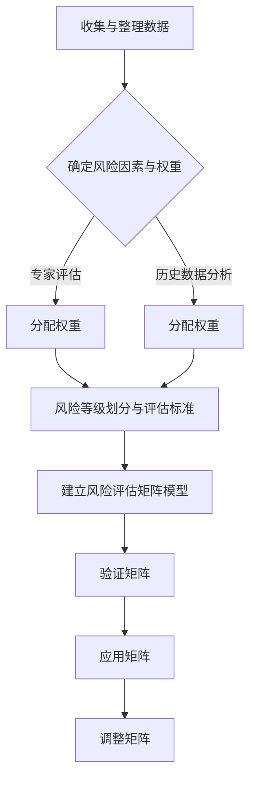

                 

### 引言

#### 创业项目风险评估的重要性

创业项目风险评估是确保创业项目成功的关键环节之一。在竞争激烈的市场环境中，创业项目面临着各种不确定性和风险。如果无法有效识别和评估这些风险，项目可能会面临严重的财务损失、时间浪费以及市场机会的丧失。因此，创业项目风险评估不仅有助于企业在面临风险时做出明智的决策，还能提高企业的风险承受能力和竞争力。

#### 风险评估矩阵的作用与基本概念

风险评估矩阵是一种用于评估和管理项目风险的方法论。它通过系统化、结构化的方式，将风险因素、风险概率和风险影响量化，从而帮助企业更全面、准确地评估项目风险。风险评估矩阵的作用主要体现在以下几个方面：

1. **识别潜在风险**：通过梳理和分类风险因素，帮助企业识别项目可能面临的风险。
2. **量化风险程度**：通过风险概率和风险影响的量化，帮助评估每个风险对项目的潜在影响。
3. **优先级排序**：根据风险评估结果，对风险进行优先级排序，指导企业优先处理高影响、高概率的风险。
4. **决策支持**：为企业的项目决策提供数据支持，帮助企业在面临风险时做出更为明智的选择。

#### 本书目标与结构

本书的目标是提供一套系统、实用的创业项目风险评估矩阵构建方法，帮助读者理解并掌握风险评估矩阵的原理和构建步骤。本书分为八个章节，具体结构如下：

- **第1章**：创业项目风险评估基础，介绍风险管理的基本概念、风险因素与权重、风险等级评估以及风险评估矩阵的应用场景。
- **第2章**：构建风险评估矩阵，详细讲解如何收集与整理数据、确定风险因素与权重、划分风险等级以及建立风险评估矩阵模型。
- **第3章**：评估方法与工具，介绍定性评估方法和定量评估方法，以及常用的风险评估工具。
- **第4章**：风险评估矩阵的应用，讲解创业项目的风险评估流程，并结合实际案例进行分析。
- **第5章**：风险评估矩阵优化与调整，介绍评估结果分析、风险评估矩阵的优化与调整方法。
- **第6章**：风险评估矩阵与其他风险管理工具的结合，探讨风险评估矩阵与其他风险管理工具的整合与应用。
- **第7章**：创业项目风险管理策略制定，讲解风险应对策略的类型与选择，以及风险管理策略的制定流程。
- **第8章**：创业项目风险管理的挑战与未来趋势，分析风险管理面临的挑战和未来趋势。

通过以上章节的逐步讲解，本书旨在帮助读者全面理解创业项目风险评估矩阵的构建和应用，为企业提供有效的风险管理工具。

### 第1章：创业项目风险评估基础

#### 风险管理的基本概念

风险管理是指识别、评估、优先处理和控制项目或企业面临的风险的过程。它是企业管理的重要组成部分，旨在通过系统的策略和措施，最大限度地减少风险可能带来的负面影响。风险管理的基本概念包括：

1. **风险**：风险是指未来事件的不确定性，可能带来损失或收益。在创业项目中，风险可以包括市场风险、技术风险、财务风险、运营风险等。

2. **风险识别**：风险识别是风险管理过程中的第一步，旨在识别项目中可能存在的各种风险。这通常通过头脑风暴、专家咨询、历史数据分析和流程图等方法实现。

3. **风险评估**：风险评估是对已识别的风险进行量化评估，包括评估风险的概率和影响程度。风险评估可以采用定性评估和定量评估方法。

4. **风险优先级排序**：通过风险评估，将风险按照优先级排序，以便企业能够集中资源和精力处理最关键的风险。

5. **风险应对策略**：根据风险优先级排序，制定相应的风险应对策略。常见的风险应对策略包括风险规避、风险减少、风险转移和风险接受。

6. **风险监控**：在项目执行过程中，持续监控风险的变化，确保风险应对策略的有效性和适应性。

7. **风险控制**：通过实施风险应对策略，控制风险的发生和蔓延，以减少潜在的损失。

#### 风险的定义与分类

风险的定义是多维度和复杂的。在创业项目中，风险可以定义为潜在的不利事件，可能对项目目标、资源或声誉产生负面影响。风险通常分为以下几类：

1. **市场风险**：市场风险是指由于市场环境变化导致的需求波动、竞争加剧、价格波动等，从而影响项目收入和利润。

2. **技术风险**：技术风险是指由于技术方案的不确定性、技术实现的难度或技术更新换代等，导致项目无法按计划完成或项目成果不符合预期。

3. **财务风险**：财务风险是指由于资金不足、融资困难、资金链断裂等，导致项目无法继续或被迫终止。

4. **运营风险**：运营风险是指由于运营管理不善、供应链问题、人力资源管理问题等，导致项目运营效率低下或中断。

5. **法律风险**：法律风险是指由于法律政策的变化、合同纠纷、侵权诉讼等，导致项目受到法律制裁或诉讼。

6. **声誉风险**：声誉风险是指由于产品质量问题、项目失败、负面新闻等，导致项目品牌形象受损，影响企业的长期发展。

#### 风险管理的目标与原则

风险管理的目标是确保项目在面临风险时能够采取有效的应对措施，最大限度地降低风险可能带来的损失，并确保项目目标的实现。具体目标包括：

1. **降低损失**：通过识别和评估风险，制定应对策略，最大限度地减少风险可能带来的损失。

2. **提高项目成功率**：通过有效的风险管理，提高项目的成功率，确保项目能够按计划完成。

3. **提升企业竞争力**：通过系统的风险管理，增强企业的风险承受能力和市场竞争力。

4. **保护企业声誉**：通过有效的风险管理，减少负面事件的发生，保护企业的声誉和品牌形象。

风险管理的基本原则包括：

1. **全面性**：风险管理应覆盖项目的各个阶段和各个方面，确保风险管理的全面性和系统性。

2. **预防为主**：在风险管理中，应注重风险的预防，采取积极的措施防止风险的发生。

3. **动态性**：风险管理的环境是动态变化的，应持续监控风险的变化，及时调整风险管理策略。

4. **适应性**：风险管理应具备适应性，能够根据项目实际情况和环境变化，灵活调整风险管理措施。

5. **成本效益**：在风险管理中，应考虑成本效益，确保风险管理的投入能够带来相应的收益。

#### 风险评估矩阵的组成部分

风险评估矩阵是由风险因素、风险权重和风险等级三个核心部分组成的一种评估工具。以下是风险评估矩阵的具体组成部分：

1. **风险因素**：风险因素是项目中可能面临的各种风险的具体表现。这些因素可以来自市场、技术、财务、运营等多个方面。例如，市场风险可能包括需求下降、竞争对手增加等；技术风险可能包括技术实现难度、技术更新等。

2. **风险权重**：风险权重是衡量风险重要性的量化指标。通常，风险权重通过专家评估、历史数据分析和统计方法来确定。风险权重反映了风险对项目成功的潜在影响程度。例如，市场需求下降可能被赋予更高的权重，因为它对项目收入和利润的影响更大。

3. **风险等级**：风险等级是评估风险严重性的量化指标。常见的风险等级划分方法包括高、中、低三级，或更细化的五级划分。风险等级通过结合风险因素和风险权重来确定。例如，一个高权重、高风险等级的风险因素可能被定义为“重大风险”。

#### 风险因素与权重

风险因素和权重的确定是构建风险评估矩阵的重要步骤。以下是具体的方法和步骤：

1. **收集数据**：通过文献调研、专家访谈、历史数据分析等方式，收集与项目相关的风险因素数据。

2. **筛选风险因素**：根据项目特点和市场环境，筛选出对项目有重大影响的潜在风险因素。

3. **专家评估**：邀请相关领域的专家，对筛选出的风险因素进行评估，确定其重要性。常用的评估方法包括评分法、层次分析法等。

4. **统计分析**：对收集到的数据进行分析，确定风险因素的权重。常用的统计分析方法包括回归分析、聚类分析等。

5. **确定权重**：根据专家评估和统计分析结果，确定各风险因素的权重。权重可以采用百分制、五分制等不同的表示方法。

#### 风险等级评估

风险等级评估是确定风险严重程度的关键步骤。以下是具体的方法和步骤：

1. **定义风险等级**：根据项目的特点和风险因素的重要性，定义风险等级。常见的风险等级包括高、中、低三级或五级。

2. **评估风险等级**：根据风险因素和权重，评估每个风险因素的风险等级。常用的评估方法包括矩阵法、评分法等。

3. **确定风险等级**：结合专家评估和统计分析结果，确定每个风险因素的风险等级。

4. **调整风险等级**：根据实际情况和评估结果，对风险等级进行适当调整，以确保评估的准确性和实用性。

#### 风险评估矩阵的应用场景

风险评估矩阵在创业项目中具有广泛的应用场景。以下是几种常见应用场景：

1. **项目规划**：在项目启动阶段，通过风险评估矩阵，识别和评估项目可能面临的各种风险，为项目规划和决策提供数据支持。

2. **风险管理计划**：在项目执行阶段，通过风险评估矩阵，监控和调整项目风险，确保项目按照计划顺利进行。

3. **决策支持**：在项目决策阶段，通过风险评估矩阵，评估不同方案的风险和收益，为项目决策提供科学依据。

4. **风险管理报告**：在项目结束后，通过风险评估矩阵，总结和报告项目风险管理的过程和结果，为未来的项目管理提供参考。

#### 跨部门协作与沟通

在构建和使用风险评估矩阵时，跨部门协作和沟通至关重要。以下是几种实现跨部门协作和沟通的方法：

1. **定期会议**：定期召开跨部门会议，讨论项目风险和风险管理计划，确保各部门信息共享和协调一致。

2. **信息共享平台**：建立信息共享平台，方便各部门访问和更新风险评估矩阵相关数据。

3. **风险管理培训**：组织风险管理培训，提高各部门对风险评估矩阵的理解和应用能力。

4. **沟通机制**：建立有效的沟通机制，确保各部门能够及时沟通和反馈风险管理中的问题和建议。

### 第2章：构建风险评估矩阵

#### 收集与整理数据

构建风险评估矩阵的第一步是收集和整理数据。这些数据将用于确定风险因素、权重和等级，并确保评估过程具有可靠性和准确性。以下是具体的方法和步骤：

1. **确定数据来源**：数据可以从多种来源获取，包括内部数据和外部数据。内部数据可能包括项目历史记录、运营数据、员工意见等；外部数据可能包括市场调研报告、行业分析、竞争对手信息等。

2. **收集数据**：通过问卷调查、访谈、文献调研、市场调研等方法，收集与项目相关的数据。确保收集的数据全面、准确，并涵盖各种潜在的风险因素。

3. **整理数据**：将收集到的数据进行分类整理，确保数据清晰、有条理。可以使用电子表格、数据库或其他工具来整理数据，以便后续分析和处理。

4. **数据验证**：对收集和整理的数据进行验证，确保数据的准确性和完整性。可以采用交叉验证、专家审核等方法，对数据进行核实。

5. **数据更新**：随着项目进展和市场变化，定期更新数据，以确保风险评估的时效性和准确性。

#### 确定风险因素与权重

确定风险因素和权重是构建风险评估矩阵的关键步骤。以下是具体的方法和步骤：

1. **识别风险因素**：通过头脑风暴、专家咨询、历史数据分析等方法，识别项目可能面临的各种风险因素。这些风险因素应涵盖市场、技术、财务、运营等多个方面。

2. **筛选风险因素**：根据项目特点和实际情况，筛选出对项目有重大影响的风险因素。可以采用评分法、层次分析法等方法，对风险因素进行筛选和排序。

3. **确定风险权重**：通过专家评估、历史数据分析和统计分析方法，确定各风险因素的权重。风险权重反映了风险对项目成功的潜在影响程度。常用的方法包括评分法、专家评估法、回归分析法等。

4. **分配权重**：根据确定的风险权重，分配到各个风险因素上。权重可以采用百分制、五分制等不同的表示方法。

5. **调整权重**：根据实际情况和项目进展，定期调整风险权重，以确保评估的准确性和实用性。

#### 风险等级的划分与评估标准

风险等级的划分与评估标准是风险评估矩阵的重要组成部分。以下是具体的方法和步骤：

1. **定义风险等级**：根据项目特点和风险因素的重要性，定义风险等级。常见的风险等级划分方法包括高、中、低三级或五级。可以采用定量方法（如统计方法）或定性方法（如专家评估）来定义风险等级。

2. **确定评估标准**：根据风险等级的定义，确定评估标准。评估标准可以包括风险概率、风险影响、风险概率影响等。可以采用定量方法（如概率分布、统计模型）或定性方法（如专家评估）来确定评估标准。

3. **制定评估流程**：制定风险评估的流程，确保评估过程系统、规范。评估流程可以包括风险识别、风险分析、风险评估、风险应对策略制定等步骤。

4. **实施评估**：根据评估标准和评估流程，对每个风险因素进行评估。评估过程中，可以采用定性评估方法（如专家评估、矩阵法）或定量评估方法（如统计模型、概率分布）。

5. **确定风险等级**：根据评估结果，确定每个风险因素的风险等级。可以将评估结果进行分类，如高、中、低风险等级。

6. **调整评估标准**：根据实际情况和项目进展，定期调整评估标准，以确保评估的准确性和实用性。

#### 建立风险评估矩阵模型

建立风险评估矩阵模型是构建风险评估矩阵的核心步骤。以下是具体的方法和步骤：

1. **定义矩阵结构**：根据项目特点和风险因素，定义风险评估矩阵的结构。结构应包括风险因素、风险权重、风险等级等元素。

2. **收集数据**：根据风险评估矩阵的结构，收集相关的数据，包括风险因素、权重和等级。

3. **构建矩阵**：将收集到的数据填入风险评估矩阵中，形成完整的评估矩阵。

4. **验证矩阵**：对构建的风险评估矩阵进行验证，确保矩阵的准确性和完整性。可以采用专家审核、数据分析等方法进行验证。

5. **应用矩阵**：将风险评估矩阵应用于项目风险管理中，用于识别、评估和管理项目风险。

6. **调整矩阵**：根据项目进展和实际情况，定期调整风险评估矩阵，确保其适应性和实用性。

通过以上步骤，可以构建一个系统、科学的创业项目风险评估矩阵，为企业提供有效的风险管理工具。以下是构建风险评估矩阵的 Mermaid 流程图：



### 第3章：评估方法与工具

#### 定性评估方法

定性评估方法主要通过专家判断、经验分析和主观意见来评估风险。这些方法适用于难以量化的风险因素，以及需要快速评估风险场景的情况。以下是几种常见的定性评估方法：

1. **威胁与机会分析法**：这种方法用于识别项目中的威胁和机会，并分析它们对项目的影响。通常通过头脑风暴、专家访谈和问卷调查等方式进行。

2. **故障树分析法**：故障树是一种图形化工具，用于识别和评估系统故障的原因和后果。它通过自上而下的方法，逐步分解故障原因，直到最基本的风险因素。

3. **SWOT分析法**：SWOT分析法用于评估项目的优势、劣势、机会和威胁。它通过四个维度的分析，帮助项目团队了解项目的内部和外部环境，从而制定相应的风险管理策略。

#### 定量评估方法

定量评估方法通过数值和统计数据来评估风险。这些方法适用于能够量化的风险因素，以及需要精确评估风险的概率和影响程度的情况。以下是几种常见的定量评估方法：

1. **成本效益分析**：成本效益分析用于评估项目风险的成本与效益。通过计算风险成本与风险收益的比率，评估风险的经济影响。

2. **基于概率的风险评估**：这种方法通过概率模型来评估风险的发生概率和影响程度。常用的概率模型包括贝叶斯网络、蒙特卡罗模拟等。

#### 常用风险评估工具

在风险评估过程中，常用的工具和软件可以帮助项目团队更高效、准确地评估和管理风险。以下是几种常用的风险评估工具：

1. **故障树软件**：故障树软件可以帮助项目团队创建、分析和优化故障树模型。常见的故障树软件包括 Fault Tree Pro、ReliaSoft FTNT等。

2. **模拟软件**：模拟软件用于模拟项目风险的概率分布和影响。常见的模拟软件包括 Monte Carlo 模拟软件、R语言等。

3. **风险评估软件**：风险评估软件提供了一套完整的风险评估和管理功能，包括风险识别、风险评估、风险应对策略制定等。常见的风险评估软件包括 RiskyProject、Kepner-Tregoe 等。

### 第4章：风险评估矩阵的应用

#### 创业项目的风险评估流程

创业项目的风险评估是一个系统化、连续性的过程，它贯穿于项目的整个生命周期。以下是创业项目的风险评估流程：

1. **风险识别**：通过头脑风暴、专家访谈、历史数据分析等方法，识别项目可能面临的各种风险。这一步骤的目的是全面了解项目风险，为后续评估做好准备。

2. **风险评估**：在风险识别的基础上，对已识别的风险进行评估。评估内容包括风险的概率和影响程度。常用的评估方法包括定性评估和定量评估。

3. **风险优先级排序**：根据风险评估结果，对风险进行优先级排序。优先级排序可以帮助项目团队集中资源处理最重要、最紧迫的风险。

4. **风险应对策略制定**：根据风险优先级排序，制定相应的风险应对策略。常见的风险应对策略包括风险规避、风险减少、风险转移和风险接受。

5. **风险监控与调整**：在项目执行过程中，持续监控风险的变化，并根据实际情况调整风险应对策略。这一步骤的目的是确保风险应对措施的有效性和适应性。

#### 风险识别

风险识别是风险评估过程中的第一步，它是发现和记录项目可能面临的风险。以下是风险识别的方法和步骤：

1. **头脑风暴**：组织项目团队成员进行头脑风暴，列出项目可能面临的各种风险。这种方法有助于挖掘潜在的风险，并促进团队成员之间的沟通和协作。

2. **专家访谈**：邀请行业专家、内部员工等进行访谈，获取他们对项目风险的见解和建议。专家访谈可以帮助识别那些可能被忽视的风险。

3. **历史数据分析**：分析过去类似项目的历史记录，总结经验教训，识别潜在的风险。这种方法有助于利用历史数据来预测和识别当前项目的风险。

4. **文献调研**：查阅相关文献、行业报告和市场研究，了解行业趋势和潜在风险。文献调研可以帮助项目团队了解外部环境可能带来的风险。

5. **流程图分析**：通过流程图分析，识别项目各个环节可能存在的风险。这种方法有助于从整体上了解项目流程，发现潜在的风险点。

#### 风险评估

风险评估是对已识别的风险进行量化评估，确定其概率和影响程度。以下是风险评估的方法和步骤：

1. **定性评估方法**：定性评估方法主要通过专家判断、经验分析和主观意见来评估风险。常用的定性评估方法包括威胁与机会分析法、故障树分析法和SWOT分析法。

2. **定量评估方法**：定量评估方法通过数值和统计数据来评估风险。常用的定量评估方法包括成本效益分析和基于概率的风险评估。

3. **评估标准制定**：制定评估标准，用于衡量风险的概率和影响程度。评估标准可以包括风险的概率、风险的影响、风险的概率影响等。

4. **评估结果记录**：将评估结果记录在风险评估矩阵中，以便后续分析和决策。风险评估矩阵应包括风险因素、风险权重、风险等级等元素。

5. **风险评估报告**：撰写风险评估报告，总结评估过程和结果。风险评估报告应包括风险识别、风险评估、风险优先级排序和风险应对策略等内容。

#### 风险应对策略制定

风险应对策略制定是风险评估的核心步骤，它旨在根据风险评估结果，制定相应的风险应对措施，以减少风险对项目的影响。以下是风险应对策略制定的方法和步骤：

1. **风险优先级排序**：根据风险评估结果，对风险进行优先级排序。优先级排序可以帮助项目团队集中资源处理最重要、最紧迫的风险。

2. **风险应对策略选择**：根据风险优先级排序，选择相应的风险应对策略。常见的风险应对策略包括风险规避、风险减少、风险转移和风险接受。

3. **制定具体措施**：为每个风险应对策略制定具体的实施措施。具体措施应包括责任分配、时间安排、资源需求等。

4. **制定应急计划**：针对高优先级的风险，制定应急计划，以应对风险发生时的紧急情况。应急计划应包括应急响应流程、资源准备、职责分配等。

5. **审查与调整**：定期审查风险应对策略的实施情况，根据项目进展和实际情况进行调整。审查与调整的目的是确保风险应对策略的有效性和适应性。

#### 风险监控与调整

在项目执行过程中，风险监控与调整至关重要。以下是风险监控与调整的方法和步骤：

1. **建立监控机制**：建立风险监控机制，定期收集和评估项目风险信息。监控机制可以包括定期的项目会议、风险评估报告等。

2. **评估风险变化**：根据监控机制，评估项目风险的变化情况。评估内容包括风险的概率、影响程度、优先级等。

3. **调整风险应对策略**：根据风险变化情况，调整风险应对策略。调整的目的是确保风险应对策略始终与项目的实际情况相符。

4. **记录与报告**：记录风险监控和调整的过程和结果，并定期向项目团队和利益相关者报告。记录和报告的目的是提高透明度，促进项目团队的协作。

5. **持续改进**：通过不断的监控和调整，积累风险管理经验，改进风险管理流程和策略。持续改进的目的是提高项目风险管理的效果。

#### 创业项目的实际案例

为了更好地理解风险评估矩阵在创业项目中的应用，下面我们通过一个实际案例进行说明。

**案例背景**：某创业公司计划开发一款智能家居设备，目标市场为国内一线城市的中高端家庭。该项目面临的风险包括技术风险、市场风险和财务风险。

**风险识别**：
- 技术风险：智能家居设备的技术实现难度、技术更新换代等。
- 市场风险：市场需求不足、竞争对手增加、政策法规变化等。
- 财务风险：资金不足、融资困难、成本超支等。

**风险评估**：
- 技术风险：根据专家评估和历史数据分析，技术风险的概率为0.4，影响程度为0.8。
- 市场风险：市场需求下降的概率为0.3，影响程度为0.6；竞争对手增加的概率为0.2，影响程度为0.7。
- 财务风险：资金不足的概率为0.2，影响程度为0.8。

**风险应对策略**：
- 技术风险：加强与供应商的合作，确保技术实现；定期更新技术方案，以应对技术更新换代。
- 市场风险：进行市场调研，了解市场需求和竞争对手情况；积极拓展营销渠道，提高品牌知名度。
- 财务风险：制定详细的财务计划，确保资金充足；寻求外部融资，降低财务风险。

**风险监控与调整**：
- 定期评估技术风险、市场风险和财务风险的变化情况。
- 根据风险变化，调整风险应对策略，确保风险应对措施的有效性和适应性。

通过以上步骤，该创业公司成功地应用了风险评估矩阵，有效地识别、评估和管理了项目风险，提高了项目成功的可能性。

### 案例分析与总结

在本章中，我们通过一个实际案例展示了风险评估矩阵在创业项目中的应用。以下是对案例的深入分析以及从案例中总结的经验教训。

#### 案例分析

该案例涉及一个创业公司开发智能家居设备的全过程。在项目启动阶段，公司首先进行了风险识别，识别出技术风险、市场风险和财务风险。随后，公司对每个风险进行了评估，并制定了相应的风险应对策略。

- **技术风险**：公司通过加强与供应商的合作，确保技术实现，并定期更新技术方案，以应对技术更新换代。这一策略有效地降低了技术风险的概率和影响程度。
- **市场风险**：公司通过市场调研，了解市场需求和竞争对手情况，并积极拓展营销渠道，提高品牌知名度。这些措施有助于降低市场风险的概率和影响程度。
- **财务风险**：公司制定了详细的财务计划，确保资金充足，并寻求外部融资，降低财务风险。这些措施有效地保障了项目的财务稳定性。

在项目执行过程中，公司建立了风险监控机制，定期评估技术风险、市场风险和财务风险的变化情况。根据评估结果，公司及时调整了风险应对策略，确保风险应对措施始终与项目的实际情况相符。

#### 经验教训

从本案例中，我们可以总结出以下几点经验教训：

1. **全面的风险识别**：在项目启动阶段，公司应进行全面的风险识别，确保不遗漏任何重要的风险因素。这可以通过头脑风暴、专家访谈和历史数据分析等方法实现。

2. **科学的风险评估**：风险评估是风险管理的关键步骤。公司应采用科学的评估方法，如定性评估和定量评估，确保风险评估结果的准确性和可靠性。

3. **合理的风险应对策略**：根据风险评估结果，公司应制定合理的风险应对策略。不同的风险因素可能需要不同的应对策略，如风险规避、风险减少、风险转移和风险接受。

4. **有效的风险监控与调整**：在项目执行过程中，公司应建立有效的风险监控机制，定期评估风险的变化情况，并根据评估结果及时调整风险应对策略。这有助于确保风险应对措施始终与项目的实际情况相符。

5. **持续的风险管理**：风险管理是一个持续的过程，公司应不断更新和优化风险管理流程和策略，以适应项目的变化和外部环境的变化。

#### 案例总结

通过本案例，我们可以看到，风险评估矩阵在创业项目中具有重要的应用价值。它帮助创业公司全面识别、评估和管理项目风险，提高了项目的成功率。同时，案例也展示了科学的风险管理流程和策略，为其他创业公司提供了有益的借鉴。

在未来的创业项目中，我们建议公司继续重视风险评估矩阵的应用，不断完善风险管理流程和策略，确保项目在面临风险时能够有效应对，实现成功。

### 第5章：风险评估矩阵优化与调整

#### 评估结果分析

在创业项目执行过程中，对风险评估矩阵进行优化与调整是非常重要的。首先，我们需要对评估结果进行详细分析。以下是分析评估结果的具体步骤和方法：

1. **数据处理与统计分析**：使用统计软件或工具（如Excel、R语言、Python等）对收集到的数据进行处理和统计分析。通过计算均值、中位数、标准差等统计指标，了解评估结果的分布情况。

2. **可视化**：将评估结果进行可视化处理，如使用条形图、饼图、散点图等，以直观地展示风险因素的概率和影响程度。可视化有助于项目团队更好地理解评估结果。

3. **异常值检测**：识别和分析评估结果中的异常值。异常值可能表明数据存在偏差或评估方法存在问题，需要进一步调查和调整。

4. **评估结果验证**：与历史数据和行业标准进行对比，验证评估结果的准确性和可靠性。如果发现评估结果与预期不符，需要重新评估和调整。

5. **专家评审**：邀请相关领域的专家对评估结果进行评审，提供专业的意见和建议。专家评审有助于发现评估过程中的疏漏和不足。

#### 风险评估矩阵的评估结果可视化

为了更好地理解和展示评估结果，我们可以使用可视化工具将风险评估矩阵的评估结果进行可视化。以下是几种常用的可视化方法：

1. **条形图**：条形图可以直观地展示各个风险因素的概率和影响程度。例如，可以绘制一个条形图，分别展示市场风险、技术风险和财务风险的评估结果。

2. **饼图**：饼图适用于展示各个风险因素的权重分配情况。例如，可以绘制一个饼图，展示市场风险、技术风险和财务风险的权重占比。

3. **散点图**：散点图可以展示风险因素之间的相关性。例如，可以绘制一个散点图，展示市场风险、技术风险和财务风险之间的相关性。

4. **热力图**：热力图可以用于展示评估结果的分布情况。例如，可以绘制一个热力图，展示市场风险在不同阶段的评估结果。

5. **雷达图**：雷达图可以展示项目的整体风险评估结果。例如，可以绘制一个雷达图，展示市场风险、技术风险和财务风险在各个方面的评估结果。

通过以上可视化方法，项目团队可以更直观地了解评估结果，发现潜在的风险，为后续的风险管理提供依据。

#### 风险评估矩阵的优化与调整方法

在分析评估结果的基础上，我们需要对风险评估矩阵进行优化与调整。以下是具体的方法和步骤：

1. **调整风险因素**：根据评估结果和项目实际情况，重新评估和调整风险因素。如果发现某些风险因素的重要性较低，可以将其删除；如果发现某些新的风险因素，可以将其添加到矩阵中。

2. **调整风险权重**：根据评估结果和专家评审意见，重新评估和调整各个风险因素的权重。可以通过专家评分、历史数据分析等方法，确定新的风险权重。

3. **调整风险等级**：根据新的评估结果和风险权重，重新划分风险等级。可以使用五级划分法（如高、中、低、次高、次低）或三级划分法（如高、中、低），确保风险等级与风险因素的重要性相符。

4. **优化风险应对策略**：根据新的评估结果和风险等级，重新评估和优化风险应对策略。如果发现某些应对策略不够有效，可以调整其具体措施或引入新的应对策略。

5. **更新风险评估矩阵**：将调整后的评估结果和优化后的风险应对策略更新到风险评估矩阵中。确保矩阵中的数据和信息是最新的，以便项目团队参考和决策。

#### 风险因素权重调整

风险因素权重调整是优化风险评估矩阵的重要步骤。以下是具体的方法和步骤：

1. **重新评估风险因素**：在项目执行过程中，可能会出现新的风险因素或某些风险因素的重要性发生变化。因此，需要定期重新评估风险因素，确保评估结果的准确性。

2. **专家评分**：邀请相关领域的专家对风险因素进行评分。专家评分可以采用百分制或五分制等不同的评分方法。评分结果可以作为调整风险权重的依据。

3. **历史数据分析**：分析过去类似项目的历史数据，了解风险因素的变化趋势和重要性。历史数据分析可以提供有价值的信息，帮助确定新的风险权重。

4. **统计分析**：使用统计方法（如回归分析、聚类分析等）对评分结果和历史数据进行分析，确定新的风险权重。统计分析可以帮助项目团队更科学、客观地确定风险权重。

5. **调整风险权重**：根据专家评分和统计分析结果，重新分配风险权重。调整后的风险权重应确保与风险因素的实际重要性相符。

6. **验证权重调整**：对调整后的风险权重进行验证，确保其合理性和有效性。可以采用专家评审、模拟分析等方法进行验证。

通过以上步骤，项目团队可以优化风险评估矩阵，提高风险评估的准确性和实用性。

#### 风险等级划分优化

风险等级划分的优化是提升风险评估矩阵效能的关键步骤。以下是优化风险等级划分的具体方法和步骤：

1. **评估标准调整**：根据项目的实际情况和风险评估结果，重新评估和调整风险等级的评估标准。评估标准应明确、具体，确保能够准确反映风险的概率和影响程度。

2. **专家评审**：邀请相关领域的专家对风险等级划分进行评审，提出意见和建议。专家评审有助于发现现有划分标准的不合理之处，并提供改进建议。

3. **历史数据对比**：分析过去类似项目的历史数据，对比现有风险等级划分的准确性。通过对比分析，可以识别出需要改进的风险等级划分。

4. **统计分析**：使用统计方法（如回归分析、聚类分析等）对风险等级划分进行优化。统计分析可以帮助确定更合理、更具区分度的风险等级划分。

5. **测试与验证**：在调整后的风险等级划分方案实施前，进行测试和验证。可以通过模拟分析、实际项目应用等方法，验证新划分标准的准确性和可靠性。

6. **更新与培训**：将调整后的风险等级划分方案更新到风险评估矩阵中，并对项目团队进行培训，确保团队成员了解并掌握新的划分标准。

通过以上步骤，项目团队可以优化风险等级划分，提高风险评估的准确性和实用性。

#### 风险应对策略调整

在项目执行过程中，风险应对策略可能需要根据实际情况进行调整。以下是调整风险应对策略的具体方法和步骤：

1. **定期评估**：定期评估风险应对策略的有效性和适应性。评估内容包括风险应对措施的执行情况、风险变化趋势等。

2. **专家评审**：邀请相关领域的专家对风险应对策略进行评审，提供专业意见和建议。专家评审有助于发现现有应对策略的不足，并提供改进建议。

3. **模拟分析**：通过模拟分析，评估不同风险应对策略的效果。模拟分析可以帮助项目团队了解各种策略在不同风险情况下的表现，为调整策略提供依据。

4. **调整措施**：根据评估结果和专家评审意见，调整风险应对策略。调整措施可以包括增加资源投入、修改应对措施、引入新的应对策略等。

5. **更新文档**：将调整后的风险应对策略更新到项目文档中，确保团队成员和利益相关者了解最新的策略。

6. **培训和沟通**：对项目团队和利益相关者进行培训和沟通，确保他们了解并掌握调整后的风险应对策略。

通过以上步骤，项目团队可以优化风险应对策略，提高项目风险管理的效能。

### 第6章：风险评估矩阵与其他风险管理工具的结合

#### 风险管理策略整合

在创业项目中，单独使用风险评估矩阵可能无法全面覆盖和管理所有风险。因此，将风险评估矩阵与其他风险管理工具相结合，可以形成一个更完整、更有效的风险管理框架。以下是几种常见的风险管理策略整合方法：

1. **风险地图**：风险地图是一种可视化工具，用于展示项目中的风险及其相互关系。通过风险地图，项目团队可以直观地了解项目的整体风险状况，并识别出关键风险因素。

2. **风险矩阵**：风险矩阵是一种将风险因素、风险概率和风险影响进行量化的工具。通过风险矩阵，项目团队可以更系统地评估和排序风险，为制定风险应对策略提供数据支持。

3. **风险应对策略整合**：将风险评估矩阵与风险应对策略相结合，可以形成一套完整的风险管理方案。风险评估矩阵提供风险因素和评估结果，而风险应对策略则明确如何应对和管理这些风险。

#### 风险矩阵与风险矩阵的整合

在创业项目中，可能存在多个不同的风险矩阵。这些风险矩阵可能分别用于不同的风险类型或阶段。为了提高整体风险管理效果，可以将这些风险矩阵进行整合。以下是整合风险矩阵的方法：

1. **统一风险分类**：首先，需要统一不同风险矩阵中的风险分类，确保所有矩阵使用相同的风险分类标准。这有助于避免分类冲突和重复评估。

2. **整合风险因素**：将不同风险矩阵中的风险因素整合到一个统一的框架中。可以通过合并相同或相似的风险因素，减少冗余，提高评估的准确性。

3. **量化风险概率和影响**：对整合后的风险因素进行量化，确定其概率和影响程度。可以使用专家评分、历史数据分析等方法，确保评估结果的可靠性。

4. **优化风险矩阵**：在整合过程中，可以对风险矩阵进行优化，提高其适用性和实用性。例如，可以调整风险因素权重、风险等级划分等。

#### 风险评估矩阵与财务分析工具的结合

财务分析工具在创业项目中具有重要作用，可以帮助项目团队评估项目的经济可行性。将风险评估矩阵与财务分析工具相结合，可以更全面地评估和管理项目风险。以下是结合风险评估矩阵与财务分析工具的方法：

1. **成本效益分析**：使用成本效益分析工具，评估项目风险对项目成本和收益的影响。通过计算风险成本和风险收益的比率，项目团队可以了解风险的经济影响。

2. **敏感性分析**：敏感性分析用于评估项目收益对关键变量（如成本、市场需求等）的敏感性。通过敏感性分析，项目团队可以了解哪些风险因素对项目收益的影响最大。

3. **蒙特卡罗模拟**：蒙特卡罗模拟是一种基于概率的模拟方法，可以用于评估项目风险的概率分布和预期收益。通过蒙特卡罗模拟，项目团队可以了解不同风险情景下的项目表现。

4. **财务风险评估**：将风险评估矩阵与财务分析工具相结合，可以形成一套完整的财务风险评估方法。财务风险评估可以用于评估项目的融资风险、资金流动性风险等。

通过将风险评估矩阵与其他风险管理工具和财务分析工具相结合，项目团队可以更全面、更准确地评估和管理创业项目风险，提高项目的成功率和经济效益。

### 第7章：创业项目风险管理策略制定

#### 风险应对策略的类型与选择

在创业项目中，为了有效地管理风险，需要制定具体的风险应对策略。根据风险的性质和影响，常见的风险应对策略包括以下几种：

1. **风险规避**：风险规避是指通过改变项目计划或决策，避免与高风险相关的活动。例如，如果市场需求不确定，可以延迟项目上线时间，等待市场更加明朗。

2. **风险减少**：风险减少是通过采取措施降低风险的概率或影响程度。例如，通过加强技术研发，降低技术风险；通过增加市场调研，降低市场风险。

3. **风险转移**：风险转移是将风险转移给第三方，通常是保险公司或合作伙伴。例如，通过购买保险，将财务风险转移给保险公司；通过签订合同，将部分运营风险转移给合作伙伴。

4. **风险接受**：风险接受是指不采取任何措施来管理风险，而是接受风险可能带来的损失。这种策略适用于低概率、低影响的风险，或者资源有限的情况。

#### 风险管理策略的制定流程

制定有效的风险管理策略需要遵循一定的流程，以下是具体步骤：

1. **风险识别**：通过头脑风暴、专家访谈等方法，识别项目可能面临的各种风险。

2. **风险评估**：对识别出的风险进行评估，确定其概率和影响程度。可以使用定性评估方法（如专家评估、矩阵法）或定量评估方法（如成本效益分析、概率分布）。

3. **风险排序**：根据风险评估结果，对风险进行排序，确定优先处理的风险。可以使用风险矩阵、优先级排序法等工具。

4. **风险应对策略选择**：根据风险排序结果，选择相应的风险应对策略。可以选择单一策略，也可以结合多种策略。

5. **策略实施计划**：制定具体的实施计划，包括责任分配、时间安排、资源需求等。

6. **策略评估与优化**：在策略实施过程中，定期评估策略的有效性，并根据实际情况进行调整和优化。

#### 策略制定方法

制定风险管理策略的方法有很多，以下是几种常用的方法：

1. **头脑风暴法**：组织项目团队成员进行头脑风暴，列出各种可能的应对措施，并讨论其优缺点。

2. **专家评估法**：邀请相关领域的专家对风险应对策略进行评估，提供专业意见和建议。

3. **决策树法**：使用决策树法，根据风险的概率和影响程度，选择最佳的风险应对策略。

4. **成本效益分析法**：通过计算风险成本和风险收益的比率，选择最具成本效益的风险应对策略。

5. **模拟分析法**：使用模拟分析工具（如蒙特卡罗模拟），评估不同应对策略的效果，选择最佳策略。

#### 策略评估与优化

在风险管理策略实施过程中，需要定期评估策略的有效性，并根据实际情况进行调整和优化。以下是评估与优化策略的方法：

1. **绩效评估**：根据策略实施的结果，评估策略的实际效果。可以使用关键绩效指标（KPIs）来衡量策略的成功程度。

2. **数据收集与分析**：收集与策略实施相关的数据，如风险事件的发生频率、损失金额等。通过数据分析，了解策略的实际效果。

3. **专家评审**：邀请相关领域的专家对策略进行评审，提供专业意见和建议。

4. **调整与优化**：根据评估结果，调整和优化风险管理策略。可以增加或减少某些应对措施，调整策略的具体实施方式。

5. **反馈机制**：建立反馈机制，及时收集项目团队和利益相关者的意见和建议，确保策略的持续优化。

通过以上方法，项目团队可以制定和优化有效的风险管理策略，提高项目的成功率。

### 第8章：创业项目风险管理的挑战与未来趋势

#### 风险管理面临的挑战

在创业项目风险管理过程中，企业可能会面临以下挑战：

1. **数据隐私与合规性**：随着数据隐私法规的日益严格，企业需要确保风险评估过程中收集和使用的数据符合相关法律法规。例如，欧盟的《通用数据保护条例》（GDPR）对数据隐私保护提出了严格要求。

2. **技术快速迭代与适应性**：在技术快速发展的背景下，创业项目需要不断适应新技术、新产品和新市场，这对风险管理提出了新的要求。企业需要快速识别和评估新技术带来的风险，并调整风险管理策略。

3. **风险评估的主观性**：风险评估过程中，专家评估和主观判断的成分较大，可能导致评估结果存在偏差。如何提高风险评估的客观性和准确性是一个重要挑战。

4. **资源有限**：创业项目通常面临资源限制，需要在有限的预算和人力下进行风险管理。如何有效利用有限资源进行风险评估和管理，是企业管理者需要面对的挑战。

5. **风险信息的透明度**：在创业项目中，风险信息可能分散在不同部门和个人手中，导致风险信息的透明度不高。如何实现风险信息的共享和透明化，是企业需要解决的问题。

6. **跨部门协作**：风险管理通常涉及多个部门，如研发、市场、财务等。跨部门协作的效率和质量直接影响风险管理的效果。如何建立有效的跨部门协作机制，是企业需要面对的挑战。

#### 风险管理的未来趋势

随着技术的不断进步，创业项目风险管理也将迎来新的发展趋势：

1. **人工智能与大数据的应用**：人工智能和大数据技术在风险管理中的应用日益广泛。通过数据挖掘和分析，企业可以更准确、更全面地识别和评估风险，提高风险管理的效率。

2. **实时风险评估**：随着物联网和传感器技术的发展，企业可以实现对风险因素的实时监测和评估。这种实时风险评估有助于企业迅速响应风险变化，采取有效的应对措施。

3. **风险管理平台化**：随着风险管理工具和软件的不断发展，企业可以建立统一的风险管理平台，实现风险评估、风险监控和风险应对的自动化。这种平台化趋势将提高风险管理的一致性和效率。

4. **风险管理与可持续发展的结合**：在可持续发展背景下，企业需要将风险管理与社会责任、环境保护等相结合。通过综合考虑社会和环境因素，企业可以实现更全面的风险管理。

5. **国际化与全球化背景下的风险管理**：随着全球化进程的加速，企业需要应对跨国业务带来的复杂风险。国际化与全球化背景下的风险管理要求企业具备跨文化的沟通能力和全球视野。

6. **新兴技术的应用**：区块链、云计算、物联网等新兴技术在风险管理中的应用前景广阔。这些技术可以提供更安全、更高效的风险管理解决方案，帮助企业应对日益复杂的风险环境。

通过应对挑战和把握未来趋势，企业可以建立更加科学、系统的创业项目风险管理框架，提高项目的成功率，实现可持续发展。

### 第9章：总结与展望

#### 本书主要内容回顾

本书系统地介绍了创业项目风险评估矩阵的构建与应用，内容主要包括以下几个核心部分：

1. **核心概念与联系**：详细阐述了风险管理的定义、目标、原则以及风险评估矩阵的组成部分，为后续内容奠定了理论基础。

2. **构建风险评估矩阵**：介绍了如何收集与整理数据、确定风险因素与权重、划分风险等级以及建立风险评估矩阵模型。

3. **评估方法与工具**：探讨了定性评估方法和定量评估方法，以及故障树分析、成本效益分析等常用风险评估工具。

4. **风险评估矩阵的应用**：讲解了风险评估矩阵在创业项目中的具体应用流程，包括风险识别、风险评估、风险应对策略制定和风险监控与调整。

5. **风险评估矩阵优化与调整**：介绍了如何对评估结果进行分析、可视化，以及如何优化风险评估矩阵和风险应对策略。

6. **风险评估矩阵与其他风险管理工具的结合**：探讨了风险评估矩阵与风险地图、财务分析工具等相结合的方法。

7. **创业项目风险管理策略制定**：详细讲解了风险应对策略的类型与选择，以及风险管理策略的制定流程。

8. **创业项目风险管理的挑战与未来趋势**：分析了当前风险管理面临的挑战以及未来的发展趋势。

#### 关键算法原理讲解

在风险评估矩阵中，核心算法原理包括定性评估方法和定量评估方法。以下是具体讲解：

1. **定性评估方法**：
   - **威胁与机会分析法**：通过头脑风暴和专家访谈，识别项目中的威胁和机会，并分析其对项目的影响。
   - **故障树分析法**：构建故障树模型，逐步分解故障原因，评估风险的发生概率和影响程度。
   - **SWOT分析法**：分析项目的优势、劣势、机会和威胁，为项目决策提供依据。

2. **定量评估方法**：
   - **成本效益分析**：通过计算风险成本和风险收益的比率，评估风险的经济影响。
   - **基于概率的风险评估**：使用概率模型（如贝叶斯网络、蒙特卡罗模拟），评估风险的发生概率和影响程度。

#### 核心数学模型与公式讲解

在风险评估矩阵中，常用的数学模型和公式包括贝叶斯定理和成本效益分析。以下是具体讲解：

1. **贝叶斯定理**：
   $$ P(A|B) = \frac{P(B|A)P(A)}{P(B)} $$
   其中，$P(A|B)$ 表示在事件 $B$ 发生的条件下，事件 $A$ 发生的概率；$P(B|A)$ 表示在事件 $A$ 发生的条件下，事件 $B$ 发生的概率；$P(A)$ 和 $P(B)$ 分别表示事件 $A$ 和事件 $B$ 的发生概率。

2. **成本效益分析**：
   $$ \text{成本效益比率} = \frac{\text{风险成本}}{\text{风险收益}} $$
   通过计算成本效益比率，评估风险的经济影响。成本效益比率越低，表示风险对项目的经济影响越大。

#### 实际案例与代码解读

以下是一个实际案例与代码解读的示例：

**案例背景**：某创业公司计划开发一款智能家居设备，目标市场为国内一线城市的中高端家庭。公司需要使用风险评估矩阵来识别和评估项目风险。

**代码示例**：

```python
import pandas as pd

# 初始化数据
data = {
    '风险因素': ['市场风险', '技术风险', '财务风险'],
    '概率': [0.4, 0.3, 0.2],
    '影响程度': [0.8, 0.6, 0.5]
}

df = pd.DataFrame(data)

# 计算风险得分
df['风险得分'] = df['概率'] * df['影响程度']

# 计算整体风险
total_risk = df['风险得分'].sum()

print(f'整体风险得分：{total_risk}')
```

**代码解读**：
- 使用 Pandas 库创建一个包含风险因素、概率和影响程度的数据框。
- 计算每个风险因素的风险得分，风险得分为概率和影响程度的乘积。
- 计算整体风险得分，通过将所有风险得分相加得到。

#### 未来研究方向与建议

基于本书的内容和当前风险管理实践，以下是一些未来研究方向与建议：

1. **新兴技术的应用**：探索人工智能、区块链、大数据等新兴技术在风险评估矩阵中的应用，以提高风险评估的准确性和效率。

2. **跨学科研究与综合应用**：结合心理学、社会学、经济学等学科的理论和方法，构建更加全面、科学的风险评估体系。

3. **实时风险评估**：开发实时风险评估系统，实现对风险因素的实时监测和评估，提高风险管理的及时性和有效性。

4. **国际经验借鉴**：研究国际先进企业的风险评估方法和实践，借鉴其成功经验，结合国内实际情况，提升风险管理水平。

5. **风险管理教育**：加强风险管理教育，培养具备风险管理意识和能力的人才，为企业提供可持续的发展动力。

通过不断探索和实践，企业可以构建更加科学、系统的创业项目风险评估矩阵，提高项目的成功率和市场竞争力。

### 附录

#### 附录 A：风险评估矩阵构建工具与资源

以下是一些用于构建和优化风险评估矩阵的工具与资源：

1. **常用风险评估软件**：
   - **RiskMaster**：一款功能强大的风险评估软件，支持风险识别、评估、监控和报告。
   - **OpenRisks**：开源的风险管理平台，提供风险矩阵、风险地图和风险管理报告等功能。
   - **RiskLens**：专注于网络安全风险管理的软件，提供风险管理工具和专家咨询服务。

2. **在线风险评估工具**：
   - **RiskMeter**：在线风险评估工具，支持自定义风险因素和评估标准。
   - **RiskCanvas**：提供在线风险评估模板和协作功能，方便团队共同评估和管理风险。

3. **风险评估文献与参考资料**：
   - **《风险管理：理论与实践》**：一本全面介绍风险管理理论和方法的专业书籍。
   - **《企业风险管理》**：由COSO发布的指南，提供了企业风险管理的全面框架和最佳实践。
   - **相关行业报告**：如市场研究公司发布的行业风险分析报告，提供行业风险概况和案例分析。

#### 附录 B：创业项目风险管理案例

以下是一些创业项目风险管理的案例，包括成功和失败案例：

1. **成功案例**：
   - **Airbnb**：通过建立强大的风险管理框架，Airbnb成功应对了市场波动、法律法规变化等风险，实现了全球扩张。
   - **Uber**：通过实时风险评估和应急响应机制，Uber有效管理了网络安全风险和法律法规风险，保持了业务的稳定增长。

2. **失败案例**：
   - **WeWork**：由于对市场需求的错误估计和财务管理的失败，WeWork在上市前遭遇重大挫折，最终导致公司重组。
   - **Funding Circle**：由于信用风险评估不足，Funding Circle在投资失败后面临巨大的财务风险，导致公司业绩下滑。

#### 案例分析与讨论

通过对这些成功和失败案例的分析，我们可以得出以下结论：

1. **成功的风险管理**：
   - **全面的风险识别和评估**：成功的企业能够全面识别和评估项目风险，确保风险管理的全面性和准确性。
   - **灵活的风险应对策略**：根据风险评估结果，成功的企业能够灵活调整风险应对策略，确保策略的有效性和适应性。
   - **持续的监控与调整**：成功的企业能够持续监控风险的变化，并根据实际情况及时调整风险管理策略。

2. **失败的风险管理**：
   - **风险识别不足**：失败的企业可能未能充分识别项目风险，导致风险管理存在盲点。
   - **风险应对策略不当**：失败的企业可能选择了不合适的应对策略，或者没有及时调整策略，导致风险无法有效控制。
   - **监控不足**：失败的企业可能未能持续监控风险的变化，导致风险问题无法及时发现和解决。

通过这些案例分析和讨论，企业可以借鉴成功经验，避免失败教训，提升自身的风险管理水平。

#### 附录 C：术语解释

以下是对一些常见术语的解释：

1. **风险管理**：指识别、评估、优先处理和控制项目或企业面临的风险的过程。

2. **风险因素**：项目中可能面临的各种风险的具体表现，如市场风险、技术风险、财务风险等。

3. **风险权重**：衡量风险重要性的量化指标，通常通过专家评估、历史数据分析等方法确定。

4. **风险等级**：评估风险严重性的量化指标，常用的划分方法包括高、中、低三级或五级。

5. **风险矩阵**：用于评估和管理风险的一种工具，包括风险因素、风险权重和风险等级等元素。

6. **风险规避**：通过改变项目计划或决策，避免与高风险相关的活动。

7. **风险减少**：通过采取措施降低风险的概率或影响程度。

8. **风险转移**：将风险转移给第三方，如保险公司或合作伙伴。

9. **风险接受**：不采取任何措施来管理风险，而是接受风险可能带来的损失。

#### 附录 D：风险评估矩阵示例

以下是一个简单的风险评估矩阵示例，展示了如何构建和填写风险评估矩阵：

| 风险因素 | 概率 | 影响程度 | 风险得分 |
| -------- | ---- | -------- | -------- |
| 市场风险 | 0.4  | 0.8      | 0.32     |
| 技术风险 | 0.3  | 0.6      | 0.18     |
| 财务风险 | 0.2  | 0.5      | 0.10     |
| 总计     |      |          | 0.60     |

在上述示例中，每个风险因素的概率和影响程度通过专家评估确定，风险得分为概率和影响程度的乘积。整体风险得分为所有风险得分之和，用于衡量项目的整体风险水平。通过填写和评估风险评估矩阵，企业可以更系统地管理和控制项目风险。

