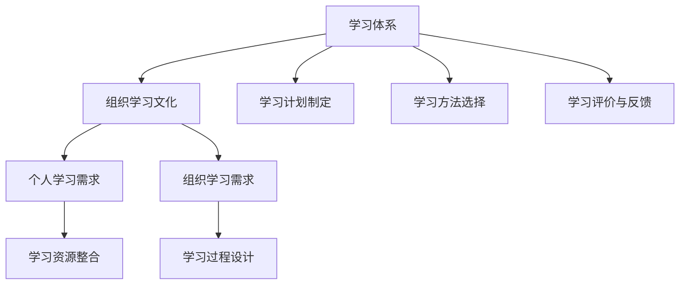

                 

### 学习体系构建基础

#### 学习体系概述

学习体系是指为了满足个人或组织的学习需求，而建立的一套系统化的学习框架和流程。它不仅包括学习资源的整合，还涵盖了学习目标的设定、学习过程的规划与实施，以及学习效果的评估和反馈。

##### **1.1 学习体系的基本概念**

- **学习体系的定义**：学习体系是一种结构化的方法，旨在系统化地组织和指导学习活动，以确保学习目标的实现。

- **学习体系的组成结构**：学习体系通常包括以下几个组成部分：
  - **学习目标**：明确的学习目标是学习体系的基础，它为整个学习过程提供了方向。
  - **学习资源**：学习资源包括书籍、课程、在线资源、社交网络等，是学习活动的重要支撑。
  - **学习过程**：学习过程包括学习计划、学习方法、学习评价等，它是学习体系的核心。
  - **学习环境**：学习环境包括物理环境、社交环境、文化环境等，对学习效果有着重要影响。
  - **学习反馈**：学习反馈是学习体系的重要组成部分，它通过评估学习效果来指导后续的学习活动。

##### **1.2 学习体系的重要性**

- **对个人发展的影响**：一个完善的学习体系可以帮助个人系统地获取知识，提升技能，实现个人职业发展和成长。

- **对组织发展的作用**：对于组织来说，学习体系可以提升员工的综合素质和创新能力，增强组织的核心竞争力。

##### **1.3 学习体系的发展历程**

- **传统学习体系**：在传统的学习体系中，学习主要依赖于教师和教材，学习过程往往是线性的，缺乏灵活性和个性化。

- **现代学习体系**：随着信息技术的发展，现代学习体系更加注重个性化和互动性，学习资源更加丰富，学习方式更加灵活。

### **学习需求分析**

#### **2.1 个人学习需求分析**

##### **2.1.1 学习目标的设定**

- **设定学习目标的重要性**：明确的学习目标是学习体系的基础，它为个人提供了清晰的学习方向。

- **设定学习目标的方法**：
  - **SMART 原则**：学习目标应当是具体的（Specific）、可衡量的（Measurable）、可实现的（Achievable）、相关的（Relevant）和有时限的（Time-bound）。

  - **目标分解**：将大的学习目标分解为小的、可操作的学习任务，有助于更好地实现学习目标。

##### **2.1.2 学习需求的评估**

- **评估学习需求的重要性**：准确评估学习需求可以帮助个人确定学习目标和资源，提高学习效率。

- **评估学习需求的方法**：
  - **自我评估**：通过自我反思和评估，了解自己的知识水平、兴趣和优势。

  - **问卷调查**：通过设计问卷调查，收集他人的意见和建议，帮助自己更全面地了解自己的学习需求。

#### **2.2 组织学习需求分析**

##### **2.2.1 组织学习目标的设定**

- **设定组织学习目标的重要性**：组织学习目标的设定有助于统一员工的学习方向，提高组织的整体学习能力。

- **设定组织学习目标的方法**：
  - **战略目标导向**：将组织的学习目标与组织的整体战略目标相一致，确保学习目标的实现能够支持组织的发展。

  - **员工需求导向**：结合员工的职业发展需求，设定符合员工成长需求的学习目标。

##### **2.2.2 组织学习需求的评估**

- **评估组织学习需求的重要性**：准确评估组织的学习需求可以帮助组织确定学习目标和资源，提高组织的整体学习效果。

- **评估组织学习需求的方法**：
  - **员工访谈**：通过访谈了解员工的学习需求和困难，为组织的学习目标设定提供依据。

  - **市场调研**：通过市场调研了解行业趋势和竞争对手的学习策略，为组织的学习目标设定提供外部视角。

### **学习资源整合**

#### **3.1 教育资源的分类**

- **纸质资源**：包括教材、参考书、论文等，是传统的学习资源。

- **数字资源**：包括在线课程、电子书籍、学术论文、开放课程等，随着互联网的发展，数字资源变得越来越重要。

- **社交资源**：包括学习社群、在线论坛、社交媒体等，通过社交资源，可以与他人交流学习心得，获取更多学习机会。

#### **3.2 教育资源的选择与整合**

- **教育资源的选择标准**：
  - **权威性**：选择具有权威性的教育资源，如知名专家撰写的书籍、权威机构的课程等。
  - **适用性**：选择与学习目标和学习需求相符合的资源。
  - **多样性**：选择多样化的资源，以丰富学习体验。

- **教育资源的选择策略**：
  - **需求导向**：根据学习需求选择合适的资源。
  - **评估筛选**：对各种资源进行评估和筛选，选择最合适的资源。
  - **协同整合**：将各种资源进行整合，形成系统化的学习资源体系。

### **学习过程设计**

#### **4.1 学习计划制定**

##### **4.1.1 学习计划的制定流程**

- **确定学习目标**：明确学习目标，确保学习计划的实施方向。

- **分析学习资源**：分析可用的学习资源，为学习计划的制定提供支持。

- **制定学习任务**：将学习目标分解为具体的、可操作的学习任务。

- **规划学习时间**：根据学习任务和学习资源，合理规划学习时间。

- **制定学习计划**：将学习任务和时间规划整合，形成完整的学习计划。

##### **4.1.2 学习计划的实施策略**

- **定期回顾**：定期回顾学习进度，确保学习计划的实施效果。

- **灵活调整**：根据学习过程中的实际情况，灵活调整学习计划。

- **持续反馈**：通过学习反馈，不断优化学习计划。

#### **4.2 学习方法选择**

##### **4.2.1 理论学习方法**

- **阅读**：通过阅读教材、参考书等，获取理论知识。

- **讲座**：通过参加讲座、研讨会等，学习他人的经验和见解。

##### **4.2.2 实践学习方法**

- **实验**：通过实验，验证理论，加深对知识的理解。

- **项目**：通过实际项目，将理论知识应用于实践。

#### **4.3 学习评价与反馈**

##### **4.3.1 学习评价的方法**

- **自我评价**：通过自我反思，评估学习效果。

- **他人评价**：通过他人的评价，获取外部反馈。

##### **4.3.2 学习反馈的机制**

- **即时反馈**：在学习过程中，及时给予反馈，帮助学习者调整学习策略。

- **定期反馈**：定期进行学习评价，总结学习成果，指导后续学习。

### **组织学习文化概述**

#### **5.1 组织学习文化的定义**

- **组织学习文化的内涵**：组织学习文化是指组织内部形成的共同学习价值观、学习习惯和学习行为，它是组织持续发展的内在动力。

- **组织学习文化的特点**：
  - **共享性**：组织学习文化强调知识和信息的共享，鼓励员工之间的知识交流。
  - **创新性**：组织学习文化鼓励创新思维，支持员工不断尝试新方法和新技术。
  - **自主性**：组织学习文化倡导员工自主学习和自我提升，鼓励员工主动参与学习活动。
  - **包容性**：组织学习文化尊重不同的观点和经验，为员工创造一个开放、包容的学习环境。

#### **5.2 组织学习文化的重要性**

- **对组织竞争力的提升**：组织学习文化可以提升组织的整体竞争力，通过持续学习和知识创新，组织能够更好地适应市场变化，保持竞争优势。

- **对员工持续发展的推动**：组织学习文化为员工的个人发展提供了良好的环境和支持，有助于员工不断提升自身能力和素质，实现职业成长。

### **组织学习文化构建**

#### **6.1 组织学习文化价值观的确立**

- **确立学习价值观的重要性**：学习价值观的确立是组织学习文化建设的核心，它为组织成员提供了共同的学习目标和行为准则。

- **确立学习价值观的方法**：
  - **高层领导引领**：通过高层领导的示范作用，树立学习的榜样，推动组织学习价值观的传播和实践。
  - **员工参与**：鼓励员工参与学习价值观的讨论和制定，确保价值观的广泛认同和落实。
  - **文化宣传**：通过内部培训、宣传栏、企业文化活动等方式，不断强化学习价值观的传播和实践。

#### **6.2 组织学习制度的设计**

- **设计学习制度的重要性**：学习制度是组织学习文化建设的保障，它为组织成员提供了具体的行动指南和支持。

- **设计学习制度的方法**：
  - **明确学习目标**：根据组织的战略目标和员工的发展需求，设定明确的学习目标。
  - **制定学习政策**：制定具体的学习政策，包括学习资源的使用、学习时间的安排、学习评价的标准等。
  - **建立学习流程**：设计系统的学习流程，包括学习计划的制定、学习资源的获取、学习活动的实施、学习效果的评估等。

#### **6.3 组织学习环境的营造**

- **营造学习环境的重要性**：良好的学习环境是组织学习文化建设的物质基础，它对员工的学习态度和行为有着重要影响。

- **营造学习环境的方法**：
  - **物理环境**：提供舒适、安静、具备良好设施的学习空间。
  - **社交环境**：建立学习社群，鼓励员工之间的知识分享和合作学习。
  - **文化环境**：营造积极向上的学习氛围，鼓励创新和探索，支持员工的自主学习。

### **组织学习文化评估与改进**

#### **7.1 组织学习文化评估**

- **评估组织学习文化的重要性**：定期评估组织学习文化有助于了解组织学习文化的现状，发现存在的问题和不足，为改进提供依据。

- **评估组织学习文化的方法**：
  - **问卷调查**：通过设计问卷，收集员工对组织学习文化的认知和评价。
  - **访谈调研**：通过访谈方式，深入了解员工对组织学习文化的真实感受和建议。
  - **行为观察**：观察员工在学习过程中的行为表现，评估学习文化的实施效果。

#### **7.2 组织学习文化改进**

- **改进组织学习文化的重要性**：改进组织学习文化有助于提升组织的学习效果和竞争力，促进组织的持续发展。

- **改进组织学习文化的方法**：
  - **策略调整**：根据评估结果，调整组织学习文化的策略，优化学习流程和制度。
  - **培训提升**：通过培训，提升员工的学习能力和学习素养，增强组织学习文化的执行力。
  - **持续反馈**：建立持续反馈机制，通过定期评估和反馈，不断优化和改进组织学习文化。

### **典型案例分析**

#### **8.1 国内外组织学习案例**

##### **8.1.1 成功案例分析**

- **案例一：谷歌（Google）**
  - **背景**：谷歌是一家全球领先的技术公司，以其创新的企业文化和强大的学习能力而著称。
  - **实践**：
    - **内部培训**：谷歌为员工提供丰富的内部培训资源，包括在线课程、内部讲座和研讨会。
    - **员工参与**：鼓励员工参与公司的创新项目，提供学习机会和资源，支持员工的职业发展。
    - **知识分享**：谷歌通过内部社交平台和知识管理系统，促进员工之间的知识分享和交流。
  - **效果**：谷歌的学习文化极大地提升了员工的创新能力和公司整体的竞争力，推动了公司持续的创新和成长。

##### **8.1.2 失败案例分析**

- **案例二：诺基亚（Nokia）**
  - **背景**：诺基亚曾是全球领先的手机制造商，但在面对市场变革时，未能及时调整学习策略，导致竞争力下降。
  - **实践**：
    - **忽视市场需求**：诺基亚在产品研发过程中，忽视了市场趋势和用户需求的变化。
    - **学习资源分散**：诺基亚的学习资源分散，缺乏统一的管理和协调，导致学习效果不佳。
    - **创新动力不足**：诺基亚缺乏对创新的支持和鼓励，员工的创新积极性受到限制。
  - **效果**：诺基亚的学习文化未能及时适应市场变化，导致公司在智能手机市场的竞争力下降，最终被竞争对手超越。

#### **8.2 组织学习文化在实践中的应用**

##### **8.2.1 学习体系与学习文化的融合策略**

- **融合路径**：
  - **顶层设计**：在组织战略规划中，明确学习体系与学习文化的建设目标和路径。
  - **制度保障**：建立系统的学习制度，为学习体系与学习文化的实施提供制度保障。
  - **文化渗透**：通过文化活动、内部沟通等方式，将学习文化渗透到组织的各个方面。

- **融合方法**：
  - **学习资源共享**：通过共享学习资源，促进员工之间的知识交流和合作。
  - **学习激励机制**：建立学习激励机制，鼓励员工积极参与学习活动。
  - **学习评价体系**：建立科学的学习评价体系，对学习效果进行评估和反馈。

##### **8.2.2 学习体系与学习文化的协同效应**

- **协同效应**：学习体系与学习文化的协同作用，可以提升组织的整体学习效果和创新能力。

- **实施策略**：
  - **共同目标**：明确学习体系与学习文化的共同目标，确保各方的一致行动。
  - **资源整合**：整合学习资源，提高学习资源的利用效率。
  - **互动交流**：鼓励员工之间的互动交流，促进知识的传播和应用。
  - **持续改进**：通过持续改进，不断提升学习体系与学习文化的实施效果。

### **学习体系与学习文化融合策略**

#### **9.1 学习体系与学习文化的协同效应**

- **定义**：学习体系与学习文化的协同效应是指通过两者之间的相互作用和整合，实现学习效果的倍增。

- **作用**：
  - **提高学习效率**：学习体系提供了结构化的学习流程和资源，学习文化则为学习提供了良好的环境和支持，两者结合可以显著提高学习效率。
  - **促进知识创新**：学习体系提供了系统化的学习方法和资源，学习文化则鼓励创新思维和实践，两者的结合可以激发知识创新。

#### **9.2 学习体系与学习文化的融合路径**

- **路径一：战略规划**：将学习体系与学习文化的建设纳入组织战略规划，确保两者的一致性和协调性。

- **路径二：制度建设**：建立系统的学习制度和政策，为学习体系与学习文化的实施提供保障。

- **路径三：文化渗透**：通过文化活动、内部沟通等方式，将学习文化渗透到组织的各个方面，形成良好的学习氛围。

#### **9.3 学习体系与学习文化的融合方法**

- **方法一：资源共享**：建立学习资源共享平台，促进知识流动和传播。

- **方法二：激励机制**：建立学习激励机制，鼓励员工积极参与学习活动。

- **方法三：评价反馈**：建立科学的学习评价体系，对学习效果进行评估和反馈，不断优化学习体系与学习文化的实施。

### **持续学习与创新能力培养**

#### **10.1 学习体系的优化**

- **定期评估**：定期评估学习体系的有效性，根据评估结果调整学习目标和策略。

- **动态调整**：根据组织的发展和学习需求，动态调整学习资源的配置和学习流程。

- **技术创新**：引入新技术和方法，提升学习体系的智能化和个性化水平。

#### **10.2 学习文化的深化**

- **文化推广**：通过内部培训和宣传，不断深化学习文化的内涵和影响力。

- **员工参与**：鼓励员工积极参与学习文化的建设，发挥员工的主体作用。

- **跨部门合作**：促进不同部门之间的知识交流和合作，形成良好的学习生态。

### **未来发展趋势与展望**

#### **10.1 学习体系与学习文化的未来发展**

- **技术驱动**：随着人工智能、大数据等技术的发展，学习体系与学习文化将更加智能化、个性化。

- **教育模式创新**：在线教育、混合式学习等新型教育模式将进一步发展和普及，为学习体系与学习文化的建设提供新的思路和方法。

#### **10.2 组织学习文化的全球化趋势**

- **文化融合**：随着全球化的发展，不同组织之间的学习文化将不断融合，形成更加多元化、开放的学习文化。

- **跨文化沟通**：提升跨文化沟通能力，将有助于组织在全球范围内吸收和整合不同文化的学习资源，推动组织学习文化的全球化发展。

### **附录**

#### **11.1 学习体系与学习文化相关书籍**

- **《深度学习》（Goodfellow, I., Bengio, Y., & Courville, A.）**
- **《学习之道》（Dewey, J.）**
- **《创新与企业家精神》（Drucker, P. F.）**
- **《学习型组织行动纲领》（Senge, P. M.）**

#### **11.2 学习体系与学习文化研究论文**

- **“Learning Systems: An Integrated Approach”**
- **“Cultural Dynamics in Learning Organizations”**
- **“The Role of Culture in Learning and Innovation”**

#### **11.3 组织学习与学习文化实践指南**

- **《谷歌如何工作》（Kim, G., & Mauborgne, R.）**
- **《打造学习型组织》（Peters, L. M., & Waterman, R. H.）**
- **《组织学习：理论与应用》（Argyris, C.）**

### **核心概念与联系**

- **Mermaid 流�程图**



### **核心算法原理讲解**

- **学习过程设计算法**

```python
# 伪代码：学习计划制定算法
function createLearningPlan(targetKnowledge, availableResources, timeBudget):
    plan = []
    for knowledgeArea in targetKnowledge:
        if isKnowledgeAreaAvailable(knowledgeArea, availableResources):
            selectedResource = selectBestResource(knowledgeArea, availableResources)
            plan.append({knowledgeArea: selectedResource})
        else:
            plan.append({knowledgeArea: "待解决"})

    optimizePlan(plan, timeBudget)
    return plan

function optimizePlan(plan, timeBudget):
    # 优化学习计划以适应时间预算
    # 伪代码：简单优化策略
    for activity in plan:
        if activity["timeEstimate"] > timeBudget:
            reduceActivityDuration(activity)
    return plan

function reduceActivityDuration(activity):
    # 减少活动持续时间
    activity["timeEstimate"] -= 10
```

### **数学模型和数学公式详细讲解 & 举例说明**

- **学习需求评估数学模型**

$$
D = \frac{K_{c} \cdot R_{c}}{C}
$$

- **参数解释**：
  - **D**：学习需求得分
  - **Kc**：知识点的重要性
  - **Rc**：知识点的可用性
  - **C**：学习成本

- **举例说明**：

假设某个知识点的的重要性（Kc）为5，可用性（Rc）为8，而学习成本（C）为10，则该知识点的学习需求得分（D）为：

$$
D = \frac{5 \cdot 8}{10} = 4
$$

这表明该知识点具有较高的学习需求。

### **项目实战**

- **代码实际案例：学习资源整合系统**

#### **开发环境搭建**

- **操作系统**：Ubuntu 20.04
- **编程语言**：Python 3.8
- **数据库**：MySQL 8.0
- **Web框架**：Django 3.2

#### **源代码详细实现和代码解读**

**models.py**

```python
from django.db import models

class Resource(models.Model):
    title = models.CharField(max_length=255)
    description = models.TextField()
    type = models.CharField(max_length=50)
    url = models.URLField()

    def __str__(self):
        return self.title

class Category(models.Model):
    name = models.CharField(max_length=100)

    def __str__(self):
        return self.name
```

- **解读**：此部分定义了资源（Resource）和类别（Category）模型，用于存储学习资源的元数据。

**views.py**

```python
from django.shortcuts import render
from .models import Resource, Category

def resource_list(request):
    resources = Resource.objects.all()
    categories = Category.objects.all()
    return render(request, 'resource_list.html', {'resources': resources, 'categories': categories})
```

- **解读**：此部分定义了资源列表视图（resource_list），用于渲染学习资源列表页面。

### **代码解读与分析**

- **models.py**：
  - **Resource** 模型包含标题、描述、类型和URL字段，用于存储资源的详细信息。
  - **Category** 模型包含名称字段，用于存储资源的分类信息。

- **views.py**：
  - **resource_list** 函数从数据库中获取所有资源和类别，并将其传递给模板，用于渲染资源列表页面。

### **结论**

通过本文，我们详细介绍了学习体系的构建和组织学习文化的构建。从学习需求分析、学习资源整合、学习过程设计，到组织学习文化的概述、构建与评估，再到学习体系与学习文化的融合策略，我们系统地阐述了如何构建一个有效的学习体系和一个积极的学习文化。通过理论讲解、数学模型、伪代码示例和实际项目案例，我们帮助读者深入理解了学习体系与组织学习文化的核心概念和原理，为实际应用提供了明确的指导和参考。

- **作者**：AI天才研究院/AI Genius Institute & 禅与计算机程序设计艺术 /Zen And The Art of Computer Programming

