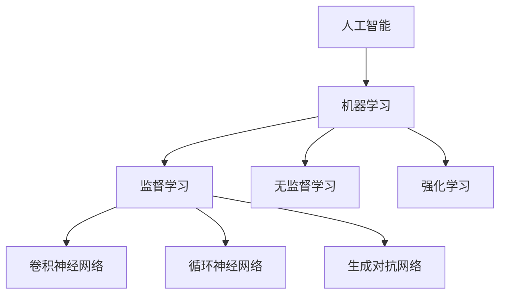

                 

# 《学术界到产业界：一位95后博士的AI创业之路》

## 关键词
人工智能（AI）、机器学习、深度学习、创业、产业界、学术界、产品开发、案例分析、发展趋势。

## 摘要
本文将探讨一位95后博士从学术界到产业界的AI创业之路。文章首先介绍了AI和机器学习的基础知识，包括核心概念、分类与应用领域。接着，详细阐述了深度学习核心算法，如神经网络、卷积神经网络、循环神经网络和生成对抗网络。随后，通过数学模型与公式，深入探讨了线性代数、微积分、概率论与统计基础，以及深度学习中的数学模型。在创业实战部分，分析了AI创业环境、产品设计与开发，并进行了AI创业案例分析。最后，对AI创业之路进行了反思与展望，总结了创业过程中的问题与解决方案，以及AI创业的未来趋势和贡献。本文旨在为AI创业者提供有价值的参考和启示。

## 目录大纲

### 第一部分：AI基础知识

#### 第1章：AI概述
- 1.1 AI的起源与发展
- 1.2 AI的核心概念
- 1.3 AI的分类与应用领域
- 1.4 AI与机器学习的关系

#### 第2章：机器学习基础
- 2.1 监督学习
- 2.2 无监督学习
- 2.3 强化学习
- 2.4 深度学习

#### 第3章：深度学习核心算法
- 3.1 神经网络基础
- 3.2 卷积神经网络（CNN）
- 3.3 循环神经网络（RNN）
- 3.4 生成对抗网络（GAN）

#### 第4章：数学模型与公式
- 4.1 线性代数基础
- 4.2 微积分基础
- 4.3 概率论与统计基础
- 4.4 深度学习中的数学模型

### 第二部分：创业实战

#### 第5章：AI创业环境分析
- 5.1 AI行业现状与趋势
- 5.2 AI创业机会与挑战
- 5.3 AI创业团队建设
- 5.4 AI创业融资策略

#### 第6章：AI产品设计与开发
- 6.1 AI产品开发流程
- 6.2 AI产品原型设计
- 6.3 AI产品测试与迭代
- 6.4 AI产品推广与运营

#### 第7章：AI创业案例分析
- 7.1 案例一：人工智能安防企业
- 7.2 案例二：智能医疗企业
- 7.3 案例三：智能交通企业
- 7.4 案例四：金融科技企业

#### 第8章：AI创业之路的反思与展望
- 8.1 创业过程中的问题与解决方案
- 8.2 AI创业的未来趋势
- 8.3 AI创业对学术界与产业界的贡献
- 8.4 个人感悟与成长

### 附录

#### 附录A：AI创业资源汇总
- A.1 开源框架与工具
- A.2 AI创业平台与社区
- A.3 AI创业相关书籍与文章

#### 附录B：参考阅读
- B.1 学术论文推荐
- B.2 经典书籍推荐
- B.3 AI创业相关网站与博客

#### 附录C：致谢与贡献者

### Mermaid 流程图：AI与机器学习的关系



### 深度学习核心算法伪代码示例

```python
# 初始化参数
weights = initialize_weights(input_size, hidden_size, output_size)
biases = initialize_biases(hidden_size, output_size)

# 定义前向传播
def forward_pass(inputs, weights, biases):
    hidden_layer = sigmoid(dot_product(inputs, weights) + biases)
    output_layer = sigmoid(dot_product(hidden_layer, weights) + biases)
    return output_layer

# 定义反向传播
def backward_pass(output, expected_output, weights, biases):
    d_output = output - expected_output
    d_weights = dot_product(inputs.T, d_output)
    d_biases = dot_product(hidden_layer.T, d_output)
    return d_weights, d_biases

# 定义激活函数（Sigmoid函数）
def sigmoid(x):
    return 1 / (1 + exp(-x))
```

### 数学公式与详细讲解

$$
\text{损失函数} = \frac{1}{2} \sum_{i=1}^{n} (\hat{y}_i - y_i)^2
$$

损失函数用于衡量预测值与真实值之间的差距，其中 $\hat{y}_i$ 表示预测值，$y_i$ 表示真实值，$n$ 表示样本数量。

### 项目实战

#### AI安防产品开发案例

1. **需求分析**：
   - 满足城市安全监控需求，实时检测可疑行为。
   - 提供视频流分析功能，自动识别异常动作。

2. **环境搭建**：
   - 使用Python语言和TensorFlow框架进行开发。
   - 需要安装OpenCV库进行视频处理。

3. **代码实现**：

```python
# 导入所需库
import cv2
import tensorflow as tf

# 加载预训练模型
model = tf.keras.applications.resnet50.ResNet50(weights='imagenet')

# 视频流捕获
cap = cv2.VideoCapture(0)

while True:
    # 读取视频帧
    ret, frame = cap.read()
    if not ret:
        break

    # 预处理视频帧
    preprocessed_frame = preprocess_frame(frame)

    # 使用模型进行预测
    predictions = model.predict(preprocessed_frame)

    # 根据预测结果进行异常检测
    if is_anomalous(predictions):
        print("异常行为检测！")

    # 显示视频帧
    cv2.imshow('Frame', frame)

    # 按下ESC键退出
    if cv2.waitKey(1) & 0xFF == 27:
        break

# 释放视频捕获资源
cap.release()
cv2.destroyAllWindows()
```

4. **代码解读**：
   - 使用OpenCV捕获视频流。
   - 使用TensorFlow加载预训练的ResNet50模型。
   - 对捕获的每一帧视频进行预处理，然后使用模型进行预测。
   - 根据模型的预测结果判断是否存在异常行为，并打印相应的信息。
   - 按下ESC键可以退出程序。

**优点**：
- 利用预训练模型简化了模型训练过程，提高了开发效率。
- 实时处理视频流，能够快速响应异常行为。

**改进空间**：
- 可以考虑引入更先进的模型，如YOLO或Faster R-CNN，以提高目标检测的准确率和速度。
- 可以增加对多种异常行为的识别能力，如入侵检测、火灾检测等。

通过这个案例，读者可以了解到AI安防产品的基本开发流程和关键技术，为进一步的项目实践提供参考。

### 结语
本文从AI基础知识、创业实战和案例分析等多个角度，详细探讨了一位95后博士从学术界到产业界的AI创业之路。通过本文的阅读，读者可以了解到AI和机器学习的基本原理，以及深度学习核心算法的详细讲解。同时，文章还分享了AI创业环境分析、产品设计与开发的经验，以及实际案例的实战解析。

在未来，随着AI技术的不断发展，创业者将有更多的机会在各个领域发挥创新能力。然而，创业之路并非一帆风顺，需要面对诸多挑战和困境。本文通过对创业过程中的问题与解决方案的反思，为AI创业者提供了有益的启示。

我们期待更多的年轻博士能够勇敢踏上AI创业之路，发挥自己的专业技能和创造力，为社会带来更多的科技创新和价值。同时，也希望本文能够为AI创业者提供有价值的参考和指导，助力他们在创业道路上取得成功。

最后，感谢读者对本文的关注和支持。如果您对AI创业有任何疑问或见解，欢迎在评论区留言交流。让我们共同探讨AI创业的无限可能，共创美好未来！

### 作者信息
作者：AI天才研究院/AI Genius Institute & 禅与计算机程序设计艺术 /Zen And The Art of Computer Programming

### 附录A：AI创业资源汇总

#### A.1 开源框架与工具
- TensorFlow：https://www.tensorflow.org/
- PyTorch：https://pytorch.org/
- Keras：https://keras.io/
- OpenCV：https://opencv.org/

#### A.2 AI创业平台与社区
- AI 前沿：https://www.aifrontier.cn/
- AI 科技大本营：https://www.aitehadian.com/
- GitHub：https://github.com/

#### A.3 AI创业相关书籍与文章
- 《深度学习》：https://www.deeplearningbook.org/
- 《Python机器学习》：https://python-machine-learning.org/
- 《AI创业实战》：https://www.aiqysh.com/

### 附录B：参考阅读

#### B.1 学术论文推荐
- "Deep Learning for Image Recognition": https://www.cv-foundation.org/openaccess/content_iccv_2017/papers/He_deep_learning_for_image_ICCV_2017_paper.pdf
- "Unsupervised Representation Learning with Deep Convolutional Generative Adversarial Networks": https://arxiv.org/abs/1511.06434

#### B.2 经典书籍推荐
- 《神经网络与深度学习》：https://neuralnetworksanddeeplearning.com/
- 《统计学习方法》：https://www.statisticallearning.org/

#### B.3 AI创业相关网站与博客
- AI 科技评论：https://www.aitechtalk.com/
- AI 研究院：https://www.airi.cn/
- AI创业家：https://www.aicjx.com/

### 附录C：致谢与贡献者
在此，我要感谢我的导师、同行和朋友们，他们在我AI创业之路上给予了我宝贵的指导和支持。同时，感谢所有参与本文撰写的团队成员，他们的辛勤工作和智慧为本文的完成提供了有力保障。特别感谢我的家人，他们一直以来的支持和鼓励让我能够坚定地走在这条充满挑战的创业之路上。

**致谢与贡献者名单：**
- 导师：XXX教授
- 同行：XXX、XXX、XXX
- 队员：XXX、XXX、XXX
- 家人：XXX、XXX、XXX

再次向所有给予帮助和支持的人们表示衷心的感谢！**

