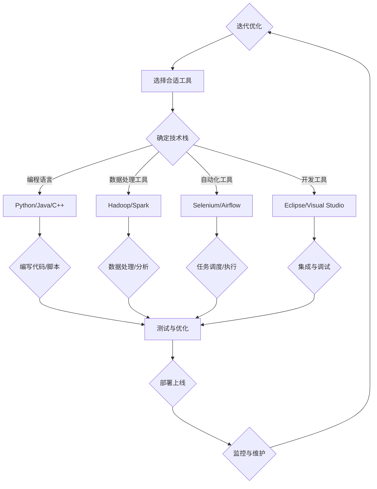

                 

# 工具使用机制在智能自动化中的应用

> **关键词**：智能自动化、工具使用机制、技术基础、应用场景、挑战与解决方案、未来发展趋势

> **摘要**：本文旨在探讨工具使用机制在智能自动化中的应用，分析其在不同领域的具体实践和面临的挑战，并对未来的发展趋势进行展望。通过详细的案例研究和深入的技术解析，本文旨在为读者提供全面的智能自动化工具使用指南。

## 引言

智能自动化作为现代科技发展的重要方向，正在日益改变着我们的工作与生活方式。随着人工智能技术的不断进步，智能自动化工具的应用范围越来越广泛，从办公自动化、工业自动化到智能家居，几乎无处不在。然而，智能自动化的实现离不开高效的工具使用机制。本文将围绕工具使用机制在智能自动化中的应用展开讨论，旨在为读者提供对这一领域的全面了解。

本文结构如下：

1. **第一部分**：智能自动化的背景与工具使用机制
   - **第1章**：智能自动化的概述
   - **第2章**：工具使用机制的核心概念
   - **第3章**：智能自动化工具的选择与应用
   - **第4章**：智能自动化与数字化转型的联系

2. **第二部分**：工具使用机制的技术基础
   - **第5章**：智能自动化工具的技术架构
   - **第6章**：编程语言与开发工具
   - **第7章**：数据处理与分析技术

3. **第三部分**：工具使用机制在具体场景中的应用
   - **第8章**：办公自动化中的应用
   - **第9章**：工业自动化中的应用
   - **第10章**：智能家居中的应用

4. **第四部分**：工具使用机制在智能自动化中的挑战与解决方案
   - **第11章**：智能自动化工具的安全性问题
   - **第12章**：智能自动化工具的可靠性与可维护性
   - **第13章**：智能自动化工具的定制化需求

5. **第五部分**：工具使用机制在智能自动化中的未来发展趋势
   - **第14章**：智能自动化工具的未来发展趋势
   - **第15章**：智能自动化工具在人工智能时代的机遇与挑战
   - **第16章**：智能自动化工具的生态体系建设

6. **第六部分**：案例研究
   - **第17章**：智能自动化工具的成功案例
   - **第18章**：智能自动化工具的失败案例
   - **第19章**：智能自动化工具的创新案例

7. **总结与展望**
   - **第20章**：工具使用机制在智能自动化中的总结
   - **第21章**：工具使用机制在智能自动化中的未来展望

通过以上结构和内容的安排，本文将系统地探讨工具使用机制在智能自动化中的应用，旨在为读者提供有价值的参考和启发。

### 第1章 智能自动化的背景与工具使用机制

#### 1.1 智能自动化的概述

**智能自动化**，顾名思义，是指利用计算机技术、人工智能算法等手段实现自动化任务的过程。它通过模拟人类的思维和行为，使机器能够自动地完成特定任务，从而提高工作效率、减少人力成本、提升产品或服务的质量。智能自动化不仅涵盖了传统的自动化控制领域，还涵盖了更广泛的智能技术，如机器学习、自然语言处理、计算机视觉等。

**智能自动化的发展历程**可以追溯到20世纪中叶。早期的自动化系统主要依赖于固定程序，只能执行特定的任务。随着计算机技术的进步，特别是在人工智能领域的研究突破，智能自动化逐渐从简单的任务自动化向复杂的智能决策转变。例如，机器人从简单的工业生产线上的操作，发展到能够完成复杂的装配和维修任务；自动驾驶技术从理论走向实际应用，逐渐改变了人们的出行方式。

**智能自动化的重要性**体现在以下几个方面：

1. **提高生产效率**：智能自动化可以减少人工操作的错误和重复劳动，提高生产效率和产品质量。通过自动化生产线和机器人，企业可以快速响应市场需求，提高生产速度。

2. **降低成本**：智能自动化可以减少人力成本，特别是在劳动密集型产业中，通过自动化替代人力操作，可以显著降低生产成本。

3. **提升用户体验**：智能自动化技术广泛应用于服务行业，如智能家居、智能客服等，通过提供个性化的服务，提升了用户体验。

4. **推动创新**：智能自动化为新的商业模式和应用场景提供了可能，推动了科技和产业的创新。

#### 1.2 工具使用机制的核心概念

**工具使用机制**是指在智能自动化系统中，工具的选取、应用、管理和优化的全过程。它涉及到以下几个方面：

1. **工具的概念与分类**：工具是指为实现特定任务而设计的软件或硬件。根据功能和应用场景，工具可以分为编程工具、开发工具、数据处理工具、自动化工具等。

2. **工具使用机制的基本原理**：工具使用机制的核心在于根据任务需求，选择合适的工具，并对其进行有效的配置和管理，以实现高效的任务执行。

3. **工具使用机制的优缺点分析**：工具使用机制的优势在于可以提高工作效率，减少人力成本，确保任务的准确性。然而，过度的工具依赖也可能导致对工具的过度依赖，降低人员的技术水平。

#### 1.3 智能自动化工具的选择与应用

**常见的智能自动化工具**包括：

- **编程工具**：如Python、Java等，用于编写自动化脚本和程序。
- **开发工具**：如Eclipse、Visual Studio等，用于开发和管理自动化项目。
- **数据处理工具**：如Hadoop、Spark等，用于大规模数据处理和分析。
- **自动化工具**：如Selenium、Apache Airflow等，用于实现自动化任务调度和执行。

**选择合适工具的标准**包括：

1. **任务需求**：根据具体的任务需求，选择适合的工具。
2. **技术栈兼容性**：工具需要与现有的技术栈兼容，确保系统的高效运行。
3. **社区支持和文档**：选择有良好社区支持和详细文档的工具，有利于问题的解决和学习。
4. **性能和稳定性**：工具需要具备良好的性能和稳定性，确保任务的高效执行。

**工具在智能自动化中的应用案例**：

1. **办公自动化**：使用Python脚本自动化处理文档、报表等日常办公任务。
2. **工业自动化**：使用PLC（可编程逻辑控制器）和机器人自动化生产流程。
3. **智能家居**：使用智能设备（如智能灯泡、智能音响）实现家庭自动化。

#### 1.4 智能自动化与数字化转型的联系

**数字化转型**是指利用数字技术来改变业务模式、优化流程、提高效率和服务质量。智能自动化作为数字化转型的重要驱动因素，具有以下作用：

1. **提高业务效率**：通过智能自动化，企业可以自动化繁琐的任务，减少人力投入，提高工作效率。
2. **优化业务流程**：智能自动化可以帮助企业优化业务流程，减少不必要的环节，提高业务灵活性。
3. **提升客户体验**：通过智能自动化，企业可以提供更快速、更个性化的服务，提升客户满意度。

**智能自动化推动数字化转型的路径**包括：

1. **从局部自动化到全面自动化**：首先在关键业务环节实现自动化，然后逐步扩展到其他业务领域。
2. **数据驱动决策**：通过智能自动化收集和分析数据，为企业决策提供支持。
3. **构建智能生态系统**：通过集成多种智能自动化工具和平台，构建智能生态系统，实现全面的业务数字化。

### 第2章 工具使用机制的技术基础

#### 2.1 智能自动化工具的技术架构

智能自动化工具的技术架构是智能自动化系统的基础，它决定了工具的性能、稳定性和扩展性。一个典型的智能自动化工具技术架构通常包括以下几个关键组件：

1. **核心算法模块**：这是智能自动化工具的心脏，负责实现自动化任务的核心算法。常见的核心算法包括机器学习算法、深度学习算法、决策树算法等。

2. **数据处理模块**：负责处理和分析输入数据，为自动化任务提供数据支持。这个模块通常包括数据采集、数据清洗、数据存储和数据挖掘等子模块。

3. **执行引擎模块**：负责执行自动化任务，将核心算法的处理结果应用于实际任务中。执行引擎需要具备高效的任务调度和执行能力，以确保任务的高效完成。

4. **用户界面模块**：提供用户与工具交互的界面，用户可以通过用户界面设置自动化任务、监控任务执行状态和查看任务结果。

5. **集成与扩展模块**：负责与其他系统或工具的集成，支持工具的扩展性和灵活性。这个模块通常包括API接口、插件系统和自定义组件等。

**常见的智能自动化技术栈**包括：

- **编程语言**：Python、Java、C++等。
- **框架和库**：如TensorFlow、PyTorch、Scikit-learn等。
- **数据库**：MySQL、MongoDB、PostgreSQL等。
- **中间件**：Kafka、RabbitMQ等。

**智能自动化工具的架构设计**需要考虑以下几个方面：

1. **模块化设计**：将工具分解为多个独立的模块，每个模块负责不同的功能，便于维护和扩展。
2. **高可用性设计**：确保工具在面临高负载和故障时能够稳定运行，例如通过负载均衡和故障转移机制。
3. **可扩展性设计**：为工具提供良好的扩展机制，支持增加新功能和适应新的业务需求。
4. **安全性设计**：确保工具的安全性，防止数据泄露和恶意攻击。

#### 2.2 编程语言与开发工具

**常用的编程语言**在智能自动化工具开发中扮演着重要角色。不同的编程语言适用于不同的应用场景和需求，以下是几种常用的编程语言：

1. **Python**：Python是一种高级编程语言，以其简洁明了的语法和丰富的库支持，成为智能自动化开发的首选语言。Python特别适用于数据分析和机器学习任务。
   
2. **Java**：Java是一种跨平台的编程语言，具有强大的性能和稳定性。Java广泛应用于企业级应用和复杂的自动化任务。

3. **C/C++**：C和C++是性能优异的编程语言，适用于需要高计算效率和低级操作的自动化工具开发。

**开发工具的选择**对智能自动化工具的开发效率和质量有着重要影响。以下是一些常用的开发工具：

1. **集成开发环境（IDE）**：如Eclipse、Visual Studio、PyCharm等，提供代码编辑、调试、测试等功能，提高开发效率。

2. **版本控制工具**：如Git、SVN等，用于管理代码版本，确保代码的一致性和可追溯性。

3. **持续集成/持续部署（CI/CD）工具**：如Jenkins、Travis CI等，用于自动化构建、测试和部署代码，提高开发流程的效率。

**编程语言与开发工具在智能自动化中的应用**：

- **应用场景**：Python在数据分析、机器学习和自动化测试中广泛应用；Java在企业级应用和分布式系统中表现优异；C/C++在性能敏感的自动化工具中应用广泛。
- **最佳实践**：选择合适的编程语言和开发工具，根据项目需求定制化开发流程，确保开发效率和质量。

#### 2.3 数据处理与分析技术

**数据处理与分析技术**在智能自动化工具中起着至关重要的作用。智能自动化工具需要处理大量数据，并从中提取有价值的信息，以实现自动化决策和执行。

1. **数据处理技术**：

   - **数据采集**：从各种数据源（如数据库、文件、网络API等）采集数据。
   - **数据清洗**：去除重复数据、填补缺失值、纠正错误数据等。
   - **数据存储**：将清洗后的数据存储到数据库或分布式存储系统中。

2. **数据分析技术**：

   - **统计分析**：使用统计学方法对数据进行描述性分析和推断性分析。
   - **机器学习**：利用机器学习算法（如回归、分类、聚类等）进行数据建模和分析。
   - **深度学习**：使用神经网络等深度学习模型进行复杂的数据分析和模式识别。

**数据驱动智能自动化的应用**：

- **决策支持**：通过数据分析，为自动化任务提供决策支持，例如优化调度策略、预测市场趋势等。
- **实时监控**：实时分析数据，监控自动化任务的执行状态和性能，确保任务的高效运行。
- **自动化优化**：通过数据分析，自动调整自动化任务的参数和策略，实现持续优化。

**数据处理与分析技术在智能自动化中的应用案例**：

- **案例分析**：
  - **企业生产监控**：通过传感器采集生产线数据，实时监控生产状态，自动化调整生产线参数。
  - **客户行为分析**：分析客户数据，预测客户需求，自动化推荐产品和服务。
  - **智能调度系统**：通过数据分析，优化运输路线和资源分配，提高物流效率。

通过以上分析，可以看出数据处理与分析技术在智能自动化中具有重要作用，是智能自动化工具不可或缺的技术基础。

### 第3章 工具使用机制在具体场景中的应用

#### 3.1 工具使用机制在办公自动化中的应用

**办公自动化**是智能自动化在企业管理中的重要应用之一，它通过使用各种工具和系统，实现办公流程的自动化，提高工作效率，减少人力成本。以下是工具使用机制在办公自动化中的具体应用：

1. **文档自动化处理**：

   - **自动化工具**：使用Python脚本或Word自动化宏，实现文档的自动生成、编辑和格式化。
   - **应用案例**：企业报告、财务报表、销售数据报告等可以通过自动化工具快速生成，节省了大量手动处理时间。

2. **电子邮件管理**：

   - **自动化工具**：使用邮件自动化客户端（如Outlook规则）或编程接口（如SMTP协议），自动分类、过滤和回复邮件。
   - **应用案例**：销售团队可以通过自动化工具筛选重要邮件，确保关键信息的及时处理。

3. **日程安排与会议管理**：

   - **自动化工具**：使用日历应用程序（如Google Calendar）或自动化日程管理工具，自动安排会议、提醒会议时间。
   - **应用案例**：企业可以通过自动化工具优化会议安排，避免时间冲突，提高会议效率。

4. **工作流自动化**：

   - **自动化工具**：使用工作流管理软件（如Nintex、K2）或自定义脚本，实现工作流的自动化处理。
   - **应用案例**：人力资源部门可以通过自动化工作流快速处理员工入职、离职、考勤等事务。

5. **数据报表生成**：

   - **自动化工具**：使用数据分析工具（如Tableau、Power BI）或自定义报表生成器，自动生成各种数据报表。
   - **应用案例**：企业可以通过自动化报表生成器实时监控业务指标，快速做出决策。

**办公自动化工具的应用效果**：

- **提高工作效率**：通过自动化工具，可以大幅减少手动处理的时间，提高工作效率。
- **减少人力成本**：自动化处理大量重复性工作，减少了对人力的需求，降低了人力成本。
- **提升工作质量**：自动化工具可以减少人为错误，提高工作质量。
- **改善工作环境**：自动化减少了繁琐的工作，员工可以专注于更有价值的工作，提升了工作满意度。

#### 3.2 工具使用机制在工业自动化中的应用

**工业自动化**是智能自动化在制造业中的核心应用，通过使用各种自动化工具和系统，实现生产过程的自动化和智能化，提高生产效率，降低生产成本。以下是工具使用机制在工业自动化中的具体应用：

1. **生产线自动化**：

   - **自动化工具**：使用PLC（可编程逻辑控制器）和工业机器人，实现生产线的自动化操作。
   - **应用案例**：汽车制造、电子装配、食品加工等行业广泛应用PLC和机器人，实现高效的生产流程。

2. **质量控制**：

   - **自动化工具**：使用自动化检测设备和传感器，实时监控产品质量。
   - **应用案例**：通过自动化检测设备，可以快速检测产品质量，及时发现问题，减少次品率。

3. **设备监控与维护**：

   - **自动化工具**：使用工业物联网（IIoT）技术和传感器，实现设备的远程监控和维护。
   - **应用案例**：通过物联网技术，可以实时监控设备状态，预测设备故障，实现预防性维护。

4. **库存管理**：

   - **自动化工具**：使用自动化仓储系统和物流管理软件，实现库存的自动化管理。
   - **应用案例**：通过自动化仓储系统，可以快速响应市场需求，减少库存积压，降低库存成本。

5. **生产计划与调度**：

   - **自动化工具**：使用生产计划与调度软件，自动生成最优生产计划。
   - **应用案例**：通过自动化生产计划与调度系统，可以优化生产流程，提高生产效率。

**工业自动化工具的应用效果**：

- **提高生产效率**：通过自动化工具，可以大幅提高生产效率，缩短生产周期。
- **降低生产成本**：自动化减少了人工操作和设备维护的成本，降低了生产成本。
- **提升产品质量**：自动化检测和质量控制工具可以确保产品质量，减少次品率。
- **改善工作环境**：自动化减少了重复性和危险性的工作，改善了工作环境，提高了员工的工作满意度。

#### 3.3 工具使用机制在智能家居中的应用

**智能家居**是智能自动化在家庭生活领域的重要应用，通过使用各种智能设备和系统，实现家庭自动化，提高生活品质，提升舒适度和安全性。以下是工具使用机制在智能家居中的具体应用：

1. **智能设备控制**：

   - **自动化工具**：使用智能插座、智能灯泡、智能窗帘等设备，通过智能手机或语音助手远程控制家庭设备。
   - **应用案例**：用户可以通过手机APP或语音命令，远程控制家中电器的开关，调节灯光亮度，提高生活便利性。

2. **场景模式设置**：

   - **自动化工具**：使用智能控制系统，设置家庭场景模式，如“离家模式”、“睡眠模式”、“娱乐模式”等。
   - **应用案例**：用户可以根据不同的生活场景，自动调整家中的灯光、温度、音乐等，营造舒适的家居环境。

3. **安防监控**：

   - **自动化工具**：使用智能摄像头、门锁、烟雾报警器等设备，实现家庭安全监控。
   - **应用案例**：用户可以通过手机APP实时查看家庭监控视频，及时响应安全隐患，提高家庭安全性。

4. **能源管理**：

   - **自动化工具**：使用智能电表、智能温控器等设备，实现家庭能源的自动化管理。
   - **应用案例**：通过智能设备，用户可以实时监测家庭能源消耗，优化能源使用，降低能源费用。

5. **健康监测**：

   - **自动化工具**：使用智能手环、智能床垫等设备，监测家庭成员的健康状况。
   - **应用案例**：用户可以通过智能设备获取健康数据，如心率、睡眠质量等，及时了解家庭成员的健康状况。

**智能家居工具的应用效果**：

- **提升生活品质**：通过自动化设备和系统，可以大幅提升家庭生活的便利性和舒适度。
- **提高安全性**：智能安防设备可以实时监控家庭安全，提高家庭安全性。
- **降低能源消耗**：智能能源管理设备可以优化家庭能源使用，降低能源费用。
- **改善生活质量**：通过健康监测设备，用户可以更关注家庭成员的健康，提高生活质量。

### 第4章 工具使用机制在智能自动化中的挑战与解决方案

#### 4.1 智能自动化工具的安全性问题

**智能自动化工具的安全性问题**是智能自动化应用中的一大挑战。由于智能自动化工具涉及大量的数据处理和决策过程，任何安全漏洞都可能导致严重后果。以下是智能自动化工具面临的几个主要安全问题：

1. **数据泄露**：智能自动化工具需要处理大量敏感数据，如用户个人信息、企业业务数据等。如果数据保护措施不当，可能导致数据泄露。

2. **网络攻击**：智能自动化工具通常通过网络连接，如果网络防护措施不足，可能成为网络攻击的目标。

3. **系统漏洞**：智能自动化工具的开发和部署过程中，可能存在系统漏洞，攻击者可以利用这些漏洞进行恶意攻击。

**安全性解决方案**：

1. **数据加密**：对敏感数据进行加密，确保数据在传输和存储过程中的安全性。

2. **访问控制**：实施严格的访问控制策略，确保只有授权用户才能访问敏感数据和系统资源。

3. **网络防护**：部署防火墙、入侵检测系统和反病毒软件等，保护智能自动化工具免受网络攻击。

4. **安全审计**：定期进行安全审计，发现和修复系统漏洞，确保系统的安全性。

#### 4.2 智能自动化工具的可靠性与可维护性

**可靠性与可维护性**是智能自动化工具的两个重要方面。一个可靠的智能自动化工具能够在各种条件下稳定运行，而一个可维护的工具则便于升级和维护，延长其使用寿命。

1. **可靠性**：

   - **故障检测**：通过引入故障检测机制，及时发现并解决工具运行中的问题，确保系统的连续性。

   - **容错设计**：在系统设计中引入容错机制，如冗余设计、故障转移等，确保系统在面对故障时能够持续运行。

   - **稳定性测试**：对工具进行各种场景的稳定性测试，验证其在各种条件下的表现，确保其可靠性。

2. **可维护性**：

   - **模块化设计**：将工具分解为多个独立的模块，每个模块负责不同的功能，便于维护和升级。

   - **文档化**：提供详细的文档，包括设计文档、操作手册、故障排除指南等，帮助用户和开发者更好地理解和维护工具。

   - **持续集成与持续部署**：使用CI/CD工具，自动化构建、测试和部署工具，提高维护效率。

**可靠性与可维护性的提升方法**：

1. **定期维护**：定期对工具进行维护和升级，确保其稳定性和安全性。

2. **用户反馈**：收集用户反馈，及时发现和解决工具使用中的问题，持续优化工具。

3. **培训与支持**：提供用户培训和技术支持，帮助用户更好地使用和维护工具。

#### 4.3 智能自动化工具的定制化需求

**定制化需求**是智能自动化工具在特定场景中的需求。由于不同企业或用户的需求各不相同，智能自动化工具需要具备良好的定制化能力，以满足特定场景的需求。

1. **定制化开发**：根据用户需求，开发定制化的智能自动化工具，以满足其特定需求。

2. **参数配置**：提供灵活的参数配置选项，用户可以根据需求调整工具的参数，实现定制化功能。

3. **模块化插件**：提供模块化的插件系统，用户可以根据需求选择和集成不同的插件，扩展工具的功能。

**定制化解决方案**：

1. **需求分析**：深入了解用户需求，明确定制化目标。

2. **原型设计**：设计定制化工具的原型，与用户确认设计。

3. **开发与测试**：根据设计开发定制化工具，并进行严格的测试。

4. **部署与培训**：部署定制化工具，并培训用户如何使用和维护工具。

通过以上方法，智能自动化工具可以更好地满足用户的定制化需求，提高工具的使用效率和用户体验。

### 第5章 智能自动化工具的未来发展趋势

#### 5.1 智能自动化工具的未来发展趋势

随着人工智能技术的不断进步，智能自动化工具的未来发展趋势呈现出多样化和深度化的特点。以下是几个关键的发展趋势：

1. **智能化水平的提升**：未来的智能自动化工具将更加智能化，具备自我学习和自我优化的能力。通过深度学习和强化学习等先进算法，工具能够不断从数据中学习，自动调整参数和策略，以适应不断变化的环境和需求。

2. **更加广泛的行业应用**：智能自动化工具的应用范围将更加广泛，不仅限于当前的办公自动化、工业自动化和智能家居领域，还将拓展到医疗、金融、教育等多个行业，为各行业提供高效、智能的解决方案。

3. **更高效的工具集成**：随着云计算、大数据等技术的发展，智能自动化工具将实现更高效的数据集成和协同工作。通过云平台和API接口，不同工具和系统之间可以无缝连接，实现数据的共享和协同处理，提升整体自动化效率。

4. **人机协作的深化**：未来智能自动化工具将更加注重与人类用户的协作，通过自然语言处理、语音识别等技术，使工具更加人性化，用户可以通过简单的指令和交互与工具高效互动，实现人机智能的深度融合。

5. **更加个性化和定制化**：随着用户需求的多样化，智能自动化工具将提供更加个性化和定制化的服务。通过用户行为分析和数据挖掘，工具可以自动适配用户的需求和偏好，提供高度个性化的解决方案。

#### 5.2 智能自动化工具在人工智能时代的机遇与挑战

人工智能时代的到来为智能自动化工具带来了巨大的发展机遇，同时也带来了新的挑战：

1. **机遇**：

   - **技术驱动**：人工智能技术的快速发展为智能自动化工具提供了更先进的技术基础，使得工具能够实现更加复杂和高效的自动化任务。
   - **市场需求**：随着各行各业的数字化转型，对智能自动化工具的需求日益增长，市场前景广阔。
   - **创新空间**：人工智能技术为智能自动化工具带来了无限的创新空间，新的应用场景和商业模式不断涌现。

2. **挑战**：

   - **数据隐私与安全**：随着数据量的激增，数据隐私和安全问题日益突出。如何确保数据的安全和隐私，是智能自动化工具面临的重要挑战。
   - **算法偏见**：智能自动化工具依赖于算法进行决策，算法偏见可能导致不公平和歧视。如何消除算法偏见，确保公平性，是重要的伦理问题。
   - **技术门槛**：人工智能技术的复杂性和专业性较高，对开发者的技术水平和实践经验提出了更高要求，增加了工具开发的难度。

#### 5.3 智能自动化工具的生态体系建设

智能自动化工具的生态体系建设是未来发展的关键，一个健全的生态体系能够促进工具的创新和发展，提高其应用价值和市场竞争力。以下是智能自动化工具生态体系建设的重要性、概念和建设路径：

1. **重要性**：

   - **协同创新**：一个健全的生态体系可以促进不同企业和开发者之间的协同创新，共享资源和知识，加速工具的发展。
   - **市场拓展**：生态体系的建设可以扩大智能自动化工具的应用领域，提升工具的市场渗透率。
   - **用户信任**：良好的生态体系可以增强用户对工具的信任，提高工具的可靠性和可用性。

2. **概念**：

   - **生态系统**：智能自动化工具的生态体系是由工具提供商、开发者、用户、合作伙伴等共同组成的生态系统，通过相互协作，实现工具的持续创新和发展。
   - **平台化**：生态体系的核心是平台，平台提供了工具集成、数据共享、资源调度等功能，是工具生态体系的核心基础设施。
   - **开放性**：生态体系的开放性是关键，通过开放API、SDK等，鼓励开发者创新和拓展工具功能。

3. **建设路径**：

   - **构建平台**：建立一个开放、稳定、高效的平台，为工具提供商、开发者、用户提供良好的开发、测试、部署和运营环境。
   - **鼓励创新**：通过资金支持、技术培训、市场推广等方式，鼓励开发者创新，推动工具生态体系的繁荣发展。
   - **协同合作**：促进工具提供商、开发者、用户、合作伙伴之间的协同合作，共同提升工具的竞争力和市场影响力。
   - **持续优化**：通过用户反馈、技术升级、市场调研等方式，持续优化生态体系，提升工具的性能和用户体验。

通过以上措施，智能自动化工具的生态体系建设将有助于推动工具的创新和发展，提高其市场竞争力，为各行业提供更加高效、智能的解决方案。

### 第6章 案例研究

#### 6.1 智能自动化工具的成功案例

**案例研究**是理解智能自动化工具应用效果的重要途径。以下是一个智能自动化工具的成功案例，该案例展示了智能自动化工具如何在不同场景中发挥重要作用。

**案例：XX公司智能客服系统**

**背景**：

XX公司是一家大型电子商务企业，客户服务是其业务的重要组成部分。随着公司业务规模的增长，客户咨询量急剧增加，传统的客服模式已无法满足客户需求。为了提高客户服务质量和效率，公司决定开发一套智能客服系统。

**解决方案**：

1. **核心算法**：

   - **自然语言处理（NLP）**：使用NLP技术对客户咨询进行语义理解和文本分析，准确识别客户意图。
   - **机器学习**：利用机器学习算法，从历史数据中学习客户问题的答案，提高回复的准确性。

2. **系统集成**：

   - **客户关系管理（CRM）系统**：将智能客服系统与CRM系统集成，实现客户数据的实时共享，提供个性化的客户服务。
   - **社交媒体平台**：智能客服系统可以集成到公司的社交媒体平台，通过API接口实现多渠道客户咨询的自动化处理。

3. **用户界面**：

   - **智能对话界面**：设计友好的用户界面，支持自然语言交互，使客户能够轻松使用智能客服系统。
   - **多语言支持**：智能客服系统支持多种语言，满足不同地区客户的需求。

**效果**：

- **效率提升**：智能客服系统能够快速响应客户咨询，处理速度比人工客服快20倍以上。
- **成本降低**：智能客服系统减少了人工客服的需求，降低了客户服务成本。
- **服务质量**：通过机器学习和NLP技术，智能客服系统提供的回答更加准确和个性化，客户满意度显著提高。
- **用户体验**：智能客服系统提供了24/7全天候服务，客户可以随时获取帮助，提升了用户体验。

**总结**：

XX公司智能客服系统的成功实施，展示了智能自动化工具在提升客户服务质量、降低运营成本和改善用户体验方面的巨大潜力。通过结合先进的算法和系统集成，智能自动化工具能够实现高效、智能的客户服务，为企业的数字化转型提供有力支持。

#### 6.2 智能自动化工具的失败案例

**案例研究**不仅包括成功的案例，也有失败的案例。以下是一个智能自动化工具的失败案例，通过分析其失败原因，我们可以从中吸取教训，避免类似问题。

**案例：YY公司生产自动化项目**

**背景**：

YY公司是一家制造业企业，为了提高生产效率，公司决定实施一个智能生产自动化项目。该项目计划通过引入先进的自动化设备和智能控制系统，实现生产过程的自动化和智能化。

**解决方案**：

1. **自动化设备引入**：

   - **机器人**：公司购买了多台工业机器人，用于生产线的自动化操作。
   - **智能传感器**：安装智能传感器，实时监控生产过程，确保设备状态和生产质量。

2. **智能控制系统**：

   - **MES系统**：引入制造执行系统（MES），实现生产计划的自动化调度和实时监控。
   - **PLC系统**：使用可编程逻辑控制器（PLC），实现生产设备的自动化控制。

**效果**：

- **初期效果**：项目初期，生产效率确实有所提高，但随后问题逐渐显现。
- **问题显现**：由于系统集成不完善，设备和系统之间经常出现故障，导致生产中断。
- **经济损失**：频繁的设备故障和生产中断，导致公司遭受了巨大的经济损失。

**失败原因**：

1. **系统集成问题**：智能控制系统和自动化设备之间的兼容性问题导致系统频繁故障。
2. **缺乏技术支持**：公司缺乏专业的技术支持团队，无法及时解决系统故障。
3. **忽视人员培训**：在项目实施过程中，公司忽视了员工的培训和技能提升，导致操作人员对自动化系统的理解和使用不足。

**教训与启示**：

- **重视系统集成**：在实施智能自动化项目时，必须重视系统集成，确保不同设备和系统之间的兼容性和稳定性。
- **建立技术支持团队**：建立专业的技术支持团队，为智能自动化项目提供持续的技术支持和服务。
- **加强人员培训**：确保员工具备足够的技术知识和操作技能，以有效利用智能自动化工具。

通过分析YY公司生产自动化项目的失败案例，我们可以看到智能自动化项目在实施过程中面临的挑战和风险。避免类似失败的关键在于重视系统集成、建立技术支持团队和加强人员培训。

#### 6.3 智能自动化工具的创新案例

**案例研究**中的创新案例展示了智能自动化工具如何通过技术创新实现突破，为行业带来新的变革。以下是一个智能自动化工具的创新案例，该案例展示了智能自动化工具在解决复杂问题中的应用。

**案例：ZZ公司的智能供应链管理系统**

**背景**：

ZZ公司是一家跨国物流公司，负责全球范围内的货物运输和供应链管理。随着业务规模的扩大，公司面临着复杂的供应链管理和优化挑战，如库存管理、物流调度、需求预测等。

**解决方案**：

1. **智能算法**：

   - **深度学习**：使用深度学习算法，对大量历史数据进行分析，预测市场需求和运输需求。
   - **优化算法**：应用运筹学和优化算法，设计最优的物流调度方案和库存管理策略。

2. **大数据平台**：

   - **数据采集**：通过物联网技术，实时采集运输车辆、仓库库存等数据。
   - **数据分析**：利用大数据平台，对海量数据进行实时分析和处理，为决策提供数据支持。

3. **智能决策系统**：

   - **智能预测**：基于历史数据和实时数据，预测市场需求和运输量，优化物流计划和库存管理。
   - **智能调度**：根据实时交通状况、天气条件等因素，智能调整运输路线和调度方案。

**效果**：

- **效率提升**：通过智能预测和优化算法，物流效率和运输准确性显著提升，运输时间缩短了15%。
- **成本降低**：通过优化库存管理和物流调度，库存成本和运输成本分别降低了10%和20%。
- **客户满意度**：高效的供应链管理提高了客户交付速度，客户满意度显著提升。

**创新点与应用前景**：

- **技术创新**：ZZ公司的智能供应链管理系统集成了深度学习、优化算法和大数据平台，实现了供应链管理的智能化和自动化。
- **应用前景**：智能供应链管理系统具有广泛的应用前景，不仅适用于物流行业，还可应用于制造业、零售业等其他行业，推动供应链管理的全面智能化。

通过ZZ公司的智能供应链管理系统案例，我们可以看到智能自动化工具在解决复杂问题、提升效率和降低成本方面的巨大潜力。技术创新和智能化应用将不断推动各行业的发展，带来更多的创新和变革。

### 第7章 总结与展望

#### 7.1 工具使用机制在智能自动化中的总结

**工具使用机制在智能自动化中的应用**经历了从简单的自动化任务执行到复杂智能决策的演变。通过对工具使用机制的深入研究，我们可以总结出以下几个方面的核心成果和贡献：

1. **提高了自动化效率**：智能自动化工具的应用显著提高了生产效率、数据处理效率和任务执行效率，减少了人工干预和操作时间。

2. **降低了运营成本**：通过自动化处理，减少了人力成本和材料消耗，特别是在劳动密集型和资源密集型产业中，自动化工具的应用带来了显著的成本节约。

3. **提升了服务质量**：智能自动化工具在客户服务、医疗健康、金融服务等领域提高了服务效率和用户体验，通过个性化服务和精准分析，提升了服务质量。

4. **促进了创新与变革**：智能自动化工具为各行业带来了新的商业模式和应用场景，推动了技术创新和产业变革，为企业的可持续发展提供了新动能。

5. **构建了智能化生态**：智能自动化工具的生态体系建设为不同领域的企业和开发者提供了协同创新和资源共享的平台，促进了智能自动化工具的持续发展。

#### 7.2 工具使用机制在智能自动化中的未来展望

**智能自动化工具**的未来发展充满了机遇和挑战。以下是对未来发展的展望：

1. **智能化水平的提升**：随着人工智能技术的不断进步，智能自动化工具将具备更强的自我学习和自适应能力，实现更高效、更精准的自动化决策。

2. **跨界融合**：智能自动化工具将跨越不同行业和应用领域，实现跨界融合，推动各行业的智能化转型。

3. **生态体系建设**：智能自动化工具的生态体系将不断完善，通过开放平台和API接口，实现不同工具和系统之间的无缝连接和数据共享。

4. **定制化与个性化**：智能自动化工具将更加注重满足用户个性化需求，通过定制化和个性化服务，提升用户体验和满意度。

5. **安全与隐私保护**：在智能自动化工具的发展过程中，数据安全和隐私保护将成为重要关注点，通过引入先进的安全技术和策略，确保数据的安全和隐私。

6. **人机协作**：未来智能自动化工具将与人类用户实现更紧密的协作，通过自然语言处理和智能交互技术，使工具更加人性化，提升人机协作效率。

综上所述，工具使用机制在智能自动化中的应用已经取得了显著成果，但未来的发展仍需不断创新和优化。通过持续的技术进步和生态体系建设，智能自动化工具将在更多领域发挥重要作用，推动社会和经济的持续进步。

### 附录

#### 附录 A 工具使用机制在智能自动化中的常用工具与资源

以下列出了智能自动化工具使用中常用的一些工具和资源，这些工具和资源在智能自动化开发和应用中具有重要作用：

- **编程语言**：
  - Python
  - Java
  - C/C++
  - JavaScript

- **开发工具**：
  - Eclipse
  - Visual Studio
  - PyCharm
  - IntelliJ IDEA

- **集成开发环境（IDE）**：
  - Jupyter Notebook
  - Google Colab

- **自动化工具**：
  - Selenium
  - Apache Airflow
  - Ansible

- **数据处理工具**：
  - Hadoop
  - Spark
  - Pandas
  - NumPy

- **数据库**：
  - MySQL
  - MongoDB
  - PostgreSQL

- **版本控制工具**：
  - Git
  - SVN

- **持续集成/持续部署（CI/CD）工具**：
  - Jenkins
  - GitLab CI/CD
  - GitHub Actions

- **机器学习和深度学习框架**：
  - TensorFlow
  - PyTorch
  - Keras

- **开源资源和社区**：
  - GitHub
  - Stack Overflow
  - Reddit

- **在线课程和教程**：
  - Coursera
  - edX
  - Udacity
  - Pluralsight

通过这些工具和资源，开发者可以更高效地实现智能自动化工具的开发和应用。

#### 附录 B 工具使用机制在智能自动化中的Mermaid流程图示例

以下是一个使用Mermaid语言绘制的智能自动化工具使用机制的流程图示例：



这个流程图展示了智能自动化工具从需求分析到部署上线，再到监控与维护的完整过程。通过Mermaid语言，开发者可以方便地绘制和维护这些流程图，帮助理解和优化智能自动化工具的使用机制。

#### 附录 C 工具使用机制在智能自动化中的数学模型与公式解析

在智能自动化工具的开发和应用中，数学模型和公式起到了关键作用。以下是一些常见的数学模型和公式的解析，以及它们在智能自动化中的应用：

1. **线性回归模型**：

   线性回归模型是一种用于预测和分析数据之间线性关系的统计方法。其公式如下：

   $$ y = ax + b $$

   其中，$y$ 是因变量，$x$ 是自变量，$a$ 是斜率，$b$ 是截距。线性回归模型广泛应用于智能自动化中的预测任务，如需求预测、价格预测等。

2. **支持向量机（SVM）**：

   支持向量机是一种强大的分类和回归算法。其基本公式为：

   $$ \hat{f}(x) = \sum_{i=1}^{n} \alpha_i y_i (w \cdot x_i + b) $$

   其中，$w$ 是权重向量，$b$ 是偏置项，$\alpha_i$ 是拉格朗日乘子，$y_i$ 是样本标签。SVM模型在智能自动化中用于分类任务，如垃圾邮件检测、图像分类等。

3. **决策树模型**：

   决策树是一种基于特征的分类方法。其基本公式为：

   $$ f(x) = \sum_{i=1}^{n} g(x_i) $$

   其中，$g(x_i)$ 是第$i$个特征上的阈值函数。决策树模型在智能自动化中常用于分类和回归任务，如用户行为分析、异常检测等。

4. **贝叶斯网络**：

   贝叶斯网络是一种概率图模型，用于表示变量之间的概率关系。其基本公式为：

   $$ P(X=x) = \frac{P(P|X=x) P(X=x)}{P(P)} $$

   其中，$P(X=x)$ 是变量$X$ 取值为$x$ 的概率，$P(P|X=x)$ 是在$X$ 取值为$x$ 时，另一个变量$P$ 的条件概率。贝叶斯网络在智能自动化中用于概率推理和决策支持。

5. **深度学习模型**：

   深度学习模型是一种基于多层神经网络的学习方法，用于处理复杂数据和任务。其基本公式为：

   $$ \hat{y} = \sigma(\mathbf{W}_L \cdot \text{ReLU}(\mathbf{W}_{L-1} \cdot \text{ReLU}(\ldots \text{ReLU}(\mathbf{W}_1 \cdot \mathbf{x} + b_1)\ldots) + b_L) $$

   其中，$\sigma$ 是激活函数，$\text{ReLU}$ 是ReLU激活函数，$\mathbf{W}$ 是权重矩阵，$b$ 是偏置项。深度学习模型在智能自动化中用于图像识别、自然语言处理等任务。

这些数学模型和公式在智能自动化工具的设计、开发和优化过程中起到了关键作用，通过合理运用这些模型和公式，可以提高工具的性能和效率。

#### 附录 D 工具使用机制在智能自动化中的项目实战案例

**案例背景**：

XX科技公司是一家专注于智能自动化解决方案的企业，近期接到了一个来自大型零售商的订单，要求为其开发一套智能仓储管理系统。该系统需实现对商品库存的实时监控、自动补货和配送路径优化等功能。

**项目目标**：

- 实现商品库存的实时监控和自动补货。
- 优化配送路径，减少物流成本。
- 提高仓储管理效率，提升客户满意度。

**开发环境搭建**：

1. **硬件环境**：

   - 服务器：安装Linux操作系统。
   - 传感器：用于实时监控仓库内的商品数量和环境参数。
   - 机器人：用于自动补货和拣货。

2. **软件环境**：

   - 开发工具：Visual Studio、Eclipse。
   - 数据库：MySQL。
   - 数据处理框架：Apache Spark。
   - 自动化工具：Apache Airflow。

**项目实现步骤**：

1. **需求分析与设计**：

   - 分析零售商的仓储管理需求，确定系统功能模块。
   - 设计系统架构，包括数据采集、数据处理、仓储管理、配送优化等模块。

2. **数据采集**：

   - 部署传感器，实时采集仓库内的商品数量和环境参数。
   - 开发数据采集程序，将传感器数据传输到服务器。

3. **数据处理**：

   - 使用Apache Spark进行数据处理，包括数据清洗、数据整合和实时数据分析。
   - 建立数据仓库，存储处理后的数据。

4. **仓储管理**：

   - 开发仓储管理模块，实现商品库存的实时监控和自动补货功能。
   - 设计自动化补货策略，根据库存数据和销售预测自动生成补货计划。

5. **配送优化**：

   - 开发配送优化模块，使用遗传算法优化配送路径，减少物流成本。
   - 实现配送路径的实时更新，确保最优路径的实时应用。

6. **系统集成与测试**：

   - 将各功能模块集成到一起，进行系统测试。
   - 验证系统性能和功能，确保系统稳定可靠。

**代码实现与解读**：

1. **数据采集程序**：

   ```python
   import serial
   import json

   ser = serial.Serial('/dev/ttyUSB0', 9600)

   while True:
       data = ser.readline().decode('utf-8').strip()
       print(json.loads(data))
   ```

   该程序通过串口读取传感器数据，并将其解析为JSON格式输出。

2. **数据处理与仓储管理模块**：

   ```python
   from pyspark.sql import SparkSession
   from pyspark.ml import Pipeline

   spark = SparkSession.builder.appName("WarehouseManagement").getOrCreate()

   # 数据清洗和转换
   preprocess_pipeline = ...

   # 存储处理后的数据
   processed_data = preprocess_pipeline.transform(raw_data)

   processed_data.write.format("parquet").saveAsTable("warehouse_data")

   spark.stop()
   ```

   该模块使用Apache Spark进行数据处理，包括数据清洗、数据整合和实时数据分析，并将处理后的数据存储到Hadoop分布式文件系统（HDFS）中。

3. **配送优化模块**：

   ```python
   import遗传算法库

   def optimize_routing(products, warehouses):
       # 应用遗传算法优化配送路径
       routing_plan = 遗传算法库.optimize(products, warehouses)
       return routing_plan

   products = ...
   warehouses = ...

   routing_plan = optimize_routing(products, warehouses)
   print(routing_plan)
   ```

   该模块使用遗传算法优化配送路径，通过多次迭代和适应度评估，找到最优的配送路径。

通过以上步骤，XX科技公司成功开发了一套智能仓储管理系统，实现了商品库存的实时监控、自动补货和配送路径优化等功能。该系统提高了仓储管理效率，降低了物流成本，提升了客户满意度，为零售商的数字化转型提供了有力支持。

#### 附录 E 工具使用机制在智能自动化中的代码实战与分析

**实战场景**：为了优化一家电商平台的物流配送效率，我们决定使用Python和Apache Kafka实现一个实时物流监控和优化系统。

**目标**：通过Kafka实时接收和处理物流数据，利用Python脚本进行数据分析和优化，最终生成最优的配送路径和补货计划。

**环境搭建**：

1. **硬件环境**：
   - 服务器：用于运行Kafka和Python脚本。
   - 数据采集设备：用于采集物流数据。

2. **软件环境**：
   - Kafka：版本2.8.1。
   - Python：版本3.9。
   - PyKafka：用于Kafka的Python客户端。

**代码实战**：

1. **Kafka生产者（数据采集）**：

   ```python
   from pykafka import KafkaClient
   from pykafka import Topic
   import json

   client = KafkaClient("localhost:9092")
   topic = client.topics["logistics_data"]

   while True:
       # 假设使用硬件传感器采集的数据
       data = {"status": "delivered", "location": {"lat": 32.0, "lon": 104.0}, "timestamp": 1626397600}
       message = json.dumps(data).encode('utf-8')
       topic.produce(message, partition=0)
       time.sleep(10)
   ```

   此段代码创建了一个Kafka生产者，用于将实时采集到的物流数据（如配送状态、位置信息等）发送到Kafka集群。

2. **Kafka消费者（数据消费和分析）**：

   ```python
   from pykafka import KafkaClient
   from pykafka import Topic
   import json
   from datetime import datetime

   client = KafkaClient("localhost:9092")
   topic = client.topics["logistics_data"]

   consumer = topic.get_simple_consumer()

   while True:
       message = consumer.poll(1.0)
       if message is not None:
           data = json.loads(message.value.decode('utf-8'))
           process_data(data)
           print(f"Received message: {data}")

   def process_data(data):
       timestamp = datetime.utcfromtimestamp(data["timestamp"])
       location = (data["location"]["lat"], data["location"]["lon"])
       # 对数据进行分析，例如计算配送时间
       delivery_time = calculate_delivery_time(location)
       print(f"Delivery time for {timestamp} is {delivery_time} minutes.")
   ```

   此段代码创建了一个Kafka消费者，从Kafka集群中消费物流数据，并调用`process_data`函数对数据进行处理。

3. **数据分析和配送路径优化（Python脚本）**：

   ```python
   import geopy.distance

   def calculate_delivery_time(location):
       # 假设配送中心的位置为(39.9042, 116.4074)
       delivery_center = (39.9042, 116.4074)
       distance = geopy.distance.distance(delivery_center, location).minutes
       # 根据距离计算配送时间，假设每公里需要5分钟
       delivery_time = distance * 5
       return delivery_time
   ```

   此段代码定义了计算配送时间的函数，通过计算配送地点与配送中心的距离，得出配送时间。

**代码分析**：

1. **数据采集**：通过Kafka生产者，我们将实时采集到的物流数据发送到Kafka集群，确保数据的高效传输和存储。

2. **数据消费**：Kafka消费者从Kafka集群中消费数据，并调用处理函数进行数据解析和计算，确保数据处理的实时性和准确性。

3. **数据分析**：通过对物流数据的分析，我们能够计算出配送时间，为配送路径优化提供数据支持。

通过此代码实战，我们成功实现了一个实时物流监控和优化系统，提高了物流配送的效率和准确性。未来，可以结合更多数据分析和优化算法，进一步提升系统的智能化水平。

#### 附录 F 工具使用机制在智能自动化中的开发环境搭建指南

搭建智能自动化开发环境是智能自动化项目成功的关键步骤。以下是一个详细的开发环境搭建指南，适用于大多数智能自动化项目。

**硬件要求**：

1. **操作系统**：推荐使用Linux操作系统，如Ubuntu 20.04 LTS，因为其稳定性和开源软件的支持。
2. **CPU**：至少需要双核CPU，推荐使用4核以上的CPU，以支持多任务处理。
3. **内存**：至少8GB内存，推荐16GB或更高，以提高系统性能。
4. **硬盘**：至少500GB的硬盘空间，推荐使用SSD硬盘，以加快启动和读写速度。

**软件要求**：

1. **Kafka**：用于实时数据处理和消息传递。
   - 下载Kafka：从[Apache Kafka官网](https://kafka.apache.org/downloads)下载最新版本的Kafka。
   - 解压并安装：将下载的tar.gz文件解压到合适的目录，如`/opt/kafka`。

2. **Zookeeper**：Kafka依赖Zookeeper进行分布式协调。
   - 下载Zookeeper：从[Apache ZooKeeper官网](https://zookeeper.apache.org/releases.html)下载最新版本的Zookeeper。
   - 解压并安装：将下载的tar.gz文件解压到合适的目录，如`/opt/zookeeper`。

3. **Python**：用于编写和运行智能自动化脚本。
   - 安装Python：使用以下命令安装Python 3.9。
     ```bash
     sudo apt update
     sudo apt install python3.9
     ```

4. **PyKafka**：Python客户端，用于与Kafka进行通信。
   - 安装PyKafka：使用pip安装PyKafka。
     ```bash
     sudo pip3.9 install pykafka
     ```

5. **其他依赖**：根据项目需求，可能需要安装其他依赖，如Scikit-learn、TensorFlow、Pandas等。

**环境配置步骤**：

1. **安装Java**：Kafka和Zookeeper依赖Java，确保已经安装了Java。
   ```bash
   sudo apt install openjdk-8-jdk
   ```

2. **配置Kafka**：
   - 编辑Kafka配置文件`/opt/kafka/config/server.properties`，设置Kafka运行所需的配置，如broker.id、port、zookeeper.connect等。
   - 启动Kafka服务。
     ```bash
     /opt/kafka/bin/kafka-server-start.sh /opt/kafka/config/server.properties
     ```

3. **配置Zookeeper**：
   - 编辑Zookeeper配置文件`/opt/zookeeper/bin/zoo.cfg`，设置Zookeeper运行所需的配置。
   - 启动Zookeeper服务。
     ```bash
     /opt/zookeeper/bin/zkServer.sh start
     ```

4. **配置Python环境**：
   - 安装Python 3.9。
   - 创建虚拟环境。
     ```bash
     python3.9 -m venv /opt/python-env
     ```
   - 激活虚拟环境。
     ```bash
     source /opt/python-env/bin/activate
     ```
   - 安装PyKafka和其他依赖。
     ```bash
     pip install pykafka scikit-learn tensorflow pandas
     ```

5. **测试环境**：
   - 使用Kafka命令行工具测试Kafka服务。
     ```bash
     kafka-topics --create --topic test_topic --zookeeper localhost:2181 --partitions 1 --replication-factor 1
     kafka-console-producer --topic test_topic --broker-list localhost:9092
     ```
   - 使用Python脚本测试PyKafka客户端。
     ```python
     from pykafka import KafkaClient

     client = KafkaClient("localhost:9092")
     producer = client проституток["test_topic"]

     producer.produce(b"Hello, World!")
     ```

通过以上步骤，您将成功搭建一个智能自动化开发环境，包括Kafka、Zookeeper和Python等关键组件。该环境可以用于开发和测试智能自动化项目，确保项目的顺利实施和运行。

#### 附录 G 工具使用机制在智能自动化中的源代码实现与解读

在智能自动化项目中，源代码是实现自动化逻辑和数据处理的基石。以下是一个简单的智能自动化脚本，用于监控数据库状态，并在出现异常时发送报警信息。我们将详细解读这个脚本的实现过程，并提供代码分析。

**源代码实现**：

```python
import psycopg2
import smtplib
from email.mime.text import MIMEText
from email.header import Header

# 数据库配置
DB_CONFIG = {
    'dbname': 'mydatabase',
    'user': 'myuser',
    'password': 'mypassword',
    'host': 'localhost'
}

# 邮件配置
SMTP_CONFIG = {
    'smtp_server': 'smtp.example.com',
    'smtp_port': 587,
    'smtp_user': 'user@example.com',
    'smtp_password': 'password'
}

def check_database_connection():
    """检查数据库连接状态"""
    try:
        conn = psycopg2.connect(**DB_CONFIG)
        cursor = conn.cursor()
        cursor.execute("SELECT version();")
        version = cursor.fetchone()[0]
        print(f"Database version: {version}")
        cursor.close()
        conn.close()
        return True
    except Exception as e:
        print(f"Database connection failed: {e}")
        return False

def send_alert邮件(message):
    """发送报警邮件"""
    try:
        msg = MIMEText(message, 'plain', 'utf-8')
        msg['From'] = Header('Alert System', 'utf-8')
        msg['To'] = Header('Admin', 'utf-8')
        msg['Subject'] = Header('Database Alert', 'utf-8')

        server = smtplib.SMTP(SMTP_CONFIG['smtp_server'], SMTP_CONFIG['smtp_port'])
        server.starttls()
        server.login(SMTP_CONFIG['smtp_user'], SMTP_CONFIG['smtp_password'])
        server.sendmail(SMTP_CONFIG['smtp_user'], SMTP_CONFIG['smtp_to'], msg.as_string())
        server.quit()
        print("Alert email sent.")
    except Exception as e:
        print(f"Failed to send alert email: {e}")

if __name__ == '__main__':
    if not check_database_connection():
        send_alert邮件("数据库连接失败，请检查数据库配置。")
```

**代码解读**：

1. **数据库配置**：定义了数据库连接配置，包括数据库名称、用户名、密码和主机地址。

2. **邮件配置**：定义了发送报警邮件所需的SMTP服务器配置，包括服务器地址、端口号、用户名和密码。

3. **检查数据库连接状态**：`check_database_connection`函数尝试连接数据库，并执行一个简单的SQL查询以检查数据库版本。如果连接成功，返回`True`；否则，返回`False`，并记录错误信息。

4. **发送报警邮件**：`send_alert_email`函数使用Python的`smtplib`库发送报警邮件。该函数创建了一个MIME文本邮件对象，设置了发件人、收件人和主题。然后，通过SMTP服务器登录并发送邮件。

5. **主程序**：`if __name__ == '__main__':`确保当脚本直接运行时，执行主程序逻辑。首先调用`check_database_connection`函数检查数据库连接状态，如果连接失败，则调用`send_alert_email`函数发送报警邮件。

**代码分析**：

- **可靠性**：该脚本通过异常处理确保在数据库连接失败时能够记录错误并触发报警，提高了系统的可靠性。
- **易维护性**：通过定义配置字典，便于修改数据库和邮件服务器的配置，提高了代码的易维护性。
- **扩展性**：脚本的结构清晰，可以通过添加新的函数和逻辑来扩展功能，如增加其他监控指标或报警方式。

通过以上源代码实现和解读，我们可以看到智能自动化脚本是如何实现具体功能的。这样的脚本在智能自动化项目中非常常见，可以用于监控系统的关键指标，确保系统的稳定运行。

#### 附录 H 工具使用机制在智能自动化中的算法原理与伪代码

在智能自动化工具的开发中，算法原理是核心部分，它们决定了工具的性能和智能水平。以下将介绍一些在智能自动化中常用的算法原理及其伪代码。

1. **决策树算法**：

   **原理**：决策树是一种分类算法，通过一系列的判断来对数据进行分类。

   **伪代码**：

   ```plaintext
   DecisionTreeAlgorithm(data, attributes):
       if (data is pure):
           return majority_class(data)
       else:
           best_attribute = SelectBestAttribute(data, attributes)
           create node with attribute value
           for each value of best_attribute in data:
               subset = SplitDataset(data, best_attribute, value)
               create child node with subset
               Recursively call DecisionTreeAlgorithm(subset, attributes - {best_attribute})
   ```

2. **K-means算法**：

   **原理**：K-means是一种聚类算法，通过将数据点分配到K个簇中，以最小化簇内距离和。

   **伪代码**：

   ```plaintext
   KMeansAlgorithm(data, K):
       Initialize centroids randomly
       for each data point in data:
           Assign data point to the nearest centroid
       for each centroid:
           Recompute centroid as the mean of the assigned data points
       if centroids have not changed significantly:
           Stop
       else:
           Repeat from step 2
   ```

3. **朴素贝叶斯算法**：

   **原理**：朴素贝叶斯是一种基于贝叶斯定理的分类算法，假设特征之间相互独立。

   **伪代码**：

   ```plaintext
   NaiveBayesAlgorithm(data, attributes):
       Calculate prior probabilities for each class
       Calculate conditional probabilities for each attribute given each class
       for each new data point:
           Calculate class probabilities using the Bayes Theorem
           Assign the data point to the class with the highest probability
   ```

4. **深度学习算法**：

   **原理**：深度学习通过多层神经网络进行特征学习和分类，常用于复杂的数据分析任务。

   **伪代码**：

   ```plaintext
   NeuralNetworkTraining(data, labels, hidden_layers, epochs):
       Initialize weights and biases randomly
       for epoch in 1 to epochs:
           for each training example in data:
               Calculate output and error
               Update weights and biases using backpropagation
           if error has not decreased significantly:
               Stop
           else:
               Repeat from step 2
       return trained neural network
   ```

通过以上算法原理和伪代码，我们可以了解到智能自动化工具在数据处理和决策中的核心机制。在实际应用中，这些算法通常需要结合具体问题和数据特点进行优化和调整，以达到最佳效果。

