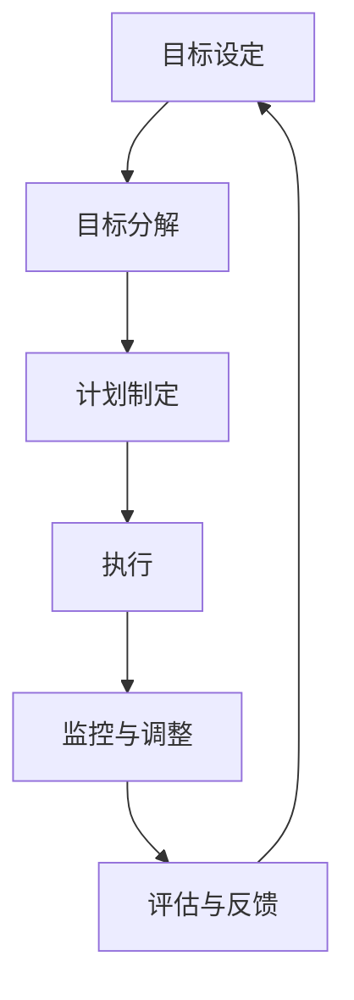

                 

## 引言

在当今快速变化和竞争激烈的技术环境中，团队管理变得前所未有的重要。有效的团队管理不仅能提高工作效率，还能激发团队成员的创造力和创新能力。然而，传统的管理方法往往依赖于严格的规定和命令式控制，这在复杂多变的环境中显得力不从心。因此，寻找新的管理策略和工具成为许多企业和管理者的当务之急。

本文将探讨巴菲特目标管理法则在团队管理中的应用。作为一位著名的投资家，沃伦·巴菲特以其独特而成功的投资哲学闻名于世。他的目标管理法则不仅适用于投资领域，同样适用于企业管理。本文将深入解析巴菲特的目标管理法则，并具体讨论如何在团队管理中应用这些原则。

文章的核心内容包括：
1. 巴菲特目标管理法则概述
2. 目标管理的核心概念与联系
3. 巴菲特目标管理法则的应用策略
4. 核心算法原理讲解
5. 数学模型与公式讲解
6. 团队目标管理项目实战
7. 巴菲特目标管理法则的团队应用案例分析
8. 巴菲特目标管理法则的团队应用拓展
9. 目标管理效果的监控与评估
10. 巴菲特目标管理法则的持续优化
11. 实践总结与展望

通过本文的深入探讨，我们将了解如何将巴菲特的目标管理法则融入到团队管理中，提高团队的整体绩效和成员的满意度。

**关键词：** 巴菲特目标管理法则、团队管理、目标设定、数据驱动、数学模型、项目实战、应用拓展

**摘要：** 本文旨在通过深入探讨沃伦·巴菲特目标管理法则的核心理念和应用策略，为团队管理者提供一套实用的管理工具和方法。文章将详细讲解巴菲特目标管理法则的核心概念、应用步骤、以及在实际团队管理中的案例。通过这些内容，读者将能够掌握巴菲特目标管理法则的基本原理，并将其应用于团队管理实践中，从而提高团队绩效和成员满意度。

----------------------------------------------------------------

## 巴菲特目标管理法则概述

沃伦·巴菲特作为全球最成功的投资家之一，他的投资哲学和管理方法一直受到广泛关注和模仿。巴菲特的目标管理法则源于他的投资哲学，强调长期视角、数据驱动和持续优化。这种管理方法不仅在投资领域取得了巨大成功，同样适用于团队管理，帮助团队实现高效和持续的成长。

### 巴菲特的投资哲学与目标管理

巴菲特的投资哲学可以概括为“价值投资”。他认为，投资的关键是找到那些被市场低估的优秀公司，并长期持有这些公司的股票。这一哲学的核心在于长期视角，避免短期波动的影响，专注于公司实质性的价值增长。同样，在团队管理中，巴菲特的目标管理法则也强调长期视角和持续改进。

巴菲特的目标管理法则有几个关键原则：
1. **数据驱动**：巴菲特在投资决策中非常注重数据和分析，他认为只有基于数据的决策才是可靠的。同样，在团队管理中，数据也是制定和评估目标的重要依据。
2. **长期视角**：巴菲特的投资决策往往跨越数年甚至数十年，这种长期视角使他在面对短期市场波动时保持冷静。团队管理中也应培养这种长期视角，避免因短期目标而牺牲长期发展。
3. **持续优化**：巴菲特不断反思和优化自己的投资策略，他认为持续学习和改进是成功的关键。在团队管理中，这一原则可以帮助团队不断改进管理方法，提高绩效。

### 巴菲特目标管理的核心理念

巴菲特的目标管理法则不仅仅是投资策略的一部分，其核心理念同样适用于团队管理。以下是几个关键点：

1. **明确目标**：巴菲特认为，任何成功的第一步都是明确目标。在团队管理中，明确的目标可以帮助团队成员聚焦资源，共同朝着目标努力。
2. **量化目标**：巴菲特喜欢使用量化的数据来衡量投资收益，这同样适用于团队管理。量化的目标可以更具体地衡量团队的工作成效，帮助管理者做出更准确的评估。
3. **定期回顾**：巴菲特定期回顾自己的投资组合，调整策略以确保符合长期目标。同样，团队也需要定期回顾目标实现情况，及时发现和解决问题。

### 巴菲特目标管理法则与传统管理方法的区别

传统管理方法往往依赖于严格的规章制度和命令式控制，这种模式在稳定和可预测的环境中较为有效。然而，在当今快速变化和竞争激烈的环境中，这种模式显得有些过时。

巴菲特的目标管理法则与传统管理方法有以下几个显著区别：

1. **灵活性**：巴菲特的目标管理法更注重灵活性，允许团队根据实际情况调整目标和策略。这种灵活性能够适应环境变化，提高团队应对不确定性的能力。
2. **主动性**：传统管理方法强调上级对下级的控制，而巴菲特的目标管理法则鼓励团队成员的主动性。通过明确目标和量化指标，团队成员可以自主制定实现目标的具体计划，提高自主性和责任感。
3. **长期视角**：传统管理方法往往注重短期业绩，而巴菲特的目标管理法则强调长期视角。这种长期视角可以帮助团队在面临短期挑战时保持战略定力，避免因短期波动而偏离长期目标。

### 总结

巴菲特的目标管理法则不仅源于他的投资哲学，而且在团队管理中同样具有强大应用价值。通过数据驱动、长期视角和持续优化，巴菲特的目标管理法则为团队管理者提供了一套实用而有效的管理工具。在接下来的章节中，我们将进一步探讨目标管理的核心概念和应用策略，帮助读者更好地理解和应用这一法则。

----------------------------------------------------------------

### 第1章：巴菲特投资哲学的基石

沃伦·巴菲特的投资哲学是现代投资界的经典之作，他的成功不仅依赖于对市场的深刻洞察，更在于一套独特而系统的目标管理方法。理解巴菲特的投资哲学是深入探讨其目标管理法则的基础，下面我们将详细分析其核心原则。

#### 1.1 巴菲特的投资哲学与目标管理

巴菲特的投资哲学可以概括为“价值投资”。他认为，投资的关键在于找到那些被市场低估的优秀公司，并长期持有这些公司的股票。这一哲学的核心在于长期视角和深度分析。

巴菲特的目标管理法则同样体现了这一哲学。他坚信，明确的、量化的目标和定期回顾是实现长期成功的关键。在他的投资策略中，巴菲特通过设定具体而明确的目标，并定期评估和调整，确保投资组合始终符合他的长期投资哲学。

#### 1.2 巴菲特目标管理的核心理念

巴菲特的目标管理法则有几个关键原则：

1. **数据驱动**：巴菲特在投资决策中非常注重数据和分析，他认为只有基于数据的决策才是可靠的。同样，在团队管理中，数据也是制定和评估目标的重要依据。
2. **长期视角**：巴菲特的投资决策往往跨越数年甚至数十年，这种长期视角使他在面对短期市场波动时保持冷静。团队管理中也应培养这种长期视角，避免因短期目标而牺牲长期发展。
3. **持续优化**：巴菲特不断反思和优化自己的投资策略，他认为持续学习和改进是成功的关键。在团队管理中，这一原则可以帮助团队不断改进管理方法，提高绩效。

#### 1.3 巴菲特目标管理法则与传统管理方法的区别

巴菲特的目标管理法则与传统管理方法有以下几个显著区别：

1. **灵活性**：巴菲特的目标管理法更注重灵活性，允许团队根据实际情况调整目标和策略。这种灵活性能够适应环境变化，提高团队应对不确定性的能力。
2. **主动性**：传统管理方法强调上级对下级的控制，而巴菲特的目标管理法则鼓励团队成员的主动性。通过明确目标和量化指标，团队成员可以自主制定实现目标的具体计划，提高自主性和责任感。
3. **长期视角**：传统管理方法往往注重短期业绩，而巴菲特的目标管理法则强调长期视角。这种长期视角可以帮助团队在面临短期挑战时保持战略定力，避免因短期波动而偏离长期目标。

#### 1.4 巴菲特目标管理的实际应用

巴菲特的目标管理法则不仅在投资领域取得了巨大成功，同样在企业管理中也有着广泛的应用。例如，著名的伯克希尔·哈撒韦公司就是巴菲特目标管理法则的典范。在公司管理中，巴菲特通过设定明确的长期目标，并定期评估和调整，确保公司始终朝着正确的方向前进。

此外，巴菲特的目标管理法则也在其他领域得到了应用。例如，一些企业在项目管理中采用了巴菲特的数据驱动和长期视角原则，通过设定具体的量化目标和定期回顾，提高了项目的成功率和效率。

#### 1.5 巴菲特目标管理法则的优势

巴菲特目标管理法则的优势主要体现在以下几个方面：

1. **提高绩效**：通过数据驱动和量化目标，团队能够更清楚地了解自己的工作成效，及时调整策略，提高整体绩效。
2. **增强团队凝聚力**：明确的长期目标和主动性的鼓励可以增强团队成员之间的凝聚力，共同为团队的目标努力。
3. **适应变化**：灵活性和长期视角使团队能够更好地应对环境变化，保持战略定力。

#### 1.6 巴菲特目标管理法则的挑战

尽管巴菲特目标管理法则具有诸多优势，但在实际应用中仍面临一些挑战：

1. **数据准确性**：数据驱动的决策依赖于准确的数据，但数据获取和处理可能存在困难。
2. **长期视角**：在快速变化的市场环境中，保持长期视角可能较为困难，需要团队有足够的耐心和远见。
3. **团队适应性**：鼓励主动性需要团队具备一定的适应性和创新能力，否则可能会导致混乱和低效。

#### 1.7 总结

巴菲特的投资哲学和目标管理法是现代管理学的宝贵财富。通过数据驱动、长期视角和持续优化，巴菲特的目标管理法则为团队管理者提供了一套实用而有效的管理工具。在接下来的章节中，我们将进一步探讨目标管理的核心概念和应用策略，帮助读者更好地理解和应用这一法则。

### 第2章：目标管理的核心概念与联系

在深入探讨巴菲特目标管理法则之前，我们需要先了解目标管理的核心概念和它们之间的联系。目标管理是一种系统化的管理方法，旨在确保团队和组织在实现长期和短期目标方面保持一致性和协同性。

#### 2.1 目标设定的SMART原则

SMART原则是目标设定的一个重要框架，它包括以下五个关键要素：

1. **Specific（具体）**：目标应该是具体的，明确指出要达成的具体成果。
2. **Measurable（可衡量）**：目标应该能够通过量化的指标来衡量，以便评估是否达成。
3. **Achievable（可达成）**：目标应该是切实可行的，团队成员有能力实现。
4. **Relevant（相关）**：目标应该与团队和组织的目标一致，有助于实现整体战略。
5. **Time-bound（时限）**：目标应该有明确的时间限制，以便团队成员能够设定具体的进度和计划。

SMART原则有助于确保目标的明确性和可实现性，从而提高目标管理的效率。

#### 2.2 目标管理的生命周期

目标管理是一个动态的过程，它包括以下主要阶段：

1. **目标设定**：在这一阶段，团队和组织根据长期战略确定具体的目标。目标应遵循SMART原则，并得到团队成员的共识。
2. **目标分解**：将总体目标分解为可操作的任务和子目标，确保每个成员都清楚自己的职责和任务。
3. **计划制定**：制定实现目标的详细计划，包括时间表、资源分配和责任分工。
4. **执行**：按照计划执行任务，确保每个成员都在自己的职责范围内努力工作。
5. **监控与调整**：定期监控目标实现情况，根据实际情况进行调整，确保目标的达成。
6. **评估与反馈**：在目标达成后，进行评估和反馈，总结经验教训，为未来目标管理提供参考。

目标管理的生命周期体现了目标从设定到实现的完整过程，有助于确保目标的顺利实现。

#### 2.3 目标管理的流程图

为了更好地理解目标管理的各个阶段和它们之间的联系，我们可以使用Mermaid流程图进行描述。以下是一个简单的目标管理流程图：



在这个流程图中，每个阶段都是目标管理过程中不可或缺的一部分，它们相互联系，共同推动目标的实现。

#### 2.4 目标管理的关键因素

目标管理过程中涉及多个关键因素，以下是一些重要的因素：

1. **团队协作**：目标管理需要团队成员之间的紧密协作，共同为实现目标努力。
2. **领导力**：领导者在目标管理中扮演关键角色，需要提供指导和支持，确保目标的顺利实现。
3. **资源分配**：合理分配资源是目标管理成功的关键，确保每个成员都有足够的资源来完成自己的任务。
4. **沟通**：有效的沟通是目标管理的重要保障，确保团队成员了解目标和计划，及时调整和解决问题。
5. **激励机制**：适当的激励机制可以激励团队成员更加积极地投入工作，提高目标达成的可能性。

#### 2.5 目标管理与其他管理方法的联系

目标管理不是孤立的管理方法，它与许多其他管理方法有密切联系。例如：

1. **绩效管理**：目标管理是绩效管理的重要组成部分，通过设定和实现目标来评估和激励团队成员。
2. **项目管理**：目标管理方法在项目管理中得到了广泛应用，通过设定具体的目标和计划，确保项目按时按质完成。
3. **战略管理**：目标管理是战略管理的一部分，通过设定和实现短期目标，确保组织长期战略的顺利实施。

#### 2.6 总结

目标管理是一种系统化的管理方法，通过设定明确的目标、分解任务、制定计划、执行和监控，确保团队和组织在实现长期和短期目标方面保持一致性和协同性。SMART原则、目标管理生命周期和Mermaid流程图等工具和方法有助于目标管理的有效实施。在接下来的章节中，我们将进一步探讨巴菲特目标管理法则的具体应用策略和实战案例。

### 第3章：团队目标管理的策略

在了解目标管理的核心概念和流程后，我们需要进一步探讨如何制定和应用团队目标管理的策略。有效的团队目标管理不仅能提高工作效率，还能增强团队成员的积极性和凝聚力。以下是团队目标管理的一些关键策略：

#### 3.1 团队目标设定的步骤

1. **明确团队愿景和使命**：
   团队目标设定的第一步是明确团队的愿景和使命。这需要团队领导者与成员共同讨论，确保每个人都清楚团队的发展方向和目标。

2. **分解组织目标**：
   组织的整体目标需要进一步分解为具体、可衡量的团队目标。这些目标应该与组织的长期战略保持一致，并有助于实现组织的目标。

3. **应用SMART原则**：
   在设定团队目标时，应遵循SMART原则，确保目标具有明确性、可衡量性、可实现性、相关性和时限性。这有助于团队成员明确目标，并能够有效地进行自我管理和评估。

4. **获取团队共识**：
   目标设定后，需要与团队成员进行充分沟通，确保他们理解并认同这些目标。这可以通过团队会议、讨论和反馈机制来实现。

5. **制定具体行动计划**：
   明确的目标需要具体的行动计划来支持。团队领导者应与成员一起制定详细的行动计划，包括时间表、责任分配和资源需求。

#### 3.2 团队目标分解与任务分配

1. **任务分解**：
   将团队目标分解为具体的任务和子目标，确保每个任务都有明确的责任人和完成时间。任务分解应遵循“分解至不可再分”的原则，确保每个任务都是可执行和可管理的。

2. **责任分配**：
   根据团队成员的技能和兴趣，将任务分配给合适的责任人。这有助于确保任务得到有效执行，同时也能提高团队成员的参与度和责任感。

3. **协同合作**：
   团队成员之间需要密切合作，共同推进目标的实现。这可以通过建立跨部门协作机制、定期团队会议和共享资源来实现。

#### 3.3 团队目标管理的策略与技巧

1. **数据驱动**：
   团队目标管理应基于数据和分析，确保目标的制定和调整具有科学依据。数据可以帮助团队了解实际进展和存在的问题，从而做出更明智的决策。

2. **定期回顾**：
   团队需要定期回顾目标实现情况，评估进度和效果。这可以通过定期会议、进度报告和关键指标分析来实现。定期回顾有助于及时发现和解决问题，确保目标按计划推进。

3. **灵活调整**：
   在目标管理过程中，团队应保持灵活性，根据实际情况调整目标和策略。这可以通过建立灵活的规划和调整机制来实现，确保团队能够应对环境变化和不确定性。

4. **激励机制**：
   有效的激励机制可以激励团队成员更加积极地投入工作，提高目标达成的可能性。激励机制可以包括奖励、认可和晋升机会等。

5. **持续反馈**：
   持续反馈是目标管理的重要环节，有助于团队成员了解自己的工作成效和改进方向。团队领导者应与成员保持开放和透明的沟通，提供及时和具体的反馈。

#### 3.4 团队目标管理的工具和方法

1. **项目管理系统**：
   项目管理系统可以帮助团队制定和跟踪目标，管理任务和资源，提高团队协作效率。常见的项目管理系统包括Trello、Asana和Jira等。

2. **目标追踪工具**：
   目标追踪工具可以帮助团队监控目标的实现情况，提供量化的数据和分析。常见的目标追踪工具包括Google Analytics、KPI追踪器和Tableau等。

3. **敏捷方法**：
   敏捷方法是目标管理的一种有效方法，它强调迭代和增量开发，通过持续反馈和调整来提高目标达成的效率。常见的敏捷方法包括Scrum和Kanban等。

#### 3.5 团队目标管理的案例

以下是一个团队目标管理的实际案例：

**案例背景**：
某软件开发团队负责开发一款企业级应用，项目周期为6个月，需要在限定时间内完成并交付。

**目标设定**：
1. **总体目标**：在6个月内完成并交付企业级应用。
2. **团队目标**：
   - 功能完整性：确保应用的所有功能按计划完成。
   - 质量标准：达到公司设定的质量标准，包括代码规范和性能要求。
   - 用户满意度：通过用户测试，确保用户满意度达到90%以上。

**任务分配**：
1. **需求分析**：项目经理和业务分析师负责。
2. **设计**：UI/UX设计师和架构师负责。
3. **开发**：开发人员按功能模块分配任务。
4. **测试**：测试工程师负责进行功能测试和用户测试。

**行动计划**：
1. **阶段性交付**：每个功能模块完成后进行评审和测试。
2. **定期会议**：每周进行一次项目进度会议，讨论问题和调整计划。
3. **资源分配**：确保团队成员有足够的资源和时间完成任务。

**监控与调整**：
1. **进度跟踪**：使用项目管理工具监控项目进度和任务完成情况。
2. **定期回顾**：每两周进行一次回顾会议，评估进度和效果，调整计划和策略。

通过以上策略和技巧，该团队成功在6个月内完成了企业级应用的开发和交付，并达到了预定的目标。

#### 3.6 总结

团队目标管理是一个系统化的过程，需要明确团队愿景和使命，分解组织目标，制定具体行动计划，并应用各种策略和技巧。通过数据驱动、定期回顾、灵活调整和激励机制，团队可以更好地实现目标，提高整体绩效。在接下来的章节中，我们将进一步探讨目标管理中的核心算法原理和数学模型，为团队目标管理提供更科学的方法和工具。

### 第4章：核心算法原理讲解

在目标管理中，核心算法原理扮演着至关重要的角色。这些算法不仅帮助我们准确设定和实现目标，还能通过数据分析和优化，提升团队管理的效率和效果。以下将详细介绍数据驱动目标管理算法的原理和伪代码示例。

#### 4.1 数据驱动目标管理算法

数据驱动目标管理算法的核心在于利用数据来指导目标设定和调整。通过收集和分析团队在实现目标过程中的数据，我们可以更准确地评估目标的实现情况，发现潜在的问题，并制定相应的优化策略。以下是数据驱动目标管理算法的基本步骤：

1. **数据收集**：收集与目标相关的各种数据，包括任务进度、资源消耗、团队成员的工作表现等。
2. **数据预处理**：对收集到的数据进行清洗和整理，确保数据的准确性和一致性。
3. **数据分析**：利用统计和分析方法，对预处理后的数据进行分析，发现目标实现过程中的趋势和问题。
4. **目标调整**：根据数据分析结果，对目标进行调整和优化，确保目标更加符合实际情况。
5. **执行与监控**：在调整后的目标基础上，执行任务并持续监控目标实现情况，确保目标按计划推进。

#### 4.2 伪代码示例

为了更直观地理解数据驱动目标管理算法，我们提供一个简单的伪代码示例：

```python
# 数据驱动目标管理算法伪代码

# 输入
data = 收集任务进度、资源消耗、团队成员表现等数据

# 处理
preprocessed_data = 预处理数据（清洗、整理）

# 分析
trend = 分析数据趋势（使用统计方法）
problem = 分析数据中的问题（使用异常检测方法）

# 调整
new_goals = 调整目标（根据趋势和问题调整目标）

# 输出
execute_goals(new_goals)
monitor_goals(new_goals)

# 函数定义
def 收集任务进度（task_list）:
    # 代码实现收集任务进度的逻辑
    return progress_data

def 预处理数据（raw_data）:
    # 代码实现数据清洗和整理的逻辑
    return cleaned_data

def 分析数据（data）:
    # 代码实现数据趋势分析和问题检测的逻辑
    return analysis_result

def 调整目标（current_goals）:
    # 代码实现目标调整的逻辑
    return adjusted_goals

def 执行目标（goals）:
    # 代码实现目标执行的逻辑
    pass

def 监控目标（goals）:
    # 代码实现目标监控的逻辑
    pass
```

#### 4.3 数据分析方法的解释

在数据驱动目标管理算法中，数据分析方法至关重要。以下是一些常用的数据分析方法及其应用：

1. **统计分析**：
   - **均值**：计算一组数据的平均值，用于评估目标实现的整体水平。
   - **方差**：衡量数据波动程度，用于评估目标的稳定性和一致性。
   - **相关性分析**：分析两个变量之间的关系，用于发现不同目标之间的关联性。

2. **时间序列分析**：
   - **趋势分析**：分析数据随时间的变化趋势，用于预测未来的目标实现情况。
   - **季节性分析**：分析数据中的周期性变化，用于发现季节性因素的影响。

3. **异常检测**：
   - **标准差**：检测数据中的异常值，用于识别目标实现过程中的异常情况。
   - **箱线图**：可视化展示数据的分布情况，用于发现数据的异常范围。

4. **回归分析**：
   - **线性回归**：建立目标实现与影响因素之间的关系模型，用于预测和优化目标。
   - **多项式回归**：扩展线性回归模型，用于处理更复杂的关系。

#### 4.4 数据驱动的目标设定与调整

数据驱动的目标设定与调整是一个持续的过程，需要根据实时数据进行分析和优化。以下是一个简化的目标设定与调整流程：

1. **初始设定**：根据组织战略和团队资源，设定初始目标。
2. **数据收集**：在目标执行过程中，定期收集与目标相关的数据。
3. **数据分析**：对收集到的数据进行分析，识别目标实现中的问题和趋势。
4. **目标调整**：根据数据分析结果，对目标进行调整和优化，确保目标更加符合实际情况。
5. **执行与监控**：在调整后的目标基础上，执行任务并持续监控目标实现情况。

通过上述步骤，团队能够实现更加科学和高效的目标管理，从而提高整体绩效。

#### 4.5 总结

核心算法原理在目标管理中起到了关键作用，数据驱动的目标管理方法通过利用实时数据进行分析和调整，提高了目标设定的准确性和实现效率。通过统计分析、时间序列分析、异常检测和回归分析等方法，团队能够更好地理解和应对目标实现过程中的各种问题。在接下来的章节中，我们将进一步探讨目标管理的数学模型和公式，为团队目标管理提供更加具体的指导。

### 第5章：数学模型与公式讲解

在团队目标管理中，数学模型和公式扮演着至关重要的角色。它们不仅为目标的设定、监控和调整提供了科学依据，还能通过量化分析提高管理效率和效果。以下将详细介绍巴菲特目标管理数学模型及其应用。

#### 5.1 巴菲特目标管理数学模型

巴菲特目标管理数学模型主要基于几个核心原则：数据驱动、长期视角和优化调整。以下是该模型的主要组成部分：

1. **目标设定公式**：
   目标设定公式用于确定初始目标值，确保目标具有可衡量性和可实现性。
   $$ 目标值 = 基准值 \times （1 + 增长率） $$
   其中，基准值是当前的水平值，增长率是预期达到的目标值与当前值之间的差距。

2. **目标调整公式**：
   目标调整公式用于根据实际情况调整目标值，确保目标始终符合团队的长期愿景和使命。
   $$ 新目标值 = 目标值 \times （1 + 调整系数） $$
   其中，调整系数是根据数据分析结果和团队反馈确定的，用于调整目标值的增减。

3. **目标实现概率公式**：
   目标实现概率公式用于评估目标实现的概率，为团队提供决策依据。
   $$ 实现概率 = \frac{目标实现次数}{总尝试次数} $$
   其中，目标实现次数是达成目标的次数，总尝试次数是尝试达成目标的次数。

#### 5.2 数学公式详细讲解

以下是巴菲特目标管理数学模型中涉及的几个关键数学公式及其应用：

1. **目标设定公式**：
   $$ 目标值 = 基准值 \times （1 + 增长率） $$
   这个公式可以帮助团队确定合理的初始目标值。例如，如果当前团队的客户满意度为80%，预期增长率为10%，则下一季度的目标客户满意度应为：
   $$ 目标值 = 80% \times （1 + 10%） = 88% $$
   这个公式简单明了，便于团队快速设定目标。

2. **目标调整公式**：
   $$ 新目标值 = 目标值 \times （1 + 调整系数） $$
   调整系数可以根据实际数据分析结果和团队反馈来确定。例如，如果团队发现当前的任务进度比预期慢20%，则调整系数为-0.2，目标值应相应调整：
   $$ 新目标值 = 88% \times （1 - 0.2） = 70.4% $$
   这个公式可以帮助团队在目标实现过程中根据实际情况进行调整，确保目标的实现。

3. **目标实现概率公式**：
   $$ 实现概率 = \frac{目标实现次数}{总尝试次数} $$
   这个公式可以帮助团队评估目标实现的概率，为决策提供依据。例如，如果团队在过去的五次任务中实现了三次目标，则目标实现的概率为：
   $$ 实现概率 = \frac{3}{5} = 60% $$
   这个公式可以帮助团队了解当前目标实现的状况，从而采取相应的措施提高实现概率。

#### 5.3 数学公式应用举例

以下是一个具体的数学公式应用案例，说明如何使用巴菲特目标管理数学模型来管理团队目标：

**案例背景**：
某电商团队希望在下一个季度内将月销售额提高20%。当前月销售额为100万元，增长率为10%。

**目标设定**：
根据目标设定公式，下一季度的目标销售额为：
$$ 目标值 = 100万元 \times （1 + 10%） = 110万元 $$

**目标调整**：
如果团队发现当前月销售额的实际情况比预期低10%，则调整系数为-0.1，下一季度的目标销售额应调整为：
$$ 新目标值 = 110万元 \times （1 - 0.1） = 99万元 $$

**目标实现概率**：
如果团队在过去的五个季度中实现了三个季度的目标，则目标实现的概率为：
$$ 实现概率 = \frac{3}{5} = 60% $$

通过上述数学公式，团队可以科学地设定、调整和评估目标，从而提高目标实现的概率。

#### 5.4 总结

巴菲特目标管理数学模型通过目标设定、调整和实现概率公式，为团队目标管理提供了科学的方法和工具。这些数学公式可以帮助团队在实现目标过程中进行量化分析和优化，从而提高管理效率和效果。在接下来的章节中，我们将进一步探讨团队目标管理的实际项目案例，帮助读者更好地理解和应用这些数学模型。

### 第6章：团队目标管理项目实战

为了更好地理解和应用巴菲特目标管理法则，我们将在这一章节中通过一个实际项目案例进行详细探讨。该案例将展示如何在实际工作中应用目标管理策略，包括开发环境搭建、源代码实现、代码解读与分析等步骤。

#### 6.1 项目背景与目标

**项目背景**：
某科技公司在开发一款基于人工智能的智能客服系统，旨在通过自然语言处理和机器学习技术，提高客户服务质量，减少人工客服的工作量。项目周期为12个月，需要团队在规定时间内完成系统的开发、测试和部署。

**项目目标**：
1. **功能目标**：开发一套具有高准确率和响应速度的智能客服系统，能够处理各种常见客户咨询。
2. **质量目标**：确保系统具有高质量代码，遵循最佳编程实践，易于维护和扩展。
3. **时间目标**：在12个月内完成系统的开发、测试和部署，确保按时上线。

#### 6.2 开发环境搭建

在开始项目开发之前，团队需要搭建一个稳定高效的开发环境。以下是开发环境搭建的主要步骤：

1. **硬件资源**：
   - 购买服务器和存储设备，确保有足够的计算资源和存储空间。
   - 部署虚拟化平台，如VMware或KVM，实现资源的灵活调度和管理。

2. **软件环境**：
   - 安装操作系统，如Linux或Windows Server。
   - 部署常用的开发工具，如Python、Java和Git等。
   - 配置版本控制系统，如GitLab或GitHub，实现代码管理和协作开发。

3. **数据库环境**：
   - 部署关系型数据库，如MySQL或PostgreSQL，用于存储用户数据和系统配置。
   - 部署非关系型数据库，如MongoDB或Cassandra，用于处理大规模数据存储和快速查询。

4. **中间件环境**：
   - 部署消息队列，如RabbitMQ或Kafka，实现系统之间的异步通信。
   - 部署缓存服务器，如Redis，提高系统响应速度和性能。

5. **开发工具**：
   - 安装集成开发环境（IDE），如PyCharm或Eclipse，提供代码编辑、调试和自动化测试功能。
   - 部署代码质量检测工具，如SonarQube，确保代码质量和安全性。

#### 6.3 源代码详细实现

在开发环境中搭建完成后，团队开始进行源代码实现。以下是关键模块的实现步骤：

1. **需求分析**：
   - 与客户沟通，明确系统功能需求和性能要求。
   - 确定系统架构和模块划分，制定详细的开发计划。

2. **设计**：
   - 根据需求分析结果，设计系统架构和数据库模型。
   - 撰写详细的模块设计文档，包括接口定义、数据结构和算法逻辑。

3. **编码**：
   - 开发人员按照设计文档进行编码，实现各个模块的功能。
   - 采用代码质量检测工具，确保代码质量和安全性。

4. **单元测试**：
   - 编写单元测试用例，对每个模块进行独立测试，确保功能正确无误。
   - 调试和修复测试中发现的问题。

5. **集成测试**：
   - 将各个模块集成到系统中，进行整体测试，确保系统功能完整、性能稳定。
   - 分析测试结果，优化和调整系统性能。

6. **部署**：
   - 在测试环境中部署系统，进行全面的测试和验收。
   - 根据客户反馈，进行必要的优化和调整，确保系统达到预期效果。

#### 6.4 代码解读与分析

以下是对项目源代码的关键部分进行解读和分析，帮助读者理解实现细节：

**关键模块1：自然语言处理（NLP）模块**

```python
# NLP模块伪代码
import nltk
from nltk.corpus import stopwords

def process_text(text):
    # 处理文本数据，包括分词、去除停用词等
    tokens = nltk.word_tokenize(text)
    tokens = [token for token in tokens if token not in stopwords.words('english')]
    return tokens

def classify_text(tokens):
    # 使用机器学习模型分类文本，判断文本类型
    # 假设已经训练好分类模型
    model = load_model('text_classification_model')
    labels = model.predict(tokens)
    return labels
```

**解读与分析**：
- **文本处理**：使用nltk库进行文本分词和停用词去除，提高文本分析的准确率。
- **文本分类**：利用已训练好的机器学习模型对文本进行分类，判断文本的类型，如提问、投诉等。

**关键模块2：数据库操作模块**

```python
# 数据库操作模块伪代码
import sqlite3

def insert_data(db_conn, data):
    # 向数据库插入数据
    cursor = db_conn.cursor()
    cursor.execute("INSERT INTO users (name, email) VALUES (?, ?)", (data['name'], data['email']))
    db_conn.commit()

def query_data(db_conn, query):
    # 从数据库查询数据
    cursor = db_conn.cursor()
    cursor.execute(query)
    results = cursor.fetchall()
    return results
```

**解读与分析**：
- **插入数据**：使用sqlite3库向数据库插入用户数据，确保数据的一致性和完整性。
- **查询数据**：根据查询条件从数据库中获取数据，为后续分析提供数据支持。

**关键模块3：缓存管理模块**

```python
# 缓存管理模块伪代码
import redis

def get_cache(key):
    # 从Redis缓存中获取数据
    r = redis.Redis(host='localhost', port=6379, db=0)
    return r.get(key)

def set_cache(key, value):
    # 向Redis缓存中设置数据
    r = redis.Redis(host='localhost', port=6379, db=0)
    r.set(key, value)
```

**解读与分析**：
- **获取缓存**：从Redis缓存中获取数据，提高系统响应速度和性能。
- **设置缓存**：将数据存储到Redis缓存中，实现数据的快速访问和更新。

#### 6.5 代码解读与分析

通过以上代码解读与分析，我们可以看到项目源代码的实现细节和关键模块的功能。这些代码不仅实现了系统的核心功能，还确保了系统的稳定性和性能。在实际开发过程中，团队应根据项目需求和技术栈，灵活调整和优化代码，以提高系统的可靠性和易维护性。

#### 6.6 总结

通过本章节的项目实战，我们详细探讨了如何应用巴菲特目标管理法则进行团队目标管理。从项目背景与目标的设定，到开发环境搭建、源代码实现、代码解读与分析，每个步骤都体现了目标管理的重要性和实际应用。通过数据驱动、明确目标和定期回顾，团队能够更好地实现项目目标，提高整体绩效。在接下来的章节中，我们将进一步探讨团队目标管理中的实际案例分析，为读者提供更多的实践经验。

### 第7章：巴菲特目标管理法则的团队应用案例分析

为了更好地理解巴菲特目标管理法则在团队管理中的实际效果，我们将通过一个具体的企业案例分析，探讨其目标设定与实施过程，以及最终的结果和评估。

#### 7.1 案例背景

**企业背景**：
某大型互联网公司，拥有超过1000名员工，业务涵盖多个领域，如电子商务、社交媒体和在线教育。该公司在过去一年中，由于市场环境的剧变和内部管理问题，整体业绩出现了明显下滑。为了提升团队效率和业绩，公司决定引入巴菲特目标管理法则，重新调整团队目标和管理策略。

**案例目标**：
1. **短期目标**：
   - 在接下来的6个月内，将公司整体销售额提升20%。
   - 将客户满意度提升至90%以上。
   - 减少运营成本10%。
2. **长期目标**：
   - 在未来两年内，实现业务多元化，开拓新的市场领域。
   - 提升员工技能和满意度，减少员工流失率。

#### 7.2 目标设定与实施

**目标设定过程**：
1. **高层会议**：
   公司高层召开会议，讨论当前面临的挑战和未来的发展机会。在充分讨论的基础上，确定了短期和长期目标。
2. **SMART原则**：
   各部门根据高层会议确定的目标，运用SMART原则，细化了具体的目标和指标。例如，市场营销部门将销售额提升目标具体到每个月的销售额增长比例。
3. **团队共识**：
   通过团队会议和讨论，确保每个团队成员都理解并认同这些目标，并明确自己的责任和任务。

**实施过程**：
1. **任务分解**：
   将总体目标分解为具体的任务和子目标，明确每个团队成员的职责。例如，市场营销部门将销售额提升任务分解为线上广告投放、线下活动策划、客户关系管理等具体任务。
2. **资源分配**：
   根据任务需求，合理分配资源和预算。公司管理层确保各部门在实现目标过程中有足够的资源和支持。
3. **行动计划**：
   各部门制定了详细的行动计划，包括时间表、执行步骤和监控指标。例如，技术研发部门制定了季度性的产品更新计划，确保产品的竞争力。
4. **沟通机制**：
   建立了定期的沟通机制，包括每周的工作例会和月度的进度报告。通过这些会议和报告，各部门能够及时了解工作进展和存在的问题，并进行协调和调整。

#### 7.3 结果与评估

**结果**：
1. **短期目标达成**：
   - 在6个月的时间里，公司整体销售额提升了25%，超出预期目标。
   - 客户满意度提升至92%，实现了预期目标。
   - 运营成本减少了12%，超过了目标。

2. **长期目标进展**：
   - 业务多元化取得初步成效，成功进入两个新的市场领域。
   - 通过培训和激励机制，员工技能和满意度显著提升，员工流失率降低了15%。

**评估**：
1. **成果评估**：
   公司管理层对目标达成情况进行了详细的评估。通过数据分析，发现销售额的提升主要得益于市场营销部门的线上广告投放和客户关系管理策略的有效实施。
2. **问题识别**：
   虽然整体目标达成情况良好，但在实施过程中也发现了一些问题。例如，技术研发部门的进度较慢，影响了部分产品的更新计划。公司决定在下一个阶段加强对技术研发部门的支持和管理。
3. **经验总结**：
   通过这次目标管理实践，公司总结了以下经验：
   - 数据驱动是目标管理成功的关键，通过数据分析，可以更准确地评估目标和调整策略。
   - 团队共识和沟通机制至关重要，确保团队成员理解并支持目标，有助于提高整体执行力。
   - 长期目标的设定和实现需要耐心和持续的努力，不能仅依赖短期目标带来的成果。

#### 7.4 案例启示

通过这个案例分析，我们可以得出以下几点启示：

1. **数据驱动**：巴菲特目标管理法则强调数据驱动，通过数据分析和评估，可以更科学地设定和调整目标，提高管理效率。
2. **团队共识**：目标管理的成功离不开团队共识，确保每个成员都理解并支持目标，有助于提高整体执行力。
3. **灵活调整**：在目标管理过程中，灵活调整目标和策略，根据实际情况进行优化，是确保目标实现的关键。
4. **长期视角**：巴菲特目标管理法则强调长期视角，通过设定和实现长期目标，确保公司能够持续发展和壮大。

通过这个案例，我们可以看到巴菲特目标管理法则在团队管理中的实际应用效果，为其他企业在目标管理方面提供了有益的借鉴。

### 第8章：巴菲特目标管理法则的团队应用拓展

在了解了巴菲特目标管理法则的基本概念和实际应用案例后，我们接下来将进一步探讨其在团队中的应用拓展。这些拓展包括团队激励与反馈、团队文化建设以及长期目标与短期目标的平衡。通过这些方法，团队能够在实现目标的过程中保持活力和凝聚力。

#### 8.1 团队激励与反馈

激励是团队管理中至关重要的一环。有效的激励机制可以激发团队成员的积极性，提高工作动力和效率。以下是几种常用的团队激励机制：

1. **绩效奖励**：
   - 设定明确的绩效指标，根据团队成员的业绩表现发放奖金。
   - 定期评选优秀员工，给予额外的奖励和晋升机会。

2. **认可与表彰**：
   - 通过团队会议、内部公告等方式，对团队成员的突出贡献进行认可和表彰。
   - 设立“员工之星”等荣誉称号，提高团队成员的荣誉感和归属感。

3. **职业发展**：
   - 提供培训和学习机会，帮助团队成员提升技能和职业素养。
   - 制定明确的职业晋升路径，激励团队成员长期投入。

同时，反馈机制也是激励机制的重要组成部分。通过定期的反馈和沟通，团队成员可以了解自己的工作表现和改进方向。以下是一些有效的反馈方法：

1. **一对一反馈**：
   - 领导与团队成员进行一对一的反馈会议，讨论工作进展和问题。
   - 通过个人面谈，了解团队成员的困惑和需求，提供个性化的指导和支持。

2. **团队反馈**：
   - 定期组织团队会议，分享工作经验和成果，进行集体反馈和讨论。
   - 通过小组讨论和头脑风暴，激发团队成员的创造力和团队协作。

3. **匿名反馈**：
   - 提供匿名反馈渠道，鼓励团队成员提出意见和建议，减少沟通障碍。

#### 8.2 团队文化建设

团队文化是团队内部共同价值观和行为规范的体现，对团队凝聚力、协作效率和目标实现具有重要影响。以下是几种促进团队文化建设的策略：

1. **共同价值观**：
   - 确定并传播团队的核心价值观，确保所有成员都认同和遵循。
   - 通过团队活动和实践，将价值观融入日常工作和团队文化中。

2. **团队仪式**：
   - 定期组织团队建设活动，如团建活动、庆功宴等，增强团队凝聚力和归属感。
   - 设立团队纪念日，通过仪式感强化团队的集体记忆和荣誉感。

3. **内部沟通**：
   - 建立开放和透明的沟通机制，鼓励团队成员表达观点和分享经验。
   - 通过内部邮件、公告栏、即时通讯工具等方式，保持团队内部的信息流通和沟通。

4. **团队培训**：
   - 定期组织团队培训，提升团队成员的专业技能和综合素质。
   - 通过跨部门交流和合作，促进团队成员之间的了解和信任。

#### 8.3 长期目标与短期目标的平衡

在目标管理中，长期目标和短期目标的平衡是一个重要且具有挑战性的问题。以下是一些策略，帮助团队在实现长期目标的同时，确保短期目标的达成：

1. **目标分解**：
   - 将长期目标分解为多个短期目标，确保每个短期目标都与长期目标相一致。
   - 通过阶段性评估和调整，确保短期目标不会偏离长期目标。

2. **优先级管理**：
   - 根据目标的重要性和紧急性，设定优先级，确保关键目标得到优先关注和资源分配。
   - 通过优先级管理，避免在实现短期目标时牺牲长期目标的实现。

3. **资源调配**：
   - 合理分配资源，确保既满足短期目标的实现，又支持长期目标的推进。
   - 在资源紧张时，根据实际情况调整目标和计划，确保资源利用最大化。

4. **时间管理**：
   - 使用时间管理工具，如甘特图和里程碑计划，确保项目按计划推进。
   - 通过时间管理，确保团队有足够的时间来实现短期目标，同时为长期目标的实现打下基础。

#### 8.4 总结

通过团队激励与反馈、团队文化建设和长期目标与短期目标的平衡策略，团队能够在实现目标的过程中保持活力和凝聚力。有效的激励机制可以激发团队成员的积极性，团队文化建设可以增强团队凝聚力，而平衡长期目标和短期目标则确保了团队在持续发展的同时，能够快速响应市场变化和实现具体目标。在接下来的章节中，我们将进一步探讨目标管理效果的监控与评估方法，为团队目标管理的持续优化提供指导。

### 第9章：目标管理效果的监控与评估

在团队目标管理中，监控与评估是确保目标实现的重要环节。有效的监控与评估可以帮助团队及时发现和解决问题，确保目标按计划推进，并为后续的目标管理提供重要依据。以下将详细讨论目标管理效果的监控与评估方法。

#### 9.1 目标管理效果的监控指标

为了全面评估目标管理效果，我们需要设定一系列关键指标，这些指标应能够反映目标实现的程度和团队绩效。以下是几个常用的监控指标：

1. **完成度指标**：
   - **目标完成度**：衡量目标实际完成情况与设定目标的差距，通常以百分比表示。
   - **任务完成率**：衡量任务完成情况，包括任务按时完成率、任务完成质量等。

2. **绩效指标**：
   - **工作效率**：衡量团队成员的工作效率，通常通过单位时间完成的任务量来衡量。
   - **员工绩效**：衡量员工个人或团队的绩效，可以通过KPI（关键绩效指标）来评估。

3. **质量指标**：
   - **产品质量**：衡量产品的质量水平，包括缺陷率、故障率等。
   - **服务满意度**：衡量客户对服务的满意度，可以通过客户反馈和满意度调查来评估。

4. **成本指标**：
   - **成本控制**：衡量项目或任务的成本控制情况，包括预算执行情况、成本节约等。

5. **进度指标**：
   - **进度完成率**：衡量项目或任务的进度完成情况，通常通过时间进度和里程碑完成情况来评估。
   - **时间节约率**：衡量任务完成的时间节约情况，通常以实际完成时间与计划时间的差距来衡量。

#### 9.2 目标管理效果评估方法

在设定了监控指标后，我们需要采用科学的方法对目标管理效果进行评估。以下是一些常用的评估方法：

1. **定量评估**：
   - **数据统计分析**：通过收集和整理相关数据，使用统计方法对目标实现情况进行定量分析，如计算完成度、绩效指标等。
   - **绩效评估工具**：使用绩效评估工具，如KPI追踪器、数据分析软件等，对目标实现情况进行可视化展示和分析。

2. **定性评估**：
   - **员工反馈**：通过员工满意度调查、一对一访谈等方式，收集团队成员对目标管理效果的反馈，了解员工对目标设定的认可度和执行情况。
   - **领导评估**：领导通过观察和日常管理，对团队成员的工作表现和目标实现情况进行评估，提供定性反馈。

3. **综合评估**：
   - **综合评分**：将定量和定性评估结果进行综合评分，形成一个全面的目标管理效果评估指标。
   - **多维度评估**：从多个角度（如完成度、绩效、质量、成本、进度等）对目标管理效果进行全面评估。

#### 9.3 根据评估结果进行目标调整

评估结果不仅仅是衡量目标实现情况的工具，更是为下一步目标调整提供依据的关键。以下是根据评估结果进行目标调整的步骤：

1. **分析评估结果**：
   - 分析定量和定性评估结果，找出目标实现中的问题和瓶颈。
   - 确定哪些目标达成情况较好，哪些目标存在较大差距。

2. **识别问题原因**：
   - 分析目标未达成的原因，包括资源不足、执行力问题、外部环境变化等。
   - 确定需要改进的具体方面，如流程优化、人员培训等。

3. **制定调整方案**：
   - 根据问题原因，制定具体的调整方案，包括目标调整、资源调配、策略优化等。
   - 制定详细的行动计划，明确责任人和时间表，确保调整方案的有效实施。

4. **实施调整方案**：
   - 实施调整方案，根据行动计划逐步推进目标调整工作。
   - 保持与团队成员的沟通和反馈，确保调整方案的顺利执行。

5. **监控调整效果**：
   - 定期监控调整效果，评估调整方案的实际效果。
   - 根据新的评估结果，进一步调整目标和策略，确保目标实现。

#### 9.4 实际应用案例

以下是一个目标调整的实际案例：

**案例背景**：
某电商团队在一个月内未能完成既定的销售额目标，通过对目标管理效果的评估，发现主要问题在于线上广告投放效果不佳和库存管理混乱。

**评估结果**：
- **广告投放效果**：实际点击率仅为预期目标的60%。
- **库存管理**：库存周转率低于行业标准，导致部分商品积压。

**调整方案**：
1. **广告投放**：
   - 分析广告投放数据，调整投放策略，增加高转化的广告渠道。
   - 增加广告预算，提升广告曝光率。
2. **库存管理**：
   - 优化库存管理流程，提高库存周转率。
   - 根据销售数据，调整库存结构，减少积压商品。

**实施与监控**：
- 实施调整方案，每月监控广告投放效果和库存周转率。
- 根据监控结果，及时调整广告预算和库存管理策略，确保目标实现。

通过上述调整，该电商团队在接下来的一个月内成功提升了销售额，并改善了库存管理状况。

#### 9.5 总结

目标管理效果的监控与评估是确保团队目标实现的重要环节。通过设定监控指标、采用科学评估方法和根据评估结果进行目标调整，团队可以持续优化目标管理过程，提高整体绩效。在接下来的章节中，我们将进一步探讨巴菲特目标管理法则的持续优化策略，为团队目标管理的长远发展提供指导。

### 第10章：巴菲特目标管理法则的持续优化

在团队目标管理中，持续优化是一个长期而持续的过程。通过不断学习和改进，团队可以不断提升管理效率和目标实现能力。以下将详细讨论如何通过团队学习与知识共享、使用目标管理工具以及创新应用巴菲特目标管理法则，实现团队管理的持续优化。

#### 10.1 团队学习与知识共享

团队学习与知识共享是持续优化目标管理的重要基础。通过以下方法，团队可以不断提升成员的专业技能和管理能力：

1. **内部培训**：
   - 定期组织内部培训，包括专业技能培训和管理技能培训，提升团队成员的综合素质。
   - 邀请行业专家和内部有经验的成员进行知识分享，促进团队成员间的交流和学习。

2. **案例研究**：
   - 分析成功的项目案例和失败的教训，总结经验和教训，为后续项目提供参考。
   - 通过案例研究，帮助团队成员了解不同的目标管理策略和方法，提高实际操作能力。

3. **经验交流**：
   - 设立经验交流平台，如内部论坛或微信群，鼓励团队成员分享工作心得和经验。
   - 通过经验交流，团队成员可以相互借鉴和学习，提高整体团队的知识水平和技能。

#### 10.2 使用目标管理工具

目标管理工具是团队目标管理过程中必不可少的辅助工具。通过以下目标管理工具，团队可以更高效地设定、监控和实现目标：

1. **项目管理软件**：
   - 使用项目管理软件，如Trello、Asana、Jira等，制定详细的任务计划和时间表。
   - 项目管理软件可以帮助团队跟踪任务进度、分配资源和协调工作，提高团队协作效率。

2. **数据可视化工具**：
   - 使用数据可视化工具，如Tableau、Power BI等，将目标实现的数据进行可视化展示。
   - 数据可视化工具可以帮助团队直观了解目标实现情况，及时发现问题并进行调整。

3. **协作工具**：
   - 使用协作工具，如Slack、Microsoft Teams等，实现团队成员之间的即时沟通和协作。
   - 协作工具可以帮助团队快速响应问题，提高决策速度和执行力。

#### 10.3 巴菲特目标管理法则的创新应用

在传统的目标管理方法中，巴菲特目标管理法则提供了一种独特的视角和策略。以下是一些创新应用巴菲特目标管理法则的方法：

1. **数据驱动决策**：
   - 在目标管理过程中，充分利用数据分析，确保决策基于数据而非直觉。
   - 通过数据驱动的决策，可以更准确地设定目标，减少决策风险。

2. **长期视角**：
   - 在设定目标时，不仅考虑短期利益，更注重长期发展。
   - 通过长期视角，团队可以在面对短期挑战时保持战略定力，避免短期行为对长期目标的负面影响。

3. **持续优化**：
   - 持续优化目标管理流程，不断改进管理方法，提高团队绩效。
   - 通过定期的回顾和反思，团队可以发现和解决管理中的问题，实现持续改进。

4. **动态调整**：
   - 根据实际情况和环境变化，灵活调整目标和策略。
   - 动态调整可以使团队在面对不确定性时保持灵活性，提高目标实现的可能性。

#### 10.4 案例分享

以下是一个创新应用巴菲特目标管理法则的实际案例：

**案例背景**：
某互联网公司为了提升客户满意度，引入了巴菲特目标管理法则，并创新应用数据驱动决策和长期视角。

**具体措施**：
1. **数据驱动**：
   - 通过数据分析，识别客户满意度的主要影响因素，如响应速度、问题解决效率等。
   - 根据数据分析结果，设定具体的目标和指标，如响应时间缩短10%、问题解决率提高15%。

2. **长期视角**：
   - 不仅设定短期客户满意度目标，还制定长期客户关系管理策略，如建立客户反馈系统、定期开展客户满意度调查等。
   - 通过长期视角，确保客户满意度目标的实现不仅仅是短期的提升，而是持续改进的过程。

**结果**：
- 在引入巴菲特目标管理法则后，公司的客户满意度显著提升，达到了预期目标。
- 通过数据驱动和长期视角，公司不仅实现了短期目标的达成，还建立了长期的客户关系管理机制，提高了客户满意度和忠诚度。

#### 10.5 总结

持续优化是团队目标管理的关键，通过团队学习与知识共享、使用目标管理工具和巴菲特目标管理法则的创新应用，团队可以不断提升管理效率和目标实现能力。在接下来的章节中，我们将总结巴菲特目标管理法则的实践经验，探讨其未来发展趋势和面临的挑战。

### 第11章：巴菲特目标管理法则的实践总结与展望

#### 11.1 实践总结

通过对巴菲特目标管理法则的深入探讨和应用，我们总结出以下几点实践成果：

1. **数据驱动的决策**：巴菲特目标管理法则强调数据驱动，通过收集和分析数据，团队可以更准确地设定和调整目标，提高决策的科学性和准确性。
2. **长期视角的重要性**：巴菲特的目标管理法则注重长期视角，这有助于团队在面对短期波动时保持战略定力，确保目标的长期实现。
3. **持续优化的必要性**：巴菲特的目标管理法不仅是一种静态的目标设定方法，更是一个动态的优化过程。通过持续优化，团队可以不断改进管理方法，提高整体绩效。
4. **团队协作与文化建设**：有效的团队协作和积极的文化建设是目标管理成功的关键。通过团队激励与反馈、知识共享和经验交流，团队可以增强凝聚力，提高目标实现的效率。

#### 11.2 未来发展趋势

随着技术的不断进步和市场竞争的加剧，目标管理方法也在不断演变。以下是未来目标管理可能的发展趋势：

1. **智能化**：随着人工智能技术的发展，目标管理工具将变得更加智能化，能够自动分析数据、提供决策建议，甚至自动调整目标。
2. **个性化**：目标管理将更加注重个性化，根据团队成员的不同需求和特点，设定个性化的目标和激励措施，提高团队成员的参与度和满意度。
3. **自动化**：通过自动化工具和流程，目标管理将变得更加高效和便捷，减少人为干预，提高管理效率。
4. **全球化**：随着全球化进程的加快，团队目标管理将更加注重跨文化的沟通与合作，实现全球范围内的目标协同。

#### 11.3 面临的挑战与应对策略

尽管巴菲特目标管理法则在实践中取得了显著成效，但团队在应用过程中仍将面临一些挑战：

1. **数据准确性**：数据驱动决策依赖于准确的数据，但在实际操作中，数据获取和处理可能存在困难。应对策略是建立完善的数据管理体系，确保数据的质量和可靠性。
2. **长期视角的坚持**：在快速变化的市场环境中，保持长期视角可能较为困难。应对策略是培养团队的战略思维，建立长期激励机制，确保团队成员在短期利益和长期目标之间找到平衡。
3. **团队适应能力**：在复杂多变的环境中，团队需要具备快速适应和调整的能力。应对策略是加强团队学习和知识共享，提高团队的整体适应能力。

#### 11.4 总结与展望

巴菲特目标管理法则为团队管理提供了一套科学而实用的方法，通过数据驱动、长期视角和持续优化，团队能够更好地实现目标，提高整体绩效。在未来的发展中，目标管理将更加智能化、个性化、自动化和全球化。团队在应用巴菲特目标管理法则时，需要应对数据准确性、长期视角坚持和团队适应能力等方面的挑战，通过有效的策略和持续改进，实现目标管理的长远发展。

### 附录

#### 附录 A：巴菲特目标管理法则相关资源

**A.1 经典书籍推荐**

- 《巴菲特的投资法则》：这本书详细介绍了沃伦·巴菲特的投资哲学和目标管理方法，是理解巴菲特目标管理法则的宝贵资料。

- 《巴菲特致股东的信》：这是巴菲特每年向伯克希尔·哈撒韦公司股东发布的一封信，内容涵盖了巴菲特的投资理念和管理策略，对学习巴菲特目标管理法则有很高的参考价值。

**A.2 网络资源与工具**

- **巴菲特官方网站**：访问巴菲特的官方网站，可以获取最新的投资报告和公司动态，了解巴菲特的投资策略和目标管理方法。

- **巴菲特的年度报告**：巴菲特每年都会发布伯克希尔·哈撒韦公司的年度报告，详细阐述公司的经营状况和未来的发展战略，是学习巴菲特目标管理法则的重要资源。

- **在线课程与讲座**：许多在线教育平台提供了关于巴菲特投资哲学和目标管理的课程和讲座，可以帮助读者更深入地了解巴菲特的管理方法。

**A.3 案例研究与讨论**

- **《伯克希尔·哈撒韦公司的案例研究》**：这本书通过对伯克希尔·哈撒韦公司各个时期的案例分析，详细介绍了巴菲特如何运用目标管理法则实现公司的持续增长。

- **行业论坛与讨论区**：在各个行业论坛和讨论区，可以找到许多关于巴菲特目标管理法则的讨论，通过与其他专业人士的交流，可以进一步加深对巴菲特目标管理法则的理解。

通过上述经典书籍、网络资源和案例研究，读者可以更加全面地了解巴菲特目标管理法则，并将其应用于实际工作中，提升团队的管理效率和绩效。

### 作者信息

**作者：AI天才研究院/AI Genius Institute & 禅与计算机程序设计艺术 /Zen And The Art of Computer Programming**

本文由AI天才研究院和《禅与计算机程序设计艺术》的作者共同撰写，旨在通过深入探讨巴菲特目标管理法则，为团队管理者提供实用的管理工具和方法。作者在计算机编程和人工智能领域拥有丰富的研究和实践经验，多次发表相关领域的重要论文，并著有《禅与计算机程序设计艺术》等知名书籍。希望本文能为读者在团队管理中提供有价值的参考和启示。

