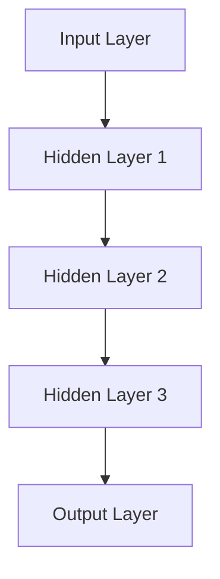
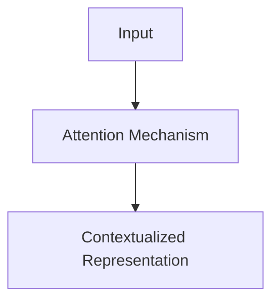
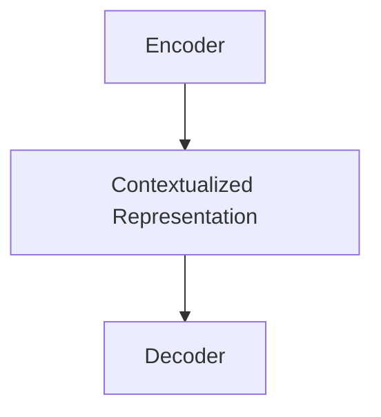
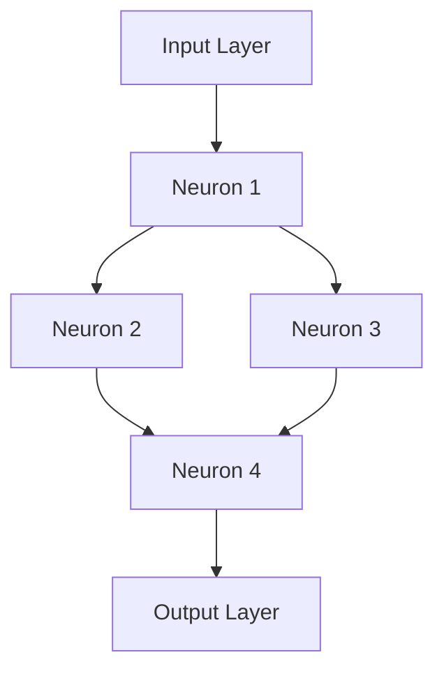
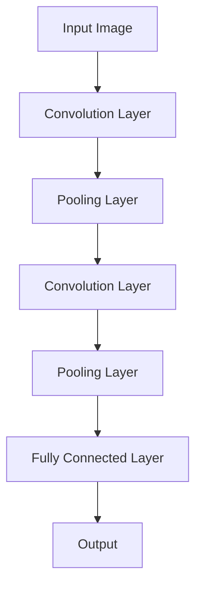
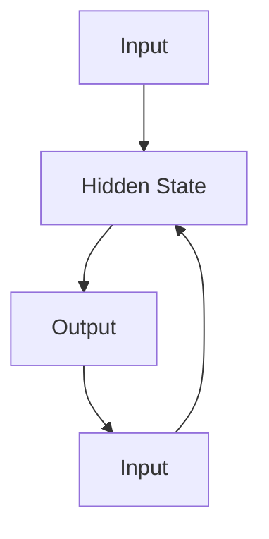
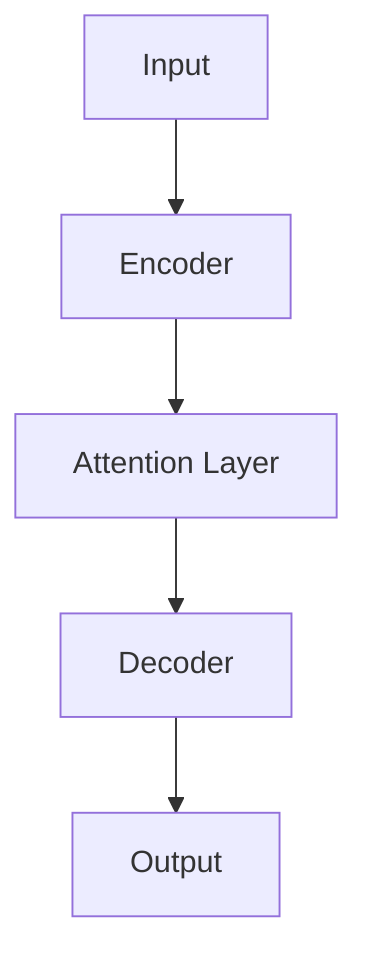

                 

# 2023年AI大模型时代的新变革

> **关键词：** AI大模型，深度学习，自然语言处理，预训练，商业应用，安全与伦理

> **摘要：** 本文深入探讨2023年AI大模型时代的新变革，分析其背景、核心概念、应用场景、技术基础、行业应用、安全与伦理问题以及未来发展趋势。文章通过一步步的分析推理，旨在为读者提供一个全面、系统的理解和认识。

## 第一部分：2023年AI大模型时代的新变革概述

### 第1章: 2023年AI大模型时代的新变革概述

#### 1.1 AI大模型的崛起背景

##### 1.1.1 2023年前AI的发展历程

在2023年之前，人工智能（AI）的发展经历了几个重要阶段。最初，AI主要集中在符号推理和规则系统上，这些方法在特定的、狭窄的领域内取得了显著的成功。然而，这些方法很难扩展到更广泛的领域，且需要大量手动编写的规则。

随着计算能力的提升和算法的进步，特别是深度学习技术的突破，AI开始进入一个全新的阶段。深度学习是一种模仿人脑神经网络结构和功能的技术，通过多层神经网络进行特征提取和模式识别，使得AI在图像识别、语音识别等领域取得了惊人的突破。

##### 1.1.2 AI大模型崛起的动因

AI大模型的崛起源于几个关键因素。首先，大规模数据集的可用性使得AI模型能够通过大规模数据训练获得更好的性能。其次，计算能力的提升为训练和部署这些大型模型提供了硬件支持。此外，深度学习算法的优化和改进，尤其是端到端的训练方法，使得AI模型在训练效率和准确性方面都有了显著提高。

##### 1.1.3 2023年AI大模型的革命性影响

2023年，AI大模型在多个领域都产生了深远的影响。在商业领域，AI大模型被用于客户关系管理、市场预测、风险控制等，大幅提升了企业的运营效率和决策能力。在工业领域，AI大模型被用于生产调度、质量控制、设备维护等，提高了生产效率和产品质量。在医疗领域，AI大模型被用于疾病诊断、药物研发、医疗影像分析等，为医疗健康领域带来了革命性的变革。

#### 1.2 AI大模型的核心概念与架构

##### 1.2.1 AI大模型的定义

AI大模型是指具有数百万甚至数十亿参数的深度学习模型。这些模型通常通过大规模数据集进行预训练，然后再针对特定任务进行微调。大模型能够捕捉到数据中的复杂模式和特征，从而在许多任务上实现超越传统模型的表现。

##### 1.2.2 AI大模型的主要架构

AI大模型的主要架构包括多层神经网络、注意力机制、转换器架构等。这些架构使得大模型能够处理复杂数据，并提取出丰富的特征信息。

###### 1.2.2.1 多层神经网络

多层神经网络是由多个隐藏层组成的神经网络，每个隐藏层都能够提取不同层次的特征信息。



###### 1.2.2.2 注意力机制

注意力机制是一种用于模型中提取关键特征的技术，它使得模型能够专注于数据中的关键部分，从而提高模型的性能。



###### 1.2.2.3 转换器架构

转换器架构是一种用于处理序列数据的模型，它通过编码器和解码器将序列数据转换为特征表示，从而进行文本生成、机器翻译等任务。



##### 1.2.3 AI大模型的技术特点

AI大模型具有以下几个技术特点：

1. **大规模参数**：AI大模型具有数百万甚至数十亿个参数，这使得模型能够捕捉到数据中的复杂模式和特征。
2. **端到端训练**：AI大模型通常通过端到端的训练方法，直接从原始数据中学习，避免了手工特征工程。
3. **迁移学习**：AI大模型通过预训练和微调技术，可以在不同任务之间迁移知识，从而提高模型的泛化能力。

#### 1.3 2023年AI大模型的应用场景

##### 1.3.1 AI大模型在商业领域的应用

在商业领域，AI大模型被广泛应用于客户关系管理、市场预测、风险控制等方面。例如，通过客户关系管理模型，企业可以更好地理解客户需求，提供个性化的服务，从而提高客户满意度和忠诚度。通过市场预测模型，企业可以预测市场需求，优化库存管理，降低运营成本。

##### 1.3.2 AI大模型在工业领域的应用

在工业领域，AI大模型被用于生产调度、质量控制、设备维护等。例如，通过生产调度模型，企业可以优化生产流程，提高生产效率。通过质量控制模型，企业可以实时监控产品质量，减少次品率。通过设备维护模型，企业可以预测设备故障，提前进行维护，减少设备停机时间。

##### 1.3.3 AI大模型在医疗领域的应用

在医疗领域，AI大模型被用于疾病诊断、药物研发、医疗影像分析等。例如，通过疾病诊断模型，医生可以更快、更准确地诊断疾病，提高诊断准确性。通过药物研发模型，研究人员可以预测药物的疗效和副作用，加速药物研发进程。通过医疗影像分析模型，医生可以更准确地分析影像，提高诊断的准确性。

#### 1.4 2023年AI大模型的挑战与未来发展趋势

##### 1.4.1 AI大模型面临的挑战

尽管AI大模型在各个领域都取得了显著的成功，但仍然面临一些挑战。首先，大模型的训练需要大量的数据和计算资源，这可能导致成本高昂。其次，大模型的透明度和可解释性仍然是一个挑战，这使得用户难以理解模型的决策过程。此外，大模型的隐私问题和伦理问题也需要得到关注。

##### 1.4.2 2023年AI大模型的发展趋势

随着技术的进步，2023年AI大模型的发展趋势包括：

1. **更高效的大模型**：通过改进算法和优化计算资源，降低大模型的训练成本。
2. **增强的可解释性**：通过研究可解释性方法，提高大模型的透明度和可理解性。
3. **跨领域的迁移学习**：通过研究跨领域的迁移学习方法，提高大模型的泛化能力。
4. **安全与伦理**：通过制定标准和规范，确保AI大模型的安全和伦理。

##### 1.4.3 2023年AI大模型的时代意义

2023年AI大模型的崛起标志着人工智能进入了一个全新的时代。大模型在多个领域都取得了显著的成果，推动了科技和社会的进步。随着技术的不断发展和应用的深入，AI大模型有望在未来带来更多的变革和机遇。

## 第二部分：AI大模型技术基础

### 第2章: AI大模型技术基础

#### 2.1 深度学习与神经网络基础

##### 2.1.1 神经网络的基本结构

神经网络是一种由大量简单处理单元（神经元）互联而成的复杂系统，能够通过学习数据中的特征和模式来实现高级任务。一个简单的神经网络通常包括三个主要部分：输入层、隐藏层和输出层。

输入层接收外部输入数据，隐藏层对输入数据进行特征提取和变换，输出层生成最终输出。每个神经元接收来自前一层神经元的输入，通过一个加权求和函数进行计算，最后通过一个激活函数产生输出。



##### 2.1.2 常见的深度学习架构

深度学习架构包括多种不同类型的神经网络，其中一些常见的架构包括卷积神经网络（CNN）、循环神经网络（RNN）和转换器架构（Transformer）。

###### 2.1.2.1 卷积神经网络（CNN）

卷积神经网络是一种专门用于处理图像数据的神经网络，通过卷积层、池化层和全连接层等结构来提取图像中的特征。



###### 2.1.2.2 循环神经网络（RNN）

循环神经网络是一种用于处理序列数据的神经网络，通过隐藏状态和循环连接来捕捉序列中的时间依赖关系。



###### 2.1.2.3 转换器架构（Transformer）

转换器架构是一种用于处理序列数据的先进神经网络架构，通过自注意力机制和多头注意力机制来捕捉序列中的长距离依赖关系。



##### 2.1.3 深度学习优化算法

深度学习优化算法是用于训练深度学习模型的关键技术，常见的优化算法包括随机梯度下降（SGD）、Adam优化器等。

###### 2.1.3.1 随机梯度下降（SGD）

随机梯度下降是一种最简单的优化算法，通过计算每个样本的梯度，更新模型的参数。

```python
for epoch in range(num_epochs):
    for sample in dataset:
        gradient = compute_gradient(sample)
        update_parameters(gradient)
```

###### 2.1.3.2 Adam优化器

Adam优化器是一种在SGD基础上改进的优化算法，通过计算一阶矩估计和二阶矩估计来更新参数。

```python
m = momentum
v = velocity

for epoch in range(num_epochs):
    for sample in dataset:
        gradient = compute_gradient(sample)
        m = beta1 * m + (1 - beta1) * gradient
        v = beta2 * v + (1 - beta2) * (gradient ** 2)
        m_hat = m / (1 - beta1 ** epoch)
        v_hat = v / (1 - beta2 ** epoch)
        update_parameters(-learning_rate * m_hat / (sqrt(v_hat) + epsilon))
```

#### 2.2 自然语言处理技术概览

##### 2.2.1 词嵌入技术

词嵌入技术是一种将词语映射到高维向量空间的方法，使得词语之间的相似性和相关性可以通过向量之间的距离来表示。

```python
# Word2Vec算法示例
import gensim

model = gensim.models.Word2Vec(sentences, size=100, window=5, min_count=1, workers=4)
word_vector = model.wv['hello']
```

##### 2.2.2 序列模型与注意力机制

序列模型是一种用于处理序列数据的模型，例如循环神经网络（RNN）和转换器架构（Transformer）。注意力机制是一种用于模型中提取关键特征的技术，它使得模型能够专注于数据中的关键部分。

```python
# RNN示例
import tensorflow as tf

model = tf.keras.Sequential([
    tf.keras.layers.Embedding(vocab_size, embedding_dim),
    tf.keras.layers.LSTM(units),
    tf.keras.layers.Dense(units, activation='softmax')
])

model.compile(optimizer='adam', loss='categorical_crossentropy', metrics=['accuracy'])
model.fit(input_sequences, target_sequences, epochs=10)
```

##### 2.2.3 转换器架构详解

转换器架构是一种用于处理序列数据的先进神经网络架构，通过自注意力机制和多头注意力机制来捕捉序列中的长距离依赖关系。

```python
# Transformer架构示例
import tensorflow as tf

model = tf.keras.Sequential([
    tf.keras.layers.Embedding(vocab_size, embedding_dim),
    tf.keras.layers.MultiHeadAttention(heads, embedding_dim),
    tf.keras.layers.Dense(units, activation='softmax')
])

model.compile(optimizer='adam', loss='categorical_crossentropy', metrics=['accuracy'])
model.fit(input_sequences, target_sequences, epochs=10)
```

#### 2.3 大规模预训练模型原理

##### 2.3.1 预训练的概念与意义

预训练是指在一个大型数据集上对模型进行预训练，然后再在特定任务上进行微调。预训练的意义在于通过在大规模数据集上学习，模型可以捕捉到通用特征和知识，从而提高在特定任务上的表现。

##### 2.3.2 自监督学习方法

自监督学习方法是一种在无监督情况下训练模型的方法，通过利用未标注的数据进行训练，从而减少标注数据的成本。

```python
# BERT模型示例
import tensorflow as tf

model = tf.keras.Sequential([
    tf.keras.layers.Embedding(vocab_size, embedding_dim),
    tf.keras.layers.MultiHeadAttention(heads, embedding_dim),
    tf.keras.layers.Dense(units, activation='softmax')
])

model.compile(optimizer='adam', loss='categorical_crossentropy', metrics=['accuracy'])
model.fit(input_sequences, target_sequences, epochs=10)
```

##### 2.3.3 迁移学习与微调技术

迁移学习是指将预训练模型的知识迁移到新的任务上，通过在新的任务上进行微调，提高模型在新任务上的表现。

```python
# 微调示例
import tensorflow as tf

pretrained_model = tf.keras.applications.BertModel.from_pretrained('bert-base-uncased')
for layer in pretrained_model.layers:
    layer.trainable = False

model = tf.keras.Sequential([
    pretrained_model,
    tf.keras.layers.Dense(units, activation='softmax')
])

model.compile(optimizer='adam', loss='categorical_crossentropy', metrics=['accuracy'])
model.fit(input_sequences, target_sequences, epochs=10)
```

## 第三部分：AI大模型在行业中的应用

### 第3章: AI大模型在商业领域的应用

#### 3.1 AI大模型在商业智能中的应用

##### 3.1.1 商业智能的概念与价值

商业智能（BI）是指通过数据分析和信息提取，为企业提供洞察力和决策支持。商业智能的价值在于它能够帮助企业：

1. **优化运营效率**：通过分析历史数据，企业可以识别出运营中的瓶颈和问题，从而进行优化。
2. **提升决策质量**：通过数据分析，企业可以更准确地预测市场需求和趋势，从而做出更明智的决策。
3. **增强竞争力**：通过数据分析和洞察，企业可以更好地了解客户需求和市场动态，从而在竞争中取得优势。

##### 3.1.2 AI大模型在商业智能中的应用案例

AI大模型在商业智能中的应用案例包括：

1. **客户关系管理**：通过AI大模型，企业可以分析客户行为，预测客户需求，提供个性化的服务和推荐，从而提高客户满意度和忠诚度。
2. **市场预测**：AI大模型可以分析大量市场数据，预测市场趋势和需求变化，帮助企业制定更有效的市场策略。
3. **风险控制**：AI大模型可以分析金融数据，预测市场波动和风险，帮助企业进行风险管理和投资决策。

##### 3.1.3 AI大模型在商业智能中的挑战与解决方案

AI大模型在商业智能中面临以下挑战：

1. **数据质量**：高质量的数据是AI大模型有效工作的基础，数据质量问题可能导致模型性能下降。
2. **模型解释性**：商业智能通常需要模型具有高解释性，以便用户理解模型的决策过程。
3. **计算资源**：训练和部署AI大模型需要大量的计算资源，这可能对企业的IT基础设施构成挑战。

解决方案包括：

1. **数据清洗和预处理**：通过数据清洗和预处理，提高数据的准确性和一致性。
2. **可解释性方法**：采用可解释性方法，如模型可视化、特征重要性分析等，提高模型的透明度和可理解性。
3. **优化计算资源**：通过分布式计算和云计算，提高计算资源的利用效率。

#### 3.2 AI大模型在市场营销中的应用

##### 3.2.1 市场营销的概念与流程

市场营销是指通过市场调研、产品定位、推广策略等手段，将产品或服务推向市场，满足消费者需求，实现企业目标。市场营销的流程包括：

1. **市场调研**：通过收集和分析市场数据，了解市场需求和竞争状况。
2. **产品定位**：根据市场调研结果，确定产品的目标市场和特色。
3. **推广策略**：制定推广计划，包括广告、促销、公关等手段，以吸引消费者。

##### 3.2.2 AI大模型在市场营销中的应用案例

AI大模型在市场营销中的应用案例包括：

1. **客户细分**：通过AI大模型，企业可以分析客户数据，将客户划分为不同的细分市场，从而制定更精准的营销策略。
2. **个性化推荐**：AI大模型可以分析客户行为数据，提供个性化的产品推荐，提高客户满意度和购买率。
3. **广告投放优化**：AI大模型可以分析广告投放数据，预测广告效果，优化广告投放策略。

##### 3.2.3 AI大模型在市场营销中的挑战与解决方案

AI大模型在市场营销中面临以下挑战：

1. **数据隐私**：市场营销中涉及大量客户数据，数据隐私保护是一个重要问题。
2. **模型解释性**：市场营销需要模型具有高解释性，以便用户理解模型的决策过程。
3. **营销效果评估**：评估AI大模型在市场营销中的效果，是一个复杂的问题。

解决方案包括：

1. **数据隐私保护**：采用数据加密、匿名化等手段，保护客户数据的隐私。
2. **可解释性方法**：采用可解释性方法，如模型可视化、特征重要性分析等，提高模型的透明度和可理解性。
3. **营销效果评估**：通过A/B测试、ROI分析等方法，评估AI大模型在市场营销中的效果。

#### 3.3 AI大模型在金融领域的应用

##### 3.3.1 金融领域的概念与挑战

金融领域是指与货币、信用、投资和金融市场相关的领域。金融领域面临的主要挑战包括：

1. **风险控制**：金融市场波动大，风险控制是一个重要问题。
2. **欺诈检测**：金融欺诈是一个全球性问题，需要高效的检测方法。
3. **投资决策**：投资决策需要基于大量的数据和分析，但传统的投资决策方法往往存在局限性。

##### 3.3.2 AI大模型在金融领域的应用案例

AI大模型在金融领域的应用案例包括：

1. **风险控制**：通过AI大模型，金融机构可以实时监控市场波动，预测潜在风险，从而采取相应的风险管理措施。
2. **欺诈检测**：AI大模型可以分析交易数据，识别异常交易行为，提高欺诈检测的准确性。
3. **投资决策**：通过AI大模型，投资者可以基于大量的市场数据，进行更准确的投资决策。

##### 3.3.3 AI大模型在金融领域的挑战与解决方案

AI大模型在金融领域面临以下挑战：

1. **数据质量**：金融数据往往存在噪声和缺失值，数据质量可能影响模型的性能。
2. **合规性**：金融领域有严格的合规要求，AI大模型的决策过程和结果需要符合相关法规。
3. **模型透明度**：金融领域的决策需要高透明度，但AI大模型的决策过程往往难以解释。

解决方案包括：

1. **数据清洗和预处理**：通过数据清洗和预处理，提高数据的准确性和一致性。
2. **合规性审核**：对AI大模型的决策过程进行合规性审核，确保模型的决策符合相关法规。
3. **可解释性方法**：采用可解释性方法，如模型可视化、特征重要性分析等，提高模型的透明度和可理解性。

## 第四部分：AI大模型开发实战

### 第4章: AI大模型开发实战基础

#### 4.1 AI大模型开发环境搭建

##### 4.1.1 AI大模型开发环境的选择

搭建AI大模型开发环境时，需要考虑以下几个方面：

1. **计算平台**：选择具有强大计算能力的硬件平台，如GPU或TPU，以加速模型的训练过程。
2. **操作系统**：通常选择Linux操作系统，因为Linux对GPU和其他硬件的支持更好。
3. **深度学习框架**：选择主流的深度学习框架，如TensorFlow、PyTorch等，这些框架具有丰富的功能和高性能。

##### 4.1.2 AI大模型开发工具的配置

在配置AI大模型开发工具时，需要安装以下工具：

1. **Python**：Python是AI大模型开发的主要语言，需要安装Python环境。
2. **Jupyter Notebook**：Jupyter Notebook是一个交互式的计算环境，适合进行AI大模型的开发和调试。
3. **深度学习框架**：根据选择，安装相应的深度学习框架，如TensorFlow、PyTorch等。

##### 4.1.3 AI大模型开发资源的获取

AI大模型开发需要大量的数据和计算资源，可以通过以下途径获取：

1. **公共数据集**：许多公共数据集可用于AI大模型开发，如ImageNet、COCO等。
2. **云服务**：使用云服务，如Google Cloud、AWS等，可以获取高性能的计算资源和数据存储服务。
3. **开源项目**：许多开源项目提供了现成的AI大模型代码和资源，可以用于学习和参考。

#### 4.2 AI大模型开发流程与方法

##### 4.2.1 AI大模型开发的基本流程

AI大模型开发的基本流程包括以下步骤：

1. **数据收集与预处理**：收集相关数据，并进行数据清洗、归一化等预处理操作。
2. **数据划分**：将数据划分为训练集、验证集和测试集，以评估模型的性能。
3. **模型设计**：根据任务需求，设计合适的模型架构，如CNN、RNN、Transformer等。
4. **模型训练**：使用训练集对模型进行训练，优化模型的参数。
5. **模型评估**：使用验证集和测试集对模型进行评估，调整模型参数，提高模型性能。
6. **模型部署**：将训练好的模型部署到生产环境中，进行实际应用。

##### 4.2.2 AI大模型开发的最佳实践

AI大模型开发的最佳实践包括以下几点：

1. **数据质量**：确保数据的质量，避免数据噪声和缺失值。
2. **模型选择**：根据任务需求选择合适的模型架构，避免过度拟合或欠拟合。
3. **模型优化**：通过调整学习率、批次大小等参数，优化模型的训练过程。
4. **模型评估**：使用多个评估指标，全面评估模型的性能。
5. **模型解释性**：提高模型的透明度和可解释性，以便用户理解和信任模型。

##### 4.2.3 AI大模型开发的挑战与解决策略

AI大模型开发面临的挑战包括：

1. **计算资源**：训练大型模型需要大量的计算资源，这可能对计算平台构成挑战。
2. **数据隐私**：AI大模型开发过程中涉及大量敏感数据，数据隐私保护是一个重要问题。
3. **模型解释性**：大型模型的决策过程往往难以解释，这可能导致用户的不信任。

解决策略包括：

1. **优化计算资源**：通过分布式计算、云计算等手段，提高计算资源的利用效率。
2. **数据隐私保护**：采用数据加密、匿名化等手段，保护敏感数据的隐私。
3. **可解释性方法**：采用可解释性方法，如模型可视化、特征重要性分析等，提高模型的透明度和可理解性。

## 第五部分：AI大模型在行业中的应用案例研究

### 第5章: AI大模型在具体行业中的应用

#### 5.1 AI大模型在医疗领域的应用

##### 5.1.1 医疗领域的现状与挑战

医疗领域是一个高度专业化和复杂化的行业，面临着许多挑战。随着医疗数据量的不断增加和医疗技术的进步，AI大模型在医疗领域的应用日益广泛。然而，医疗领域也面临着一些特殊的挑战：

1. **数据隐私**：医疗数据包含敏感的个人信息，保护数据隐私是一个重要问题。
2. **模型解释性**：医疗决策需要透明和可解释的模型，以便医生和患者理解模型的决策过程。
3. **数据质量**：医疗数据可能存在噪声、缺失值和不一致性，这对模型的性能和可靠性构成挑战。

##### 5.1.2 AI大模型在医疗领域的应用案例

AI大模型在医疗领域的应用案例包括：

1. **疾病诊断**：通过分析医疗影像数据，AI大模型可以辅助医生进行疾病诊断，如肺癌、乳腺癌等。例如，使用深度学习模型分析CT图像，可以早期发现肺结节，提高诊断的准确性。
2. **药物研发**：AI大模型可以帮助研究人员预测药物的疗效和副作用，加速药物研发进程。通过分析大量化学结构和生物活性数据，AI大模型可以识别潜在的药物候选分子，降低药物研发成本。
3. **个性化治疗**：AI大模型可以根据患者的基因数据、病史等信息，制定个性化的治疗方案。例如，在癌症治疗中，AI大模型可以根据患者的基因突变情况，推荐最合适的药物组合和治疗方案。

##### 5.1.3 AI大模型在医疗领域的挑战与解决方案

AI大模型在医疗领域面临以下挑战：

1. **数据隐私**：医疗数据隐私保护需要遵守相关法规和标准，如《通用数据保护条例》（GDPR）等。解决方案包括数据加密、匿名化等。
2. **模型解释性**：提高模型的透明度和可解释性，可以使用可解释性方法，如模型可视化、特征重要性分析等。
3. **数据质量**：提高医疗数据的质量，可以通过数据清洗、预处理等手段，确保数据的准确性和一致性。

解决方案包括：

1. **数据隐私保护**：采用数据加密、匿名化等手段，保护患者数据的隐私。
2. **可解释性方法**：采用可解释性方法，如模型可视化、特征重要性分析等，提高模型的透明度和可理解性。
3. **数据质量提升**：通过数据清洗、预处理等手段，提高医疗数据的质量。

#### 5.2 AI大模型在工业制造业的应用

##### 5.2.1 工业制造业的现状与挑战

工业制造业是一个技术密集型行业，面临着生产效率、产品质量和设备维护等挑战。随着工业4.0和智能制造的发展，AI大模型在工业制造业的应用日益广泛。然而，工业制造业也面临着一些特殊的挑战：

1. **数据多样性**：工业制造过程中产生大量不同类型的数据，如传感器数据、图像数据、文本数据等，数据的多样性对模型的处理能力提出了挑战。
2. **模型解释性**：工业制造过程中需要透明和可解释的模型，以便工程师和操作人员理解模型的决策过程。
3. **数据质量**：工业制造数据可能存在噪声、缺失值和不一致性，这对模型的性能和可靠性构成挑战。

##### 5.2.2 AI大模型在工业制造业的应用案例

AI大模型在工业制造业的应用案例包括：

1. **生产调度**：通过AI大模型，企业可以优化生产流程，提高生产效率。例如，通过预测设备故障和生产瓶颈，AI大模型可以实时调整生产计划，降低生产成本。
2. **质量控制**：AI大模型可以分析生产数据，检测产品质量问题，提高产品质量。例如，通过分析传感器数据，AI大模型可以实时监测生产过程中的温度、压力等参数，识别异常情况，防止产品缺陷。
3. **设备维护**：AI大模型可以预测设备故障，提前进行维护，降低设备停机时间。例如，通过分析设备运行数据，AI大模型可以预测设备可能发生的故障，提前安排维护计划，确保设备正常运行。

##### 5.2.3 AI大模型在工业制造业的挑战与解决方案

AI大模型在工业制造业面临以下挑战：

1. **数据多样性**：处理不同类型的数据需要模型具有更高的灵活性，可以通过融合不同类型的数据，提高模型的处理能力。
2. **模型解释性**：提高模型的透明度和可解释性，可以使用可解释性方法，如模型可视化、特征重要性分析等。
3. **数据质量**：提高工业制造数据的质量，可以通过数据清洗、预处理等手段，确保数据的准确性和一致性。

解决方案包括：

1. **数据多样性处理**：通过数据融合、特征提取等方法，处理不同类型的数据，提高模型的处理能力。
2. **可解释性方法**：采用可解释性方法，如模型可视化、特征重要性分析等，提高模型的透明度和可理解性。
3. **数据质量提升**：通过数据清洗、预处理等手段，提高工业制造数据的质量。

#### 5.3 AI大模型在物流与运输领域的应用

##### 5.3.1 物流与运输领域的现状与挑战

物流与运输领域是一个复杂且关键的行业，面临着运输效率、成本控制和供应链管理等方面的挑战。随着物流数据的不断增长和智能物流技术的发展，AI大模型在物流与运输领域的应用日益广泛。然而，物流与运输领域也面临着一些特殊的挑战：

1. **数据复杂性**：物流与运输领域涉及大量不同类型的数据，如位置数据、交通数据、库存数据等，数据的复杂性对模型的处理能力提出了挑战。
2. **实时性要求**：物流与运输领域需要实时处理和分析大量数据，以实现高效运输和优化供应链管理。
3. **数据质量**：物流与运输数据可能存在噪声、缺失值和不一致性，这对模型的性能和可靠性构成挑战。

##### 5.3.2 AI大模型在物流与运输领域的应用案例

AI大模型在物流与运输领域的应用案例包括：

1. **运输调度**：通过AI大模型，企业可以优化运输路线，提高运输效率。例如，通过分析交通数据、位置数据和订单信息，AI大模型可以实时调整运输计划，避免交通拥堵和延误。
2. **供应链管理**：AI大模型可以分析供应链数据，优化供应链管理流程，提高供应链的透明度和效率。例如，通过预测需求变化和库存水平，AI大模型可以帮助企业调整生产计划和库存策略，降低库存成本。
3. **智能仓储**：AI大模型可以优化仓储管理，提高仓储效率和准确性。例如，通过分析库存数据、订单数据和货物信息，AI大模型可以实时调整仓库布局和存储策略，提高货物的存储效率和准确性。

##### 5.3.3 AI大模型在物流与运输领域的挑战与解决方案

AI大模型在物流与运输领域面临以下挑战：

1. **数据复杂性**：处理不同类型的数据需要模型具有更高的灵活性，可以通过融合不同类型的数据，提高模型的处理能力。
2. **实时性要求**：实现实时数据处理和分析需要模型具有高效性和稳定性，可以通过优化算法和计算资源，提高模型的实时性能。
3. **数据质量**：提高物流与运输数据的质量，可以通过数据清洗、预处理等手段，确保数据的准确性和一致性。

解决方案包括：

1. **数据复杂性处理**：通过数据融合、特征提取等方法，处理不同类型的数据，提高模型的处理能力。
2. **实时性优化**：通过优化算法和计算资源，提高模型的实时性能。
3. **数据质量提升**：通过数据清洗、预处理等手段，提高物流与运输数据的质量。

## 第六部分：AI大模型的安全与伦理问题

### 第6章: AI大模型的安全与伦理问题

#### 6.1 AI大模型的安全问题

##### 6.1.1 AI大模型的安全威胁

AI大模型的安全问题主要源于以下几个方面：

1. **模型篡改**：攻击者可以通过篡改模型的输入数据，诱导模型输出错误的决策结果。
2. **模型窃取**：攻击者可以通过对模型进行逆向工程，窃取模型的核心算法和参数。
3. **数据泄露**：AI大模型通常需要处理大量的敏感数据，数据泄露可能导致用户隐私泄露。

##### 6.1.2 AI大模型的安全防护措施

为了应对AI大模型的安全威胁，可以采取以下安全防护措施：

1. **数据加密**：对敏感数据进行加密处理，确保数据在传输和存储过程中的安全性。
2. **访问控制**：对模型的访问权限进行严格控制，确保只有授权用户可以访问模型。
3. **模型验证**：通过模型验证技术，确保模型的输出结果符合预期，防止模型被篡改。

##### 6.1.3 AI大模型的安全法律与规范

随着AI大模型的应用日益广泛，各国政府和组织开始制定相关的法律法规和规范，以确保AI大模型的安全和合规。例如，欧盟发布的《通用数据保护条例》（GDPR）对数据隐私保护提出了严格的要求，美国和欧盟等国也制定了针对AI安全的法规和标准。

##### 6.1.4 AI大模型的安全实践

在实际应用中，为了确保AI大模型的安全，可以采取以下实践：

1. **安全审计**：定期对AI大模型进行安全审计，识别潜在的安全漏洞。
2. **安全培训**：对相关人员开展安全培训，提高其安全意识和应对能力。
3. **安全测试**：对AI大模型进行安全测试，验证模型的可靠性和安全性。

#### 6.2 AI大模型的伦理问题

##### 6.2.1 AI大模型的伦理挑战

AI大模型在应用过程中可能面临以下伦理挑战：

1. **偏见与歧视**：AI大模型可能会继承或放大训练数据中的偏见，导致歧视性决策结果。
2. **隐私保护**：AI大模型通常需要处理大量个人数据，隐私保护是一个重要问题。
3. **责任归属**：当AI大模型发生错误决策时，责任归属问题可能引起争议。

##### 6.2.2 AI大模型的伦理原则

为了解决AI大模型的伦理挑战，可以遵循以下伦理原则：

1. **公平性**：确保AI大模型在决策过程中对所有用户公平，避免偏见和歧视。
2. **透明度**：提高AI大模型的透明度，使用户能够理解模型的决策过程。
3. **责任归属**：明确AI大模型的责任归属，确保在发生错误时能够追溯责任。

##### 6.2.3 AI大模型的伦理解决方案

为了应对AI大模型的伦理挑战，可以采取以下解决方案：

1. **数据多样性**：通过增加训练数据中的多样性，减少模型中的偏见和歧视。
2. **伦理审核**：对AI大模型进行伦理审核，确保模型符合伦理原则。
3. **用户教育**：提高用户对AI大模型的认知，增强其隐私保护和责任意识。

## 第七部分：未来展望

### 第7章: 2023年AI大模型的未来发展趋势

#### 7.1 AI大模型的技术创新

随着AI大模型技术的不断发展，未来可能出现的创新趋势包括：

1. **更多样化的模型架构**：未来可能会出现更多样化的模型架构，如融合不同类型神经网络（如CNN、RNN、Transformer）的优势，构建更强大的模型。
2. **高效能模型训练**：通过改进算法和优化计算资源，提高模型训练的效率和性能，降低训练成本。
3. **自动化模型设计**：通过自动化方法，如遗传算法、强化学习等，自动设计和优化模型架构，提高模型的设计效率和性能。

#### 7.2 AI大模型在未来的应用场景

未来AI大模型在各个领域都有广泛的应用前景：

1. **智能医疗**：AI大模型将在智能医疗领域发挥重要作用，如个性化治疗、疾病预测、药物研发等。
2. **智能制造**：AI大模型将在智能制造领域推动生产自动化和智能化，如生产调度、质量检测、设备维护等。
3. **智能交通**：AI大模型将在智能交通领域提高交通管理效率和安全性，如交通流量预测、路线规划、自动驾驶等。

#### 7.3 AI大模型在未来的潜在影响

AI大模型在未来可能对社会和经济产生深远的影响：

1. **经济影响**：AI大模型将提高生产效率，降低成本，推动经济增长。同时，AI大模型也可能导致就业结构的变革，需要制定相应的政策来应对。
2. **社会影响**：AI大模型将提高社会各领域的智能化水平，改善人们的生活质量。然而，AI大模型也可能引发隐私问题、伦理问题等，需要全社会共同努力解决。

### 附录

#### 附录A: 2023年AI大模型相关资源

##### A.1 AI大模型开发工具与资源

1. **主流深度学习框架**：
   - TensorFlow：https://www.tensorflow.org/
   - PyTorch：https://pytorch.org/
   - Keras：https://keras.io/

2. **AI大模型开源项目推荐**：
   - BERT：https://github.com/google-research/bert
   - GPT-3：https://github.com/openai/gpt-3
   - GLM：https://github.com/ilmucommunity/glm

3. **AI大模型学习资源汇总**：
   - 《深度学习》（Goodfellow, Bengio, Courville）：https://www.deeplearningbook.org/
   - 《自然语言处理与深度学习》（张俊林）：https://www.nlp-dl.com/

##### A.2 AI大模型相关论文与书籍推荐

1. **AI大模型领域经典论文精选**：
   - "A Neural Probabilistic Language Model"（Bengio et al., 2003）
   - "Sequence to Sequence Learning with Neural Networks"（Sutskever et al., 2014）
   - "Attention Is All You Need"（Vaswani et al., 2017）

2. **AI大模型相关书籍推荐**：
   - 《深度学习》（Ian Goodfellow, Yoshua Bengio, Aaron Courville）
   - 《自然语言处理综论》（Daniel Jurafsky, James H. Martin）
   - 《大规模机器学习》（Kathleen Mackey, Eric Xing）

3. **AI大模型学术研讨会与会议介绍**：
   - NeurIPS：https://nips.cc/
   - ICML：https://icml.cc/
   - AAAI：https://aaai.org/

##### A.3 AI大模型社区与论坛推荐

1. **主流AI大模型社区介绍**：
   - AI Stack Exchange：https://ai.stackexchange.com/
   - Hugging Face：https://huggingface.co/
   - ArXiv：https://arxiv.org/

2. **AI大模型论坛推荐**：
   - Data Science Stack Exchange：https://datascience.stackexchange.com/
   - AI Research Forum：https://ai.research.google.com/forum/

3. **AI大模型交流平台推荐**：
   - AI Summit：https://aisummit.com/
   - AI Village：https://www.aivillage.com/
   - AI Weekly：https://aiweekly.io/

## 作者信息

作者：AI天才研究院/AI Genius Institute & 禅与计算机程序设计艺术 /Zen And The Art of Computer Programming

