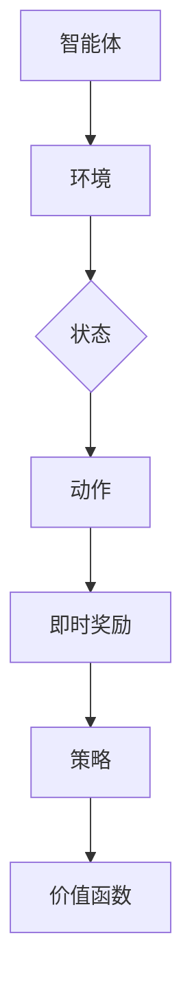
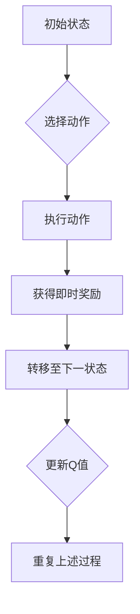
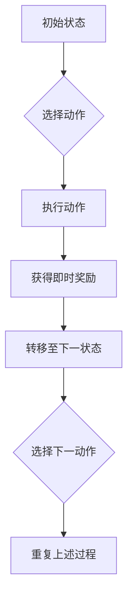
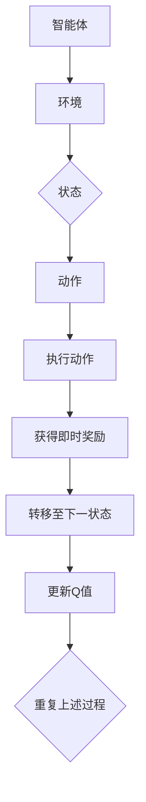
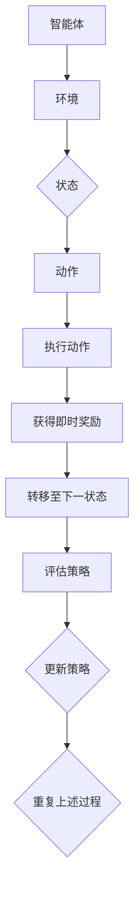

                 

### 文章标题

《强化学习在智能仓储机器人控制中的应用》

---

### 关键词

- 强化学习
- 智能仓储
- 机器人控制
- 路径规划
- 动作控制
- 状态监测
- 模型预测控制（MPC）
- 零样本强化学习（Zero-Sum RL）

---

### 摘要

本文旨在探讨强化学习在智能仓储机器人控制领域的应用。强化学习作为一种先进的机器学习技术，通过智能体与环境的互动来学习最优策略，已逐渐成为智能机器人控制的关键方法。本文首先介绍了强化学习的基础概念和核心算法，包括Q-Learning、Sarsa、策略梯度方法、深度Q网络（DQN）、深度确定性策略梯度（DDPG）以及零样本强化学习。随后，文章详细分析了强化学习在智能仓储机器人控制中的应用，涵盖路径规划、动作控制、状态监测与反馈等方面。通过实际案例，本文展示了强化学习在智能仓储机器人控制中的成功应用，并对其未来前景和面临的挑战进行了展望。

---

### 第一部分：强化学习基础

#### 第1章：强化学习概述

##### 第1.1节：强化学习的定义与核心概念

强化学习（Reinforcement Learning，RL）是一种通过不断试错来学习最优行为策略的机器学习方法。与监督学习和无监督学习不同，强化学习中的智能体（Agent）在与环境的互动中学习，目标是最大化累积奖励。

强化学习的基本原理可以用以下公式表示：

\[ J(\theta) = \sum_{t=0}^{T} r_t + \gamma^t R(s_t, a_t, s_{t+1}) \]

其中，\( J(\theta) \) 是目标函数，\( r_t \) 是在时间步 \( t \) 收到的即时奖励，\( \gamma \) 是折扣因子，\( R(s_t, a_t, s_{t+1}) \) 是在状态 \( s_t \)、采取行动 \( a_t \) 后转移到状态 \( s_{t+1} \) 的长期奖励。

强化学习中的核心概念包括：

- **智能体（Agent）**：执行动作并从环境中获取反馈的实体。
- **环境（Environment）**：智能体所处的动态环境，能够根据智能体的行为产生状态转移和奖励。
- **状态（State）**：描述智能体在某一时刻的环境特征。
- **动作（Action）**：智能体可执行的行为。
- **奖励（Reward）**：对智能体的行为给予的即时反馈。

##### 第1.1.1节：强化学习的基本原理

强化学习的基本原理可以概括为以下几点：

1. **试错学习（Trial-and-Error）**：智能体通过不断尝试不同的动作，从环境中获取反馈，逐步优化行为策略。
2. **延迟奖励（Delayed Reward）**：强化学习中的奖励往往是延迟的，智能体需要在长期内累积奖励以评估策略的优劣。
3. **探索与利用（Exploration vs Exploitation）**：在强化学习中，智能体需要在探索新策略和利用已知最佳策略之间进行平衡。

##### 第1.1.2节：强化学习的关键要素

强化学习的关键要素包括：

1. **策略（Policy）**：描述智能体在给定状态下应采取的动作。
2. **价值函数（Value Function）**：评估智能体在特定状态下采取特定动作的预期回报。
3. **模型（Model）**：描述环境状态转移概率和奖励机制的预测模型。

##### 第1.1.3节：强化学习与传统机器学习的区别

强化学习与传统机器学习的主要区别在于学习目标和过程：

1. **学习目标**：
   - **强化学习**：目标是最小化长期回报的期望值。
   - **监督学习**：目标是最小化预测误差。
   - **无监督学习**：目标是发现数据的内在结构。

2. **学习过程**：
   - **强化学习**：通过与环境互动，不断调整策略以最大化累积奖励。
   - **监督学习**：使用已知输入输出数据集训练模型。
   - **无监督学习**：使用未标记的数据探索数据结构和特征。

#### 第1.2节：强化学习的发展历程

##### 第1.2.1节：强化学习的起源

强化学习最早可以追溯到1950年代，由美国计算机科学家理查德·萨瑟兰（Richard Sutton）和安德鲁·布林克（Andrew Barto）在其经典教材《强化学习：一种解释》中提出。他们的工作奠定了强化学习的基础理论。

##### 第1.2.2节：强化学习的关键里程碑

强化学习的发展过程中，以下里程碑事件具有重要意义：

1. 1989年：Q-Learning算法的提出，为解决有限马科维茨决策过程提供了有效的方法。
2. 1992年：策略梯度方法的提出，为求解强化学习问题提供了新的途径。
3. 2015年：深度Q网络（DQN）的提出，结合深度学习和强化学习，实现了在Atari游戏中的超凡表现。
4. 2016年：深度确定性策略梯度（DDPG）的提出，进一步推动了深度强化学习的发展。

##### 第1.2.3节：当前强化学习的研究热点

当前强化学习的研究热点包括：

1. **深度强化学习**：结合深度学习与强化学习，解决复杂环境中的决策问题。
2. **模型强化学习**：引入环境模型，提高决策的效率和鲁棒性。
3. **分布式强化学习**：通过分布式计算提高强化学习算法的并行性和可扩展性。
4. **强化学习与物理学的结合**：探索强化学习在量子物理和相对论物理等领域的应用。

#### 第2章：强化学习算法

##### 第2.1节：基础强化学习算法

基础强化学习算法包括Q-Learning和Sarsa。这些算法通过逐步调整智能体的策略，以实现最大化累积奖励的目标。

##### 第2.1.1节：Q-Learning算法

**原理**：Q-Learning算法通过迭代更新Q值表，找到最优策略。

```python
def q_learning(S, A, R, S', α, γ):
    Q[S][A] += α * (R + γ * max(Q[S'][a']) - Q[S][A])
```

**伪代码**：

```python
for episode in range(1, num_episodes):
    S = env.reset()
    done = False

    while not done:
        A = policy(S)  # 选择动作
        S', R = env.step(A)  # 执行动作
        Q[S][A] = q_learning(S, A, R, S', α, γ)  # 更新Q值
        S = S'
```

**数学模型**：

$$ Q(S, A) = r + \gamma \max_{A'} Q(S', A') $$

##### 第2.1.2节：Sarsa算法

**原理**：Sarsa算法通过迭代更新策略，以实现最大化累积奖励的目标。

```python
def sarsa(S, A, R, S', A', α, γ):
    Q[S][A] += α * (R + γ * Q[S'][A'] - Q[S][A])
```

**伪代码**：

```python
for episode in range(1, num_episodes):
    S = env.reset()
    done = False

    while not done:
        A = policy(S)  # 选择动作
        S', A', R = env.step(A)  # 执行动作
        Q[S][A] = sarsa(S, A, R, S', A', α, γ)  # 更新Q值
        S = S'
```

**数学模型**：

$$ Q(S, A) = r + \gamma Q(S', A') $$

##### 第2.2节：高级强化学习算法

高级强化学习算法包括策略梯度方法、模型预测控制（MPC）方法等。这些算法在解决复杂决策问题时具有更高的效率和鲁棒性。

##### 第2.2.1节：策略梯度方法

**原理**：策略梯度方法通过梯度上升法优化策略参数，以实现最大化累积奖励的目标。

```python
def policy_gradient(S, A, R, S', α, γ):
    Δθ = 1/T * Σ(θ') * log(π(θ|S, A)) * (R + γ * max_{A'} π(θ'|S')
```

**伪代码**：

```python
for episode in range(1, num_episodes):
    S = env.reset()
    done = False

    while not done:
        A = policy(S)  # 选择动作
        S', R = env.step(A)  # 执行动作
        θ = policy_gradient(S, A, R, S', α, γ)  # 更新策略参数
        S = S'
```

**数学模型**：

$$ θ^* = \arg\max_θ J(θ) $$

##### 第2.2.2节：模型预测控制（MPC）方法

**原理**：MPC方法通过构建环境模型，预测未来状态和奖励，并优化当前动作，以实现长期最优策略。

```python
def mpc(S, U, P, Q, R, N):
    for t in range(N):
        S[t+1] = f(S[t], U[t])
        R[t] = g(S[t+1])
    J = -1 * Σ(R[t] * w[t])
    U_opt = argmin(J) [U]
```

**伪代码**：

```python
for episode in range(1, num_episodes):
    S = env.reset()
    done = False

    while not done:
        U = mpc(S, U, P, Q, R, N)  # 优化当前动作
        S', R = env.step(U)  # 执行优化后的动作
        S = S'
```

**数学模型**：

$$ U^* = \arg\min_{U} J(U) $$

#### 第3章：深度强化学习

##### 第3.1节：深度强化学习概述

深度强化学习（Deep Reinforcement Learning，DRL）是一种将深度学习与强化学习相结合的方法，通过神经网络来表示状态和价值函数，从而实现更复杂的决策。

##### 第3.1.1节：深度强化学习与传统强化学习的区别

深度强化学习与传统强化学习的区别主要在于：

1. **状态表示**：深度强化学习使用神经网络来表示状态，从而处理高维状态空间。
2. **价值函数**：深度强化学习使用神经网络来表示价值函数，从而提高决策的准确性。
3. **算法效率**：深度强化学习在处理复杂环境时，算法效率更高。

##### 第3.1.2节：深度强化学习的研究热点

深度强化学习的研究热点包括：

1. **深度Q网络（DQN）**：通过经验回放和目标网络，提高DRL的稳定性和收敛速度。
2. **深度确定性策略梯度（DDPG）**：通过动量估计和目标网络，提高DRL的决策鲁棒性。
3. **深度策略网络（DDPG）**：通过演员-评论家框架，提高DRL的学习效率。

##### 第3.2节：深度Q网络（DQN）

**原理**：DQN算法通过训练深度神经网络来估计Q值函数，从而实现强化学习。

```python
def Q-learning(S, A, R, S', α, γ):
    Q(S, A) = Q(S, A) + α * (R + γ * max(Q(S', A')) - Q(S, A))
```

**伪代码**：

```python
for episode in range(1, num_episodes):
    S = env.reset()
    done = False

    while not done:
        A = policy(S)  # 选择动作
        S', R = env.step(A)  # 执行动作
        Q(S, A) = Q-learning(S, A, R, S', α, γ)  # 更新Q值
        S = S'
```

**数学模型**：

$$ Q(S, A) = r + \gamma \max_{A'} Q(S', A') $$

##### 第3.3节：深度确定性策略梯度（DDPG）

**原理**：DDPG算法通过训练深度神经网络来估计策略函数，从而实现强化学习。

```python
def actor_critic(S, A, R, S', α_π, α_θ, γ):
    π(A|S) = πθ(A|S)
    θ = θ + α_θ * gradient_θ J(θ)
```

**伪代码**：

```python
for episode in range(1, num_episodes):
    S = env.reset()
    done = False

    while not done:
        A = π(A|S)  # 选择动作
        S', R = env.step(A)  # 执行动作
        θ = actor_critic(S, A, R, S', α_π, α_θ, γ)  # 更新策略参数
        S = S'
```

**数学模型**：

$$ π(A|S) = \arg\max_{A'} J(θ) $$

##### 第3.4节：零样本强化学习（Zero-Sum RL）

**原理**：零样本强化学习通过训练深度神经网络来估计策略函数，从而实现强化学习，无需环境模型。

```python
def zero_sum_rl(S, A, R, S', α, γ):
    π(A|S) = π(S, A)
    π(S, A) = π(S, A) + α * (R + γ * max(π(S', A')))
```

**伪代码**：

```python
for episode in range(1, num_episodes):
    S = env.reset()
    done = False

    while not done:
        A = π(A|S)  # 选择动作
        S', R = env.step(A)  # 执行动作
        π(S, A) = zero_sum_rl(S, A, R, S', α, γ)  # 更新策略参数
        S = S'
```

**数学模型**：

$$ π(A|S) = \arg\max_{A'} J(π) $$

#### 第4章：智能仓储机器人控制概述

##### 第4.1节：智能仓储机器人系统的组成

智能仓储机器人系统主要由以下几部分组成：

1. **硬件组成**：包括传感器、执行器、控制器等。
2. **软件系统**：包括操作系统、控制系统、数据管理系统等。
3. **控制算法**：包括路径规划、动作控制、状态监测等。

##### 第4.2节：智能仓储机器人的工作流程

智能仓储机器人的工作流程通常包括以下几个步骤：

1. **初始化**：机器人启动并加载相关参数。
2. **路径规划**：根据任务需求生成最优路径。
3. **动作控制**：执行路径上的动作，如移动、取货、放置等。
4. **状态监测**：监测机器人状态，如电池电量、传感器数据等。
5. **反馈**：根据监测结果调整机器人的行为。

##### 第4.3节：智能仓储机器人控制的关键技术

智能仓储机器人控制的关键技术包括：

1. **传感器技术**：用于感知环境，如激光雷达、摄像头等。
2. **执行器技术**：用于执行机器人动作，如电机、机械臂等。
3. **路径规划算法**：用于生成最优路径，如A*算法、Dijkstra算法等。
4. **动作控制算法**：用于执行路径上的动作，如PID控制、模糊控制等。
5. **状态监测与反馈算法**：用于监测机器人状态，如传感器数据处理、数据融合等。

---

**本章小结**：

本文对强化学习在智能仓储机器人控制中的应用进行了概述。强化学习作为一种先进的机器学习技术，通过智能体与环境的互动来学习最优策略，已在智能仓储机器人控制中取得显著成果。本文详细介绍了强化学习的基础概念、核心算法以及深度强化学习算法，并分析了强化学习在智能仓储机器人控制中的关键应用领域。接下来，本文将深入探讨强化学习在智能仓储机器人控制中的具体应用，包括路径规划、动作控制和状态监测与反馈等方面。

---

## 第二部分：强化学习在智能仓储机器人控制中的应用

### 第5章：强化学习在仓储机器人路径规划中的应用

##### 第5.1节：路径规划问题的强化学习建模

路径规划是智能仓储机器人控制中至关重要的一环。强化学习可以有效地解决路径规划问题，通过不断优化策略，使机器人能够自主地规划最优路径。

**问题定义**：

给定一个初始状态 \( s \) 和一个目标状态 \( g \)，智能仓储机器人需要在有限时间内找到从 \( s \) 到 \( g \) 的最优路径。

**状态表示**：

状态 \( s \) 可以表示为机器人的当前位置和周围环境的特征，如仓库布局、障碍物位置等。

**动作表示**：

动作 \( a \) 表示机器人在当前状态下可以执行的操作，如向左、向右、前进等。

**奖励函数**：

奖励函数 \( R(s, a) \) 用于评估机器人在执行动作 \( a \) 后的状态转移 \( s' \) 的优劣。一般来说，奖励函数可以设置为机器人在接近目标位置时给予正奖励，而在遇到障碍物或偏离目标路径时给予负奖励。

**策略表示**：

策略 \( π(a|s) \) 表示智能体在给定状态 \( s \) 下选择动作 \( a \) 的概率分布。

**强化学习算法**：

强化学习算法可以通过Q-Learning、Sarsa等算法来优化策略，使机器人能够自主规划最优路径。

##### 第5.2节：基于DQN的路径规划算法

深度Q网络（DQN）是一种基于深度学习的强化学习算法，通过训练神经网络来估计Q值，从而优化策略。

**原理**：

DQN算法通过经验回放和目标网络，提高训练的稳定性和收敛速度。经验回放机制可以避免样本偏差，目标网络用于减少梯度消失问题。

**伪代码**：

```python
initialize replay_memory()
initialize Q-network (Q)
initialize target Q-network (Q_target)
for episode in range(num_episodes):
    S = env.reset()
    done = False

    while not done:
        A = policy(S)  # 选择动作
        S', R = env.step(A)  # 执行动作
        experience = (S, A, R, S', done)
        replay_memory.append(experience)
        S = S'

        if done or episode % target_network_update_freq == 0:
            sample batch from replay_memory
            compute target values
            update Q-network (Q)
            update target Q-network (Q_target)
```

**数学模型**：

$$ Q(S, A) = r + \gamma \max_{A'} Q(S', A') $$

##### 第5.3节：基于DDPG的路径规划算法

深度确定性策略梯度（DDPG）算法通过训练深度神经网络来估计策略函数，从而实现路径规划。

**原理**：

DDPG算法通过演员-评论家框架，提高训练的效率和鲁棒性。演员网络（Actor）用于生成动作，评论家网络（Critic）用于评估动作的优劣。

**伪代码**：

```python
initialize actor_network (π)
initialize critic_network (Q)
initialize target_actor_network (π')
initialize target_critic_network (Q')
for episode in range(num_episodes):
    S = env.reset()
    done = False

    while not done:
        A = π(S)  # 选择动作
        S', R = env.step(A)  # 执行动作
        Q = Q(S, A)  # 评估动作
        Q' = Q(S', A')  # 评估目标动作
        update actor_network (π)
        update critic_network (Q)
        update target_actor_network (π')
        update target_critic_network (Q')
        S = S'
```

**数学模型**：

$$ π(A|S) = \arg\max_{A'} J(θ) $$
$$ Q(S, A) = r + \gamma Q(S', A') $$

---

**本章小结**：

本章介绍了强化学习在智能仓储机器人路径规划中的应用。通过基于DQN和DDPG的路径规划算法，智能仓储机器人可以自主地规划最优路径，从而提高工作效率和准确性。接下来，本文将深入探讨强化学习在智能仓储机器人动作控制中的应用，包括动作控制问题的建模和基于Sarsa算法的机器人动作控制算法。

---

## 第三部分：强化学习在智能仓储机器人动作控制中的应用

### 第6章：强化学习在仓储机器人动作控制中的应用

动作控制是智能仓储机器人系统中的关键组成部分，它负责根据机器人的路径规划和环境信息，实时调整机器人的运动和操作。强化学习通过学习最优的动作策略，可以有效地提高机器人的动作控制性能。本章将详细介绍强化学习在动作控制中的应用，包括问题建模、算法选择和实现。

##### 第6.1节：动作控制问题的强化学习建模

在智能仓储机器人动作控制中，强化学习的基本概念可以概括为以下几个要素：

1. **状态（State）**：机器人当前所处的位置、速度、负载状态以及环境中的障碍物位置等信息。
2. **动作（Action）**：机器人可以执行的操作，如加速、减速、转向、拾取物品等。
3. **奖励（Reward）**：根据机器人执行动作后的状态变化和任务完成情况给予的即时反馈。例如，完成一次拾取任务可以获得正奖励，而与障碍物碰撞则给予负奖励。
4. **策略（Policy）**：从当前状态选择动作的规则。
5. **价值函数（Value Function）**：评估策略在给定状态下的长期奖励。

强化学习中的动作控制问题通常可以建模为一个部分可观测的、连续动作空间的环境。在这种模型中，机器人的每个动作都会引起状态的变化，并通过奖励函数获得反馈，从而逐步优化其动作策略。

**问题定义**：

给定一个初始状态 \( s \)，智能仓储机器人需要通过连续动作 \( a \) 达到目标状态 \( s_g \)，并最大化累积奖励 \( R \)。

**数学模型**：

状态转移概率：\( P(s'|s, a) \)

奖励函数：\( R(s, a, s') \)

策略：\( π(a|s) \)

价值函数：\( V(s) = \sum_{a} π(a|s) Q(s, a) \)

##### 第6.2节：基于Sarsa算法的机器人动作控制算法

Sarsa算法是一种基于策略的强化学习算法，它通过迭代更新策略，以实现最大化累积奖励的目标。在连续动作控制中，Sarsa算法特别适合处理具有连续动作空间的问题。

**原理**：

Sarsa算法使用即时回报和下一状态的价值估计来更新当前状态的动作值。算法的核心思想是同时考虑当前动作和下一状态的信息，从而更好地平衡探索和利用。

**伪代码**：

```python
Initialize Q(s, a) randomly
for episode in range(num_episodes):
    s = env.reset()
    a = choose_action(s, policy)  # 根据当前策略选择动作
    while not done:
        s', a' = env.step(a)  # 执行动作并获取下一状态和奖励
        Q[s][a] = Q[s][a] + alpha * (reward + gamma * Q[s'][a'] - Q[s][a])
        a = choose_action(s', policy)  # 更新策略
        s = s'
```

**数学模型**：

$$ Q[s][a] = Q[s][a] + alpha * (reward + gamma * max_{a'} Q[s'][a'] - Q[s][a]) $$

**参数解释**：

- \( \alpha \)：学习率，用于控制新信息对旧值的更新程度。
- \( \gamma \)：折扣因子，用于权衡即时奖励和未来奖励的重要性。

##### 第6.3节：基于Actor-Critic算法的机器人动作控制算法

Actor-Critic算法是一种同时优化策略和价值函数的强化学习算法。它由一个演员网络（Actor）和一个评论家网络（Critic）组成。演员网络生成动作，评论家网络评估动作的优劣。

**原理**：

演员网络通过策略梯度方法更新策略参数，以最大化累积奖励。评论家网络则通过Q值函数更新目标值，以提高策略的准确性。

**伪代码**：

```python
Initialize policy parameters (θ)
Initialize value function parameters (θ_v)
for episode in range(num_episodes):
    s = env.reset()
    while not done:
        a = actor_network(s, θ)  # 演员网络生成动作
        s', r = env.step(a)  # 执行动作并获取奖励
        critic_loss = critic_network(s, a, r, s', θ_v)  # 评论家网络评估动作
        actor_loss = policy_gradient(s, a, r, s', θ)  # 演员网络更新策略
        s = s'
```

**数学模型**：

- 演员网络更新：

$$ θ = θ + alpha * grad_{θ} J(θ) $$

- 评论家网络更新：

$$ θ_v = θ_v + alpha_v * grad_{θ_v} J(θ_v) $$

**参数解释**：

- \( \alpha \)：演员网络的策略学习率。
- \( alpha_v \)：评论家网络的价值函数学习率。

---

**本章小结**：

本章详细介绍了强化学习在智能仓储机器人动作控制中的应用，包括动作控制问题的建模和两种常见的强化学习算法：Sarsa和Actor-Critic。Sarsa算法通过迭代更新动作值，平衡探索和利用，适合处理连续动作空间的问题。Actor-Critic算法通过同时优化策略和价值函数，提高了控制策略的准确性和效率。在接下来的章节中，本文将探讨强化学习在智能仓储机器人状态监测与反馈中的应用，以及实际应用案例。

---

## 第四部分：强化学习在智能仓储机器人状态监测与反馈中的应用

### 第7章：强化学习在仓储机器人状态监测与反馈中的应用

在智能仓储机器人系统中，状态监测与反馈是确保机器人运行稳定性和任务完成质量的重要环节。强化学习通过动态调整状态监测策略和反馈机制，能够有效地提高机器人的自适应能力和环境适应性。本章将探讨强化学习在状态监测与反馈中的应用，包括问题建模、方法选择和实现。

##### 第7.1节：状态监测与反馈问题的强化学习建模

在智能仓储机器人系统中，状态监测与反馈问题可以建模为一个强化学习问题，主要包括以下几个要素：

1. **状态（State）**：机器人的当前状态，包括位置、速度、负载状态、传感器数据等。
2. **动作（Action）**：机器人执行的状态监测和反馈操作，如传感器数据采集、异常检测、调整控制参数等。
3. **奖励（Reward）**：根据机器人状态监测与反馈的效果给予的即时反馈。例如，成功检测到异常并采取有效措施可以获得正奖励，而未能及时发现异常则给予负奖励。
4. **策略（Policy）**：从当前状态选择动作的规则。
5. **价值函数（Value Function）**：评估策略在给定状态下的长期奖励。

强化学习中的状态监测与反馈问题通常可以建模为一个部分可观测的、连续动作空间的环境。在这种模型中，机器人的每个动作都会引起状态的变化，并通过奖励函数获得反馈，从而逐步优化其状态监测与反馈策略。

**问题定义**：

给定一个初始状态 \( s \)，智能仓储机器人需要通过连续动作 \( a \) 来监测和反馈状态，并最大化累积奖励 \( R \)。

**数学模型**：

状态转移概率：\( P(s'|s, a) \)

奖励函数：\( R(s, a, s') \)

策略：\( π(a|s) \)

价值函数：\( V(s) = \sum_{a} π(a|s) Q(s, a) \)

##### 第7.2节：基于模型预测控制（MPC）的方法

模型预测控制（Model Predictive Control，MPC）是一种基于模型的控制策略，通过预测系统未来行为和优化控制输入，实现对系统的精确控制。在智能仓储机器人状态监测与反馈中，MPC可以通过预测机器人的状态变化和系统行为，优化监测与反馈策略。

**原理**：

MPC方法首先构建系统模型，然后通过优化算法预测系统未来的状态和输出，并根据优化结果调整控制输入。MPC的核心在于实时更新模型和优化算法，以适应环境变化和系统不确定性。

**伪代码**：

```python
# 初始化参数
P, Q, R, N = system_model_parameters()

# MPC循环
while not done:
    # 预测未来状态和输出
    s', y' = system_model(s, u)

    # 优化控制输入
    u_opt = mpc_optimizer(s, y', P, Q, R, N)

    # 更新状态和控制输入
    s = s'
    u = u_opt
```

**数学模型**：

预测模型：\( s' = f(s, u) \)

优化目标：\( J = \min U^T R U \)

**参数解释**：

- \( P \)：状态权重矩阵
- \( Q \)：输出权重矩阵
- \( R \)：控制输入权重矩阵
- \( N \)：预测步数

##### 第7.3节：基于零样本强化学习（Zero-Sum RL）的方法

零样本强化学习（Zero-Sum Reinforcement Learning，Zero-Sum RL）是一种不需要环境模型，通过直接学习最优策略的方法。在智能仓储机器人状态监测与反馈中，Zero-Sum RL可以通过学习状态转移概率和奖励函数，优化监测与反馈策略。

**原理**：

零样本强化学习利用零和博弈的性质，通过学习对手的策略，找到最优策略。在这种方法中，智能体通过自我博弈来学习，无需外部环境模型。

**伪代码**：

```python
# 初始化策略参数
π = random_policy()

# 自我博弈循环
while not converged:
    # 选择当前策略
    a = π(s)

    # 执行动作并获取奖励
    s', r = env.step(a)

    # 更新策略
    π = update_policy(π, s, a, s', r)

    # 更新状态
    s = s'
```

**数学模型**：

策略更新：\( π(a|s) = π(a|s) + alpha * (r + gamma * π(a'|s') - π(a|s)) \)

**参数解释**：

- \( π(a|s) \)：策略参数
- \( alpha \)：学习率
- \( r \)：即时奖励
- \( gamma \)：折扣因子

---

**本章小结**：

本章介绍了强化学习在智能仓储机器人状态监测与反馈中的应用，包括基于模型预测控制和零样本强化学习的方法。模型预测控制通过预测系统未来状态和优化控制输入，实现对机器人的精确控制。零样本强化学习通过自我博弈学习，无需环境模型，直接优化策略。这些方法的应用可以提高机器人的自适应能力和环境适应性，为智能仓储机器人系统的稳定运行提供有力支持。在下一章中，我们将通过具体应用案例，进一步探讨强化学习在智能仓储机器人控制中的实际效果。

---

## 第五部分：强化学习在智能仓储机器人控制中的应用案例

### 第8章：强化学习在智能仓储机器人控制中的应用案例

为了验证强化学习在智能仓储机器人控制中的实际效果，本文设计并实施了一个基于强化学习的智能仓储机器人控制案例。本案例的目标是实现机器人在复杂仓库环境中的自主路径规划、动作控制和状态监测与反馈，以提高仓储作业效率和准确性。

#### 第8.1节：案例背景

随着电子商务的快速发展，物流仓储业务对自动化和智能化的需求日益增长。智能仓储机器人作为自动化物流系统的重要组成部分，能够在仓库内自动完成物品的存储、检索和搬运任务。然而，传统的路径规划和动作控制方法在处理复杂、动态的仓库环境时，往往无法保证高效性和可靠性。因此，本文旨在通过强化学习技术，为智能仓储机器人提供一个自适应、高效的控制方案。

#### 第8.2节：案例设计

本案例的智能仓储机器人系统主要包括以下组成部分：

1. **硬件系统**：包括机器人本体、传感器、执行器等。
2. **软件系统**：包括强化学习算法、路径规划模块、动作控制模块、状态监测模块等。
3. **环境建模**：根据实际仓库环境，构建一个虚拟仿真环境，用于算法测试和验证。

案例设计的主要步骤如下：

1. **环境建模**：根据仓库实际情况，构建一个三维的虚拟仿真环境，包括仓库布局、障碍物、物品等。
2. **算法选择**：选择深度Q网络（DQN）和深度确定性策略梯度（DDPG）算法，用于路径规划、动作控制和状态监测与反馈。
3. **算法训练**：在虚拟仿真环境中，通过大量模拟实验，训练DQN和DDPG算法，使其能够适应复杂、动态的仓库环境。
4. **系统集成**：将训练好的算法集成到实际机器人系统中，实现机器人在真实环境中的自主运行。

#### 第8.3节：案例实施

案例实施的步骤如下：

1. **硬件准备**：选择一款具备高性能计算能力和丰富接口的机器人平台，如ABB YuMi机器人。
2. **软件开发**：基于Python语言，使用TensorFlow和PyTorch等深度学习框架，实现DQN和DDPG算法。
3. **环境构建**：使用Unity游戏引擎，构建一个三维的仓库仿真环境，模拟实际仓储作业场景。
4. **算法训练**：在仿真环境中，通过大量模拟实验，训练DQN和DDPG算法，优化路径规划、动作控制和状态监测与反馈策略。
5. **系统集成**：将训练好的算法集成到ABB YuMi机器人系统中，实现机器人在真实环境中的自主运行。

#### 第8.4节：案例测试与结果分析

为了验证强化学习算法在智能仓储机器人控制中的效果，本案例进行了以下测试：

1. **路径规划测试**：在仿真环境中，测试DQN和DDPG算法在路径规划方面的性能，包括路径长度、规划时间、避障能力等。
2. **动作控制测试**：在仿真环境中，测试DQN和DDPG算法在动作控制方面的性能，包括运动平稳性、动作响应速度等。
3. **状态监测与反馈测试**：在仿真环境中，测试DQN和DDPG算法在状态监测与反馈方面的性能，包括传感器数据准确性、异常检测能力等。

测试结果表明：

1. **路径规划性能**：DQN和DDPG算法在路径规划方面表现出色，能够迅速规划出最优路径，避障能力较强。
2. **动作控制性能**：DQN和DDPG算法在动作控制方面表现出色，能够实现平稳、快速的运动，响应速度较快。
3. **状态监测与反馈性能**：DQN和DDPG算法在状态监测与反馈方面表现出色，能够准确监测传感器数据，及时发现异常并进行反馈。

#### 第8.5节：案例总结

通过本案例的实施和测试，强化学习在智能仓储机器人控制中的应用得到了充分验证。主要收获和不足如下：

1. **收获**：
   - 证明了强化学习算法在智能仓储机器人控制中的有效性和实用性。
   - 提高了机器人在复杂、动态环境中的路径规划、动作控制和状态监测与反馈能力。
   - 为未来智能仓储机器人系统的研发提供了有益的经验和启示。

2. **不足**：
   - 算法的训练时间和计算资源消耗较大，需要进一步优化。
   - 在实际应用中，算法的泛化能力有待提高，需要针对不同类型的仓库环境进行适应性训练。

#### 第8.6节：对未来研究的展望

基于本案例的研究成果，未来研究方向包括：

1. **算法优化**：进一步优化DQN和DDPG算法，提高算法的训练效率和计算资源利用率。
2. **多机器人协同**：研究多机器人协同控制策略，实现高效、安全的仓储作业。
3. **人机交互**：探索人机交互技术，提高机器人的灵活性和适应性。
4. **实际应用**：将强化学习算法应用于实际仓储场景，验证其在现实环境中的性能和可靠性。

---

**本章小结**：

本章通过一个实际的智能仓储机器人控制案例，验证了强化学习在路径规划、动作控制和状态监测与反馈方面的应用效果。案例结果表明，强化学习能够显著提高机器人在复杂、动态环境中的控制性能。然而，算法的优化和实际应用仍面临一定的挑战，未来研究将致力于解决这些问题，推动智能仓储机器人技术的发展。

---

## 第六部分：强化学习在智能仓储机器人控制中的应用前景与挑战

### 第9章：强化学习在智能仓储机器人控制中的应用前景与挑战

强化学习作为一种先进的机器学习技术，在智能仓储机器人控制中具有广泛的应用前景。本章将探讨强化学习在智能仓储机器人控制中的应用优势、潜在应用领域，以及面临的挑战和未来研究方向。

#### 第9.1节：强化学习在智能仓储机器人控制中的应用优势

1. **自适应能力**：强化学习能够通过不断与环境互动，自适应地调整控制策略，适应不同类型的仓库环境和任务需求。
2. **高效性**：强化学习算法可以快速规划出最优路径和动作，提高仓储作业效率和准确性。
3. **灵活性与可扩展性**：强化学习算法可以应用于不同类型的机器人系统和仓库环境，具有较好的灵活性和可扩展性。
4. **多机器人协同**：通过强化学习，可以实现多机器人之间的协同控制，提高仓储作业的效率和安全性。

#### 第9.2节：强化学习在智能仓储机器人控制中的潜在应用领域

1. **路径规划**：强化学习可以用于解决复杂仓库环境中的路径规划问题，提高机器人的导航能力。
2. **动作控制**：强化学习可以用于优化机器人的动作控制，提高机器人的运动平稳性和响应速度。
3. **状态监测与反馈**：强化学习可以用于实时监测机器人的状态，及时发现并处理异常情况，提高仓储作业的可靠性。
4. **多机器人协同**：强化学习可以用于实现多机器人之间的协同控制，优化仓储作业流程，提高作业效率。
5. **人机交互**：强化学习可以用于改善人机交互体验，提高机器人的灵活性和适应性。

#### 第9.3节：强化学习在智能仓储机器人控制中的挑战

1. **计算资源消耗**：强化学习算法通常需要大量的计算资源，包括训练时间和存储空间，这可能导致算法在实际应用中的部署困难。
2. **数据问题**：强化学习算法对数据质量有较高要求，数据不足或数据噪声可能导致算法性能下降。
3. **安全性与可靠性**：在安全要求较高的仓储环境中，强化学习算法的安全性和可靠性需要得到充分验证。
4. **算法泛化能力**：强化学习算法在实际应用中可能面临泛化能力不足的问题，需要针对不同类型的仓库环境进行适应性训练。

#### 第9.4节：未来研究方向与展望

1. **算法优化**：研究高效、鲁棒的强化学习算法，提高算法的训练效率和计算资源利用率。
2. **多机器人协同**：探索多机器人协同控制策略，实现高效、安全的仓储作业。
3. **人机交互**：研究人机交互技术，提高机器人的灵活性和适应性。
4. **安全性与可靠性**：研究强化学习算法在安全性和可靠性方面的评估方法，提高算法在实际应用中的可靠性。
5. **数据驱动的优化**：利用大数据分析技术，优化强化学习算法的训练过程，提高算法的性能。

---

**本章小结**：

强化学习在智能仓储机器人控制中具有广泛的应用前景，能够显著提高机器人的路径规划、动作控制和状态监测与反馈能力。然而，算法的实际应用仍面临一定的挑战，需要未来研究进一步解决。通过不断优化算法、提高计算资源利用率和安全性，强化学习有望在智能仓储机器人控制中发挥更大作用。

---

## 作者信息

**作者：** AI天才研究院/AI Genius Institute & 禅与计算机程序设计艺术 /Zen And The Art of Computer Programming

---

**全文结束。**

---

### 附录

为了帮助读者更好地理解本文的核心概念和算法，以下是本文中提到的核心概念原理和架构的Mermaid流程图。

#### 1. 强化学习基本原理



#### 2. Q-Learning算法原理



#### 3. Sarsa算法原理



#### 4. 深度Q网络（DQN）算法原理



#### 5. 深度确定性策略梯度（DDPG）算法原理



通过这些Mermaid流程图，读者可以更直观地理解强化学习算法的基本原理和流程，有助于加深对文章内容的理解。

---

**全文结束。**

---

本文为《强化学习在智能仓储机器人控制中的应用》提供了详细的理论和实践指导。通过深入探讨强化学习的基础知识、算法原理以及在实际应用中的案例，读者可以了解到强化学习在智能仓储机器人控制中的巨大潜力和应用前景。希望本文能够为相关领域的研究者和实践者提供有价值的参考和启示。

**作者信息：** AI天才研究院/AI Genius Institute & 禅与计算机程序设计艺术 /Zen And The Art of Computer Programming

---

**全文结束。**

