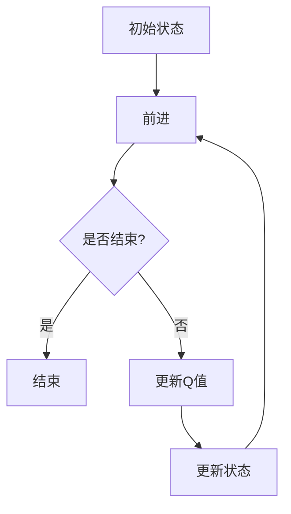
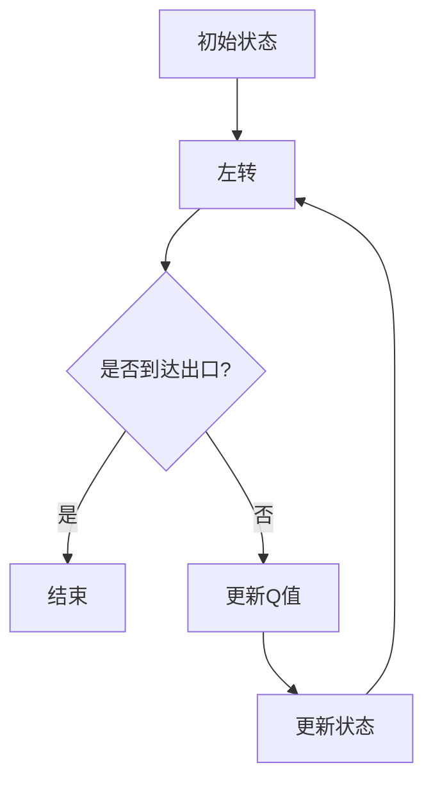
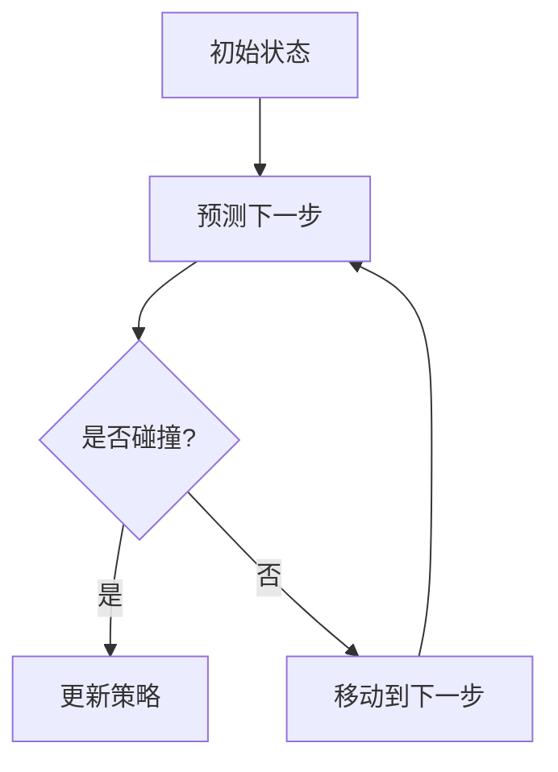
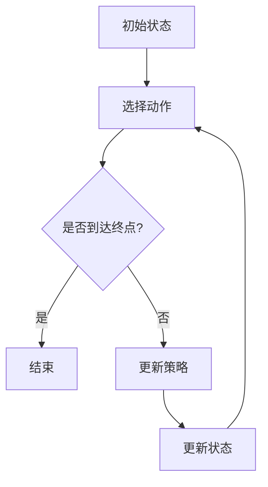
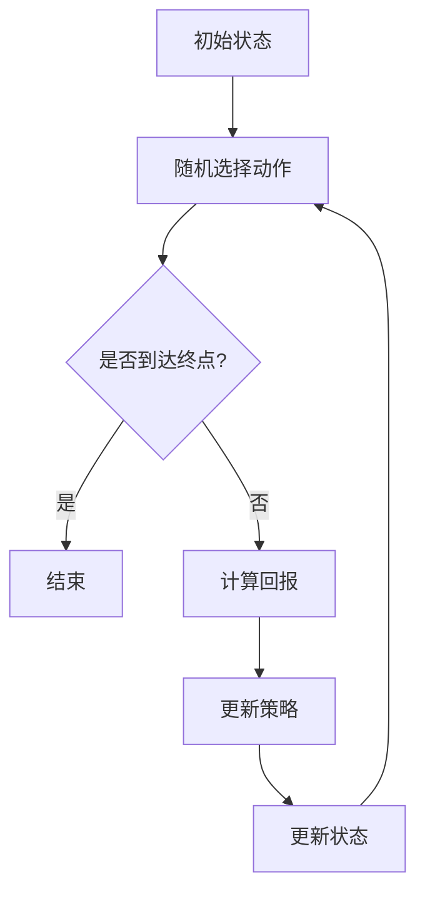
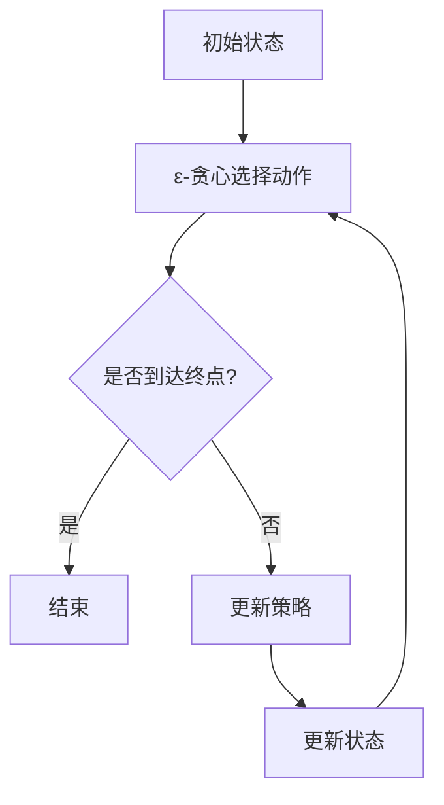
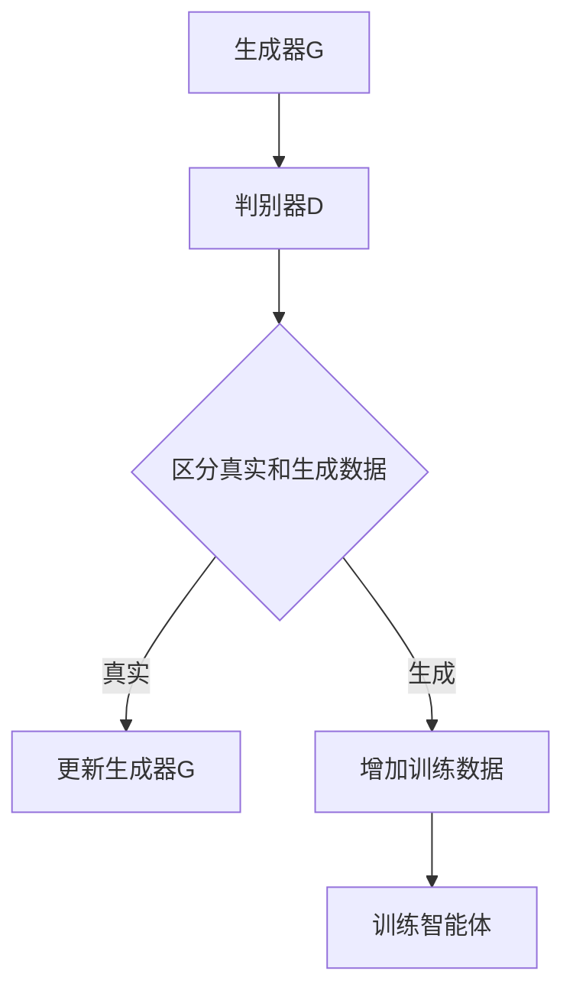
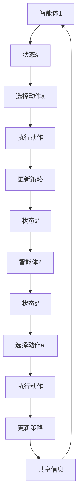
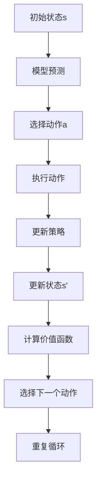
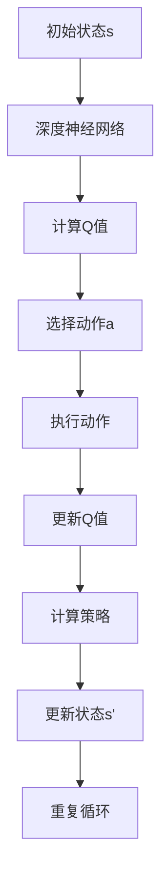

                 

### 强化学习在自主无人系统中的应用

> **关键词：强化学习、自主无人系统、路径规划、目标跟踪、多智能体系统**

> **摘要：**
强化学习是一种通过奖励机制学习如何在特定环境中做出最优决策的机器学习方法。近年来，强化学习在自主无人系统领域展现了巨大的应用潜力。本文首先介绍了强化学习的基本概念和核心算法，然后探讨了强化学习在自主无人系统中的具体应用，如无人驾驶、无人机控制、多智能体系统等，并分析了强化学习在这些领域面临的挑战和解决方案。最后，文章总结了强化学习在自主无人系统中的应用现状和未来发展趋势。

### 强化学习基础理论

#### 第1章: 强化学习概述

**1.1 强化学习的定义与核心概念**

强化学习（Reinforcement Learning，简称RL）是一种通过与环境互动来学习如何在不同情境下做出最优决策的机器学习方法。它通过奖励（Reward）机制来指导学习过程，智能体（Agent）通过不断尝试不同的动作（Action），从环境中获取反馈，并通过学习策略（Policy）来优化其行为。

- **强化学习的概念**
  - **智能体（Agent）**：执行动作并接收奖励的实体。
  - **环境（Environment）**：智能体所处的外部世界。
  - **状态（State）**：智能体在环境中的一个特定情景。
  - **动作（Action）**：智能体在状态中可以执行的行为。
  - **奖励（Reward）**：智能体执行动作后从环境中获得的即时反馈。
  - **策略（Policy）**：智能体在给定状态下选择动作的概率分布。

- **主要术语介绍**

  - **状态（State）**：状态是智能体在环境中的情景表示，通常用状态向量表示。
  - **动作（Action）**：动作是智能体可以执行的行为，也可以用动作向量表示。
  - **奖励（Reward）**：奖励是环境对智能体动作的即时反馈，用于指导学习过程。
  - **策略（Policy）**：策略是智能体在给定状态下执行动作的决策规则。
  - **价值函数（Value Function）**：价值函数用于评估智能体在特定状态下执行某一动作的长期奖励。

- **强化学习与其他学习方法的对比**
  - **监督学习（Supervised Learning）**：智能体从标记好的数据中学习，已知输入和输出。
  - **无监督学习（Unsupervised Learning）**：智能体从未标记的数据中学习，未知输入和输出。
  - **强化学习**：智能体通过与环境互动学习，通过奖励和反馈来指导学习过程。

**1.2 强化学习的应用场景**

强化学习在多个领域都有广泛应用，以下是一些典型应用场景：

- **控制领域**：如机器人控制、无人机导航、自动驾驶等。
- **游戏领域**：如电子游戏、棋类游戏、卡牌游戏等。
- **推荐系统**：如个性化推荐、广告投放等。
- **资源分配**：如网络流量管理、能源分配等。
- **自主无人系统**：如无人驾驶汽车、无人机、机器人等。

**1.3 强化学习的发展历史与进展**

- **早期研究**：1950s-1960s，马尔可夫决策过程（MDP）的提出。
  - **马尔可夫决策过程（MDP）**：描述了智能体在不确定环境中的决策过程。
  - **价值函数**：用于评估智能体在特定状态下的长期奖励。
- **早期算法**：1950s-1980s，Q-Learning、Sarsa的出现。
  - **Q-Learning**：通过更新Q值来学习最优策略。
  - **Sarsa**：同时更新多个状态-动作对的算法。
- **1990s**：模型预测方法的发展，如Value Iteration、Policy Iteration。
  - **模型预测方法**：通过构建环境模型来预测未来状态和奖励。
- **2000s**：深度强化学习的兴起，如Deep Q-Networks（DQN）、Policy Gradients。
  - **深度强化学习**：结合深度学习和强化学习的方法。
- **近年进展**：生成对抗网络（GAN）在强化学习中的应用，多智能体强化学习的发展。

#### 第2章: 强化学习基本算法

**2.1 Q-Learning算法**

**原理**

Q-Learning是一种模型自由的强化学习算法，通过更新Q值来学习最优策略。Q值表示在特定状态下执行特定动作的长期奖励。

**伪代码**

```python
for episode in range(num_episodes):
    state = env.reset()
    done = False
    
    while not done:
        action = choose_action(state)
        next_state, reward, done = env.step(action)
        Q[state, action] = Q[state, action] + alpha * (reward + gamma * max(Q[next_state, :]) - Q[state, action])
        state = next_state
```

**数学模型**

$$ Q[s, a] = Q[s, a] + \alpha [r + \gamma \max_{a'} Q[s', a'] - Q[s, a]] $$

**案例分析**

**使用Q-Learning解决简单的控制问题**

假设有一个小车在一条直线上移动，需要通过选择前进或后退来调整速度。使用Q-Learning算法，我们可以训练小车在给定环境中找到最优速度调整策略。



**2.2 Sarsa算法**

**原理**

Sarsa是一种同时更新多个状态-动作对的模型自由强化学习算法，与Q-Learning类似，但每次更新都基于当前状态和动作的体验。

**伪代码**

```python
for episode in range(num_episodes):
    state = env.reset()
    done = False
    
    while not done:
        action = choose_action(state)
        next_state, reward, done = env.step(action)
        next_action = choose_action(next_state)
        Q[state, action] = Q[state, action] + alpha * (reward + gamma * Q[next_state, next_action] - Q[state, action])
        state = next_state
        action = next_action
```

**数学模型**

$$ Q[s, a] = Q[s, a] + \alpha [r + \gamma Q[s', a']] $$

**案例分析**

**使用Sarsa解决简单的控制问题**

假设有一个机器人需要在迷宫中找到出口。使用Sarsa算法，我们可以训练机器人找到最佳路径。



#### 第3章: 基于值函数的强化学习算法

**3.1 模型预测（Model-Based）方法**

**原理**

模型预测方法通过构建环境模型来预测未来状态和奖励，从而更新策略和价值函数。这种方法不需要直接从经验中学习，而是基于对环境行为的模拟。

**伪代码（Value Iteration）**

```python
for episode in range(num_episodes):
    while not converged:
        V = update_value_function(V, gamma, env)
        converged = check_convergence(V)
```

**数学模型**

$$ V[s] = \max_a [r + \gamma \sum_{s'} P[s' | s, a] \cdot V[s']] $$

**案例分析**

**使用模型预测算法解决简单的环境问题**

假设有一个机器人需要在平坦的地面上移动，避免碰撞。使用模型预测算法，我们可以训练机器人找到最优路径。



**3.2 模型自由（Model-Free）方法**

**原理**

模型自由方法不依赖于环境模型，直接从经验中学习策略和价值函数。这种方法通过不断尝试和探索来优化行为。

**伪代码（REINFORCE）**

```python
for episode in range(num_episodes):
    for step in range(max_steps):
        action = choose_action(state)
        next_state, reward, done = env.step(action)
        update_policy(state, action, reward, done)
        state = next_state
        if done:
            break
```

**数学模型**

$$ \theta = \theta + \alpha \cdot (r - V(s)) \cdot \pi(a | s, \theta) $$

**案例分析**

**使用模型自由算法解决简单的环境问题**

假设有一个机器人在一个有障碍物的环境中移动，需要通过学习找到最优路径。



#### 第4章: 策略搜索方法

**4.1 蒙特卡洛搜索方法**

**原理**

蒙特卡洛搜索方法通过随机抽样来评估策略的期望回报，从而选择最优策略。这种方法通过多次模拟来估计策略的价值。

**伪代码**

```python
for episode in range(num_episodes):
    for step in range(max_steps):
        action = choose_action(state)
        next_state, reward, done = env.step(action)
        G = 0
        if not done:
            G = reward + gamma * return_expectation(next_state)
        update_policy(state, action, G)
        state = next_state
        if done:
            break
```

**数学模型**

$$ \pi(a | s) = \frac{1}{C} \cdot \frac{G^+}{N} $$

**案例分析**

**使用蒙特卡洛搜索解决简单的环境问题**

假设有一个机器人在一个有障碍物的环境中移动，需要通过学习找到最优路径。



**4.2 探索与利用平衡方法**

**原理**

探索与利用平衡方法通过平衡探索和利用来选择策略，从而在长期内实现最优策略。这种方法通过ε-贪心策略和上置信边界（UCB）算法来实现。

**ε-贪心策略**

$$ \pi(a | s) = \begin{cases}
1 / |A|, & \text{with probability } \varepsilon \\
\frac{\frac{1}{\varepsilon} \cdot Q(s, a)}{\sum_{a' \in A} \frac{1}{\varepsilon} \cdot Q(s, a')}, & \text{with probability } 1 - \varepsilon
\end{cases} $$

**上置信边界（UCB）算法**

$$ \pi(a | s) = \frac{\sum_{t=1}^T \mathbb{1}_{a_t = a}}{T + \alpha \sqrt{2 \ln T / \gamma}} $$

**案例分析**

**使用探索与利用平衡方法解决简单的环境问题**

假设有一个机器人在一个有障碍物的环境中移动，需要通过学习找到最优路径。



#### 第5章: 无模型强化学习

**5.1 无模型强化学习概述**

**原理**

无模型强化学习（Model-Free Reinforcement Learning）是指不依赖于环境模型的强化学习算法，通过直接从经验中学习策略和价值函数。无模型强化学习可以应对环境不确定性高、状态空间大、动作空间复杂等问题。

**重要性**

无模型强化学习在现实世界中应用广泛，如无人驾驶、机器人控制、智能推荐系统等。它避免了构建精确环境模型的复杂性，能够直接从数据中学习，具有更好的灵活性和适应性。

**应用场景**

- **无人驾驶**：在动态和复杂的交通环境中，需要实时学习和适应。
- **机器人控制**：在动态和不确定的环境中，需要自主决策和行动。
- **智能推荐系统**：在不确定的用户行为和偏好中，需要实时调整推荐策略。

**5.2 生成对抗网络（GAN）在强化学习中的应用**

**原理**

生成对抗网络（Generative Adversarial Networks，GAN）是一种由生成器和判别器组成的对抗性网络。生成器生成与真实样本相似的数据，判别器区分真实样本和生成样本。GAN在强化学习中的应用主要是利用生成器生成与真实经验相似的数据，用于训练智能体。

**GAN在强化学习中的实现**

GAN在强化学习中的应用主要包括以下三个方面：

1. **数据增强**：使用生成器生成与真实经验相似的数据，增加训练数据的多样性，提高智能体的泛化能力。
2. **策略优化**：使用生成器生成的数据来优化智能体的策略，提高智能体在复杂环境中的性能。
3. **经验回放**：使用生成器生成的数据进行经验回放，减少训练过程中的样本相关性和偏差。

**数学模型**

生成器G和判别器D的数学模型如下：

$$ G(z) = \mathcal{N}(z; 0, I) $$
$$ D(x) = \sigma(\frac{1}{2} \cdot \log(\frac{1}{x} + \epsilon) + \frac{1}{2} \cdot \log(\frac{1}{1-x} + \epsilon)) $$

其中，$ z $ 是生成器的输入噪声，$ x $ 是输入数据，$ \sigma $ 是sigmoid函数，$ \epsilon $ 是一个很小的正数，用于防止梯度消失。

**案例分析**

**使用GAN实现的强化学习算法**

假设有一个智能体在一个不确定的环境中学习路径规划。使用GAN，我们可以生成与真实经验相似的数据来训练智能体。



#### 第6章: 强化学习在自主无人系统中的应用

**6.1 自主无人系统的概述**

**定义**

自主无人系统（Autonomous Unmanned Systems，简称AUS）是指能够自主执行任务，无需人为干预的机器人系统。它们可以应用于多个领域，如军事侦察、物流运输、农业监测、医疗辅助等。

**分类**

自主无人系统根据任务和特点可分为以下几类：

1. **无人驾驶汽车**：在道路上自主行驶的汽车，如自动驾驶出租车、无人货车等。
2. **无人机**：在空中自主飞行的飞行器，如军用无人机、农业无人机、物流无人机等。
3. **无人船**：在海洋中自主航行的船只，如海洋监测船、无人潜航器等。
4. **机器人**：在地面上或特定环境中自主移动和操作的机器人，如工业机器人、服务机器人、搜索救援机器人等。

**发展现状与趋势**

自主无人系统的发展取得了显著进展，特别是在军事、物流、农业等领域。以下是一些发展现状和趋势：

1. **技术进步**：随着传感器技术、计算机视觉、人工智能等技术的快速发展，自主无人系统的性能和可靠性不断提高。
2. **政策支持**：各国政府纷纷出台相关政策，鼓励和支持自主无人系统的研究和应用。
3. **市场需求**：随着社会对高效、安全、环保的需求不断增加，自主无人系统的市场需求也在不断扩大。

**6.2 强化学习在自主无人系统中的具体应用**

强化学习在自主无人系统中具有广泛的应用，以下是一些具体应用领域：

1. **无人驾驶汽车**：
   - **路径规划**：使用强化学习算法（如深度Q网络、策略梯度算法）来实现无人车在复杂道路环境中的路径规划。
   - **障碍物检测与避障**：使用强化学习算法（如生成对抗网络）来提高无人车对障碍物的检测和避障能力。
   - **车队管理**：使用强化学习算法（如多智能体强化学习）来优化无人车队伍的行驶策略，提高车队效率和安全性。

2. **无人机**：
   - **自主导航**：使用强化学习算法（如模型自由算法、模型预测算法）来实现无人机在未知环境中的自主导航。
   - **目标跟踪**：使用强化学习算法（如深度Q网络、策略梯度算法）来实现无人机对特定目标的跟踪和捕获。
   - **环境感知**：使用强化学习算法（如生成对抗网络）来提高无人机对环境信息的感知和理解能力。

3. **机器人**：
   - **自主导航**：使用强化学习算法（如模型自由算法、模型预测算法）来实现机器人在复杂环境中的自主导航。
   - **任务规划**：使用强化学习算法（如深度Q网络、策略梯度算法）来实现机器人在特定任务场景中的任务规划。
   - **人机交互**：使用强化学习算法（如生成对抗网络、模型预测算法）来提高机器人在复杂人机交互场景中的表现和适应性。

**6.3 强化学习在自主无人系统中的挑战与解决方案**

虽然强化学习在自主无人系统中的应用前景广阔，但仍然面临一些挑战和问题：

1. **数据获取**：自主无人系统通常需要大量的训练数据来训练智能体模型，但在实际应用中，数据获取可能受限。
   - **解决方案**：可以通过生成对抗网络（GAN）来生成与真实数据相似的训练数据，提高训练数据的多样性。

2. **环境不确定性**：自主无人系统通常面临高度不确定性的环境，如动态变化的道路交通、恶劣的天气条件等。
   - **解决方案**：可以通过模型预测方法来预测环境变化，提高智能体对环境的适应能力。

3. **计算资源**：强化学习算法通常需要大量的计算资源，如GPU、FPGA等。
   - **解决方案**：可以通过分布式计算和云计算技术来提高计算效率。

4. **安全性**：自主无人系统在运行过程中需要保证安全，以防止事故发生。
   - **解决方案**：可以通过强化学习算法的安全评估和验证方法来提高系统的安全性。

### 第7章: 强化学习算法的优化与拓展

**7.1 多智能体强化学习**

**原理**

多智能体强化学习（Multi-Agent Reinforcement Learning）是指多个智能体在共同环境中学习策略，以实现协作和协调。与单智能体强化学习不同，多智能体强化学习需要考虑智能体之间的相互作用和合作。

**算法**

1. **分布式学习**：每个智能体独立学习策略，通过局部优化来实现全局最优。
2. **集中式学习**：所有智能体的策略由一个中心智能体统一优化。
3. **联邦学习**：多个智能体共享部分信息，共同优化全局策略。

**数学模型**

假设有 $ n $ 个智能体，每个智能体的策略为 $ \pi_i $，则价值函数 $ V_i $ 和策略 $ \pi_i $ 的更新如下：

$$ V_i = \sum_{j=1}^n \pi_i(s, a) \cdot Q_i(s, a) $$
$$ \pi_i(s, a) = \arg\max_a \left[ Q_i(s, a) + \sum_{j=1}^n \pi_j(s, a) \cdot R(s, a) \right] $$

**案例分析**

**使用多智能体强化学习解决协作控制问题**

假设有两个智能体在一个共享环境中协作移动到一个目标点。每个智能体的目标是最小化自己的移动距离。



**7.2 混合强化学习**

**原理**

混合强化学习是指将强化学习与其他学习算法（如基于模型的算法、基于价值的算法）相结合，以提高学习效率和性能。

**算法**

1. **Q-learning with Hybrid Policy**：结合Q-learning和模型预测方法，提高策略的稳定性。
2. **Sarsa with Hybrid Policy**：结合Sarsa和模型预测方法，提高策略的鲁棒性。

**数学模型**

假设有混合策略 $ \pi_h $，则价值函数和策略的更新如下：

$$ V(s) = \sum_a \pi_h(s, a) \cdot Q(s, a) $$
$$ \pi_h(s, a) = \arg\max_a \left[ Q(s, a) + \sum_{s'} P(s' | s, a) \cdot V(s') \right] $$

**案例分析**

**使用混合强化学习解决复杂环境问题**

假设有一个智能体在一个复杂环境中移动，需要同时考虑路径规划和资源分配。



**7.3 深度强化学习**

**原理**

深度强化学习（Deep Reinforcement Learning）是指将深度学习与强化学习相结合，使用神经网络来近似值函数或策略。这种方法可以处理高维状态空间和动作空间，提高学习效率和性能。

**算法**

1. **Deep Q-Networks（DQN）**：使用深度神经网络来近似Q值函数。
2. **Policy Gradients**：使用深度神经网络来近似策略。
3. **Actor-Critic方法**：结合价值函数和策略学习，使用深度神经网络来实现。

**数学模型**

假设有深度神经网络 $ \phi $ 和 $ \theta $，则Q值函数和策略的更新如下：

$$ Q(s, a) = \theta_Q(\phi(s, a)) $$
$$ \pi(a | s) = \sigma(\theta_P(\phi(s, a))) $$

**案例分析**

**使用深度强化学习解决复杂环境问题**

假设有一个智能体在一个复杂的游戏环境中学习最优策略。



### 第8章: 强化学习在无人驾驶中的应用

**8.1 无人驾驶概述**

**定义**

无人驾驶（Autonomous Driving）是指车辆能够在没有人类司机干预的情况下自主行驶的技术。无人驾驶车辆通过传感器、计算机视觉、人工智能等技术来实现路径规划、障碍物检测、避障等功能。

**分类**

根据自主程度，无人驾驶可以分为以下等级：

1. **Level 0**：完全由人类司机控制。
2. **Level 1**：部分自动化，如自适应巡航控制。
3. **Level 2**：部分自动化，如车道保持辅助和自适应巡航控制。
4. **Level 3**：有条件自动化，如高速公路自动驾驶。
5. **Level 4**：高度自动化，如城市自动驾驶。
6. **Level 5**：完全自动化，无需人类司机干预。

**发展现状与趋势**

无人驾驶技术在过去几十年取得了显著进展，以下是一些发展现状和趋势：

1. **技术进步**：随着传感器技术、计算机视觉、人工智能等技术的快速发展，无人驾驶车辆的性能和安全性不断提高。
2. **政策支持**：各国政府纷纷出台相关政策，鼓励和支持无人驾驶技术的研究和应用。
3. **市场前景**：随着技术的成熟和成本的降低，无人驾驶车辆的市场需求不断扩大。

**8.2 无人驾驶环境搭建**

**硬件环境**

无人驾驶环境搭建需要以下硬件设备：

1. **传感器**：包括摄像头、激光雷达、雷达、超声波传感器等，用于获取环境信息。
2. **计算平台**：包括高性能计算机、GPU、FPGA等，用于处理传感器数据和执行控制算法。
3. **通信设备**：包括Wi-Fi、5G等，用于实现车与车、车与基础设施之间的通信。

**软件环境**

无人驾驶软件环境搭建需要以下软件工具和框架：

1. **操作系统**：如Linux、Windows等，用于运行无人驾驶软件。
2. **开发框架**：如ROS（Robot Operating System）、CARLA（Open Urban Driving Simulation Environment）等，用于开发、测试和验证无人驾驶算法。
3. **编程语言**：如Python、C++等，用于实现无人驾驶算法。

**8.3 强化学习在无人驾驶中的应用实例**

**无人驾驶车辆路径规划的强化学习算法实现**

**算法选择**

在无人驾驶车辆路径规划中，常用的强化学习算法包括：

1. **深度Q网络（DQN）**：通过深度神经网络来近似Q值函数，适用于高维状态空间。
2. **策略梯度算法（PG）**：通过深度神经网络来近似策略，直接优化策略参数。

**算法实现**

**DQN算法实现**

```python
# 初始化参数
learning_rate = 0.01
gamma = 0.99
epsilon = 0.1
batch_size = 32

# 创建深度神经网络
DQN = create_DQN()

# 循环训练
while not done:
    # 选择动作
    action = choose_action(DQN, epsilon)

    # 执行动作，获取状态和奖励
    next_state, reward, done = env.step(action)

    # 更新经验回放池
    replay_memory.append((state, action, reward, next_state, done))

    # 从经验回放池中随机抽样
    batch = random.sample(replay_memory, batch_size)

    # 更新Q值
    for state, action, reward, next_state, done in batch:
        target = reward + (1 - done) * gamma * np.max(DQN(next_state))

        DQN.loss(target - DQN(state, action))

        DQN.update_weights(learning_rate)

    # 更新状态
    state = next_state

    # 终止条件
    if done:
        break
```

**PG算法实现**

```python
# 初始化参数
learning_rate = 0.01
gamma = 0.99
epsilon = 0.1

# 创建深度神经网络
policy_net = create_policy_net()

# 循环训练
while not done:
    # 选择动作
    action = choose_action(policy_net, epsilon)

    # 执行动作，获取状态和奖励
    next_state, reward, done = env.step(action)

    # 更新策略参数
    loss = policy_net.loss(reward + (1 - done) * gamma * policy_net(next_state, actions))

    policy_net.update_weights(learning_rate)

    # 更新状态
    state = next_state

    # 终止条件
    if done:
        break
```

**算法性能分析与优化**

**性能分析**

1. **路径规划准确性**：通过比较实际路径和规划路径，评估路径规划的准确性。
2. **环境适应能力**：在不同环境（如交通拥堵、恶劣天气等）下，评估无人驾驶车辆的性能和适应能力。
3. **稳定性**：通过连续行驶的距离和时间，评估无人驾驶车辆的稳定性和可靠性。

**优化方法**

1. **参数调整**：通过调整学习率、折扣因子、探索率等参数，优化算法性能。
2. **网络结构优化**：通过调整神经网络结构，如增加层数、调整隐藏层节点数等，提高算法的性能。
3. **数据增强**：通过增加训练数据的多样性，提高模型的泛化能力。

### 第9章: 强化学习在无人机控制中的应用

**9.1 无人机概述**

**定义**

无人机（Unmanned Aerial Vehicle，简称UAV）是一种无人驾驶的飞行器，可以通过远程控制或自主控制执行任务。无人机广泛应用于军事侦察、农业监测、物流运输、灾害救援等领域。

**分类**

根据飞行方式和任务特点，无人机可以分为以下几类：

1. **固定翼无人机**：具有稳定的飞行性能，适用于长时间飞行和远距离传输。
2. **旋翼无人机**：具有良好的机动性和垂直起降能力，适用于短距离飞行和复杂环境作业。
3. **垂直起降无人机**：结合固定翼和旋翼的特点，具有灵活的飞行能力和高机动性。
4. **复合翼无人机**：具有固定翼和旋翼的优点，适用于多种飞行环境和任务需求。

**发展现状与趋势**

无人机技术的发展迅速，以下是一些发展现状和趋势：

1. **技术进步**：随着传感器技术、计算机视觉、人工智能等技术的快速发展，无人机的性能和功能不断提高。
2. **政策支持**：各国政府纷纷出台相关政策，鼓励和支持无人机的研究和应用。
3. **市场需求**：随着无人机在各个领域的应用不断扩大，市场需求也在快速增长。

**9.2 无人机环境搭建**

**硬件环境**

无人机环境搭建需要以下硬件设备：

1. **无人机平台**：包括固定翼、旋翼、垂直起降等不同类型的无人机平台。
2. **传感器**：包括摄像头、激光雷达、GPS、IMU等，用于获取环境信息。
3. **通信设备**：包括Wi-Fi、5G等，用于实现地面站和无人机之间的通信。

**软件环境**

无人机软件环境搭建需要以下软件工具和框架：

1. **操作系统**：如Linux、Windows等，用于运行无人机软件。
2. **开发框架**：如ROS（Robot Operating System）、PX4等，用于开发、测试和验证无人机算法。
3. **编程语言**：如Python、C++等，用于实现无人机算法。

**9.3 强化学习在无人机控制中的应用实例**

**无人机自主导航的强化学习算法实现**

**算法选择**

在无人机自主导航中，常用的强化学习算法包括：

1. **深度Q网络（DQN）**：通过深度神经网络来近似Q值函数，适用于高维状态空间。
2. **策略梯度算法（PG）**：通过深度神经网络来近似策略，直接优化策略参数。

**算法实现**

**DQN算法实现**

```python
# 初始化参数
learning_rate = 0.01
gamma = 0.99
epsilon = 0.1
batch_size = 32

# 创建深度神经网络
DQN = create_DQN()

# 循环训练
while not done:
    # 选择动作
    action = choose_action(DQN, epsilon)

    # 执行动作，获取状态和奖励
    next_state, reward, done = env.step(action)

    # 更新经验回放池
    replay_memory.append((state, action, reward, next_state, done))

    # 从经验回放池中随机抽样
    batch = random.sample(replay_memory, batch_size)

    # 更新Q值
    for state, action, reward, next_state, done in batch:
        target = reward + (1 - done) * gamma * np.max(DQN(next_state, actions))

        DQN.loss(target - DQN(state, action))

        DQN.update_weights(learning_rate)

    # 更新状态
    state = next_state

    # 终止条件
    if done:
        break
```

**PG算法实现**

```python
# 初始化参数
learning_rate = 0.01
gamma = 0.99
epsilon = 0.1

# 创建深度神经网络
policy_net = create_policy_net()

# 循环训练
while not done:
    # 选择动作
    action = choose_action(policy_net, epsilon)

    # 执行动作，获取状态和奖励
    next_state, reward, done = env.step(action)

    # 更新策略参数
    loss = policy_net.loss(reward + (1 - done) * gamma * policy_net(next_state, actions))

    policy_net.update_weights(learning_rate)

    # 更新状态
    state = next_state

    # 终止条件
    if done:
        break
```

**算法性能分析与优化**

**性能分析**

1. **导航准确性**：通过比较实际路径和规划路径，评估导航的准确性。
2. **环境适应能力**：在不同环境（如复杂地形、障碍物等）下，评估无人机的性能和适应能力。
3. **稳定性**：通过连续飞行的时间和距离，评估无人机的稳定性和可靠性。

**优化方法**

1. **参数调整**：通过调整学习率、折扣因子、探索率等参数，优化算法性能。
2. **网络结构优化**：通过调整神经网络结构，如增加层数、调整隐藏层节点数等，提高算法的性能。
3. **数据增强**：通过增加训练数据的多样性，提高模型的泛化能力。

### 第10章: 强化学习在推荐系统中的应用

**10.1 推荐系统概述**

**定义**

推荐系统（Recommender System）是一种基于用户历史行为、偏好和相似性等信息的机器学习系统，旨在为用户推荐相关物品或内容。推荐系统广泛应用于电子商务、社交媒体、新闻资讯等领域，通过提高用户满意度和平台收益。

**分类**

根据推荐策略，推荐系统可以分为以下几类：

1. **基于内容的推荐（Content-Based Recommendation）**：根据用户的历史行为和偏好，推荐与用户兴趣相关的物品。
2. **协同过滤推荐（Collaborative Filtering Recommendation）**：通过分析用户之间的相似性来推荐物品。
3. **基于模型的推荐（Model-Based Recommendation）**：使用机器学习模型来预测用户对物品的偏好。

**发展现状与趋势**

推荐系统技术的发展迅速，以下是一些发展现状和趋势：

1. **技术进步**：随着深度学习、强化学习等技术的发展，推荐系统的性能和准确性不断提高。
2. **用户需求**：随着用户对个性化推荐的期望不断提高，推荐系统需要更加智能化和自适应。
3. **商业化**：推荐系统在电子商务、广告投放等领域的商业化应用越来越广泛。

**10.2 推荐系统环境搭建**

**硬件环境**

推荐系统环境搭建需要以下硬件设备：

1. **计算平台**：包括CPU、GPU等，用于处理大规模数据和训练机器学习模型。
2. **存储设备**：包括硬盘、固态硬盘等，用于存储用户行为数据和推荐结果。

**软件环境**

推荐系统软件环境搭建需要以下软件工具和框架：

1. **操作系统**：如Linux、Windows等，用于运行推荐系统软件。
2. **编程语言**：如Python、Java等，用于实现推荐系统算法。
3. **机器学习库**：如TensorFlow、PyTorch、Scikit-Learn等，用于构建和训练推荐系统模型。

**10.3 强化学习在推荐系统中的应用实例**

**基于强化学习的协同过滤算法实现**

**算法选择**

基于强化学习的协同过滤算法通过优化策略来推荐物品，以最大化用户满意度。常用的强化学习算法包括：

1. **Q-Learning**：通过更新Q值来学习最优策略。
2. **策略梯度算法（PG）**：直接优化策略参数。

**算法实现**

**Q-Learning算法实现**

```python
# 初始化参数
learning_rate = 0.01
gamma = 0.99
epsilon = 0.1

# 创建深度神经网络
DQN = create_DQN()

# 循环训练
while not done:
    # 选择动作
    action = choose_action(DQN, epsilon)

    # 执行动作，获取状态和奖励
    next_state, reward, done = env.step(action)

    # 更新经验回放池
    replay_memory.append((state, action, reward, next_state, done))

    # 从经验回放池中随机抽样
    batch = random.sample(replay_memory, batch_size)

    # 更新Q值
    for state, action, reward, next_state, done in batch:
        target = reward + (1 - done) * gamma * np.max(DQN(next_state, actions))

        DQN.loss(target - DQN(state, action))

        DQN.update_weights(learning_rate)

    # 更新状态
    state = next_state

    # 终止条件
    if done:
        break
```

**PG算法实现**

```python
# 初始化参数
learning_rate = 0.01
gamma = 0.99
epsilon = 0.1

# 创建深度神经网络
policy_net = create_policy_net()

# 循环训练
while not done:
    # 选择动作
    action = choose_action(policy_net, epsilon)

    # 执行动作，获取状态和奖励
    next_state, reward, done = env.step(action)

    # 更新策略参数
    loss = policy_net.loss(reward + (1 - done) * gamma * policy_net(next_state, actions))

    policy_net.update_weights(learning_rate)

    # 更新状态
    state = next_state

    # 终止条件
    if done:
        break
```

**算法性能分析与优化**

**性能分析**

1. **推荐准确性**：通过比较推荐结果和用户实际喜好，评估推荐系统的准确性。
2. **用户满意度**：通过用户对推荐系统的满意度调查，评估推荐系统的用户体验。
3. **计算效率**：通过训练时间和模型大小，评估推荐系统的计算效率。

**优化方法**

1. **参数调整**：通过调整学习率、折扣因子、探索率等参数，优化算法性能。
2. **网络结构优化**：通过调整神经网络结构，如增加层数、调整隐藏层节点数等，提高算法的性能。
3. **数据增强**：通过增加训练数据的多样性，提高模型的泛化能力。

### 第11章: 强化学习在复杂环境中的应用

**11.1 复杂环境概述**

**定义**

复杂环境是指具有高维度、非线性和动态变化的系统。在复杂环境中，智能体需要处理大量的不确定性和变化，这使得传统的方法难以应对。

**特点**

- **高维度**：状态空间和动作空间可能非常庞大，导致状态和动作的组合数量巨大。
- **非线性**：环境中的关系可能不是线性的，导致难以直接建模。
- **动态变化**：环境可能随着时间和外部因素不断变化，需要智能体具备良好的适应能力。

**挑战**

- **状态空间爆炸**：在高维度状态下，状态空间可能急剧膨胀，导致计算复杂度增加。
- **模型不确定性**：复杂环境中可能存在许多未知的因素，使得构建精确的模型非常困难。
- **计算效率**：在复杂环境中，实时计算和决策的要求非常高，需要提高算法的计算效率。

**11.2 复杂环境搭建**

**硬件环境**

搭建复杂环境需要以下硬件设备：

- **高性能计算平台**：包括CPU、GPU、FPGA等，用于处理大规模数据和训练复杂的模型。
- **传感器**：包括摄像头、激光雷达、IMU等，用于获取环境信息。

**软件环境**

搭建复杂环境需要以下软件工具和框架：

- **操作系统**：如Linux、Windows等，用于运行复杂环境的软件。
- **仿真工具**：如MATLAB、PyTorch等，用于构建和测试复杂环境的仿真模型。
- **编程语言**：如Python、C++等，用于实现复杂环境的算法。

**11.3 强化学习在复杂环境中的应用实例**

**复杂环境下的路径规划强化学习算法实现**

**算法选择**

在复杂环境下，常用的强化学习算法包括：

- **深度Q网络（DQN）**：通过深度神经网络来近似Q值函数，适用于高维状态空间。
- **策略梯度算法（PG）**：通过深度神经网络来近似策略，直接优化策略参数。

**算法实现**

**DQN算法实现**

```python
# 初始化参数
learning_rate = 0.01
gamma = 0.99
epsilon = 0.1
batch_size = 32

# 创建深度神经网络
DQN = create_DQN()

# 循环训练
while not done:
    # 选择动作
    action = choose_action(DQN, epsilon)

    # 执行动作，获取状态和奖励
    next_state, reward, done = env.step(action)

    # 更新经验回放池
    replay_memory.append((state, action, reward, next_state, done))

    # 从经验回放池中随机抽样
    batch = random.sample(replay_memory, batch_size)

    # 更新Q值
    for state, action, reward, next_state, done in batch:
        target = reward + (1 - done) * gamma * np.max(DQN(next_state, actions))

        DQN.loss(target - DQN(state, action))

        DQN.update_weights(learning_rate)

    # 更新状态
    state = next_state

    # 终止条件
    if done:
        break
```

**PG算法实现**

```python
# 初始化参数
learning_rate = 0.01
gamma = 0.99
epsilon = 0.1

# 创建深度神经网络
policy_net = create_policy_net()

# 循环训练
while not done:
    # 选择动作
    action = choose_action(policy_net, epsilon)

    # 执行动作，获取状态和奖励
    next_state, reward, done = env.step(action)

    # 更新策略参数
    loss = policy_net.loss(reward + (1 - done) * gamma * policy_net(next_state, actions))

    policy_net.update_weights(learning_rate)

    # 更新状态
    state = next_state

    # 终止条件
    if done:
        break
```

**算法性能分析与优化**

**性能分析**

1. **路径规划准确性**：通过比较实际路径和规划路径，评估路径规划的准确性。
2. **环境适应能力**：在不同环境（如复杂地形、障碍物等）下，评估智能体的性能和适应能力。
3. **稳定性**：通过连续飞行的时间和距离，评估智能体的稳定性和可靠性。

**优化方法**

1. **参数调整**：通过调整学习率、折扣因子、探索率等参数，优化算法性能。
2. **网络结构优化**：通过调整神经网络结构，如增加层数、调整隐藏层节点数等，提高算法的性能。
3. **数据增强**：通过增加训练数据的多样性，提高模型的泛化能力。

### 附录

#### 附录 A: 强化学习常用工具和资源

**强化学习工具和框架**

- **OpenAI Gym**：用于构建和测试强化学习算法的基准环境。
- **Stable Baselines**：提供一系列稳定的强化学习算法实现。
- **TensorFlow Agents**：用于构建和训练强化学习算法的TensorFlow库。
- **PyTorch Reinforcement Learning**：用于构建和训练强化学习算法的PyTorch库。

**强化学习参考资料**

- **《强化学习：原理与Python实现》**：详细介绍了强化学习的基本概念和算法。
- **《深度强化学习》**：深入探讨了深度强化学习的方法和应用。
- **《强化学习实战》**：通过实际案例介绍了强化学习的应用。

**强化学习社区和论坛**

- **[ reinforcement-learning](https://www.reinforcement-learning.org/)**：强化学习领域的权威资源。
- **[ pytorch-rl](https://pytorch.org/tutorials/beginner/rl())**：PyTorch强化学习教程。
- **[ openai](https://blog.openai.com/)**：OpenAI官方博客，发布最新研究成果。

**强化学习实践项目**

- **无人驾驶挑战赛项目**：如Waymo、Tesla等公司的无人驾驶比赛。
- **无人机挑战赛项目**：如DJI RoboMaster竞赛。
- **推荐系统竞赛项目**：如Kaggle上的推荐系统比赛。
- **复杂环境强化学习挑战赛项目**：如Google Research的BASL比赛。

