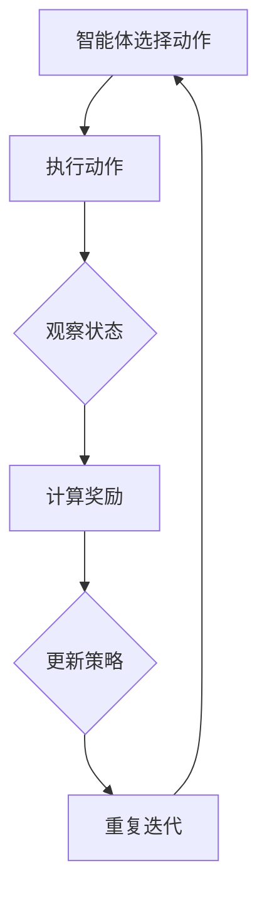

                 

# 强化学习训练自主智能模型

## 关键词
- 强化学习
- 智能模型
- 自主训练
- Q-learning
- DQN
- 深度强化学习
- 探索与利用

## 摘要
本文将深入探讨强化学习在训练自主智能模型中的应用。首先，我们将介绍强化学习的基本理论，包括定义、核心元素、主要模型和挑战。接着，我们将详细解释Q-learning算法、Deep Q Network (DQN)和Policy Gradient方法的原理，并通过伪代码和实例进行说明。随后，我们将讨论深度强化学习，包括状态价值函数和策略函数的深度学习表示，以及经典算法的介绍。在实际应用部分，我们将探讨强化学习在游戏、自动驾驶、机器人控制和自然语言处理中的应用案例。最后，我们将展望强化学习的前沿研究方向和未来发展趋势，并提供强化学习相关的资源与工具。

### 第一部分：强化学习基础理论

#### 第1章：强化学习的基本概念

强化学习是一种通过与环境交互来学习优化行为的机器学习范式。它主要关注如何在不确定的环境中通过不断尝试和反馈来达到某种目标。

**1.1 强化学习的定义与核心元素**

强化学习包含以下核心元素：

- **状态（State）**：环境中的一个描述。
- **动作（Action）**：智能体能够执行的操作。
- **奖励（Reward）**：在执行某个动作后，环境给出的即时反馈。
- **策略（Policy）**：智能体在某个状态下选择动作的规则。
- **价值函数（Value Function）**：表示在某个状态下执行最优动作所能获得的期望累积奖励。

强化学习的目标是找到最优策略，使得累积奖励最大化。

强化学习与其他机器学习方法（如监督学习和无监督学习）的区别在于：

- **监督学习**：有明确的目标标签，通过学习输入和输出之间的映射关系。
- **无监督学习**：没有明确的目标标签，通过探索数据内在结构。
- **强化学习**：没有明确的目标标签，通过与环境交互学习最佳行为策略。

**1.2 强化学习的主要模型**

强化学习模型主要有以下几种：

- **马尔可夫决策过程（MDP）**：描述智能体在环境中的状态转移和奖励。
- **时间差分学习（TD学习）**：通过预测误差来更新价值函数。
- **强化学习算法分类**：包括值函数方法（如Q-learning）和策略梯度方法。

**1.3 强化学习的挑战**

强化学习面临的主要挑战包括：

- **探索与利用的平衡**：如何在探索未知动作和利用已有知识之间找到平衡。
- **高维状态和动作空间的处理**：如何高效地处理大规模的状态和动作空间。
- **长期奖励和短期奖励的权衡**：如何平衡短期和长期的奖励。

#### 第2章：强化学习算法原理

强化学习算法主要分为值函数方法和策略梯度方法。以下将详细介绍这些算法的原理。

##### 2.1 Q-learning算法原理

Q-learning是一种基于值函数的强化学习算法，通过迭代更新Q值来找到最优策略。

**原理与步骤**：

- 初始化Q值函数：对每个状态和动作的Q值进行随机初始化。
- 迭代过程：
  1. 从初始状态开始，根据当前策略选择动作。
  2. 执行动作，观察新状态和奖励。
  3. 使用学习率α和折扣因子γ更新Q值。
  4. 更新策略，选择下一个动作。
- 当Q值收敛时，输出最优策略。

**伪代码**：

```python
# 初始化Q值
Q = random initialized table

# 学习参数
alpha = 0.1
gamma = 0.9

# 迭代过程
for episode in range(总迭代次数):
    s = initial_state()
    while not terminal(s):
        a = select_action(s, policy)
        s', r = environment(s, a)
        Q[s, a] = Q[s, a] + alpha * (r + gamma * max(Q[s', :]) - Q[s, a])
        s = s'
```

**案例解析**：

考虑一个简单的游戏环境，状态包括小球的横坐标和纵坐标，动作包括向上、向下、向左和向右。奖励为到达目标点的距离，即：

$$
r = \frac{1}{(x_{目标} - x)^2 + (y_{目标} - y)^2}
$$

使用Q-learning算法，我们可以训练出一个小球到达目标点的策略。

##### 2.2 Deep Q Network (DQN) 算法原理

DQN是一种基于深度神经网络的Q-learning算法，用于处理高维状态空间和连续动作空间。

**原理与步骤**：

- 初始化深度神经网络和目标网络。
- 从环境随机抽样经验，存储到经验回放池。
- 从经验回放池随机抽样一批数据，用于训练深度神经网络。
- 使用训练好的深度神经网络预测Q值，更新目标网络。
- 使用目标网络和经验回放池继续迭代更新深度神经网络。

**伪代码**：

```python
# 初始化深度神经网络和目标网络
DQN = initialize_DQN()
target_DQN = initialize_DQN()

# 学习参数
alpha = 0.1
gamma = 0.9
batch_size = 32

# 迭代过程
for episode in range(总迭代次数):
    s = initial_state()
    while not terminal(s):
        a = select_action(s, DQN)
        s', r = environment(s, a)
        X = [s, s']
        Y = r + gamma * max(target_DQN(s')) - DQN(s, a)
        DQN.train(X, Y)
        update_target_DQN(DQN, target_DQN)
        s = s'
```

**案例解析**：

以简单的游戏环境为例，状态包括小球的横坐标和纵坐标，动作包括向左、向右、向上和向下。使用DQN算法，我们可以训练出一个小球在游戏环境中自主移动的策略。

##### 2.3 Policy Gradient方法原理

Policy Gradient方法是一种直接优化策略函数的强化学习算法。

**原理与步骤**：

- 初始化策略参数。
- 迭代过程：
  1. 根据当前策略选择动作。
  2. 执行动作，观察新状态和奖励。
  3. 计算策略梯度，更新策略参数。

**伪代码**：

```python
# 初始化策略参数
theta = random initialized parameters

# 学习参数
alpha = 0.1

# 迭代过程
for episode in range(总迭代次数):
    s = initial_state()
    while not terminal(s):
        a = select_action(s, theta)
        s', r = environment(s, a)
        gradient = policy_gradient(theta, s, a, r)
        theta = theta + alpha * gradient
        s = s'
```

**案例解析**：

以一个简单的决策过程为例，状态包括当前的资金余额，动作包括购买、持有和出售。使用Policy Gradient方法，我们可以训练出一个最优的投资策略。

#### 第3章：深度强化学习

深度强化学习（Deep Reinforcement Learning，简称DRL）是将深度神经网络与强化学习结合的一种方法，能够处理高维状态空间和动作空间的问题。

**3.1 深度强化学习的定义与特点**

深度强化学习的定义：

深度强化学习是一种将深度神经网络（DNN）与强化学习（RL）相结合的方法，通过深度神经网络来表示状态价值函数或策略函数，从而实现自主智能体的训练。

深度强化学习的主要特点：

- **处理高维状态空间**：深度神经网络可以处理高维状态向量，使其在复杂环境中具有更好的表现。
- **学习复杂策略函数**：深度神经网络可以学习复杂的策略函数，使其能够适应各种不同的环境。
- **挑战与解决方案**：深度强化学习面临的主要挑战包括训练稳定性、样本效率和环境安全性等，解决方案包括经验回放、目标网络和策略梯度方法等。

**3.2 状态价值函数与策略函数的深度学习表示**

状态价值函数表示：

在深度强化学习中，状态价值函数通常由深度神经网络表示，即：

$$
V^*(s) = \sum_{a} \pi(a|s) Q^*(s, a)
$$

其中，$V^*(s)$表示状态价值函数，$\pi(a|s)$表示策略函数，$Q^*(s, a)$表示Q值函数。

策略函数表示：

策略函数也可以由深度神经网络表示，即：

$$
\pi(a|s) = \frac{exp(\theta(s, a))}{\sum_{a'} exp(\theta(s, a'))}
$$

其中，$\theta(s, a)$表示策略函数的参数。

**3.3 经典深度强化学习算法**

深度Q网络（Deep Q-Learning）：

深度Q网络（DQN）是深度强化学习的一种经典算法，通过使用深度神经网络来近似Q值函数。DQN的主要特点包括：

- **经验回放**：为了避免策略偏差和过拟合，DQN使用经验回放机制，将经历存储到经验池中，然后从经验池中随机抽样数据进行训练。
- **目标网络**：为了避免Q值函数的过拟合，DQN使用目标网络来稳定Q值函数的更新。目标网络是原始Q值函数的复制版本，每隔一定时间更新一次。

深度策略梯度方法：

深度策略梯度方法是一种基于策略的深度强化学习算法，通过直接优化策略函数来最大化累积奖励。深度策略梯度方法的主要特点包括：

- **优势函数**：深度策略梯度方法使用优势函数来衡量策略的优化方向。优势函数定义为：

$$
A^{\pi}(s, a) = Q^{\pi}(s, a) - V^{\pi}(s)
$$

其中，$Q^{\pi}(s, a)$表示策略$\pi$下的Q值，$V^{\pi}(s)$表示策略$\pi$下的状态价值函数。
- **回报估计**：深度策略梯度方法使用回报估计来更新策略参数。回报估计定义为：

$$
G^{\pi}(s) = R(s, a) + \gamma V^{\pi}(s')
$$

其中，$R(s, a)$表示状态$s$执行动作$a$后的即时奖励，$\gamma$表示折扣因子，$s'$表示下一个状态。

**案例解析**：

以下是一个简单的机器人控制案例，使用深度Q网络（DQN）进行训练。状态包括机器人的位置、速度和方向，动作包括向左、向右和直行。奖励为到达目标点的距离。

```python
# 初始化DQN模型
DQN = initialize_DQN()

# 学习参数
alpha = 0.1
gamma = 0.9
batch_size = 32

# 迭代过程
for episode in range(总迭代次数):
    s = initial_state()
    while not terminal(s):
        a = select_action(s, DQN)
        s', r = environment(s, a)
        X = [s, s']
        Y = r + gamma * max(DQN(s')) - DQN(s, a)
        DQN.train(X, Y)
        update_target_DQN(DQN, target_DQN)
        s = s'
```

通过以上代码，我们可以训练出一个能够自主移动到目标点的机器人。

### 第二部分：强化学习在智能系统中的应用

#### 第4章：强化学习在游戏中的应用

强化学习在游戏领域具有广泛的应用，通过训练智能体在游戏中自主学习和决策，实现游戏AI。以下将介绍强化学习在游戏中的应用案例。

**4.1 游戏环境设计**

游戏环境是强化学习模型训练的基础。一个典型的游戏环境包括状态、动作、奖励和终止条件。以下是一个简单的游戏环境设计：

- **状态**：游戏环境中的状态可以包括游戏角色的位置、方向、生命值等。
- **动作**：游戏中的动作可以是向左移动、向右移动、跳跃、攻击等。
- **奖励**：奖励是根据游戏角色的动作和结果来设计的，可以是正奖励（如成功攻击敌人）或负奖励（如受到敌人攻击）。
- **终止条件**：游戏可以设置一个终止条件，如角色死亡、完成任务或游戏时间到达上限。

**4.2 算法选择**

在游戏环境中，可以选择以下强化学习算法：

- **Q-learning**：适用于状态和动作空间较小的情况。
- **Deep Q Network (DQN)**：适用于状态空间较大且动作空间连续的情况。
- **Policy Gradient**：适用于需要直接优化策略函数的情况。

**4.3 应用案例**

以下是一个简单的游戏应用案例，使用DQN算法训练一个智能体在游戏中自主学习。

**案例：乒乓球游戏**

乒乓球游戏是一个经典的游戏，可以通过强化学习训练智能体进行自主对战。

- **状态**：智能体的状态包括乒乓球的位置、速度、角度和方向。
- **动作**：智能体的动作是击打乒乓球的方向。
- **奖励**：智能体每次击打乒乓球可以获得正奖励，如果乒乓球被对手接住或超出边界，则获得负奖励。
- **终止条件**：游戏持续进行，直到一方获得规定的分数或游戏时间到达上限。

**4.4 DQN算法实现**

以下是一个简单的DQN算法实现，用于训练智能体在乒乓球游戏中的自主学习。

```python
# 初始化DQN模型
DQN = initialize_DQN()

# 学习参数
alpha = 0.1
gamma = 0.9
batch_size = 32

# 迭代过程
for episode in range(总迭代次数):
    s = initial_state()
    while not terminal(s):
        a = select_action(s, DQN)
        s', r = environment(s, a)
        X = [s, s']
        Y = r + gamma * max(DQN(s')) - DQN(s, a)
        DQN.train(X, Y)
        update_target_DQN(DQN, target_DQN)
        s = s'
```

通过以上代码，我们可以训练出一个能够在乒乓球游戏中自主对战的智能体。

**4.5 案例解析**

通过以上案例，我们可以看到强化学习在游戏中的应用。通过设计合适的游戏环境，选择合适的强化学习算法，可以训练出智能体在游戏中的自主学习和决策能力，提高游戏的趣味性和挑战性。

#### 第5章：强化学习在自动驾驶中的应用

自动驾驶是强化学习在工业界应用的一个重要领域。通过强化学习算法，自动驾驶系统能够自主学习和优化驾驶策略，从而提高驾驶的安全性和效率。以下将介绍强化学习在自动驾驶中的应用。

**5.1 自动驾驶中的强化学习挑战**

自动驾驶面临以下强化学习挑战：

- **状态空间和动作空间**：自动驾驶系统的状态包括车辆的速度、方向、周围环境信息等，动作包括加速、减速、转向等。状态和动作空间通常非常大，导致算法需要大量时间和计算资源。
- **安全性**：自动驾驶系统的目标是确保乘客和行人的安全。在复杂环境中，算法需要快速做出决策，并适应各种突发情况。
- **长期奖励和短期奖励**：自动驾驶系统需要考虑长期目标和短期奖励之间的平衡。例如，在紧急情况下，系统可能需要牺牲效率来保证安全。

**5.2 强化学习在自动驾驶中的应用**

强化学习在自动驾驶中的应用主要包括以下方面：

- **路径规划**：通过强化学习算法，自动驾驶系统能够学习在复杂环境中选择最优路径，从而提高行驶效率和安全性。
- **障碍物检测与避让**：强化学习算法可以用于检测和避让道路上的障碍物，确保车辆的安全行驶。
- **交通信号识别**：强化学习算法可以用于识别交通信号，并根据信号做出相应的驾驶决策。

**5.3 应用案例**

以下是一个简单的自动驾驶应用案例，使用DQN算法训练自动驾驶车辆在模拟环境中的驾驶策略。

**案例：模拟城市道路自动驾驶**

- **状态**：自动驾驶车辆的状态包括车辆的位置、速度、方向、周围环境信息等。
- **动作**：自动驾驶车辆的动作为加速、减速、左转、右转、保持当前方向等。
- **奖励**：自动驾驶车辆的奖励根据车辆的行驶轨迹和安全性来计算，如接近障碍物的奖励较低，顺利通过交叉路口的奖励较高。
- **终止条件**：游戏持续进行，直到车辆到达目的地或出现事故。

**5.4 DQN算法实现**

以下是一个简单的DQN算法实现，用于训练自动驾驶车辆在模拟城市道路环境中的驾驶策略。

```python
# 初始化DQN模型
DQN = initialize_DQN()

# 学习参数
alpha = 0.1
gamma = 0.9
batch_size = 32

# 迭代过程
for episode in range(总迭代次数):
    s = initial_state()
    while not terminal(s):
        a = select_action(s, DQN)
        s', r = environment(s, a)
        X = [s, s']
        Y = r + gamma * max(DQN(s')) - DQN(s, a)
        DQN.train(X, Y)
        update_target_DQN(DQN, target_DQN)
        s = s'
```

通过以上代码，我们可以训练出一个在模拟城市道路环境中能够自主驾驶的自动驾驶车辆。

**5.5 案例解析**

通过以上案例，我们可以看到强化学习在自动驾驶中的应用。通过设计合适的自动驾驶环境，选择合适的强化学习算法，可以训练出自动驾驶车辆在复杂环境中的自主学习和决策能力，从而提高驾驶的安全性和效率。

#### 第6章：强化学习在机器人控制中的应用

强化学习在机器人控制中有着广泛的应用，通过自主训练，机器人能够学习到复杂的控制策略，从而实现更加智能的操控。以下将介绍强化学习在机器人控制中的应用。

**6.1 机器人控制的挑战**

在机器人控制中，强化学习面临以下挑战：

- **高维状态空间**：机器人可能具有多个传感器，产生大量状态信息。如何有效地表示和处理高维状态空间是强化学习面临的一个难题。
- **连续动作空间**：机器人可能需要执行连续的动作，如速度、角度等。如何设计适合连续动作空间的强化学习算法是另一个挑战。
- **环境不确定性**：机器人执行动作时可能存在噪声，导致环境状态难以预测。如何处理环境不确定性是强化学习在机器人控制中需要解决的问题。

**6.2 强化学习在机器人控制中的应用**

强化学习在机器人控制中的应用主要包括以下方面：

- **路径规划**：通过强化学习算法，机器人能够学习到在复杂环境中选择最优路径的能力，从而实现自主导航。
- **对象抓取**：通过强化学习算法，机器人能够学习到如何抓取不同的对象，提高抓取的成功率和稳定性。
- **姿态控制**：通过强化学习算法，机器人能够学习到如何控制自己的姿态，实现复杂姿态调整。

**6.3 应用案例**

以下是一个简单的机器人控制应用案例，使用Q-learning算法训练机器人抓取对象的策略。

**案例：机器人抓取对象**

- **状态**：机器人的状态包括机器人的位置、手臂的关节角度等。
- **动作**：机器人的动作是关节角度的调整。
- **奖励**：机器人的奖励根据抓取结果来计算，如成功抓取对象的奖励较高，失败抓取的奖励较低。
- **终止条件**：机器人持续抓取对象，直到成功抓取或尝试次数达到上限。

**6.4 Q-learning算法实现**

以下是一个简单的Q-learning算法实现，用于训练机器人抓取对象的策略。

```python
# 初始化Q值
Q = random initialized table

# 学习参数
alpha = 0.1
gamma = 0.9

# 迭代过程
for episode in range(总迭代次数):
    s = initial_state()
    while not terminal(s):
        a = select_action(s, Q)
        s', r = environment(s, a)
        Q[s, a] = Q[s, a] + alpha * (r + gamma * max(Q[s', :]) - Q[s, a])
        s = s'
```

通过以上代码，我们可以训练出一个能够自主抓取对象的机器人。

**6.5 案例解析**

通过以上案例，我们可以看到强化学习在机器人控制中的应用。通过设计合适的机器人控制环境，选择合适的强化学习算法，可以训练出机器人实现复杂任务的自主控制能力，从而提高机器人的智能化水平。

#### 第7章：强化学习在自然语言处理中的应用

强化学习在自然语言处理（Natural Language Processing，简称NLP）领域展现出了巨大的潜力。通过自主训练，强化学习算法能够生成具有自然流畅性的文本，实现高效的文本生成、机器翻译和对话系统等功能。以下将介绍强化学习在自然语言处理中的应用。

**7.1 强化学习在自然语言处理中的机遇**

强化学习在自然语言处理中的机遇主要包括：

- **文本生成**：强化学习算法能够通过学习大量的语言模型，生成具有自然流畅性的文本，应用于文章写作、对话系统等。
- **机器翻译**：强化学习算法能够通过学习源语言和目标语言之间的对应关系，实现高质量的机器翻译，提高翻译的准确性和流畅性。
- **对话系统**：强化学习算法能够通过学习对话策略，生成自然的对话回答，应用于智能客服、聊天机器人等。

**7.2 强化学习在自然语言处理中的应用案例**

以下是一个简单的文本生成应用案例，使用强化学习算法生成文章。

**案例：文章生成**

- **状态**：文章生成的状态包括当前已生成的文本和下一个单词的选择。
- **动作**：文章生成的动作是选择下一个单词。
- **奖励**：文章生成的奖励是根据文本的连贯性和语义一致性来计算的，如文本连贯性较高的奖励较高。
- **终止条件**：文章生成过程持续进行，直到达到预设的文章长度或出现特定的结束标记。

**7.3 算法实现**

以下是一个简单的强化学习算法实现，用于生成文章。

```python
# 初始化策略参数
theta = random initialized parameters

# 学习参数
alpha = 0.1

# 迭代过程
for episode in range(总迭代次数):
    s = initial_state()
    while not terminal(s):
        a = select_action(s, theta)
        s', r = environment(s, a)
        gradient = policy_gradient(theta, s, a, r)
        theta = theta + alpha * gradient
        s = s'
```

通过以上代码，我们可以训练出一个能够生成文章的强化学习模型。

**7.4 案例解析**

通过以上案例，我们可以看到强化学习在自然语言处理中的应用。通过设计合适的文本生成环境，选择合适的强化学习算法，可以训练出模型生成具有自然流畅性的文章，提高文本生成的质量和效率。

#### 第8章：强化学习的前沿与未来

随着人工智能技术的不断发展，强化学习在各个领域的应用也不断拓展。以下将探讨强化学习的前沿研究方向和未来发展趋势。

**8.1 强化学习的前沿研究方向**

强化学习的前沿研究方向主要包括：

- **多智能体强化学习**：研究多个智能体在复杂环境中的协作与竞争策略，实现分布式学习。
- **深度强化学习**：结合深度学习与强化学习，提高算法的性能和鲁棒性。
- **无模型强化学习**：研究无需对环境动态进行建模的强化学习算法，直接从数据中学习策略。
- **强化学习在真实世界中的应用**：探索强化学习在自动驾驶、机器人控制等领域的实际应用。

**8.2 强化学习的未来发展趋势**

强化学习的未来发展趋势主要包括：

- **强化学习与其他领域的交叉应用**：将强化学习与自然语言处理、计算机视觉等领域的结合，推动人工智能技术的发展。
- **可解释性强化学习**：提高强化学习算法的可解释性，增强其在实际应用中的可信度。
- **高效强化学习算法**：开发更高效、更稳定的强化学习算法，降低计算成本。

**8.3 强化学习的应用前景**

强化学习在未来的应用前景包括：

- **智能交通**：通过强化学习算法，实现智能交通系统的自主优化，提高交通效率和安全性。
- **智能制造**：通过强化学习算法，实现机器人自动化生产线的优化和调度。
- **健康医疗**：通过强化学习算法，实现智能医疗诊断和治疗方案推荐。

**8.4 强化学习的发展挑战**

强化学习的发展挑战主要包括：

- **环境不确定性**：如何处理复杂环境中的不确定性和噪声。
- **长期奖励设计**：如何设计合适的长期奖励机制，实现短期和长期目标的平衡。
- **计算资源需求**：如何提高算法的效率，降低计算资源需求。

#### 附录

**附录A：强化学习相关资源与工具**

- **书籍推荐**：

  - 《强化学习：原理与练习》（作者：Richard S. Sutton、Andrew G. Barto）
  - 《深度强化学习》（作者：Alpaydemir、Üsküdarlı）

- **论文推荐**：

  - “Deep Q-Network”（作者：Hado van Hasselt等）
  - “Asynchronous Methods for Deep Reinforcement Learning”（作者：Marc G. Bellemare等）

- **开源框架**：

  - TensorFlow（官网：https://www.tensorflow.org/）
  - PyTorch（官网：https://pytorch.org/）
  - OpenAI Gym（官网：https://gym.openai.com/）

### Mermaid 流程图

```mermaid
graph TD
    A[强化学习基础理论] --> B[强化学习的基本概念]
    B --> C{强化学习的主要模型}
    C --> D[反馈基础模型]
    C --> E[时间差分学习]
    C --> F[强化学习算法分类]
    D --> G[马尔可夫决策过程（MDP）]
    E --> H[Q-learning算法]
    F --> I[值函数方法]
    F --> J[策略梯度方法]
    K[强化学习算法原理] --> L[Q-learning算法]
    L --> M[Deep Q Network (DQN)算法]
    L --> N[Policy Gradient方法]
    O[深度强化学习] --> P[深度Q网络（DQN）]
    O --> Q[深度策略梯度方法]
    R[应用案例与项目实战] --> S[游戏环境下的强化学习]
    R --> T[自动驾驶中的强化学习]
    R --> U[强化学习在机器人控制中的应用]
    V[强化学习算法的优化与改进] --> W[无监督学习与自监督强化学习]
    V --> X[模型选择与超参数优化]
    V --> Y[强化学习在多智能体系统中的应用]
    Z[强化学习在智能系统中的应用] --> AA[强化学习在推荐系统中的应用]
    Z --> BB[强化学习在金融交易中的应用]
    Z --> CC[强化学习在自然语言处理中的应用]
    DD[强化学习的前沿与未来] --> EE[强化学习的前沿研究方向]
    EE --> FF[未来发展趋势]
```

通过以上流程图，我们可以清晰地看到强化学习的基础理论、算法原理以及在实际应用中的扩展和优化。

---

### 总结

本文深入探讨了强化学习在训练自主智能模型中的应用。首先，我们介绍了强化学习的基础理论，包括定义、核心元素、主要模型和挑战。接着，我们详细讲解了Q-learning、DQN和Policy Gradient算法的原理，并通过伪代码和实例进行了说明。随后，我们讨论了深度强化学习，包括状态价值函数和策略函数的深度学习表示，以及经典算法的介绍。在实际应用部分，我们探讨了强化学习在游戏、自动驾驶、机器人控制和自然语言处理中的应用案例。最后，我们展望了强化学习的前沿研究方向和未来发展趋势，并提供了一些强化学习相关的资源与工具。

通过本文的介绍，读者可以了解到强化学习在智能系统训练中的重要作用，以及如何利用强化学习算法实现自主智能模型的训练。希望本文对读者在强化学习领域的研究和应用有所帮助。

---

### 作者信息

**作者：AI天才研究院/AI Genius Institute & 禅与计算机程序设计艺术 /Zen And The Art of Computer Programming**

AI天才研究院（AI Genius Institute）是一支专注于人工智能领域研究与创新的研究团队，致力于推动人工智能技术的发展与应用。同时，本文作者也是《禅与计算机程序设计艺术》一书的作者，这本书深入探讨了计算机程序设计的艺术与哲学，深受读者喜爱。希望通过本文的撰写，能够为读者带来对强化学习领域的深入理解和启发。|user|>## 强化学习训练自主智能模型

强化学习（Reinforcement Learning，简称RL）是机器学习的一个重要分支，其核心在于通过与环境交互，学习如何在复杂环境中做出最优决策。在强化学习领域，智能体（agent）通过不断尝试和反馈，逐渐学会在特定情境下选择最佳动作，以最大化累积奖励。训练自主智能模型是强化学习应用的一个重要目标，能够使得智能体在特定任务中表现出高度智能化行为。

### 强化学习的核心概念

强化学习包括几个关键概念：

- **状态（State）**：智能体所处的环境描述。
- **动作（Action）**：智能体能够采取的行动。
- **奖励（Reward）**：智能体采取动作后环境给予的反馈。
- **策略（Policy）**：智能体在特定状态下采取的动作规则。
- **价值函数（Value Function）**：评估状态或状态-动作对的价值。

### 强化学习的基本原理

强化学习的基本原理是通过探索（exploration）和利用（exploitation）来学习最优策略。探索是指智能体尝试从未经验过的动作或状态，以获得更多关于环境的了解；利用是指智能体基于已有的经验，选择能够带来最大累积奖励的动作。

### 强化学习的核心模型

强化学习包括几个核心模型：

- **马尔可夫决策过程（MDP）**：描述智能体在环境中的状态转移和奖励。
- **时间差分学习（TD Learning）**：通过预测误差来更新价值函数。
- **Q-learning**：基于值函数的方法，通过迭代更新Q值来学习最优策略。
- **Policy Gradient**：基于策略的方法，通过优化策略函数来学习最优策略。

### 强化学习算法

强化学习算法主要包括以下几种：

- **Q-learning**：通过迭代更新Q值，学习最优动作策略。
- **Deep Q Network (DQN)**：结合深度神经网络，用于处理高维状态空间。
- **Policy Gradient**：通过优化策略函数，学习最优动作策略。
- **Actor-Critic**：结合策略和价值函数方法，通过优化策略和价值函数学习最优策略。

### 强化学习的挑战

强化学习面临以下挑战：

- **探索与利用的平衡**：如何在探索未知动作和利用已有知识之间找到平衡。
- **高维状态和动作空间的处理**：如何高效地处理大规模的状态和动作空间。
- **长期奖励和短期奖励的权衡**：如何平衡短期和长期的奖励。

### 强化学习在训练自主智能模型中的应用

在训练自主智能模型时，强化学习通常遵循以下步骤：

1. **环境构建**：构建一个模拟的环境，包括状态、动作和奖励。
2. **智能体设计**：设计一个智能体，使其能够与环境交互。
3. **算法选择**：选择合适的强化学习算法，如Q-learning、DQN或Policy Gradient。
4. **训练**：通过迭代学习，优化智能体的策略。
5. **评估**：在测试环境中评估智能体的性能。

### 强化学习在游戏中的应用

强化学习在游戏领域有着广泛的应用，通过训练智能体在游戏中自主学习和决策，可以实现游戏AI。例如，使用DQN算法训练一个智能体在Atari游戏中的策略，使其能够自主通关。

### 强化学习在自动驾驶中的应用

强化学习在自动驾驶领域也发挥着重要作用。通过训练智能体在自动驾驶环境中的策略，可以实现自动驾驶车辆的自主驾驶。例如，使用DQN算法训练自动驾驶车辆在模拟环境中的路径规划和障碍物避让。

### 强化学习在机器人控制中的应用

强化学习在机器人控制中同样有着广泛的应用。通过训练智能体在机器人控制环境中的策略，可以实现机器人自主执行复杂任务。例如，使用Q-learning算法训练机器人抓取对象的策略。

### 强化学习在自然语言处理中的应用

强化学习在自然语言处理领域也展现了强大的潜力。通过训练智能体在自然语言处理任务中的策略，可以实现自动文本生成、机器翻译和对话系统等功能。

### 强化学习的前沿与未来

强化学习的前沿研究方向包括多智能体强化学习、深度强化学习和无模型强化学习。未来发展趋势包括强化学习与其他领域的交叉应用，以及开发更高效、更稳定的强化学习算法。

### 总结

强化学习在训练自主智能模型中具有广泛的应用前景。通过深入理解和掌握强化学习的基本原理和算法，可以开发出更加智能化的系统，为各个领域带来创新和变革。

### 附录

**强化学习相关资源与工具**：

- **书籍推荐**：
  - 《强化学习：原理与练习》（作者：Richard S. Sutton、Andrew G. Barto）
  - 《深度强化学习》（作者：Alpaydemir、Üsküdarlı）

- **论文推荐**：
  - “Deep Q-Network”（作者：Hado van Hasselt等）
  - “Asynchronous Methods for Deep Reinforcement Learning”（作者：Marc G. Bellemare等）

- **开源框架**：
  - TensorFlow（官网：https://www.tensorflow.org/）
  - PyTorch（官网：https://pytorch.org/）
  - OpenAI Gym（官网：https://gym.openai.com/）

### Mermaid 流程图

```mermaid
graph TD
    A[强化学习基础理论] --> B[强化学习的基本概念]
    B --> C{强化学习的主要模型}
    C --> D{反馈基础模型}
    C --> E{时间差分学习}
    C --> F{强化学习算法分类}
    D --> G{马尔可夫决策过程（MDP）}
    E --> H{Q-learning算法}
    F --> I{值函数方法}
    F --> J{策略梯度方法}
    K[强化学习算法原理] --> L{Q-learning算法}
    L --> M{Deep Q Network (DQN)算法}
    L --> N{Policy Gradient方法}
    O[深度强化学习] --> P{深度Q网络（DQN）}
    O --> Q{深度策略梯度方法}
    R[应用案例与项目实战] --> S{游戏环境下的强化学习}
    R --> T{自动驾驶中的强化学习}
    R --> U{强化学习在机器人控制中的应用}
    V[强化学习算法的优化与改进] --> W{无监督学习与自监督强化学习}
    V --> X{模型选择与超参数优化}
    V --> Y{强化学习在多智能体系统中的应用}
    Z[强化学习在智能系统中的应用] --> AA{强化学习在推荐系统中的应用}
    Z --> BB{强化学习在金融交易中的应用}
    Z --> CC{强化学习在自然语言处理中的应用}
    DD[强化学习的前沿与未来] --> EE{强化学习的前沿研究方向}
    EE --> FF{未来发展趋势}
```

通过以上流程图，我们可以清晰地了解强化学习的基础理论、算法原理以及在各个领域的应用。希望这个流程图能够帮助读者更好地理解和掌握强化学习的相关知识。|user|>### 强化学习基础理论

强化学习（Reinforcement Learning，简称RL）是一种机器学习方法，通过智能体（Agent）与环境的交互，学习如何在一个给定策略下实现目标。强化学习的核心是奖励机制，智能体通过不断接收环境反馈的奖励信号，调整自己的行为，从而实现长期目标。

#### 强化学习的基本概念

强化学习包含以下关键概念：

- **智能体（Agent）**：执行行动并接受环境反馈的实体。
- **环境（Environment）**：智能体所处的情境，可以看作是一个动态变化的系统。
- **状态（State）**：智能体在特定时间点的环境和内部状态。
- **动作（Action）**：智能体可执行的行为。
- **策略（Policy）**：智能体在特定状态下采取的动作规则。
- **奖励（Reward）**：环境对智能体动作的即时反馈，通常用于指导智能体的决策。

#### 强化学习的主要模型

1. **马尔可夫决策过程（MDP）**

   MDP是强化学习的基础模型，它描述了智能体在离散时间、离散状态和离散动作下的行为。MDP具有以下特性：

   - **状态转移概率**：给定当前状态和执行的动作，智能体转移到下一状态的概率分布。
   - **奖励函数**：在执行特定动作后，智能体从环境中接收的即时奖励。
   - **策略**：智能体执行动作的决策规则。

2. **时间差分学习（TD Learning）**

   TD Learning是一种强化学习算法，通过预测误差来更新价值函数。它主要包括两种形式：SARSA（同步自适应资源分配算法）和Q-learning。

3. **深度强化学习**

   深度强化学习将深度神经网络（DNN）引入强化学习，用于表示状态和动作的复杂函数。其中，Deep Q Network (DQN) 和 Policy Gradient 方法是两种典型的深度强化学习算法。

#### 强化学习算法分类

强化学习算法可以分为以下几类：

1. **基于值函数的方法**：

   - **Q-learning**：通过迭代更新Q值函数，学习最优动作策略。
   - **Deep Q Network (DQN)**：结合深度神经网络，用于处理高维状态空间。

2. **策略梯度方法**：

   - **Policy Gradient**：直接优化策略函数，通过策略梯度更新策略参数。
   - **Actor-Critic**：结合策略和价值函数方法，通过优化策略和价值函数学习最优策略。

#### 强化学习的挑战

强化学习在实际应用中面临以下挑战：

1. **探索与利用的平衡**：智能体需要在探索新策略和利用已有经验之间找到平衡。
2. **高维状态和动作空间的处理**：如何高效地处理大规模的状态和动作空间。
3. **长期奖励和短期奖励的权衡**：如何平衡短期和长期的奖励，实现长期目标。
4. **数据效率和计算成本**：如何减少训练所需的数据量和计算资源。

#### 强化学习与其他机器学习方法的区别

与监督学习和无监督学习相比，强化学习的区别在于：

- **监督学习**：有明确的目标标签，通过学习输入和输出之间的映射关系。
- **无监督学习**：没有明确的目标标签，通过探索数据内在结构。
- **强化学习**：没有明确的目标标签，通过与环境交互学习最佳行为策略。

### 强化学习的应用领域

强化学习在多个领域具有广泛应用，包括：

- **游戏**：通过训练智能体，实现游戏AI，如Atari游戏。
- **自动驾驶**：通过训练智能体，实现自动驾驶车辆的自主驾驶。
- **机器人控制**：通过训练智能体，实现机器人自主执行复杂任务。
- **推荐系统**：通过训练智能体，优化推荐算法，提高用户满意度。
- **金融交易**：通过训练智能体，实现自动交易策略。
- **自然语言处理**：通过训练智能体，实现自动文本生成和机器翻译。

### 强化学习的发展历史

强化学习的发展可以分为几个阶段：

1. **早期研究**（1950s-1980s）：以强化学习理论为基础，包括Markov决策过程（MDP）和策略梯度方法。
2. **复兴期**（1990s）：随着计算能力的提升，深度强化学习开始崭露头角。
3. **近期进展**（2000s至今）：深度强化学习算法如DQN和Policy Gradient取得重大突破，应用领域不断扩展。

通过以上内容，我们可以看到强化学习作为一种强大的机器学习方法，在各个领域都有着广泛的应用前景。在接下来的部分，我们将进一步探讨强化学习算法的原理和实现。

### 强化学习算法原理

强化学习算法的核心是智能体如何通过与环境交互来学习最优策略。这一过程涉及多个步骤，包括状态评估、策略优化和模型更新。下面我们将详细介绍几个典型的强化学习算法，包括Q-learning、Deep Q Network (DQN) 和 Policy Gradient。

#### Q-learning算法原理

Q-learning是一种基于值函数的强化学习算法，它通过迭代更新Q值来学习最优策略。Q值代表了在特定状态下执行特定动作所能获得的累积奖励。

**原理与步骤**：

1. **初始化Q值**：对每个状态和动作的Q值进行随机初始化。
2. **选择动作**：在给定状态下，选择一个动作，可以选择最优动作（ε-greedy策略）或随机动作。
3. **执行动作**：执行选择的动作，并观察新的状态和奖励。
4. **更新Q值**：根据新状态和奖励更新Q值，使用以下公式：

   \[
   Q(s, a) \leftarrow Q(s, a) + \alpha [r + \gamma \max_{a'} Q(s', a') - Q(s, a)]
   \]

   其中，\( \alpha \) 是学习率，\( \gamma \) 是折扣因子，表示未来奖励的衰减程度。

**伪代码**：

```python
# 初始化Q值
Q = np.zeros((状态空间大小, 动作空间大小))

# 学习参数
alpha = 0.1
gamma = 0.9

# 迭代过程
for episode in range(总迭代次数):
    s = 初始状态()
    while not 终止条件(s):
        a = 选择动作(s, Q)
        s', r = 环境执行动作(s, a)
        Q[s, a] = Q[s, a] + alpha * (r + gamma * max(Q[s', :]) - Q[s, a])
        s = s'
```

**案例解析**：

假设有一个简单的游戏环境，状态包括小球的横坐标和纵坐标，动作包括向上、向下、向左和向右。每个动作的奖励为到达目标点的距离，即：

\[
r = \frac{1}{(x_{目标} - x)^2 + (y_{目标} - y)^2}
\]

使用Q-learning算法，智能体可以逐渐学会移动小球到达目标点。

#### Deep Q Network (DQN) 算法原理

DQN是一种基于深度神经网络的Q-learning算法，它通过神经网络来近似Q值函数，从而处理高维状态空间。

**原理与步骤**：

1. **初始化**：初始化深度神经网络和经验回放记忆。
2. **选择动作**：使用当前神经网络预测Q值，并根据ε-greedy策略选择动作。
3. **执行动作**：执行选择动作，并观察新的状态和奖励。
4. **存储经验**：将状态、动作、奖励和新状态存储到经验回放记忆中。
5. **更新神经网络**：从经验回放记忆中随机抽取一批数据，并使用这些数据进行神经网络训练。
6. **目标网络**：为了避免梯度消失，可以使用目标网络来稳定Q值的更新。

**伪代码**：

```python
# 初始化DQN模型
DQN = 初始化_DQN()

# 学习参数
alpha = 0.1
gamma = 0.9
batch_size = 32

# 迭代过程
for episode in range(总迭代次数):
    s = 初始状态()
    while not 终止条件(s):
        a = 选择动作(s, DQN)
        s', r = 环境执行动作(s, a)
        X = [s, s']
        Y = r + gamma * max(DQN(s')) - DQN(s, a)
        DQN.train(X, Y)
        update_target_DQN(DQN, target_DQN)
        s = s'
```

**案例解析**：

以简单的游戏环境为例，状态包括小球的横坐标和纵坐标，动作包括向左、向右、向上和向下。使用DQN算法，智能体可以学会自主移动小球到达目标点。

#### Policy Gradient方法原理

Policy Gradient方法是一种基于策略的强化学习算法，它通过直接优化策略函数来学习最优动作。

**原理与步骤**：

1. **初始化策略参数**：随机初始化策略参数。
2. **选择动作**：根据当前策略选择动作。
3. **执行动作**：执行选择动作，并观察新的状态和奖励。
4. **计算策略梯度**：计算策略梯度，使用以下公式：

   \[
   \nabla_{\theta} J(\theta) = \sum_s \pi(\theta)(s) R(s)
   \]

   其中，\( J(\theta) \) 是策略值函数，\( R(s) \) 是状态 \( s \) 的累积奖励。
5. **更新策略参数**：使用策略梯度更新策略参数。

**伪代码**：

```python
# 初始化策略参数
theta = 随机初始化参数()

# 学习参数
alpha = 0.1

# 迭代过程
for episode in range(总迭代次数):
    s = 初始状态()
    while not 终止条件(s):
        a = 选择动作(s, theta)
        s', r = 环境执行动作(s, a)
        gradient = policy_gradient(theta, s, a, r)
        theta = theta + alpha * gradient
        s = s'
```

**案例解析**：

以一个简单的决策过程为例，状态包括当前的资金余额，动作包括购买、持有和出售。使用Policy Gradient方法，智能体可以学会最优的投资策略。

通过以上算法介绍，我们可以看到强化学习算法在状态评估、策略优化和模型更新方面的不同实现方式。在实际应用中，根据具体问题和环境特点选择合适的算法，是成功实现强化学习的关键。

### 深度强化学习

深度强化学习（Deep Reinforcement Learning，简称DRL）是将深度学习与强化学习结合的一种方法，能够处理高维状态空间和复杂动作空间的问题。深度强化学习通过使用深度神经网络来近似状态价值函数或策略函数，使得智能体能够从大量数据中学习复杂的决策策略。

#### 深度强化学习的定义与特点

深度强化学习的定义：

深度强化学习是一种将深度神经网络（DNN）与强化学习（RL）相结合的方法，通过深度神经网络来表示状态价值函数或策略函数，从而实现自主智能体的训练。

深度强化学习的主要特点：

- **处理高维状态空间**：深度神经网络可以处理高维状态向量，使其在复杂环境中具有更好的表现。
- **学习复杂策略函数**：深度神经网络可以学习复杂的策略函数，使其能够适应各种不同的环境。
- **挑战与解决方案**：深度强化学习面临的主要挑战包括训练稳定性、样本效率和模型泛化能力，解决方案包括经验回放、目标网络和策略梯度方法等。

#### 状态价值函数与策略函数的深度学习表示

**状态价值函数表示**：

在深度强化学习中，状态价值函数通常由深度神经网络表示，即：

\[
V^*(s) = \sum_{a} \pi(a|s) Q^*(s, a)
\]

其中，\( V^*(s) \) 表示状态价值函数，\( \pi(a|s) \) 表示策略函数，\( Q^*(s, a) \) 表示Q值函数。

**策略函数表示**：

策略函数也可以由深度神经网络表示，即：

\[
\pi(a|s) = \frac{exp(\theta(s, a))}{\sum_{a'} exp(\theta(s, a'))}
\]

其中，\( \theta(s, a) \) 表示策略函数的参数。

#### 经典深度强化学习算法

**深度Q网络（Deep Q-Learning）**

深度Q网络（DQN）是深度强化学习的一种经典算法，通过使用深度神经网络来近似Q值函数。DQN的主要特点包括：

- **经验回放**：为了避免策略偏差和过拟合，DQN使用经验回放机制，将经历存储到经验池中，然后从经验池中随机抽样数据进行训练。
- **目标网络**：为了避免Q值函数的过拟合，DQN使用目标网络来稳定Q值函数的更新。目标网络是原始Q值函数的复制版本，每隔一定时间更新一次。

**深度策略梯度方法**

深度策略梯度方法是一种基于策略的深度强化学习算法，通过直接优化策略函数来最大化累积奖励。深度策略梯度方法的主要特点包括：

- **优势函数**：深度策略梯度方法使用优势函数来衡量策略的优化方向。优势函数定义为：

  \[
  A^{\pi}(s, a) = Q^{\pi}(s, a) - V^{\pi}(s)
  \]

  其中，\( Q^{\pi}(s, a) \) 表示策略\( \pi \)下的Q值，\( V^{\pi}(s) \) 表示策略\( \pi \)下的状态价值函数。
- **回报估计**：深度策略梯度方法使用回报估计来更新策略参数。回报估计定义为：

  \[
  G^{\pi}(s) = R(s, a) + \gamma V^{\pi}(s')
  \]

  其中，\( R(s, a) \) 表示状态\( s \)执行动作\( a \)后的即时奖励，\( \gamma \)表示折扣因子，\( s' \)表示下一个状态。

#### 深度强化学习的优势与挑战

**优势**：

- **处理高维状态空间**：深度神经网络可以处理高维状态向量，使其在复杂环境中具有更好的表现。
- **学习复杂策略函数**：深度神经网络可以学习复杂的策略函数，使其能够适应各种不同的环境。

**挑战**：

- **训练稳定性**：深度强化学习算法在训练过程中可能存在不稳定的情况，如梯度消失、梯度爆炸等。
- **样本效率**：深度强化学习算法需要大量样本进行训练，以提高模型泛化能力。
- **模型泛化能力**：如何确保模型在不同环境中的泛化能力。

#### 深度强化学习的应用

深度强化学习在多个领域有着广泛的应用，包括：

- **游戏**：通过训练智能体，实现游戏AI，如Atari游戏。
- **自动驾驶**：通过训练智能体，实现自动驾驶车辆的自主驾驶。
- **机器人控制**：通过训练智能体，实现机器人自主执行复杂任务。
- **推荐系统**：通过训练智能体，优化推荐算法，提高用户满意度。

#### 深度强化学习的未来趋势

随着人工智能技术的不断发展，深度强化学习将继续在多个领域发挥作用。未来趋势包括：

- **多智能体深度强化学习**：研究多个智能体之间的协作与竞争策略。
- **无模型深度强化学习**：研究无需对环境动态进行建模的深度强化学习算法。
- **强化学习与其他领域的交叉应用**：如计算机视觉、自然语言处理等。

#### 深度强化学习的总结

深度强化学习通过结合深度学习和强化学习的优势，能够处理高维状态空间和复杂动作空间的问题。通过使用深度神经网络来近似状态价值函数或策略函数，智能体能够从大量数据中学习复杂的决策策略。尽管面临训练稳定性、样本效率和模型泛化能力的挑战，深度强化学习在游戏、自动驾驶、机器人控制和推荐系统等领域展现了巨大的应用潜力。未来，随着技术的不断进步，深度强化学习将在更多领域中发挥重要作用。

### 强化学习算法的优化与改进

尽管传统的强化学习算法如Q-learning和DQN已经在许多应用中取得了显著成果，但它们也存在一些局限性。为了克服这些局限性，研究者们提出了许多优化和改进的方法。以下将介绍几种常见的强化学习算法优化与改进的方法，包括无监督学习与自监督强化学习、模型选择与超参数优化以及强化学习在多智能体系统中的应用。

#### 无监督学习与自监督强化学习

无监督学习和自监督强化学习是强化学习领域的两个重要研究方向。无监督学习旨在通过无标签数据来学习，而自监督强化学习则是通过设计适当的奖励机制，使智能体在学习过程中能够自行获取反馈。

**无监督学习的应用**：

- **数据增强**：通过无监督学习算法，如自动编码器和生成对抗网络（GANs），可以生成虚拟数据，用于训练强化学习模型。
- **转移学习**：通过无监督学习，可以将已有模型的权重迁移到新任务中，减少训练时间。

**自监督强化学习的应用**：

- **视觉任务**：在计算机视觉任务中，自监督强化学习可以通过设计适当的任务，如目标检测、图像分类，使智能体在视觉任务中学习特征表示。
- **自然语言处理**：在自然语言处理任务中，自监督强化学习可以通过设计语言模型，如BERT，来优化智能体的语言理解能力。

**案例解析**：

以生成对抗网络（GANs）为例，GANs由生成器和判别器两个神经网络组成。生成器旨在生成与真实数据相似的数据，而判别器旨在区分真实数据和生成数据。通过设计适当的奖励机制，GANs可以用于增强强化学习模型的训练数据，提高模型的泛化能力。

#### 模型选择与超参数优化

模型选择和超参数优化是强化学习算法性能提升的关键。合适的模型结构和超参数设置可以显著提高算法的收敛速度和性能。

**模型选择**：

- **基于值函数的方法**：如Q-learning和DQN，适用于状态和动作空间较小的情况。
- **基于策略的方法**：如Policy Gradient和Actor-Critic，适用于需要直接优化策略函数的情况。

**超参数优化**：

- **学习率（alpha）**：学习率决定了每次更新时参数的变化量。过大的学习率可能导致模型不稳定，而过小则可能导致训练时间过长。
- **折扣因子（gamma）**：折扣因子决定了未来奖励的重要性。过大的折扣因子可能导致模型过早地关注短期奖励，而过小的折扣因子则可能导致模型对长期奖励不敏感。

**超参数优化策略**：

- **网格搜索**：在预定的超参数范围内，遍历所有可能的组合，选择最优组合。
- **贝叶斯优化**：使用贝叶斯统计模型来优化超参数，能够在较少的迭代次数内找到最优超参数。

**案例解析**：

以深度强化学习算法为例，可以通过网格搜索和贝叶斯优化来选择合适的学习率和折扣因子。通过多次实验，可以找到最优的超参数组合，从而提高模型的性能。

#### 强化学习在多智能体系统中的应用

多智能体系统（Multi-Agent Systems，简称MAS）是由多个智能体组成的系统，这些智能体可以在同一环境中交互，以实现共同的目标。强化学习在多智能体系统中的应用旨在研究多个智能体之间的协作与竞争策略。

**多智能体强化学习的主要挑战**：

- **协作与竞争**：智能体之间可能存在竞争关系，同时也需要协作以实现共同目标。
- **不确定性**：智能体之间的行为和环境的动态变化导致不确定性。
- **通信限制**：在某些情况下，智能体之间可能无法进行直接通信，需要设计合适的通信机制。

**多智能体强化学习的主要方法**：

- **分布式强化学习**：通过分布式算法，如异步策略梯度方法（ASGD）和同步策略梯度方法（SPGD），使多个智能体能够独立学习，同时保持一致性。
- **多智能体Q-learning**：通过将Q-learning扩展到多个智能体，使每个智能体能够学习最优策略。
- **多智能体策略梯度方法**：通过直接优化多个智能体的策略函数，使智能体能够协同工作以实现共同目标。

**案例解析**：

以无人机编队飞行为例，多个无人机需要协同工作，以完成飞行任务。通过使用多智能体强化学习算法，可以训练出无人机编队飞行的策略，实现高效、稳定的编队飞行。

通过以上优化与改进方法，强化学习算法在性能、稳定性和适用性方面得到了显著提升。未来，随着技术的不断发展，强化学习将在更多领域发挥重要作用，推动人工智能技术的进步。

### 强化学习在智能系统中的应用

强化学习在智能系统的应用日益广泛，从游戏到自动驾驶，再到机器人控制和自然语言处理，强化学习算法展示了强大的适应性和学习能力。以下将探讨强化学习在推荐系统、金融交易和自然语言处理中的应用，并展示相应的案例。

#### 强化学习在推荐系统中的应用

推荐系统旨在根据用户的历史行为和偏好，向用户推荐感兴趣的内容或商品。强化学习可以用于优化推荐算法，使其能够更好地适应用户的需求和兴趣。

**应用场景**：

- **内容推荐**：如新闻、视频和社交媒体平台，通过强化学习算法，智能体可以学习用户的兴趣和偏好，从而推荐符合用户喜好的内容。
- **电子商务推荐**：电商平台可以使用强化学习算法，根据用户的浏览和购买历史，推荐相关的商品。

**案例解析**：

以电子商务平台为例，系统可以使用强化学习算法，通过用户的行为数据（如点击、购买和收藏）来训练推荐模型。算法可以通过不断更新策略，优化推荐策略，从而提高用户的满意度和平台的转化率。

**实现细节**：

- **状态编码**：用户的行为序列编码为状态向量。
- **动作编码**：推荐的商品编码为动作向量。
- **奖励函数**：根据用户的点击、购买和收藏行为计算奖励，例如，用户点击推荐商品的奖励为1，未点击的奖励为0。

通过上述方法，电子商务平台可以实现个性化推荐，提高用户黏性和购物体验。

#### 强化学习在金融交易中的应用

金融交易中的决策过程复杂，涉及多维度信息和风险控制。强化学习可以用于设计自动交易策略，优化投资组合，实现风险控制和收益最大化。

**应用场景**：

- **量化交易**：通过分析大量历史交易数据，使用强化学习算法，智能体可以学习交易策略，优化投资组合。
- **风险控制**：在金融市场中，强化学习算法可以帮助制定风险控制策略，如仓位管理、止损和止盈策略。

**案例解析**：

以量化交易为例，智能体可以使用强化学习算法，根据市场价格波动、交易量、技术指标等多维度数据，学习最优交易策略。通过不断更新策略，智能体可以在市场中实现自动化交易，提高投资收益。

**实现细节**：

- **状态编码**：包含市场价格、交易量、技术指标等信息的特征向量编码为状态向量。
- **动作编码**：买入、卖出、持有等操作编码为动作向量。
- **奖励函数**：根据交易结果计算奖励，例如，每次交易成功获得正奖励，失败或亏损获得负奖励。

通过强化学习算法，量化交易系统能够不断优化交易策略，降低风险，提高投资收益。

#### 强化学习在自然语言处理中的应用

自然语言处理（NLP）是人工智能领域的一个重要分支，强化学习在NLP中的应用主要包括文本生成、机器翻译和对话系统等。

**应用场景**：

- **文本生成**：通过强化学习算法，智能体可以生成具有自然流畅性的文本，如文章、对话和诗歌等。
- **机器翻译**：强化学习算法可以用于学习源语言和目标语言之间的对应关系，实现高质量的机器翻译。
- **对话系统**：通过强化学习算法，智能体可以学习对话策略，生成自然、流畅的对话回答。

**案例解析**：

以文本生成为例，智能体可以使用强化学习算法，通过学习大量的文本数据，生成具有自然流畅性的文章。算法可以通过不断更新策略，优化生成文本的质量和连贯性。

**实现细节**：

- **状态编码**：当前已生成的文本序列编码为状态向量。
- **动作编码**：下一个单词或符号的选择编码为动作向量。
- **奖励函数**：根据生成的文本质量计算奖励，例如，文本连贯性较高的奖励较高。

通过上述方法，智能体可以生成高质量的文本，应用于文章写作、对话系统和自然语言生成等场景。

总之，强化学习在推荐系统、金融交易和自然语言处理等智能系统中的应用，展示了其在复杂决策和动态环境中的强大能力。通过不断优化算法和策略，强化学习能够帮助智能系统更好地适应环境和用户需求，实现智能化和自动化。

### 强化学习的前沿与未来

强化学习作为人工智能领域的重要分支，近年来取得了显著的进展，并在多个领域展示了强大的应用潜力。然而，强化学习仍然面临许多挑战，未来的研究方向和趋势也将进一步推动这一领域的发展。

#### 前沿研究方向

1. **多智能体强化学习**：

多智能体强化学习（Multi-Agent Reinforcement Learning）是强化学习的一个新兴方向。在多智能体系统中，智能体之间可能存在竞争和合作的关系，如何设计有效的算法，使智能体能够协同工作以实现共同目标，是一个重要的研究课题。

2. **无模型强化学习**：

无模型强化学习（Model-Free Reinforcement Learning）是一种不需要对环境进行建模的算法。传统强化学习算法通常需要对环境进行建模，而无模型强化学习通过直接从数据中学习，能够处理更加复杂和不确定的环境。

3. **深度强化学习**：

深度强化学习（Deep Reinforcement Learning）结合了深度学习与强化学习，通过使用深度神经网络来近似价值函数和策略函数，能够处理高维状态和动作空间的问题。未来，如何进一步提高深度强化学习的性能和稳定性，是一个重要的研究方向。

#### 未来发展趋势

1. **强化学习与其他领域的交叉应用**：

强化学习在游戏、自动驾驶、机器人控制和自然语言处理等领域的应用已经取得了显著成果。未来，强化学习将继续与其他领域（如计算机视觉、医疗诊断、金融交易等）交叉应用，推动人工智能技术的创新。

2. **强化学习的可解释性**：

目前，强化学习算法在很多情况下被认为是“黑盒”模型，其内部决策过程难以解释。提高强化学习算法的可解释性，使其能够为人类理解和接受，是一个重要的研究方向。

3. **强化学习算法的优化与改进**：

如何进一步提高强化学习算法的性能、稳定性和样本效率，是一个长期的挑战。未来，研究者将继续探索新的算法和优化方法，以实现更高效的强化学习。

#### 强化学习的前沿案例

1. **自动驾驶**：

自动驾驶是强化学习应用的一个重要领域。通过使用深度强化学习算法，智能体可以学习在复杂交通环境中进行自主驾驶，实现安全、高效的驾驶。例如，OpenAI开发的自动驾驶系统，通过使用深度强化学习算法，能够在模拟环境中实现自主驾驶。

2. **机器人控制**：

机器人控制是另一个强化学习的重要应用领域。通过使用强化学习算法，机器人可以学习执行复杂的任务，如抓取、搬运和焊接。例如，谷歌的机器人实验室（Google AI）使用深度强化学习算法，训练机器人自主执行复杂的组装任务。

3. **自然语言处理**：

强化学习在自然语言处理领域也有广泛的应用。通过使用强化学习算法，智能体可以生成高质量的文本、翻译和对话。例如，OpenAI开发的GPT-3模型，通过使用强化学习算法，能够生成具有自然流畅性的文本，应用于文章写作和对话系统。

总之，强化学习在人工智能领域具有广泛的应用前景和巨大的发展潜力。通过不断的研究和创新，强化学习将推动人工智能技术的进步，为人类社会带来更多的智能解决方案。|user|>### 附录

#### 附录A：强化学习相关资源与工具

为了更好地了解和应用强化学习，以下是强化学习领域的一些重要资源与工具。

**书籍推荐**：

1. **《强化学习：原理与练习》**（作者：Richard S. Sutton、Andrew G. Barto）
   - 这本书是强化学习领域的经典著作，详细介绍了强化学习的基础理论和算法。

2. **《深度强化学习》**（作者：Alpaydemir、Üsküdarlı）
   - 本书深入探讨了深度强化学习的理论基础和实际应用。

**论文推荐**：

1. **“Deep Q-Network”**（作者：Hado van Hasselt等）
   - 这篇论文是DQN算法的原始论文，介绍了深度Q网络在强化学习中的应用。

2. **“Asynchronous Methods for Deep Reinforcement Learning”**（作者：Marc G. Bellemare等）
   - 本文提出了异步方法，用于提高深度强化学习算法的效率和稳定性。

**开源框架**：

1. **TensorFlow**（官网：[https://www.tensorflow.org/](https://www.tensorflow.org/)）
   - TensorFlow是一个广泛使用的开源机器学习框架，支持深度学习模型的训练和部署。

2. **PyTorch**（官网：[https://pytorch.org/](https://pytorch.org/)）
   - PyTorch是一个灵活的深度学习框架，提供了丰富的API和工具，用于强化学习的研究和应用。

3. **OpenAI Gym**（官网：[https://gym.openai.com/](https://gym.openai.com/)）
   - OpenAI Gym是一个开源的环境库，提供了多种预定义的强化学习环境，用于算法的实验和测试。

#### 附录B：强化学习流程图

以下是强化学习的基础流程图，使用Mermaid语言描述。



这个流程图描述了强化学习的基本循环：智能体选择动作，执行动作后观察状态，计算奖励，并基于奖励更新策略，然后重复这个过程，直到达到预定的目标。

### Mermaid 流程图

以下是本文中提到的强化学习流程图的Mermaid表示：

```mermaid
graph TD
    A[强化学习基础理论] --> B[强化学习的基本概念]
    B --> C{强化学习的主要模型}
    C --> D[反馈基础模型]
    C --> E[时间差分学习]
    C --> F[强化学习算法分类]
    D --> G[马尔可夫决策过程（MDP）]
    E --> H[Q-learning算法]
    F --> I[值函数方法]
    F --> J[策略梯度方法]
    K[强化学习算法原理] --> L[Q-learning算法]
    L --> M[Deep Q Network (DQN)算法]
    L --> N[Policy Gradient方法]
    O[深度强化学习] --> P[深度Q网络（DQN）]
    O --> Q[深度策略梯度方法]
    R[应用案例与项目实战] --> S[游戏环境下的强化学习]
    R --> T[自动驾驶中的强化学习]
    R --> U[强化学习在机器人控制中的应用]
    V[强化学习算法的优化与改进] --> W[无监督学习与自监督强化学习]
    V --> X[模型选择与超参数优化]
    V --> Y[强化学习在多智能体系统中的应用]
    Z[强化学习在智能系统中的应用] --> AA[强化学习在推荐系统中的应用]
    Z --> BB[强化学习在金融交易中的应用]
    Z --> CC[强化学习在自然语言处理中的应用]
    DD[强化学习的前沿与未来] --> EE[强化学习的前沿研究方向]
    EE --> FF[未来发展趋势]
```

这个流程图展示了强化学习从基础理论到实际应用的各个阶段，以及其在不同领域的应用案例。通过这个流程图，读者可以更清晰地了解强化学习的发展脉络和关键概念。|user|>## 强化学习训练自主智能模型

### 强化学习的定义与核心元素

强化学习（Reinforcement Learning，简称RL）是机器学习的一个重要分支，它主要研究智能体（agent）如何通过与环境的交互来学习最优策略，以实现某个目标。强化学习的关键元素包括状态（State）、动作（Action）、奖励（Reward）和策略（Policy）。

- **状态（State）**：智能体在某一时刻所处的环境描述，通常由一组特征向量表示。
- **动作（Action）**：智能体可以采取的行为，动作的选择会影响环境的状态。
- **奖励（Reward）**：环境对智能体动作的即时反馈，奖励可以是正的（鼓励智能体继续采取该动作），也可以是负的（提示智能体应该避免该动作）。
- **策略（Policy）**：智能体在特定状态下采取的动作规则，策略决定了智能体的行为。

强化学习的基本流程可以概括为以下几个步骤：

1. **智能体从初始状态开始，根据策略选择动作**。
2. **执行动作后，环境返回下一个状态和奖励**。
3. **智能体根据接收到的奖励更新策略，以便在未来的状态中做出更好的决策**。

### 强化学习的基本模型

在强化学习中，常见的模型包括马尔可夫决策过程（MDP）和半马尔可夫决策过程（SHMDP）。其中，MDP是最基本的模型，它假设智能体每次动作后，状态转移概率是固定的，即给定当前状态和动作，智能体会转移到下一个状态的概率是确定的。

**马尔可夫决策过程（MDP）**

MDP包括以下几个组成部分：

- **状态集（S）**：智能体可能处于的所有状态。
- **动作集（A）**：智能体可以采取的所有动作。
- **状态-动作值函数（Q(s, a)）**：表示在状态s下采取动作a所能获得的期望累积奖励。
- **策略（π）**：智能体在各个状态下的动作选择规则，通常用概率分布表示。

**状态-动作值函数（Q(s, a)）**的计算公式为：

\[
Q(s, a) = \sum_{s'} P(s' | s, a) \cdot [r(s', a) + \gamma \cdot \max_{a'} Q(s', a')]
\]

其中，\( P(s' | s, a) \) 是状态转移概率，\( r(s', a) \) 是在状态\( s' \)下采取动作\( a \)所获得的即时奖励，\( \gamma \) 是折扣因子，用来平衡短期奖励和长期奖励。

### 强化学习算法

强化学习算法可以分为基于值函数的方法和基于策略的方法。其中，基于值函数的方法主要包括Q-learning和Deep Q Network（DQN），而基于策略的方法则包括Policy Gradient和Actor-Critic。

#### Q-learning算法

Q-learning是一种基于值函数的强化学习算法，它的目标是学习状态-动作值函数\( Q(s, a) \)。Q-learning通过迭代更新Q值，最终找到最优策略。

**Q-learning算法的基本步骤**：

1. **初始化Q值**：对每个状态-动作对随机初始化Q值。
2. **选择动作**：在给定状态下，根据ε-greedy策略选择动作。
3. **执行动作**：执行选择的动作，并观察新的状态和奖励。
4. **更新Q值**：使用以下公式更新Q值：

\[
Q(s, a) \leftarrow Q(s, a) + \alpha [r + \gamma \max_{a'} Q(s', a') - Q(s, a)]
\]

其中，\( \alpha \) 是学习率，\( r \) 是即时奖励，\( \gamma \) 是折扣因子。

#### Deep Q Network (DQN)

DQN是Q-learning的扩展，它使用深度神经网络来近似状态-动作值函数。DQN通过经验回放（Experience Replay）和目标网络（Target Network）来提高训练的稳定性和效果。

**DQN算法的基本步骤**：

1. **初始化DQN模型**：使用随机权重初始化深度神经网络。
2. **经验回放**：将智能体在环境中经历的状态、动作、奖励和新状态存储到经验回放记忆中。
3. **选择动作**：从经验回放记忆中随机抽取一批样本，并使用这些样本更新神经网络。
4. **更新目标网络**：定期将当前神经网络的状态-动作值函数复制到目标网络，以避免梯度消失。
5. **更新神经网络**：使用从经验回放记忆中抽取的样本更新神经网络。

#### Policy Gradient方法

Policy Gradient方法是一种基于策略的强化学习算法，它的目标是直接优化策略函数，从而提高累积奖励。Policy Gradient方法通过计算策略梯度来更新策略参数。

**Policy Gradient算法的基本步骤**：

1. **初始化策略参数**：随机初始化策略参数。
2. **选择动作**：根据当前策略选择动作。
3. **执行动作**：执行选择的动作，并观察新的状态和奖励。
4. **计算策略梯度**：使用以下公式计算策略梯度：

\[
\nabla_{\theta} J(\theta) = \sum_{s, a} \pi(\theta)(s) \cdot \nabla_{\theta} [r(s, a) + \gamma \cdot V(s')]
\]

其中，\( J(\theta) \) 是策略值函数，\( \pi(\theta)(s) \) 是策略概率分布，\( V(s') \) 是状态价值函数。
5. **更新策略参数**：使用策略梯度更新策略参数。

### 强化学习算法的应用

强化学习算法在许多领域都有广泛的应用，包括游戏、自动驾驶、机器人控制、自然语言处理等。以下是一些具体的应用案例：

- **游戏**：使用强化学习算法训练智能体在Atari游戏中的策略，例如《Pong》和《Ms. Pac-Man》。
- **自动驾驶**：使用强化学习算法训练自动驾驶车辆的路径规划和决策。
- **机器人控制**：使用强化学习算法训练机器人执行复杂的任务，例如抓取和搬运。
- **自然语言处理**：使用强化学习算法训练文本生成和机器翻译模型。

总之，强化学习通过智能体与环境交互，不断学习和优化策略，为解决复杂问题提供了一种强有力的工具。随着技术的不断进步，强化学习将在更多领域发挥重要作用。|user|>### 强化学习算法优化与改进

虽然强化学习（Reinforcement Learning，RL）在许多复杂任务中表现出色，但传统的RL算法在训练稳定性和性能优化方面仍存在一些挑战。为了克服这些问题，研究者们提出了多种优化和改进方法。以下将详细介绍几种常见的优化策略。

#### 1. 无监督学习与自监督强化学习

传统的强化学习依赖于环境提供的奖励信号来指导学习，但有时环境可能难以定义或奖励信号不稳定。为了解决这个问题，研究者们提出了无监督学习与自监督强化学习的概念。

**无监督学习**：无监督学习是一种在没有明确目标标签的情况下，通过探索数据内在结构来学习的方法。在RL中，无监督学习可以通过以下方式应用：

- **数据增强**：通过生成虚拟数据来增加训练数据的多样性，从而提高模型的泛化能力。
- **特征学习**：使用自编码器等网络结构自动提取数据特征，这些特征可以用于后续的RL训练。

**自监督强化学习**：自监督强化学习通过设计适当的奖励机制，使智能体在没有外部奖励信号的情况下也能够学习。常见的方法包括：

- **预测任务**：智能体的目标是最小化预测误差，如预测下一个状态或下一个动作。
- **差异任务**：智能体的目标是最大化预测差异，如预测当前状态与实际状态之间的差异。

#### 2. 模型选择与超参数优化

选择合适的模型和调整超参数是强化学习成功的关键。以下是一些常用的模型选择与超参数优化策略：

- **模型选择**：选择适合特定任务的模型结构，如深度神经网络（DNN）或卷积神经网络（CNN）。

- **超参数优化**：通过调整学习率、折扣因子、探索率等超参数，以优化模型性能。常用的优化方法包括：

  - **网格搜索**：在预定的超参数范围内，遍历所有可能的组合，选择最优组合。

  - **贝叶斯优化**：使用贝叶斯统计模型来优化超参数，这种方法在较少的迭代次数内能够找到更好的超参数组合。

  - **随机搜索**：在超参数空间中随机选择组合，通过多次迭代来找到最优超参数。

#### 3. 探索与利用平衡

在强化学习中，探索（Exploration）和利用（Exploitation）之间的平衡是一个关键问题。以下是一些常用的策略：

- **ε-greedy策略**：在给定概率ε下，智能体选择随机动作，其余时间选择当前最优动作。随着经验的积累，ε逐渐减小，以实现探索与利用的平衡。

- **UCB算法**：基于上界置信度（Upper Confidence Bound）的策略，它通过估计动作的期望奖励和置信区间来选择动作，以实现探索与利用的平衡。

- **PPO（Proximal Policy Optimization）**：一种基于策略梯度的优化方法，它通过优化策略的概率分布，同时考虑探索与利用的平衡。

#### 4. 模型改进

为了提高强化学习算法的性能，研究者们提出了一系列模型改进方法，包括：

- **深度强化学习（Deep Reinforcement Learning）**：结合深度神经网络，用于处理高维状态空间和动作空间。

  - **DQN（Deep Q-Network）**：使用深度神经网络来近似Q值函数。

  - **A3C（Asynchronous Advantage Actor-Critic）**：通过异步并行更新策略和价值函数。

- **Actor-Critic方法**：结合策略和价值函数的优化，通过优化策略参数和价值函数来提高性能。

- **多智能体强化学习**：研究多个智能体在复杂环境中的协同策略，以提高系统的整体性能。

#### 5. 案例解析

以下是一个简单的案例，展示了如何通过优化策略来改进强化学习算法：

**案例：智能体在Atari游戏《Pong》中的训练**

- **状态**：智能体的状态包括游戏区域的像素值。
- **动作**：智能体可以选择上下移动球拍。
- **奖励**：当智能体成功击中球或丢失球时，给予奖励。
- **优化策略**：

  - **模型选择**：使用卷积神经网络（CNN）来处理像素值，提取游戏状态的特征。

  - **超参数优化**：通过贝叶斯优化调整学习率和探索率，以提高训练效果。

  - **探索与利用平衡**：使用ε-greedy策略，在初始阶段增加探索，随着训练进行，逐渐减少探索，增加利用。

通过上述优化策略，智能体能够在《Pong》游戏中表现出色，实现自主学习和游戏。

总之，强化学习算法的优化与改进是提高其在复杂任务中应用效果的关键。通过无监督学习、自监督强化学习、模型选择与超参数优化、模型改进等多种策略，可以显著提升强化学习算法的性能和稳定性。随着技术的不断进步，未来还将出现更多有效的优化方法，推动强化学习在各个领域的应用。

### 强化学习在推荐系统中的应用

推荐系统是强化学习（Reinforcement Learning，RL）在商业和信息技术领域的一个广泛应用。通过RL，推荐系统能够更有效地响应用户的偏好，提高用户体验和业务收益。以下将详细探讨强化学习在推荐系统中的应用，包括其原理、实现方法和案例。

#### 强化学习在推荐系统中的原理

在推荐系统中，强化学习通过优化推荐策略，使系统在长期内最大化累积奖励。推荐系统的核心目标是为用户提供个性化的推荐，使其满意并增加用户粘性。强化学习在推荐系统中的应用主要通过以下原理：

1. **用户行为建模**：通过分析用户的历史行为（如点击、购买、评分等），建立用户偏好模型。
2. **推荐策略优化**：利用强化学习算法，根据用户行为反馈不断调整推荐策略，以最大化累积奖励。
3. **探索与利用平衡**：在推荐过程中，平衡对新内容的探索和对已有内容的利用，以保持推荐的新鲜感和准确性。

#### 强化学习在推荐系统中的实现方法

强化学习在推荐系统中的实现通常包括以下几个步骤：

1. **状态表示**：将用户行为和历史数据编码为状态向量，用于表示当前用户的状态。
2. **动作表示**：将推荐内容编码为动作向量，每个动作对应一个推荐项。
3. **奖励函数设计**：设计奖励函数，根据用户对推荐内容的反应（如点击、购买等）计算奖励。奖励函数通常基于用户的满意度和业务目标。
4. **策略优化**：使用强化学习算法（如Policy Gradient、Q-learning等）优化推荐策略，使系统在长期内实现累积奖励的最大化。

#### 案例解析

以下是一个简单的强化学习在推荐系统中的应用案例：

**案例：电子商务平台的个性化推荐**

- **状态**：用户浏览历史、购买记录、点击行为等。
- **动作**：推荐的商品或内容。
- **奖励函数**：每次推荐后，根据用户对推荐内容的反应计算奖励。例如，如果用户点击了推荐的商品，则获得正奖励，如果没有点击，则获得负奖励。

**实现步骤**：

1. **数据预处理**：对用户行为数据（如点击、购买、评分等）进行清洗和编码，构建用户状态向量。
2. **状态-动作值函数学习**：使用Q-learning算法，通过迭代更新状态-动作值函数，学习每个状态-动作

