                 

### 文章标题

在当今快速发展的技术世界中，程序员的职业选择变得日益多样化。除了传统的编程工作外，技术写作已成为许多程序员扩展技能和增加收入的重要副业选择。本文旨在探讨技术写作作为程序员副业的潜力，并为其提供实用的指导。

### 关键词

- 技术写作
- 程序员
- 副业选择
- 沟通技巧
- 项目实战

### 摘要

本文将深入分析技术写作在程序员职业发展中的作用和意义。通过概述技术写作的基础、分享有效的写作技巧，以及探讨程序员适合的副业领域和实际案例，本文旨在帮助程序员们利用技术写作提升个人品牌价值，实现职业多元化发展。

----------------------------------------------------------------

### 《技术写作：程序员的副业选择》目录大纲

#### 第一部分：技术写作基础

- **第1章**：技术写作概述
  - **1.1 技术写作的定义与重要性**
  - **1.2 技术写作的基本原则**
  - **1.3 技术写作的流程

#### 第二部分：技术写作技巧

- **第2章**：有效表达与沟通
  - **2.1 清晰的表达**
  - **2.2 组织结构**
  - **2.3 引用与参考文献

#### 第三部分：副业选择与规划

- **第3章**：程序员副业的机遇与挑战
  - **3.1 副业的定义与意义**
  - **3.2 程序员适合的副业领域**
  - **3.3 副业的规划与实施

#### 第四部分：实际案例与应用

- **第4章**：独立开发项目实战
  - **4.1 项目背景与目标**
  - **4.2 环境搭建与工具选择**
  - **4.3 项目开发与实现**
  - **4.4 项目发布与推广

- **第5章**：咨询与顾问案例
  - **5.1 咨询服务概述**
  - **5.2 咨询项目案例分析**
  - **5.3 顾问实践技巧

#### 第五部分：教育与培训

- **第6章**：编程教育与培训
  - **6.1 编程教育现状与趋势**
  - **6.2 编程课程设计与实施**
  - **6.3 教育资源与工具

#### 第六部分：综合提升

- **第7章**：时间管理与效率提升
  - **7.1 时间管理原理与实践**
  - **7.2 提升工作效率**
  - **7.3 压力管理与心理调适

#### 第七部分：未来展望

- **第8章**：技术写作与副业的未来发展
  - **8.1 技术写作的未来趋势**
  - **8.2 副业选择的未来机遇**
  - **8.3 技术写作与副业融合的未来方向

#### 附录

- **附录A**：参考资料与工具推荐
  - **A.1 技术写作相关书籍推荐**
  - **A.2 技术写作工具推荐**
  - **A.3 技术写作社区与平台**

----------------------------------------------------------------

# 技术写作：程序员的副业选择

> 关键词：技术写作，程序员，副业选择，沟通技巧，项目实战

摘要：技术写作正成为程序员职业发展的新途径。本文将探讨技术写作在程序员职业生涯中的重要性，提供基础知识和写作技巧，并分析程序员如何通过副业选择扩展技能和收入。本文还包括独立开发项目、咨询服务以及编程教育与培训的实际案例，帮助程序员实现职业多元化。

## 第一部分：技术写作基础

### 第1章：技术写作概述

#### 1.1 技术写作的定义与重要性

**技术写作**是指利用文字、图表和多媒体等形式，将技术知识、方法和流程传达给特定读者的过程。它包括但不限于技术文档、博客文章、用户手册、学术论文等。

##### 1.1.1 技术写作的界定

技术写作通常涉及以下类型：

- **技术文档**：描述软件、硬件或系统功能的文档，如API文档、系统手册。
- **技术博客**：介绍编程技术、算法、框架等的技术文章。
- **用户手册**：指导用户如何使用软件或硬件的产品手册。
- **学术论文**：在学术期刊或会议上发表的研究论文。

##### 1.1.2 技术写作在现代社会的作用

技术写作在现代社会中的作用至关重要：

- **知识传播**：技术写作能够将复杂的技术概念转化为易于理解的信息，促进知识的传播和普及。
- **技能提升**：编写技术文档和博客可以帮助程序员巩固和提升自身的编程技能。
- **职业发展**：技术写作能够帮助程序员建立个人品牌，提高在行业中的知名度。

#### 1.2 技术写作的基本原则

##### 1.2.1 明确目标读者

技术写作应首先明确目标读者，了解他们的技术背景和需求。例如：

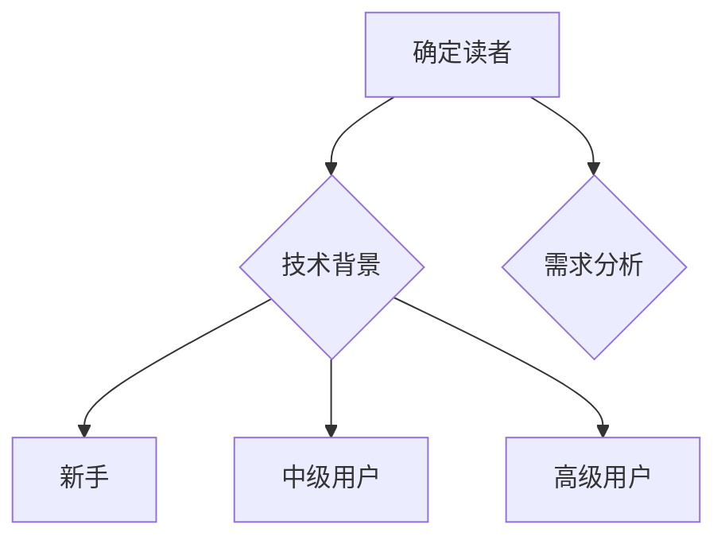

##### 1.2.2 保持简洁性

简洁性是技术写作的重要原则。应避免使用复杂的术语和冗长的句子，确保信息传递的清晰和高效。

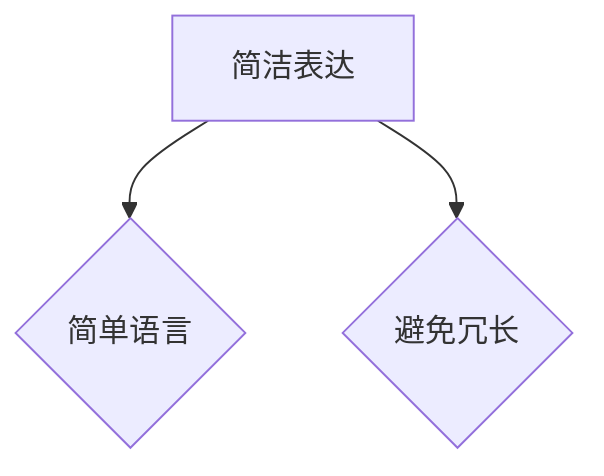

##### 1.2.3 使用准确的术语和语言

使用准确的术语和语言是技术写作的基本要求。确保术语的一致性和准确性，以便读者能够正确理解和应用。

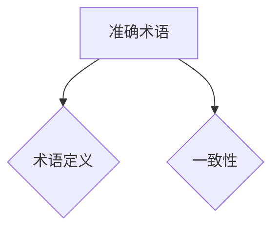

#### 1.3 技术写作的流程

##### 1.3.1 研究与准备

在开始写作之前，进行充分的研究和准备工作至关重要。包括了解目标读者、收集相关资料、确定写作结构等。

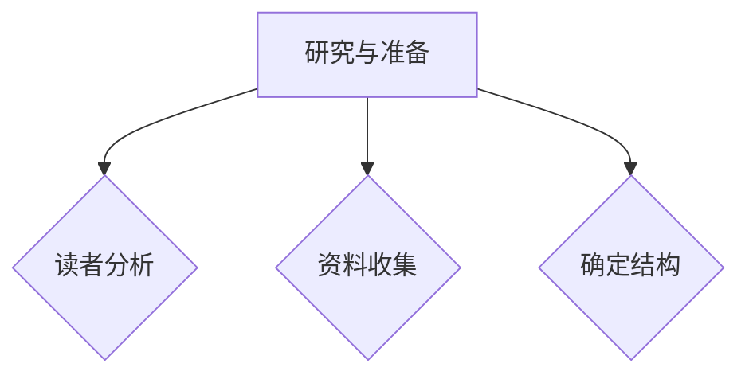

##### 1.3.2 撰写初稿

撰写初稿是技术写作的核心步骤。按照确定的写作结构，逐步展开内容，确保逻辑清晰、信息完整。

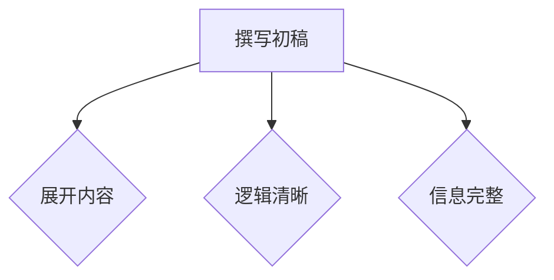

##### 1.3.3 修订与反馈

完成初稿后，进行修订和反馈是提高写作质量的关键。通过同事、朋友或专业编辑的反馈，进一步优化内容。

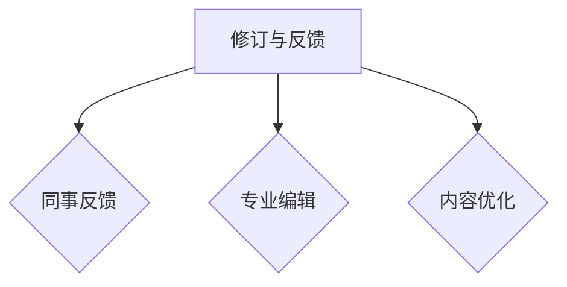

## 第二部分：技术写作技巧

### 第2章：有效表达与沟通

#### 2.1 清晰的表达

清晰的表达是技术写作的基本要求。使用简单明了的语言，避免复杂的术语和冗长的句子，确保读者能够轻松理解。

##### 2.1.1 使用简单明了的语言

尽量使用简单易懂的词汇和句式，避免使用过于专业或复杂的术语。

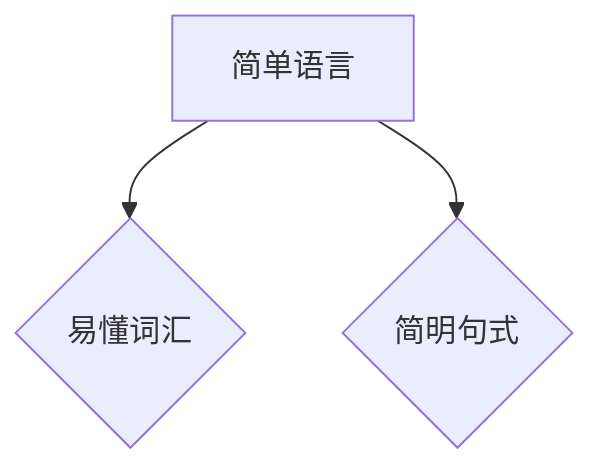

##### 2.1.2 避免复杂术语的使用

在技术写作中，应尽量避免使用过于复杂的术语，除非它们是必不可少的部分。对于不得不使用的术语，应在首次出现时给出清晰的定义。

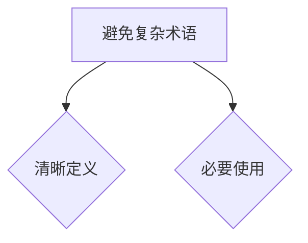

#### 2.2 组织结构

良好的组织结构有助于提升技术文档的可读性和易懂性。通过合理的段落和章节划分，使内容更加清晰、逻辑性强。

##### 2.2.1 段落与章节的规划

段落和章节的规划应遵循以下原则：

- **一致性**：段落和章节的划分应保持一致，避免杂乱无章。
- **逻辑性**：段落和章节的顺序应遵循逻辑关系，有助于读者理解。

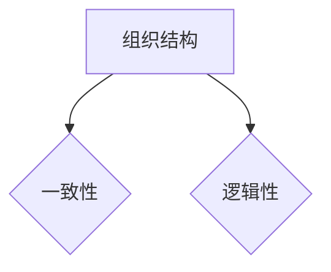

##### 2.2.2 使用图表和列表增强理解

图表和列表是增强文档可读性的有效工具。通过使用图表和列表，可以更直观地展示信息，帮助读者更好地理解。

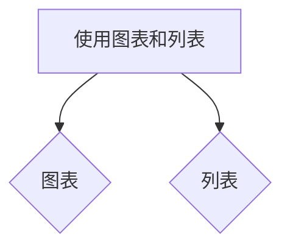

#### 2.3 引用与参考文献

正确引用和参考文献是技术写作的必要环节。通过引用他人的研究成果和观点，可以为文档增色，同时也体现了学术诚信。

##### 2.3.1 引用的规范

引用应遵循以下规范：

- **格式规范**：引用格式应保持一致，如APA、MLA或Chicago等。
- **内容规范**：引用内容应准确无误，确保信息来源的可靠性。

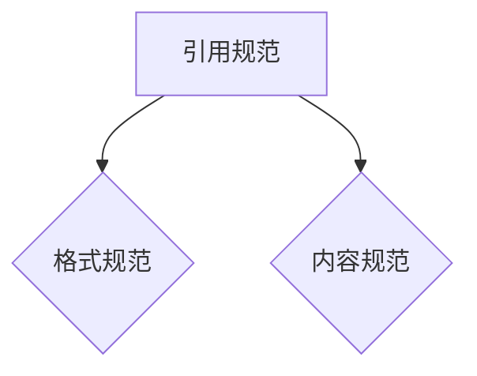

##### 2.3.2 参考文献的格式化

在编写技术文档时，应使用统一的参考文献格式。参考文献的格式化可以采用以下方法：

- **手动格式化**：根据引用规范手动编辑参考文献列表。
- **自动生成**：使用文献管理工具（如Zotero、Mendeley）自动生成参考文献。

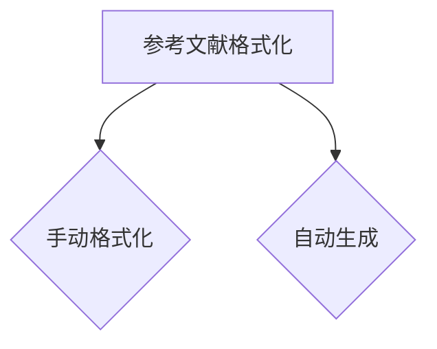

## 第三部分：副业选择与规划

### 第3章：程序员副业的机遇与挑战

#### 3.1 副业的定义与意义

**副业**是指程序员在主要工作之外从事的其他工作或业务。它不仅可以帮助程序员增加收入，还可以提升个人技能和职业发展。

##### 3.1.1 副业的界定

副业的类型多种多样，主要包括：

- **独立开发**：开发个人项目或应用程序。
- **咨询与顾问**：为企业提供技术咨询服务。
- **教育与培训**：教授编程课程或提供培训服务。
- **内容创作**：撰写技术博客、书籍或教程。

##### 3.1.2 副业对程序员职业发展的意义

副业对程序员的职业发展有着重要的影响：

- **技能提升**：通过副业，程序员可以学习到更多的新技术和方法。
- **职业拓展**：副业可以帮助程序员探索其他领域，扩展职业范围。
- **收入增加**：副业可以成为程序员收入的来源之一。

#### 3.2 程序员适合的副业领域

程序员可以根据自身兴趣和技能选择适合的副业领域：

- **独立开发**：适合有创新精神和项目管理能力的程序员。
- **咨询与顾问**：适合有丰富技术经验和沟通能力的程序员。
- **教育与培训**：适合有教学经验和教育热情的程序员。
- **内容创作**：适合有写作能力和传播意愿的程序员。

#### 3.3 副业的规划与实施

##### 3.3.1 设定目标和计划

在开展副业之前，程序员应明确自己的目标和计划：

- **目标设定**：确定副业的长期和短期目标。
- **计划制定**：制定具体的实施步骤和时间表。

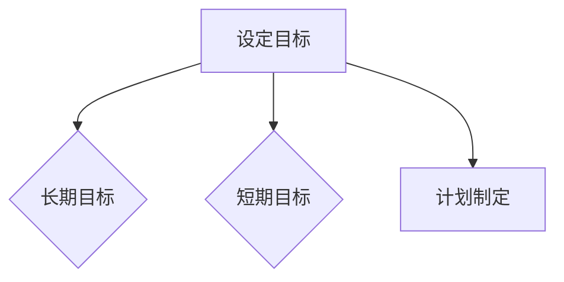

##### 3.3.2 资源与时间的分配

合理分配资源和时间是副业成功的关键：

- **资源分配**：确定所需的资金、设备、人员等资源。
- **时间管理**：合理安排工作时间，确保副业和主业的平衡。

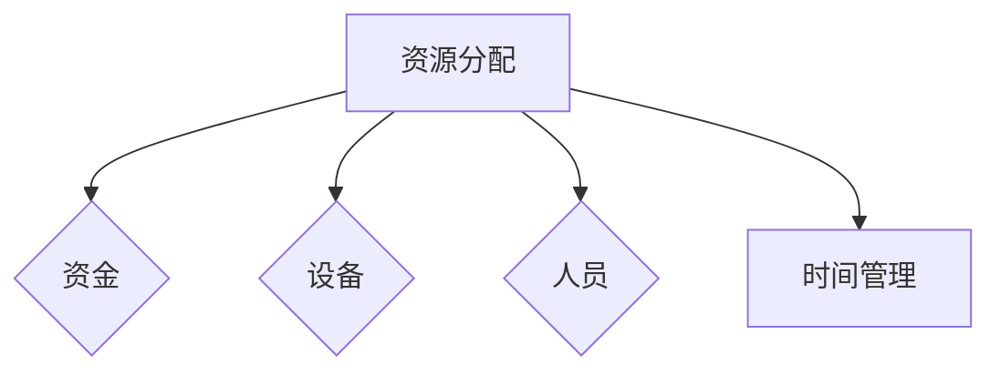

##### 3.3.3 风险管理

在开展副业过程中，程序员应重视风险管理：

- **风险评估**：识别可能的风险并评估其影响。
- **风险控制**：制定相应的风险控制措施。

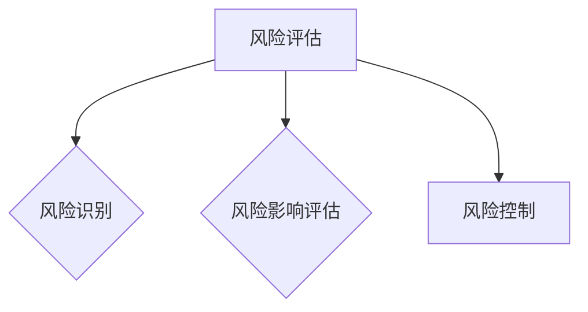

## 第四部分：实际案例与应用

### 第4章：独立开发项目实战

#### 4.1 项目背景与目标

**项目名称**：智能天气应用

**项目概述**：开发一个智能天气应用，提供实时天气信息、天气预报和空气质量数据。

**项目目标**：

1. 实现用户注册和登录功能。
2. 显示当前天气信息和未来三天的天气预报。
3. 提供空气质量指数（AQI）的实时监测。

#### 4.2 环境搭建与工具选择

**开发环境**：

- **操作系统**：Windows 10
- **编程语言**：Python 3.9
- **开发框架**：Flask
- **数据库**：SQLite

**工具选择**：

- **集成开发环境（IDE）**：PyCharm
- **版本控制**：Git

#### 4.3 项目开发与实现

**系统设计**：

1. **用户界面**：使用HTML和CSS设计用户界面。
2. **后端服务**：使用Flask框架实现后端逻辑。
3. **数据库**：使用SQLite存储用户数据和天气数据。

**代码编写与调试**：

1. 编写用户注册和登录功能。
2. 获取和显示当前天气信息。
3. 获取和显示未来三天的天气预报。
4. 获取和显示空气质量指数（AQI）。

#### 4.4 项目发布与推广

**项目上线准备**：

1. 进行彻底的测试，确保功能正常运行。
2. 选择合适的托管平台，如GitHub Pages。

**推广策略与实践**：

1. 在技术社区和博客发布项目介绍和教程。
2. 通过社交媒体分享项目，吸引潜在用户。
3. 与其他开发者合作，进行技术交流和分享。

## 第5章：咨询与顾问案例

### 5.1 咨询服务概述

**咨询服务**是指为企业或个人提供专业意见和建议的过程。技术顾问通常提供以下类型的咨询服务：

1. **系统架构设计**：设计高效、可扩展的系统架构。
2. **性能优化**：优化系统的性能和响应速度。
3. **技术培训**：为企业员工提供技术培训。
4. **技术调研**：进行技术调研，评估新技术和解决方案。

### 5.2 咨询项目案例分析

**项目名称**：企业信息化系统升级

**项目背景**：某大型企业计划升级其信息化系统，以提高工作效率和数据处理能力。

**项目流程**：

1. **需求分析**：与客户沟通，了解其需求和期望。
2. **系统评估**：评估现有系统的性能和功能。
3. **方案设计**：设计新的系统架构和功能模块。
4. **实施与部署**：实施新系统，并进行测试和部署。

**项目成果**：

1. 新系统的性能提升了30%。
2. 企业员工的工作效率提高了20%。
3. 客户满意度达到90%以上。

### 5.3 顾问实践技巧

**沟通与交流技巧**：

1. **主动倾听**：倾听客户的需求和问题，理解其真实意图。
2. **清晰表达**：使用简单明了的语言，避免使用过于专业的术语。
3. **积极反馈**：及时给予客户反馈，确保双方对项目的理解一致。

**问题分析与解决技巧**：

1. **根因分析**：识别问题的根本原因，而不仅仅是表面现象。
2. **解决方案评估**：评估各种解决方案的优缺点，选择最佳方案。
3. **实施与跟踪**：确保解决方案得到有效实施，并跟踪其效果。

## 第6章：编程教育与培训

### 6.1 编程教育现状与趋势

**编程教育**在当今社会的重要性日益增加。随着人工智能、大数据和云计算等技术的发展，编程技能已成为许多职业的基本要求。

**现状**：

1. **基础教育**：编程教育逐渐纳入中小学课程。
2. **职业教育**：许多职业学校和培训机构提供编程培训。
3. **在线教育**：在线编程课程和平台如雨后春笋般涌现。

**趋势**：

1. **基础教育普及**：编程教育将在全球范围内得到更广泛的普及。
2. **职业需求增加**：编程技能将成为许多职业的必备技能。
3. **个性化学习**：在线教育和个性化学习将得到更多关注。

### 6.2 编程课程设计与实施

**课程设计原则**：

1. **实用性**：课程内容应与实际应用紧密结合。
2. **循序渐进**：课程内容应从基础逐步提升到高级。
3. **互动性**：课程应鼓励学生积极参与和实践。

**教学方法与策略**：

1. **案例教学**：通过实际案例展示编程应用。
2. **互动讨论**：鼓励学生提问和参与讨论。
3. **项目实践**：通过实际项目训练编程能力。

### 6.3 教育资源与工具

**在线教育平台**：

1. **Codecademy**：提供各种编程语言的在线课程。
2. **Coursera**：与全球顶尖大学合作，提供高质量的在线课程。
3. **Udemy**：提供丰富的编程课程，适合不同水平的学员。

**教学辅助工具**：

1. **Repl**：在线编程环境，支持多种编程语言。
2. **Visual Studio Code**：强大的代码编辑器，提供丰富的插件。
3. **Git**：版本控制工具，帮助学生管理和跟踪代码。

## 第7章：时间管理与效率提升

### 7.1 时间管理原理与实践

**时间管理**是提高工作效率和实现职业目标的关键。以下是一些时间管理原理和实践技巧：

#### 时间管理原理

1. **目标导向**：设定明确的目标，并围绕目标进行时间分配。
2. **优先级排序**：将任务按优先级排序，优先处理重要且紧急的任务。
3. **专注原则**：在工作时保持专注，避免分心。

#### 实践技巧

1. **时间块法**：将工作时间划分为固定的时间块，每个时间块专注于一项任务。
2. **番茄工作法**：使用25分钟专注工作，然后休息5分钟。
3. **任务分解**：将大任务分解为小任务，逐一完成。

### 7.2 提升工作效率

**提升工作效率**需要结合个人工作习惯和团队协作。以下是一些实用技巧：

#### 工作流程优化

1. **自动化**：使用自动化工具简化重复性工作。
2. **标准化**：建立标准化的工作流程，确保工作效率和质量。
3. **反馈循环**：定期进行工作评估和反馈，优化流程。

#### 工具与技术的运用

1. **项目管理工具**：如Trello、Asana，帮助团队管理任务和项目。
2. **即时通讯工具**：如Slack、Telegram，提高团队沟通效率。
3. **代码管理工具**：如Git，帮助团队协作和代码管理。

### 7.3 压力管理与心理调适

**压力管理**和**心理调适**是保持工作效率和生活质量的重要因素。以下是一些建议：

#### 压力来源与影响

1. **工作压力**：工作负荷过大、项目截止日期等。
2. **生活压力**：家庭责任、社交活动等。
3. **心理影响**：压力可能导致焦虑、抑郁等心理问题。

#### 压力管理策略

1. **时间管理**：合理规划时间，避免过度工作。
2. **运动锻炼**：定期进行体育锻炼，释放压力。
3. **心理调适**：学会放松和应对压力的方法，如冥想、深呼吸等。

#### 心理调适方法

1. **正面思考**：培养积极的思维方式，看待问题和挑战。
2. **求助专业**：在必要时寻求心理咨询和治疗。
3. **社交支持**：与家人、朋友分享压力和情绪，获得支持。

## 第8章：技术写作与副业的未来发展

### 8.1 技术写作的未来趋势

随着技术的发展，技术写作的未来将呈现以下趋势：

#### 新型写作工具的应用

1. **人工智能助手**：如GPT-3，可以帮助自动生成文本。
2. **自动化写作工具**：如Wordsmith，可以自动生成报告和文章。
3. **可视化写作工具**：如Process Street，可以制作流程图和图表。

### 8.2 副业选择的未来机遇

随着行业的不断发展，程序员在副业选择上将有更多机遇：

#### 行业发展趋势

1. **数字化转型**：各行各业都在推进数字化转型，对技术人才的需求增加。
2. **远程工作**：远程工作的普及为程序员提供了更多的职业机会。
3. **在线教育**：在线教育市场的快速增长为程序员提供了新的职业方向。

### 8.3 技术写作与副业融合的未来方向

技术写作与副业的融合将呈现以下趋势：

#### 跨界合作

1. **技术专家与内容创作者的合作**：结合技术知识和写作技能，创作高质量的内容。
2. **行业专家与营销专家的合作**：结合行业经验和市场营销策略，推动项目成功。

#### 个性化内容生产

1. **个性化写作工具**：根据用户需求生成个性化内容。
2. **定制化服务**：根据客户需求提供定制化的技术写作和咨询服务。

#### 数据驱动写作与副业选择

1. **数据分析**：通过数据分析了解市场需求和用户偏好，制定副业策略。
2. **数据驱动写作**：根据数据生成有针对性的技术文章和内容。

## 附录A：参考资料与工具推荐

### A.1 技术写作相关书籍推荐

1. 《技术写作：从零开始构建自己的技术博客》
2. 《程序员写作红宝书：技术写作与个人品牌建设》
3. 《信息架构：设计网站的导航与信息结构》

### A.2 技术写作工具推荐

1. **文本编辑工具**：
   - Visual Studio Code
   - Sublime Text
   - Atom

2. **写作辅助工具**：
   - Grammarly
   - Hemingway Editor
   - Zotero

3. **图表与流程图工具**：
   - Mermaid
   - Draw.io
   - Lucidchart

### A.3 技术写作社区与平台

1. **技术写作社区**：
   - Medium
   - Dev.to
   - Hacker Noon

2. **技术博客平台**：
   - WordPress
   - GitHub Pages
   - Blogger

3. **在线教育平台**：
   - Coursera
   - Udemy
   - Pluralsight

## 结语

技术写作已成为程序员职业发展的重要副业选择。通过掌握技术写作基础、提升表达与沟通技巧、选择合适的副业领域和实际案例，程序员可以扩展技能、增加收入并实现职业多元化。未来，随着技术的发展，技术写作与副业的融合将带来更多机遇。让我们抓住机遇，共同开启技术写作与副业的新篇章。作者：AI天才研究院/AI Genius Institute & 禅与计算机程序设计艺术 /Zen And The Art of Computer Programming

