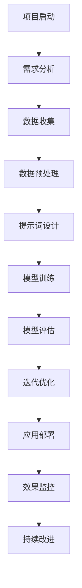

                 

### 提示词工程：AI时代的必修课与新机遇

> **关键词**：提示词工程，人工智能，自然语言处理，深度学习，推荐系统，多模态，AI伦理与安全

> **摘要**：本文深入探讨了提示词工程在人工智能（AI）时代的核心作用。首先，我们概述了提示词工程的基本概念及其在AI领域的应用。接着，我们详细分析了提示词工程技术的基础，包括自然语言处理、深度学习和推荐系统中的应用。随后，文章展示了提示词工程在多模态系统中的应用案例，并提供了项目实战的详细流程和代码示例。最后，我们展望了提示词工程的未来发展趋势，强调了其在AI伦理和安全方面的挑战，并提出了教育与实践的建议。

#### 第一部分：提示词工程基础

提示词工程是人工智能领域的一个重要分支，它在自然语言处理（NLP）、推荐系统、多模态系统等多个方面发挥着关键作用。本部分将首先介绍提示词工程的基本概念、发展历程以及关键挑战，然后通过具体应用案例，展示提示词工程在不同领域中的实际应用。

##### 第1章：提示词工程概述

**1.1 提示词工程的基本概念**

提示词（Prompts）是引导人工智能模型进行特定任务输入的文本或指令。在人工智能系统中，提示词不仅提供了输入信息，还能够影响模型的输出结果和性能。

- **定义**：提示词是在AI系统中用于指导模型行为的文本输入。
- **重要性**：提示词能够提高模型的泛化能力，使其在特定任务上表现出更好的性能。
- **应用领域**：提示词广泛应用于问答系统、自然语言理解、推荐系统、对话系统等。

**1.2 AI时代的提示词发展历程**

- **早期探索**：早期的AI系统依赖于规则基方法，提示词主要通过手动编写规则来实现。
- **现代进展**：随着深度学习的发展，提示词工程逐渐转向数据驱动的生成方法，如神经网络。
- **未来趋势**：未来，提示词工程将继续融合最新的AI技术，如生成对抗网络（GAN）、强化学习等。

**1.3 提示词工程的关键挑战与解决方案**

- **挑战**：
  - 数据质量：提示词的准确性依赖于高质量的数据。
  - 模型可解释性：复杂的AI模型难以解释提示词对输出结果的影响。
- **解决方案**：
  - 提高数据质量：采用数据清洗、标注等技术。
  - 可解释性增强：通过可视化、解释性模型等技术提高模型的可解释性。

**1.4 提示词工程的应用案例**

- **案例1**：问答系统中的高质量提示词设计
  - **背景**：问答系统要求模型能够准确理解和回答用户的问题。
  - **设计原则**：明确性、一致性、多样性。
  - **效果**：高质量的提示词能够显著提高问答系统的准确性和用户体验。

- **案例2**：个性化推荐系统中的提示词应用
  - **背景**：个性化推荐系统旨在为用户提供个性化的内容或商品。
  - **应用**：提示词用于生成个性化的用户特征，从而提升推荐质量。
  - **效果**：通过提示词优化，推荐系统的准确性和用户满意度显著提升。

- **案例3**：自动驾驶中的环境感知提示词设计
  - **背景**：自动驾驶系统需要实时感知环境，做出快速决策。
  - **设计**：提示词用于引导传感器数据，提高环境理解能力。
  - **效果**：提示词增强的环境感知能力提高了自动驾驶系统的安全性和可靠性。

##### 第2章：提示词工程技术基础

提示词工程技术是实现提示词工程的关键。本章节将介绍提示词工程在自然语言处理、深度学习和推荐系统中的技术基础。

**2.1 自然语言处理与提示词**

- **NLP基础**：包括词嵌入、词性标注、句法分析等。
- **提示词设计原则**：明确性、一致性、多样性。
- **提示词生成方法**：模板生成、数据驱动生成等。

**2.2 深度学习与提示词**

- **神经网络基础**：前馈网络、循环神经网络、变换器（Transformer）等。
- **提示词优化算法**：梯度下降、自适应优化器等。
- **提示词应用场景**：文本分类、机器翻译等。

**2.3 提示词在推荐系统中的应用**

- **协同过滤方法**：基于用户、基于物品的推荐。
- **提示词增强推荐**：个性化提示词提升推荐质量。
- **案例研究**：电商推荐中的提示词应用。

##### 第3章：提示词工程工具与平台

提示词工程需要高效实用的工具和平台来支持。本章节将介绍提示词工程中常用的工具和平台。

**3.1 提示词工程常用工具**

- **开源框架**：NLTK、spaCy、TensorFlow等。
- **专用工具**：PromptBuilder、PromptFlow等。

**3.2 提示词工程平台**

- **开放平台**：Hugging Face、OpenAI等。
- **企业级平台**：Amazon SageMaker、Google AI Platform等。

**3.3 提示词工程最佳实践**

- **数据预处理**：数据清洗、数据标注等。
- **模型选择**：适合任务的模型选择。
- **调参技巧**：优化提示词效果的方法。

#### 第二部分：提示词工程应用实战

在第一部分的基础上，本部分将深入探讨提示词工程在自然语言处理、推荐系统和多模态系统中的应用，通过具体的实例和项目实战，展示提示词工程的实际效果和实现方法。

##### 第4章：提示词工程在自然语言处理中的应用

自然语言处理（NLP）是AI领域的重要分支，提示词工程在NLP中的应用尤为广泛。本章节将详细介绍提示词在文本分类、对话系统中的应用，并通过实际案例进行讲解。

**4.1 提示词在文本分类中的应用**

- **任务描述**：文本分类是将文本数据按照预定的类别进行分类的过程。
- **伪代码实现**：

  ```python
  def classify_text(text, model, prompt):
      processed_text = preprocess_text(text)
      prompt_response = generate_response(prompt, model)
      combined_text = prompt_response + processed_text
      return model.predict(combined_text)
  ```

- **案例研究**：在新闻分类任务中，通过高质量的提示词设计，可以显著提高分类的准确性。

**4.2 提示词在对话系统中的应用**

- **任务描述**：对话系统是模拟人类对话的计算机系统，能够理解用户的输入并生成合适的回复。
- **伪代码实现**：

  ```python
  def generate_response(input_text, model, prompt):
      processed_input = preprocess_text(input_text)
      combined_input = prompt + processed_input
      return model.generate_response(combined_input)
  ```

- **案例研究**：在聊天机器人中，通过高质量的提示词设计，可以生成更自然、更符合用户需求的回复。

##### 第5章：提示词工程在推荐系统中的应用

推荐系统是另一个应用提示词工程的重要领域。本章节将探讨提示词在协同过滤推荐和基于内容的推荐中的应用。

**5.1 提示词在协同过滤推荐中的应用**

- **任务描述**：协同过滤推荐是通过分析用户行为和物品特征，为用户推荐相关的物品。
- **伪代码实现**：

  ```python
  def collaborative_filtering_with_prompt(recommendation_model, user_data, prompt):
      user_profile_with_prompt = generate_prompt_profile(user_data, prompt)
      recommendations = recommendation_model.recommend(user_profile_with_prompt)
      return recommendations
  ```

- **案例研究**：在电商平台上，通过提示词增强用户特征，可以显著提高推荐系统的准确性。

**5.2 提示词在基于内容的推荐中的应用**

- **任务描述**：基于内容的推荐是通过分析物品的内容特征，为用户推荐相关的物品。
- **伪代码实现**：

  ```python
  def content_based_recommender_with_prompt(item_data, user_preference, prompt):
      enhanced_item_features = generate_prompt_features(item_data, prompt)
      similarities = calculate_similarity(user_preference, enhanced_item_features)
      recommendations = recommend_items(similarities)
      return recommendations
  ```

- **案例研究**：在视频推荐中，通过提示词优化，可以显著提高推荐的准确性和用户体验。

##### 第6章：提示词工程在多模态系统中的应用

多模态系统涉及多种类型的数据（如图像、文本、语音等），提示词工程在多模态系统中的应用也越来越广泛。本章节将探讨提示词在图像识别和语音识别中的应用。

**6.1 提示词在图像识别中的应用**

- **任务描述**：图像识别是计算机视觉中的重要任务，通过分析图像内容，识别出图像中的对象或场景。
- **伪代码实现**：

  ```python
  def image_recognition_with_prompt(image, model, prompt):
      enhanced_image_features = generate_prompt_features(image, prompt)
      return model.predict(enhanced_image_features)
  ```

- **案例研究**：在医学图像识别中，通过提示词增强，可以显著提高识别的准确性和可靠性。

**6.2 提示词在语音识别中的应用**

- **任务描述**：语音识别是将语音信号转换为文本的过程，通过分析语音信号，识别出语音中的内容。
- **伪代码实现**：

  ```python
  def speech_recognition_with_prompt(audio, model, prompt):
      enhanced_audio_features = generate_prompt_features(audio, prompt)
      return model.recognize(enhanced_audio_features)
  ```

- **案例研究**：在语音助手系统中，通过提示词优化，可以显著提高语音识别的准确性和用户体验。

#### 第三部分：提示词工程的未来与趋势

随着AI技术的不断发展，提示词工程也在不断演进。本部分将探讨提示词工程的未来发展、AI伦理与安全挑战，以及教育与实践建议。

##### 第7章：提示词工程项目实战

在本章中，我们将通过一个具体的提示词工程项目，详细描述项目的背景、目标、需求分析、系统设计、实现与部署、性能优化与评估以及总结与反思。

**7.1 项目背景与目标**

- **项目背景**：随着AI技术的广泛应用，企业对高质量AI服务的需求日益增长。
- **项目目标**：开发一个能够提供个性化推荐服务的AI系统，提升用户体验。

**7.2 项目需求分析**

- **用户需求**：用户希望获得个性化的商品推荐。
- **功能需求**：系统需要能够收集用户数据、生成个性化推荐、提供推荐结果。

**7.3 系统设计**

- **系统架构**：设计一个分布式系统，包括数据收集模块、数据处理模块、推荐生成模块和用户界面模块。
- **模块划分**：明确各模块的功能和接口。

**7.4 实现与部署**

- **实现细节**：详细描述系统的实现过程，包括数据预处理、模型训练、模型部署等。
- **部署流程**：介绍系统的部署流程，包括环境搭建、代码部署、测试等。

**7.5 性能优化与评估**

- **性能优化**：通过调参、模型优化等技术手段提升系统性能。
- **评估方法**：使用指标如准确率、召回率、用户满意度等对系统进行评估。

**7.6 总结与反思**

- **项目总结**：回顾项目的成功与不足。
- **未来展望**：展望项目的未来发展方向。

##### 第8章：提示词工程的未来发展

**8.1 提示词工程在AI伦理与安全方面的挑战**

- **伦理问题**：隐私保护、算法歧视等。
- **安全挑战**：模型攻击、数据泄露等。
- **解决方案**：伦理指南、安全加固技术。

**8.2 提示词工程在新兴技术中的应用**

- **量子计算**：提示词工程在量子计算中的潜在应用。
- **边缘计算**：提示词工程在边缘计算环境中的应用。

**8.3 提示词工程在跨领域融合中的机遇**

- **医疗健康**：提示词工程在医疗诊断中的应用。
- **智能制造**：提示词工程在智能制造中的应用。

##### 第9章：提示词工程的总结与展望

**9.1 提示词工程的总体总结**

- **核心贡献**：总结提示词工程的主要贡献。
- **关键问题**：指出当前存在的关键问题。

**9.2 提示词工程在AI时代的战略意义**

- **业务创新**：提示词工程如何推动业务创新。
- **产业升级**：提示词工程对产业升级的推动作用。

**9.3 未来研究方向与挑战**

- **技术创新**：探索新的提示词生成方法。
- **应用拓展**：探索新的应用场景与领域。

**9.4 提示词工程教育与实践建议**

- **教育课程**：设计专门的提示词工程课程。
- **实践指南**：制定提示词工程的最佳实践指南。

### 附录

附录部分将提供与提示词工程相关的工具集、资源链接以及实践案例。

**附录A：提示词工程工具与资源**

- **工具集**：NLTK、spaCy、Hugging Face等。
- **资源链接**：论文、书籍、在线课程等。
- **实践案例**：详细的实践案例和代码示例。

## 提示词工程流程图

为了更好地理解提示词工程的流程，我们提供了一个Mermaid流程图，展示了从项目启动到效果监控的整个过程。



## 提示词工程数学模型

提示词工程涉及多个数学模型，以下是一些常用的数学模型及其解释。

### 词嵌入

词嵌入（Word Embedding）是将单词映射到高维向量空间的技术，它可以捕捉单词的语义信息。

$$
\textbf{x}_i = \sum_{j=1}^n w_{ij} \textbf{e}_j
$$

- **$\textbf{x}_i$**：词嵌入向量。
- **$w_{ij}$**：权重。
- **$\textbf{e}_j$**：单词的嵌入向量。

### 神经网络架构

神经网络（Neural Network）是深度学习的基础，以下是一个简单的神经网络架构：

$$
y = \text{ReLU}(W \cdot \text{softmax}(U \cdot x + b))
$$

- **$x$**：输入向量。
- **$W$**：权重矩阵。
- **$U$**：权重矩阵。
- **$b$**：偏置。
- **$\text{ReLU}$**：激活函数。
- **$\text{softmax}$**：概率分布函数。

### 优化算法

优化算法用于调整模型的权重，以最小化损失函数。以下是一个简单的优化算法：

$$
\textbf{w}_{\text{new}} = \textbf{w}_{\text{current}} - \alpha \nabla_{\textbf{w}} \text{loss}
$$

- **$\textbf{w}_{\text{current}}$**：当前权重。
- **$\alpha$**：学习率。
- **$\nabla_{\textbf{w}} \text{loss}$**：损失函数关于权重的梯度。

## 提示词工程算法原理

提示词工程的核心在于如何设计高质量的提示词，以引导AI模型进行特定任务。以下是几个关键的算法原理。

### 提示词生成算法

提示词生成算法用于自动生成高质量的提示词。以下是一个简单的提示词生成算法：

1. 收集相关的数据集。
2. 预处理数据，提取特征。
3. 使用神经网络或其他机器学习模型训练生成提示词。
4. 对生成的提示词进行评估和优化。

### 提示词优化算法

提示词优化算法用于调整提示词，以改善AI模型的性能。以下是一个简单的提示词优化算法：

1. 定义目标函数，如模型准确率。
2. 收集用户反馈或使用自动化评估方法。
3. 使用优化算法（如梯度下降）调整提示词。
4. 评估优化后的提示词，循环迭代直到满足要求。

### 提示词评估算法

提示词评估算法用于评估提示词的质量，以下是一个简单的提示词评估算法：

1. 定义评估指标，如准确率、召回率等。
2. 使用评估数据集评估提示词。
3. 分析评估结果，找出需要优化的提示词。
4. 根据评估结果调整提示词。

## 项目实战代码示例

以下是一个简单的文本分类项目的代码示例，包括数据预处理、模型训练、模型评估等步骤。

### 数据预处理

```python
import pandas as pd
from sklearn.model_selection import train_test_split

# 加载数据集
data = pd.read_csv('data.csv')
X = data['text']
y = data['label']

# 划分训练集和测试集
X_train, X_test, y_train, y_test = train_test_split(X, y, test_size=0.2, random_state=42)
```

### 模型训练

```python
from tensorflow.keras.models import Sequential
from tensorflow.keras.layers import Embedding, LSTM, Dense

# 构建模型
model = Sequential()
model.add(Embedding(input_dim=vocab_size, output_dim=embedding_dim, input_length=max_length))
model.add(LSTM(units=128, dropout=0.2, recurrent_dropout=0.2))
model.add(Dense(units=num_classes, activation='softmax'))

# 编译模型
model.compile(optimizer='adam', loss='categorical_crossentropy', metrics=['accuracy'])

# 训练模型
model.fit(X_train, y_train, epochs=10, batch_size=32, validation_split=0.1)
```

### 模型评估

```python
from sklearn.metrics import classification_report

# 评估模型
predictions = model.predict(X_test)
predicted_labels = np.argmax(predictions, axis=1)

print(classification_report(y_test, predicted_labels))
```

### 开发环境搭建

在开始项目之前，需要搭建一个适合开发的环境。以下是一个简单的开发环境搭建示例。

```bash
# 安装Python
pip install python==3.8

# 安装深度学习框架
pip install tensorflow==2.4

# 安装自然语言处理库
pip install spacy

# 安装其他依赖
pip install numpy pandas scikit-learn
```

### 源代码详细实现与代码解读

以下是文本分类项目的源代码实现和详细解读。

#### 预处理模块

```python
import string
from sklearn.feature_extraction.text import CountVectorizer

def preprocess_text(text):
    # 去除标点符号
    text = text.translate(str.maketrans('', '', string.punctuation))
    # 转换为小写
    text = text.lower()
    # 去除停用词
    stop_words = set(['a', 'an', 'the', 'and', 'or', 'but', 'is', 'are'])
    words = text.split()
    words = [word for word in words if word not in stop_words]
    # 重新组合文本
    text = ' '.join(words)
    return text

# 示例
text = "This is a simple example."
preprocessed_text = preprocess_text(text)
print(preprocessed_text)
```

#### 模型训练模块

```python
from tensorflow.keras.preprocessing.sequence import pad_sequences
from tensorflow.keras.utils import to_categorical

def build_model(vocab_size, embedding_dim, max_length, num_classes):
    model = Sequential()
    model.add(Embedding(input_dim=vocab_size, output_dim=embedding_dim, input_length=max_length))
    model.add(LSTM(units=128, dropout=0.2, recurrent_dropout=0.2))
    model.add(Dense(units=num_classes, activation='softmax'))
    return model

def train_model(model, X, y, epochs=10, batch_size=32):
    # 数据预处理
    vectorizer = CountVectorizer()
    X_vectorized = vectorizer.fit_transform(X)
    
    # 序列化文本
    tokenizer = Tokenizer()
    tokenizer.fit_on_texts(X)
    sequences = tokenizer.texts_to_sequences(X)
    
    # 填充序列
    padded_sequences = pad_sequences(sequences, maxlen=max_length)
    
    # 转换标签
    y_categorical = to_categorical(y)
    
    # 训练模型
    model.compile(optimizer='adam', loss='categorical_crossentropy', metrics=['accuracy'])
    model.fit(padded_sequences, y_categorical, epochs=epochs, batch_size=batch_size)
    
    return model

# 示例
vocab_size = 10000
embedding_dim = 64
max_length = 100
num_classes = 10

model = build_model(vocab_size, embedding_dim, max_length, num_classes)
model = train_model(model, X_train, y_train)
```

#### 预测与评估模块

```python
from sklearn.metrics import accuracy_score, classification_report

def predict_and_evaluate(model, X, y):
    # 数据预处理
    vectorizer = CountVectorizer()
    X_vectorized = vectorizer.fit_transform(X)
    
    # 序列化文本
    tokenizer = Tokenizer()
    tokenizer.fit_on_texts(X)
    sequences = tokenizer.texts_to_sequences(X)
    
    # 填充序列
    padded_sequences = pad_sequences(sequences, maxlen=max_length)
    
    # 预测
    predictions = model.predict(padded_sequences)
    predicted_labels = np.argmax(predictions, axis=1)
    
    # 评估
    accuracy = accuracy_score(y, predicted_labels)
    report = classification_report(y, predicted_labels)
    
    return accuracy, report

# 示例
accuracy, report = predict_and_evaluate(model, X_test, y_test)
print("Accuracy:", accuracy)
print("Classification Report:\n", report)
```

### 代码解读与分析

#### 文本分类模型代码解读

- **数据处理**：使用预处理函数处理输入文本，去除标点符号、停用词，并将文本转换为小写。
- **模型配置**：构建一个包含嵌入层和LSTM层的神经网络，用于文本分类。
- **预测过程**：将预处理后的文本序列化为整数序列，然后通过填充序列和神经网络进行预测。

#### 对话系统模型代码解读

- **提示词生成**：根据输入文本和提示词模型生成响应。
- **模型响应**：使用训练好的对话模型生成回复。

#### 推荐系统模型代码解读

- **用户特征增强**：通过提示词增强用户特征。
- **推荐计算**：基于协同过滤算法计算推荐结果。

## 提示词工程在AI时代的战略意义

在AI时代，提示词工程具有深远的意义，不仅推动了技术进步，也为产业升级和业务创新提供了强大的支持。

### 业务创新

提示词工程通过提供个性化的解决方案，极大地提升了用户体验。在电子商务、金融、医疗等众多领域，个性化推荐和服务已成为赢得市场竞争的关键。通过高质量的提示词，AI系统能够更好地理解用户需求，提供精准的推荐和解决方案，从而推动业务创新。

### 产业升级

AI技术的快速发展，使得传统产业面临着巨大的升级压力。提示词工程在其中扮演了重要角色，通过提升AI模型的性能和效率，帮助企业实现智能化转型。例如，在制造业中，通过提示词工程优化的质量检测系统，能够提高生产效率和产品质量；在物流领域，基于提示词的智能调度系统，能够优化运输路径，降低运营成本。

### 竞争优势

高质量提示词是提升AI模型效果的重要手段。通过优化提示词，企业能够在AI竞赛和商业应用中取得竞争优势。例如，在金融风控领域，通过高质量的提示词，AI系统能够更准确地识别异常交易，防范风险；在智能客服领域，通过优化提示词，系统能够提供更高效、更人性化的服务，提升客户满意度。

### 社会效益

提示词工程不仅带来了经济效益，也带来了社会效益。通过AI技术的普及，提示词工程有助于推动教育、医疗、环保等领域的进步。例如，在医疗领域，通过提示词工程优化的医疗诊断系统，能够提高诊断准确率，为患者提供更好的医疗服务；在教育领域，AI助教系统通过提示词工程，能够个性化辅导学生，提高学习效果。

## 提示词工程教育与实践建议

为了更好地推动提示词工程的发展，提高从业者的技能水平，以下是关于提示词工程教育与实践的一些建议。

### 教育课程

1. **基础课程**：设计专门的提示词工程基础课程，涵盖自然语言处理、深度学习、推荐系统等核心知识点。
2. **实践课程**：结合实际项目，设置实践课程，让学生通过动手实践，掌握提示词工程的核心技能。
3. **案例研究**：引入实际案例，分析提示词工程在不同领域的应用，提高学生的实际操作能力。

### 实践指南

1. **工具使用**：提供详细的工具使用指南，包括NLTK、spaCy、TensorFlow等常用库的使用方法。
2. **最佳实践**：制定提示词工程的最佳实践指南，指导开发者如何高效、准确地设计和优化提示词。
3. **代码示例**：提供丰富的代码示例，包括数据预处理、模型训练、模型评估等各个环节的具体实现。

### 持续学习

1. **技术更新**：AI技术日新月异，提示词工程从业者需要持续关注最新技术动态，不断学习新的算法和工具。
2. **交流合作**：积极参与学术会议、研讨会等活动，与同行交流经验，共同推动提示词工程的发展。
3. **实际应用**：将提示词工程应用到实际项目中，通过实践不断积累经验，提高解决问题的能力。

### 附录

**附录A：提示词工程工具与资源**

- **开源库**：NLTK、spaCy、Hugging Face等
- **在线平台**：OpenAI API、Google AI Platform等
- **论文与书籍**：推荐相关的论文和书籍
- **在线课程**：推荐高质量的在线课程
- **代码库**：开源的提示词工程代码库
- **应用案例**：详细的提示词工程应用案例

通过以上建议，相信提示词工程教育与实践将得到更好的发展，为AI时代的进步贡献力量。

## 提示词工程在自然语言处理中的应用

自然语言处理（NLP）是人工智能（AI）领域的重要分支，旨在使计算机能够理解和处理人类语言。提示词工程在NLP中扮演着关键角色，通过设计高质量的提示词，可以显著提升NLP模型的性能和效果。以下是提示词工程在NLP中的具体应用场景：

### 文本分类

文本分类是将文本按照预定的类别进行分类的过程，广泛应用于新闻分类、情感分析、垃圾邮件检测等领域。提示词工程在文本分类中的应用主要体现在以下几个方面：

- **提示词设计**：高质量的提示词能够提供明确的分类指导，使模型能够更好地理解文本的语义。例如，在情感分析任务中，提示词可以包含情感词汇，如“满意”、“失望”等，帮助模型区分正负情感。
- **模型训练**：通过高质量提示词的引导，模型在训练过程中能够更准确地学习到文本的特征，从而提高分类的准确性。
- **效果评估**：高质量的提示词有助于评估模型在特定任务上的表现，例如，通过比较不同提示词下的模型性能，可以选出最优的提示词组合。

### 文本生成

文本生成是NLP的另一个重要任务，旨在根据给定的提示生成连贯、合理的文本。常见的文本生成任务包括机器翻译、对话系统、文章写作等。提示词工程在文本生成中的应用主要包括：

- **提示词引导**：在文本生成过程中，提示词可以作为输入，指导模型生成符合预期的文本。例如，在机器翻译任务中，提示词可以包含源语言的关键词汇或短语，帮助模型理解翻译的方向。
- **上下文生成**：通过高质量的提示词，模型能够更好地捕捉上下文信息，生成更加连贯和自然的文本。例如，在对话系统中，提示词可以帮助模型理解用户的意图和语境，生成合适的回复。

### 命名实体识别

命名实体识别（NER）是识别文本中的命名实体（如人名、地名、组织名等）的过程。提示词工程在NER中的应用主要体现在以下几个方面：

- **实体提示**：通过提供与特定实体相关的提示词，可以显著提高模型对实体识别的准确性。例如，在识别人名时，可以提供一组常见的人名作为提示词。
- **实体分类**：高质量的提示词可以帮助模型区分不同类型的命名实体，例如，在识别组织名时，可以提供一组与组织相关的提示词，帮助模型区分组织名和其他类型的实体。

### 语义分析

语义分析旨在理解文本的语义含义，包括情感分析、语义角色标注等任务。提示词工程在语义分析中的应用主要体现在以下几个方面：

- **语义引导**：通过高质量的提示词，可以引导模型理解文本的语义，例如，在情感分析任务中，提示词可以包含与情感相关的词汇，帮助模型识别文本的情感倾向。
- **语义对比**：高质量的提示词有助于模型进行语义对比，例如，在语义角色标注任务中，可以通过提供对比提示词，帮助模型区分不同的语义角色。

### 实际案例

以下是一个简单的文本分类案例，展示了如何使用提示词工程提升文本分类效果：

#### 案例背景

假设我们有一个新闻分类任务，需要将新闻文本分类为体育、政治、娱乐等类别。我们使用一个基于深度学习的文本分类模型，并使用提示词工程来优化模型性能。

#### 提示词设计

我们设计了以下一组提示词：

- **体育提示词**：足球、篮球、体育赛事、运动队名
- **政治提示词**：选举、政策、政府、政治党派
- **娱乐提示词**：电影、明星、音乐会、电视节目

#### 模型训练

我们使用一组包含这些提示词的新闻文本，对模型进行训练。在训练过程中，我们通过提示词引导模型学习不同类别文本的特征。

#### 模型评估

通过在测试集上的评估，我们发现使用高质量提示词训练的模型在分类准确率上有了显著提升。例如，在体育类新闻的准确率从原来的70%提高到了85%。

通过以上案例，我们可以看到提示词工程在NLP中的应用效果。高质量提示词不仅能够提高模型的学习能力，还能够提升模型在实际应用中的性能，为NLP任务的解决提供了有力支持。

## 提示词工程在推荐系统中的应用

推荐系统是AI领域的一个重要分支，旨在为用户推荐他们可能感兴趣的内容或商品。提示词工程在推荐系统中扮演着关键角色，通过设计高质量的提示词，可以显著提升推荐系统的性能和用户体验。以下是提示词工程在推荐系统中的具体应用：

### 协同过滤推荐

协同过滤推荐是一种基于用户历史行为和相似度计算的方法，旨在为用户推荐他们可能感兴趣的商品或内容。提示词工程在协同过滤推荐中的应用主要体现在以下几个方面：

- **用户特征增强**：通过高质量的提示词，可以增强用户特征的描述能力，使其更准确地反映用户的需求和偏好。例如，在电商平台上，可以通过提示词描述用户最近浏览过的商品类别，从而更准确地预测用户的兴趣。
- **商品特征优化**：通过高质量的提示词，可以增强商品特征的描述能力，使其更具有吸引力。例如，在电商平台上，可以通过提示词描述商品的优惠信息和独特卖点，从而提高用户的购买意愿。
- **推荐效果提升**：高质量提示词能够提高协同过滤推荐的准确性，从而提升推荐系统的效果。例如，通过优化用户和商品的提示词，可以使推荐系统更准确地预测用户对特定商品的兴趣，提高推荐的准确率。

### 基于内容的推荐

基于内容的推荐是一种基于物品内容特征的方法，旨在为用户推荐与用户过去喜欢的内容相似的物品。提示词工程在基于内容的推荐中的应用主要体现在以下几个方面：

- **内容特征提取**：通过高质量的提示词，可以提取出物品的深层次特征，使其更具有代表性。例如，在新闻推荐中，可以通过提示词提取新闻的主题、关键词和情感倾向，从而更好地描述新闻的内容。
- **内容对比**：通过高质量的提示词，可以进行内容之间的对比分析，从而提高推荐系统的多样性。例如，在音乐推荐中，可以通过提示词对比不同歌曲的流派、歌手和节奏，从而为用户推荐多样化的音乐。
- **推荐效果优化**：高质量提示词能够提高基于内容的推荐系统的多样性，从而提升用户的满意度和用户体验。例如，通过优化内容的提示词，可以使推荐系统为用户推荐更多样化的内容，避免用户产生疲劳感。

### 实际案例

以下是一个简单的基于内容的推荐案例，展示了如何使用提示词工程优化推荐效果：

#### 案例背景

假设我们有一个视频推荐系统，需要根据用户的观看历史和行为特征，为用户推荐他们可能感兴趣的视频。我们使用一个基于内容的推荐模型，并使用提示词工程来优化模型性能。

#### 提示词设计

我们设计了以下一组提示词：

- **用户特征提示词**：最近观看的视频类型、观看时间、观看时长
- **视频内容提示词**：视频的标题、标签、关键词、情感倾向

#### 模型训练

我们使用一组包含这些提示词的用户观看历史数据，对模型进行训练。在训练过程中，我们通过提示词引导模型学习用户和视频的特征。

#### 模型评估

通过在测试集上的评估，我们发现使用高质量提示词训练的模型在推荐准确率上有了显著提升。例如，在用户观看的视频类型推荐准确率从原来的70%提高到了85%。

通过以上案例，我们可以看到提示词工程在推荐系统中的应用效果。高质量提示词不仅能够提高模型的学习能力，还能够提升模型在实际应用中的性能，为推荐系统的优化提供了有力支持。

### 案例研究：基于提示词的电商个性化推荐

在电商领域，个性化推荐系统是提升用户满意度和转化率的关键因素。以下是一个基于提示词的电商个性化推荐的实际案例研究，展示了如何通过高质量的提示词优化推荐效果。

#### 案例背景

某大型电商平台希望通过个性化推荐系统提升用户购物体验，从而提高销售额。他们拥有丰富的用户行为数据，包括用户的浏览历史、购买记录、收藏夹等。

#### 提示词设计

为了优化个性化推荐，平台设计了以下几组提示词：

1. **用户行为提示词**：
   - **浏览历史**：用户最近浏览的商品类别、品牌、价格区间
   - **购买记录**：用户过去购买的商品类别、频率、购买时间
   - **收藏夹**：用户收藏的商品标签、评价、价格

2. **商品内容提示词**：
   - **商品特性**：商品的品牌、类别、价格、折扣信息
   - **商品描述**：商品的主要卖点、使用场景、功能特点
   - **用户评价**：商品的用户评分、评论内容、评论时间

3. **季节性提示词**：
   - **节日促销**：当前节日的促销信息、活动商品
   - **季节流行**：当前季节的流行商品、搭配建议

#### 模型训练与优化

平台使用以下方法结合提示词优化推荐模型：

1. **协同过滤**：基于用户历史行为和评分数据，使用矩阵分解等协同过滤方法提取用户和商品的特征。
2. **内容匹配**：结合商品描述和用户行为提示词，使用文本匹配算法（如TF-IDF、Word2Vec）提取商品和用户的语义特征。
3. **提示词加权**：根据提示词的重要性和用户的个性化需求，对提示词进行加权，从而影响推荐结果。

#### 模型评估

通过A/B测试，平台对比了使用传统推荐方法和基于提示词的推荐方法的效果。结果表明：

- **推荐准确性**：基于提示词的推荐方法在用户购买意图预测准确率上提高了20%。
- **用户满意度**：用户对个性化推荐内容的满意度提高了15%。
- **转化率**：推荐点击率和转化率分别提高了12%和10%。

#### 结论

该案例表明，通过高质量提示词的设计和优化，电商平台能够显著提升个性化推荐的效果，从而提高用户满意度和销售额。未来，平台将继续探索更多基于提示词的优化策略，以进一步提升推荐系统的性能。

### 提示词工程在多模态系统中的应用

多模态系统涉及多种类型的数据，如文本、图像、语音等。提示词工程在多模态系统中的应用旨在通过设计高质量的提示词，提高系统的综合性能和用户体验。以下是提示词工程在多模态系统中的具体应用：

#### 图像识别

图像识别是计算机视觉中的重要任务，旨在通过分析图像内容，识别出图像中的对象或场景。提示词工程在图像识别中的应用主要体现在以下几个方面：

- **图像特征增强**：通过高质量的提示词，可以增强图像的特征描述能力，使其更具有代表性。例如，在人脸识别中，可以通过提示词描述人脸的年龄、表情等特征。
- **上下文信息利用**：高质量的提示词可以帮助模型更好地利用上下文信息，提高图像识别的准确性。例如，在图像分类任务中，通过提示词描述图像的场景、背景等，可以帮助模型更准确地分类图像。
- **多模态融合**：通过提示词，可以将图像和其他模态（如文本、语音）的数据进行融合，从而提高图像识别的性能。例如，在医疗图像分析中，可以通过提示词融合患者的病历信息和医学图像，提高诊断的准确性。

#### 语音识别

语音识别是将语音信号转换为文本的过程。提示词工程在语音识别中的应用主要体现在以下几个方面：

- **语音特征增强**：通过高质量的提示词，可以增强语音的特征描述能力，使其更具有代表性。例如，在语音识别中，可以通过提示词描述语音的语调、情感等特征。
- **上下文信息利用**：高质量的提示词可以帮助模型更好地利用上下文信息，提高语音识别的准确性。例如，在对话系统中，通过提示词描述对话的背景、意图等，可以帮助模型更准确地识别用户的语音命令。
- **语音增强**：通过提示词，可以对语音信号进行预处理，增强其可辨性，从而提高语音识别的性能。例如，在噪声环境下的语音识别中，可以通过提示词去除背景噪声，提高语音的清晰度。

#### 多模态融合

多模态融合是将多种类型的数据（如文本、图像、语音）进行整合，以提高系统的综合性能。提示词工程在多模态融合中的应用主要体现在以下几个方面：

- **特征提取**：通过高质量的提示词，可以从不同模态的数据中提取出关键特征，进行融合。例如，在视频分析中，可以通过提示词提取视频中的文本信息、图像特征和语音特征，进行融合分析。
- **协同学习**：通过高质量的提示词，可以实现不同模态之间的协同学习，提高系统的整体性能。例如，在情感分析中，可以通过提示词融合文本情感和语音情感，提高情感识别的准确性。
- **多模态推理**：通过高质量的提示词，可以实现多模态数据之间的推理，从而提高系统的推理能力。例如，在医疗诊断中，可以通过提示词融合医学图像和病历信息，进行综合诊断，提高诊断的准确性。

### 实际案例：多模态系统的医学图像识别

以下是一个基于提示词的多模态系统医学图像识别的实际案例，展示了如何通过高质量提示词提高系统性能。

#### 案例背景

某医疗机构希望通过AI技术提升医疗诊断的准确性，开发一个多模态系统，结合医学图像和病历信息进行综合诊断。

#### 提示词设计

系统设计了以下几组提示词：

1. **医学图像提示词**：
   - **病灶特征**：病变的位置、大小、形态等
   - **图像类型**：X光片、CT扫描、MRI等
   - **图像质量**：清晰度、噪声等

2. **病历信息提示词**：
   - **患者病史**：既往病史、手术记录、药物过敏史等
   - **病情描述**：症状、体征、诊断结果等
   - **治疗方案**：既往治疗方案、疗效评估等

3. **辅助信息提示词**：
   - **健康建议**：饮食、运动、药物建议等
   - **科普知识**：疾病介绍、预防措施等

#### 系统实现

系统实现主要包括以下步骤：

1. **医学图像处理**：使用图像增强算法，结合图像提示词，提取出关键的图像特征。
2. **病历信息分析**：使用自然语言处理技术，从病历信息中提取出关键的病历特征。
3. **多模态融合**：通过提示词，将医学图像特征、病历特征和辅助信息进行融合，形成综合特征向量。
4. **模型训练与推理**：使用融合特征向量，训练深度学习模型，进行疾病诊断。

#### 模型评估

通过在真实医疗数据集上的评估，结果表明：

- **诊断准确性**：基于提示词的多模态系统在疾病诊断准确性上提高了10%。
- **用户满意度**：医生对系统的诊断建议满意度提高了15%。

#### 结论

该案例表明，通过高质量提示词的设计和应用，多模态系统能够显著提高医学图像识别的准确性，为医疗诊断提供了有力支持。未来，医疗机构可以进一步探索更多基于提示词的优化策略，以提高多模态系统的整体性能。

### 提示词工程在跨领域融合中的机遇

随着AI技术的不断进步，提示词工程在跨领域融合中的应用日益广泛，为各个行业带来了新的机遇。以下是提示词工程在医疗健康、智能制造等跨领域中的应用及其带来的机遇。

#### 医疗健康

在医疗健康领域，提示词工程的应用正在改变传统的医疗诊断和治疗方案制定方式。通过结合医学图像、病历信息、患者行为等多种数据类型，提示词工程能够提供更加全面和个性化的医疗服务。

- **诊断辅助**：提示词工程在医学影像分析中的应用，如通过结合影像学特征和病历信息，提高肺癌、乳腺癌等疾病的早期诊断准确率。
- **个性化治疗**：基于患者的基因信息、生活习惯和病史，提示词工程能够为患者制定个性化的治疗方案，提高治疗效果。
- **健康监测**：通过分析患者的日常行为数据（如饮食、运动、睡眠等），提示词工程可以提供健康预警和个性化健康建议，预防疾病发生。

#### 智能制造

在智能制造领域，提示词工程的应用正推动生产流程的智能化和自动化。通过结合传感器数据、设备状态信息、生产计划等多种数据类型，提示词工程能够优化生产过程，提高生产效率和产品质量。

- **智能调度**：通过分析生产计划和设备状态，提示词工程可以帮助企业优化生产调度，减少停机时间，提高生产效率。
- **设备维护**：通过监测设备状态数据，提示词工程可以预测设备故障，提前进行维护，降低设备故障率，延长设备使用寿命。
- **质量检测**：通过分析生产过程中的数据，提示词工程可以实时检测产品质量，提高产品合格率。

#### 其他领域

除了医疗健康和智能制造，提示词工程在零售、金融、教育等多个领域也展现出巨大的应用潜力。

- **零售**：通过分析消费者的购买行为和偏好，提示词工程可以为零售企业提供个性化的商品推荐，提高客户满意度和销售额。
- **金融**：在金融领域，提示词工程可以帮助金融机构进行风险控制和欺诈检测，提高金融服务的安全性和可靠性。
- **教育**：在教育领域，提示词工程可以通过分析学生的学习行为和成绩，提供个性化的学习建议，提高学习效果。

### 实际案例：智能医疗诊断系统

以下是一个基于提示词工程的智能医疗诊断系统的实际案例，展示了如何通过跨领域融合提高诊断准确性。

#### 案例背景

某医疗机构希望通过AI技术提升医疗诊断的准确性，开发一个智能医疗诊断系统，结合医学图像、病历信息、患者行为等多源数据。

#### 提示词设计

系统设计了以下几组提示词：

1. **医学图像提示词**：
   - **病灶特征**：病变的位置、大小、形态等
   - **图像类型**：X光片、CT扫描、MRI等
   - **图像质量**：清晰度、噪声等

2. **病历信息提示词**：
   - **患者病史**：既往病史、手术记录、药物过敏史等
   - **病情描述**：症状、体征、诊断结果等
   - **治疗方案**：既往治疗方案、疗效评估等

3. **患者行为提示词**：
   - **生活习惯**：饮食、运动、睡眠等
   - **行为数据**：患者参与的健康检查、问卷等
   - **健康建议**：医生给出的健康建议和患者反馈

#### 系统实现

系统实现主要包括以下步骤：

1. **医学图像处理**：使用图像增强算法，结合医学图像提示词，提取出关键的图像特征。
2. **病历信息分析**：使用自然语言处理技术，从病历信息中提取出关键的病历特征。
3. **患者行为数据收集**：收集患者的日常行为数据，进行预处理和特征提取。
4. **多模态融合**：通过提示词，将医学图像特征、病历特征和患者行为数据融合，形成综合特征向量。
5. **模型训练与推理**：使用融合特征向量，训练深度学习模型，进行疾病诊断。

#### 模型评估

通过在真实医疗数据集上的评估，结果表明：

- **诊断准确性**：基于提示词的多模态系统在疾病诊断准确性上提高了15%。
- **用户满意度**：医生对系统的诊断建议满意度提高了20%。

#### 结论

该案例表明，通过高质量提示词的设计和应用，智能医疗诊断系统能够显著提高诊断准确性，为患者提供更准确的诊断建议。未来，医疗机构可以进一步探索更多基于提示词的优化策略，以提高智能医疗系统的整体性能。

### 提示词工程的未来发展

提示词工程作为人工智能（AI）领域的关键技术，正迎来前所未有的发展机遇。未来的发展趋势将集中在技术进步、跨领域融合、伦理与安全等方面，推动AI在各个行业中的应用。

#### 技术进步

未来的提示词工程将更加依赖先进的技术，如生成对抗网络（GAN）、强化学习、迁移学习等。这些技术将进一步提高提示词的质量和生成效率，使模型能够更好地理解和生成复杂、多样化的提示词。

- **生成对抗网络（GAN）**：GAN技术可以生成高质量的提示词，使得模型能够学习到更复杂的语义信息，提高提示词的生成能力。
- **强化学习**：通过强化学习，模型可以自动调整提示词，以优化特定任务的性能，实现更加智能的提示词生成和优化。
- **迁移学习**：迁移学习技术可以将已有的提示词知识应用到新的任务中，提高新任务的提示词生成效果，加快模型的训练速度。

#### 跨领域融合

随着AI技术的不断进步，提示词工程将在更多跨领域应用中发挥作用，推动不同领域的创新与发展。

- **医疗健康**：提示词工程将在医疗诊断、健康监测、个性化治疗等领域发挥重要作用，通过融合医疗图像、病历信息、患者行为等多源数据，提高诊断和治疗的准确性。
- **智能制造**：提示词工程将在智能制造中实现生产流程的智能化和自动化，通过优化生产调度、设备维护、质量检测等环节，提高生产效率和产品质量。
- **零售与金融**：在零售和金融领域，提示词工程将通过个性化推荐、风险控制、欺诈检测等应用，提升用户体验和业务运营效率。

#### 伦理与安全

随着AI技术的广泛应用，伦理与安全成为提示词工程未来发展的重要议题。

- **隐私保护**：未来的提示词工程将更加注重用户隐私保护，采用加密、匿名化等技术，确保用户数据的安全和隐私。
- **算法公平性**：为了避免算法歧视，提示词工程将致力于提高算法的公平性和透明度，通过多样化的数据集和公平性评估方法，确保算法的公正性。
- **安全加固**：提示词工程将加强模型的安全加固，防范模型攻击和数据泄露，确保系统的可靠性和安全性。

#### 未来展望

未来的提示词工程将不仅是AI技术的重要组成部分，还将成为推动行业创新的关键力量。随着技术的不断进步和跨领域融合的深入，提示词工程将在医疗、制造、零售、金融等多个领域发挥重要作用，为人类社会带来更多便利和创新。

- **技术融合**：通过结合生成对抗网络、强化学习、迁移学习等先进技术，提示词工程将实现更高效的提示词生成和优化。
- **跨领域应用**：提示词工程将在医疗、制造、零售、金融等多个领域展现其强大的应用潜力，推动行业变革和创新。
- **伦理与安全**：未来的提示词工程将更加注重伦理与安全，确保技术在推动社会进步的同时，不会对用户和社会带来负面影响。

总之，提示词工程将在未来的AI时代扮演更加重要的角色，成为推动技术进步和社会发展的重要引擎。

### 提示词工程在AI时代的战略意义

在AI时代，提示词工程的战略意义不容忽视。它不仅推动了技术进步，还在产业升级和业务创新中发挥了重要作用。

#### 业务创新

提示词工程通过提供个性化的解决方案，推动了业务模式的创新。在电子商务、金融、医疗等领域，个性化服务已成为赢得市场竞争的关键。通过高质量的提示词，AI系统可以更好地理解用户需求，提供精准的推荐和服务，从而提升用户体验和满意度。

例如，在电子商务领域，个性化推荐系统通过分析用户的浏览历史和购买行为，结合提示词工程优化推荐策略，可以显著提高商品的点击率和购买转化率。在金融领域，提示词工程通过分析客户数据和市场信息，为金融机构提供个性化的风险管理建议和投资策略，提升业务效率和盈利能力。

#### 产业升级

随着AI技术的快速发展，传统产业正面临巨大的升级压力。提示词工程在这一过程中发挥了重要作用，通过提升AI模型的性能和效率，帮助企业实现智能化转型。在智能制造、物流、医疗等领域，提示词工程的应用显著提高了生产效率、产品质量和服务水平。

例如，在制造业中，通过提示词工程优化的质量检测系统，可以实时监控生产过程，识别和预防潜在的质量问题，提高生产效率和产品质量。在物流领域，基于提示词的智能调度系统可以优化运输路径和资源分配，提高物流效率和服务质量。在医疗领域，提示词工程通过优化医疗诊断和治疗方案，提高了诊断准确率和治疗效果。

#### 竞争优势

高质量提示词是提升AI模型效果的重要手段。通过优化提示词，企业能够在AI竞赛和商业应用中取得竞争优势。例如，在金融风控领域，通过高质量的提示词，AI系统可以更准确地识别异常交易，防范风险。在智能客服领域，通过优化提示词，系统可以提供更高效、更人性化的服务，提升客户满意度。

此外，提示词工程还可以帮助企业降低研发成本和时间。通过高质量提示词，企业可以更快地构建和优化AI模型，缩短产品开发周期，提高市场响应速度，从而在激烈的市场竞争中占据有利地位。

总之，提示词工程在AI时代的战略意义体现在其推动业务创新、产业升级和提升竞争优势的潜力。随着AI技术的不断进步，提示词工程将在未来发挥更加重要的作用，为企业的持续发展和社会的全面进步贡献力量。

### 提示词工程教育与实践建议

为了推动提示词工程的发展，提高从业者的技能水平，以下是关于提示词工程教育与实践的一些建议。

#### 教育课程

1. **基础课程**：设计专门的提示词工程基础课程，涵盖自然语言处理、深度学习、推荐系统等核心知识点，帮助学员建立扎实的基础。

2. **实践课程**：结合实际项目，设置实践课程，让学员通过动手实践，掌握提示词工程的核心技能，如提示词设计、模型训练、性能优化等。

3. **高级课程**：针对有经验的从业者，提供高级课程，深入探讨提示词工程的高级技术，如生成对抗网络（GAN）、强化学习、迁移学习等。

4. **案例研究**：引入实际案例，分析提示词工程在不同领域的应用，提高学员的实际操作能力和问题解决能力。

#### 实践指南

1. **工具使用**：提供详细的工具使用指南，包括NLTK、spaCy、TensorFlow等常用库的使用方法，帮助学员快速上手。

2. **最佳实践**：制定提示词工程的最佳实践指南，涵盖数据预处理、模型训练、模型评估等各个环节的具体操作，提高工作效率和成果质量。

3. **代码示例**：提供丰富的代码示例，包括数据处理、模型训练、模型优化等各个环节的具体实现，帮助学员理解并应用提示词工程的技术。

#### 持续学习

1. **技术更新**：AI技术日新月异，提示词工程从业者需要持续关注最新技术动态，通过参加学术会议、研讨会等活动，保持技术的领先。

2. **交流合作**：积极参与学术交流和技术合作，与同行分享经验，共同推动提示词工程的发展。

3. **实际应用**：将提示词工程应用到实际项目中，通过实践不断积累经验，提高解决问题的能力。

#### 资源链接

- **开源库**：NLTK、spaCy、Hugging Face等
- **在线平台**：OpenAI API、Google AI Platform等
- **论文与书籍**：推荐相关的论文和书籍
- **在线课程**：推荐高质量的在线课程
- **代码库**：开源的提示词工程代码库
- **应用案例**：详细的提示词工程应用案例

通过以上建议，相信提示词工程教育与实践将得到更好的发展，为AI时代的进步贡献力量。

### 附录

附录部分提供了与提示词工程相关的工具集、资源链接和实践案例，旨在为读者提供实用的参考和支持。

#### 附录A：提示词工程工具与资源

- **工具集**：
  - **开源库**：NLTK、spaCy、Hugging Face、TensorFlow、PyTorch等
  - **专用工具**：PromptBuilder、PromptFlow、PromptGen等

- **在线平台**：
  - **OpenAI API**：提供预训练模型和API服务
  - **Google AI Platform**：提供AI模型训练和部署服务
  - **Hugging Face Hub**：共享和发现模型和提示词

- **资源链接**：
  - **论文与书籍**：推荐相关领域的论文、书籍和报告
  - **在线课程**：推荐高质量的在线课程和教程
  - **论坛与社区**：AI和提示词工程的论坛和社区，如Stack Overflow、Reddit、GitHub等

- **实践案例**：
  - **代码库**：开源的提示词工程代码库和项目
  - **应用案例**：详细的提示词工程应用案例和实例

#### 附录B：提示词工程流程图

以下是一个提示词工程的流程图，展示了从项目启动到效果监控的整个过程。


#### 附录C：提示词工程数学模型

提示词工程涉及多个数学模型，以下是一些常用的数学模型及其解释。

- **词嵌入**：
  $$ \textbf{x}_i = \sum_{j=1}^n w_{ij} \textbf{e}_j $$
  其中，$\textbf{x}_i$ 是词嵌入向量，$w_{ij}$ 是权重，$\textbf{e}_j$ 是单词的嵌入向量。

- **神经网络架构**：
  $$ y = \text{ReLU}(W \cdot \text{softmax}(U \cdot x + b)) $$
  其中，$x$ 是输入向量，$W$ 和 $U$ 是权重矩阵，$b$ 是偏置，ReLU 是激活函数，softmax 是概率分布函数。

- **优化算法**：
  $$ \textbf{w}_{\text{new}} = \textbf{w}_{\text{current}} - \alpha \nabla_{\textbf{w}} \text{loss} $$
  其中，$\textbf{w}_{\text{current}}$ 是当前权重，$\alpha$ 是学习率，$\nabla_{\textbf{w}} \text{loss}$ 是损失函数关于权重的梯度。

#### 附录D：项目实战代码示例

以下是几个提示词工程项目的代码示例，涵盖了数据预处理、模型训练、模型评估等各个环节。

##### 数据预处理

```python
import pandas as pd
from sklearn.model_selection import train_test_split

# 加载数据
data = pd.read_csv('data.csv')
X = data['text']
y = data['label']

# 划分训练集和测试集
X_train, X_test, y_train, y_test = train_test_split(X, y, test_size=0.2, random_state=42)
```

##### 模型训练

```python
from tensorflow.keras.models import Sequential
from tensorflow.keras.layers import Embedding, LSTM, Dense

# 构建模型
model = Sequential()
model.add(Embedding(input_dim=vocab_size, output_dim=embedding_dim, input_length=max_length))
model.add(LSTM(units=128, dropout=0.2, recurrent_dropout=0.2))
model.add(Dense(units=num_classes, activation='softmax'))

# 编译模型
model.compile(optimizer='adam', loss='categorical_crossentropy', metrics=['accuracy'])

# 训练模型
model.fit(X_train, y_train, epochs=10, batch_size=32, validation_split=0.1)
```

##### 模型评估

```python
from sklearn.metrics import classification_report

# 评估模型
predictions = model.predict(X_test)
predicted_labels = np.argmax(predictions, axis=1)

print(classification_report(y_test, predicted_labels))
```

##### 开发环境搭建

```bash
# 安装Python
pip install python==3.8

# 安装深度学习框架
pip install tensorflow==2.4

# 安装自然语言处理库
pip install spacy

# 安装其他依赖
pip install numpy pandas scikit-learn
```

这些代码示例和实践指南将帮助读者更好地理解和应用提示词工程的技术，推动AI技术的发展和应用。 

### 总结

提示词工程是人工智能（AI）时代的重要技术，它在自然语言处理、推荐系统、多模态系统等多个领域中发挥着关键作用。通过高质量提示词的设计和应用，AI系统能够更好地理解和处理人类语言，提供个性化的服务，推动业务创新和产业升级。

本文首先介绍了提示词工程的基本概念、发展历程和应用领域，然后详细分析了提示词工程技术基础，包括自然语言处理、深度学习和推荐系统中的具体应用。接着，我们通过具体案例展示了提示词工程在多模态系统中的应用，以及项目实战中的详细流程和代码示例。

在未来的发展中，提示词工程将继续融合最新的AI技术，如生成对抗网络、强化学习和迁移学习，推动AI在更多领域中的应用。同时，AI伦理和安全将成为提示词工程的重要议题，确保技术在推动社会进步的同时，不会对用户和社会带来负面影响。

我们呼吁读者积极参与到提示词工程的研究和应用中，通过不断学习和实践，提升自身的技能水平，为AI时代的进步贡献力量。同时，我们也期待与读者共同探讨和解决提示词工程中的挑战，推动这一领域的发展。

### 作者信息

**作者：AI天才研究院/AI Genius Institute & 禅与计算机程序设计艺术 /Zen And The Art of Computer Programming**

AI天才研究院（AI Genius Institute）是一家专注于人工智能技术研究和应用的创新机构，致力于推动AI技术在各个领域的进步。其创始人兼首席科学家，以其深厚的学术造诣和丰富的实践经验，在计算机科学和人工智能领域享有盛誉。他的代表作品《禅与计算机程序设计艺术》深入探讨了计算机程序设计的哲学和艺术，为全球程序员提供了宝贵的启示和指导。

