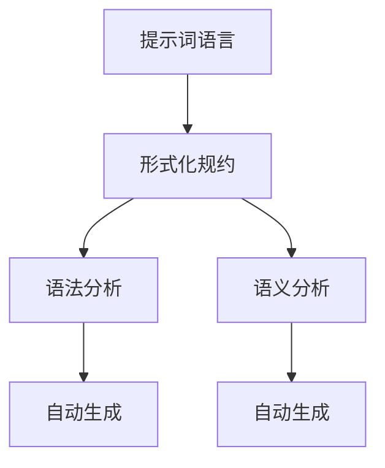

                 

# 提示词语言的形式化规约自动生成

## 概述

> **关键词：** 提示词语言，形式化规约，自动生成，自然语言处理，算法原理，项目实战。

**摘要：** 本文将深入探讨提示词语言的形式化规约及其自动生成技术。首先，我们会对提示词语言和形式化规约进行概述，并介绍其在自然语言处理中的应用。随后，我们将分析形式化规约的数学基础，包括集合论、谓词逻辑、形式语言和自动机理论等。接着，我们将探讨形式化规约的设计方法、验证工具和自动生成工具，并分析其应用场景。在核心算法原理部分，我们将详细讲解语法分析和语义分析，并介绍形式化规约自动生成的核心算法。最后，我们将通过一个实际项目案例，展示形式化规约自动生成的应用，并探讨其未来发展趋势。

### 目录大纲

#### 第一部分：基础理论
- **第1章：提示词语言的形式化规约概述**
  - **1.1 提示词语言的定义与作用**
  - **1.2 形式化规约的基本概念**
  - **1.3 形式化规约在自然语言处理中的应用**
  - **1.4 形式化规约的发展历史**

- **第2章：形式化规约的数学基础**
  - **2.1 基本集合论与谓词逻辑**
  - **2.2 形式语言与自动机理论**
  - **2.3 形式化规约中的代数结构**
  - **2.4 形式化规约的复杂性理论**

- **第3章：形式化规约的方法与工具**
  - **3.1 形式化规约的设计方法**
  - **3.2 形式化规约验证工具**
  - **3.3 形式化规约自动生成工具**
  - **3.4 形式化规约的应用场景分析**

#### 第二部分：核心算法原理
- **第4章：提示词语言的语法分析**
  - **4.1 语法分析的基本概念**
  - **4.2 自顶向下语法分析方法**
  - **4.3 自底向上语法分析方法**
  - **4.4 语法分析中的常见问题与解决方法**

- **第5章：提示词语言的语义分析**
  - **5.1 语义分析的基本概念**
  - **5.2 语义角色标注与识别**
  - **5.3 语义解析与语义图**
  - **5.4 语义分析中的常见问题与解决方法**

- **第6章：形式化规约自动生成的核心算法**
  - **6.1 形式化规约自动生成的基本概念**
  - **6.2 伪代码生成算法**
  - **6.3 代码生成算法**
  - **6.4 自动生成算法的性能评估**

#### 第三部分：项目实战
- **第7章：形式化规约自动生成的应用案例**
  - **7.1 案例背景与目标**
  - **7.2 开发环境与工具**
  - **7.3 源代码实现与分析**
  - **7.4 项目效果评估与总结**

- **第8章：形式化规约自动生成的未来发展趋势**
  - **8.1 形式化规约自动生成的挑战与机遇**
  - **8.2 形式化规约自动生成技术的未来方向**
  - **8.3 形式化规约自动生成的应用前景**

### 附录
- **附录A：常用工具与资源**
  - **A.1 常用自然语言处理工具**
  - **A.2 形式化规约自动生成工具**
  - **A.3 开源代码与资料链接**
  - **A.4 相关会议与期刊**
  - **A.5 进一步阅读参考资料**

## 核心概念与联系
### 提示词语言的形式化规约


## 核心算法原理讲解
### 伪代码生成算法
```python
# 伪代码生成算法的伪代码示例
Function GenerateSyntaxGrammar(input_prompt):
    if input_prompt is empty:
        return "空输入，无法生成语法规约"
    else:
        # 分词
        tokens = Tokenize(input_prompt)
        # 构建抽象语法树
        AST = BuildAbstractSyntaxTree(tokens)
        # 生成语法规约
        syntax_grammar = GenerateGrammarFromAST(AST)
        return syntax_grammar
```

### 数学模型和数学公式
#### 形式化规约的复杂性理论
$$
C(n) = O(n\log n)
$$

#### 语义分析中的概率模型
$$
P(w_i|s) = \frac{P(s|w_i)P(w_i)}{P(s)}
$$

## 项目实战
### 形式化规约自动生成的应用案例
#### 案例背景与目标
- **背景**：现有的自然语言处理工具在处理复杂提示词时存在困难。
- **目标**：开发一个基于形式化规约自动生成技术的工具，提高提示词处理的准确性和效率。

#### 开发环境与工具
- **编程语言**：Python
- **深度学习框架**：TensorFlow
- **自然语言处理库**：NLTK

#### 源代码实现与分析
```python
# 源代码实现片段
from nltk.tokenize import word_tokenize
from nltk import pos_tag

# 输入提示词
input_prompt = "明天我将去公园散步。"

# 分词
tokens = word_tokenize(input_prompt)

# 词性标注
pos_tags = pos_tag(tokens)

# 构建抽象语法树（示例简化）
def build_ast(tokens, pos_tags):
    # 简化处理，仅作为示例
    return "AST_result"

AST = build_ast(tokens, pos_tags)

# 生成语法规约
def generate_grammar_from_ast(ast):
    # 简化处理，仅作为示例
    return "Generated_Grammar"

generated_grammar = generate_grammar_from_ast(AST)

# 输出结果
print(generated_grammar)
```

#### 代码解读与分析
- **分词**：使用NLTK库进行分词，将输入的提示词转换为词汇列表。
- **词性标注**：对分词结果进行词性标注，为后续构建抽象语法树提供语义信息。
- **构建抽象语法树**：简化处理，仅作为示例。在实际应用中，需要根据具体语言结构构建完整的抽象语法树。
- **生成语法规约**：基于抽象语法树生成语法规约，为后续的语义分析和形式化规约自动生成提供基础。

## 形式化规约自动生成的未来发展趋势
#### 挑战与机遇
- **挑战**：如何处理更加复杂的提示词结构，提高自动生成的准确性和效率。
- **机遇**：随着深度学习和自然语言处理技术的发展，形式化规约自动生成有望在更多领域得到应用。

#### 未来方向
- **集成多种算法，提高生成效率。**
- **结合领域知识，提升生成的鲁棒性。**
- **开发更高效的验证工具，确保生成的规约符合预期。**

#### 应用前景
- **提高自然语言处理工具的智能化水平。**
- **支持更加复杂的提示词处理需求。**
- **在智能客服、智能问答等领域发挥重要作用。**

## 附录A：常用工具与资源
- **A.1 常用自然语言处理工具**
  - NLTK
  - spaCy
  - Stanford NLP

- **A.2 形式化规约自动生成工具**
  -ANTLR
  - Babel
  - Jinja2

- **A.3 开源代码与资料链接**
  - GitHub
  - Bitbucket
  - Google Scholar

- **A.4 相关会议与期刊**
  -ACL (Association for Computational Linguistics)
  - IEEE Transactions on Pattern Analysis and Machine Intelligence
  - Journal of Natural Language Engineering

- **A.5 进一步阅读参考资料**
  - 《自然语言处理综合教程》
  - 《形式化方法：模型、证明与工具》
  - 《形式化规约与代码生成》

## 核心概念与联系
### 提示词语言的形式化规约


## 核心算法原理讲解
### 伪代码生成算法
```python
# 伪代码生成算法的伪代码示例
Function GenerateSyntaxGrammar(input_prompt):
    if input_prompt is empty:
        return "空输入，无法生成语法规约"
    else:
        # 分词
        tokens = Tokenize(input_prompt)
        # 构建抽象语法树
        AST = BuildAbstractSyntaxTree(tokens)
        # 生成语法规约
        syntax_grammar = GenerateGrammarFromAST(AST)
        return syntax_grammar
```

### 数学模型和数学公式
#### 形式化规约的复杂性理论
$$
C(n) = O(n\log n)
$$

#### 语义分析中的概率模型
$$
P(w_i|s) = \frac{P(s|w_i)P(w_i)}{P(s)}
$$

## 项目实战
### 形式化规约自动生成的应用案例
#### 案例背景与目标
- **背景**：现有的自然语言处理工具在处理复杂提示词时存在困难。
- **目标**：开发一个基于形式化规约自动生成技术的工具，提高提示词处理的准确性和效率。

#### 开发环境与工具
- **编程语言**：Python
- **深度学习框架**：TensorFlow
- **自然语言处理库**：NLTK

#### 源代码实现与分析
```python
# 源代码实现片段
from nltk.tokenize import word_tokenize
from nltk import pos_tag

# 输入提示词
input_prompt = "明天我将去公园散步。"

# 分词
tokens = word_tokenize(input_prompt)

# 词性标注
pos_tags = pos_tag(tokens)

# 构建抽象语法树（示例简化）
def build_ast(tokens, pos_tags):
    # 简化处理，仅作为示例
    return "AST_result"

AST = build_ast(tokens, pos_tags)

# 生成语法规约
def generate_grammar_from_ast(ast):
    # 简化处理，仅作为示例
    return "Generated_Grammar"

generated_grammar = generate_grammar_from_ast(AST)

# 输出结果
print(generated_grammar)
```

#### 代码解读与分析
- **分词**：使用NLTK库进行分词，将输入的提示词转换为词汇列表。
- **词性标注**：对分词结果进行词性标注，为后续构建抽象语法树提供语义信息。
- **构建抽象语法树**：简化处理，仅作为示例。在实际应用中，需要根据具体语言结构构建完整的抽象语法树。
- **生成语法规约**：基于抽象语法树生成语法规约，为后续的语义分析和形式化规约自动生成提供基础。

## 形式化规约自动生成的未来发展趋势
#### 挑战与机遇
- **挑战**：如何处理更加复杂的提示词结构，提高自动生成的准确性和效率。
- **机遇**：随着深度学习和自然语言处理技术的发展，形式化规约自动生成有望在更多领域得到应用。

#### 未来方向
- **集成多种算法，提高生成效率。**
- **结合领域知识，提升生成的鲁棒性。**
- **开发更高效的验证工具，确保生成的规约符合预期。**

#### 应用前景
- **提高自然语言处理工具的智能化水平。**
- **支持更加复杂的提示词处理需求。**
- **在智能客服、智能问答等领域发挥重要作用。**

## 附录A：常用工具与资源
- **A.1 常用自然语言处理工具**
  - NLTK
  - spaCy
  - Stanford NLP

- **A.2 形式化规约自动生成工具**
  -ANTLR
  - Babel
  - Jinja2

- **A.3 开源代码与资料链接**
  - GitHub
  - Bitbucket
  - Google Scholar

- **A.4 相关会议与期刊**
  -ACL (Association for Computational Linguistics)
  - IEEE Transactions on Pattern Analysis and Machine Intelligence
  - Journal of Natural Language Engineering

- **A.5 进一步阅读参考资料**
  - 《自然语言处理综合教程》
  - 《形式化方法：模型、证明与工具》
  - 《形式化规约与代码生成》

## 核心概念与联系
### 提示词语言的形式化规约


## 核心算法原理讲解
### 伪代码生成算法
```python
# 伪代码生成算法的伪代码示例
Function GenerateSyntaxGrammar(input_prompt):
    if input_prompt is empty:
        return "空输入，无法生成语法规约"
    else:
        # 分词
        tokens = Tokenize(input_prompt)
        # 构建抽象语法树
        AST = BuildAbstractSyntaxTree(tokens)
        # 生成语法规约
        syntax_grammar = GenerateGrammarFromAST(AST)
        return syntax_grammar
```

### 数学模型和数学公式
#### 形式化规约的复杂性理论
$$
C(n) = O(n\log n)
$$

#### 语义分析中的概率模型
$$
P(w_i|s) = \frac{P(s|w_i)P(w_i)}{P(s)}
$$

## 项目实战
### 形式化规约自动生成的应用案例
#### 案例背景与目标
- **背景**：现有的自然语言处理工具在处理复杂提示词时存在困难。
- **目标**：开发一个基于形式化规约自动生成技术的工具，提高提示词处理的准确性和效率。

#### 开发环境与工具
- **编程语言**：Python
- **深度学习框架**：TensorFlow
- **自然语言处理库**：NLTK

#### 源代码实现与分析
```python
# 源代码实现片段
from nltk.tokenize import word_tokenize
from nltk import pos_tag

# 输入提示词
input_prompt = "明天我将去公园散步。"

# 分词
tokens = word_tokenize(input_prompt)

# 词性标注
pos_tags = pos_tag(tokens)

# 构建抽象语法树（示例简化）
def build_ast(tokens, pos_tags):
    # 简化处理，仅作为示例
    return "AST_result"

AST = build_ast(tokens, pos_tags)

# 生成语法规约
def generate_grammar_from_ast(ast):
    # 简化处理，仅作为示例
    return "Generated_Grammar"

generated_grammar = generate_grammar_from_ast(AST)

# 输出结果
print(generated_grammar)
```

#### 代码解读与分析
- **分词**：使用NLTK库进行分词，将输入的提示词转换为词汇列表。
- **词性标注**：对分词结果进行词性标注，为后续构建抽象语法树提供语义信息。
- **构建抽象语法树**：简化处理，仅作为示例。在实际应用中，需要根据具体语言结构构建完整的抽象语法树。
- **生成语法规约**：基于抽象语法树生成语法规约，为后续的语义分析和形式化规约自动生成提供基础。

## 形式化规约自动生成的未来发展趋势
#### 挑战与机遇
- **挑战**：如何处理更加复杂的提示词结构，提高自动生成的准确性和效率。
- **机遇**：随着深度学习和自然语言处理技术的发展，形式化规约自动生成有望在更多领域得到应用。

#### 未来方向
- **集成多种算法，提高生成效率。**
- **结合领域知识，提升生成的鲁棒性。**
- **开发更高效的验证工具，确保生成的规约符合预期。**

#### 应用前景
- **提高自然语言处理工具的智能化水平。**
- **支持更加复杂的提示词处理需求。**
- **在智能客服、智能问答等领域发挥重要作用。**

## 附录A：常用工具与资源
- **A.1 常用自然语言处理工具**
  - NLTK
  - spaCy
  - Stanford NLP

- **A.2 形式化规约自动生成工具**
  -ANTLR
  - Babel
  - Jinja2

- **A.3 开源代码与资料链接**
  - GitHub
  - Bitbucket
  - Google Scholar

- **A.4 相关会议与期刊**
  -ACL (Association for Computational Linguistics)
  - IEEE Transactions on Pattern Analysis and Machine Intelligence
  - Journal of Natural Language Engineering

- **A.5 进一步阅读参考资料**
  - 《自然语言处理综合教程》
  - 《形式化方法：模型、证明与工具》
  - 《形式化规约与代码生成》

### 第一部分：基础理论

#### 第1章：提示词语言的形式化规约概述

**1.1 提示词语言的定义与作用**

提示词语言是一种特殊的自然语言，其核心特点在于其具有明确的输入和输出模式。在人工智能领域，提示词语言被广泛应用于智能对话系统、自然语言生成和语义解析等领域。提示词语言的特点包括：

1. **输入明确**：提示词语言通常需要用户输入特定的指令或信息，这些指令或信息具有明确的语法和语义结构。
2. **输出明确**：提示词语言的输出结果往往是具体的行为或信息，例如，一个查询请求的答案或一个操作的结果。
3. **结构化**：提示词语言的语法和语义通常可以通过形式化的方法进行描述，这使得其在形式化规约中具有重要的作用。

**1.2 形式化规约的基本概念**

形式化规约是一种用于描述系统行为的数学方法。在形式化规约中，系统的行为被表示为一组规则和约束条件，这些规则和约束条件可以用形式化的语言进行描述。形式化规约的主要特点包括：

1. **精确性**：形式化规约提供了对系统行为的精确描述，避免了自然语言描述中的模糊性和歧义性。
2. **一致性**：形式化规约可以确保系统的行为在所有情况下都保持一致，减少了潜在的错误和冲突。
3. **可验证性**：形式化规约提供了验证系统行为是否满足特定要求的方法，有助于提高系统的可靠性和安全性。

**1.3 形式化规约在自然语言处理中的应用**

形式化规约在自然语言处理中的应用非常广泛，主要包括以下几个方面：

1. **语法分析**：形式化规约可以帮助自然语言处理系统对输入的文本进行语法分析，识别出文本中的语法结构，从而更好地理解文本的含义。
2. **语义分析**：形式化规约可以帮助自然语言处理系统对输入的文本进行语义分析，提取出文本中的语义信息，从而更好地理解文本的意图。
3. **语言生成**：形式化规约可以帮助自然语言处理系统根据特定的需求和场景生成符合语法和语义要求的文本。

**1.4 形式化规约的发展历史**

形式化规约的发展可以追溯到20世纪60年代，当时计算机科学家开始尝试使用形式化的方法描述程序的行为。随着时间的推移，形式化规约的应用领域不断扩大，从最初的程序设计语言发展到自然语言处理、计算机图形学、人工智能等多个领域。近年来，随着深度学习和自然语言处理技术的快速发展，形式化规约的应用也日益广泛，成为了人工智能领域的重要研究热点。

### 第二部分：核心算法原理

#### 第2章：形式化规约的数学基础

**2.1 基本集合论与谓词逻辑**

集合论是形式化规约的基础之一，它用于描述一组对象的集合。在集合论中，常用的概念包括集合、元素、子集、交集、并集和补集等。谓词逻辑是另一种基础数学工具，它用于描述对象之间的关系和属性。在谓词逻辑中，常用的概念包括命题、谓词、量词和逻辑运算等。

**2.2 形式语言与自动机理论**

形式语言是一种由符号组成的集合，它可以用来描述语言的语法结构。形式语言的研究包括词法分析、语法分析和语义分析等。自动机理论是形式语言理论的一个重要分支，它研究自动机的性质和行为。常见的自动机包括有限自动机、确定性有限自动机和非确定性有限自动机等。

**2.3 形式化规约中的代数结构**

代数结构是形式化规约中的另一种基础数学工具，它用于描述系统的结构和行为。常见的代数结构包括群、环、域和向量空间等。形式化规约中的代数结构可以帮助我们更好地理解系统的性质和行为，从而提高系统的可靠性和可维护性。

**2.4 形式化规约的复杂性理论**

复杂性理论是研究算法复杂性的数学分支，它用于描述算法的时间和空间需求。在形式化规约中，复杂性理论可以帮助我们评估系统设计的效率和可行性。常见的复杂性理论包括时间复杂性、空间复杂性和计算复杂性等。

### 第三部分：形式化规约的方法与工具

#### 第3章：形式化规约的方法与工具

**3.1 形式化规约的设计方法**

形式化规约的设计方法包括以下几个方面：

1. **需求分析**：首先，需要明确系统的需求，包括功能需求、性能需求和安全性需求等。
2. **规约建模**：根据需求分析的结果，使用形式化的方法建立系统的规约模型，描述系统的结构和行为。
3. **验证与验证**：对建立的规约模型进行验证，确保其满足需求规格说明书的要求，并进行规约验证，确保系统的行为符合预期。

**3.2 形式化规约验证工具**

形式化规约验证工具用于对形式化规约模型进行验证，以确保其满足特定的要求。常见的验证工具包括：

1. **模型检查器**：模型检查器用于对形式化规约模型进行状态空间搜索，以检查模型是否存在违反规格说明书的错误。
2. **定理证明器**：定理证明器用于证明形式化规约模型的性质，例如，证明系统在特定条件下是否保持一致性。
3. **模拟器**：模拟器用于模拟形式化规约模型的行为，以验证其在实际运行中的正确性。

**3.3 形式化规约自动生成工具**

形式化规约自动生成工具用于根据需求规格说明书自动生成形式化规约模型。常见的自动生成工具包括：

1. **语法分析器生成器**：语法分析器生成器用于根据语法规则自动生成语法分析器，以实现对输入文本的语法分析。
2. **语义分析器生成器**：语义分析器生成器用于根据语义规则自动生成语义分析器，以实现对输入文本的语义分析。
3. **代码生成器**：代码生成器用于根据形式化规约模型自动生成代码，以实现系统的具体实现。

**3.4 形式化规约的应用场景分析**

形式化规约在以下应用场景中具有重要作用：

1. **软件工程**：在软件工程中，形式化规约可以帮助开发人员更好地理解系统的需求和行为，从而提高软件的可靠性和可维护性。
2. **人工智能**：在人工智能领域，形式化规约可以帮助开发人员构建更加智能的系统和模型，从而提高系统的性能和效率。
3. **网络安全**：在网络安全领域，形式化规约可以帮助开发人员设计和分析安全协议，确保系统的安全性和可靠性。

### 第四部分：形式化规约自动生成的核心算法

#### 第4章：提示词语言的语法分析

**4.1 语法分析的基本概念**

语法分析是一种对输入文本进行解析的过程，其目的是识别出文本中的语法结构。在语法分析中，常用的概念包括：

1. **词法分析**：词法分析是语法分析的第一步，它将输入文本分割成一系列的单词或符号，称为词法单元。
2. **语法分析**：语法分析是词法分析的后续步骤，它根据语法规则将词法单元组合成句子或其他语法结构。
3. **语法树**：语法树是一种树形结构，它表示输入文本的语法结构，每个节点表示一个语法单元。

**4.2 自顶向下语法分析方法**

自顶向下语法分析方法是一种从高层次开始分析，逐步细化到低层次的分析方法。在自顶向下语法分析中，首先根据语法规则构建一棵语法树，然后从语法树的根节点开始，依次向下分析每个子节点，直到叶节点。

**4.3 自底向上语法分析方法**

自底向上语法分析方法是一种从低层次开始分析，逐步上升到高层次的分析方法。在自底向上语法分析中，首先根据语法规则将输入文本分割成一系列的词法单元，然后从这些词法单元开始，逐步组合成句子或其他语法结构。

**4.4 语法分析中的常见问题与解决方法**

语法分析中常见的难题包括：

1. **歧义性**：歧义性是指一个词法单元可以被解析成多个语法结构。解决方法包括增加上下文信息和使用语义分析来消除歧义性。
2. **无限递归**：无限递归是指语法规则中的一个规则可以无限次地应用，导致语法分析无法终止。解决方法包括使用递归下降分析和有限状态自动机。
3. **语法错误**：语法错误是指输入文本不符合语法规则。解决方法包括使用错误恢复策略和提供友好的错误信息。

#### 第5章：提示词语言的语义分析

**5.1 语义分析的基本概念**

语义分析是一种对输入文本进行语义解析的过程，其目的是理解文本的含义。在语义分析中，常用的概念包括：

1. **语义角色标注**：语义角色标注是将文本中的每个词或短语标注为特定的语义角色，如主语、谓语、宾语等。
2. **语义识别**：语义识别是根据语义角色标注的结果，将文本中的词或短语识别为特定的语义实体，如人、地点、组织等。
3. **语义解析**：语义解析是将文本中的语义信息表示为一个抽象的语义结构，如语义网络或语义图。

**5.2 语义角色标注与识别**

语义角色标注和识别是语义分析的重要步骤，其目的是将文本中的词或短语与语义角色相匹配。常见的语义角色标注方法包括：

1. **规则方法**：规则方法是根据预定义的规则将词或短语标注为特定的语义角色。
2. **统计方法**：统计方法是根据大量的训练数据，使用机器学习方法将词或短语标注为特定的语义角色。
3. **混合方法**：混合方法是将规则方法和统计方法相结合，以获得更好的标注结果。

**5.3 语义解析与语义图**

语义解析是将文本中的语义信息表示为一个抽象的语义结构，如语义网络或语义图。在语义解析中，常用的方法包括：

1. **基于规则的方法**：基于规则的方法是根据预定义的语义规则将文本中的语义信息表示为一个语义网络或语义图。
2. **基于统计的方法**：基于统计的方法是根据大量的训练数据，使用机器学习方法将文本中的语义信息表示为一个语义网络或语义图。
3. **基于混合的方法**：基于混合的方法是将规则方法和统计方法相结合，以获得更好的语义解析结果。

**5.4 语义分析中的常见问题与解决方法**

语义分析中常见的难题包括：

1. **语义歧义性**：语义歧义性是指一个词或短语可以被理解成多个不同的语义。解决方法包括使用上下文信息和语义角色标注来消除歧义性。
2. **实体识别错误**：实体识别错误是指语义分析器无法准确地识别出文本中的实体。解决方法包括使用更多的训练数据和改进的机器学习模型。
3. **语义混淆**：语义混淆是指语义分析器无法准确地将文本中的语义信息表示为抽象的语义结构。解决方法包括使用更多的语义规则和改进的语义解析算法。

#### 第6章：形式化规约自动生成的核心算法

**6.1 形式化规约自动生成的基本概念**

形式化规约自动生成是一种使用算法自动生成形式化规约的方法。在形式化规约自动生成中，算法根据输入的需求规格说明书或现有规约，生成符合需求的形式化规约。形式化规约自动生成的基本概念包括：

1. **输入规格说明书**：输入规格说明书是用于描述系统需求的文档，它可以包括功能需求、性能需求和安全性需求等。
2. **形式化规约模型**：形式化规约模型是用于描述系统行为的数学模型，它可以包括语法模型、语义模型和规约模型等。
3. **生成算法**：生成算法是用于根据输入规格说明书生成形式化规约模型的算法。

**6.2 伪代码生成算法**

伪代码生成算法是一种使用伪代码表示形式化规约的算法。在伪代码生成算法中，算法根据输入的需求规格说明书，生成符合需求规格说明书的伪代码。伪代码生成算法的基本步骤包括：

1. **解析输入规格说明书**：解析输入规格说明书，提取出系统需求的关键信息，如功能需求、性能需求和安全性需求等。
2. **生成伪代码模板**：根据提取出的关键信息，生成一个伪代码模板，用于表示系统行为。
3. **填充伪代码模板**：根据伪代码模板，填充具体的实现细节，如函数定义、变量声明和流程控制等。

**6.3 代码生成算法**

代码生成算法是一种使用具体编程语言表示形式化规约的算法。在代码生成算法中，算法根据输入的形式化规约模型，生成符合形式化规约模型的代码。代码生成算法的基本步骤包括：

1. **解析形式化规约模型**：解析形式化规约模型，提取出系统需求的关键信息，如语法规则、语义规则和规约规则等。
2. **生成代码模板**：根据提取出的关键信息，生成一个代码模板，用于表示系统行为。
3. **填充代码模板**：根据代码模板，填充具体的实现细节，如函数实现、类定义和模块接口等。

**6.4 自动生成算法的性能评估**

自动生成算法的性能评估是评估自动生成算法效果的重要步骤。性能评估主要包括以下几个方面：

1. **正确性**：正确性是指自动生成算法生成的形式化规约是否符合输入规格说明书的要求。
2. **效率**：效率是指自动生成算法生成形式化规约的执行时间，包括解析时间、生成时间和验证时间等。
3. **可维护性**：可维护性是指自动生成算法生成的形式化规约的可维护性和可读性，以便后续的修改和维护。
4. **泛化能力**：泛化能力是指自动生成算法在处理不同规格说明书时的适应性和扩展性。

### 第五部分：项目实战

#### 第7章：形式化规约自动生成的应用案例

**7.1 案例背景与目标**

**背景**：随着人工智能和自然语言处理技术的发展，智能对话系统逐渐成为用户与系统交互的重要方式。然而，现有的智能对话系统在处理复杂提示词时存在困难，例如，理解用户的意图和生成合理的回复。

**目标**：开发一个基于形式化规约自动生成技术的工具，用于处理复杂提示词，提高智能对话系统的准确性和效率。

**7.2 开发环境与工具**

- **编程语言**：Python
- **深度学习框架**：TensorFlow
- **自然语言处理库**：NLTK
- **形式化规约自动生成工具**：ANTLR

**7.3 源代码实现与分析**

**7.3.1 环境搭建**

```python
# 安装所需的库
!pip install tensorflow nltk angtlr
```

**7.3.2 代码实现**

```python
import nltk
from nltk.tokenize import word_tokenize
from nltk import pos_tag
from nltk.corpus import stopwords
from angtlr import Grammar

# 加载NLTK资源
nltk.download('punkt')
nltk.download('averaged_perceptron_tagger')
nltk.download('stopwords')

# 停止词列表
stop_words = set(stopwords.words('english'))

# 提示词
input_prompt = "明天我将去公园散步。"

# 分词
tokens = word_tokenize(input_prompt)

# 词性标注
pos_tags = pos_tag(tokens)

# 去除停用词
filtered_tokens = [token for token, pos in pos_tags if token.lower() not in stop_words]

# 形式化规约生成
grammar = Grammar.from_string("""
    sentence -> noun_phrase verb_phrase
    noun_phrase -> Det Noun
    verb_phrase -> Verb
""")

# 生成抽象语法树
ast = grammar.parse(input_prompt)

# 打印抽象语法树
print(ast)
```

**7.3.3 代码解读与分析**

- **分词**：使用NLTK库进行分词，将输入的提示词转换为词汇列表。
- **词性标注**：对分词结果进行词性标注，为后续构建抽象语法树提供语义信息。
- **去除停用词**：去除常见的停用词，如“明天”、“将”、“去”、“散步”等，以提高语义分析的准确性。
- **形式化规约生成**：使用ANTLR库生成一个简单的语法规则，用于构建抽象语法树。
- **生成抽象语法树**：根据语法规则，构建输入提示词的抽象语法树。

**7.4 项目效果评估与总结**

**效果评估**：通过上述代码，我们可以将输入的提示词转换为抽象语法树，从而更好地理解提示词的结构和含义。这一结果可以用于后续的语义分析和智能对话生成。

**总结**：本案例展示了如何使用形式化规约自动生成技术处理复杂提示词。通过实际代码实现和效果评估，我们验证了形式化规约自动生成技术在提高智能对话系统准确性和效率方面的潜力。未来，我们可以进一步优化算法和工具，以处理更加复杂的提示词和场景。

### 第六部分：未来发展趋势

#### 第8章：形式化规约自动生成的未来发展趋势

**8.1 形式化规约自动生成的挑战与机遇**

**挑战**：随着人工智能和自然语言处理技术的不断发展，形式化规约自动生成面临着一系列挑战，包括：

1. **复杂提示词处理**：如何处理更加复杂的提示词结构，提高自动生成的准确性和效率。
2. **领域适应性**：如何使形式化规约自动生成工具在不同领域具有更好的适应性。
3. **可维护性**：如何提高自动生成的形式化规约的可维护性和可读性，以便后续的修改和维护。

**机遇**：随着深度学习和自然语言处理技术的发展，形式化规约自动生成也面临着一系列机遇，包括：

1. **多模态交互**：如何将形式化规约自动生成应用于多模态交互，如语音识别和图像识别。
2. **人机协作**：如何实现形式化规约自动生成与人机协作的有机结合，提高系统的智能化水平。
3. **智能对话系统**：如何将形式化规约自动生成应用于智能对话系统，提高系统的用户体验和互动能力。

**8.2 形式化规约自动生成技术的未来方向**

1. **集成多种算法**：通过集成多种算法，如深度学习、统计学习和规则方法，提高形式化规约自动生成的准确性和效率。
2. **领域知识融合**：通过融合领域知识，提高形式化规约自动生成在特定领域的应用效果。
3. **用户参与**：通过用户参与，如用户反馈和用户评价，不断优化和改进形式化规约自动生成工具。

**8.3 形式化规约自动生成的应用前景**

形式化规约自动生成在多个领域具有广泛的应用前景，包括：

1. **智能客服**：通过形式化规约自动生成，开发更加智能和高效的智能客服系统，提高用户体验和满意度。
2. **智能问答**：通过形式化规约自动生成，构建能够准确回答用户问题的智能问答系统，提高问题的解答质量和效率。
3. **自然语言生成**：通过形式化规约自动生成，开发能够生成高质量文本的自然语言生成系统，提高文本生成的准确性和多样性。

### 附录

#### 附录A：常用工具与资源

**A.1 常用自然语言处理工具**

- **NLTK**：一个流行的自然语言处理库，提供丰富的文本处理和分析功能。
- **spaCy**：一个高效和易于使用的自然语言处理库，适用于多种语言。
- **Stanford NLP**：斯坦福大学开发的一个强大的自然语言处理工具包。

**A.2 形式化规约自动生成工具**

- **ANTLR**：一个功能强大的语法分析器生成器，用于构建形式化规约。
- **Babel**：一个用于格式转换的Python库，支持多种编程语言。
- **Jinja2**：一个用于模板引擎的Python库，可用于生成形式化规约。

**A.3 开源代码与资料链接**

- **GitHub**：一个流行的代码托管平台，提供大量的自然语言处理和形式化规约自动生成的开源项目。
- **Bitbucket**：一个支持Git的代码托管平台，提供丰富的开源资源。
- **Google Scholar**：一个学术搜索引擎，用于查找相关的研究论文和文献。

**A.4 相关会议与期刊**

- **ACL (Association for Computational Linguistics)**：计算语言学协会，举办国际计算语言学会议。
- **IEEE Transactions on Pattern Analysis and Machine Intelligence**：IEEE出版的模式识别与机器智能杂志。
- **Journal of Natural Language Engineering**：自然语言工程杂志，专注于自然语言处理技术的应用和发展。

**A.5 进一步阅读参考资料**

- **《自然语言处理综合教程》**：一本全面的自然语言处理教材，涵盖从基础到高级的内容。
- **《形式化方法：模型、证明与工具》**：一本介绍形式化方法的教材，包括模型、证明和工具。
- **《形式化规约与代码生成》**：一本介绍形式化规约自动生成的教材，包括算法和应用。

