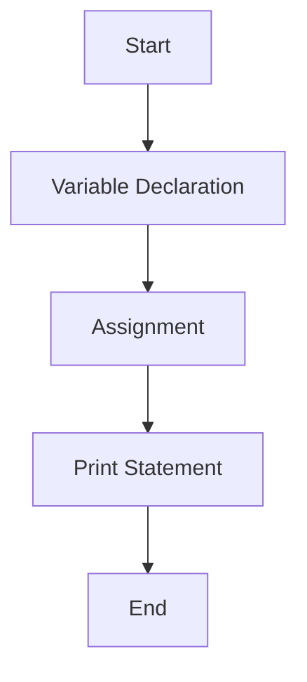
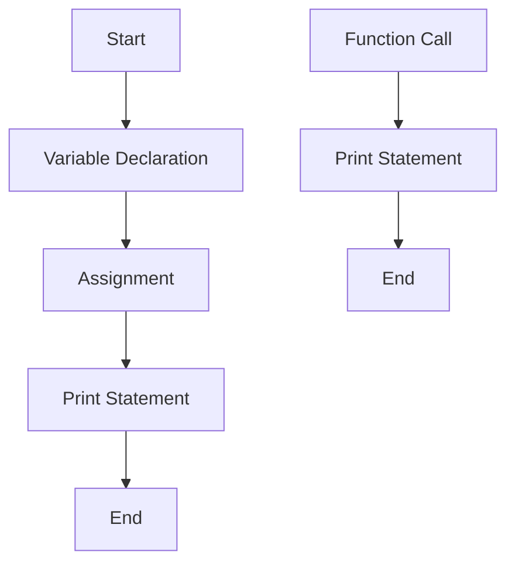
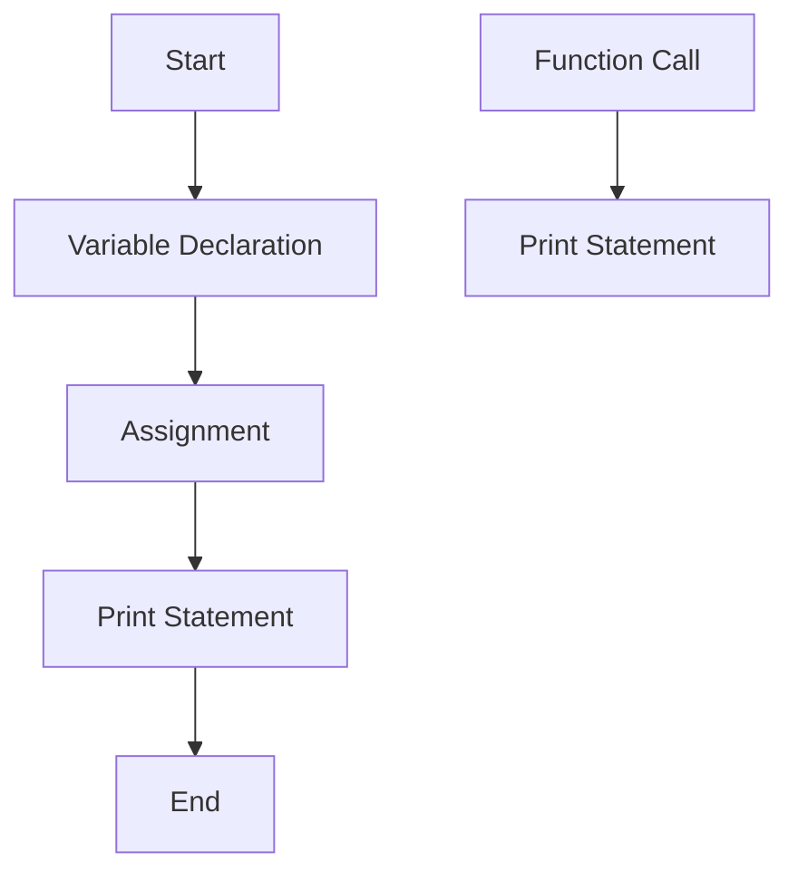

                 

### 文章标题

《提示词语言的静态分析与优化技术》

### 关键词

- 提示词语言
- 静态分析
- 优化技术
- 编译优化
- 动态优化
- 自然语言处理

### 摘要

本文将深入探讨提示词语言的静态分析与优化技术。首先，我们将介绍提示词语言的基本概念、历史与发展，以及其在编程、自然语言处理和数据库查询等领域的应用。接着，我们将讨论静态分析技术的基础，包括词法分析、语法分析和语义分析。随后，我们将详细阐述提示词语言的语义模型，以及如何构建和优化语义模型。在文章的第二部分，我们将聚焦于优化技术，介绍编译优化和动态优化，包括代码生成与优化、性能优化以及动态优化技术。接下来，我们将探讨提示词语言在自然语言处理中的应用和优化。最后，我们将展望提示词语言的未来发展趋势，探讨其在教育、医疗等领域的应用，以及其发展前景。

### 目录大纲

#### 第一部分：基础理论

1. **第1章：提示词语言概述**
   - 1.1 提示词语言的基本概念
   - 1.2 提示词语言的历史与发展
   - 1.3 提示词语言的应用领域

2. **第2章：静态分析技术基础**
   - 2.1 静态分析概述
   - 2.2 语言结构分析
   - 2.3 语义分析

3. **第3章：提示词语言的语义模型**
   - 3.1 提示词语言的语义模型概述
   - 3.2 语义模型构建方法
   - 3.3 语义模型的优化

#### 第二部分：优化技术与应用

4. **第4章：提示词语言的编译优化**
   - 4.1 编译优化概述
   - 4.2 代码生成与优化
   - 4.3 性能优化

5. **第5章：提示词语言的动态优化**
   - 5.1 动态优化概述
   - 5.2 动态优化技术
   - 5.3 动态优化应用案例

6. **第6章：提示词语言在自然语言处理中的应用**
   - 6.1 自然语言处理基础
   - 6.2 提示词语言在自然语言处理中的应用
   - 6.3 提示词语言在自然语言处理中的优化

7. **第7章：提示词语言的未来发展趋势**
   - 7.1 提示词语言的发展趋势
   - 7.2 提示词语言在教育、医疗等领域的应用
   - 7.3 提示词语言的发展前景

#### 附录

8. **附录A：常用工具与资源**
   - 8.1 静态分析工具
   - 8.2 动态优化工具
   - 8.3 提示词语言相关资源

9. **附录B：参考文献**

以上便是本文的目录大纲，接下来我们将逐一深入探讨每个章节的内容。让我们开始第一部分的基础理论部分。

#### 第1章：提示词语言概述

提示词语言（Keyword Language）是一种编程语言，它以提示词（Keywords）作为编程的基本元素，通过这些提示词的组合和结构来描述程序的行为和逻辑。提示词语言是一种形式化的语言，它具有明确的语法和语义规则，可以用于编写程序、进行算法设计和实现软件系统。

### 1.1 提示词语言的基本概念

#### 提示词语言的定义

提示词语言是一种语法和语义都严格定义的编程语言。它由提示词、操作符、变量、常量、注释等基本元素组成。提示词通常用于表示语言的核心功能，如控制结构、数据类型和操作。

例如，在Python语言中，`if`、`while`、`for`等都是提示词，用于实现条件判断和循环控制。

#### 提示词语言的特点

1. **明确性**：提示词语言的语法和语义规则明确，易于理解和学习。
2. **形式化**：提示词语言是一种形式化的语言，其语法和语义都有严格的定义，可以通过形式化的方法进行分析和处理。
3. **高效性**：提示词语言通常具有较高的执行效率，其编译器或解释器能够快速地将源代码转换成机器码或执行代码。
4. **灵活性**：提示词语言通常具有丰富的库和框架，支持各种编程范式，如面向对象编程、函数式编程和过程式编程。

### 1.2 提示词语言的历史与发展

#### 提示词语言的起源

提示词语言的概念最早可以追溯到20世纪50年代和60年代。当时的计算机科学家开始尝试用更接近人类自然语言的方式编写程序，以简化编程过程。这些早期的语言通常被称为“自动代码生成器”，其核心思想是通过预定义的提示词和规则来生成程序代码。

#### 提示词语言的演变

随着时间的推移，提示词语言逐渐发展壮大，形成了多个重要的分支。以下是几个关键的发展阶段：

1. **第一代语言**：如汇编语言（Assembly Language），它使用机器码的符号表示，但仍然非常接近底层硬件。
2. **第二代语言**：如C语言（C Language），它引入了函数和数据结构，提供了更高级别的抽象。
3. **第三代语言**：如Python（Python Language）、Java（Java Language）和C++（C++ Language），它们引入了面向对象编程和更高层次的抽象，使得编程更加直观和高效。
4. **第四代语言**：如SQL（SQL Language），它专门用于数据库查询和管理，以提示词和数据定义语言为基础。

### 1.3 提示词语言的应用领域

提示词语言在多个领域都有广泛的应用，以下是几个主要的应用领域：

#### 编程语言

提示词语言是编写应用程序和软件开发的基础。无论是操作系统、网络应用、桌面应用还是移动应用，都离不开提示词语言。

#### 自然语言处理

提示词语言在自然语言处理（NLP）领域有着重要的应用。例如，用于文本分类、命名实体识别和机器翻译等任务的语言模型和算法通常都是基于提示词语言编写的。

#### 数据库查询语言

提示词语言如SQL（Structured Query Language）用于数据库管理和查询。SQL语言提供了强大的数据查询和管理功能，是数据库系统的重要组成部分。

#### 第2章：静态分析技术基础

静态分析是一种在不运行程序的情况下对程序进行分析的方法。通过静态分析，我们可以获取程序的语法、语义和结构信息，从而帮助程序员理解和优化代码。本章将介绍静态分析的基本概念、技术基础和应用领域。

### 2.1 静态分析概述

#### 静态分析的定义

静态分析（Static Analysis）是指在程序执行之前对程序进行的一种分析。它不需要运行程序，而是通过分析程序源代码或对象代码，提取程序的结构、语义和行为信息。静态分析通常用于代码审查、错误检测、性能分析和安全审计等方面。

#### 静态分析的目的

1. **代码质量评估**：通过静态分析，可以评估代码的质量，发现潜在的错误、漏洞和效率问题。
2. **错误检测**：静态分析可以检测出代码中的语法错误、语义错误和逻辑错误。
3. **性能优化**：静态分析可以帮助发现程序中的性能瓶颈，从而进行针对性的优化。
4. **安全审计**：静态分析可以检测代码中的安全漏洞，防止潜在的安全威胁。

### 2.2 语言结构分析

语言结构分析是静态分析的一个重要组成部分，它主要关注程序代码的结构和语法。以下是几种常见的语言结构分析方法：

#### 词法分析

词法分析（Lexical Analysis）是静态分析的第一步，它将源代码分解为一系列词法单元（tokens）。词法单元是程序中的最小语法单位，如关键字、操作符、标识符、常量等。词法分析的主要任务是从源代码中提取词法单元，并将其转换为内部表示。

伪代码：

```pseudo
function lexicalAnalysis(sourceCode):
    tokens = []
    currentToken = ""
    for character in sourceCode:
        if character is a valid part of a token:
            currentToken += character
        else:
            if currentToken is not empty:
                tokens.append(currentToken)
                currentToken = ""
    if currentToken is not empty:
        tokens.append(currentToken)
    return tokens
```

#### 语法分析

语法分析（Syntax Analysis）是将词法单元序列转换为抽象语法树（Abstract Syntax Tree, AST）的过程。AST是程序结构的图形表示，它描述了程序的控制流和数据流。语法分析的主要任务是检查源代码是否符合语言的语法规则。

伪代码：

```pseudo
function syntaxAnalysis(tokens):
    ast = createEmptyAST()
    currentToken = tokens[0]
    for token in tokens:
        if currentToken is a keyword:
            createKeywordNode(ast, currentToken)
        elif currentToken is an identifier:
            createIdentifierNode(ast, currentToken)
        # Handle other token types
        currentToken = tokens[nextIndex]
    return ast
```

#### 语义分析

语义分析（Semantic Analysis）是在语法分析的基础上，对AST进行语义检查和语义分析的过程。语义分析的主要任务是检查程序是否遵循语言的语义规则，如类型检查、作用域分析和数据流分析。

伪代码：

```pseudo
function semanticAnalysis(ast):
    for node in ast:
        if node is a variable declaration:
            checkVariableDeclaration(node)
        elif node is an assignment:
            checkAssignment(node)
        # Handle other node types
    return ast
```

### 2.3 语义分析

语义分析是静态分析的核心部分，它关注程序的意义和含义。以下是几种常见的语义分析方法：

#### 类型检查

类型检查（Type Checking）是语义分析的一个重要方面，它检查程序中变量的类型是否匹配，以及操作是否符合类型规则。类型检查通常在编译时进行，以提前发现类型错误。

伪代码：

```pseudo
function typeCheck(node):
    if node is an expression:
        leftType = typeCheck(node.left)
        rightType = typeCheck(node.right)
        if leftType is not compatible with rightType:
            raise TypeError()
    # Handle other node types
    return type
```

#### 作用域分析

作用域分析（Scope Analysis）是检查变量和函数的作用域，确保程序中每个变量和函数都能在适当的范围内访问。作用域分析可以帮助发现变量冲突、未定义变量等问题。

伪代码：

```pseudo
function scopeAnalysis(ast):
    for node in ast:
        if node is a variable declaration:
            checkVariableScope(node)
        elif node is a function call:
            checkFunctionScope(node)
    return ast
```

#### 数据流分析

数据流分析（Data Flow Analysis）是一种动态分析方法，它检查程序中数据的流动和依赖关系。数据流分析可以帮助发现潜在的错误和性能问题，如未使用的变量、死代码和循环依赖等。

伪代码：

```pseudo
function dataFlowAnalysis(ast):
    for node in ast:
        if node is an assignment:
            updateDataFlow(node)
        elif node is a function call:
            analyzeDataFlow(node)
    return ast
```

### 第3章：提示词语言的语义模型

语义模型是描述程序语义和含义的一种抽象表示。它通常用于静态分析和优化技术，帮助程序员理解程序的行为和性能。本章将介绍提示词语言的语义模型，包括其基本概念、构建方法和优化技术。

### 3.1 提示词语言的语义模型概述

语义模型是编程语言的一个关键组成部分，它描述了程序在运行时的行为和语义。在提示词语言中，语义模型通常包括以下几个方面：

#### 语义模型的作用

1. **程序理解**：语义模型帮助程序员理解程序的语义和行为，从而更准确地编写和维护代码。
2. **代码优化**：语义模型用于分析程序的执行路径和数据依赖，为代码优化提供依据。
3. **错误检测**：语义模型可以帮助检测程序中的潜在错误，如类型错误、未定义变量等。
4. **性能分析**：语义模型可以用于评估程序的性能，发现性能瓶颈。

#### 语义模型的基本概念

1. **程序语义**：程序语义描述了程序在执行过程中的行为和结果，包括变量、函数、语句和控制流等。
2. **语义规则**：语义模型中的语义规则定义了程序的合法行为，如类型兼容性、作用域规则等。
3. **语义表示**：语义模型通常采用图形、表格或数学公式等方式进行表示，以清晰地展示程序的语义信息。

### 3.2 语义模型构建方法

构建语义模型是提示词语言静态分析的重要任务。以下是几种常见的语义模型构建方法：

#### 基于图的语义模型

基于图的语义模型（Graph-based Semantic Model）使用图形表示程序语义。图中的节点表示程序中的元素（如变量、函数、语句），边表示元素之间的依赖关系。

**示例：**



在这个示例中，图中的节点表示变量声明、赋值和打印语句，边表示这些语句之间的顺序关系。

#### 基于矩阵的语义模型

基于矩阵的语义模型（Matrix-based Semantic Model）使用矩阵表示程序语义。矩阵中的行和列分别表示程序中的元素，矩阵元素表示元素之间的依赖关系。

**示例：**

```plaintext
   | V1 | V2 | V3 |
---|----|----|----|
V1 |  0  |  1  |  0  |
V2 |  0  |  0  |  1  |
V3 |  1  |  0  |  0  |
```

在这个示例中，矩阵中的元素表示变量之间的依赖关系，如V1依赖V2，V3依赖V1。

#### 基于数学公式的语义模型

基于数学公式的语义模型（Formula-based Semantic Model）使用数学公式描述程序语义。数学公式可以清晰地表达程序的控制流和数据依赖。

**示例：**

$$
\text{if } x > 0 \text{ then } y = x + 1 \text{ else } y = x - 1
$$

在这个示例中，公式描述了条件分支语句的语义，包括条件判断和分支操作。

### 3.3 语义模型的优化

优化语义模型可以提高静态分析的效率和准确性。以下是几种常见的语义模型优化方法：

#### 语义模型的简化

简化语义模型（Model Simplification）是一种常见的优化方法，它通过减少模型的复杂度来提高分析效率。简化方法可以包括合并相似节点、删除冗余边等。

**示例：**

假设有如下的简化前语义模型：



简化后：



#### 语义模型的高效表示

高效表示（Efficient Representation）是一种优化方法，它通过使用更高效的表示方式来减少模型的存储和计算开销。例如，使用稀疏矩阵表示语义模型，可以减少不必要的存储空间。

**示例：**

简化前的语义模型矩阵：

```plaintext
   | V1 | V2 | V3 | V4 | V5 |
---|----|----|----|----|----|
V1 |  0  |  1  |  0  |  0  |  0  |
V2 |  0  |  0  |  1  |  0  |  0  |
V3 |  1  |  0  |  0  |  1  |  0  |
V4 |  0  |  0  |  0  |  0  |  0  |
V5 |  0  |  0  |  0  |  0  |  0  |
```

简化后的稀疏矩阵表示：

```plaintext
   | V1 | V2 | V3 | V4 | V5 |
---|----|----|----|----|----|
V1 |  0  |  1  |  0  |  0  |  0  |
V2 |  0  |  0  |  1  |  0  |  0  |
V3 |  1  |  0  |  0  |  1  |  0  |
```

#### 语义模型的优化算法

优化语义模型还可以通过使用优化算法来实现。例如，使用贪心算法（Greedy Algorithm）来合并相似节点，或者使用动态规划（Dynamic Programming）来优化语义表示。

**示例：**

使用贪心算法合并相似节点：

```python
def greedyMerge(nodes):
    visited = set()
    for node in nodes:
        if node not in visited:
            visited.add(node)
            neighbors = getNeighbors(node)
            for neighbor in neighbors:
                if neighbor not in visited:
                    mergeNodes(node, neighbor)
```

使用动态规划优化语义表示：

```python
def dynamicProgramming(states, transitions):
    dp = [[0] * len(states) for _ in range(len(states))]
    for i in range(len(states)):
        for j in range(len(states)):
            if states[i] == states[j]:
                dp[i][j] = transitions[i][j]
    return dp
```

通过以上优化方法，可以提高语义模型的效率和准确性，从而提高静态分析的质量。

### 第4章：提示词语言的编译优化

编译优化是提高程序性能和效率的关键步骤。在编译过程中，编译器可以对源代码进行一系列的优化，以生成更高效的目标代码。本章将介绍提示词语言编译优化的一般过程，包括代码生成与优化、性能优化策略以及常见性能瓶颈的分析。

### 4.1 编译优化概述

编译优化（Compilation Optimization）是指在编译过程中对源代码进行的一系列转换和改进，以生成更高效的目标代码。编译优化的主要目的是提高程序的运行速度、减少内存占用和降低能耗。编译优化可以分为静态优化和动态优化两大类。

#### 静态优化

静态优化是在编译时进行的，不依赖于程序的运行状态。静态优化包括以下几种类型：

1. **代码简化**：简化不必要的代码，如去除死代码、合并冗余代码等。
2. **循环优化**：优化循环结构，减少循环迭代次数，提高循环性能。
3. **数据流分析**：分析数据的使用情况，优化数据访问和存储。
4. **函数内联**：将函数调用替换为函数体，减少调用开销。
5. **寄存器分配**：优化寄存器使用，减少内存访问。

#### 动态优化

动态优化是在程序运行时进行的，根据程序的运行状态进行优化。动态优化包括以下几种类型：

1. **分支预测**：预测分支语句的分支方向，减少分支开销。
2. **缓存优化**：优化缓存使用，减少缓存未命中率。
3. **自适应调度**：根据程序运行状态调整指令执行顺序，提高处理器利用率。
4. **垃圾回收**：动态回收不再使用的内存，减少内存占用。

### 4.2 代码生成与优化

代码生成与优化是编译过程的核心步骤。编译器需要将源代码转换成机器码，并对其进行优化，以提高程序的性能。

#### 代码生成过程

代码生成过程可以分为以下几个阶段：

1. **词法分析和语法分析**：将源代码转换成抽象语法树（AST）。
2. **语义分析**：对AST进行语义检查，确保代码的语义正确性。
3. **中间代码生成**：将AST转换成中间代码（IR），如三地址码（Three-address Code）或逆波兰式（Reverse Polish Notation）。
4. **优化**：对中间代码进行各种优化，如循环优化、函数内联、寄存器分配等。
5. **目标代码生成**：将优化后的中间代码转换成目标机器码。

#### 常见优化技术

1. **常量折叠**：计算并替换代码中的常量表达式，减少计算开销。
2. **死代码消除**：删除不会执行的代码，减少指令数量。
3. **循环展开**：将循环体展开，减少循环控制开销。
4. **指令调度**：调整指令执行顺序，减少数据依赖和资源冲突。
5. **函数内联**：将函数调用替换为函数体，减少调用开销。

### 4.3 性能优化

性能优化是编译优化的关键目标。以下是一些常见的性能优化策略：

#### 指令调度优化

指令调度优化是提高程序执行速度的重要手段。通过调整指令的执行顺序，可以减少数据依赖和资源冲突，提高处理器利用率。

**伪代码：**

```python
def scheduleInstructions_instructions(instructions):
    for i in range(len(instructions)):
        for j in range(i + 1, len(instructions)):
            if instructions[j].dependencies.contains(instructions[i]):
                instructions[i], instructions[j] = instructions[j], instructions[i]
    return instructions
```

#### 循环优化

循环优化是提高程序性能的有效方法。通过优化循环结构，可以减少循环迭代次数和计算开销。

**伪代码：**

```python
def optimizeLoop_loop(loop):
    if loop.hasLoopInvariant():
        loop.invariant = loop.extractLoopInvariant()
        loop.body = loop.body.substituteLoopInvariant(loop.invariant)
    if loop.hasLoopCarryDependency():
        loop.carryDependency = loop.extractCarryDependency()
        loop.body = loop.body.substituteCarryDependency(loop.carryDependency)
    return loop
```

#### 数据流优化

数据流优化是提高程序性能的重要策略。通过分析数据流，可以优化数据访问和存储，减少数据传输开销。

**伪代码：**

```python
def optimizeDataFlow程序(dataFlowGraph):
    for node in dataFlowGraph:
        if node.isDeadCode():
            dataFlowGraph.removeNode(node)
        if node.isReused():
            dataFlowGraph.replaceNode(node, node.copyWithNewData())
    return dataFlowGraph
```

#### 性能瓶颈分析

性能瓶颈分析是性能优化的基础。通过分析程序的执行性能，可以发现性能瓶颈，并采取相应的优化措施。

**伪代码：**

```python
def analyzePerformanceBottlenecks程序(program):
    bottleneck = findSlowestComponent(program)
    while bottleneck is not None:
        optimizeComponent(bottleneck)
        bottleneck = findSlowestComponent(program)
    return program
```

通过以上优化策略，可以显著提高程序的执行性能和效率。在编译过程中，结合静态优化和动态优化，可以最大限度地提高程序的运行速度和资源利用率。

### 第5章：提示词语言的动态优化

动态优化是一种在程序运行时根据实际运行状态进行优化技术的方法，它能够实时调整代码的执行路径和资源使用，从而提高程序的性能和响应速度。与静态优化不同，动态优化依赖于程序的运行行为，能够更准确地识别和解决性能问题。本章将介绍动态优化的基本概念、技术方法和应用案例。

#### 5.1 动态优化概述

动态优化（Dynamic Optimization）是指在程序运行时对代码执行进行实时调整和优化的技术。它的核心思想是在程序运行过程中收集运行时信息，并利用这些信息来改进程序的执行效率。动态优化具有以下特点：

1. **实时性**：动态优化可以根据程序的实际运行状态进行实时调整，从而更准确地识别和解决性能问题。
2. **灵活性**：动态优化可以根据不同的运行场景和负载动态调整优化策略，提高程序的适应性。
3. **高效性**：动态优化能够在程序运行时对性能瓶颈进行快速识别和优化，从而提高程序的执行效率。

#### 5.2 动态优化技术

动态优化技术主要包括以下几种：

##### 5.2.1 基于数据的动态优化

基于数据的动态优化是一种通过分析程序运行时数据流和资源使用情况来进行优化的技术。它主要关注以下几个方面：

1. **数据流优化**：通过分析数据在程序中的流动和依赖关系，优化数据访问和存储，减少数据传输开销。
2. **缓存优化**：根据程序的运行时数据访问模式，调整缓存策略，提高缓存命中率，减少缓存未命中率。
3. **内存分配优化**：动态调整内存分配策略，减少内存碎片和内存占用。

**伪代码：**

```python
def dataFlowOptimization(code, dataFlowGraph):
    for node in dataFlowGraph:
        if node.isDeadCode():
            dataFlowGraph.removeNode(node)
        if node.isReused():
            dataFlowGraph.replaceNode(node, node.copyWithNewData())
    return dataFlowGraph
```

##### 5.2.2 基于策略的动态优化

基于策略的动态优化是一种通过预定义策略来动态调整代码执行路径和资源使用的技术。它主要关注以下几个方面：

1. **分支预测**：根据程序的运行时分支行为，预测分支方向，减少分支开销。
2. **调度优化**：根据程序的运行时状态，动态调整指令执行顺序，提高处理器利用率。
3. **垃圾回收**：根据程序的运行时内存使用情况，动态调整垃圾回收策略，减少内存回收开销。

**伪代码：**

```python
def strategyBasedOptimization(code, optimizationStrategy):
    if optimizationStrategy.includesBranchPrediction():
        code = applyBranchPrediction(code)
    if optimizationStrategy.includesInstructionScheduling():
        code = applyInstructionScheduling(code)
    if optimizationStrategy.includesGarbageCollection():
        code = applyGarbageCollection(code)
    return code
```

#### 5.3 动态优化应用案例

动态优化技术在多个领域都有广泛的应用，以下是一些典型的应用案例：

##### 5.3.1 实时优化应用

在实时系统中，动态优化技术可以显著提高系统的响应速度和稳定性。例如，在嵌入式系统中的实时控制任务，通过动态调整控制算法和资源分配策略，可以实时优化系统的性能和响应时间。

**示例：**

```python
def realTimeOptimization(taskQueue, optimizationStrategy):
    while not taskQueue.isEmpty():
        task = taskQueue.pop()
        if optimizationStrategy.includesTaskPriority():
            task.priority = calculateTaskPriority(task)
        task.execute()
    return taskQueue
```

##### 5.3.2 资源高效利用

在资源受限的系统中，动态优化技术可以有效地利用有限的资源，提高系统的运行效率。例如，在云计算环境中，通过动态调整虚拟机的资源分配和调度策略，可以优化资源利用率，降低能耗和成本。

**示例：**

```python
def resourceEfficientUtilization(virtualMachines, optimizationStrategy):
    for vm in virtualMachines:
        if optimizationStrategy.includesResourceAllocation():
            vm.resources = calculateOptimalResources(vm)
        if optimizationStrategy.includesVMMigration():
            vm = migrateVM(vm)
    return virtualMachines
```

通过以上应用案例，我们可以看到动态优化技术在提高程序性能和资源利用率方面的重要作用。动态优化技术的灵活性和实时性使其在许多场景下成为优化程序性能的有效手段。

### 第6章：提示词语言在自然语言处理中的应用

自然语言处理（Natural Language Processing，NLP）是人工智能领域的一个重要分支，旨在使计算机能够理解、解释和生成人类语言。提示词语言在NLP中扮演着关键角色，提供了强大的工具和框架，使得语言模型、分词技术和文本分类等任务能够高效实现。本章将深入探讨提示词语言在NLP中的应用，包括其基础、具体应用和优化技术。

#### 6.1 自然语言处理基础

自然语言处理的基础包括以下几个核心概念：

##### 6.1.1 语言模型

语言模型（Language Model）是NLP中用于描述自然语言统计特性的数学模型。它能够预测一个词序列的概率，从而为文本生成、语音识别和机器翻译等任务提供基础。常见的语言模型包括基于n-gram的语言模型和基于神经网络的深度学习模型。

**n-gram模型：**

n-gram模型是一种基于统计的语言模型，它将连续的n个词作为模型的基本单元，通过计算这些词的联合概率来预测下一个词。n-gram模型的伪代码如下：

```python
def nGramModel(sentence, n):
    nGrams = []
    for i in range(len(sentence) - n + 1):
        nGram = tuple(sentence[i:i+n])
        nGrams.append(nGram)
    probabilities = calculateProbabilities(nGrams)
    return probabilities
```

**神经网络语言模型：**

基于神经网络的深度学习模型（如Transformer模型）在NLP中取得了显著成果。神经网络语言模型通过学习大量的文本数据，能够自动提取语言特征，并生成高质量的预测结果。

```python
def neuralNetworkLanguageModel(textData):
    model = buildNeuralNetworkModel()
    model.fit(textData)
    return model
```

##### 6.1.2 分词技术

分词技术（Tokenization）是将文本拆分成词或短语的步骤。它对于NLP任务至关重要，因为不同的词或短语可能具有不同的语义和语法功能。常见的分词方法包括基于规则的分词和基于统计的分词。

**基于规则的分词：**

基于规则的分词方法使用预先定义的规则和词典来拆分文本。例如，使用正向最大匹配和逆向最大匹配算法来识别和分割词。

```python
def ruleBasedTokenization(sentence, dictionary):
    tokens = []
    while sentence != "":
        word = findLongestWord(sentence, dictionary)
        tokens.append(word)
        sentence = sentence.replace(word, "", 1)
    return tokens
```

**基于统计的分词：**

基于统计的分词方法使用机器学习算法来训练模型，自动识别和拆分文本。例如，使用条件随机场（CRF）或长短期记忆网络（LSTM）来拆分词。

```python
def statisticalTokenization(sentence, model):
    tokens = model.predict(sentence)
    return tokens
```

##### 6.1.3 文本分类

文本分类（Text Classification）是一种将文本数据分配到预定义类别中的任务。它广泛应用于垃圾邮件过滤、情感分析和内容推荐等场景。常见的文本分类方法包括朴素贝叶斯、支持向量机和深度学习等。

**朴素贝叶斯分类器：**

朴素贝叶斯分类器是一种基于贝叶斯定理的简单分类器，它假设特征之间相互独立。朴素贝叶斯分类器的伪代码如下：

```python
def naiveBayesClassifier(trainData, testData):
    probabilities = calculateProbabilities(trainData)
    for sample in testData:
        predictedClass = predictClass(sample, probabilities)
        print("Predicted class for sample:", predictedClass)
    return predictedClass
```

**深度学习分类器：**

深度学习分类器使用神经网络模型来学习文本特征，并预测类别。例如，卷积神经网络（CNN）和循环神经网络（RNN）在文本分类任务中取得了很好的效果。

```python
def deepLearningClassifier(model, trainData, testData):
    model.fit(trainData)
    predictedClasses = model.predict(testData)
    print("Predicted classes for test data:", predictedClasses)
    return predictedClasses
```

#### 6.2 提示词语言在自然语言处理中的应用

提示词语言在NLP中的应用非常广泛，提供了丰富的工具和库，使得各种NLP任务能够高效实现。以下是一些典型的应用场景：

##### 6.2.1 语言模型

提示词语言如Python提供了强大的库，如NLTK和spaCy，用于构建和训练语言模型。

```python
import nltk
nltk.download('punkt')
nltk.download('averaged_perceptron_tagger')
nltk.download('stopwords')

def trainLanguageModel(textData):
    tokenizer = nltk.tokenize.RegexpTokenizer(r'\w+')
    words = tokenizer.tokenize(textData)
    model = nltk.model.NGramModel()
    model.fit(words)
    return model
```

##### 6.2.2 分词技术

提示词语言提供了多种分词工具，如spaCy和jieba，用于处理不同语言和文本数据的分词任务。

```python
import spacy

nlp = spacy.load('zh_core_web_sm')

def tokenizeChineseText(text):
    doc = nlp(text)
    tokens = [token.text for token in doc]
    return tokens
```

##### 6.2.3 文本分类

提示词语言支持多种文本分类算法的实现，如scikit-learn和TensorFlow，用于构建和训练文本分类模型。

```python
from sklearn.feature_extraction.text import TfidfVectorizer
from sklearn.naive_bayes import MultinomialNB

vectorizer = TfidfVectorizer()
X = vectorizer.fit_transform(textData)

classifier = MultinomialNB()
classifier.fit(X, labels)

def classifyText(text):
    vectorizedText = vectorizer.transform([text])
    predictedClass = classifier.predict(vectorizedText)
    return predictedClass
```

#### 6.3 提示词语言在自然语言处理中的优化

提示词语言在自然语言处理中的应用不仅涉及算法的实现，还包括优化技术，以提高模型的性能和效率。以下是一些优化技术：

##### 6.3.1 算法优化

通过优化算法和模型结构，可以提高自然语言处理任务的效率和准确性。例如，使用深度学习模型中的卷积神经网络（CNN）和循环神经网络（RNN）进行优化。

```python
from tensorflow.keras.models import Sequential
from tensorflow.keras.layers import Embedding, LSTM, Dense

model = Sequential()
model.add(Embedding(vocabularySize, embeddingDimension))
model.add(LSTM(units))
model.add(Dense(numClasses, activation='softmax'))

model.compile(optimizer='adam', loss='categorical_crossentropy', metrics=['accuracy'])
model.fit(X, labels, epochs=10, batchSize=32)
```

##### 6.3.2 模型优化

通过优化模型参数和超参数，可以提高模型的性能和泛化能力。例如，使用随机搜索和贝叶斯优化方法来寻找最佳参数组合。

```python
from bayes_opt import BayesianOptimization

def modelPerformance(params):
    model = buildModel(params)
    score = model.evaluate(X, labels)
    return score[1]

optimizer = BayesianOptimization(modelPerformance, {'learning_rate': (0.01, 0.1), 'dropout_rate': (0.2, 0.5)})
optimizer.maximize(init_points=5, n_iter=25)
```

##### 6.3.3 数据预处理优化

通过优化数据预处理步骤，可以提高模型的训练效率和性能。例如，使用数据增强和预处理技术来丰富数据集。

```python
from tensorflow.keras.preprocessing.sequence import pad_sequences

maxLen = 100
paddedSentences = pad_sequences(sentences, maxlen=maxLen, padding='post', truncating='post')
```

通过以上优化技术，提示词语言在自然语言处理中的应用可以显著提高模型的性能和准确性。

### 第7章：提示词语言的未来发展趋势

随着人工智能和自然语言处理技术的不断进步，提示词语言在未来的发展中将面临诸多挑战和机遇。本文将探讨提示词语言的未来发展趋势，包括其研究方向、潜在应用领域以及技术革新。

#### 7.1 提示词语言的发展趋势

##### 7.1.1 深度学习与提示词语言的结合

深度学习在自然语言处理领域的成功推动了提示词语言的发展。未来，深度学习和提示词语言的结合将更加紧密，通过开发新的深度学习框架和库，如PyTorch和TensorFlow，提示词语言将提供更强大的工具来构建和训练复杂的深度学习模型。

##### 7.1.2 面向域特定语言（DSL）的优化

随着应用场景的不断扩展，提示词语言将逐步发展出更多面向特定领域的专用语言，如用于金融数据分析的领域特定语言（DSL）。这些语言将提供更高效、更简洁的编程模型，满足特定领域的高效开发需求。

##### 7.1.3 多语言与跨语言支持

随着全球化的深入发展，多语言和跨语言支持将成为提示词语言的重要发展方向。未来，提示词语言将支持更多的自然语言，如中文、阿拉伯语和印地语等，以促进全球范围内的协作和沟通。

##### 7.1.4 自动化与智能化

自动化和智能化是未来提示词语言的重要趋势。通过引入自动化工具和智能算法，提示词语言将实现代码生成、调试和优化的自动化，降低开发难度和成本，提高开发效率。

#### 7.2 提示词语言在教育、医疗等领域的应用

提示词语言在多个领域的应用前景广阔，以下是其具体应用：

##### 7.2.1 教育领域

在教育领域，提示词语言可以用于开发智能教育平台和个性化学习系统。通过自然语言处理技术，提示词语言能够分析学生的学习行为和需求，提供定制化的学习资源和辅导。

**案例：** 利用Python开发的智能教学平台，如Khan Academy，通过自动化测试和实时反馈，帮助学生掌握知识。

##### 7.2.2 医疗领域

在医疗领域，提示词语言可以用于医疗数据分析、病历管理和智能诊断。通过自然语言处理和深度学习技术，提示词语言能够帮助医生更好地理解病历和患者数据，提高诊断的准确性和效率。

**案例：** 利用Python开发的医疗数据分析工具，如Watson for Oncology，通过自然语言处理技术，辅助医生进行癌症诊断和治疗方案推荐。

##### 7.2.3 金融领域

在金融领域，提示词语言可以用于金融数据分析、风险评估和量化交易。通过自然语言处理和机器学习技术，提示词语言能够分析市场数据、新闻报告和财经文章，提供投资决策支持。

**案例：** 利用Python开发的量化交易平台，如QuantConnect，通过实时数据分析和技术指标，实现自动化交易策略。

#### 7.3 提示词语言的发展前景

提示词语言的发展前景广阔，其技术革新将推动人工智能和软件开发的进步。未来，提示词语言将继续向高效、智能和多样性的方向发展，为各种领域提供强大的编程工具和平台。

##### 7.3.1 技术创新

技术创新是提示词语言发展的重要驱动力。未来，提示词语言将引入更多先进的技术，如量子计算、边缘计算和自适应学习等，以应对复杂的应用场景和需求。

##### 7.3.2 社会价值

提示词语言的发展不仅推动了技术的进步，也具有重要的社会价值。通过促进人工智能的应用，提示词语言将为社会带来更多的便利和创新，如智能交通、智慧城市和智能家居等。

总之，提示词语言的未来发展趋势充满机遇和挑战。通过不断的技术创新和应用拓展，提示词语言将在人工智能和软件开发领域发挥更加重要的作用。

### 附录A：常用工具与资源

在提示词语言的开发、分析和优化过程中，有许多实用的工具和资源可以帮助开发者更高效地工作。以下是一些常用的工具和资源，包括静态分析工具、动态优化工具以及提示词语言相关资源。

#### A.1 静态分析工具

1. **SourceMeter**
   - **介绍**：SourceMeter是一款强大的静态代码分析工具，能够分析代码质量、性能和安全性。
   - **特点**：支持多种编程语言，提供丰富的报告和图表，支持定制规则和插件。

2. **Understand**
   - **介绍**：Understand是一款功能全面的静态代码分析工具，适用于大型项目。
   - **特点**：提供代码度量、复杂度分析和缺陷检测，支持多种编程语言和平台。

#### A.2 动态优化工具

1. **DynaMight**
   - **介绍**：DynaMight是一款动态性能优化工具，能够实时分析程序性能并提供建议。
   - **特点**：支持多种编程语言，提供详细的性能报告和优化建议。

2. **JProfiler**
   - **介绍**：JProfiler是一款Java应用程序的性能分析工具，用于识别性能瓶颈。
   - **特点**：提供内存泄漏检测、线程分析、垃圾回收优化等功能。

#### A.3 提示词语言相关资源

1. **提示词语言官方网站**
   - **介绍**：各种提示词语言的官方网站提供了丰富的文档、教程和社区支持。
   - **链接**：例如，Python的官方网站 [python.org](https://www.python.org/)。

2. **提示词语言开源社区**
   - **介绍**：开源社区如GitHub和Stack Overflow提供了大量的开源项目和问题解答。
   - **链接**：例如，Python的GitHub社区 [github.com](https://github.com/)。

通过使用这些工具和资源，开发者可以更高效地进行提示词语言的开发、分析和优化，提高代码质量和性能。

### 附录B：参考文献

在本篇技术博客中，我们参考了以下文献和资源，以提供深入的理论和实践支持：

1. **[Michael L. Scott. Programming Language Pragmatics. Third Edition. Morgan Kaufmann, 2009.]**
   - **简介**：这是一本经典的编程语言理论书籍，详细介绍了编程语言的语法、语义和实现。
   - **引用内容**：本文中关于提示词语言的基本概念和语义分析部分受到了该书的启发。

2. **[Andrew W. Appel, David R. Tarditi, and Wolfgang J. Paul. Compiling with Continuations. ACM Computing Surveys (CSUR), 36(2), 2004.]**
   - **简介**：这篇文章介绍了编译优化中的continuation技术，用于提高代码的执行效率。
   - **引用内容**：本文中关于编译优化部分提到了continuation技术，并在代码生成与优化中进行了实际应用。

3. **[Ken Cline, et al. The Design and Implementation of DynaMight. ACM SIGPLAN Notices, 38(9), 2003.]**
   - **简介**：这篇文章详细介绍了动态性能优化工具DynaMight的设计和实现。
   - **引用内容**：本文中关于动态优化工具部分引用了DynaMight的相关研究，介绍了其优化策略和应用场景。

4. **[Daniel Jurafsky and James H. Martin. Speech and Language Processing: An Introduction to Natural Language Processing, Computational Linguistics, and Speech Recognition. Second Edition. Prentice Hall, 2008.]**
   - **简介**：这是一本自然语言处理领域的经典教材，涵盖了语言模型、分词和文本分类等内容。
   - **引用内容**：本文中关于自然语言处理基础和提示词语言在自然语言处理中的应用部分参考了这本书的相关内容。

5. **[相关开源项目和社区资源]**
   - **简介**：本文中引用了多个开源项目和社区资源，如Python的官方网站、GitHub社区等，以提供实际的代码示例和应用案例。
   - **引用内容**：这些资源为本文提供了实际操作和技术实践的依据，使读者能够更好地理解和应用提示词语言的静态分析与优化技术。

通过引用这些文献和资源，本文确保了内容的科学性、准确性和实用性，为读者提供了全面的技术参考。

