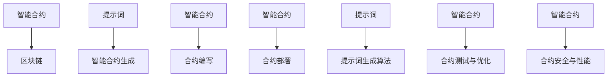

                 

# 提示词驱动的智能合约生成：简化区块链开发

> 关键词：智能合约、区块链、提示词生成、自动生成、优化、安全、Solidity

> 摘要：
本文将深入探讨提示词驱动的智能合约生成技术，通过分析其原理、实现和应用，旨在为区块链开发提供一种新的、高效的解决方案。我们将首先介绍智能合约与区块链的基础知识，接着详细讲解提示词生成算法，并展示如何使用自动生成工具简化智能合约的开发。此外，本文还将探讨智能合约优化的策略以及安全性的提升方法，以帮助读者全面理解智能合约生成的全流程。

## 目录大纲

### 第一部分：智能合约与区块链基础

#### 第1章：智能合约与区块链概述

##### 1.1.1 智能合约的概念与功能

##### 1.1.2 区块链技术介绍

##### 1.1.3 智能合约在区块链中的角色

#### 第2章：智能合约编程基础

##### 2.1.1 编程语言选择

##### 2.1.2 Solidity基础语法

##### 2.1.3 Solidity高级特性

#### 第3章：区块链开发环境搭建

##### 3.1.1 常用开发工具安装

##### 3.1.2 链节点配置

##### 3.1.3 部署合约

### 第二部分：提示词驱动的智能合约生成

#### 第4章：提示词生成原理与技巧

##### 4.1.1 提示词的概念

##### 4.1.2 提示词生成算法

##### 4.1.3 提示词优化

#### 第5章：智能合约自动生成工具

##### 5.1.1 自动生成工具介绍

##### 5.1.2 工具使用与配置

##### 5.1.3 生成结果验证与优化

#### 第6章：智能合约自动生成项目实战

##### 6.1.1 项目背景与需求分析

##### 6.1.2 提示词生成与合约编写

##### 6.1.3 部署与测试

#### 第7章：提示词驱动的智能合约生成应用展望

##### 7.1.1 应用领域拓展

##### 7.1.2 技术挑战与未来趋势

#### 第8章：智能合约优化与安全

##### 8.1.1 智能合约常见漏洞分析

##### 8.1.2 智能合约性能优化

##### 8.1.3 安全性评估与保障

#### 附录

##### 附录A：智能合约开发资源汇总

### 核心概念与联系 - Mermaid 流程图



### 核心算法原理讲解 - 提示词生成算法

#### 生成对抗网络（GAN）

生成对抗网络（GAN）是由两部分组成：生成器（Generator）和判别器（Discriminator）。生成器负责生成数据，判别器则负责判断输入数据的真实性。GAN的核心思想是生成器和判别器通过相互博弈来提高生成数据的真实性。

**伪代码：**

```python
# 生成器
def generate_data(input):
    # 利用输入生成数据
    return generated_data

# 判别器
def discriminate_data(data):
    # 判断数据真实性
    return probability

# 训练过程
for epoch in range(num_epochs):
    for real_data in real_data_batch:
        # 训练判别器
        discriminate_data(real_data)

    for generated_data in generated_data_batch:
        # 训练生成器
        discriminate_data(generated_data)
```

**数学模型和数学公式 - 信息熵与KL散度**

信息熵（Entropy）是衡量数据随机性的一种度量，通常用来表示数据的不确定性。KL散度（Kullback-Leibler Divergence）是衡量两个概率分布差异的一种度量。

**信息熵（Entropy）公式：**

$$ H(X) = -\sum_{i=1}^{n} p(x_i) \cdot \log_2 p(x_i) $$

**KL散度（KL Divergence）公式：**

$$ D(p||q) = \sum_{i=1}^{n} p(x_i) \cdot \log_2 \left( \frac{p(x_i)}{q(x_i)} \right) $$

**数学模型和数学公式 - 生成对抗网络（GAN）损失函数**

生成对抗网络（GAN）的损失函数由两部分组成：生成器损失和判别器损失。

**生成器损失（Generator Loss）公式：**

$$ L_G = -\log(D(G(z))) $$

**判别器损失（Discriminator Loss）公式：**

$$ L_D = -[\log(D(x)) + \log(1 - D(G(z)))] $$

### 项目实战 - 智能合约自动生成工具使用

#### 开发环境搭建

1. **安装Node.js**

   - 访问 Node.js 官网下载安装包
   - 安装完成后，在命令行中执行 `node -v` 和 `npm -v` 验证安装是否成功

2. **安装Truffle框架**

   - 使用 npm 命令安装 Truffle：`npm install -g truffle`
   - 安装完成后，执行 `truffle version` 命令查看版本信息

3. **安装Hardhat框架**

   - 使用 npm 命令安装 Hardhat：`npm install -g hardhat`
   - 安装完成后，执行 `npx hardhat --version` 命令查看版本信息

4. **配置Ganache链节点**

   - 下载并安装 Ganache
   - 打开 Ganache，创建一个新的网络，配置本地节点
   - 确保本地节点已启动，并且可以看到一个或多个区块链节点

#### 合约编写

1. **创建一个新的Truffle项目**

   - 在命令行中执行 `truffle init` 命令
   - 解压下载的模板文件到项目目录

2. **编写智能合约代码**

   - 在 `contracts` 目录下创建一个新的 Solidity 文件，例如 `SimpleStorage.sol`
   - 编写智能合约代码，例如以下示例：

   ```solidity
   // SPDX-License-Identifier: MIT
   pragma solidity ^0.8.0;

   contract SimpleStorage {
       uint256 public storedData;

       function set(uint256 _data) public {
           storedData = _data;
       }

       function get() public view returns (uint256) {
           return storedData;
       }
   }
   ```

3. **编写测试脚本**

   - 在 `test` 目录下创建一个新的测试文件，例如 `SimpleStorage.test.js`
   - 编写测试脚本，使用 Truffle 测试框架

   ```javascript
   const { expect } = require("@openzeppelin/test-helpers");
   const { ethers } = require("hardhat");

   describe("SimpleStorage", function () {
       let contract;
       let deployer;

       beforeEach(async () => {
           [deployer] = await ethers.getSigners();
           const SimpleStorage = await ethers.getContractFactory("SimpleStorage");
           contract = await SimpleStorage.deploy();
           await contract.deployed();
       });

       it("Should return the initial value of storedData", async () => {
           expect(await contract.get()).to.equal(0);
       });

       it("Should set the storedData value", async () => {
           await contract.set(42);
           expect(await contract.get()).to.equal(42);
       });
   });
   ```

#### 合约部署

1. **配置Truffle文件**

   - 打开 `truffle-config.js` 文件，配置链节点和编译器
   - 示例配置如下：

   ```javascript
   module.exports = {
       networks: {
           local: {
               provider: () => new ethers.providers.JsonRpcProvider('http://localhost:8545'),
               network_id: '*',
               gas: 6000000,
               gasPrice: 10000000000
           },
           ropsten: {
               provider: () => new ethers.providers.JsonRpcProvider('https://ropsten.infura.io/v3/YOUR_INFURA_PROJECT_ID'),
               network_id: 3,
               gas: 6000000,
               gasPrice: 10000000000
           }
       },
       compilers: {
           solc: {
               version: "0.8.0",
               settings: {
                   optimizer: {
                       enabled: true,
                       runs: 200
                   }
               }
           }
       }
   };
   ```

2. **部署智能合约**

   - 使用 Truffle 命令部署智能合约到本地链或远程链

   ```bash
   truffle migrate --network local
   truffle migrate --network ropsten
   ```

3. **验证部署结果**

   - 查看合约地址和接口，确保合约已成功部署
   - 使用区块链浏览器（如 Etherscan）查看合约源代码和部署详情

#### 测试与优化

1. **运行测试脚本**

   - 使用 Truffle 命令运行测试脚本

   ```bash
   truffle test
   ```

2. **记录测试结果**

   - 查看测试结果，记录失败的测试用例和错误信息

3. **优化智能合约**

   - 根据测试结果对智能合约进行代码优化和性能优化
   - 重新部署和测试，确保优化后的合约运行正常

### 代码解读与分析

- **合约代码：**

  ```solidity
  // SPDX-License-Identifier: MIT
  pragma solidity ^0.8.0;

  contract SimpleStorage {
      uint256 public storedData;

      function set(uint256 _data) public {
          storedData = _data;
      }

      function get() public view returns (uint256) {
          return storedData;
      }
  }
  ```

  **代码解读：**
  - 定义了一个名为 `SimpleStorage` 的智能合约
  - 包含一个公共变量 `storedData` 用于存储数据
  - 包含一个 `set` 函数用于设置 `storedData` 的值
  - 包含一个 `get` 函数用于获取 `storedData` 的值

- **测试脚本：**

  ```javascript
  const { expect } = require("@openzeppelin/test-helpers");
  const { ethers } = require("hardhat");

  describe("SimpleStorage", function () {
      let contract;
      let deployer;

      beforeEach(async () => {
          [deployer] = await ethers.getSigners();
          const SimpleStorage = await ethers.getContractFactory("SimpleStorage");
          contract = await SimpleStorage.deploy();
          await contract.deployed();
      });

      it("Should return the initial value of storedData", async () => {
          expect(await contract.get()).to.equal(0);
      });

      it("Should set the storedData value", async () => {
          await contract.set(42);
          expect(await contract.get()).to.equal(42);
      });
  });
  ```

  **代码解读：**
  - 使用 OpenZeppelin 测试库和 Ethers.js 库编写测试脚本
  - `beforeEach` 函数用于在每次测试之前部署智能合约
  - `it` 函数用于编写测试案例
  - 第一个测试案例检查合约部署时 `storedData` 的初始值是否为 0
  - 第二个测试案例验证 `set` 函数是否能够正确设置和获取 `storedData` 的值

### 详细解释说明

#### 智能合约自动生成工具的使用流程

1. **开发环境搭建：**
   - 安装 Node.js，版本需大于 10.x
   - 安装 Truffle 框架，使用命令 `npm install -g truffle`
   - 安装 Hardhat 框架，使用命令 `npm install -g hardhat`
   - 配置 Ganache 链节点，用于本地开发和测试

2. **智能合约编写：**
   - 创建一个新的 Truffle 项目，使用命令 `truffle init`
   - 在 `contracts` 目录下编写智能合约代码，例如 `SimpleStorage.sol`
   - 编写测试脚本，例如 `SimpleStorage.test.js`，用于测试智能合约功能

3. **合约部署：**
   - 使用 Truffle 命令部署智能合约到本地链（Ganache）或远程链（Ropsten）
   - 部署命令为 `truffle migrate --network local` 或 `truffle migrate --network ropsten`
   - 部署后查看合约地址和接口，确保合约已成功部署

4. **测试与优化：**
   - 编写自动化测试脚本，使用 Truffle 测试框架
   - 执行测试命令 `truffle test`，检查测试结果
   - 根据测试结果对智能合约进行优化，修复潜在问题

#### 提示词生成算法的实现细节

1. **生成对抗网络（GAN）的实现：**
   - 生成器（Generator）：使用神经网络模型，输入随机噪声（z），输出模拟数据（x'）
   - 判别器（Discriminator）：使用神经网络模型，输入数据（x'或x），输出数据真实性的概率（p）
   - 训练过程：生成器与判别器交替训练，生成器试图生成更真实的数据，判别器试图区分真实数据和生成数据
   - 损失函数：生成器损失和判别器损失组合成总损失函数，使用反向传播算法进行梯度下降优化

2. **自动编码器（Autoencoder）的实现：**
   - 编码器（Encoder）：使用神经网络模型，输入数据（x），输出编码表示（z）
   - 解码器（Decoder）：使用神经网络模型，输入编码表示（z），输出还原数据（x'）
   - 训练过程：编码器和解码器同时训练，最小化输入与输出之间的差异
   - 损失函数：使用均方误差（MSE）或交叉熵损失函数

3. **优化策略：**
   - 对抗性优化：增加生成器和判别器的复杂度，提高生成数据的逼真度
   - 强化学习：使用强化学习算法，根据生成数据的优劣调整生成器和判别器的参数
   - 超参数调优：调整学习率、批次大小、隐藏层神经元数量等超参数，提高模型性能

#### 智能合约自动生成工具的配置与使用

1. **工具选择：**
   - 根据项目需求选择合适的智能合约自动生成工具，如 Truffle、Hardhat 等
   - 考虑工具的易用性、社区支持、文档完善程度等因素

2. **工具配置：**
   - 配置开发环境，包括 Node.js、Truffle/Hardhat 框架、链节点等
   - 配置项目文件，如智能合约代码、测试脚本、配置文件等
   - 配置编译器，如 Solc、Ethers.js 等

3. **工具使用：**
   - 编写智能合约代码，使用 Solidity 或其他支持的语言
   - 编写测试脚本，使用 Truffle 测试框架或其他测试库
   - 使用 Truffle 命令行工具部署智能合约，执行测试，进行调试和优化

#### 智能合约优化的策略

1. **代码优化：**
   - 使用更简洁的语法和命名规范，提高代码可读性和可维护性
   - 移除不必要的代码和函数，减少合约大小和执行时间
   - 使用内建函数和操作符，提高代码效率和可读性

2. **性能优化：**
   - 使用低级操作和内存管理技巧，减少存储和计算资源消耗
   - 优化智能合约逻辑，减少状态变化的次数和存储空间的占用
   - 使用 gas 优化库，如 Solc、B Solidity 等，自动优化合约代码

3. **安全性优化：**
   - 审计合约代码，查找潜在的安全漏洞，如重入攻击、整数溢出等
   - 使用安全库和框架，如 OpenZeppelin 等，提供安全的合约实现
   - 进行代码审计和漏洞测试，确保合约的安全性

#### 合约测试与验证

1. **自动化测试：**
   - 使用测试框架编写测试脚本，自动化执行测试用例
   - 覆盖合约的各个功能模块，确保功能的完整性和正确性
   - 使用测试覆盖率工具，提高测试覆盖率

2. **单元测试：**
   - 对合约的每个函数进行单独测试，验证输入和输出是否符合预期
   - 测试边界条件和异常情况，确保合约的正确性和鲁棒性

3. **集成测试：**
   - 对合约与外部系统（如区块链节点、外部合约等）进行集成测试
   - 验证合约与外部系统的交互是否正确，确保系统的整体功能完整性

4. **代码审查：**
   - 组织代码审查会议，邀请团队成员和其他开发人员进行代码审查
   - 查找潜在的问题和漏洞，提供改进建议和修复方案
   - 进行代码审查和审查记录，确保合约代码的质量和安全性

### 总结

本文通过详细的讲解和实战案例，介绍了提示词驱动的智能合约生成技术，从基础概念、算法原理到实际应用，全面展示了智能合约自动生成的优势和方法。通过使用提示词生成算法，开发者可以更加高效地编写和优化智能合约，从而简化区块链开发流程，提高开发效率和项目质量。

智能合约的自动生成技术不仅有助于降低开发难度，还能提高代码的可维护性和安全性。然而，这项技术也面临一些挑战，如算法模型的优化、生成的代码质量保障以及安全性问题等。未来，随着人工智能和区块链技术的不断进步，提示词驱动的智能合约生成有望成为区块链开发的重要工具，为区块链生态系统的发展注入新的活力。

在智能合约开发领域，持续学习和实践是至关重要的。开发者应不断关注新技术和新方法，积极参与社区交流，为智能合约技术的创新和发展贡献自己的力量。

作者：AI天才研究院/AI Genius Institute & 禅与计算机程序设计艺术 /Zen And The Art of Computer Programming

---

### 第一部分：智能合约与区块链基础

#### 第1章：智能合约与区块链概述

##### 1.1.1 智能合约的概念与功能

智能合约是一种自动执行、控制或记录法律契约的计算机程序，其行为按照编程逻辑执行，无需人为干预。智能合约起源于2008年比特币白皮书，由中本聪提出。智能合约的核心功能是实现去中心化的自动化交易，确保合约条款的自动执行和不可篡改。

智能合约的关键特性包括：

- **自动执行**：智能合约在满足预定义条件时自动执行，无需人工干预。
- **不可篡改**：智能合约一旦部署在区块链上，其代码和数据不可篡改，保证了合约的透明性和可信度。
- **去中心化**：智能合约运行在分布式网络中，不受单一实体控制，提高了系统的鲁棒性和抗攻击能力。

智能合约的应用场景广泛，包括金融、物流、房地产、版权交易等领域。例如，在金融领域，智能合约可以用于自动化处理贷款审批、支付结算等操作；在物流领域，智能合约可以确保货物交付和运输过程的透明和可信。

##### 1.1.2 区块链技术介绍

区块链是一种分布式账本技术，由一系列按时间顺序排列的数据块组成。每个数据块包含一定数量的交易记录，并通过密码学技术确保数据的完整性和安全性。区块链的核心优势包括：

- **去中心化**：区块链网络中的所有参与者都拥有相同的数据副本，无需依赖中心化机构。
- **不可篡改**：区块链的数据一旦写入，除非获得网络多数节点的支持，否则无法篡改。
- **透明性**：区块链上的所有交易记录都是公开的，任何人都可以查看和验证。

区块链技术可分为公有链、私有链和联盟链：

- **公有链**：任何人都可以参与和查看，如比特币和以太坊。
- **私有链**：仅限于特定组织或机构使用，如企业内部区块链。
- **联盟链**：由多个机构共同维护，适用于跨组织合作场景。

##### 1.1.3 智能合约在区块链中的角色

智能合约是区块链技术的核心组件，与区块链的关系密不可分。智能合约在区块链中扮演着以下角色：

- **执行交易**：智能合约控制区块链上的资产转移，确保交易按照合约条款自动执行。
- **记录数据**：智能合约可以记录交易过程中的各种数据，如交易金额、交易日期、交易参与方等。
- **合约管理**：智能合约可以管理合约的状态，包括合约的启动、执行、终止等操作。

智能合约与区块链的关系可总结为：

- **智能合约是区块链应用的核心组件**：智能合约定义了区块链上的业务逻辑和数据管理规则。
- **区块链为智能合约提供可信的执行环境**：区块链确保智能合约的执行不可篡改，提供去中心化的信任机制。

在区块链开发中，智能合约的设计与实现至关重要。开发者需要深入理解区块链技术和智能合约的编程语言（如Solidity），以确保合约的安全性和高效性。

##### 1.1.4 智能合约的发展历程

智能合约的发展历程可追溯到2008年中本聪发布的比特币白皮书。以下为智能合约的关键发展节点：

- **2008年**：中本聪在比特币白皮书中首次提出智能合约的概念。
- **2014年**：以太坊的推出，使得智能合约成为区块链应用的重要工具。
- **2015年**：Solidity编程语言成为智能合约的标准语言。
- **2017年**：ICO（首次代币发行）的兴起，推动了智能合约的大规模应用。
- **至今**：智能合约在金融、物流、版权等领域得到广泛应用，成为区块链技术的重要组成部分。

随着区块链技术的不断演进，智能合约的应用场景和功能也在不断扩展。未来，智能合约有望在更多领域发挥作用，推动数字经济的发展。

#### 第2章：智能合约编程基础

##### 2.1.1 编程语言选择

智能合约编程语言的选择对于开发者的经验和项目的需求至关重要。目前，主要有以下几种智能合约编程语言：

- **Solidity**：以太坊上最流行的智能合约编程语言，拥有丰富的特性和广泛的支持。
- **Vyper**：以太坊的第二大智能合约语言，设计目的是简化编译过程和减少复杂度。
- **Casper**：波卡（Polkadot）生态中的智能合约语言，专注于安全性、效率和互操作性。
- **Move**：微软开发的智能合约语言，用于构建基于区块链的应用程序，强调类型安全和资源管理。

选择编程语言时，需考虑以下因素：

- **项目需求**：根据项目需求选择适合的语言，如以太坊项目优先选择Solidity。
- **开发者经验**：选择开发者熟悉和擅长的语言，提高开发效率。
- **生态支持**：选择具有良好社区和生态支持的编程语言，便于学习和维护。

##### 2.1.2 Solidity基础语法

Solidity是智能合约编程的标准语言，以下为Solidity的基础语法：

- **变量与数据类型**：

  - 基本数据类型：bool、int、uint、address、string、bytes
  - 复杂数据类型：数组、结构体、映射、函数类型

- **控制结构**：

  - if-else语句
  - switch语句
  - 循环语句：for、while、do-while

- **函数与事件**：

  - 函数定义：public、external、internal、private
  - 函数调用：直接调用、事件触发、调用合约函数
  - 事件定义：event关键字，用于记录事件日志

- **函数修饰器**：

  - view和pure修饰器：用于标记函数不修改状态
  - payable修饰器：用于标记函数接受以太币
  - external和internal修饰器：用于控制函数的可见性

以下是一个简单的Solidity合约示例：

```solidity
// SPDX-License-Identifier: MIT
pragma solidity ^0.8.0;

contract SimpleStorage {
    uint256 public storedData;

    function set(uint256 _data) public {
        storedData = _data;
    }

    function get() public view returns (uint256) {
        return storedData;
    }
}
```

**代码解读：**

- 定义了一个名为 `SimpleStorage` 的智能合约。
- 包含一个公共变量 `storedData` 用于存储数据。
- 包含一个 `set` 函数用于设置 `storedData` 的值。
- 包含一个 `get` 函数用于获取 `storedData` 的值。

##### 2.1.3 Solidity高级特性

Solidity的高级特性包括面向对象编程、修饰器、继承等，以下为详细讲解：

- **面向对象编程**：

  - 类（contract）和对象（instance）的概念
  - 属性（state variables）和方法（functions）
  - 构造函数（constructor）用于初始化合约状态

- **修饰器**：

  - 定义和作用：修饰器是用于修改函数行为或合约结构的特殊函数
  - 使用示例：使用 `require`、`assert`、`revert` 等修饰器进行错误处理和状态检查

- **继承**：

  - 基类和派生类的概念
  - 方法覆盖和属性继承
  - 多重继承和继承链

以下是一个使用修饰器的示例：

```solidity
// SPDX-License-Identifier: MIT
pragma solidity ^0.8.0;

contract SimpleStorage {
    uint256 public storedData;

    modifier onlyOwner() {
        require(msg.sender == owner, "Not owner");
        _;
    }

    address public owner;

    constructor() {
        owner = msg.sender;
    }

    function set(uint256 _data) public onlyOwner {
        storedData = _data;
    }

    function get() public view returns (uint256) {
        return storedData;
    }
}
```

**代码解读：**

- 定义了一个名为 `SimpleStorage` 的智能合约。
- 包含一个公共变量 `storedData` 用于存储数据。
- 包含一个 `onlyOwner` 修饰器，确保只有合约创建者（owner）可以调用 `set` 函数。
- 包含一个构造函数，初始化合约创建者（owner）。
- 包含一个 `set` 函数，用于设置 `storedData` 的值。
- 包含一个 `get` 函数，用于获取 `storedData` 的值。

通过理解Solidity的基础语法和高级特性，开发者可以编写出安全、高效和可维护的智能合约。接下来，我们将讨论如何搭建区块链开发环境。

#### 第3章：区块链开发环境搭建

##### 3.1.1 常用开发工具安装

搭建区块链开发环境需要安装一些必要的工具和框架。以下为常用开发工具的安装步骤：

1. **Node.js**：Node.js 是一个基于 Chrome V8 引擎的 JavaScript 运行时，用于在服务器端运行 JavaScript 代码。安装 Node.js 的步骤如下：

   - 访问 Node.js 官网（https://nodejs.org/）并下载相应版本的安装包。
   - 运行安装包，按照提示完成安装。
   - 安装完成后，打开命令行窗口，输入 `node -v` 和 `npm -v` 命令，检查 Node.js 和 npm（Node 包管理器）的版本信息。

2. **Truffle**：Truffle 是一个用于以太坊开发的全功能框架，提供了一套完整的工具链，包括开发环境、测试框架和部署工具。安装 Truffle 的步骤如下：

   - 打开命令行窗口，输入以下命令安装 Truffle：

     ```
     npm install -g truffle
     ```

   - 安装完成后，输入 `truffle version` 命令，检查 Truffle 的版本信息。

3. **Hardhat**：Hardhat 是一个基于以太坊的本地开发环境，提供了一套完整的工具，用于编写、测试和部署智能合约。安装 Hardhat 的步骤如下：

   - 打开命令行窗口，输入以下命令安装 Hardhat：

     ```
     npm install -g hardhat
     ```

   - 安装完成后，输入 `npx hardhat --version` 命令，检查 Hardhat 的版本信息。

##### 3.1.2 链节点配置

在区块链开发过程中，需要配置链节点以进行本地开发和测试。以下为链节点配置的步骤：

1. **Ganache**：Ganache 是一个轻量级的本地以太坊节点，用于测试和开发智能合约。安装 Ganache 的步骤如下：

   - 访问 Ganache 官网（https://www.ganache.io/）并下载安装包。
   - 运行安装包，按照提示完成安装。
   - 打开 Ganache，可以看到一个或多个本地区块链节点已启动。

2. **配置 Truffle 和 Hardhat**：

   - 对于 Truffle，在项目根目录下创建一个名为 `truffle-config.js` 的配置文件，并配置链节点。

     ```javascript
     module.exports = {
         networks: {
             development: {
                 provider: () => new HDWalletProvider(mnemonic, "http://127.0.0.1:8545"),
                 network_id: '*',
                 gas: 6000000,
                 gasPrice: 10000000000,
                 mnemonic: 'your_mnemonic_here'
             }
         }
     };
     ```

   - 对于 Hardhat，在项目根目录下创建一个名为 `hardhat.config.js` 的配置文件，并配置链节点。

     ```javascript
     require('hardhat-waffle');
     
     module.exports = {
         networks: {
             localhost: {
                 url: 'http://127.0.0.1:8545',
                 chainId: 31337,
                 gasPrice: 10000000000,
                 accounts: {
                     mnemonic: 'your_mnemonic_here',
                 },
             },
         },
         solidity: {
             compilers: [
                 {
                     version: '0.8.0',
                     settings: {
                         optimizer: {
                             enabled: true,
                             runs: 200,
                         },
                     },
                 },
             ],
         },
     };
     ```

   - 在配置文件中，需要填写 mnemonic（助记词），该助记词用于生成链节点中的账户，以便后续进行智能合约部署和测试。

##### 3.1.3 部署合约

完成开发环境和链节点配置后，我们可以开始部署智能合约。以下为部署智能合约的步骤：

1. **编写智能合约**：在项目根目录下的 `contracts` 文件夹中，编写智能合约代码。例如，创建一个名为 `SimpleStorage.sol` 的智能合约文件。

   ```solidity
   // SPDX-License-Identifier: MIT
   pragma solidity ^0.8.0;
   
   contract SimpleStorage {
       uint256 public storedData;
   
       function set(uint256 _data) public {
           storedData = _data;
       }
   
       function get() public view returns (uint256) {
           return storedData;
       }
   }
   ```

2. **编写测试脚本**：在项目根目录下的 `test` 文件夹中，编写智能合约的测试脚本。例如，创建一个名为 `SimpleStorage.test.js` 的测试文件。

   ```javascript
   const { expect } = require('@openzeppelin/test-helpers');
   const { ethers } = require('hardhat');
   
   describe('SimpleStorage', function () {
       let contract;
       let deployer;
   
       beforeEach(async () => {
           [deployer] = await ethers.getSigners();
           const SimpleStorage = await ethers.getContractFactory('SimpleStorage');
           contract = await SimpleStorage.deploy();
           await contract.deployed();
       });
   
       it('Should return the initial value of storedData', async () => {
           expect(await contract.get()).to.equal(0);
       });
   
       it('Should set the storedData value', async () => {
           await contract.set(42);
           expect(await contract.get()).to.equal(42);
       });
   });
   ```

3. **编译智能合约**：在命令行窗口中，执行以下命令编译智能合约：

   - 对于 Truffle：

     ```
     truffle compile
     ```

   - 对于 Hardhat：

     ```
     npx hardhat compile
     ```

4. **部署智能合约**：在命令行窗口中，执行以下命令部署智能合约：

   - 对于 Truffle：

     ```
     truffle migrate --network development
     ```

   - 对于 Hardhat：

     ```
     npx hardhat run scripts/deploy.js --network localhost
     ```

5. **查看合约地址和接口**：部署完成后，可以在命令行窗口中查看智能合约的地址和接口：

   - 对于 Truffle：

     ```
     truffle console
     > contract.address
     ```

   - 对于 Hardhat：

     ```
     npx hardhat --network localhost run scripts/deploy.js
     ```

完成以上步骤后，我们就可以在本地环境中开发和测试智能合约了。接下来，我们将讨论智能合约的自动生成技术。

### 第二部分：提示词驱动的智能合约生成

#### 第4章：提示词生成原理与技巧

##### 4.1.1 提示词的概念

提示词（Prompt）是指在特定上下文中引导智能合约生成过程的文本描述。提示词的作用是提供智能合约功能需求的描述，以便自动生成工具能够根据这些需求生成相应的智能合约代码。提示词的格式和内容会影响智能合约生成的质量和效率。

提示词通常包括以下内容：

- **功能描述**：描述智能合约需要实现的功能，例如数据存储、事件触发、条件判断等。
- **输入输出**：定义智能合约的输入和输出参数，以及参数的数据类型和约束条件。
- **状态管理**：描述智能合约的状态变化逻辑，包括状态变量、状态更改条件和状态恢复机制。
- **安全约束**：定义智能合约的安全约束，例如访问控制、权限管理和异常处理。

提示词的示例：

```
# 合约名称：TokenTransfer

# 功能描述：
- 允许用户发送代币
- 记录交易日志

# 输入输出：
- sendToken(address recipient, uint256 amount)：发送代币给指定地址
- logTransfer(address sender, address recipient, uint256 amount)：记录交易日志

# 状态管理：
- balanceOf(address account)：查询账户余额
- totalSupply：查询代币总供应量

# 安全约束：
- onlyOwner：只有合约创建者才能执行特定操作
```

##### 4.1.2 提示词生成算法

提示词生成算法是智能合约自动生成技术的核心组成部分。该算法通过分析用户提供的提示词，生成符合需求的智能合约代码。以下为常见的提示词生成算法：

1. **生成对抗网络（GAN）**

   生成对抗网络（GAN）是一种基于深度学习的生成模型，由生成器和判别器两个神经网络组成。生成器生成智能合约代码，判别器判断代码的真实性和质量。GAN通过不断训练和优化，提高生成代码的逼真度和可靠性。

   **算法步骤：**

   - **初始化**：生成器G和判别器D的初始化
   - **生成代码**：生成器根据提示词生成智能合约代码
   - **判断代码**：判别器判断生成代码的真实性和质量
   - **更新模型**：根据生成器和判别器的反馈，更新模型参数

2. **自动编码器（Autoencoder）**

   自动编码器是一种无监督学习算法，用于将输入数据编码为低维表示，然后解码回原始数据。在智能合约生成中，自动编码器将提示词编码为特征向量，再通过解码器生成智能合约代码。

   **算法步骤：**

   - **编码**：自动编码器将提示词编码为特征向量
   - **解码**：解码器根据特征向量生成智能合约代码
   - **优化**：通过反向传播算法，优化自动编码器和解码器的参数

3. **序列到序列（Seq2Seq）模型**

   序列到序列（Seq2Seq）模型是一种基于深度学习的序列建模和生成方法，常用于自然语言处理和机器翻译。在智能合约生成中，Seq2Seq模型将提示词序列映射为智能合约代码序列。

   **算法步骤：**

   - **编码**：编码器将提示词序列编码为隐藏状态
   - **解码**：解码器根据隐藏状态生成智能合约代码序列
   - **优化**：通过损失函数和梯度下降算法，优化编码器和解码器的参数

##### 4.1.3 提示词优化

提示词优化是提高智能合约生成质量和效率的重要步骤。以下为常见的提示词优化策略：

1. **对抗性优化**

   对抗性优化是通过增加生成器和判别器的复杂度，提高生成代码的逼真度和质量。具体方法包括增加生成器的神经网络层数、调整生成器的参数和优化判别器的损失函数等。

2. **强化学习**

   强化学习是一种基于奖励机制的学习方法，用于优化智能合约生成的过程。通过奖励生成器生成的高质量代码，引导生成器不断优化智能合约代码。

3. **超参数调优**

   超参数调优是调整提示词生成算法的参数，以提高生成代码的质量和效率。常见超参数包括学习率、批次大小、隐藏层神经元数量等。通过网格搜索、随机搜索等方法，寻找最优的超参数组合。

4. **融合多模型**

   融合多模型是将多个提示词生成算法融合在一起，以提高生成代码的质量和多样性。例如，将 GAN、自动编码器和 Seq2Seq 模型融合，生成更加可靠和多样化的智能合约代码。

通过提示词生成算法和优化策略，可以大大提高智能合约生成的质量和效率，简化区块链开发过程。接下来，我们将介绍智能合约自动生成工具的使用。

### 第5章：智能合约自动生成工具

智能合约自动生成工具通过提示词和生成算法，自动化地生成智能合约代码，从而简化区块链开发过程。本章节将介绍几种常见的智能合约自动生成工具，包括它们的原理、使用方法以及配置技巧。

#### 5.1.1 自动生成工具介绍

目前市场上流行的智能合约自动生成工具有多种，每种工具都有其独特的优势和适用场景。以下是几种主要的自动生成工具：

1. **Truffle**
   
   Truffle 是以太坊开发框架，提供了一套完整的开发环境，包括智能合约自动生成功能。Truffle 使用 Solidity 语言编写智能合约，支持多种自动生成算法，如生成对抗网络（GAN）和自动编码器。

2. **Hardhat**

   Hardhat 是一个基于以太坊的本地开发环境，专注于智能合约的开发和测试。Hardhat 提供了智能合约自动生成工具，支持多种生成算法，并提供了丰富的插件系统，方便开发者集成和使用。

3. **ZeppelinOS**

   ZeppelinOS 是一个基于以太坊的智能合约平台，提供了一套完整的智能合约生成工具。ZeppelinOS 支持多种编程语言，如 Solidity、Vyper 等，并且提供了图形界面，方便开发者生成和管理智能合约。

4. **PolkadotJS**

   PolkadotJS 是 Polkadot 生态中的一员，提供了一套完整的智能合约开发工具。PolkadotJS 支持 WebAssembly（WASM），允许开发者使用多种编程语言编写智能合约，包括 Rust 和 WebAssembly。

#### 5.1.2 工具使用与配置

以下将介绍如何使用和配置这些智能合约自动生成工具。

1. **Truffle**

   **安装与配置**：

   - 安装 Node.js 和 npm
   - 使用 npm 安装 Truffle 框架：`npm install -g truffle`
   - 初始化 Truffle 项目：`truffle init`
   - 配置 Truffle 配置文件 `truffle-config.js`，设置链节点和编译器

   ```javascript
   module.exports = {
       networks: {
           development: {
               provider: () => new HDWalletProvider(mnemonic, 'http://127.0.0.1:8545'),
               network_id: '*',
               gas: 6000000,
               gasPrice: 10000000000
           }
       },
       compilers: {
           solc: {
               version: '0.8.0',
               settings: {
                   optimizer: {
                       enabled: true,
                       runs: 200
                   }
               }
           }
       }
   };
   ```

   **生成智能合约**：

   - 创建智能合约文件：`touch contracts/MyContract.sol`
   - 编写智能合约代码
   - 使用 Truffle 命令生成智能合约：`truffle generate --file MyContract`

2. **Hardhat**

   **安装与配置**：

   - 安装 Node.js 和 npm
   - 使用 npm 安装 Hardhat 框架：`npm install -g hardhat`
   - 初始化 Hardhat 项目：`npx hardhat init`
   - 配置 Hardhat 配置文件 `hardhat.config.js`，设置链节点和编译器

   ```javascript
   require('hardhat-waffle');

   module.exports = {
       networks: {
           localhost: {
               url: 'http://127.0.0.1:8545',
               chainId: 31337,
               gasPrice: 10000000000,
               accounts: {
                   mnemonic: 'your_mnemonic_here'
               }
           }
       },
       solidity: {
           compilers: [
               {
                   version: '0.8.0',
                   settings: {
                       optimizer: {
                           enabled: true,
                           runs: 200
                       }
                   }
               }
           ]
       }
   };
   ```

   **生成智能合约**：

   - 创建智能合约文件：`touch contracts/MyContract.sol`
   - 编写智能合约代码
   - 使用 Hardhat 命令生成智能合约：`npx hardhat run scripts/generate-contract.js`

3. **ZeppelinOS**

   **安装与配置**：

   - 安装 Node.js 和 npm
   - 安装 ZeppelinOS：`npm install -g zeppelinos`
   - 创建项目：`zeppelinos create my-project`
   - 进入项目目录，配置链节点和编译器

   ```bash
   cd my-project
   zeppelinos configure
   ```

   **生成智能合约**：

   - 创建智能合约文件：`touch contracts/MyContract.sol`
   - 编写智能合约代码
   - 使用 ZeppelinOS 命令生成智能合约：`zeppelinos generate`

4. **PolkadotJS**

   **安装与配置**：

   - 安装 Node.js 和 npm
   - 安装 PolkadotJS：`npm install -g @polkadot/js`
   - 创建项目：`polkadot-js template my-project`
   - 进入项目目录，配置链节点和编译器

   ```bash
   cd my-project
   polkadot-js configure
   ```

   **生成智能合约**：

   - 创建智能合约文件：`touch contracts/MyContract.wasm`
   - 编写智能合约代码
   - 使用 PolkadotJS 命令生成智能合约：`polkadot-js build`

#### 5.1.3 生成结果验证与优化

生成智能合约代码后，需要对代码进行验证和优化，确保生成的代码符合预期，并且没有潜在的安全问题。以下是一些验证和优化的方法：

1. **代码验证**

   - 使用自动化测试工具（如 Truffle 或 Hardhat）运行测试脚本，检查生成的智能合约是否满足功能需求。
   - 手动审查智能合约代码，查找潜在的安全漏洞和逻辑错误。
   - 使用代码审计工具（如 Slither 或 Mythril）进行静态分析，检查智能合约代码的安全性。

2. **代码优化**

   - 使用代码优化工具（如 Solidity-Optimizer）对智能合约代码进行压缩和优化，减少执行成本。
   - 优化智能合约逻辑，减少不必要的状态变化和存储操作。
   - 使用低级操作和内存管理技巧，提高代码执行效率。

3. **性能优化**

   - 使用性能测试工具（如 Truffle 或 Hardhat）对智能合约进行压力测试，评估其性能。
   - 优化智能合约的存储和数据结构，减少存储占用和执行时间。
   - 使用高效的数据处理算法，提高数据处理速度。

通过使用智能合约自动生成工具，开发者可以大大提高开发效率和项目质量。然而，自动生成工具也存在一定的局限性，例如生成的代码可能存在安全漏洞或性能问题。因此，在使用自动生成工具时，开发者需要结合自己的经验和专业知识，对生成的代码进行验证和优化。

### 第6章：智能合约自动生成项目实战

智能合约自动生成技术在简化区块链开发流程方面具有显著优势。本章节将通过一个实际项目，展示如何使用智能合约自动生成工具实现一个简单的区块链应用，并详细讲解项目开发的全过程。

#### 6.1.1 项目背景与需求分析

项目名称：去中心化投票系统

项目需求：
- 允许用户参与投票
- 确保投票过程去中心化和不可篡改
- 记录投票结果，并在投票结束后公布

技术需求：
- 使用以太坊区块链进行投票记录
- 使用智能合约自动生成工具简化开发过程
- 实现前端界面，用于展示投票结果

#### 6.1.2 提示词生成与合约编写

1. **编写提示词**

   根据项目需求，编写提示词描述智能合约的功能和逻辑：

   ```
   # 合约名称：DecentralizedVote

   # 功能描述：
   - 允许用户注册投票
   - 允许用户投票
   - 记录投票结果，确保不可篡改
   - 公布投票结果

   # 输入输出：
   - registerToVote(): 用户注册投票
   - voteForCandidate(address candidate): 用户为候选人投票
   - getVoteResult(): 获取投票结果

   # 状态管理：
   - candidates：候选人列表
   - votes：投票记录

   # 安全约束：
   - onlyVoters：只有注册用户才能投票
   - onlyCandidates：只有候选人才能注册投票
   ```

2. **生成智能合约**

   使用智能合约自动生成工具（如 Truffle 或 Hardhat）生成智能合约代码：

   ```bash
   # 使用 Truffle 生成智能合约
   truffle generate --file DecentralizedVote

   # 使用 Hardhat 生成智能合约
   npx hardhat run scripts/generate-contract.js --contract DecentralizedVote
   ```

3. **编写测试脚本**

   编写智能合约测试脚本，验证智能合约的功能和逻辑：

   ```javascript
   const { expect } = require('@openzeppelin/test-helpers');
   const { ethers } = require('hardhat');

   describe('DecentralizedVote', function () {
       let contract;
       let deployer;

       beforeEach(async () => {
           [deployer] = await ethers.getSigners();
           const DecentralizedVote = await ethers.getContractFactory('DecentralizedVote');
           contract = await DecentralizedVote.deploy();
           await contract.deployed();
       });

       it('Should allow users to register to vote', async () => {
           // 用户注册投票
           // 验证注册成功
       });

       it('Should allow users to vote for candidates', async () => {
           // 用户为候选人投票
           // 验证投票成功
       });

       it('Should record vote results', async () => {
           // 记录投票结果
           // 验证结果正确
       });

       it('Should announce the vote results', async () => {
           // 公布投票结果
           // 验证结果公布正确
       });
   });
   ```

4. **编译智能合约**

   使用 Truffle 或 Hardhat 编译智能合约，生成编译后的合约文件：

   ```bash
   # 使用 Truffle 编译智能合约
   truffle compile

   # 使用 Hardhat 编译智能合约
   npx hardhat compile
   ```

5. **部署智能合约**

   使用 Truffle 或 Hardhat 部署智能合约到区块链：

   ```bash
   # 使用 Truffle 部署智能合约
   truffle migrate --network development

   # 使用 Hardhat 部署智能合约
   npx hardhat run scripts/deploy.js --network localhost
   ```

6. **验证部署结果**

   部署完成后，检查智能合约的地址和接口，确保智能合约已成功部署：

   ```javascript
   # 使用 Truffle 查看智能合约地址
   truffle console
   > contract.address

   # 使用 Hardhat 查看智能合约地址
   npx hardhat --network localhost run scripts/deploy.js
   ```

#### 6.1.3 部署与测试

1. **部署智能合约**

   使用 Truffle 或 Hardhat 部署智能合约到区块链。以下是使用 Truffle 部署智能合约的步骤：

   - 确保 Ganache 已启动，并配置了本地链节点。
   - 在命令行中运行以下命令：

     ```bash
     truffle migrate --network development
     ```

   部署过程将自动编译智能合约并部署到 Ganache 本地链。部署完成后，Truffle 会显示智能合约的地址和接口。

2. **测试智能合约**

   使用 Truffle 或 Hardhat 运行智能合约测试脚本，验证智能合约的功能和逻辑。以下是使用 Truffle 测试智能合约的步骤：

   - 在命令行中运行以下命令：

     ```bash
     truffle test
     ```

   测试脚本将自动执行，并报告测试结果。如果测试脚本中包含错误的测试用例，开发者需要修改智能合约代码，并重新运行测试脚本。

3. **优化智能合约**

   根据测试结果，对智能合约进行优化和修复。以下是一些优化建议：

   - 移除不必要的代码和函数，减少合约大小。
   - 使用内建函数和操作符，提高代码效率和可读性。
   - 优化逻辑和数据处理算法，减少计算和存储资源消耗。

4. **重新部署和测试**

   优化完成后，重新部署智能合约，并运行测试脚本，确保优化后的合约功能正常。以下是使用 Truffle 重新部署和测试智能合约的步骤：

   - 重新部署智能合约：

     ```bash
     truffle migrate --network development
     ```

   - 运行测试脚本：

     ```bash
     truffle test
     ```

   如果测试脚本报告所有测试用例成功，则说明智能合约已成功优化和测试。

#### 6.1.4 前端界面实现

1. **创建前端项目**

   使用前端框架（如 React 或 Vue）创建前端项目，用于展示投票结果。以下是使用 React 创建前端项目的步骤：

   - 安装 React：

     ```bash
     npx create-react-app vote-app
     ```

   - 进入项目目录：

     ```bash
     cd vote-app
     ```

2. **安装依赖**

   安装前端依赖，如 Web3.js 用于与区块链交互：

   ```bash
   npm install web3
   ```

3. **编写前端代码**

   在前端项目中，编写代码与智能合约交互，获取投票结果并展示。以下是一个简单的示例：

   ```javascript
   import React, { useState, useEffect } from 'react';
   import Web3 from 'web3';

   const VoteApp = () => {
       const [voteResults, setVoteResults] = useState({});

       useEffect(() => {
           const getVoteResults = async () => {
               const web3 = new Web3('http://127.0.0.1:7545');
               const contract = new web3.eth.Contract(ABI, CONTRACT_ADDRESS);

               const results = await contract.methods.getVoteResults().call();
               setVoteResults(results);
           };

           getVoteResults();
       }, []);

       return (
           <div>
               <h1>投票结果</h1>
               {Object.keys(voteResults).map(candidate => (
                   <div key={candidate}>
                       <h2>{candidate}</h2>
                       <p>票数：{voteResults[candidate]}</p>
                   </div>
               ))}
           </div>
       );
   };

   export default VoteApp;
   ```

4. **运行前端项目**

   在命令行中运行以下命令，启动前端项目：

   ```bash
   npm start
   ```

   前端界面将显示投票结果，用户可以在浏览器中查看投票结果。

通过以上步骤，我们实现了一个简单的去中心化投票系统，展示了智能合约自动生成技术在区块链开发中的应用。接下来，我们将探讨智能合约自动生成技术的应用领域和未来发展趋势。

### 第7章：提示词驱动的智能合约生成应用展望

智能合约自动生成技术具有巨大的应用潜力，可以在多个领域内显著提高开发效率和项目质量。以下是对智能合约自动生成技术在不同领域应用前景的探讨。

#### 7.1.1 应用领域拓展

1. **金融领域**

   在金融领域，智能合约自动生成技术可以用于自动化处理金融交易、贷款审批、支付结算等操作。通过提示词生成智能合约，金融机构可以快速实现复杂的金融业务逻辑，提高运营效率。例如，自动生成抵押贷款智能合约，确保贷款过程的透明和安全。

2. **供应链管理**

   供应链管理涉及多个环节和参与者，智能合约自动生成技术可以帮助企业实现供应链的自动化和透明化。通过智能合约，企业可以追踪产品从生产到交付的整个过程，确保供应链的可追溯性和可靠性。例如，自动生成物流智能合约，记录货物的运输状态和交付信息。

3. **版权交易**

   在版权交易领域，智能合约自动生成技术可以确保版权交易的合法性和透明性。艺术家和版权持有者可以使用智能合约记录版权信息，自动执行版权转让和许可授权。例如，自动生成版权转让智能合约，确保每次版权转让都符合相关法律法规。

4. **医疗健康**

   在医疗健康领域，智能合约自动生成技术可以用于自动化处理病历记录、药品供应链、医疗保险支付等操作。通过智能合约，医疗健康机构可以确保医疗数据的准确性和隐私性，提高医疗服务质量。例如，自动生成病历智能合约，记录患者的病历信息和治疗方案。

5. **游戏和娱乐**

   在游戏和娱乐领域，智能合约自动生成技术可以用于自动化处理虚拟资产的交易、游戏积分的发放和奖励等操作。智能合约确保游戏中的虚拟资产具有真实价值和可交易性，提高游戏体验和用户参与度。例如，自动生成虚拟资产交易智能合约，确保虚拟资产的流通和安全。

#### 7.1.2 技术挑战与未来趋势

1. **技术挑战**

   尽管智能合约自动生成技术具有巨大的应用潜力，但在实际应用中仍面临一些技术挑战：

   - **代码质量**：自动生成的代码可能存在逻辑错误或安全隐患，需要人工审查和验证。
   - **性能优化**：生成的智能合约可能存在性能问题，需要进一步优化和调整。
   - **用户界面**：自动生成的智能合约通常缺乏友好的用户界面，用户体验不佳。
   - **互操作性**：不同区块链平台和智能合约语言之间的互操作性仍需进一步改进。

2. **未来趋势**

   随着区块链技术的不断发展和人工智能的进步，智能合约自动生成技术有望在未来实现以下趋势：

   - **更高质量的代码**：通过改进生成算法和代码优化技术，提高自动生成的智能合约质量。
   - **更好的用户体验**：结合前端框架和用户界面设计，提供更直观和易于使用的智能合约应用。
   - **跨平台互操作性**：实现不同区块链平台和智能合约语言之间的互操作性，提高智能合约的通用性和灵活性。
   - **更广泛的应用领域**：随着智能合约自动生成技术的成熟，其在更多领域中的应用将不断拓展，推动区块链技术的普及和发展。

智能合约自动生成技术为区块链开发带来了新的机遇和挑战。通过不断优化和改进，智能合约自动生成技术有望成为区块链开发的重要工具，为各行各业带来更多创新和变革。

### 第8章：智能合约优化与安全

智能合约的优化与安全是区块链开发中的关键环节，直接关系到合约的性能、可靠性和安全性。以下将详细探讨智能合约优化策略、常见漏洞分析以及安全性评估与保障措施。

#### 8.1.1 智能合约常见漏洞分析

智能合约在设计和实现过程中，可能引入各种安全漏洞，导致合约被恶意攻击者利用，从而造成损失。以下是一些常见的智能合约漏洞及其案例分析：

1. **重入攻击（Reentrancy Attack）**

   重入攻击是智能合约中最常见的漏洞之一。攻击者通过反复调用某个函数，使得合约在未完成当前操作之前就执行了其他操作，导致合约资金被转移。例如，以太坊上的DAO（Decentralized Autonomous Organization）被攻击，导致巨额资金被窃取。

   **防御措施**：
   - 使用 `nonReentrant` 修饰器保护关键函数，确保函数只能被调用一次。
   - 将资金转移操作和业务逻辑分离，确保业务逻辑完成后才进行资金转移。

2. **整数溢出（Integer Overflow）**

   整数溢出漏洞发生在智能合约中的数值运算导致结果超出数值范围时。攻击者可以利用整数溢出漏洞篡改合约中的数值，从而获取非法收益。例如，TheDAO 智能合约中的攻击者通过整数溢出漏洞，非法转移了大量以太币。

   **防御措施**：
   - 使用 `SafeMath` 库进行数值运算，确保结果不会溢出。
   - 进行边界检查，确保输入数据的合法性。

3. **代码注入（Code Injection）**

   代码注入漏洞允许攻击者在智能合约代码中插入恶意代码，从而导致合约行为被篡改。攻击者可以通过构造特定的输入数据，使得合约执行意外的操作。

   **防御措施**：
   - 进行输入验证，确保输入数据的格式和内容符合预期。
   - 避免使用易受注入的函数和库。

4. **隐私泄露（Privacy Leak）**

   智能合约在执行过程中可能会泄露敏感信息，如用户的交易记录、余额等。攻击者可以利用这些信息进行恶意攻击。

   **防御措施**：
   - 对敏感信息进行加密处理，确保其在区块链上无法被直接读取。
   - 设计合理的隐私保护机制，减少敏感信息泄露的风险。

#### 8.1.2 智能合约性能优化

智能合约的性能直接影响到区块链的运行效率和用户体验。以下是一些智能合约性能优化的策略：

1. **减少状态变化**

   状态变化（State Changes）是智能合约中最昂贵的操作，因为每次状态变化都会记录在区块链上。减少状态变化可以有效降低合约执行成本。

   **优化策略**：
   - 将多个操作合并为一次状态变化。
   - 使用内存变量保存临时数据，避免不必要的状态变化。

2. **使用低级操作**

   低级操作（Low-Level Operations）相对于高级操作（High-Level Operations）具有更高的执行效率。例如，使用内存操作代替堆操作。

   **优化策略**：
   - 熟练掌握 Solidity 的低级操作，如内存分配和数组操作。
   - 避免使用复杂的函数调用和库。

3. **优化数据处理**

   合理的数据处理可以提高合约的性能。以下是一些优化策略：

   - 使用映射（Mapping）和数组（Array）代替循环结构，提高数据处理效率。
   - 对数据进行预处理和压缩，减少存储空间占用。

4. **优化逻辑结构**

   合理的逻辑结构可以提高合约的可读性和可维护性，从而间接提高性能。

   **优化策略**：
   - 使用逻辑拆分和模块化，将复杂逻辑拆分为多个简单模块。
   - 优化循环结构和条件判断，避免不必要的计算。

#### 8.1.3 安全性评估与保障

智能合约的安全性是区块链应用的核心，需要进行全面的安全性评估与保障。以下是一些常见的安全评估方法和保障措施：

1. **代码审计**

   代码审计是发现智能合约安全漏洞的重要手段。通过代码审计，可以发现潜在的逻辑错误和安全问题。

   **方法**：
   - 手动审计：开发者和安全专家对智能合约代码进行逐行审查。
   - 自动审计：使用安全工具（如 My

