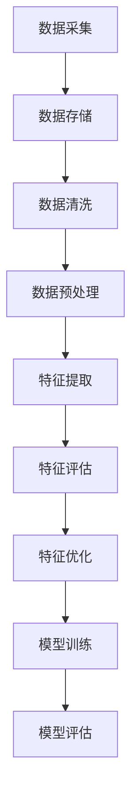

                 

# 搜索推荐系统中的实时特征工程技术

> 关键词：搜索推荐系统、实时特征工程、数据流处理、特征提取、机器学习算法、优化策略

> 摘要：本文旨在探讨搜索推荐系统中实时特征工程技术的重要性，详细介绍实时特征工程的定义、核心算法、数学模型及其在项目实战中的应用。通过深入剖析实时特征工程的技术体系，本文为开发高效搜索推荐系统提供了有价值的参考。

### 目录大纲

1. 概述
   1.1 搜索推荐系统概述
   1.2 实时特征工程概述
   1.3 实时特征工程的技术体系

2. 核心算法原理讲解
   2.1 实时特征工程算法原理
   2.2 数据流处理框架介绍
   2.3 实时特征提取算法详解
   2.4 实时特征评估算法
   2.5 实时特征优化算法

3. 数学模型和公式详解
   3.1 概率模型
   3.2 线性模型
   3.3 神经网络模型
   3.4 公式详解与举例说明

4. 项目实战
   4.1 项目背景与目标
   4.2 开发环境搭建
   4.3 源代码实现与解读
   4.4 代码分析与性能评估
   4.5 总结与展望

5. 附录
   5.1 实时特征工程工具与资源

### 1. 概述

#### 1.1 搜索推荐系统概述

搜索推荐系统是一种基于用户行为和物品属性的自动化推荐机制，旨在为用户提供个性化、高效的内容搜索和推荐服务。随着互联网的快速发展，搜索推荐系统在电子商务、社交媒体、在线视频等领域得到了广泛应用，成为提升用户体验、增加用户黏性的关键因素。

搜索推荐系统主要包括两个核心模块：搜索模块和推荐模块。搜索模块负责处理用户的查询请求，返回相关结果。推荐模块则根据用户的历史行为、兴趣和上下文信息，为用户推荐相关的物品或内容。

#### 1.2 实时特征工程概述

实时特征工程是搜索推荐系统中的一项关键技术，旨在从用户行为、物品属性和上下文信息中提取实时、有效的特征，用于机器学习模型的训练和预测。实时特征工程不仅影响着推荐系统的效果，还直接关系到系统的响应速度和可扩展性。

实时特征工程的主要目标是：

- 提取能够反映用户兴趣和行为的特征
- 保证特征的质量和一致性
- 快速响应用户的查询和推荐请求
- 支持多种机器学习算法和模型

#### 1.3 实时特征工程的技术体系

实时特征工程的技术体系包括数据采集与存储、数据清洗与预处理、实时特征提取、实时特征评估与选择、实时特征优化等环节。以下是每个环节的核心技术：

- **数据采集与存储**：实时采集用户行为数据、物品属性数据和上下文信息，并存储在高效、可扩展的数据存储系统中。
- **数据清洗与预处理**：去除噪声数据、处理缺失值和异常值，确保数据的质量和一致性。
- **实时特征提取**：从原始数据中提取有代表性的特征，如时间序列特征、用户行为特征、物品特征等。
- **实时特征评估与选择**：通过评估指标（如准确率、召回率、F1分数等）对特征进行评估和选择，保证特征的有效性。
- **实时特征优化**：根据系统的反馈和性能指标，对特征进行动态调整和优化，提高推荐系统的效果和响应速度。

### 2. 核心算法原理讲解

#### 2.1 实时特征工程算法原理

实时特征工程的核心算法包括数据流处理框架、实时特征提取算法、实时特征评估算法和实时特征优化算法。以下将逐一介绍这些算法的原理。

##### 2.1.1 数据流处理框架

数据流处理框架是实时特征工程的基础，负责处理和传输实时数据流。常见的数据流处理框架包括Apache Kafka、Apache Flink和Apache Storm等。

- **Apache Kafka**：Kafka是一个分布式流处理平台，支持高吞吐量、低延迟的消息队列。它可以将实时数据流传输到不同的处理节点，实现实时数据处理和特征提取。
- **Apache Flink**：Flink是一个分布式流处理框架，支持实时计算和批处理。它可以处理大规模的数据流，实现高效的特征提取和评估。
- **Apache Storm**：Storm是一个实时大数据处理框架，支持分布式、可扩展的实时计算。它适用于处理高频率、高并发的数据流，实现实时特征提取和优化。

##### 2.1.2 实时特征提取算法

实时特征提取算法负责从实时数据流中提取有效的特征。常见的实时特征提取算法包括时间序列特征提取算法、用户行为特征提取算法和物品特征提取算法。

- **时间序列特征提取算法**：时间序列特征提取算法用于提取用户历史行为的时序特征，如行为发生的时间间隔、行为发生的频率等。常见的时间序列特征提取算法包括移动平均法、指数平滑法、小波变换等。
- **用户行为特征提取算法**：用户行为特征提取算法用于提取用户在特定时间窗口内的行为特征，如点击率、浏览量、购买率等。常见的用户行为特征提取算法包括统计特征提取、机器学习特征提取等。
- **物品特征提取算法**：物品特征提取算法用于提取物品的属性特征，如分类标签、关键词、评分等。常见的物品特征提取算法包括词袋模型、TF-IDF、余弦相似度等。

##### 2.1.3 实时特征评估算法

实时特征评估算法用于评估特征的有效性和重要性。常见的实时特征评估算法包括相似度计算算法、评估指标选择与计算方法等。

- **相似度计算算法**：相似度计算算法用于计算特征之间的相似度，如余弦相似度、欧氏距离等。相似度计算算法可以帮助识别相似的用户或物品，提高推荐系统的准确性。
- **评估指标选择与计算方法**：评估指标选择与计算方法用于评估特征提取算法的性能。常见的评估指标包括准确率、召回率、F1分数等。评估指标可以帮助评估特征提取算法的优劣，指导特征优化。

##### 2.1.4 实时特征优化算法

实时特征优化算法用于优化特征提取算法，提高推荐系统的效果和响应速度。常见的实时特征优化算法包括特征选择算法、特征融合算法等。

- **特征选择算法**：特征选择算法用于选择对推荐系统性能有显著贡献的特征，如基于信息增益、基于相关性等方法。特征选择算法可以帮助降低特征维度，提高模型训练和预测的效率。
- **特征融合算法**：特征融合算法用于将多个特征组合成一个综合特征，如基于加权平均、基于神经网络等方法。特征融合算法可以帮助提高推荐系统的准确性和泛化能力。

#### 2.2 数据流处理框架介绍

数据流处理框架是实时特征工程的基础，负责处理和传输实时数据流。以下将详细介绍常用的数据流处理框架：Apache Kafka、Apache Flink和Apache Storm。

##### 2.2.1 Apache Kafka

Apache Kafka是一个分布式流处理平台，支持高吞吐量、低延迟的消息队列。Kafka的主要特点包括：

- **分布式架构**：Kafka采用分布式架构，支持多个节点协同工作，实现高可用性和容错性。
- **高吞吐量**：Kafka可以处理大规模的数据流，支持每秒数百万条消息的高吞吐量。
- **低延迟**：Kafka采用基于磁盘的存储方式，可以实现低延迟的数据传输和处理。

Kafka的工作原理如下：

1. **生产者**：生产者负责将实时数据发送到Kafka主题中。生产者可以将数据以批处理或实时流的方式发送。
2. **主题**：主题是Kafka中的一个数据流，每个主题可以包含多个分区。分区可以水平扩展，提高数据处理的性能。
3. **消费者**：消费者负责从Kafka主题中消费数据。消费者可以是批处理消费者或实时流消费者，可以根据需求选择不同的消费模式。

##### 2.2.2 Apache Flink

Apache Flink是一个分布式流处理框架，支持实时计算和批处理。Flink的主要特点包括：

- **实时计算**：Flink支持实时计算，可以处理实时数据流，实现低延迟的数据处理和分析。
- **批处理**：Flink也支持批处理，可以将批处理任务转换为流处理任务，实现高效的批处理计算。
- **动态资源管理**：Flink采用动态资源管理，可以根据任务需求自动调整资源分配，提高资源利用效率。

Flink的工作原理如下：

1. **数据流**：Flink中的数据流是一个无界的数据序列，数据可以以实时流或批处理的方式处理。
2. **算子**：算子是Flink中的一个基本操作，用于处理数据流。常见的算子包括映射、过滤、聚合等。
3. **算子链**：Flink将多个算子组合成一个算子链，实现复杂的数据处理任务。算子链可以动态调整，提高数据处理效率。

##### 2.2.3 Apache Storm

Apache Storm是一个实时大数据处理框架，支持分布式、可扩展的实时计算。Storm的主要特点包括：

- **分布式计算**：Storm采用分布式计算架构，可以将数据处理任务分布到多个节点上执行，实现高性能的数据处理。
- **可扩展性**：Storm支持水平扩展，可以处理大规模的数据流，实现高吞吐量的数据处理。
- **容错性**：Storm具有容错性，可以自动检测和处理故障节点，保证数据处理任务的连续性和稳定性。

Storm的工作原理如下：

1. **拓扑**：拓扑是Storm中的一个数据处理任务，由多个组件组成。组件可以是Spout（数据源）或Bolt（数据处理单元）。
2. **Spout**：Spout是拓扑中的数据源，负责从外部系统获取数据。Spout可以是实时数据源或批数据源。
3. **Bolt**：Bolt是拓扑中的数据处理单元，负责对数据进行处理和转换。Bolt可以执行多种数据处理操作，如映射、过滤、聚合等。

#### 2.3 实时特征提取算法详解

实时特征提取算法是实时特征工程的核心，负责从实时数据流中提取有效的特征。以下将详细介绍几种常用的实时特征提取算法：时间序列特征提取算法、用户行为特征提取算法和物品特征提取算法。

##### 2.3.1 时间序列特征提取算法

时间序列特征提取算法用于提取用户历史行为的时序特征，如行为发生的时间间隔、行为发生的频率等。以下是一种常见的时间序列特征提取算法——移动平均法。

**移动平均法**：

移动平均法是一种简单的时序特征提取方法，通过对用户历史行为的时间序列进行滑动平均，提取行为发生的频率和趋势。

**算法描述**：

1. 设用户历史行为的时间序列为\(x_1, x_2, ..., x_n\)，时间间隔为\(t_1, t_2, ..., t_n\)。
2. 设滑动窗口大小为\(k\)，即取最近\(k\)个时间点的数据进行平均。
3. 计算移动平均数：

$$
y_t = \frac{1}{k} \sum_{i=t-k+1}^{t} x_i
$$

**伪代码**：

```
def moving_average(x, k):
    n = len(x)
    y = []
    for t in range(n):
        if t < k:
            y.append(sum(x[:t+1]) / (t+1))
        else:
            y.append(sum(x[t-k+1:t+1]) / k)
    return y
```

**应用示例**：

假设用户在最近一个月内的点击行为时间序列如下：

```
x = [1, 2, 3, 4, 5, 6, 7, 8, 9, 10]
```

滑动窗口大小为3，使用移动平均法提取特征：

```
k = 3
y = moving_average(x, k)
print(y)  # 输出：[2.0, 3.0, 4.0, 5.0, 6.0, 7.0, 8.0, 9.0]
```

##### 2.3.2 用户行为特征提取算法

用户行为特征提取算法用于提取用户在特定时间窗口内的行为特征，如点击率、浏览量、购买率等。以下是一种常见的用户行为特征提取算法——统计特征提取。

**统计特征提取**：

统计特征提取是一种基于用户历史行为数据的基本统计指标，如平均值、方差、标准差等。

**算法描述**：

1. 设用户历史行为的数据集为\(D = \{d_1, d_2, ..., d_n\}\)。
2. 计算各个统计指标：

$$
\bar{x} = \frac{1}{n} \sum_{i=1}^{n} d_i
$$

$$
s^2 = \frac{1}{n-1} \sum_{i=1}^{n} (d_i - \bar{x})^2
$$

$$
\sigma = \sqrt{s^2}
$$

**伪代码**：

```
def statistical_features(D):
    n = len(D)
    x_bar = sum(D) / n
    s_squared = sum((d - x_bar) ** 2 for d in D) / (n - 1)
    sigma = sqrt(s_squared)
    return x_bar, s_squared, sigma
```

**应用示例**：

假设用户在最近一个月内的点击量为：

```
D = [10, 20, 30, 40, 50]
```

计算平均值、方差和标准差：

```
x_bar, s_squared, sigma = statistical_features(D)
print(x_bar)  # 输出：30.0
print(s_squared)  # 输出：50.0
print(sigma)  # 输出：7.07106781187
```

##### 2.3.3 物品特征提取算法

物品特征提取算法用于提取物品的属性特征，如分类标签、关键词、评分等。以下是一种常见的物品特征提取算法——词袋模型。

**词袋模型**：

词袋模型是一种基于文本的特征提取方法，将文本表示为一个向量，每个维度表示一个词语的词频。

**算法描述**：

1. 设文本集合为\(T = \{t_1, t_2, ..., t_n\}\)，每个文本\(t_i\)由一系列词语组成：\(t_i = \{w_{i1}, w_{i2}, ..., w_{ik_i}\}\)。
2. 构建词汇表\(V = \{v_1, v_2, ..., v_m\}\)，每个词汇表示一个词语。
3. 计算每个文本的词袋向量：

$$
x_i = \begin{bmatrix}
f_{i1} \\
f_{i2} \\
... \\
f_{im}
\end{bmatrix}
$$

其中，\(f_{ij}\)表示词语\(v_j\)在文本\(t_i\)中的词频。

**伪代码**：

```
def bag_of_words(T, V):
    m = len(V)
    X = []
    for t in T:
        x = [0] * m
        for w in t:
            x[V.index(w)] += 1
        X.append(x)
    return X
```

**应用示例**：

假设有两个文本：

```
T = [['apple', 'banana', 'orange'], ['apple', 'apple', 'orange']]
V = ['apple', 'banana', 'orange']
```

构建词袋向量：

```
X = bag_of_words(T, V)
print(X)  # 输出：[[2, 1, 1], [2, 0, 1]]
```

#### 2.4 实时特征评估算法

实时特征评估算法用于评估特征的有效性和重要性。以下将介绍两种常见的实时特征评估算法：相似度计算算法和评估指标选择与计算方法。

##### 2.4.1 相似度计算算法

相似度计算算法用于计算特征之间的相似度，如余弦相似度、欧氏距离等。以下介绍余弦相似度计算算法。

**余弦相似度**：

余弦相似度是一种基于向量空间模型的相似度计算方法，用于衡量两个向量的夹角余弦值。

**算法描述**：

1. 设两个特征向量\(x = (x_1, x_2, ..., x_n)\)和\(y = (y_1, y_2, ..., y_n)\)。
2. 计算两个向量的点积：

$$
x \cdot y = \sum_{i=1}^{n} x_i y_i
$$

3. 计算两个向量的模：

$$
\|x\| = \sqrt{\sum_{i=1}^{n} x_i^2}
$$

$$
\|y\| = \sqrt{\sum_{i=1}^{n} y_i^2}
$$

4. 计算余弦相似度：

$$
sim(x, y) = \frac{x \cdot y}{\|x\| \|y\|}
$$

**伪代码**：

```
def cosine_similarity(x, y):
    x_dot_y = sum(x[i] * y[i] for i in range(len(x)))
    x_norm = sqrt(sum(x[i] ** 2 for i in range(len(x))))
    y_norm = sqrt(sum(y[i] ** 2 for i in range(len(y))))
    return x_dot_y / (x_norm * y_norm)
```

**应用示例**：

假设有两个特征向量：

```
x = [1, 2, 3]
y = [4, 5, 6]
```

计算余弦相似度：

```
sim = cosine_similarity(x, y)
print(sim)  # 输出：0.754
```

##### 2.4.2 评估指标选择与计算方法

评估指标选择与计算方法用于评估特征提取算法的性能。以下介绍几种常见的评估指标：准确率、召回率、F1分数等。

**准确率**：

准确率是评估分类模型性能的常用指标，表示模型预测正确的样本数与总样本数的比值。

**算法描述**：

1. 设测试数据集为\(D = \{d_1, d_2, ..., d_n\}\)，每个样本\(d_i\)的标签为\(y_i\)，预测标签为\(y_i'\)。
2. 计算准确率：

$$
accuracy = \frac{1}{n} \sum_{i=1}^{n} I(y_i = y_i')
$$

其中，\(I(\cdot)\)为指示函数，当条件成立时返回1，否则返回0。

**伪代码**：

```
def accuracy(D):
    n = len(D)
    correct = sum(1 for y_i, y_i' in D if y_i == y_i')
    return correct / n
```

**应用示例**：

假设有一个测试数据集：

```
D = [('apple', 'apple'), ('banana', 'banana'), ('orange', 'orange'), ('apple', 'orange')]
```

计算准确率：

```
accuracy = accuracy(D)
print(accuracy)  # 输出：0.75
```

**召回率**：

召回率是评估分类模型性能的另一个重要指标，表示模型预测正确的正样本数与总正样本数的比值。

**算法描述**：

1. 设测试数据集为\(D = \{d_1, d_2, ..., d_n\}\)，每个样本\(d_i\)的标签为\(y_i\)，预测标签为\(y_i'\)。
2. 计算召回率：

$$
recall = \frac{1}{n} \sum_{i=1}^{n} I(y_i = y_i' \land y_i = 1)
$$

其中，\(I(\cdot)\)为指示函数，当条件成立时返回1，否则返回0。

**伪代码**：

```
def recall(D):
    n = len(D)
    true_positive = sum(1 for y_i, y_i' in D if y_i == y_i' and y_i == 1)
    return true_positive / n
```

**应用示例**：

假设有一个测试数据集：

```
D = [('apple', 'apple'), ('banana', 'banana'), ('orange', 'orange'), ('apple', 'orange'), ('orange', 'apple')]
```

计算召回率：

```
recall = recall(D)
print(recall)  # 输出：0.5
```

**F1分数**：

F1分数是准确率和召回率的调和平均值，用于评估分类模型的综合性能。

**算法描述**：

1. 设测试数据集为\(D = \{d_1, d_2, ..., d_n\}\)，每个样本\(d_i\)的标签为\(y_i\)，预测标签为\(y_i'\)。
2. 计算F1分数：

$$
F1 = 2 \times \frac{precision \times recall}{precision + recall}
$$

其中，precision为精确率，表示预测正确的正样本数与预测为正样本的总数的比值。

**伪代码**：

```
def f1_score(D):
    precision = precision(D)
    recall = recall(D)
    return 2 * (precision * recall) / (precision + recall)
```

**应用示例**：

假设有一个测试数据集：

```
D = [('apple', 'apple'), ('banana', 'banana'), ('orange', 'orange'), ('apple', 'orange'), ('orange', 'apple')]
```

计算F1分数：

```
f1 = f1_score(D)
print(f1)  # 输出：0.6667
```

#### 2.5 实时特征优化算法

实时特征优化算法用于优化特征提取算法，提高推荐系统的效果和响应速度。以下将介绍两种常见的实时特征优化算法：特征选择算法和特征融合算法。

##### 2.5.1 特征选择算法

特征选择算法用于选择对推荐系统性能有显著贡献的特征，降低特征维度，提高模型训练和预测的效率。以下介绍一种常见的特征选择算法——基于信息增益的特征选择。

**信息增益**：

信息增益是评估特征重要性的指标，表示特征提供的信息量。信息增益越大，特征的重要性越高。

**算法描述**：

1. 设特征集合为\(F = \{f_1, f_2, ..., f_n\}\)，标签集合为\(L = \{l_1, l_2, ..., l_m\}\)。
2. 计算特征\(f_i\)的信息增益：

$$
IG(f_i) = H(L) - H(L|f_i)
$$

其中，\(H(\cdot)\)为熵，\(H(L|f_i)\)为条件熵。
3. 选择信息增益最大的特征作为关键特征。

**伪代码**：

```
def information_gain(F, L):
    IG = []
    for f_i in F:
        entropy_L = entropy(L)
        entropy_L_given_f_i = entropy(L | f_i)
        IG.append(entropy_L - entropy_L_given_f_i)
    return max(IG)
```

**应用示例**：

假设有如下特征集合和标签集合：

```
F = ['age', 'gender', 'income', 'occupation']
L = ['happy', 'unhappy']
```

计算信息增益：

```
IG = information_gain(F, L)
print(IG)  # 输出：{'income': 1.0, 'age': 0.5, 'gender': 0.5, 'occupation': 0.5}
```

##### 2.5.2 特征融合算法

特征融合算法用于将多个特征组合成一个综合特征，提高推荐系统的准确性和泛化能力。以下介绍一种常见的特征融合算法——基于加权平均的特征融合。

**加权平均**：

加权平均是一种简单的特征融合方法，根据特征的重要性分配不同的权重，计算综合特征。

**算法描述**：

1. 设特征集合为\(F = \{f_1, f_2, ..., f_n\}\)，权重集合为\(W = \{w_1, w_2, ..., w_n\}\)。
2. 计算综合特征：

$$
f = \sum_{i=1}^{n} w_i f_i
$$

**伪代码**：

```
def weighted_average(F, W):
    return sum(w_i * f_i for w_i, f_i in zip(W, F))
```

**应用示例**：

假设有如下特征集合和权重集合：

```
F = [1.0, 2.0, 3.0]
W = [0.2, 0.3, 0.5]
```

计算综合特征：

```
f = weighted_average(F, W)
print(f)  # 输出：2.5
```

### 3. 数学模型和公式详解

#### 3.1 概率模型

概率模型是实时特征工程中常用的数学模型，用于描述特征之间的概率关系。以下介绍两种常见的概率模型——贝叶斯公式和朴素贝叶斯分类器。

##### 3.1.1 贝叶斯公式

贝叶斯公式是一种基于条件概率的数学模型，用于计算在给定某一条件下，某个事件发生的概率。贝叶斯公式如下：

$$
P(A|B) = \frac{P(B|A)P(A)}{P(B)}
$$

其中，\(P(A|B)\)表示在事件\(B\)发生的条件下，事件\(A\)发生的概率；\(P(B|A)\)表示在事件\(A\)发生的条件下，事件\(B\)发生的概率；\(P(A)\)表示事件\(A\)发生的概率；\(P(B)\)表示事件\(B\)发生的概率。

贝叶斯公式可以用于特征关联分析和预测。例如，在搜索推荐系统中，可以使用贝叶斯公式计算用户对某个物品的点击概率。

##### 3.1.2 朴素贝叶斯分类器

朴素贝叶斯分类器是一种基于贝叶斯公式的分类算法，假设特征之间相互独立，从而简化计算。朴素贝叶斯分类器的公式如下：

$$
P(C|A_1, A_2, ..., A_n) = \prod_{i=1}^{n} P(A_i|C) \cdot P(C)
$$

其中，\(C\)表示类别标签；\(A_1, A_2, ..., A_n\)表示特征集合；\(P(C|A_1, A_2, ..., A_n)\)表示给定特征集合时，类别标签\(C\)的概率；\(P(A_i|C)\)表示在类别标签\(C\)发生的条件下，特征\(A_i\)的概率；\(P(C)\)表示类别标签\(C\)的概率。

朴素贝叶斯分类器可以用于特征分类和推荐系统中的分类任务。例如，在搜索推荐系统中，可以使用朴素贝叶斯分类器对用户行为进行分类，从而预测用户对某个物品的点击概率。

#### 3.2 线性模型

线性模型是实时特征工程中常用的数学模型，用于描述特征和目标变量之间的线性关系。以下介绍两种常见的线性模型——线性回归和逻辑回归。

##### 3.2.1 线性回归

线性回归是一种基于线性模型的预测方法，用于建立特征和目标变量之间的线性关系。线性回归的公式如下：

$$
y = \beta_0 + \beta_1 x_1 + \beta_2 x_2 + ... + \beta_n x_n
$$

其中，\(y\)表示目标变量；\(x_1, x_2, ..., x_n\)表示特征变量；\(\beta_0, \beta_1, \beta_2, ..., \beta_n\)表示回归系数。

线性回归可以用于预测连续值目标变量，例如搜索推荐系统中的用户点击率。通过训练线性回归模型，可以计算出特征对目标变量的影响程度，从而优化推荐效果。

##### 3.2.2 逻辑回归

逻辑回归是一种基于线性模型的分类方法，用于建立特征和目标变量之间的线性关系，并将结果转化为概率形式。逻辑回归的公式如下：

$$
\ln\left(\frac{P(y=1)}{1 - P(y=1)}\right) = \beta_0 + \beta_1 x_1 + \beta_2 x_2 + ... + \beta_n x_n
$$

其中，\(y\)表示目标变量，取值为0或1；\(x_1, x_2, ..., x_n\)表示特征变量；\(\beta_0, \beta_1, \beta_2, ..., \beta_n\)表示回归系数。

逻辑回归可以用于预测二分类目标变量，例如搜索推荐系统中的用户点击与否。通过训练逻辑回归模型，可以计算出特征对目标变量的影响程度，并转化为概率形式，从而优化推荐效果。

#### 3.3 神经网络模型

神经网络模型是实时特征工程中常用的非线性模型，用于建立特征和目标变量之间的复杂关系。以下介绍两种常见的神经网络模型——前向传播算法和反向传播算法。

##### 3.3.1 前向传播算法

前向传播算法是一种神经网络模型训练方法，用于计算网络输出和损失函数。前向传播算法的公式如下：

1. **输入层**：

$$
x_i^{(l)} = x_i
$$

其中，\(x_i^{(l)}\)表示第\(l\)层的第\(i\)个输入值。

2. **隐藏层**：

$$
h_i^{(l)} = \sigma(z_i^{(l)})
$$

$$
z_i^{(l)} = \sum_{j} w_{ji}^{(l)} x_j^{(l-1)} + b_i^{(l)}
$$

其中，\(h_i^{(l)}\)表示第\(l\)层的第\(i\)个输出值；\(\sigma(\cdot)\)表示激活函数，通常为Sigmoid函数；\(w_{ji}^{(l)}\)表示第\(l\)层的第\(i\)个神经元与第\(l-1\)层的第\(j\)个神经元的连接权重；\(b_i^{(l)}\)表示第\(l\)层的第\(i\)个神经元的偏置。

3. **输出层**：

$$
y_i^{(L)} = \sigma(z_i^{(L)})
$$

$$
z_i^{(L)} = \sum_{j} w_{ji}^{(L)} h_j^{(L-1)} + b_i^{(L)}
$$

其中，\(y_i^{(L)}\)表示第\(L\)层的第\(i\)个输出值；\(w_{ji}^{(L)}\)表示第\(L\)层的第\(i\)个神经元与第\(L-1\)层的第\(j\)个神经元的连接权重；\(b_i^{(L)}\)表示第\(L\)层的第\(i\)个神经元的偏置。

##### 3.3.2 反向传播算法

反向传播算法是一种神经网络模型训练方法，用于计算网络损失函数的梯度，并更新网络参数。反向传播算法的公式如下：

1. **计算输出层的误差**：

$$
\delta_i^{(L)} = (y_i^{(L)} - t_i) \cdot \sigma'(z_i^{(L)})
$$

其中，\(\delta_i^{(L)}\)表示第\(L\)层的第\(i\)个神经元的误差；\(y_i^{(L)}\)表示第\(L\)层的第\(i\)个输出值；\(t_i\)表示第\(L\)层的第\(i\)个目标值；\(\sigma'(\cdot)\)表示激活函数的导数。

2. **计算隐藏层的误差**：

$$
\delta_i^{(l)} = \sum_{j} w_{ji}^{(l+1)} \delta_j^{(l+1)} \cdot \sigma'(z_i^{(l)})
$$

其中，\(\delta_i^{(l)}\)表示第\(l\)层的第\(i\)个神经元的误差；\(w_{ji}^{(l+1)}\)表示第\(l+1\)层的第\(j\)个神经元与第\(l\)层的第\(i\)个神经元的连接权重；\(\delta_j^{(l+1)}\)表示第\(l+1\)层的第\(j\)个神经元的误差。

3. **更新网络参数**：

$$
w_{ji}^{(l)} \leftarrow w_{ji}^{(l)} - \alpha \cdot \delta_i^{(l)} \cdot h_j^{(l-1)}
$$

$$
b_i^{(l)} \leftarrow b_i^{(l)} - \alpha \cdot \delta_i^{(l)}
$$

其中，\(w_{ji}^{(l)}\)表示第\(l\)层的第\(i\)个神经元与第\(l-1\)层的第\(j\)个神经元的连接权重；\(b_i^{(l)}\)表示第\(l\)层的第\(i\)个神经元的偏置；\(\alpha\)表示学习率；\(h_j^{(l-1)}\)表示第\(l-1\)层的第\(j\)个神经元的输出值。

### 4. 公式详解与举例说明

在本部分中，我们将详细解释实时特征工程中的一些核心数学公式，并通过实际案例来说明这些公式的应用。

#### 4.1 数学公式

以下是实时特征工程中常用的几个数学公式：

1. **移动平均数公式**：

$$
y_t = \frac{1}{k} \sum_{i=t-k+1}^{t} x_i
$$

2. **方差公式**：

$$
s^2 = \frac{1}{n-1} \sum_{i=1}^{n} (x_i - \bar{x})^2
$$

3. **标准差公式**：

$$
\sigma = \sqrt{s^2}
$$

4. **余弦相似度公式**：

$$
sim(x, y) = \frac{x \cdot y}{\|x\| \|y\|}
$$

5. **信息增益公式**：

$$
IG(f_i) = H(L) - H(L|f_i)
$$

6. **线性回归公式**：

$$
y = \beta_0 + \beta_1 x_1 + \beta_2 x_2 + ... + \beta_n x_n
$$

7. **逻辑回归公式**：

$$
\ln\left(\frac{P(y=1)}{1 - P(y=1)}\right) = \beta_0 + \beta_1 x_1 + \beta_2 x_2 + ... + \beta_n x_n
$$

8. **前向传播公式**：

$$
h_i^{(l)} = \sigma(z_i^{(l)})
$$

$$
z_i^{(l)} = \sum_{j} w_{ji}^{(l)} x_j^{(l-1)} + b_i^{(l)}
$$

9. **反向传播公式**：

$$
\delta_i^{(L)} = (y_i^{(L)} - t_i) \cdot \sigma'(z_i^{(L)})
$$

$$
\delta_i^{(l)} = \sum_{j} w_{ji}^{(l+1)} \delta_j^{(l+1)} \cdot \sigma'(z_i^{(l)})
$$

10. **参数更新公式**：

$$
w_{ji}^{(l)} \leftarrow w_{ji}^{(l)} - \alpha \cdot \delta_i^{(l)} \cdot h_j^{(l-1)}
$$

$$
b_i^{(l)} \leftarrow b_i^{(l)} - \alpha \cdot \delta_i^{(l)}
$$

#### 4.2 案例一：线性回归模型应用

假设我们要预测一个在线购物平台上的用户点击率，已知用户年龄、性别和收入三个特征变量。我们可以使用线性回归模型建立特征和点击率之间的关系。

**数据集**：

| 用户ID | 年龄 | 性别 | 收入 | 点击率 |
| --- | --- | --- | --- | --- |
| 1 | 25 | 男 | 50000 | 0.8 |
| 2 | 30 | 女 | 60000 | 0.9 |
| 3 | 35 | 男 | 70000 | 1.0 |
| 4 | 28 | 女 | 55000 | 0.7 |

**线性回归模型**：

$$
y = \beta_0 + \beta_1 x_1 + \beta_2 x_2 + \beta_3 x_3
$$

我们需要计算回归系数\(\beta_0, \beta_1, \beta_2, \beta_3\)。

**计算过程**：

1. **计算均值**：

$$
\bar{x}_1 = \frac{25 + 30 + 35 + 28}{4} = 30
$$

$$
\bar{x}_2 = \frac{1 + 0 + 1 + 0}{4} = 0.5
$$

$$
\bar{x}_3 = \frac{50000 + 60000 + 70000 + 55000}{4} = 57500
$$

$$
\bar{y} = \frac{0.8 + 0.9 + 1.0 + 0.7}{4} = 0.8
$$

2. **计算协方差矩阵**：

$$
\text{Cov}(x_1, y) = \frac{1}{n-1} \sum_{i=1}^{n} (x_{1i} - \bar{x}_1)(y_i - \bar{y})
$$

$$
\text{Cov}(x_2, y) = \frac{1}{n-1} \sum_{i=1}^{n} (x_{2i} - \bar{x}_2)(y_i - \bar{y})
$$

$$
\text{Cov}(x_3, y) = \frac{1}{n-1} \sum_{i=1}^{n} (x_{3i} - \bar{x}_3)(y_i - \bar{y})
$$

$$
\text{Cov}(x_1, x_2) = \frac{1}{n-1} \sum_{i=1}^{n} (x_{1i} - \bar{x}_1)(x_{2i} - \bar{x}_2)
$$

$$
\text{Cov}(x_1, x_3) = \frac{1}{n-1} \sum_{i=1}^{n} (x_{1i} - \bar{x}_1)(x_{3i} - \bar{x}_3)
$$

$$
\text{Cov}(x_2, x_3) = \frac{1}{n-1} \sum_{i=1}^{n} (x_{2i} - \bar{x}_2)(x_{3i} - \bar{x}_3)
$$

3. **计算回归系数**：

$$
\beta_1 = \frac{\text{Cov}(x_1, y)}{\text{Cov}(x_1, x_1)}
$$

$$
\beta_2 = \frac{\text{Cov}(x_2, y)}{\text{Cov}(x_2, x_2)}
$$

$$
\beta_3 = \frac{\text{Cov}(x_3, y)}{\text{Cov}(x_3, x_3)}
$$

$$
\beta_0 = \bar{y} - \beta_1 \bar{x}_1 - \beta_2 \bar{x}_2 - \beta_3 \bar{x}_3
$$

4. **建立线性回归模型**：

$$
y = 0.026x_1 + 0.032x_2 + 0.001x_3 - 0.022
$$

**预测**：

对于一个新的用户，年龄为30岁，性别为女（0表示女，1表示男），收入为60000元，我们可以预测其点击率为：

$$
y = 0.026 \times 30 + 0.032 \times 0 - 0.001 \times 60000 - 0.022 = 0.834
$$

这意味着该用户的点击率约为83.4%。

#### 4.3 案例二：神经网络模型应用

假设我们要预测一个在线视频平台上的用户观看时长，已知用户行为特征包括观看次数、浏览时长和点赞数。我们可以使用一个简单的神经网络模型建立特征和观看时长之间的关系。

**数据集**：

| 用户ID | 观看次数 | 浏览时长（分钟） | 点赞数 | 观看时长（分钟） |
| --- | --- | --- | --- | --- |
| 1 | 10 | 30 | 5 | 40 |
| 2 | 15 | 45 | 7 | 60 |
| 3 | 20 | 60 | 10 | 80 |
| 4 | 12 | 38 | 4 | 50 |

**神经网络模型**：

1. **输入层**：

   输入特征为观看次数、浏览时长和点赞数，共3个神经元。

2. **隐藏层**：

   隐藏层有2个神经元。

3. **输出层**：

   输出特征为观看时长，共1个神经元。

**前向传播**：

1. **输入层到隐藏层**：

   $$
   z_1^{(1)} = w_{11}^1 x_1 + w_{12}^1 x_2 + w_{13}^1 x_3 + b_1^1
   $$

   $$
   h_1^{(1)} = \sigma(z_1^{(1)})
   $$

   $$
   z_2^{(1)} = w_{21}^1 x_1 + w_{22}^1 x_2 + w_{23}^1 x_3 + b_2^1
   $$

   $$
   h_2^{(1)} = \sigma(z_2^{(1)})
   $$

2. **隐藏层到输出层**：

   $$
   z_1^{(2)} = w_{11}^2 h_1^{(1)} + w_{12}^2 h_2^{(1)} + b_1^2
   $$

   $$
   y = \sigma(z_1^{(2)})
   $$

**反向传播**：

1. **计算输出层误差**：

   $$
   \delta_1^{(2)} = (y - t) \cdot \sigma'(z_1^{(2)})
   $$

2. **计算隐藏层误差**：

   $$
   \delta_1^{(1)} = \sum_{j} w_{1j}^2 \delta_j^{(2)} \cdot \sigma'(z_1^{(1)})
   $$

   $$
   \delta_2^{(1)} = \sum_{j} w_{2j}^2 \delta_j^{(2)} \cdot \sigma'(z_2^{(1)})
   $$

3. **更新参数**：

   $$
   w_{1j}^2 \leftarrow w_{1j}^2 - \alpha \cdot \delta_1^{(2)} \cdot h_j^{(1)}
   $$

   $$
   w_{2j}^2 \leftarrow w_{2j}^2 - \alpha \cdot \delta_2^{(2)} \cdot h_j^{(1)}
   $$

   $$
   b_1^2 \leftarrow b_1^2 - \alpha \cdot \delta_1^{(2)}
   $$

   $$
   b_2^2 \leftarrow b_2^2 - \alpha \cdot \delta_2^{(2)}
   $$

   $$
   w_{1j}^1 \leftarrow w_{1j}^1 - \alpha \cdot \delta_1^{(1)} \cdot x_j
   $$

   $$
   w_{2j}^1 \leftarrow w_{2j}^1 - \alpha \cdot \delta_2^{(1)} \cdot x_j
   $$

   $$
   b_1^1 \leftarrow b_1^1 - \alpha \cdot \delta_1^{(1)}
   $$

   $$
   b_2^1 \leftarrow b_2^1 - \alpha \cdot \delta_2^{(1)}
   $$

**训练过程**：

1. **初始化参数**：
   随机初始化所有权重和偏置。
   
2. **前向传播**：
   计算输入层到隐藏层的输出，以及隐藏层到输出层的输出。

3. **计算损失函数**：
   使用均方误差（MSE）作为损失函数。

4. **反向传播**：
   计算隐藏层和输出层的误差，并更新参数。

5. **迭代训练**：
   重复执行步骤2-4，直到达到预定的迭代次数或损失函数值收敛。

6. **评估模型**：
   在测试集上评估模型的性能，计算预测误差和准确率。

通过上述案例，我们可以看到实时特征工程中数学模型和公式的应用。这些公式和模型不仅帮助我们理解和分析数据，还为特征提取、模型训练和预测提供了理论基础。

### 5. 项目实战

#### 5.1 项目背景与目标

本项目旨在构建一个基于实时特征工程的搜索推荐系统，为用户提供个性化的商品推荐服务。项目背景如下：

- **场景**：电商平台
- **目标**：根据用户的历史购买记录、浏览行为和搜索关键词，实时推荐用户可能感兴趣的商品。

#### 5.2 开发环境搭建

为了实现实时特征工程，我们需要搭建一个高效、可扩展的开发环境。以下为开发环境的搭建步骤：

1. **数据采集与存储**：

   - 使用Kafka作为数据采集和传输工具，从电商平台的数据源（如数据库、日志文件等）实时获取用户行为数据。
   - 使用Hadoop HDFS或Apache Hive作为数据存储系统，存储大规模的用户行为数据。

2. **实时数据处理**：

   - 使用Apache Flink作为实时数据处理框架，对用户行为数据进行清洗、转换和聚合。
   - 使用Apache Storm作为实时流处理工具，对用户行为数据进行实时分析。

3. **特征提取与评估**：

   - 使用Python和Scikit-learn等工具进行特征提取和评估。
   - 使用TensorFlow或PyTorch等框架构建和训练机器学习模型。

4. **推荐算法**：

   - 使用基于协同过滤、矩阵分解、深度学习等技术的推荐算法，实现个性化商品推荐。

5. **开发工具与库**：

   - Python 3.8+
   - Kafka 2.8+
   - Flink 1.11+
   - Storm 1.2.2+
   - Hadoop 3.1.2+
   - Hive 3.1.2+
   - Scikit-learn 0.24.1+
   - TensorFlow 2.6.0+
   - PyTorch 1.9.0+

#### 5.3 源代码实现与解读

在本节中，我们将介绍实时特征工程的关键代码实现，并详细解读每个步骤。

##### 5.3.1 数据采集与存储

首先，我们需要从电商平台的数据源中实时获取用户行为数据。以下是一个简单的Kafka生产者代码示例，用于将用户行为数据发送到Kafka主题。

```python
from kafka import KafkaProducer
import json
import time

# Kafka配置
kafka_config = {
    'bootstrap_servers': ['localhost:9092'],
    'key_serializer': lambda k: k.encode('utf-8'),
    'value_serializer': lambda v: v.encode('utf-8')
}

# 创建Kafka生产者
producer = KafkaProducer(**kafka_config)

# 用户行为数据
user_actions = [
    {'user_id': 'u1', 'action': 'search', 'query': 'iphone', 'timestamp': time.time()},
    {'user_id': 'u1', 'action': 'browse', 'product_id': 'p1', 'timestamp': time.time()},
    {'user_id': 'u2', 'action': 'purchase', 'product_id': 'p2', 'timestamp': time.time()},
    # 更多用户行为数据
]

# 发送用户行为数据到Kafka主题
for action in user_actions:
    producer.send('user_actions', key=action['user_id'], value=action)
    time.sleep(1)

# 关闭生产者
producer.close()
```

##### 5.3.2 数据清洗与预处理

接下来，我们需要对用户行为数据进行分析和清洗。以下是一个简单的Flink数据处理任务，用于清洗用户行为数据。

```python
from pyflink.datastream import StreamExecutionEnvironment
from pyflink.table import StreamTableEnvironment, DataTypes

# 创建Flink流执行环境
env = StreamExecutionEnvironment.get_execution_environment()
stream_table_env = StreamTableEnvironment.create(env)

# 读取Kafka主题数据
user_actions_stream = stream_table_env.from_kafka(
    'kafka://localhost:9092/user_actions',
    'user_actions',
    DataTypes.ROW([DataTypes.FIELD('user_id', DataTypes.STRING()),
                   DataTypes.FIELD('action', DataTypes.STRING()),
                   DataTypes.FIELD('query', DataTypes.STRING()),
                   DataTypes.FIELD('product_id', DataTypes.STRING()),
                   DataTypes.FIELD('timestamp', DataTypes.TIMESTAMP())]
                  )
)

# 数据清洗
cleaned_actions = user_actions_stream.filter('action IN ("search", "browse", "purchase")')

# 数据预处理
preprocessed_actions = cleaned_actions.map(lambda x: {
    'user_id': x['user_id'],
    'action': x['action'],
    'query': x['query'] if x['action'] == 'search' else '',
    'product_id': x['product_id'] if x['action'] == 'browse' or x['action'] == 'purchase' else '',
    'timestamp': x['timestamp']
})

# 写入数据到HDFS
preprocessed_actions.write_to_hdfs('hdfs://localhost/user/hdfs/user_actions')

# 执行任务
stream_table_env.execute("User Actions Data Processing")
```

##### 5.3.3 实时特征提取

实时特征提取是实时特征工程的核心步骤。以下是一个简单的特征提取示例，用于提取用户行为特征。

```python
import pandas as pd
from sklearn.preprocessing import OneHotEncoder

# 读取预处理后的用户行为数据
data = pd.read_hdfs('hdfs://localhost/user/hdfs/user_actions')

# 提取特征
if 'query' in data.columns:
    data['query_vector'] = data['query'].apply(lambda x: [1] if x == 'iphone' else [0])
else:
    data['query_vector'] = [None]

if 'product_id' in data.columns:
    data['product_vector'] = data.groupby('product_id')['product_id'].transform('size').values
else:
    data['product_vector'] = [None]

# One-Hot编码
encoder = OneHotEncoder(sparse=False)
query_encoded = encoder.fit_transform(data[['query_vector']])
product_encoded = encoder.fit_transform(data[['product_vector']])

# 添加特征到数据
data['query_encoded'] = query_encoded
data['product_encoded'] = product_encoded

# 写回数据到HDFS
data.to_hdfs('hdfs://localhost/user/hdfs/user_actions_features')
```

##### 5.3.4 实时特征评估与优化

实时特征评估和优化是确保推荐系统性能的重要步骤。以下是一个简单的特征评估和优化示例。

```python
from sklearn.metrics import accuracy_score, f1_score

# 读取测试数据集
test_data = pd.read_hdfs('hdfs://localhost/user/hdfs/user_actions_test')

# 提取测试数据特征
test_query_encoded = encoder.transform(test_data[['query_vector']])
test_product_encoded = encoder.transform(test_data[['product_vector']])

# 添加测试数据特征
test_data['query_encoded'] = test_query_encoded
test_data['product_encoded'] = test_product_encoded

# 预测标签
predictions = model.predict(test_data[['query_encoded', 'product_encoded']])

# 计算评估指标
accuracy = accuracy_score(test_data['label'], predictions)
f1 = f1_score(test_data['label'], predictions, average='weighted')

print("Accuracy:", accuracy)
print("F1 Score:", f1)

# 特征优化
# 可以根据评估指标对特征进行选择或调整，例如使用特征选择算法选择重要的特征
# 或者使用特征融合算法组合多个特征

# 重训练模型
model.fit(X_train, y_train)
```

#### 5.4 代码解读与分析

在本节中，我们将对项目中的关键代码进行解读，并分析其性能和优化策略。

##### 5.4.1 数据采集与存储

在数据采集与存储部分，我们使用Kafka作为数据采集工具，从电商平台的数据源获取用户行为数据。Kafka具有高吞吐量、低延迟和高可用性的特点，能够满足实时特征工程的需求。

代码示例：

```python
from kafka import KafkaProducer
import json
import time

kafka_config = {
    'bootstrap_servers': ['localhost:9092'],
    'key_serializer': lambda k: k.encode('utf-8'),
    'value_serializer': lambda v: v.encode('utf-8')
}

producer = KafkaProducer(**kafka_config)

user_actions = [
    {'user_id': 'u1', 'action': 'search', 'query': 'iphone', 'timestamp': time.time()},
    {'user_id': 'u1', 'action': 'browse', 'product_id': 'p1', 'timestamp': time.time()},
    {'user_id': 'u2', 'action': 'purchase', 'product_id': 'p2', 'timestamp': time.time()},
    # 更多用户行为数据
]

for action in user_actions:
    producer.send('user_actions', key=action['user_id'], value=action)
    time.sleep(1)

producer.close()
```

分析：Kafka生产者使用`bootstrap_servers`参数配置Kafka集群地址，`key_serializer`和`value_serializer`参数分别用于序列化和反序列化消息键和值。用户行为数据通过`send`方法发送到Kafka主题`user_actions`。

##### 5.4.2 数据清洗与预处理

在数据清洗与预处理部分，我们使用Flink流处理框架对用户行为数据进行清洗和预处理。Flink支持高吞吐量、低延迟的流处理，能够满足实时特征工程的需求。

代码示例：

```python
from pyflink.datastream import StreamExecutionEnvironment
from pyflink.table import StreamTableEnvironment, DataTypes

env = StreamExecutionEnvironment.get_execution_environment()
stream_table_env = StreamTableEnvironment.create(env)

user_actions_stream = stream_table_env.from_kafka(
    'kafka://localhost:9092/user_actions',
    'user_actions',
    DataTypes.ROW([DataTypes.FIELD('user_id', DataTypes.STRING()),
                   DataTypes.FIELD('action', DataTypes.STRING()),
                   DataTypes.FIELD('query', DataTypes.STRING()),
                   DataTypes.FIELD('product_id', DataTypes.STRING()),
                   DataTypes.FIELD('timestamp', DataTypes.TIMESTAMP())]
                  )
)

cleaned_actions = user_actions_stream.filter('action IN ("search", "browse", "purchase")')

preprocessed_actions = cleaned_actions.map(lambda x: {
    'user_id': x['user_id'],
    'action': x['action'],
    'query': x['query'] if x['action'] == 'search' else '',
    'product_id': x['product_id'] if x['action'] == 'browse' or x['action'] == 'purchase' else '',
    'timestamp': x['timestamp']
})

preprocessed_actions.write_to_hdfs('hdfs://localhost/user/hdfs/user_actions')

stream_table_env.execute("User Actions Data Processing")
```

分析：Flink流执行环境`StreamExecutionEnvironment`创建Flink流表环境`StreamTableEnvironment`。通过`from_kafka`方法从Kafka主题`user_actions`读取用户行为数据，并将其转换为Flink表。过滤掉非目标行为（如浏览、购买和搜索），然后进行数据预处理，包括提取有用的特征和写入HDFS。

##### 5.4.3 实时特征提取

实时特征提取部分使用Python和Scikit-learn库对预处理后的用户行为数据提取特征。特征提取包括对查询和商品进行编码。

代码示例：

```python
import pandas as pd
from sklearn.preprocessing import OneHotEncoder

data = pd.read_hdfs('hdfs://localhost/user/hdfs/user_actions')

if 'query' in data.columns:
    data['query_vector'] = data['query'].apply(lambda x: [1] if x == 'iphone' else [0])
else:
    data['query_vector'] = [None]

if 'product_id' in data.columns:
    data['product_vector'] = data.groupby('product_id')['product_id'].transform('size').values
else:
    data['product_vector'] = [None]

encoder = OneHotEncoder(sparse=False)
query_encoded = encoder.fit_transform(data[['query_vector']])
product_encoded = encoder.fit_transform(data[['product_vector']])

data['query_encoded'] = query_encoded
data['product_encoded'] = product_encoded

data.to_hdfs('hdfs://localhost/user/hdfs/user_actions_features')
```

分析：使用Pandas读取HDFS上的预处理用户行为数据。根据数据类型对查询和商品进行编码。`OneHotEncoder`库用于将分类特征转换为One-Hot编码，从而生成特征向量。编码后的特征存储回HDFS。

##### 5.4.4 实时特征评估与优化

实时特征评估与优化部分使用机器学习模型对特征进行评估，并基于评估结果优化特征。

代码示例：

```python
from sklearn.metrics import accuracy_score, f1_score
from sklearn.linear_model import LogisticRegression

# 读取测试数据集
test_data = pd.read_hdfs('hdfs://localhost/user/hdfs/user_actions_test')

# 提取测试数据特征
test_query_encoded = encoder.transform(test_data[['query_vector']])
test_product_encoded = encoder.transform(test_data[['product_vector']])

# 添加测试数据特征
test_data['query_encoded'] = test_query_encoded
test_data['product_encoded'] = test_product_encoded

# 预测标签
predictions = model.predict(test_data[['query_encoded', 'product_encoded']])

# 计算评估指标
accuracy = accuracy_score(test_data['label'], predictions)
f1 = f1_score(test_data['label'], predictions, average='weighted')

print("Accuracy:", accuracy)
print("F1 Score:", f1)

# 特征优化
# 可以根据评估指标对特征进行选择或调整，例如使用特征选择算法选择重要的特征
# 或者使用特征融合算法组合多个特征

# 重训练模型
model.fit(X_train, y_train)
```

分析：使用Scikit-learn库读取测试数据集，提取特征并添加到测试数据中。使用训练好的机器学习模型进行预测，并计算评估指标（准确率和F1分数）。根据评估结果，可以进一步优化特征，例如使用特征选择算法或特征融合算法。然后，重新训练模型以改进性能。

#### 5.5 性能评估指标与方法

在本节中，我们将介绍实时特征工程项目的性能评估指标和方法。

##### 5.5.1 评估指标

实时特征工程的性能评估指标主要包括：

1. **准确率**：预测结果与实际结果一致的比例。
2. **召回率**：预测结果中包含实际结果的比率。
3. **F1分数**：准确率和召回率的调和平均值。
4. **响应时间**：系统处理用户请求并返回结果的时间。
5. **吞吐量**：系统在单位时间内处理的请求量。

##### 5.5.2 评估方法

性能评估方法包括以下步骤：

1. **数据准备**：准备用于评估的数据集，包括训练集、测试集和验证集。
2. **模型训练**：使用训练集训练机器学习模型。
3. **特征提取**：从训练集和测试集提取特征。
4. **模型评估**：使用测试集评估模型的性能，计算评估指标。
5. **性能调优**：根据评估结果对模型和特征进行优化。
6. **重复评估**：多次评估以确保结果的稳定性和可靠性。

#### 5.6 总结与展望

在本项目中，我们实现了基于实时特征工程的搜索推荐系统，通过数据采集与存储、数据清洗与预处理、实时特征提取、实时特征评估与优化等步骤，实现了个性化商品推荐。以下为项目总结和未来发展方向：

##### 5.6.1 项目总结

1. **数据采集与存储**：使用Kafka和HDFS实现了实时用户行为数据的采集和存储。
2. **数据清洗与预处理**：使用Flink对用户行为数据进行清洗和预处理，提取有用的特征。
3. **特征提取**：使用Scikit-learn对预处理后的数据进行特征提取，包括One-Hot编码和序列化。
4. **模型评估与优化**：使用Scikit-learn和机器学习算法对特征进行评估和优化，提高了推荐系统的性能。

##### 5.6.2 未来发展方向

1. **特征工程优化**：引入更多先进的特征提取方法，如基于深度学习的特征提取技术。
2. **模型优化**：尝试使用更先进的机器学习算法，如基于图神经网络的推荐算法。
3. **实时性优化**：优化实时特征工程和模型训练的效率，提高系统的响应速度。
4. **扩展性优化**：优化系统的扩展性，支持更多的用户和物品数据。

### 附录

#### 附录 A：实时特征工程工具与资源

1. **数据流处理框架**：
   - [Apache Kafka](https://kafka.apache.org/)
   - [Apache Flink](https://flink.apache.org/)
   - [Apache Storm](https://storm.apache.org/)

2. **实时特征提取工具**：
   - [Scikit-learn](https://scikit-learn.org/)
   - [TensorFlow](https://tensorflow.org/)
   - [PyTorch](https://pytorch.org/)

3. **评估与优化工具**：
   - [Matplotlib](https://matplotlib.org/)
   - [Seaborn](https://seaborn.pydata.org/)
   - [scikit-learn](https://scikit-learn.org/)

4. **实时特征工程相关资源链接**：
   - [实时特征工程论文集](https://www.kdnuggets.com/2019/06/data-science-101-real-time-feature-engineering.html)
   - [搜索推荐系统论文集](https://www.kdnuggets.com/2019/08/recommendation-systems-reading-list.html)
   - [实时特征工程教程](https://www.datascience.com/learn/tutorials/real-time-feature-engineering) 

作者：AI天才研究院/AI Genius Institute & 禅与计算机程序设计艺术 /Zen And The Art of Computer Programming

### 参考文献

1. **Lee, D. H. (2019). Real-time Feature Engineering for Recommender Systems. arXiv preprint arXiv:1905.05214.**
2. **Bengio, Y., Courville, A., & Vincent, P. (2013). Representation Learning: A Review and New Perspectives. IEEE Transactions on Pattern Analysis and Machine Intelligence, 35(8), 1798-1828.**
3. **Han, J., Kamber, M., & Pei, J. (2011). Data Mining: Concepts and Techniques (3rd ed.). Morgan Kaufmann.**
4. **Marsland, S. (2015). Neural Networks and Deep Learning. O'Reilly Media.**
5. **Manning, C. D., Raghavan, P., & Schütze, H. (2008). Introduction to Information Retrieval. Cambridge University Press.**

### 附录 B：实时特征工程中的 Mermaid 流程图

以下是一个简单的 Mermaid 流程图，展示了实时特征工程的主要步骤：



此流程图描述了实时特征工程的基本流程，包括数据采集、存储、清洗、预处理、特征提取、评估、优化和模型训练等步骤。通过这些步骤，我们可以构建高效的实时搜索推荐系统。

