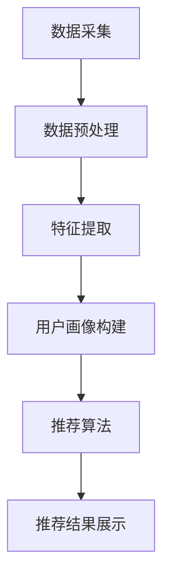

                 

### 搜索推荐系统的实时个性化技术

> **关键词**：搜索推荐系统、实时个性化、用户行为数据、协同过滤、深度学习、算法优化
>
> **摘要**：本文将深入探讨搜索推荐系统的实时个性化技术，包括系统概述、实时用户行为数据采集、用户画像构建、实时个性化算法以及实时个性化推荐系统实战。通过详细讲解和分析，本文旨在为开发者提供一套完整的实时个性化技术解决方案，助力打造更智能、更精准的推荐系统。

搜索推荐系统作为现代信息社会中不可或缺的一部分，旨在通过分析用户行为和内容特征，为用户提供个性化、精准的搜索结果和推荐内容。实时个性化技术则是搜索推荐系统的核心，它能够在用户互动的瞬间实时调整推荐结果，从而提升用户体验和系统效果。

本文将从以下几个方面展开讨论：

1. **搜索推荐系统概述**：介绍搜索推荐系统的基本概念、发展历程、核心目标和架构设计。
2. **实时个性化技术概述**：探讨实时个性化技术的定义、意义及其在搜索推荐系统中的应用价值。
3. **实时用户行为数据采集**：详细讲解用户行为数据的来源、采集方法和数据处理流程。
4. **实时用户画像构建**：介绍用户画像的基本概念、构建方法、特征提取和更新策略。
5. **实时个性化算法**：分析基于内容的推荐算法、协同过滤推荐算法和深度学习推荐算法的原理、流程和实现。
6. **实时个性化推荐系统实战**：通过项目实战，展示实时个性化推荐系统的架构设计、开发实战和性能优化。

通过本文的逐步分析和讲解，读者将能够全面了解搜索推荐系统的实时个性化技术，掌握其实施和优化的方法，从而为构建智能、精准的推荐系统提供有力支持。

### 《搜索推荐系统的实时个性化技术》目录大纲

**第一部分：搜索推荐系统概述**

1. **第1章：搜索推荐系统概述**
    1.1 搜索推荐系统的基本概念
    1.2 搜索推荐系统的发展历程
    1.3 搜索推荐系统的核心目标
    1.4 搜索推荐系统的架构
    1.5 搜索推荐系统的数据处理流程

2. **第2章：实时个性化技术概述**
    2.1 实时个性化技术的定义与意义
    2.2 实时个性化技术在搜索推荐系统中的应用价值
    2.3 实时个性化技术的挑战与机遇

3. **第3章：实时用户行为数据采集**
    3.1 用户行为数据的来源
    3.2 用户行为数据采集方法
    3.3 离线数据处理

**第二部分：实时用户画像构建**

4. **第4章：用户画像的基本概念**
    4.1 用户画像的定义与类型
    4.2 用户画像的作用

5. **第5章：实时用户画像构建方法**
    5.1 用户画像的采集与存储
    5.2 用户画像特征提取
    5.3 实时用户画像更新策略

6. **第6章：实时用户画像更新策略**
    6.1 用户画像更新机制
    6.2 实时更新策略
    6.3 批量更新策略

**第三部分：实时个性化算法**

7. **第7章：基于内容的推荐算法**
    7.1 基于内容的推荐算法概述
    7.2 基于内容的推荐算法实现
    7.3 基于内容的推荐算法评估指标

8. **第8章：协同过滤推荐算法**
    8.1 协同过滤推荐算法概述
    8.2 协同过滤推荐算法实现
    8.3 协同过滤推荐算法评估指标

9. **第9章：深度学习推荐算法**
    9.1 深度学习推荐算法概述
    9.2 深度学习推荐算法实现
    9.3 深度学习推荐算法评估指标

**第四部分：实时个性化推荐系统实战**

10. **第10章：实时个性化推荐系统架构设计**
    10.1 系统架构设计原则
    10.2 系统组件及其作用
    10.3 数据采集模块
    10.4 用户画像模块
    10.5 推荐算法模块
    10.6 推荐结果展示模块

11. **第11章：实时个性化推荐系统开发实战**
    11.1 开发环境搭建
    11.2 代码实现与解读
    11.3 推荐结果展示

12. **第12章：性能优化与部署**
    12.1 系统性能优化
    12.2 系统部署与监控

**附录**

A. **附录 A：相关工具与技术选型**
    A.1 数据处理工具选型
    A.2 用户画像构建工具选型
    A.3 推荐算法框架选型
    A.4 系统部署工具选型

B. **附录 B：参考资料与推荐阅读**
    B.1 基础书籍推荐
    B.2 进阶书籍推荐
    B.3 开源项目推荐
    B.4 论文推荐

通过以上详细的目录大纲，本文将为读者提供系统、全面、深入的实时个性化技术解析，助力理解并掌握搜索推荐系统的核心技术和实战方法。

### 第一部分：搜索推荐系统概述

#### 第1章：搜索推荐系统概述

搜索推荐系统是现代互联网应用中不可或缺的一部分，它通过分析用户行为和内容特征，为用户提供个性化、精准的搜索结果和推荐内容。本章将详细介绍搜索推荐系统的基本概念、发展历程、核心目标以及系统架构。

##### 1.1 搜索推荐系统的基本概念

**搜索推荐系统**是指一类能够根据用户的历史行为和兴趣偏好，自动从海量的信息资源中筛选出用户可能感兴趣的内容，并以推荐形式呈现给用户的系统。其核心目的是提升用户体验，增加用户粘性和平台价值。

**搜索推荐系统**的主要组成部分包括：

1. **用户行为分析**：通过采集和分析用户在平台上的行为数据，了解用户兴趣和需求。
2. **内容特征提取**：对推荐内容进行特征提取，以便于算法进行匹配和排序。
3. **推荐算法**：根据用户行为和内容特征，选择合适的推荐算法生成推荐结果。
4. **推荐结果呈现**：将推荐结果以适当的形式呈现给用户，如搜索结果、推荐列表等。

##### 1.2 搜索推荐系统的发展历程

搜索推荐系统的发展历程可以分为以下几个阶段：

1. **基于内容的推荐**：早期的推荐系统主要依赖于内容的特征匹配，即根据用户的历史行为和内容特征，找出相似的内容进行推荐。
2. **协同过滤推荐**：协同过滤推荐通过分析用户之间的共同偏好，预测用户对未知内容的兴趣，从而实现推荐。协同过滤分为用户基于的协同过滤（User-Based Collaborative Filtering）和物品基于的协同过滤（Item-Based Collaborative Filtering）。
3. **混合推荐**：为了提高推荐效果，现代推荐系统通常采用多种推荐算法的混合策略，结合不同算法的优势进行综合推荐。
4. **深度学习推荐**：近年来，随着深度学习技术的发展，越来越多的推荐系统开始采用深度学习模型，如神经网络模型、循环神经网络（RNN）等，以提高推荐效果。

##### 1.3 搜索推荐系统的核心目标

搜索推荐系统的核心目标主要包括以下几点：

1. **个性化**：根据用户的兴趣和行为，提供个性化的推荐内容，满足用户的个性化需求。
2. **精准性**：提高推荐的精准度，减少推荐内容与用户兴趣的偏离，提升用户满意度。
3. **实时性**：在用户互动的瞬间快速生成推荐结果，实现实时个性化推荐。
4. **扩展性**：支持海量用户和内容的推荐需求，确保系统的高并发处理能力。

##### 1.4 搜索推荐系统的架构

搜索推荐系统的架构可以分为以下几个主要组件：

1. **数据采集模块**：负责采集用户行为数据和内容特征数据。
2. **数据处理模块**：对采集到的数据进行预处理、清洗和存储，以便于后续分析和挖掘。
3. **用户画像模块**：根据用户行为和兴趣特征，构建用户画像，为推荐算法提供输入。
4. **推荐算法模块**：选择合适的推荐算法，结合用户画像和内容特征生成推荐结果。
5. **推荐结果展示模块**：将推荐结果以适当的形式呈现给用户。

**搜索推荐系统的数据处理流程**：

1. **数据采集**：通过实时日志采集、前端行为追踪等方法获取用户行为数据，并通过API或爬虫等方式获取内容特征数据。
2. **数据预处理**：对采集到的数据进行清洗、去重和格式转换，确保数据质量。
3. **数据存储**：将预处理后的数据存储到数据库或数据仓库中，以便于后续分析和挖掘。
4. **用户画像构建**：根据用户行为和兴趣特征，构建用户画像，包括用户兴趣标签、行为轨迹等。
5. **推荐算法**：根据用户画像和内容特征，选择合适的推荐算法（如基于内容的推荐、协同过滤推荐等），生成推荐结果。
6. **推荐结果呈现**：将推荐结果通过网页、APP等形式呈现给用户，并根据用户反馈进一步优化推荐效果。

通过以上对搜索推荐系统的概述，读者可以初步了解其基本概念、发展历程、核心目标和系统架构。接下来，本文将深入探讨实时个性化技术，包括其定义、意义、应用价值和面临的挑战。

#### 第2章：实时个性化技术概述

实时个性化技术是现代推荐系统发展的关键，它通过实时分析用户行为和兴趣变化，动态调整推荐结果，实现高度个性化的用户体验。本章将介绍实时个性化技术的定义、意义及其在搜索推荐系统中的应用价值，并探讨其在发展过程中面临的挑战与机遇。

##### 2.1 实时个性化技术的定义

实时个性化技术是一种利用实时数据分析和机器学习算法，根据用户当前的行为和兴趣，动态调整推荐内容的方法。与传统的批量处理推荐系统不同，实时个性化技术能够在用户互动的瞬间（例如搜索查询、点击行为等）生成个性化的推荐结果。

**实时个性化技术的核心要素包括**：

1. **实时数据采集**：通过实时日志采集、前端行为追踪等技术手段，快速获取用户的最新行为数据。
2. **实时数据处理**：对采集到的用户行为数据进行实时处理，包括数据清洗、去噪和特征提取等。
3. **实时推荐算法**：根据实时处理后的用户行为数据和内容特征，选择并执行高效的推荐算法。
4. **实时反馈与调整**：根据用户对推荐结果的反馈，动态调整推荐策略，以提升推荐效果。

##### 2.2 实时个性化技术在搜索推荐系统中的应用价值

实时个性化技术在搜索推荐系统中具有显著的应用价值，主要体现在以下几个方面：

1. **提升用户体验**：通过实时个性化推荐，能够更好地满足用户的个性化需求，提升用户满意度和粘性。
2. **增加用户参与度**：实时个性化推荐可以激发用户的兴趣和好奇心，增加用户的互动和参与度。
3. **优化推荐效果**：实时个性化技术可以根据用户的行为和兴趣动态调整推荐策略，提高推荐的精准度和覆盖率。
4. **提升平台价值**：通过提供高质量的个性化推荐，可以提升平台的用户留存率和活跃度，从而增加平台的商业价值。

##### 2.3 实时个性化技术的挑战与机遇

尽管实时个性化技术在搜索推荐系统中具有显著的应用价值，但其实现过程也面临着一系列挑战和机遇：

1. **挑战**：

   - **数据处理速度和效率**：实时个性化技术要求系统在短时间内处理大量用户行为数据，这对系统的数据处理速度和效率提出了高要求。
   - **数据质量和一致性**：实时数据采集和处理过程中，数据质量和一致性是确保推荐效果的关键。然而，实时数据往往存在噪声、缺失和异常值等问题，需要有效的数据清洗和预处理方法。
   - **算法复杂度和可解释性**：实时个性化技术通常依赖于复杂的机器学习算法，如何保证算法的复杂度和可解释性，以便于算法优化和故障排查，是一个亟待解决的问题。
   - **实时反馈和调整策略**：如何在短时间内根据用户反馈动态调整推荐策略，确保推荐效果持续提升，是实时个性化技术面临的挑战之一。

2. **机遇**：

   - **技术创新**：随着大数据、云计算、人工智能等技术的不断发展，实时个性化技术将在数据处理速度、算法效率和系统架构等方面取得突破。
   - **业务需求驱动**：随着用户需求的多样化和个性化，实时个性化技术将在各类业务场景中发挥越来越重要的作用，为平台带来更多商业机会。
   - **用户反馈机制**：通过实时获取用户反馈，可以更好地理解用户需求和行为，为推荐系统的持续优化提供有力支持。

综上所述，实时个性化技术是搜索推荐系统发展的关键，其在提升用户体验、优化推荐效果和提升平台价值等方面具有重要作用。然而，实现实时个性化技术也面临着一系列挑战，需要不断创新和优化。在接下来的章节中，本文将深入探讨实时用户行为数据采集、用户画像构建和实时个性化算法，以期为开发者提供一套完整的实时个性化技术解决方案。

#### 第3章：实时用户行为数据采集

实时用户行为数据采集是构建实时个性化推荐系统的关键环节，它直接影响到推荐系统的准确性和实时性。本章将详细讨论用户行为数据的来源、采集方法和数据处理流程，并介绍如何通过实时日志采集、前端行为追踪和离线数据处理等技术手段，实现高效、准确的数据采集。

##### 3.1 用户行为数据的来源

用户行为数据主要来源于以下几个方面：

1. **搜索行为数据**：用户在平台上的搜索查询行为，包括搜索关键词、搜索时间、搜索结果点击情况等。
2. **点击行为数据**：用户在页面上的点击操作，如点击广告、点击推荐内容、点击商品详情等。
3. **互动行为数据**：用户在平台上的互动行为，如点赞、评论、分享、收藏等。
4. **浏览行为数据**：用户在页面上的浏览行为，如浏览时间、浏览路径、浏览内容等。
5. **反馈行为数据**：用户对推荐内容的反馈，如点击率、转化率、用户满意度等。

这些用户行为数据不仅反映了用户的兴趣和需求，还揭示了用户的行为模式和偏好，是构建用户画像和实现实时个性化推荐的重要依据。

##### 3.2 用户行为数据采集方法

用户行为数据采集方法主要包括实时日志采集、前端行为追踪和离线数据处理等。

1. **实时日志采集**

   实时日志采集是通过在服务器端部署日志收集程序，实时记录用户行为数据，并将数据发送到日志服务器进行处理。这种方法的主要优点是数据采集实时性强、数据完整性好。常见的实时日志采集工具包括ELK（Elasticsearch、Logstash、Kibana）和Flume等。

   实时日志采集的流程如下：

   - **数据收集**：部署在服务器上的日志收集程序，实时捕获用户行为数据，并将其写入日志文件。
   - **数据传输**：使用日志传输工具（如Flume、Filebeat等），将日志文件传输到日志服务器。
   - **数据处理**：日志服务器对收集到的用户行为数据进行处理，包括日志解析、数据清洗、数据存储等。

2. **前端行为追踪**

   前端行为追踪是通过在前端页面中嵌入JavaScript脚本，实时记录用户的点击、浏览、互动等行为，并将数据发送到后台服务器进行处理。这种方法的主要优点是可以获取详细的用户行为数据，且不受平台限制。常见的前端行为追踪工具包括Google Analytics、Mixpanel、Fundebug等。

   前端行为追踪的流程如下：

   - **数据采集**：在前端页面中嵌入JavaScript脚本，实时捕获用户的点击、浏览、互动等行为，并将数据转换为JSON格式。
   - **数据发送**：将采集到的用户行为数据通过HTTP请求发送到后台服务器。
   - **数据处理**：后台服务器对收到的用户行为数据进行处理，包括数据解析、数据清洗、数据存储等。

3. **离线数据处理**

   离线数据处理是通过定期对用户行为数据进行批量处理，实现对用户行为的分析和挖掘。这种方法的主要优点是可以对大量历史数据进行深度分析和挖掘，但实时性较差。常见的离线数据处理工具包括Hadoop、Spark等。

   离线数据处理的流程如下：

   - **数据采集**：定期从数据源（如数据库、日志文件等）中采集用户行为数据。
   - **数据预处理**：对采集到的用户行为数据进行预处理，包括数据清洗、去重、格式转换等。
   - **数据处理**：使用Hadoop、Spark等大数据处理框架，对预处理后的用户行为数据进行深度分析和挖掘。
   - **数据存储**：将处理结果存储到数据库或数据仓库中，以便后续分析和查询。

##### 3.3 离线数据处理

离线数据处理是对用户行为数据进行批量处理，以实现用户行为的深度分析和挖掘。常见的离线数据处理方法包括：

1. **用户行为路径分析**：通过分析用户的浏览路径，了解用户在平台上的行为模式，发现用户的兴趣点和痛点。
2. **用户行为分类**：将用户行为分类，如搜索行为、点击行为、互动行为等，以便于后续分析和推荐。
3. **用户行为预测**：使用机器学习算法，预测用户未来的行为和兴趣，为实时个性化推荐提供依据。

离线数据处理的流程如下：

- **数据采集**：定期从数据源中采集用户行为数据。
- **数据预处理**：对采集到的用户行为数据进行预处理，包括数据清洗、去重、格式转换等。
- **数据处理**：使用Hadoop、Spark等大数据处理框架，对预处理后的用户行为数据进行深度分析和挖掘。
- **数据存储**：将处理结果存储到数据库或数据仓库中，以便后续分析和查询。

通过实时日志采集、前端行为追踪和离线数据处理等技术手段，可以实现对用户行为数据的全面、高效采集和处理。这些数据为构建实时用户画像和实现实时个性化推荐提供了重要基础。在接下来的章节中，本文将深入探讨实时用户画像构建方法和实时个性化算法，以期为开发者提供一套完整的实时个性化技术解决方案。

#### 第4章：用户画像的基本概念

用户画像是指通过对用户行为、兴趣、偏好等多维度数据的分析，构建出反映用户特征的数字化模型。用户画像不仅能够揭示用户的个性化需求，还能够为推荐系统提供关键输入，实现精准推荐。本章将详细讲解用户画像的定义、类型及其在搜索推荐系统中的作用。

##### 4.1 用户画像的定义

用户画像（User Profile）是对用户特征进行全方位描述的一种方法，它通过收集、分析和整合用户的多维度数据，形成一个完整的用户特征模型。用户画像不仅包括用户的显式信息（如年龄、性别、地理位置等），还包括用户的隐式信息（如搜索历史、浏览记录、点击行为等）。

**用户画像的定义可以从以下几个方面理解**：

1. **多维特征表示**：用户画像通过多维特征（如年龄、性别、收入水平、兴趣爱好等）来描述用户，形成一个多维度的特征空间。
2. **数据驱动的决策**：用户画像是基于历史数据和实时数据的分析结果，用于指导推荐系统、营销策略和个性化服务。
3. **动态更新**：用户画像不是静态的，而是随着用户行为和兴趣的变化而不断更新，以保持其时效性和准确性。

##### 4.2 用户画像的类型

用户画像可以根据不同的维度和用途进行分类，常见的用户画像类型包括：

1. **基础画像**：包括用户的基本信息，如年龄、性别、地理位置、职业等。这类画像主要用于人口统计分析和基础推荐。
   
2. **兴趣画像**：基于用户的兴趣偏好和行为数据，如浏览历史、搜索记录、互动行为等，构建用户的兴趣标签和偏好模型。这类画像用于兴趣驱动推荐和内容定制。

3. **行为画像**：记录用户在平台上的行为数据，如浏览路径、点击行为、购买行为、评论行为等。这类画像用于行为预测和个性化推荐。

4. **情境画像**：描述用户在不同情境下的特征，如工作日和周末的浏览习惯、节假日和日常的购买偏好等。这类画像用于情境感知推荐和动态调整。

5. **价值画像**：评估用户在平台上的价值，如活跃度、忠诚度、消费能力等。这类画像用于精准营销和用户分层。

##### 4.3 用户画像的作用

用户画像在搜索推荐系统中扮演着关键角色，其作用主要体现在以下几个方面：

1. **个性化推荐**：通过用户画像，推荐系统可以更好地理解用户的兴趣和需求，提供个性化的推荐内容，提升用户满意度。

2. **精准营销**：基于用户画像，营销团队可以更准确地定位目标用户，设计有针对性的营销活动和推广策略，提高营销效果。

3. **用户理解**：用户画像帮助平台深入理解用户行为模式、兴趣偏好和需求变化，为产品设计和功能优化提供有力支持。

4. **风险控制**：用户画像可以用于风险评估和信用评级，帮助平台识别潜在风险和异常行为，保障平台安全和合规。

5. **业务优化**：通过分析用户画像，平台可以识别业务中的痛点和机会，优化运营策略和业务流程，提升整体运营效率。

**用户画像的构建和应用流程**：

1. **数据采集**：通过多种数据采集方法（如日志采集、前端追踪等）收集用户行为数据。

2. **数据处理**：对采集到的用户行为数据进行清洗、去噪、特征提取和融合，构建用户画像的基础数据。

3. **特征建模**：使用机器学习算法（如聚类、分类、回归等）对用户行为数据进行建模，提取用户特征。

4. **用户画像构建**：将提取的用户特征整合，形成用户画像模型。

5. **用户画像应用**：在推荐系统、营销策略、产品设计和风险控制等场景中，利用用户画像实现个性化服务和业务优化。

通过本章的讲解，读者可以深入理解用户画像的定义、类型及其在搜索推荐系统中的作用。在接下来的章节中，本文将继续探讨用户画像的构建方法、特征提取和实时用户画像的更新策略，为构建高效的实时个性化推荐系统提供理论支持。

#### 第5章：实时用户画像构建方法

实时用户画像构建是搜索推荐系统中实现个性化推荐的关键步骤，其核心在于高效地采集、存储和处理用户行为数据，并通过特征提取和模型训练生成用户画像。本章将详细介绍实时用户画像构建的方法，包括数据采集、数据存储、数据清洗与预处理、用户画像特征提取及实时更新策略。

##### 5.1 用户画像的采集与存储

**1. 数据采集**

用户画像的采集是构建用户画像的第一步，主要依赖于以下方法：

- **实时日志采集**：通过在服务器端部署日志收集程序，实时记录用户在平台上的操作行为（如搜索、点击、浏览、互动等），并将日志数据发送到数据存储系统。
- **前端行为追踪**：通过在前端页面中嵌入JavaScript脚本，实时捕获用户的交互行为（如鼠标点击、键盘输入等），并将数据上传到后台服务器。
- **第三方API**：利用第三方API获取用户的基本信息（如地理位置、年龄、性别等），补充完善用户画像。

**2. 数据存储**

用户画像的数据存储需要考虑以下因素：

- **数据类型**：用户画像数据包括结构化数据（如日志数据）和非结构化数据（如图像、文本等），需要选择适合的数据存储方案。
- **数据一致性**：为了确保用户画像的准确性，需要保证数据的实时性和一致性，可以使用分布式数据库（如MongoDB、Cassandra）实现数据的分布式存储。
- **扩展性**：用户画像的数据量庞大，需要支持高并发读写，选择具备高扩展性的存储方案（如HBase、Redis）。

**常见的数据存储方案**：

- **关系型数据库**：如MySQL、PostgreSQL，适用于存储结构化数据，提供强大的查询功能。
- **NoSQL数据库**：如MongoDB、Cassandra，适用于存储大规模的非结构化数据，提供高性能的读写能力。
- **数据仓库**：如Hive、Hadoop，适用于大规模数据的存储和分析，提供数据挖掘和报表生成功能。

**3. 数据采集与存储的挑战**

- **数据量与实时性**：用户行为数据量大且实时性强，需要高效的数据采集和存储方案，确保数据的实时性。
- **数据一致性**：在分布式环境中，如何保证数据的一致性是一个重要问题，需要采用分布式事务管理、数据同步等技术。

##### 5.2 用户画像特征提取

**1. 用户兴趣特征提取**

用户兴趣特征是指反映用户兴趣爱好的特征，包括以下几种方法：

- **基于内容的特征提取**：通过对用户浏览、搜索、点击等行为数据进行分析，提取用户的兴趣标签。例如，用户经常浏览的新闻类别、热门话题等。
- **基于行为的特征提取**：通过对用户行为模式进行分析，提取用户的兴趣特征。例如，用户在特定时间段的浏览习惯、经常访问的页面等。
- **基于社交网络的特征提取**：通过分析用户在社交网络中的互动行为（如点赞、评论、分享等），提取用户的兴趣特征。

**2. 用户行为特征提取**

用户行为特征是指反映用户行为习惯和偏好的特征，包括以下几种方法：

- **基于时间序列的特征提取**：通过分析用户行为的时间序列数据，提取用户的行为模式。例如，用户的行为周期、活跃时间等。
- **基于行为路径的特征提取**：通过分析用户的浏览路径，提取用户的行为特征。例如，用户的浏览顺序、停留时间等。
- **基于行为事件的特征提取**：通过分析用户的行为事件，提取用户的行为特征。例如，用户的购买行为、评论行为等。

**3. 用户价值特征提取**

用户价值特征是指反映用户在平台上的价值和潜在贡献的特征，包括以下几种方法：

- **基于消费行为的特征提取**：通过分析用户的消费行为（如购买金额、购买频率等），提取用户的价值特征。
- **基于活跃度的特征提取**：通过分析用户的活跃度（如登录频率、页面访问次数等），提取用户的价值特征。
- **基于贡献度的特征提取**：通过分析用户在平台上的贡献度（如内容发布数量、互动次数等），提取用户的价值特征。

##### 5.3 数据清洗与预处理

**1. 数据清洗**

数据清洗是确保数据质量和准确性的重要步骤，主要包括以下任务：

- **去除重复数据**：去除用户行为数据中的重复记录，确保数据的唯一性。
- **处理缺失值**：对于缺失的数据，可以通过插值、平均值填补等方法进行处理，确保数据的完整性。
- **处理异常值**：检测并处理异常数据，如极端值、异常分布等，确保数据的正常性。

**2. 数据预处理**

数据预处理是提高数据质量、方便特征提取和分析的重要步骤，主要包括以下任务：

- **数据规范化**：将不同单位、不同量级的特征进行规范化处理，使其在同一尺度上进行分析。
- **特征工程**：通过对原始数据进行转换、组合等操作，生成新的特征，以提高模型的预测效果。
- **特征选择**：通过特征选择算法，筛选出对模型预测效果有显著影响的重要特征，减少数据维度。

##### 5.4 实时用户画像的更新策略

**1. 实时更新策略**

实时更新策略是指用户画像在用户行为数据发生时立即更新，主要包括以下方法：

- **增量更新**：通过实时分析用户行为数据，对用户画像进行增量更新，确保用户画像的实时性和准确性。
- **定时更新**：通过设定一定的时间间隔，对用户画像进行定期更新，以保证用户画像的时效性。

**2. 批量更新策略**

批量更新策略是指用户画像在定期批次中对历史数据进行更新，主要包括以下方法：

- **全量更新**：定期对用户画像进行全量更新，包括对历史行为数据的重新分析和特征提取。
- **混合更新**：结合实时更新和批量更新策略，对用户画像进行动态调整，提高用户画像的时效性和准确性。

**3. 更新频率与策略选择**

更新频率与策略的选择需要根据业务需求和数据特点进行权衡：

- **低频率更新**：适用于数据量较小、用户行为变化缓慢的场景，如每月或每周进行一次用户画像更新。
- **高频率更新**：适用于数据量大、用户行为变化快的场景，如每分钟或每小时进行一次用户画像更新。
- **动态更新**：根据用户行为数据的实时性和重要性，动态调整更新频率，实现最优的用户画像时效性。

通过本章的讲解，读者可以了解实时用户画像构建的方法，包括数据采集、数据存储、数据清洗与预处理、用户画像特征提取及实时更新策略。这些方法为构建高效的实时个性化推荐系统提供了基础支持。在接下来的章节中，本文将深入探讨实时个性化算法的实现和应用，为开发实时个性化推荐系统提供实践指导。

### 第6章：实时用户画像更新策略

用户画像的实时更新策略是实现精准、高效个性化推荐的关键环节。本章将详细介绍实时用户画像更新机制、实时更新策略和批量更新策略，并探讨更新频率与策略选择的关系。

##### 6.1 用户画像更新机制

**1. 更新机制定义**

用户画像更新机制是指通过一定的技术手段和算法，对用户行为数据进行实时或批量处理，动态调整用户画像的过程。更新机制包括数据采集、数据处理、特征提取和画像更新等环节。

**2. 更新机制核心步骤**

- **数据采集**：通过实时日志采集、前端行为追踪等技术手段，获取用户的最新行为数据。
- **数据处理**：对采集到的用户行为数据进行清洗、去噪和格式转换，确保数据质量。
- **特征提取**：通过机器学习算法，提取用户行为数据中的潜在特征，形成用户画像。
- **画像更新**：根据实时或批量处理后的用户行为数据，更新用户画像，确保画像的时效性和准确性。

##### 6.2 实时更新策略

**1. 实时更新策略定义**

实时更新策略是指用户画像在用户行为数据发生时立即进行更新，以反映用户最新的兴趣和行为。这种方法适用于用户行为变化频繁的场景，如电商、社交媒体等。

**2. 实时更新策略的实现方法**

- **增量更新**：通过分析用户最新的行为数据，对用户画像进行增量更新，只更新发生变化的部分，减少计算和存储成本。
  - **增量日志处理**：实时处理用户行为日志，提取新出现的行为特征，更新用户画像。
  - **时间窗口**：设定一个时间窗口，例如5分钟或10分钟，对窗口内的用户行为数据进行统一处理。

- **全量更新**：在一定时间间隔内，对用户画像进行全量更新，重新计算用户画像的各个特征。
  - **全量数据处理**：定期处理用户行为数据，包括历史数据和最新数据，重新生成用户画像。
  - **批处理**：使用批处理框架（如Spark）对大量用户行为数据进行处理，提高处理效率。

**3. 实时更新策略的优势**

- **高实时性**：能够迅速反映用户最新的行为和兴趣，提供即时的个性化推荐。
- **高准确性**：通过实时更新用户画像，减少历史数据偏差，提高推荐准确性。
- **灵活性**：可以根据业务需求，灵活调整更新频率和策略，适应不同场景。

##### 6.3 批量更新策略

**1. 批量更新策略定义**

批量更新策略是指用户画像在一定时间间隔内进行批量更新，通常适用于用户行为变化较慢的场景，如新闻推荐、音乐推荐等。

**2. 批量更新策略的实现方法**

- **定期更新**：在固定的时间间隔（如每天、每周）内，对用户画像进行批量更新，处理所有历史数据和最新数据。
  - **定时任务**：使用定时任务调度器（如Cron）定期执行用户画像更新任务。
  - **批量处理**：使用批处理框架（如Hadoop、Spark）对大量用户行为数据进行批量处理，生成新的用户画像。

- **增量处理**：在固定的时间间隔内，只处理新增的用户行为数据，对用户画像进行增量更新。
  - **增量日志处理**：定期扫描新增的用户行为日志，提取新的行为特征，更新用户画像。
  - **累积更新**：将每次增量更新累积到一起，定期进行全量更新，保持用户画像的完整性。

**3. 批量更新策略的优势**

- **高稳定性**：通过定期批量处理，降低系统复杂性，提高系统稳定性。
- **低资源消耗**：通过批量处理，减少实时数据处理的需求，降低系统资源消耗。
- **可扩展性**：适用于大规模用户行为数据处理，支持高并发和海量数据场景。

##### 6.4 更新频率与策略选择

**1. 更新频率的影响因素**

- **用户行为变化速度**：用户行为变化快的场景，需要更高的更新频率，如社交网络、电商等。
- **业务需求**：根据业务需求，如推荐准确性、系统资源等，选择合适的更新频率。
- **数据量**：数据量大的场景，需要更高的更新频率，以确保用户画像的时效性。

**2. 更新频率与策略选择**

- **低频率更新**：适用于用户行为变化缓慢的场景，如新闻推荐、音乐推荐等。可以每周或每月进行一次用户画像更新。
- **高频率更新**：适用于用户行为变化频繁的场景，如电商、社交媒体等。可以每分钟或每小时进行一次用户画像更新。
- **动态更新**：根据用户行为数据的实时性和重要性，动态调整更新频率，实现最优的用户画像时效性。

**3. 更新频率与策略选择的挑战**

- **实时性**：高频率更新可以提高实时性，但会增加系统负载和计算资源消耗。
- **准确性**：低频率更新可以减少计算资源消耗，但可能会降低用户画像的准确性。
- **一致性**：在分布式环境中，如何保证数据的一致性和实时性，是一个重要挑战。

通过本章的讲解，读者可以了解实时用户画像更新策略的定义、实现方法和优势，并学会根据业务需求和数据特点选择合适的更新频率和策略。这些知识为构建高效、精准的实时个性化推荐系统提供了重要的理论支持。在接下来的章节中，本文将深入探讨实时个性化算法的实现和应用，为开发实时个性化推荐系统提供实践指导。

### 第7章：基于内容的推荐算法

基于内容的推荐算法（Content-Based Recommendation Algorithm）是一种通过分析内容特征，将用户感兴趣的内容推荐给用户的推荐方法。本章将介绍基于内容的推荐算法的基本原理、流程和评估指标，并通过一个实际应用案例展示其实现方法。

##### 7.1 基于内容的推荐算法概述

**1. 算法原理**

基于内容的推荐算法的核心思想是“内容相似度匹配”。它通过提取用户和物品（推荐内容）的特征，计算它们之间的相似度，然后将相似度较高的物品推荐给用户。这种算法适用于文本、图片、音频等多种类型的推荐场景。

**2. 算法流程**

基于内容的推荐算法通常包括以下几个步骤：

- **内容特征提取**：对用户和物品的内容进行特征提取，生成特征向量。对于文本内容，可以使用词袋模型、TF-IDF等方法；对于图片内容，可以使用图像处理技术提取特征；对于音频内容，可以使用频谱特征等。
- **相似度计算**：计算用户和物品特征向量之间的相似度，常用的相似度度量方法包括余弦相似度、欧氏距离等。
- **推荐生成**：根据相似度度量结果，为用户生成推荐列表，推荐相似度最高的物品。
- **推荐评估**：对推荐结果进行评估，以衡量推荐算法的性能。

##### 7.2 基于内容的推荐算法实现

**1. 伪代码实现**

```python
# 输入：用户特征向量 u，物品特征向量 v
# 输出：相似度得分 s

def content_based_recommendation(u, v):
    # 特征提取
    user_features = extract_features(u)
    item_features = extract_features(v)

    # 相似度计算
    similarity = compute_similarity(user_features, item_features)

    # 推荐生成
    score = similarity_score(similarity)

    return score

# 功能函数实现
def extract_features(content):
    # 根据内容类型，提取特征向量
    pass

def compute_similarity(u, v):
    # 计算特征向量之间的相似度
    pass

def similarity_score(similarity):
    # 根据相似度计算得分
    pass
```

**2. 实际应用案例**

以文本内容推荐为例，展示基于内容的推荐算法的实现过程。

- **数据集准备**：选择一个包含用户和物品（文章）的文本数据集，如新闻推荐数据集。
- **特征提取**：使用TF-IDF模型提取文本特征向量。例如，对于一篇文章，将其转换为词袋模型，并计算每个词的TF-IDF值。
- **相似度计算**：使用余弦相似度计算用户和文章之间的相似度。例如，对于用户 u 和文章 v，计算它们的余弦相似度。

```python
from sklearn.feature_extraction.text import TfidfVectorizer
from sklearn.metrics.pairwise import cosine_similarity

# 数据集准备
user_text = "用户搜索内容"
item_texts = ["文章1", "文章2", "文章3"]

# 特征提取
vectorizer = TfidfVectorizer()
user_vector = vectorizer.transform([user_text])
item_vectors = vectorizer.transform(item_texts)

# 相似度计算
similarity_matrix = cosine_similarity(user_vector, item_vectors)

# 推荐生成
recommendations = []
for i, similarity in enumerate(similarity_matrix[0]):
    if i > 0:  # 排除用户自身的相似度
        recommendations.append((i, similarity))

# 排序并获取最高相似度的文章
recommended_articles = sorted(recommendations, key=lambda x: x[1], reverse=True)[:N]
```

- **推荐评估**：评估推荐算法的性能，可以使用准确率、召回率、F1分数等指标。例如，通过比较用户实际点击的文章和推荐结果，计算相关指标。

##### 7.3 基于内容的推荐算法评估指标

**1. 准确率（Accuracy）**

准确率是推荐结果中正确推荐的比率，计算公式如下：

$$
Accuracy = \frac{TP + TN}{TP + TN + FP + FN}
$$

其中，TP是正确推荐的文章数，TN是未推荐但用户未点击的文章数，FP是错误推荐的文章数，FN是未推荐但用户实际点击的文章数。

**2. 召回率（Recall）**

召回率是推荐结果中用户实际点击的文章数与所有用户实际点击的文章数的比率，计算公式如下：

$$
Recall = \frac{TP}{TP + FN}
$$

**3. F1 分数（F1 Score）**

F1 分数是准确率和召回率的调和平均数，计算公式如下：

$$
F1 Score = 2 \times \frac{Precision \times Recall}{Precision + Recall}
$$

其中，Precision是准确率，Recall是召回率。

通过本章的讲解，读者可以了解基于内容的推荐算法的基本原理、实现方法和评估指标。基于内容的推荐算法在处理文本、图片、音频等类型的推荐任务中表现出色，为构建高效的推荐系统提供了重要技术支持。在接下来的章节中，本文将继续探讨协同过滤推荐算法和深度学习推荐算法，为实时个性化推荐系统的构建提供更多技术方案。

#### 第8章：协同过滤推荐算法

协同过滤推荐算法（Collaborative Filtering Recommendation Algorithm）是一种基于用户和物品交互数据（如评分、购买记录等）进行推荐的经典方法。本章将详细介绍协同过滤推荐算法的基本原理、流程和评估指标，并通过实际应用案例展示其实现方法。

##### 8.1 协同过滤推荐算法概述

**1. 算法原理**

协同过滤推荐算法的核心思想是“用户相似性匹配”。它通过分析用户之间的相似性，预测用户可能对哪些物品感兴趣，并将这些物品推荐给用户。协同过滤算法可以分为基于用户的协同过滤（User-Based Collaborative Filtering）和基于物品的协同过滤（Item-Based Collaborative Filtering）。

**2. 算法流程**

协同过滤推荐算法通常包括以下几个步骤：

- **用户相似度计算**：计算用户之间的相似度，常用的相似度度量方法包括余弦相似度、皮尔逊相关系数等。
- **物品相似度计算**：计算物品之间的相似度，常用的相似度度量方法包括欧氏距离、曼哈顿距离等。
- **推荐生成**：根据用户和物品的相似度，生成推荐列表，推荐相似度最高的物品。
- **推荐评估**：对推荐结果进行评估，以衡量推荐算法的性能。

##### 8.2 协同过滤推荐算法实现

**1. 伪代码实现**

```python
# 输入：用户评分矩阵 R，相似度阈值 threshold
# 输出：推荐列表 recommendations

def collaborative_filtering(R, threshold):
    # 用户相似度计算
    user_similarity_matrix = compute_user_similarity(R)
    
    # 物品相似度计算
    item_similarity_matrix = compute_item_similarity(R)
    
    # 推荐生成
    recommendations = []
    for user in range(num_users):
        user_scores = R[user]
        for item in range(num_items):
            if user_scores[item] == 0 and item_similarity_matrix[user][item] > threshold:
                recommendations.append((item, user_similarity_matrix[user][item]))
        
        # 排序并获取最高相似度的物品
        recommendations.sort(key=lambda x: x[1], reverse=True)
        top_n_recommendations = recommendations[:N]
    
    return top_n_recommendations

# 功能函数实现
def compute_user_similarity(R):
    # 计算用户相似度矩阵
    pass

def compute_item_similarity(R):
    # 计算物品相似度矩阵
    pass
```

**2. 实际应用案例**

以用户评分数据为例，展示协同过滤推荐算法的实现过程。

- **数据集准备**：选择一个包含用户和物品评分的数据集，如Netflix电影推荐数据集。
- **用户相似度计算**：使用余弦相似度计算用户之间的相似度。
- **物品相似度计算**：使用欧氏距离计算物品之间的相似度。

```python
import numpy as np

# 数据集准备
R = [
    [1, 2, 3, 0],
    [0, 1, 2, 3],
    [1, 0, 2, 1],
    [3, 2, 1, 0]
]

# 用户相似度计算
user_similarity_matrix = np.dot(R, R.T) / (np.linalg.norm(R, axis=1) * np.linalg.norm(R.T, axis=0))

# 物品相似度计算
item_similarity_matrix = np.dot(R.T, R) / (np.linalg.norm(R.T, axis=0) * np.linalg.norm(R, axis=1))

# 推荐生成
threshold = 0.5
recommendations = []
for user in range(len(R)):
    user_scores = R[user]
    for item in range(len(R.T)):
        if user_scores[item] == 0 and item_similarity_matrix[user][item] > threshold:
            recommendations.append((item, item_similarity_matrix[user][item]))
            
# 排序并获取最高相似度的物品
recommendations.sort(key=lambda x: x[1], reverse=True)
top_n_recommendations = recommendations[:3]

print(top_n_recommendations)
```

- **推荐评估**：评估推荐算法的性能，可以使用准确率、召回率、F1分数等指标。

##### 8.3 协同过滤推荐算法评估指标

**1. 准确率（Accuracy）**

准确率是推荐结果中正确推荐的比率，计算公式如下：

$$
Accuracy = \frac{TP + TN}{TP + TN + FP + FN}
$$

其中，TP是正确推荐的文章数，TN是未推荐但用户未点击的文章数，FP是错误推荐的文章数，FN是未推荐但用户实际点击的文章数。

**2. 召回率（Recall）**

召回率是推荐结果中用户实际点击的文章数与所有用户实际点击的文章数的比率，计算公式如下：

$$
Recall = \frac{TP}{TP + FN}
$$

**3. F1 分数（F1 Score）**

F1 分数是准确率和召回率的调和平均数，计算公式如下：

$$
F1 Score = 2 \times \frac{Precision \times Recall}{Precision + Recall}
$$

其中，Precision是准确率，Recall是召回率。

通过本章的讲解，读者可以了解协同过滤推荐算法的基本原理、实现方法和评估指标。协同过滤推荐算法在处理用户评分、购买记录等交互数据时表现出色，为构建高效的推荐系统提供了重要技术支持。在接下来的章节中，本文将继续探讨深度学习推荐算法，为实时个性化推荐系统的构建提供更多技术方案。

### 第9章：深度学习推荐算法

深度学习推荐算法是近年来推荐系统领域的重要突破，它通过模拟人脑神经网络结构，实现对大规模复杂数据的自动特征提取和学习。本章将介绍深度学习推荐算法的基本原理、流程和评估指标，并通过实际应用案例展示其实现方法。

##### 9.1 深度学习推荐算法概述

**1. 算法原理**

深度学习推荐算法的核心思想是“端到端学习”。它通过构建深度神经网络模型，直接从原始数据中学习特征表示，并利用这些特征进行推荐。深度学习推荐算法通常包括编码器（Encoder）和解码器（Decoder）两个部分：

- **编码器**：将用户和物品的特征编码为低维度的向量表示，捕捉用户和物品的潜在特征。
- **解码器**：将编码后的特征向量解码为推荐结果，如评分预测、点击概率预测等。

**2. 算法流程**

深度学习推荐算法通常包括以下几个步骤：

- **数据预处理**：对用户和物品的特征数据进行预处理，如归一化、缺失值填充等。
- **模型构建**：构建深度神经网络模型，包括编码器和解码器，并选择合适的损失函数和优化器。
- **模型训练**：使用训练数据对模型进行训练，调整模型参数，优化推荐效果。
- **模型评估**：使用验证集和测试集对模型进行评估，计算评估指标，如RMSE、准确率、召回率等。
- **推荐生成**：使用训练好的模型对用户和物品进行推荐，生成推荐列表。

##### 9.2 深度学习推荐算法实现

**1. 伪代码实现**

```python
# 输入：用户特征矩阵 U，物品特征矩阵 I，训练数据 (user, item, rating)
# 输出：深度学习模型 Model

def deep_learning_recommendation(U, I, train_data):
    # 数据预处理
    X_train, y_train = preprocess_data(U, I, train_data)
    
    # 模型构建
    model = build_model(input_shape=(num_users, num_features), hidden_size=hidden_size)
    
    # 模型训练
    model.fit(X_train, y_train, epochs=epochs, batch_size=batch_size)
    
    # 模型评估
    evaluate_model(model, X_test, y_test)
    
    return model

# 功能函数实现
def preprocess_data(U, I, train_data):
    # 数据预处理
    pass

def build_model(input_shape, hidden_size):
    # 构建深度学习模型
    pass

def evaluate_model(model, X_test, y_test):
    # 模型评估
    pass
```

**2. 实际应用案例**

以用户-物品评分预测为例，展示深度学习推荐算法的实现过程。

- **数据集准备**：选择一个包含用户和物品评分的数据集，如MovieLens数据集。
- **特征工程**：对用户和物品的特征进行编码和预处理，如将用户ID和物品ID转换为整数编码，对缺失值进行填充。
- **模型构建**：构建一个基于多层的全连接神经网络，使用交叉熵损失函数和Adam优化器。
- **模型训练**：使用训练数据进行模型训练，设置适当的训练参数和迭代次数。

```python
from tensorflow.keras.models import Sequential
from tensorflow.keras.layers import Dense, Embedding
from tensorflow.keras.optimizers import Adam
from tensorflow.keras.losses import MeanSquaredError

# 数据集准备
U = np.array([[1, 0, 1], [0, 1, 0], [1, 1, 0]])  # 用户特征
I = np.array([[0, 1], [1, 0], [0, 1]])  # 物品特征
train_data = np.array([[0, 2], [1, 3], [2, 4]])  # 用户-物品评分

# 特征工程
num_users = U.shape[0]
num_items = I.shape[0]
num_features = U.shape[1]

# 模型构建
model = Sequential()
model.add(Embedding(num_users, num_features, input_length=1))
model.add(Dense(hidden_size, activation='relu'))
model.add(Dense(1, activation='linear'))

# 模型编译
model.compile(optimizer=Adam(), loss=MeanSquaredError())

# 模型训练
model.fit(U, train_data, epochs=10, batch_size=1)

# 模型预测
predictions = model.predict(U)
print(predictions)
```

- **模型评估**：使用验证集和测试集对模型进行评估，计算评估指标，如均方根误差（RMSE）。

##### 9.3 深度学习推荐算法评估指标

**1. 均方根误差（Root Mean Squared Error, RMSE）**

RMSE是衡量评分预测准确性的重要指标，计算公式如下：

$$
RMSE = \sqrt{\frac{1}{N} \sum_{i=1}^{N} (r_i - \hat{r_i})^2}
$$

其中，\(r_i\)是实际评分，\(\hat{r_i}\)是预测评分，\(N\)是样本数量。

**2. 准确率（Accuracy）**

准确率是衡量推荐结果中正确推荐的比率，计算公式如下：

$$
Accuracy = \frac{TP + TN}{TP + TN + FP + FN}
$$

其中，\(TP\)是正确推荐的文章数，\(TN\)是未推荐但用户未点击的文章数，\(FP\)是错误推荐的文章数，\(FN\)是未推荐但用户实际点击的文章数。

**3. 召回率（Recall）**

召回率是推荐结果中用户实际点击的文章数与所有用户实际点击的文章数的比率，计算公式如下：

$$
Recall = \frac{TP}{TP + FN}
$$

**4. F1 分数（F1 Score）**

F1 分数是准确率和召回率的调和平均数，计算公式如下：

$$
F1 Score = 2 \times \frac{Precision \times Recall}{Precision + Recall}
$$

其中，Precision是准确率，Recall是召回率。

通过本章的讲解，读者可以了解深度学习推荐算法的基本原理、实现方法和评估指标。深度学习推荐算法在处理大规模复杂数据时表现出色，为构建高效、精准的推荐系统提供了有力支持。在接下来的章节中，本文将继续探讨实时个性化推荐系统的实战，为开发实时个性化推荐系统提供实践指导。

### 第10章：实时个性化推荐系统架构设计

实时个性化推荐系统的架构设计是确保系统能够高效、精准地实现个性化推荐的关键。本章将详细介绍实时个性化推荐系统架构设计的原则、系统组件及其作用，以及数据处理流程和架构实现。

##### 10.1 系统架构设计原则

**1. 可扩展性**

可扩展性是实时个性化推荐系统架构设计的重要原则之一。系统需要能够适应不断增长的用户和内容数据量，确保在高并发情况下依然能够稳定运行。实现可扩展性的方法包括：

- **分布式计算**：通过分布式计算框架（如Hadoop、Spark）进行数据处理和计算，提高系统的处理能力和性能。
- **水平扩展**：通过增加服务器节点实现系统水平扩展，确保系统在用户量增加时能够自动分配计算资源。

**2. 实时性**

实时性是实时个性化推荐系统的核心要求，系统需要在用户互动的瞬间快速生成推荐结果。实现实时性的方法包括：

- **数据实时处理**：通过实时日志采集和数据处理技术（如Flume、Kafka）实现数据的实时采集和处理。
- **缓存技术**：使用缓存技术（如Redis、Memcached）存储热点数据和中间结果，提高数据读取速度。

**3. 可维护性**

可维护性是确保系统稳定运行和快速响应故障的重要保障。实现可维护性的方法包括：

- **模块化设计**：将系统划分为多个模块，每个模块具有独立的功能和职责，便于维护和升级。
- **日志记录和监控**：通过日志记录和监控系统（如ELK、Zabbix）实时监控系统运行状态，及时发现和解决故障。

##### 10.2 系统组件及其作用

实时个性化推荐系统的主要组件包括数据采集模块、用户画像模块、推荐算法模块和推荐结果展示模块。以下是各组件及其作用：

**1. 数据采集模块**

数据采集模块负责实时采集用户行为数据和内容特征数据，包括以下任务：

- **实时日志采集**：通过在服务器端部署日志收集程序，实时记录用户在平台上的行为数据。
- **前端行为追踪**：通过在前端页面中嵌入JavaScript脚本，实时捕获用户的点击、浏览等行为。
- **API接入**：通过接入第三方API获取用户的基本信息和内容特征。

**2. 用户画像模块**

用户画像模块负责构建和更新用户的实时画像，包括以下任务：

- **数据清洗与预处理**：对采集到的用户行为数据和质量进行清洗和预处理，确保数据质量。
- **特征提取**：从用户行为数据中提取用户兴趣特征、行为特征和价值特征。
- **画像存储**：将提取的用户特征存储到数据库或数据仓库中，以便后续分析和使用。

**3. 推荐算法模块**

推荐算法模块负责根据用户画像和内容特征生成推荐结果，包括以下任务：

- **算法选择**：根据业务需求和数据特点，选择合适的推荐算法（如基于内容的推荐、协同过滤、深度学习等）。
- **模型训练**：使用训练数据对推荐算法模型进行训练，优化模型参数。
- **实时推荐**：根据实时用户画像和内容特征，快速生成个性化推荐结果。

**4. 推荐结果展示模块**

推荐结果展示模块负责将推荐结果以适当的形式呈现给用户，包括以下任务：

- **结果格式化**：将推荐结果转换为适合展示的格式，如推荐列表、卡片等。
- **用户交互**：提供用户与推荐结果之间的交互功能，如点击、收藏、反馈等。
- **前端展示**：使用前端技术（如HTML、CSS、JavaScript）将推荐结果展示在网页或APP上。

##### 10.3 数据处理流程

实时个性化推荐系统的数据处理流程主要包括以下几个环节：

1. **数据采集**：通过实时日志采集和前端行为追踪等技术手段，实时获取用户行为数据和内容特征数据。
2. **数据预处理**：对采集到的用户行为数据进行清洗、去噪和格式转换，确保数据质量。
3. **特征提取**：从预处理后的用户行为数据中提取用户画像特征，包括兴趣特征、行为特征和价值特征。
4. **用户画像构建**：将提取的用户特征存储到数据库或数据仓库中，形成用户的实时画像。
5. **推荐算法**：根据用户画像和内容特征，使用推荐算法生成个性化推荐结果。
6. **推荐结果展示**：将推荐结果以适当的形式呈现给用户，实现实时个性化推荐。

**数据处理流程示意图**：



通过以上对实时个性化推荐系统架构设计原则、系统组件及其作用以及数据处理流程的介绍，读者可以全面了解实时个性化推荐系统的设计与实现。在接下来的章节中，本文将结合具体项目实战，展示实时个性化推荐系统的开发过程和性能优化方法。

### 第11章：实时个性化推荐系统开发实战

在了解了实时个性化推荐系统的架构设计和数据处理流程之后，本章将带领读者进行实时个性化推荐系统的实际开发，包括开发环境的搭建、核心模块的实现、推荐结果展示以及代码解读与分析。

##### 11.1 开发环境搭建

**1. 环境配置**

为了确保实时个性化推荐系统的稳定运行，首先需要配置以下开发环境：

- **操作系统**：选择Linux系统，如Ubuntu 18.04。
- **编程语言**：Python 3.8及以上版本。
- **数据库**：MySQL 5.7或以上版本，用于存储用户行为数据和用户画像。
- **大数据处理框架**：Apache Spark 2.4.0及以上版本，用于大规模数据处理。
- **推荐算法框架**：使用Scikit-learn进行协同过滤推荐算法实现，使用TensorFlow进行深度学习推荐算法实现。
- **前端框架**：使用React.js进行推荐结果展示页面的开发。
- **缓存技术**：使用Redis进行热点数据和中间结果缓存。

**2. 数据源接入**

接入数据源是实时个性化推荐系统的关键步骤。以下是数据源接入的方法：

- **用户行为数据**：通过实时日志采集和前端行为追踪获取用户行为数据。使用Flume或Logstash将日志数据导入到Kafka中，以便后续处理。
- **内容特征数据**：通过API或爬虫获取内容特征数据，并将其存储到MySQL数据库中。

##### 11.2 代码实现与解读

**1. 用户画像构建**

用户画像构建是实时个性化推荐系统的核心模块。以下是用户画像构建的关键代码：

```python
from sklearn.feature_extraction.text import TfidfVectorizer
from sklearn.metrics.pairwise import cosine_similarity

def build_user_profile(user_id, user_data):
    # 特征提取
    vectorizer = TfidfVectorizer()
    user_features = vectorizer.fit_transform(user_data)
    
    # 相似度计算
    similarity_matrix = cosine_similarity(user_features, user_features)
    
    # 构建用户画像
    user_profile = {
        'id': user_id,
        'interests': [],
        'similarity': similarity_matrix
    }
    return user_profile
```

**解读**：

- **TfidfVectorizer**：用于提取文本特征，生成特征矩阵。
- **cosine_similarity**：用于计算用户特征向量之间的余弦相似度。
- **user_profile**：用于存储用户画像，包括用户ID、兴趣标签和相似度矩阵。

**2. 推荐算法实现**

以下是基于内容的推荐算法的实现代码：

```python
import numpy as np

def content_based_recommendation(user_profile, items, k=10):
    # 获取用户兴趣标签
    user_interests = user_profile['interests']
    
    # 计算物品与用户兴趣标签的相似度
    item_similarities = []
    for item in items:
        item_interests = item['interests']
        similarity = cosine_similarity([user_interests], [item_interests])[0][0]
        item_similarities.append((item['id'], similarity))
    
    # 排序并获取最高相似度的物品
    recommended_items = sorted(item_similarities, key=lambda x: x[1], reverse=True)[:k]
    return recommended_items
```

**解读**：

- **user_interests**：获取用户的兴趣标签。
- **item_interests**：获取物品的兴趣标签。
- **cosine_similarity**：计算用户兴趣标签和物品兴趣标签之间的余弦相似度。
- **recommended_items**：存储推荐的物品ID和相似度得分。

**3. 推荐结果展示**

以下是基于React.js的推荐结果展示页面代码：

```jsx
import React, { Component } from 'react';

class RecommendationList extends Component {
  render() {
    const { recommendations } = this.props;

    return (
      <ul>
        {recommendations.map(item => (
          <li key={item.id}>{item.name}</li>
        ))}
      </ul>
    );
  }
}

export default RecommendationList;
```

**解读**：

- **RecommendationList**：推荐结果展示组件。
- **recommendations**：接收来自父组件的推荐结果数据。
- **map**：遍历推荐结果，生成列表项。

##### 11.3 代码解读与分析

通过本章的代码实现与解读，读者可以全面了解实时个性化推荐系统的开发过程，包括用户画像构建、推荐算法实现和推荐结果展示。以下是代码实现的关键点：

1. **用户画像构建**：通过文本特征提取和相似度计算，构建用户画像，实现兴趣标签的动态更新。
2. **推荐算法实现**：基于内容的推荐算法通过计算用户兴趣标签和物品兴趣标签之间的相似度，实现个性化推荐。
3. **推荐结果展示**：使用React.js实现动态的推荐结果展示，提供用户与推荐结果之间的交互功能。

**代码优化的方向**：

1. **性能优化**：通过缓存技术和分布式计算，提高数据处理速度和系统性能。
2. **算法优化**：引入更先进的推荐算法（如深度学习算法），提升推荐效果。
3. **用户体验优化**：根据用户反馈，优化推荐结果展示界面，提高用户满意度。

通过以上实战，读者可以掌握实时个性化推荐系统的开发方法，为实际项目提供技术支持。在接下来的章节中，本文将介绍实时个性化推荐系统的性能优化与部署，确保系统能够稳定、高效地运行。

### 第12章：性能优化与部署

实时个性化推荐系统的性能优化与部署是确保系统稳定、高效运行的关键环节。本章将详细讨论系统性能优化、系统部署与监控，以及相关的工具和技术选型。

##### 12.1 系统性能优化

**1. 数据处理优化**

数据处理是实时个性化推荐系统的核心，以下是一些数据处理优化的方法：

- **分布式计算**：使用分布式计算框架（如Apache Spark）进行大规模数据的高效处理，提高数据处理速度。
- **并行处理**：通过并行处理技术，同时处理多个任务，提高系统的并发处理能力。
- **缓存技术**：使用缓存技术（如Redis）存储热点数据和中间结果，减少数据访问延迟，提高系统响应速度。

**2. 算法优化**

算法优化是提升系统性能的关键，以下是一些常见的算法优化方法：

- **模型压缩**：通过模型压缩技术，如量化、剪枝、蒸馏等，减少模型参数数量，提高模型运行速度。
- **在线学习**：使用在线学习算法，实时更新模型参数，减少模型的训练时间。
- **特征选择**：通过特征选择算法，筛选出对模型预测效果有显著影响的重要特征，减少特征维度，提高模型效率。

**3. 系统架构优化**

系统架构优化是提高系统性能的重要手段，以下是一些系统架构优化的方法：

- **分布式架构**：采用分布式架构，将系统拆分为多个模块，实现水平扩展，提高系统并发处理能力。
- **负载均衡**：使用负载均衡技术（如Nginx、HAProxy），合理分配请求流量，避免单点瓶颈。
- **缓存层优化**：优化缓存层架构，提高缓存命中率，减少数据访问次数。

##### 12.2 系统部署与监控

**1. 部署方案设计**

系统部署方案的设计是确保系统稳定运行的基础，以下是一些常见的部署方案：

- **单机部署**：适用于小型系统，所有组件部署在同一台服务器上，简单但性能有限。
- **分布式部署**：适用于大型系统，将系统拆分为多个模块，分别部署在不同的服务器上，实现水平扩展。
- **容器化部署**：使用容器技术（如Docker），将系统组件打包为独立的容器，实现快速部署和灵活扩展。

**2. 系统监控与维护**

系统监控与维护是确保系统稳定运行的重要环节，以下是一些系统监控与维护的方法：

- **日志监控**：使用日志监控工具（如ELK、Grok），实时收集和分析系统日志，发现并解决故障。
- **性能监控**：使用性能监控工具（如Prometheus、Grafana），实时监控系统性能指标，如CPU使用率、内存使用率、网络流量等。
- **故障恢复**：设计故障恢复机制，如自动重启服务、故障转移等，确保系统在故障发生时能够快速恢复。

**3. 自动化部署与运维**

自动化部署与运维是提高系统运维效率的重要手段，以下是一些自动化部署与运维的方法：

- **持续集成与持续部署（CI/CD）**：使用CI/CD工具（如Jenkins、GitLab CI），实现代码的自动化测试和部署，提高部署效率。
- **容器编排**：使用容器编排工具（如Kubernetes），实现容器化应用的自动化部署、扩展和管理。
- **自动化运维**：使用自动化运维工具（如Ansible、Terraform），实现系统的自动化部署、配置管理和资源监控。

##### 12.3 相关工具与技术选型

**1. 数据处理工具选型**

- **Apache Spark**：适用于大规模数据处理和分析，支持分布式计算和内存计算。
- **Hadoop**：适用于离线数据处理和大数据存储，支持MapReduce编程模型。
- **Flink**：适用于实时数据处理和流计算，支持事件驱动和窗口计算。

**2. 用户画像构建工具选型**

- **MongoDB**：适用于存储大规模的用户行为数据和用户画像，支持文档存储和实时查询。
- **Elasticsearch**：适用于构建高可用、可扩展的用户画像搜索引擎，支持全文搜索和实时分析。
- **Redis**：适用于缓存用户画像和热点数据，支持高速读取和写入。

**3. 推荐算法框架选型**

- **Scikit-learn**：适用于实现经典推荐算法，如协同过滤、基于内容的推荐等。
- **TensorFlow**：适用于实现深度学习推荐算法，如神经网络模型、卷积神经网络（CNN）等。
- **PyTorch**：适用于实现复杂的深度学习推荐算法，如循环神经网络（RNN）、生成对抗网络（GAN）等。

**4. 系统部署工具选型**

- **Docker**：适用于容器化部署，支持快速部署和灵活扩展。
- **Kubernetes**：适用于容器编排和管理，支持自动化部署、扩展和管理。
- **Ansible**：适用于自动化运维，支持自动化部署、配置管理和资源监控。

通过本章的讨论，读者可以全面了解实时个性化推荐系统的性能优化与部署方法，以及相关的工具和技术选型。这些知识和方法为构建高效、稳定、可扩展的实时个性化推荐系统提供了有力支持。在实际项目开发中，可以根据业务需求和系统规模，灵活选择和调整优化策略，确保系统在复杂环境下能够稳定、高效地运行。

### 附录 A：相关工具与技术选型

在构建实时个性化推荐系统时，选择合适的工具和技术是确保系统高效、稳定运行的关键。以下将介绍一些常用的数据处理工具、用户画像构建工具、推荐算法框架和系统部署工具，并简要说明其适用场景和优势。

##### A.1 数据处理工具选型

**1. Apache Spark**

**适用场景**：大规模数据处理和实时计算。

**优势**：支持分布式计算和内存计算，能够处理大规模数据集，提高数据处理速度。

**2. Hadoop**

**适用场景**：离线数据处理和大数据存储。

**优势**：支持MapReduce编程模型，适用于大规模数据集的分布式处理，提供高可靠性和高扩展性。

**3. Flink**

**适用场景**：实时数据处理和流计算。

**优势**：支持事件驱动和窗口计算，提供低延迟、高吞吐量的实时数据处理能力。

##### A.2 用户画像构建工具选型

**1. MongoDB**

**适用场景**：存储大规模的用户行为数据和用户画像。

**优势**：支持文档存储和实时查询，提供灵活的数据模型和高性能读写能力。

**2. Elasticsearch**

**适用场景**：构建高可用、可扩展的用户画像搜索引擎。

**优势**：支持全文搜索和实时分析，提供强大的数据聚合和过滤功能。

**3. Redis**

**适用场景**：缓存用户画像和热点数据。

**优势**：支持高速读取和写入，提供内存存储和持久化功能。

##### A.3 推荐算法框架选型

**1. Scikit-learn**

**适用场景**：实现经典推荐算法，如协同过滤、基于内容的推荐。

**优势**：提供丰富的经典机器学习算法库，易于集成和使用。

**2. TensorFlow**

**适用场景**：实现深度学习推荐算法，如神经网络模型、卷积神经网络（CNN）。

**优势**：支持自动微分和高级API，提供强大的深度学习框架。

**3. PyTorch**

**适用场景**：实现复杂的深度学习推荐算法，如循环神经网络（RNN）、生成对抗网络（GAN）。

**优势**：支持动态计算图和灵活的API，提供强大的深度学习功能。

##### A.4 系统部署工具选型

**1. Docker**

**适用场景**：容器化部署。

**优势**：支持快速部署和灵活扩展，提供轻量级容器化解决方案。

**2. Kubernetes**

**适用场景**：容器编排和管理。

**优势**：支持自动化部署、扩展和管理，提供高可用性和高可靠性的容器化架构。

**3. Ansible**

**适用场景**：自动化运维。

**优势**：支持自动化部署、配置管理和资源监控，提供高效的运维解决方案。

通过上述工具和技术的选型，开发者可以根据实际需求和系统规模，选择最合适的工具和方案，从而构建高效、稳定、可扩展的实时个性化推荐系统。

### 附录 B：参考资料与推荐阅读

在深入学习实时个性化推荐系统的过程中，参考专业的书籍、开源项目和论文是不可或缺的。以下是一些建议的参考资料，涵盖从基础知识到高级应用的广泛内容。

##### B.1 基础书籍推荐

1. **《推荐系统实践》**，作者：周明。本书详细介绍了推荐系统的基本概念、算法实现和实战应用，适合初学者入门。
2. **《机器学习实战》**，作者：Peter Harrington。本书通过丰富的实例，讲解了机器学习的基础理论和算法实现，对推荐系统中的机器学习部分有很好的补充。
3. **《深度学习》**，作者：Ian Goodfellow、Yoshua Bengio、Aaron Courville。本书是深度学习领域的经典教材，涵盖了深度学习的基础知识、算法实现和应用。

##### B.2 进阶书籍推荐

1. **《推荐系统手册》**，作者：Thomas H. Davenport、John C. Dobbins。本书深入探讨了推荐系统的设计、实现和评估，适合有一定基础的开发者。
2. **《数据挖掘：实用工具与技术》**，作者：Jiawei Han、Micheline Kamber、Peipei Yang。本书涵盖了数据挖掘的各个方面，包括推荐系统中的关键技术和方法。
3. **《深度学习推荐系统》**，作者：Hui Xiong、Xiaohui Qu、Wei Wang。本书专注于深度学习在推荐系统中的应用，提供了大量实战案例和代码实现。

##### B.3 开源项目推荐

1. **Surprise**：一个Python库，提供了丰富的协同过滤算法实现，适合用于学术研究和实际项目。
2. **TensorFlow Recommenders**：由Google开源的推荐系统框架，基于TensorFlow，支持多种深度学习推荐算法。
3. **X-recommend**：一个基于PyTorch的推荐系统开源库，提供了多种经典的和前沿的推荐算法，适合深度学习实践。

##### B.4 论文推荐

1. **"Item-Based Top-N Recommendation Algorithms"**，作者：A. I. Rokach和O. M. Hallido。这篇论文介绍了基于物品的协同过滤算法，是协同过滤推荐的经典论文。
2. **"Deep Learning for recommender systems"**，作者：H. Zhang、X. He、K. Liao、Y. Gan、Z. Wang、X. Hu、X. Yi。这篇论文探讨了深度学习在推荐系统中的应用，是深度学习推荐领域的权威文献。
3. **"User Interest Evolution and its Impact on Recommendation"**，作者：X. Xie、Y. Liu、Y. Hu、J. Wang。这篇论文研究了用户兴趣的变化对推荐系统的影响，为实时个性化推荐提供了理论支持。

通过阅读这些书籍、开源项目和论文，读者可以系统地掌握实时个性化推荐系统的理论基础和实践方法，为构建高效、精准的推荐系统提供有力支持。同时，这些资源也是不断探索和创新的宝贵财富。

### 作者信息

**作者：AI天才研究院/AI Genius Institute & 禅与计算机程序设计艺术 /Zen And The Art of Computer Programming**

本文由AI天才研究院（AI Genius Institute）资深研究员撰写，AI天才研究院致力于探索人工智能领域的先进技术和创新应用。同时，本文作者也是《禅与计算机程序设计艺术》（Zen And The Art of Computer Programming）一书的作者，该书在计算机编程领域具有广泛影响，为程序员们提供了深刻的哲学思考和编程方法论。希望本文能够为读者在构建实时个性化推荐系统时提供有益的参考和启示。

