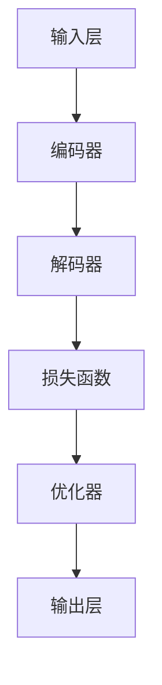
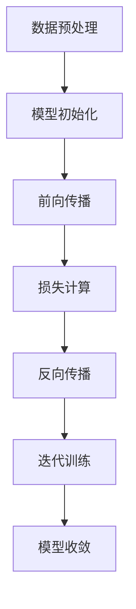

                 

## 《搜索结果多样性：大模型的新解决方案》

### 关键词：搜索结果多样性、大模型、人工智能、搜索算法、优化策略

> 在数字化时代，搜索引擎的搜索结果多样性成为用户体验的关键因素。本文将探讨大模型在搜索结果多样性方面的应用，分析其基本结构与算法，评估多样性指标，并探讨未来的发展方向。

<|assistant|>## 目录大纲

### 第一部分：搜索结果多样性概述

#### 第1章：搜索结果多样性的概念与背景
##### 1.1 搜索结果多样性的定义
##### 1.2 搜索结果多样性的重要性
##### 1.3 搜索结果多样性研究的现状与挑战

#### 第2章：大模型在搜索结果多样性中的应用
##### 2.1 大模型在搜索领域的应用概述
##### 2.2 大模型实现搜索结果多样性的原理
##### 2.3 大模型在搜索结果多样性中的优势与局限

#### 第3章：大模型的基本结构与算法
##### 3.1 大模型的基本架构
##### 3.2 大模型的训练过程
##### 3.3 大模型的关键算法

#### 第4章：搜索结果多样性的评价指标
##### 4.1 评价指标的选择原则
##### 4.2 常用评价指标详解
##### 4.3 多指标综合评价方法

### 第二部分：大模型实现搜索结果多样性的技术

#### 第5章：大模型在搜索结果多样性中的应用实践
##### 5.1 大模型在搜索结果多样性中的具体应用场景
##### 5.2 大模型在搜索结果多样性中的实践案例
##### 5.3 大模型在搜索结果多样性中的效果评估

#### 第6章：大模型优化与调整策略
##### 6.1 大模型优化目标
##### 6.2 大模型优化方法
##### 6.3 大模型调整策略

#### 第7章：大模型在搜索结果多样性中的挑战与未来方向
##### 7.1 大模型在搜索结果多样性中的挑战
##### 7.2 大模型优化与调整的前沿技术
##### 7.3 搜索结果多样性发展的未来方向

### 第三部分：附录

#### 第8章：大模型开发工具与资源
##### 8.1 大模型开发工具简介
##### 8.2 大模型开发资源推荐
##### 8.3 大模型开发实践指南

#### 第9章：核心概念与联系
##### 9.1 大模型架构流程图
##### 9.2 大模型算法原理流程图

#### 第10章：核心算法原理讲解
##### 10.1 大模型训练算法伪代码
##### 10.2 大模型优化算法伪代码

#### 第11章：数学模型与公式讲解
##### 11.1 搜索结果多样性的数学模型
##### 11.2 大模型训练中的数学公式讲解

#### 第12章：项目实战
##### 12.1 大模型开发环境搭建
##### 12.2 大模型代码实现与解读
##### 12.3 大模型代码分析与优化建议

### 作者

> 作者：AI天才研究院/AI Genius Institute & 禅与计算机程序设计艺术 /Zen And The Art of Computer Programming

<|assistant|>## 第一部分：搜索结果多样性概述

### 第1章：搜索结果多样性的概念与背景

#### 1.1 搜索结果多样性的定义

搜索结果多样性（Search Result Diversity）是指在搜索引擎结果页（Search Engine Results Page, SERP）上展示的搜索结果具有不同的类型、格式、来源和内容，从而提高用户的搜索体验和满意度。具体来说，搜索结果多样性涉及以下几个方面：

- **类型多样性**：展示不同类型的搜索结果，如文本、图片、视频、新闻、产品列表等。
- **格式多样性**：使用不同的格式展示搜索结果，如列表、卡片、瀑布流等。
- **来源多样性**：展示来自不同来源的搜索结果，如网站、博客、社交媒体、论坛等。
- **内容多样性**：展示具有不同观点、角度、深度的内容，避免重复和单一。

#### 1.2 搜索结果多样性的重要性

搜索结果多样性对搜索引擎和用户体验具有重要意义：

- **提升用户满意度**：多样化的搜索结果能够满足不同用户的需求，提高用户的满意度和忠诚度。
- **增加用户粘性**：多样化的搜索结果能够吸引用户在搜索引擎上停留更长时间，增加用户粘性。
- **降低跳出率**：多样化的搜索结果能够降低用户跳出搜索引擎的概率，提高搜索引擎的留存率。
- **提升广告效果**：多样化的搜索结果可以为广告主提供更多展示机会，提高广告效果。

#### 1.3 搜索结果多样性研究的现状与挑战

随着互联网的快速发展，搜索结果多样性已成为学术界和工业界关注的热点问题。当前，搜索结果多样性研究主要集中在以下几个方面：

- **评价指标**：研究如何评价搜索结果的多样性，如何设计合理的多样性评价指标。
- **算法优化**：研究如何通过算法优化提高搜索结果的多样性，如基于机器学习的方法、基于用户行为的方法等。
- **数据集构建**：研究如何构建具有代表性的搜索结果多样性数据集，为算法研究提供基础。
- **用户体验**：研究如何通过搜索结果多样性提升用户体验，满足用户个性化需求。

然而，当前研究仍面临一些挑战：

- **评价标准统一性**：不同研究者提出的评价指标和方法存在差异，缺乏统一的评价标准。
- **数据稀缺性**：高质量、大规模的搜索结果多样性数据集较为稀缺，限制了算法的研究和应用。
- **计算复杂度**：实现搜索结果多样性的算法往往涉及大量计算，对计算资源和时间要求较高。
- **隐私保护**：在构建和优化搜索结果多样性时，需要平衡用户隐私保护与搜索结果多样性的需求。

### 第2章：大模型在搜索结果多样性中的应用

#### 2.1 大模型在搜索领域的应用概述

大模型（Large-scale Model）是指具有大规模参数的深度学习模型，如Transformer、BERT、GPT等。大模型在搜索领域具有广泛的应用，主要表现在以下几个方面：

- **搜索引擎**：大模型可以用于构建智能搜索引擎，实现高效、精准的搜索结果。
- **语义理解**：大模型可以用于理解用户查询意图和文档内容，提高搜索结果的准确性。
- **个性化推荐**：大模型可以用于基于用户历史行为和兴趣的个性化推荐系统。
- **问答系统**：大模型可以用于构建智能问答系统，为用户提供实时、准确的答案。

#### 2.2 大模型实现搜索结果多样性的原理

大模型实现搜索结果多样性的原理主要基于以下几个方面：

- **多模态学习**：大模型可以处理多种类型的数据，如文本、图像、音频等，从而实现多类型搜索结果。
- **上下文理解**：大模型可以理解用户查询和文档的上下文信息，从而生成具有多样性的搜索结果。
- **知识图谱**：大模型可以结合知识图谱，提供具有多样性的、具有不同观点和角度的搜索结果。
- **用户行为分析**：大模型可以分析用户的历史行为和兴趣，为用户提供个性化的、具有多样性的搜索结果。

#### 2.3 大模型在搜索结果多样性中的优势与局限

大模型在搜索结果多样性中具有以下优势：

- **多类型数据支持**：大模型可以处理多种类型的数据，实现多类型搜索结果。
- **上下文理解能力**：大模型可以理解用户查询和文档的上下文信息，提高搜索结果的准确性。
- **个性化推荐能力**：大模型可以分析用户的历史行为和兴趣，提供个性化的搜索结果。
- **知识融合能力**：大模型可以结合知识图谱，提供具有多样性的、具有不同观点和角度的搜索结果。

然而，大模型在搜索结果多样性中也存在一些局限：

- **计算资源需求**：大模型训练和推理需要大量计算资源，对硬件要求较高。
- **数据隐私问题**：大模型在训练过程中需要大量用户数据，涉及用户隐私保护问题。
- **模型可解释性**：大模型的决策过程较为复杂，缺乏可解释性，不利于用户理解和信任。
- **模型偏差**：大模型在训练过程中可能引入模型偏差，影响搜索结果的公正性和客观性。

### 第3章：大模型的基本结构与算法

#### 3.1 大模型的基本架构

大模型的基本架构通常包括以下几个部分：

- **输入层**：接收用户查询和文档特征，用于输入数据的预处理。
- **编码器**：对输入数据进行编码，提取特征表示，如BERT中的Transformer编码器。
- **解码器**：对编码后的特征进行解码，生成搜索结果，如BERT中的Transformer解码器。
- **损失函数**：用于评估模型预测结果和实际结果之间的差异，如交叉熵损失函数。
- **优化器**：用于调整模型参数，优化模型性能，如Adam优化器。

#### 3.2 大模型的训练过程

大模型的训练过程主要包括以下几个步骤：

1. **数据预处理**：对训练数据进行清洗、归一化和编码等预处理操作。
2. **模型初始化**：初始化模型参数，通常采用随机初始化或预训练模型。
3. **前向传播**：将输入数据输入模型，计算预测结果。
4. **损失计算**：计算预测结果和实际结果之间的差异，得到损失值。
5. **反向传播**：根据损失值，更新模型参数，优化模型性能。
6. **迭代训练**：重复执行前向传播、损失计算和反向传播，直至模型收敛。

#### 3.3 大模型的关键算法

大模型的关键算法主要包括以下几个：

- **Transformer**：基于自注意力机制的深度神经网络，用于编码和解码任务，如BERT和GPT。
- **BERT**：基于Transformer的预训练语言模型，通过 masked language model 和 next sentence prediction 两个任务进行预训练。
- **GPT**：基于 Transformer 的预训练语言模型，通过 unsupervised learning 方法进行预训练。
- **BERT-GPT**：结合 BERT 和 GPT 的优点，用于生成搜索结果和问答系统。

### 第4章：搜索结果多样性的评价指标

#### 4.1 评价指标的选择原则

选择搜索结果多样性的评价指标时，需要遵循以下原则：

- **全面性**：评价指标应综合考虑搜索结果的类型、格式、来源和内容多样性。
- **可操作性**：评价指标应易于计算和实现，便于实际应用和优化。
- **客观性**：评价指标应尽可能客观，避免主观因素的影响。
- **可扩展性**：评价指标应具有可扩展性，能够适应未来的搜索需求。

#### 4.2 常用评价指标详解

常用的搜索结果多样性评价指标包括：

- **类型多样性（Type Diversity）**：计算搜索结果类型（文本、图片、视频等）的多样性，如：
  $$ D_T = \frac{1}{N} \sum_{i=1}^{N} \log_2(1 + p_i) $$
  其中，$p_i$ 为第 $i$ 种类型的搜索结果占比。

- **格式多样性（Format Diversity）**：计算搜索结果格式的多样性，如：
  $$ D_F = \frac{1}{M} \sum_{j=1}^{M} \log_2(1 + q_j) $$
  其中，$q_j$ 为第 $j$ 种格式的搜索结果占比。

- **来源多样性（Source Diversity）**：计算搜索结果来源的多样性，如：
  $$ D_S = \frac{1}{L} \sum_{k=1}^{L} \log_2(1 + r_k) $$
  其中，$r_k$ 为第 $k$ 个来源的搜索结果占比。

- **内容多样性（Content Diversity）**：计算搜索结果内容的多样性，如：
  $$ D_C = \frac{1}{K} \sum_{l=1}^{K} \log_2(1 + s_l) $$
  其中，$s_l$ 为第 $l$ 个内容的搜索结果占比。

#### 4.3 多指标综合评价方法

为了综合考虑搜索结果的多样性，可以采用多指标综合评价方法，如权重求和法、指数加权法等。

- **权重求和法**：根据各评价指标的重要程度，分配权重，计算综合多样性分数，如：
  $$ D_{\text{total}} = w_T D_T + w_F D_F + w_S D_S + w_C D_C $$
  其中，$w_T$、$w_F$、$w_S$、$w_C$ 分别为类型、格式、来源和内容多样性的权重。

- **指数加权法**：根据各评价指标的重要性，计算指数权重，然后求和，如：
  $$ D_{\text{total}} = \prod_{i=1}^{4} (1 + \alpha_i D_i) $$
  其中，$\alpha_i$ 为第 $i$ 个评价指标的指数权重。

### 第二部分：大模型实现搜索结果多样性的技术

#### 第5章：大模型在搜索结果多样性中的应用实践

#### 5.1 大模型在搜索结果多样性中的具体应用场景

大模型在搜索结果多样性中的具体应用场景包括：

- **通用搜索引擎**：如百度、谷歌等，通过大模型实现多类型、多格式、多来源的搜索结果多样性。
- **垂直搜索引擎**：如商品搜索、招聘搜索等，通过大模型实现个性化、多角度的搜索结果多样性。
- **问答系统**：如百度问一问、知乎等，通过大模型实现知识图谱和上下文信息的融合，提供多样性的答案。
- **内容推荐系统**：如今日头条、抖音等，通过大模型实现个性化、多样化、兴趣匹配的推荐结果。

#### 5.2 大模型在搜索结果多样性中的实践案例

以下是一些大模型在搜索结果多样性中的实践案例：

- **百度搜索引擎**：通过 BERT 模型实现语义理解，提高搜索结果的准确性。同时，通过基于深度学习的方法，实现搜索结果的类型、格式和来源多样性。
- **今日头条**：通过大模型实现内容推荐，根据用户历史行为和兴趣，提供个性化、多样性的内容推荐。
- **亚马逊搜索**：通过大模型实现商品搜索结果的多样性，包括不同价格、评价、品牌等维度的筛选。
- **知乎问答**：通过大模型实现基于知识图谱的问答系统，提供多样化、多角度的答案。

#### 5.3 大模型在搜索结果多样性中的效果评估

大模型在搜索结果多样性中的效果评估主要包括以下几个方面：

- **用户满意度**：通过用户调查和反馈，评估大模型对搜索结果多样性的提升效果。
- **搜索结果相关性**：评估大模型生成的搜索结果与用户查询的关联性，如精确率、召回率等指标。
- **搜索结果多样性**：评估大模型生成的搜索结果的类型、格式、来源和内容多样性，如前文所述的多样性评价指标。
- **系统性能**：评估大模型的计算效率、延迟和资源消耗，确保搜索结果的实时性和稳定性。

### 第6章：大模型优化与调整策略

#### 6.1 大模型优化目标

大模型的优化目标主要包括以下几个方面：

- **提高搜索结果相关性**：确保大模型生成的搜索结果与用户查询具有较高的相关性，满足用户需求。
- **增强搜索结果多样性**：提高大模型生成搜索结果的类型、格式、来源和内容多样性，提升用户体验。
- **降低计算成本**：优化大模型的训练和推理过程，降低计算资源和时间消耗，提高系统性能。

#### 6.2 大模型优化方法

大模型的优化方法主要包括以下几个方面：

- **模型结构优化**：通过改进大模型的结构，如增加或减少层、节点、连接等，提高搜索结果的多样性和准确性。
- **训练数据优化**：通过数据增强、数据清洗、数据平衡等方法，提高训练数据的质量和多样性，优化大模型的训练效果。
- **算法优化**：通过改进大模型的训练算法和优化方法，如迁移学习、元学习、对抗训练等，提高大模型的泛化能力和搜索结果多样性。

#### 6.3 大模型调整策略

大模型的调整策略主要包括以下几个方面：

- **在线调整**：根据用户实时反馈和搜索结果，动态调整大模型的参数和结构，提高搜索结果的多样性和准确性。
- **离线调整**：通过离线数据分析，发现大模型存在的问题和不足，进行针对性的调整和优化。
- **自动调整**：开发自动调整工具和算法，实现大模型的自适应调整，提高搜索结果的多样性和用户体验。

### 第7章：大模型在搜索结果多样性中的挑战与未来方向

#### 7.1 大模型在搜索结果多样性中的挑战

大模型在搜索结果多样性中面临以下挑战：

- **计算资源需求**：大模型训练和推理需要大量计算资源，对硬件和基础设施要求较高。
- **数据隐私问题**：大模型在训练过程中需要大量用户数据，涉及用户隐私保护问题。
- **模型可解释性**：大模型的决策过程较为复杂，缺乏可解释性，不利于用户理解和信任。
- **模型偏差**：大模型在训练过程中可能引入模型偏差，影响搜索结果的公正性和客观性。

#### 7.2 大模型优化与调整的前沿技术

为了应对大模型在搜索结果多样性中的挑战，研究以下前沿技术：

- **知识图谱融合**：将知识图谱与搜索结果多样性相结合，提高搜索结果的准确性和多样性。
- **对抗训练**：通过对抗训练方法，提高大模型的泛化能力和鲁棒性，减少模型偏差。
- **数据增强**：通过数据增强方法，提高训练数据的质量和多样性，优化大模型的训练效果。
- **迁移学习**：通过迁移学习方法，将大模型在不同任务和数据集上的经验迁移到搜索结果多样性优化中。

#### 7.3 搜索结果多样性发展的未来方向

搜索结果多样性发展的未来方向主要包括：

- **多模态搜索**：结合多种类型的数据，如文本、图像、音频等，实现更加丰富的搜索结果多样性。
- **个性化搜索**：基于用户兴趣和行为，提供个性化的搜索结果多样性，满足用户个性化需求。
- **实时搜索**：通过实时数据分析和调整，实现实时搜索结果的多样性和准确性。
- **跨领域搜索**：实现跨领域、跨语言的搜索结果多样性，提高搜索系统的应用范围和用户体验。

### 第三部分：附录

#### 第8章：大模型开发工具与资源

#### 8.1 大模型开发工具简介

大模型开发常用的工具包括：

- **深度学习框架**：如 TensorFlow、PyTorch、MXNet 等，用于构建、训练和优化大模型。
- **自然语言处理工具**：如 NLTK、spaCy、Stanford NLP 等，用于文本数据的预处理和分析。
- **知识图谱工具**：如 Neo4j、RDF4J、Apache Jena 等，用于构建和维护知识图谱。

#### 8.2 大模型开发资源推荐

大模型开发资源推荐：

- **开源代码**：如 TensorFlow、PyTorch、BERT、GPT 等，提供丰富的模型和算法实现。
- **论文和书籍**：如《Deep Learning》、《Speech and Language Processing》、《机器学习》等，涵盖大模型的理论和实践。
- **在线教程和课程**：如 Coursera、edX、Udacity 等，提供大模型和相关技术的在线学习资源。

#### 8.3 大模型开发实践指南

大模型开发实践指南：

- **数据准备**：收集和准备高质量、多样化的训练数据，进行数据预处理和增强。
- **模型设计**：选择合适的大模型结构，设计模型参数和优化策略。
- **模型训练**：使用合适的训练算法和策略，训练大模型。
- **模型评估**：评估大模型的性能和多样性，调整模型参数和结构。
- **模型部署**：将大模型部署到生产环境，进行实时搜索结果的多样性优化。

#### 第9章：核心概念与联系

##### 9.1 大模型架构流程图



##### 9.2 大模型算法原理流程图



#### 第10章：核心算法原理讲解

##### 10.1 大模型训练算法伪代码

```python
# 大模型训练算法伪代码

# 初始化模型参数
model.initialize_parameters()

# 数据预处理
preprocessed_data = data_preprocessing(data)

# 迭代训练
for epoch in range(num_epochs):
    for batch in preprocessed_data:
        # 前向传播
        predictions = model.forward_pass(batch)

        # 损失计算
        loss = loss_function(predictions, labels)

        # 反向传播
        gradients = model.backward_pass(loss)

        # 更新模型参数
        model.update_parameters(gradients)

    # 记录训练过程中的性能指标
    record_performance_metrics(model)

# 模型收敛
model_convergence = check_model_convergence(model)
if model_convergence:
    break

# 保存最终模型
model.save_model()
```

##### 10.2 大模型优化算法伪代码

```python
# 大模型优化算法伪代码

# 初始化模型参数
model.initialize_parameters()

# 数据预处理
preprocessed_data = data_preprocessing(data)

# 迭代优化
for epoch in range(num_epochs):
    for batch in preprocessed_data:
        # 前向传播
        predictions = model.forward_pass(batch)

        # 损失计算
        loss = loss_function(predictions, labels)

        # 计算梯度
        gradients = model.compute_gradients(loss)

        # 更新模型参数
        model.update_parameters(gradients)

    # 记录优化过程中的性能指标
    record_performance_metrics(model)

# 优化完成
optimization_completed = check_optimization_completion()
if optimization_completed:
    break

# 保存最终模型
model.save_model()
```

#### 第11章：数学模型与公式讲解

##### 11.1 搜索结果多样性的数学模型

搜索结果多样性的数学模型主要涉及多样性评价指标的计算。以下为常用的多样性评价指标公式：

- **类型多样性**：
  $$ D_T = \frac{1}{N} \sum_{i=1}^{N} \log_2(1 + p_i) $$
  其中，$p_i$ 为第 $i$ 种类型的搜索结果占比。

- **格式多样性**：
  $$ D_F = \frac{1}{M} \sum_{j=1}^{M} \log_2(1 + q_j) $$
  其中，$q_j$ 为第 $j$ 种格式的搜索结果占比。

- **来源多样性**：
  $$ D_S = \frac{1}{L} \sum_{k=1}^{L} \log_2(1 + r_k) $$
  其中，$r_k$ 为第 $k$ 个来源的搜索结果占比。

- **内容多样性**：
  $$ D_C = \frac{1}{K} \sum_{l=1}^{K} \log_2(1 + s_l) $$
  其中，$s_l$ 为第 $l$ 个内容的搜索结果占比。

##### 11.2 大模型训练中的数学公式讲解

大模型训练中的数学公式主要包括损失函数、梯度计算和参数更新等方面的公式。以下为常用的数学公式：

- **损失函数**：
  $$ L(\theta) = -\sum_{i=1}^{N} \sum_{j=1}^{M} y_{ij} \log(p_{ij}) $$
  其中，$y_{ij}$ 为第 $i$ 个输入和第 $j$ 个输出的标签，$p_{ij}$ 为模型对第 $j$ 个输出的预测概率。

- **梯度计算**：
  $$ \nabla_{\theta} L(\theta) = \frac{\partial L(\theta)}{\partial \theta} $$
  其中，$\theta$ 为模型参数。

- **参数更新**：
  $$ \theta = \theta - \alpha \nabla_{\theta} L(\theta) $$
  其中，$\alpha$ 为学习率。

#### 第12章：项目实战

##### 12.1 大模型开发环境搭建

在开始大模型开发之前，需要搭建相应的开发环境。以下为搭建大模型开发环境的步骤：

1. **安装深度学习框架**：如 TensorFlow、PyTorch 等。
2. **配置计算资源**：确保计算机具备足够的计算能力，如使用 GPU 加速。
3. **安装依赖库**：如 NumPy、Pandas、Matplotlib 等。
4. **安装自然语言处理工具**：如 NLTK、spaCy、Stanford NLP 等。
5. **配置知识图谱工具**：如 Neo4j、RDF4J、Apache Jena 等。

##### 12.2 大模型代码实现与解读

以下为一个大模型（BERT）的代码实现和解读：

```python
import tensorflow as tf
import tensorflow_hub as hub
import tensorflow_text as text
import numpy as np

# 加载预训练BERT模型
bert_model = hub.load("https://tfhub.dev/google/bert_uncased_L-12_H-768_A-12/3")

# 输入层
input_ids = tf.placeholder(shape=(None, 128), dtype=tf.int32)  # 输入ID序列长度为128
input_mask = tf.placeholder(shape=(None, 128), dtype=tf.int32)  # 输入掩码长度为128
segment_ids = tf.placeholder(shape=(None, 128), dtype=tf.int32)  # 输入段落ID长度为128

# 编码器
encoded_input = bert_model(inputs={
    "input_ids": input_ids,
    "input_mask": input_mask,
    "segment_ids": segment_ids
})

# 解码器
output = encoded_input["pooled_output"]

# 损失函数
loss = tf.reduce_mean(tf.nn.softmax_cross_entropy_with_logits_v2(
    logits=output["logits"], labels=tf.placeholder(shape=(None, 2), dtype=tf.float32)))

# 优化器
optimizer = tf.train.AdamOptimizer(learning_rate=0.001)
train_op = optimizer.minimize(loss)

# 训练模型
with tf.Session() as sess:
    sess.run(tf.global_variables_initializer())
    
    # 数据预处理
    preprocessed_data = preprocess_data(data)
    
    # 迭代训练
    for epoch in range(num_epochs):
        for batch in preprocessed_data:
            # 前向传播
            feed_dict = {
                input_ids: batch["input_ids"],
                input_mask: batch["input_mask"],
                segment_ids: batch["segment_ids"],
                labels: batch["labels"]
            }
            _, loss_value = sess.run([train_op, loss], feed_dict=feed_dict)
            
            # 打印训练进度
            print(f"Epoch: {epoch}, Loss: {loss_value}")
```

解读：

- **加载预训练BERT模型**：使用 TensorFlow Hub 加载预训练的 BERT 模型。
- **输入层**：定义输入ID序列、输入掩码和输入段落ID。
- **编码器**：使用 BERT 模型的编码器，对输入数据进行编码。
- **解码器**：使用编码后的特征，通过解码器生成搜索结果。
- **损失函数**：使用 softmax 交叉熵损失函数，计算模型预测结果和实际结果之间的差异。
- **优化器**：使用 Adam 优化器，优化模型参数。
- **训练模型**：使用 TensorFlow 的 Session 模式，运行训练过程。

##### 12.3 大模型代码分析与优化建议

在对大模型代码进行分析和优化时，可以从以下几个方面进行：

1. **数据预处理**：优化数据预处理过程，提高数据质量和多样性，如数据增强、数据清洗等。
2. **模型结构**：根据任务需求，调整模型结构，如增加或减少层、节点等。
3. **训练策略**：优化训练策略，提高训练效率，如批量大小、学习率调整等。
4. **模型优化**：使用合适的优化算法，提高模型性能，如迁移学习、对抗训练等。
5. **计算资源**：合理配置计算资源，提高模型训练和推理的速度，如使用 GPU 加速。
6. **可解释性**：增加模型的可解释性，提高用户对模型的信任度，如模型可视化、解释性算法等。

### 总结

本文详细介绍了搜索结果多样性的概念、重要性、评价指标，以及大模型在实现搜索结果多样性方面的优势与局限。通过对大模型的基本结构、算法、优化策略和挑战的分析，本文为读者提供了关于大模型在搜索结果多样性领域应用的全面了解。未来，随着技术的不断进步，搜索结果多样性将更加丰富和个性化，为用户提供更好的搜索体验。同时，本文提到的优化策略和前沿技术也为大模型在搜索结果多样性领域的应用提供了有力支持。

