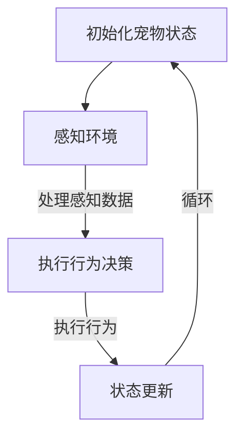

                 

# 《数字宠物经济：元宇宙中的情感陪伴产业》

## 摘要

随着元宇宙的兴起和数字化的加速发展，数字宠物经济成为了一个新兴且充满前景的产业。本文旨在深入探讨数字宠物经济的背景、概念、现状以及技术实现，并分析其商业模式、法律法规和伦理问题。通过一步步的分析和推理，本文揭示了数字宠物经济的未来趋势和面临的挑战，为读者提供了一个全面而深入的视角。关键词：数字宠物经济、元宇宙、情感陪伴产业、技术实现、商业模式、法律法规、伦理问题。

### 第一部分：引言与概述

## 第1章：数字宠物经济的背景与概念

### 1.1 数字宠物经济的起源与发展

数字宠物经济起源于虚拟世界和游戏产业。随着互联网和计算机技术的不断发展，虚拟宠物逐渐成为人们娱乐和情感陪伴的一种方式。从最初的电子宠物玩具，到游戏中的宠物系统，再到如今元宇宙中的数字宠物，这一概念经历了巨大的变革和发展。

#### 1.1.1 什么是数字宠物经济

数字宠物经济是指通过虚拟技术创造和运营宠物，满足用户情感陪伴和娱乐需求的产业。在这个经济体系中，虚拟宠物不仅具有独立的个性和行为，还能与用户进行互动和沟通。

#### 1.1.2 数字宠物经济的核心特征

1. **虚拟性**：数字宠物是虚拟的，不存在于现实世界中。
2. **互动性**：用户可以通过多种方式与虚拟宠物互动，包括语音、文字、动作等。
3. **个性化**：每个虚拟宠物都有独特的个性和行为，能够根据用户的需求进行定制。
4. **持续性**：虚拟宠物的生命周期不受现实世界的限制，可以持续存在和成长。

#### 1.1.3 数字宠物经济与实体经济的关系

数字宠物经济与实体经济存在紧密的联系。一方面，数字宠物经济的繁荣带动了相关产业的发展，如游戏、动漫、影视等；另一方面，实体经济中的宠物用品、食品等产业也为数字宠物经济提供了支持和支撑。

### 1.2 元宇宙与情感陪伴产业

元宇宙（Metaverse）是一个虚拟的三维空间，是互联网的下一个重要发展阶段。它将虚拟现实、增强现实、区块链等技术与现实世界结合，创造出一个高度模拟现实世界的虚拟环境。

#### 1.2.1 元宇宙的定义与特点

元宇宙是一个由多个虚拟世界组成的生态系统，用户可以在其中进行社交、工作、娱乐等活动。元宇宙的特点包括：

1. **开放性**：元宇宙是一个开放的平台，用户可以自由进入和创建自己的虚拟世界。
2. **沉浸性**：通过虚拟现实、增强现实等技术，用户可以高度沉浸于元宇宙中。
3. **互动性**：用户可以在元宇宙中与其他用户、虚拟角色等进行实时互动。
4. **去中心化**：元宇宙通常采用区块链技术，实现去中心化的管理和运营。

#### 1.2.2 情感陪伴产业的定义与作用

情感陪伴产业是指通过虚拟角色、宠物等提供情感支持和服务的一种产业。在元宇宙中，情感陪伴产业的作用包括：

1. **社交互动**：虚拟宠物可以作为用户的社交伙伴，帮助用户建立社交关系。
2. **心理治疗**：一些虚拟宠物具有治愈和舒缓情绪的功能，可以帮助用户缓解压力和焦虑。
3. **娱乐休闲**：虚拟宠物可以陪伴用户进行娱乐活动，如游戏、表演等。

#### 1.2.3 元宇宙与情感陪伴产业的结合

元宇宙为情感陪伴产业提供了一个全新的发展平台。通过元宇宙，用户可以与虚拟宠物进行更加真实的互动和沟通，满足情感需求。同时，元宇宙中的虚拟宠物也可以根据用户的行为和需求进行智能学习和适应，提供更加个性化的服务。

## 第二部分：元宇宙中的情感陪伴产业现状

### 2.1 元宇宙市场概述

元宇宙市场正在迅速发展，吸引了大量资本和企业的关注。以下是对元宇宙市场的概述：

#### 2.1.1 元宇宙用户规模与发展趋势

根据市场研究机构的报告，元宇宙用户规模正在快速增长。预计到2025年，全球元宇宙用户将达到10亿以上。这一趋势主要得益于虚拟现实、增强现实技术的不断进步，以及人们对虚拟世界的兴趣和需求。

#### 2.1.2 元宇宙产业链构成

元宇宙产业链包括硬件设备制造、内容创作、平台运营等多个环节。其中，硬件设备制造如VR头盔、AR眼镜等是元宇宙的基础设施；内容创作如游戏、影视、虚拟宠物等是元宇宙的核心内容；平台运营如Facebook、Epic Games等是元宇宙的重要支撑。

#### 2.1.3 元宇宙平台案例分析

元宇宙平台的案例分析有助于我们更好地理解元宇宙的发展现状。以下是对几个重要平台的概述：

1. **Facebook**：Facebook通过收购Oculus Rift等公司，进军元宇宙市场。其目标是打造一个开放、去中心化的元宇宙平台，为用户提供多样化的虚拟体验。
2. **Epic Games**：Epic Games通过其游戏平台Unreal Engine和虚拟世界平台Fortnite，在元宇宙市场中占据重要地位。其致力于提供高质量的游戏和虚拟体验，吸引用户和开发者。
3. **Decentraland**：Decentraland是一个基于区块链技术的元宇宙平台，用户可以在其中购买、创建和交易虚拟地产。其去中心化的特性使其具有独特的商业模式和盈利潜力。

### 2.2 情感陪伴产业的发展现状

情感陪伴产业在元宇宙中占据重要地位，以下是对其发展现状的概述：

#### 2.2.1 情感陪伴产业的商业模式

情感陪伴产业的商业模式主要包括订阅制和销售模式。订阅制模式是指用户通过支付订阅费用，获得虚拟宠物的使用权；销售模式是指用户购买虚拟宠物，拥有其所有权。此外，一些平台还提供虚拟宠物租赁服务，满足用户的临时需求。

#### 2.2.2 情感陪伴产业的主要参与者

情感陪伴产业的主要参与者包括：

1. **内容创作者**：内容创作者负责创作虚拟宠物的形象、故事和互动内容。
2. **技术开发者**：技术开发者负责开发和维护虚拟宠物的技术平台和工具。
3. **平台运营者**：平台运营者负责搭建和运营虚拟宠物平台，提供用户服务和支持。

#### 2.2.3 情感陪伴产业的技术基础

情感陪伴产业的技术基础主要包括虚拟现实、增强现实、人工智能等技术。这些技术为虚拟宠物的创建、交互和成长提供了支持。例如，虚拟现实技术为用户提供了沉浸式的体验；增强现实技术使虚拟宠物能够与现实世界相结合；人工智能技术使虚拟宠物能够根据用户的需求和行为进行智能学习和适应。

### 小结

元宇宙与情感陪伴产业的结合为数字宠物经济的发展提供了广阔的空间。随着技术的不断进步和市场需求的增长，数字宠物经济有望成为一个具有重要影响力的产业。

## 第三部分：数字宠物经济的技术实现

## 第2章：虚拟宠物的技术原理

虚拟宠物作为数字宠物经济的重要组成部分，其技术实现是关键。本章节将介绍虚拟宠物的构建、行为与情感模拟，以及相关的编程实践。

### 2.1 虚拟宠物的构建

虚拟宠物的构建是数字宠物经济的基础。构建虚拟宠物主要包括以下几个步骤：

#### 2.1.1 3D建模与渲染技术

3D建模技术是虚拟宠物构建的第一步。使用3D建模软件，如Blender或Maya，设计师可以创建虚拟宠物的三维模型。模型需要包括外观、身体结构、纹理等细节。

渲染技术用于将3D模型转化为逼真的图像。常用的渲染引擎有Unity和Unreal Engine。这些引擎提供了丰富的工具和资源，帮助设计师实现高质量的渲染效果。

#### 2.1.2 动作捕捉与自然语言处理技术

动作捕捉技术用于记录真实动作，并将其应用到虚拟宠物上。通过动作捕捉设备，如摄像头和传感器，可以捕捉演员的动作，然后将其转化为虚拟宠物的动作。

自然语言处理技术用于实现虚拟宠物的语音交互功能。通过自然语言处理算法，虚拟宠物可以理解用户的语音指令，并做出相应的反应。

#### 2.1.3 虚拟宠物的交互设计

虚拟宠物的交互设计是确保用户与虚拟宠物之间能够顺畅互动的关键。交互设计包括用户界面设计、交互逻辑和反馈机制。

用户界面设计需要简洁明了，方便用户与虚拟宠物进行互动。交互逻辑涉及用户指令的解析和虚拟宠物的响应。反馈机制则用于确保用户能够清楚地了解虚拟宠物的状态和反应。

### 2.2 虚拟宠物的行为与情感

虚拟宠物的行为与情感是数字宠物经济的重要特点。以下是对虚拟宠物行为与情感模拟的详细描述：

#### 2.2.1 虚拟宠物行为的算法设计

虚拟宠物的行为算法设计是虚拟宠物行为模拟的核心。行为算法通常包括感知、决策和行动三个阶段。

感知阶段涉及虚拟宠物对环境的感知，如光线、声音、气味等。决策阶段根据感知信息，虚拟宠物会做出相应的决策，如移动、坐下、玩耍等。行动阶段则是虚拟宠物根据决策执行相应的动作。

以下是一个虚拟宠物行为算法的伪代码示例：

```pseudo
function petBehavior(pet, environment):
    # 感知环境
    perception = perceiveEnvironment(pet, environment)
    
    # 决策
    decision = decideAction(perception)
    
    # 行动
    performAction(pet, decision)
    
    return pet
```

#### 2.2.2 虚拟宠物的情感模拟

虚拟宠物的情感模拟是通过算法实现的。情感模拟包括情感识别、情感表达和情感反馈。

情感识别是指虚拟宠物能够识别用户情感的变化，如快乐、悲伤、愤怒等。情感表达是指虚拟宠物通过表情、声音和动作表达情感。情感反馈是指虚拟宠物根据用户情感做出相应的反应，如安慰、鼓励等。

以下是一个虚拟宠物情感模拟算法的伪代码示例：

```pseudo
function simulateEmotion(pet, userEmotion):
    # 识别用户情感
    petEmotion = recognizeEmotion(userEmotion)
    
    # 表达情感
    expressEmotion(pet, petEmotion)
    
    # 反馈情感
    feedbackEmotion(pet, petEmotion)
    
    return pet
```

#### 2.2.3 虚拟宠物的情感反馈机制

虚拟宠物的情感反馈机制是确保虚拟宠物能够与用户建立情感连接的关键。情感反馈机制包括实时情感监测、情感调整和情感响应。

实时情感监测是指虚拟宠物能够实时监测用户的情感状态。情感调整是指虚拟宠物根据用户情感调整自己的情感状态，以更好地与用户互动。情感响应是指虚拟宠物根据用户情感做出相应的反应，如安慰、鼓励等。

以下是一个虚拟宠物情感反馈机制的伪代码示例：

```pseudo
function feedbackEmotion(pet, userEmotion):
    # 实时监测用户情感
    currentEmotion = monitorUserEmotion(userEmotion)
    
    # 情感调整
    petEmotion = adjustPetEmotion(currentEmotion)
    
    # 情感响应
    respondEmotion(pet, petEmotion)
    
    return pet
```

### 2.3 虚拟宠物的编程与开发

虚拟宠物的编程与开发是实现数字宠物经济的关键步骤。以下是对虚拟宠物编程与开发环境的介绍：

#### 2.3.1 Unity引擎介绍

Unity是一款广泛使用的游戏开发引擎，适用于虚拟宠物的开发。Unity提供了丰富的工具和资源，包括3D建模、动画、音效等。使用Unity，开发者可以轻松创建和导出虚拟宠物模型，并进行交互设计和行为模拟。

#### 2.3.2 虚拟宠物开发常用工具

除了Unity引擎，还有一些常用的工具和插件用于虚拟宠物的开发。例如，Blender用于3D建模和动画制作；Python用于编程和算法实现；Substance Painter用于纹理和外观设计。

#### 2.3.3 虚拟宠物开发流程

虚拟宠物开发流程通常包括以下步骤：

1. **需求分析**：确定虚拟宠物的功能和需求，如交互方式、行为表现等。
2. **设计阶段**：设计虚拟宠物的外观、行为和交互逻辑。
3. **开发阶段**：使用Unity等工具进行虚拟宠物的开发，包括3D建模、动画制作、编程实现等。
4. **测试阶段**：对虚拟宠物进行功能测试和性能优化，确保其稳定运行和良好的用户体验。
5. **发布阶段**：将虚拟宠物发布到元宇宙平台或游戏平台，供用户下载和使用。

### 小结

虚拟宠物的技术实现是数字宠物经济的关键。通过3D建模、渲染技术、动作捕捉和自然语言处理等技术，虚拟宠物能够拥有逼真的外观和行为。通过情感模拟和情感反馈机制，虚拟宠物能够与用户建立情感连接，提供情感陪伴服务。本章节介绍了虚拟宠物的构建、行为与情感模拟，以及编程与开发流程，为数字宠物经济提供了技术基础。

## 第3章：虚拟宠物的编程与开发（续）

### 4.2 虚拟宠物的编程实践

在了解了虚拟宠物的基本概念和技术原理后，本节将深入探讨虚拟宠物的编程实践，包括开发环境搭建、源代码详细实现和代码解读与分析。

#### 4.2.1 开发环境搭建

搭建虚拟宠物的开发环境是编程实践的第一步。以下是搭建虚拟宠物开发环境的基本步骤：

1. **安装Unity引擎**：Unity是一款强大的游戏开发引擎，支持多种平台。首先，从Unity官网下载并安装Unity Hub，然后通过Unity Hub下载并安装Unity引擎。

2. **安装相关插件**：Unity生态系统提供了许多插件和工具，如Unity Manual、Unity Collaborate、Unity Analytics等。在Unity Hub中可以找到并安装这些插件。

3. **配置开发环境**：确保Unity引擎和插件正确安装后，配置开发环境。例如，设置Unity编辑器的首选项，安装必要的开发工具和插件。

4. **创建新项目**：在Unity编辑器中创建一个新的项目。在创建项目时，可以选择项目的名称、平台和开发环境。

#### 4.2.2 源代码详细实现

以下是一个简单的虚拟宠物项目实例，包括源代码的实现和详细解读。

```csharp
using UnityEngine;

public class PetBehavior : MonoBehaviour
{
    public Transform petTransform; // 虚拟宠物的Transform组件
    public float speed = 5.0f; // 移动速度

    private void Update()
    {
        // 处理用户输入
        float horizontal = Input.GetAxis("Horizontal");
        float vertical = Input.GetAxis("Vertical");

        // 移动虚拟宠物
        MovePet(horizontal, vertical);
    }

    private void MovePet(float horizontal, float vertical)
    {
        // 计算移动方向和距离
        Vector3 direction = new Vector3(horizontal, 0, vertical);
        float distance = speed * Time.deltaTime;

        // 移动虚拟宠物
        petTransform.position += direction * distance;
    }
}
```

**代码解读**：

1. **声明Transform组件**：在代码中声明一个Transform组件，用于控制虚拟宠物的位置和运动。

2. **处理用户输入**：使用`Input.GetAxis`方法获取用户的输入，即水平方向和垂直方向的移动。

3. **移动虚拟宠物**：通过计算移动方向和距离，使用`Transform.position`属性移动虚拟宠物。

#### 4.2.3 代码解读与分析

以下是对上述代码的进一步解读和分析：

1. **组件声明**：声明一个`Transform`类型的变量`petTransform`，用于引用虚拟宠物的Transform组件。这是虚拟宠物移动和控制的基础。

2. **处理用户输入**：`Update`方法在每个帧中都会被调用，用于处理用户输入。`Input.GetAxis`方法获取用户在水平方向和垂直方向上的输入。这些输入值将在下一帧用于计算虚拟宠物的移动。

3. **移动虚拟宠物**：`MovePet`方法计算虚拟宠物的移动方向和距离。`Vector3`类型用于表示三维空间中的方向。`Time.deltaTime`用于计算每一帧的时间间隔，确保虚拟宠物以均匀的速度移动。

4. **实现细节**：代码中的计算和操作是简单的，但这是实现虚拟宠物行为的核心。通过这种方式，虚拟宠物可以响应用户的输入并做出相应的运动。

### 小结

虚拟宠物的编程实践是实现数字宠物经济的重要环节。通过搭建开发环境、编写源代码和进行代码解读与分析，我们可以创建出具有互动性和情感陪伴能力的虚拟宠物。本节介绍了虚拟宠物的编程实践，为开发者提供了实际操作的方法和技巧。

## 第4章：数字宠物经济的商业模式与运营策略

### 4.1 数字宠物经济的商业模式

数字宠物经济的商业模式多种多样，不同模式针对的用户需求和运营目标有所不同。以下是对几种主要商业模式的介绍：

#### 4.1.1 订阅制模式

订阅制模式是数字宠物经济中较为常见的一种商业模式。用户通过支付订阅费用，获得虚拟宠物的使用权。订阅费用通常按月或按年收取，用户可以享受虚拟宠物的全部功能和服务。

**优势**：

1. **稳定收入**：订阅制模式可以为企业提供稳定的收入来源。
2. **用户黏性**：订阅模式可以增强用户黏性，提高用户留存率。

**挑战**：

1. **用户流失**：如果订阅费用过高或服务质量下降，用户可能会选择放弃订阅。
2. **市场竞争**：订阅制模式在市场上存在激烈竞争，企业需要不断创新和提升服务质量。

#### 4.1.2 销售模式

销售模式是指用户一次性购买虚拟宠物，拥有其所有权。购买费用通常较高，但一旦购买，用户可以永久使用虚拟宠物。

**优势**：

1. **一次性收益**：销售模式可以为企业带来一次性收益。
2. **用户自主性**：用户可以自由使用和交易虚拟宠物，不受订阅期限的限制。

**挑战**：

1. **用户留存**：销售模式可能降低用户留存率，企业需要通过其他方式吸引和保留用户。
2. **市场竞争**：销售模式在市场上同样面临激烈竞争。

#### 4.1.3 虚拟货币与虚拟交易

虚拟货币与虚拟交易模式是将虚拟宠物与虚拟货币相结合的一种商业模式。用户使用虚拟货币购买虚拟宠物，并在元宇宙中进行交易。

**优势**：

1. **灵活性**：虚拟货币和虚拟交易模式为用户提供了更大的灵活性和自主权。
2. **市场潜力**：随着元宇宙的发展，虚拟货币和虚拟交易模式具有巨大的市场潜力。

**挑战**：

1. **监管风险**：虚拟货币和虚拟交易模式面临监管风险，企业需要遵守相关法律法规。
2. **安全风险**：虚拟货币交易存在安全风险，企业需要确保用户资金的安全。

### 4.2 数字宠物经济的运营策略

数字宠物经济的运营策略是确保商业模式成功的关键。以下是一些有效的运营策略：

#### 4.2.1 用户增长策略

用户增长策略是数字宠物经济的重要环节。以下是一些用户增长策略：

1. **营销推广**：通过线上和线下渠道进行营销推广，提高品牌知名度和用户认知度。
2. **用户教育**：通过培训和教育用户，提高他们对数字宠物的认知和兴趣。
3. **社区互动**：建立用户社区，促进用户之间的互动和交流，增强用户黏性。

#### 4.2.2 社交互动策略

社交互动策略是数字宠物经济的一大特点。以下是一些社交互动策略：

1. **社交功能**：在虚拟宠物平台中添加社交功能，如聊天室、社交圈等，方便用户之间交流和互动。
2. **虚拟活动**：举办虚拟宠物活动，如比赛、展览、庆典等，增加用户参与度和互动性。
3. **用户共创**：鼓励用户参与虚拟宠物的设计、开发和运营，提高用户满意度和忠诚度。

#### 4.2.3 内容创作与更新策略

内容创作与更新策略是保持用户兴趣和活跃度的重要手段。以下是一些内容创作与更新策略：

1. **多样化内容**：提供多样化的虚拟宠物内容，如角色、场景、活动等，满足不同用户的需求。
2. **定期更新**：定期更新虚拟宠物内容，引入新的功能、活动和角色，保持用户的新鲜感和好奇心。
3. **用户反馈**：收集用户反馈，根据用户需求进行调整和改进，提高用户满意度和体验。

### 小结

数字宠物经济的商业模式多样，包括订阅制、销售模式和虚拟货币与虚拟交易模式。运营策略涉及用户增长、社交互动和内容创作与更新。通过有效的商业模式和运营策略，数字宠物经济可以吸引和保留用户，实现可持续发展。

### 第5章：数字宠物经济的法律法规与伦理问题

随着数字宠物经济的快速发展，其相关法律法规和伦理问题也日益凸显。本章节将探讨数字宠物经济的法律法规现状、虚拟宠物的版权问题以及用户隐私保护等伦理问题。

#### 5.1 数字宠物经济的法律法规

数字宠物经济作为新兴行业，其法律法规体系尚不完善。以下是对国内外数字宠物经济相关法律法规的概述：

1. **国内法律法规**：

   - 《中华人民共和国网络安全法》：规定了网络运营者的责任和义务，包括用户个人信息保护、网络安全事件报告等。
   - 《中华人民共和国电子商务法》：规定了电子商务交易过程中的消费者权益保护、合同履行等。
   - 《中华人民共和国民法典》：涉及知识产权、合同法等方面的规定，对虚拟宠物的版权和交易有指导意义。

2. **国外法律法规**：

   - 美国：《数字千年版权法案》（DMCA）：规定了数字作品的版权保护和侵权责任。
   - 欧盟：《通用数据保护条例》（GDPR）：强化了用户隐私保护，对数据处理和存储有严格的规定。

#### 5.1.1 虚拟宠物的版权问题

虚拟宠物的版权问题是一个复杂且具有争议的话题。以下是对虚拟宠物版权问题的探讨：

1. **版权归属**：虚拟宠物的版权归属通常取决于其创作方式和所有权转让。如果虚拟宠物是通过雇佣关系创作的，版权可能属于雇主；如果是独立创作，则可能属于创作者。

2. **版权保护**：虚拟宠物作为数字作品，需要通过著作权法进行版权保护。创作虚拟宠物时，应确保作品的原创性和独特性，以避免侵权风险。

3. **版权转让**：在数字宠物经济中，虚拟宠物的交易和转让常见。在进行版权转让时，应签订合法的版权转让协议，明确双方的权利和义务。

#### 5.1.2 用户隐私保护

数字宠物经济涉及大量用户数据，包括用户行为、交易记录等。用户隐私保护是法律法规和伦理问题的重要方面。以下是对用户隐私保护的探讨：

1. **数据收集与使用**：数字宠物经济平台在收集和使用用户数据时，应遵循合法性、必要性、最小化原则，确保用户数据的合法使用。

2. **数据安全**：平台应采取有效的数据安全技术，如加密、防火墙等，确保用户数据的安全。

3. **用户告知与同意**：平台在收集和使用用户数据前，应明确告知用户，并获取用户同意。用户有权了解自己的数据被用于何种目的，并有权撤回同意。

#### 5.2 数字宠物经济的伦理问题

数字宠物经济在发展过程中，面临着一系列伦理问题。以下是对数字宠物经济伦理问题的探讨：

1. **情感依赖与成瘾**：虚拟宠物可能引发用户的情感依赖和成瘾。用户过度依赖虚拟宠物，可能会影响其现实生活中的社交和情感发展。

2. **人际关系替代**：虚拟宠物在某些情况下可能替代现实人际关系。过度依赖虚拟宠物，可能导致用户忽视现实中的家人和朋友。

3. **动物保护与动物福利**：虚拟宠物的开发和使用可能引发动物保护与动物福利问题。平台应确保虚拟宠物的设计和运营不会对现实中的动物造成伤害。

4. **社会责任与可持续发展**：数字宠物经济平台应承担社会责任，关注用户心理健康和社会影响。同时，应遵循可持续发展原则，减少对环境和资源的消耗。

### 小结

数字宠物经济的法律法规和伦理问题对其可持续发展具有重要意义。通过完善法律法规体系，解决虚拟宠物的版权问题，保护用户隐私，关注伦理问题，数字宠物经济可以更好地为社会带来价值。

## 第6章：数字宠物经济的未来展望

随着技术的不断进步和市场需求的增长，数字宠物经济有望在未来继续快速发展。本章节将探讨数字宠物经济的未来趋势、挑战以及社会责任。

### 6.1 数字宠物经济的未来趋势

1. **技术发展**：虚拟现实（VR）和增强现实（AR）技术的不断进步，将使虚拟宠物更加逼真和互动。人工智能（AI）技术的发展，将使虚拟宠物具备更高级的情感识别和反应能力。

2. **全球化**：随着互联网的普及，数字宠物经济将逐渐实现全球化。不同国家和地区的企业和个人将共同参与，推动数字宠物经济的繁荣。

3. **多样化应用**：数字宠物经济将在更多领域得到应用，如教育、医疗、娱乐等。虚拟宠物将成为人们生活和工作的伙伴，提供个性化的服务和体验。

### 6.2 数字宠物经济的挑战

1. **技术瓶颈**：虚拟现实和人工智能技术的发展仍有瓶颈，如延迟、性能问题等。这些问题需要技术突破和优化，以提供更好的用户体验。

2. **市场竞争**：数字宠物经济市场将面临激烈的竞争。企业需要不断创新和提升服务质量，以吸引和保留用户。

3. **法律法规**：随着数字宠物经济的快速发展，相关法律法规将不断完善。企业需要遵守法律法规，确保合规运营。

### 6.3 社会责任与可持续发展

1. **用户隐私保护**：企业应加强用户隐私保护，确保用户数据的安全和隐私。遵守相关法律法规，提高用户信任度。

2. **伦理问题**：企业应关注伦理问题，如情感依赖、人际关系替代等。通过教育和引导，提高用户的道德观念和自我意识。

3. **可持续发展**：企业应关注环境保护和资源利用，推动可持续发展。通过技术创新和优化，减少对环境和资源的消耗。

### 小结

数字宠物经济在未来将继续快速发展，面临技术、市场和法律法规等多方面的挑战。同时，企业应承担社会责任，关注用户隐私保护和伦理问题，推动可持续发展。通过技术创新和社会责任，数字宠物经济将为社会带来更多价值和福祉。

## 附录A：数字宠物经济的参考资料与推荐阅读

### 附录A：数字宠物经济的参考资料与推荐阅读

1. **基础理论**：

   - 《虚拟现实与增强现实技术概论》
   - 《人工智能：一种现代方法》
   - 《数字宠物经济：从虚拟到现实》

2. **技术实现**：

   - Unity官方文档：《Unity官方文档》
   - Unreal Engine官方文档：《Unreal Engine官方文档》
   - 《虚拟宠物编程实践》

3. **行业分析**：

   - 《元宇宙与数字宠物经济的崛起》
   - 《数字宠物经济：市场前景与挑战》
   - 《虚拟宠物的商业模式与运营策略》

4. **法律法规与伦理**：

   - 《中华人民共和国网络安全法》
   - 《中华人民共和国电子商务法》
   - 《通用数据保护条例（GDPR）》

5. **深度阅读**：

   - 《数字宠物与人类情感：一场虚拟的亲密接触》
   - 《虚拟宠物的伦理问题与社会影响》
   - 《数字宠物经济的未来：趋势与挑战》

通过阅读这些参考资料，读者可以更深入地了解数字宠物经济的基础理论、技术实现、行业分析和法律法规，为研究和实践提供有力的支持。

## 附录B：虚拟宠物开发实用工具与资源列表

### 附录B：虚拟宠物开发实用工具与资源列表

1. **开发环境**：

   - **Unity Engine**：一款功能强大的游戏开发引擎，支持虚拟宠物的开发。
   - **Unreal Engine**：一款高端的游戏开发引擎，适合制作高质量的虚拟宠物。

2. **建模与渲染工具**：

   - **Blender**：一款开源的3D建模和渲染软件，适用于虚拟宠物的建模和动画制作。
   - **Autodesk Maya**：一款专业的3D建模和动画软件，适合制作复杂的虚拟宠物模型。

3. **动画与特效工具**：

   - **Adobe After Effects**：一款视频编辑和动画软件，适用于虚拟宠物的动画制作和特效添加。
   - **Adobe Premiere Pro**：一款视频编辑软件，适合虚拟宠物的视频制作和剪辑。

4. **编程语言**：

   - **C#**：Unity引擎的主要编程语言，适用于虚拟宠物的开发。
   - **Python**：适合进行算法实现和数据处理的编程语言。

5. **学习资源**：

   - **Unity官方教程**：提供丰富的Unity引擎教程和文档。
   - **Blender官方教程**：提供Blender软件的详细教程和资源。
   - **在线编程平台**：如Codecademy、Coursera等，提供编程语言和算法的学习资源。

通过使用这些工具和资源，开发者可以高效地进行虚拟宠物的开发，提升项目的质量和用户体验。

### 1. 虚拟宠物行为算法流程图

下面是一个简单的虚拟宠物行为算法流程图，使用Mermaid语言进行描述：



**解释**：

1. **初始化宠物状态**：在程序开始时，初始化虚拟宠物的状态，包括位置、健康状态、情绪等。
2. **感知环境**：虚拟宠物通过传感器或内置算法感知周围环境，如光线、声音、气味等。
3. **处理感知数据**：根据感知数据，虚拟宠物分析环境信息，以确定如何反应。
4. **执行行为决策**：基于感知数据处理结果，虚拟宠物决定执行何种行为，如移动、坐立、玩耍等。
5. **执行行为**：虚拟宠物执行决策中的行为。
6. **状态更新**：执行行为后，虚拟宠物的状态（如位置、情绪等）会进行更新。
7. **循环**：回到初始化状态，继续进行下一轮的行为循环。

### 2. 情感模拟算法伪代码

以下是虚拟宠物情感模拟的伪代码，用于说明如何根据用户的情感状态来调整虚拟宠物的情感：

```pseudo
function simulateEmotion(pet, userEmotion):
    # 识别用户的情感状态
    currentEmotion = recognizeUserEmotion(userEmotion)
    
    # 根据用户的情感状态，调整宠物的情感状态
    if currentEmotion == 'happy':
        pet.emoji = ':)' # 表情更新为开心
        pet.speed = 1.5 # 提高移动速度
    elif currentEmotion == 'sad':
        pet.emoji = ':(' # 表情更新为难过
        pet.speed = 0.5 # 降低移动速度
    else:
        pet.emoji = ':|' # 表情更新为中性
    
    # 更新宠物外观和状态
    updatePetAppearance(pet)
    updatePetState(pet)
    
    return pet
```

**解释**：

1. **识别用户的情感状态**：首先，通过某种情感识别机制（如面部识别、语音识别等）来识别用户的情感状态。
2. **调整宠物的情感状态**：根据用户的情感状态，更新虚拟宠物的情感状态。例如，如果用户表现出快乐的情感，虚拟宠物的表情和移动速度都会变得积极。
3. **更新宠物外观和状态**：根据情感状态的调整，更新虚拟宠物的外观（如表情）和物理状态（如移动速度）。
4. **返回调整后的宠物**：完成情感状态的调整后，返回更新后的虚拟宠物对象。

通过这样的情感模拟算法，虚拟宠物可以更好地与用户互动，提供更加个性化的情感陪伴服务。

