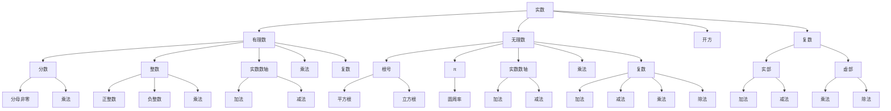
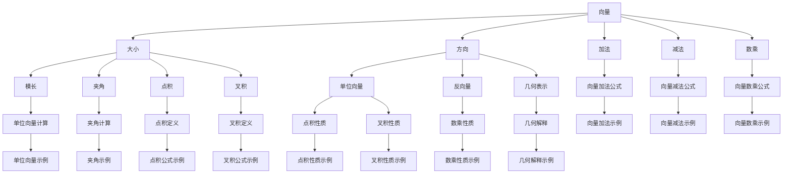
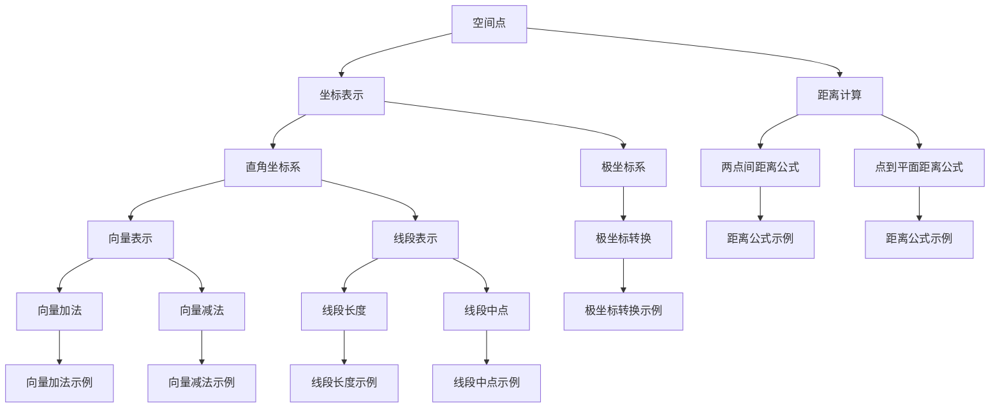

                 

### 文章标题

《数学与航空航天：飞行动力学的数学描述》

### 文章关键词

数学，航空航天，飞行动力学，数学模型，算法，模拟，数值计算，Python，MATLAB，空气动力学，导航，航空航天器设计

### 文章摘要

本文旨在探讨数学在航空航天领域中的应用，特别是飞行动力学的数学描述。通过详细的数学模型和公式解析，本文介绍了飞行动力学中的核心概念和算法原理。此外，本文通过实际项目案例，展示了如何使用Python等编程工具来实现飞行器运动轨迹的模拟。本文的最终目的是为航空航天工程领域的专业人士和学生提供一个全面而深入的数学工具箱，以促进对飞行动力学复杂系统的理解和分析。

---

## 第一部分：数学预备知识

### 第1章：数学基础

在进入飞行动力学的研究之前，我们需要掌握一些基础的数学知识，这些知识包括实数与复数、向量与矩阵以及空间解析几何。这些数学概念和工具是理解更复杂数学模型和算法的基础。

### 实数与复数

实数是数学中的基本数系，包括所有可以表示为分数的有理数和无理数。复数是实数的扩展，由实部和虚部组成，通常表示为 \(a + bi\)，其中 \(a\) 和 \(b\) 是实数，\(i\) 是虚数单位，满足 \(i^2 = -1\)。

#### 核心概念与联系

下面是实数与复数的 Mermaid 流程图：



#### 核心算法原理讲解

以下是对复数加法、减法、乘法和除法算法原理的伪代码讲解：

```python
# 复数加法
def complex_add(a, b):
    real = a['real'] + b['real']
    imag = a['imag'] + b['imag']
    return {'real': real, 'imag': imag}

# 复数减法
def complex_subtract(a, b):
    real = a['real'] - b['real']
    imag = a['imag'] - b['imag']
    return {'real': real, 'imag': imag}

# 复数乘法
def complex_multiply(a, b):
    real = a['real'] * b['real'] - a['imag'] * b['imag']
    imag = a['real'] * b['imag'] + a['imag'] * b['real']
    return {'real': real, 'imag': imag}

# 复数除法
def complex_divide(a, b):
    denominator = b['real']**2 + b['imag']**2
    real = (a['real'] * b['real'] + a['imag'] * b['imag']) / denominator
    imag = (a['imag'] * b['real'] - a['real'] * b['imag']) / denominator
    return {'real': real, 'imag': imag}
```

#### 数学模型和公式

复数的运算涉及到以下公式：

- 复数加法：\( (a + bi) + (c + di) = (a + c) + (b + d)i \)
- 复数减法：\( (a + bi) - (c + di) = (a - c) + (b - d)i \)
- 复数乘法：\( (a + bi)(c + di) = (ac - bd) + (ad + bc)i \)
- 复数除法：\( \frac{a + bi}{c + di} = \frac{(ac + bd) + (bc - ad)i}{c^2 + d^2} \)

#### 举例说明

假设有两个复数 \( z_1 = 3 + 4i \) 和 \( z_2 = 1 - 2i \)，求它们的和、差、积和商。

1. **和**：

   $$ z_1 + z_2 = (3 + 4i) + (1 - 2i) = 4 + 2i $$

2. **差**：

   $$ z_1 - z_2 = (3 + 4i) - (1 - 2i) = 2 + 6i $$

3. **积**：

   $$ z_1 \cdot z_2 = (3 + 4i)(1 - 2i) = 3 - 6i + 4i - 8i^2 = 11 - 2i $$

4. **商**：

   $$ \frac{z_1}{z_2} = \frac{3 + 4i}{1 - 2i} = \frac{(3 + 4i)(1 + 2i)}{(1 - 2i)(1 + 2i)} = \frac{3 + 6i + 4i + 8i^2}{1 + 4i^2} = \frac{11 + 10i}{5} = 2.2 + 2i $$

### 向量与矩阵

向量是数学中的一个重要概念，它描述了具有大小和方向的量。矩阵是由多个向量组成的数学对象，它可以表示线性变换。

#### 核心概念与联系

以下是向量与矩阵的 Mermaid 流程图：



#### 核心算法原理讲解

以下是对向量加法、减法和数乘的算法原理的伪代码讲解：

```python
# 向量加法
def vector_add(a, b):
    return [a[i] + b[i] for i in range(len(a))]

# 向量减法
def vector_subtract(a, b):
    return [a[i] - b[i] for i in range(len(a))]

# 向量数乘
def vector_scalar_multiply(a, c):
    return [c * a[i] for i in range(len(a))]
```

#### 数学模型和公式

- 向量加法：\( \mathbf{a} + \mathbf{b} = \mathbf{c} \)，其中 \( \mathbf{c} \) 是结果向量。
- 向量减法：\( \mathbf{a} - \mathbf{b} = \mathbf{c} \)，其中 \( \mathbf{c} \) 是结果向量。
- 向量数乘：\( c\mathbf{a} = \mathbf{b} \)，其中 \( c \) 是标量，\( \mathbf{b} \) 是结果向量。

#### 举例说明

假设有两个向量 \( \mathbf{a} = [1, 2, 3] \) 和 \( \mathbf{b} = [4, 5, 6] \)，求它们的和、差和数乘。

1. **和**：

   $$ \mathbf{a} + \mathbf{b} = [1, 2, 3] + [4, 5, 6] = [5, 7, 9] $$

2. **差**：

   $$ \mathbf{a} - \mathbf{b} = [1, 2, 3] - [4, 5, 6] = [-3, -3, -3] $$

3. **数乘**：

   $$ 2\mathbf{a} = 2 \cdot [1, 2, 3] = [2, 4, 6] $$

### 空间解析几何

空间解析几何是研究三维空间中的点、线、面及其相互关系的数学分支。它通过坐标系统将几何问题转化为代数问题，使问题更加直观和易于处理。

#### 核心概念与联系

以下是空间解析几何的 Mermaid 流程图：



#### 核心算法原理讲解

以下是对空间点、线段和向量运算的算法原理的伪代码讲解：

```python
# 空间点表示
def space_point(x, y, z):
    return [x, y, z]

# 两点间距离
def distance(p1, p2):
    return np.sqrt((p2[0] - p1[0])**2 + (p2[1] - p1[1])**2 + (p2[2] - p1[2])**2)

# 空间向量表示
def space_vector(v):
    return [v[0], v[1], v[2]]

# 向量加法
def vector_add(v1, v2):
    return [v1[0] + v2[0], v1[1] + v2[1], v1[2] + v2[2]]

# 向量减法
def vector_subtract(v1, v2):
    return [v1[0] - v2[0], v1[1] - v2[1], v1[2] - v2[2]]
```

#### 数学模型和公式

- 空间点表示：\( \mathbf{p} = (x, y, z) \)
- 两点间距离公式：\( d = \sqrt{(x_2 - x_1)^2 + (y_2 - y_1)^2 + (z_2 - z_1)^2} \)
- 空间向量表示：\( \mathbf{v} = (v_x, v_y, v_z) \)
- 向量加法：\( \mathbf{a} + \mathbf{b} = \mathbf{c} \)，其中 \( \mathbf{c} \) 是结果向量。
- 向量减法：\( \mathbf{a} - \mathbf{b} = \mathbf{c} \)，其中 \( \mathbf{c} \) 是结果向量。

#### 举例说明

假设有两个空间点 \( P_1 = (1, 2, 3) \) 和 \( P_2 = (4, 5, 6) \)，求它们之间的距离。还有一个向量 \( \

