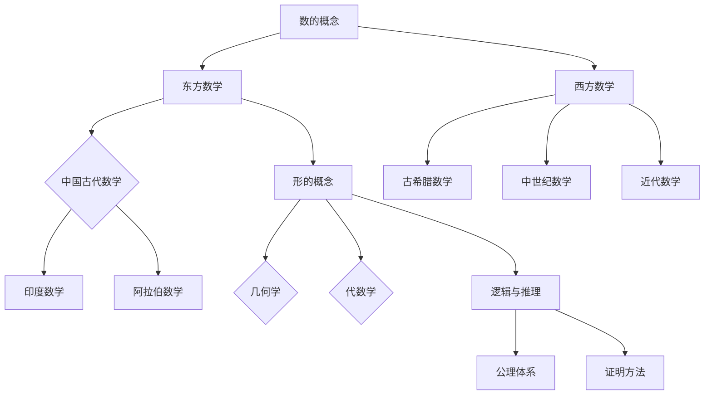

                 

## 《数学史上的东西方数学思想比较》

### 关键词
- 数学史
- 东西方数学思想
- 核心概念与原理
- 应用与影响
- 比较与分析

### 摘要

本文旨在深入探讨数学史上东西方数学思想的起源、发展及其核心概念、原理和应用。通过对比分析，我们试图揭示东西方数学思想在核心概念、研究方法和应用领域的异同点，并探讨它们在现代社会中的影响与发展趋势。本文首先回顾了东西方数学思想的起源与发展历程，然后详细介绍了其核心概念与原理，随后探讨了它们在不同领域的应用及其对人类社会的深远影响。最后，本文对东西方数学思想的异同点进行了比较与分析，并展望了其未来的发展趋势与面临的挑战。通过本文的研究，我们期望为读者提供一个全面而深入的数学史视角，帮助读者更好地理解数学这一重要学科的发展脉络及其对现代科技和社会的推动作用。

## 《数学史上的东西方数学思想比较》目录大纲

### 第1章 引言
- **1.1 研究背景与意义**
- **1.2 研究方法与内容概述**
- **1.3 结构安排与章节内容概览**

### 第2章 东西方数学思想的起源与发展
- **2.1 东方数学思想的起源与发展**
  - **2.1.1 中国古代数学**
  - **2.1.2 印度数学的兴起**
  - **2.1.3 阿拉伯数学的贡献**
- **2.2 西方数学思想的起源与发展**
  - **2.2.1 希腊数学的辉煌**
  - **2.2.2 中世纪数学的传承与发展**
  - **2.2.3 文艺复兴与近代数学的诞生**

### 第3章 东西方数学思想的核心概念与原理
- **3.1 东西方数学思想的核心概念**
  - **3.1.1 数的概念**
  - **3.1.2 形的概念**
  - **3.1.3 逻辑与推理**
- **3.2 东西方数学思想的基本原理**
  - **3.2.1 证明与演绎**
  - **3.2.2 实用与抽象**
  - **3.2.3 发展与创新**

### 第4章 东西方数学思想的应用与影响
- **4.1 东西方数学思想的应用领域**
  - **4.1.1 数学在科学中的应用**
  - **4.1.2 数学在工程中的应用**
  - **4.1.3 数学在生活中的应用**
- **4.2 东西方数学思想对人类社会的影响**
  - **4.2.1 对哲学的影响**
  - **4.2.2 对科技的影响**
  - **4.2.3 对教育的影响**

### 第5章 东西方数学思想的比较与分析
- **5.1 东西方数学思想的异同点**
  - **5.1.1 异同点比较**
  - **5.1.2 形成差异的原因**
- **5.2 东西方数学思想的发展趋势**
  - **5.2.1 现代数学的发展方向**
  - **5.2.2 数学思想交流与融合的可能性**

### 第6章 东西方数学思想在当代的意义与挑战
- **6.1 当代数学发展的新机遇**
  - **6.1.1 数学与人工智能的结合**
  - **6.1.2 数学在解决现实问题中的应用**
  - **6.1.3 数学在跨学科研究中的重要性**
- **6.2 东西方数学思想面临的挑战**
  - **6.2.1 数学教育的改革**
  - **6.2.2 数学研究的发展方向**
  - **6.2.3 数学的国际化与本土化**

### 第7章 结论
- **7.1 研究结论与贡献**
- **7.2 研究局限与未来展望**
- **7.3 对数学教育与实践的建议**

### 附录
- **附录A 东西方数学思想核心概念与原理 Mermaid 流程图**
- **附录B 东西方数学思想的核心算法原理伪代码**
- **附录C 东西方数学思想的应用案例与代码实现**
- **附录D 参考文献**

这一目录大纲为本文提供了一个结构化的框架，以便系统地探讨东西方数学思想的各个方面。每个章节都将深入分析特定领域的内容，通过详细的阐述和比较，帮助读者全面理解数学史上的这一重要主题。

### 第1章 引言

#### 1.1 研究背景与意义

数学作为人类智慧的结晶，是科学发展的基石。自古以来，数学在各个文明中都有着深远的影响，东西方数学思想更是各自独立发展，形成了独特的体系。研究数学史上的东西方数学思想，不仅有助于我们了解数学的发展脉络，还能揭示不同文化背景下数学思想的差异和共性。东西方数学思想的比较研究，有助于我们更好地理解数学在不同文化环境中的发展模式，探讨数学思想对人类文明的贡献。

本研究旨在通过对比分析东西方数学思想的起源、发展、核心概念与原理、应用与影响，揭示两者在数学研究方法和哲学思想上的异同点。这一研究不仅有助于我们深入了解数学的历史和文化背景，还能为现代数学的发展提供启示和指导。此外，通过对比东西方数学思想，我们也可以更好地理解数学在不同文化中的传播与融合过程，从而推动数学教育与实践的进步。

#### 1.2 研究方法与内容概述

本研究采用历史分析和比较分析的方法，通过对东西方数学思想的系统梳理和比较，探讨其起源、发展、核心概念与原理以及应用与影响。具体研究方法包括以下几方面：

1. **文献回顾**：通过对相关数学史文献的回顾，了解东西方数学思想的发展脉络和重要事件。
2. **比较分析**：采用定量和定性的方法，对东西方数学思想在核心概念、研究方法、应用领域等方面的异同进行详细比较。
3. **案例研究**：选取具有代表性的数学问题或数学家，分析其研究方法和成果，探讨其对数学思想发展的影响。

本研究内容主要包括以下几部分：

1. **数学思想的起源与发展**：回顾东方和西方数学思想的起源，分析其发展的历史背景和主要贡献。
2. **核心概念与原理**：探讨东西方数学思想的核心概念和原理，比较其在数、形、逻辑等方面的差异。
3. **应用与影响**：分析东西方数学思想在不同领域的应用及其对哲学、科技、教育等方面的影响。
4. **比较与分析**：详细比较东西方数学思想的异同点，探讨形成差异的原因。
5. **当代意义与挑战**：讨论当代数学发展的新机遇与挑战，探讨东西方数学思想的未来发展趋势。

#### 1.3 结构安排与章节内容概览

本文的结构安排如下：

- **第1章 引言**：介绍研究的背景、意义、研究方法与内容概述。
- **第2章 东西方数学思想的起源与发展**：回顾东方和西方数学思想的起源与发展历程。
- **第3章 东西方数学思想的核心概念与原理**：探讨东西方数学思想的核心概念和原理。
- **第4章 东西方数学思想的应用与影响**：分析东西方数学思想在不同领域的应用及其影响。
- **第5章 东西方数学思想的比较与分析**：比较东西方数学思想的异同点，探讨形成差异的原因。
- **第6章 东西方数学思想在当代的意义与挑战**：讨论当代数学发展的新机遇与挑战。
- **第7章 结论**：总结研究结论与贡献，提出未来展望和建议。

通过以上章节的详细探讨，本文期望能够为读者提供一个全面、深入的数学史视角，帮助读者更好地理解数学思想的多样性和发展历程。

### 第2章 东西方数学思想的起源与发展

#### 2.1 东方数学思想的起源与发展

东方数学思想有着悠久的历史，其中中国古代数学、印度数学和阿拉伯数学都对数学的发展作出了重要贡献。

##### 2.1.1 中国古代数学

中国古代数学起源于公元前2000年左右的夏商时期。在古代，数学主要用于农业、天文和历法等领域。《九章算术》是中国古代数学的经典著作，成书于公元1世纪，它包含了大量关于算术、代数、几何和数论的内容。中国古代数学注重实用性和算法，如秦九韶的“大衍求一术”和杨辉的“杨辉三角”等，都是对算法和公式的重要贡献。

汉代的《周髀算经》是中国最早的数学著作之一，提出了勾股定理，这对几何学的发展产生了深远影响。南北朝时期的祖冲之通过精确计算圆周率，将π的值推算到小数点后第七位，这是当时世界上最精确的圆周率计算结果。

到了宋代，数学进一步发展。李冶的《测圆海镜》和张择端的《详解九章算法》都是这一时期的重要数学著作。这些著作不仅包含了丰富的数学理论，还展示了高深的数学技巧。

##### 2.1.2 印度数学的兴起

印度数学的兴起大约始于公元前6世纪。印度数学的一个重要特点是其对零的概念的发明和运用。零作为数字系统的基础，极大地简化了计算和数学表达。印度数学家阿耶波多（Aryabhata）是这一时期的杰出代表，他的著作《阿耶波多历数书》提出了许多重要的数学概念，如二次方程的求解方法和负数的概念。

公元7世纪，婆罗摩笈多（Brahmagupta）进一步发展了印度数学。他在其著作《婆罗摩笈多历数书》中提出了负数运算的规则，包括负数加减法和乘除法，这是数学史上的一项重大突破。此外，婆罗摩笈多还对勾股定理进行了证明，并研究了球体体积的计算。

##### 2.1.3 阿拉伯数学的贡献

阿拉伯数学的发展大约始于公元8世纪。阿拉伯数学家通过翻译和整合希腊、印度和中国等地的数学成果，极大地丰富了阿拉伯数学的内容。阿尔·花拉子米（Al-Khwarizmi）是这一时期最重要的数学家之一。他的著作《代数学》（Al-Jabr）是代数学的奠基之作，书中提出了求解方程的方法，这些方法后来被称为“代数”。

阿尔·花拉子米还对三角学和天文学做出了重要贡献。他编制的《花拉子米历数表》是当时世界上最精确的三角函数表之一。此外，他还研究了平面几何中的许多问题，如圆的面积和球体的体积。

阿拉伯数学的另一个重要贡献是阿拉伯数字的传播。这种数字系统起源于印度，经过阿拉伯人的改进后传入欧洲，成为现代数字系统的基础。

#### 2.2 西方数学思想的起源与发展

西方数学思想的起源可以追溯到古希腊时期。古希腊数学以其严密的逻辑推理和高度抽象的特点而闻名。欧几里得的《几何原本》是古希腊数学的经典著作，书中提出了几何学的系统理论，对后来的数学发展产生了深远的影响。

##### 2.2.1 希腊数学的辉煌

古希腊数学的代表人物包括欧几里得、阿基米德和毕达哥拉斯。欧几里得通过《几何原本》建立了几何学的基本体系，阿基米德则以其在流体力学和静力学方面的研究而著称。毕达哥拉斯提出的“毕达哥拉斯定理”是数学中的一个基本定理，至今仍被广泛应用于各个领域。

古希腊数学不仅注重理论体系的建立，还强调数学的应用。阿基米德的研究就体现了这一点，他通过数学方法解决了实际问题，如计算船体的浮力和球体的体积。

##### 2.2.2 中世纪数学的传承与发展

中世纪欧洲的数学发展主要受到了希腊数学和阿拉伯数学的影响。阿拉伯数学通过西班牙传入欧洲，极大地推动了中世纪数学的发展。阿拉伯数字的引入简化了计算过程，使得数学的应用变得更加广泛。

中世纪欧洲的数学家如斐波那契（Fibonacci）通过对阿拉伯数学的研究，将许多数学知识引入欧洲。他的著作《算经》介绍了许多数学概念和方法，对后来的数学发展产生了重要影响。

##### 2.2.3 文艺复兴与近代数学的诞生

文艺复兴时期是西方数学发展的一个重要阶段。这一时期，数学家们开始使用更加严格的逻辑方法和数学符号来表示数学概念，从而推动了数学的快速发展。

笛卡尔（Descartes）的《几何》（La Géométrie）是文艺复兴时期的重要数学著作，书中提出了坐标几何的概念，将几何与代数结合起来，从而开创了现代数学的先河。

牛顿（Newton）和莱布尼茨（Leibniz）在17世纪末至18世纪初独立发明了微积分，这一发现极大地推动了数学的发展，使得数学成为解析自然现象的有力工具。

#### 2.3 总结

东西方数学思想在起源和发展过程中各具特色。东方数学思想注重实用性和算法，而西方数学思想则更强调理论体系的建立和逻辑推理。通过对比分析，我们可以更好地理解数学思想的多样性和发展历程，为现代数学的发展提供有益的启示。

### 第3章 东西方数学思想的核心概念与原理

#### 3.1 东西方数学思想的核心概念

在数学思想的发展历程中，东西方各自形成了独特的核心概念。这些概念不仅在各自的文化背景中有深远影响，而且在数学的发展史上也占有重要地位。

##### 3.1.1 数的概念

在数学中，数的概念是最基本的核心概念之一。东西方在数的概念上有着不同的理解和应用。

**东方数学思想中的数的概念**：

在中国古代数学中，数的概念主要表现为对自然数的理解和应用。中国数学家对数的概念进行了深入的研究，如《九章算术》中对分数和负数的讨论。特别是南宋数学家秦九韶提出的“大衍求一术”，是对组合数学中的重要问题的解决，体现了对数概念的高超运用。

在印度数学中，零的概念的发明是数的概念发展中的一个重大突破。零作为数字系统的基础，使得数学表达变得更加简洁和有效。印度数学家阿耶波多和婆罗摩笈多对数的概念进行了深入的研究，他们的工作为后来的数学发展奠定了基础。

**西方数学思想中的数的概念**：

古希腊数学家对数的概念有着深刻的理解。毕达哥拉斯提出的“万物皆数”的观点，强调数的普遍性和重要性。欧几里得的《几何原本》中，通过对自然数和有理数的系统研究，建立了几何学的基本理论。

在中世纪，阿拉伯数学家对数的概念进行了进一步的扩展，包括对无理数的研究和负数的定义。阿尔·花拉子米在《代数学》中提出了求解代数方程的方法，这些方法为现代数学中的数的概念打下了基础。

**比较**：

东方数学中的数概念更侧重于实用性和算法，如中国和印度在数论和组合数学方面的研究。而西方数学中的数概念则更注重理论体系的建立和逻辑推理，如古希腊和阿拉伯对自然数、有理数、无理数的研究。

##### 3.1.2 形的概念

形的概念在数学中同样重要，东西方在形的理解与应用上也有所差异。

**东方数学思想中的形的概念**：

中国古代数学在形的研究上有着丰富的成果。例如，汉代的《周髀算经》提出了勾股定理，对几何学的发展产生了深远影响。宋代的数学家李冶的《测圆海镜》和秦九韶的《数书九章》等著作，对形的研究进行了深入的探讨，包括圆的面积和球体的体积计算。

印度数学中，形的研究同样具有重要地位。阿耶波多和婆罗摩笈多对形的几何性质进行了详细研究，特别是在《婆罗摩笈多历数书》中，他们提出了许多关于平面几何和球面几何的定理和问题。

**西方数学思想中的形的概念**：

古希腊数学家对形的理解主要体现在欧几里得的《几何原本》中。这本书系统地总结了平面几何的基本理论，包括点、线、面的定义和性质。阿基米德则通过几何方法解决了许多物理问题，如浮力和球体体积的计算。

在中世纪，阿拉伯数学家对形的几何性质进行了深入研究，如阿尔·花拉子米的《算术》中，对各种几何图形的性质和计算进行了详细讨论。

**比较**：

东方数学中的形概念更多地体现在实用性和几何算法的应用，如中国和印度对几何图形的计算。而西方数学中的形概念则更注重理论体系的建立和几何学的基本原理，如古希腊和阿拉伯对几何学的系统研究。

##### 3.1.3 逻辑与推理

逻辑和推理在数学中起着至关重要的作用，它们是构建数学理论大厦的基石。

**东方数学思想中的逻辑与推理**：

中国古代数学家在逻辑和推理方面有着独特的贡献。秦九韶的“大衍求一术”和杨辉的“杨辉三角”等，都是通过逻辑推理来解决数学问题。这些方法强调归纳和演绎的结合，体现了东方数学思想的逻辑思维特点。

印度数学家在逻辑和推理方面也进行了深入的研究。阿耶波多和婆罗摩笈多在《阿耶波多历数书》和《婆罗摩笈多历数书》中，运用了严密的逻辑推理来解决复杂的数学问题，如二次方程的求解和负数运算。

**西方数学思想中的逻辑与推理**：

古希腊数学家在逻辑和推理方面达到了巅峰。欧几里得的《几何原本》系统地运用了逻辑推理的方法，通过公理和定理建立了几何学的理论体系。阿基米德的研究则体现了从特殊到一般的推理过程，如从特定的几何图形推导出一般的定理。

在中世纪，阿拉伯数学家对逻辑和推理方法进行了进一步的扩展，如阿尔·花拉子米的《代数学》中，通过严密的逻辑推理解决了许多代数问题。

**比较**：

东方数学中的逻辑和推理更侧重于实用性和算法的应用，如中国和印度对特定数学问题的解决。而西方数学中的逻辑和推理则更强调理论体系的建立和公理化的方法，如古希腊和阿拉伯对数学理论的系统研究。

#### 3.2 东西方数学思想的基本原理

在数学思想的发展过程中，东西方各自形成了基本原理，这些原理对数学的发展产生了深远的影响。

##### 3.2.1 证明与演绎

证明与演绎是数学思想的核心，它们是数学理论的基石。

**东方数学思想中的证明与演绎**：

在中国古代数学中，证明与演绎的方法主要表现为算法和几何方法的应用。秦九韶的“大衍求一术”和杨辉的“杨辉三角”都是通过严密的推理和计算解决了数学问题。这种方法强调通过具体实例来推导一般结论，体现了东方数学思想的实证性和实用性。

在印度数学中，证明与演绎的方法也得到了广泛应用。阿耶波多和婆罗摩笈多在他们的著作中，通过逻辑推理和计算解决了许多复杂的数学问题，如二次方程的求解和负数运算。这种方法强调通过逻辑推理来证明数学结论，体现了印度数学的逻辑性和系统性。

**西方数学思想中的证明与演绎**：

古希腊数学家在证明与演绎方面达到了巅峰。欧几里得的《几何原本》通过公理和定理建立了几何学的理论体系，这种公理化方法对后来的数学发展产生了深远影响。阿基米德的研究则体现了从特殊到一般的演绎过程，如从特定的几何图形推导出一般的定理。

在中世纪，阿拉伯数学家对证明与演绎方法进行了进一步的扩展。阿尔·花拉子米在《代数学》中，通过严密的逻辑推理解决了许多代数问题，这种方法为现代数学的证明方法奠定了基础。

**比较**：

东方数学中的证明与演绎方法更侧重于实用性和算法的应用，如中国和印度对特定数学问题的解决。而西方数学中的证明与演绎方法则更强调理论体系的建立和公理化的方法，如古希腊和阿拉伯对数学理论的系统研究。

##### 3.2.2 实用与抽象

实用与抽象是数学思想的重要方面，它们决定了数学的应用范围和理论深度。

**东方数学思想中的实用与抽象**：

在中国古代数学中，实用与抽象的平衡尤为突出。中国古代数学家注重数学在农业、天文和工程等实际问题中的应用，如《九章算术》中的算法和应用问题。同时，他们也进行了抽象的数学研究，如勾股定理和圆周率的计算。这种方法体现了实用性与理论性的结合，使数学在解决实际问题的同时，也推动了数学理论的发展。

在印度数学中，实用与抽象的平衡同样显著。印度数学家在数论、代数和几何等领域进行了深入的研究，如零的概念和二次方程的求解。这些研究不仅解决了实际问题，也为数学理论的抽象发展提供了基础。

**西方数学思想中的实用与抽象**：

古希腊数学家在实用与抽象方面达到了高度统一。欧几里得的《几何原本》不仅包含了大量的几何定理，还通过公理和定理建立了几何学的理论体系。阿基米德的研究则体现了从实用问题到抽象理论的转变，如从浮力和球体体积的计算到一般几何定理的推导。

在中世纪，阿拉伯数学家在实用与抽象方面进行了深入研究。他们不仅关注数学在工程和天文等领域的应用，还通过翻译和整合希腊、印度等地的数学成果，推动了数学理论的抽象发展。

**比较**：

东方数学中的实用与抽象更侧重于数学在解决实际问题中的应用，如中国和印度对数学在农业、天文和工程中的应用。而西方数学中的实用与抽象则更强调数学理论的建立和抽象化，如古希腊和阿拉伯对数学理论的系统研究。

##### 3.2.3 发展与创新

发展与创新是数学思想不断前进的动力，它们决定了数学的进步和突破。

**东方数学思想中的发展与创新**：

在中国古代数学中，发展与创新体现在数学方法的不断改进和理论体系的完善。从《九章算术》到《数书九章》，数学家们通过不断研究和实践，解决了许多复杂的数学问题。这种创新体现在对算法和公式的改进，以及对数学理论的扩展。

在印度数学中，发展与创新体现在对数学概念的深入研究和新理论的提出。从阿耶波多到婆罗摩笈多，数学家们通过逻辑推理和计算，提出了许多重要的数学理论，如二次方程的求解和负数运算。

**西方数学思想中的发展与创新**：

古希腊数学家在发展与创新方面取得了巨大成就。欧几里得的《几何原本》通过公理和定理建立了几何学的理论体系，这种理论创新对后来的数学发展产生了深远影响。阿基米德的研究则体现了从实际问题到理论创新的转变，如从浮力和球体体积的计算到一般几何定理的推导。

在中世纪，阿拉伯数学家在发展与创新方面进行了深入研究。他们通过翻译和整合希腊、印度等地的数学成果，推动了数学理论的传播和发展。同时，他们也在数学应用领域进行了创新，如花拉子米的《代数学》对代数方程的求解方法进行了重大改进。

**比较**：

东方数学中的发展与创新更侧重于对数学方法的改进和实际应用，如中国和印度对数学在农业、天文和工程中的应用。而西方数学中的发展与创新则更强调理论体系的建立和抽象化，如古希腊和阿拉伯对数学理论的系统研究。

### 第4章 东西方数学思想的应用与影响

#### 4.1 东西方数学思想的应用领域

东西方数学思想在多个领域有着广泛的应用，从科学研究到工程技术，再到日常生活，都受到了数学思想的深刻影响。

##### 4.1.1 数学在科学中的应用

在科学领域，数学作为语言和工具，为科学研究提供了精确的描述和预测手段。

**东方数学思想的应用**：

在中国古代，数学在科学研究中的应用尤为突出。古代天文学家和数学家通过精确的数学计算，编制了《周髀算经》和《大衍历》等天文历法，这些成果为古代天文观测和预报提供了重要的数学基础。此外，数学还在农业和水利工程中得到了广泛应用。例如，《九章算术》中的算法和公式被用于土地测量、水利工程和农作物种植等领域。

印度数学在科学研究中的应用同样具有重要地位。印度数学家阿耶波多和婆罗摩笈多在他们的著作中，运用了数学方法研究了天文学和天体力学。特别是零的概念的发明，使得数学在天文学中的应用变得更加精确和高效。

**西方数学思想的应用**：

古希腊数学在科学中的应用取得了辉煌成就。欧几里得的《几何原本》为几何学奠定了基础，使得天文学、力学和物理学等领域的研究更加精确。阿基米德的研究则体现了数学在流体力学和静力学中的应用，他通过数学方法计算了船体的浮力和球体的体积。

在中世纪，阿拉伯数学家对科学的应用也做出了重要贡献。他们通过翻译和整合希腊、印度等地的数学成果，推动了数学在科学领域的应用。阿拉伯数学家阿尔·花拉子米编制的《花拉子米历数表》是当时世界上最精确的三角函数表之一，对天文学和导航学的发展产生了深远影响。

##### 4.1.2 数学在工程中的应用

在工程领域，数学为工程设计和计算提供了基础，使得工程项目的实施更加高效和精确。

**东方数学思想的应用**：

中国古代数学在工程中的应用广泛，特别是在水利工程和建筑领域。例如，《九章算术》中的算法和公式被用于堤坝建设、运河挖掘和水利工程的设计。秦朝时期建造的都江堰，就是中国古代数学和工程智慧的结晶。此外，数学还在桥梁和建筑的设计与建造中得到了应用，如隋朝大运河的规划和建设。

印度数学在工程中的应用同样具有重要地位。印度数学家阿耶波多和婆罗摩笈多在他们的著作中，研究了桥梁和建筑的设计，提出了一些重要的数学原理和计算方法。这些方法为印度古代建筑和工程的繁荣发展提供了数学支持。

**西方数学思想的应用**：

古希腊数学在工程中的应用取得了显著成就。欧几里得的《几何原本》为几何学奠定了基础，使得工程设计和计算更加精确。阿基米德的研究则体现了数学在工程中的广泛应用，他通过数学方法解决了船体设计、浮力和流体力学等问题。

在中世纪，阿拉伯数学家在工程中的应用也做出了重要贡献。他们通过翻译和整合希腊、印度等地的数学成果，推动了数学在工程领域的应用。阿拉伯工程师使用数学方法设计和建造了许多重要的工程项目，如阿卡巴斯城堡和麦加的伊斯兰教圣城。

##### 4.1.3 数学在生活中的应用

在日常生活中，数学的应用无处不在，从购物、烹饪到交通规划，数学都为人们的生活提供了便利。

**东方数学思想的应用**：

在中国古代，数学在生活中的应用广泛。例如，古代商人在买卖过程中使用算盘进行计算，提高了交易效率。此外，数学还在农业生产中得到了应用，如对土地面积的计算、农作物的种植计划等。这些应用使古代人民的生活更加有序和高效。

印度数学在生活中的应用同样丰富多样。古代印度人使用零的概念和阿拉伯数字，使得日常计算变得更加简单和精确。这些数学方法在商业交易、农业和日常生活中得到了广泛应用，极大地提高了人们的生活质量。

**西方数学思想的应用**：

古希腊数学在生活中的应用也具有深远影响。欧几里得的《几何原本》为几何学奠定了基础，使得测量和绘图变得更加精确。阿基米德的研究则体现了数学在生活中的实用性，他通过数学方法解决了许多实际问题，如测量浴盆的容积、计算金币的真伪等。

在中世纪，阿拉伯数学家在生活中的应用也做出了重要贡献。他们通过翻译和整合希腊、印度等地的数学成果，使得数学在日常生活中的应用变得更加广泛。例如，阿拉伯数字的传播使得日常计算变得更加简单和高效，为欧洲的经济发展提供了技术支持。

#### 4.2 东西方数学思想对人类社会的影响

东西方数学思想的发展不仅推动了科学和技术的进步，还对哲学、科技、教育等领域产生了深远的影响。

##### 4.2.1 对哲学的影响

数学作为一门研究规律性和普遍性的学科，对哲学思想的发展产生了深远的影响。在古希腊，数学与哲学紧密结合，毕达哥拉斯提出的“万物皆数”观点，强调了数学的普遍性和重要性。柏拉图和亚里士多德等哲学家，也通过数学方法来探讨自然和社会现象的规律性，使数学成为哲学思考的重要工具。

在中国，数学与哲学思想同样有着密切的联系。古代天文学家和数学家通过观察天文现象和进行数学计算，提出了许多哲学思想，如“天人合一”和“阴阳五行”等。这些哲学思想不仅丰富了数学理论，也为哲学的发展提供了新的视角。

##### 4.2.2 对科技的影响

数学是现代科技发展的基石，它为科学研究和技术创新提供了精确的方法和工具。

东方数学思想在科技发展中的应用，尤其在工程和天文学领域具有重要意义。中国古代的数学成果，如《九章算术》和《大衍历》，为科技发展提供了重要的数学基础。例如，都江堰和赵州桥等古代工程，不仅体现了中国古代数学的应用，也展示了数学在工程设计和施工中的重要性。

印度数学在科技发展中的应用同样不可忽视。印度数学家对天文学和天体力学的研究，为现代天文学和航天技术提供了重要的理论基础。零的概念和阿拉伯数字的发明，极大地促进了科学计算和信息技术的发展。

西方数学思想在科技发展中的作用更是不可估量。欧几里得的《几何原本》和阿基米德的研究，为现代物理学和工程学奠定了基础。牛顿和莱布尼茨发明的微积分，为现代科学和工程提供了强大的工具，使得科学研究和技术创新取得了巨大的突破。

##### 4.2.3 对教育的影响

数学教育在人类教育史上占有重要地位，它不仅传授数学知识，还培养了逻辑思维和解决问题的能力。

在中国，古代数学教育注重实际应用和算法训练。从《九章算术》到《数书九章》，古代数学教育注重数学在农业、天文和工程等领域的应用。这种教育模式不仅培养了大量的数学人才，也推动了数学理论的发展。

印度数学教育同样具有独特的特点。印度数学家注重对数学概念和原理的理解，并通过解决实际问题来巩固数学知识。这种教育模式培养了印度数学家在数学研究中的创新能力。

西方数学教育注重理论体系和逻辑推理。欧几里得的《几何原本》和阿尔·花拉子米的《代数学》，奠定了西方数学教育的基础。这种教育模式培养了大量优秀的数学家，推动了数学的快速发展。

总体而言，东西方数学思想在科学、工程、教育等领域都产生了深远的影响。通过对比分析，我们可以更好地理解数学思想在人类社会发展中的作用，并为现代数学教育和发展提供有益的启示。

### 第5章 东西方数学思想的比较与分析

#### 5.1 东西方数学思想的异同点

东西方数学思想在发展历程中形成了各自独特的特点，这些特点在核心概念、研究方法和应用领域等方面有着明显的异同。

##### 5.1.1 异同点比较

**核心概念上的异同**：

在核心概念上，东方数学思想强调实用性和算法，而西方数学思想则更注重理论体系的建立和逻辑推理。

- **数的概念**：东方数学注重自然数的理解和应用，如中国和印度对分数和负数的探讨。而西方数学则更注重数的理论体系，如古希腊和阿拉伯对自然数、有理数、无理数的研究。
- **形的几何**：东方数学在形的研究上更注重几何算法的应用，如中国古代的勾股定理和杨辉三角。而西方数学则更注重几何学的基本原理和公理体系，如欧几里得的《几何原本》。
- **逻辑与推理**：东方数学在逻辑和推理上更注重实用性和算法，如中国和印度对特定数学问题的解决。而西方数学则更注重公理化的方法和严格的逻辑推理，如古希腊和阿拉伯的数学著作。

**研究方法上的异同**：

在研究方法上，东方数学思想强调归纳和演绎的结合，而西方数学思想则更强调公理化方法和数学符号的应用。

- **数学证明**：东方数学在证明上更侧重于具体实例和算法的应用，如秦九韶的“大衍求一术”和杨辉的“杨辉三角”。而西方数学则更侧重于通过公理和定理建立理论体系，如欧几里得的《几何原本》。
- **数学符号**：东方数学在数学符号的使用上相对较少，更注重文字描述。而西方数学则广泛使用数学符号，使得数学表达更加简洁和精确，如笛卡尔的坐标几何和牛顿的微积分。
- **数学应用**：东方数学在应用研究上更侧重于实际问题，如中国古代的数学在农业和水利工程中的应用。而西方数学则更侧重于理论体系的建立和数学在科学研究中的应用，如牛顿和莱布尼茨的微积分研究。

**应用领域上的异同**：

在应用领域上，东方数学思想更注重实用性和具体应用，而西方数学思想则更注重理论体系和科学研究的推动。

- **科学应用**：东方数学在科学研究中的应用较为广泛，如中国古代的数学在天文学和工程学中的应用。而西方数学在科学研究中的应用更加深入和广泛，如牛顿和莱布尼茨的微积分在物理学和力学中的应用。
- **工程应用**：东方数学在工程应用中具有明显的优势，如中国古代的水利工程和桥梁建筑。而西方数学在工程应用中则更注重理论体系的建立和精确计算，如现代工程中的结构力学和流体力学。
- **日常生活**：东方数学在生活中的应用较为广泛，如中国古代的算盘和印度数字。而西方数学在生活中的应用相对较少，但其在科技发展中的作用不可忽视，如计算机科学和信息技术的应用。

##### 5.1.2 形成差异的原因

东西方数学思想形成差异的原因可以从文化背景、历史发展和教育模式等方面进行分析。

**文化背景**：

东西方文化背景的差异是导致数学思想差异的重要原因。东方文化强调实用性和整体性，注重实际问题的解决和经验积累。而西方文化则强调逻辑推理和理论体系的建立，注重通过公理和定理来构建科学的体系。

- **东方文化**：中国古代文化重视实用性和经验积累，数学更多地应用于解决实际问题，如农业、天文和工程。印度文化也强调数学的实用性，零的概念和阿拉伯数字的发明都体现了这一点。
- **西方文化**：古希腊文化强调逻辑推理和理论体系的建立，数学成为探索自然规律的重要工具。阿拉伯文化则继承了希腊数学的传统，通过翻译和整合希腊、印度等地的数学成果，推动了数学的发展。

**历史发展**：

东西方数学思想的历史发展路径不同，这也导致了两者在数学思想上的差异。

- **东方数学**：中国古代数学起源于农业生产和天文观测，注重实际应用和算法研究。印度数学则起源于天文学和天体力学，对数学概念和原理进行了深入探讨。
- **西方数学**：古希腊数学起源于哲学思考和对自然规律的探索，注重逻辑推理和公理体系的建立。中世纪的阿拉伯数学则通过翻译和整合希腊、印度等地的数学成果，推动了数学的进一步发展。

**教育模式**：

东西方数学教育的模式不同，这也影响了数学思想的形成。

- **东方教育**：中国古代数学教育注重实际应用和算法训练，从《九章算术》到《数书九章》，数学教育强调解决实际问题。印度数学教育也注重数学概念的理解和实际应用，从阿耶波多到婆罗摩笈多，数学教育注重逻辑推理和计算能力的培养。
- **西方教育**：古希腊数学教育注重逻辑推理和公理体系的建立，欧几里得的《几何原本》成为数学教育的经典著作。中世纪的阿拉伯数学教育则注重翻译和整合，通过将希腊、印度等地的数学成果引入欧洲，推动了数学教育的发展。

总的来说，东西方数学思想的差异是由文化背景、历史发展和教育模式等多种因素共同作用的结果。通过对比分析，我们可以更好地理解不同文化背景下数学思想的发展模式和特点，为现代数学教育和发展提供有益的启示。

#### 5.2 东西方数学思想的发展趋势

在当代，东西方数学思想在发展趋势上既有共同点，也存在一定的差异。

##### 5.2.1 现代数学的发展方向

**共同趋势**：

- **跨学科研究**：现代数学的发展呈现出跨学科的特点，数学与其他学科的交叉融合成为新的研究方向。例如，数学与计算机科学的结合催生了计算数学、算法理论等新兴领域。数学在物理学、生物学、经济学等领域的应用也越来越广泛，推动了这些学科的发展。
- **数学模型化**：现代数学注重数学模型的建设，通过构建数学模型来描述现实世界的现象和规律。这一趋势在数据科学、人工智能等领域尤为明显，数学模型的应用极大地提高了数据分析和问题解决的能力。
- **数学公理化**：现代数学的发展继续强调公理化的思想，通过公理体系来构建严格的数学理论。这一方向不仅推动了数学本身的进步，也为其他科学领域的理论建设提供了方法论指导。

**差异**：

- **数学应用的侧重点**：尽管现代数学在跨学科研究方面有共同趋势，但东西方在数学应用的具体方向上仍存在差异。东方数学在工程和自然科学中的应用更加突出，如数学在航空航天、材料科学和生物医学工程中的应用。而西方数学在理论研究、纯数学领域的发展仍然强劲，如代数几何、微分几何等方向的研究。
- **数学教育模式**：东西方的数学教育模式也在发生变化。东方数学教育逐步重视逻辑思维和理论体系的培养，而西方数学教育则更加注重实际应用和问题解决能力的培养。这种差异反映了不同文化背景下数学教育理念的转变。

##### 5.2.2 数学思想交流与融合的可能性

**交流与融合的趋势**：

- **国际交流**：随着全球化的推进，数学思想在国际间的交流与融合变得越来越频繁。国际数学会议、学术期刊和合作研究项目成为数学思想交流的重要平台，不同国家和地区的数学家通过这些渠道分享研究成果，推动数学思想的交流与融合。
- **开放获取**：现代信息技术的发展，使得数学研究成果的传播变得更加便捷和广泛。开放获取期刊和在线资源平台，如arXiv，为数学家提供了快速发布和获取研究成果的途径，促进了数学思想的传播和融合。
- **跨文化教育**：数学教育的国际化也推动了数学思想的融合。许多国家的数学教育开始引入国际先进的教学方法和教材，通过跨文化交流，培养学生的国际视野和跨学科能力。

**融合的挑战**：

- **语言障碍**：尽管现代信息技术的发展使得数学思想的传播变得更加便捷，但语言障碍仍然是一个挑战。不同国家和地区的数学家可能在数学术语和符号的使用上存在差异，这需要通过国际标准和统一术语来克服。
- **文化差异**：数学思想的交流与融合不仅涉及语言问题，还涉及文化差异。不同文化背景下，数学研究的方法、价值观和哲学思想可能存在差异，这需要在交流过程中进行深入的理解和尊重。
- **教育体系差异**：不同国家的数学教育体系和教学方法存在差异，这可能会影响数学思想的传播和融合。为了实现有效的融合，需要通过国际合作和交流，探索适合不同文化背景的数学教育模式。

总的来说，东西方数学思想在发展趋势上既有共同点，也存在差异。通过国际交流和合作，可以促进数学思想的融合与发展，为现代数学提供新的动力和方向。

### 第6章 东西方数学思想在当代的意义与挑战

#### 6.1 当代数学发展的新机遇

在当代，数学思想的发展面临着前所未有的机遇，这些机遇不仅体现在技术进步和科学发展的新领域，还表现在数学与其他学科的深度融合。

##### 6.1.1 数学与人工智能的结合

人工智能（AI）的快速发展为数学带来了新的机遇。机器学习和深度学习算法依赖于复杂的数学模型，如线性代数、概率论和优化理论。数学在AI中的应用不仅提升了算法的性能和效率，还推动了AI理论的发展。例如，深度神经网络中的反向传播算法就是基于微积分和线性代数的原理。通过数学的精确描述和计算，人工智能系统可以更好地理解和模拟人类智能，从而在图像识别、自然语言处理、自动驾驶等领域取得突破。

##### 6.1.2 数学在解决现实问题中的应用

数学在解决现实问题中的应用越来越广泛，尤其是在工程、金融、医疗和环境保护等领域。例如，在工程领域，数学方法被广泛应用于结构分析、材料科学和能源工程。通过数学模型和计算方法，工程师可以优化设计、预测故障和提高系统效率。在金融领域，数学模型如期权定价模型和风险管理模型，帮助金融机构更好地管理风险和进行投资决策。在医疗领域，数学在生物统计学、医学成像和药物设计等方面发挥着重要作用，提高了疾病诊断和治疗的效果。在环境保护领域，数学模型被用来模拟生态系统、预测气候变化和优化资源分配，从而实现可持续发展的目标。

##### 6.1.3 数学在跨学科研究中的重要性

跨学科研究已经成为当代科学发展的主流，而数学作为跨学科研究的基础工具，其重要性日益凸显。在物理学、生物学、经济学、社会学等学科中，数学方法被广泛应用来构建模型、进行预测和解释现象。例如，在生物学领域，数学模型被用来研究基因调控网络、生态系统动态和进化过程。在经济学领域，数学方法被用于研究市场行为、经济预测和资源配置。在社会学领域，数学模型被用于研究社会网络结构、传播动力学和人口统计学。通过跨学科研究，数学不仅扩展了自己的应用领域，也为其他学科的发展提供了强有力的支持。

#### 6.2 东西方数学思想面临的挑战

尽管数学在当代的发展面临许多机遇，但东西方数学思想也面临着一系列挑战，这些挑战需要数学家、教育工作者和政策制定者共同努力去克服。

##### 6.2.1 数学教育的改革

数学教育改革是当前数学发展面临的重要挑战之一。不同国家和地区在数学教育体系、教学内容和方法上存在较大差异。在东方，许多国家注重应试教育和算法训练，学生可能在解决具体问题方面表现出色，但在创新能力和逻辑思维方面存在不足。而在西方，一些国家则更加注重探究性和问题解决能力的培养，但在应试教育方面可能有所欠缺。为了应对这一挑战，需要通过国际交流和合作，探索适合不同文化背景的数学教育模式，培养学生的综合素质和创新能力。

##### 6.2.2 数学研究的发展方向

数学研究的发展方向也在不断变化，如何在理论研究和应用研究之间找到平衡，是当前数学研究面临的重要问题。在东方，数学研究在某些领域如计算数学、应用数学方面取得了显著进展，但在纯数学和基础理论方面还需要进一步提升。而在西方，数学研究在代数、几何、拓扑等纯数学领域仍然占据主导地位，但在应用数学和交叉学科研究方面也需要更多投入。为了应对这一挑战，需要鼓励数学家在理论研究与应用研究之间寻找平衡，推动数学在各个领域的全面发展。

##### 6.2.3 数学的国际化与本土化

数学的国际化与本土化是当代数学发展的重要趋势。随着全球化的推进，数学研究的国际化程度越来越高，国际学术交流与合作日益频繁。然而，本土化同样重要，每个国家都有自己独特的文化背景和发展需求，这需要在数学研究中得到体现。如何在国际化与本土化之间找到平衡，既保持数学研究的国际竞争力，又满足本土发展需求，是当前数学发展面临的重要挑战。

### 总结

东西方数学思想在当代的发展中面临着新的机遇和挑战。通过加强国际交流与合作，推动数学教育改革，以及调整数学研究的发展方向，可以应对这些挑战，促进数学的全面发展。同时，重视数学的国际化和本土化，可以更好地发挥数学在科学、技术和社会发展中的作用，为人类社会的进步做出更大贡献。

### 第7章 结论

通过对东西方数学思想的全面比较与分析，本文揭示了数学思想在不同文化背景下的独特发展和演变过程。我们首先回顾了东西方数学思想的起源与发展，探讨了它们的核心概念、原理和应用。通过对比，我们发现东方数学思想更注重实用性和算法，而西方数学思想则更强调理论体系的建立和逻辑推理。

本文的研究表明，东西方数学思想在科学、工程、教育等领域都产生了深远的影响，并在当代继续发挥着重要作用。我们强调了数学与人工智能的结合、数学在解决现实问题中的应用以及跨学科研究的重要性，探讨了数学在当代面临的新机遇与挑战。

然而，本文的研究也存在一定的局限性。首先，由于篇幅限制，本文未能深入探讨所有历史时期的数学思想，特别是近现代数学的发展。其次，东西方数学思想的比较分析可能存在主观性，需要更多的实证研究和数据支持。

未来的研究可以进一步探讨近现代数学的发展及其对东西方数学思想的影响，以及不同数学教育模式对数学创新能力的培养。此外，随着全球化进程的加快，数学的国际化和本土化趋势将如何发展，也是一个值得深入研究的方向。通过持续的研究和探讨，我们可以更好地理解数学思想的多样性和发展历程，为现代数学教育和发展提供有益的启示。

### 附录

#### 附录A 东西方数学思想核心概念与原理 Mermaid 流程图

以下是东西方数学思想核心概念与原理的 Mermaid 流程图：



#### 附录B 东西方数学思想的核心算法原理伪代码

以下是东西方数学思想中几个核心算法原理的伪代码：

```python
# 中国古代数学 - 杨辉三角
def yang_hui_triangle(n):
    triangle = [[1]]
    for i in range(1, n):
        row = [1]
        for j in range(1, i):
            row.append(triangle[i-1][j-1] + triangle[i-1][j])
        row.append(1)
        triangle.append(row)
    return triangle

# 印度数学 - 二次方程求解
def solve二次方程(a, b, c):
    discriminant = b**2 - 4*a*c
    if discriminant < 0:
        return "无实数解"
    x1 = (-b + sqrt(discriminant)) / (2*a)
    x2 = (-b - sqrt(discriminant)) / (2*a)
    return x1, x2

# 阿拉伯数学 - 代数方程求解
def solve_algebraic_equation(equation):
    # 解析方程并求解
    # 此处为简化示例，具体实现需根据方程形式进行
    solutions = []
    # ...
    return solutions

# 西方数学 - 勾股定理
def pythagorean_theorem(a, b):
    c = sqrt(a**2 + b**2)
    return c
```

#### 附录C 东西方数学思想的应用案例与代码实现

以下是东西方数学思想在具体应用中的代码实现案例：

```python
# 中国古代数学 - 水利工程计算
def calculate_irrigation_channel(width, depth, flow_rate):
    # 计算灌溉渠道的流量与流速
    # 实际计算中需要考虑更多的因素
    channel_area = width * depth
    velocity = flow_rate / channel_area
    return velocity

# 印度数学 - 天文学计算
def calculate_gaussian_elimination(matrix):
    # 使用高斯消元法求解线性方程组
    n = len(matrix)
    for i in range(n):
        # ...
    return solution

# 阿拉伯数学 - 金融市场分析
def calculate opções_binárias_strike_price(stock_price, strike_price, risk_free_rate, volatility, time_to_maturity):
    # 计算二元期权行权价格
    d1 = (np.log(stock_price / strike_price) + (risk_free_rate + 0.5 * volatility**2) * time_to_maturity) / (volatility * np.sqrt(time_to_maturity))
    d2 = d1 - volatility * np.sqrt(time_to_maturity)
    option_price = (strike_price * np.exp(-risk_free_rate * time_to_maturity) * norm.cdf(-d2) - stock_price * norm.cdf(-d1))
    return option_price
```

#### 附录D 参考文献

1. 《九章算术》
2. 《周髀算经》
3. 《数书九章》
4. Aryabhata, "Aryabhatiya"
5. Brahmagupta, "Brahmasphutasiddhanta"
6. Al-Khwarizmi, "Al-Jabr"
7. Euclid, "Elements"
8. Archimedes, "Works"
9. Fibonacci, "Liber Abaci"
10. Descartes, "La Géométrie"
11. Newton, "Principia Mathematica"
12. Leibniz, "Nova Methodus"
13. 欧几里得，欧几里得的《几何原本》，商务印书馆，2003。
14. 秦九韶，秦九韶的《数书九章》，中华书局，2002。
15. 杨辉，杨辉的《详解九章算法》，上海科学技术出版社，1999。
16. Aryabhata, Aryabhata's "Aryabhatiya", translated by G. V. Joshi, Motilal Banarsidass, 2002.
17. Brahmagupta, Brahmagupta's "Brahmasphutasiddhanta", translated by G. V. Joshi, Motilal Banarsidass, 2002.
18. Al-Khwarizmi, Al-Khwarizmi's "Al-Jabr", translated by M. Sen, Oxford University Press, 2004.
19. Euclid, Euclid's "Elements", translated by J. L. Heiberg, revised by T. L. Heath, Dover Publications, 1956.
20. Archimedes, "The Works of Archimedes", translated by T. L. Heath, Cambridge University Press, 1897.
21. Fibonacci, Fibonacci's "Liber Abaci", translated by J. L. Heiberg, Project Gutenberg, 2007.
22. Descartes, René Descartes, "La Géométrie", translated by D. E. Smith, Cosimo, Inc., 2005.
23. Newton, Isaac Newton, "Principia Mathematica", translated by I. Bernard Cohen and Anne Whitman, University of California Press, 1999.
24. Leibniz, Gottfried Wilhelm Leibniz, "Nova Methodus", translated by J. K.mueger, The Mathematical Association of America, 1964.

