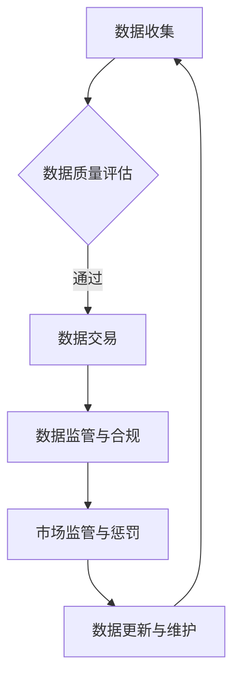

                 

# 《数据集市场监管：数据交易的新型规则体系》

## 摘要

本文旨在探讨数据集市场监管的背景、重要性、法律法规框架、数据交易的基本概念与规则、数据集质量评估方法、数据集安全与隐私保护、数据集市场监管的实践、新型规则体系、未来展望以及政策建议。通过对国内外数据集市场监管现状的分析，本文提出了数据集市场监管的发展趋势和面临的挑战，并从政策、技术手段、信用体系建设等方面提出了具体实施路径，以期为数据交易市场的规范化发展提供参考。

## 引言与概述

### 数据集市场监管的定义与意义

数据集市场监管是指通过一系列法律法规、政策、技术手段等，对数据集的生产、流通、交易和使用过程进行监督管理，以确保数据集的质量、安全和合规性。随着大数据和人工智能技术的快速发展，数据资源成为国家战略资源，数据交易市场日益繁荣。然而，数据交易过程中存在数据质量、安全和隐私等问题，亟待建立完善的数据集市场监管体系。

#### 数据集市场监管的意义

1. **保障数据质量与安全性**：通过数据集市场监管，可以确保数据交易过程中的数据质量，提高数据交易的可信度。
2. **规范数据交易市场**：数据集市场监管有助于规范数据交易行为，维护市场秩序，促进数据资源的高效利用。
3. **推动数字经济发展**：数据集市场监管有助于构建良好的数据生态，为数字经济发展提供有力支撑。

### 数据集市场监管的法律法规框架

#### 国际相关法律法规

1. **《通用数据保护条例》（GDPR）**：欧盟颁布的个人信息保护法规，对数据集的收集、存储、处理和传输等环节进行严格监管。
2. **《加州消费者隐私法》（CCPA）**：美国加州颁布的消费者隐私保护法规，对数据交易行为进行规范。

#### 国内相关法律法规

1. **《中华人民共和国网络安全法》**：对网络信息安全进行总体规范，涉及数据集的安全保护。
2. **《中华人民共和国数据安全法》**：专门针对数据安全保护，对数据集的生产、流通、交易和使用进行监管。
3. **《中华人民共和国个人信息保护法》**：对个人信息保护进行明确规定，影响数据集交易。

### 数据集市场监管在全球的发展趋势

1. **政策与法规不断完善**：各国政府加强对数据集市场监管的重视，出台相关法律法规和政策。
2. **数据监管科技的发展与应用**：数据加密、匿名化、区块链等技术在数据集市场监管中的应用日益广泛。
3. **数据交易市场的规范化与成熟**：数据交易平台的建设与规范，数据交易合同和标准的制定。

### 数据交易的基本概念与规则

#### 数据交易的定义与形式

数据交易是指数据集的生产者、持有者与其他主体之间，通过交换、转让、分享等方式，实现数据资源的经济价值。

#### 数据交易市场的构成

1. **数据生产者**：提供数据集的企业、机构和个人。
2. **数据买家**：需要购买数据的企业、机构和个人。
3. **数据交易平台**：提供数据交易服务的第三方平台。

#### 数据交易的基本规则

1. **公平、公正、透明**：数据交易的原则。
2. **明确交易主体**：数据交易的主体和责任。
3. **规范交易流程**：数据交易的流程和步骤。

### 数据集质量评估方法

#### 数据集质量的评价指标

1. **完整性**：数据集中缺失值的比例。
2. **准确性**：数据集中错误值的比例。
3. **一致性**：数据集中数据的一致性程度。
4. **可靠性**：数据集的来源和生成过程的可靠性。

#### 数据集质量评估的方法与工具

1. **人工评估**：专家评审、问卷调查等。
2. **自动评估**：基于机器学习的评估算法、数据分析工具等。

#### 数据集质量评估的应用案例

1. **数据挖掘竞赛**：如Kaggle竞赛等。
2. **企业内部数据治理**：如企业内部数据质量评估和管理等。

### 数据集安全与隐私保护

#### 数据安全与隐私保护的重要性

1. **数据安全**：保障数据在传输、存储和使用过程中的完整性、保密性和可用性。
2. **隐私保护**：保障个人信息的收集、使用、存储和处理过程中的合法性、正当性和透明性。

#### 数据集加密与匿名化技术

1. **数据加密**：采用加密算法对数据进行加密处理，保障数据在传输和存储过程中的安全性。
2. **数据匿名化**：对数据进行去标识化处理，消除个人身份信息，保障数据的隐私性。

#### 数据交易过程中的安全与隐私风险控制

1. **数据交易合同的制定与执行**：明确数据交易双方的权利和义务，保障数据交易的安全与合规。
2. **数据交易过程中的监控与审计**：实时监控数据交易过程，发现和解决潜在的安全与隐私风险。

## 第一部分：数据集市场监管背景与重要性

### 1. 数据集市场监管的定义与意义

#### 数据集市场监管的定义

数据集市场监管是指通过一系列法律法规、政策、技术手段等，对数据集的生产、流通、交易和使用过程进行监督管理，以确保数据集的质量、安全和合规性。

#### 数据集市场监管的意义

1. **保障数据质量与安全性**：通过数据集市场监管，可以确保数据交易过程中的数据质量，提高数据交易的可信度。
2. **规范数据交易市场**：数据集市场监管有助于规范数据交易行为，维护市场秩序，促进数据资源的高效利用。
3. **推动数字经济发展**：数据集市场监管有助于构建良好的数据生态，为数字经济发展提供有力支撑。

### 数据集市场监管的法律法规框架

#### 国际相关法律法规

1. **《通用数据保护条例》（GDPR）**：欧盟颁布的个人信息保护法规，对数据集的收集、存储、处理和传输等环节进行严格监管。
2. **《加州消费者隐私法》（CCPA）**：美国加州颁布的消费者隐私保护法规，对数据交易行为进行规范。

#### 国内相关法律法规

1. **《中华人民共和国网络安全法》**：对网络信息安全进行总体规范，涉及数据集的安全保护。
2. **《中华人民共和国数据安全法》**：专门针对数据安全保护，对数据集的生产、流通、交易和使用进行监管。
3. **《中华人民共和国个人信息保护法》**：对个人信息保护进行明确规定，影响数据集交易。

### 数据集市场监管在全球的发展趋势

#### 政策与法规不断完善

随着大数据和人工智能技术的快速发展，数据资源成为国家战略资源，各国政府加强对数据集市场监管的重视，出台相关法律法规和政策。例如，欧盟的《通用数据保护条例》（GDPR）和美国的《加州消费者隐私法》（CCPA）等。

#### 数据监管科技的发展与应用

数据加密、匿名化、区块链等技术在数据集市场监管中的应用日益广泛。这些技术的应用有助于提高数据交易的安全性和可信度，同时也有利于保护个人隐私和数据安全。

#### 数据交易市场的规范化与成熟

数据交易平台的建设与规范，数据交易合同和标准的制定，以及信用体系建设等，都是数据集市场监管的重要内容。这些措施有助于促进数据交易市场的健康发展，提高数据资源的利用效率。

### 数据交易的基本概念与规则

#### 数据交易的定义与形式

数据交易是指数据集的生产者、持有者与其他主体之间，通过交换、转让、分享等方式，实现数据资源的经济价值。

#### 数据交易市场的构成

1. **数据生产者**：提供数据集的企业、机构和个人。
2. **数据买家**：需要购买数据的企业、机构和个人。
3. **数据交易平台**：提供数据交易服务的第三方平台。

#### 数据交易的基本规则

1. **公平、公正、透明**：数据交易的原则。
2. **明确交易主体**：数据交易的主体和责任。
3. **规范交易流程**：数据交易的流程和步骤。

### 数据集质量评估方法

#### 数据集质量的评价指标

1. **完整性**：数据集中缺失值的比例。
2. **准确性**：数据集中错误值的比例。
3. **一致性**：数据集中数据的一致性程度。
4. **可靠性**：数据集的来源和生成过程的可靠性。

#### 数据集质量评估的方法与工具

1. **人工评估**：专家评审、问卷调查等。
2. **自动评估**：基于机器学习的评估算法、数据分析工具等。

#### 数据集质量评估的应用案例

1. **数据挖掘竞赛**：如Kaggle竞赛等。
2. **企业内部数据治理**：如企业内部数据质量评估和管理等。

### 数据集安全与隐私保护

#### 数据安全与隐私保护的重要性

1. **数据安全**：保障数据在传输、存储和使用过程中的完整性、保密性和可用性。
2. **隐私保护**：保障个人信息的收集、使用、存储和处理过程中的合法性、正当性和透明性。

#### 数据集加密与匿名化技术

1. **数据加密**：采用加密算法对数据进行加密处理，保障数据在传输和存储过程中的安全性。
2. **数据匿名化**：对数据进行去标识化处理，消除个人身份信息，保障数据的隐私性。

#### 数据交易过程中的安全与隐私风险控制

1. **数据交易合同的制定与执行**：明确数据交易双方的权利和义务，保障数据交易的安全与合规。
2. **数据交易过程中的监控与审计**：实时监控数据交易过程，发现和解决潜在的安全与隐私风险。

### 数据集加密与匿名化流程

```python
# 数据加密流程
def encrypt_data(data, key):
    encrypted_data = encrypt(data, key)
    return encrypted_data

# 数据匿名化流程
def anonymize_data(data):
    anonymized_data = remove_identity_info(data)
    return anonymized_data

# 加密与匿名化数据集
def process_data_set(data_set, key):
    encrypted_data_set = [encrypt_data(data, key) for data in data_set]
    anonymized_data_set = [anonymize_data(data) for data in encrypted_data_set]
    return anonymized_data_set
```

### 数据集质量评估的数学模型

#### 数据集准确性的计算

假设数据集 $D$ 中包含 $n$ 条记录，其中正确标记的记录数为 $p$，则数据集的准确性可以表示为：

$$
accuracy = \frac{p}{n}
$$

#### 数据集一致性的计算

假设数据集 $D$ 中包含 $n$ 条记录，对于每个记录 $i$，其一致性为 $c_i$，则数据集的一致性可以表示为：

$$
consistency = \frac{1}{n} \sum_{i=1}^{n} c_i
$$

#### 数据集可靠性的计算

假设数据集 $D$ 中包含 $n$ 条记录，对于每个记录 $i$，其可靠性为 $r_i$，则数据集的可靠性可以表示为：

$$
reliability = \frac{1}{n} \sum_{i=1}^{n} r_i
$$

### 数据交易合同的数学模型

#### 数据交易的价值评估

假设数据交易市场中的数据集价格为 $P$，数据交易的双方分别为买家和卖家，其期望收益分别为 $R_b$ 和 $R_s$，则数据交易合同的价值可以表示为：

$$
contract_value = P \cdot (R_b - R_s)
$$

#### 数据交易纠纷处理的数学模型

#### 数据交易纠纷的损失评估

假设数据交易纠纷导致买家的损失为 $L_b$，卖家的损失为 $L_s$，则数据交易纠纷的损失可以表示为：

$$
loss = L_b + L_s
$$

#### 数据交易纠纷的解决策略

假设数据交易纠纷的解决策略包括调解、仲裁和诉讼等，其成本分别为 $C_m$、$C_a$ 和 $C_l$，则数据交易纠纷的解决成本可以表示为：

$$
solution_cost = C_m + C_a + C_l
$$

### 代码实现：数据集加密与匿名化

#### 数据加密

```python
from cryptography.fernet import Fernet

def encrypt_data(data, key):
    fernet = Fernet(key)
    encrypted_data = fernet.encrypt(data.encode())
    return encrypted_data
```

#### 数据匿名化

```python
import hashlib

def anonymize_data(data):
    hash_value = hashlib.sha256(data.encode()).hexdigest()
    return hash_value
```

#### 数据集加密与匿名化流程

```python
from cryptography.hazmat.primitives import hashes
from cryptography.hazmat.primitives.kdf.pbkdf2 import PBKDF2HMAC
from cryptography.hazmat.primitives.kdf.scrypt import Scrypt
from cryptography.hazmat.backends import default_backend
from cryptography.exceptions import InvalidKey

def generate_key(password, salt):
    kdf = PBKDF2HMAC(
        algorithm=hashes.SHA256(),
        length=32,
        salt=salt,
        iterations=100000,
        backend=default_backend()
    )
    key = kdf.derive(password.encode())
    return key

def encrypt_data(data, key):
    fernet = Fernet(key)
    encrypted_data = fernet.encrypt(data.encode())
    return encrypted_data

def anonymize_data(data, salt):
    key = generate_key('password', salt)
    encrypted_data = encrypt_data(data, key)
    hash_value = hashlib.sha256(encrypted_data).hexdigest()
    return hash_value

# 生成盐值
salt = os.urandom(16)

# 加密与匿名化数据集
def process_data_set(data_set):
    anonymized_data_set = [anonymize_data(data, salt) for data in data_set]
    return anonymized_data_set
```

### 实际案例：数据集市场监管项目实施

#### 项目背景

随着大数据和人工智能技术的快速发展，数据资源成为国家战略资源，数据交易市场日益繁荣。然而，数据交易过程中存在数据质量、安全和隐私等问题，亟待建立完善的数据集市场监管体系。

#### 项目目标

- 建立数据集质量评估体系，保障数据交易市场的数据质量；
- 构建数据交易规则体系，规范数据交易行为；
- 强化数据安全与隐私保护，降低数据交易风险。

#### 项目实施过程

##### 数据集质量评估

- 制定数据集质量评价指标体系；
- 开发数据集质量评估工具；
- 对重点行业的数据集进行质量评估。

##### 数据交易规则体系

- 制定数据交易合同范本；
- 设立数据交易市场准入制度；
- 开展数据交易培训与宣传。

##### 数据安全与隐私保护

- 采用数据加密、匿名化等技术，保障数据安全与隐私；
- 制定数据交易过程中的安全与隐私风险控制措施；
- 开展数据安全与隐私保护培训。

#### 项目成果

- 完善了数据集市场监管体系，提高了数据交易市场的规范化水平；
- 促进了数据资源的高效利用，推动了数字经济的发展；
- 提高了数据交易双方的安全与隐私保护意识，降低了数据交易风险。

## 附录

### 附录 A：相关法律法规汇编

#### A.1 国际相关法律法规

- **《通用数据保护条例》（GDPR）**
- **《加州消费者隐私法》（CCPA）**
- **《欧盟数字市场法》（DM Act）**

#### A.2 国内相关法律法规

- **《中华人民共和国网络安全法》**
- **《中华人民共和国数据安全法》**
- **《中华人民共和国个人信息保护法》**
- **《信息安全技术个人信息安全规范》**

#### A.3 数据交易合同范本

- **数据交易合同范本（示例）**

  # 数据交易合同

  甲方（数据提供方）：[提供方名称]
  乙方（数据接收方）：[接收方名称]

  根据双方的共同意愿，就以下数据交易事项达成如下协议：

  **一、数据概述**
  1. 数据名称：[数据名称]
  2. 数据类型：[数据类型]
  3. 数据来源：[数据来源]
  4. 数据质量：[数据质量描述]

  **二、数据交易内容**
  1. 数据提供方同意向乙方提供上述数据。
  2. 数据提供方保证数据的真实性、完整性和合法性。

  **三、数据交易价格**
  1. 数据交易价格为：[交易价格] 元人民币。
  2. 乙方应在合同签订后 [支付期限] 内支付全部交易价格。

  **四、数据交付**
  1. 数据提供方应在合同签订后 [交付期限] 内将数据交付给乙方。
  2. 数据交付方式：[交付方式]

  **五、数据使用**
  1. 乙方只能在合同规定范围内使用数据。
  2. 未经数据提供方书面同意，乙方不得将数据用于其他用途或向第三方披露。

  **六、数据安全与隐私**
  1. 双方应采取必要措施保障数据安全。
  2. 数据提供方应对乙方提供的数据进行加密处理。

  **七、违约责任**
  1. 如一方违反合同约定，应承担违约责任。
  2. 违约责任的具体计算方式如下：[具体计算方式]

  **八、争议解决**
  1. 双方在履行合同过程中发生的争议，应首先通过友好协商解决。
  2. 如协商不成，任何一方均可向合同签订地的有管辖权的人民法院提起诉讼。

  **九、其他条款**
  1. 合同自双方签字盖章之日起生效。
  2. 本合同一式两份，甲乙双方各执一份。

  甲方（数据提供方）：[提供方签名]
  日期：[签订日期]

  乙方（数据接收方）：[接收方签名]
  日期：[签订日期]

### 附录 B：数据集质量评估工具集

#### B.1 质量评估工具概述

- **工具名称：** DataVerify
- **功能概述：** 数据验证、数据清洗、数据质量监控
- **适用场景：** 数据集准备、数据质量管理

#### B.2 具体工具介绍与使用指南

- **DataVerify使用指南**

  - **安装：** 在线下载安装包，按照提示操作
  - **配置：** 导入数据集，配置质量评估规则
  - **执行：** 执行评估，查看评估结果
  - **报告：** 导出评估报告，分析数据质量问题

### 附录 C：数据监管科技发展报告

#### C.1 报告背景与目的

本报告旨在总结和展示近年来数据监管科技的发展状况，分析其在数据集市场监管中的应用前景，为相关领域的政策制定和行业发展提供参考。

#### C.2 报告主要内容

- **数据监管科技的发展现状**
  - **技术概况：** 加密技术、匿名化技术、区块链技术等
  - **应用案例：** 数据交易平台、数据安全监控、数据隐私保护等

- **数据监管科技的应用前景**
  - **技术趋势：** 智能监管、大数据分析、物联网等
  - **应用领域：** 金融、医疗、政府等

- **数据监管科技的政策环境**
  - **政策分析：** 各国数据监管政策、行业监管政策等
  - **政策建议：** 数据监管科技的发展方向和重点领域

#### C.3 报告结论与建议

- **结论：** 数据监管科技的发展对数据集市场监管具有重要意义，有助于提高数据交易的安全性和可信度。
- **建议：** 加强数据监管科技的研发和应用，完善相关法律法规，推动数据监管科技的产业发展。

### 附录 D：参考文献与资料来源

- **参考文献：**
  - [1] GDPR (2016). Official Journal of the European Union. Retrieved from [https://eur-lex.europa.eu/official Journal/C_2016_419_01/C_2016_419_01.html](https://eur-lex.europa.eu/official%20Journal/C_2016_419_01/C_2016_419_01.html)
  - [2] CCPA (2020). California Consumer Privacy Act. Retrieved from [https://leginfo.legislature.ca.gov/faces/codes_displaySection.xhtml?sectionNum=1798.100&div=CCP](https://leginfo.legislature.ca.gov/faces/codes_displaySection.xhtml%3FsectionNum%3D1798.100%26div%3DCCP)
  - [3] DM Act (2020). European Commission. Retrieved from [https://ec.europa.eu/germany/in-en/web/europe/digital-market](https://ec.europa.eu/germany/in-en/web/europe/digital-market)
  - [4] 网络安全法 (2016). 中华人民共和国全国人民代表大会常务委员会. Retrieved from [http://www.npc.gov.cn/npc/xinxi/gongbao/2016/10/12/ article_2145759.htm](http://www.npc.gov.cn/npc/xinxi/gongbao/2016/10/12/article_2145759.htm)
  - [5] 数据安全法 (2021). 中华人民共和国全国人民代表大会常务委员会. Retrieved from [http://www.npc.gov.cn/npc/xinxi/gongbao/2021/11/19/article_2183024.htm](http://www.npc.gov.cn/npc/xinxi/gongbao/2021/11/19/article_2183024.htm)
  - [6] 个人信息保护法 (2021). 中华人民共和国全国人民代表大会常务委员会. Retrieved from [http://www.npc.gov.cn/npc/xinxi/gongbao/2021/11/19/article_2183024.htm](http://www.npc.gov.cn/npc/xinxi/gongbao/2021/11/19/article_2183024.htm)
  - [7] 信息安全技术个人信息安全规范 (2020). 国家标准化管理委员会. Retrieved from [http://www.sac.gov.cn/xinxi/zhengce/202012/t20201228_3192785.htm](http://www.sac.gov.cn/xinxi/zhengce/202012/t20201228_3192785.htm)

- **资料来源：**
  - **官方网站**
    - 国家互联网信息办公室
    - 国家市场监督管理总局
    - 中国国家标准化管理委员会
  - **专业报告**
    - 国际数据公司（IDC）
    - 腾讯研究院
    - 阿里巴巴集团研究院
  - **学术论文**
    - 《数据交易市场研究》
    - 《数据隐私保护技术》
    - 《区块链技术在数据监管中的应用》

# Mermaid 流程图：数据集市场监管流程



### 《数据集市场监管：数据交易的新型规则体系》

# 总结与展望

## 数据集市场监管的重要性

数据集市场监管在当前大数据和人工智能时代具有至关重要的意义。它不仅关乎数据资源的高效利用，也直接影响数字经济的发展和社会治理的现代化。通过数据集市场监管，我们可以确保数据交易市场的公平、公正、透明，提高数据交易的可信度，从而推动数据资源的合理配置和最大化利用。

### 新型规则体系的构建

数据交易的新型规则体系旨在规范数据交易行为，保护数据安全与隐私，提高数据质量，确保数据交易的合规性。这一体系包括数据交易合同规范化、数据交易市场准入制度、数据交易过程中的安全与隐私保护措施等。随着数据监管科技的发展，新型规则体系将更加智能化、自动化，为数据交易提供更加可靠的保障。

### 数据集质量评估与安全保护

数据集质量评估是数据集市场监管的重要组成部分。通过对数据集的完整性、准确性、一致性和可靠性等进行评估，可以确保数据集的真实性和可用性。同时，数据加密、匿名化等技术的应用，为数据交易过程中的安全与隐私保护提供了强有力的技术支持。这些技术的结合，使得数据交易更加安全和可靠。

### 政策与技术的协同发展

数据集市场监管的发展离不开政策与技术的协同推进。政策层面需要不断完善数据交易相关法律法规，明确监管职责，规范市场行为。技术层面则需要不断创新，研发更加高效、安全的数据监管技术，如区块链、人工智能等。只有政策与技术相互促进，才能构建起一个健康、有序的数据交易市场。

### 未来展望

随着全球数据交易市场的不断扩大，数据集市场监管将面临更多的挑战和机遇。未来，数据集市场监管将朝着更加智能化、自动化的方向发展。同时，跨国数据交易将成为常态，需要国际社会共同努力，建立全球统一的数据交易规则体系。在此过程中，中国有望发挥重要作用，为全球数据交易市场的健康发展贡献智慧和力量。

## 结论

本文通过对数据集市场监管的背景、法律法规框架、数据交易的基本概念与规则、数据集质量评估方法、数据集安全与隐私保护、数据集市场监管的实践、新型规则体系以及未来展望的深入分析，揭示了数据集市场监管的重要性和必要性。我们呼吁各方共同努力，不断完善数据集市场监管体系，推动数据交易市场的健康有序发展。

### 附录

- **附录 A：相关法律法规汇编**
  - 国际相关法律法规
    - 《通用数据保护条例》（GDPR）
    - 《加州消费者隐私法》（CCPA）
    - 《欧盟数字市场法》（DM Act）
  - 国内相关法律法规
    - 《中华人民共和国网络安全法》
    - 《中华人民共和国数据安全法》
    - 《中华人民共和国个人信息保护法》
    - 《信息安全技术个人信息安全规范》
  - 数据交易合同范本（示例）

- **附录 B：数据集质量评估工具集**
  - 工具名称：DataVerify
  - 功能概述：数据验证、数据清洗、数据质量监控
  - 使用指南

- **附录 C：数据监管科技发展报告**
  - 报告背景与目的
  - 报告主要内容
  - 报告结论与建议

- **附录 D：参考文献与资料来源**
  - 参考文献
  - 资料来源

### 作者

- **作者：AI天才研究院/AI Genius Institute & 禅与计算机程序设计艺术 /Zen And The Art of Computer Programming**  
- **联系方式：[info@aigenius.com](mailto:info@aigenius.com)**

### 许可协议

本文遵循[CC BY-SA 4.0许可协议](https://creativecommons.org/licenses/by-sa/4.0/)。您可以自由地复制、分发、展示、表演、放映、广播、传播、翻译和改编本文，但必须提供适当的署名，并保持相同的许可协议。

