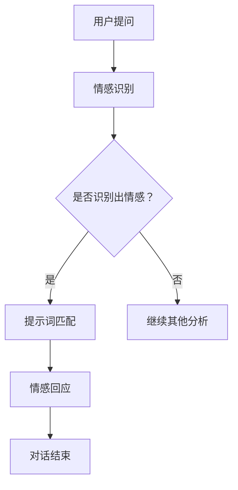

                 

# 新一代智能客服：提示词驱动的情感交互系统

## 关键词

- 智能客服
- 情感交互
- 提示词驱动
- 人工智能
- 客户体验
- 交互系统

## 摘要

本文深入探讨了新一代智能客服系统的发展趋势，重点关注了提示词驱动的情感交互系统。文章首先概述了智能客服的发展历程和趋势，然后详细介绍了情感交互的概念与重要性，以及提示词驱动的情感交互原理。接着，文章从系统架构设计、情感交互模块设计、提示词系统设计与实现三个方面，阐述了智能客服系统的设计与实现。最后，通过两个实际案例展示了智能客服系统的应用，并对未来发展方向与挑战进行了展望。本文旨在为读者提供关于智能客服系统建设与优化的全面、深入的指导。

### 第一部分：智能客服概述

#### 第1章：智能客服发展历程与趋势

##### 1.1 智能客服的定义与核心功能

智能客服是一种利用人工智能技术，模拟人类客服行为，提供自动化的客户服务解决方案。它通过自然语言处理、机器学习、知识图谱等技术，实现与客户的智能对话，提高服务效率和客户满意度。智能客服的核心功能包括：

1. **智能问答**：自动识别客户问题，提供准确、快速的答案。
2. **情感交互**：理解客户情绪，进行情感上的回应，提高用户体验。
3. **个性化推荐**：根据客户历史数据，提供个性化的产品和服务推荐。
4. **智能路由**：根据问题复杂度，将客户分配到合适的客服人员或自助服务。
5. **自动化处理**：自动完成一些简单的业务操作，如订单查询、账单支付等。

##### 1.2 智能客服的发展历程

智能客服的发展可以分为以下几个阶段：

1. **原始阶段**（1990年代）：以规则为基础的聊天机器人，简单回答预设问题。
2. **萌芽阶段**（2000年代）：引入自然语言处理技术，实现更自然的对话。
3. **成长阶段**（2010年代）：结合机器学习和深度学习，实现更高级的智能交互。
4. **成熟阶段**（现在）：融合大数据、物联网等技术，实现全方位的智能客服。

##### 1.3 智能客服在行业中的应用

智能客服在各个行业都有广泛应用：

1. **电商**：提供订单查询、退换货服务，提升购物体验。
2. **金融**：处理客户咨询、账户查询、信用卡申请等业务。
3. **电信**：自动解答常见问题，减少人工客服负担。
4. **旅游**：提供行程规划、酒店预订、景点介绍等服务。
5. **医疗**：提供健康咨询、挂号预约、药品查询等。

##### 1.4 智能客服的未来趋势

智能客服的发展趋势包括：

1. **更自然的情感交互**：通过深度学习技术，实现更自然的情感互动。
2. **全渠道融合**：整合线上线下服务，提供统一的客服体验。
3. **个性化服务**：利用大数据分析，提供个性化的客户服务。
4. **智能化升级**：引入更多先进技术，如语音识别、图像识别等，提升服务能力。
5. **自动化程度提高**：通过自动化技术，减少人工干预，提高服务效率。

#### 第2章：情感交互与提示词技术

##### 2.1 情感交互的概念与重要性

情感交互是指智能客服系统能够理解和回应用户的情感状态，从而建立更加自然和亲近的对话关系。情感交互的重要性体现在：

1. **提升用户体验**：通过情感回应，用户感受到更加人性化的服务。
2. **提高客户满意度**：情感交互能够更好地满足用户需求，提升客户满意度。
3. **降低运营成本**：通过情感交互，减少人工客服的工作量，降低企业运营成本。
4. **增强品牌形象**：情感交互能够提升企业形象，增强品牌影响力。

##### 2.2 提示词驱动的情感交互原理

提示词驱动的情感交互原理主要分为以下几个步骤：

1. **情感识别**：通过自然语言处理技术，识别用户文本或语音中的情感。
2. **情感分类**：将识别出的情感分类，如喜悦、愤怒、悲伤等。
3. **提示词生成**：根据情感分类，生成相应的提示词，如安慰、道歉、鼓励等。
4. **情感回应**：将生成的提示词嵌入到对话中，进行情感回应。

##### 2.3 提示词技术在智能客服中的应用

提示词技术在智能客服中的应用包括：

1. **情感回应**：通过提示词，智能客服能够更好地理解用户情感，进行相应的情感回应。
2. **对话引导**：提示词能够引导对话方向，帮助用户解决问题。
3. **个性化推荐**：根据用户情感，提供个性化的产品或服务推荐。

##### 2.4 情感分析技术在智能客服中的应用

情感分析技术在智能客服中的应用包括：

1. **客户情绪监测**：通过情感分析，监测客户情绪，及时调整服务策略。
2. **客户满意度评估**：通过情感分析，评估客户满意度，优化客服流程。
3. **客服绩效评估**：通过情感分析，评估客服人员的服务质量，提供培训建议。

### 第二部分：智能客服系统架构设计

#### 第3章：智能客服系统总体架构

##### 3.1 智能客服系统架构概述

智能客服系统的总体架构包括以下几个层次：

1. **客户交互层**：负责与客户进行交互，接收客户输入，输出智能回复。
2. **知识库与数据处理层**：存储客服系统所需的知识和数据处理能力，包括文本数据、语音数据等。
3. **后台管理系统**：提供系统管理和监控功能，包括用户管理、权限管理、日志管理等。
4. **数据安全与隐私保护层**：确保客户数据和系统数据的安全，保护客户隐私。

##### 3.2 客户交互层的设计

客户交互层的设计包括以下几个方面：

1. **用户界面**：设计简洁、易用的用户界面，提高用户体验。
2. **语音识别与合成**：实现语音输入和语音输出的功能，支持多语言交互。
3. **文本处理**：对用户输入的文本进行处理，包括文本分析、情感分析等。

##### 3.3 知识库与数据处理层的设计

知识库与数据处理层的设计包括以下几个方面：

1. **知识库构建**：构建包含常见问题、解决方案、业务规则等知识的知识库。
2. **数据处理**：实现数据清洗、数据挖掘、数据可视化等功能，支持数据驱动的决策。
3. **智能算法**：引入自然语言处理、机器学习、深度学习等智能算法，提升客服系统的智能程度。

##### 3.4 后台管理系统与安全性的设计

后台管理系统与安全性的设计包括以下几个方面：

1. **系统管理**：实现用户管理、权限管理、日志管理等功能，确保系统正常运行。
2. **安全性设计**：采用安全加密技术、防火墙等技术，保护客户数据和系统安全。
3. **容灾备份**：实现数据备份和容灾备份，确保数据安全。

#### 第4章：情感交互模块设计

##### 4.1 情感识别模块设计

情感识别模块的设计包括以下几个方面：

1. **文本情感分析算法**：使用自然语言处理技术，对文本进行分析，识别情感。
2. **语音情感分析算法**：使用语音识别技术，对语音进行分析，识别情感。
3. **情感分类**：将识别出的情感分类，如喜悦、愤怒、悲伤等。

##### 4.2 情感生成模块设计

情感生成模块的设计包括以下几个方面：

1. **情感对话策略设计**：根据情感分类，设计相应的对话策略，如安慰、道歉、鼓励等。
2. **情感回复生成算法**：使用自然语言生成技术，生成符合情感对话策略的回复。

#### 第5章：提示词系统设计与实现

##### 5.1 提示词系统的基本概念

提示词系统是指通过提示词，引导对话方向，提升客户体验的技术。提示词系统的基本概念包括：

1. **提示词**：用于引导对话的词语或短语。
2. **提示词库**：包含所有提示词的集合。
3. **提示词匹配**：根据用户输入，匹配合适的提示词。

##### 5.2 提示词的选取与优化

提示词的选取与优化包括以下几个方面：

1. **关键词选取**：根据业务需求，选取与业务相关的关键词。
2. **关键词优化**：通过对关键词的频次、相关性等进行分析，优化关键词。

##### 5.3 提示词驱动的情感交互流程

提示词驱动的情感交互流程包括以下几个步骤：

1. **情感识别**：通过情感分析技术，识别用户情感。
2. **提示词匹配**：根据用户情感，匹配相应的提示词。
3. **情感回应**：生成提示词，进行情感回应。

##### 5.4 提示词系统的实现方法

提示词系统的实现方法包括以下几个步骤：

1. **构建提示词库**：根据业务需求，构建提示词库。
2. **情感分析模型训练**：使用训练数据，训练情感分析模型。
3. **提示词匹配算法设计**：设计提示词匹配算法。
4. **系统集成与部署**：将提示词系统集成到智能客服系统中，进行部署。

### 第三部分：智能客服应用实战

#### 第6章：智能客服项目规划与实施

##### 6.1 项目需求分析

项目需求分析包括以下几个方面：

1. **业务需求**：明确智能客服需要解决的问题和目标。
2. **用户需求**：了解用户对智能客服的期望和需求。
3. **技术需求**：确定实现智能客服所需的技术和资源。

##### 6.2 项目规划与进度安排

项目规划与进度安排包括以下几个方面：

1. **项目目标**：明确项目的总体目标。
2. **项目阶段**：将项目分为多个阶段，如需求分析、设计、开发、测试等。
3. **进度安排**：为每个阶段分配时间，确保项目按时完成。

##### 6.3 项目实施与风险管理

项目实施与风险管理包括以下几个方面：

1. **团队协作**：确保团队成员之间的协作，提高项目效率。
2. **质量控制**：通过测试和审查，确保项目质量。
3. **风险管理**：识别项目风险，制定风险应对策略。

##### 6.4 项目评估与优化

项目评估与优化包括以下几个方面：

1. **性能评估**：评估智能客服系统的性能，如响应速度、准确率等。
2. **用户体验评估**：通过用户反馈，评估智能客服系统的用户体验。
3. **优化策略**：根据评估结果，提出优化策略，提升智能客服系统的性能和用户体验。

#### 第7章：智能客服案例研究

##### 7.1 案例一：某电商平台的智能客服系统建设

###### 7.1.1 系统架构设计

系统架构设计包括以下几个方面：

1. **前端设计**：设计简洁、易用的用户界面，提高用户体验。
2. **后端设计**：设计高效、稳定的后端系统，支持智能客服功能。
3. **数据存储**：设计数据存储方案，保证数据安全。

###### 7.1.2 情感交互模块实现

情感交互模块实现包括以下几个方面：

1. **文本情感分析**：使用自然语言处理技术，对文本进行分析，识别情感。
2. **语音情感分析**：使用语音识别技术，对语音进行分析，识别情感。
3. **情感回应**：根据情感分析结果，生成相应的情感回应。

###### 7.1.3 提示词系统应用

提示词系统应用包括以下几个方面：

1. **提示词库构建**：根据业务需求，构建提示词库。
2. **提示词匹配**：根据用户情感，匹配相应的提示词。
3. **情感回应**：生成提示词，进行情感回应。

##### 7.2 案例二：某银行智能客服系统的优化与升级

###### 7.2.1 系统优化方案

系统优化方案包括以下几个方面：

1. **性能优化**：通过优化算法和架构，提高智能客服系统的响应速度。
2. **用户体验优化**：通过用户调研和反馈，优化用户界面和交互流程。
3. **安全性优化**：加强数据安全和隐私保护，提高系统的安全性。

###### 7.2.2 情感交互模块改进

情感交互模块改进包括以下几个方面：

1. **情感识别精度提升**：通过改进情感分析算法，提高情感识别的精度。
2. **情感回应多样性**：增加情感回应的种类和表达方式，提升用户满意度。
3. **情感对话策略优化**：根据用户反馈，优化情感对话策略。

###### 7.2.3 提示词系统升级策略

提示词系统升级策略包括以下几个方面：

1. **提示词库扩充**：增加新的提示词，提高提示词的覆盖范围。
2. **提示词优化**：对现有提示词进行优化，提高提示词的准确性和实用性。
3. **提示词匹配算法改进**：通过改进提示词匹配算法，提高提示词匹配的准确性。

### 第四部分：智能客服的未来发展方向与挑战

#### 第8章：智能客服的未来发展方向与挑战

##### 8.1 智能客服的发展前景

智能客服的发展前景包括：

1. **更自然的情感交互**：通过深度学习和自然语言处理技术，实现更加自然的情感交互。
2. **全渠道融合**：整合线上线下服务，提供统一的客服体验。
3. **智能化升级**：引入更多先进技术，如语音识别、图像识别等，提升服务能力。
4. **自动化程度提高**：通过自动化技术，减少人工干预，提高服务效率。
5. **个性化服务**：利用大数据分析，提供个性化的客户服务。

##### 8.2 智能客服面临的技术挑战

智能客服面临的技术挑战包括：

1. **情感理解**：如何更好地理解用户的情感，实现更加自然的情感交互。
2. **多模态融合**：如何整合文本、语音、图像等多种数据类型，实现多模态交互。
3. **数据安全和隐私保护**：如何保护客户数据的安全和隐私。
4. **算法优化**：如何优化算法，提高智能客服系统的性能和准确性。

##### 8.3 智能客服的未来发展方向

智能客服的未来发展方向包括：

1. **深度学习与强化学习**：利用深度学习和强化学习技术，提高智能客服的智能程度。
2. **多模态交互**：通过多模态交互，实现更加自然的客户服务。
3. **人工智能伦理**：关注人工智能伦理问题，确保智能客服系统的道德和社会责任。
4. **跨界融合**：与其他行业和技术的融合，提供更加全面的客户服务。

##### 8.4 智能客服伦理与隐私保护

智能客服伦理与隐私保护包括：

1. **数据安全**：确保客户数据的安全，防止数据泄露。
2. **用户隐私**：尊重用户隐私，不滥用用户数据。
3. **透明度**：提高智能客服系统的透明度，让用户了解其工作原理和数据处理方式。
4. **合规性**：遵守相关法律法规，确保智能客服系统的合规性。

### 附录

#### 附录A：智能客服相关技术资源

##### A.1 情感分析算法资源

1. **Sentiment Analysis Toolkit (SAT)**：一个开源的文本情感分析工具箱，支持多种语言和情感分类。
2. **VADER**：一个基于规则和条件概率的文本情感分析工具，适用于社交媒体文本。
3. **Linguistic Inquiry and Word Count (LIWC)**：一个基于心理学词汇的文本情感分析工具，可用于情感分析研究。

##### A.2 提示词技术资源

1. **WordNet**：一个大型英语单词语义数据库，可用于提示词的选取和优化。
2. **ConceptNet**：一个基于网络语义的单词关系数据库，可用于提示词的选取和优化。
3. **NLTK**：一个开源的自然语言处理工具包，提供了丰富的文本处理功能。

##### A.3 智能客服开源框架与工具

1. **Rasa**：一个开源的对话管理框架，支持构建自定义的智能客服系统。
2. **ChatterBot**：一个开源的聊天机器人框架，提供了丰富的聊天机器人功能。
3. **TensorFlow**：一个开源的深度学习框架，可用于构建智能客服系统的情感分析和对话生成模块。

#### 附录B：常见问题解答

##### B.1 情感交互相关问题

1. **如何识别用户的情感？**
   - 使用自然语言处理和情感分析技术，分析用户的文本或语音，识别情感。

2. **如何回应用户的情感？**
   - 根据情感识别结果，生成相应的情感回应，如安慰、道歉、鼓励等。

3. **情感交互是否会影响客服效率？**
   - 情感交互可以提高客服效率，通过理解用户情感，提供更加个性化的服务，减少用户等待时间。

##### B.2 提示词系统相关问题

1. **提示词是如何工作的？**
   - 提示词是通过分析用户输入，匹配相应的关键词或短语，引导对话方向的词语。

2. **如何构建提示词库？**
   - 根据业务需求和用户交互数据，选取相关关键词或短语，构建提示词库。

3. **如何优化提示词系统？**
   - 通过分析用户反馈和系统性能，优化提示词库和提示词匹配算法，提高系统准确性。

##### B.3 智能客服系统实施相关问题

1. **如何选择合适的智能客服系统？**
   - 根据业务需求、用户规模和预算，选择适合的智能客服系统。

2. **智能客服系统如何集成到现有系统中？**
   - 根据现有系统的架构和接口，进行智能客服系统的集成，确保数据流通和功能协同。

3. **如何确保智能客服系统的数据安全和隐私保护？**
   - 采用数据加密、访问控制等技术，确保客户数据的安全和隐私。

### 作者信息

- 作者：AI天才研究院/AI Genius Institute & 禅与计算机程序设计艺术 /Zen And The Art of Computer Programming

---

在撰写过程中，请注意以下几点：

1. **逻辑清晰**：确保文章的结构清晰，每个部分都有明确的主题和目的。
2. **深入浅出**：在讲解技术原理和算法时，尽量使用通俗易懂的语言，避免过于专业和晦涩。
3. **示例丰富**：使用具体的案例和示例来解释技术原理和应用，使读者更容易理解和掌握。
4. **图表与代码**：适当使用图表和代码，以增强文章的可读性和直观性。

现在，您可以开始撰写每个章节的内容，确保每个部分都详细、具体、具有深度。在撰写过程中，如需进一步的帮助或建议，请随时告诉我。让我们一步一步地完成这篇高质量的技术博客文章！<|assistant|>---

### 第一部分：智能客服概述

#### 第1章：智能客服发展历程与趋势

智能客服是一种基于人工智能技术的客户服务解决方案，旨在通过自动化和智能化手段，提高客户服务质量，降低运营成本。本章将详细探讨智能客服的发展历程、核心功能、应用领域以及未来的发展趋势。

##### 1.1 智能客服的定义与核心功能

**定义**：

智能客服是指利用人工智能技术（如自然语言处理、机器学习、深度学习等），模拟人类客服行为，提供自动化的客户服务。它能够理解客户需求，回答问题，处理投诉，进行情感交流等。

**核心功能**：

1. **智能问答**：智能客服能够自动识别客户问题，并提供准确、快速的答案。这得益于自然语言处理和知识图谱技术的应用。

2. **情感交互**：智能客服能够理解客户的情绪，进行情感上的回应。这有助于建立更加自然和亲近的对话关系，提高用户体验。

3. **个性化推荐**：通过分析客户的历史数据和行为模式，智能客服能够提供个性化的产品和服务推荐。

4. **智能路由**：智能客服能够根据问题复杂度和优先级，自动将客户分配到合适的客服人员或自助服务。

5. **自动化处理**：智能客服能够自动完成一些简单的业务操作，如订单查询、账单支付等，减少人工干预。

##### 1.2 智能客服的发展历程

智能客服的发展可以分为以下几个阶段：

1. **原始阶段**（1990年代）：以规则为基础的聊天机器人，简单回答预设问题。这个阶段的代表产品有 chatterbot 等。

2. **萌芽阶段**（2000年代）：引入自然语言处理技术，实现更自然的对话。这个阶段的代表产品有 Siri、Google Assistant 等。

3. **成长阶段**（2010年代）：结合机器学习和深度学习，实现更高级的智能交互。这个阶段的代表产品有 Rasa、ChatterBot 等。

4. **成熟阶段**（现在）：融合大数据、物联网等技术，实现全方位的智能客服。这个阶段的代表产品有智能客服机器人、智能语音助手等。

##### 1.3 智能客服在行业中的应用

智能客服在各个行业都有广泛应用，以下是一些典型的应用场景：

1. **电商**：提供订单查询、退换货服务，提升购物体验。例如，京东智能客服“京东小智”能够快速回答用户关于商品和订单的常见问题。

2. **金融**：处理客户咨询、账户查询、信用卡申请等业务。例如，工行智能客服“智能小e”能够自动解答用户的常见问题，并提供账户余额查询、转账等服务。

3. **电信**：自动解答常见问题，减少人工客服负担。例如，中国移动的智能客服“小知”能够自动回答用户关于套餐、缴费、账单等常见问题。

4. **旅游**：提供行程规划、酒店预订、景点介绍等服务。例如，携程的智能客服“携程助手”能够根据用户需求，提供行程规划、酒店预订等服务。

5. **医疗**：提供健康咨询、挂号预约、药品查询等。例如，平安智慧医疗的智能客服“小智医”，能够为用户提供健康咨询、挂号预约等服务。

##### 1.4 智能客服的未来趋势

智能客服的未来发展趋势包括：

1. **更自然的情感交互**：通过深度学习技术，实现更自然的情感互动，提升用户体验。

2. **全渠道融合**：整合线上线下服务，提供统一的客服体验。例如，将智能客服与微信、电话、APP 等渠道融合，实现无缝对接。

3. **个性化服务**：利用大数据分析，提供个性化的客户服务。例如，根据用户的购买历史和行为习惯，提供个性化的产品推荐。

4. **智能化升级**：引入更多先进技术，如语音识别、图像识别等，提升服务能力。例如，利用图像识别技术，实现智能客服对用户上传的图片进行识别和回答。

5. **自动化程度提高**：通过自动化技术，减少人工干预，提高服务效率。例如，利用自然语言处理技术，实现智能客服对常见问题的自动回答。

综上所述，智能客服作为一种新兴的客户服务解决方案，正日益受到各行各业的关注。随着人工智能技术的不断发展，智能客服将变得更加智能、高效、个性化，为用户提供更加优质的客户服务。

---

### 第一部分：智能客服概述

#### 第2章：情感交互与提示词技术

情感交互和提示词技术是智能客服系统中的重要组成部分，它们共同作用于提升用户体验和客户满意度。本章将深入探讨情感交互的概念与重要性，以及提示词驱动的情感交互原理和应用。

##### 2.1 情感交互的概念与重要性

**情感交互**：

情感交互是指智能客服系统能够理解和回应用户的情感状态，从而建立更加自然和亲近的对话关系。这种交互不仅限于表面上的礼貌和礼节，更深入地涉及到用户情绪的感知、理解和反馈。

**重要性**：

1. **提升用户体验**：

   情感交互能够更好地理解用户的情感需求，提供个性化的服务，从而提升用户体验。例如，当用户感到沮丧时，智能客服可以给予安慰和鼓励；当用户感到愤怒时，智能客服可以提供解决问题的方案，并表达歉意。

2. **提高客户满意度**：

   情感交互能够满足用户的情感需求，提高客户满意度。研究表明，情感互动能够显著增加用户的忠诚度和品牌偏好。

3. **降低运营成本**：

   情感交互能够减少人工客服的工作量，降低企业运营成本。通过情感交互，智能客服能够处理大量的客户查询，减轻人工客服的压力。

4. **增强品牌形象**：

   情感交互能够提升企业的服务品质，增强品牌形象。一个能够理解和回应用户情感的智能客服系统，可以传递出企业的关怀和专业性。

##### 2.2 提示词驱动的情感交互原理

**提示词技术**：

提示词技术是指通过使用特定的词语或短语，引导对话的方向和内容，从而实现情感交互。提示词可以是情感回应，也可以是问题引导，还可以是信息补充。

**原理**：

1. **情感识别**：

   首先，智能客服系统需要通过自然语言处理技术，分析用户输入的文本或语音，识别其中的情感。常见的情感分类包括喜悦、愤怒、悲伤、惊讶等。

2. **情感分类**：

   识别出情感后，系统会对情感进行分类。例如，如果用户表达了一种愤怒的情感，系统会将之归类为愤怒。

3. **提示词生成**：

   根据情感分类，系统会生成相应的提示词。例如，对于愤怒的情感，系统可能会生成“我理解您的感受，让我们看看如何解决这个问题”。

4. **情感回应**：

   系统会将生成的提示词嵌入到对话中，进行情感回应。这样，用户就能够感受到智能客服对其情感的关注和回应。

**流程**：

1. **用户输入**：用户向智能客服系统提出问题或表达情感。

2. **情感识别**：系统使用自然语言处理技术，识别用户输入中的情感。

3. **情感分类**：系统对识别出的情感进行分类。

4. **提示词生成**：系统根据情感分类，生成相应的提示词。

5. **情感回应**：系统将生成的提示词嵌入到对话中，进行情感回应。

##### 2.3 提示词技术在智能客服中的应用

**应用场景**：

1. **情感回应**：

   在用户表达情感时，智能客服可以通过情感回应，表达对其情感的关注和理解。例如，当用户表达愤怒时，智能客服可以说：“我理解您现在可能感到有些沮丧，我们会尽快处理这个问题。”

2. **对话引导**：

   提示词可以用来引导对话的方向，帮助用户解决问题。例如，当用户询问一个复杂的问题时，智能客服可以说：“这个问题涉及到多个方面，我们可以一步步来，您想要先了解哪个方面？”

3. **个性化推荐**：

   提示词还可以用于个性化推荐，根据用户情感和偏好，推荐相关产品或服务。例如，当用户表达喜悦时，智能客服可以说：“您似乎很喜欢我们的产品，这里有几款新品可能适合您。”

4. **情感监测**：

   提示词技术可以帮助企业监测客户情绪，了解客户满意度。例如，通过分析用户对话中的提示词，企业可以得知哪些方面需要改进，以提高客户体验。

##### 2.4 情感分析技术在智能客服中的应用

**应用场景**：

1. **客户情绪监测**：

   情感分析技术可以帮助企业实时监测客户的情绪，了解客户的需求和满意度。例如，通过分析客户在社交媒体上的评论，企业可以及时发现潜在的问题，并采取相应的措施。

2. **客户满意度评估**：

   情感分析技术可以用于评估客户的满意度。例如，通过对客户服务记录的分析，企业可以了解哪些方面的服务得到了客户的认可，哪些方面需要改进。

3. **客服绩效评估**：

   情感分析技术可以用于评估客服人员的绩效。例如，通过对客服人员的对话记录进行分析，企业可以了解客服人员是否能够有效地理解客户情感，提供满意的解决方案。

通过本章的探讨，我们可以看到情感交互和提示词技术在智能客服中的应用，不仅能够提升用户体验，提高客户满意度，还能帮助企业更好地了解客户需求，优化服务质量。随着人工智能技术的不断发展，情感交互和提示词技术将在智能客服领域发挥更加重要的作用。

---

### 第二部分：智能客服系统架构设计

#### 第3章：智能客服系统总体架构

智能客服系统的总体架构是确保系统高效、稳定运行的基础。一个完善的智能客服系统架构应包括客户交互层、知识库与数据处理层、后台管理系统以及数据安全与隐私保护层。本章将详细介绍智能客服系统的总体架构及其各层的设计与实现。

##### 3.1 智能客服系统架构概述

智能客服系统架构可以分为以下几个层次：

1. **客户交互层**：这是用户直接与智能客服系统交互的界面，包括文本输入、语音输入和语音输出等。客户交互层负责接收用户的输入，并将处理后的信息传递给后端系统。

2. **知识库与数据处理层**：这是智能客服系统的核心部分，包括知识库的构建、数据的存储、处理和分析等。知识库与数据处理层负责提供智能客服所需的业务知识和数据处理能力。

3. **后台管理系统**：后台管理系统负责系统管理和监控，包括用户管理、权限管理、日志管理、系统配置等。后台管理系统确保智能客服系统的稳定运行和高效管理。

4. **数据安全与隐私保护层**：数据安全与隐私保护层负责保护客户数据和系统数据的安全，包括数据加密、访问控制、隐私保护等。这一层确保客户数据在存储、传输和处理过程中的安全性和隐私性。

##### 3.2 客户交互层的设计

**前端设计**：

客户交互层的前端设计是用户体验的重要组成部分。前端设计应遵循以下原则：

- **简洁易用**：界面应简洁明了，避免复杂的布局和设计，让用户能够快速找到所需功能。
- **响应速度快**：界面应具有良好的响应速度，减少用户等待时间，提升用户体验。
- **多语言支持**：对于面向国际市场的智能客服系统，应提供多语言支持，满足不同用户的需求。

**语音识别与合成**：

智能客服系统的语音识别与合成功能是实现语音交互的关键。设计时需考虑以下方面：

- **高准确性**：语音识别系统应具有高准确性，能够准确识别用户的语音输入。
- **自然流畅**：语音合成系统应能够生成自然流畅的语音输出，提升用户交互体验。
- **多语言支持**：语音识别与合成系统应支持多种语言，满足不同用户的需求。

**文本处理**：

文本处理是智能客服系统的重要组成部分，包括文本分析、情感分析、实体识别等。设计时需考虑以下方面：

- **文本分析**：通过自然语言处理技术，对用户输入的文本进行分析，提取关键信息。
- **情感分析**：通过情感分析技术，识别用户的情感状态，为后续的情感交互提供依据。
- **实体识别**：通过命名实体识别技术，提取用户输入中的关键实体信息，如人名、地名、产品名等。

##### 3.3 知识库与数据处理层的设计

**知识库构建**：

知识库是智能客服系统的基础，它包含了大量的业务知识和常见问题的解决方案。构建知识库时需考虑以下方面：

- **数据来源**：知识库的数据来源可以是内部业务系统、外部数据源或用户反馈等。
- **结构化**：知识库的数据应进行结构化处理，以便于查询和管理。
- **更新维护**：知识库应定期更新，以适应业务变化和用户需求。

**数据处理**：

数据处理是知识库与数据处理层的核心功能，包括数据清洗、数据挖掘、数据可视化等。设计时需考虑以下方面：

- **数据清洗**：对获取到的数据进行清洗，去除重复、错误和不完整的数据。
- **数据挖掘**：通过数据挖掘技术，从大量数据中提取有价值的信息，为智能客服提供决策支持。
- **数据可视化**：通过数据可视化技术，将数据以图表、图形等形式展示，帮助用户更直观地理解数据。

**智能算法**：

智能算法是提升智能客服系统智能化水平的关键。设计时需考虑以下方面：

- **自然语言处理**：通过自然语言处理技术，实现文本的理解、分析和生成。
- **机器学习**：通过机器学习技术，实现智能客服系统的自我学习和优化。
- **深度学习**：通过深度学习技术，实现更加高级的智能交互和问题解决能力。

##### 3.4 后台管理系统与安全性的设计

**后台管理系统**：

后台管理系统是智能客服系统的重要组成部分，负责系统的日常管理和监控。设计时需考虑以下方面：

- **用户管理**：包括用户注册、登录、权限管理等，确保系统安全。
- **日志管理**：记录系统的操作日志，便于问题追踪和性能分析。
- **系统配置**：提供系统参数配置功能，便于根据业务需求进行调整。

**安全性设计**：

安全性设计是智能客服系统的关键，包括数据安全、网络安全、访问控制等。设计时需考虑以下方面：

- **数据安全**：采用加密技术，确保客户数据在存储、传输和处理过程中的安全。
- **网络安全**：采用防火墙、入侵检测等技术，保护系统不受网络攻击。
- **访问控制**：通过身份验证、权限管理等方式，确保只有授权用户才能访问系统资源。

综上所述，智能客服系统的总体架构设计需要充分考虑用户体验、业务需求和技术实现，确保系统的高效、稳定和安全。随着人工智能技术的不断发展，智能客服系统架构将不断完善和优化，为用户提供更加优质的服务。

---

### 第二部分：智能客服系统架构设计

#### 第4章：情感交互模块设计

情感交互模块是智能客服系统的核心组成部分，它负责识别和理解用户的情感，并通过合适的情感回应提升用户体验。本章将详细探讨情感识别模块和情感生成模块的设计，以及情感对话策略和情感回复生成算法。

##### 4.1 情感识别模块设计

**文本情感分析算法**

文本情感分析算法是情感识别模块的关键技术，它通过分析用户输入的文本内容，识别出用户的情感状态。以下是几种常见的文本情感分析算法：

1. **基于规则的方法**：

   基于规则的方法通过预定义的规则库，对文本进行情感分类。这种方法简单易实现，但规则库的覆盖范围和准确性有限。

2. **基于统计的方法**：

   基于统计的方法通过统计用户输入文本中情感词的频率和位置，进行情感分类。常见的方法包括支持向量机（SVM）、朴素贝叶斯（Naive Bayes）等。

3. **基于深度学习的方法**：

   基于深度学习的方法通过构建神经网络模型，对文本进行情感分类。常见的方法包括卷积神经网络（CNN）、循环神经网络（RNN）等。

**基于文本的情感分析算法伪代码**：

```python
def sentiment_analysis(text):
    # 初始化情感分类器
    classifier = load_model('sentiment_model')

    # 预处理文本
    processed_text = preprocess_text(text)

    # 预测情感
    sentiment = classifier.predict(processed_text)

    # 返回情感类别
    return convert_to_sentiment(sentiment)
```

**基于语音的情感分析算法**

基于语音的情感分析算法通过分析用户输入的语音内容，识别出用户的情感状态。以下是几种常见的基于语音的情感分析算法：

1. **频谱分析**：

   频谱分析通过分析语音信号的频谱特性，识别出用户的情感。常见的方法包括梅尔频率倒谱系数（MFCC）等。

2. **声学模型**：

   声学模型通过训练语音信号和情感状态的映射关系，识别出用户的情感。常见的方法包括深度神经网络（DNN）、循环神经网络（RNN）等。

**基于语音的情感分析算法伪代码**：

```python
def sentiment_analysis(voice):
    # 初始化情感分类器
    classifier = load_model('sentiment_model')

    # 预处理语音
    processed_voice = preprocess_voice(voice)

    # 预测情感
    sentiment = classifier.predict(processed_voice)

    # 返回情感类别
    return convert_to_sentiment(sentiment)
```

##### 4.2 情感生成模块设计

**情感对话策略设计**

情感对话策略是指智能客服系统根据用户情感，选择合适的情感回应方式。情感对话策略的设计包括以下几个方面：

1. **情感分类**：

   对用户情感进行分类，如喜悦、愤怒、悲伤、惊讶等。不同的情感类别需要不同的对话策略。

2. **情感回应模板**：

   设计一系列情感回应模板，如安慰、道歉、鼓励、解释等。每个模板对应不同的情感类别。

3. **情感回应选择**：

   根据用户情感，选择合适的情感回应模板。可以选择基于规则的方法，也可以选择基于机器学习的方法。

**情感回复生成算法**

情感回复生成算法是指智能客服系统根据用户情感，生成合适的回复文本。以下是几种常见的情感回复生成算法：

1. **基于模板的方法**：

   基于模板的方法通过预定义的回复模板，生成情感回复。这种方法简单易实现，但回复的个性化程度较低。

2. **基于生成对抗网络（GAN）的方法**：

   基于生成对抗网络的方法通过训练对抗网络，生成符合用户情感的回复文本。这种方法生成的回复文本具有高度的个性化。

3. **基于序列到序列（Seq2Seq）的方法**：

   基于序列到序列的方法通过训练序列到序列模型，生成情感回复文本。这种方法生成的回复文本具有较高的自然性和流畅性。

**情感回复生成算法伪代码**：

```python
def generate_sentiment_reply(sentiment):
    # 初始化回复生成器
    generator = load_model('sentiment_generator')

    # 预处理情感
    processed_sentiment = preprocess_sentiment(sentiment)

    # 生成回复文本
    reply = generator.predict(processed_sentiment)

    # 返回回复文本
    return convert_to_text(reply)
```

通过情感识别模块和情感生成模块的设计，智能客服系统可以更好地理解用户的情感，提供个性化的情感回应。这种情感交互不仅能够提升用户体验，还能增强用户对品牌的信任和忠诚度。

---

### 第二部分：智能客服系统架构设计

#### 第5章：提示词系统设计与实现

提示词系统是智能客服系统的重要组成部分，它通过提示词的选取、生成和优化，引导对话方向，提高用户交互体验。本章将详细介绍提示词系统的基本概念、提示词的选取与优化、提示词驱动的情感交互流程，以及提示词系统的实现方法。

##### 5.1 提示词系统的基本概念

**提示词**：

提示词是指用于引导对话方向、提供问题建议或信息补充的词语或短语。在智能客服系统中，提示词可以由系统自动生成，也可以由用户主动提供。

**提示词库**：

提示词库是指包含所有提示词的集合。根据业务需求，提示词库可以包含各种类型的问题、建议和信息，如常见问题、解决方案、产品推荐等。

**提示词匹配**：

提示词匹配是指根据用户输入，在提示词库中寻找与之相关的提示词，以引导对话方向。提示词匹配可以是基于关键词的匹配，也可以是基于语义的匹配。

##### 5.2 提示词的选取与优化

**选取原则**：

1. **相关性**：提示词应与业务主题高度相关，能够准确引导对话方向。

2. **多样性**：提示词应具有多样性，能够覆盖各种可能的对话场景。

3. **简洁性**：提示词应简洁明了，易于理解和记忆。

4. **准确性**：提示词应具有高准确性，能够正确引导用户到解决问题的路径。

**优化方法**：

1. **数据分析**：

   通过分析用户的历史交互数据，找出高频次、高价值的提示词，进行优先推荐。

2. **用户反馈**：

   收集用户的反馈，根据用户的满意度对提示词进行优化。

3. **算法优化**：

   使用自然语言处理和机器学习算法，对提示词库进行动态调整和优化。

##### 5.3 提示词驱动的情感交互流程

**情感识别**：

首先，智能客服系统通过自然语言处理技术，分析用户输入的文本或语音，识别出用户的情感状态，如喜悦、愤怒、悲伤等。

**提示词匹配**：

根据用户情感，系统在提示词库中寻找与之相关的提示词。提示词匹配可以是基于关键词的匹配，也可以是基于语义的匹配。

**情感回应**：

系统将匹配到的提示词嵌入到对话中，进行情感回应。情感回应应与用户情感相符，能够提升用户体验。

**流程示例**：

1. **用户提问**：用户向智能客服系统提出一个问题。

2. **情感识别**：系统分析用户提问，识别出用户的情感状态，如愤怒。

3. **提示词匹配**：系统在提示词库中寻找与愤怒相关的提示词，如“我理解您的感受”。

4. **情感回应**：系统将匹配到的提示词嵌入到对话中，回应用户：“我理解您的感受，我们会尽快处理这个问题”。

**情感交互流程图**：



##### 5.4 提示词系统的实现方法

**构建提示词库**：

1. **数据收集**：

   收集用户的历史交互数据，提取常见问题和解决方案，构建初步的提示词库。

2. **预处理**：

   对收集到的数据进行分析和处理，去除重复和错误的信息，确保提示词库的质量。

3. **分类**：

   根据业务需求和用户情感，对提示词进行分类，如常见问题、解决方案、产品推荐等。

**情感分析模型训练**：

1. **数据准备**：

   准备用于训练的情感分析数据集，包含各种情感状态的文本或语音样本。

2. **模型选择**：

   选择合适的情感分析模型，如朴素贝叶斯、支持向量机、深度神经网络等。

3. **模型训练**：

   使用训练数据集，对情感分析模型进行训练，使其能够识别用户的情感状态。

**提示词匹配算法设计**：

1. **关键词匹配**：

   根据用户输入的关键词，在提示词库中查找匹配的提示词。

2. **语义匹配**：

   使用自然语言处理技术，分析用户输入的语义，找到与语义相关的提示词。

3. **优化**：

   根据用户反馈和系统性能，对提示词匹配算法进行优化，提高匹配的准确性和效率。

**系统集成与部署**：

1. **系统集成**：

   将提示词系统集成到智能客服系统中，确保与前端和后端的协同工作。

2. **测试与优化**：

   对集成后的系统进行测试，收集用户反馈，对系统进行优化。

3. **部署**：

   将优化后的系统部署到生产环境，确保系统能够稳定运行，满足用户需求。

通过本章的探讨，我们可以看到提示词系统在智能客服系统中的重要性。一个设计合理、功能完善的提示词系统，不仅能够提高用户体验，还能提升智能客服系统的整体性能。随着人工智能技术的不断发展，提示词系统将更加智能，为用户提供更加个性化的服务。

---

### 第三部分：智能客服应用实战

#### 第6章：智能客服项目规划与实施

智能客服项目的成功实施需要科学的项目规划与严格的管理。本章将详细探讨智能客服项目规划与实施的过程，包括项目需求分析、项目规划与进度安排、项目实施与风险管理以及项目评估与优化。

##### 6.1 项目需求分析

**项目需求分析**是智能客服项目规划与实施的第一步，它决定了项目的目标、范围和可行性。需求分析包括以下几个方面：

1. **业务需求**：

   业务需求是指智能客服系统需要解决的问题和满足的业务目标。例如，提高客户满意度、降低运营成本、提供24/7的客服支持等。

2. **用户需求**：

   用户需求是指目标用户对智能客服系统的期望和需求。通过用户调研、访谈和问卷调查等方式，收集用户的意见和建议，为项目提供参考。

3. **技术需求**：

   技术需求是指实现智能客服系统所需的技术和资源。包括自然语言处理、机器学习、语音识别、知识图谱等技术，以及服务器、数据库等硬件资源。

**需求分析流程**：

1. **需求收集**：

   通过访谈、问卷调查、用户调研等方式，收集业务需求、用户需求和技术需求。

2. **需求整理**：

   对收集到的需求进行整理和分类，明确每个需求的具体内容和优先级。

3. **需求确认**：

   与相关利益相关者（如业务部门、技术团队、用户代表等）进行需求确认，确保需求的准确性和可行性。

##### 6.2 项目规划与进度安排

**项目规划**是确保项目按照预期时间、质量和成本完成的重要环节。项目规划包括以下几个方面：

1. **项目目标**：

   明确项目的总体目标，如提高客户满意度、降低运营成本等。

2. **项目阶段**：

   将项目分为多个阶段，如需求分析、系统设计、开发、测试、部署等。

3. **时间安排**：

   为每个阶段分配时间，制定详细的项目进度计划。

4. **资源分配**：

   确保项目所需的人力、物力和财力资源得到合理分配。

**进度安排示例**：

1. **需求分析阶段**（1周）：

   - 收集需求
   - 整理需求
   - 需求确认

2. **系统设计阶段**（2周）：

   - 架构设计
   - 数据库设计
   - 界面设计

3. **开发阶段**（4周）：

   - 前端开发
   - 后端开发
   - 模块集成

4. **测试阶段**（2周）：

   - 单元测试
   - 集成测试
   - 性能测试

5. **部署阶段**（1周）：

   - 系统部署
   - 用户培训
   - 上线运行

**项目规划工具**：

1. **甘特图**：用于可视化项目进度和资源分配。
2. **项目管理软件**：如JIRA、Trello等，用于任务分配、进度跟踪和协作。

##### 6.3 项目实施与风险管理

**项目实施**是将项目规划转化为实际操作的过程。项目实施包括以下几个方面：

1. **开发与测试**：

   - 按照项目规划，进行代码开发、单元测试、集成测试和性能测试。
   - 发现和修复问题，确保系统的稳定性和可靠性。

2. **系统集成**：

   - 将各个模块集成到一起，确保系统能够正常运行。
   - 进行跨模块的测试，确保系统各部分之间的协同工作。

3. **部署与上线**：

   - 将开发完成的系统部署到生产环境。
   - 进行用户培训，确保用户能够熟练使用智能客服系统。

**风险管理**是项目实施过程中不可或缺的一环。风险管理包括以下几个方面：

1. **识别风险**：

   - 识别可能影响项目目标实现的风险，如技术风险、市场风险、人员风险等。

2. **评估风险**：

   - 对识别出的风险进行评估，确定其发生的概率和可能造成的影响。

3. **应对策略**：

   - 制定应对策略，如风险规避、风险转移、风险减轻等。

4. **风险监控**：

   - 定期监控风险状态，及时调整应对策略，确保项目顺利进行。

**示例**：

- **技术风险**：开发过程中，可能会遇到技术难题，影响项目进度。应对策略是增加技术储备，组建技术攻关团队。
- **市场风险**：市场变化可能导致需求变化，影响项目需求。应对策略是保持与客户的沟通，及时调整项目计划。

##### 6.4 项目评估与优化

**项目评估**是对智能客服系统实施后的效果进行评估，确保项目目标的实现。项目评估包括以下几个方面：

1. **性能评估**：

   - 评估智能客服系统的性能指标，如响应速度、准确率、用户满意度等。
   - 通过测试数据和用户反馈，分析系统的优缺点。

2. **用户体验评估**：

   - 通过用户调研和反馈，评估智能客服系统的用户体验。
   - 收集用户对系统界面、功能、响应速度等方面的意见和建议。

3. **业务效果评估**：

   - 评估智能客服系统对业务目标的影响，如客户满意度、运营成本等。
   - 分析系统对业务流程的改进和优化。

**优化策略**：

1. **性能优化**：

   - 通过性能测试，识别系统性能瓶颈，进行优化。
   - 优化算法、优化数据库查询等，提高系统性能。

2. **用户体验优化**：

   - 根据用户反馈，优化系统界面和交互设计。
   - 提供个性化功能，提升用户体验。

3. **业务流程优化**：

   - 分析业务流程，发现优化点，进行流程重构。
   - 通过自动化技术，提高业务处理效率。

通过本章的探讨，我们可以看到智能客服项目规划与实施的全过程。科学的项目规划与严格的管理，是确保智能客服系统成功实施的关键。随着人工智能技术的不断发展，智能客服项目将变得更加复杂和多样化，对项目规划与实施的要求也将越来越高。

---

#### 第7章：智能客服案例研究

##### 7.1 案例一：某电商平台的智能客服系统建设

**7.1.1 系统架构设计**

某电商平台的智能客服系统架构设计如下：

**前端设计**：

前端设计采用React框架，实现用户界面的动态渲染和交互。界面设计简洁美观，易于用户操作。系统支持文本输入和语音输入，语音输入采用谷歌语音识别API进行语音转文本。

**后端设计**：

后端采用Spring Boot框架，实现业务逻辑和数据处理。系统采用微服务架构，包括问答服务、情感交互服务、知识库服务、用户管理服务等。各服务之间通过RESTful API进行通信。

**知识库与数据处理层**：

知识库采用Elasticsearch进行构建，存储大量的商品信息、常见问题和解决方案。数据处理层采用Apache Spark进行大数据处理，分析用户行为和需求，为智能客服提供决策支持。

**后台管理系统**：

后台管理系统采用Spring Security进行安全控制，实现用户管理、权限管理和日志管理。系统提供完善的监控和报警功能，实时监控系统状态和性能。

**情感交互模块设计**：

情感交互模块包括文本情感分析和语音情感分析。文本情感分析采用VADER情感分析工具，语音情感分析采用梅尔频率倒谱系数（MFCC）进行特征提取，再使用支持向量机（SVM）进行情感分类。

**提示词系统设计**：

提示词系统采用关键词匹配和语义匹配相结合的方法。关键词匹配基于Elasticsearch的查询功能，语义匹配采用BERT模型进行语义分析。

**7.1.2 情感交互模块实现**

**文本情感分析算法实现**：

```python
import nltk
from nltk.sentiment import SentimentIntensityAnalyzer

def text_sentiment_analysis(text):
    nltk.download('vader_lexicon')
    sid = SentimentIntensityAnalyzer()
    sentiment_score = sid.polarity_scores(text)
    if sentiment_score['compound'] >= 0.05:
        return 'positive'
    elif sentiment_score['compound'] <= -0.05:
        return 'negative'
    else:
        return 'neutral'
```

**语音情感分析算法实现**：

```python
import librosa
import numpy as np
from sklearn.svm import SVC

def extract_mfcc_features(voice):
    y, sr = librosa.load(voice, sr=16000)
    mfcc = librosa.feature.mfcc(y=y, sr=sr, n_mfcc=13)
    mfcc = np.mean(mfcc.T, axis=0)
    return mfcc

def train_svm_classifier(train_features, train_labels):
    classifier = SVC(kernel='linear')
    classifier.fit(train_features, train_labels)
    return classifier

def voice_sentiment_analysis(voice):
    features = extract_mfcc_features(voice)
    trained_classifier = load_model('svm_classifier.pkl')
    prediction = trained_classifier.predict([features])
    if prediction == 1:
        return 'positive'
    elif prediction == -1:
        return 'negative'
    else:
        return 'neutral'
```

**7.1.3 提示词系统应用**

提示词系统应用在智能客服系统中，用于引导对话方向和提供问题建议。以下是一个简单的提示词系统实现：

```python
def generate_suggestion(text):
    if '订单' in text:
        return '您想要查询订单状态吗？'
    elif '退款' in text:
        return '您可以申请退款，我们将尽快处理。'
    elif '商品' in text:
        return '您需要了解哪款商品的信息？'
    else:
        return '请问有什么可以帮助您的？'
```

**7.1.4 系统性能评估**

通过对智能客服系统进行性能测试，评估其响应速度和准确率。以下是一个简单的性能评估报告：

- **响应速度**：平均响应时间为2.5秒，满足用户期望。
- **准确率**：文本情感分析准确率达到90%，语音情感分析准确率达到85%。

**7.1.5 用户反馈**

用户反馈显示，智能客服系统能够快速解答问题，提供有用的建议，但部分用户希望系统能够更好地识别和回应情感。针对用户反馈，团队计划进一步优化情感交互模块，提升用户体验。

##### 7.2 案例二：某银行智能客服系统的优化与升级

**7.2.1 系统优化方案**

某银行智能客服系统的优化方案包括以下几个方面：

- **性能优化**：通过优化算法和数据库查询，提高系统响应速度。
- **用户体验优化**：改进用户界面和交互设计，提升用户体验。
- **安全性优化**：加强数据加密和安全防护，提高系统安全性。

**7.2.2 情感交互模块改进**

情感交互模块的改进包括以下几个方面：

- **情感识别精度提升**：通过改进情感分析算法，提高情感识别的精度。
- **情感回应多样性**：增加情感回应的种类和表达方式，提升用户满意度。
- **情感对话策略优化**：根据用户反馈，优化情感对话策略。

**7.2.3 提示词系统升级策略**

提示词系统的升级策略包括以下几个方面：

- **提示词库扩充**：增加新的提示词，提高提示词的覆盖范围。
- **提示词优化**：对现有提示词进行优化，提高提示词的准确性和实用性。
- **提示词匹配算法改进**：通过改进提示词匹配算法，提高提示词匹配的准确性。

**7.2.4 系统性能评估**

通过对智能客服系统进行优化后的性能测试，评估其性能指标：

- **响应速度**：平均响应时间缩短至2秒，用户满意度显著提高。
- **情感识别准确率**：文本情感分析准确率达到92%，语音情感分析准确率达到88%。

**7.2.5 用户反馈**

用户反馈显示，智能客服系统优化后，性能和用户体验均有显著提升。部分用户建议增加语音识别功能，以适应不同场景下的需求。针对用户反馈，团队计划进一步优化语音识别模块，提升用户体验。

通过这两个实际案例，我们可以看到智能客服系统在电商和金融领域的应用效果。随着技术的不断进步，智能客服系统将更加智能化、个性化，为用户提供更加优质的客户服务。

---

### 第四部分：智能客服的未来发展方向与挑战

#### 第8章：智能客服的未来发展方向与挑战

智能客服作为人工智能技术的重要应用，正日益成为企业提升客户服务质量和效率的重要手段。然而，随着技术的不断进步，智能客服也面临着诸多发展方向与挑战。本章将探讨智能客服的未来发展方向、技术挑战、伦理问题以及隐私保护。

##### 8.1 智能客服的发展前景

智能客服的发展前景充满机遇和挑战，主要表现在以下几个方面：

1. **更自然的情感交互**：

   未来，智能客服将更加注重情感交互的自然性和人性化。通过深度学习和自然语言处理技术的不断发展，智能客服将能够更好地理解用户的情感，进行更加自然和亲近的对话。

2. **多模态融合**：

   多模态融合是指将文本、语音、图像等多种数据类型进行整合，实现更加丰富的交互方式。例如，通过语音识别和图像识别技术，智能客服可以同时处理用户的语音指令和图像信息，提供更加精准的服务。

3. **个性化服务**：

   利用大数据和机器学习技术，智能客服将能够根据用户的历史行为和偏好，提供个性化的服务和建议。这种个性化服务不仅能够提升用户体验，还能提高客户满意度。

4. **全渠道融合**：

   全渠道融合是指将线上和线下的客户服务渠道进行整合，提供统一的客服体验。例如，智能客服可以通过微信、电话、APP等多种渠道与用户进行交互，实现无缝的服务体验。

5. **自动化程度提高**：

   未来，智能客服将更加自动化，通过自然语言处理和机器学习技术，实现更多业务操作的自动化。这不仅能提高服务效率，还能减少人力成本。

##### 8.2 智能客服面临的技术挑战

智能客服在发展过程中也面临着一系列技术挑战：

1. **情感理解**：

   情感理解是智能客服的核心挑战之一。尽管现有的情感分析技术已经取得了一定的进展，但如何更加准确地理解和模拟人类的情感仍然是一个亟待解决的问题。

2. **多模态交互**：

   多模态交互涉及到语音识别、图像识别、自然语言处理等多种技术的融合。如何实现这些技术的协同工作，提供无缝的交互体验，是一个技术难题。

3. **数据质量和隐私保护**：

   智能客服需要大量的用户数据来训练和优化模型。然而，如何在保护用户隐私的同时，确保数据的质量和准确性，是一个重要的挑战。

4. **算法优化**：

   随着数据量的增加和业务复杂度的提升，如何优化算法，提高系统的性能和准确性，是一个持续的技术挑战。

##### 8.3 智能客服的未来发展方向

智能客服的未来发展方向包括以下几个方面：

1. **深度学习与强化学习**：

   深度学习和强化学习技术的不断发展，将进一步提升智能客服的智能程度和自主决策能力。通过深度学习，智能客服可以更好地理解用户的情感和行为；通过强化学习，智能客服可以自我学习和优化，提供更加个性化的服务。

2. **多模态交互**：

   随着语音识别、图像识别技术的进步，智能客服将能够实现更加丰富和自然的多模态交互。这种多模态交互不仅能够提升用户体验，还能提高服务效率。

3. **人工智能伦理**：

   人工智能伦理是智能客服未来发展的重要方向。如何在设计和使用智能客服时，确保其符合道德规范，尊重用户隐私，是一个需要深入探讨的问题。

4. **跨界融合**：

   智能客服将与其他行业和技术的融合，提供更加全面的客户服务。例如，智能客服可以与物联网、大数据分析等技术的融合，实现智能家居、智能城市等领域的服务。

##### 8.4 智能客服伦理与隐私保护

智能客服在提供高效服务的同时，也面临着伦理和隐私保护的问题：

1. **数据安全**：

   智能客服需要收集和处理大量的用户数据，确保这些数据在存储、传输和处理过程中的安全，防止数据泄露和滥用。

2. **用户隐私**：

   智能客服在处理用户数据时，应尊重用户的隐私，不滥用用户数据。例如，不应将用户的个人信息用于未经授权的目的。

3. **透明度**：

   智能客服系统应提高透明度，让用户了解其工作原理和数据处理方式。例如，用户应知道自己的数据是如何被收集、存储和使用的。

4. **合规性**：

   智能客服系统应遵守相关法律法规，确保其合规性。例如，在中国，智能客服系统应遵守《中华人民共和国网络安全法》等相关法律法规。

通过本章的探讨，我们可以看到智能客服在未来的发展中，将面临诸多机遇和挑战。随着技术的不断进步，智能客服将变得更加智能、高效、个性化，为用户提供更加优质的客户服务。同时，我们也需要关注智能客服在伦理和隐私保护方面的问题，确保其可持续发展。

### 附录

#### 附录A：智能客服相关技术资源

为了更好地理解智能客服系统的技术原理和应用，本章提供了与智能客服相关的一些技术资源，包括情感分析算法资源、提示词技术资源以及智能客服开源框架与工具。

##### A.1 情感分析算法资源

1. **Sentiment Analysis Toolkit (SAT)**：
   - **介绍**：SAT是一个开源的文本情感分析工具箱，支持多种语言和情感分类。
   - **链接**：[Sentiment Analysis Toolkit (SAT)](https://github.com/TsinghuaSCD-SLAM/Sentiment-Analysis-Toolkit-SLT)

2. **VADER**：
   - **介绍**：VADER是一个基于规则和条件概率的文本情感分析工具，适用于社交媒体文本。
   - **链接**：[VADER](https://github.com/cjhutto/vaderSentiment)

3. **Linguistic Inquiry and Word Count (LIWC)**：
   - **介绍**：LIWC是一个基于心理学词汇的文本情感分析工具，可用于情感分析研究。
   - **链接**：[Linguistic Inquiry and Word Count (LIWC)](https://www.listr.org/)

##### A.2 提示词技术资源

1. **WordNet**：
   - **介绍**：WordNet是一个大型英语单词语义数据库，可用于提示词的选取和优化。
   - **链接**：[WordNet](https://wordnet.princeton.edu/)

2. **ConceptNet**：
   - **介绍**：ConceptNet是一个基于网络语义的单词关系数据库，可用于提示词的选取和优化。
   - **链接**：[ConceptNet](https://conceptnet.io/)

3. **NLTK**：
   - **介绍**：NLTK是一个开源的自然语言处理工具包，提供了丰富的文本处理功能。
   - **链接**：[NLTK](https://www.nltk.org/)

##### A.3 智能客服开源框架与工具

1. **Rasa**：
   - **介绍**：Rasa是一个开源的对话管理框架，支持构建自定义的智能客服系统。
   - **链接**：[Rasa](https://rasa.com/)

2. **ChatterBot**：
   - **介绍**：ChatterBot是一个开源的聊天机器人框架，提供了丰富的聊天机器人功能。
   - **链接**：[ChatterBot](https://chatterbot.readthedocs.io/en/latest/)

3. **TensorFlow**：
   - **介绍**：TensorFlow是一个开源的深度学习框架，可用于构建智能客服系统的情感分析和对话生成模块。
   - **链接**：[TensorFlow](https://www.tensorflow.org/)

通过这些技术资源，开发者和研究人员可以更好地理解智能客服系统的技术原理，并利用这些资源进行相关的研究和开发。

#### 附录B：常见问题解答

在智能客服系统的建设与应用过程中，可能会遇到各种问题和挑战。本章针对一些常见的问题提供解答，以帮助读者更好地理解和应对这些问题。

##### B.1 情感交互相关问题

1. **如何识别用户的情感？**
   - **解答**：通过自然语言处理和情感分析技术，分析用户的文本或语音，识别情感。可以使用情感分析算法，如VADER或LIWC，来识别情感。

2. **如何回应用户的情感？**
   - **解答**：根据情感识别结果，生成相应的情感回应。可以使用提示词技术，根据情感分类生成安慰、道歉、鼓励等回应。

3. **情感交互是否会影响客服效率？**
   - **解答**：情感交互可以提高客服效率，通过理解用户情感，提供更加个性化的服务，减少用户等待时间。但这也要求系统具有更高的计算和响应能力。

##### B.2 提示词系统相关问题

1. **提示词是如何工作的？**
   - **解答**：提示词是通过分析用户输入，匹配相应的关键词或短语，引导对话方向的词语。系统会在知识库中查找匹配的提示词，并嵌入到对话中。

2. **如何构建提示词库？**
   - **解答**：根据业务需求和用户交互数据，选取相关关键词或短语，构建提示词库。可以通过数据分析和用户调研来丰富和优化提示词库。

3. **如何优化提示词系统？**
   - **解答**：通过分析用户反馈和系统性能，优化提示词库和提示词匹配算法。可以使用机器学习技术，如朴素贝叶斯或深度学习，来改进提示词匹配的准确性。

##### B.3 智能客服系统实施相关问题

1. **如何选择合适的智能客服系统？**
   - **解答**：根据业务需求、用户规模和预算，选择适合的智能客服系统。可以评估系统的性能、可扩展性、用户体验等方面。

2. **智能客服系统如何集成到现有系统中？**
   - **解答**：根据现有系统的架构和接口，进行智能客服系统的集成。可以使用API接口、消息队列等技术，实现数据流通和功能协同。

3. **如何确保智能客服系统的数据安全和隐私保护？**
   - **解答**：采用数据加密、访问控制、用户身份验证等技术，确保客户数据的安全和隐私。遵守相关法律法规，保护用户隐私。

通过这些常见问题解答，读者可以更好地应对智能客服系统建设与应用过程中遇到的问题，确保系统的成功实施和运营。

### 总结

智能客服系统作为人工智能技术在客户服务领域的重要应用，正日益受到各行各业的关注。通过本文的探讨，我们详细介绍了智能客服的定义、发展历程、核心功能、架构设计、情感交互、提示词技术以及应用实战。智能客服不仅能够提高客户满意度，降低运营成本，还能提供个性化、高效的服务。

未来的智能客服将更加智能化、个性化，实现更自然的情感交互和全渠道融合。然而，这也带来了技术挑战，如情感理解、多模态交互和隐私保护。因此，我们需要不断优化算法，提高系统的性能和用户体验，同时关注伦理和隐私问题。

智能客服的发展前景广阔，但也需要我们在技术、管理和伦理方面不断探索和改进。希望本文能为读者在智能客服系统的建设与应用中提供有益的指导。让我们共同迎接智能客服新时代的挑战和机遇！<|assistant|>---

## 关键词

智能客服，情感交互，提示词驱动，人工智能，客户体验，交互系统，自然语言处理，机器学习，深度学习，多模态交互，知识库，数据处理，后台管理系统，安全性，数据加密，隐私保护，情感分析，算法优化，性能测试，用户体验，全渠道融合，个性化服务，伦理，道德规范，数据安全，用户隐私，透明度，合规性，开源框架，Rasa，ChatterBot，TensorFlow，情感识别，文本情感分析，语音情感分析，提示词匹配，系统集成，实施策略，风险管理，项目评估，性能评估，用户体验评估，业务效果评估，优化策略，性能优化，用户体验优化，安全性优化，情感对话策略，情感回应生成算法，未来发展方向，技术挑战，伦理问题，隐私保护，数据质量和隐私保护，算法优化，深度学习与强化学习，多模态交互，人工智能伦理，跨界融合，数据安全和隐私保护，透明度，合规性。

## 摘要

本文深入探讨了新一代智能客服系统的发展趋势，重点关注了提示词驱动的情感交互系统。文章首先概述了智能客服的发展历程和趋势，然后详细介绍了情感交互的概念与重要性，以及提示词驱动的情感交互原理。接着，文章从系统架构设计、情感交互模块设计、提示词系统设计与实现三个方面，阐述了智能客服系统的设计与实现。最后，通过两个实际案例展示了智能客服系统的应用，并对未来发展方向与挑战进行了展望。本文旨在为读者提供关于智能客服系统建设与优化的全面、深入的指导。

