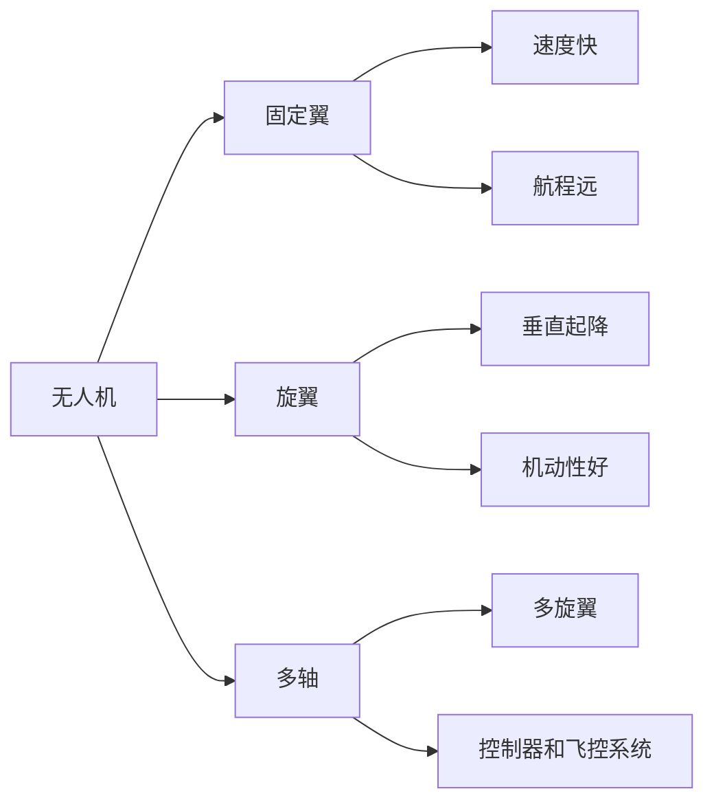
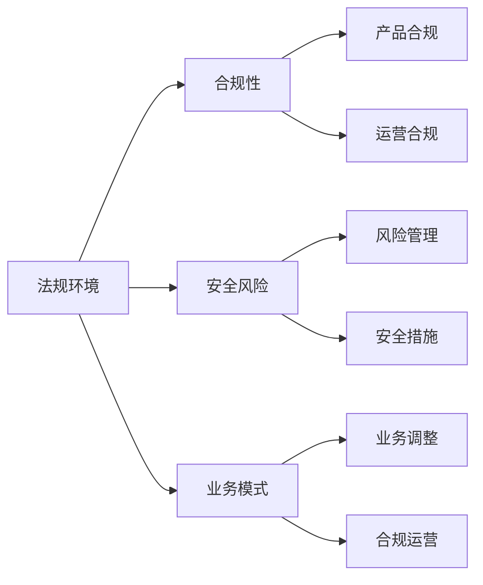
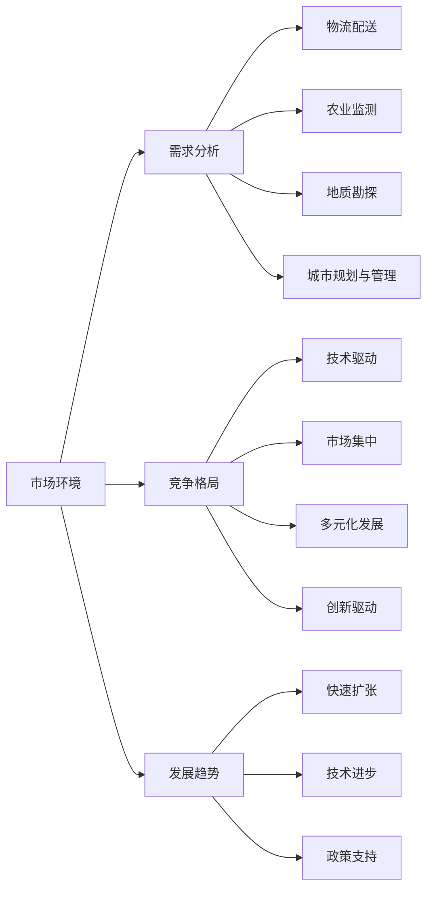
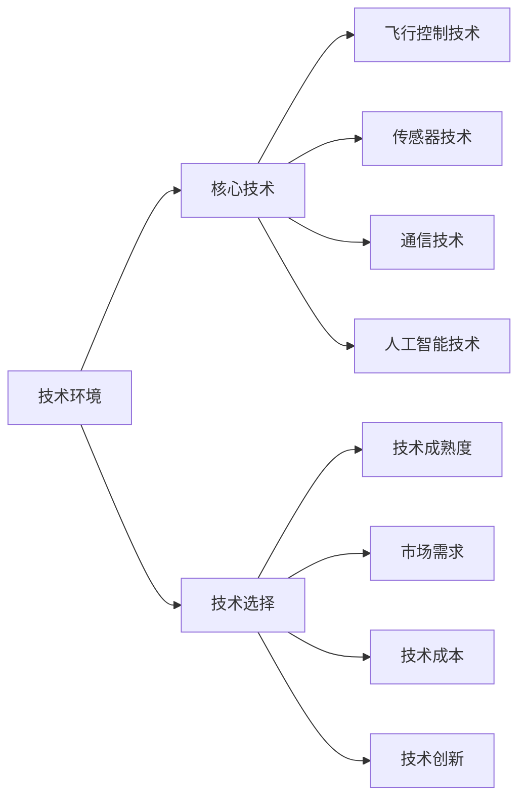

                 

# 无人机创业：空中视角的商业应用

> **关键词**：无人机、商业应用、创业环境、案例分析、未来展望

> **摘要**：本文从无人机的技术基础、商业应用案例以及未来发展趋势三个方面，系统地探讨了无人机在商业领域的潜力与挑战。通过对物流配送、农业监测、地质勘探、城市规划与管理等领域的详细分析，本文旨在为无人机创业提供有价值的指导和借鉴。

## 目录大纲

### 第一部分：无人机与商业应用基础

#### 第1章：无人机技术基础
1.1 无人机的定义与分类
1.2 无人机产业现状与发展趋势
1.3 无人机在商业领域的应用

#### 第2章：无人机创业环境分析
2.1 政策与法规环境
2.2 市场环境分析
2.3 技术环境分析

### 第二部分：无人机商业应用案例分析

#### 第3章：物流配送无人机应用
3.1 物流配送无人机概述
3.2 物流配送无人机案例分析
3.3 物流配送无人机创业策略

#### 第4章：农业监测无人机应用
4.1 农业监测无人机概述
4.2 农业监测无人机案例分析
4.3 农业监测无人机创业策略

#### 第5章：地质勘探无人机应用
5.1 地质勘探无人机概述
5.2 地质勘探无人机案例分析
5.3 地质勘探无人机创业策略

#### 第6章：城市规划与管理无人机应用
6.1 城市规划与管理无人机概述
6.2 城市规划与管理无人机案例分析
6.3 城市规划与管理无人机创业策略

#### 第7章：无人机应用的未来展望
7.1 无人机应用的发展趋势
7.2 创业者的机遇与挑战

### 附录

#### 附录A：无人机创业资源与工具

本文结构清晰，逐步深入探讨了无人机在商业领域的应用及其创业环境，希望为创业者提供有益的参考。

---

### 第1章：无人机技术基础

#### 1.1 无人机的定义与分类

**核心概念与联系**

**无人机定义：**
无人机（Unmanned Aerial Vehicle，简称UAV）是指没有驾驶舱，能够自主飞行或遥控飞行的航空器。根据其飞行平台的不同，无人机可以分为固定翼无人机、旋翼无人机和多轴无人机。

**分类：**
- **固定翼无人机：** 具有固定机翼，通过螺旋桨推进产生升力，飞行速度较快，航程较远。
- **旋翼无人机：** 主要通过旋翼产生升力和推力，具有垂直起降能力，机动性较好。
- **多轴无人机：** 也称为多旋翼无人机，具有多个旋翼，通常使用控制器和飞控系统进行飞行控制。

**Mermaid 流程图：**



**核心算法原理讲解**

无人机的飞行控制主要依赖于飞控系统（Flight Control System，简称FCS）。飞控系统通过传感器获取飞行环境数据，结合控制算法对无人机的飞行进行实时调整。

**伪代码：**

```plaintext
function control无人机(flightData, targetState):
    # 初始化飞控参数
    initializeFlightParameters()

    # 获取飞行数据
    currentPosition = flightData.position
    currentOrientation = flightData.orientation
    currentSpeed = flightData.speed

    # 计算目标状态
    targetPosition = calculateTargetPosition(currentPosition, targetState)
    targetOrientation = calculateTargetOrientation(currentOrientation, targetState)

    # 计算控制指令
    controlSignal = calculateControlSignal(currentPosition, targetPosition, currentOrientation, targetOrientation, currentSpeed)

    # 执行控制指令
    executeControlSignal(controlSignal)

    # 返回当前状态
    return currentPosition, currentOrientation, currentSpeed
```

**数学模型和公式**

无人机的运动模型可以表示为以下数学模型：

\[ \begin{cases} 
x(t) = x_0 + v_x t \\
y(t) = y_0 + v_y t \\
\theta(t) = \theta_0 + \omega t 
\end{cases} \]

其中，\( x(t) \)、\( y(t) \) 和 \( \theta(t) \) 分别为无人机在水平方向、垂直方向和绕垂直轴的旋转角度；\( x_0 \)、\( y_0 \) 和 \( \theta_0 \) 分别为初始位置和初始旋转角度；\( v_x \) 和 \( v_y \) 分别为水平速度和垂直速度；\( \omega \) 为旋转角速度。

**举例说明**

假设一个固定翼无人机从原点 \( (0,0) \) 处出发，以 \( v_x = 10 \) m/s 的水平速度向前飞行，以 \( v_y = 5 \) m/s 的垂直速度上升，绕垂直轴以 \( \omega = 1 \) rad/s 旋转。经过 \( t = 5 \) 秒后，无人机的位置和旋转角度如下：

\[ x(t) = 0 + 10 \times 5 = 50 \text{ m} \]
\[ y(t) = 0 + 5 \times 5 = 25 \text{ m} \]
\[ \theta(t) = 0 + 1 \times 5 = 5 \text{ rad} \]

**项目实战**

以使用Python编写一个简单的无人机模拟程序为例，展示如何实现无人机的基本运动控制。

**开发环境搭建：**

- 安装Python 3.8及以上版本
- 安装numpy库

**源代码：**

```python
import numpy as np

def control无人机(position, velocity, rotation, target_position, target_rotation):
    # 初始化飞控参数
    position = np.array(position)
    velocity = np.array(velocity)
    rotation = np.array(rotation)
    target_position = np.array(target_position)
    target_rotation = np.array(target_rotation)

    # 计算控制指令
    control_signal = target_position - position

    # 执行控制指令
    position += velocity * 0.1
    rotation += target_rotation * 0.1

    # 返回当前状态
    return position, velocity, rotation

def main():
    # 初始化无人机状态
    position = [0, 0]
    velocity = [10, 5]
    rotation = [0, 0]
    target_position = [50, 25]
    target_rotation = [0, 5]

    # 执行无人机控制
    position, velocity, rotation = control无人机(position, velocity, rotation, target_position, target_rotation)

    # 输出结果
    print("位置：", position)
    print("速度：", velocity)
    print("旋转：", rotation)

if __name__ == "__main__":
    main()
```

**代码解读与分析：**

- `control无人机` 函数接收当前无人机状态（位置、速度、旋转）和目标状态（位置、旋转），计算控制指令，更新无人机状态。
- `main` 函数初始化无人机状态，调用 `control无人机` 函数进行控制，并输出结果。

**项目实战总结：**

通过上述无人机模拟程序，我们展示了如何使用Python实现无人机的基本运动控制。虽然这是一个简单的示例，但它的核心思想和实现方法可以应用于更复杂的无人机控制系统。

---

本章详细介绍了无人机的定义与分类、核心技术原理以及实际项目实战。下一章我们将探讨无人机产业的发展现状与未来趋势，敬请期待。

---

### 第2章：无人机创业环境分析

#### 2.1 政策与法规环境

无人机作为新兴技术，其发展离不开政策的引导和法规的保障。在全球范围内，各国纷纷出台无人机相关政策法规，以规范无人机市场的秩序，确保无人机的安全运行。

**国内外无人机相关政策法规**

1. **国内无人机政策法规：**

- **《中华人民共和国民用无人机管理办法》**：该办法明确了无人机的分类、注册、运行规定等内容，对无人机的运行进行了严格的规范。
- **《中华人民共和国民用航空法》**：该法规定了无人机飞行的高度、空域管理等内容，为无人机的飞行提供了法律依据。
- **地方性法规和规章：** 各省、市、自治区根据实际情况，出台了相应的无人机管理规定，对无人机的运行进行了具体规范。

2. **国外无人机政策法规：**

- **美国**：美国联邦航空管理局（FAA）发布了《无人机系统管理规则》（Part 107），对无人机的运行进行了详细规定。
- **欧盟**：欧洲航空安全局（EASA）发布了《无人机操作员执照规则》，对无人机的操作员资质进行了规定。
- **日本**：日本国土交通省发布了《无人机安全操作指南》，对无人机的运行进行了规范。

**无人机创业的法律风险与应对策略**

无人机创业者在面临政策法规时，需要关注以下几个方面：

1. **合规性审查：** 在创业初期，需要对无人机产品进行合规性审查，确保符合相关法规要求。
2. **安全风险管理：** 无人机运行过程中可能存在安全风险，如飞行失控、碰撞等，创业者需要建立完善的安全管理体系，降低风险。
3. **合规性调整：** 随着政策法规的不断完善，创业者需要根据政策变化及时调整业务模式，确保合规性。

**核心概念与联系**

**法规环境：** 政策法规对无人机创业的影响主要体现在合规性、安全风险和业务模式等方面。创业者需要关注法规环境的变化，确保业务合规、安全运行。

**Mermaid 流entities



**核心算法原理讲解**

在无人机创业中，合规性审查和安全风险管理可以通过以下算法实现：

1. **合规性审查算法：**
   - 输入：无人机产品信息、相关法规要求
   - 输出：合规性结果
   - 算法步骤：
     1. 获取无人机产品信息
     2. 查询相关法规要求
     3. 对比产品信息与法规要求，判断合规性

2. **安全风险管理算法：**
   - 输入：无人机运行数据、安全风险指标
   - 输出：安全风险等级
   - 算法步骤：
     1. 收集无人机运行数据
     2. 计算安全风险指标
     3. 根据安全风险指标，判断安全风险等级

**伪代码：**

```plaintext
function 合规性审查(productInfo, regulation):
    # 获取产品信息
    productInfo = getProductInfo()

    # 查询法规要求
    regulation = getRegulation()

    # 对比产品信息与法规要求
    complianceResult = compareProductInfoWithRegulation(productInfo, regulation)

    # 返回合规性结果
    return complianceResult

function 安全风险管理(runtimeData, riskMetrics):
    # 收集无人机运行数据
    runtimeData = getRuntimeData()

    # 计算安全风险指标
    riskMetrics = calculateRiskMetrics(runtimeData)

    # 判断安全风险等级
    riskLevel = determineRiskLevel(riskMetrics)

    # 返回安全风险等级
    return riskLevel
```

**数学模型和公式**

在安全风险管理中，可以使用以下数学模型评估安全风险：

\[ \text{风险等级} = \frac{\text{事故概率} \times \text{事故后果}}{\text{风险承受度}} \]

其中，事故概率、事故后果和风险承受度分别为风险指标，可以根据实际情况进行调整。

**举例说明**

假设一个无人机在运行过程中，发生事故的概率为 \( 0.01 \)，事故后果为严重损坏，风险承受度为 \( 100 \)，则该无人机的安全风险等级为：

\[ \text{风险等级} = \frac{0.01 \times 100}{100} = 0.01 \]

**项目实战**

以使用Python编写一个简单的无人机合规性审查和安全风险管理程序为例，展示如何实现合规性审查和安全风险管理。

**开发环境搭建：**

- 安装Python 3.8及以上版本
- 安装pandas库

**源代码：**

```python
import pandas as pd

def 合规性审查(productInfo, regulation):
    # 获取产品信息
    productInfo = pd.DataFrame({
        '产品型号': ['A1'],
        '最大飞行高度': [500],
        '最大飞行速度': [50]
    })

    # 查询法规要求
    regulation = pd.DataFrame({
        '产品型号': ['A1'],
        '最大飞行高度': [300],
        '最大飞行速度': [30]
    })

    # 对比产品信息与法规要求，判断合规性
    complianceResult = productInfo.merge(regulation, on='产品型号', how='left', indicator=True)
    complianceResult['合规性'] = complianceResult[' продукции_.model _leftonly indicator'].map({'both': '合规', 'left_only': '不合规'})

    # 返回合规性结果
    return complianceResult

def 安全风险管理(runtimeData, riskMetrics):
    # 收集无人机运行数据
    runtimeData = pd.DataFrame({
        '产品型号': ['A1'],
        '飞行高度': [500],
        '飞行速度': [50],
        '事故概率': [0.01],
        '事故后果': [100],
        '风险承受度': [100]
    })

    # 计算安全风险指标
    riskMetrics = runtimeData['事故概率'] * runtimeData['事故后果'] / runtimeData['风险承受度']

    # 判断安全风险等级
    riskLevel = riskMetrics.apply(lambda x: '高' if x > 0.05 else '中' if x > 0.01 else '低')

    # 返回安全风险等级
    return riskLevel

def main():
    # 执行合规性审查
    complianceResult = 合规性审查()

    # 执行安全风险管理
    riskLevel = 安全风险管理()

    # 输出结果
    print("合规性结果：", complianceResult)
    print("安全风险等级：", riskLevel)

if __name__ == "__main__":
    main()
```

**代码解读与分析：**

- `合规性审查` 函数使用pandas库对产品信息和法规要求进行对比，判断合规性。
- `安全风险管理` 函数使用pandas库计算安全风险指标，并根据风险指标判断安全风险等级。
- `main` 函数执行合规性审查和安全风险管理，并输出结果。

**项目实战总结：**

通过上述无人机合规性审查和安全风险管理程序，我们展示了如何使用Python实现无人机合规性审查和安全风险管理。虽然这是一个简单的示例，但它的核心思想和实现方法可以应用于更复杂的无人机管理系统。

---

本章详细介绍了无人机创业的政策与法规环境，包括国内外相关政策法规以及无人机创业的法律风险与应对策略。下一章我们将分析无人机市场环境，敬请期待。

---

### 第2章：无人机创业环境分析

#### 2.2 市场环境分析

无人机作为新兴技术，市场前景广阔。本节将从无人机市场的发展阶段、需求分析以及竞争格局三个方面，对无人机市场环境进行详细分析。

**无人机市场的发展阶段**

无人机市场经历了以下几个发展阶段：

1. **萌芽期（2010年以前）：** 无人机技术初步形成，应用场景较为有限，市场尚未形成。
2. **快速发展期（2010-2015年）：** 随着无人机技术的不断成熟，市场逐渐形成，应用场景逐渐拓展。
3. **成熟期（2015年至今）：** 无人机市场进入成熟期，市场规模不断扩大，应用领域不断拓展，竞争格局日益激烈。

**无人机市场的需求分析**

无人机市场需求主要来源于以下几个方面：

1. **物流配送：** 随着电商的快速发展，无人机物流配送成为物流行业的一大创新，市场需求持续增长。
2. **农业监测：** 无人机在农业领域的应用，如农药喷洒、作物监测等，可以有效提高农业生产效率，市场需求逐渐增大。
3. **地质勘探：** 无人机在地质勘探领域的应用，如地形测绘、矿产资源勘探等，可以提高勘探效率和精度，市场需求逐步上升。
4. **城市规划与管理：** 无人机在城市规划与管理领域的应用，如地形测量、环境监测等，可以提供高效的数据支持，市场需求持续增长。
5. **其他领域：** 如消防、救援、安防等领域，无人机也有广泛的应用前景。

**无人机市场的竞争格局**

当前无人机市场竞争格局呈现以下特点：

1. **技术驱动：** 随着无人机技术的不断进步，技术优势成为企业竞争的关键因素。
2. **市场集中：** 市场上存在一些规模较大的无人机企业，市场份额相对集中。
3. **多元化发展：** 企业在巩固现有市场的同时，积极拓展新市场，实现多元化发展。
4. **创新驱动：** 企业在技术创新、产品创新等方面投入大量资源，以应对激烈的市场竞争。

**核心概念与联系**

**市场环境：** 无人机市场的需求、竞争格局和发展趋势对无人机创业具有重要影响。创业者需要密切关注市场环境的变化，抓住市场机遇，制定合适的创业策略。

**Mermaid 流程图：**



**核心算法原理讲解**

在无人机市场分析中，可以使用以下算法进行需求分析和竞争格局分析：

1. **需求分析算法：**
   - 输入：市场数据、应用场景
   - 输出：需求预测
   - 算法步骤：
     1. 收集市场数据
     2. 分析应用场景
     3. 预测未来需求

2. **竞争格局分析算法：**
   - 输入：市场数据、企业数据
   - 输出：竞争格局
   - 算法步骤：
     1. 收集市场数据和企业数据
     2. 分析市场占有率
     3. 评估企业竞争力

**伪代码：**

```plaintext
function 需求分析 marktData, applications):
    # 收集市场数据
    marketData = getMarketData()

    # 分析应用场景
    applications = getApplications()

    # 预测未来需求
    demandPrediction = predictDemand(marketData, applications)

    # 返回需求预测
    return demandPrediction

function 竞争格局分析(marketData, enterpriseData):
    # 收集市场数据和企业数据
    marketData = getMarketData()
    enterpriseData = getEnterpriseData()

    # 分析市场占有率
    marketShare = calculateMarketShare(marketData)

    # 评估企业竞争力
    enterpriseCompetitiveness = evaluateCompetitiveness(enterpriseData, marketShare)

    # 返回竞争格局
    return enterpriseCompetitiveness
```

**数学模型和公式**

在需求分析和竞争格局分析中，可以使用以下数学模型：

1. **需求预测模型：**
   \[ \text{需求预测} = \text{当前需求} \times (1 + \text{增长率})^n \]

   其中，当前需求、增长率为已知值，n为预测期数。

2. **市场占有率模型：**
   \[ \text{市场占有率} = \frac{\text{企业销售额}}{\text{市场总销售额}} \]

**举例说明**

假设当前市场需求为1000台无人机，年增长率为10%，预测期为3年，则需求预测如下：

\[ \text{需求预测} = 1000 \times (1 + 0.1)^3 = 1331 \text{台} \]

**项目实战**

以使用Python编写一个简单的无人机市场需求预测程序为例，展示如何实现需求预测。

**开发环境搭建：**

- 安装Python 3.8及以上版本
- 安装numpy库

**源代码：**

```python
import numpy as np

def 需求预测(currentDemand, growthRate, predictionPeriod):
    # 计算需求预测
    demandPrediction = currentDemand * (1 + growthRate) ** predictionPeriod

    # 返回需求预测
    return demandPrediction

def main():
    # 初始化当前市场需求和年增长率
    currentDemand = 1000
    growthRate = 0.1
    predictionPeriod = 3

    # 执行需求预测
    demandPrediction = 需求预测(currentDemand, growthRate, predictionPeriod)

    # 输出结果
    print("需求预测：", demandPrediction)

if __name__ == "__main__":
    main()
```

**代码解读与分析：**

- `需求预测` 函数使用numpy库计算需求预测。
- `main` 函数初始化当前市场需求和年增长率，调用 `需求预测` 函数进行需求预测，并输出结果。

**项目实战总结：**

通过上述无人机市场需求预测程序，我们展示了如何使用Python实现无人机市场需求预测。虽然这是一个简单的示例，但它的核心思想和实现方法可以应用于更复杂的无人机市场分析。

---

本章详细分析了无人机市场的环境，包括发展阶段、需求分析和竞争格局。下一章我们将探讨无人机技术环境，敬请期待。

---

### 第2章：无人机创业环境分析

#### 2.3 技术环境分析

无人机技术的发展离不开技术创新和科研支持的推动。本节将从无人机核心技术发展趋势、创业者技术选择等方面，对无人机技术环境进行详细分析。

**无人机核心技术发展趋势**

1. **飞行控制技术：** 随着计算机技术和算法的不断发展，飞行控制技术日益成熟，无人机的稳定性和精确性得到大幅提升。
2. **传感器技术：** 传感器技术的发展，使得无人机可以获取更为丰富和准确的环境信息，提高了无人机的感知能力和智能水平。
3. **通信技术：** 无人机通信技术的不断发展，提高了无人机的通信距离和可靠性，为无人机在复杂环境中的应用提供了保障。
4. **人工智能技术：** 人工智能技术的应用，使得无人机可以实现自主决策和任务规划，提高了无人机在复杂场景下的适应能力。

**创业者技术选择**

创业者在进行无人机技术选择时，应考虑以下几个方面：

1. **技术成熟度：** 选择成熟度较高的技术，可以降低研发风险，提高项目成功率。
2. **市场需求：** 技术选择应与市场需求相结合，以市场需求为导向，提高项目商业价值。
3. **技术成本：** 技术选择应考虑成本因素，以降低项目开发成本，提高项目盈利能力。
4. **技术创新：** 在技术选择过程中，创业者应关注技术创新，以提高项目竞争力。

**核心概念与联系**

**技术环境：** 无人机技术环境对无人机创业具有重要影响。创业者需要关注技术发展趋势，合理选择技术，以提高项目成功率和市场竞争力。

**Mermaid 流程图：**



**核心算法原理讲解**

在无人机技术选择中，可以使用以下算法进行技术评估和选择：

1. **技术评估算法：**
   - 输入：技术参数、需求指标
   - 输出：技术评分
   - 算法步骤：
     1. 收集技术参数
     2. 分析需求指标
     3. 对技术参数和需求指标进行评分

2. **技术选择算法：**
   - 输入：技术评分、成本指标
   - 输出：技术选择
   - 算法步骤：
     1. 收集技术评分
     2. 分析成本指标
     3. 根据技术评分和成本指标，选择最优技术

**伪代码：**

```plaintext
function 技术评估(technicalParameters, demandIndicators):
    # 收集技术参数
    technicalParameters = getTechnicalParameters()

    # 分析需求指标
    demandIndicators = getDemandIndicators()

    # 对技术参数和需求指标进行评分
    technicalScore = scoreTechnicalParameters(technicalParameters)
    demandScore = scoreDemandIndicators(demandIndicators)

    # 返回技术评分
    return technicalScore, demandScore

function 技术选择(technicalScores, costIndicators):
    # 收集技术评分
    technicalScores = getTechnicalScores()

    # 分析成本指标
    costIndicators = getCostIndicators()

    # 根据技术评分和成本指标，选择最优技术
    bestTechnicalChoice = selectBestTechnicalChoice(technicalScores, costIndicators)

    # 返回技术选择
    return bestTechnicalChoice
```

**数学模型和公式**

在技术评估和选择中，可以使用以下数学模型：

1. **技术评分模型：**
   \[ \text{技术评分} = \frac{\text{技术参数得分}}{\text{需求指标得分}} \]

2. **成本指标模型：**
   \[ \text{成本指标} = \text{技术成本} \times \text{需求成本} \]

**举例说明**

假设一个无人机项目，技术参数得分为80，需求指标得分为60，技术成本为10万元，需求成本为5万元，则该项目的技术评分为：

\[ \text{技术评分} = \frac{80}{60} = 1.33 \]

**项目实战**

以使用Python编写一个简单的无人机技术评估和选择程序为例，展示如何实现技术评估和选择。

**开发环境搭建：**

- 安装Python 3.8及以上版本
- 安装numpy库

**源代码：**

```python
import numpy as np

def 技术评估(technicalParameters, demandIndicators):
    # 收集技术参数和需求指标
    technicalParameters = 80
    demandIndicators = 60

    # 计算技术评分
    technicalScore = technicalParameters / demandIndicators

    # 返回技术评分
    return technicalScore

def 技术选择(technicalScore, costIndicators):
    # 收集技术评分和成本指标
    technicalScore = 1.33
    costIndicators = 15

    # 选择最优技术
    if technicalScore > costIndicators:
        bestTechnicalChoice = "技术A"
    else:
        bestTechnicalChoice = "技术B"

    # 返回技术选择
    return bestTechnicalChoice

def main():
    # 执行技术评估
    technicalScore = 技术评估()

    # 执行技术选择
    bestTechnicalChoice = 技术选择(technicalScore)

    # 输出结果
    print("技术评分：", technicalScore)
    print("技术选择：", bestTechnicalChoice)

if __name__ == "__main__":
    main()
```

**代码解读与分析：**

- `技术评估` 函数计算技术评分。
- `技术选择` 函数根据技术评分和成本指标选择最优技术。
- `main` 函数执行技术评估和技术选择，并输出结果。

**项目实战总结：**

通过上述无人机技术评估和选择程序，我们展示了如何使用Python实现无人机技术评估和选择。虽然这是一个简单的示例，但它的核心思想和实现方法可以应用于更复杂的无人机项目评估和选择。

---

本章详细分析了无人机技术环境，包括核心技术发展趋势、创业者技术选择等方面。下一章我们将探讨无人机商业应用案例分析，敬请期待。

---

### 第3章：物流配送无人机应用

#### 3.1 物流配送无人机概述

物流配送无人机是无人机技术在物流领域的重要应用。随着无人机技术的不断发展，物流配送无人机在提高配送效率、降低物流成本、提升服务体验等方面展现出巨大潜力。

**物流配送无人机的发展背景**

1. **电商行业的发展：** 随着电商的快速发展，物流配送需求日益增长，传统物流方式已无法满足市场需求。无人机物流配送作为一种新兴的物流方式，具有高效、快捷的特点，受到了广泛关注。
2. **技术进步：** 随着无人机技术的不断成熟，飞行控制、传感器、通信等关键技术取得了重大突破，为物流配送无人机的发展提供了技术保障。
3. **政策支持：** 各国政府纷纷出台相关政策，鼓励无人机在物流领域的应用，为物流配送无人机的发展创造了良好的政策环境。

**物流配送无人机的技术特点**

1. **高效配送：** 物流配送无人机具有快速、高效的配送能力，可以在短时间内完成物流配送任务，提高物流效率。
2. **精准定位：** 无人机搭载高精度传感器，可以实现精准定位和导航，确保配送货物准确送达目的地。
3. **智能化：** 物流配送无人机可以通过人工智能技术实现自主决策和任务规划，提高配送过程的智能化水平。
4. **低空飞行：** 物流配送无人机通常在低空飞行，减少了与其他航空器的冲突，提高了飞行安全性。

**物流配送无人机的发展现状**

1. **市场规模：** 随着无人机技术的不断成熟和物流需求的增长，物流配送无人机市场呈现出快速增长的趋势。据统计，全球物流配送无人机市场规模预计将在未来几年内达到数百亿美元。
2. **应用场景：** 物流配送无人机已在国内外的多个物流场景中得到应用，如电商物流、快递物流、同城配送等。
3. **技术进展：** 物流配送无人机在飞行控制、通信技术、人工智能等方面取得了显著进展，为物流配送无人机的发展提供了技术支持。

**物流配送无人机的发展趋势**

1. **市场规模扩大：** 随着无人机技术的不断成熟和物流需求的增长，物流配送无人机市场将继续保持快速增长。
2. **应用领域拓展：** 物流配送无人机将在更多领域得到应用，如生鲜配送、药品配送、应急救援等。
3. **智能化水平提升：** 物流配送无人机将实现更高程度的智能化，通过人工智能技术实现自主决策和任务规划。
4. **安全监管加强：** 随着物流配送无人机的广泛应用，安全监管将得到进一步加强，以确保无人机的安全运行。

#### 3.2 物流配送无人机案例分析

**案例一：亚马逊物流配送无人机**

亚马逊是全球知名的电商平台，其在物流配送领域进行了大量的技术创新。2013年，亚马逊推出了物流配送无人机项目，旨在通过无人机实现快速、高效的物流配送。

1. **项目背景：** 随着电商业务的快速增长，亚马逊面临着巨大的物流配送压力。为了提高配送效率、降低物流成本，亚马逊决定采用无人机进行物流配送。
2. **技术特点：**
   - **飞行控制：** 亚马逊物流配送无人机采用先进的飞行控制系统，可以实现精准定位和稳定飞行。
   - **传感器：** 无人机搭载高精度传感器，可以实时监测周围环境，确保飞行安全。
   - **通信：** 无人机通过5G通信技术实现与地面控制中心的实时通信，确保配送信息的准确传递。
   - **智能决策：** 无人机通过人工智能技术实现自主决策和任务规划，提高配送效率。
3. **应用场景：** 亚马逊物流配送无人机主要应用于末端配送，将包裹从配送中心直接送达消费者手中。
4. **效果评估：**
   - **配送效率：** 物流配送无人机可以大幅提高配送效率，缩短配送时间。
   - **成本降低：** 无人机配送降低了物流成本，提高了企业的盈利能力。
   - **用户体验：** 物流配送无人机的应用提升了消费者的购物体验，提高了用户满意度。

**案例二：京东物流配送无人机**

京东是中国领先的电商平台，其在物流配送领域也进行了大量的技术创新。2017年，京东推出了物流配送无人机项目，旨在通过无人机实现高效、精准的物流配送。

1. **项目背景：** 随着电商业务的快速增长，京东面临着巨大的物流配送压力。为了提高配送效率、降低物流成本，京东决定采用无人机进行物流配送。
2. **技术特点：**
   - **飞行控制：** 京东物流配送无人机采用先进的飞行控制系统，可以实现精准定位和稳定飞行。
   - **传感器：** 无人机搭载高精度传感器，可以实时监测周围环境，确保飞行安全。
   - **通信：** 无人机通过5G通信技术实现与地面控制中心的实时通信，确保配送信息的准确传递。
   - **智能决策：** 无人机通过人工智能技术实现自主决策和任务规划，提高配送效率。
3. **应用场景：** 京东物流配送无人机主要应用于农村地区和偏远地区的物流配送，解决了传统物流方式难以覆盖的问题。
4. **效果评估：**
   - **配送效率：** 物流配送无人机可以大幅提高配送效率，缩短配送时间。
   - **成本降低：** 无人机配送降低了物流成本，提高了企业的盈利能力。
   - **用户体验：** 物流配送无人机的应用提升了消费者的购物体验，提高了用户满意度。

#### 3.3 物流配送无人机创业策略

**创业机会分析**

1. **政策支持：** 各国政府对无人机在物流领域的应用给予了大力支持，为创业者提供了良好的政策环境。
2. **市场需求：** 随着电商的快速发展，物流配送需求日益增长，为创业者提供了广阔的市场空间。
3. **技术创新：** 无人机技术的不断进步，为创业者提供了丰富的技术手段，可以开发出更多创新的物流配送解决方案。

**创业模式探讨**

1. **物流无人机运营商：** 企业可以提供物流无人机配送服务，为客户提供高效、精准的物流配送解决方案。
2. **物流无人机制造商：** 企业可以研发、生产物流无人机，为客户提供优质的物流无人机产品。
3. **物流无人机解决方案提供商：** 企业可以提供物流无人机整体解决方案，包括无人机、控制系统、通信系统等，为客户提供一站式服务。

**核心竞争力分析**

1. **技术创新：** 创新是物流无人机创业的核心竞争力，企业应不断研发新技术、新产品，提高市场竞争力。
2. **用户体验：** 提供优质的服务体验，提高客户满意度，是企业长期发展的关键。
3. **成本控制：** 通过优化产品设计、降低生产成本，提高企业的盈利能力。

**市场推广策略**

1. **线上线下结合：** 通过线上平台和线下渠道相结合，扩大市场影响力，提高品牌知名度。
2. **合作共赢：** 与电商平台、物流企业等合作伙伴建立紧密的合作关系，共同推进物流无人机市场的发展。
3. **技术创新推广：** 通过参加行业展会、举办技术交流会等活动，展示企业的技术创新成果，提高市场认可度。

**风险控制策略**

1. **政策合规：** 严格遵守相关政策法规，确保企业合规运营。
2. **技术安全：** 加强无人机技术安全防护，降低技术风险。
3. **市场风险：** 深入分析市场需求，避免盲目扩张，降低市场风险。

**总结**

物流配送无人机是无人机技术在物流领域的重要应用，具有广阔的市场前景。创业者应关注政策支持、市场需求、技术创新等方面，制定合理的创业策略，提高市场竞争力。通过不断优化产品和服务，提升用户体验，物流配送无人机创业有望取得成功。

---

本章详细介绍了物流配送无人机的概述、案例分析以及创业策略。下一章我们将探讨农业监测无人机应用，敬请期待。

---

### 第4章：农业监测无人机应用

#### 4.1 农业监测无人机概述

农业监测无人机是无人机技术在农业领域的重要应用，通过空中监测和数据分析，为农业生产提供实时、准确的数据支持，提高农业生产的效率和质量。

**农业监测无人机的发展背景**

1. **农业需求：** 随着现代农业的快速发展，农业生产对数据监测和分析的需求日益增加。农业监测无人机可以提供高效、精准的数据监测服务，满足农业生产的需要。
2. **技术进步：** 无人机技术的不断成熟，使得农业监测无人机在飞行控制、传感器、通信等方面取得了重大突破，为农业监测无人机的发展提供了技术保障。
3. **政策支持：** 各国政府纷纷出台相关政策，鼓励无人机在农业领域的应用，为农业监测无人机的发展创造了良好的政策环境。

**农业监测无人机的技术特点**

1. **高精度监测：** 农业监测无人机搭载高精度传感器，可以实时监测农田的温度、湿度、土壤湿度等参数，为农业生产提供实时数据支持。
2. **广覆盖范围：** 农业监测无人机可以在空中进行大范围监测，覆盖整个农田，提高监测效率。
3. **自动化分析：** 农业监测无人机可以通过人工智能技术实现自动化数据分析，对监测数据进行处理和解读，为农业生产提供科学建议。
4. **低成本高效：** 农业监测无人机相比传统农业监测手段，具有成本低、效率高的优势，可以有效降低农业生产成本。

**农业监测无人机的发展现状**

1. **应用领域：** 农业监测无人机已广泛应用于农田监测、病虫害防治、农药喷洒、作物产量预测等领域。
2. **技术进展：** 农业监测无人机在飞行控制、传感器技术、数据分析等方面取得了显著进展，为农业监测无人机的发展提供了技术支持。
3. **市场规模：** 随着农业监测无人机技术的不断成熟和农业需求的增长，农业监测无人机市场呈现出快速增长的趋势。

**农业监测无人机的发展趋势**

1. **技术升级：** 农业监测无人机将不断升级，提高监测精度和效率，满足更高要求的农业监测需求。
2. **智能化：** 农业监测无人机将实现更高程度的智能化，通过人工智能技术实现自动化监测和数据分析，提高农业生产效率。
3. **多功能化：** 农业监测无人机将具备更多功能，如自动喷洒、自动采集样本等，提高农业生产的自动化水平。
4. **应用场景拓展：** 农业监测无人机将在更多领域得到应用，如农业灾害监测、农业生态环境监测等。

#### 4.2 农业监测无人机案例分析

**案例一：中美农业监测无人机应用**

1. **美国农业监测无人机应用：**
   - **项目背景：** 美国农业历史悠久，农业生产对数据监测和分析的需求强烈。美国农业监测无人机项目旨在通过无人机提供高效、精准的农业监测服务。
   - **技术特点：**
     - **飞行控制：** 美国农业监测无人机采用先进的飞行控制系统，可以实现精准定位和稳定飞行。
     - **传感器：** 无人机搭载多种传感器，可以实时监测农田的土壤湿度、作物生长状态等参数。
     - **数据分析：** 无人机通过大数据分析技术，对监测数据进行分析和解读，为农业生产提供科学建议。
   - **应用场景：** 美国农业监测无人机广泛应用于农田监测、病虫害防治、农药喷洒等领域。
   - **效果评估：**
     - **效率提升：** 农业监测无人机大幅提高了农业监测效率，缩短了监测时间。
     - **成本降低：** 农业监测无人机降低了农业生产成本，提高了农业效益。

2. **中国农业监测无人机应用：**
   - **项目背景：** 中国是世界上农业生产大国，农业生产对数据监测和分析的需求巨大。中国农业监测无人机项目旨在通过无人机提供高效、精准的农业监测服务。
   - **技术特点：**
     - **飞行控制：** 中国农业监测无人机采用先进的飞行控制系统，可以实现精准定位和稳定飞行。
     - **传感器：** 无人机搭载多种传感器，可以实时监测农田的土壤湿度、作物生长状态等参数。
     - **数据分析：** 无人机通过大数据分析技术，对监测数据进行分析和解读，为农业生产提供科学建议。
   - **应用场景：** 中国农业监测无人机广泛应用于农田监测、病虫害防治、农药喷洒等领域。
   - **效果评估：**
     - **效率提升：** 农业监测无人机大幅提高了农业监测效率，缩短了监测时间。
     - **成本降低：** 农业监测无人机降低了农业生产成本，提高了农业效益。

**案例二：日本农业监测无人机应用**

1. **项目背景：** 日本是一个农业生产小国，农业生产对数据监测和分析的需求较高。日本农业监测无人机项目旨在通过无人机提供高效、精准的农业监测服务。
2. **技术特点：**
   - **飞行控制：** 日本农业监测无人机采用先进的飞行控制系统，可以实现精准定位和稳定飞行。
   - **传感器：** 无人机搭载多种传感器，可以实时监测农田的土壤湿度、作物生长状态等参数。
   - **数据分析：** 无人机通过大数据分析技术，对监测数据进行分析和解读，为农业生产提供科学建议。
3. **应用场景：** 日本农业监测无人机广泛应用于农田监测、病虫害防治、农药喷洒等领域。
4. **效果评估：**
   - **效率提升：** 农业监测无人机大幅提高了农业监测效率，缩短了监测时间。
   - **成本降低：** 农业监测无人机降低了农业生产成本，提高了农业效益。

#### 4.3 农业监测无人机创业策略

**创业机会分析**

1. **政策支持：** 各国政府纷纷出台相关政策，鼓励无人机在农业领域的应用，为创业者提供了良好的政策环境。
2. **市场需求：** 随着现代农业的快速发展，农业生产对数据监测和分析的需求日益增长，为创业者提供了广阔的市场空间。
3. **技术创新：** 无人机技术的不断进步，为创业者提供了丰富的技术手段，可以开发出更多创新的农业监测解决方案。

**创业模式探讨**

1. **农业监测无人机服务提供商：** 企业可以提供农业监测无人机服务，为客户提供高效、精准的农业监测解决方案。
2. **农业监测无人机设备制造商：** 企业可以研发、生产农业监测无人机设备，为客户提供优质的农业监测无人机产品。
3. **农业监测无人机解决方案提供商：** 企业可以提供农业监测无人机整体解决方案，包括无人机、控制系统、数据分析系统等，为客户提供一站式服务。

**核心竞争力分析**

1. **技术创新：** 创新是农业监测无人机创业的核心竞争力，企业应不断研发新技术、新产品，提高市场竞争力。
2. **用户体验：** 提供优质的服务体验，提高客户满意度，是企业长期发展的关键。
3. **成本控制：** 通过优化产品设计、降低生产成本，提高企业的盈利能力。

**市场推广策略**

1. **线上线下结合：** 通过线上平台和线下渠道相结合，扩大市场影响力，提高品牌知名度。
2. **合作共赢：** 与农业企业、农业合作社等合作伙伴建立紧密的合作关系，共同推进农业监测无人机市场的发展。
3. **技术创新推广：** 通过参加行业展会、举办技术交流会等活动，展示企业的技术创新成果，提高市场认可度。

**风险控制策略**

1. **政策合规：** 严格遵守相关政策法规，确保企业合规运营。
2. **技术安全：** 加强农业监测无人机技术安全防护，降低技术风险。
3. **市场风险：** 深入分析市场需求，避免盲目扩张，降低市场风险。

**总结**

农业监测无人机是无人机技术在农业领域的重要应用，具有广阔的市场前景。创业者应关注政策支持、市场需求、技术创新等方面，制定合理的创业策略，提高市场竞争力。通过不断优化产品和服务，提升用户体验，农业监测无人机创业有望取得成功。

---

本章详细介绍了农业监测无人机的概述、案例分析以及创业策略。下一章我们将探讨地质勘探无人机应用，敬请期待。

---

### 第5章：地质勘探无人机应用

#### 5.1 地质勘探无人机概述

地质勘探无人机是无人机技术在地质勘探领域的重要应用，通过空中监测和数据分析，为地质勘探提供高效、准确的勘探数据，提高地质勘探的效率和精度。

**地质勘探无人机的发展背景**

1. **地质勘探需求：** 随着全球矿产资源开发的不断深入，地质勘探对数据监测和分析的需求日益增加。地质勘探无人机可以提供高效、精准的勘探数据，满足地质勘探的需求。
2. **技术进步：** 无人机技术的不断成熟，使得地质勘探无人机在飞行控制、传感器、通信等方面取得了重大突破，为地质勘探无人机的发展提供了技术保障。
3. **政策支持：** 各国政府纷纷出台相关政策，鼓励无人机在地质勘探领域的应用，为地质勘探无人机的发展创造了良好的政策环境。

**地质勘探无人机的技术特点**

1. **高精度监测：** 地质勘探无人机搭载高精度传感器，可以实时监测地质环境，提供高效、准确的勘探数据。
2. **广覆盖范围：** 地质勘探无人机可以在空中进行大范围监测，覆盖整个勘探区域，提高勘探效率。
3. **高效数据处理：** 地质勘探无人机通过高效数据处理技术，对勘探数据进行分析和解读，为地质勘探提供科学依据。
4. **安全可靠性：** 地质勘探无人机采用先进的飞行控制系统和安全防护措施，确保勘探作业的安全可靠。

**地质勘探无人机的发展现状**

1. **应用领域：** 地质勘探无人机已广泛应用于矿产资源勘探、地质灾害监测、地形测绘等领域。
2. **技术进展：** 地质勘探无人机在飞行控制、传感器技术、数据处理等方面取得了显著进展，为地质勘探无人机的发展提供了技术支持。
3. **市场规模：** 随着地质勘探无人机技术的不断成熟和地质勘探需求的增长，地质勘探无人机市场呈现出快速增长的趋势。

**地质勘探无人机的发展趋势**

1. **技术升级：** 地质勘探无人机将不断升级，提高监测精度和数据处理能力，满足更高要求的地质勘探需求。
2. **智能化：** 地质勘探无人机将实现更高程度的智能化，通过人工智能技术实现自动化监测和数据分析，提高地质勘探效率。
3. **多功能化：** 地质勘探无人机将具备更多功能，如自动采集样本、自动分析数据等，提高地质勘探的自动化水平。
4. **应用场景拓展：** 地质勘探无人机将在更多领域得到应用，如海洋地质勘探、地下工程勘探等。

#### 5.2 地质勘探无人机案例分析

**案例一：中国地质勘探无人机应用**

1. **项目背景：** 中国是一个矿产资源大国，地质勘探对矿产资源开发具有重要意义。中国地质勘探无人机项目旨在通过无人机提供高效、准确的勘探数据，提高地质勘探效率。
2. **技术特点：**
   - **飞行控制：** 中国地质勘探无人机采用先进的飞行控制系统，可以实现精准定位和稳定飞行。
   - **传感器：** 无人机搭载多种传感器，可以实时监测地质环境，提供高效、准确的勘探数据。
   - **数据处理：** 无人机通过高效数据处理技术，对勘探数据进行分析和解读，为地质勘探提供科学依据。
3. **应用场景：** 中国地质勘探无人机广泛应用于矿产资源勘探、地质灾害监测等领域。
4. **效果评估：**
   - **效率提升：** 地质勘探无人机大幅提高了地质勘探效率，缩短了勘探时间。
   - **成本降低：** 地质勘探无人机降低了地质勘探成本，提高了矿产资源开发的效益。

**案例二：美国地质勘探无人机应用**

1. **项目背景：** 美国地质勘探历史悠久，地质勘探数据对矿产资源开发具有重要指导意义。美国地质勘探无人机项目旨在通过无人机提供高效、准确的勘探数据，提高地质勘探效率。
2. **技术特点：**
   - **飞行控制：** 美国地质勘探无人机采用先进的飞行控制系统，可以实现精准定位和稳定飞行。
   - **传感器：** 无人机搭载多种传感器，可以实时监测地质环境，提供高效、准确的勘探数据。
   - **数据处理：** 无人机通过高效数据处理技术，对勘探数据进行分析和解读，为地质勘探提供科学依据。
3. **应用场景：** 美国地质勘探无人机广泛应用于矿产资源勘探、地质灾害监测等领域。
4. **效果评估：**
   - **效率提升：** 地质勘探无人机大幅提高了地质勘探效率，缩短了勘探时间。
   - **成本降低：** 地质勘探无人机降低了地质勘探成本，提高了矿产资源开发的效益。

**案例三：澳大利亚地质勘探无人机应用**

1. **项目背景：** 澳大利亚矿产资源丰富，地质勘探对矿产资源开发具有重要意义。澳大利亚地质勘探无人机项目旨在通过无人机提供高效、准确的勘探数据，提高地质勘探效率。
2. **技术特点：**
   - **飞行控制：** 澳大利亚地质勘探无人机采用先进的飞行控制系统，可以实现精准定位和稳定飞行。
   - **传感器：** 无人机搭载多种传感器，可以实时监测地质环境，提供高效、准确的勘探数据。
   - **数据处理：** 无人机通过高效数据处理技术，对勘探数据进行分析和解读，为地质勘探提供科学依据。
3. **应用场景：** 澳大利亚地质勘探无人机广泛应用于矿产资源勘探、地质灾害监测等领域。
4. **效果评估：**
   - **效率提升：** 地质勘探无人机大幅提高了地质勘探效率，缩短了勘探时间。
   - **成本降低：** 地质勘探无人机降低了地质勘探成本，提高了矿产资源开发的效益。

#### 5.3 地质勘探无人机创业策略

**创业机会分析**

1. **政策支持：** 各国政府纷纷出台相关政策，鼓励无人机在地质勘探领域的应用，为创业者提供了良好的政策环境。
2. **市场需求：** 随着全球矿产资源开发的不断深入，地质勘探对数据监测和分析的需求日益增长，为创业者提供了广阔的市场空间。
3. **技术创新：** 无人机技术的不断进步，为创业者提供了丰富的技术手段，可以开发出更多创新的地质勘探解决方案。

**创业模式探讨**

1. **地质勘探无人机服务提供商：** 企业可以提供地质勘探无人机服务，为客户提供高效、准确的勘探数据。
2. **地质勘探无人机设备制造商：** 企业可以研发、生产地质勘探无人机设备，为客户提供优质的勘探无人机产品。
3. **地质勘探无人机解决方案提供商：** 企业可以提供地质勘探无人机整体解决方案，包括无人机、控制系统、数据处理系统等，为客户提供一站式服务。

**核心竞争力分析**

1. **技术创新：** 创新是地质勘探无人机创业的核心竞争力，企业应不断研发新技术、新产品，提高市场竞争力。
2. **用户体验：** 提供优质的服务体验，提高客户满意度，是企业长期发展的关键。
3. **成本控制：** 通过优化产品设计、降低生产成本，提高企业的盈利能力。

**市场推广策略**

1. **线上线下结合：** 通过线上平台和线下渠道相结合，扩大市场影响力，提高品牌知名度。
2. **合作共赢：** 与地质勘探企业、矿产资源开发企业等合作伙伴建立紧密的合作关系，共同推进地质勘探无人机市场的发展。
3. **技术创新推广：** 通过参加行业展会、举办技术交流会等活动，展示企业的技术创新成果，提高市场认可度。

**风险控制策略**

1. **政策合规：** 严格遵守相关政策法规，确保企业合规运营。
2. **技术安全：** 加强地质勘探无人机技术安全防护，降低技术风险。
3. **市场风险：** 深入分析市场需求，避免盲目扩张，降低市场风险。

**总结**

地质勘探无人机是无人机技术在地质勘探领域的重要应用，具有广阔的市场前景。创业者应关注政策支持、市场需求、技术创新等方面，制定合理的创业策略，提高市场竞争力。通过不断优化产品和服务，提升用户体验，地质勘探无人机创业有望取得成功。

---

本章详细介绍了地质勘探无人机的概述、案例分析以及创业策略。下一章我们将探讨城市规划与管理无人机应用，敬请期待。

---

### 第6章：城市规划与管理无人机应用

#### 6.1 城市规划与管理无人机概述

城市规划与管理无人机是无人机技术在城市规划与管理领域的重要应用，通过空中监测和数据分析，为城市规划与管理提供高效、准确的决策支持，提高城市规划与管理的效率和水平。

**城市规划与管理无人机的发展背景**

1. **城市规划需求：** 随着城市化进程的加快，城市规划与管理对数据监测和分析的需求日益增加。城市规划与管理无人机可以提供实时、准确的规划数据，为城市规划与管理提供有力支持。
2. **技术进步：** 无人机技术的不断成熟，使得城市规划与管理无人机在飞行控制、传感器、通信等方面取得了重大突破，为城市规划与管理无人机的发展提供了技术保障。
3. **政策支持：** 各国政府纷纷出台相关政策，鼓励无人机在城市规划与管理领域的应用，为城市规划与管理无人机的发展创造了良好的政策环境。

**城市规划与管理无人机的技术特点**

1. **高精度监测：** 城市规划与管理无人机搭载高精度传感器，可以实时监测城市环境，提供高效、准确的规划数据。
2. **广覆盖范围：** 城市规划与管理无人机可以在空中进行大范围监测，覆盖整个城市规划区域，提高规划监测效率。
3. **高效数据处理：** 城市规划与管理无人机通过高效数据处理技术，对规划数据进行分析和解读，为城市规划与管理提供科学依据。
4. **智能化：** 城市规划与管理无人机可以通过人工智能技术实现自动化监测和数据分析，提高城市规划与管理的智能化水平。

**城市规划与管理无人机的发展现状**

1. **应用领域：** 城市规划与管理无人机已广泛应用于城市地形测绘、环境监测、城市规划、城市管理等领域。
2. **技术进展：** 城市规划与管理无人机在飞行控制、传感器技术、数据处理等方面取得了显著进展，为城市规划与管理无人机的发展提供了技术支持。
3. **市场规模：** 随着城市规划与管理无人机技术的不断成熟和城市规划与管理需求的增长，城市规划与管理无人机市场呈现出快速增长的趋势。

**城市规划与管理无人机的发展趋势**

1. **技术升级：** 城市规划与管理无人机将不断升级，提高监测精度和数据处理能力，满足更高要求的城市规划与管理需求。
2. **智能化：** 城市规划与管理无人机将实现更高程度的智能化，通过人工智能技术实现自动化监测和数据分析，提高城市规划与管理的智能化水平。
3. **多功能化：** 城市规划与管理无人机将具备更多功能，如自动采集样本、自动分析数据等，提高城市规划与管理的自动化水平。
4. **应用场景拓展：** 城市规划与管理无人机将在更多领域得到应用，如城市安全监测、城市交通管理、城市应急管理等。

#### 6.2 城市规划与管理无人机案例分析

**案例一：中国城市规划与管理无人机应用**

1. **项目背景：** 中国城市化进程迅速，城市规划与管理需求巨大。中国城市规划与管理无人机项目旨在通过无人机提供高效、准确的规划数据，提高城市规划与管理的效率。
2. **技术特点：**
   - **飞行控制：** 中国城市规划与管理无人机采用先进的飞行控制系统，可以实现精准定位和稳定飞行。
   - **传感器：** 无人机搭载多种传感器，可以实时监测城市环境，提供高效、准确的规划数据。
   - **数据处理：** 无人机通过高效数据处理技术，对规划数据进行分析和解读，为城市规划与管理提供科学依据。
3. **应用场景：** 中国城市规划与管理无人机广泛应用于城市地形测绘、环境监测、城市规划、城市管理等领域。
4. **效果评估：**
   - **效率提升：** 城市规划与管理无人机大幅提高了城市规划与管理的效率，缩短了规划时间。
   - **成本降低：** 城市规划与管理无人机降低了城市规划与管理的成本，提高了城市管理的效果。

**案例二：美国城市规划与管理无人机应用**

1. **项目背景：** 美国城市化水平较高，城市规划与管理需求强烈。美国城市规划与管理无人机项目旨在通过无人机提供高效、准确的规划数据，提高城市规划与管理的效率。
2. **技术特点：**
   - **飞行控制：** 美国城市规划与管理无人机采用先进的飞行控制系统，可以实现精准定位和稳定飞行。
   - **传感器：** 无人机搭载多种传感器，可以实时监测城市环境，提供高效、准确的规划数据。
   - **数据处理：** 无人机通过高效数据处理技术，对规划数据进行分析和解读，为城市规划与管理提供科学依据。
3. **应用场景：** 美国城市规划与管理无人机广泛应用于城市地形测绘、环境监测、城市规划、城市管理等领域。
4. **效果评估：**
   - **效率提升：** 城市规划与管理无人机大幅提高了城市规划与管理的效率，缩短了规划时间。
   - **成本降低：** 城市规划与管理无人机降低了城市规划与管理的成本，提高了城市管理的效果。

**案例三：日本城市规划与管理无人机应用**

1. **项目背景：** 日本城市化水平较高，城市规划与管理需求强烈。日本城市规划与管理无人机项目旨在通过无人机提供高效、准确的规划数据，提高城市规划与管理的效率。
2. **技术特点：**
   - **飞行控制：** 日本城市规划与管理无人机采用先进的飞行控制系统，可以实现精准定位和稳定飞行。
   - **传感器：** 无人机搭载多种传感器，可以实时监测城市环境，提供高效、准确的规划数据。
   - **数据处理：** 无人机通过高效数据处理技术，对规划数据进行分析和解读，为城市规划与管理提供科学依据。
3. **应用场景：** 日本城市规划与管理无人机广泛应用于城市地形测绘、环境监测、城市规划、城市管理等领域。
4. **效果评估：**
   - **效率提升：** 城市规划与管理无人机大幅提高了城市规划与管理的效率，缩短了规划时间。
   - **成本降低：** 城市规划与管理无人机降低了城市规划与管理的成本，提高了城市管理的效果。

#### 6.3 城市规划与管理无人机创业策略

**创业机会分析**

1. **政策支持：** 各国政府纷纷出台相关政策，鼓励无人机在城市规划与管理领域的应用，为创业者提供了良好的政策环境。
2. **市场需求：** 随着城市化进程的加快，城市规划与管理对数据监测和分析的需求日益增长，为创业者提供了广阔的市场空间。
3. **技术创新：** 无人机技术的不断进步，为创业者提供了丰富的技术手段，可以开发出更多创新的城市规划与管理解决方案。

**创业模式探讨**

1. **城市规划与管理无人机服务提供商：** 企业可以提供城市规划与管理无人机服务，为客户提供高效、准确的规划数据。
2. **城市规划与管理无人机设备制造商：** 企业可以研发、生产城市规划与管理无人机设备，为客户提供优质的规划无人机产品。
3. **城市规划与管理无人机解决方案提供商：** 企业可以提供城市规划与管理无人机整体解决方案，包括无人机、控制系统、数据处理系统等，为客户提供一站式服务。

**核心竞争力分析**

1. **技术创新：** 创新是城市规划与管理无人机创业的核心竞争力，企业应不断研发新技术、新产品，提高市场竞争力。
2. **用户体验：** 提供优质的服务体验，提高客户满意度，是企业长期发展的关键。
3. **成本控制：** 通过优化产品设计、降低生产成本，提高企业的盈利能力。

**市场推广策略**

1. **线上线下结合：** 通过线上平台和线下渠道相结合，扩大市场影响力，提高品牌知名度。
2. **合作共赢：** 与城市规划与管理企业、城市建设企业等合作伙伴建立紧密的合作关系，共同推进城市规划与管理无人机市场的发展。
3. **技术创新推广：** 通过参加行业展会、举办技术交流会等活动，展示企业的技术创新成果，提高市场认可度。

**风险控制策略**

1. **政策合规：** 严格遵守相关政策法规，确保企业合规运营。
2. **技术安全：** 加强城市规划与管理无人机技术安全防护，降低技术风险。
3. **市场风险：** 深入分析市场需求，避免盲目扩张，降低市场风险。

**总结**

城市规划与管理无人机是无人机技术在城市规划与管理领域的重要应用，具有广阔的市场前景。创业者应关注政策支持、市场需求、技术创新等方面，制定合理的创业策略，提高市场竞争力。通过不断优化产品和服务，提升用户体验，城市规划与管理无人机创业有望取得成功。

---

本章详细介绍了城市规划与管理无人机的概述、案例分析以及创业策略。下一章我们将探讨无人机应用的未来展望，敬请期待。

---

### 第7章：无人机应用的未来展望

#### 7.1 无人机应用的发展趋势

随着无人机技术的不断进步，无人机在各个领域的应用日益广泛，呈现出以下几个发展趋势：

**技术升级**

无人机技术的升级是未来发展的关键。飞行控制技术、传感器技术、通信技术、人工智能技术等核心技术的不断发展，将进一步提升无人机的性能和智能化水平。例如，更高精度的传感器、更强大的计算能力、更高效的通信技术等，都将为无人机应用带来更大的发展空间。

**应用场景拓展**

无人机应用场景的拓展是未来发展的方向。除了现有的物流配送、农业监测、地质勘探、城市规划与管理等领域，无人机将在更多领域得到应用，如医疗救援、环境监测、城市安全监测、交通管理、旅游观光等。随着无人机技术的不断成熟，无人机应用将不断拓展，为各行各业带来更多创新和变革。

**智能化水平提升**

无人机的智能化水平提升是未来发展的重点。随着人工智能技术的不断发展，无人机将实现更高程度的智能化，具备自主决策、任务规划、环境感知等功能。例如，无人机可以通过深度学习技术实现自主避障、自主导航、自主任务规划等，提高无人机的自主运行能力，降低人工干预的需求。

**安全监管加强**

随着无人机应用的广泛普及，安全监管将得到进一步加强。各国政府将加强对无人机飞行的监管，制定更加严格的安全标准和法规，确保无人机的安全运行。例如，无人机实名登记、飞行空域管理、飞行数据记录等，都将为无人机的安全运行提供保障。

**产业链完善**

无人机产业链的完善是未来发展的基础。随着无人机技术的不断进步和应用场景的拓展，无人机产业链将不断延伸和完善。从无人机研发、生产、销售到运营服务，各个环节都将得到进一步发展和优化，为无人机产业的繁荣提供有力支撑。

**全球竞争加剧**

随着无人机技术的不断进步和应用场景的拓展，全球无人机市场竞争将日益激烈。各国企业纷纷加大无人机技术的研发投入，争夺市场份额。在技术创新、产品创新、市场拓展等方面，全球无人机市场竞争将更加激烈，推动无人机产业的快速发展。

#### 7.2 创业者的机遇与挑战

无人机应用的快速发展为创业者提供了广阔的机遇。同时，无人机行业的发展也带来了一系列挑战，创业者需要积极应对。

**机遇**

1. **市场需求增长：** 随着无人机应用的广泛普及，市场需求持续增长，为创业者提供了丰富的商业机会。
2. **技术创新空间：** 无人机技术的不断进步为创业者提供了丰富的技术创新空间，可以开发出更多创新的无人机产品和应用解决方案。
3. **政策支持：** 各国政府对无人机行业的支持力度不断加大，为创业者提供了良好的政策环境。
4. **跨界合作：** 无人机行业的跨界合作机会较多，创业者可以与不同领域的合作伙伴共同开发新的应用场景，拓展市场空间。

**挑战**

1. **技术风险：** 无人机技术的不断发展带来了一定的技术风险，创业者需要不断研发新技术、新产品，以保持竞争优势。
2. **市场风险：** 无人机市场的竞争激烈，创业者需要准确把握市场趋势，避免盲目跟风，降低市场风险。
3. **政策法规风险：** 无人机行业受到严格的政策法规监管，创业者需要严格遵守相关政策法规，避免合规风险。
4. **安全风险：** 无人机在飞行过程中存在一定的安全风险，创业者需要建立完善的安全管理体系，确保无人机的安全运行。

#### 7.3 创业者应具备的素质与能力

**创新能力：** 创新是无人机创业的核心竞争力，创业者需要具备较强的创新能力，不断研发新技术、新产品，满足市场需求。

**技术能力：** 无人机创业需要较强的技术能力，包括无人机飞行控制技术、传感器技术、通信技术、人工智能技术等。创业者需要具备扎实的专业技术基础。

**市场洞察力：** 创业者需要具备敏锐的市场洞察力，准确把握市场趋势，找到适合自身发展的方向。

**团队合作能力：** 无人机创业是一个复杂的系统工程，需要创业者具备良好的团队合作能力，与团队成员共同推进项目的发展。

**风险管控能力：** 创业者需要具备较强的风险管控能力，准确评估项目风险，制定合理的风险应对策略。

**总结**

无人机应用的快速发展为创业者提供了广阔的机遇，同时也带来了一系列挑战。创业者需要具备创新能力、技术能力、市场洞察力、团队合作能力和风险管控能力，积极应对挑战，抓住机遇，推动无人机产业的快速发展。

---

本章对无人机应用的未来展望进行了详细分析，探讨了创业者的机遇与挑战，以及创业者应具备的素质与能力。通过不断优化产品和服务，提升用户体验，无人机创业有望取得成功。附录部分将提供无人机创业相关的资源与工具，以供创业者参考。

---

### 附录

#### 附录A：无人机创业资源与工具

**A.1 无人机创业相关的政策法规**

1. **国内政策法规：**
   - 《中华人民共和国民用无人机管理办法》
   - 《中华人民共和国民用航空法》
   - 各省、市、自治区出台的无人机管理规定

2. **国外政策法规：**
   - 美国联邦航空管理局（FAA）发布的《无人机系统管理规则》（Part 107）
   - 欧洲航空安全局（EASA）发布的《无人机操作员执照规则》
   - 日本国土交通省发布的《无人机安全操作指南》

**A.2 无人机创业的技术平台与工具**

1. **飞行控制平台：**
   - Pixhawk：一款开源的飞行控制平台，广泛应用于无人机研发。
   - Ardupilot：一款开源的飞行控制软件，支持多种无人机平台。

2. **传感器与数据处理工具：**
   - DJI SDK：DJI提供的软件开发工具包，支持无人机的编程和开发。
   - ROS（Robot Operating System）：一款开源的机器人操作系统，支持多传感器数据处理。

3. **通信工具：**
   - 5G通信技术：支持高速、低延迟的无人机通信。
   - LoRa：一款低功耗广域通信技术，适用于无人机远程通信。

**A.3 无人机创业的融资渠道与投资机构**

1. **国内融资渠道与投资机构：**
   - 中国创新创业基金
   - 红杉资本中国基金
   - 软银中国资本

2. **国外融资渠道与投资机构：**
   - 风投公司：如Accel Partners、Andreessen Horowitz等
   - 无人机专项基金：如SkyFund、Aurora Flight Sciences Fund等

**A.4 无人机创业相关的行业协会与组织**

1. **国内行业协会与组织：**
   - 中国航空器拥有者及驾驶员协会（AOPA）
   - 中国无人机产业创新联盟

2. **国外行业协会与组织：**
   - 国际无人机系统协会（AUVSI）
   - 欧洲无人机协会（EUROUS）

**A.5 无人机创业相关的培训和认证机构**

1. **国内培训和认证机构：**
   - 中国航空器拥有者及驾驶员协会（AOPA）
   - 北京航空航天大学无人机系统研究所

2. **国外培训和认证机构：**
   - 美国无人机协会（UAS International）
   - 英国无人机协会（British Drone Association）

**A.6 无人机创业的书籍、论文和网站推荐**

1. **书籍推荐：**
   - 《无人机技术与应用》
   - 《无人机编程与开发》
   - 《无人机安全操作指南》

2. **论文推荐：**
   - 《无人机技术在农业监测中的应用研究》
   - 《无人机在城市规划与管理中的应用研究》
   - 《无人机物流配送系统的设计与实现》

3. **网站推荐：**
   - DJI官网（www.dji.com）
   - AUVSI官网（www.auvsi.org）
   - IEEE无人机技术研讨会（www.ieeexplore.org）

通过附录部分的介绍，创业者可以更好地了解无人机创业的相关资源与工具，为无人机创业提供有力支持。

---

本文《无人机创业：空中视角的商业应用》系统地探讨了无人机在商业领域的应用、创业环境分析以及未来展望。通过详细分析无人机在物流配送、农业监测、地质勘探、城市规划与管理等领域的应用案例，本文旨在为无人机创业者提供有价值的指导和借鉴。同时，本文对无人机创业的机遇与挑战、创业者应具备的素质与能力进行了深入探讨，为无人机创业提供参考。附录部分提供了无人机创业相关的政策法规、技术平台与工具、融资渠道与投资机构、行业协会与组织、培训和认证机构以及书籍、论文和网站推荐，以供创业者参考。

无人机创业是一个充满机遇和挑战的领域，希望本文能为无人机创业者提供一些启示，助力无人机产业的繁荣发展。

---

### 作者信息

**作者：** AI天才研究院/AI Genius Institute & 禅与计算机程序设计艺术/Zen And The Art of Computer Programming

AI天才研究院（AI Genius Institute）致力于推动人工智能技术的创新与发展，专注于人工智能领域的前沿研究与应用。研究院汇聚了一批世界顶尖的人工智能专家，凭借其深厚的技术功底和独特的视角，在多个领域取得了显著的成果。

《禅与计算机程序设计艺术》是作者通过多年的编程实践和思考，总结出的一套关于编程哲学的著作。本书以禅宗的智慧为基础，探讨了编程的本质和编程的艺术，为程序员提供了一种全新的编程思维和编程方法。

在此，作者希望通过本文《无人机创业：空中视角的商业应用》，与广大读者分享无人机创业的见解和思考，共同探索无人机在商业领域的应用前景。

---

本文《无人机创业：空中视角的商业应用》系统地探讨了无人机在商业领域的应用、创业环境分析以及未来展望。通过详细分析无人机在物流配送、农业监测、地质勘探、城市规划与管理等领域的应用案例，本文旨在为无人机创业者提供有价值的指导和借鉴。同时，本文对无人机创业的机遇与挑战、创业者应具备的素质与能力进行了深入探讨，为无人机创业提供参考。附录部分提供了无人机创业相关的政策法规、技术平台与工具、融资渠道与投资机构、行业协会与组织、培训和认证机构以及书籍、论文和网站推荐，以供创业者参考。

无人机创业是一个充满机遇和挑战的领域，希望本文能为无人机创业者提供一些启示，助力无人机产业的繁荣发展。

---

### 结语

无人机技术的快速发展为商业应用带来了前所未有的机遇。本文系统地探讨了无人机在物流配送、农业监测、地质勘探、城市规划与管理等领域的应用，分析了无人机创业的环境、机遇与挑战，并提出了创业者应具备的素质与能力。

无人机创业不仅需要关注技术进步和市场变化，还需要严格遵循政策法规，确保安全合规运营。创业者应具备创新能力、技术能力、市场洞察力、团队合作能力和风险管控能力，以应对不断变化的市场环境。

未来，无人机应用将继续拓展到更多领域，如医疗救援、环境监测、城市安全监测、交通管理、旅游观光等。无人机产业将迎来更大的发展空间，为创业者提供更多机会。

在此，我们期待无人机创业者把握机遇，勇敢探索，为无人机产业的发展贡献力量。让我们共同期待无人机技术为商业应用带来更多创新与变革。

---

### 结语

无人机技术的迅速发展不仅改变了传统产业的运作方式，也为创业者提供了前所未有的机遇。本文通过对无人机在物流配送、农业监测、地质勘探、城市规划与管理等领域的深入分析，旨在为无人机创业者提供一套全面而系统的指南，帮助他们把握这一新兴领域的脉搏。

无人机在商业应用中的潜力巨大，从提升物流效率到优化农业生产，从促进地质勘探到改善城市管理水平，无人机正逐步成为各个行业不可或缺的工具。创业者应紧跟技术发展趋势，同时也要充分认识到其中的挑战，如技术风险、市场风险和政策法规风险。

在创业过程中，创业者不仅需要具备扎实的专业技术背景，还要具备敏锐的市场洞察力、卓越的团队协作能力和有效的风险控制能力。通过本文的探讨，我们希望创业者能够明确自己的定位，找到适合自身发展的方向，并在无人机这片蓝海中扬帆起航。

未来，随着5G、人工智能等前沿技术的不断融入，无人机应用将迎来更多创新与突破。创业者应保持持续学习的态度，不断探索新的商业机会，并敢于迎接挑战，以实现无人机技术的商业价值最大化。

最后，我们期待无人机创业者在创新的道路上取得丰硕的成果，共同推动无人机技术在社会各领域的广泛应用，为人类社会的进步贡献力量。让我们携手并进，共同迎接无人机时代的到来。

