                 

### 文章标题：时间追踪工具：提高个人和团队生产力

#### 关键词：时间管理、时间追踪工具、个人生产力、团队协作、生产力提升

> 摘要：在当今快节奏的工作环境中，时间管理成为提升个人和团队生产力的关键因素。本文将探讨时间追踪工具的作用和重要性，分析其类型和应用场景，并深入讨论如何通过时间追踪工具实现个人和团队生产力的最大化。

#### 引言

在数字化和自动化的今天，时间变得比以往任何时候都更为宝贵。对于个人而言，高效的时间管理可以提升个人效率，实现职业生涯的成功；对于团队而言，合理的时间分配和协作可以确保项目的顺利推进，提升整体生产力。因此，时间追踪工具成为了提高个人和团队生产力的有力助手。

本文将从以下几个方面进行探讨：

1. **时间追踪工具概述**：介绍时间追踪工具的定义、重要性以及基本功能。
2. **个人时间管理**：讨论个人时间管理的基础知识以及时间追踪工具在个人时间管理中的应用。
3. **团队时间管理**：分析团队时间管理的重要性以及时间追踪工具在团队中的应用。
4. **提高团队生产力**：探讨如何通过时间追踪工具优化工作流程，提升团队生产力。
5. **时间追踪工具的未来发展趋势**：预测时间追踪工具的未来发展方向和趋势。

#### 第1章：时间追踪工具概述

时间追踪工具是一种用于记录和跟踪个人或团队工作时间的工具，其目的在于帮助用户更好地管理时间，提高工作效率。以下是对时间追踪工具的一些基本概念和特征的介绍。

### 1.1 时间的价值

时间是一种有限的资源，它对每个人的生活和工作都有重要影响。有效利用时间可以提高工作效率，减少工作压力，同时也有助于个人的成长和发展。在商业环境中，时间更是直接关联到企业的生产力和盈利能力。

### 1.2 时间追踪的目的

时间追踪的主要目的是帮助用户了解自己的时间使用情况，发现时间浪费的地方，从而优化时间分配，提高工作效率。具体来说，时间追踪的目的包括：

- **提高个人生产力**：通过记录和分析个人时间使用情况，用户可以发现哪些活动占据了过多时间，从而调整工作方式，提高工作效率。
- **优化团队协作**：在团队中，时间追踪工具可以帮助团队成员了解各自的工作进度和任务分配，提高协作效率，确保项目按时完成。
- **成本控制**：对于企业来说，时间追踪可以提供工作时间和成本的详细记录，帮助管理层进行成本控制和预算管理。

### 1.3 时间追踪工具的基本功能

时间追踪工具通常具备以下基本功能：

- **时间记录**：记录用户的工作时间和活动，可以手动输入或自动追踪。
- **任务分配**：为团队成员分配任务，并跟踪任务完成情况。
- **时间统计**：生成时间统计报告，展示用户或团队的工作时间和活动分布。
- **效率分析**：分析用户或团队的时间使用效率，提供优化建议。
- **提醒与通知**：设置提醒和通知，帮助用户及时完成任务和事件。

#### 小结

时间追踪工具在个人和团队时间管理中扮演着重要角色。通过有效的时间追踪，用户可以更好地管理自己的时间，提高个人生产力；团队则可以优化协作流程，提升整体生产力。接下来，我们将进一步探讨个人时间管理的基础知识以及时间追踪工具在个人时间管理中的应用。

### 第2章：个人时间管理基础

#### 2.1 建立时间管理意识

个人时间管理的基础在于建立时间管理意识。这意味着认识到时间是一种有限的资源，需要合理规划和有效利用。以下是一些建立时间管理意识的方法：

1. **自我反思**：定期反思自己的时间使用情况，思考哪些活动占据了过多时间，哪些活动可以优化或删除。
2. **设定目标**：为自己设定明确、可衡量的目标，这些目标可以是短期的（如每天完成特定任务），也可以是长期的（如每年完成特定项目）。
3. **优先级排序**：将任务按照重要性和紧急性进行排序，优先处理重要且紧急的任务。
4. **时间分配**：合理分配时间，确保每天有足够的时间用于工作、学习和休息。

#### 2.2 时间管理原则

为了有效地管理时间，以下是一些基本原则：

1. **计划性**：在开始一天的工作前，制定详细的计划，包括待办事项、工作时间表和优先级排序。
2. **专注性**：在处理任务时，尽量避免分散注意力，减少干扰，保持专注。
3. **弹性**：预留一定的时间缓冲，以应对意外情况和任务延迟。
4. **反思与调整**：定期反思时间管理的效果，根据实际情况进行调整。

#### 2.3 个人时间分析

个人时间分析是时间管理的重要环节，通过分析时间使用情况，可以发现时间浪费的地方，并采取相应措施进行优化。以下是一些个人时间分析的方法：

1. **日志记录**：记录每天的时间使用情况，包括工作、学习、休息和娱乐等活动。
2. **图表分析**：将时间日志转化为图表，如条形图、饼图等，以便直观地了解时间分配情况。
3. **活动分类**：将时间使用活动进行分类，分析哪些活动占据了最多时间，哪些活动是高价值活动。
4. **优化建议**：根据时间分析结果，提出优化建议，如调整工作时间表、减少低价值活动、提高工作效率等。

#### 小结

个人时间管理是一项复杂且长期的任务，需要用户具备时间管理意识，遵循基本原则，并进行定期的时间分析。通过有效的时间管理，个人可以更好地平衡工作与生活，提高生活质量和工作效率。

### 第3章：时间追踪工具在个人时间管理中的应用

时间追踪工具在个人时间管理中发挥着至关重要的作用。通过这些工具，用户可以更加系统地记录、分析和优化自己的时间使用情况，从而提高个人生产力。以下将探讨时间追踪工具在个人时间管理中的应用，包括其优势、使用场景以及常见的时间追踪工具。

#### 3.1 工作任务追踪

工作任务追踪是时间追踪工具的基本功能之一。通过记录每个任务的开始和结束时间，用户可以清晰地了解任务的实际耗时，从而评估任务的管理效率。此外，时间追踪工具通常允许用户为任务设定优先级和截止日期，帮助用户更好地规划和安排工作。

**优势**：

- 提供了任务完成的可视化反馈，帮助用户了解自己的工作进度。
- 通过时间统计功能，用户可以分析哪些任务花费最多时间，以便优化任务分配。
- 提高任务管理的效率，减少遗漏和延迟。

**使用场景**：

- **日常办公**：对于日常办公人员，时间追踪工具可以帮助他们记录每天的工作任务，提高工作效率。
- **项目管理**：在项目管理中，时间追踪工具可以帮助项目管理者监控团队成员的工作进度，确保项目按时完成。

**示例**：假设一名项目经理使用时间追踪工具记录了一个月内的工作任务，通过图表分析，他发现大多数任务都集中在下午，而下午的工作效率较低。基于这个分析，他决定调整任务分配，将一些低优先级的任务安排在早晨，以提高整体工作效率。

```mermaid
gantt
    title 个人任务时间追踪
    dateFormat  YYYY-MM-DD
    section 2023年7月
    A1: 任务1       :present(), 3d
    A2: 任务2       :2023-07-05, 2d
    A3: 任务3       :2023-07-10, 5d
    A4: 任务4       :2023-07-15, 3d
    A5: 任务5       :2023-07-20, 4d
    A6: 任务6       :2023-07-25, 2d
```

#### 3.2 时间分配优化

时间分配优化是提高个人生产力的重要手段。通过时间追踪工具，用户可以记录每天的时间使用情况，并进行详细的分析。通过分析，用户可以发现哪些活动占据了过多时间，哪些活动可以优化或删除，从而实现时间分配的优化。

**优势**：

- 提供了全面的个人时间使用记录，帮助用户了解自己的时间分配情况。
- 通过数据分析，用户可以识别出时间浪费的地方，并采取相应措施进行优化。
- 帮助用户建立健康的时间管理习惯，提高整体工作效率。

**使用场景**：

- **日常管理**：在日常管理中，用户可以使用时间追踪工具记录每天的时间使用情况，并定期分析，以优化时间分配。
- **个人规划**：在个人规划中，用户可以根据时间追踪结果，调整生活和工作计划，提高个人时间利用率。

**示例**：假设一名学生使用时间追踪工具记录了一个学期的学习时间，通过分析，他发现自己在学习时间上的分配不够合理，尤其是在晚上，学习效率较低。基于这个分析，他决定调整学习计划，将一些低效的学习时间改为休息或运动，以提高整体学习效率。

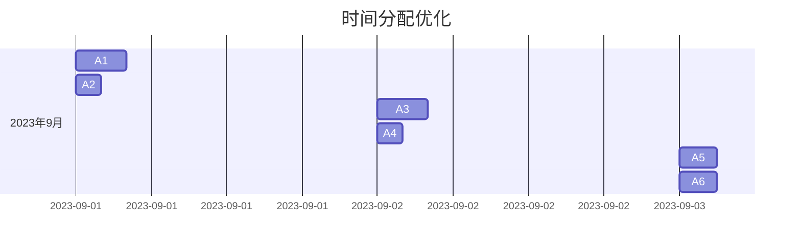

#### 3.3 提高工作效率

提高工作效率是时间管理的核心目标之一。通过时间追踪工具，用户可以记录自己的工作流程和时间使用情况，分析哪些环节效率较低，并采取相应措施进行优化。此外，时间追踪工具还可以帮助用户识别出高效的工作方式，并将其推广到整个团队。

**优势**：

- 提供了详细的工作记录，帮助用户了解自己的工作流程和时间使用情况。
- 通过数据分析，用户可以识别出效率低下的环节，并采取相应措施进行优化。
- 提高个人和团队的工作效率，降低工作压力。

**使用场景**：

- **软件开发**：在软件开发中，时间追踪工具可以帮助开发者记录编码时间，分析哪些功能模块的开发效率较低，从而优化开发流程。
- **市场营销**：在市场营销中，时间追踪工具可以帮助营销人员记录推广活动的时间分配，分析哪些渠道的推广效果较好，从而优化营销策略。

**示例**：假设一名软件开发者使用时间追踪工具记录了一个项目的开发时间，通过分析，他发现大部分时间都花费在调试和修复错误上。基于这个分析，他决定优化代码审查流程，加强代码质量和测试覆盖率，以提高整体开发效率。

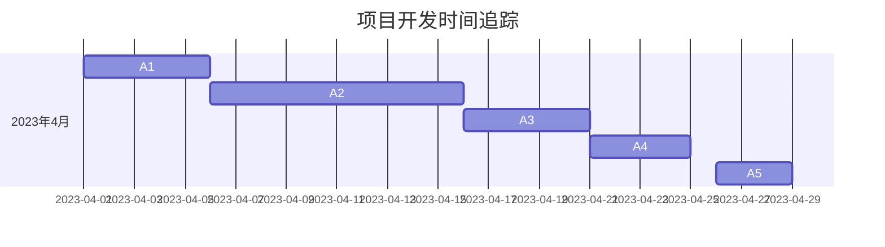

#### 小结

时间追踪工具在个人时间管理中具有广泛的应用，通过工作任务追踪、时间分配优化和提高工作效率，用户可以更好地管理自己的时间，提高个人生产力。选择合适的工具并善加利用，将有助于实现个人和团队的目标。

### 第4章：个人时间管理案例

在本章中，我们将通过两个具体的案例，展示如何使用时间追踪工具进行个人时间管理，并分析其效果。

#### 4.1 案例一：个人项目规划

**背景**：张先生是一名自由职业者，主要从事软件开发工作。他经常感到时间不够用，项目进度经常延误，导致客户满意度下降。

**解决方案**：张先生决定使用时间追踪工具进行个人项目规划。他首先记录了每个项目的任务和时间分配，并使用时间追踪工具进行分析。

**步骤**：

1. **记录任务**：张先生使用时间追踪工具记录了每个项目的任务，包括需求分析、设计、编码、测试和交付等。
2. **分配时间**：根据任务的重要性和紧急性，张先生为每个任务分配了时间，并在工具中设置了截止日期。
3. **时间追踪**：在项目执行过程中，张先生每天使用工具记录实际耗时，并与计划时间进行比较。

**结果**：通过时间追踪工具，张先生发现自己在编码阶段耗时过多，而测试阶段时间不足。基于这个分析，他调整了任务分配，将更多时间用于测试和调试，并优化了编码流程。结果，项目进度得到了显著提升，客户满意度也提高了。

**伪代码示例**：

```python
# 记录任务
tasks = [
    {"name": "需求分析", "duration": 3},
    {"name": "设计", "duration": 2},
    {"name": "编码", "duration": 5},
    {"name": "测试", "duration": 2},
    {"name": "交付", "duration": 1}
]

# 分配时间
for task in tasks:
    task["start_time"] = datetime.now()
    task["end_time"] = task["start_time"] + task["duration"]

# 时间追踪
while not all(task["end_time"] <= datetime.now() for task in tasks):
    for task in tasks:
        if task["end_time"] > datetime.now():
            task["actual_duration"] = datetime.now() - task["start_time"]
```

#### 4.2 案例二：日常时间管理

**背景**：李女士是一名全职妈妈，同时还在一家公司兼职工作。她感到自己每天的时间都被琐事占据，没有足够的时间用于工作和个人发展。

**解决方案**：李女士决定使用时间追踪工具进行日常时间管理。她记录了每天的活动和时间分配，并使用工具进行分析。

**步骤**：

1. **记录活动**：李女士使用时间追踪工具记录每天的活动，包括家务、照顾孩子、工作和个人学习等。
2. **时间分配**：李女士为每个活动分配时间，并在工具中设置了优先级。
3. **时间追踪**：每天结束时，李女士使用工具记录实际耗时，并与计划时间进行比较。

**结果**：通过时间追踪工具，李女士发现自己在家务和照顾孩子上花费的时间过多，而工作和个人学习时间不足。基于这个分析，她决定调整时间分配，将一些家务活动交给家人或雇佣帮工，并将节省的时间用于工作和个人学习。结果，她的工作效率提高了，个人发展也有了显著进展。

**伪代码示例**：

```python
# 记录活动
activities = [
    {"name": "家务", "duration": 3},
    {"name": "照顾孩子", "duration": 2},
    {"name": "工作", "duration": 4},
    {"name": "个人学习", "duration": 2}
]

# 分配时间
for activity in activities:
    activity["start_time"] = datetime.now()
    activity["end_time"] = activity["start_time"] + activity["duration"]

# 时间追踪
while not all(activity["end_time"] <= datetime.now() for activity in activities):
    for activity in activities:
        if activity["end_time"] > datetime.now():
            activity["actual_duration"] = datetime.now() - activity["start_time"]
```

#### 小结

通过以上两个案例，我们可以看到时间追踪工具在个人时间管理中的实际应用。无论是项目管理还是日常时间管理，时间追踪工具都能帮助用户更清晰地了解时间使用情况，从而进行优化，提高个人生产力。

### 第5章：团队时间管理概述

在当今快速变化的商业环境中，团队时间管理成为提升团队效率和生产力的重要手段。团队时间管理不仅关乎每个成员的工作效率，也直接影响到整个团队的项目进度和公司目标的实现。以下将探讨团队时间管理的重要性、面临的挑战以及管理目标。

#### 5.1 团队时间管理的重要性

团队时间管理是确保项目按时完成和达成预期目标的关键因素。以下是团队时间管理的重要性：

1. **资源优化**：通过有效的时间管理，团队能够合理分配资源，确保每个成员的工作量适中，避免资源浪费。
2. **项目进度控制**：时间管理工具可以帮助团队实时跟踪项目进度，及时发现问题并进行调整，确保项目按时交付。
3. **提高生产力**：团队时间管理能够减少无效工作时间，提高成员的工作效率，从而提升整体生产力。
4. **员工满意度和忠诚度**：合理的时间管理能够帮助员工更好地平衡工作与生活，提高工作满意度和忠诚度。

#### 5.2 团队时间管理面临的挑战

尽管团队时间管理的重要性显而易见，但实际操作中仍面临诸多挑战：

1. **任务复杂性**：现代项目往往涉及复杂的任务和多种技能，这使得任务分配和时间管理变得更加困难。
2. **沟通障碍**：团队成员之间的沟通不畅会导致任务延迟和信息失真，影响时间管理的有效性。
3. **外部干扰**：团队成员可能面临来自外部环境的各种干扰，如紧急任务、突发事件等，这些都可能影响时间管理。
4. **缺乏数据支持**：如果团队缺乏准确的时间使用数据，将难以进行科学的时间管理决策。

#### 5.3 团队时间管理的目标

团队时间管理的目标是确保项目高效、有序地推进，同时提高团队成员的工作满意度和生产力。具体目标包括：

1. **提高任务完成率**：确保团队成员能够按时完成分配的任务，减少延期情况。
2. **优化时间分配**：通过合理分配任务和资源，确保每个成员的工作负荷适中，避免过度劳累或资源闲置。
3. **提高沟通效率**：通过有效沟通和协作工具，减少信息传递的延迟和错误，确保团队整体协调一致。
4. **提高生产力**：通过时间管理和流程优化，提高团队成员的工作效率，实现项目的整体进度目标。
5. **员工满意度和忠诚度**：通过科学的时间管理，帮助团队成员更好地平衡工作与生活，提高工作满意度和忠诚度。

#### 小结

团队时间管理在提高团队效率和生产力方面具有重要作用。通过有效的时间管理，团队能够更好地应对复杂任务和外部干扰，实现项目目标，并提升成员的工作满意度和忠诚度。接下来，我们将深入探讨时间追踪工具在团队中的应用，以及如何通过这些工具优化团队时间管理。

### 第6章：时间追踪工具在团队中的应用

在团队环境中，时间追踪工具发挥着关键作用，有助于提高协作效率、确保项目进度和提升整体生产力。以下将详细探讨时间追踪工具在团队任务分配、项目进度追踪和团队协作效率提升方面的应用。

#### 6.1 团队任务分配

任务分配是团队时间管理的基础。通过时间追踪工具，团队能够更科学、高效地分配任务，确保每个成员的工作负荷均衡。

**优势**：

- **透明性**：时间追踪工具可以提供任务分配的透明度，团队成员可以实时了解任务的分配情况，避免重复工作或资源浪费。
- **灵活性**：工具通常允许动态调整任务分配，以应对突发情况或项目变化。
- **基于数据**：任务分配基于实际数据，如团队成员的工作能力、任务复杂度和优先级，确保任务分配的合理性。

**使用场景**：

- **日常任务分配**：在每日站会或周会中，项目经理可以使用时间追踪工具将任务分配给团队成员，明确任务的截止日期和责任人。
- **跨部门协作**：在跨部门项目中，时间追踪工具可以帮助不同部门间的任务协调和分配，确保项目整体进度。

**示例**：假设一个软件开发团队使用时间追踪工具进行任务分配，项目经理将一个复杂的模块分解为多个子任务，并基于团队成员的技能和经验，将任务分配给相应的成员。工具自动生成任务列表和责任矩阵，确保每个任务都有明确的责任人。

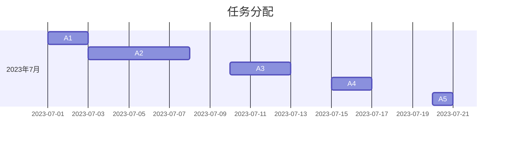

#### 6.2 项目进度追踪

项目进度追踪是确保项目按时完成的重要环节。时间追踪工具通过记录和报告项目任务的实际耗时和完成情况，帮助团队实时了解项目进度，并采取及时调整。

**优势**：

- **实时监控**：时间追踪工具提供实时数据，团队可以随时查看任务完成情况和项目进度。
- **预警机制**：工具可以设置预警机制，当任务进度延迟时，系统会自动发送通知，提醒团队成员和项目经理。
- **数据可视化**：通过图表和报告，团队可以直观地了解项目进展和潜在风险。

**使用场景**：

- **定期报告**：项目经理定期生成项目进度报告，向团队成员和高层管理者汇报项目进展。
- **迭代管理**：在敏捷开发中，时间追踪工具可以帮助团队跟踪每个迭代周期的任务完成情况，确保迭代目标的实现。

**示例**：一个软件开发团队使用时间追踪工具监控一个大型项目的进度。工具生成每周进度报告，显示每个任务的完成情况和项目的整体进度。项目经理根据报告调整资源分配，确保项目按计划推进。

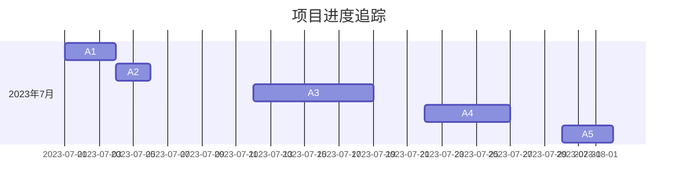

#### 6.3 提高团队协作效率

团队协作效率是项目成功的关键。时间追踪工具可以通过以下几个方面提高团队协作效率：

- **任务协调**：工具可以帮助团队成员协调任务，避免工作冲突和重复劳动。
- **沟通管理**：工具通常集成了沟通功能，如聊天室、通知系统等，方便团队成员交流和协作。
- **资源共享**：工具可以提供资源共享功能，如文档库、代码仓库等，方便团队成员访问和使用。

**优势**：

- **集中管理**：所有任务和沟通记录都在一个平台上，方便统一管理。
- **减少重复工作**：团队成员可以共享资源和信息，避免重复工作。
- **提高沟通效率**：实时沟通工具可以减少信息传递的延迟，提高决策速度。

**使用场景**：

- **跨地域协作**：在跨地域团队中，时间追踪工具可以帮助团队成员紧密协作，提高整体效率。
- **远程办公**：对于远程办公的团队，时间追踪工具可以确保团队成员的工作进度和沟通效率。

**示例**：一个全球分布的软件开发团队使用时间追踪工具进行协作。团队成员分布在不同的时区，工具提供了实时聊天功能和共享文档库，确保团队成员可以随时交流和获取所需信息。

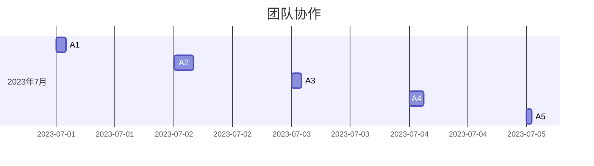

#### 小结

时间追踪工具在团队任务分配、项目进度追踪和团队协作效率提升方面具有显著优势。通过科学的时间管理，团队可以更好地协调资源，提高项目进度，实现协作效率的最大化。接下来，我们将通过具体案例展示如何通过时间追踪工具进行团队时间管理。

### 第7章：团队时间管理案例

在本章中，我们将通过两个具体的团队时间管理案例，展示如何通过时间追踪工具进行团队时间管理，并分析其实际效果。

#### 7.1 案例一：项目时间规划

**背景**：一个软件开发团队负责开发一款新型智能家居系统。项目时间紧、任务复杂，团队成员需要高效协作以确保项目按时完成。

**解决方案**：团队决定使用时间追踪工具进行项目时间规划。项目经理首先使用工具创建了项目任务列表，并为每个任务分配了资源和时间。

**步骤**：

1. **创建任务列表**：项目经理使用时间追踪工具创建了项目任务列表，包括需求分析、设计、编码、测试和交付等。
2. **任务分配**：项目经理根据团队成员的技能和时间可用性，将任务分配给合适的成员，并为每个任务设置了优先级和截止日期。
3. **时间追踪**：团队成员在工具中记录每天的工作时间和任务完成情况，工具自动生成项目进度报告。

**结果**：通过时间追踪工具，团队可以实时监控项目进度，及时调整任务分配和资源分配。在项目执行过程中，项目经理发现一个编码任务耗时过长，立即调整了其他任务的优先级，并将额外资源分配给该任务。最终，项目按时完成，客户满意度提高。

**伪代码示例**：

```python
# 创建任务列表
tasks = [
    {"name": "需求分析", "duration": 3},
    {"name": "设计", "duration": 2},
    {"name": "编码", "duration": 5},
    {"name": "测试", "duration": 2},
    {"name": "交付", "duration": 1}
]

# 分配任务和资源
for task in tasks:
    assign_member(task, "张三")
    assign_resource(task, "服务器")

# 时间追踪
while not all(task["end_time"] <= datetime.now() for task in tasks):
    update_progress(tasks)
    generate_progress_report(tasks)
```

#### 7.2 案例二：团队日常时间管理

**背景**：一家广告公司由于项目繁多，团队成员经常感到时间不够用，导致工作效率下降。公司管理层决定使用时间追踪工具进行团队日常时间管理。

**解决方案**：公司决定为每个团队成员配备时间追踪工具，并要求他们在每天工作结束时记录时间使用情况。

**步骤**：

1. **工具安装**：公司为每个员工安装了时间追踪工具，并进行了简单培训。
2. **时间记录**：员工每天在工作结束时使用工具记录时间使用情况，包括工作时间、休息时间和个人事务。
3. **数据分析**：管理层使用工具分析员工的时间使用情况，发现时间浪费的地方，并提出改进建议。

**结果**：通过时间追踪工具，公司发现员工在社交媒体和个人事务上花费了过多时间，导致工作效率下降。管理层制定了新的工作时间规定，禁止在工作时间内使用社交媒体，并鼓励员工在休息时间使用这些工具。同时，公司优化了工作流程，减少不必要的会议和流程，提高了整体工作效率。

**伪代码示例**：

```python
# 记录时间使用情况
time_entries = [
    {"name": "工作", "duration": 8},
    {"name": "休息", "duration": 1},
    {"name": "个人事务", "duration": 1}
]

# 数据分析
for time_entry in time_entries:
    if time_entry["name"] == "个人事务" and time_entry["duration"] > 1:
        print("建议减少个人事务时间，以提高工作效率。")

# 优化工作流程
optimize_workflow()
```

#### 小结

通过以上两个案例，我们可以看到时间追踪工具在团队时间管理中的实际应用。无论是项目时间规划还是日常时间管理，时间追踪工具都能帮助团队更好地协调资源，提高项目进度和整体工作效率。

### 第8章：优化工作流程

优化工作流程是提高团队生产力和效率的关键。通过合理的工作流程设计，团队能够更高效地完成任务，减少浪费，提高整体产出。以下将探讨工作流程优化的基本原则、策略以及实际应用。

#### 8.1 工作流程分析

工作流程分析是优化工作流程的第一步，旨在理解当前工作流程的运行状况，发现存在的问题和瓶颈。以下是一些基本步骤：

1. **流程图绘制**：使用流程图工具（如Mermaid、Visio等）绘制当前工作流程，包括每个环节的任务、责任人和耗时。
2. **数据收集**：收集相关数据，如任务完成时间、错误率、资源利用率等，用于分析流程的效率。
3. **问题识别**：通过分析流程图和数据，识别出流程中的瓶颈、重复工作和资源浪费等问题。

**示例**：使用Mermaid绘制一个软件开发项目的流程图：

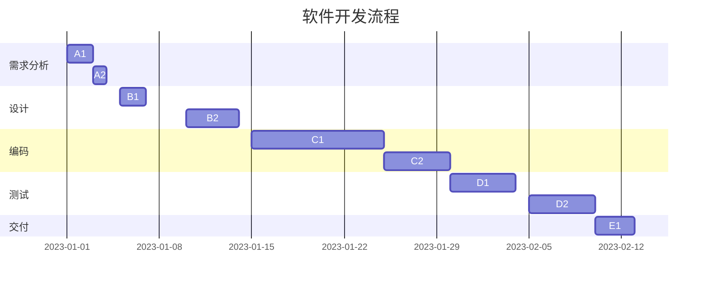

#### 8.2 工作流程优化策略

一旦识别出工作流程中的问题，就需要采取相应策略进行优化。以下是一些常用的优化策略：

1. **消除重复工作**：通过自动化工具或流程整合，消除重复的任务和流程，减少人力资源浪费。
2. **减少决策层次**：简化决策流程，减少不必要的审批环节，提高决策速度。
3. **任务分解**：将复杂任务分解为更小的子任务，明确每个子任务的负责人和完成时间，提高任务的可控性。
4. **资源优化**：合理分配资源和人力，确保关键资源得到充分利用，避免资源闲置。
5. **标准化流程**：制定标准化流程，确保所有团队成员遵循统一的工作方法和流程，提高工作效率。

**示例**：优化软件开发项目的流程，通过引入自动化测试和代码审查工具，减少测试和代码评审的耗时。

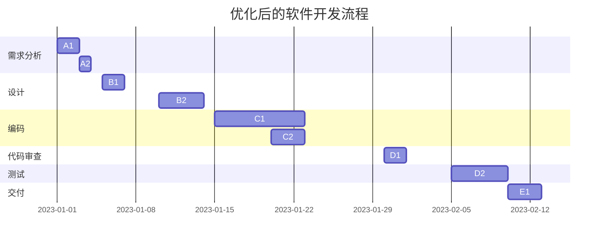

#### 8.3 工作流程优化的实践

工作流程优化不仅需要理论指导，更需要实际操作。以下是一些优化实践：

1. **试点实施**：在部分团队或项目中试点优化方案，通过实际应用验证效果，积累经验。
2. **员工培训**：对团队成员进行培训，确保他们理解新的工作流程和方法。
3. **持续改进**：工作流程优化是一个持续的过程，需要定期评估和调整，以适应不断变化的业务需求。

**示例**：在一个软件开发团队中，引入敏捷开发方法，将项目分解为多个迭代周期，每个迭代周期结束后进行回顾和调整。

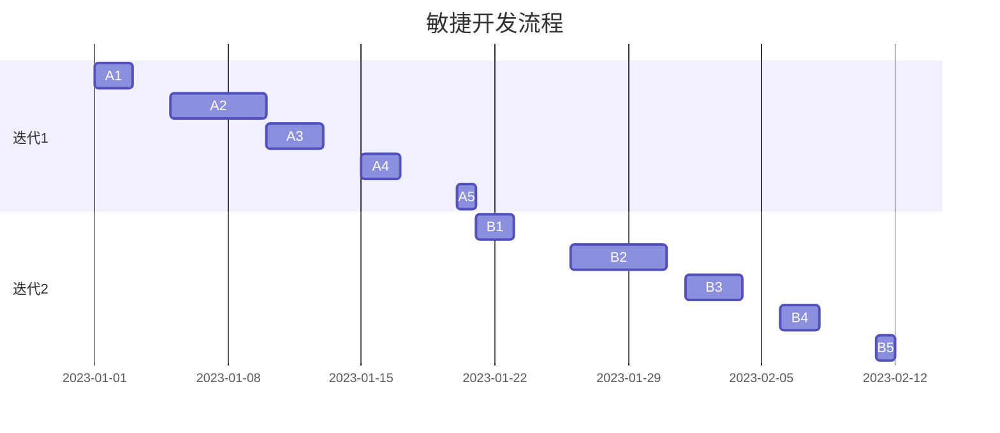

#### 小结

优化工作流程是提高团队生产力和效率的重要手段。通过工作流程分析、制定优化策略和实际应用，团队可以更高效地完成任务，减少浪费，实现整体效率的提升。接下来，我们将探讨时间追踪工具在团队管理中的实际应用。

### 第9章：时间追踪工具在团队管理中的实际应用

在团队管理中，时间追踪工具不仅有助于个人时间管理，还可以为团队整体管理提供宝贵的数据和分析，从而提升团队的生产力和效率。以下将详细探讨时间追踪工具在团队管理中的实际应用，包括项目启动与追踪、团队协作与沟通以及团队绩效评估等方面。

#### 9.1 项目启动与追踪

项目启动是团队管理的重要环节，时间追踪工具在这一阶段提供了以下支持：

**功能**：

- **项目计划制定**：时间追踪工具可以帮助项目经理制定详细的项目计划，包括任务分配、时间表和里程碑。
- **任务分配与跟踪**：工具可以自动分配任务给团队成员，并实时跟踪任务的完成情况，确保每个任务都有人负责。
- **进度报告生成**：工具可以生成项目进度报告，项目经理可以定期审查，确保项目按计划推进。

**应用示例**：

假设一个软件开发团队正在开发一个新系统，项目经理使用时间追踪工具来启动项目：

1. **制定计划**：项目经理创建项目任务列表，包括需求分析、设计、编码、测试和部署等。
2. **任务分配**：项目经理将任务分配给团队成员，并为每个任务设置截止日期。
3. **进度追踪**：团队成员在工具中记录每个任务的进展，项目经理可以实时查看项目进度。

**伪代码示例**：

```python
# 创建项目任务
tasks = [
    {"name": "需求分析", "duration": 3},
    {"name": "设计", "duration": 2},
    {"name": "编码", "duration": 5},
    {"name": "测试", "duration": 3},
    {"name": "部署", "duration": 2}
]

# 分配任务
for task in tasks:
    assign_member(task, "张三")
    assign_member(task, "李四")

# 记录任务进度
update_progress(tasks)
generate_progress_report(tasks)
```

#### 9.2 团队协作与沟通

在团队协作中，时间追踪工具不仅帮助追踪任务进度，还提供了以下功能来支持团队沟通和协作：

**功能**：

- **实时沟通**：工具通常集成了聊天室、邮件通知和即时消息功能，方便团队成员之间的实时沟通。
- **文档共享**：工具提供了共享文档库，团队成员可以轻松共享和协作编辑文档。
- **任务通知**：工具可以设置任务提醒和通知，确保团队成员及时了解任务进度和截止日期。

**应用示例**：

在一个跨地域团队中，时间追踪工具支持团队协作：

1. **实时沟通**：团队成员通过工具的聊天室功能进行实时交流，讨论任务进展和遇到的问题。
2. **文档共享**：项目经理在文档库中上传项目计划和报告，团队成员可以随时查看和编辑。
3. **任务通知**：当任务进度延迟或任务分配有变时，工具会发送通知提醒相关成员。

**伪代码示例**：

```python
# 实时沟通
start_chat_session("项目讨论", ["张三", "李四", "王五"])

# 文档共享
upload_document("项目计划.pdf", "张三")

# 任务通知
send_notification("任务延迟通知", "任务X已超过截止日期，请关注。", "李四")
```

#### 9.3 团队绩效评估

团队绩效评估是团队管理中的重要环节，时间追踪工具提供了以下功能来支持评估：

**功能**：

- **工作记录分析**：工具可以分析团队成员的工作记录，提供工作量和效率的量化数据。
- **绩效报告生成**：工具可以生成详细的绩效报告，包括工作时长、任务完成情况和效率分析。
- **绩效反馈**：工具可以提供绩效反馈功能，项目经理可以根据报告与团队成员进行绩效讨论。

**应用示例**：

在一个季度结束时，项目经理使用时间追踪工具进行团队绩效评估：

1. **工作记录分析**：工具分析了团队成员在过去三个月的工作记录，提供了工作量和工作效率的数据。
2. **绩效报告生成**：工具生成了详细的绩效报告，包括每个成员的工作时长、任务完成率和效率评分。
3. **绩效反馈**：项目经理与团队成员进行了绩效讨论，根据报告结果给予反馈和建议。

**伪代码示例**：

```python
# 工作记录分析
analyze_work_records()

# 生成绩效报告
generate_performance_report()

# 绩效反馈
conduct_performance_review("张三")
```

#### 小结

时间追踪工具在团队管理中的实际应用涵盖了项目启动与追踪、团队协作与沟通以及团队绩效评估等多个方面。通过这些工具，团队可以更高效地管理项目，提升协作效率，并科学地评估成员的绩效，从而实现整体生产力的提升。

### 第10章：时间追踪与生产力提升

时间追踪工具在提高生产力方面扮演着至关重要的角色。通过记录和分析时间使用情况，团队和个人能够识别出时间浪费的环节，采取针对性的措施进行优化，从而显著提升工作效率和生产力。以下将详细探讨时间追踪与工作效率、团队协作和团队激励之间的紧密联系。

#### 10.1 时间追踪与工作效率

时间追踪工具可以帮助用户深入了解自己的时间使用情况，识别出时间浪费的地方，从而优化时间分配，提高工作效率。以下是几个关键点：

1. **任务时间记录**：通过记录每个任务的开始和结束时间，用户可以准确了解任务的实际耗时，并与计划时间进行比较。这有助于发现哪些任务耗时过多，哪些任务可以优化或删除。
2. **效率分析**：时间追踪工具可以生成详细的效率分析报告，展示用户在不同时间段的工作效率。通过分析这些报告，用户可以发现哪些时间段工作效率最高，哪些时间段效率最低，从而调整工作计划，优化时间分配。
3. **目标设定与跟踪**：时间追踪工具可以帮助用户设定具体的工作目标，并跟踪目标的完成情况。用户可以根据目标完成情况调整工作策略，确保每个任务都在预定时间内完成。

**实例**：

假设一名程序员使用时间追踪工具记录了一个月的工作时间。通过分析报告，他发现自己在每天的下午3点到4点之间工作效率最低，而在上午10点到11点之间工作效率最高。基于这个分析，他决定调整工作计划，将重要的任务安排在上午完成，以提高整体工作效率。

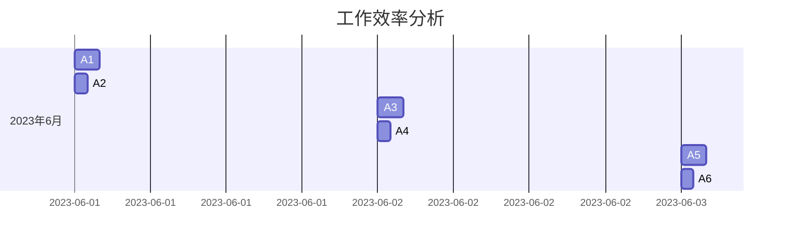

#### 10.2 时间追踪与团队协作

在团队环境中，时间追踪工具不仅可以提高个人生产力，还可以促进团队协作，提升整体效率。以下是几个关键点：

1. **任务分配与追踪**：时间追踪工具可以帮助项目经理将任务合理分配给团队成员，并实时追踪任务的完成情况。这有助于确保每个成员都知道自己的任务和截止日期，从而提高任务完成率和团队协作效率。
2. **沟通与协作**：时间追踪工具通常集成了沟通和协作功能，如聊天室、通知系统和共享文档库。这些功能有助于团队成员之间实时沟通和协作，确保任务顺利推进。
3. **进度报告与反馈**：时间追踪工具可以生成项目进度报告，项目经理可以定期审查并反馈，确保项目按计划推进，及时发现和解决问题。

**实例**：

在一个软件开发团队中，项目经理使用时间追踪工具分配任务并监控项目进度：

1. **任务分配**：项目经理将新项目的任务分配给团队成员，并为每个任务设置了优先级和截止日期。
2. **进度追踪**：团队成员在工具中记录任务进度，项目经理可以实时查看项目进度。
3. **进度报告与反馈**：项目经理生成项目进度报告，与团队成员进行讨论，并根据反馈调整任务分配和资源分配。


#### 10.3 时间追踪与团队激励

时间追踪工具不仅有助于提高团队效率和生产力，还可以用于团队激励，激发团队成员的积极性和创造力。以下是几个关键点：

1. **绩效评估**：时间追踪工具可以提供详细的绩效数据，帮助项目经理评估团队成员的工作表现。通过公正的绩效评估，可以激励团队成员努力工作，提高个人和团队的绩效。
2. **奖励机制**：基于时间追踪工具的数据，项目经理可以设立奖励机制，对表现优秀的团队成员进行奖励。这可以包括奖金、晋升机会或其他形式的激励，从而提高团队成员的积极性和满意度。
3. **透明度和公平性**：时间追踪工具提供了工作记录的透明度，确保团队成员的工作量和贡献得到公正评价。这种透明度和公平性有助于建立积极的工作氛围，增强团队凝聚力。

**实例**：

在一个销售团队中，项目经理使用时间追踪工具进行绩效评估和激励：

1. **绩效评估**：项目经理根据时间追踪工具记录的销售数据，评估每个团队成员的业绩，并生成绩效报告。
2. **奖励机制**：根据绩效报告，项目经理设立了销售奖励机制，对销售业绩最高的团队成员发放奖金。
3. **透明度和公平性**：所有团队成员都可以访问时间追踪工具，了解自己和同事的工作进度和绩效数据，确保评估过程的透明和公正。

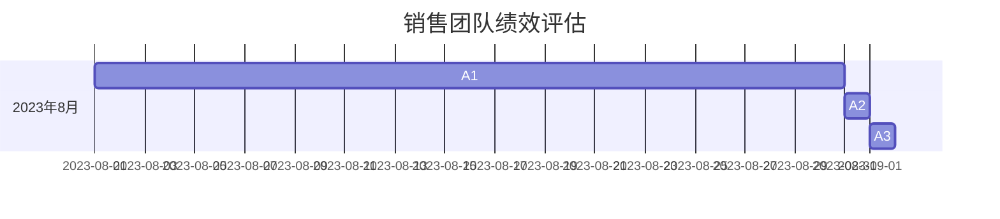

#### 小结

时间追踪工具在提高生产力方面具有显著作用，通过记录和分析时间使用情况，团队和个人可以识别出时间浪费的环节，采取针对性的优化措施。同时，时间追踪工具还可以促进团队协作，提高工作效率，并通过绩效评估和激励机制激发团队成员的积极性和创造力，从而实现整体生产力的提升。

### 第11章：优化工作流程

优化工作流程是提高团队效率和生产力的重要手段。通过合理的工作流程设计，团队可以减少重复劳动，提高工作效率，实现项目的顺利推进。以下将探讨工作流程优化的策略和方法，并结合实际案例进行分析。

#### 11.1 工作流程分析

工作流程分析是优化工作流程的第一步，通过对现有工作流程进行详细分析，识别出存在的问题和瓶颈。以下是工作流程分析的关键步骤：

1. **流程图绘制**：使用流程图工具（如Mermaid、Visio等）绘制现有工作流程，包括每个环节的任务、责任人和耗时。
2. **数据收集**：收集相关数据，如任务完成时间、错误率、资源利用率等，用于分析流程的效率。
3. **问题识别**：通过分析流程图和数据，识别出流程中的瓶颈、重复工作和资源浪费等问题。

**示例**：

使用Mermaid绘制一个软件开发项目的流程图：


#### 11.2 工作流程优化策略

一旦识别出工作流程中的问题，就需要采取相应的策略进行优化。以下是一些常见的工作流程优化策略：

1. **消除重复工作**：通过自动化工具或流程整合，消除重复的任务和流程，减少人力资源浪费。
2. **减少决策层次**：简化决策流程，减少不必要的审批环节，提高决策速度。
3. **任务分解**：将复杂任务分解为更小的子任务，明确每个子任务的负责人和完成时间，提高任务的可控性。
4. **资源优化**：合理分配资源和人力，确保关键资源得到充分利用，避免资源闲置。
5. **标准化流程**：制定标准化流程，确保所有团队成员遵循统一的工作方法和流程，提高工作效率。

**示例**：

优化软件开发项目的流程，通过引入自动化测试和代码审查工具：


#### 11.3 实际应用案例

以下是一个实际案例，展示如何通过优化工作流程提高团队效率：

**案例背景**：

一个初创公司负责开发一款新的移动应用，由于团队成员经验不足，项目进展缓慢，效率低下。

**解决方案**：

1. **流程分析**：团队首先对现有工作流程进行了详细分析，识别出需求讨论、设计、编码和测试等环节中的问题，如任务分配不清、沟通不畅和重复劳动等。

2. **任务分解**：团队将复杂的设计和编码任务分解为更小的子任务，明确每个子任务的负责人和完成时间，确保任务分配清晰。

3. **引入工具**：团队引入了自动化测试工具和代码审查工具，减少手动测试和代码审查的工作量，提高工作效率。

4. **标准化流程**：团队制定了标准化流程，包括任务分配、任务追踪、代码审查和测试等，确保所有团队成员遵循统一的方法。

**效果**：

通过优化工作流程，团队显著提高了工作效率，项目进展加快，最终按时完成了开发任务，并顺利上线。

**伪代码示例**：

```python
# 流程分析
analyze_current_process()

# 任务分解
tasks = [
    {"name": "需求分析", "duration": 3},
    {"name": "设计", "duration": 2},
    {"name": "编码", "duration": 5},
    {"name": "测试", "duration": 2}
]

# 引入工具
import AutomatedTestingTool
import CodeReviewTool

# 标准化流程
standardize_process(tasks)
```

#### 小结

优化工作流程是提高团队效率和生产力的重要手段。通过工作流程分析、任务分解、引入工具和标准化流程，团队可以显著提高工作效率，实现项目的顺利推进。

### 第12章：时间追踪工具在团队管理中的实战应用

在本章中，我们将通过三个具体实战案例，展示时间追踪工具在团队管理中的实际应用，以及如何通过这些工具提升团队生产力。

#### 12.1 实战一：项目启动与追踪

**背景**：一个软件开发团队负责开发一款企业资源规划（ERP）系统。项目时间紧、任务复杂，团队成员需要高效协作以确保项目按时完成。

**解决方案**：

1. **项目计划制定**：项目经理使用时间追踪工具制定详细的项目计划，包括任务分配、时间表和里程碑。工具提供了甘特图功能，方便可视化项目进度。
2. **任务分配与追踪**：项目经理将任务分配给团队成员，并设置了截止日期和优先级。团队成员在工具中记录任务的完成情况，项目经理可以实时监控项目进度。
3. **进度报告生成**：工具自动生成项目进度报告，项目经理可以定期审查，确保项目按计划推进。

**效果**：通过时间追踪工具，团队可以实时了解项目进度，及时调整任务分配和资源分配。项目最终按时完成，客户满意度提高。

**伪代码示例**：

```python
# 创建项目任务
tasks = [
    {"name": "需求分析", "duration": 3},
    {"name": "设计", "duration": 2},
    {"name": "编码", "duration": 5},
    {"name": "测试", "duration": 3},
    {"name": "交付", "duration": 1}
]

# 分配任务
for task in tasks:
    assign_member(task, "张三")
    assign_member(task, "李四")

# 时间追踪
while not all(task["end_time"] <= datetime.now() for task in tasks):
    update_progress(tasks)
    generate_progress_report(tasks)
```

#### 12.2 实战二：团队协作与沟通

**背景**：一家跨国公司团队分布在全球不同地区，沟通协作面临挑战。公司管理层决定使用时间追踪工具提高团队协作效率。

**解决方案**：

1. **实时沟通**：工具集成了实时聊天室和视频会议功能，团队成员可以随时进行沟通和协作。
2. **文档共享**：工具提供了共享文档库，团队成员可以方便地共享和编辑文档，确保信息一致性。
3. **任务通知**：工具设置了任务提醒和通知功能，确保团队成员及时了解任务进展和截止日期。

**效果**：通过时间追踪工具，团队成员可以更高效地协作，减少沟通延迟和信息失真，项目进展顺利。

**伪代码示例**：

```python
# 实时沟通
start_chat_session("项目讨论", ["张三", "李四", "王五"])

# 文档共享
upload_document("项目计划.pdf", "张三")

# 任务通知
send_notification("任务延迟通知", "任务X已超过截止日期，请关注。", "李四")
```

#### 12.3 实战三：团队绩效评估

**背景**：一家互联网公司需要定期评估团队绩效，以激励团队成员和提高整体生产力。

**解决方案**：

1. **工作记录分析**：时间追踪工具分析了团队成员的工作记录，提供了工作量和工作效率的数据。
2. **绩效报告生成**：工具生成了详细的绩效报告，包括每个成员的工作时长、任务完成情况和效率评分。
3. **绩效反馈**：项目经理与团队成员进行了绩效讨论，根据报告结果给予反馈和建议。

**效果**：通过时间追踪工具，公司能够公正、透明地评估团队成员的绩效，激励团队成员努力工作，提高整体生产力。

**伪代码示例**：

```python
# 工作记录分析
analyze_work_records()

# 生成绩效报告
generate_performance_report()

# 绩效反馈
conduct_performance_review("张三")
```

#### 小结

通过以上三个实战案例，我们可以看到时间追踪工具在团队管理中的实际应用。从项目启动与追踪、团队协作与沟通到团队绩效评估，时间追踪工具为团队提供了全面的支持，帮助团队实现生产力的提升和目标的达成。

### 第13章：时间追踪工具的未来发展趋势

随着科技的不断进步，时间追踪工具也在不断进化，未来将迎来一系列技术革新和趋势。这些趋势不仅会改变时间追踪工具的功能和应用场景，还将深刻影响个人和团队的工作方式。以下将探讨时间追踪工具的技术发展、物联网技术的影响以及云计算的融合。

#### 13.1 人工智能在时间追踪中的应用

人工智能（AI）技术的发展为时间追踪工具带来了新的机遇。通过AI技术，时间追踪工具可以实现以下功能：

1. **自动化任务分配**：AI算法可以分析团队成员的工作能力和时间安排，自动分配最合适的任务，提高任务分配的效率和准确性。
2. **智能进度预测**：基于历史数据和机器学习算法，AI可以预测任务完成时间和项目进度，提供实时预警，帮助团队及时调整计划。
3. **效率分析优化**：AI可以分析团队成员的工作行为和习惯，提供个性化建议，帮助团队成员优化时间管理，提高工作效率。

**示例**：一个AI驱动的时间追踪工具可以自动分析团队成员的日程安排和工作习惯，自动推荐最佳的工作时间表，并提供个性化的时间管理建议。

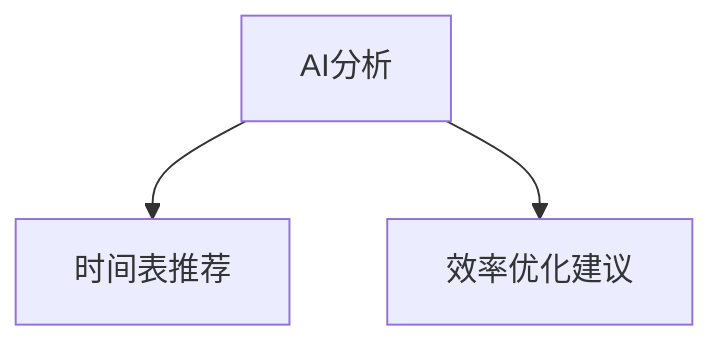

#### 13.2 物联网技术对时间追踪的影响

物联网（IoT）技术的普及为时间追踪工具带来了新的可能。通过物联网设备，时间追踪工具可以实现以下功能：

1. **实时数据采集**：物联网设备可以实时采集团队成员的工作状态和环境数据，如工作时长、工作地点和环境温度等，提供更准确的时间追踪数据。
2. **远程监控与支持**：物联网技术可以支持远程监控和设备支持，帮助团队远程管理和维护设备，提高工作效率。
3. **智能场景识别**：通过物联网传感器，时间追踪工具可以识别工作环境中的不同场景，如会议、休息和加班等，提供更智能的时间管理。

**示例**：一个智能手表连接到时间追踪工具，可以实时记录佩戴者的工作时长、运动数据和睡眠质量，为个人提供全面的健康和时间管理数据。

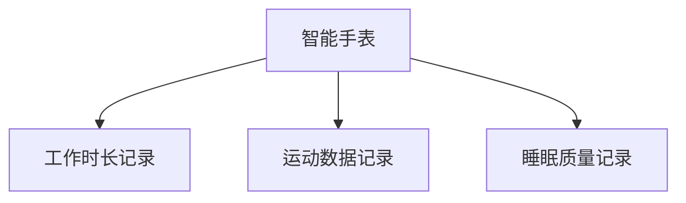

#### 13.3 云计算的融合

云计算的快速发展为时间追踪工具提供了强大的技术支持。通过云计算，时间追踪工具可以实现以下功能：

1. **数据存储与处理**：云计算提供了海量的存储空间和计算能力，时间追踪工具可以将大量时间追踪数据存储在云端，并提供快速的数据处理和分析。
2. **多设备同步**：通过云计算，时间追踪工具可以实现多设备同步，团队成员可以在不同的设备上访问和管理时间追踪数据，提高协作效率。
3. **自动化更新与升级**：云计算平台可以自动更新和升级时间追踪工具，确保工具始终处于最新状态，提供最佳的用户体验。

**示例**：一个基于云计算的时间追踪工具可以自动同步团队成员在不同设备上的时间追踪数据，并提供实时的进度报告和通知。

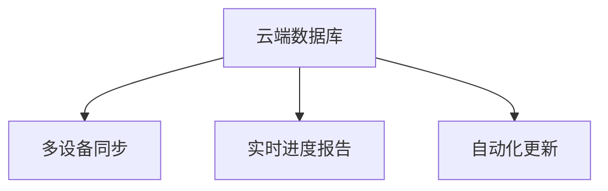

#### 小结

时间追踪工具的未来发展趋势将受到人工智能、物联网和云计算的深刻影响。通过这些先进技术的融合，时间追踪工具将实现更高的自动化、智能化和数据化，为个人和团队提供更高效、更智能的时间管理解决方案。

### 第14章：时间追踪工具的未来趋势

随着科技的不断发展，时间追踪工具正迎来一系列新的趋势和变革。这些趋势不仅将改变时间追踪工具的功能和应用，还将深刻影响个人和团队的工作方式。以下将探讨时间追踪工具在智能化、集成化和个性化方面的未来趋势。

#### 14.1 智能化

智能化是时间追踪工具未来发展的一个重要趋势。通过人工智能（AI）和机器学习技术的融合，时间追踪工具将变得更加智能，能够自动完成更多任务，提供更精准的预测和分析。

1. **智能任务分配**：智能算法可以根据团队成员的工作能力和时间安排，自动分配最合适的任务，提高任务分配的效率和准确性。
2. **智能进度预测**：AI算法可以分析历史数据，预测任务完成时间和项目进度，提供实时预警，帮助团队及时调整计划。
3. **智能效率分析**：AI可以分析团队成员的工作行为和习惯，提供个性化建议，帮助团队成员优化时间管理，提高工作效率。

**实例**：一个智能时间追踪工具可以自动分析团队成员的工作数据，识别出最佳的工作时间表，并为团队成员提供个性化的时间管理建议。


#### 14.2 集成化

集成化是时间追踪工具未来的另一个重要趋势。随着各种工作和管理工具的普及，用户需要一个统一的平台来管理所有的数据和信息。集成化的时间追踪工具可以与各种其他工具无缝对接，提供更全面的管理解决方案。

1. **多工具集成**：时间追踪工具可以与项目管理工具、沟通工具、协作工具等无缝集成，实现数据共享和流程整合，提高团队协作效率。
2. **数据可视化**：集成化的时间追踪工具可以提供丰富的数据可视化功能，帮助用户更直观地了解时间使用情况和工作进度。
3. **自动化流程**：通过与其他工具的集成，时间追踪工具可以实现自动化流程，如任务分配、进度更新和报告生成，减少手动操作，提高工作效率。

**实例**：一个集成化的时间追踪工具可以与项目管理工具集成，自动同步任务分配和项目进度，并提供实时的进度报告和通知。

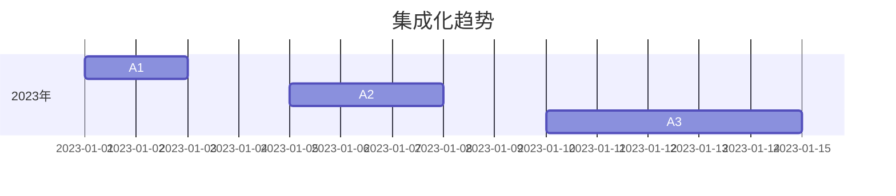

#### 14.3 个性化

个性化是时间追踪工具未来的第三个重要趋势。随着用户对个性化需求不断增加，时间追踪工具需要提供更个性化的体验和服务，满足用户的个性化需求。

1. **定制化报告**：用户可以根据自己的需求，自定义时间追踪报告的格式和内容，获得最符合自己需求的信息。
2. **个性化建议**：时间追踪工具可以根据用户的工作习惯和时间使用情况，提供个性化的时间管理建议，帮助用户优化时间分配，提高工作效率。
3. **灵活的配置选项**：时间追踪工具提供了丰富的配置选项，用户可以根据自己的工作方式和需求，自定义工具的界面和功能。

**实例**：一个个性化的时间追踪工具允许用户自定义报告格式，根据不同用户角色提供不同的功能模块，满足不同用户的需求。


#### 小结

时间追踪工具的未来将朝着智能化、集成化和个性化的方向发展。通过融合先进技术，时间追踪工具将提供更智能、更全面、更个性化的时间管理解决方案，为个人和团队带来更高的生产力和效率。

### 附录A：时间追踪工具资源汇总

在时间追踪工具的选择和使用过程中，了解各种工具的资源可以大大提高您的效率。以下是一些开源时间追踪工具和商业时间追踪工具的推荐，以及相关的社区和论坛资源。

#### A.1 开源时间追踪工具推荐

1. **Toggl**：一个开源的时间追踪和项目管理工具，支持多个平台和浏览器插件，易于使用。
   - GitHub链接：[Toggl](https://github.com/toggl/toggl-button)

2. **Timeneye**：一个基于Ruby on Rails的开源时间追踪和管理工具，提供多种时间跟踪功能。
   - GitHub链接：[Timeneye](https://github.com/timeneye/timeneye)

3. **Kanboard**：一个轻量级的开源项目管理工具，支持任务和时间的跟踪。
   - GitHub链接：[Kanboard](https://github.com/kanboard/kanboard)

4. **TaskJuggler**：一个强大的开源项目管理工具，提供时间规划和资源管理的功能。
   - GitHub链接：[TaskJuggler](https://github.com/taskjuggler/taskjuggler)

#### A.2 商业时间追踪工具介绍

1. **Harvest**：一个功能强大的商业时间追踪工具，提供项目管理、团队协作和财务报告功能。
   - 官网链接：[Harvest](https://www.harvestapp.com/)

2. **TSheets**：由ADP提供的商业时间追踪工具，适用于各种规模的企业，提供全面的员工时间管理功能。
   - 官网链接：[TSheets](https://www.timesheet.com/)

3. **RescueTime**：一个专注于时间管理和生产力提升的商业工具，通过监控您的设备使用情况，提供个性化的时间管理建议。
   - 官网链接：[RescueTime](https://www.rescuetime.com/)

4. **Quicken**：一个综合性的财务和个人时间管理工具，提供时间追踪、预算管理和投资跟踪功能。
   - 官网链接：[Quicken](https://www.quicken.com/)

#### A.3 时间追踪工具的社区与论坛

1. **Time Management Forum**：一个专门讨论时间管理和时间追踪工具的社区，提供大量的讨论和资源。
   - 论坛链接：[Time Management Forum](https://www.timemanagementforum.com/)

2. **Stack Overflow**：一个大型开发者社区，包含大量关于时间追踪工具的使用和开发的问答。
   - 论坛链接：[Stack Overflow](https://stackoverflow.com/)

3. **Reddit**：Reddit上有多个关于时间管理和时间追踪工具的子论坛，用户可以在这里分享经验和获取建议。
   - Reddit链接：[Reddit Time Management](https://www.reddit.com/r/TimeManagement/)

4. **Toggl Track Community**：Toggl的官方社区，提供用户论坛、教程和资源，帮助用户更好地使用Toggl Track。
   - 社区链接：[Toggl Track Community](https://community.toggl.com/)

通过使用这些资源和工具，您可以更好地选择适合您需求的时间追踪工具，并在使用过程中获得更多的帮助和指导。

### 附录B：时间追踪工具使用指南

在您开始使用时间追踪工具之前，以下指南将帮助您了解常见问题、使用技巧以及如何保护隐私和安全。

#### B.1 常见问题解答

1. **什么是时间追踪工具？**
   时间追踪工具是一种软件或服务，用于记录和跟踪个人或团队的工作时间、任务和活动。

2. **时间追踪工具有什么用？**
   时间追踪工具可以帮助用户优化时间管理，提高工作效率，确保项目按时完成，并提供财务和资源管理的支持。

3. **如何选择合适的时间追踪工具？**
   选择时间追踪工具时，应考虑工具的功能、用户界面、价格和兼容性。根据您的具体需求，选择具有所需功能的工具。

4. **如何设置时间追踪工具？**
   通常，设置时间追踪工具涉及以下步骤：
   - 创建账户和用户
   - 配置工具设置（如时间格式、货币符号等）
   - 添加项目和任务
   - 分配团队成员和权限

5. **如何确保时间追踪数据的准确性？**
   确保时间追踪数据的准确性需要以下措施：
   - 经常检查和更新记录
   - 定期审查和验证数据
   - 为团队成员提供培训，确保他们了解如何正确记录时间

#### B.2 使用技巧与建议

1. **如何优化时间追踪工具的使用？**
   - 为常用任务设置快捷方式，减少手动输入时间。
   - 定期回顾和分析时间追踪报告，识别时间浪费的环节。
   - 利用自动化功能，如任务提醒和进度更新。

2. **如何有效地使用时间追踪工具进行团队协作？**
   - 确保团队成员都熟悉工具的使用。
   - 定期召开会议，讨论时间追踪工具的使用情况和改进建议。
   - 利用工具的沟通功能，保持团队成员之间的信息同步。

3. **如何提高时间追踪工具的用户体验？**
   - 选择用户界面简洁、易于导航的工具。
   - 利用工具的个性化设置，调整界面和功能以符合个人偏好。
   - 定期更新工具，获取最新的功能和改进。

#### B.3 安全与隐私保护

1. **如何保护时间追踪工具的隐私和安全？**
   - 选择具有良好安全记录和时间追踪工具。
   - 使用强密码和双因素认证，确保账户安全。
   - 定期备份数据，防止数据丢失。
   - 了解并遵守工具提供商的隐私政策，确保数据不被非法使用。

2. **如何避免数据泄露？**
   - 使用加密通信和存储，确保数据在传输和存储过程中安全。
   - 定期更新工具的安全补丁，防止安全漏洞。
   - 使用虚拟专用网络（VPN），特别是在公共网络上访问时间追踪工具。

3. **如何处理敏感数据？**
   - 对敏感数据（如员工个人信息）进行加密存储。
   - 设立访问控制策略，确保只有授权人员可以访问敏感数据。
   - 定期审计和监控数据访问和操作，及时发现和响应潜在的安全威胁。

通过遵循以上指南，您可以更好地使用时间追踪工具，确保数据的准确性和安全性，提高个人和团队的生产力。

### 结语

时间追踪工具在现代工作环境中扮演着至关重要的角色。通过科学的时间管理和高效的协作，个人和团队能够显著提升生产力，实现目标。本文从时间追踪工具的概述、个人和团队时间管理、工作流程优化、团队管理实战，以及未来发展趋势等方面进行了深入探讨，希望对您有所帮助。

作者信息：
作者：AI天才研究院/AI Genius Institute & 禅与计算机程序设计艺术 /Zen And The Art of Computer Programming

感谢您的阅读！如果您有任何疑问或建议，请随时联系我们。希望本文能帮助您更好地利用时间追踪工具，提升个人和团队的生产力。再次感谢您的关注与支持！

