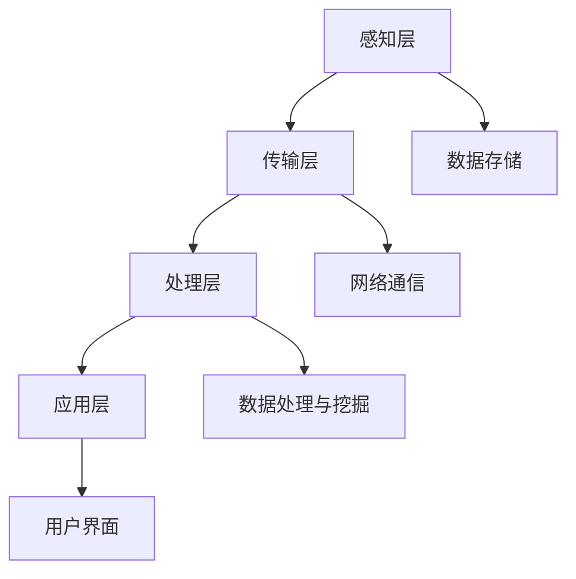

                 

# 《智能城市管理系统：城市科技的创业机会》

> **关键词**：智能城市，管理系统，物联网，大数据，人工智能，创业机会

> **摘要**：本文将深入探讨智能城市管理系统的概念、架构以及核心技术，分析城市科技的创业机会，并探讨实施与运营策略。通过实际项目案例，本文旨在为创业者提供有价值的指导，以把握智能城市领域的发展机遇。

### 目录

1. **智能城市管理系统概述** <a id="概述"></a>
   1.1 智能城市管理系统的概念与架构
   1.2 城市科技的发展趋势
   1.3 城市科技领域的创业机会分析
2. **智能城市管理系统的核心技术** <a id="核心技术"></a>
   2.1 物联网技术在智能城市中的应用
   2.2 大数据分析在智能城市中的作用
   2.3 人工智能在智能城市管理中的应用
3. **智能城市管理系统的实施与运营** <a id="实施与运营"></a>
   3.1 实施策略
   3.2 运营与维护
4. **智能城市管理系统的案例研究** <a id="案例研究"></a>
   4.1 国外智能城市管理系统的案例分析
   4.2 国内智能城市管理系统的案例分析
5. **智能城市管理系统的发展趋势与未来展望** <a id="发展趋势"></a>
   5.1 发展趋势
   5.2 未来展望
6. **附录** <a id="附录"></a>
   6.1 开发工具与资源
   6.2 Mermaid 流程图示例
   6.3 伪代码示例
   6.4 数学模型与公式示例
   6.5 项目实战案例
   6.6 开发环境搭建与代码实现
   6.7 源代码详细实现与解读
   6.8 代码解读与分析

### 1. 智能城市管理系统概述

#### 1.1 智能城市管理系统的概念与架构

##### 1.1.1 智能城市的概念

智能城市是指通过信息技术和物联网技术，实现对城市基础设施、公共资源、社会服务等方面的智能化管理和优化。智能城市的核心是利用数据驱动决策，提高城市运行效率，改善居民生活质量。

##### 1.1.2 智能城市管理系统的需求

随着城市化进程的加速，城市面临着诸多挑战，如交通拥堵、环境污染、资源短缺等。智能城市管理系统通过整合多种技术手段，提供了高效的城市管理解决方案。

##### 1.1.3 智能城市管理系统的架构

智能城市管理系统通常包括感知层、传输层、处理层和应用层。感知层负责数据采集，传输层负责数据传输，处理层负责数据处理和分析，应用层负责提供具体的应用服务。



#### 1.2 城市科技的发展趋势

##### 1.2.1 物联网技术在智能城市中的应用

物联网技术是智能城市建设的重要支撑。通过物联网传感器和设备，可以实现对城市交通、环境、能源等方面的实时监控和智能调控。

##### 1.2.2 大数据分析与人工智能在智能城市中的角色

大数据分析和人工智能技术在智能城市中扮演着关键角色。通过大数据分析，可以挖掘城市运行中的潜在问题和机会，通过人工智能技术，可以实现智能决策和自动化管理。

#### 1.3 城市科技领域的创业机会分析

##### 1.3.1 垃圾分类与回收

随着环保意识的提高，垃圾分类与回收成为城市发展的重要方向。创业者可以开发智能垃圾分类系统，通过物联网技术和大数据分析，实现垃圾分类的自动化和智能化。

##### 1.3.2 智能交通管理

智能交通管理是城市科技领域的另一大热点。通过物联网技术和大数据分析，可以实现交通流量的实时监控和优化，提高交通效率，减少交通拥堵。

##### 1.3.3 城市能源管理

城市能源管理涉及到电力、燃气、水等多个方面。通过物联网技术和大数据分析，可以实现能源使用的智能化监控和管理，提高能源利用效率。

##### 1.3.4 城市安全监控

城市安全监控是保障城市安全的重要手段。通过人工智能技术和大数据分析，可以实现视频监控的智能化识别和预警，提高城市安全水平。

### 2. 智能城市管理系统的核心技术

#### 2.1 物联网技术在智能城市中的应用

##### 2.1.1 物联网技术的概述

物联网（Internet of Things，IoT）是指通过传感器、网络和计算机技术，将各种物体连接到互联网上，实现信息交换和智能控制。物联网技术包括传感器技术、网络通信技术、数据处理技术等。

##### 2.1.2 物联网技术在智能城市中的关键应用

- **城市环境监测**：通过部署物联网传感器，实时监测城市空气质量、水质、噪音等环境指标，为城市环境管理提供数据支持。
- **智能交通系统**：通过物联网传感器和智能设备，实现交通流量的实时监控和智能调控，提高交通效率。
- **智慧能源管理系统**：通过物联网技术和大数据分析，实现能源使用的智能化监控和管理，提高能源利用效率。

#### 2.2 大数据分析在智能城市中的作用

##### 2.2.1 大数据分析的基本原理

大数据分析是指对海量数据进行采集、存储、处理和分析，以发现数据中的规律和趋势。大数据分析通常包括数据预处理、数据存储、数据挖掘、数据可视化等步骤。

##### 2.2.2 大数据分析在智能城市中的应用

- **城市规划与优化**：通过大数据分析，可以挖掘城市运行中的潜在问题和机会，为城市规划提供科学依据。
- **公共安全与应急响应**：通过大数据分析，可以实现对城市安全状况的实时监控和预测，提高公共安全水平。
- **城市经济分析与预测**：通过大数据分析，可以挖掘城市经济数据中的规律和趋势，为城市经济发展提供决策支持。

#### 2.3 人工智能在智能城市管理中的应用

##### 2.3.1 人工智能的基本概念

人工智能（Artificial Intelligence，AI）是指通过计算机模拟人类智能的过程。人工智能技术包括机器学习、深度学习、自然语言处理、计算机视觉等。

##### 2.3.2 人工智能在智能城市管理中的应用

- **智能安防**：通过计算机视觉和自然语言处理技术，实现对城市安全的实时监控和预警。
- **智能交通**：通过机器学习和深度学习技术，实现交通流量的实时预测和优化。
- **智能环保**：通过大数据分析和人工智能技术，实现环境污染的实时监测和预警。

### 3. 智能城市管理系统的实施与运营

#### 3.1 实施策略

##### 3.1.1 需求分析

在实施智能城市管理系统之前，需要对城市的具体需求进行详细分析，包括城市规模、人口密度、交通状况、环境状况等。

##### 3.1.2 技术选型

根据需求分析的结果，选择适合的技术和平台，包括物联网设备、大数据处理工具、人工智能框架等。

##### 3.1.3 团队组建

组建专业的团队，包括物联网技术专家、大数据分析专家、人工智能专家等，确保项目的顺利进行。

#### 3.2 运营与维护

##### 3.2.1 系统运营的重要性

智能城市管理系统的运营直接影响城市的运行效率和居民的生活质量。因此，系统运营必须保证稳定性和可靠性。

##### 3.2.2 数据安全保障

在系统运营过程中，数据的安全和隐私保护至关重要。需要采取有效的数据加密和安全措施，确保数据的安全性和隐私性。

##### 3.2.3 系统维护与升级

定期对系统进行维护和升级，确保系统的稳定性和先进性。同时，根据城市发展的需求，不断优化和完善系统功能。

### 4. 智能城市管理系统的案例研究

#### 4.1 国外智能城市管理系统的案例分析

##### 4.1.1 新加坡智慧国家建设

新加坡政府提出了“智慧国家”计划，通过物联网、大数据和人工智能技术，实现城市管理的智能化和高效化。

- **城市环境监测**：通过物联网传感器，实时监测城市空气质量、水质等环境指标。
- **智能交通管理**：通过大数据分析和人工智能技术，优化交通流量，减少交通拥堵。
- **公共服务优化**：通过大数据分析，优化公共服务资源的分配和使用。

##### 4.1.2 阿布扎比智能城市项目

阿布扎比政府投资数十亿美元，建设了一个智能城市项目，通过物联网、大数据和人工智能技术，实现城市的智能化管理。

- **能源管理**：通过物联网传感器和大数据分析，实现能源使用的智能化监控和管理。
- **智能交通**：通过大数据分析和人工智能技术，优化交通流量，提高交通效率。
- **公共安全**：通过计算机视觉和大数据分析，实现对城市安全的实时监控和预警。

#### 4.2 国内智能城市管理系统的案例分析

##### 4.2.1 北京智慧城市项目

北京市政府提出了“智慧北京”计划，通过物联网、大数据和人工智能技术，实现城市管理的智能化和高效化。

- **智慧交通**：通过大数据分析和人工智能技术，优化交通流量，减少交通拥堵。
- **智慧环保**：通过物联网传感器和大数据分析，实时监测城市环境，提高环保水平。
- **智慧公共服务**：通过大数据分析，优化公共服务资源的分配和使用。

##### 4.2.2 上海智慧城市建设

上海市政府提出了“智慧上海”计划，通过物联网、大数据和人工智能技术，实现城市管理的智能化和高效化。

- **智慧交通**：通过大数据分析和人工智能技术，优化交通流量，提高交通效率。
- **智慧环保**：通过物联网传感器和大数据分析，实时监测城市环境，提高环保水平。
- **智慧公共服务**：通过大数据分析，优化公共服务资源的分配和使用。

### 5. 智能城市管理系统的发展趋势与未来展望

#### 5.1 智能城市管理系统的发展趋势

- **技术创新**：随着物联网、大数据和人工智能技术的不断发展，智能城市管理系统将更加智能、高效和便捷。
- **政策支持**：政府加大对智能城市建设的支持力度，为智能城市管理系统的发展提供政策保障。
- **市场需求**：随着城市化进程的加速，城市科技需求不断增长，为智能城市管理系统提供了广阔的市场空间。

#### 5.2 智能城市管理系统的未来展望

- **智慧城市**：未来智能城市管理系统将更加智能化，实现城市运行的全流程自动化和智能化。
- **创业机会**：智能城市管理系统为创业者提供了丰富的创业机会，如智能交通、智慧能源、智能安防等领域。
- **挑战与应对**：智能城市管理系统面临数据隐私、安全性等技术挑战，需要不断创新和改进，以应对未来发展的需求。

### 附录

#### 6.1 开发工具与资源

- **物联网开发平台**：包括 ThingWorks、IoT Suite 等。
- **大数据分析工具**：包括 Hadoop、Spark 等。
- **人工智能框架**：包括 TensorFlow、PyTorch 等。

#### 6.2 Mermaid 流程图示例


#### 6.3 伪代码示例

```python
# 大数据分析算法伪代码
def analyze_data(data_set):
    # 数据清洗与预处理
    preprocessed_data = preprocess(data_set)
    
    # 数据转换与归一化
    normalized_data = normalize(preprocessed_data)
    
    # 数据分割为训练集与测试集
    train_data, test_data = split_data(normalized_data)
    
    # 训练机器学习模型
    model = train_model(train_data)
    
    # 在测试集上评估模型性能
    performance = evaluate_model(model, test_data)
    
    # 输出模型性能结果
    return performance
```

#### 6.4 数学模型与公式示例

$$
\min_{\theta} \sum_{i=1}^{n} (X_i^T \theta - y_i)^2
$$

$$
x_{\text{norm}} = \frac{x - \mu}{\sigma}
$$

$$
J(\theta) = \frac{1}{2m} \sum_{i=1}^{m} (h_\theta(x^{(i)}) - y^{(i)})^2
$$

#### 6.5 项目实战案例

##### 项目背景

随着城市人口的快速增长和车辆拥有量的增加，城市交通问题日益严重。本项目旨在通过智能交通系统来解决交通拥堵、事故预防和交通效率提升等问题。

##### 系统架构

- **感知层**：安装各种传感器（如摄像头、雷达、地磁传感器等）收集交通数据。
- **通信层**：利用无线通信技术（如LoRa、Wi-Fi等）传输感知数据。
- **数据处理层**：服务器端使用大数据处理技术（如Hadoop、Spark等）对数据进行实时分析和处理。
- **应用层**：通过Web端和移动端应用为用户提供交通信息和服务。

##### 实现步骤

1. **数据收集**：在城市的各个重要交通节点安装传感器，收集交通流量、速度、车辆类型等信息。
2. **数据传输**：利用无线通信技术将传感器数据传输到服务器端。
3. **数据处理**：使用大数据处理技术对传输过来的数据进行分析，识别交通拥堵区域、事故风险等。
4. **信息发布**：将处理后的交通信息通过Web端和移动端应用发布给用户。

##### 代码解读

```python
# 伪代码：实时交通流量分析
def analyze_traffic_data(traffic_data):
    # 数据预处理
    preprocessed_data = preprocess_traffic_data(traffic_data)
    
    # 交通流量预测模型
    model = train_traffic_prediction_model(preprocessed_data)
    
    # 预测交通流量
    predicted_traffic = predict_traffic(model, preprocessed_data)
    
    # 输出预测结果
    return predicted_traffic
```

##### 代码解读与分析

1. **数据处理效率**：优化数据处理算法，提高系统处理速度。
2. **模型准确性**：通过增加数据量和特征维度来提高预测模型的准确性。
3. **系统扩展性**：设计灵活的系统架构，支持新增传感器和数据源的接入。

#### 6.6 开发环境搭建与代码实现

```bash
# 安装Python环境
sudo apt-get install python3

# 安装必需的Python库
pip install numpy scipy pandas scikit-learn matplotlib

# 启动Python环境
python
```

#### 6.7 源代码详细实现与解读

```python
# 伪代码：智能交通系统数据处理模块

import numpy as np
from sklearn.linear_model import LinearRegression
from sklearn.model_selection import train_test_split

def preprocess_traffic_data(traffic_data):
    # 数据清洗与预处理
    # ...
    return preprocessed_data

def train_traffic_prediction_model(preprocessed_data):
    # 数据分割
    X, y = train_test_split(preprocessed_data, test_size=0.2, random_state=42)
    
    # 创建线性回归模型
    model = LinearRegression()
    
    # 训练模型
    model.fit(X, y)
    
    return model

def predict_traffic(model, preprocessed_data):
    # 预测交通流量
    predicted_traffic = model.predict(preprocessed_data)
    return predicted_traffic

# 测试模块
if __name__ == "__main__":
    # 加载测试数据
    traffic_data = load_traffic_data("traffic_data.csv")
    
    # 数据预处理
    preprocessed_data = preprocess_traffic_data(traffic_data)
    
    # 训练预测模型
    model = train_traffic_prediction_model(preprocessed_data)
    
    # 预测交通流量
    predicted_traffic = predict_traffic(model, preprocessed_data)
    
    # 输出预测结果
    print(predicted_traffic)
```

##### 代码解读与分析

1. **数据预处理**：确保输入数据的格式和范围符合模型的要求。
2. **模型训练**：使用线性回归模型对预处理后的数据进行训练。
3. **预测与输出**：使用训练好的模型对新的数据进行预测，并输出预测结果。
4. **模块化设计**：将数据处理、模型训练、预测等操作封装为独立的函数，便于代码的维护和扩展。

### 作者信息

**作者：AI天才研究院/AI Genius Institute & 禅与计算机程序设计艺术 /Zen And The Art of Computer Programming** 

