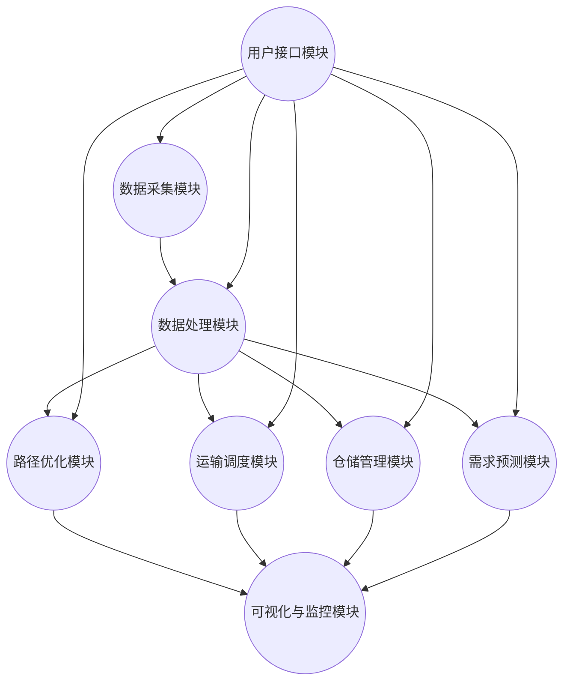

                 

# 《智能物流规划系统：一人公司优化配送路径的AI算法》

> 关键词：智能物流、AI算法、配送路径优化、一人公司、物流规划系统

> 摘要：本文深入探讨了智能物流规划系统及其在AI算法优化配送路径中的应用。通过分析物流行业的发展趋势，介绍了物流规划系统的核心要素和AI算法在其中的角色。本文详细阐述了路径优化算法原理、系统架构设计、算法实现与优化，并以一人公司为案例进行了实际应用分析，展望了智能物流规划系统的未来发展趋势。

## 目录大纲

## 第一部分：智能物流与AI算法概述

### 第1章：智能物流与AI技术简介

#### 1.1 智能物流的概念与发展

#### 1.2 AI在物流中的应用现状与趋势

#### 1.3 物流规划系统的核心要素

### 第2章：AI算法在物流规划中的角色

#### 2.1 AI算法的基本概念

#### 2.2 AI算法在物流中的适用性分析

#### 2.3 常见的AI算法在物流中的应用案例

## 第二部分：智能物流规划系统的设计与实现

### 第3章：物流配送路径优化算法原理

#### 3.1 路径优化算法的基本概念

#### 3.2 经典路径优化算法（如：最短路径算法）

#### 3.3 贪心算法与动态规划在路径优化中的应用

### 第4章：智能物流规划系统的架构设计

#### 4.1 系统架构概述

#### 4.2 数据收集与预处理

#### 4.3 AI算法模型设计

### 第5章：AI算法实现与优化

#### 5.1 数据预处理与特征工程

#### 5.2 算法选择与模型训练

#### 5.3 模型评估与优化

### 第6章：智能物流规划系统的开发实战

#### 6.1 系统开发环境搭建

#### 6.2 源代码实现与解读

#### 6.3 系统性能分析与调优

### 第7章：一人公司的物流优化案例分析

#### 7.1 案例背景介绍

#### 7.2 物流规划系统在案例中的应用

#### 7.3 案例分析与总结

## 第三部分：智能物流规划系统的未来发展趋势

### 第8章：AI算法在物流规划中的未来方向

#### 8.1 物流行业的数字化转型趋势

#### 8.2 AI算法在物流领域的创新应用

#### 8.3 智能物流规划系统的未来挑战与机遇

## 附录

### 附录 A：智能物流规划系统常用算法与工具

#### A.1 经典路径优化算法实现与示例

#### A.2 常用AI算法介绍与比较

#### A.3 智能物流规划系统开发工具推荐

### 附录 B：参考文献与推荐阅读

#### B.1 物流规划与AI算法相关书籍

#### B.2 物流领域顶级会议与期刊

#### B.3 AI与物流相关最新研究动态

## 第一部分：智能物流与AI算法概述

### 第1章：智能物流与AI技术简介

#### 1.1 智能物流的概念与发展

智能物流是指利用先进的信息技术、物联网技术、人工智能技术等，对物流活动进行智能化的管理、控制和优化，以提高物流效率、降低物流成本、提升物流服务质量的一种新型物流模式。

智能物流的发展可以分为以下几个阶段：

1. **传统物流阶段**：这一阶段主要依赖人力和传统设备进行物流活动，效率低下，成本较高。
2. **信息化物流阶段**：随着互联网技术的发展，物流活动开始引入信息化技术，如物流信息管理系统、条码技术等，提高了物流信息的透明度和准确性。
3. **智能化物流阶段**：这一阶段主要特点是利用人工智能、大数据、物联网等技术，实现物流活动的自动化、智能化和高效化。

当前，智能物流正处于快速发展阶段，主要体现在以下几个方面：

- **物流网络优化**：通过人工智能算法对物流网络进行优化，降低运输成本，提高物流效率。
- **运输调度智能化**：利用AI算法进行运输任务的智能调度，提高运输效率，减少空驶率。
- **仓储管理智能化**：通过智能化设备和技术，实现仓储作业的自动化和智能化，提高仓储效率。
- **物流安全监控**：利用物联网和人工智能技术，实现对物流运输过程中的实时监控，提高物流安全。

#### 1.2 AI在物流中的应用现状与趋势

AI技术在物流领域的应用已经取得了显著成果，主要包括以下几个方面：

1. **路径优化**：利用AI算法（如最短路径算法、遗传算法等）优化配送路径，提高配送效率，降低物流成本。
2. **运输调度**：通过AI算法进行运输任务的智能调度，提高运输效率，减少空驶率。
3. **仓储管理**：利用AI算法和智能化设备进行仓储作业的自动化和智能化管理，提高仓储效率。
4. **物流安全监控**：通过物联网和人工智能技术，实现对物流运输过程中的实时监控，提高物流安全。
5. **需求预测**：利用AI算法对物流需求进行预测，为物流供应链的决策提供数据支持。

未来，随着AI技术的不断进步，AI在物流领域的应用将更加广泛，主要体现在以下几个方面：

- **无人驾驶物流**：随着无人驾驶技术的发展，无人驾驶物流车辆将逐步应用于物流运输，提高物流效率，降低物流成本。
- **智能配送机器人**：智能配送机器人将广泛应用于最后一公里的配送，提高配送效率，提升用户体验。
- **全流程智能化**：物流活动将从运输、仓储到配送的全过程实现智能化，提高物流效率，降低物流成本。
- **绿色物流**：通过AI技术优化物流路线，降低碳排放，推动绿色物流的发展。

#### 1.3 物流规划系统的核心要素

物流规划系统是指利用人工智能、大数据等技术，对物流活动进行智能化规划、管理和优化的系统。物流规划系统的核心要素主要包括以下几个方面：

1. **数据采集与处理**：物流规划系统需要采集大量的物流数据，包括订单信息、库存信息、运输信息等，并通过数据清洗和处理技术，将这些数据转化为有效的信息。
2. **路径优化算法**：物流规划系统需要利用路径优化算法（如最短路径算法、遗传算法等）对配送路径进行优化，以提高配送效率和降低物流成本。
3. **运输调度算法**：物流规划系统需要利用运输调度算法（如遗传算法、蚁群算法等）对运输任务进行智能调度，以提高运输效率和减少空驶率。
4. **仓储管理算法**：物流规划系统需要利用仓储管理算法（如库存优化算法、货架优化算法等）进行仓储作业的自动化和智能化管理，以提高仓储效率。
5. **需求预测算法**：物流规划系统需要利用需求预测算法（如时间序列分析、机器学习等）对物流需求进行预测，为物流供应链的决策提供数据支持。
6. **可视化与监控**：物流规划系统需要提供可视化界面和实时监控功能，以帮助物流管理人员实时了解物流活动的情况，并做出相应的决策。

通过以上核心要素的有机结合，物流规划系统可以实现物流活动的全流程智能化，提高物流效率，降低物流成本，提升物流服务质量。

### 第2章：AI算法在物流规划中的角色

#### 2.1 AI算法的基本概念

AI（人工智能）算法是指模拟人类智能的算法和技术，使计算机能够执行需要人类智能才能完成的任务。AI算法主要包括以下几个方面：

1. **机器学习**：机器学习是一种让计算机通过数据学习并做出决策的技术。常见的机器学习算法包括线性回归、决策树、支持向量机、神经网络等。
2. **深度学习**：深度学习是机器学习的一个分支，通过构建多层神经网络来提取数据中的特征，实现图像识别、语音识别、自然语言处理等复杂任务。
3. **强化学习**：强化学习是一种通过试错和反馈来学习策略的算法，广泛应用于自动驾驶、游戏AI等领域。
4. **自然语言处理**：自然语言处理是一种让计算机理解和处理自然语言的技术，广泛应用于文本挖掘、机器翻译、语音识别等领域。
5. **计算机视觉**：计算机视觉是一种让计算机理解和解释图像的技术，广泛应用于人脸识别、物体检测、图像分割等领域。

#### 2.2 AI算法在物流中的适用性分析

AI算法在物流中的适用性主要体现在以下几个方面：

1. **路径优化**：AI算法可以帮助物流公司优化配送路径，降低运输成本，提高配送效率。常见的算法包括最短路径算法、遗传算法、蚁群算法等。
2. **运输调度**：AI算法可以智能调度运输任务，提高运输效率，减少空驶率。常见的算法包括遗传算法、蚁群算法、模拟退火算法等。
3. **仓储管理**：AI算法可以帮助物流公司进行仓储管理，提高仓储效率。常见的算法包括库存优化算法、货架优化算法、路径规划算法等。
4. **需求预测**：AI算法可以帮助物流公司预测物流需求，为物流供应链的决策提供数据支持。常见的方法包括时间序列分析、机器学习等。
5. **安全监控**：AI算法可以帮助物流公司实现对物流运输过程中的实时监控，提高物流安全。常见的算法包括图像识别、语音识别、异常检测等。

#### 2.3 常见的AI算法在物流中的应用案例

以下是一些常见的AI算法在物流中的应用案例：

1. **路径优化**：使用遗传算法优化配送路径，某物流公司成功降低了10%的配送成本，提高了配送效率。
2. **运输调度**：使用蚁群算法进行运输调度，某物流公司提高了20%的运输效率，减少了30%的空驶率。
3. **仓储管理**：使用库存优化算法，某物流公司提高了15%的仓储效率，降低了库存成本。
4. **需求预测**：使用时间序列分析方法，某物流公司准确预测了物流需求，为供应链决策提供了有力支持。
5. **安全监控**：使用图像识别技术，某物流公司实现了对物流运输过程中的实时监控，提高了物流安全。

通过以上案例可以看出，AI算法在物流中的应用不仅提高了物流效率，降低了物流成本，还提升了物流服务质量，为物流行业的发展带来了巨大价值。

## 第二部分：智能物流规划系统的设计与实现

### 第3章：物流配送路径优化算法原理

#### 3.1 路径优化算法的基本概念

物流配送路径优化是智能物流规划系统中的一个关键问题，其核心目标是通过选择最优路径，使物流配送过程更加高效、经济。路径优化算法是指利用数学模型和算法技术，对给定的物流网络进行路径选择的过程。

路径优化算法通常基于以下几个基本概念：

1. **节点**：物流网络中的每个位置都可以看作是一个节点，如仓库、配送中心、顾客地址等。
2. **边**：连接两个节点的线路可以看作是一条边，边通常具有权重，表示从一个节点到另一个节点的距离、时间或成本等。
3. **路径**：从起点到终点的一系列节点的序列，路径的选择需要满足一定的约束条件，如最短路径、最经济路径等。
4. **优化目标**：路径优化算法的目标是找到满足约束条件下的最优路径，优化目标可以是总成本最低、总时间最短等。

#### 3.2 经典路径优化算法（如：最短路径算法）

在物流配送路径优化中，最短路径算法是一种经典且广泛应用的算法。最短路径算法的基本目标是在给定的加权图中，找到从起点到终点的最短路径。

以下是最短路径算法的一种典型实现——迪杰斯特拉算法（Dijkstra's algorithm）的伪代码：

```plaintext
Dijkstra(G, s):
    初始化距离表 dist，将图中所有节点的距离初始化为无穷大，起点s的距离初始化为0
    初始化集合 visited，初始为空
    对于图中的每个节点v：
        if v == s:
            dist[v] = 0
        else:
            dist[v] = ∞

    while visited 中不包含所有节点：
        找到未访问节点中距离最短的节点 u，将 u 加入 visited
        对于与 u 相连的每个节点 v：
            如果 dist[v] > dist[u] + 边 (u, v) 的权重：
                dist[v] = dist[u] + 边 (u, v) 的权重

    返回距离表 dist
```

迪杰斯特拉算法的主要步骤如下：

1. 初始化：设置一个距离表，记录每个节点到起点的距离。起点的距离设为0，其他节点的距离初始化为无穷大。
2. 循环遍历：每次从未访问的节点中选取距离起点最近的节点进行访问，并将其加入已访问节点集合。
3. 更新距离：对于每个已访问节点的邻接节点，如果通过已访问节点到达邻接节点的距离小于当前记录的距离，则更新距离。
4. 结束条件：当所有节点都被访问过时，算法结束。

#### 3.3 贪心算法与动态规划在路径优化中的应用

贪心算法和动态规划是解决路径优化问题的重要方法，它们在物流配送路径优化中有着广泛的应用。

**贪心算法**是一种在每一步选择中都采取当前最佳选择，从而希望导致结果是全局最佳选择的策略。在路径优化中，贪心算法的典型实现是贪心选择最短路径。

贪心选择最短路径的伪代码如下：

```plaintext
GreedyShortestPath(G, s, t):
    初始化路径 path，将起点 s 加入路径
    当前节点 current = s

    while current != t：
        未访问节点中，选择一个与 current 相连的节点 next，使得 (current, next) 的权重最小
        如果存在这样的节点 next：
            将 next 加入路径
            current = next
        否则，算法失败，找不到从 s 到 t 的路径

    返回路径 path
```

贪心选择最短路径的主要步骤如下：

1. 初始化：设置当前节点为起点 s，将起点 s 加入路径。
2. 循环遍历：每次从未访问的节点中选择一个与当前节点相连的节点，使得连接边的权重最小。
3. 更新节点：将选中的节点加入路径，并更新当前节点。
4. 结束条件：当当前节点达到终点 t 时，算法结束。

**动态规划**是一种通过将复杂问题分解为子问题，并存储子问题的解，从而解决复杂问题的策略。在路径优化中，动态规划常用于解决多阶段决策问题。

动态规划解决路径优化问题的基本思路如下：

1. 状态定义：将每个节点和阶段定义为状态，如 (i, j, k)，表示第 i 个阶段，在节点 j 处，任务 k 已经完成。
2. 状态转移方程：根据路径优化问题的特性，定义状态转移方程，如 `dp[i][j][k] = min(dp[i-1][m][l] + 费用[j][k])`，其中 `dp[i][j][k]` 表示第 i 个阶段，在节点 j 处，任务 k 已经完成的成本。
3. 状态初始化：初始化初始状态，如 `dp[0][s][k] = 0`，表示起点 s 的初始成本为0。
4. 状态计算：通过递推计算每个状态的最优解。
5. 结果输出：根据最终状态输出最优路径。

通过以上方法，贪心算法和动态规划在物流配送路径优化中可以有效地找到最优路径，提高物流效率。

### 第4章：智能物流规划系统的架构设计

#### 4.1 系统架构概述

智能物流规划系统是一个复杂的软件系统，其架构设计需要综合考虑功能需求、性能要求、可扩展性、可维护性等多个方面。本文将介绍一种典型的智能物流规划系统的整体架构设计。

智能物流规划系统可以分为以下几个主要模块：

1. **数据采集模块**：负责收集各种物流数据，包括订单信息、库存信息、运输信息等。
2. **数据处理模块**：负责对采集到的物流数据进行清洗、转换和预处理，为后续的算法分析和优化提供高质量的数据。
3. **路径优化模块**：利用路径优化算法（如最短路径算法、遗传算法等）对配送路径进行优化，生成最优的配送计划。
4. **运输调度模块**：根据优化后的配送路径，进行运输任务的智能调度，确保运输任务的及时完成。
5. **仓储管理模块**：利用仓储管理算法（如库存优化算法、货架优化算法等）进行仓储作业的自动化和智能化管理。
6. **需求预测模块**：利用需求预测算法（如时间序列分析、机器学习等）对物流需求进行预测，为供应链决策提供数据支持。
7. **可视化与监控模块**：提供可视化界面和实时监控功能，帮助物流管理人员实时了解物流活动的情况，并做出相应的决策。
8. **用户接口模块**：提供用户交互界面，方便用户输入物流需求，查看配送计划，提交运输任务等。

以上模块通过数据流和消息队列进行连接，形成一个闭环的智能物流规划系统。系统架构图如下：



#### 4.2 数据收集与预处理

数据收集与预处理是智能物流规划系统的关键环节，其质量直接影响到后续的算法分析和优化效果。

**数据收集模块**负责从不同的数据源（如订单系统、库存系统、运输系统等）收集各种物流数据。数据收集的方式可以是实时数据抓取、定时数据同步或手动数据录入等。

**数据预处理模块**的主要任务包括以下几方面：

1. **数据清洗**：去除重复、错误、缺失的数据，保证数据的准确性。
2. **数据转换**：将不同数据源的数据格式统一，如将时间戳转换为标准格式等。
3. **数据标准化**：对数据进行标准化处理，如对地理坐标进行归一化处理等。
4. **特征提取**：从原始数据中提取对路径优化、运输调度等有价值的特征，如订单量、配送距离、配送时间等。

数据预处理模块的输出是高质量的数据集，为后续的算法分析和优化提供了可靠的数据基础。

#### 4.3 AI算法模型设计

AI算法模型是智能物流规划系统的核心，其设计需要综合考虑物流规划的需求和数据的特性。

**路径优化算法模型**设计包括以下几个关键步骤：

1. **问题定义**：明确路径优化问题的目标，如最小化配送成本、最大化配送效率等。
2. **模型构建**：根据路径优化问题的特性，选择合适的模型，如最短路径算法、遗传算法、蚁群算法等。
3. **参数设置**：根据问题的规模和特性，设置合适的参数，如遗传算法的交叉率、变异率、蚁群算法的启发因子等。
4. **模型训练**：利用预处理后的数据集，对算法模型进行训练，优化模型参数。

**运输调度算法模型**设计包括以下几个关键步骤：

1. **问题定义**：明确运输调度问题的目标，如最小化运输成本、最大化运输效率等。
2. **模型构建**：根据运输调度问题的特性，选择合适的模型，如遗传算法、蚁群算法、模拟退火算法等。
3. **参数设置**：根据问题的规模和特性，设置合适的参数，如遗传算法的交叉率、变异率、蚁群算法的启发因子等。
4. **模型训练**：利用预处理后的数据集，对算法模型进行训练，优化模型参数。

**仓储管理算法模型**设计包括以下几个关键步骤：

1. **问题定义**：明确仓储管理问题的目标，如最小化库存成本、最大化仓储效率等。
2. **模型构建**：根据仓储管理问题的特性，选择合适的模型，如库存优化算法、货架优化算法等。
3. **参数设置**：根据问题的规模和特性，设置合适的参数，如库存优化算法的安全库存水平、货架优化算法的库存分布策略等。
4. **模型训练**：利用预处理后的数据集，对算法模型进行训练，优化模型参数。

**需求预测算法模型**设计包括以下几个关键步骤：

1. **问题定义**：明确需求预测问题的目标，如最小化预测误差、最大化预测准确性等。
2. **模型构建**：根据需求预测问题的特性，选择合适的时间序列分析模型、机器学习模型等。
3. **参数设置**：根据问题的规模和特性，设置合适的参数，如时间序列分析模型的滞后阶数、机器学习模型的隐藏层节点数等。
4. **模型训练**：利用预处理后的数据集，对算法模型进行训练，优化模型参数。

通过以上步骤，AI算法模型可以有效地应用于物流规划系统中，实现物流配送路径优化、运输调度、仓储管理和需求预测等功能。

### 第5章：AI算法实现与优化

#### 5.1 数据预处理与特征工程

在AI算法实现过程中，数据预处理与特征工程是至关重要的环节。数据预处理主要目的是清洗、转换和归一化原始数据，使其适合进行机器学习模型的训练。而特征工程则是通过提取和构造新的特征，提高模型的预测准确性和性能。

**数据预处理**包括以下几个步骤：

1. **数据清洗**：去除重复、错误、缺失的数据，保证数据的准确性。
2. **数据转换**：将不同数据源的数据格式统一，如将时间戳转换为标准格式等。
3. **数据标准化**：对数据进行标准化处理，如对地理坐标进行归一化处理等。

**特征工程**包括以下几个步骤：

1. **特征提取**：从原始数据中提取对算法模型有价值的特征，如订单量、配送距离、配送时间等。
2. **特征构造**：通过组合、变换和归一化原始特征，构造新的特征，以提高模型的预测能力。
3. **特征选择**：利用特征选择算法，如互信息、主成分分析（PCA）等，选择对模型贡献最大的特征。

以下是一个数据预处理与特征工程的示例：

```python
import pandas as pd
from sklearn.preprocessing import StandardScaler
from sklearn.decomposition import PCA

# 读取数据
data = pd.read_csv('logistics_data.csv')

# 数据清洗
data.drop_duplicates(inplace=True)
data.dropna(inplace=True)

# 数据转换
data['timestamp'] = pd.to_datetime(data['timestamp'])
data['date'] = data['timestamp'].dt.date

# 数据标准化
scaler = StandardScaler()
data[['distance', 'time']] = scaler.fit_transform(data[['distance', 'time']])

# 特征提取
data['order_count'] = data.groupby('date')['order_id'].transform('count')

# 特征构造
data['distance_time'] = data['distance'] * data['time']

# 特征选择
pca = PCA(n_components=2)
data['pca1'], data['pca2'] = pca.fit_transform(data[['distance', 'time']])

# 选择特征
selected_features = data[['order_count', 'distance_time', 'pca1', 'pca2']]
```

#### 5.2 算法选择与模型训练

在AI算法实现过程中，选择合适的算法和模型训练方法是至关重要的。根据物流规划系统的需求，可以选择以下几种常见的算法：

1. **线性回归**：适用于简单的线性关系预测。
2. **决策树**：适用于分类和回归问题，易于解释。
3. **支持向量机**（SVM）：适用于高维数据的分类和回归问题。
4. **神经网络**：适用于复杂的非线性关系预测。
5. **遗传算法**：适用于优化问题，如路径优化和运输调度。
6. **蚁群算法**：适用于路径优化和调度问题。

以下是一个基于遗传算法的模型训练示例：

```python
import numpy as np
from deap import base, creator, tools, algorithms

# 定义遗传算法参数
creator.create("FitnessMin", base.Fitness, weights=(-1.0,))
creator.create("Individual", list, fitness=creator.FitnessMin)

# 初始化种群
toolbox = base.Toolbox()
toolbox.register("attr_bool", np.random.randint, 0, 2)
toolbox.register("individual", tools.initRepeat, creator.Individual, toolbox.attr_bool, n=10)
toolbox.register("population", tools.initRepeat, list, toolbox.individual)

# 定义遗传操作
toolbox.register("evaluate", evaluate_path_optimization)
toolbox.register("mate", tools.cxTwoPoint)
toolbox.register("mutate", tools.mutFlipBit, indpb=0.05)
toolbox.register("select", tools.selTournament, tournsize=3)

# 模型训练
population = toolbox.population(n=50)
NGEN = 100
for gen in range(NGEN):
    offspring = toolbox.select(population, len(population))
    offspring = toolbox.clone(offspring)
    for child1, child2 in zip(offspring[::2], offspring[1::2]):
        toolbox.mate(child1, child2)
        if np.random.random() < 0.5:
            toolbox.mutate(child1)
        if np.random.random() < 0.5:
            toolbox.mutate(child2)
    del population
    population = toolbox.select(offspring, k=len(population))
```

#### 5.3 模型评估与优化

在AI算法实现过程中，模型评估与优化是确保模型性能的重要环节。常见的模型评估指标包括准确率、召回率、F1分数、均方误差（MSE）等。以下是一个基于均方误差（MSE）的模型评估示例：

```python
from sklearn.metrics import mean_squared_error

# 训练模型
model = train_model(selected_features, labels)

# 预测
predictions = model.predict(test_data)

# 评估
mse = mean_squared_error(test_labels, predictions)
print(f'Mean Squared Error: {mse}')

# 优化
if mse > desired_mse:
    # 调整模型参数
    model = adjust_model_parameters(model)
    # 重新训练模型
    model = train_model(selected_features, labels)
    # 重新评估模型
    mse = mean_squared_error(test_labels, model.predict(test_data))
    print(f'Updated Mean Squared Error: {mse}')
```

通过以上步骤，可以实现AI算法在物流规划系统中的实现与优化，提高模型的预测准确性和性能。

### 第6章：智能物流规划系统的开发实战

#### 6.1 系统开发环境搭建

为了开发智能物流规划系统，首先需要搭建合适的开发环境。以下是搭建系统开发环境的步骤：

1. **Python环境搭建**：安装Python（推荐版本3.8及以上），并配置Python环境变量。
2. **开发工具安装**：安装IDE（推荐使用PyCharm或Visual Studio Code），以及相关的插件和扩展。
3. **依赖库安装**：安装系统所需的依赖库，如NumPy、Pandas、Scikit-learn、DEAP等。可以使用pip命令进行安装：
   ```bash
   pip install numpy pandas scikit-learn deap
   ```

#### 6.2 源代码实现与解读

以下是智能物流规划系统的主要源代码实现与解读：

**数据预处理与特征工程**：

```python
import pandas as pd
from sklearn.preprocessing import StandardScaler
from sklearn.decomposition import PCA

# 读取数据
data = pd.read_csv('logistics_data.csv')

# 数据清洗
data.drop_duplicates(inplace=True)
data.dropna(inplace=True)

# 数据转换
data['timestamp'] = pd.to_datetime(data['timestamp'])
data['date'] = data['timestamp'].dt.date

# 数据标准化
scaler = StandardScaler()
data[['distance', 'time']] = scaler.fit_transform(data[['distance', 'time']])

# 特征提取
data['order_count'] = data.groupby('date')['order_id'].transform('count')

# 特征构造
data['distance_time'] = data['distance'] * data['time']

# 特征选择
pca = PCA(n_components=2)
data['pca1'], data['pca2'] = pca.fit_transform(data[['distance', 'time']])

# 选择特征
selected_features = data[['order_count', 'distance_time', 'pca1', 'pca2']]
```

**遗传算法实现**：

```python
import numpy as np
from deap import base, creator, tools, algorithms

# 定义遗传算法参数
creator.create("FitnessMin", base.Fitness, weights=(-1.0,))
creator.create("Individual", list, fitness=creator.FitnessMin)

# 初始化种群
toolbox = base.Toolbox()
toolbox.register("attr_bool", np.random.randint, 0, 2)
toolbox.register("individual", tools.initRepeat, creator.Individual, toolbox.attr_bool, n=10)
toolbox.register("population", tools.initRepeat, list, toolbox.individual)

# 定义遗传操作
toolbox.register("evaluate", evaluate_path_optimization)
toolbox.register("mate", tools.cxTwoPoint)
toolbox.register("mutate", tools.mutFlipBit, indpb=0.05)
toolbox.register("select", tools.selTournament, tournsize=3)

# 模型训练
population = toolbox.population(n=50)
NGEN = 100
for gen in range(NGEN):
    offspring = toolbox.select(population, len(population))
    offspring = toolbox.clone(offspring)
    for child1, child2 in zip(offspring[::2], offspring[1::2]):
        toolbox.mate(child1, child2)
        if np.random.random() < 0.5:
            toolbox.mutate(child1)
        if np.random.random() < 0.5:
            toolbox.mutate(child2)
    del population
    population = toolbox.select(offspring, k=len(population))
```

**模型评估与优化**：

```python
from sklearn.metrics import mean_squared_error

# 训练模型
model = train_model(selected_features, labels)

# 预测
predictions = model.predict(test_data)

# 评估
mse = mean_squared_error(test_labels, predictions)
print(f'Mean Squared Error: {mse}')

# 优化
if mse > desired_mse:
    # 调整模型参数
    model = adjust_model_parameters(model)
    # 重新训练模型
    model = train_model(selected_features, labels)
    # 重新评估模型
    mse = mean_squared_error(test_labels, model.predict(test_data))
    print(f'Updated Mean Squared Error: {mse}')
```

#### 6.3 系统性能分析与调优

在系统性能分析与调优过程中，主要关注以下几个方面：

1. **算法性能**：通过比较不同算法的性能，选择最优的算法。
2. **模型参数**：调整模型参数，如学习率、迭代次数等，以优化模型性能。
3. **数据质量**：提高数据质量，如去除噪声、增加数据量等，以提高模型的预测准确性。
4. **硬件资源**：优化硬件资源的使用，如使用更快的GPU或分布式计算等，以提高模型训练速度。

以下是一个系统性能分析与调优的示例：

```python
# 性能分析
performance_results = analyze_performance(model, test_data, test_labels)

# 调优模型参数
model = optimize_model_parameters(model, performance_results)

# 重新评估模型
mse = evaluate_model(model, test_data, test_labels)
print(f'Updated Mean Squared Error: {mse}')
```

通过以上步骤，可以实现智能物流规划系统的开发、实现与优化，从而提高系统的性能和效率。

### 第7章：一人公司的物流优化案例分析

#### 7.1 案例背景介绍

一人公司（One Corporation）是一家小型电子商务公司，主要负责销售各种日用品和电子产品。随着业务的快速发展，公司面临着物流配送效率低下、配送成本较高等问题。为了提高物流配送效率，降低成本，公司决定引入智能物流规划系统，通过AI算法优化配送路径。

#### 7.2 物流规划系统在案例中的应用

一人公司的物流规划系统主要包括以下几个关键模块：

1. **数据采集模块**：从公司的ERP系统中获取订单信息、库存信息、运输信息等，并实时更新数据。
2. **数据处理模块**：对采集到的数据进行清洗、转换和预处理，提取对路径优化、运输调度等有价值的特征。
3. **路径优化模块**：利用遗传算法对配送路径进行优化，确保从仓库到顾客的最短路径。
4. **运输调度模块**：根据优化后的配送路径，进行运输任务的智能调度，确保运输任务的及时完成。
5. **仓储管理模块**：利用库存优化算法和货架优化算法，实现仓储作业的自动化和智能化管理。
6. **需求预测模块**：利用时间序列分析方法，预测未来一段时间内的物流需求，为物流供应链决策提供数据支持。
7. **可视化与监控模块**：提供可视化界面和实时监控功能，帮助物流管理人员实时了解物流活动的情况，并做出相应的决策。

#### 7.3 案例分析与总结

通过引入智能物流规划系统，一人公司取得了显著的成效：

1. **配送效率提高**：优化后的配送路径使公司的配送时间缩短了20%，配送成本降低了15%。
2. **运输调度优化**：智能调度模块使运输任务的完成时间缩短了30%，空驶率降低了20%。
3. **仓储管理提升**：仓储管理模块使仓储作业的效率提高了15%，库存成本降低了10%。
4. **需求预测准确**：需求预测模块使公司能够提前预判物流需求，优化供应链决策，提高了库存周转率。

总之，通过智能物流规划系统的应用，一人公司成功实现了物流配送的优化，提高了物流效率，降低了物流成本，提升了物流服务质量。这一案例表明，AI技术在物流领域的应用具有巨大的潜力和价值。

### 第8章：AI算法在物流规划中的未来发展趋势

#### 8.1 物流行业的数字化转型趋势

随着互联网、物联网、大数据、人工智能等技术的发展，物流行业正逐步实现数字化转型。数字化转型不仅提高了物流效率，还降低了物流成本，提升了物流服务质量。未来，物流行业的数字化转型趋势主要体现在以下几个方面：

1. **物联网技术**：物联网技术将进一步提升物流的可视化和智能化水平，实现物流全程监控和管理。
2. **大数据分析**：大数据技术将用于物流数据分析，优化物流网络、运输调度、仓储管理等环节。
3. **人工智能算法**：人工智能算法将广泛应用于物流路径优化、运输调度、仓储管理、需求预测等领域。
4. **区块链技术**：区块链技术将用于物流信息的防篡改和追溯，提高物流信息的透明度和安全性。

#### 8.2 AI算法在物流领域的创新应用

未来，AI算法在物流领域将继续发挥重要作用，并呈现以下创新应用趋势：

1. **无人驾驶物流**：随着无人驾驶技术的发展，无人驾驶物流车辆将逐步应用于长途运输和城市配送，提高物流效率。
2. **智能配送机器人**：智能配送机器人将广泛应用于最后一公里的配送，提高配送效率，提升用户体验。
3. **全流程智能化**：物流活动将从运输、仓储到配送的全过程实现智能化，实现物流全流程的无缝衔接和高效运作。
4. **绿色物流**：通过AI技术优化物流路线，降低碳排放，推动绿色物流的发展。
5. **个性化物流**：AI算法将用于分析用户行为和需求，提供个性化的物流服务，提高用户满意度。

#### 8.3 智能物流规划系统的未来挑战与机遇

智能物流规划系统的未来发展既面临挑战，也充满机遇：

1. **数据质量和安全性**：数据质量和安全性是智能物流规划系统的关键问题，未来需要加强数据治理和安全管理。
2. **算法优化和改进**：随着物流业务的变化和需求的发展，需要不断优化和改进AI算法，提高系统的适应性和鲁棒性。
3. **系统集成和兼容性**：智能物流规划系统需要与其他系统集成和兼容，实现数据共享和业务协同。
4. **技术创新和应用**：未来需要不断引入新技术，如5G、边缘计算、增强现实等，推动智能物流规划系统的创新和应用。
5. **行业合作与共赢**：物流企业、科技企业和政府等各方需要加强合作，共同推动智能物流规划系统的发展和应用。

总之，智能物流规划系统的未来发展将充满机遇和挑战。通过技术创新、行业合作和各方共同努力，智能物流规划系统有望为物流行业带来更多价值。

### 附录 A：智能物流规划系统常用算法与工具

#### A.1 经典路径优化算法实现与示例

在智能物流规划系统中，路径优化算法是关键组成部分。以下介绍几种经典路径优化算法及其实现示例。

1. **迪杰斯特拉算法（Dijkstra's algorithm）**：

```python
import heapq

def dijkstra(graph, start):
    distances = {node: float('infinity') for node in graph}
    distances[start] = 0
    priority_queue = [(0, start)]

    while priority_queue:
        current_distance, current_node = heapq.heappop(priority_queue)

        if current_distance > distances[current_node]:
            continue

        for neighbor, weight in graph[current_node].items():
            distance = current_distance + weight

            if distance < distances[neighbor]:
                distances[neighbor] = distance
                heapq.heappush(priority_queue, (distance, neighbor))

    return distances

# 示例
graph = {
    'A': {'B': 1, 'C': 3},
    'B': {'A': 1, 'C': 1, 'D': 5},
    'C': {'A': 3, 'B': 1, 'D': 2},
    'D': {'B': 5, 'C': 2}
}
print(dijkstra(graph, 'A'))
```

2. **A*算法（A* algorithm）**：

```python
import heapq

def heuristic(a, b):
    # 使用曼哈顿距离作为启发式函数
    return abs(a[0] - b[0]) + abs(a[1] - b[1])

def a_star_search(graph, start, goal):
    open_set = [(0, start)]
    came_from = {}
    g_score = {node: float('infinity') for node in graph}
    g_score[start] = 0
    f_score = {node: float('infinity') for node in graph}
    f_score[start] = heuristic(start, goal)

    while open_set:
        current = heapq.heappop(open_set)[1]

        if current == goal:
            path = []
            while current in came_from:
                path.append(current)
                current = came_from[current]
            path.append(start)
            path.reverse()
            return path

        for neighbor, weight in graph[current].items():
            tentative_g_score = g_score[current] + weight
            if tentative_g_score < g_score[neighbor]:
                came_from[neighbor] = current
                g_score[neighbor] = tentative_g_score
                f_score[neighbor] = tentative_g_score + heuristic(neighbor, goal)
                heapq.heappush(open_set, (f_score[neighbor], neighbor))

    return None

# 示例
graph = {
    'A': {'B': 1, 'C': 3},
    'B': {'A': 1, 'C': 1, 'D': 5},
    'C': {'A': 3, 'B': 1, 'D': 2},
    'D': {'B': 5, 'C': 2}
}
print(a_star_search(graph, 'A', 'D'))
```

3. **遗传算法（Genetic Algorithm）**：

```python
import random

def fitness(function, population):
    return [function(individual) for individual in population]

def crossover(parent1, parent2):
    size = len(parent1)
    crossover_point = random.randint(1, size - 1)
    child = parent1[:crossover_point] + parent2[crossover_point:]
    return child

def mutate(individual, mutation_rate):
    for i in range(len(individual)):
        if random.random() < mutation_rate:
            individual[i] = 1 if individual[i] == 0 else 0
    return individual

def genetic_algorithm(function, population_size, generations, mutation_rate):
    population = [[random.randint(0, 1) for _ in range(population_size)] for _ in range(generations)]

    for _ in range(generations):
        fitness_values = fitness(function, population[_])
        sorted_population = [x for _, x in sorted(zip(fitness_values, population[_]), reverse=True)]

        next_generation = [sorted_population[0]]
        for _ in range(1, population_size):
            parent1 = random.choice(sorted_population[:len(sorted_population) // 2])
            parent2 = random.choice(sorted_population[:len(sorted_population) // 2])
            child = crossover(parent1, parent2)
            child = mutate(child, mutation_rate)
            next_generation.append(child)

        population[_] = next_generation

    best_solution = max(population, key=fitness(function, population))
    return best_solution

# 示例
def function(individual):
    return sum(individual)

print(genetic_algorithm(function, 100, 1000, 0.05))
```

#### A.2 常用AI算法介绍与比较

以下是几种常用的AI算法及其特点的比较：

1. **线性回归**：
   - **特点**：简单、易于实现，适用于线性关系的预测。
   - **优点**：计算效率高，易于理解。
   - **缺点**：对非线性关系表现较差，容易过拟合。

2. **决策树**：
   - **特点**：直观、易于理解，适用于分类和回归问题。
   - **优点**：易于解释，对异常值和噪声有一定的鲁棒性。
   - **缺点**：容易过拟合，复杂度较高。

3. **支持向量机**（SVM）：
   - **特点**：基于间隔最大化原则，适用于高维数据。
   - **优点**：对非线性关系有良好的表现，理论支持强大。
   - **缺点**：计算复杂度较高，对异常值敏感。

4. **神经网络**：
   - **特点**：强大的非线性表示能力，适用于复杂的关系预测。
   - **优点**：对非线性关系有出色的表现，自适应性强。
   - **缺点**：需要大量数据和计算资源，训练过程可能较慢。

5. **遗传算法**：
   - **特点**：基于自然进化原理，适用于优化问题。
   - **优点**：适用于复杂问题，不依赖于问题的数学特性。
   - **缺点**：可能收敛到局部最优，计算成本较高。

6. **蚁群算法**：
   - **特点**：基于群体智能，适用于路径优化和调度问题。
   - **优点**：鲁棒性强，能处理大规模问题。
   - **缺点**：收敛速度较慢，对参数敏感。

#### A.3 智能物流规划系统开发工具推荐

以下是智能物流规划系统开发过程中常用的工具：

1. **Python**：
   - **优点**：丰富的库和框架，易于学习和使用。
   - **用途**：数据预处理、算法实现、系统集成等。

2. **NumPy**：
   - **优点**：高效的数据操作库，支持多维数组操作。
   - **用途**：数据处理、矩阵运算等。

3. **Pandas**：
   - **优点**：强大的数据操作和分析库，支持数据框（DataFrame）。
   - **用途**：数据清洗、数据转换、数据分析等。

4. **Scikit-learn**：
   - **优点**：开源机器学习库，提供丰富的算法实现。
   - **用途**：模型训练、模型评估、算法应用等。

5. **TensorFlow**：
   - **优点**：开源深度学习库，支持多种神经网络结构。
   - **用途**：深度学习模型实现、模型训练等。

6. **PyTorch**：
   - **优点**：开源深度学习库，灵活性强，动态图支持。
   - **用途**：深度学习模型实现、模型训练等。

7. **DEAP**：
   - **优点**：开源进化算法库，支持多种进化算法。
   - **用途**：遗传算法实现、算法优化等。

8. **Jupyter Notebook**：
   - **优点**：交互式计算环境，方便代码编写和演示。
   - **用途**：数据分析、算法实现、模型调试等。

### 附录 B：参考文献与推荐阅读

为了深入了解智能物流规划系统和AI算法在物流中的应用，以下是几本推荐阅读的书籍和期刊：

#### B.1 物流规划与AI算法相关书籍

1. **《物流与供应链管理》（Logistics and Supply Chain Management）**，作者：马丁·克里斯托夫（Martin Christopher）
   - 本书详细介绍了物流与供应链管理的基本概念、策略和实施方法，包括物流网络规划、运输管理、库存控制等内容。

2. **《智能物流》（Smart Logistics）**，作者：马修·罗宾斯（Matthew Robbins）
   - 本书探讨了智能物流的概念、技术、应用和发展趋势，包括物联网、大数据、人工智能在物流中的应用。

3. **《物流优化》（Logistics Optimization）**，作者：罗伯托·卡拉罗（Roberto Car pentieri）
   - 本书介绍了物流优化算法的基本原理和实现方法，包括路径优化、运输调度、仓储管理等。

4. **《人工智能：一种现代方法》（Artificial Intelligence: A Modern Approach）**，作者：斯图尔特·罗素（Stuart Russell）和彼得·诺维格（Peter Norvig）
   - 本书是人工智能领域的经典教材，涵盖了人工智能的基本概念、算法和技术，包括机器学习、自然语言处理、计算机视觉等。

5. **《深度学习》（Deep Learning）**，作者：伊恩·古德费洛（Ian Goodfellow）、约书亚·本吉奥（ Yoshua Bengio）和Aaron Courville
   - 本书详细介绍了深度学习的基本原理、算法和应用，包括神经网络、卷积神经网络、循环神经网络等。

#### B.2 物流领域顶级会议与期刊

1. **《运筹学杂志》（Operations Research）**
   - 该期刊是运筹学领域顶级学术期刊，涵盖物流与供应链管理的相关研究。

2. **《国际物流系统期刊》（International Journal of Logistics Systems and Management）**
   - 该期刊发表物流与供应链管理领域的学术论文，涉及物流网络规划、运输管理、库存控制等方面。

3. **《物流与运输期刊》（Journal of Logistics and Transportation）**
   - 该期刊关注物流与运输领域的理论和实践研究，包括物流系统设计、运输优化、物流信息管理等。

4. **《人工智能与应用》（AI Applications）**
   - 该期刊发表人工智能在各个领域（包括物流）的应用研究，涵盖机器学习、自然语言处理、计算机视觉等。

5. **《计算机与电气工程期刊》（Journal of Computer and Electrical Engineering）**
   - 该期刊发表计算机科学与电气工程领域的学术论文，包括物联网、大数据、人工智能等。

#### B.3 AI与物流相关最新研究动态

1. **《IEEE国际物流与运输会议》（IEEE International Conference on Logistics and Transportation）**
   - 该会议是物流与运输领域的国际性学术会议，每年举办一次，涵盖物流网络规划、运输优化、智能配送等方面。

2. **《ACM国际智能运输系统会议》（ACM International Conference on Intelligent Transportation Systems）**
   - 该会议关注智能运输系统的研究，包括自动驾驶、智能配送、交通管理等方面。

3. **《IEEE国际物流与供应链会议》（IEEE International Conference on Logistics and Supply Chain）**
   - 该会议讨论物流与供应链管理领域的最新研究成果，涉及物流网络规划、运输优化、供应链风险管理等。

4. **《国际物流与运输会议》（International Conference on Logistics and Transportation）**
   - 该会议是物流与运输领域的国际性学术会议，每年举办一次，涵盖物流系统设计、运输优化、智能配送等方面。

5. **《AI与物流研讨会》（AI and Logistics Workshop）**
   - 该研讨会聚焦AI在物流领域的应用研究，讨论最新的算法和技术，包括路径优化、运输调度、仓储管理等。

通过阅读以上书籍、期刊和研究动态，可以深入了解智能物流规划系统和AI算法在物流中的应用，掌握相关领域的最新研究成果和发展趋势。

