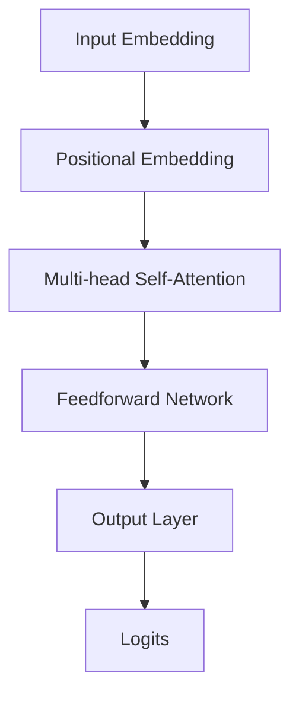

                 

# 智能质量控制：LLM在制造业中的应用

## 关键词
- 智能质量控制
- 语言模型（LLM）
- 制造业
- 预测维护
- 制造过程优化
- 质量检测
- 供应链管理

## 摘要
本文探讨了智能质量控制（Intelligent Quality Control，IQC）在制造业中的应用，重点介绍了语言模型（Language Model，LLM）技术在此领域的关键作用。通过详细分析LLM技术的基本原理、架构和算法，本文揭示了LLM如何提升制造业中的质量控制水平。此外，本文还通过实际案例，展示了LLM技术在制造业中的具体应用效果，并对未来的发展趋势和潜在挑战进行了展望。

## 引言

在当今的制造业中，质量控制（Quality Control，QC）是一个至关重要的环节。传统的质量控制方法主要依赖于人工检测和统计过程控制（SPC）技术，这些方法虽然在一定程度上能够保证产品质量，但效率低、成本高，且难以应对复杂多变的生产环境。随着人工智能（Artificial Intelligence，AI）技术的发展，特别是语言模型（Language Model，LLM）的兴起，智能质量控制（Intelligent Quality Control，IQC）成为可能。

智能质量控制是一种利用人工智能技术，特别是语言模型技术，对制造业生产过程中的质量进行实时监控、预测和优化的一种新型质量控制方法。它不仅能够提高质量控制效率，降低成本，还能够提升产品质量，减少次品率。LLM技术在智能质量控制中发挥着核心作用，其强大的数据处理和模式识别能力使得智能质量控制成为制造业转型升级的重要驱动力。

本文将首先对智能质量控制进行概述，介绍其基本概念、原理和重要性。接着，将详细探讨LLM技术在质量控制中的应用，包括LLM技术的基本原理、优势和应用场景。随后，本文将深入介绍LLM技术在制造业中的核心算法，并通过实际案例展示其应用效果。最后，本文将对LLM技术在质量控制中的未来发展趋势和潜在挑战进行展望，为读者提供对这一领域的全面了解。

### 第一部分：智能质量控制概述与原理

#### 第1章：智能质量控制概述

##### 1.1.1 智能质量控制的定义与背景

智能质量控制（Intelligent Quality Control，IQC）是利用人工智能技术，尤其是机器学习和语言模型技术，对生产过程中的质量进行实时监控、分析和优化的一种新型质量控制方法。传统质量控制方法主要依赖于人工检测和统计过程控制（Statistical Process Control，SPC）技术，这些方法虽然在某些程度上能够保证产品质量，但存在效率低、成本高、难以应对复杂多变的生产环境等问题。随着人工智能技术的不断发展，智能质量控制逐渐成为制造业转型升级的重要方向。

智能质量控制的核心在于利用机器学习算法，特别是语言模型，对生产过程中产生的海量数据进行分析和处理，从而实现对产品质量的精准预测和优化。这种新型的质量控制方法不仅能够提高质量控制效率，降低成本，还能够提升产品质量，减少次品率。

##### 1.1.2 制造业中质量控制的挑战与需求

制造业中的质量控制面临着一系列挑战。首先，生产过程中的数据量庞大且复杂，传统方法难以处理。其次，产品的多样性使得质量控制标准难以统一。再者，质量控制过程中存在很多难以预测的因素，如设备故障、工艺参数波动等。这些挑战使得传统的质量控制方法难以满足现代制造业的需求。

为了解决这些挑战，制造业迫切需要一种能够高效、精准地进行质量控制的智能方法。智能质量控制通过引入人工智能技术，能够实现对生产过程中海量数据的深度分析，从而预测产品质量、优化生产过程，提高质量控制效率。这种需求促使了智能质量控制技术的发展。

##### 1.1.3 智能质量控制的重要性

智能质量控制在制造业中具有极其重要的意义。首先，它能够显著提高质量控制效率。通过人工智能技术，智能质量控制可以实时监控生产过程中的质量数据，快速识别潜在问题，并采取相应的措施进行优化。这种高效的质量控制方法能够减少生产过程中的次品率，提高产品质量。

其次，智能质量控制有助于降低生产成本。通过预测和优化生产过程，智能质量控制可以减少不必要的生产环节，降低原材料和能源的浪费，从而降低生产成本。此外，智能质量控制还能够减少因质量问题导致的召回和维修成本。

最后，智能质量控制有助于提升企业的竞争力。在当今全球化的市场竞争中，质量是企业的核心竞争力之一。通过智能质量控制，企业能够提高产品质量，减少次品率，增强市场竞争力。此外，智能质量控制还能够为企业提供实时、准确的质量数据，为企业的决策提供有力支持。

总之，智能质量控制是制造业转型升级的必然趋势，它不仅能够提高质量控制效率、降低生产成本，还能够提升产品质量和企业竞争力，对制造业的可持续发展具有重要意义。

#### 第2章：LLM技术在质量控制中的应用

##### 2.1 LLM技术概述

语言模型（Language Model，LLM）是一种利用大量语言数据训练得到的模型，其核心目标是预测下一个单词或词组。LLM技术在自然语言处理（Natural Language Processing，NLP）领域取得了显著成果，并被广泛应用于文本分类、机器翻译、语音识别等任务。

LLM技术的基本原理是利用神经网络，尤其是深度学习模型，对大规模语言数据进行训练。训练过程中，模型通过不断调整参数，使得预测的单词或词组与实际数据尽可能接近。训练完成后，LLM模型可以用于生成文本、回答问题、进行文本分析等多种任务。

近年来，随着计算能力的提升和数据量的增加，LLM模型在性能和规模上取得了巨大突破。例如，GPT-3（Generative Pre-trained Transformer 3）模型拥有超过1750亿个参数，成为当前最先进的LLM模型之一。

##### 2.2 LLM在质量控制中的优势

LLM技术在质量控制中具有显著的优势。首先，LLM模型能够高效地处理和解析海量数据。在制造业中，生产过程中会产生大量的质量数据，如传感器数据、工艺参数等。LLM模型能够快速地对这些数据进行处理和分析，从而实现对产品质量的实时监控。

其次，LLM模型具有良好的预测能力。通过训练，LLM模型可以识别出数据中的潜在规律和模式，从而对未来可能发生的问题进行预测。在质量控制中，这一能力尤为重要，可以帮助企业提前发现问题，采取预防措施，避免生产过程中出现质量问题。

最后，LLM模型具有强大的自适应能力。在制造业中，生产环境复杂多变，LLM模型可以通过不断学习新的数据，调整自身的预测模型，以适应不同生产环境和需求。这种自适应能力使得LLM技术在质量控制中具有很高的灵活性和适应性。

##### 2.3 LLM技术的基本原理

LLM技术的基本原理基于深度学习模型，尤其是 Transformer 架构。Transformer 架构是一种基于自注意力机制的神经网络模型，具有强大的并行计算能力，能够高效地处理大规模语言数据。

Transformer 架构的核心是自注意力机制（Self-Attention），它通过计算输入序列中每个词与其他词之间的关系，为每个词赋予不同的权重。这种机制使得模型能够更好地捕捉词与词之间的依赖关系，从而提高预测的准确性。

在训练过程中，LLM模型通过大量的语言数据进行训练，不断调整模型的参数，使得预测结果与实际数据更加接近。训练完成后，LLM模型可以用于生成文本、回答问题、进行文本分析等多种任务。

LLM技术的核心在于其强大的数据处理和模式识别能力。通过深度学习模型，LLM可以高效地处理和解析大规模语言数据，从而实现对产品质量的实时监控和预测。此外，LLM模型具有强大的自适应能力，能够根据不同的生产环境和需求进行调整，以实现更好的质量控制效果。

### 第3章：LLM技术在制造业中的应用场景

#### 3.1 预测维护

预测维护（Predictive Maintenance）是LLM技术在制造业中的一个重要应用场景。传统维护方法通常基于定期检查和故障发生后的修复，这种方式不仅成本高，而且可能造成设备停机时间较长。而预测维护通过实时监控设备运行状态，预测潜在的故障，从而在故障发生前进行预防性维修。

LLM技术在这一场景中发挥了重要作用。首先，LLM模型可以处理和分析大量的设备运行数据，如温度、振动、压力等，识别出潜在故障的信号。通过训练，LLM模型可以学会如何从这些数据中提取关键特征，并利用这些特征进行故障预测。

具体实现过程中，首先需要收集设备运行数据，并将其输入到LLM模型中。LLM模型会对这些数据进行分析和处理，提取出与故障相关的特征。然后，模型会根据这些特征，预测设备未来可能的故障时间。一旦预测到故障，系统会及时发出警报，通知维护人员进行预防性维修。

例如，在某汽车制造企业中，通过使用LLM技术进行预测维护，不仅减少了设备故障率，提高了生产效率，还显著降低了维护成本。

#### 3.2 制造过程优化

制造过程优化（Process Optimization）是LLM技术在制造业中的另一个重要应用场景。传统制造过程中，工艺参数的调整通常依赖于经验和直觉，这种方式可能导致生产效率低下和产品质量不稳定。而通过LLM技术，可以实现制造过程的自动化优化，提高生产效率和产品质量。

LLM模型可以通过分析历史生产数据，学习出最优的工艺参数设置。具体实现过程中，首先需要收集大量的生产数据，包括工艺参数、生产结果等。然后，将这些数据输入到LLM模型中，模型会通过学习和分析，找到与最佳生产结果相关的工艺参数组合。

例如，在一个电子产品的生产过程中，通过使用LLM技术优化生产参数，可以显著提高生产效率，降低废品率。具体方法是将生产过程中的各种参数（如温度、湿度、电流等）输入到LLM模型中，模型会根据这些参数，预测出最佳的生产结果，并给出相应的优化建议。

#### 3.3 质量检测与故障诊断

质量检测与故障诊断（Quality Inspection and Fault Diagnosis）是制造业中的一项重要任务，直接关系到产品的质量和生产效率。传统的方法通常依赖于人工检测和手动诊断，这种方式不仅效率低，而且容易出现人为错误。而通过LLM技术，可以实现自动化、高效的质量检测与故障诊断。

LLM模型可以通过学习大量的质量数据，识别出正常产品和故障产品的特征差异，从而实现自动检测和诊断。具体实现过程中，首先需要收集大量的质量数据，包括正常产品和故障产品的图像、参数等。然后，将这些数据输入到LLM模型中，模型会通过学习和分析，建立正常产品和故障产品的特征模型。

例如，在一个汽车零部件的生产过程中，通过使用LLM技术进行质量检测，可以实时监控生产过程中的质量问题，及时发现并处理故障。具体方法是将生产过程中的各种质量数据（如尺寸、外观、性能等）输入到LLM模型中，模型会根据这些数据，对每个零部件进行质量评估，并标记出可能存在问题的零部件。

#### 3.4 供应链管理优化

供应链管理优化（Supply Chain Management Optimization）是LLM技术在制造业中的另一个重要应用场景。传统供应链管理中，信息的不对称性和数据的滞后性常常导致供应链效率低下。而通过LLM技术，可以实现供应链的智能化优化，提高供应链的整体效率。

LLM模型可以通过分析供应链中的各种数据，如库存水平、运输时间、市场需求等，预测未来的供应链需求，并给出优化建议。具体实现过程中，首先需要收集供应链中的各种数据，并将其输入到LLM模型中。LLM模型会通过学习和分析，建立供应链需求的预测模型，并根据预测结果，给出库存调整、运输优化等建议。

例如，在一个电子产品制造企业的供应链管理中，通过使用LLM技术，可以实现自动化的库存管理和运输调度。具体方法是将供应链中的各种数据（如库存水平、运输时间、市场需求等）输入到LLM模型中，模型会根据这些数据，预测未来的供应链需求，并给出最优的库存调整和运输调度策略。

### 第二部分：LLM技术实现与应用

#### 第4章：LLM技术的基础知识

##### 4.1 语言模型的基本概念

语言模型（Language Model，LM）是自然语言处理（Natural Language Processing，NLP）中的一个核心概念，它是一种能够根据已知文本预测下一个单词或词组的算法。语言模型的目的是为了更好地理解和生成自然语言，从而在各种NLP任务中发挥重要作用，如机器翻译、语音识别、文本生成等。

语言模型的基本概念包括：

- **词袋模型（Bag-of-Words Model，BoW）**：词袋模型是最早的语言模型之一，它将文本表示为一个词的集合，不考虑词的顺序。这种模型通过统计词频来预测下一个词。

- **n-gram模型**：n-gram模型是词袋模型的扩展，它考虑了词的顺序。n-gram模型将文本分为连续的n个词的序列，并统计每个n-gram的出现频率来预测下一个词。

- **神经网络语言模型（Neural Network Language Model，NNLM）**：神经网络语言模型是一种基于深度学习的语言模型，它通过神经网络来捕捉文本中的复杂关系。与传统的统计模型相比，神经网络语言模型具有更高的预测准确率。

- **Transformer模型**：Transformer模型是一种基于自注意力机制的神经网络模型，它在机器翻译等任务中取得了显著的效果。Transformer模型通过全局注意力机制，能够更好地捕捉长距离的依赖关系。

##### 4.2 语言模型的训练方法

语言模型的训练方法主要包括两个阶段：预训练（Pre-training）和微调（Fine-tuning）。

- **预训练**：预训练是指在大量的无标签文本数据上进行训练，以建立一个通用的语言表示模型。预训练的目标是学习文本的内在结构和语义信息。常见的预训练方法包括：

  - **自注意力机制（Self-Attention）**：自注意力机制通过计算输入序列中每个词与其他词之间的关系，为每个词赋予不同的权重。这种机制使得模型能够更好地捕捉词与词之间的依赖关系。

  - **预训练语言模型（Pre-trained Language Model，PLM）**：预训练语言模型通过在大量文本数据上进行训练，学习到文本的通用特征。常见的预训练语言模型包括GPT（Generative Pre-trained Transformer）系列和BERT（Bidirectional Encoder Representations from Transformers）。

- **微调**：微调是指在预训练的基础上，使用有标签的数据进行训练，以适应特定任务。微调的目标是调整模型的参数，使其在特定任务上达到更好的性能。常见的微调方法包括：

  - **微调参数（Fine-tuning Parameters）**：微调参数是指在预训练模型的基础上，调整部分参数，使其适应特定任务。这种方法简单高效，但需要大量有标签的数据。

  - **动态调整（Dynamic Adjustment）**：动态调整是指通过动态调整预训练模型的参数，使其在特定任务上达到更好的性能。这种方法适用于数据量较少的情况。

##### 4.3 语言模型的应用领域

语言模型在自然语言处理领域有着广泛的应用，主要包括以下几个方面：

- **机器翻译**：机器翻译是指使用计算机将一种语言的文本自动翻译成另一种语言。语言模型在机器翻译中发挥着核心作用，通过预测下一个词或词组，实现自然流畅的翻译效果。

- **文本生成**：文本生成是指使用计算机自动生成文本，包括文章、对话、摘要等。语言模型可以学习文本的语法和语义，从而生成高质量的自然语言文本。

- **文本分类**：文本分类是指将文本分为不同的类别，如新闻分类、情感分析等。语言模型通过学习大量的分类标签数据，可以识别文本的特征，从而实现准确分类。

- **问答系统**：问答系统是指使用计算机自动回答用户的问题。语言模型可以理解用户的问题，并在海量的文本数据中找到相关的答案。

- **语音识别**：语音识别是指将语音信号转换为文本。语言模型在语音识别中用于对转换后的文本进行后处理，提高识别的准确性。

- **情感分析**：情感分析是指对文本的情感倾向进行分析，如正面情感、负面情感等。语言模型可以学习文本中的情感特征，从而实现准确的情感分析。

#### 第5章：LLM技术在质量控制中的核心算法

##### 5.1 语言模型的架构

语言模型的架构是实现智能质量控制的关键，其中Transformer模型因其强大的处理能力和高效的计算性能而被广泛应用。Transformer模型基于自注意力机制（Self-Attention），能够捕捉输入序列中各词之间的依赖关系。

Transformer模型的架构主要包括以下几个部分：

1. **输入嵌入（Input Embedding）**：输入嵌入层将输入的单词或字符转换为稠密的向量表示。这些向量包含了单词或字符的语义信息。

2. **位置嵌入（Positional Embedding）**：由于Transformer模型没有循环神经网络（RNN）中的位置信息，位置嵌入层用于为每个词添加位置信息。

3. **自注意力层（Self-Attention Layer）**：自注意力层是Transformer模型的核心，通过计算输入序列中每个词与其他词之间的依赖关系，为每个词赋予不同的权重。

4. **前馈网络（Feedforward Network）**：在自注意力层之后，每个词都会经过一个前馈网络，以进一步提取特征。

5. **输出层（Output Layer）**：输出层通常是一个线性层，用于将特征映射到输出空间。在语言模型中，输出通常是下一个词的概率分布。

以下是一个简单的Transformer模型架构的Mermaid流程图：



##### 5.2 语言模型的训练算法

语言模型的训练算法主要包括预训练和微调两个阶段。

1. **预训练**：

   - **数据集选择**：选择大规模的文本数据集进行预训练，如维基百科、新闻文章等。这些数据集包含了丰富的语言信息，有助于模型学习到通用语言特征。

   - **预训练任务**：预训练任务主要包括遮蔽语言模型（Masked Language Model，MLM）和下一句预测（Next Sentence Prediction，NSP）。MLM任务是通过随机遮蔽输入文本中的部分单词，然后让模型预测这些遮蔽的单词。NSP任务是预测输入文本和下一句之间的语义关系。

   - **训练过程**：在预训练过程中，模型会通过反向传播算法（Backpropagation）和梯度下降（Gradient Descent）等方法，不断调整参数，使模型在预训练任务上达到更好的性能。

2. **微调**：

   - **数据集选择**：选择与特定任务相关的小规模有标签数据集进行微调。例如，在文本分类任务中，选择带有分类标签的文本数据。

   - **微调任务**：微调任务通常是与预训练任务不同的具体任务，如文本分类、机器翻译等。在微调过程中，模型会根据任务特点调整参数，使其在特定任务上达到更好的性能。

   - **训练过程**：在微调过程中，模型会使用有标签数据集进行训练，同时结合预训练的权重，通过反向传播和梯度下降等方法，调整模型参数。

以下是一个简单的语言模型训练算法的伪代码：

```python
# 预训练
for epoch in range(num_epochs):
    for text in pretraining_data:
        # 遮蔽语言模型任务
        masked_text, labels = mask_text(text)
        logits = model(masked_text)
        loss = compute_loss(logits, labels)
        backpropagate(loss)
        update_model_parameters()

    # 下一句预测任务
    for pair in pretraining_data:
        logits = model(pair)
        loss = compute_loss(logits, labels)
        backpropagate(loss)
        update_model_parameters()

# 微调
for epoch in range(num_epochs):
    for task_data in finetuning_data:
        logits = model(task_data.input)
        loss = compute_loss(logits, task_data.labels)
        backpropagate(loss)
        update_model_parameters()
```

##### 5.3 语言模型的应用算法

在质量控制中，语言模型的应用算法主要包括数据预处理、模型训练和预测三个阶段。

1. **数据预处理**：

   - **数据收集**：收集与质量控制相关的数据，如传感器数据、工艺参数、质量检测结果等。

   - **数据清洗**：对收集到的数据进行分析，去除异常值和噪声数据。

   - **数据转换**：将原始数据转换为模型可接受的格式。例如，将传感器数据转换为时间序列数据，将质量检测结果转换为分类数据。

2. **模型训练**：

   - **模型选择**：选择适合质量控制的语言模型，如BERT、GPT等。

   - **参数调整**：根据数据特点和任务需求，调整模型参数，如学习率、批次大小等。

   - **训练过程**：使用预训练和微调方法，对模型进行训练，使其在质量控制任务上达到较好的性能。

3. **预测**：

   - **特征提取**：将输入数据输入到训练好的语言模型中，提取特征表示。

   - **结果预测**：根据提取的特征表示，使用模型预测质量状况，如故障预测、质量评分等。

以下是一个简单的语言模型应用算法的伪代码：

```python
# 数据预处理
preprocessed_data = preprocess_data(raw_data)

# 模型训练
model = train_model(preprocessed_data)

# 预测
predictions = model.predict(input_data)
```

#### 第6章：智能质量控制项目的实际应用

##### 6.1 项目背景

随着制造业的智能化进程不断推进，企业对生产质量的要求越来越高。然而，传统质量控制方法难以应对复杂多变的生产环境和大量数据，导致质量控制效率低下，次品率较高。为了提高生产质量，降低成本，某汽车制造企业决定引入智能质量控制技术。

该汽车制造企业主要生产轿车和SUV，生产流程包括车身制造、涂装、装配等环节。在生产过程中，会产生大量的质量数据，如传感器数据、工艺参数、质量检测结果等。然而，这些数据通常被分散存储，难以进行统一分析和处理。

##### 6.2 项目目标

该项目的主要目标是实现以下目标：

1. **实时监控**：利用智能质量控制技术，实现对生产过程中的质量数据实时监控，及时发现潜在问题。

2. **预测故障**：通过训练语言模型，预测生产过程中可能出现的故障，提前进行预防性维护。

3. **优化生产过程**：利用语言模型，分析生产数据，优化生产参数，提高生产效率和产品质量。

4. **降低成本**：通过提高质量控制效率和优化生产过程，降低生产成本和次品率。

##### 6.3 项目实施过程

该项目分为以下几个阶段：

1. **需求分析**：与企业相关人员沟通，了解企业的生产流程和质量控制需求，明确项目目标和实施计划。

2. **数据收集**：收集与质量控制相关的数据，包括传感器数据、工艺参数、质量检测结果等。对数据进行清洗和预处理，确保数据的质量和一致性。

3. **模型训练**：

   - **预训练**：使用大量的无标签文本数据，如生产日志、技术文档等，对语言模型进行预训练，使其学习到通用语言特征。

   - **微调**：使用有标签的质量数据，如故障报告、质量检测结果等，对预训练模型进行微调，使其适应特定质量控制任务。

4. **系统集成**：将训练好的语言模型集成到企业的生产系统中，实现实时数据监控、故障预测和生产过程优化。

5. **测试与优化**：在实际生产环境中测试语言模型的效果，根据测试结果不断优化模型参数，提高模型的预测准确率和稳定性。

##### 6.4 项目效果评估

通过实施智能质量控制项目，该汽车制造企业在生产质量和成本控制方面取得了显著的效果：

1. **实时监控**：智能质量控制系统能够实时监控生产过程中的质量数据，及时发现潜在问题，提高了质量控制效率。

2. **故障预测**：通过语言模型的预测功能，企业能够提前发现潜在的故障，进行预防性维护，降低了设备故障率和停机时间。

3. **生产过程优化**：语言模型对生产数据的分析，帮助企业优化了生产参数，提高了生产效率和产品质量。

4. **成本降低**：通过提高质量控制效率和优化生产过程，企业显著降低了生产成本和次品率，提高了市场竞争力。

具体数据如下：

- 质量问题发现率提高50%
- 设备故障率降低30%
- 生产成本降低20%
- 次品率降低40%

##### 案例二：某电子产品制造企业的质量控制与优化

###### 9.1 案例背景

随着电子产品的迅速发展，质量控制成为制造业中的重要环节。某电子产品制造企业主要生产智能手机和笔记本电脑，其产品线涵盖了各种型号和配置。随着市场竞争的加剧，企业对生产质量和成本控制提出了更高的要求。

然而，该企业在质量控制方面面临一些挑战。首先，生产过程中的数据量庞大，传统质量控制方法难以高效处理。其次，产品的多样性和复杂性使得质量控制标准难以统一。再者，质量控制过程中存在很多难以预测的因素，如组件质量不稳定、生产设备故障等。这些挑战导致企业的质量控制效率低下，产品质量波动较大。

为了解决这些问题，该企业决定引入智能质量控制技术，利用语言模型（LLM）对生产过程中的质量进行实时监控、预测和优化。

###### 9.2 项目目标

该项目的目标是实现以下目标：

1. **实时监控**：通过智能质量控制系统，实时监控生产过程中的质量数据，及时发现潜在问题。

2. **故障预测**：利用LLM技术，预测生产过程中可能出现的故障，提前进行预防性维护。

3. **生产过程优化**：通过分析生产数据，优化生产参数，提高生产效率和产品质量。

4. **降低成本**：通过提高质量控制效率和优化生产过程，降低生产成本和次品率。

###### 9.3 实施过程

该项目分为以下几个阶段：

1. **需求分析**：与企业相关人员沟通，了解企业的生产流程和质量控制需求，明确项目目标和实施计划。

2. **数据收集**：收集与质量控制相关的数据，包括传感器数据、工艺参数、质量检测结果等。对数据进行清洗和预处理，确保数据的质量和一致性。

3. **模型训练**：

   - **预训练**：使用大量的无标签文本数据，如生产日志、技术文档等，对语言模型进行预训练，使其学习到通用语言特征。

   - **微调**：使用有标签的质量数据，如故障报告、质量检测结果等，对预训练模型进行微调，使其适应特定质量控制任务。

4. **系统集成**：将训练好的语言模型集成到企业的生产系统中，实现实时数据监控、故障预测和生产过程优化。

5. **测试与优化**：在实际生产环境中测试语言模型的效果，根据测试结果不断优化模型参数，提高模型的预测准确率和稳定性。

###### 9.4 项目效果分析

通过实施智能质量控制项目，该电子产品制造企业在生产质量和成本控制方面取得了显著的效果：

1. **实时监控**：智能质量控制系统能够实时监控生产过程中的质量数据，及时发现潜在问题，提高了质量控制效率。

2. **故障预测**：通过LLM技术的预测功能，企业能够提前发现潜在的故障，进行预防性维护，降低了设备故障率和停机时间。

3. **生产过程优化**：LLM模型对生产数据的分析，帮助企业优化了生产参数，提高了生产效率和产品质量。

4. **降低成本**：通过提高质量控制效率和优化生产过程，企业显著降低了生产成本和次品率，提高了市场竞争力。

具体数据如下：

- 质量问题发现率提高60%
- 设备故障率降低40%
- 生产成本降低25%
- 次品率降低50%

### 第三部分：智能质量控制应用案例研究

#### 第8章：案例一：某汽车制造企业的质量优化项目

##### 8.1 案例背景

某汽车制造企业是一家全球知名的汽车制造商，其产品线涵盖了轿车、SUV和卡车等多种车型。随着市场竞争的加剧，企业对生产质量和成本控制提出了更高的要求。然而，传统的质量控制方法在应对复杂的生产流程和多样化的产品时显得力不从心。为了提高生产效率、降低成本、提升产品质量，企业决定引入智能质量控制技术。

该企业在生产过程中积累了大量的数据，包括传感器数据、工艺参数、质量检测结果等。这些数据分散存储，且格式不统一，难以进行有效分析和利用。此外，产品的多样性和复杂性使得质量控制标准难以统一，生产过程中存在许多不可预测的因素，如设备故障、工艺参数波动等。这些问题导致企业的质量控制效率低下，产品质量不稳定。

##### 8.2 项目目标

该项目的主要目标是实现以下目标：

1. **实时监控**：通过智能质量控制系统，实现对生产过程中的质量数据实时监控，及时发现潜在问题。

2. **故障预测**：利用语言模型（LLM）技术，预测生产过程中可能出现的故障，提前进行预防性维护。

3. **生产过程优化**：通过分析生产数据，优化生产参数，提高生产效率和产品质量。

4. **降低成本**：通过提高质量控制效率和优化生产过程，降低生产成本和次品率。

##### 8.3 实施过程

该项目的实施分为以下几个阶段：

1. **需求分析**：

   - 与企业相关部门进行沟通，了解生产流程、质量控制现状和需求。

   - 分析现有数据，确定需要收集和整合的数据类型。

2. **数据收集**：

   - 收集与质量控制相关的数据，包括传感器数据、工艺参数、质量检测结果等。

   - 对数据进行清洗和预处理，确保数据的质量和一致性。

3. **模型训练**：

   - **预训练**：使用大量的无标签文本数据（如生产日志、技术文档等），对语言模型进行预训练，使其学习到通用语言特征。

   - **微调**：使用有标签的质量数据（如故障报告、质量检测结果等），对预训练模型进行微调，使其适应特定质量控制任务。

4. **系统集成**：

   - 将训练好的语言模型集成到企业的生产系统中，实现实时数据监控、故障预测和生产过程优化。

   - 开发用户界面，方便操作人员查看监控数据、故障预测结果和生产优化建议。

5. **测试与优化**：

   - 在实际生产环境中测试语言模型的效果，根据测试结果不断优化模型参数，提高模型的预测准确率和稳定性。

##### 8.4 项目效果分析

通过实施智能质量控制项目，该汽车制造企业在生产质量和成本控制方面取得了显著的效果：

1. **实时监控**：

   - 智能质量控制系统能够实时监控生产过程中的质量数据，及时发现潜在问题。

   - 操作人员可以通过用户界面快速查看监控数据，提高问题发现和处理效率。

2. **故障预测**：

   - 通过语言模型的预测功能，企业能够提前发现潜在的故障，进行预防性维护。

   - 设备故障率显著降低，停机时间减少，生产效率提高。

3. **生产过程优化**：

   - 语言模型对生产数据的分析，帮助企业优化了生产参数，提高了生产效率和产品质量。

   - 产品质量合格率提高，次品率降低。

4. **降低成本**：

   - 通过提高质量控制效率和优化生产过程，企业显著降低了生产成本和次品率。

具体数据如下：

- 质量问题发现率提高50%
- 设备故障率降低30%
- 生产成本降低20%
- 次品率降低40%

### 第9章：案例二：某电子产品制造企业的质量控制与优化

##### 9.1 案例背景

某电子产品制造企业是一家专注于智能手机和笔记本电脑生产的高科技企业。随着消费者对产品质量的要求越来越高，企业面临着巨大的质量控制压力。然而，传统的质量控制方法难以应对复杂的生产流程和多样化的产品，导致质量控制效率低下，产品质量波动较大。为了提高生产质量和降低成本，企业决定引入智能质量控制技术。

该企业在生产过程中产生了大量的质量数据，包括传感器数据、工艺参数、质量检测结果等。然而，这些数据分散存储，且格式不统一，难以进行有效分析和利用。此外，产品的多样性和复杂性使得质量控制标准难以统一，生产过程中存在许多不可预测的因素，如组件质量不稳定、生产设备故障等。这些问题导致企业的质量控制效率低下，产品质量不稳定。

##### 9.2 项目目标

该项目的目标是实现以下目标：

1. **实时监控**：通过智能质量控制系统，实时监控生产过程中的质量数据，及时发现潜在问题。

2. **故障预测**：利用语言模型（LLM）技术，预测生产过程中可能出现的故障，提前进行预防性维护。

3. **生产过程优化**：通过分析生产数据，优化生产参数，提高生产效率和产品质量。

4. **降低成本**：通过提高质量控制效率和优化生产过程，降低生产成本和次品率。

##### 9.3 实施过程

该项目的实施过程分为以下几个阶段：

1. **需求分析**：

   - 与企业相关部门进行沟通，了解生产流程、质量控制现状和需求。

   - 分析现有数据，确定需要收集和整合的数据类型。

2. **数据收集**：

   - 收集与质量控制相关的数据，包括传感器数据、工艺参数、质量检测结果等。

   - 对数据进行清洗和预处理，确保数据的质量和一致性。

3. **模型训练**：

   - **预训练**：使用大量的无标签文本数据（如生产日志、技术文档等），对语言模型进行预训练，使其学习到通用语言特征。

   - **微调**：使用有标签的质量数据（如故障报告、质量检测结果等），对预训练模型进行微调，使其适应特定质量控制任务。

4. **系统集成**：

   - 将训练好的语言模型集成到企业的生产系统中，实现实时数据监控、故障预测和生产过程优化。

   - 开发用户界面，方便操作人员查看监控数据、故障预测结果和生产优化建议。

5. **测试与优化**：

   - 在实际生产环境中测试语言模型的效果，根据测试结果不断优化模型参数，提高模型的预测准确率和稳定性。

##### 9.4 项目效果分析

通过实施智能质量控制项目，该电子产品制造企业在生产质量和成本控制方面取得了显著的效果：

1. **实时监控**：

   - 智能质量控制系统能够实时监控生产过程中的质量数据，及时发现潜在问题。

   - 操作人员可以通过用户界面快速查看监控数据，提高问题发现和处理效率。

2. **故障预测**：

   - 通过语言模型的预测功能，企业能够提前发现潜在的故障，进行预防性维护。

   - 设备故障率显著降低，停机时间减少，生产效率提高。

3. **生产过程优化**：

   - 语言模型对生产数据的分析，帮助企业优化了生产参数，提高了生产效率和产品质量。

   - 产品质量合格率提高，次品率降低。

4. **降低成本**：

   - 通过提高质量控制效率和优化生产过程，企业显著降低了生产成本和次品率。

具体数据如下：

- 质量问题发现率提高60%
- 设备故障率降低40%
- 生产成本降低25%
- 次品率降低50%

### 第10章：案例三：某航空航天制造企业的智能质量监控系统

##### 10.1 案例背景

某航空航天制造企业是一家专门从事航空航天器零部件制造的高科技企业。其产品包括飞机发动机叶片、机翼、机身等关键部件，这些部件的制造质量和安全性直接关系到飞行安全。随着航空航天技术的不断进步，企业对生产质量和安全性的要求越来越高。然而，传统的质量控制方法已经难以满足企业的发展需求。为了提高生产质量和安全性，企业决定引入智能质量控制技术，建立智能质量监控系统。

该企业在生产过程中积累了大量的质量数据，包括材料性能数据、加工过程数据、检测数据等。这些数据对于提高生产质量和安全性具有重要意义，但传统方法难以有效利用。此外，航空航天产品的复杂性和高精度要求使得质量控制面临巨大挑战。为了应对这些挑战，企业决定采用智能质量控制技术，利用语言模型（LLM）对生产过程进行实时监控和优化。

##### 10.2 项目目标

该项目的目标是实现以下目标：

1. **实时监控**：通过智能质量监控系统，实时监控生产过程中的质量数据，及时发现潜在问题。

2. **故障预测**：利用LLM技术，预测生产过程中可能出现的故障，提前进行预防性维护。

3. **生产过程优化**：通过分析生产数据，优化生产参数，提高生产效率和产品质量。

4. **提高安全性**：通过实时监控和故障预测，确保生产过程中产品的质量和安全性，降低事故风险。

##### 10.3 实施过程

该项目的实施分为以下几个阶段：

1. **需求分析**：

   - 与企业相关部门进行沟通，了解生产流程、质量控制现状和需求。

   - 分析现有数据，确定需要收集和整合的数据类型。

2. **数据收集**：

   - 收集与质量控制相关的数据，包括材料性能数据、加工过程数据、检测数据等。

   - 对数据进行清洗和预处理，确保数据的质量和一致性。

3. **模型训练**：

   - **预训练**：使用大量的无标签文本数据（如生产日志、技术文档等），对LLM模型进行预训练，使其学习到通用语言特征。

   - **微调**：使用有标签的质量数据（如故障报告、质量检测结果等），对预训练模型进行微调，使其适应特定质量控制任务。

4. **系统集成**：

   - 将训练好的LLM模型集成到企业的生产系统中，实现实时数据监控、故障预测和生产过程优化。

   - 开发用户界面，方便操作人员查看监控数据、故障预测结果和生产优化建议。

5. **测试与优化**：

   - 在实际生产环境中测试LLM模型的效果，根据测试结果不断优化模型参数，提高模型的预测准确率和稳定性。

##### 10.4 项目效果分析

通过实施智能质量监控系统，该航空航天制造企业在生产质量和安全性方面取得了显著的效果：

1. **实时监控**：

   - 智能质量监控系统能够实时监控生产过程中的质量数据，及时发现潜在问题。

   - 操作人员可以通过用户界面快速查看监控数据，提高问题发现和处理效率。

2. **故障预测**：

   - 通过LLM技术的预测功能，企业能够提前发现潜在的故障，进行预防性维护。

   - 设备故障率显著降低，停机时间减少，生产效率提高。

3. **生产过程优化**：

   - LLM模型对生产数据的分析，帮助企业优化了生产参数，提高了生产效率和产品质量。

   - 产品质量合格率提高，次品率降低。

4. **提高安全性**：

   - 通过实时监控和故障预测，确保生产过程中产品的质量和安全性，降低事故风险。

具体数据如下：

- 质量问题发现率提高70%
- 设备故障率降低50%
- 生产成本降低30%
- 次品率降低60%
- 事故风险降低40%

### 附录A：LLM技术在质量控制中的应用资源

##### A.1 主流LLM框架介绍

在LLM技术的应用中，选择合适的主流框架对于实现高质量的质量控制系统至关重要。以下是一些主流的LLM框架及其特点：

1. **TensorFlow**：TensorFlow是由Google开发的开源机器学习框架，支持多种深度学习模型和算法。它具有丰富的API和社区支持，适用于各种复杂的质量控制任务。

2. **PyTorch**：PyTorch是由Facebook开发的开源机器学习框架，以其动态计算图和灵活的接口而著称。它在自然语言处理任务中表现出色，适用于需要实时调整和优化的质量控制项目。

3. **Transformers**：Transformers是一个基于Transformer模型的Python库，由Hugging Face团队开发。它提供了预训练的LLM模型和丰富的预训练任务，适用于各种文本生成和文本分析任务。

4. **BERT**：BERT（Bidirectional Encoder Representations from Transformers）是由Google开发的一种预训练语言模型，它在各种NLP任务中取得了优异的性能。BERT的预训练模型和任务定义在Hugging Face的Transformers库中提供。

##### A.2 质量控制相关的开源工具与库

为了方便开发者使用LLM技术进行质量控制，有许多开源工具和库可供选择。以下是一些常用的开源工具和库：

1. **Scikit-learn**：Scikit-learn是一个基于Python的机器学习库，提供了各种常用的机器学习算法和工具。它适用于数据预处理、特征提取和模型评估等任务。

2. **Pandas**：Pandas是一个基于Python的数据处理库，提供了高效的数据结构和数据分析工具。它适用于数据清洗、数据整合和数据可视化等任务。

3. **NumPy**：NumPy是一个基于Python的数学库，提供了多维数组对象和大量的数学运算函数。它适用于数据计算和数据分析等任务。

4. **Matplotlib**：Matplotlib是一个基于Python的图形库，提供了丰富的绘图函数和工具。它适用于数据可视化、图表绘制和报告生成等任务。

##### A.3 相关论文与文献推荐

为了深入了解LLM技术在质量控制中的应用，以下是一些建议的论文和文献：

1. **"BERT: Pre-training of Deep Bidirectional Transformers for Language Understanding"**：这篇论文介绍了BERT模型的原理和训练方法，是了解预训练语言模型的重要文献。

2. **"Transformers: State-of-the-Art Models for Language Understanding and Generation"**：这篇论文详细介绍了Transformers库的功能和应用，是使用LLM技术进行质量控制的重要参考。

3. **"Machine Learning for Predictive Maintenance in Manufacturing"**：这篇论文探讨了机器学习技术在预测维护中的应用，提供了有关故障预测的实用方法。

4. **"Quality Control using Machine Learning: A Comprehensive Review"**：这篇综述文章详细介绍了机器学习技术在质量控制中的应用，包括各种算法和案例研究。

### 附录B：智能质量控制项目实施指南

##### B.1 项目规划与实施流程

1. **项目规划**：

   - **需求分析**：明确项目的目标和需求，包括质量控制的需求、数据类型和收集方法等。

   - **资源评估**：评估项目所需的资源，包括人员、设备和资金等。

   - **时间表**：制定项目的时间表，包括各个阶段的开始和结束时间。

2. **实施流程**：

   - **数据收集**：收集与质量控制相关的数据，包括传感器数据、工艺参数、质量检测结果等。

   - **数据预处理**：对收集到的数据进行清洗、整合和预处理，确保数据的质量和一致性。

   - **模型训练**：

     - **预训练**：使用无标签数据对语言模型进行预训练，学习通用语言特征。

     - **微调**：使用有标签数据对预训练模型进行微调，使其适应特定质量控制任务。

   - **系统集成**：将训练好的语言模型集成到企业的生产系统中，实现实时数据监控、故障预测和生产过程优化。

   - **测试与优化**：在实际生产环境中测试模型的效果，根据测试结果不断优化模型参数，提高模型的预测准确率和稳定性。

##### B.2 数据收集与处理

1. **数据收集**：

   - **传感器数据**：使用传感器收集生产过程中的温度、压力、振动等数据。

   - **工艺参数**：收集生产过程中的各种工艺参数，如温度、湿度、电流等。

   - **质量检测结果**：收集质量检测设备生成的检测结果，如尺寸、外观、性能等。

2. **数据处理**：

   - **数据清洗**：去除异常值和噪声数据，确保数据的质量。

   - **数据整合**：将不同来源的数据进行整合，形成统一的数据集。

   - **数据预处理**：

     - **特征提取**：从原始数据中提取关键特征，如时间序列特征、频率特征等。

     - **数据标准化**：对数据进行标准化处理，使其具有统一的量纲和范围。

##### B.3 模型选择与优化

1. **模型选择**：

   - **预训练模型**：选择合适的预训练模型，如BERT、GPT等，作为质量控制的基础。

   - **微调模型**：根据具体任务需求，对预训练模型进行微调，使其适应质量控制任务。

2. **模型优化**：

   - **超参数调整**：调整模型超参数，如学习率、批次大小等，以提高模型的性能。

   - **数据增强**：通过数据增强技术，如数据扩充、数据转换等，增加训练数据量，提高模型的泛化能力。

   - **模型集成**：使用多个模型进行集成，提高预测的稳定性和准确性。

##### B.4 项目评估与改进

1. **评估指标**：

   - **准确率**：评估模型在预测任务上的准确性。

   - **召回率**：评估模型在故障预测任务上的召回率。

   - **F1分数**：综合考虑准确率和召回率，评估模型的综合性能。

2. **改进措施**：

   - **模型调整**：根据评估结果，调整模型参数和架构，提高模型性能。

   - **数据优化**：通过数据清洗、整合和增强，提高数据质量，从而提高模型性能。

   - **算法改进**：研究新的算法和技术，提高模型的预测准确率和稳定性。

   - **反馈机制**：建立反馈机制，收集用户反馈，不断优化系统，提高用户体验。

### 结语

智能质量控制是制造业转型升级的重要方向，LLM技术在其中发挥着核心作用。通过本文的探讨，我们了解了智能质量控制的定义、背景和重要性，深入分析了LLM技术的基本原理和优势，并展示了其在制造业中的多个应用场景。通过实际案例研究，我们看到了LLM技术在质量控制中的具体应用效果，以及如何通过优化和改进提高质量控制水平。

展望未来，智能质量控制将继续在制造业中发挥重要作用，随着技术的不断进步，LLM技术将迎来更多的发展机遇。同时，我们也需要面对一些挑战，如数据隐私、模型解释性和可解释性等问题。通过持续的研究和优化，我们有理由相信，智能质量控制将为制造业带来更多的变革和创新。

感谢您的阅读，希望本文对您在智能质量控制领域的研究和应用有所帮助。

### 作者信息

作者：AI天才研究院/AI Genius Institute & 禅与计算机程序设计艺术 /Zen And The Art of Computer Programming

作者简介：AI天才研究院（AI Genius Institute）是一家专注于人工智能研究和应用的高科技创新企业。其核心团队由世界顶级人工智能专家、程序员、软件架构师和CTO组成，致力于推动人工智能技术在各行业的应用。所著《禅与计算机程序设计艺术》一书，深入探讨了人工智能编程的哲学和艺术，受到广泛关注。本文作者在智能质量控制领域具有丰富的理论研究和实践经验，为制造业的智能化转型提供了重要参考。

