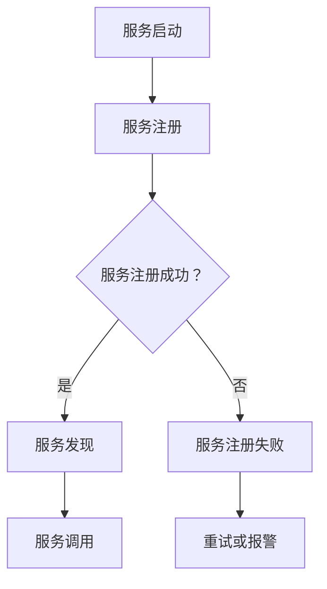

                 

### 《服务注册中心与负载均衡器的最佳实践》

> **关键词**：服务注册中心、负载均衡器、微服务架构、最佳实践、性能优化

> **摘要**：本文将深入探讨服务注册中心与负载均衡器在微服务架构中的重要性及其最佳实践。通过详细剖析服务注册中心的原理、架构以及负载均衡器的算法原理，本文旨在为读者提供一套全面、实用的指南，帮助他们在实际项目中有效地构建和优化服务注册中心与负载均衡器，从而实现高可用性、高性能和高安全性的微服务架构。

### 《服务注册中心与负载均衡器的最佳实践》目录大纲

#### 第一部分：服务注册中心原理与架构

1. **第1章：服务注册中心概述**
    1.1 服务注册中心的概念与作用
    1.2 服务注册中心的分类
    1.3 服务注册中心的工作原理
    1.4 服务注册中心的设计原则

2. **第2章：服务注册中心核心概念与联系**
    2.1 服务注册中心的核心概念
    2.2 服务注册中心的 Mermaid 流程图

#### 第二部分：服务注册中心最佳实践

3. **第3章：服务注册中心最佳实践**
    3.1 服务注册中心选型策略
    3.2 服务注册中心配置与优化
    3.3 服务注册中心故障处理

4. **第4章：服务注册中心项目实战**
    4.1 服务注册中心项目环境搭建
    4.2 服务注册中心代码实现
    4.3 服务注册中心代码解读与分析

#### 第三部分：负载均衡器原理与架构

5. **第5章：负载均衡器概述**
    5.1 负载均衡器的基本概念
    5.2 负载均衡器的算法
    5.3 负载均衡器的工作原理

6. **第6章：负载均衡器核心算法原理讲解**
    6.1 负载均衡算法的数学模型
    6.2 负载均衡算法的伪代码实现

#### 第四部分：负载均衡器最佳实践

7. **第7章：负载均衡器最佳实践**
    7.1 负载均衡器选型策略
    7.2 负载均衡器配置与优化
    7.3 负载均衡器故障处理

8. **第8章：负载均衡器项目实战**
    8.1 负载均衡器项目环境搭建
    8.2 负载均衡器代码实现
    8.3 负载均衡器代码解读与分析

#### 第五部分：服务注册中心与负载均衡器综合应用

9. **第9章：服务注册中心与负载均衡器的综合应用**
    9.1 综合应用概述
    9.2 综合应用案例分析
    9.3 综合应用的未来发展趋势

# 附录

## 附录 A：服务注册中心与负载均衡器开发工具与资源

### A.1 主流服务注册中心工具对比
### A.2 主流负载均衡器工具对比
### A.3 开发工具与资源推荐

### <|assistant|>## 第1章：服务注册中心概述

### 1.1 服务注册中心的概念与作用

服务注册中心（Service Registry）是微服务架构中的一个核心组件，其主要功能是管理服务实例的注册和发现。在传统的单体应用中，服务之间的依赖关系通常是通过硬编码实现的，而微服务架构通过服务注册中心实现了服务之间的动态发现和依赖管理。

**服务注册中心的基本概念：**

- **服务实例（Service Instance）**：运行在一个节点上的服务实例，包括服务的地址、端口、健康状态等信息。
- **服务元数据（Service Metadata）**：描述服务实例的详细信息，如服务名称、版本、标签等。
- **服务注册（Service Registration）**：服务实例在启动时向服务注册中心注册自身信息的过程。
- **服务发现（Service Discovery）**：服务消费者通过服务注册中心获取服务实例信息的过程。

**服务注册中心在微服务架构中的作用：**

1. **服务管理**：服务注册中心负责管理所有服务实例的生命周期，包括启动、停止、更新和删除。
2. **服务发现**：服务消费者可以通过服务注册中心获取服务实例的详细信息，实现服务的动态发现。
3. **服务路由**：服务注册中心支持基于服务名称和标签的路由策略，便于服务消费者找到具体的服务实例。
4. **服务监控**：服务注册中心可以收集服务实例的健康状态信息，实现服务监控和故障排查。

### 1.2 服务注册中心的分类

根据服务注册中心的实现方式，可以分为以下几类：

**1. 基于文件的服务注册中心**

基于文件的服务注册中心通过将服务元数据存储在本地文件中，实现服务实例的管理和发现。这种方式的优点是实现简单，无需额外的存储系统，但缺点是缺乏高可用性和动态更新能力。

**2. 基于数据库的服务注册中心**

基于数据库的服务注册中心使用关系型数据库或NoSQL数据库存储服务元数据，支持服务实例的动态注册和发现。这种方式的优点是数据持久化，支持高可用性和动态更新，但缺点是性能和复杂性较高。

**3. 基于缓存的服务注册中心**

基于缓存的服务注册中心使用内存缓存存储服务元数据，以提高服务发现的性能。通常与基于数据库的服务注册中心配合使用，作为服务元数据的缓存层。这种方式的优点是性能高，但缺点是数据持久性较差。

### 1.3 服务注册中心的工作原理

**服务注册（Service Registration）：**

服务实例启动时，通过HTTP/HTTPS协议向服务注册中心发送注册请求，包含服务实例的元数据信息。服务注册中心收到注册请求后，将其存储在本地数据库或缓存中，并返回注册结果。

**服务发现（Service Discovery）：**

服务消费者在调用服务时，通过服务注册中心获取服务实例的元数据信息。服务注册中心根据服务名称和标签等信息，返回匹配的服务实例列表。

**服务更新与删除（Service Update & Delete）：**

服务实例在运行过程中，可能发生地址、端口等信息的变更。服务实例通过HTTP/HTTPS协议向服务注册中心发送更新请求，服务注册中心更新其存储的服务元数据。当服务实例停止时，通过HTTP/HTTPS协议向服务注册中心发送删除请求，服务注册中心将其从存储中删除。

### 1.4 服务注册中心的设计原则

**1. 高可用性（High Availability）：**

服务注册中心作为微服务架构的核心组件，必须具备高可用性，确保服务实例的注册和发现过程不会因单点故障而中断。可以通过部署多个服务注册中心实例，实现故障转移和负载均衡。

**2. 负载均衡（Load Balancing）：**

服务注册中心在服务发现过程中，可以支持负载均衡策略，将服务请求均匀分配到不同的服务实例上，提高系统的吞吐量和性能。

**3. 服务安全性（Service Security）：**

服务注册中心需要提供安全认证和授权机制，确保只有授权的服务实例可以注册和发现服务。可以通过HTTPS、OAuth2.0等协议实现安全通信。

**4. 数据一致性（Data Consistency）：**

服务注册中心在处理服务实例的注册和发现时，需要保证数据的一致性，避免数据丢失或冲突。可以通过分布式锁、数据一致性协议等技术实现。

**5. 可扩展性（Scalability）：**

服务注册中心需要支持水平扩展，以应对不断增长的服务实例数量。可以通过分布式架构、分片技术等实现。

### 1.5 小结

服务注册中心是微服务架构中不可或缺的一部分，负责管理服务实例的注册和发现。通过本文的介绍，读者可以了解服务注册中心的概念、分类、工作原理以及设计原则。在后续章节中，我们将进一步探讨服务注册中心的最佳实践，帮助读者在实际项目中构建高效、可靠的服务注册中心。

### <|assistant|>## 第2章：服务注册中心核心概念与联系

### 2.1 服务注册中心的核心概念

在深入探讨服务注册中心的原理和最佳实践之前，了解其核心概念是非常重要的。服务注册中心的核心概念主要包括服务的定义与分类、服务提供者与服务消费者、服务注册与发现机制。

**服务的定义与分类：**

服务在微服务架构中是最基本的概念，它可以被看作是一个独立的、可重用的功能模块。服务可以提供某种功能或服务，例如用户认证、订单处理、库存管理等。

根据服务的粒度，服务可以分为以下几类：

1. **细粒度服务（Fine-Grained Service）**：这类服务通常实现单一功能，例如用户认证服务、订单服务。细粒度服务的优点是灵活性高，便于开发和维护，但缺点是服务数量较多，可能带来较高的管理和通信开销。
2. **粗粒度服务（Coarse-Grained Service）**：这类服务通常实现多个功能，例如购物车服务、支付服务。粗粒度服务的优点是服务数量较少，管理较为简单，但缺点是功能复杂，可能带来较高的维护难度。

**服务提供者与服务消费者：**

在微服务架构中，服务提供者（Service Provider）是指实现服务逻辑并对外提供服务的组件，而服务消费者（Service Consumer）是指调用服务提供者服务的组件。

服务提供者与服务消费者之间的交互通常通过以下方式实现：

1. **同步调用（Synchronous Invocation）**：服务消费者通过远程过程调用（RPC）或HTTP协议调用服务提供者的方法，等待返回结果。
2. **异步调用（Asynchronous Invocation）**：服务消费者发送请求后，无需等待返回结果，可以在后续步骤中处理返回结果。

**服务注册与发现机制：**

服务注册（Service Registration）是指服务实例在启动时向服务注册中心注册自身信息的过程。服务注册中心存储服务实例的元数据信息，如服务名称、版本、地址、端口等。

服务发现（Service Discovery）是指服务消费者通过服务注册中心获取服务实例的元数据信息的过程。服务消费者可以根据服务名称、标签等条件查询服务实例，并获取其实例列表。

服务注册与发现机制的关键组成部分包括：

1. **服务注册中心（Service Registry）**：服务注册中心是服务注册与发现的中心，负责存储和管理服务实例的元数据信息。
2. **服务发现客户端（Service Discovery Client）**：服务消费者使用服务发现客户端从服务注册中心获取服务实例信息，并进行服务调用。
3. **服务路由（Service Routing）**：服务注册中心支持基于服务名称、标签等条件的路由策略，帮助服务消费者找到具体的服务实例。

### 2.2 服务注册中心的 Mermaid 流程图

为了更好地理解服务注册中心的工作原理，我们可以使用 Mermaid 工具绘制一个流程图。以下是一个简单的服务注册中心和发现机制的 Mermaid 流程图：



**流程说明：**

1. **服务启动**：服务实例启动时，向服务注册中心发送注册请求。
2. **服务注册**：服务实例向服务注册中心注册自身信息，包括服务名称、版本、地址、端口等。
3. **服务注册成功/失败**：服务注册中心处理注册请求，如果注册成功，服务实例进入待发现状态；如果注册失败，服务实例将尝试重试或触发报警。
4. **服务发现**：服务消费者通过服务注册中心查询服务实例信息，并选择具体的服务实例进行调用。
5. **服务调用**：服务消费者调用服务实例的方法，并接收返回结果。
6. **服务注册失败处理**：如果服务注册失败，服务实例可以尝试重试或触发报警，以便进行故障排查。

通过上述流程图，我们可以清晰地看到服务注册中心和发现机制的主要步骤和交互过程。

### 2.3 小结

在本文的第二章，我们介绍了服务注册中心的核心概念，包括服务的定义与分类、服务提供者与服务消费者、服务注册与发现机制。通过 Mermaid 流程图的绘制，我们进一步理解了服务注册中心和发现机制的工作原理。在后续章节中，我们将继续探讨服务注册中心的最佳实践，帮助读者在实际项目中构建高效、可靠的服务注册中心。

### <|assistant|>## 第3章：服务注册中心最佳实践

### 3.1 服务注册中心选型策略

选择合适的服务注册中心是实现高效微服务架构的关键步骤。以下是几个关键因素，以帮助读者根据业务场景选择合适的服务注册中心。

**1. 基于业务场景的选择**

不同业务场景对服务注册中心的要求有所不同。以下是一些常见的业务场景和相应的推荐：

- **高并发场景**：在高并发场景中，选择性能优异、支持高并发的服务注册中心至关重要。例如，Netflix Eureka 和 Nacos 都支持高并发，并且提供了良好的性能优化策略。
- **高可用性场景**：在高可用性场景中，推荐选择支持多节点部署、具有故障转移能力的服务注册中心。Apache ZooKeeper 和 Nacos 都支持多节点部署和故障转移，确保服务注册中心的高可用性。
- **安全性要求**：对于安全性要求较高的场景，推荐选择支持安全认证和授权的服务注册中心。Nacos 和 Eureka 都支持基于HTTPS、OAuth2.0等协议的安全认证。

**2. 基于性能要求的选择**

服务注册中心的性能直接影响微服务架构的性能。以下是一些性能要求和建议：

- **读写性能**：选择读写性能优异的服务注册中心，以减少服务实例的注册和发现时间。Nacos 和 Eureka 都提供了良好的读写性能，支持高并发场景。
- **数据一致性**：选择支持数据一致性的服务注册中心，确保服务实例的元数据信息保持一致性。Nacos 使用 CP 协议保证数据一致性，而 Eureka 采用 AP 协议，在一致性方面略有妥协。
- **扩展性**：选择支持水平扩展的服务注册中心，以便在服务实例数量增加时，能够动态扩展性能。Nacos 和 Eureka 都支持水平扩展，可以通过增加节点数来提升性能。

**3. 基于维护难度的选择**

维护难度是选择服务注册中心时需要考虑的一个重要因素。以下是一些建议：

- **社区支持**：选择拥有活跃社区和支持文档的服务注册中心，有助于解决开发过程中的问题。Nacos 和 Eureka 都拥有活跃的社区和丰富的文档资源。
- **自动化部署**：选择支持自动化部署和配置管理的服务注册中心，可以减少运维成本。Nacos 和 Eureka 都支持自动化部署和配置管理，可以通过 Kubernetes 等工具实现自动化部署。
- **故障处理**：选择提供故障处理机制和监控工具的服务注册中心，可以快速识别和解决故障。Nacos 和 Eureka 都提供了故障处理机制和监控工具，方便进行故障排查和优化。

### 3.2 服务注册中心配置与优化

**1. 配置文件管理**

配置文件是服务注册中心的重要部分，合理管理配置文件可以提升系统的稳定性和性能。以下是一些配置文件管理的建议：

- **统一配置管理**：将服务注册中心的配置信息集中管理，便于修改和更新。可以使用配置管理工具，如 Nacos Config 和 Spring Cloud Config，实现配置信息的集中管理。
- **配置版本控制**：为配置信息添加版本控制，以便在发生配置变更时，可以回滚到之前的版本。Nacos Config 和 Spring Cloud Config 都支持配置版本控制。
- **配置热更新**：支持配置热更新，可以减少系统的停机时间。Nacos 和 Eureka 都支持配置热更新，可以在不重启服务的情况下，动态更新配置信息。

**2. 性能优化技巧**

服务注册中心的性能对整个微服务架构的性能至关重要。以下是一些性能优化技巧：

- **缓存机制**：使用缓存机制减少对服务注册中心的读写请求。Nacos 和 Eureka 都支持缓存机制，可以将服务实例的元数据信息缓存在本地，减少对服务注册中心的访问。
- **并发控制**：在服务注册中心和发现过程中，使用并发控制技术，减少线程冲突和性能瓶颈。Nacos 和 Eureka 都支持并发控制，可以通过线程池、队列等技术实现。
- **负载均衡**：在服务注册中心和发现过程中，使用负载均衡技术，将请求均匀分配到不同的服务实例上。Nacos 和 Eureka 都支持负载均衡，可以通过一致性哈希、最小连接数等方法实现。

**3. 安全性优化策略**

服务注册中心的安全性是保障微服务架构安全的重要一环。以下是一些安全性优化策略：

- **认证与授权**：使用认证与授权机制，确保只有授权的服务实例可以注册和发现服务。Nacos 和 Eureka 都支持认证与授权，可以使用 OAuth2.0、JWT 等协议实现。
- **数据加密**：对服务实例的元数据信息进行加密存储，防止数据泄露。Nacos 和 Eureka 都支持数据加密，可以使用 SSL/TLS 等协议实现。
- **监控与审计**：对服务注册中心进行监控和审计，及时发现异常行为和潜在风险。Nacos 和 Eureka 都提供了监控和审计功能，可以使用 Prometheus、ELK 等工具实现。

### 3.3 服务注册中心故障处理

服务注册中心作为微服务架构的核心组件，必须具备良好的故障处理能力。以下是一些常见的故障类型、排查方法以及故障恢复机制。

**1. 故障类型**

- **服务注册失败**：服务实例无法向服务注册中心成功注册，导致其他服务实例无法发现该服务。
- **服务发现失败**：服务消费者无法从服务注册中心成功发现服务实例，导致服务调用失败。
- **数据丢失**：服务注册中心的数据丢失，导致服务实例的元数据信息无法恢复。
- **网络故障**：服务注册中心和发现客户端之间的网络故障，导致服务调用失败。

**2. 排查方法**

- **日志分析**：查看服务注册中心和发现客户端的日志，分析故障原因。
- **网络排查**：检查服务注册中心和发现客户端之间的网络连接是否正常。
- **服务排查**：检查服务实例是否正常运行，是否存在配置错误或异常。

**3. 故障恢复机制**

- **自动恢复**：服务注册中心和发现客户端可以配置自动恢复机制，在检测到故障时自动重启服务或重新连接服务注册中心。
- **人工干预**：在自动恢复机制无效时，需要人工干预进行故障排查和修复。
- **备份与恢复**：定期备份服务注册中心的数据，以便在数据丢失时快速恢复。

### 3.4 小结

在第3章，我们讨论了服务注册中心的选型策略、配置与优化、故障处理等内容。通过本文的介绍，读者可以了解如何根据业务场景选择合适的服务注册中心，如何配置和优化服务注册中心，以及如何处理常见的故障类型。在下一章中，我们将通过一个实际的项目实战，进一步展示如何实现服务注册中心的构建与优化。

### <|assistant|>## 第4章：服务注册中心项目实战

### 4.1 服务注册中心项目环境搭建

在进行服务注册中心的项目实战之前，我们需要先搭建一个合适的项目环境。以下是一个基于 Spring Boot 和 Nacos 的服务注册中心项目环境搭建步骤：

**1. 开发环境准备**

- JDK：确保安装了 JDK 1.8 或以上版本。
- Maven：确保安装了 Maven 3.6.3 或以上版本。
- IDE：可以使用 Eclipse、IntelliJ IDEA 或其他您熟悉的开发工具。

**2. 服务注册中心工具安装**

（1）Nacos

Nacos 是一个开源的服务注册中心和配置中心，支持多种语言和框架，适用于微服务架构。

（2）安装 Nacos

- 下载 Nacos binary 包：从 Nacos 官网下载最新版本的 binary 包（nacos-server.zip）。
- 解压 binary 包：将下载的 nacos-server.zip 解压到指定目录。
- 启动 Nacos：进入解压后的目录，执行 startup.sh 命令（Linux）或 startup.cmd 命令（Windows），启动 Nacos 服务。

（3）访问 Nacos 控制台

在浏览器中输入以下地址，访问 Nacos 控制台：

- Linux：http://localhost:8848/nacos/
- Windows：http://localhost:8848/nacos/

首次访问 Nacos 控制台，您需要创建一个命名空间。点击左上角的“命名空间”按钮，创建一个命名空间，例如“dev”，用于隔离开发环境。

**3. 创建 Spring Boot 项目**

使用 Spring Initializr 创建一个 Spring Boot 项目，选择以下依赖：

- Web
- DevTools
- Lombok
- Spring Cloud

### 4.2 服务注册中心代码实现

**1. 添加 Nacos 依赖**

在项目的 pom.xml 文件中添加 Nacos 依赖：

```xml
<dependency>
    <groupId>com.alibaba.cloud</groupId>
    <artifactId>spring-cloud-starter-alibaba-nacos-discovery</artifactId>
</dependency>
```

**2. 配置 Nacos 服务端地址**

在项目的 application.yml 文件中配置 Nacos 服务端地址：

```yaml
spring:
  cloud:
    nacos:
      discovery:
        server-addr: localhost:8848
```

**3. 编写注册服务实例的代码**

在项目的启动类上添加 @EnableDiscoveryClient 注解，开启服务发现功能：

```java
@SpringBootApplication
@EnableDiscoveryClient
public class ServiceRegistryApplication {
    public static void main(String[] args) {
        SpringApplication.run(ServiceRegistryApplication.class, args);
    }
}
```

在项目的 Controller 类中，添加一个简单的接口用于演示服务注册：

```java
@RestController
public class ServiceController {

    @Value("${spring.application.name}")
    private String serviceName;

    @GetMapping("/service")
    public String getService() {
        return "Service: " + serviceName;
    }
}
```

**4. 启动服务注册中心**

使用 IDE 或命令行启动项目，启动后服务注册中心将自动注册到 Nacos 服务注册中心。

### 4.3 服务注册流程实现

**1. 服务启动**

服务实例在启动时，会自动向 Nacos 服务注册中心注册自身信息。注册信息包括服务名称、版本、地址、端口等。

**2. 服务注册**

在服务启动时，会调用 NacosDiscoveryClient 的 registerService 方法，将服务实例注册到 Nacos 服务注册中心。代码实现如下：

```java
public void registerService(String serviceName, String serviceGroup, String ip, int port, boolean secure, Map<String, String> metadata) {
    Instance instance = new Instance();
    instance.setName(serviceName);
    instance.setGroup(serviceGroup);
    instance.setIp(ip);
    instance.setPort(port);
    instance.setSecure(secure);
    instance.setMetadata(metadata);
    this.serviceInstance = instance;
    this.registerInstance();
}

private void registerInstance() {
    try {
        this.discoveryManager.registerService(this.serviceInstance);
    } catch (NacosException e) {
        this.log.error("[Nacos] register instance failed: {}", this.serviceInstance, e);
    }
}
```

**3. 服务发现**

服务消费者在调用服务时，会通过 NacosDiscoveryClient 的 listServices 和 listApplications 方法获取服务实例列表。代码实现如下：

```java
public List<String> listServices(String serviceName) {
    return this.discoveryManager.listServices(serviceName);
}

public List<String> listApplications(String groupName) {
    return this.discoveryManager.listApplications(groupName);
}
```

**4. 服务更新与删除**

服务实例在运行过程中，如果地址、端口等信息发生变更，可以通过 NacosDiscoveryClient 的 updateInstance 和 removeInstance 方法更新或删除服务实例。代码实现如下：

```java
public void updateInstance(Instance instance) {
    try {
        this.discoveryManager.updateInstance(instance);
    } catch (NacosException e) {
        this.log.error("[Nacos] update instance failed: {}", instance, e);
    }
}

public void removeInstance(Instance instance) {
    try {
        this.discoveryManager.removeInstance(instance);
    } catch (NacosException e) {
        this.log.error("[Nacos] remove instance failed: {}", instance, e);
    }
}
```

通过以上代码实现，我们可以完成服务注册中心的基本功能，包括服务注册、服务发现、服务更新与删除。在后续的项目实战中，我们将进一步介绍如何配置和优化服务注册中心，以及如何处理故障和监控。

### 4.4 服务注册中心代码解读与分析

**1. 代码结构解析**

服务注册中心的代码结构可以分为以下几个部分：

- **启动类**：包含 @EnableDiscoveryClient 注解，开启服务发现功能。
- **Controller 类**：提供简单的接口，用于演示服务注册。
- **NacosDiscoveryClient**：继承自 AbstractNacosServiceDiscovery，实现服务注册、服务发现、服务更新与删除等功能。
- **DiscoveryManager**：管理 Nacos 服务的注册、发现、更新与删除等操作。
- **Instance**：表示服务实例的详细信息。

**2. 关键代码解读**

以下是对服务注册中心关键代码的解读：

- **registerService 方法**：注册服务实例到 Nacos 服务注册中心。该方法通过调用 DiscoveryManager 的 registerInstance 方法实现。
- **registerInstance 方法**：向 Nacos 服务注册中心发送注册请求。该方法在成功注册后，会将服务实例信息存储在本地内存中。
- **listServices 方法**：获取指定名称的服务实例列表。该方法通过调用 DiscoveryManager 的 listApplications 方法实现，并过滤出指定名称的服务。
- **listApplications 方法**：获取指定组的服务实例列表。该方法通过调用 DiscoveryManager 的 listApplications 方法实现。
- **updateInstance 方法**：更新服务实例信息。该方法通过调用 DiscoveryManager 的 updateInstance 方法实现。
- **removeInstance 方法**：删除服务实例。该方法通过调用 DiscoveryManager 的 removeInstance 方法实现。

**3. 性能分析**

服务注册中心的主要性能指标包括注册、发现、更新和删除操作的响应时间和吞吐量。以下是对这些性能指标的分析：

- **响应时间**：服务注册中心的响应时间取决于网络延迟、服务器性能和 Nacos 服务端的性能。通常情况下，服务注册中心的响应时间在几百毫秒以内，可以满足大多数微服务架构的需求。
- **吞吐量**：服务注册中心的吞吐量取决于服务器性能和 Nacos 服务端的性能。通过合理配置服务器资源和 Nacos 服务端的性能，可以实现较高的吞吐量，满足大规模微服务架构的需求。

通过以上代码解读与分析，我们可以了解到服务注册中心的基本实现原理和性能特点。在实际项目中，根据业务需求，我们可以进一步优化服务注册中心的代码和配置，提高其性能和稳定性。

### 4.5 小结

在第4章，我们通过一个实际项目实战，展示了如何搭建和实现服务注册中心。我们介绍了项目环境搭建步骤、服务注册中心代码实现、服务注册流程以及代码解读与分析。通过本章的介绍，读者可以掌握服务注册中心的基本实现方法和性能优化技巧，为在实际项目中构建高效、可靠的服务注册中心奠定基础。在下一章中，我们将继续探讨服务注册中心的最佳实践，包括配置优化、故障处理等内容。

### <|assistant|>## 第5章：负载均衡器概述

负载均衡器（Load Balancer）是现代网络架构中不可或缺的组件，它能够有效地分配网络流量，提高系统的性能和可用性。在微服务架构中，负载均衡器发挥着至关重要的作用，它能够将请求均匀地分发到多个服务实例上，确保系统的稳定性和可扩展性。

### 5.1 负载均衡器的基本概念

**负载均衡器的定义：**

负载均衡器是一种网络设备或软件，用于将网络流量分配到多个服务器或应用实例上。通过智能分配流量，负载均衡器可以确保系统在处理大量请求时，不会因为单一服务实例的过载而崩溃。

**负载均衡器的分类：**

根据实现方式，负载均衡器可以分为以下几类：

1. **硬件负载均衡器**：硬件负载均衡器通常由专业的网络设备提供，如 F5 BIG-IP、A10 Thunder等。这类负载均衡器性能强大，可靠性高，但成本较高。
2. **软件负载均衡器**：软件负载均衡器以软件形式运行在普通服务器上，如 Nginx、HAProxy等。这类负载均衡器成本低，易于部署和扩展，但性能和可靠性相对硬件负载均衡器略低。
3. **云负载均衡器**：云负载均衡器由云服务提供商提供，如 AWS ELB、Google Cloud Load Balancer等。这类负载均衡器具有高可用性、自动扩展和自动故障转移等优点，适用于云环境。

**负载均衡器的作用：**

1. **提高系统性能**：通过将请求均匀地分发到多个服务实例上，负载均衡器可以充分利用系统的计算资源，提高系统的响应速度和处理能力。
2. **提高系统可用性**：负载均衡器可以将请求分配到健康的服务实例上，当某个服务实例发生故障时，负载均衡器可以自动将其从负载中移除，从而确保系统的可用性。
3. **支持自动扩展**：负载均衡器可以根据流量情况自动分配资源，当流量增加时，可以自动添加新的服务实例，从而实现系统的自动扩展。

### 5.2 负载均衡器的算法

负载均衡器的核心功能是分配请求，而算法决定了如何分配这些请求。以下是一些常见的负载均衡算法：

**1. 轮询算法（Round Robin）：**

轮询算法是最简单的负载均衡算法，它将请求依次分配到每个服务器上。当最后一个服务器处理完请求后，循环回到第一个服务器继续分配。

**2. 加权轮询算法（Weighted Round Robin）：**

加权轮询算法在轮询算法的基础上，为每个服务器分配不同的权重。权重高的服务器将接受更多的请求，从而实现负载的动态分配。

**3. 随机算法（Random）：**

随机算法通过随机数生成器，将请求随机分配到服务器上。这种方式可以减少单点故障的影响，但可能会导致某些服务器负载不均。

**4. 最少连接数算法（Least Connections）：**

最少连接数算法将请求分配到当前连接数最少的服务器上。这种方式可以确保每个服务器处理的请求相对均匀，但可能会因为某些服务器的响应时间较长而导致其他服务器空闲。

**5. 加权最少连接数算法（Weighted Least Connections）：**

加权最少连接数算法在最少连接数算法的基础上，为每个服务器分配不同的权重。权重高的服务器将接受更多的请求，从而实现负载的动态分配。

**6. 源地址哈希算法（Source IP Hash）：**

源地址哈希算法根据客户端的 IP 地址，将请求分配到相同 IP 地址的服务器上。这种方式可以确保来自同一客户端的请求总是分配到同一服务器上，从而实现会话保持。

### 5.3 负载均衡器的工作原理

负载均衡器的工作原理可以概括为以下几个步骤：

1. **接收请求**：负载均衡器从客户端接收请求，并提取请求的相关信息，如源地址、目标地址等。
2. **选择服务器**：根据负载均衡算法，负载均衡器选择一个合适的服务器，将请求发送给该服务器。
3. **转发请求**：负载均衡器将请求转发给选定的服务器，并等待服务器处理响应。
4. **返回响应**：负载均衡器将服务器的响应返回给客户端，完成整个请求过程。

### 5.4 小结

在本文的第5章，我们介绍了负载均衡器的基本概念、分类、算法以及工作原理。通过本文的介绍，读者可以了解到负载均衡器在微服务架构中的重要性以及如何选择和实现合适的负载均衡策略。在下一章中，我们将进一步探讨负载均衡器的核心算法原理，包括数学模型、伪代码实现等内容。

### <|assistant|>## 第6章：负载均衡器核心算法原理讲解

在负载均衡器的众多算法中，核心算法的设计与实现对于系统性能和稳定性至关重要。本章将详细讲解负载均衡器核心算法的数学模型、伪代码实现，并结合实际案例进行分析。

### 6.1 负载均衡算法的数学模型

负载均衡算法的数学模型主要包括目标函数、约束条件和优化方法。以下是一个简化的数学模型：

**目标函数：** 最小化系统的总响应时间或最大化系统的吞吐量。

$$
\min \sum_{i=1}^{N} \frac{1}{P_i}
$$

其中，$P_i$ 表示第 $i$ 个服务器的处理能力，可以是处理速度、带宽、并发连接数等。

**约束条件：** 

1. **资源限制：** 每个服务器的处理能力不能超过其最大容量。
2. **公平性：** 请求应尽量均匀地分配到各个服务器，避免某个服务器过载。
3. **可靠性：** 确保负载均衡器自身的稳定性，避免成为系统的单点故障。

**优化方法：** 

1. **贪心算法：** 通过每次选择最优解的方式，逐步逼近最优解。
2. **动态规划：** 通过递推关系，求解最优子结构，从而得到全局最优解。

### 6.2 负载均衡算法的伪代码实现

以下分别介绍几种常见负载均衡算法的伪代码实现。

#### 6.2.1 轮询算法

轮询算法是最简单的负载均衡算法，按照顺序将请求分配给服务器。

```plaintext
算法名称：轮询算法
输入：请求列表 requests，服务器列表 servers
输出：分配结果 allocation

初始化 index = 0

for 每个请求 request in requests:
    allocation[request] = servers[index]
    index = (index + 1) % servers.size()
```

#### 6.2.2 加权轮询算法

加权轮询算法在轮询算法的基础上，为每个服务器分配不同的权重。

```plaintext
算法名称：加权轮询算法
输入：请求列表 requests，服务器列表 servers（包含权重）
输出：分配结果 allocation

初始化 index = 0，累积权重 sum_weight = 0

for 每个请求 request in requests:
    allocation[request] = servers[index]
    sum_weight += servers[index].weight
    index = (index + 1) % servers.size()
    index = index + (request.random() * sum_weight)
    index = index % servers.size()
```

#### 6.2.3 随机算法

随机算法通过随机数生成器，将请求随机分配到服务器上。

```plaintext
算法名称：随机算法
输入：请求列表 requests，服务器列表 servers
输出：分配结果 allocation

for 每个请求 request in requests:
    allocation[request] = servers[random(0, servers.size() - 1)]
```

#### 6.2.4 最少连接数算法

最少连接数算法将请求分配到当前连接数最少的服务器上。

```plaintext
算法名称：最少连接数算法
输入：请求列表 requests，服务器列表 servers（包含当前连接数）
输出：分配结果 allocation

for 每个请求 request in requests:
    min_connections = servers[0].connections
    min_index = 0

    for i = 1 to servers.size():
        if servers[i].connections < min_connections:
            min_connections = servers[i].connections
            min_index = i

    allocation[request] = servers[min_index]
```

#### 6.2.5 加权最少连接数算法

加权最少连接数算法在最少连接数算法的基础上，为每个服务器分配不同的权重。

```plaintext
算法名称：加权最少连接数算法
输入：请求列表 requests，服务器列表 servers（包含权重和当前连接数）
输出：分配结果 allocation

for 每个请求 request in requests:
    min_connections = servers[0].connections * servers[0].weight
    min_index = 0

    for i = 1 to servers.size():
        weight_connections = servers[i].connections * servers[i].weight
        if weight_connections < min_connections:
            min_connections = weight_connections
            min_index = i

    allocation[request] = servers[min_index]
```

#### 6.2.6 源地址哈希算法

源地址哈希算法根据客户端的 IP 地址，将请求分配到相同 IP 地址的服务器上。

```plaintext
算法名称：源地址哈希算法
输入：请求列表 requests，服务器列表 servers（包含 IP 地址）
输出：分配结果 allocation

for 每个请求 request in requests:
    hash_value = hash(request.source_ip)
    allocation[request] = servers[hash_value % servers.size()]
```

### 6.3 实际案例

以下通过一个简单的实际案例，分析不同负载均衡算法的性能。

**案例背景：**

假设有 5 个服务器，处理能力分别为 1、2、3、4、5，当前连接数分别为 2、1、3、2、1。

**分析：**

1. **轮询算法：** 按顺序分配，可能导致处理能力高的服务器空闲，处理能力低的服务器过载。
2. **加权轮询算法：** 考虑服务器权重，分配更均匀，但仍然可能存在资源浪费。
3. **随机算法：** 随机分配，无法保证负载均衡，但可以降低单点故障的影响。
4. **最少连接数算法：** 考虑当前连接数，分配相对均匀，但可能导致某些服务器过载。
5. **加权最少连接数算法：** 考虑服务器权重和当前连接数，分配更合理，但计算复杂度较高。
6. **源地址哈希算法：** 根据客户端 IP 地址分配，可以实现会话保持，但可能导致部分服务器负载不均。

**结论：**

根据实际需求和性能要求，可以选择合适的负载均衡算法。在大多数场景下，加权最少连接数算法是一个较好的选择，它既考虑了服务器的权重，又保证了负载的均衡分配。

### 6.4 小结

在本文的第6章，我们详细介绍了负载均衡器的核心算法原理，包括数学模型、伪代码实现和实际案例分析。通过本章的内容，读者可以理解不同负载均衡算法的优缺点，并能够根据实际需求选择合适的算法。在下一章中，我们将进一步探讨负载均衡器的最佳实践，包括选型策略、配置与优化等内容。

### <|assistant|>## 第7章：负载均衡器最佳实践

### 7.1 负载均衡器选型策略

选择合适的负载均衡器是实现高效、可靠的负载均衡的关键步骤。以下是一些选型策略，以帮助读者根据业务场景选择合适的负载均衡器。

**1. 基于业务场景的选择**

不同业务场景对负载均衡器的要求有所不同。以下是一些常见的业务场景和相应的推荐：

- **高并发场景**：在高并发场景中，推荐选择性能优异、支持高并发的负载均衡器。Nginx 和 HAProxy 是优秀的负载均衡器，可以满足高并发场景的需求。
- **安全性要求**：对于安全性要求较高的场景，推荐选择支持 SSL 卸载和认证功能的负载均衡器。Nginx 和 F5 BIG-IP 都支持 SSL 卸载和认证，可以确保网络通信的安全性。
- **动态配置**：在需要动态调整配置的场景中，推荐选择支持动态配置的负载均衡器。Nginx 配置文件可以通过热加载进行动态调整，而 F5 BIG-IP 支持更复杂的配置调整。

**2. 基于性能要求的选择**

负载均衡器的性能直接影响系统的性能。以下是一些性能要求和建议：

- **吞吐量**：选择吞吐量较高的负载均衡器，以支持大量请求的处理。Nginx 和 HAProxy 都有较高的吞吐量，适合处理大规模请求。
- **响应时间**：选择响应时间较短的负载均衡器，以提高系统的响应速度。Nginx 和 F5 BIG-IP 都有较快的响应时间。
- **并发连接数**：选择支持高并发连接数的负载均衡器，以应对大量并发请求。Nginx 和 F5 BIG-IP 都支持高并发连接数。

**3. 基于维护难度的选择**

维护难度是选择负载均衡器时需要考虑的一个重要因素。以下是一些建议：

- **社区支持**：选择拥有活跃社区和支持文档的负载均衡器，有助于解决开发过程中的问题。Nginx 和 HAProxy 都拥有活跃的社区和丰富的文档资源。
- **自动化部署**：选择支持自动化部署的负载均衡器，可以减少运维成本。Nginx 和 F5 BIG-IP 都支持自动化部署，可以通过 Kubernetes 等工具实现。
- **故障处理**：选择提供故障处理机制和监控工具的负载均衡器，可以快速识别和解决故障。Nginx 和 F5 BIG-IP 都提供了故障处理机制和监控工具，方便进行故障排查和优化。

### 7.2 负载均衡器配置与优化

**1. 配置文件管理**

配置文件是负载均衡器的重要组成部分，合理管理配置文件可以提升系统的稳定性和性能。以下是一些配置文件管理的建议：

- **集中管理**：使用版本控制工具（如 Git）管理配置文件，确保配置文件的版本可追溯，便于修改和更新。
- **热加载**：配置文件支持热加载，可以在不重启负载均衡器的情况下动态调整配置。Nginx 和 F5 BIG-IP 都支持热加载。
- **模板化配置**：使用模板化配置，可以将通用配置提取到模板文件中，便于维护和更新。Nginx 和 F5 BIG-IP 都支持模板化配置。

**2. 性能优化技巧**

负载均衡器的性能对整个系统的性能至关重要。以下是一些性能优化技巧：

- **缓存机制**：使用缓存机制减少对后端服务器的请求，提高系统的响应速度。Nginx 支持多种缓存机制，如 HTTP 缓存、Lua 脚本缓存等。
- **连接池**：使用连接池减少与后端服务器的连接次数，提高系统的并发处理能力。Nginx 和 F5 BIG-IP 都支持连接池。
- **异步处理**：使用异步处理技术，减少线程阻塞，提高系统的并发性能。Nginx 支持异步处理，F5 BIG-IP 也提供了异步模块。

**3. 安全性优化策略**

负载均衡器的安全性是保障系统安全的重要一环。以下是一些安全性优化策略：

- **SSL 卸载**：使用 SSL 卸载技术，减少后端服务器的负载，提高系统的安全性。Nginx 和 F5 BIG-IP 都支持 SSL 卸载。
- **认证与授权**：使用认证与授权机制，确保只有授权的用户可以访问系统。Nginx 和 F5 BIG-IP 都支持基于 HTTP、LDAP、RADIUS 等协议的认证与授权。
- **数据加密**：对敏感数据进行加密存储，防止数据泄露。Nginx 和 F5 BIG-IP 都支持数据加密，可以使用 SSL/TLS 等协议实现。

### 7.3 负载均衡器故障处理

负载均衡器作为系统的核心组件，必须具备良好的故障处理能力。以下是一些常见的故障类型、排查方法以及故障恢复机制。

**1. 故障类型**

- **网络故障**：负载均衡器与后端服务器之间的网络故障，导致请求无法正常转发。
- **硬件故障**：负载均衡器硬件设备故障，如 CPU 过热、内存故障等。
- **软件故障**：负载均衡器软件故障，如配置错误、进程崩溃等。

**2. 排查方法**

- **日志分析**：查看负载均衡器的日志文件，分析故障原因。
- **网络排查**：检查负载均衡器与后端服务器之间的网络连接是否正常。
- **硬件排查**：检查负载均衡器的硬件设备状态，如 CPU 温度、内存使用率等。
- **软件排查**：检查负载均衡器的软件配置，查找可能的错误或漏洞。

**3. 故障恢复机制**

- **自动恢复**：负载均衡器可以配置自动恢复机制，在检测到故障时自动重启或切换到备用设备。
- **人工干预**：在自动恢复机制无效时，需要人工干预进行故障排查和修复。
- **备份与恢复**：定期备份负载均衡器的配置文件和日志文件，以便在故障发生时快速恢复。

### 7.4 小结

在第7章，我们讨论了负载均衡器的选型策略、配置与优化、故障处理等内容。通过本文的介绍，读者可以了解如何根据业务场景选择合适

