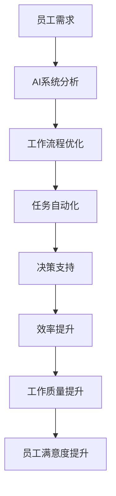
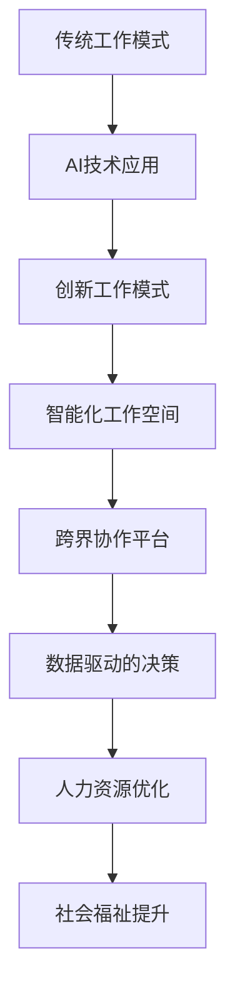
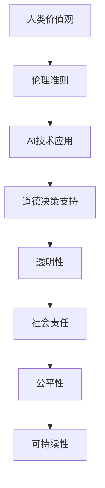

                 

### 《未来工作形态与AI共存的趋势》

#### 关键词：人工智能、工作形态、协作、创新、风险管理

#### 摘要：
本文深入探讨了未来工作形态与人工智能（AI）共存的趋势。通过回顾历史、分析当前形势，我们揭示了AI如何正在改变传统工作模式，创造新的就业机会和挑战。文章首先定义了核心概念，然后分章节详细阐述了AI与未来工作形态的各个维度，包括技术原理、应用实例、人力资源管理和团队协作。此外，我们还探讨了AI驱动的教育和未来工作形态的风险管理。最后，文章提出了对未来工作形态的展望，并讨论了全球范围内的趋势与启示。通过这些分析，我们希望能够为读者提供一个全面、深入的视角，理解AI与未来工作形态的紧密联系，以及如何应对其中的机遇与挑战。

### 《未来工作形态与AI共存的趋势》目录大纲

#### 第一部分：背景与概述

##### 第1章：未来工作形态的演变
- **1.1 人类工作发展的历史回顾**
  - **1.1.1 工业革命与机械化**
  - **1.1.2 信息化时代的变革**
  - **1.1.3 当前数字化转型的趋势**

- **1.2 AI技术的发展与应用**
  - **1.2.1 AI的基本概念与分类**
  - **1.2.2 AI在各个行业的应用案例**

- **1.3 AI对工作形态的影响**
  - **1.3.1 AI对劳动力市场的影响**
  - **1.3.2 AI对职业发展的挑战与机遇**

##### 第2章：AI与未来工作形态的关系
- **2.1 AI与工作协同的原理**
  - **2.1.1 AI辅助工作流程**
  - **2.1.2 AI决策支持系统**

- **2.2 AI驱动的创新工作模式**
  - **2.2.1 智能化工作空间**
  - **2.2.2 跨领域协作平台**

- **2.3 AI与工作伦理的平衡**
  - **2.3.1 AI道德准则**
  - **2.3.2 人工智能治理框架**

#### 第二部分：AI驱动的未来工作实践

##### 第3章：AI在特定行业中的应用
- **3.1 AI在制造业的应用**
  - **3.1.1 智能制造系统**
  - **3.1.2 生产线的自动化升级**

- **3.2 AI在服务业的应用**
  - **3.2.1 智能客服系统**
  - **3.2.2 个性化服务推荐**

- **3.3 AI在医疗健康领域的应用**
  - **3.3.1 诊断辅助系统**
  - **3.3.2 健康数据分析**

##### 第4章：AI与人力资源管理
- **4.1 人才招聘与选拔**
  - **4.1.1 数据驱动的招聘策略**
  - **4.1.2 AI面试与评估系统**

- **4.2 员工培训与发展**
  - **4.2.1 智能培训平台**
  - **4.2.2 职业规划辅助系统**

- **4.3 绩效管理**
  - **4.3.1 数据驱动绩效评估**
  - **4.3.2 AI辅助绩效反馈系统**

##### 第5章：AI与团队合作
- **5.1 智能化团队协作平台**
  - **5.1.1 团队沟通与协作工具**
  - **5.1.2 自动化项目管理**

- **5.2 跨领域协作模式**
  - **5.2.1 智能化流程设计**
  - **5.2.2 跨界创新协作**

- **5.3 智能化员工关系管理**
  - **5.3.1 员工情感分析**
  - **5.3.2 智能化员工关怀**

##### 第6章：AI驱动的未来工作风险管理
- **6.1 AI伦理与法律风险**
  - **6.1.1 AI伦理标准制定**
  - **6.1.2 AI法律监管框架**

- **6.2 数据安全与隐私保护**
  - **6.2.1 数据加密与访问控制**
  - **6.2.2 AI隐私保护技术**

- **6.3 AI系统故障与应急响应**
  - **6.3.1 AI系统故障预测**
  - **6.3.2 故障应急响应机制**

##### 第7章：AI与未来工作教育的结合
- **7.1 AI驱动的教育模式**
  - **7.1.1 个性化学习平台**
  - **7.1.2 智能化教学辅助工具**

- **7.2 跨学科教育与人才培养**
  - **7.2.1 跨学科课程设计**
  - **7.2.2 AI教育创新实践**

- **7.3 未来工作技能培训**
  - **7.3.1 AI相关技能培训**
  - **7.3.2 职业转型与技能提升**

#### 第三部分：未来工作形态与AI共存的趋势展望

##### 第8章：未来工作形态的挑战与机遇
- **8.1 挑战分析**
  - **8.1.1 AI带来的就业冲击**
  - **8.1.2 工作技能的更新与适应**

- **8.2 机遇探索**
  - **8.2.1 创新工作模式的崛起**
  - **8.2.2 跨界融合与协同创新**

##### 第9章：未来工作社会的构建
- **9.1 AI与人文关怀的结合**
  - **9.1.1 智能化生活服务**
  - **9.1.2 人类价值观与人工智能的融合**

- **9.2 未来工作生态系统的构建**
  - **9.2.1 企业与员工的双赢模式**
  - **9.2.2 公共服务与AI的深度融合**

##### 第10章：全球视野下的未来工作形态
- **10.1 全球AI发展趋势**
  - **10.1.1 发达国家的AI战略**
  - **10.1.2 发展中国家的AI应用场景**

- **10.2 全球工作形态的比较与启示**
  - **10.2.1 各国工作形态的差异**
  - **10.2.2 国际经验与本土实践的融合**

##### 附录
- **附录 A：相关资源与参考文献**
- **附录 B：未来工作形态与AI共存的趋势图示**
  - **B.1 AI技术在工作中的应用流程图**
  - **B.2 未来工作形态的Mermaid流程图**
  - **B.3 AI与人类价值观融合的示意框图**

## 第一部分：背景与概述

### 第1章：未来工作形态的演变

#### 1.1 人类工作发展的历史回顾

**1.1.1 工业革命与机械化**

工业革命是人类历史上一次重大的社会变革，始于18世纪末，它不仅改变了生产力，也深刻影响了工作形态。在这一时期，蒸汽机和其他机械工具的广泛应用极大地提高了生产效率，使人类从繁重的体力劳动中解放出来。机械化的引入使得大量劳动力转向城市，工厂成为主要的就业场所。

- **生产效率提升**：机械化生产使得单位时间内的生产效率显著提高，工厂能够生产出大量的商品，满足了市场的需求。

- **工作分工细化**：随着机械化的发展，工作开始进一步细化，不同的工种和职能逐渐分离，从而提高了专业化的程度。

**1.1.2 信息化时代的变革**

20世纪末，计算机技术的飞速发展标志着信息化时代的到来。计算机和互联网的普及使得信息处理和传递变得更加快捷和高效，这再次推动了工作形态的变革。

- **信息化管理**：企业管理从传统的手工记录转向电子化，ERP（企业资源规划）系统和CRM（客户关系管理）系统的应用使得企业管理更加精细化和科学化。

- **远程办公**：互联网的普及带来了远程办公的兴起，员工不再需要每天到固定的办公地点工作，这为工作形态的灵活性提供了新的可能。

**1.1.3 当前数字化转型的趋势**

随着大数据、云计算、物联网等技术的不断成熟，数字化转型已经成为企业发展的必然趋势。数字化不仅改变了生产方式，也深刻影响了工作形态。

- **智能制造**：通过大数据分析和物联网技术，制造业实现了从生产到销售的全面智能化，使得生产流程更加高效和灵活。

- **智能化服务**：在服务业，人工智能和大数据技术被广泛应用于客户服务、个性化推荐等方面，提高了服务的质量和效率。

#### 1.2 AI技术的发展与应用

**1.2.1 AI的基本概念与分类**

人工智能（AI）是指由人制造出来的系统能够模拟、延伸和扩展人的智能，实现智能行为和决策。根据AI的智能程度，可以分为弱AI、强AI和超AI。

- **弱AI**：特定任务上的智能，如语音识别、图像识别等。
- **强AI**：具备人类所有智能能力的机器，目前尚未实现。
- **超AI**：超越人类智能的机器，属于理论探讨阶段。

**1.2.2 AI在各个行业的应用案例**

AI已经在多个行业得到了广泛应用，以下是一些典型的应用案例：

- **制造业**：AI技术用于生产线的自动化控制和智能检测，提高了生产效率和产品质量。
- **金融业**：通过AI进行风险评估、欺诈检测和智能投顾，提高了金融服务的效率和安全。
- **医疗健康**：AI在医学影像分析、疾病预测和个性化治疗方面显示出巨大的潜力。
- **零售业**：AI应用于智能推荐、客户行为分析和库存管理，优化了零售业务流程。

#### 1.3 AI对工作形态的影响

**1.3.1 AI对劳动力市场的影响**

AI的发展对劳动力市场产生了深远的影响。一方面，它创造了新的就业机会，如数据科学家、机器学习工程师等；另一方面，它也取代了某些传统的工作，如流水线工人、呼叫中心客服等。

- **就业机会**：AI推动了新技术的产生，需要大量专业人才进行开发和应用。
- **就业挑战**：自动化和智能化的应用可能使某些工作岗位消失，迫使劳动力进行职业转型。

**1.3.2 AI对职业发展的挑战与机遇**

AI不仅改变了劳动力市场，也带来了职业发展的新挑战和机遇。

- **挑战**：劳动力需要不断更新知识和技能，以适应AI带来的变革。
- **机遇**：AI技术为从业人员提供了新的工具和方法，提高了工作效率和创新能力。

### 第2章：AI与未来工作形态的关系

#### 2.1 AI与工作协同的原理

AI与工作的协同是通过智能化工具和系统能够辅助人类完成复杂的任务，提高工作效率和准确性。以下是一些关键原理：

**2.1.1 AI辅助工作流程**

AI可以通过自动化和优化工作流程，提高工作效率。例如，AI可以自动处理重复性任务，如数据录入、报告生成等，从而释放人力资源用于更有创造性的工作。

- **自动化任务处理**：使用机器人流程自动化（RPA）技术，AI可以模拟人类操作，完成数据录入、流程审批等任务。
- **工作流优化**：通过数据分析，AI可以识别流程中的瓶颈和优化机会，提出改进建议。

**2.1.2 AI决策支持系统**

AI可以提供数据分析和预测模型，为决策提供支持。例如，在销售预测、库存管理、市场分析等方面，AI可以提供基于数据的决策支持，帮助企业和个人做出更加明智的决策。

- **销售预测**：通过历史数据分析和市场趋势预测，AI可以帮助企业更好地规划销售策略。
- **库存管理**：AI可以分析库存数据，预测库存需求，优化库存水平，减少库存成本。

#### 2.2 AI驱动的创新工作模式

AI不仅能够辅助现有的工作模式，还能够驱动创新工作模式的出现。以下是一些创新工作模式的例子：

**2.2.1 智能化工作空间**

智能化工作空间通过物联网、AI等技术，使工作环境更加高效和舒适。例如，智能照明、智能空调和智能办公桌可以根据人的活动和需求自动调节，提高工作效率。

- **智能照明**：通过传感器检测环境光线，智能调节照明亮度，减少能耗。
- **智能空调**：根据室内温度和湿度自动调节，提供舒适的办公环境。

**2.2.2 跨领域协作平台**

跨领域协作平台通过AI技术实现不同领域专家之间的智能协作。例如，AI可以帮助医生、护士和患者之间的信息共享和协作，提高医疗服务的效率和质量。

- **智能医疗协作**：通过AI实现医生和护士之间的实时沟通和协作，提高医疗决策的准确性。
- **智能教育协作**：通过AI帮助教师和学生之间进行个性化学习和协作，提高教育效果。

#### 2.3 AI与工作伦理的平衡

AI的快速发展带来了工作伦理的新挑战。如何在利用AI提高工作效率的同时，保证工作伦理的平衡，是一个需要深入探讨的问题。

**2.3.1 AI道德准则**

AI道德准则是指在设计、开发和使用AI系统时，应遵循的一系列伦理规范。以下是一些关键准则：

- **公平性**：确保AI系统在处理数据和应用时，不歧视任何特定群体。
- **透明性**：AI系统的决策过程应该透明，便于用户理解和使用。

**2.3.2 人工智能治理框架**

人工智能治理框架是指通过法律、规范、标准等手段，对AI的开发、应用和管理进行监管和指导。以下是一些关键要素：

- **法律监管**：制定相关法律，规范AI的开发和应用，确保其符合伦理和法律规定。
- **行业标准**：建立行业标准，推动AI技术的规范化和标准化。

### 总结

本章通过对人类工作发展历史的回顾，AI技术的发展与应用，以及AI对工作形态的影响进行了深入探讨。AI不仅改变了传统的生产方式和工作流程，还推动了创新工作模式的出现。然而，AI的发展也带来了伦理和治理方面的新挑战。在未来的发展中，如何平衡AI与工作伦理的关系，将是决定未来工作形态走向的重要因素。

## 第一部分：背景与概述

### 第3章：AI驱动的未来工作实践

#### 3.1 AI在特定行业中的应用

AI技术的快速发展使其在多个行业中得到了广泛应用，显著提升了行业的工作效率和服务质量。以下将重点介绍AI在制造业、服务业和医疗健康领域的具体应用。

**3.1.1 AI在制造业的应用**

随着智能制造的兴起，AI技术在制造业中扮演着越来越重要的角色。通过使用AI，制造商能够实现生产线的自动化和智能化。

- **智能制造系统**：AI技术被用于生产线的自动化控制，包括机器视觉、机器人操作和自适应控制系统。例如，机器视觉系统可以实时监测产品质量，机器人可以进行自动化装配和搬运，自适应控制系统可以根据实时数据调整生产参数。

  **Mermaid流程图**：
  ```mermaid
  graph TD
  A[原料进入] --> B[检测原料质量]
  B -->|合格| C[加工处理]
  B -->|不合格| D[原料回收]
  C --> E[成品检测]
  E -->|合格| F[成品入库]
  E -->|不合格| C[重新加工]
  ```

- **生产线的自动化升级**：AI技术可以帮助制造商对生产线进行自动化升级，减少人力成本和提高生产效率。例如，通过引入智能传感器和执行器，生产线可以实现自适应调整，以适应不同的生产需求。

  **伪代码示例**：
  ```python
  def automate_production_line(raw_material, product Requirement):
      if check_quality(raw_material):
          process_product(raw_material)
          if check_final_product(product):
              return "Product Passed"
          else:
              return "Product Rejected, Needs Re-work"
      else:
          return "Raw Material Rejected, Needs Rejection"
  ```

**3.1.2 AI在服务业的应用**

在服务业，AI技术被广泛应用于客户服务、个性化服务和数据分析等方面，大大提升了服务质量和客户体验。

- **智能客服系统**：通过自然语言处理（NLP）和机器学习技术，智能客服系统能够自动解答客户问题，提供即时的客户支持。这些系统可以处理大量的客户请求，减少人工客服的工作量，提高响应速度。

  **Mermaid流程图**：
  ```mermaid
  graph TD
  A[Customer Query] --> B[AI Analysis]
  B -->|Known Query| C[Automated Response]
  B -->|Unknown Query| D[Pass to Human Agent]
  C --> E[Query Solved]
  ```

- **个性化服务推荐**：AI技术可以通过分析用户的历史数据和偏好，提供个性化的产品推荐和服务建议。例如，电子商务平台可以通过用户购买记录和浏览行为，推荐可能感兴趣的商品。

  **伪代码示例**：
  ```python
  def personalized_recommendation(user_history, product_catalog):
      similar_products = find_similar_products(user_history, product_catalog)
      return random.sample(similar_products, k=3)
  ```

**3.1.3 AI在医疗健康领域的应用**

AI技术在医疗健康领域展现出巨大的潜力，特别是在疾病诊断、个性化治疗和健康数据分析等方面。

- **诊断辅助系统**：AI可以分析医学影像和实验室数据，辅助医生进行疾病诊断。例如，使用深度学习算法，AI可以自动识别和分类医学影像中的病变区域，提高诊断的准确性和效率。

  **Mermaid流程图**：
  ```mermaid
  graph TD
  A[Medical Image] --> B[AI Processing]
  B --> C[Lesion Detection]
  C --> D[Diagnosis Suggestion]
  ```

- **健康数据分析**：通过分析大量健康数据，AI可以预测疾病风险和健康趋势。例如，利用机器学习模型，AI可以对个人健康数据进行分析，提供个性化的健康建议和预防措施。

  **伪代码示例**：
  ```python
  def predict_disease_risk(health_data):
      model = train_model(health_data)
      risk_score = model.predict(health_data)
      return risk_score
  ```

#### 3.2 AI驱动的创新工作模式

AI不仅改变了现有的工作模式，还推动了创新工作模式的出现。这些创新工作模式通过AI技术的应用，提高了工作效率和创新能力。

**3.2.1 智能化工作空间**

智能化工作空间通过物联网（IoT）和AI技术，为员工提供了一个更加高效、舒适的工作环境。智能化工作空间包括智能照明、智能空调、智能办公桌等设备，这些设备可以根据员工的实时需求自动调节，提高工作效率和舒适度。

- **智能照明**：通过传感器检测员工的活动，智能照明系统可以自动调节照明亮度，减少能源浪费，提高员工的舒适度。
- **智能空调**：根据室内温度和湿度自动调节，为员工提供一个舒适的办公环境，提高工作效率。

**3.2.2 跨领域协作平台**

跨领域协作平台通过AI技术实现不同领域专家之间的智能协作，提高了协作效率和创新能力。这些平台通常包括智能会议系统、智能文档管理和智能知识库等。

- **智能会议系统**：通过自然语言处理和语音识别技术，智能会议系统能够自动记录会议内容，生成会议纪要，并辅助会议决策。
- **智能文档管理**：通过机器学习和自然语言处理技术，智能文档管理系统可以自动分类、索引和搜索文档，提高文档管理的效率。

**3.2.3 AI驱动的创新工作流程**

AI驱动的创新工作流程通过自动化和智能化工具，优化了工作流程，提高了工作效率和准确性。这些工作流程可以应用于多个领域，如项目管理、供应链管理和客户服务。

- **项目管理**：通过AI技术，项目管理者可以实时监控项目进展，预测项目风险，并提供优化建议，提高项目管理效率。
- **供应链管理**：通过AI技术，供应链管理者可以实时分析供应链数据，优化库存管理，减少物流成本，提高供应链效率。

#### 3.3 AI与工作伦理的平衡

随着AI在各个领域的广泛应用，如何平衡AI与工作伦理的关系成为一个重要议题。以下是一些关键准则和措施：

**3.3.1 AI道德准则**

AI道德准则是确保AI技术设计、开发和应用的伦理规范。以下是一些关键准则：

- **公平性**：确保AI系统在处理数据和决策时，不歧视任何特定群体。
- **透明性**：AI系统的决策过程应该透明，用户可以理解AI的决策依据。
- **可解释性**：对于复杂的AI模型，应该提供可解释性，帮助用户理解AI的决策逻辑。

**3.3.2 人工智能治理框架**

人工智能治理框架是通过法律、规范、标准等手段，对AI的开发、应用和管理进行监管和指导。以下是一些关键要素：

- **法律监管**：制定相关法律，规范AI的开发和应用，确保其符合伦理和法律规定。
- **行业标准**：建立行业标准，推动AI技术的规范化和标准化。

#### 总结

本章详细介绍了AI在制造业、服务业和医疗健康领域的具体应用，展示了AI如何改变传统工作模式，推动创新工作模式的出现。同时，也探讨了AI与工作伦理的平衡问题，提出了相应的道德准则和治理框架。通过这些讨论，我们可以更好地理解AI在未来工作实践中的重要作用。

### 第二部分：AI驱动的未来工作实践

#### 第4章：AI与人力资源管理

随着人工智能技术的发展，人力资源管理领域也发生了深刻的变革。AI技术不仅在人才招聘、选拔和绩效管理中发挥了重要作用，还在员工培训和发展中提供了创新的方法。以下将详细探讨这些方面。

**4.1 人才招聘与选拔**

**4.1.1 数据驱动的招聘策略**

传统的招聘策略主要依赖于面试官的主观判断和经验。而AI技术的引入，使得招聘过程更加科学和高效。数据驱动的招聘策略通过分析大量的历史招聘数据，包括职位要求、候选人背景、面试结果等，为招聘决策提供依据。

- **招聘流程优化**：AI可以通过自然语言处理（NLP）技术，自动解析职位描述，识别关键技能和职位要求。同时，AI还可以对候选人的简历进行筛选，识别出符合职位要求的候选人。

  **伪代码示例**：
  ```python
  def resume_screening(resume, job_description):
      required_skills = extract_skills(job_description)
      resume_skills = extract_skills(resume)
      common_skills = set(required_skills).intersection(set(resume_skills))
      return len(common_skills) > 0
  ```

- **面试评估**：AI可以通过视频面试分析技术，对候选人的非语言行为进行分析，包括语音语调、面部表情和身体语言等，从而提供更加全面的面试评估。

  **Mermaid流程图**：
  ```mermaid
  graph TD
  A[Video Interview] --> B[NLP Analysis]
  B --> C[Speech Analysis]
  C --> D[Emotion Analysis]
  D --> E[Overall Assessment]
  ```

**4.1.2 AI面试与评估系统**

AI面试系统通过模拟面试官的角色，对候选人进行自动化面试。这些系统通常包括自然语言处理、语音识别和机器学习等技术。

- **自动化面试流程**：AI面试系统可以提供一系列预设的问题，通过自然语言处理技术理解候选人的回答，并根据回答的内容和语气进行评分。

  **伪代码示例**：
  ```python
  def interview_candidate(candidate, questions):
      scores = []
      for question in questions:
          answer = get_answer(candidate, question)
          score = evaluate_answer(answer)
          scores.append(score)
      return sum(scores) / len(scores)
  ```

- **个性化面试问题**：AI可以根据候选人的简历和在线行为，生成个性化的面试问题，提高面试的针对性。

  **Mermaid流程图**：
  ```mermaid
  graph TD
  A[Resume and Online Behavior] --> B[Generate Interview Questions]
  B --> C[Ask Questions]
  C --> D[Evaluate Responses]
  ```

**4.2 员工培训与发展**

**4.2.1 智能培训平台**

智能培训平台通过AI技术，为员工提供个性化的培训方案，提高培训效果。这些平台通常包括学习管理系统、自适应学习技术和自然语言处理技术。

- **个性化学习**：AI可以根据员工的学习历史和技能水平，推荐最适合的学习资源和课程。这种个性化的学习方式可以大大提高学习效率。

  **伪代码示例**：
  ```python
  def recommend_course(employee_skills, available_courses):
      suitable_courses = []
      for course in available_courses:
          common_skills = set(employee_skills).intersection(set(course_required_skills))
          if len(common_skills) > 0:
              suitable_courses.append(course)
      return random.sample(suitable_courses, k=3)
  ```

- **自适应学习**：AI可以根据员工的学习进度和效果，自动调整学习内容和节奏，确保员工能够及时掌握所需的技能。

  **Mermaid流程图**：
  ```mermaid
  graph TD
  A[Learning Progress] --> B[AI Analysis]
  B --> C[Adjust Learning Content]
  C --> D[Optimize Learning Experience]
  ```

**4.2.2 职业规划辅助系统**

AI技术还可以帮助员工进行职业规划，提供职业发展建议。职业规划辅助系统通过分析员工的工作表现、技能水平和市场趋势，为员工提供个性化的职业发展路径。

- **职业评估**：AI可以根据员工的工作表现和技能，评估其职业发展潜力，并提供相应的职业发展建议。

  **伪代码示例**：
  ```python
  def career_evaluation(employee_performance, skill_set, market_trends):
      potential_scores = calculate_potential(employee_performance, skill_set, market_trends)
      recommended_courses = get_recommended_courses(potential_scores)
      return recommended_courses
  ```

- **职业路径规划**：AI可以帮助员工规划职业路径，提供不同职业发展选项，并分析每个选项的优劣势，帮助员工做出明智的职业决策。

  **Mermaid流程图**：
  ```mermaid
  graph TD
  A[Employee Data] --> B[AI Analysis]
  B --> C[Career Options]
  C --> D[Recommendation]
  ```

**4.3 绩效管理**

**4.3.1 数据驱动绩效评估**

传统的绩效评估主要依赖于主观评价和定期的评估会议。而AI技术通过数据分析和机器学习，可以提供更加客观和准确的绩效评估。

- **绩效数据收集**：AI可以通过各种数据源，包括员工的工作表现、客户反馈、项目进展等，收集绩效数据。

  **伪代码示例**：
  ```python
  def collect_performance_data(employee, project):
      performance_data = get_project_data(project)
      customer_feedback = get_customer_feedback(project)
      return performance_data + customer_feedback
  ```

- **绩效评分模型**：AI可以通过机器学习算法，建立绩效评分模型，自动对员工的绩效进行评分。

  **伪代码示例**：
  ```python
  def performance_evaluation(employee, model):
      performance_score = model.predict(employee_data)
      return performance_score
  ```

**4.3.2 AI辅助绩效反馈系统**

AI辅助绩效反馈系统可以通过自然语言处理和机器学习技术，为员工提供个性化的绩效反馈。

- **反馈生成**：AI可以根据员工的绩效数据和评估模型，生成个性化的绩效反馈报告，帮助员工了解自己的优势和改进点。

  **伪代码示例**：
  ```python
  def generate_feedback(employee, model):
      feedback = "Your performance in this quarter was: "
      feedback += model.performance_evaluation(employee)
      return feedback
  ```

- **反馈互动**：AI还可以与员工进行互动，回答员工的疑问，并提供进一步的改进建议。

  **Mermaid流程图**：
  ```mermaid
  graph TD
  A[Employee Performance Data] --> B[AI Analysis]
  B --> C[Generate Feedback]
  C --> D[Employee Interaction]
  ```

#### 总结

本章详细介绍了AI技术在人力资源管理中的应用，包括数据驱动的招聘策略、AI面试与评估系统、智能培训平台、职业规划辅助系统以及数据驱动的绩效评估。这些AI驱动的工具和方法不仅提高了人力资源管理的工作效率，也为员工提供了更好的职业发展机会。然而，AI在人力资源管理中的应用也带来了新的挑战，如数据隐私保护、算法偏见和伦理问题。在未来的发展中，如何平衡技术进步与伦理规范，将是人力资源管理领域面临的重要课题。

### 第二部分：AI驱动的未来工作实践

#### 第5章：AI与团队合作

在AI技术日益普及的背景下，团队合作模式也在经历深刻的变革。AI不仅可以提高团队协作效率，还能推动跨领域协作和创新。本章将重点探讨AI在团队合作中的应用，包括智能化团队协作平台、跨领域协作模式和智能化员工关系管理。

#### 5.1 智能化团队协作平台

智能化团队协作平台通过整合多种AI技术，如自然语言处理（NLP）、机器学习和自动化流程，为团队成员提供高效、智能的协作工具。

**5.1.1 团队沟通与协作工具**

AI驱动的团队沟通与协作工具可以大大提高团队协作的效率。以下是一些具体应用：

- **智能会议助手**：通过语音识别和NLP技术，智能会议助手可以实时转录会议内容，生成会议纪要，并跟踪任务分配和进度。

  **伪代码示例**：
  ```python
  def transcribe_meeting(meeting_notes):
      transcript = recognize_speech(meeting_notes)
      summary = generate_summary(transcript)
      return summary
  ```

- **智能任务管理**：AI可以帮助团队管理者自动分配任务，跟踪任务进度，并提供任务提醒和反馈。

  **Mermaid流程图**：
  ```mermaid
  graph TD
  A[Task Assignment] --> B[AI Processing]
  B --> C[Task Distribution]
  C --> D[Task Tracking]
  D --> E[Alerts and Feedback]
  ```

- **智能文档协作**：AI可以自动分类和索引文档，提供实时协作和版本控制功能，确保团队成员能够及时访问和更新文档。

  **伪代码示例**：
  ```python
  def document协作(documents):
      categorized_documents = classify_documents(documents)
      updated_documents = merge_documents(categorized_documents)
      return updated_documents
  ```

**5.1.2 自动化项目管理**

AI在项目管理中的应用可以帮助团队更有效地规划和执行项目。以下是一些关键功能：

- **进度预测**：AI可以通过历史数据分析和预测模型，预测项目进度和可能的延误，帮助团队提前制定应对策略。

  **伪代码示例**：
  ```python
  def predict_project_progress(project_data):
      progress_model = train_model(project_data)
      predicted_progress = progress_model.predict(project_data)
      return predicted_progress
  ```

- **风险识别与管理**：AI可以通过数据分析，识别项目中的潜在风险，并提供相应的风险管理建议。

  **Mermaid流程图**：
  ```mermaid
  graph TD
  A[Project Data] --> B[AI Analysis]
  B --> C[Risk Identification]
  C --> D[Risk Management]
  ```

#### 5.2 跨领域协作模式

跨领域协作模式通过AI技术实现不同领域专家之间的智能协作，推动跨界创新和协同发展。

**5.2.1 智能化流程设计**

智能化流程设计利用AI技术优化跨领域工作流程，提高协作效率。以下是一些关键步骤：

- **流程分析**：AI可以通过数据分析，识别现有流程中的瓶颈和优化机会，提出改进建议。

  **伪代码示例**：
  ```python
  def analyze_process流程(process_data):
      bottlenecks = identify_bottlenecks(process_data)
      optimization_suggestions = generate_suggestions(bottlenecks)
      return optimization_suggestions
  ```

- **流程自动化**：AI可以帮助自动化跨领域的工作流程，减少人工干预，提高流程的稳定性和效率。

  **Mermaid流程图**：
  ```mermaid
  graph TD
  A[Process Data] --> B[AI Analysis]
  B --> C[Automation Rules]
  C --> D[Automated Process]
  ```

**5.2.2 跨界创新协作**

跨界创新协作通过AI技术实现不同领域专家之间的智能协作，推动创新和合作。以下是一些关键策略：

- **智能知识库**：AI可以构建跨领域的智能知识库，为团队成员提供全面的知识支持，促进创新思维。

  **伪代码示例**：
  ```python
  def build_knowledge_base(domain_data):
      knowledge_base = aggregate_data(domain_data)
      return knowledge_base
  ```

- **智能协作平台**：AI驱动的协作平台可以提供实时沟通、协作和知识共享功能，支持跨界创新项目的执行。

  **Mermaid流程图**：
  ```mermaid
  graph TD
  A[Collaboration Platform] --> B[Real-time Communication]
  B --> C[Intelligent Knowledge Sharing]
  C --> D[Innovation Project Execution]
  ```

#### 5.3 智能化员工关系管理

智能化员工关系管理通过AI技术，改善员工关系，提高员工满意度和工作效率。

**5.3.1 员工情感分析**

员工情感分析利用AI技术，分析员工在工作中的情感状态，提供针对性的关怀和支持。

- **情感识别**：AI可以通过自然语言处理和语音识别技术，识别员工的情感状态，如焦虑、高兴或疲劳。

  **伪代码示例**：
  ```python
  def identify_employee_sentiment(speech):
      sentiment = analyze_speech(speech)
      return sentiment
  ```

- **情感反馈**：AI可以提供情感反馈，帮助员工了解自己的情感状态，并提供相应的建议和支持。

  **Mermaid流程图**：
  ```mermaid
  graph TD
  A[Employee Speech] --> B[NLP Analysis]
  B --> C[Sentiment Recognition]
  C --> D[Feedback and Support]
  ```

**5.3.2 智能化员工关怀**

智能化员工关怀通过AI技术，为员工提供个性化的关怀和支持，提高员工满意度和工作效率。

- **个性化建议**：AI可以根据员工的工作表现和需求，提供个性化的健康、学习和职业发展建议。

  **伪代码示例**：
  ```python
  def provide_personalized_advice(employee_data):
      advice = generate_advice(employee_data)
      return advice
  ```

- **智能关怀平台**：AI驱动的关怀平台可以提供实时关怀和支持，如健康提醒、心理辅导和职业咨询。

  **Mermaid流程图**：
  ```mermaid
  graph TD
  A[Employee Data] --> B[AI Analysis]
  B --> C[Personalized Care]
  C --> D[Real-time Support]
  ```

#### 总结

本章详细探讨了AI在团队合作中的应用，包括智能化团队协作平台、跨领域协作模式和智能化员工关系管理。AI技术不仅提高了团队协作效率，还推动了跨界创新和智能化员工关怀。在未来的工作中，随着AI技术的不断进步，团队合作模式将更加智能化和人性化，为员工和企业带来更大的价值。

### 第二部分：AI驱动的未来工作实践

#### 第6章：AI驱动的未来工作风险管理

在AI技术广泛应用于各个领域的背景下，未来工作风险管理也面临新的挑战和机遇。AI技术不仅带来了生产效率的提升，也引发了伦理、法律和数据安全等方面的风险。本章将重点讨论AI伦理与法律风险、数据安全与隐私保护，以及AI系统故障与应急响应。

#### 6.1 AI伦理与法律风险

**6.1.1 AI伦理标准制定**

AI伦理标准是确保AI技术发展符合伦理规范的重要基石。以下是一些关键的伦理准则：

- **公平性**：确保AI系统在处理数据和决策时，不歧视任何特定群体，如种族、性别和年龄。

  **Mermaid流程图**：
  ```mermaid
  graph TD
  A[Data Input] --> B[AI Processing]
  B --> C[Decision Making]
  C --> D[Fairness Check]
  D --> E[Output]
  ```

- **透明性**：确保AI系统的决策过程透明，用户可以理解AI的决策逻辑。

  **伪代码示例**：
  ```python
  def transparency_check(model, input_data):
      decision_reasons = model.explain(input_data)
      return decision_reasons
  ```

- **责任性**：明确AI系统的责任归属，确保在出现错误或损害时，能够追究相应的责任。

  **Mermaid流程图**：
  ```mermaid
  graph TD
  A[System Failure] --> B[Error Analysis]
  B --> C[Responsibility Assignment]
  C --> D[Compensation]
  ```

**6.1.2 AI法律监管框架**

AI的法律监管框架是保障AI技术合法、合规发展的重要手段。以下是一些关键的法律监管措施：

- **立法规范**：制定相关法律，明确AI技术的应用范围和责任，确保AI系统的合法使用。

  **伪代码示例**：
  ```python
  def is_legal(ai_system, regulations):
      return ai_system.compliance_with(regulations)
  ```

- **行业标准**：建立行业标准，推动AI技术的规范化和标准化，提高AI系统的可靠性和安全性。

  **Mermaid流程图**：
  ```mermaid
  graph TD
  A[AI Development] --> B[Standardization]
  B --> C[Standard Compliance]
  C --> D[Quality Assurance]
  ```

- **司法审查**：建立AI系统的司法审查机制，确保在出现纠纷时，能够进行公正的司法裁决。

  **伪代码示例**：
  ```python
  def legal_review(ai_system, case):
      decision = adjudicate_case(case, ai_system)
      return decision
  ```

#### 6.2 数据安全与隐私保护

**6.2.1 数据加密与访问控制**

数据加密和访问控制是保障数据安全的重要措施。以下是一些关键的技术手段：

- **数据加密**：使用加密算法对敏感数据进行加密，确保数据在传输和存储过程中不被未经授权的访问。

  **伪代码示例**：
  ```python
  def encrypt_data(data, key):
      encrypted_data = encrypt(data, key)
      return encrypted_data
  ```

- **访问控制**：通过身份验证和权限管理，确保只有授权用户可以访问特定的数据。

  **Mermaid流程图**：
  ```mermaid
  graph TD
  A[Authentication] --> B[Access Control]
  B --> C[Authorized Access]
  C --> D[Data Protection]
  ```

**6.2.2 AI隐私保护技术**

AI隐私保护技术是通过技术手段，确保AI系统的隐私保护。以下是一些关键的技术方法：

- **差分隐私**：通过在数据处理过程中添加噪声，保护个体的隐私信息。

  **伪代码示例**：
  ```python
  def apply_difference_privacy(data, privacy_budget):
      noisy_data = add_noise(data, privacy_budget)
      return noisy_data
  ```

- **匿名化技术**：通过匿名化处理，去除个人身份信息，保护个人隐私。

  **Mermaid流程图**：
  ```mermaid
  graph TD
  A[Personal Data] --> B[Anonymization]
  B --> C[Privacy Protection]
  ```

#### 6.3 AI系统故障与应急响应

**6.3.1 AI系统故障预测**

AI系统故障预测是通过技术手段，提前发现和预测系统可能出现的故障。以下是一些关键的技术方法：

- **故障监测**：通过实时监测系统运行状态，识别异常行为和潜在故障。

  **伪代码示例**：
  ```python
  def monitor_system_health(status_data):
      health_status = analyze_status_data(status_data)
      return health_status
  ```

- **故障预测模型**：使用历史故障数据，训练预测模型，提前预测系统可能的故障。

  **Mermaid流程图**：
  ```mermaid
  graph TD
  A[Historical Fault Data] --> B[Prediction Model]
  B --> C[Fault Prediction]
  ```

**6.3.2 故障应急响应机制**

故障应急响应机制是通过技术和管理手段，快速响应和解决系统故障。以下是一些关键的技术和管理措施：

- **应急计划**：制定详细的应急计划，包括故障响应流程、责任人分配和应急资源调配。

  **伪代码示例**：
  ```python
  def create_emergency_plan(fault_prediction):
      response_plan = generate_plan(fault_prediction)
      return response_plan
  ```

- **应急演练**：定期进行应急演练，提高团队对故障响应的能力和效率。

  **Mermaid流程图**：
  ```mermaid
  graph TD
  A[Emergency Training] --> B[Response Drills]
  B --> C[Emergency Response]
  ```

#### 总结

本章详细探讨了AI驱动的未来工作风险管理，包括AI伦理与法律风险、数据安全与隐私保护，以及AI系统故障与应急响应。这些讨论不仅有助于理解AI技术带来的挑战，也为应对这些挑战提供了具体的技术和管理措施。在未来的工作中，随着AI技术的不断进步，风险管理将变得更加重要，需要各方共同努力，确保AI技术的健康、可持续应用。

### 第二部分：AI驱动的未来工作实践

#### 第7章：AI与未来工作教育的结合

随着人工智能技术的飞速发展，教育领域也正在经历深刻的变革。AI不仅正在改变传统教育模式，还推动了个性化学习、跨学科教育与未来工作技能培训的兴起。本章将深入探讨AI技术在教育中的应用，以及如何通过AI实现教育模式的创新。

#### 7.1 AI驱动的教育模式

**7.1.1 个性化学习平台**

个性化学习平台利用AI技术，根据每个学生的学习历史、兴趣和需求，提供个性化的学习路径和资源。

- **自适应学习**：通过分析和理解学生的学习行为，AI可以动态调整学习内容和难度，确保每个学生都能以适合自己的速度学习。

  **伪代码示例**：
  ```python
  def adaptive_learning(student_data, course_content):
      learning_plan = generate_plan(student_data, course_content)
      return learning_plan
  ```

- **个性化推荐**：基于学生的兴趣和学习历史，AI可以推荐相关的学习资源，如视频、文章和练习题，帮助学生更高效地学习。

  **Mermaid流程图**：
  ```mermaid
  graph TD
  A[Student Data] --> B[AI Analysis]
  B --> C[Interest Identification]
  C --> D[Content Recommendation]
  ```

**7.1.2 智能化教学辅助工具**

智能化教学辅助工具通过AI技术，帮助教师更有效地进行教学和课堂管理。

- **智能课堂管理**：AI可以自动记录课堂活动，生成学生参与度和学习进度的报告，帮助教师及时了解学生的学习情况。

  **伪代码示例**：
  ```python
  def classroom_management(课堂数据):
      participation_report = generate_report(课堂数据)
      return participation_report
  ```

- **智能评分系统**：AI可以自动评估学生的作业和考试，提供即时的反馈，减少教师的评分负担。

  **Mermaid流程图**：
  ```mermaid
  graph TD
  A[Student Work] --> B[AI Assessment]
  B --> C[Immediate Feedback]
  ```

#### 7.2 跨学科教育与人才培养

**7.2.1 跨学科课程设计**

跨学科课程设计通过整合不同学科的知识和技能，培养学生的综合能力和创新能力。

- **知识整合**：AI可以帮助设计跨学科的实验课程和项目，通过数据分析、机器学习等技术的应用，提高学生的实践能力和创新思维。

  **伪代码示例**：
  ```python
  def interdisciplinary_course_design(courses):
      integrated_content = combine_courses(courses)
      return integrated_content
  ```

- **创新能力培养**：AI可以提供模拟实验和环境，让学生在真实或模拟的场景中应用跨学科知识，培养解决问题的能力。

  **Mermaid流程图**：
  ```mermaid
  graph TD
  A[Interdisciplinary Knowledge] --> B[AI Simulation]
  B --> C[Innovation Practice]
  ```

**7.2.2 AI教育创新实践**

AI教育创新实践是指通过AI技术，推动教育模式的创新和变革。

- **在线教育平台**：AI可以构建智能化的在线教育平台，提供个性化的学习体验，支持学生自主学习。

  **伪代码示例**：
  ```python
  def online_education_platform(student_data, course_list):
      personalized_content = generate_content(student_data, course_list)
      return personalized_content
  ```

- **虚拟现实（VR）与增强现实（AR）教育**：AI可以结合VR和AR技术，提供沉浸式的学习体验，增强学生的学习效果。

  **Mermaid流程图**：
  ```mermaid
  graph TD
  A[VR/AR Technology] --> B[AI Integration]
  B --> C[Immersive Learning Experience]
  ```

#### 7.3 未来工作技能培训

**7.3.1 AI相关技能培训**

AI相关技能培训是指通过AI技术，为从业人员提供与AI应用相关的技能培训。

- **数据分析与机器学习**：AI可以提供数据分析与机器学习的在线课程和实训项目，帮助从业人员掌握相关技能。

  **伪代码示例**：
  ```python
  def ai_skill_training(employee_data, training_programs):
      trained_skills = complete_training(employee_data, training_programs)
      return trained_skills
  ```

- **智能系统操作**：AI可以提供智能系统的操作培训和模拟，帮助从业人员熟悉AI系统的使用。

  **Mermaid流程图**：
  ```mermaid
  graph TD
  A[AI System] --> B[Training Simulation]
  B --> C[Operational Proficiency]
  ```

**7.3.2 职业转型与技能提升**

职业转型与技能提升是指通过AI技术，帮助从业人员进行职业转型和技能提升。

- **职业规划辅助**：AI可以分析从业人员的工作历史和技能，提供个性化的职业规划建议。

  **伪代码示例**：
  ```python
  def career_planning(employee_data, job_market):
      career_path = generate_career_path(employee_data, job_market)
      return career_path
  ```

- **在线职业培训**：AI可以提供在线职业培训课程，支持从业人员随时随地学习，提升职业技能。

  **Mermaid流程图**：
  ```mermaid
  graph TD
  A[Employee Data] --> B[AI Analysis]
  B --> C[Training Recommendations]
  C --> D[Online Learning Platform]
  ```

#### 总结

本章详细探讨了AI与未来工作教育的结合，包括个性化学习平台、跨学科教育与人才培养，以及未来工作技能培训。通过AI技术的应用，教育模式正在发生深刻的变革，为学习者提供了更加个性化和高效的培训体验。在未来的教育发展中，AI技术的进一步应用将有助于培养具有创新能力和适应未来工作需求的人才。

### 第三部分：未来工作形态的挑战与机遇

#### 第8章：未来工作形态的挑战与机遇

在人工智能（AI）技术不断发展的背景下，未来工作形态正面临一系列新的挑战和机遇。这些挑战主要集中在就业冲击、工作技能的更新与适应，以及如何在新的工作环境中保持竞争力等方面。同时，AI也为工作模式带来了创新和变革的机遇，推动了跨界融合与协同创新。以下将对这些挑战和机遇进行详细分析。

#### 8.1 挑战分析

**8.1.1 AI带来的就业冲击**

AI技术的迅速发展在提高生产效率的同时，也引发了广泛的就业担忧。AI和自动化技术的应用正在取代一些重复性、低技能的工作，如生产线操作、数据录入和呼叫中心客服等。以下是一些具体影响：

- **劳动力需求减少**：自动化技术可以显著提高生产效率，减少对人工劳动力的需求。例如，智能制造系统通过机器人和AI技术实现了生产线的自动化，从而减少了流水线工人的需求。

  **Mermaid流程图**：
  ```mermaid
  graph TD
  A[Automated Production Line] --> B[Reduction in Labor Demand]
  ```

- **职业替代**：AI技术在许多行业中的应用，如金融、医疗和法律等，正在取代一些传统职业。例如，自动化交易系统和智能客服机器人正在减少对交易员和客服人员的需求。

  **伪代码示例**：
  ```python
  def job_replacement(occupations, automation_technology):
      affected_jobs = detect_affected_jobs(occupations, automation_technology)
      return affected_jobs
  ```

**8.1.2 工作技能的更新与适应**

随着AI技术的发展，工作技能的需求也在不断变化。从业人员需要不断更新知识和技能，以适应新的工作环境。以下是一些关键点：

- **新技能需求**：AI技术的普及要求从业人员掌握新的技能，如编程、数据分析和机器学习等。这些技能不仅提高了工作效率，还为从业人员提供了新的职业机会。

  **伪代码示例**：
  ```python
  def required_skills(occupation, ai_technology):
      updated_skills = calculate_updated_skills(occupation, ai_technology)
      return updated_skills
  ```

- **职业转型支持**：为了帮助从业人员进行职业转型，企业和教育机构需要提供相关的培训和资源。例如，提供在线课程、职业咨询和实习机会，帮助从业人员快速适应新的职业要求。

  **Mermaid流程图**：
  ```mermaid
  graph TD
  A[AI Technology] --> B[New Skill Requirements]
  B --> C[Professional Transformation Support]
  ```

#### 8.2 机遇探索

**8.2.1 创新工作模式的崛起**

AI技术的应用不仅改变了传统的工作模式，还推动了创新工作模式的崛起。以下是一些创新工作模式的例子：

- **远程办公**：AI技术和通信技术的发展，使得远程办公变得更加普及和高效。通过虚拟协作平台和AI工具，员工可以随时随地开展工作，提高了工作效率和灵活性。

  **伪代码示例**：
  ```python
  def remote_work_setup(employee, tools):
      remote_environment = setup_remote_environment(employee, tools)
      return remote_environment
  ```

- **智能工作空间**：智能化工作空间通过物联网和AI技术，提供了更加舒适和高效的工作环境。智能照明、智能空调和智能办公桌可以根据人的需求自动调节，提高了员工的工作舒适度和效率。

  **Mermaid流程图**：
  ```mermaid
  graph TD
  A[Smart Workspace] --> B[IoT and AI Integration]
  B --> C[Enhanced Work Efficiency]
  ```

**8.2.2 跨界融合与协同创新**

AI技术的应用不仅推动了单一行业的发展，还促进了不同行业之间的跨界融合和协同创新。以下是一些跨界融合的例子：

- **跨行业合作**：通过AI技术，不同行业的企业可以实现数据和资源的共享，推动创新和协同发展。例如，制造业和医疗行业的合作，通过AI技术实现智能诊断和生产线的自动化升级。

  **伪代码示例**：
  ```python
  def cross-industry_collaboration(Industry1, Industry2, AI_Technology):
      integrated_solution = generate_solution(Industry1, Industry2, AI_Technology)
      return integrated_solution
  ```

- **创新生态系统**：通过建立创新生态系统，企业、研究机构和投资者可以共同推动AI技术的发展和应用。这种生态系统提供了创新资源、技术和资金支持，促进了跨界合作和创新。

  **Mermaid流程图**：
  ```mermaid
  graph TD
  A[Innovation Ecosystem] --> B[Collaboration and Resources]
  B --> C[Innovation and Growth]
  ```

#### 总结

本章详细分析了未来工作形态面临的主要挑战和机遇。AI技术的发展带来了就业冲击和工作技能需求的更新，但同时也推动了创新工作模式的崛起和跨界融合。通过了解这些挑战和机遇，企业、从业人员和教育机构可以更好地应对未来的工作变革，抓住新的发展机会。

### 第三部分：未来工作社会的构建

#### 第9章：未来工作社会的构建

随着人工智能（AI）技术的不断进步，未来工作社会的构建面临着前所未有的机遇和挑战。在这一章节中，我们将探讨如何将AI与人文关怀结合，以实现企业与员工的双赢，以及如何通过AI技术的深度融合，构建一个高效、可持续的未来工作生态系统。

#### 9.1 AI与人文关怀的结合

**9.1.1 智能化生活服务**

AI技术不仅能够提高工作效率，还能够提升员工的生活质量。通过智能化生活服务，企业可以为员工提供更加便捷和舒适的工作环境，从而增强员工的幸福感和归属感。

- **智能健康管理**：AI可以通过分析员工的健康数据，提供个性化的健康建议和预警服务。例如，智能手环和健康监测系统可以实时跟踪员工的健康状况，提供健康报告和建议。

  **伪代码示例**：
  ```python
  def health_management(employee_health_data):
      health_report = generate_health_report(employee_health_data)
      personalized_advice = generate_health_advice(health_report)
      return personalized_advice
  ```

- **智能生活助手**：AI可以为企业员工提供智能生活助手服务，如自动预约医生、预订餐厅和电影院等，简化员工的生活安排。

  **Mermaid流程图**：
  ```mermaid
  graph TD
  A[Employee Life Needs] --> B[AI Assistant]
  B --> C[Service Booking]
  ```

**9.1.2 人类价值观与人工智能的融合**

在构建未来工作社会的过程中，必须确保AI技术与人类价值观的融合，以避免技术的滥用和对人类的负面影响。以下是一些关键措施：

- **伦理准则**：企业应制定AI伦理准则，确保AI系统的设计和应用符合伦理标准，不歧视任何群体，保护员工的隐私和权益。

  **伪代码示例**：
  ```python
  def ai_ethics(ethical_principles):
      ai_system = design_ai_system(ethical_principles)
      return ai_system
  ```

- **透明性和可解释性**：AI系统的决策过程应透明，确保员工理解AI的工作原理和决策依据，从而增强对AI的信任。

  **Mermaid流程图**：
  ```mermaid
  graph TD
  A[AI Decision-Making] --> B[Transparency]
  B --> C[Explanation]
  ```

#### 9.2 未来工作生态系统的构建

**9.2.1 企业与员工的双赢模式**

构建未来工作生态系统的一个核心目标是实现企业与员工的双赢。通过AI技术的应用，企业可以提高运营效率，员工可以获得更好的工作体验和发展机会。

- **人才发展计划**：企业可以通过AI技术，为员工提供个性化的职业发展路径和培训资源，帮助员工不断提升技能，实现职业成长。

  **伪代码示例**：
  ```python
  def talent_development(employee_data, training_programs):
      career_path = generate_career_path(employee_data, training_programs)
      return career_path
  ```

- **灵活的工作安排**：AI可以帮助企业实现更加灵活的工作安排，如远程办公、弹性工作时间和灵活的工作模式，提高员工的满意度和工作生活质量。

  **Mermaid流程图**：
  ```mermaid
  graph TD
  A[Employee Needs] --> B[AI-Supported Work Arrangement]
  B --> C[Enhanced Work-Life Balance]
  ```

**9.2.2 公共服务与AI的深度融合**

除了企业内部的应用，AI技术还可以与公共服务深度融合，为整个社会带来积极的影响。以下是一些关键领域：

- **智能公共管理**：通过AI技术，政府可以更高效地进行公共管理，如交通管理、城市规划和公共安全等。AI可以帮助预测和解决公共问题，提高政府服务的响应速度和效率。

  **伪代码示例**：
  ```python
  def smart_public_management(urban_data, public_services):
      optimized_services = optimize_public_services(urban_data, public_services)
      return optimized_services
  ```

- **社会服务创新**：AI技术可以用于社会服务创新，如健康医疗、教育和社会福利等领域。通过智能系统和数据分析，可以提供更加个性化和社会化的服务，提升社会福祉。

  **Mermaid流程图**：
  ```mermaid
  graph TD
  A[Social Services] --> B[AI Integration]
  B --> C[Innovation and Personalization]
  ```

#### 总结

未来工作社会的构建是一个复杂且多维度的过程，需要AI技术与人文关怀的紧密结合，以及企业、政府和社会各方的共同努力。通过实现企业与员工的双赢模式，以及公共服务与AI的深度融合，我们可以构建一个高效、可持续的未来工作生态系统，为所有人创造更美好的工作与生活环境。

### 第三部分：全球视野下的未来工作形态

#### 第10章：全球视野下的未来工作形态

在全球化的背景下，不同国家和地区在应对未来工作形态的变化方面有着各自的发展路径和特点。本章节将探讨全球AI发展趋势，以及各国工作形态的差异与启示。

#### 10.1 全球AI发展趋势

**10.1.1 发达国家的AI战略**

发达国家在AI技术的研究和应用方面处于领先地位，并制定了相应的国家战略，以推动AI技术的发展和产业应用。

- **美国**：美国通过“美国人工智能倡议”（AI Initiative），加大对AI基础研究和应用开发的投入，推动AI技术在国防、医疗、交通等关键领域的应用。

  **伪代码示例**：
  ```python
  def us_ai_strategy(research_funding, industry_application):
      advanced_research = allocate_funding_to_research(research_funding)
      industry_impact = promote_application_of_ai(advanced_research, industry_application)
      return industry_impact
  ```

- **欧盟**：欧盟通过“人工智能协调计划”（Coordinated AI Plan），强调AI的伦理、法律和社会影响，推动AI技术的可持续发展。

  **Mermaid流程图**：
  ```mermaid
  graph TD
  A[AI Ethics and Regulation] --> B[EU AI Strategy]
  B --> C[Ethical AI Development]
  ```

- **中国**：中国通过“新一代人工智能发展规划”，致力于加强AI基础研究、人才培养和应用创新，推动AI技术在经济、社会和军事等领域的广泛应用。

  **伪代码示例**：
  ```python
  def china_ai_strategy(technology_innovation, application推广):
      innovation_projects = implement_technology_innovation(technology_innovation)
      social_impact = promote_application_of_ai(innovation_projects, application推广)
      return social_impact
  ```

**10.1.2 发展中国家的AI应用场景**

发展中国家在AI技术的应用场景和战略规划方面具有一定的独特性，主要集中在提升生产效率和改善民生。

- **印度**：印度利用AI技术提升农业产量、优化交通管理和改善医疗服务。例如，AI驱动的农田监测系统可以帮助农民提高作物产量。

  **伪代码示例**：
  ```python
  def indian_ai_application(agrarian_data, traffic_management):
      agricultural_yield = optimize_agriculture(agrarian_data)
      traffic_flow = optimize_traffic_management(traffic_management)
      return agricultural_yield, traffic_flow
  ```

- **巴西**：巴西通过AI技术改善城市安全和医疗服务，例如，利用AI进行犯罪预测和医疗诊断，提高公共服务的效率和质量。

  **Mermaid流程图**：
  ```mermaid
  graph TD
  A[Public Safety and Healthcare] --> B[Brazil AI Application]
  B --> C[Crime Prediction]
  B --> D[Medical Diagnosis]
  ```

#### 10.2 全球工作形态的比较与启示

**10.2.1 各国工作形态的差异**

不同国家的工作形态受到其经济、文化、教育和技术水平等多方面因素的影响，呈现出显著的差异。

- **发达国家的特点**：发达国家通常具备较高的自动化和智能化水平，员工具备较高的技能和创新能力。同时，远程办公和灵活工作安排较为普及。

  **伪代码示例**：
  ```python
  def advanced_work_pattern(country, automation_level, employee_skills):
      efficient_output = assess_productivity(country, automation_level, employee_skills)
      return efficient_output
  ```

- **发展中国家的特点**：发展中国家在自动化和智能化水平上相对较低，劳动力成本较低，但技能水平相对较低。因此，这些国家的就业主要集中在劳动密集型行业。

  **Mermaid流程图**：
  ```mermaid
  graph TD
  A[Developing Countries] --> B[Low Automation]
  B --> C[Low Skill Level]
  B --> D[Labor Intensive Industries]
  ```

**10.2.2 国际经验与本土实践的融合**

各国在应对未来工作形态的变革过程中，可以相互借鉴国际经验，同时结合本土实际情况，探索适合自身的发展路径。

- **国际经验借鉴**：通过学习发达国家在AI技术研究和应用、人才引进和职业培训方面的成功经验，发展中国家可以提升自身的创新能力和发展水平。

  **伪代码示例**：
  ```python
  def adopt_international_best_practices(country, international_expertise):
      local_adaptation = integrate_international_practices(country, international_expertise)
      return local_adaptation
  ```

- **本土实践探索**：各国应根据自身的社会文化背景、经济状况和技术水平，制定符合本国国情的发展策略，推动AI技术的本土化应用。

  **Mermaid流程图**：
  ```mermaid
  graph TD
  A[International Experience] --> B[Local Practice Exploration]
  B --> C[Customized Development Strategies]
  ```

#### 总结

全球视野下的未来工作形态呈现出多样化的特点，发达国家和发展中国家在AI技术的应用和发展路径上存在明显差异。通过借鉴国际经验并结合本土实践，各国可以探索适合自身的发展路径，共同推动未来工作形态的积极变革。

## 附录

### 附录A：相关资源与参考文献

#### A.1 书籍推荐

- **《智能时代》** - 池小宁
  - 内容简介：详细介绍了人工智能的基本概念、技术发展和应用场景，适合初学者和专业人士阅读。
- **《深度学习》** - Goodfellow, Bengio, Courville
  - 内容简介：系统讲解了深度学习的基础理论和应用技术，是深度学习领域的经典教材。

#### A.2 论文精选

- **“Artificial Intelligence and the Future of Work”** - Autor, D. H.
  - 发表期刊：The Economic Journal
  - 内容简介：分析了AI对劳动力市场的影响，探讨了AI时代职业发展的挑战与机遇。
- **“The Economic Impact of Artificial Intelligence”** - Oxford Research Group
  - 内容简介：评估了AI技术对全球经济的潜在影响，提供了详细的数据和分析。

#### A.3 优秀案例研究

- **“AI in Manufacturing: A Case Study”** - Siemens AG
  - 内容简介：介绍了西门子在制造领域应用AI技术的具体案例，展示了AI如何提升生产效率和质量。
- **“AI in Healthcare: A Case Study”** - IBM Watson Health
  - 内容简介：展示了IBM Watson Health如何利用AI技术改善医疗服务，提高疾病诊断的准确性和效率。

### 附录B：未来工作形态与AI共存的趋势图示

#### B.1 AI技术在工作中的应用流程图



#### B.2 未来工作形态的Mermaid流程图



#### B.3 AI与人类价值观融合的示意框图



通过上述图示，我们能够更直观地理解未来工作形态与AI共存的趋势，以及AI技术在不同领域中的应用和影响。这些资源与图示不仅为本文提供了丰富的背景资料，也为读者提供了深入探索未来工作形态的路径。

