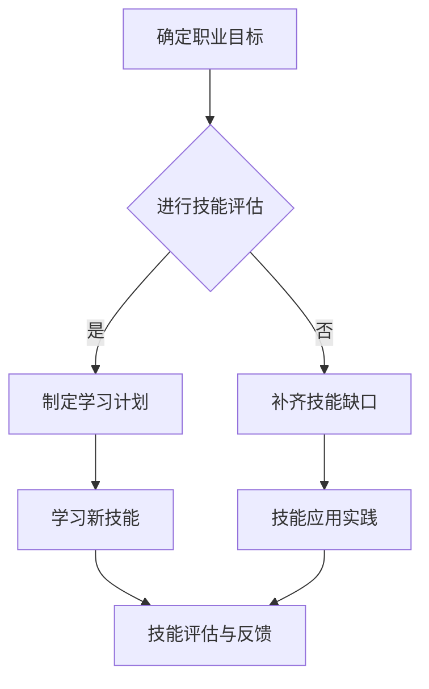
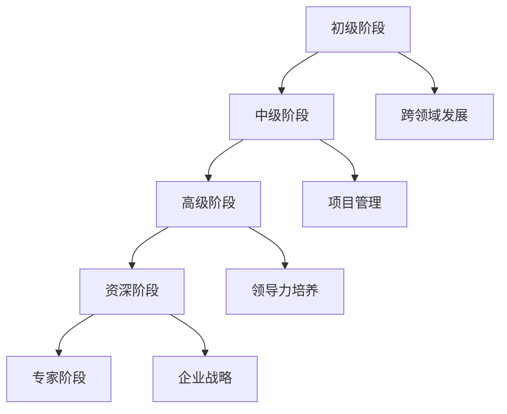
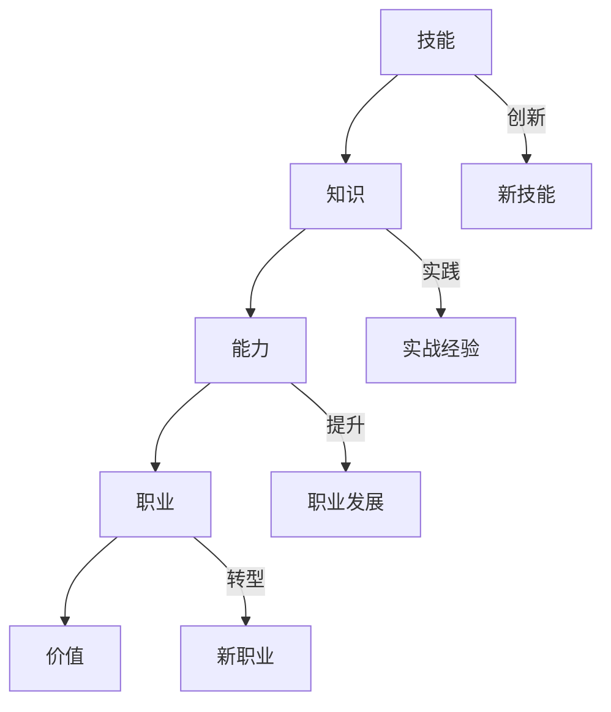

                 

## 未来工作：技能需求与培养

### 关键词
- 未来工作趋势
- 技能需求变化
- 技能培养方法
- 职业发展策略
- 跨界合作
- 新型教育与培训

### 摘要
本文深入探讨了未来工作的变革及其对技能需求与培养的深远影响。首先，我们分析了未来工作的总体概述，包括趋势、挑战与机遇。接着，我们探讨了技能需求的变化，重点讨论了数字技能、人际技能和创新能力的重要性。然后，我们分析了技能与职业的匹配，以及职业技能培养的方法与实践。最后，我们展望了技能与职业的未来趋势，并提供了实用的案例分析。通过本文，读者将能够更好地了解未来工作的技能需求与培养策略，为自己的职业发展做好准备。

### 第一部分：未来工作的变革与应对

在未来，工作将经历深刻的变革，这种变革不仅源于技术的进步，还受到社会、经济和环境等多方面因素的影响。本部分将深入探讨未来工作的总体概述，包括其趋势、挑战与机遇，以及这些变化对个人和组织的深远影响。

#### 第1章：未来工作的总体概述

##### 1.1 未来工作的趋势

1. **自动化与人工智能的兴起**

   自动化技术已经在许多行业广泛应用，而人工智能（AI）的快速发展进一步推动了这一趋势。未来，更多的重复性、危险性和需要高度精确的工作将自动化，从而提高生产效率和质量。

2. **全球化和远程工作的普及**

   随着互联网和通信技术的发展，全球化加速，远程工作成为可能。这为人们提供了更多的就业机会和职业发展空间，但也带来了新的挑战，如时区差异和文化沟通问题。

3. **新兴产业的崛起**

   新兴产业，如生物技术、新材料科学和可再生能源等，正在迅速发展。这些领域不仅创造了新的就业机会，还推动了传统行业的转型升级。

##### 1.2 未来工作的挑战

1. **技能需求的变化**

   随着技术的进步，工作所需的技能也在不断变化。传统的技能可能变得过时，而新的数字技能和创新能力变得至关重要。

2. **工作稳定性的降低**

   自动化和全球化可能导致某些职业的消失，从而增加了工作的不稳定性。个人需要具备持续学习和适应变化的能力。

3. **跨文化沟通的障碍**

   全球化和远程工作带来了跨文化沟通的需求。然而，文化差异和沟通障碍可能会影响团队协作和项目进展。

##### 1.3 未来工作的机遇

1. **创新与创业的兴起**

   技术的变革为创新和创业提供了广阔的空间。个人和组织可以通过创新来应对挑战，抓住新的商业机会。

2. **职业多样性与灵活性**

   未来工作将更加多样化，提供更多的职业选择。同时，灵活性将使个人能够更好地平衡工作与生活。

3. **新型教育与培训模式**

   在线教育和终身学习模式的发展，为个人提供了更多的学习机会，使他们能够随时提升自己的技能。

#### 第2章：技能需求的变化

##### 2.1 数字技能的重要性

1. **数据分析**

   数据分析是未来工作的核心技能之一。无论是商业决策、科学研究还是社会服务，数据分析都能提供有价值的信息。

2. **编程与软件开发**

   编程和软件开发技能在未来将越来越重要。这些技能不仅适用于传统的IT行业，还广泛应用于金融、医疗、制造等领域。

3. **云计算与大数据**

   云计算和大数据技术正在改变企业和组织的工作方式。掌握这些技术将使个人在职场中更具竞争力。

##### 2.2 人际技能的提升

1. **情绪智力**

   情绪智力是指理解和管理自己及他人情绪的能力。在未来工作中，情绪智力将帮助个人更好地处理人际关系，提高团队合作效率。

2. **领导力**

   领导力是未来工作中不可或缺的技能。领导力不仅关乎个人的职业发展，还影响团队和组织的效果。

3. **跨文化沟通能力**

   随着全球化的发展，跨文化沟通能力变得越来越重要。掌握这种能力将使个人在跨国工作中更加得心应手。

##### 2.3 创新与解决问题技能

1. **创造力**

   创造力是创新的核心。未来工作中，创造力将帮助个人和团队解决复杂问题，推动业务发展。

2. **批判性思维**

   批判性思维是一种分析、评估和解决问题的重要能力。在未来工作中，批判性思维将帮助个人更好地理解问题，并提出有效的解决方案。

3. **复杂问题解决能力**

   复杂问题解决能力是未来工作中不可或缺的技能。面对日益复杂的工作环境，个人需要具备解决复杂问题的能力。

#### 第3章：技能与职业的匹配

##### 3.1 职业发展的路径

1. **转型与升级**

   随着技能需求的变化，个人需要不断转型和升级自己的技能。这不仅可以应对职业发展的挑战，还能抓住新的机遇。

2. **多元化发展**

   多元化发展意味着个人可以在不同领域和行业之间转换职业。这种灵活性将使个人在职场中更具竞争力。

3. **新职业的出现**

   技术的进步和新兴产业的崛起将带来新的职业。掌握这些新兴领域的技能将成为未来职业发展的重要方向。

##### 3.2 跨界合作的机遇

1. **科技与艺术的融合**

   科技与艺术的融合将带来新的商业机会和创意。跨学科合作将成为未来工作的重要趋势。

2. **产业与学术的合作**

   产业与学术的合作将促进技术创新和知识转移。这种合作将使企业和机构在市场竞争中更具优势。

3. **社会创新与实践**

   社会创新与实践关注如何通过技术和创新来解决社会问题。这种跨界合作将为个人提供新的职业发展机会。

##### 3.3 职业教育的改革

1. **教育体系的重构**

   随着技能需求的变化，教育体系也需要重构。这种重构将更注重实践能力和创新思维的培养。

2. **终身学习的理念**

   终身学习将成为未来工作的重要组成部分。个人需要不断学习新技能，以适应不断变化的工作环境。

3. **实践与创新的结合**

   职业教育将更注重实践与创新的结合，使学生能够在真实的工作环境中锻炼技能，培养创新思维。

### 总结

未来工作将面临许多挑战和机遇。个人和组织需要积极应对这些变化，提升自身的技能和创新能力。通过转型、多元化发展和跨界合作，个人可以在未来职场上脱颖而出。同时，职业教育和终身学习理念的推广，将帮助人们更好地应对未来工作的需求。只有不断学习和适应变化，个人才能在未来的工作中取得成功。

### 第二部分：技能培养与职业发展

在未来的职场中，技能培养和职业发展将变得至关重要。个人和组织需要不断适应技能需求的变化，提升自身的竞争力。本部分将探讨技能培养的方法与实践，职业发展的策略，以及技能评估与认证的重要性。

#### 第4章：技能培养的方法与实践

##### 4.1 在职教育与培训

在职教育与培训是提升技能的重要途径。以下是一些常见的在职教育与实践方法：

1. **职业技能培训**

   技能培训旨在帮助个人掌握特定领域的专业技能。这种培训可以通过在线课程、研讨会和实地培训等形式进行。

2. **在职进修与学历教育**

   在职进修与学历教育为个人提供了进一步深造的机会。这种教育形式包括硕士学位、在职研究生课程等。

3. **跨界学习与交流**

   跨界学习与交流有助于个人拓宽视野，了解不同领域的最新动态。这种交流可以通过学术会议、行业论坛和跨学科项目等形式进行。

##### 4.2 技能提升的路径

1. **项目实战**

   项目实战是提升技能的有效方法。通过实际参与项目，个人可以锻炼解决问题的能力，提高实践经验。

2. **技术竞赛与认证**

   技术竞赛和认证可以检验个人的技能水平，并为职业发展提供有力的证明。这种认证可以是国际认可的证书，如PMP（项目管理专业人士认证）或CISSP（信息系统安全专家认证）。

3. **跨学科研究与合作**

   跨学科研究与合作有助于个人掌握多领域的知识，提高创新能力。这种合作可以通过跨学科研究项目、学术研讨会和合作研究等形式进行。

##### 4.3 技能评估与认证

1. **技能标准与评价体系**

   技能评估与认证需要有明确的技能标准和评价体系。这种标准可以是国际通用的，如IEEE（电气和电子工程师协会）的标准，也可以是行业特定的标准。

2. **国际认证与资质认证**

   国际认证与资质认证为个人提供了全球认可的技能证明。这种认证有助于个人在全球职场中脱颖而出。

3. **企业内部评估体系**

   企业内部评估体系可以帮助企业更好地了解员工的技能水平，为员工提供个性化的培训和发展计划。

#### 第5章：职业发展的策略

职业发展需要明确的策略和规划。以下是一些职业发展的策略：

##### 5.1 职业规划与个人品牌建设

1. **职业目标设定**

   设定清晰的职业目标是职业发展的第一步。个人需要明确自己的职业愿景，并制定实现目标的步骤。

2. **个人品牌塑造**

   个人品牌是职业发展的重要资产。通过建立个人品牌，个人可以在职场中脱颖而出，获得更多机会。

3. **职业网络的拓展**

   职业网络为个人提供了交流、学习和合作的机会。通过拓展职业网络，个人可以获取更多资源和信息。

##### 5.2 职业晋升与领导力培养

1. **晋升路径与策略**

   职业晋升需要有明确的路径和策略。个人需要了解企业的晋升机制，并制定相应的晋升计划。

2. **领导力的培养**

   领导力是职业发展的重要能力。个人可以通过培训、阅读和实践来提升自己的领导力。

3. **团队管理与激励**

   团队管理是领导力的重要组成部分。个人需要掌握团队管理技能，以有效地激励和引导团队。

##### 5.3 职业转型的策略

1. **转型评估与规划**

   职业转型需要评估自身的技能和市场需求，制定详细的转型计划。

2. **跨界发展的探索**

   跨界发展为个人提供了新的职业机会。个人可以通过学习新技能和建立新网络来探索跨界发展的可能性。

3. **新职业领域的探索**

   新职业领域不断涌现，个人需要关注这些领域，并尝试在这些领域发展自己的职业。

#### 第6章：技能评估与认证的重要性

技能评估与认证在个人职业发展中具有重要地位。以下是一些关键点：

1. **技能证明**

   技能评估与认证为个人提供了技能证明，有助于提升职业竞争力。

2. **职业发展机会**

   技能评估与认证为个人打开了更多的职业发展机会，包括晋升、换岗和跨行业就业。

3. **职业认可**

   技能评估与认证得到了行业的认可，有助于个人在职场中获得更多的认可和尊重。

4. **技能提升动力**

   技能评估与认证可以激励个人持续提升技能，以保持竞争力。

5. **职业规划参考**

   技能评估与认证为个人提供了职业规划的参考，有助于制定更科学的职业发展计划。

### 总结

技能培养和职业发展是未来职场中不可或缺的要素。个人和组织需要关注技能需求的变化，积极提升技能，并制定科学的职业发展策略。通过在职教育与培训、项目实战、技术竞赛与认证、跨学科研究与合作，个人可以不断提升自身的竞争力。同时，明确的职业规划、领导力培养和职业网络的拓展，也将为个人在未来的职业发展中提供有力支持。

### 第三部分：技能与职业的未来展望

在未来，技能与职业的发展将受到诸多因素的影响，包括技术进步、社会变化和经济趋势。本部分将探讨人工智能、跨境工作和新兴产业等对未来技能与职业的深远影响，并分析这些变化带来的机遇与挑战。

#### 第6章：技能与职业的未来趋势

##### 6.1 人工智能与技能需求

1. **AI技能的兴起**

   人工智能的发展将带来新的职业机会，如机器学习工程师、数据科学家和AI伦理专家。这些职业需要深厚的AI技能和跨学科知识。

2. **AI对职业的影响**

   人工智能将改变许多传统职业，一些工作可能会被自动化，而新的职业也将随之产生。个人需要适应这些变化，提升自己的技能。

3. **AI在职业培训中的应用**

   人工智能技术将在职业培训中发挥重要作用，如通过虚拟现实（VR）和增强现实（AR）提供模拟培训，或通过智能系统进行个性化学习。

##### 6.2 跨境工作的趋势

1. **数字化跨境工作的普及**

   随着云计算、大数据和5G技术的普及，跨境工作将变得更加普遍和高效。远程协作、全球项目管理和虚拟团队将变得常见。

2. **跨境合作的障碍与解决方案**

   跨境工作面临的挑战包括文化差异、时区差异和法律差异。解决这些挑战需要跨文化沟通技能、国际化视野和合规性知识。

3. **跨境工作的新模式**

   未来，跨境工作将呈现新的模式，如全球远程团队、全球共享人才池和国际人才交换项目。

##### 6.3 新兴产业的崛起

1. **生物技术**

   生物技术正在推动医疗、农业和环境等领域的变革。生物技术工程师、生物信息学家和基因编辑专家将成为未来的热门职业。

2. **新材料科学**

   新材料科学的发展将带来新的工业革命。材料科学家、纳米技术专家和复合材料工程师将在新材料领域找到职业机会。

3. **空间科技**

   空间科技的发展为人类提供了新的探索领域，如太空旅游、太空采矿和卫星通信。空间工程师、宇航科学家和空间系统设计师将在这一领域发挥重要作用。

#### 第7章：技能与职业的未来规划

##### 7.1 个人职业发展的规划

1. **职业目标的确立**

   个人需要明确自己的职业目标，制定长期和短期的职业发展计划。

2. **技能发展的路径**

   个人需要根据职业目标，制定技能发展的路径，包括必要的培训和认证。

3. **职业规划的调整**

   随着技能需求的变化，个人需要不断调整职业规划，以适应新的职业环境。

##### 7.2 企业在技能培养中的作用

1. **企业内部培训体系的建设**

   企业需要建立完善的内部培训体系，以提升员工的技能和创新能力。

2. **企业与教育机构的合作**

   企业可以与教育机构合作，共同开发课程和培训项目，以满足行业需求。

3. **企业在职业发展中的引导作用**

   企业可以通过职业规划咨询、员工晋升通道和职业发展指导，帮助员工实现职业目标。

##### 7.3 社会政策与技能培养

1. **教育体系的改革**

   教育体系需要改革，以适应未来技能需求的变化。这包括课程内容的更新、教学方法的改进和职业教育的普及。

2. **职业培训的政策支持**

   政府应提供政策支持，鼓励职业培训和发展，如税收优惠、补贴和奖学金。

3. **社会保障体系的完善**

   完善的社会保障体系有助于个人应对职业风险，如失业保险、职业培训和再就业支持。

### 总结

未来，技能与职业的发展将面临诸多机遇与挑战。人工智能、跨境工作和新兴产业的发展将深刻改变职场环境。个人和组织需要积极适应这些变化，提升自身的技能和创新能力。同时，政府、企业和教育机构应共同努力，提供政策支持和发展环境，以促进技能与职业的可持续发展。通过明确的职业规划、持续的学习和适应变化，个人可以在未来的职场上取得成功。

### 第四部分：案例分析

在探讨技能与职业的未来趋势之后，通过具体案例的分析，我们可以更深入地理解这些趋势如何在现实世界中体现，并从中汲取宝贵的经验和教训。

#### 8.1 案例一：某科技公司的技能提升计划

**案例背景：**

某科技公司是一家全球领先的科技公司，其业务涵盖了人工智能、大数据和云计算等多个领域。随着技术的快速发展，该公司意识到其员工需要不断提升技能，以保持公司的竞争力和创新能力。

**实施过程：**

1. **需求评估**

   公司首先进行了一次全面的员工技能评估，了解员工的技能水平和能力短板。通过数据分析，确定了需要提升的关键技能，如机器学习、数据分析、编程和项目管理。

2. **培训计划**

   根据评估结果，公司制定了详细的培训计划。培训内容包括内部培训课程、外部培训机构合作、在线学习平台使用等。公司还邀请了行业专家和资深技术人员进行授课。

3. **项目实战**

   公司鼓励员工参与实际项目，通过项目实战来提升技能。员工在项目中不仅应用了所学知识，还锻炼了团队合作和问题解决能力。

4. **反馈机制**

   公司建立了反馈机制，定期收集员工的培训反馈，并根据反馈调整培训计划。这种机制有助于确保培训的实效性和员工的参与度。

**成效评估：**

通过一年的培训计划，公司员工的技能水平显著提升。具体成效包括：

- **创新能力增强**：员工在项目中提出了多项创新解决方案，提升了公司的竞争力。
- **工作效率提高**：员工掌握了更多高级技能，能够更高效地完成工作任务。
- **团队合作能力提升**：通过项目实战，员工之间的沟通和协作能力得到加强。

**经验教训：**

- **培训计划要结合实际需求**：培训计划必须根据员工的实际技能水平和公司的发展需求来制定。
- **实战是提升技能的关键**：理论学习固然重要，但实际操作和项目实战更能提升员工的技能和解决问题的能力。
- **持续反馈和调整**：培训过程中需要不断收集反馈，并根据反馈进行调整，以确保培训的实效性。

#### 8.2 案例二：某新兴产业职业发展案例

**案例背景：**

随着生物技术的快速发展，生物技术行业呈现出良好的发展前景。某生物技术公司抓住这一机遇，积极发展其生物技术业务，并致力于培养一支高素质的生物技术团队。

**实施过程：**

1. **人才招聘**

   公司通过多渠道招聘生物技术专业人才，包括大学毕业生、博士后研究员和行业专家。

2. **专业培训**

   公司为员工提供了系统的专业培训，包括生物技术基础知识、实验技能和安全规范等。

3. **跨学科合作**

   公司鼓励跨学科合作，促进生物技术与其他领域的融合，如医学、化学和计算机科学。

4. **项目支持**

   公司为员工提供了丰富的项目支持，包括资金、设备和实验室资源，以鼓励员工进行创新研究。

**成效评估：**

通过一系列的培养措施，公司生物技术团队的专业能力和创新能力得到了显著提升。具体成效包括：

- **研发成果丰富**：公司在生物技术领域取得了多项重要研发成果，提升了公司的市场竞争力和声誉。
- **人才储备充足**：公司培养了一批高素质的生物技术人才，为公司未来的发展奠定了坚实基础。

**经验教训：**

- **人才是关键**：在新兴产业中，人才是最宝贵的资源。公司需要通过多种方式吸引和培养高素质人才。
- **跨学科合作是创新的重要途径**：跨学科合作可以激发新的创意和解决方案，推动行业的发展。
- **持续投入是长期发展的重要保障**：公司在研发和人才培养上需要持续投入，以保持长期的竞争优势。

#### 8.3 案例三：某国际企业的跨境工作实践

**案例背景：**

某国际企业是一家跨国公司，其业务遍布全球。随着全球化的发展，跨境工作成为公司运营的重要组成部分。

**实施过程：**

1. **远程协作工具**

   公司采用了先进的远程协作工具，如视频会议、即时通讯和项目管理软件，以支持全球团队的协作。

2. **跨文化培训**

   公司为员工提供了跨文化培训，包括语言学习、文化差异理解和跨文化沟通技巧。

3. **本地化管理**

   公司尊重各地的文化差异，采取本地化管理策略，以确保全球业务的顺利运营。

4. **全球人才流动**

   公司鼓励全球人才流动，如国际调派和海外工作机会，以促进知识和经验的共享。

**成效评估：**

通过跨境工作实践，公司取得了显著的成效：

- **运营效率提升**：跨境工作使得公司能够更灵活地应对全球市场需求，提升了运营效率。
- **创新能力增强**：全球团队的多样性和互补性促进了创新，推动了公司的持续发展。

**经验教训：**

- **远程协作工具是关键**：高效的远程协作工具可以克服地理限制，提高工作效率。
- **跨文化培训是必要的**：了解和尊重不同文化是跨境工作中不可或缺的一部分，有助于减少误解和冲突。
- **本地化管理策略是成功的保障**：尊重本地文化和管理模式可以增强团队凝聚力和业务适应性。

### 总结

通过以上案例的分析，我们可以看到技能与职业培养在现实中的具体应用和成效。每个案例都展示了不同的策略和方法，但都强调了持续学习、跨学科合作和跨文化沟通的重要性。这些经验教训对未来的技能与职业规划具有重要的启示作用，帮助我们在不断变化的环境中取得成功。

### 第五部分：未来展望

在技术飞速发展和社会不断变革的背景下，技能与职业的未来充满了不确定性，但同时也孕育着巨大的机遇。在这一部分，我们将对技能与职业的未来进行展望，探讨未来的发展趋势，并思考如何应对这些趋势所带来的挑战。

#### 9.1 技能与职业的可持续发展

**技能需求的持续变化**

随着技术的不断进步，技能需求将不断变化。例如，人工智能、大数据和物联网等新兴技术将催生出一系列新的职业，如数据科学家、AI伦理专家和智能系统设计师。同时，传统技能可能逐渐变得过时，如制造业中的机械操作员和文书处理员等。个人和组织需要不断关注这些变化，及时调整技能培训和发展策略。

**职业教育的未来发展**

未来的职业教育将更加注重实践性和灵活性。在线教育、虚拟现实（VR）和增强现实（AR）等技术将为个人提供更多的学习机会和资源。此外，终身学习的理念将深入人心，人们需要通过持续学习来适应不断变化的职场需求。职业教育机构将需要与企业和行业紧密合作，开发符合市场需求的教育课程和培训项目。

**社会政策与技能培养的互动**

政府在社会政策方面将发挥关键作用，通过制定相关政策和法规，鼓励职业培训和技能提升。例如，提供税收优惠、补贴和奖学金等，以减轻个人的经济负担，提高职业教育的可及性。此外，政府还可以通过立法和政策引导，推动技能标准的制定和认证体系的完善，确保职业培训的质量和效力。

#### 9.2 技能与职业的未来挑战

**技术变革带来的冲击**

技术的飞速发展将对许多职业产生深远影响。一方面，自动化和人工智能将取代大量重复性和低技能的工作，导致失业问题。另一方面，新兴技术和新兴产业将创造新的就业机会，但要求从业人员具备更高的技能和创新能力。这将对教育体系、就业市场和劳动法规产生重大影响，需要全社会共同努力来应对。

**社会不稳定性的影响**

全球化和技术变革可能导致社会不稳定性的增加。例如，经济全球化可能导致贫富差距加大，社会矛盾加剧。同时，技术的发展也带来了一些伦理和社会问题，如隐私侵犯、数据安全和人工智能的道德问题等。这些问题将影响职业发展的环境和稳定性，需要政府、企业和个人共同努力来解决。

**全球化与本地化的平衡**

全球化带来了新的职业机会和挑战，但同时也带来了一些本地化问题。例如，跨国企业需要在全球化与本地化之间找到平衡，尊重各地的文化差异和管理模式。此外，全球化也带来了跨境工作和文化交流的机会，但同时也可能产生文化冲突和沟通障碍。个人和组织需要具备跨文化沟通能力，以应对全球化带来的挑战。

#### 9.3 技能与职业的未来前景

**技能多样性与职业灵活性的结合**

未来的职场将更加多样化和灵活性。个人可以在多个领域和行业之间转换职业，以适应不断变化的市场需求。同时，新兴技术和新兴产业将创造更多的职业机会，个人可以根据自己的兴趣和优势选择适合自己的职业。这种多样性和灵活性将使个人在职场中更具竞争力。

**技能共享与职业协同**

随着技术的发展，技能共享和职业协同将成为未来职业发展的重要趋势。个人可以通过在线平台和社交网络分享自己的技能和知识，与其他人合作开展项目。这种共享和协同不仅可以提高个人的职业竞争力，还可以促进整个行业的发展和进步。

**技能与社会的深度融合**

未来的技能发展将更加注重与社会需求的结合。职业培训和教育机构将更加关注社会问题，培养能够解决社会问题的技能。例如，环境保护、公共卫生和社会服务等领域将需要大量具备相关技能的专业人才。技能与社会的深度融合将有助于推动社会的可持续发展。

### 总结

技能与职业的未来充满了机遇与挑战。个人和组织需要积极应对这些变化，不断提升自身的技能和创新能力。通过持续学习、跨学科合作和跨文化沟通，个人可以在未来的职场上取得成功。同时，政府、企业和教育机构应共同努力，提供政策支持和发展环境，以促进技能与职业的可持续发展。通过共同努力，我们可以迎接未来职场的挑战，实现技能与职业的全面发展。

### 附录

#### 附录A：技能与职业相关的资源

**9.1 技能与职业发展网站**

- **技能认证机构网站**：
  - 美国认证协会（ACI）：提供项目管理、信息技术、建筑工程等领域的认证。
  - 国际认证协会（IAF）：提供环境管理体系、质量管理体系等认证。

- **职业规划咨询机构网站**：
  - 职业规划师协会（NCCP）：提供职业规划咨询服务和职业规划师认证。
  - 职业发展协会（CDF）：提供职业发展资源和在线课程。

- **技术社区与论坛**：
  - Stack Overflow：全球最大的开发者社区，提供编程问题解答和资源分享。
  - GitHub：全球最大的开源代码库，提供编程项目和协作平台。

**9.2 技能与职业发展书籍推荐**

- **经典技能提升书籍**：
  - 《Effective Java》 by Joshua Bloch：Java编程的最佳实践。
  - 《Deep Learning》 by Ian Goodfellow, Yoshua Bengio, Aaron Courville：深度学习入门。

- **职业规划与个人发展书籍**：
  - 《职业规划：如何找到适合自己的工作》 by Richard N. Bolles：职业规划的实用指南。
  - 《影响力》 by Robert B. Cialdini：说服力和谈判技巧。

- **未来工作相关书籍**：
  - 《人工智能时代》 by Martin Ford：人工智能对工作和社会的影响。
  - 《未来简史》 by Yuval Noah Harari：未来社会和人类发展的趋势。

**9.3 技能与职业发展的实用工具**

- **技能评估工具**：
  - CareerExplorer：提供职业匹配和技能评估。
  - LinkedIn Learning：提供在线课程和技能评估。

- **职业规划软件**：
  - CareerForce：职业规划和管理软件。
  - CareerPlanner.com：提供职业测试和规划工具。

- **在线学习平台与工具**：
  - Coursera：提供全球顶尖大学的在线课程。
  - edX：提供来自全球知名大学和机构的在线课程。

#### 附录B：Mermaid 流程图

**技能提升流程图**



**职业发展路径图**



**技能与职业融合的模型**



#### 附录C：伪代码与数学模型

**数据分析算法伪代码**

```python
def analyze_data(data):
    # 数据预处理
    preprocessed_data = preprocess_data(data)
    
    # 数据分析
    results = {}
    for feature in preprocessed_data:
        results[feature] = analyze_feature(preprocessed_data[feature])
    
    return results

def preprocess_data(data):
    # 数据清洗、归一化等操作
    return cleaned_normalized_data

def analyze_feature(feature):
    # 特征分析
    return analysis_results
```

**编程技能提升策略伪代码**

```python
def improve_programming_skills():
    # 学习新编程语言
    learn_new_language("Python")
    
    # 参与开源项目
    contribute_to_open_source_project("GitHub")
    
    # 编写高质量代码
    write_high_quality_code("clean_code_principles")
    
    # 参加编程竞赛
    participate_in_programming_contests("LeetCode")

def learn_new_language(language):
    # 学习新编程语言
    study_language(language)

def contribute_to_open_source_project(platform):
    # 参与开源项目
    contribute_to_project(platform)

def write_high_quality_code(principles):
    # 编写高质量代码
    follow_principles(principles)

def participate_in_programming_contests(platform):
    # 参加编程竞赛
    compete_in_contests(platform)
```

**云计算与大数据处理伪代码**

```python
def process_big_data(data):
    # 数据存储
    store_data("cloud_storage")
    
    # 数据分析
    analyze_data("data_analysis_tools")
    
    # 数据可视化
    visualize_data("data_visualization_tools")

def store_data(storage_type):
    # 存储数据
    store_in_storage(storage_type)

def analyze_data(tools):
    # 分析数据
    perform_analysis(tools)

def visualize_data(tools):
    # 可视化数据
    visualize_with_tools(tools)
```

**数学模型与公式**

**技能评估模型**

$$
\text{SkillScore} = w_1 \cdot \text{Knowledge} + w_2 \cdot \text{Experience} + w_3 \cdot \text{Achievements}
$$

其中，$w_1, w_2, w_3$ 分别为权重，$\text{Knowledge}$ 表示知识水平，$\text{Experience}$ 表示工作经验，$\text{Achievements}$ 表示成就。

**职业发展数学模型**

$$
\text{CareerProgress} = f(\text{SkillScore}, \text{Network}, \text{Opportunities})
$$

其中，$\text{SkillScore}$ 表示技能评分，$\text{Network}$ 表示职业网络，$\text{Opportunities}$ 表示职业机会，$f$ 表示职业发展函数。

**跨文化沟通模型**

$$
\text{CommunicationEffectiveness} = \alpha \cdot \text{CulturalUnderstanding} + \beta \cdot \text{LanguageProficiency} + \gamma \cdot \text{EmotionalIntelligence}
$$

其中，$\alpha, \beta, \gamma$ 分别为权重，$\text{CulturalUnderstanding}$ 表示文化理解，$\text{LanguageProficiency}$ 表示语言能力，$\text{EmotionalIntelligence}$ 表示情绪智力。

