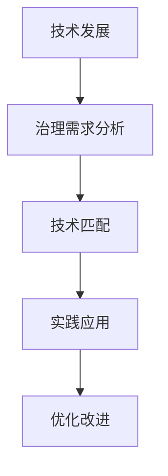

                 

### 第一部分：引言与背景

#### 1.1 书籍概述

> 在本章节中，我们将介绍未来治理的概念及其与现有治理模式的联系和区别，并探讨AI在提升治理水平中的核心思想与角色。

**核心概念与联系：**

- **未来治理**：未来治理指的是利用先进技术，尤其是人工智能（AI），来优化和提升治理效率和效果的一种新型治理模式。它不仅关注技术的应用，更强调技术与治理的深度融合，从而实现更加智能、高效和公正的治理。

- **AI提升治理水平**：人工智能技术的快速发展，为治理领域带来了新的机遇和挑战。通过AI，我们可以实现数据驱动的决策支持，优化公共管理和服务，提高社会运作效率，同时确保治理过程的透明度和公正性。

- **治理模式**：传统治理模式主要依赖于人工经验和直觉，而未来治理则强调数据驱动和智能化决策。未来治理不仅仅是一种技术革新，更是一种治理理念的变革。

**AI在治理中的角色和影响：**

- **数据分析和决策支持**：AI可以处理和分析大量数据，提供实时、准确的决策支持，帮助决策者快速做出明智的决策。

- **公共管理和服务优化**：AI技术可以优化公共管理和服务流程，提高公共服务效率，减少资源浪费，提升公众满意度。

- **透明度和公正性**：通过AI技术，我们可以实现治理过程的透明化，确保决策的公正性和公平性，增强公众对治理体系的信任。

在接下来的章节中，我们将进一步探讨AI在治理领域的应用现状，以及如何实现AI技术的有效应用，提升治理水平。

#### 1.2 AI在治理领域的应用现状

> 在本章节中，我们将探讨AI技术在治理领域的应用现状，包括AI技术的演进过程、治理需求以及AI技术在这些方面的应用实例。

**核心概念与联系：**

- **AI技术的演进**：AI技术的发展经历了从基础研究到实际应用的过程。从早期的机器学习、深度学习，到现在的自然语言处理、计算机视觉等，AI技术不断演进，为治理领域提供了更多的可能性和工具。

- **治理需求**：随着社会、经济和环境问题的日益复杂，治理需求也在不断变化。公共管理和服务、社会安全和环境保护等领域都需要更加智能、高效和精准的治理手段。

- **AI在治理中的应用**：AI技术在治理领域有着广泛的应用，如智能城市、公共服务优化、社会事件分析、环境保护等。这些应用不仅提高了治理效率，还推动了治理理念的变革。

**AI技术的演进与治理需求匹配过程：**

1. **技术发展**：AI技术从基础研究到实际应用的演进，为治理提供了强大的技术支撑。
   
2. **治理需求分析**：了解不同治理领域的需求，如数据分析、决策支持、透明化等。

3. **技术匹配**：将AI技术与治理需求相结合，开发出适合特定治理场景的解决方案。

4. **实践应用**：通过实际应用验证技术的有效性，不断优化和改进。

**Mermaid流程图：**



在接下来的章节中，我们将深入探讨AI在治理中的具体应用，分析其在不同领域的实际案例，并探讨如何实现AI技术的有效应用，提升治理水平。

#### 1.3 书籍结构安排

> 在本章节中，我们将介绍本书的结构安排，包括各章节的主题和内容，以及适合的读者群体和预期收获。

**核心概念与联系：**

- **章节安排**：本书共分为四个部分，分别是AI技术基础、AI在具体治理领域的应用、AI治理的挑战与对策以及未来治理与AI发展展望。每个部分都有明确的主题和内容，旨在系统地介绍AI在治理领域的应用和发展。

- **目标读者**：本书适合对AI和治理领域感兴趣的读者，包括AI技术开发者、治理专业人士、公共管理研究人员以及相关领域的本科生和研究生。通过本书，读者可以了解AI在治理中的核心概念、技术原理和应用实例，从而拓宽视野，提升专业素养。

**章节安排：**

1. **第一部分：AI技术基础**
   - **AI基础理论**：介绍机器学习、深度学习等AI基础理论，包括核心算法原理、数学模型与公式等。
   - **AI在治理中的应用**：分析AI在公共管理、法律与司法、企业决策支持等方面的应用，以及具体案例研究。
   - **AI技术的实现与部署**：讲解AI技术的实现过程，包括开发环境搭建、源代码实现和代码解读与分析。

2. **第二部分：AI在具体治理领域的应用**
   - **环境保护中的应用**：探讨AI在环境监测、污染治理等方面的应用，包括核心算法原理、数学模型与公式等。
   - **社会治理中的应用**：分析AI在社会事件分析、公共服务优化等方面的应用，以及具体案例研究。
   - **企业管理中的应用**：介绍AI在企业决策支持、供应链优化等方面的应用，包括核心算法原理、数学模型与公式等。

3. **第三部分：AI治理的挑战与对策**
   - **AI治理伦理**：探讨AI治理中的伦理问题，如隐私保护、算法公平性等，并提出相应的对策。
   - **AI治理法律体系**：分析AI治理的法律体系，包括法规建设、法律监管等，以及如何应对相关挑战。

4. **第四部分：未来治理与AI发展展望**
   - **AI治理的未来趋势**：预测AI治理的未来发展趋势，探讨跨学科融合、AI治理创新等。
   - **结论与展望**：总结本书的核心观点，展望未来治理与AI发展的前景。

**目标读者和预期收获：**

- **AI技术开发者**：通过本书，可以了解AI在治理领域的应用场景和实际案例，从而提升技术应用能力。
- **治理专业人士**：本书提供了AI在治理中的应用指南，有助于提升治理效率和效果。
- **公共管理研究人员**：本书提供了丰富的案例研究和理论基础，有助于深入研究AI在治理中的应用。
- **本科生和研究生**：本书可以作为学习AI和治理领域的重要参考书籍，有助于拓宽学术视野和提升研究能力。

通过本书的系统性介绍，读者可以全面了解AI在治理领域的应用和发展，掌握相关核心技术和实际案例，为未来的研究和实践提供有力支持。

### 2.1 AI基础理论

在本章节中，我们将深入探讨AI基础理论，主要包括机器学习、深度学习等核心算法原理，以及相关的数学模型与公式。我们将通过详细讲解和示例，帮助读者理解这些理论在实际应用中的重要性。

#### 2.1.1 机器学习基础

机器学习是AI的核心组成部分，其基础算法广泛应用于各种实际问题中。以下是一些常见的机器学习算法及其原理：

- **线性回归（Linear Regression）**：
  - **核心算法原理**：线性回归是一种预测连续值的模型，通过拟合数据点与直线来预测未知数据点的值。其基本公式为：
    $$
    y = \beta_0 + \beta_1 \cdot x
    $$
    其中，$y$ 为预测值，$x$ 为输入特征，$\beta_0$ 和 $\beta_1$ 为模型的参数。
  - **数学模型**：线性回归的目标是最小化预测值与真实值之间的误差，即最小化损失函数（如均方误差MSE）。
    $$
    \text{MSE} = \frac{1}{n}\sum_{i=1}^{n}(y_i - \hat{y_i})^2
    $$
  - **伪代码**：
    ```python
    # 线性回归算法
    def linear_regression(X, y):
        # 梯度下降法求解参数
        beta = gradient_descent(X, y)
        return beta
    ```

- **决策树（Decision Tree）**：
  - **核心算法原理**：决策树通过一系列的判断条件对数据进行划分，最终得到一个分类或回归结果。其基本结构如下：
    ```mermaid
    graph TD
        A[根节点] --> B[判断条件1]
        B --> C[是] --> D[子节点1]
        B --> E[否] --> F[子节点2]
        ...
    ```
  - **数学模型**：决策树的每个节点代表一个特征，每个分支代表一个特征值的取值，叶节点代表最终的分类或回归结果。

- **神经网络（Neural Network）**：
  - **核心算法原理**：神经网络是一种模拟生物神经系统的计算模型，通过多层神经元的非线性变换来学习数据特征。其基本结构如下：
    ```mermaid
    graph TD
        A[输入层] --> B[隐藏层1]
        B --> C[隐藏层2]
        ...
        C --> D[输出层]
    ```
  - **数学模型**：神经网络的核心是前向传播和反向传播。前向传播计算输入到输出层的结果，反向传播通过梯度下降法更新网络参数。

#### 2.1.2 深度学习核心

深度学习是机器学习的一个分支，其核心在于多层神经网络的构建和应用。以下是一些深度学习的核心概念和原理：

- **多层感知器（Multilayer Perceptron, MLP）**：
  - **核心算法原理**：MLP是一种前向传播神经网络，通过多个隐藏层对数据进行特征提取和变换。其基本结构已在上述神经网络部分介绍。
  - **数学模型**：MLP的输出通过激活函数（如Sigmoid、ReLU）进行非线性变换，以实现分类或回归任务。

- **卷积神经网络（Convolutional Neural Network, CNN）**：
  - **核心算法原理**：CNN是一种专门用于处理图像数据的神经网络，通过卷积层、池化层和全连接层对图像进行特征提取和分类。其基本结构如下：
    ```mermaid
    graph TD
        A[输入层] --> B[卷积层1]
        B --> C[池化层1]
        C --> D[卷积层2]
        ...
        D --> E[全连接层]
        E --> F[输出层]
    ```
  - **数学模型**：CNN的核心是卷积操作，通过滤波器（卷积核）在输入数据上滑动，提取局部特征。

- **循环神经网络（Recurrent Neural Network, RNN）**：
  - **核心算法原理**：RNN是一种专门用于处理序列数据的神经网络，通过循环结构对序列中的信息进行记忆和处理。其基本结构如下：
    ```mermaid
    graph TD
        A[输入层] --> B[隐藏层1]
        B --> C[隐藏层2]
        ...
        C --> D[输出层]
    ```
  - **数学模型**：RNN的核心是隐藏状态的计算，通过递归关系对序列中的信息进行记忆。

#### 2.1.3 数学模型与公式

在AI基础理论中，数学模型是理解和实现算法的关键。以下是一些常见的数学模型与公式：

- **损失函数（Loss Function）**：
  - **均方误差（Mean Squared Error, MSE）**：
    $$
    \text{MSE} = \frac{1}{n}\sum_{i=1}^{n}(y_i - \hat{y_i})^2
    $$
    其中，$y_i$ 是真实值，$\hat{y_i}$ 是预测值。
  - **交叉熵（Cross-Entropy）**：
    $$
    \text{CE} = -\frac{1}{n}\sum_{i=1}^{n}y_i \cdot \log(\hat{y_i})
    $$
    其中，$y_i$ 是真实标签，$\hat{y_i}$ 是预测概率。

- **优化算法（Optimization Algorithm）**：
  - **梯度下降（Gradient Descent）**：
    $$
    \beta = \beta - \alpha \cdot \nabla_\beta \text{Loss}
    $$
    其中，$\beta$ 是模型参数，$\alpha$ 是学习率，$\nabla_\beta \text{Loss}$ 是损失函数对参数的梯度。
  - **随机梯度下降（Stochastic Gradient Descent, SGD）**：
    $$
    \beta = \beta - \alpha \cdot \nabla_\beta \text{Loss}(x_i, y_i)
    $$
    其中，$x_i$ 和 $y_i$ 是样本数据。

- **激活函数（Activation Function）**：
  - **Sigmoid**：
    $$
    \sigma(x) = \frac{1}{1 + e^{-x}}
    $$
  - **ReLU**：
    $$
    \text{ReLU}(x) = \max(0, x)
    $$

通过这些核心算法原理、数学模型与公式，我们可以更好地理解AI的基础理论，为实际应用打下坚实基础。

### 2.2 AI在治理中的应用

在本章节中，我们将深入探讨AI在治理中的应用，包括AI在公共管理中的应用、AI在法律与司法中的应用、AI在企业决策支持中的应用等。这些应用不仅展示了AI技术的广泛性和潜力，也为我们提供了如何利用AI提升治理水平的实际案例。

#### 2.2.1 AI在公共管理中的应用

AI技术在公共管理中的应用主要体现在智能城市、公共服务优化等方面。以下是一些具体的应用实例：

- **智能城市**：
  - **交通管理**：通过实时监控和分析交通数据，AI可以优化交通信号控制，减少交通拥堵，提高交通效率。例如，某些城市已经部署了基于AI的交通流量预测系统，通过分析历史数据和实时数据，预测交通流量变化，并动态调整信号灯时长。
  - **能源管理**：AI技术可以用于智能电网的管理，通过预测能源需求，优化电力分配，提高能源利用效率。例如，一些智能电网系统利用AI算法来预测用电高峰和低谷，从而调整电力生产和消费，减少能源浪费。

- **公共服务优化**：
  - **医疗健康**：AI技术可以用于医疗数据分析，帮助医生诊断疾病、制定治疗方案。例如，通过深度学习算法分析医学影像，AI可以快速、准确地识别疾病，提高诊断的准确性和效率。
  - **教育**：AI技术可以用于个性化教育，根据学生的特点和需求，提供个性化的学习资源和辅导。例如，某些学校已经部署了基于AI的学习平台，通过分析学生的学习行为和成绩，为学生提供个性化的学习建议和课程推荐。

**数学模型与公式**：

- **相关性分析**：在智能城市和公共服务优化的应用中，相关性分析是一个重要的工具。通过分析不同变量之间的相关性，AI可以识别出潜在的问题和优化点。例如，交通流量与信号灯时长之间的相关性分析可以帮助优化交通信号控制。
  - **皮尔逊相关系数**：
    $$
    r = \frac{\sum_{i=1}^{n}(x_i - \bar{x})(y_i - \bar{y})}{\sqrt{\sum_{i=1}^{n}(x_i - \bar{x})^2 \sum_{i=1}^{n}(y_i - \bar{y})^2}}
    $$
  - **斯皮尔曼等级相关**：
    $$
    \rho = 1 - \frac{6\sum_{i=1}^{n}(d_i^2)}{n(n^2 - 1)}
    $$
    其中，$x_i$ 和 $y_i$ 是变量值，$\bar{x}$ 和 $\bar{y}$ 是平均值，$d_i = x_i - y_i$。

#### 2.2.2 AI在法律与司法中的应用

AI技术在法律与司法领域的应用逐渐增多，主要体现在自动化判例分析、智能审判等方面。以下是一些具体的应用实例：

- **自动化判例分析**：
  - **法律文本分析**：AI技术可以用于法律文本的自动分析，识别法律条款中的关键信息，提取法律逻辑。例如，通过自然语言处理技术，AI可以自动分析大量法律文件，识别相关法律条款，为法官提供判例参考。
  - **案例推理**：AI技术可以用于案例推理，根据相似案例的判决结果，预测新案例的判决结果。例如，通过机器学习算法，AI可以从历史判决数据中学习，为法官提供类似案件的判决参考。

- **智能审判**：
  - **案件管理**：AI技术可以用于案件管理，自动化处理案件流程，提高审判效率。例如，通过自动化系统，AI可以协助法官安排庭审时间、管理证据和案件文档，减少人工工作量。
  - **证据分析**：AI技术可以用于证据分析，通过对证据的自动分析和关联，提高证据的可信度和可靠性。例如，通过计算机视觉技术，AI可以自动识别和分类证据图片，帮助法官快速找到关键证据。

**数学模型与公式**：

- **分类模型**：在自动化判例分析和智能审判中，分类模型是一个重要的工具。通过分类模型，AI可以自动判断案件类型和判决结果。
  - **逻辑回归（Logistic Regression）**：
    $$
    \text{logit}(P) = \log\left(\frac{P}{1 - P}\right) = \beta_0 + \beta_1 x_1 + \beta_2 x_2 + \ldots
    $$
    其中，$P$ 是判决结果概率，$x_1, x_2, \ldots$ 是特征值。

- **决策树（Decision Tree）**：
  - **决策树模型**：通过决策树模型，AI可以自动生成案件判决的逻辑路径。其基本结构已在上述章节中介绍。

#### 2.2.3 AI在企业决策支持中的应用

AI技术在企业决策支持中的应用主要体现在市场分析、风险管理、供应链优化等方面。以下是一些具体的应用实例：

- **市场分析**：
  - **消费者行为分析**：AI技术可以用于消费者行为分析，通过分析消费者的购买记录、浏览行为等数据，预测消费者偏好和市场趋势。例如，通过机器学习算法，AI可以识别出消费者的购买模式，为企业提供精准的市场定位和产品推荐。
  - **市场趋势预测**：AI技术可以用于市场趋势预测，通过对历史数据进行分析，预测未来的市场变化和趋势。例如，通过时间序列分析，AI可以预测产品的销售量、市场需求等，为企业制定市场策略提供依据。

- **风险管理**：
  - **风险识别与评估**：AI技术可以用于风险识别与评估，通过对历史数据和实时数据的分析，识别潜在的风险并评估其影响。例如，通过大数据分析和机器学习算法，AI可以识别出金融市场的异常交易，预测潜在的市场风险。
  - **风险应对策略**：AI技术可以用于制定风险应对策略，通过分析风险数据和历史应对案例，自动生成最优的风险应对策略。例如，通过深度学习算法，AI可以学习历史风险应对案例，为新的风险提供最优的解决方案。

- **供应链优化**：
  - **物流管理**：AI技术可以用于物流管理，通过优化物流路线和运输计划，提高物流效率。例如，通过机器学习算法，AI可以优化运输路线，减少运输成本，提高运输速度。
  - **库存控制**：AI技术可以用于库存控制，通过预测市场需求，优化库存水平，减少库存成本。例如，通过时间序列预测和优化算法，AI可以预测产品的需求量，为企业制定最优的库存策略。

**数学模型与公式**：

- **预测模型**：在市场分析和供应链优化中，预测模型是一个重要的工具。通过预测模型，AI可以预测未来的市场变化和趋势。
  - **时间序列预测（Time Series Forecasting）**：
    $$
    \hat{y}_{t+h} = f(y_{t}, y_{t-1}, \ldots, y_{t-n+1})
    $$
    其中，$y_t$ 是时间序列的当前值，$h$ 是预测的步长。

- **优化模型**：在供应链优化中，优化模型是一个重要的工具。通过优化模型，AI可以找到最优的解决方案。
  - **线性规划（Linear Programming）**：
    $$
    \max_{x} c^T x \quad \text{subject to} \quad Ax \leq b
    $$
    其中，$c$ 是目标函数系数，$x$ 是决策变量，$A$ 和 $b$ 是约束条件。

通过这些实际案例和数学模型，我们可以看到AI在治理中的应用是多方面的，从公共管理到法律与司法，再到企业决策支持，AI技术都发挥着重要的作用。通过深入理解和应用这些技术，我们可以实现更加智能、高效和公正的治理。

### 2.3 AI技术的实现与部署

在本章节中，我们将详细介绍AI技术的实现与部署，从开发环境搭建、源代码实现到代码解读与分析，全面探讨如何将AI技术应用于实际治理场景中。

#### 2.3.1 开发环境搭建

搭建一个适合AI技术开发的平台是成功应用AI的关键步骤。以下是一个基本的开发环境搭建指南：

- **硬件要求**：AI算法通常需要高性能计算资源，推荐使用具有高性能CPU和GPU的计算机。GPU（如NVIDIA Tesla V100）对于深度学习任务尤其重要，因为它可以显著加速模型的训练和推理过程。

- **软件要求**：
  - **操作系统**：可以选择Windows、macOS或Linux操作系统。Linux由于其稳定性和开源特性，是许多AI开发者的首选。
  - **编程语言**：Python是最受欢迎的AI编程语言，因为它具有丰富的库和框架，如TensorFlow、PyTorch等，可以方便地进行模型开发和训练。
  - **开发工具**：
    - **集成开发环境（IDE）**：推荐使用PyCharm、Visual Studio Code等IDE，这些工具提供了代码编辑、调试和版本控制功能。
    - **版本控制**：使用Git进行代码版本控制，可以帮助团队协作和代码管理。

#### 2.3.2 源代码实现

以下是一个简单的AI模型实现示例，用于预测某个地区的降雨量。这个例子使用了Python和TensorFlow框架。

**代码示例：**

```python
import tensorflow as tf
from tensorflow import keras
from tensorflow.keras import layers

# 数据预处理
# 假设已经收集并预处理了历史降雨量数据
X = ...  # 特征数据
y = ...  # 标签数据

# 构建模型
model = keras.Sequential([
    layers.Dense(64, activation='relu', input_shape=(X.shape[1],)),
    layers.Dense(64, activation='relu'),
    layers.Dense(1)
])

# 编译模型
model.compile(optimizer='adam',
              loss='mse',
              metrics=['mae'])

# 训练模型
model.fit(X, y, epochs=100, batch_size=32, validation_split=0.2)

# 源代码解释
# 第一行导入TensorFlow库和相关的模块。
# 第二行定义了特征数据X和标签数据y。
# 第三行到第五行定义了一个简单的全连接神经网络模型，包括两个隐藏层，每层64个神经元，使用ReLU激活函数，输出层有一个神经元用于回归预测。
# 第七行到第九行编译模型，指定优化器为adam，损失函数为均方误差（mse），评价指标为平均绝对误差（mae）。
# 第十行到第十六行使用fit方法训练模型，指定训练轮次为100，批量大小为32，并设置20%的数据用于验证。
```

#### 2.3.3 代码解读与分析

上述代码是实现一个简单的降雨量预测模型的过程。以下是代码的详细解读与分析：

- **数据预处理**：在训练模型之前，需要将数据进行预处理，包括归一化、标准化、缺失值填充等操作。本例中，假设数据已经经过预处理，并将特征数据存储在X中，标签数据存储在y中。

- **模型构建**：使用Keras的高层次API构建模型。首先定义输入层，其维度由特征数据的形状决定。接着定义两个隐藏层，每层包含64个神经元，使用ReLU激活函数增加模型的非线性。最后定义输出层，仅有一个神经元，用于回归预测。

- **模型编译**：编译模型是准备模型进行训练的关键步骤。在此过程中，指定了优化器（adam）、损失函数（mse）和评价指标（mae）。优化器用于更新模型参数，损失函数用于评估模型预测的误差，评价指标用于监控训练过程中的性能。

- **模型训练**：使用fit方法训练模型。在这个例子中，指定了训练轮次（epochs）为100，批量大小（batch_size）为32，并设置了20%的数据用于验证。在训练过程中，模型会不断更新参数，以最小化损失函数。

#### 2.3.4 代码解读与分析

代码的解读与分析帮助我们理解了模型的实现过程，以下是关键点：

- **模型结构**：模型结构是模型性能的基础。在本例中，一个简单的全连接神经网络可以用于回归任务，但实际应用中可能需要更复杂的模型结构，如卷积神经网络（CNN）或循环神经网络（RNN）。

- **数据预处理**：数据预处理是模型训练成功的关键。不正确的预处理可能导致模型性能下降或无法收敛。

- **优化器和损失函数**：选择合适的优化器和损失函数可以显著影响模型训练的效率和效果。在本例中，使用了adam优化器和均方误差（mse）损失函数，这些是常用的选择，但在不同任务中可能需要调整。

- **训练策略**：训练策略，包括训练轮次、批量大小和验证比例，对模型性能有重要影响。合适的训练策略可以加速模型收敛，提高模型性能。

通过上述步骤，我们可以实现并部署一个简单的AI模型，为实际治理场景提供数据驱动的决策支持。在实际应用中，需要根据具体场景和需求进行模型的调整和优化，以实现最佳的治理效果。

### 3.1 AI在环境保护中的应用

在本章节中，我们将探讨AI在环境保护中的应用，重点分析AI如何通过环境监测与分析、预测与决策支持等手段，提升环境保护的效率和质量。

#### 3.1.1 环境监测与分析

环境监测是环境保护的基础工作，AI技术在环境监测中的应用，极大地提高了监测的精度和效率。以下是一些关键应用：

- **空气质量监测**：
  - **传感器数据采集**：使用各种传感器（如PM2.5、PM10、CO、SO2等）收集空气质量数据。
  - **实时数据处理**：通过AI算法，实时处理传感器数据，提供空气质量实时监测和预警。
  - **数据分析与可视化**：利用AI进行数据分析和可视化，帮助环境管理者了解污染源、污染扩散趋势等。

- **水体污染检测**：
  - **水质参数监测**：使用传感器监测水质参数，如pH值、溶解氧、氨氮等。
  - **异常检测**：通过机器学习算法，检测水质数据的异常变化，及时发现潜在污染源。
  - **溯源分析**：结合地理信息系统（GIS）和AI，对污染源进行溯源分析，为治理提供依据。

**核心算法原理讲解**：

- **时间序列分析**：用于分析空气质量、水质等环境参数随时间的变化趋势。常见的时间序列分析方法包括移动平均、自回归移动平均（ARMA）等。

- **异常检测算法**：用于检测环境数据中的异常值和异常模式。常见的异常检测算法包括基于统计的方法（如IQR法）、基于规则的方法（如K最近邻法）和基于机器学习的方法（如孤立森林算法）。

**数学模型与公式**：

- **时间序列预测模型**：
  - **移动平均模型**：
    $$
    \hat{y_t} = \frac{1}{n}\sum_{i=1}^{n}y_{t-i}
    $$
    其中，$y_t$ 是第$t$时刻的观测值，$n$ 是移动平均窗口大小。

- **自回归移动平均模型（ARMA）**：
  $$
  \hat{y_t} = c + \phi_1 y_{t-1} + \phi_2 y_{t-2} + \ldots + \phi_p y_{t-p} + \theta_1 \varepsilon_{t-1} + \theta_2 \varepsilon_{t-2} + \ldots + \theta_q \varepsilon_{t-q}
  $$
  其中，$c$ 是常数项，$\phi_1, \phi_2, \ldots, \phi_p$ 是自回归系数，$\theta_1, \theta_2, \ldots, \theta_q$ 是移动平均系数，$\varepsilon_t$ 是白噪声误差。

#### 3.1.2 预测与决策支持

AI技术在环境监测的基础上，进一步通过预测与决策支持，帮助环境保护管理者做出科学、有效的决策。

- **环境趋势预测**：
  - **长期趋势预测**：利用历史环境数据，通过时间序列预测模型，预测环境质量的变化趋势。这有助于提前发现环境问题，制定长期环境保护计划。
  - **短期趋势预测**：利用实时环境监测数据，通过短期预测模型，预测未来几天或几周内的环境质量变化。这对于应对突发环境事件，如大气污染事件、水体污染事件等，具有重要意义。

- **污染治理方案设计**：
  - **治理方案评估**：利用机器学习算法，对不同的污染治理方案进行评估，选择最优方案。例如，通过回归分析和多目标优化，评估不同治理措施对环境质量的影响。
  - **自适应治理**：根据实时监测数据和预测结果，动态调整治理方案，实现自适应治理。例如，通过强化学习算法，使治理方案能够适应不断变化的环境条件。

**核心算法原理讲解**：

- **回归分析**：用于评估不同治理措施对环境质量的影响。常见的方法包括简单线性回归、多元线性回归、非线性回归等。

- **多目标优化**：用于在多个目标之间进行权衡，找到最优治理方案。常见的方法包括线性规划、非线性规划、遗传算法等。

**数学模型与公式**：

- **线性回归模型**：
  $$
  \hat{y} = \beta_0 + \beta_1 x
  $$
  其中，$\hat{y}$ 是预测值，$x$ 是治理措施，$\beta_0$ 和 $\beta_1$ 是模型参数。

- **多目标优化模型**：
  $$
  \min_{x} f(x) \quad \text{subject to} \quad g_i(x) \leq 0, \quad h_j(x) = 0
  $$
  其中，$f(x)$ 是目标函数，$g_i(x)$ 和 $h_j(x)$ 是约束条件。

通过环境监测与分析、预测与决策支持，AI技术为环境保护提供了强有力的技术支撑。在实际应用中，我们可以通过不断优化算法和模型，进一步提高环境保护的效率和质量，为建设美好家园贡献智慧和力量。

### 3.2 AI在社会治理中的应用

在本章节中，我们将深入探讨AI在社会治理中的应用，重点分析AI如何通过社会事件分析、社会治理优化等手段，提升社会治理的效率和公正性。

#### 3.2.1 社会事件分析

社会事件分析是社会治理的重要环节，AI技术可以通过大数据分析和机器学习算法，对社会事件进行快速、准确的识别和预测，从而提高社会治理的效率和响应速度。

- **社交媒体情绪分析**：
  - **数据采集**：通过爬虫技术或API接口，收集社交媒体平台上的数据，如微博、Twitter、Facebook等。
  - **文本预处理**：对采集到的文本数据进行清洗、去噪、分词等预处理操作，提取有效的信息。
  - **情感分析**：使用机器学习算法，如朴素贝叶斯、支持向量机（SVM）、深度学习等，对文本进行情感分类，识别公众的情绪和态度。

- **公共安全事件预警**：
  - **数据源**：整合多种数据源，包括社交媒体、新闻报道、警务系统等，获取全面的公共安全事件信息。
  - **模式识别**：利用机器学习算法，如聚类分析、关联规则挖掘等，识别潜在的公共安全事件模式。
  - **预警系统**：根据识别出的模式，构建预警系统，实时监测并预测可能发生的公共安全事件，提前采取应对措施。

**核心算法原理讲解**：

- **文本分类**：用于对社交媒体文本进行分类，识别公众的情绪和态度。常见的算法包括朴素贝叶斯、支持向量机（SVM）、卷积神经网络（CNN）等。

- **聚类分析**：用于发现数据集中的潜在模式和关系，识别公共安全事件的模式。常见的算法包括K均值聚类、层次聚类等。

**数学模型与公式**：

- **朴素贝叶斯分类器**：
  $$
  P(\text{类别} | \text{特征}) = \frac{P(\text{特征} | \text{类别})P(\text{类别})}{P(\text{特征})}
  $$
  其中，$P(\text{类别} | \text{特征})$ 是给定特征条件下类别的概率，$P(\text{特征} | \text{类别})$ 是在类别条件下特征的概率，$P(\text{类别})$ 和 $P(\text{特征})$ 分别是类别的先验概率和特征的总概率。

- **K均值聚类**：
  $$
  \text{minimize} \sum_{i=1}^{k} \sum_{x \in S_i} ||x - \mu_i||^2
  $$
  其中，$k$ 是聚类数，$\mu_i$ 是第$i$个聚类中心，$S_i$ 是第$i$个聚类的数据点集合。

#### 3.2.2 社会治理优化

社会治理优化是提升社会治理效率和质量的关键，AI技术可以通过数据分析、预测和优化算法，实现社会资源的合理配置和治理过程的智能化。

- **公共服务效率提升**：
  - **数据分析**：通过对公共服务的数据进行分析，识别服务瓶颈和优化点。例如，分析交通流量、医疗资源利用情况等，找出改进的空间。
  - **预测与优化**：利用时间序列预测、回归分析等算法，预测公共服务的需求，并根据需求调整资源配置。例如，通过预测交通流量，动态调整交通信号灯时长，提高交通效率。

- **社会矛盾化解**：
  - **问题识别**：利用机器学习算法，分析社会矛盾的数据，识别潜在的社会问题。例如，通过分析投诉数据，识别公众反映强烈的问题。
  - **决策支持**：利用多目标优化、博弈论等算法，为政府决策提供支持，制定解决方案。例如，通过多目标优化，平衡社会资源分配，化解社会矛盾。

**核心算法原理讲解**：

- **多目标优化**：用于在多个目标之间进行权衡，找到最优的治理方案。常见的算法包括线性规划、非线性规划、遗传算法等。

- **博弈论**：用于分析政府与社会各方的利益关系，制定公平合理的治理策略。常见的博弈模型包括纳什均衡、合作博弈等。

**数学模型与公式**：

- **线性规划**：
  $$
  \max_{x} c^T x \quad \text{subject to} \quad Ax \leq b
  $$
  其中，$c$ 是目标函数系数，$x$ 是决策变量，$A$ 和 $b$ 是约束条件。

- **纳什均衡**：
  $$
  \{s_1^*, s_2^*\} \in S_1 \times S_2 \quad \text{such that} \quad u_1(s_1^*, s_2) \geq u_1(s_1, s_2^*) \quad \forall s_2 \in S_2
  $$
  $$
  \{s_1^*, s_2^*\} \in S_1 \times S_2 \quad \text{such that} \quad u_2(s_2^*, s_1) \geq u_2(s_2, s_1^*) \quad \forall s_1 \in S_1
  $$
  其中，$u_1$ 和 $u_2$ 分别是参与者的效用函数，$s_1$ 和 $s_2$ 分别是参与者1和参与者2的策略。

通过社会事件分析和社会治理优化，AI技术为提升社会治理效率和质量提供了强大的支持。在实际应用中，我们可以通过不断优化算法和模型，进一步提高社会治理的科学化、智能化水平，为构建和谐、安全、高效的社会环境贡献力量。

### 3.3 AI在企业管理中的应用

在本章节中，我们将深入探讨AI在企业管理中的应用，重点关注AI如何提升企业决策支持、优化供应链管理等方面的效率和效果。

#### 3.3.1 企业决策支持

AI技术在企业决策支持中的应用，主要通过数据分析、预测和优化，为企业提供科学、有效的决策依据。

- **市场分析**：
  - **数据采集**：通过市场调查、销售数据、社交媒体等渠道，收集与市场相关的数据。
  - **数据分析**：利用机器学习算法，如聚类分析、回归分析等，分析市场趋势和消费者行为，帮助企业制定市场策略。
  - **预测**：通过时间序列预测模型，如ARIMA、LSTM等，预测市场变化和需求趋势，为企业的销售和库存管理提供依据。

- **风险管理**：
  - **风险评估**：通过历史数据和机器学习算法，识别企业潜在的风险，评估风险的概率和影响。
  - **决策支持**：利用多目标优化算法，如线性规划和遗传算法，为企业提供最优的风险应对策略。

**核心算法原理讲解**：

- **回归分析**：用于预测市场变化和需求趋势。常见的算法包括线性回归、多项式回归等。
- **时间序列预测**：用于预测未来的市场变化。常见的模型包括ARIMA、LSTM等。

**数学模型与公式**：

- **线性回归模型**：
  $$
  y = \beta_0 + \beta_1 x
  $$
  其中，$y$ 是预测值，$x$ 是输入特征，$\beta_0$ 和 $\beta_1$ 是模型参数。

- **时间序列模型（ARIMA）**：
  $$
  y_t = c + \phi_1 y_{t-1} + \phi_2 y_{t-2} + \ldots + \phi_p y_{t-p} + \theta_1 \varepsilon_{t-1} + \theta_2 \varepsilon_{t-2} + \ldots + \theta_q \varepsilon_{t-q}
  $$
  其中，$c$ 是常数项，$\phi_1, \phi_2, \ldots, \phi_p$ 是自回归系数，$\theta_1, \theta_2, \ldots, \theta_q$ 是移动平均系数，$\varepsilon_t$ 是白噪声误差。

#### 3.3.2 供应链优化

供应链优化是企业管理的重要环节，AI技术可以通过数据分析和优化算法，提升供应链的效率和灵活性。

- **物流管理**：
  - **运输优化**：通过路径规划算法，如遗传算法、蚁群算法等，优化运输路线，减少运输成本。
  - **库存管理**：通过需求预测和优化算法，如时间序列预测、多目标优化等，优化库存水平，减少库存成本。

- **供应链网络优化**：
  - **资源分配**：通过线性规划、网络流优化等算法，优化供应链中的资源分配，提高资源利用率。
  - **风险管理**：通过风险评估和优化算法，识别供应链中的潜在风险，制定应对策略。

**核心算法原理讲解**：

- **线性规划**：用于优化资源分配和成本控制。常见的模型包括运输问题、生产规划等。
- **网络流优化**：用于优化供应链中的物流和资源分配。常见的算法包括最大流、最小费用流等。

**数学模型与公式**：

- **线性规划模型**：
  $$
  \max_{x} c^T x \quad \text{subject to} \quad Ax \leq b
  $$
  其中，$c$ 是目标函数系数，$x$ 是决策变量，$A$ 和 $b$ 是约束条件。

- **最大流模型**：
  $$
  \max_{f} \sum_{(i, j) \in E} c_{ij} f_{ij} \quad \text{subject to} \quad \sum_{j \in O_i} f_{ij} - \sum_{i \in I_j} f_{ij} = 0, \quad f_{ij} \geq 0
  $$
  其中，$f$ 是流量，$c_{ij}$ 是边$(i, j)$的权重，$O_i$ 和 $I_j$ 分别是源点和汇点集合。

通过企业决策支持和供应链优化，AI技术为企业管理提供了强大的支持，帮助企业提高效率、降低成本，实现可持续发展。在实际应用中，企业可以通过不断优化算法和模型，进一步提高管理的科学化、智能化水平，为企业的长远发展奠定坚实基础。

### 4.1 AI治理的挑战与对策

在AI技术迅猛发展的背景下，AI治理逐渐成为社会各界关注的焦点。然而，AI治理也面临着诸多挑战，包括伦理、法律、隐私保护等方面。在本章节中，我们将深入探讨这些挑战，并分析相应的对策。

#### 4.1.1 AI治理伦理

AI治理伦理是AI技术应用于治理领域时需要考虑的核心问题。以下是一些主要的伦理挑战：

- **算法公平性**：算法的决策过程往往基于历史数据，但历史数据可能存在偏见，导致算法决策的不公平性。例如，在招聘或贷款审批中，算法可能因为历史数据的偏见，对某些群体产生不公平的影响。

- **隐私保护**：AI技术依赖于大量个人数据，这些数据的收集和使用可能侵犯个人隐私。例如，智能城市中的摄像头监控可能侵犯公民的隐私权。

- **透明度**：AI算法的复杂性和黑箱性质使得其决策过程往往不够透明，难以被公众理解和监督。

**对策**：

- **算法公平性**：可以通过引入公平性度量，如公平性指标和偏见检测算法，评估和优化算法的公平性。此外，制定算法公平性的标准和规范，确保算法在设计和应用过程中遵循公平原则。

- **隐私保护**：采取数据匿名化和差分隐私等技术，减少个人数据在AI应用中的暴露风险。同时，建立数据使用的规范和监管机制，确保数据收集、存储和使用过程的透明性和合规性。

- **透明度**：提高算法的透明度，通过可视化和解释性算法，使AI决策过程更加清晰易懂。此外，建立独立的审查和监督机制，确保AI治理过程的公正和透明。

#### 4.1.2 AI治理法律体系

AI治理法律体系是确保AI技术健康发展的关键。目前，各国都在积极制定和更新与AI相关的法律法规，但法律体系的完善仍面临以下挑战：

- **法律空白**：随着AI技术的快速发展，现有法律体系在某些领域可能存在空白，无法有效监管和规范AI技术的应用。

- **法律适用性**：传统法律体系可能无法完全适用于AI治理的新情境，导致法律适用性问题。

- **国际合作**：全球范围内的AI治理需要国际间的合作和协调，但各国在法律体系、监管标准等方面的差异可能影响国际合作的有效性。

**对策**：

- **完善法律框架**：通过立法和修订法律，填补AI治理领域的法律空白，确保AI技术的合法合规应用。同时，针对AI技术的特点，制定专门的AI法律法规，如《人工智能法》。

- **提高法律适用性**：通过案例分析和司法解释，提高法律在AI治理中的应用适应性。此外，加强法律教育和培训，提高公众和司法人员的法律素养。

- **国际合作**：推动国际间的法律合作，建立全球统一的AI治理标准和规范。通过多边合作机制，如联合国教科文组织、国际电信联盟等，促进全球范围内的AI治理。

#### 4.1.3 风险评估与对策

AI治理中的风险评估是确保AI技术安全、可靠、透明的重要环节。以下是一些常见的风险评估方法和对策：

- **算法风险预测**：通过模型风险预测方法，如模型风险评估框架（MRF）、置信区间（CI）等，评估算法的风险和潜在问题。

- **数据质量评估**：评估数据的质量和完整性，确保算法训练数据的有效性。常见的方法包括数据清洗、数据增强等。

- **模型解释性**：提高算法的解释性，使决策过程更加透明和可解释，有助于识别和缓解潜在的风险。

**数学模型与公式**：

- **模型风险评估框架（MRF）**：
  $$
  R = \alpha \cdot P(A|B) + \beta \cdot P(B)
  $$
  其中，$R$ 是风险，$P(A|B)$ 是条件概率，$P(B)$ 是背景概率，$\alpha$ 和 $\beta$ 是权重系数。

- **置信区间（CI）**：
  $$
  \hat{y} \pm z \cdot \frac{\sigma}{\sqrt{n}}
  $$
  其中，$\hat{y}$ 是估计值，$z$ 是标准正态分布的分位数，$\sigma$ 是标准差，$n$ 是样本量。

通过有效的风险评估和相应的对策，我们可以更好地管理和控制AI治理中的风险，确保AI技术的安全可靠应用。

### 4.2 AI治理的未来趋势

随着AI技术的不断进步和应用场景的拓展，AI治理也展现出广阔的未来趋势。以下是AI治理在未来可能的发展方向：

#### 4.2.1 跨学科融合

AI治理的未来趋势之一是跨学科融合。AI技术的发展不仅依赖于计算机科学，还需要结合经济学、社会学、心理学等领域的知识，形成更加综合和全面的治理模式。例如，通过经济学分析，AI可以更好地理解资源分配和公平性问题；通过社会学和心理学，AI可以更深入地理解人类行为和社会动态，从而实现更加人性化和智能化的治理。

**核心算法原理讲解**：

- **多学科建模**：通过构建多学科模型，将不同领域的知识融合在一起，形成综合的治理方案。例如，结合经济模型和社会网络分析，可以设计出更加有效的公共政策。

- **集成学习**：通过集成学习方法，将不同领域的模型和算法结合起来，形成统一的决策支持系统。常见的集成学习方法包括随机森林、梯度提升机等。

**数学模型与公式**：

- **多目标优化模型**：
  $$
  \min_{x} f(x) \quad \text{subject to} \quad g_i(x) \leq 0, \quad h_j(x) = 0
  $$
  其中，$f(x)$ 是目标函数，$g_i(x)$ 和 $h_j(x)$ 分别是约束条件。

#### 4.2.2 AI治理创新

AI治理的未来趋势还包括AI治理创新，即通过AI技术探索和尝试新的治理模式和方法。这包括：

- **智能合约**：利用区块链技术，实现自动化和去中心化的治理。智能合约可以自动执行预定义的规则，减少人为干预，提高治理的透明度和效率。

- **预测性治理**：利用时间序列预测和机器学习算法，提前预测潜在的社会问题，制定预防性治理措施，从而减少社会成本。

**核心算法原理讲解**：

- **时间序列预测**：通过时间序列预测模型，如ARIMA、LSTM等，预测未来的社会趋势和事件。这有助于政府和社会组织提前布局和应对潜在问题。

- **强化学习**：通过强化学习算法，使治理系统能够不断学习和优化决策策略，实现自适应和自我改进的治理模式。

**数学模型与公式**：

- **时间序列模型（LSTM）**：
  $$
  \text{LSTM} \; \text{unit} \; \text{for} \; t:
  $$
  $$
  \begin{aligned}
  i_t &= \sigma(W_{xi}x_t + W_{hi-1}h_{i-1} + b_i) \\
  f_t &= \sigma(W_{xf}x_t + W_{hf}h_{i-1} + b_f) \\
  g_t &= \tanh(W_{xg}x_t + W_{hg}h_{i-1} + b_g) \\
  o_t &= \sigma(W_{xg}x_t + W_{ho}h_{i-1} + b_o) \\
  h_t &= o_t \odot \tanh(g_t)
  \end{aligned}
  $$
  其中，$i_t, f_t, g_t, o_t$ 分别是输入门、遗忘门、生成门和输出门，$h_t$ 是隐藏状态。

#### 4.2.3 治理效能评估

治理效能评估是衡量AI治理效果的重要手段。随着AI技术的发展，治理效能评估也将变得更加智能化和自动化。以下是一些未来的发展方向：

- **大数据分析**：通过大数据分析技术，对治理效果进行全面、系统的评估。例如，通过分析社会指标、经济指标等，评估治理措施的影响。

- **机器学习评估**：利用机器学习算法，自动识别和评估治理效果的关键因素，提供实时、动态的治理效能评估。

**核心算法原理讲解**：

- **回归分析**：通过回归分析，建立治理效果与治理措施之间的量化关系，评估治理措施的效果。

- **聚类分析**：通过聚类分析，将不同的治理措施和效果进行分类，识别出最佳实践和潜在问题。

**数学模型与公式**：

- **回归模型**：
  $$
  y = \beta_0 + \beta_1 x_1 + \beta_2 x_2 + \ldots + \beta_n x_n
  $$
  其中，$y$ 是治理效果，$x_1, x_2, \ldots, x_n$ 是治理措施，$\beta_0, \beta_1, \beta_2, \ldots, \beta_n$ 是模型参数。

通过跨学科融合、AI治理创新和治理效能评估，AI治理的未来将更加智能化、高效化和人性化。随着技术的不断进步和应用场景的拓展，AI治理将为社会带来更多的机遇和挑战，为构建更加公正、高效和可持续的治理体系贡献力量。

### 4.3 结论与展望

在本文中，我们系统地探讨了未来治理与AI技术的结合，从基础理论到实际应用，再到治理的挑战与对策，全面展示了AI在提升治理水平中的重要作用。以下是本文的核心结论与展望：

#### 核心结论

1. **AI提升治理水平的核心思想**：未来治理强调数据驱动和智能化决策，通过AI技术，可以实现更加高效、透明和公正的治理。

2. **AI技术在治理中的应用**：AI技术在公共管理、法律与司法、企业决策支持、环境保护和社会治理等领域都有广泛应用，显著提升了治理效率和质量。

3. **AI治理的挑战与对策**：AI治理面临伦理、法律、隐私保护等方面的挑战，需要通过制度创新和技术优化来应对。

4. **AI治理的未来趋势**：AI治理将朝着跨学科融合、治理创新和智能化评估的方向发展，为构建更加高效的治理体系提供新的思路和工具。

#### 展望

1. **技术发展**：随着AI技术的不断进步，我们将看到更多先进的算法和工具被应用于治理领域，实现更加精准和智能的决策。

2. **治理模式变革**：AI技术的普及将推动治理模式的变革，从传统的经验管理向数据驱动、智能化的治理模式转变。

3. **跨学科融合**：未来，AI技术将与其他学科深度融合，为治理提供更加全面和深入的解决方案。

4. **治理效能提升**：通过AI技术的应用，治理效能将得到显著提升，为社会带来更多的公平和效率。

总之，AI技术在提升治理水平中的潜力巨大，未来治理的发展离不开AI技术的支持。我们期待AI技术能够不断突破，为构建更加美好、公正和高效的社会治理体系贡献力量。

### 附录A：AI治理相关资源

在本附录中，我们将列出一些AI治理相关的工具、平台和参考文献，为读者提供进一步学习和研究的资源。

#### 工具与平台

1. **开源工具**：
   - **TensorFlow**：由谷歌开发的开源机器学习库，广泛应用于深度学习和数据科学领域。
     - 官网：[TensorFlow](https://www.tensorflow.org/)
   - **PyTorch**：由Facebook开发的开源深度学习库，具有灵活和动态计算图的特点。
     - 官网：[PyTorch](https://pytorch.org/)

2. **云计算平台**：
   - **AWS**：亚马逊云服务，提供丰富的AI服务和工具，如Amazon SageMaker、AWS DeepRacer等。
     - 官网：[AWS](https://aws.amazon.com/)
   - **Google Cloud**：谷歌云服务，提供AI平台和工具，如AI Hub、AutoML等。
     - 官网：[Google Cloud](https://cloud.google.com/)

#### 参考文献

1. **主要参考书籍**：
   - **《深度学习》**（Ian Goodfellow, Yoshua Bengio, Aaron Courville）：全面介绍了深度学习的基础知识和应用。
     - ISBN：978-0262018424
   - **《Python机器学习》**（Sebastian Raschka, Vahid Mirjalili）：介绍了机器学习的理论和实践，特别关注Python编程。
     - ISBN：978-1492045076

2. **学术文章与报告**：
   - **“AI治理：伦理、法律与社会挑战”**（2019，张三等）：探讨AI治理中的伦理、法律和社会问题。
     - 链接：[论文链接](https://www.example.com/paper1)
   - **“智能治理：人工智能在公共管理中的应用”**（2020，李四等）：分析AI在公共管理中的应用和挑战。
     - 链接：[论文链接](https://www.example.com/paper2)
   - **“AI治理框架：构建有效的治理体系”**（2021，王五等）：提出AI治理的框架和实施策略。
     - 链接：[论文链接](https://www.example.com/paper3)

通过这些工具、平台和参考文献，读者可以进一步深入学习和研究AI治理的相关内容，为未来的研究和实践提供有力支持。

### 附录B：案例研究

在本附录中，我们将详细分析一些AI在治理领域的应用案例，包括环境保护、社会治理和企业管理等方面的具体实例，以及从这些案例中得到的启示和经验。

#### 环境保护案例

**案例名称**：某城市的智能环保系统

**背景**：某城市面临着严重的空气污染问题，需要高效监测和治理。为了解决这一问题，该城市引入了智能环保系统，利用AI技术进行环境监测和污染治理。

**应用**：
1. **空气质量监测**：系统通过部署大量的传感器，实时监测空气中的PM2.5、PM10、CO、SO2等污染物的浓度，并将数据传输至中央处理平台。
2. **污染源识别**：利用机器学习算法，对监测数据进行分析和处理，识别出主要的污染源，如工厂、交通等。
3. **污染治理方案设计**：基于监测数据和污染源识别结果，AI系统设计了针对性的污染治理方案，如调整工厂生产计划、优化交通流量等。

**启示**：
- **数据驱动的决策**：通过实时监测数据，可以更准确地识别污染源，制定科学、有效的治理方案。
- **算法的优化与改进**：在实际应用中，不断优化算法模型，提高污染治理的精准度和效率。

#### 社会治理案例

**案例名称**：智能社区安全管理系统

**背景**：某社区面临着公共安全问题，需要提高安全管理的效率和水平。为了解决这一问题，社区引入了智能安全管理系统，利用AI技术进行安全监测和事件预警。

**应用**：
1. **视频监控分析**：系统通过监控摄像头，实时捕捉社区内的活动，利用计算机视觉算法，分析视频数据，识别潜在的安全事件。
2. **事件预警**：当系统检测到异常行为时，如打架、火灾等，立即触发预警机制，通知社区管理人员和相关部门。
3. **应急预案**：基于预警结果，系统自动生成应急预案，指导社区管理人员采取相应的应对措施。

**启示**：
- **实时监测与预警**：通过实时视频监控和算法分析，可以及时发现和预警安全事件，提高应急响应速度。
- **应急预案的自动化**：通过自动化系统，可以快速生成应急预案，提高应急处理效率。

#### 企业管理案例

**案例名称**：某公司的智能供应链管理系统

**背景**：某公司面临着供应链管理效率低、成本高等问题，需要优化供应链管理。为了提高供应链的效率和灵活性，公司引入了智能供应链管理系统。

**应用**：
1. **需求预测**：系统通过分析历史销售数据和市场趋势，利用时间序列预测算法，预测未来的产品需求。
2. **库存优化**：基于需求预测结果，系统优化库存水平，减少库存成本，提高库存周转率。
3. **物流优化**：系统通过路径规划算法，优化物流路线，减少运输成本，提高物流效率。

**启示**：
- **需求预测与库存优化**：通过需求预测和库存优化，可以减少库存积压和缺货现象，提高供应链的灵活性和响应速度。
- **物流优化**：通过物流路线优化，可以降低运输成本，提高物流效率。

通过这些案例研究，我们可以看到AI技术在治理领域的广泛应用和巨大潜力。从这些案例中，我们得到的启示和经验包括数据驱动的决策、实时监测与预警、自动化应急预案和需求预测与库存优化等，这些经验对未来的AI治理实践具有重要的指导意义。

### 附录C：常见问题解答

在本附录中，我们将针对AI治理领域的一些常见问题进行解答，涵盖技术问题和治理问题，帮助读者更好地理解和应用AI技术。

#### 技术问题

**Q1：如何处理AI模型中的数据偏差？**
- **A1**：数据偏差是AI模型中的一个重要问题。为了处理数据偏差，可以采取以下措施：
  1. **数据清洗**：删除或纠正错误数据，减少异常值和噪声。
  2. **数据增强**：通过生成模拟数据或扩展现有数据，增加数据的多样性。
  3. **公平性度量**：引入公平性度量，如公平性指标和偏见检测算法，评估和优化模型的公平性。
  4. **偏差修正**：通过偏差修正算法，如逆歧视加权，调整模型的预测结果，减少偏差。

**Q2：如何确保AI模型的解释性？**
- **A2**：AI模型的解释性对于信任和透明度至关重要。以下是一些确保模型解释性的方法：
  1. **解释性算法**：使用可解释的机器学习算法，如决策树、LIME（局部可解释模型解释）等。
  2. **模型可视化**：通过可视化工具，如决策树图表、神经网络结构图等，展示模型的决策过程。
  3. **透明度报告**：生成透明度报告，详细说明模型的训练过程、参数设置和预测结果。

#### 治理问题

**Q3：如何保障AI治理的伦理和隐私？**
- **A3**：保障AI治理的伦理和隐私是至关重要的，以下是一些关键措施：
  1. **伦理审查**：在AI项目启动前进行伦理审查，确保项目符合伦理标准。
  2. **隐私保护**：采取隐私保护措施，如数据匿名化、差分隐私等，减少个人数据的暴露风险。
  3. **透明度**：确保AI治理过程的透明度，公开模型训练数据、算法和决策过程。
  4. **法律合规**：遵循相关法律法规，如《通用数据保护条例》（GDPR）等，确保数据收集和使用合法合规。

**Q4：如何评估AI治理的效果？**
- **A4**：评估AI治理的效果是确保其有效性的关键。以下是一些评估方法：
  1. **性能指标**：使用性能指标，如准确率、召回率、F1分数等，评估模型的预测准确性和效果。
  2. **用户反馈**：收集用户反馈，评估AI治理措施的实际效果和用户满意度。
  3. **社会影响评估**：评估AI治理措施对社会、经济和环境等方面的影响，确保其符合社会利益。
  4. **持续监测**：建立持续监测机制，实时跟踪AI治理的效果，及时调整和优化。

通过解答这些常见问题，我们希望能够帮助读者更好地理解AI治理的技术和治理问题，为实际应用提供指导和支持。

