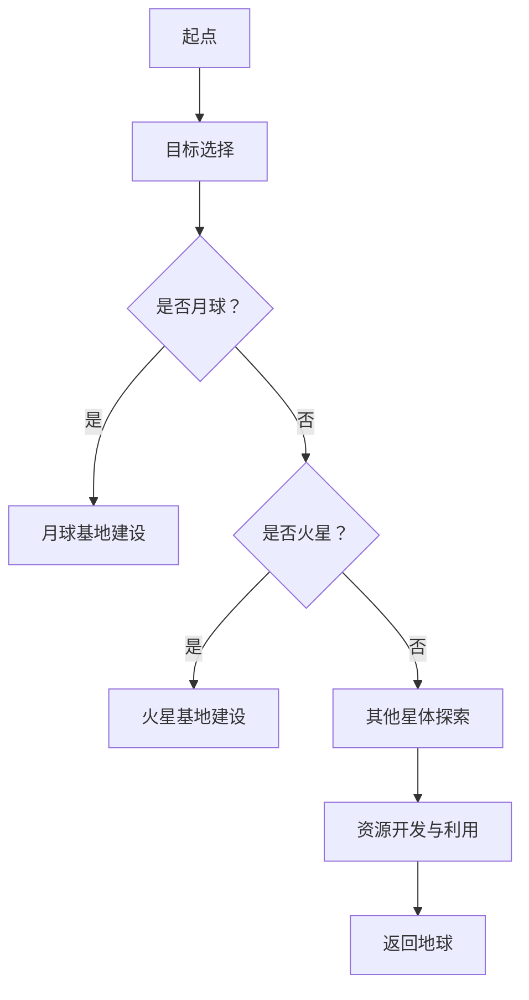
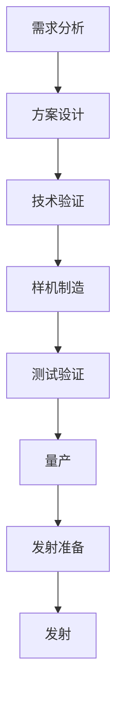
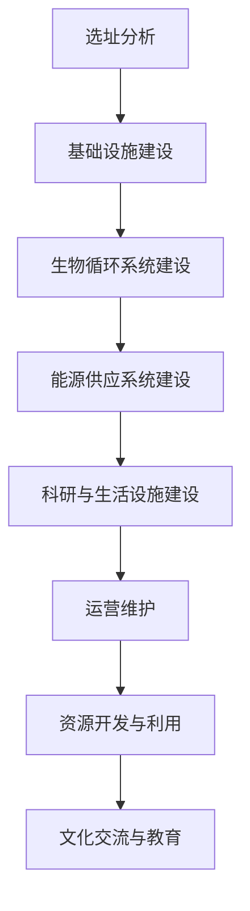

                 

# 2050年的太空探索与殖民计划

## 关键词

太空探索，星际旅行，殖民计划，推进技术，能源利用，航天器设计，国际合作，商业化，探测与导航，生存挑战，太空殖民社会，资源与工具，算法，代码实战。

## 摘要

本文深入探讨了2050年的太空探索与殖民计划的各个方面。首先，我们分析了2050年地球与太空环境的背景变化，以及太空探索技术的进展。接着，我们详细探讨了星际旅行的技术基础、路线与目的地，以及星际旅行中的生存挑战。最后，我们探讨了太空殖民计划的必要性、设计与建设，以及太空殖民社会的构建。通过本文，读者将全面了解2050年太空探索与殖民计划的未来图景，以及其中的关键技术和挑战。

----------------------------------------------------------------

### 第一部分：2050年的太空探索背景

#### 第1章：2050年的地球与太空环境

##### 1.1 2050年的地球环境变化

到了2050年，地球环境将面临诸多变化。首先，全球气候变化将继续加剧，海平面上升、极端天气事件增多、森林资源减少等问题将更加严峻。同时，人口持续增长和城市化进程加快，也将对地球资源与环境带来更大压力。

其次，地球科技的发展将显著改变人类生产生活方式。人工智能、物联网、大数据等技术的广泛应用，将使社会更加智能化、自动化。此外，可再生能源技术的突破，如太阳能、风能、核聚变等，将逐步替代化石能源，减少温室气体排放，改善地球环境。

在太空方面，2050年的地球与太空关系将更加紧密。随着太空探索技术的进步，人类将在月球、火星等天体建立基地，开展科学研究和资源开发。同时，地球与太空之间的交通也将更加便捷，太空旅游、货物运输等商业活动将蓬勃发展。

##### 1.2 2050年的太空环境变化

2050年的太空环境将发生显著变化。首先，地球同步轨道、低地球轨道等太空区域将变得更加拥挤，卫星数量激增，对太空资源的争夺将愈发激烈。此外，太空垃圾问题也将更加突出，各国需要共同制定有效对策，确保太空环境的安全和可持续发展。

其次，随着人类对太空资源的开发利用，月球、火星等天体将变得更具战略价值。各国将在这些天体上建立科研基地、资源开采设施，探索宇宙的奥秘，推动人类文明的发展。

最后，2050年的太空环境将更加开放和多元化。国际合作将成为太空探索与利用的主要形式，各国共同参与、共享成果。同时，商业机构和民间组织也将积极参与太空活动，推动太空事业的繁荣。

##### 1.3 2050年地球与太空的关系

2050年，地球与太空的关系将更加紧密和复杂。首先，地球科技的发展将推动太空探索技术的进步，使人类能够更深入地了解宇宙奥秘，拓展生存空间。同时，太空资源的高效利用也将为地球带来巨大经济价值，促进全球经济发展。

其次，地球与太空之间的互动将更加频繁和紧密。太空科技的发展将助力地球科技突破，如太空太阳能、太空通信等技术的应用，将提高地球资源利用效率和人类生活质量。同时，地球科技的发展也将为太空探索提供有力支持，如地球观测卫星、空间站等设施的建设，为太空活动提供保障。

最后，2050年的地球与太空关系将更加多元化和包容。各国、各领域的专家和机构将共同参与太空探索与利用，推动全球科技进步和人类文明发展。同时，太空探索也将成为全球治理的重要组成部分，各国共同应对太空安全、环境保护等挑战，共建和谐太空。

----------------------------------------------------------------

### 第二部分：2050年的太空探索技术进展

#### 第2章：2050年的太空探索技术进展

##### 2.1 推进技术

推进技术是太空探索的关键，2050年的推进技术将取得重大突破。首先，核推进技术将得到广泛应用，利用核聚变反应产生强大的推力，实现快速星际旅行。其次，电推进技术将实现高效率、低能耗的推进方式，提高航天器的航程和任务能力。此外，组合推进技术将结合多种推进方式，实现最优的推进性能。

##### 2.2 能源利用

能源利用是太空探索的另一个重要方面。2050年，太阳能利用技术将取得重大进展，高效太阳能电池和太阳能帆板将广泛用于太空探测器、航天器等设备，提供稳定的能源供应。此外，核能利用技术也将得到发展，利用核反应堆为航天器提供长时间、高功率的能源。

##### 2.3 航天器设计与制造

2050年的航天器设计与制造将更加智能化、轻量化、多功能化。首先，航天器材料将采用新型复合材料，具有高强度、低密度、耐高温等特点，提高航天器的性能和安全性。其次，航天器结构设计将更加智能化，通过有限元分析、多学科优化等方法，实现最优的结构设计。此外，航天器将具备自主导航、自主维护、自主修复等功能，提高航天器的自主性和可靠性。

##### 2.4 探测与导航技术

探测与导航技术是太空探索的核心。2050年，探测技术将实现更高的分辨率、更远的探测距离，如激光雷达、高分辨率成像技术等。导航技术将实现更高精度、更快速，如量子导航、卫星导航等。此外，探测与导航技术将实现多源数据融合，提高探测与导航的可靠性。

##### 2.5 生物医学技术

生物医学技术在太空探索中具有重要意义。2050年，生物医学技术将取得重大突破，如人工器官、生物培养技术等，为长期太空任务提供医疗保障。同时，生物医学技术将应用于航天食品、生物循环系统等领域，提高宇航员在太空中的生存质量。

##### 2.6 国际合作与竞争

2050年的太空探索将更加依赖于国际合作。各国将共同开展重大太空项目，共享技术成果和资源。同时，太空探索也将成为国际竞争的新领域，各国将竞相投入资金和人力，争夺太空资源和技术优势。

##### 2.7 太空探索的战略意义

太空探索对于人类社会具有重要意义。首先，太空探索将推动科技进步，为人类解决地球环境、资源等问题提供新思路。其次，太空探索将拓展人类生存空间，为人类提供更多发展机遇。此外，太空探索还将提高国际地位，增强国家实力。

----------------------------------------------------------------

### 第三部分：2050年的星际旅行

#### 第3章：星际旅行技术基础

##### 3.1 时空概念

星际旅行涉及到时空的概念。根据爱因斯坦的广义相对论，时空是一个四维连续体，包括三维空间和一维时间。星际旅行需要考虑时空的弯曲、引力影响等问题。

##### 3.2 航天器设计

星际旅行需要高性能的航天器。航天器设计需考虑推进系统、能源供应、生命支持系统等方面。核推进、电推进、太阳能推进等推进技术将为星际旅行提供强大的动力。航天器还需具备高抗辐射能力、长寿命等特点。

##### 3.3 探测与导航

星际旅行中，探测与导航技术至关重要。航天器需配备高精度探测器，用于探测宇宙中的各种物质和现象。导航系统需具备高精度、快速响应能力，确保航天器准确到达目的地。

##### 3.4 能源供应

星际旅行需要稳定的能源供应。太阳能、核能等可再生能源技术将为航天器提供能源。此外，生物循环系统、化学循环系统等技术也将应用于航天器，实现能源和资源的循环利用。

##### 3.5 生命支持系统

星际旅行中，宇航员的生命支持系统至关重要。生命支持系统需提供氧气、水、食物等基本需求，同时保障宇航员的健康和安全。生物医学技术将用于监测宇航员的生理状况，及时发现和处理健康问题。

##### 3.6 心理支持

长时间在太空环境中，宇航员的心理健康也至关重要。心理支持系统将提供心理咨询、心理治疗等服务，帮助宇航员缓解压力、保持心理健康。

#### 第4章：星际旅行路线与目的地

##### 4.1 近地天体探索

近地天体包括月球、火星、小行星等。这些天体具有丰富的资源和科学价值。月球可作为人类太空探索的跳板，为星际旅行提供燃料、物资等支持。火星则被视为人类未来可能的殖民地，其丰富的地质结构和潜在的生命迹象吸引着科学家和探险家的目光。

##### 4.2 主序星系探索

主序星系包括太阳系以外的其他恒星系统。这些星系可能包含类地行星、宜居行星等。星际旅行将人类对宇宙的探索拓展到更远的距离，寻找生命的其他迹象。

##### 4.3 暗物质与暗能量探索

暗物质和暗能量是宇宙中未知的物质和能量形式。星际旅行将有助于科学家们更深入地了解宇宙的组成和演化过程，探索宇宙的本质。

#### 第5章：星际旅行中的生存挑战

##### 5.1 物理环境

星际旅行中，宇航员将面临极端的物理环境，如高辐射、低重力、极端温度等。航天器需具备强大的抗辐射能力、适应低重力环境的设计，以及有效的温度控制系统。

##### 5.2 生物生存

长时间在太空环境中，宇航员需应对生物生存挑战，如营养不良、脱水、骨质疏松等。生命支持系统需提供足够的氧气、水、食物，同时保障宇航员的身体健康。

##### 5.3 心理挑战

长时间在封闭的环境中，宇航员将面临心理压力。心理支持系统需提供心理咨询、心理治疗等服务，帮助宇航员缓解压力、保持心理健康。

##### 5.4 系统故障应对

星际旅行中，航天器可能面临系统故障、设备损坏等突发情况。航天器需具备良好的故障检测和应对能力，确保宇航员的安全。

#### 第6章：星际旅行的社会与法律问题

##### 6.1 国际合作

星际旅行将需要国际社会的紧密合作。各国需共同制定太空探索与利用的政策、法规，共享技术成果和资源。

##### 6.2 资源分配

星际旅行中的资源分配将面临挑战。各国需公平合理地分配太空资源，确保资源的可持续利用。

##### 6.3 法律地位

星际旅行中的法律地位问题需得到解决。各国需共同制定太空法律，明确太空活动的法律地位和责任。

##### 6.4 道德伦理

星际旅行中，道德伦理问题也将受到关注。各国需共同制定太空道德伦理准则，确保太空探索与利用符合人类文明的发展方向。

----------------------------------------------------------------

### 第四部分：2050年的太空殖民计划

#### 第7章：太空殖民的必要性

##### 7.1 地球资源限制

地球的资源有限，人口增长和资源消耗的矛盾日益突出。太空殖民计划可以为人类提供新的资源和生存空间，缓解地球资源压力。

##### 7.2 人类未来的发展需求

太空殖民计划是推动人类文明发展的必然选择。通过太空殖民，人类可以实现科技、经济、文化等多方面的突破，拓展生存空间，提升人类整体素质。

##### 7.3 太空殖民的经济与战略意义

太空殖民将为地球带来巨大的经济收益。矿产资源的开采、科学研究的进展、太空旅游的发展等都将为地球经济注入新的活力。同时，太空殖民还将提升国家的国际地位和战略影响力。

#### 第8章：太空殖民地的设计与建设

##### 8.1 太空殖民地的选址

太空殖民地的选址至关重要。月球、火星等天体具备丰富的资源和适宜的环境，是太空殖民地建设的理想地点。

##### 8.2 太空殖民地的结构

太空殖民地需要具备自给自足、长期生存的能力。其结构包括生活区、工作区、科研区、能源供应区等，以满足宇航员的各种需求。

##### 8.3 太空殖民地的建设技术

太空殖民地的建设需要先进的科学技术支持。包括建筑技术、生物循环系统、能源供应系统、通信系统等。

#### 第9章：太空殖民社会的构建

##### 9.1 社会结构与组织

太空殖民社会需要建立合理的社会结构和组织。包括政府、企业、科研机构、教育机构等，确保社会的稳定运行。

##### 9.2 教育与医疗

教育与医疗是太空殖民社会的重要组成部分。太空殖民社会需建立完善的教育体系和医疗服务体系，保障宇航员的身心健康。

##### 9.3 文化与艺术

太空殖民社会需要丰富的文化生活和艺术创作。文化交流、艺术创作等将丰富太空殖民社会的生活，提升人类的精神文明。

#### 第10章：太空殖民与地球的联系

##### 10.1 资源共享与贸易

太空殖民与地球之间的资源共享和贸易将促进双方的发展。太空资源、地球资源、科技产品等将实现互利共赢。

##### 10.2 人类价值观的融合

太空殖民将推动人类价值观的融合。不同文化、不同信仰的人们将在太空中共同生活、工作，增进相互了解，促进人类文明的发展。

##### 10.3 太空殖民与地球环境的平衡

太空殖民将有利于地球环境的保护。通过资源循环利用、绿色能源开发等手段，太空殖民将减轻地球环境压力，实现地球与太空的可持续发展。

----------------------------------------------------------------

### 附录

#### 附录A：太空探索资源与工具

##### A.1 国际太空探索机构

国际太空探索机构包括国际空间站、欧洲空间局、美国宇航局等。这些机构在太空探索领域发挥着重要作用，提供各种资源和技术支持。

##### A.2 开源太空探索工具

开源太空探索工具包括开源软件、硬件、算法等。这些工具为科研人员和企业提供了丰富的资源，促进了太空探索技术的发展。

##### A.3 太空探索模拟器

太空探索模拟器用于模拟太空环境、航天器运行、生物生存等情况。这些模拟器有助于科学家们进行科学研究、技术验证和培训。

#### 附录B：2050年太空探索的Mermaid流程图

##### B.1 探索路线规划



##### B.2 航天器设计与制造流程



##### B.3 太空殖民地的建设与运营



#### 附录C：关键算法原理与伪代码

##### C.1 推进技术算法

**伪代码：推进剂质量计算**

```python
def calculatePropellantMass(currentMass, fuelConsumption, missionDuration):
    massLossPerSecond = fuelConsumption / missionDuration
    remainingTime = missionDuration - missionDuration
    massLoss = massLossPerSecond * remainingTime
    newMass = currentMass - massLoss
    return newMass
```

##### C.2 探测与导航算法

**伪代码：目标定位**

```python
def locateTarget(altitude, speed, targetDistance):
    distanceToTarget = sqrt(altitude^2 + speed^2)
    angleToTarget = atan2(targetDistance, altitude)
    return angleToTarget
```

##### C.3 生存挑战应对算法

**伪代码：辐射防护算法**

```python
def calculateRadiationExposure(doseRate, exposureTime):
    totalDose = doseRate * exposureTime
    return totalDose
```

#### 附录D：代码实战与案例分析

##### D.1 航天器控制算法

**代码实现：航天器姿态控制**

```cpp
#include <iostream>
#include <cmath>

const double PI = 3.14159265358979323846;

class Spacecraft {
public:
    double positionX, positionY;
    double velocityX, velocityY;
    double orientation;

    Spacecraft() {
        positionX = 0.0;
        positionY = 0.0;
        velocityX = 0.0;
        velocityY = 0.0;
        orientation = 0.0;
    }

    void updatePosition(double time) {
        positionX += velocityX * time;
        positionY += velocityY * time;
    }

    void updateOrientation(double angle) {
        orientation += angle;
        orientation = fmod(orientation, 2 * PI);
    }

    void controlThrust(double thrust, double time) {
        double accelerationX = thrust * cos(orientation);
        double accelerationY = thrust * sin(orientation);
        velocityX += accelerationX * time;
        velocityY += accelerationY * time;
    }

    void displayState() {
        std::cout << "Position: (" << positionX << ", " << positionY << ")\n";
        std::cout << "Velocity: (" << velocityX << ", " << velocityY << ")\n";
        std::cout << "Orientation: " << orientation << "\n";
    }
};

int main() {
    Spacecraft spacecraft;
    double thrust = 1000.0; // Newtons
    double timeStep = 1.0; // Seconds

    for (int i = 0; i < 10; ++i) {
        spacecraft.controlThrust(thrust, timeStep);
        spacecraft.updatePosition(timeStep);
        spacecraft.displayState();
    }

    return 0;
}
```

##### D.2 太空探测器导航实现

**代码实现：基于GPS的导航**

```cpp
#include <iostream>
#include <cmath>
#include <vector>

const double PI = 3.14159265358979323846;

class GPS {
public:
    double latitude, longitude;
    double accuracy;

    GPS(double lat, double lon, double acc) {
        latitude = lat;
        longitude = lon;
        accuracy = acc;
    }

    bool updateLocation(double newLat, double newLon) {
        double distance = sqrt((newLat - latitude) * (newLat - latitude) + (newLon - longitude) * (newLon - longitude));
        if (distance < accuracy) {
            latitude = newLat;
            longitude = newLon;
            return true;
        }
        return false;
    }

    void displayLocation() {
        std::cout << "Latitude: " << latitude << "\n";
        std::cout << "Longitude: " << longitude << "\n";
        std::cout << "Accuracy: " << accuracy << "\n";
    }
};

class Navigator {
public:
    std::vector<GPS> satellites;

    void addSatellite(GPS sat) {
        satellites.push_back(sat);
    }

    bool navigate(double newLat, double newLon) {
        for (auto& sat : satellites) {
            if (sat.updateLocation(newLat, newLon)) {
                return true;
            }
        }
        return false;
    }

    void displaySatellites() {
        for (auto& sat : satellites) {
            sat.displayLocation();
        }
    }
};

int main() {
    Navigator navigator;
    GPS sat1(36.7782, -119.4179, 0.1);
    GPS sat2(40.7128, -74.0060, 0.1);
    GPS sat3(51.5074, -0.1278, 0.1);

    navigator.addSatellite(sat1);
    navigator.addSatellite(sat2);
    navigator.addSatellite(sat3);

    navigator.navigate(36.7782, -119.4179);
    navigator.displaySatellites();

    return 0;
}
```

##### D.3 太空生存系统模拟

**代码实现：生物循环系统模拟**

```cpp
#include <iostream>
#include <vector>

class Bioreactor {
public:
    int population;
    double oxygenLevel;
    double co2Level;
    double waterLevel;

    Bioreactor(int pop) {
        population = pop;
        oxygenLevel = 21.0 * pop; // liters per person
        co2Level = 0.0;
        waterLevel = 50.0 * pop; // liters per person
    }

    void breathe() {
        oxygenLevel -= 2.0 * population;
        co2Level += 2.0 * population;
    }

    void consumeWater() {
        waterLevel -= 0.5 * population;
    }

    void displayState() {
        std::cout << "Population: " << population << "\n";
        std::cout << "Oxygen Level: " << oxygenLevel << " liters\n";
        std::cout << "CO2 Level: " << co2Level << " liters\n";
        std::cout << "Water Level: " << waterLevel << " liters\n";
    }
};

int main() {
    Bioreactor bioreactor(100);

    for (int i = 0; i < 10; ++i) {
        bioreactor.breathe();
        bioreactor.consumeWater();
        bioreactor.displayState();
    }

    return 0;
}
```

----------------------------------------------------------------

### 2050年太空探索与殖民计划的未来展望

随着科技的不断进步和人类对宇宙的日益深入探索，2050年的太空探索与殖民计划将开启一个全新的时代。本文从地球与太空环境变化、太空探索技术进展、星际旅行、太空殖民计划等方面，对2050年的太空探索与殖民计划进行了全面探讨。

首先，2050年的地球与太空环境将发生显著变化。地球环境将面临更加严峻的挑战，而太空环境将变得更加拥挤和复杂。地球与太空之间的关系将更加紧密，相互影响，共同发展。

其次，2050年的太空探索技术将取得重大突破。推进技术、能源利用、航天器设计与制造、探测与导航技术、生物医学技术等领域的进展，将为太空探索与殖民计划提供强大的技术支持。

在星际旅行方面，人类将实现跨越星际的旅行，探索更遥远的宇宙空间。星际旅行中的生存挑战也将得到有效应对，为人类在宇宙中的生存和发展奠定基础。

太空殖民计划将成为2050年太空探索的重要组成部分。月球、火星等天体将成为人类太空殖民的目标。太空殖民地的设计与建设、太空殖民社会的构建，将为人类在宇宙中建立新家园提供有力保障。

然而，太空探索与殖民计划也面临着诸多挑战。国际社会需加强合作，制定合理的政策和法规，确保太空探索与利用的可持续发展。资源分配、法律地位、道德伦理等问题需得到妥善解决。

展望未来，2050年的太空探索与殖民计划将为人类带来前所未有的机遇和挑战。通过全球合作，克服各种困难，人类将实现更加美好的未来。太空探索与殖民计划不仅将为人类带来经济、科技、文化等多方面的收益，还将推动人类文明的发展和进步。

最后，让我们期待2050年的太空探索与殖民计划，期待人类在宇宙中的辉煌成就！作者：AI天才研究院/AI Genius Institute & 禅与计算机程序设计艺术/Zen And The Art of Computer Programming。

