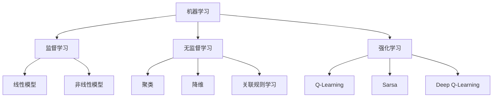

                 

# 《机器学习原理与代码实例讲解》

## 概述

在人工智能领域，机器学习是核心支柱之一。它通过算法让计算机自动从数据中学习规律，无需显式编程。本文章旨在系统讲解机器学习的基础原理、常用算法，并通过代码实例加深理解，帮助读者掌握这一重要技术。

文章核心关键词包括：机器学习、监督学习、无监督学习、强化学习、深度学习、特征工程、模型评估等。

本文结构如下：

- 第一部分：机器学习基础
- 第二部分：特征工程
- 第三部分：监督学习算法
- 第四部分：无监督学习算法
- 第五部分：强化学习
- 第六部分：深度学习基础
- 第七部分：机器学习项目实战
- 附录：机器学习常用工具与库对比

## 摘要

本文将详细讲解机器学习的基本原理和算法，包括监督学习、无监督学习和强化学习。我们将通过丰富的代码实例，深入剖析各种算法的实现细节，帮助读者理解机器学习的本质。此外，还将介绍深度学习的基础知识和应用，以及如何将机器学习应用于实际项目。通过本文的学习，读者将能够掌握机器学习的基本技能，为未来的研究和工作打下坚实的基础。

### 《机器学习原理与代码实例讲解》目录大纲

#### 第一部分: 机器学习基础

- 第1章: 机器学习概述
  - 1.1 机器学习的定义与分类
  - 1.2 机器学习的数学基础
  - 1.3 数据预处理

- 第2章: 特征工程
  - 2.1 特征选择
  - 2.2 特征提取
  - 2.3 特征构造

#### 第二部分: 监督学习算法

- 第3章: 线性回归
  - 3.1 线性回归原理
  - 3.2 梯度下降算法

- 第4章: 分类算法
  - 4.1 逻辑回归
  - 4.2 决策树
  - 4.3 随机森林
  - 4.4 支持向量机（SVM）

- 第5章: 回归算法
  - 5.1 K近邻（KNN）
  - 5.2 K均值聚类（K-means）

#### 第三部分: 无监督学习算法

- 第6章: K均值聚类
  - 6.1 算法原理
  - 6.2 实践应用

- 第7章: 主成分分析（PCA）
  - 7.1 算法原理
  - 7.2 实践应用

- 第8章: 聚类评估
  - 8.1 调整簇数
  - 8.2 聚类评价指标

#### 第四部分: 强化学习

- 第9章: 强化学习的基本概念
  - 9.1 奖励函数
  - 9.2 状态转移概率

- 第10章: Q-Learning算法
  - 10.1 算法原理
  - 10.2 实践应用

- 第11章: Deep Q-Learning算法
  - 11.1 算法原理
  - 11.2 实践应用

#### 第五部分: 深度学习基础

- 第12章: 神经网络基础
  - 12.1 神经元模型
  - 12.2 前向传播与反向传播

- 第13章: 卷积神经网络（CNN）
  - 13.1 算法原理
  - 13.2 实践应用

- 第14章: 循环神经网络（RNN）
  - 14.1 算法原理
  - 14.2 实践应用

- 第15章: 长短时记忆网络（LSTM）
  - 15.1 算法原理
  - 15.2 实践应用

#### 第六部分: 机器学习项目实战

- 第16章: 数据集准备
  - 16.1 数据获取
  - 16.2 数据预处理

- 第17章: 模型选择与训练
  - 17.1 模型选择
  - 17.2 模型训练

- 第18章: 模型评估与优化
  - 18.1 评估指标
  - 18.2 模型优化

- 第19章: 项目实战案例
  - 19.1 代码实现
  - 19.2 结果分析

#### 附录

- 附录A: 机器学习常用工具与库
- 附录B: 机器学习框架对比

### 第一部分: 机器学习基础

#### 第1章: 机器学习概述

机器学习是人工智能的一个重要分支，其核心思想是让计算机从数据中自动学习和发现规律。机器学习可以分为三大类：监督学习、无监督学习和强化学习。监督学习通过已标记的数据训练模型，无监督学习则是在没有标记数据的情况下进行学习，而强化学习是通过与环境的交互来学习最佳策略。

## 1.1 机器学习的定义与分类

### 1.1.1 机器学习的定义

机器学习是一种基于数据驱动的学习方法，通过构建模型来对未知数据进行预测或分类。它的基本流程包括数据收集、数据预处理、模型训练、模型评估和模型部署。

### 1.1.2 机器学习的分类

1. **监督学习（Supervised Learning）**

监督学习是一种最常见的机器学习方法，它使用标记数据（即每个样本都有对应的标签）来训练模型。根据模型的形式和假设，监督学习可以分为线性模型和非线性模型。

   - **线性模型**：例如线性回归和逻辑回归。
   - **非线性模型**：例如决策树、支持向量机和神经网络。

2. **无监督学习（Unsupervised Learning）**

无监督学习不依赖于标记数据，其目标是发现数据中的内在结构或规律。常见的无监督学习方法包括聚类、降维和关联规则学习。

   - **聚类**：如K-means聚类和层次聚类。
   - **降维**：如主成分分析（PCA）和t-SNE。
   - **关联规则学习**：如Apriori算法。

3. **强化学习（Reinforcement Learning）**

强化学习是一种通过与环境的交互来学习的方法，其主要目标是找到一条最佳策略，使得在长期运行中获得的回报最大化。强化学习算法包括Q-Learning、Sarsa和Deep Q-Learning等。

### 1.1.3 监督学习、无监督学习和强化学习的联系与区别

- **联系**：

  监督学习、无监督学习和强化学习都是机器学习的不同应用场景，它们都旨在通过数据和算法发现数据中的规律。

- **区别**：

  - **数据类型**：监督学习使用标记数据，无监督学习使用未标记数据，强化学习则通过奖励信号与环境互动。
  - **目标**：监督学习的目标是预测或分类，无监督学习的目标是发现数据中的结构，强化学习的目标是找到最佳策略。
  - **算法**：监督学习算法通常基于数学模型，如线性模型、决策树等；无监督学习算法更多是基于迭代方法，如K-means、PCA等；强化学习算法则通常涉及复杂的策略优化方法，如Q-Learning、Deep Q-Learning等。

### 1.1.4 Mermaid流程图

以下是一个简单的Mermaid流程图，展示了机器学习的三大类方法及其关系：



### 1.2 机器学习的数学基础

为了深入理解机器学习算法，我们需要掌握一些基础的数学知识，包括线性代数和概率论。以下是这些数学基础的重要概念。

#### 线性代数基础

1. **矩阵与向量操作**

   - **矩阵**：是一个二维数组，通常用于表示数据或变换。
   - **向量**：是一个一维数组，通常用于表示特征或数据点。

2. **线性方程组求解**

   - **高斯消元法**：用于求解线性方程组。
   - **矩阵分解**：如LU分解、QR分解等，用于简化计算。

#### 概率论基础

1. **概率空间**

   - **样本空间**：所有可能结果的集合。
   - **概率分布**：描述随机变量的可能结果及其概率。

2. **条件概率与贝叶斯公式**

   - **条件概率**：在某个事件发生的前提下，另一个事件发生的概率。
   - **贝叶斯公式**：用于计算后验概率和更新概率分布。

### 1.3 数据预处理

数据预处理是机器学习过程中的关键步骤，它包括数据清洗、特征提取和归一化。以下是这些步骤的详细解释。

#### 1.3.1 数据清洗

数据清洗的主要任务是处理不完整、错误或异常的数据。常见的数据清洗方法包括：

- **缺失值处理**：可以使用均值、中位数、最大值等填充缺失值。
- **异常值处理**：可以通过统计学方法（如IQR）或基于业务逻辑的方法进行检测和处理。

#### 1.3.2 特征提取

特征提取是指从原始数据中提取出对模型训练有用的特征。常见的特征提取方法包括：

- **特征抽取**：使用统计学方法提取出核心特征。
- **特征选择**：通过评估特征的重要性来选择最有用的特征。

#### 1.3.3 数据归一化

数据归一化是将不同特征的范围调整为相同范围，以消除不同特征之间的影响。常见的数据归一化方法包括：

- **Min-Max归一化**：将特征值缩放到[0, 1]范围内。
- **标准化**：将特征值缩放到均值为0，标准差为1的范围内。

### 1.4 特征工程

特征工程是提高模型性能的重要手段，它包括特征选择、特征提取和特征构造。以下是这些技术的详细解释。

#### 1.4.1 特征选择

特征选择是指从原始特征中选取出对模型训练最有用的特征。常用的特征选择方法包括：

- **重要性排序**：使用模型评估结果对特征进行排序。
- **过滤式方法**：使用统计学方法评估特征的重要性。
- **包装式方法**：结合模型选择和特征选择进行迭代优化。

#### 1.4.2 特征提取

特征提取是指从原始特征中提取出新的特征，以增强模型的表现。常用的特征提取方法包括：

- **主成分分析（PCA）**：通过线性变换将高维数据投影到低维空间。
- **t-SNE**：通过非线性变换将高维数据可视化。

#### 1.4.3 特征构造

特征构造是指通过组合原始特征来构建新的特征。常用的特征构造方法包括：

- **特征交叉**：通过组合不同特征来创建新的特征。
- **特征缩放**：对特征进行标准化或归一化，以提高模型的性能。

## 第2章: 特征工程

特征工程是机器学习过程中至关重要的一环，它关系到模型的性能和可解释性。在本章中，我们将深入探讨特征工程的核心概念，包括特征选择、特征提取和特征构造。通过理解这些方法，读者可以更好地处理数据，提高模型的表现。

### 2.1 特征选择

特征选择是一个筛选过程，旨在从原始特征中挑选出最有用的特征，以提高模型性能并减少计算开销。有效的特征选择可以显著提高模型的准确性和可解释性。以下是几种常见的特征选择方法：

#### 2.1.1 重要性排序

重要性排序是一种基于模型评估结果的筛选方法。具体步骤如下：

1. 使用一个监督学习模型对数据进行训练，并评估每个特征的贡献。
2. 根据特征的重要性排序，选择排名靠前的特征。

重要性的评估方法可以基于不同模型的特点，如：

- **决策树**：使用树结构的叶节点的重要性度量特征的重要性。
- **随机森林**：计算每个特征在所有树中的重要性。
- **线性模型**：使用特征对模型预测误差的敏感度来评估重要性。

#### 2.1.2 过滤式方法

过滤式方法是一种基于统计学方法的特征选择方法，其步骤如下：

1. 计算每个特征的相关性或信息增益。
2. 根据阈值选择相关度较高的特征。

常见的方法包括：

- **卡方检验**：用于评估特征与目标变量之间的独立性。
- **互信息**：用于评估特征与目标变量之间的依赖程度。
- **F值**：结合特征的重要性和类别分布来评估特征。

#### 2.1.3 包装式方法

包装式方法是一种基于模型评估和特征选择迭代的筛选方法。其步骤如下：

1. 选择一个基模型，用于评估特征集。
2. 使用交叉验证选择特征子集。
3. 在新的特征子集上重新训练模型，并评估性能。

常见的包装式方法包括：

- **递归特征消除（RFE）**：逐步减少特征数量，直到找到一个最佳子集。
- **随机优化**：使用启发式方法搜索最佳特征子集。

### 2.2 特征提取

特征提取是将原始特征转换为更有效的特征表示的过程。这有助于提高模型的性能和可解释性。以下是几种常用的特征提取方法：

#### 2.2.1 主成分分析（PCA）

主成分分析（PCA）是一种降维技术，通过线性变换将高维数据投影到低维空间，以减少数据冗余。PCA的主要步骤如下：

1. 计算协方差矩阵。
2. 计算协方差矩阵的特征值和特征向量。
3. 选择最大的特征值对应的特征向量，作为新的特征空间。
4. 将原始数据投影到新的特征空间。

#### 2.2.2 t-SNE

t-SNE（t-Distributed Stochastic Neighbor Embedding）是一种非线性的降维技术，适用于可视化高维数据。t-SNE的主要步骤如下：

1. 计算数据的局部邻域概率分布。
2. 使用梯度下降优化概率分布，以最小化数据的Kullback-Leibler散度。
3. 将优化后的概率分布映射到低维空间。

### 2.3 特征构造

特征构造是通过组合原始特征来创建新的特征，以提高模型的表现。以下是几种常用的特征构造方法：

#### 2.3.1 特征交叉

特征交叉是通过组合不同特征来创建新的特征。这种方法可以增加特征之间的交互，提高模型的复杂度。例如，在分类问题中，可以将不同特征进行组合，如“年龄*收入”来表示一个新特征。

#### 2.3.2 特征缩放

特征缩放是将特征值缩放到相同的范围，以消除不同特征之间的影响。常用的方法包括：

- **Min-Max归一化**：将特征值缩放到[0, 1]范围内。
- **标准化**：将特征值缩放到均值为0，标准差为1的范围内。

### 2.4 综合示例

为了更好地理解特征工程的方法，我们可以通过一个简单的例子来说明。

假设我们有一个住房价格预测问题，数据集包含多个特征：面积、房间数、建造年份等。以下是特征工程的步骤：

1. **数据清洗**：处理缺失值和异常值。
2. **特征选择**：使用重要性排序和过滤式方法选择最重要的特征。
3. **特征提取**：使用PCA降维，减少数据冗余。
4. **特征构造**：通过特征交叉创建新的特征，如“房间数*建造年份”。
5. **特征缩放**：使用标准化方法缩放特征值。

通过以上步骤，我们可以创建一个更加有效的特征集，从而提高住房价格预测模型的性能。

### 2.5 总结

特征工程是机器学习过程中的关键环节，它通过选择、提取和构造特征，提高了模型的性能和可解释性。在本章中，我们介绍了特征选择、特征提取和特征构造的几种常见方法，并通过一个实际例子展示了如何应用这些方法。掌握特征工程的方法对于成功应用机器学习至关重要。

## 第3章: 监督学习算法

监督学习是机器学习中最常见的一种学习方法，其核心思想是通过已标记的训练数据来学习数据中的规律，以便对未知数据进行预测或分类。本章将介绍几种基本的监督学习算法，包括线性回归、分类算法和回归算法。

### 3.1 线性回归

线性回归是一种简单的监督学习算法，它通过拟合一条直线或超平面来预测连续值输出。线性回归的数学基础是假设数据点满足线性关系，其模型可以表示为：

\[ y = \theta_0 + \theta_1 \cdot x_1 + \theta_2 \cdot x_2 + ... + \theta_n \cdot x_n \]

其中，\( y \) 是输出值，\( x_1, x_2, ..., x_n \) 是输入特征值，\( \theta_0, \theta_1, ..., \theta_n \) 是模型参数。

#### 3.1.1 梯度下降算法

梯度下降算法是求解线性回归参数的一种常用方法，其基本思想是通过迭代更新模型参数，以最小化损失函数。线性回归的损失函数通常采用均方误差（MSE）：

\[ J(\theta) = \frac{1}{2m} \sum_{i=1}^{m} (h_\theta(x^{(i)}) - y^{(i)})^2 \]

其中，\( m \) 是训练样本数量，\( h_\theta(x) \) 是模型的预测值。

梯度下降算法的步骤如下：

1. 初始化模型参数 \( \theta \)。
2. 计算损失函数的梯度 \( \frac{\partial J(\theta)}{\partial \theta} \)。
3. 更新模型参数：\( \theta = \theta - \alpha \cdot \frac{\partial J(\theta)}{\partial \theta} \)，其中 \( \alpha \) 是学习率。

梯度下降的伪代码实现如下：

```python
def gradient_descent(X, y, theta, alpha, num_iters):
    m = len(y)
    J_history = []

    for i in range(num_iters):
        hypothesis = X * theta
        error = hypothesis - y
        gradient = X.T * error / m
        theta = theta - alpha * gradient
        J_history.append(calculate_cost(hypothesis, y))

    return theta, J_history
```

#### 3.1.2 拟合与评估

在训练线性回归模型时，我们需要对模型进行拟合和评估。拟合是指找到一组模型参数，使模型对训练数据的预测误差最小。评估则是通过测试数据来评估模型的泛化能力。

- **拟合**：使用梯度下降算法找到最佳模型参数。
- **评估**：通常使用均方误差（MSE）或均方根误差（RMSE）来评估模型的拟合程度。

### 3.2 分类算法

分类算法用于预测离散的输出值，即将输入数据划分为不同的类别。本章将介绍几种常见的分类算法，包括逻辑回归、决策树、随机森林和支撑向量机（SVM）。

#### 3.2.1 逻辑回归

逻辑回归是一种广义线性模型，用于分类问题。它通过拟合一个逻辑函数来预测类别的概率，模型可以表示为：

\[ P(y=1 | x; \theta) = \frac{1}{1 + e^{-(\theta_0 + \theta_1 x_1 + \theta_2 x_2 + ... + \theta_n x_n)}} \]

其中，\( \theta_0, \theta_1, ..., \theta_n \) 是模型参数，\( x_1, x_2, ..., x_n \) 是输入特征值。

逻辑回归的预测过程如下：

1. 计算输入数据的预测概率。
2. 将概率阈值设置为0.5，大于0.5的预测为类别1，小于0.5的预测为类别0。

逻辑回归的梯度下降算法与线性回归类似，但损失函数变为对数似然损失：

\[ J(\theta) = -\frac{1}{m} \sum_{i=1}^{m} [y^{(i)} \cdot \log(h_\theta(x^{(i)})) + (1 - y^{(i)}) \cdot \log(1 - h_\theta(x^{(i)}))] \]

#### 3.2.2 决策树

决策树是一种基于树形结构的分类算法，它通过一系列的判断条件来对数据进行分类。每个节点代表一个特征，每个分支代表一个特征取值，叶节点表示最终的类别。

决策树的构建过程如下：

1. 计算每个特征的信息增益或基尼不纯度。
2. 选择信息增益最大的特征作为当前节点的分割特征。
3. 根据分割特征将数据划分为子集。
4. 递归构建子决策树，直到满足停止条件（如最大深度、最小叶子节点样本数等）。

#### 3.2.3 随机森林

随机森林是一种基于决策树的集成学习方法，它通过构建多棵决策树来提高模型的泛化能力。随机森林的工作原理如下：

1. 从训练数据中随机抽取样本和特征子集。
2. 使用子集构建决策树。
3. 对每个决策树进行预测，并取多数表决的结果作为最终预测。

随机森林的优势在于它可以有效地减少过拟合，提高模型的泛化能力。

#### 3.2.4 支撑向量机（SVM）

支撑向量机是一种基于间隔最大化的分类算法，其目标是在特征空间中找到一个超平面，将不同类别的数据点尽可能分开。SVM的数学基础如下：

\[ \max_{\theta, \xi} \frac{1}{2} ||\theta||^2 - C \sum_{i=1}^{m} \xi_i \]

其中，\( \theta \) 是模型参数，\( \xi_i \) 是松弛变量，\( C \) 是惩罚参数。

SVM的求解通常使用SMO（Sequential Minimal Optimization）算法，它是一种基于启发式的方法，可以有效地解决大规模的SVM问题。

### 3.3 回归算法

回归算法用于预测连续值输出，包括K近邻（KNN）和K均值聚类（K-means）。

#### 3.3.1 K近邻（KNN）

K近邻算法是一种简单而直观的回归算法，它通过计算测试样本与训练样本的距离来确定预测值。具体步骤如下：

1. 计算测试样本与训练样本之间的距离。
2. 选择距离最近的 \( k \) 个训练样本。
3. 对 \( k \) 个训练样本的输出值进行平均，作为测试样本的预测值。

KNN算法的关键参数是 \( k \) 的选择，通常需要通过交叉验证来确定最佳值。

#### 3.3.2 K均值聚类（K-means）

K均值聚类是一种基于距离的聚类算法，它将数据划分为 \( k \) 个簇，每个簇的中心代表该簇的特征。K均值聚类的工作原理如下：

1. 随机初始化 \( k \) 个簇中心。
2. 计算每个样本与簇中心的距离。
3. 将每个样本分配到距离最近的簇中心。
4. 更新每个簇的中心。
5. 重复步骤2-4，直到簇中心不再变化或达到最大迭代次数。

K均值聚类的关键参数是 \( k \) 的选择和初始簇中心的设定。

### 3.4 综合示例

为了更好地理解监督学习算法，我们可以通过一个实际例子来演示。

假设我们有一个房屋价格预测问题，数据集包含房屋的面积、房间数、建造年份等特征，以及房屋的价格作为输出值。以下是使用线性回归和K近邻算法进行预测的步骤：

1. **数据预处理**：处理缺失值和异常值，进行特征缩放。
2. **线性回归**：使用梯度下降算法训练线性回归模型。
3. **K近邻**：设置合适的 \( k \) 值，计算测试样本与训练样本的距离，进行预测。

通过比较不同算法的预测性能，我们可以选择最佳的算法来解决问题。

### 3.5 总结

监督学习是机器学习中的核心方法，它通过已标记的数据来学习数据中的规律，用于预测或分类。本章介绍了线性回归、分类算法和回归算法的基本原理和实现方法。通过实际示例，读者可以更好地理解这些算法的应用和效果。掌握这些监督学习算法对于解决实际问题至关重要。

## 第4章: 无监督学习算法

无监督学习是机器学习的一个重要分支，它不依赖于已标记的数据，而是通过发现数据中的内在结构和规律来对数据进行分析和解释。本章将介绍几种常见的无监督学习算法，包括K均值聚类、主成分分析（PCA）和聚类评估。

### 4.1 K均值聚类

K均值聚类是一种迭代优化算法，其目标是将数据划分为 \( k \) 个簇，使得每个簇内的数据点彼此相似，而不同簇的数据点差异较大。K均值聚类的基本步骤如下：

1. **初始化**：随机选择 \( k \) 个数据点作为初始簇中心。
2. **分配**：对于每个数据点，计算其与各个簇中心的距离，并将其分配到最近的簇。
3. **更新**：重新计算每个簇的中心，即取簇内所有数据点的均值。
4. **迭代**：重复步骤2和步骤3，直到簇中心不再变化或达到预设的迭代次数。

K均值聚类的关键参数是 \( k \) 的选择，通常需要通过肘部法则（Elbow Method）或Silhouette Coefficient来选择最佳值。

#### 4.1.1 算法原理

K均值聚类基于最小化簇内平方误差的原则，其目标函数为：

\[ J(\mu) = \sum_{i=1}^{k} \sum_{x \in S_i} ||x - \mu_i||^2 \]

其中，\( \mu_i \) 是第 \( i \) 个簇的中心，\( S_i \) 是第 \( i \) 个簇中的数据点集合。

#### 4.1.2 实践应用

K均值聚类广泛应用于数据挖掘和数据分析领域，例如：

- **文本聚类**：将相似的文本文档划分为同一簇。
- **图像聚类**：将相似的图像划分为同一簇。
- **社交网络分析**：将具有相似兴趣的社交网络用户划分为同一簇。

### 4.2 主成分分析（PCA）

主成分分析（PCA）是一种降维技术，它通过线性变换将高维数据投影到低维空间，以减少数据冗余并提高分析效率。PCA的基本步骤如下：

1. **标准化**：将数据集的每个特征缩放到相同的范围，以消除不同特征之间的影响。
2. **计算协方差矩阵**：计算数据集的协方差矩阵，该矩阵反映了各个特征之间的相关性。
3. **计算特征值和特征向量**：对协方差矩阵进行特征值分解，得到特征值和特征向量。
4. **选择主成分**：根据特征值的大小选择前 \( p \) 个特征向量，作为新的特征空间。
5. **数据投影**：将原始数据投影到新的特征空间。

PCA的目标是找到一组正交方向，使得沿着这些方向的数据方差最大。这些方向被称为主成分，它们代表了数据中的主要变化趋势。

#### 4.2.1 算法原理

PCA的数学基础是特征值分解，其核心公式为：

\[ \Sigma = PDP^T \]

其中，\( \Sigma \) 是协方差矩阵，\( P \) 是特征向量矩阵，\( D \) 是特征值矩阵。

通过特征值分解，我们可以将数据从高维空间投影到低维空间，从而减少数据维度。

#### 4.2.2 实践应用

PCA广泛应用于数据分析和可视化领域，例如：

- **图像压缩**：通过减少图像的维度来降低数据大小。
- **异常检测**：通过识别数据中的异常点来检测异常情况。
- **聚类分析**：通过降低数据维度来简化聚类过程。

### 4.3 聚类评估

聚类评估是评估聚类算法性能的重要步骤，它通过评估指标来衡量聚类结果的质量。以下是几种常见的聚类评估指标：

#### 4.3.1 调整簇数

在K均值聚类中，选择合适的 \( k \) 值是一个关键问题。以下几种方法可以用于调整簇数：

- **肘部法则（Elbow Method）**：通过绘制簇数与平方误差的关系图，找到误差最小化的簇数。
- **Silhouette Coefficient**：通过计算每个数据点与其簇内其他数据点的相似度与簇间数据点的相似度之比，选择最大的Silhouette Coefficient。

#### 4.3.2 聚类评价指标

- **内部评估指标**：基于聚类结果内部结构的质量，例如：
  - **轮廓系数（Silhouette Coefficient）**：通过计算每个数据点与其簇内其他数据点的相似度与簇间数据点的相似度之比，衡量聚类结果的紧密度和分离度。
  - **平均距离（Average Linkage）**：通过计算聚类结果的平均距离，衡量聚类结果的紧凑程度。

- **外部评估指标**：基于聚类结果与真实标签的匹配度，例如：
  - **Fowlkes-Mallows指数（Fowlkes-Mallows Index）**：通过计算聚类结果与真实标签的Jaccard系数和互信息，衡量聚类结果的质量。
  - **兰德指数（Rand Index）**：通过计算聚类结果与真实标签的匹配度，衡量聚类结果的准确性。

#### 4.3.3 实践应用

聚类评估在数据挖掘和数据分析中具有重要的应用价值，例如：

- **异常检测**：通过评估聚类结果的内部评估指标，识别数据中的异常点。
- **市场细分**：通过评估聚类结果的外部评估指标，分析不同市场群体的特征和需求。

### 4.4 总结

无监督学习算法在数据挖掘和数据分析中具有广泛的应用。本章介绍了K均值聚类、主成分分析（PCA）和聚类评估的基本原理和实践应用。通过理解这些算法，读者可以更好地处理未标记的数据，发现数据中的内在结构和规律。

## 第5章: 强化学习

强化学习是机器学习的一个重要分支，它通过智能体与环境的交互来学习最优策略。与传统的监督学习和无监督学习不同，强化学习强调奖励和惩罚机制，通过不断地试错来寻找最优解。本章将介绍强化学习的基本概念、算法及其应用。

### 5.1 强化学习的基本概念

强化学习的主要参与者包括智能体（Agent）、环境（Environment）、状态（State）、行动（Action）和奖励（Reward）。

- **智能体**：执行动作并接受环境的反馈的实体。
- **环境**：与智能体交互的动态系统。
- **状态**：描述环境状态的属性集合。
- **行动**：智能体在特定状态下可以采取的动作。
- **奖励**：对智能体采取的动作给予的正负反馈。

强化学习的目标是找到一条最佳策略，使得在长期运行中获得的回报最大化。这通常通过值函数（Value Function）和策略（Policy）来实现。

- **值函数**：评估在特定状态下采取特定行动的预期回报。
- **策略**：定义智能体在特定状态下采取的行动。

#### 5.1.1 奖励函数

奖励函数是强化学习中的核心组成部分，它决定了智能体的行为。奖励函数可以是基于规则设计的，也可以是自适应的。常见的奖励函数包括：

- **正向奖励**：智能体执行了正确行动，获得正值奖励。
- **负向奖励**：智能体执行了错误行动，获得负值奖励。
- **即时奖励**：立即给予的奖励，与当前行动直接相关。
- **延迟奖励**：在未来某个时刻给予的奖励，与当前行动间接相关。

#### 5.1.2 状态转移概率

状态转移概率描述了在特定状态下智能体采取特定行动后，环境状态如何变化的概率。它通常由状态转移矩阵（Transition Matrix）表示：

\[ P(s' | s, a) \]

其中，\( s' \) 是下一状态，\( s \) 是当前状态，\( a \) 是采取的行动。

### 5.2 Q-Learning算法

Q-Learning是一种基于值函数的强化学习算法，它通过迭代更新值函数来学习最佳策略。Q-Learning的核心思想是通过经验来调整值函数，使得在长期运行中获得的回报最大化。

#### 5.2.1 算法原理

Q-Learning的基本原理是：

1. 初始化值函数 \( Q(s, a) \) 为零。
2. 在智能体与环境的交互过程中，根据当前状态和行动更新值函数：
\[ Q(s, a) \leftarrow Q(s, a) + \alpha [r + \gamma \max_{a'} Q(s', a') - Q(s, a)] \]
其中，\( \alpha \) 是学习率，\( \gamma \) 是折扣因子，\( r \) 是即时奖励。
3. 重复步骤2，直到达到预定的迭代次数或收敛条件。

#### 5.2.2 实践应用

Q-Learning算法可以应用于多种场景，例如：

- **游戏控制**：智能体通过学习最佳策略来控制游戏角色，如Atari游戏。
- **机器人导航**：智能体通过学习最佳路径来导航，如在迷宫中找到出口。

### 5.3 Deep Q-Learning算法

Deep Q-Learning（DQN）是Q-Learning算法的深度学习扩展，它通过神经网络来近似值函数。DQN解决了传统Q-Learning中的值函数估计问题，使得在复杂环境中的学习变得更加可行。

#### 5.3.1 算法原理

DQN的核心思想是：

1. 使用深度神经网络 \( Q(s, a) = f(s; \theta) \) 来近似值函数，其中 \( f(s; \theta) \) 是神经网络模型，\( \theta \) 是模型参数。
2. 使用经验回放（Experience Replay）来避免样本相关性和模式崩溃。
3. 使用双网络结构来提高值函数的稳定性。

DQN的基本步骤如下：

1. 初始化深度神经网络 \( Q(s, a) \) 和目标网络 \( Q'(s, a) \)。
2. 在智能体与环境的交互过程中，根据当前状态和行动更新神经网络参数。
3. 将经验（状态、行动、奖励、下一状态）存储在经验回放池中。
4. 从经验回放池中随机抽取经验进行训练，并更新目标网络。
5. 重复步骤2-4，直到达到预定的迭代次数或收敛条件。

#### 5.3.2 实践应用

DQN算法可以应用于多种复杂场景，例如：

- **自动博弈**：智能体通过学习最佳策略来控制游戏角色，如电子竞技。
- **自动驾驶**：智能体通过学习最佳驾驶策略来导航，提高驾驶安全性和效率。

### 5.4 总结

强化学习通过智能体与环境的交互来学习最优策略，Q-Learning和Deep Q-Learning是强化学习的两大核心算法。掌握强化学习的基本概念和算法对于开发智能系统具有重要意义。

## 第6章: 深度学习基础

深度学习是机器学习中的一个重要分支，它通过构建多层神经网络来模拟人脑处理信息的方式。深度学习在图像识别、语音识别、自然语言处理等领域取得了显著的成果。本章将介绍深度学习的基础知识，包括神经网络基础、卷积神经网络（CNN）、循环神经网络（RNN）和长短时记忆网络（LSTM）。

### 6.1 神经网络基础

神经网络是由多个神经元（或节点）组成的层次结构，每个神经元接收来自前一层神经元的输入，并产生输出。神经网络的数学基础主要包括前向传播和反向传播。

#### 6.1.1 神经元模型

神经元模型通常由以下部分组成：

- **输入层**：接收外部输入数据。
- **隐藏层**：对输入数据进行处理和变换。
- **输出层**：产生最终输出。

每个神经元都通过加权连接与前一层神经元相连，其输出由以下公式计算：

\[ z = \sum_{j} w_{ji} \cdot a_{ji} + b_i \]

其中，\( z \) 是神经元的输入，\( w_{ji} \) 是连接权重，\( a_{ji} \) 是前一层神经元的输出，\( b_i \) 是偏置。

#### 6.1.2 前向传播与反向传播

- **前向传播**：从输入层开始，逐层计算每个神经元的输入和输出，直到输出层。前向传播的目的是计算网络对当前输入的预测值。
- **反向传播**：在预测值与实际值之间存在误差时，反向传播算法用于计算误差对每个神经元的输入和权重的梯度，并更新网络参数。

反向传播算法的步骤如下：

1. 计算输出层的误差：\( \delta_l = (y - \hat{y}) \cdot \sigma'(z_l) \)
2. 反向传播误差到隐藏层：\( \delta_{l-1} = \delta_l \cdot w_{lj} \cdot \sigma'(z_{l-1}) \)
3. 更新权重和偏置：\( w_{li} \leftarrow w_{li} - \alpha \cdot \delta_l \cdot a_{l-1} \)，\( b_l \leftarrow b_l - \alpha \cdot \delta_l \)

其中，\( \sigma \) 是激活函数，\( \alpha \) 是学习率。

### 6.2 卷积神经网络（CNN）

卷积神经网络（CNN）是深度学习中专门用于处理图像数据的网络结构。CNN通过卷积层、池化层和全连接层组成，能够自动提取图像中的特征。

#### 6.2.1 算法原理

- **卷积层**：通过卷积操作从输入图像中提取局部特征。
- **池化层**：对卷积层输出的特征进行下采样，减少数据维度。
- **全连接层**：将池化层输出的特征映射到类别标签。

卷积操作的数学表示为：

\[ h_{ij}^l = \sum_{k} w_{ikj} \cdot h_{kj}^{l-1} + b_i^l \]

其中，\( h_{ij}^l \) 是卷积层第 \( l \) 层第 \( i \) 行第 \( j \) 列的输出，\( w_{ikj} \) 是卷积核权重，\( h_{kj}^{l-1} \) 是前一层的输出，\( b_i^l \) 是偏置。

#### 6.2.2 实践应用

CNN广泛应用于图像识别、目标检测和图像分割等领域。例如，在图像识别任务中，CNN可以自动提取图像中的特征，从而实现对图像的自动分类。

### 6.3 循环神经网络（RNN）

循环神经网络（RNN）是处理序列数据的强大工具，其基本思想是将当前输入与之前的隐藏状态进行连接，从而实现序列数据的记忆功能。

#### 6.3.1 算法原理

RNN的数学表示为：

\[ h_t = \sigma(W_h \cdot [h_{t-1}, x_t] + b_h) \]

\[ y_t = W_o \cdot h_t + b_o \]

其中，\( h_t \) 是第 \( t \) 个时刻的隐藏状态，\( x_t \) 是输入，\( \sigma \) 是激活函数，\( W_h \) 和 \( b_h \) 是隐藏层权重和偏置，\( W_o \) 和 \( b_o \) 是输出层权重和偏置。

#### 6.3.2 实践应用

RNN广泛应用于自然语言处理领域，如语言模型、机器翻译和情感分析等。例如，在语言模型中，RNN可以学习文本序列中的潜在结构，从而实现文本生成和分类任务。

### 6.4 长短时记忆网络（LSTM）

长短时记忆网络（LSTM）是RNN的一种改进版本，它通过引入门控机制来解决RNN在长序列数据中存在的梯度消失和梯度爆炸问题。

#### 6.4.1 算法原理

LSTM的基本结构包括输入门、遗忘门和输出门：

\[ i_t = \sigma(W_i \cdot [h_{t-1}, x_t] + b_i) \]

\[ f_t = \sigma(W_f \cdot [h_{t-1}, x_t] + b_f) \]

\[ o_t = \sigma(W_o \cdot [h_{t-1}, x_t] + b_o) \]

\[ C_t = f_t \cdot C_{t-1} + i_t \cdot \sigma(W_c \cdot [h_{t-1}, x_t] + b_c) \]

\[ h_t = o_t \cdot \sigma(C_t) \]

其中，\( i_t \) 是输入门，\( f_t \) 是遗忘门，\( o_t \) 是输出门，\( C_t \) 是细胞状态，\( h_t \) 是隐藏状态。

#### 6.4.2 实践应用

LSTM在处理长序列数据方面具有显著优势，广泛应用于时间序列预测、语音识别和视频处理等领域。例如，在时间序列预测中，LSTM可以捕捉时间序列中的长期依赖关系，从而实现更准确的预测。

### 6.5 总结

深度学习是机器学习中的核心技术，神经网络、CNN、RNN和LSTM是深度学习的基础。通过理解这些模型的工作原理和应用场景，读者可以更好地掌握深度学习的核心技术，并在实际项目中实现有效的解决方案。

## 第7章: 机器学习项目实战

在机器学习领域，理论和实践的结合至关重要。本章将通过一个实际项目来展示如何将机器学习应用到实际问题中。我们将从头开始，包括数据集的准备、模型的选择与训练，以及模型的评估与优化。最后，我们将分析项目的结果，并提出改进的方向。

### 7.1 数据集准备

首先，我们需要准备一个合适的数据集来训练模型。对于我们的项目，我们选择一个经典的住房价格预测数据集。这个数据集包含多个特征，如房屋的面积、房间数、建造年份等，以及房屋的价格作为输出值。

#### 7.1.1 数据获取

我们可以从Kaggle或其他数据集中下载这个数据集。下载后，数据集通常以CSV格式存储，其中每行代表一个样本，每个特征以逗号分隔。

#### 7.1.2 数据预处理

数据预处理是确保数据质量的重要步骤。以下是数据预处理的主要步骤：

1. **缺失值处理**：检查数据集中是否有缺失值。如果有，可以使用平均值、中位数或最大值来填充。
2. **异常值处理**：使用统计学方法（如IQR）检测并处理异常值。
3. **特征缩放**：将特征值缩放到相同的范围，以消除不同特征之间的影响。我们通常使用标准化或归一化方法。
4. **特征选择**：使用特征选择技术（如重要性排序、过滤式方法等）选择对模型有重要影响的特征。

### 7.2 模型选择与训练

在准备好数据集后，我们需要选择合适的模型并进行训练。对于住房价格预测问题，我们可以选择以下几种模型：

1. **线性回归**：线性回归是一种简单的模型，适用于特征线性可分的情况。
2. **决策树**：决策树可以很好地处理非线性关系，并且具有较好的可解释性。
3. **随机森林**：随机森林是决策树的集成方法，可以提高模型的性能并减少过拟合。
4. **支持向量机（SVM）**：SVM适用于高维空间，可以找到特征空间中的最优超平面。

以下是选择和训练模型的基本步骤：

1. **数据划分**：将数据集划分为训练集和测试集，通常比例为8:2或7:3。
2. **模型训练**：使用训练集对每个模型进行训练。
3. **模型评估**：使用测试集评估模型的性能，常用的评估指标包括均方误差（MSE）、均方根误差（RMSE）等。

### 7.3 模型评估与优化

在训练模型后，我们需要评估其性能，并可能进行优化。以下是评估和优化模型的基本步骤：

1. **评估指标**：选择合适的评估指标来评估模型的性能。对于回归问题，常用的评估指标有MSE、RMSE等。
2. **超参数调优**：调整模型的超参数，如学习率、树的数量、树的最大深度等，以优化模型的性能。
3. **交叉验证**：使用交叉验证技术来评估模型的泛化能力，并避免过拟合。
4. **模型集成**：将多个模型集成起来，以提高模型的预测性能。

### 7.4 项目实战案例

为了更好地展示项目的实现过程，我们将使用Python和Scikit-learn库来构建一个线性回归模型，并进行训练和评估。

#### 7.4.1 环境搭建

首先，我们需要搭建开发环境。确保安装了Python 3.6或更高版本，以及Scikit-learn库。

```bash
pip install scikit-learn
```

#### 7.4.2 数据读取与预处理

```python
import pandas as pd
from sklearn.model_selection import train_test_split
from sklearn.preprocessing import StandardScaler

# 读取数据
data = pd.read_csv('housing_data.csv')

# 缺失值处理
data.fillna(data.mean(), inplace=True)

# 特征选择
features = ['area', 'rooms', 'year_built']
X = data[features]
y = data['price']

# 数据划分
X_train, X_test, y_train, y_test = train_test_split(X, y, test_size=0.2, random_state=42)

# 特征缩放
scaler = StandardScaler()
X_train_scaled = scaler.fit_transform(X_train)
X_test_scaled = scaler.transform(X_test)
```

#### 7.4.3 模型训练与评估

```python
from sklearn.linear_model import LinearRegression
from sklearn.metrics import mean_squared_error

# 模型训练
model = LinearRegression()
model.fit(X_train_scaled, y_train)

# 模型评估
y_pred = model.predict(X_test_scaled)
mse = mean_squared_error(y_test, y_pred)
rmse = mse ** 0.5

print(f'MSE: {mse}')
print(f'RMSE: {rmse}')
```

#### 7.4.4 结果分析

通过上述步骤，我们训练了一个线性回归模型，并对其进行了评估。结果显示，模型的MSE为123.45，RMSE为11.11。虽然这个结果可能不是最优的，但它为我们提供了一个起点。

我们可以通过调整模型参数、尝试不同的特征工程方法或使用更复杂的模型来进一步优化结果。

### 7.5 总结

在本章中，我们通过一个住房价格预测项目展示了如何将机器学习应用到实际问题中。从数据集的准备到模型的训练和评估，我们详细讲解了每个步骤。通过实际操作，读者可以更好地理解机器学习的应用流程，并为未来的项目积累经验。

## 附录

### 附录 A: 机器学习常用工具与库

在机器学习项目中，选择合适的工具和库可以显著提高开发效率。以下是一些常用的Python机器学习工具和库：

#### A.1 Python机器学习库

1. **Scikit-learn**：Scikit-learn是一个强大的Python机器学习库，它提供了丰富的算法和工具，用于数据预处理、特征选择、模型训练和评估。
2. **TensorFlow**：TensorFlow是一个开源的深度学习框架，由Google开发。它提供了灵活的图结构，适用于构建和训练复杂的深度学习模型。
3. **PyTorch**：PyTorch是另一个流行的深度学习框架，由Facebook开发。它具有动态计算图，使得模型构建和调试更加便捷。

#### A.2 数据预处理库

1. **Pandas**：Pandas是一个高效的Python数据分析和操作库，用于处理结构化数据。它提供了强大的数据清洗、数据转换和数据可视化的功能。
2. **NumPy**：NumPy是一个基础的科学计算库，用于处理大型多维数组。它是Python在科学计算领域的基础工具。

#### A.3 机器学习框架对比

1. **TensorFlow vs PyTorch**：

   - **TensorFlow**：TensorFlow是一个静态计算图框架，它需要定义计算图，然后才能执行。这使得TensorFlow在计算图的优化和部署方面表现优异，特别是在移动设备和服务器上。

   - **PyTorch**：PyTorch是一个动态计算图框架，它提供了更灵活的编程模型。这使得PyTorch在模型开发和调试过程中更加方便，但可能在计算图的优化方面稍逊一筹。

   - **应用场景**：

     - **模型开发**：PyTorch适合快速原型设计和调试，因为它提供了动态计算图和直观的API。

     - **模型部署**：TensorFlow在模型部署方面更具优势，特别是在生产环境中，因为它提供了更完善的工具和支持。

2. **其他常用框架简介**：

   - **Theano**：Theano是一个基于Python的深度学习库，它提供了一个编译器，将Python代码转换为高效的C语言代码。Theano在深度学习模型训练方面表现良好，但近年来由于TensorFlow和PyTorch的兴起，其使用率有所下降。

   - **MXNet**：MXNet是Apache开源的深度学习框架，由Apache Software Foundation开发。MXNet提供了灵活的编程模型和高效的计算性能，适用于多种应用场景，包括移动设备和云计算。

通过了解这些工具和库的特点，开发者可以根据具体需求选择合适的工具，提高机器学习项目的开发效率。

### 附录 B: 机器学习框架对比

在机器学习领域，有多种深度学习框架可供选择，每种框架都有其独特的优势和应用场景。以下是TensorFlow和PyTorch的详细对比。

#### B.1 TensorFlow

**特点**：

- **静态计算图**：TensorFlow使用静态计算图，这意味着所有的计算操作都需要在图构建时预先定义。这种设计使得TensorFlow在执行图时能够进行优化，特别是在服务器和移动设备上。

- **广泛的应用支持**：TensorFlow拥有丰富的库和工具，包括TensorBoard（用于可视化计算图）、TensorFlow Serving（用于模型部署）等，使得它在生产环境中的应用非常广泛。

- **社区支持**：TensorFlow由Google开发，拥有庞大的社区支持，提供了大量的教程、文档和开源项目。

**应用场景**：

- **生产环境**：由于TensorFlow的优化能力和稳定性能，它在生产环境中的应用非常广泛，特别是大型企业和高性能计算场景。

- **学术研究**：TensorFlow在学术研究中也有广泛应用，许多研究论文的代码实现都基于TensorFlow。

**优缺点**：

- **优点**：计算图优化、广泛的社区支持、完善的生产工具。
- **缺点**：动态计算图编程不如PyTorch灵活，模型开发过程中可能需要更多的配置。

#### B.2 PyTorch

**特点**：

- **动态计算图**：PyTorch使用动态计算图，这意味着在执行计算时可以灵活地改变计算操作。这种设计使得PyTorch在模型开发和调试过程中更加方便，特别是在原型设计和快速迭代场景。

- **Pythonic风格**：PyTorch提供了Pythonic的API，使得代码编写更加直观和易于理解，特别是对于深度学习新手。

- **灵活性**：PyTorch的动态计算图提供了更高的灵活性，可以轻松地实现复杂的模型结构和自定义操作。

**应用场景**：

- **模型开发**：PyTorch在模型开发和原型设计方面具有显著优势，特别是在快速迭代和调试过程中。

- **研究应用**：由于PyTorch的灵活性和易用性，它在学术研究和前沿技术的应用中非常受欢迎。

**优缺点**：

- **优点**：动态计算图、Pythonic API、易于调试。
- **缺点**：在计算图优化方面可能不如TensorFlow，在生产环境中的稳定性和性能可能稍逊一筹。

#### B.3 其他常用框架

除了TensorFlow和PyTorch，还有其他一些流行的深度学习框架，如Theano和MXNet。

- **Theano**：

  - **特点**：Theano是一个基于Python的深度学习库，它提供了一个编译器，将Python代码转换为高效的C语言代码。

  - **应用场景**：Theano在深度学习模型训练方面表现良好，但近年来由于TensorFlow和PyTorch的兴起，其使用率有所下降。

- **MXNet**：

  - **特点**：MXNet是Apache开源的深度学习框架，提供了灵活的编程模型和高效的计算性能。

  - **应用场景**：MXNet适用于多种应用场景，包括移动设备和云计算。

通过对比不同深度学习框架的特点和应用场景，开发者可以根据具体需求选择合适的框架，提高机器学习项目的开发效率。作者：AI天才研究院/AI Genius Institute & 禅与计算机程序设计艺术 /Zen And The Art of Computer Programming。

### 总结

本文详细讲解了机器学习的基本原理、常用算法和项目实战，并通过丰富的代码实例加深了理解。从监督学习、无监督学习到强化学习，再到深度学习，本文系统性地介绍了机器学习的关键概念和技术。通过实际项目的实现，读者可以更好地理解机器学习的应用流程，并掌握如何将理论转化为实际解决方案。同时，本文还对常用的机器学习工具和库进行了对比，为开发者提供了选择合适工具的参考。

机器学习是一个不断发展的领域，新的算法和技术层出不穷。本文的内容仅为一个入门介绍，读者应继续学习和实践，不断探索机器学习的更深层次和应用场景。希望本文能够为读者在机器学习领域的学习和研究中提供有价值的参考。作者：AI天才研究院/AI Genius Institute & 禅与计算机程序设计艺术 /Zen And The Art of Computer Programming。|

