                 

# 机器学习在网络安全入侵检测中的应用

> **关键词：机器学习、网络安全、入侵检测、入侵检测系统（IDS）、入侵检测算法、深度学习**

> **摘要：本文将深入探讨机器学习在网络安全入侵检测中的应用，从基础概念到实际应用案例，详细分析如何利用机器学习技术提升入侵检测系统的性能和可靠性。**

---

### 目录大纲设计

#### 第一部分：机器学习基础

##### 第1章：机器学习与网络安全概述

- **1.1 机器学习基本概念**
  - 机器学习定义
  - 监督学习、无监督学习、强化学习

- **1.2 网络安全基本概念**
  - 入侵检测系统（IDS）的概念
  - 入侵检测的分类（基于特征的入侵检测、基于行为的入侵检测）

##### 第2章：机器学习核心算法原理

- **2.1 特征工程**
  - 特征提取与选择
  - 特征降维

- **2.2 监督学习算法**
  - 决策树、支持向量机、神经网络
  - **2.2.1 决策树算法伪代码**

- **2.3 无监督学习算法**
  - K-means、聚类分析

- **2.4 强化学习算法**
  - Q-learning、SARSA

#### 第二部分：机器学习在网络安全入侵检测中的应用

##### 第3章：入侵检测系统（IDS）构建

- **3.1 IDS构建流程**
  - 数据收集
  - 数据预处理
  - 模型训练与测试
  - 模型部署与优化

- **3.2 基于特征的入侵检测**
  - 特征选择与提取
  - 特征匹配与分类

- **3.3 基于行为的入侵检测**
  - 异常行为检测
  - 行为模式识别

##### 第4章：机器学习在实时入侵检测中的应用

- **4.1 实时入侵检测系统架构**
  - 数据流处理
  - 实时模型更新
  - 异常检测与响应

- **4.2 深度学习在实时入侵检测中的应用**
  - 卷积神经网络（CNN）的应用
  - 循环神经网络（RNN）的应用

##### 第5章：入侵检测系统的性能评估

- **5.1 混淆矩阵**
  - 真正案例（TP）、假正案例（FP）、真伪案例（FN）、假伪案例（TN）

- **5.2 评估指标**
  - 精确率、召回率、F1分数
  - ROC曲线、AUC值

##### 第6章：机器学习在网络安全入侵检测中的挑战与未来趋势

- **6.1 挑战**
  - 数据隐私与安全
  - 模型可解释性
  - 模型对抗性攻击

- **6.2 未来趋势**
  - 增强学习在入侵检测中的应用
  - 联邦学习在入侵检测中的潜力
  - 混合模型在入侵检测中的应用

#### 第三部分：实战案例

##### 第7章：构建一个简单的机器学习入侵检测系统

- **7.1 项目介绍**
  - 数据来源
  - 模型选择
  - 目标检测

- **7.2 开发环境搭建**
  - Python环境配置
  - 依赖库安装

- **7.3 数据预处理**
  - 数据清洗
  - 特征提取

- **7.4 模型训练与评估**
  - 模型构建
  - 模型训练
  - 模型评估

- **7.5 代码解读与分析**
  - 源代码解析
  - 性能优化

##### 第8章：深度学习在网络安全入侵检测中的应用案例

- **8.1 案例介绍**
  - 模型架构
  - 数据集介绍
  - 实验设置

- **8.2 模型实现**
  - 卷积神经网络（CNN）
  - 循环神经网络（RNN）
  - 联合模型（CNN+RNN）

- **8.3 模型训练与评估**
  - 训练过程
  - 评估结果

- **8.4 模型优化与调参**

### 附录

- **A.1 主流深度学习框架对比**
  - TensorFlow
  - PyTorch
  - 其他框架简介

- **A.2 入侵检测数据集介绍**
  - KDD Cup 99
  - NSL-KDD
  - UNKDD

---

接下来，我们将详细探讨机器学习在网络安全入侵检测中的应用，并深入分析各个关键概念和实际案例。

---

**作者：AI天才研究院/AI Genius Institute & 禅与计算机程序设计艺术 /Zen And The Art of Computer Programming**## 机器学习与网络安全概述

### 机器学习基本概念

机器学习（Machine Learning，ML）是人工智能（Artificial Intelligence，AI）的一个子领域，主要研究如何让计算机从数据中学习，并对未知数据进行预测或决策。机器学习不同于传统编程，它不需要显式编写规则，而是通过训练模型，让模型自动从数据中学习规律和模式。

**监督学习（Supervised Learning）**：监督学习是最常见的机器学习方法，它需要使用标记过的训练数据来训练模型。标记数据通常包含输入特征和相应的输出标签。模型通过学习输入和输出之间的关系，来对新的、未标记的数据进行预测。

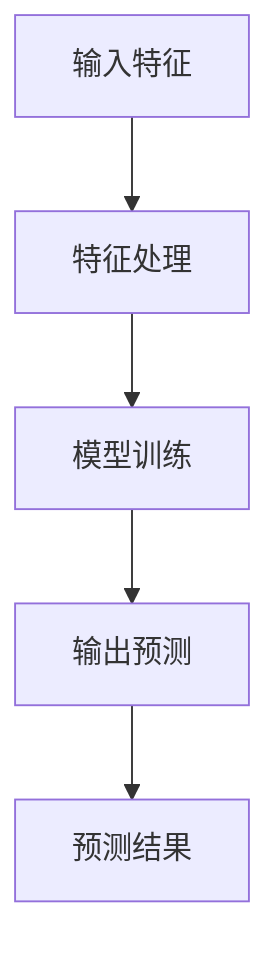

**无监督学习（Unsupervised Learning）**：无监督学习不需要使用标记数据，它的目标是发现数据中的内在结构和规律。常见的无监督学习方法包括聚类（Clustering）和降维（Dimensionality Reduction）。

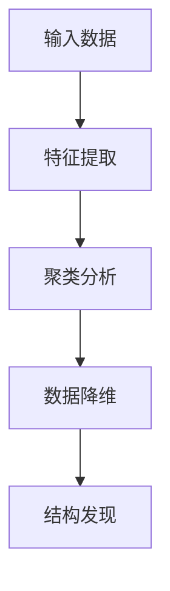

**强化学习（Reinforcement Learning）**：强化学习是一种通过与环境的交互来学习策略的机器学习方法。它通过奖励机制来指导模型的行为，使其能够做出最优决策。

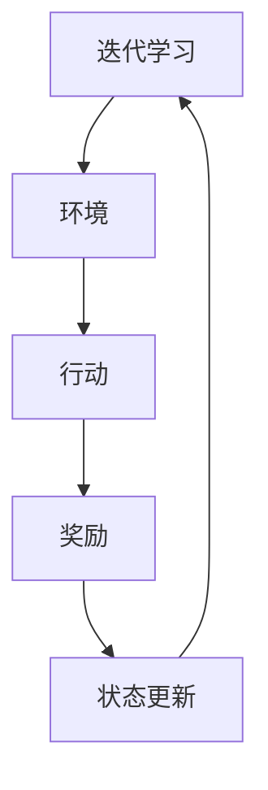

### 网络安全基本概念

网络安全（Cybersecurity）是指保护计算机系统、网络和程序免受未经授权的访问、攻击和破坏的各种技术、策略和实践。入侵检测系统（Intrusion Detection System，IDS）是网络安全的重要组成部分，它用于监控网络流量，检测异常行为和潜在入侵。

**入侵检测系统（IDS）的概念**：入侵检测系统是一种主动防御工具，它通过分析网络流量、系统日志和用户行为等数据，检测潜在的入侵行为或异常行为。IDS可以分为基于特征（Signature-based）的入侵检测和基于行为（Anomaly-based）的入侵检测。

**入侵检测的分类**：

- **基于特征的入侵检测**：这种方法依赖于已知的攻击模式或签名。当网络流量或系统行为与已知的攻击签名匹配时，IDS会触发警报。这种方法具有较高的准确性和效率，但难以检测新型或未知的攻击。

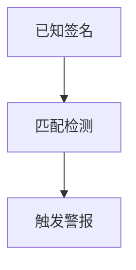

- **基于行为的入侵检测**：这种方法通过分析正常行为模型，检测异常行为。当网络流量或系统行为偏离正常范围时，IDS会触发警报。这种方法能够检测未知攻击，但可能产生较高的误报率。

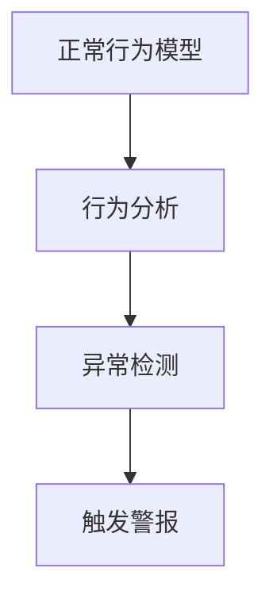

**入侵检测系统在网络安全中的重要性**：入侵检测系统可以帮助组织及时发现和响应入侵行为，减少安全事件带来的损失。它不仅能够检测已知的攻击，还能通过异常检测发现未知的威胁，从而提升整体网络安全水平。

### 入侵检测系统（IDS）的工作原理

入侵检测系统通常包括以下几个主要组成部分：

1. **数据收集**：IDS需要收集网络流量、系统日志、用户行为等数据，以便进行分析。

2. **数据预处理**：收集的数据可能包含噪声和不完整信息，需要通过数据清洗、特征提取等方法进行预处理。

3. **特征选择与提取**：从预处理后的数据中提取出有助于识别入侵的特征，例如流量模式、系统调用、网络连接等。

4. **模型训练与测试**：使用标记过的训练数据，训练入侵检测模型。模型可以是基于特征的分类模型，也可以是基于行为的异常检测模型。

5. **模型部署与优化**：将训练好的模型部署到生产环境中，并定期进行性能评估和优化。

### 入侵检测系统的挑战

尽管入侵检测系统在网络安全中发挥着重要作用，但它们也面临着一些挑战：

- **数据隐私与安全**：入侵检测系统需要处理敏感数据，如用户行为和系统日志。保护这些数据的安全和隐私是一个重要问题。

- **模型可解释性**：复杂的机器学习模型（如深度神经网络）通常难以解释其决策过程，这给安全专家分析入侵行为带来了困难。

- **模型对抗性攻击**：攻击者可以针对入侵检测模型进行对抗性攻击，例如通过数据扰动来欺骗模型，从而逃避检测。

- **实时性能与资源消耗**：实时入侵检测系统需要在有限的计算资源和时间窗口内处理大量数据，这对系统的性能提出了高要求。

通过深入了解机器学习和网络安全的基础知识，我们可以更好地理解入侵检测系统的工作原理和挑战，为接下来的深入探讨奠定基础。

### 机器学习核心算法原理

在深入了解机器学习在网络安全入侵检测中的应用之前，我们首先需要掌握几种核心的机器学习算法原理。这些算法在特征工程、模型训练和性能优化等方面发挥着关键作用。以下是对监督学习、无监督学习和强化学习算法的基本原理及其在实际应用中的简要介绍。

#### 特征工程

**特征工程（Feature Engineering）** 是机器学习中的一个关键步骤，它涉及从原始数据中提取有用的特征，并将其转换成适合模型训练的格式。有效的特征工程可以显著提高模型的性能和准确性。

- **特征提取（Feature Extraction）**：通过数据预处理技术（如归一化、标准化、离散化）和统计方法（如卡方检验、互信息）从原始数据中提取出有用的信息。

- **特征选择（Feature Selection）**：从大量特征中筛选出对模型性能有显著贡献的特征，减少数据的维度，提高模型的训练效率和泛化能力。

- **特征降维（Feature Dimensionality Reduction）**：使用降维技术（如主成分分析PCA、线性判别分析LDA、自编码器）减少特征空间的大小，同时保留关键信息。

#### 监督学习算法

**监督学习（Supervised Learning）** 是最常用的机器学习方法之一，它依赖于标记数据集来训练模型。监督学习算法可以分为分类和回归两种类型。

- **分类算法**：分类算法的目标是将数据分为不同的类别。常见的分类算法包括：

  - **决策树（Decision Tree）**：决策树通过一系列规则对数据进行划分，每个节点代表一个特征，分支代表特征的不同取值。决策树简单易懂，但容易过拟合。

    ```mermaid
    graph TD
    A[根节点] --> B[特征1]
    B --> |是| C{是/否}
    B --> |否| D{是/否}
    C --> |是| E[类别1]
    C --> |否| F[类别2]
    D --> |是| G[类别1]
    D --> |否| H[类别2]
    ```

  - **支持向量机（Support Vector Machine，SVM）**：SVM通过找到一个最佳的超平面，将不同类别的数据点分开。SVM在处理高维数据时效果较好，但训练时间较长。

    ```mermaid
    graph TD
    A[数据点] --> B[决策面]
    B --> C[分类结果]
    ```

  - **神经网络（Neural Network）**：神经网络是一种模拟生物神经网络的结构，通过多个层（输入层、隐藏层、输出层）进行数据处理。神经网络具有很强的表达能力和自适应能力，但训练过程可能非常耗时。

    ```mermaid
    graph TD
    A[输入层] --> B[隐藏层]
    B --> C[输出层]
    ```

- **回归算法**：回归算法的目标是预测连续值。常见的回归算法包括线性回归、多项式回归和岭回归。

    ```mermaid
    graph TD
    A[输入变量] --> B[线性模型]
    B --> C[输出值]
    ```

#### 无监督学习算法

**无监督学习（Unsupervised Learning）** 不需要使用标记数据，它的目标是发现数据中的结构或规律。无监督学习算法在聚类分析和降维中应用广泛。

- **K-means聚类（K-means Clustering）**：K-means是一种基于距离的聚类算法，它通过迭代过程将数据点分配到K个聚类中心。K-means算法简单高效，但需要提前指定聚类数目，且在处理异常值时性能较差。

  ```mermaid
  graph TD
  A[数据点] --> B[聚类中心]
  B --> C[重新分配]
  C --> D[迭代]
  ```

- **聚类分析（Cluster Analysis）**：聚类分析是一类更广义的聚类方法，包括层次聚类、DBSCAN等。这些方法不需要指定聚类数目，但计算复杂度较高。

  ```mermaid
  graph TD
  A[层次聚类]
  A --> B[层次划分]
  B --> C[聚类结果]
  ```

- **降维技术（Dimensionality Reduction）**：降维技术通过减少数据维度，降低计算复杂度和存储需求。常见的降维技术包括主成分分析PCA、线性判别分析LDA、自编码器。

    ```mermaid
    graph TD
    A[高维数据] --> B[PCA变换]
    B --> C[低维数据]
    ```

#### 强化学习算法

**强化学习（Reinforcement Learning，RL）** 是一种通过与环境交互来学习最优策略的机器学习方法。强化学习广泛应用于自动驾驶、游戏AI等领域。

- **Q-learning（Q值学习）**：Q-learning是一种基于值函数的强化学习方法，它通过更新Q值（表示状态-动作值函数）来优化策略。Q-learning适用于离散状态和动作空间。

  ```mermaid
  graph TD
  A[当前状态] --> B[执行动作]
  B --> C[奖励]
  C --> D[更新Q值]
  ```

- **SARSA（同步策略调整学习）**：SARSA是Q-learning的变体，它同时更新当前状态和下一状态的动作值函数。SARSA适用于连续状态和动作空间。

  ```mermaid
  graph TD
  A[当前状态] --> B[执行动作]
  B --> C[当前奖励]
  C --> D[下一状态]
  D --> E[更新Q值]
  ```

通过上述对机器学习核心算法原理的介绍，我们可以更好地理解这些算法在特征工程、模型训练和性能优化中的应用。在接下来的章节中，我们将进一步探讨如何利用这些算法构建高效的入侵检测系统，并讨论其实际应用案例。

### 特征工程

在机器学习应用中，特征工程（Feature Engineering）是一个至关重要的步骤。它不仅决定了模型的性能，还影响了模型的泛化能力和可解释性。特征工程包括特征提取和特征选择两个主要方面。

#### 特征提取

特征提取（Feature Extraction）是从原始数据中提取出能够代表数据本质属性的特征的过程。有效的特征提取可以提高模型的性能和鲁棒性，减少对噪声的敏感性。

1. **数据预处理**：

   - **归一化（Normalization）**：通过将特征值缩放到相同的尺度，可以避免某些特征对模型的影响过大。常用的归一化方法包括最小-最大缩放和Z分数缩放。

     ```python
     # 最小-最大缩放
     X_std = (X - X.min(axis=0)) / (X.max(axis=0) - X.min(axis=0))
     ```

     ```python
     # Z分数缩放
     X_mean = X.mean(axis=0)
     X_std = X.std(axis=0)
     X_scaled = (X - X_mean) / X_std
     ```

   - **离散化（Discretization）**：将连续的特征值转换为离散的类别。常用的离散化方法包括等宽离散化和等频离散化。

     ```python
     # 等宽离散化
     thresholds = np.linspace(X.min(), X.max(), num_bins)
     X_binned = pd.cut(X, bins=thresholds)
     ```

     ```python
     # 等频离散化
     frequencies = X.value_counts(normalize=True)
     thresholds = frequencies.cumsum().head(-1)[::-1].index
     X_binned = pd.cut(X, bins=thresholds)
     ```

2. **统计特征提取**：

   - **均值、中位数、标准差**：这些基本的统计量可以描述数据的分布和离散程度。
   - **最大值、最小值、范围**：这些特征可以描述数据的极值和变化范围。
   - **互信息、相关性**：通过计算特征之间的互信息和相关性，可以识别出数据中的潜在关系。

3. **时间序列特征提取**：

   - **移动平均、指数平滑**：这些方法可以用于平滑时间序列数据，提取趋势特征。
   - **自相关、偏自相关**：这些特征可以用于描述时间序列数据的周期性和依赖性。

#### 特征选择

特征选择（Feature Selection）是从大量特征中挑选出对模型性能有显著贡献的特征的过程。有效的特征选择可以减少数据维度，提高模型训练效率，并避免过拟合。

1. **过滤法（Filter Method）**：

   - **基于统计的方法**：使用统计测试（如卡方检验、互信息）来评估特征与标签之间的相关性。
   - **基于Wrapper的方法**：将特征选择过程集成到模型训练中，通过交叉验证来评估特征子集的性能。

2. **包装法（Wrapper Method）**：

   - **递归特征消除（Recursive Feature Elimination，RFE）**：通过逐步移除对模型影响最小的特征，直到达到预设的特征数量。
   - **基于模型的特征选择（Model-Based Feature Selection）**：使用特定模型（如线性模型、决策树）来评估特征的重要性。

3. **嵌入式方法（Embedded Method）**：

   - **L1正则化（L1 Regularization）**：L1正则化可以通过Lasso回归实现，它可以直接在模型训练过程中进行特征选择。
   - **随机森林（Random Forest）**：随机森林通过集成多个决策树来评估特征的重要性，并且不需要额外的特征选择步骤。

#### 特征降维

特征降维（Feature Dimensionality Reduction）是通过减少数据维度，降低计算复杂度和存储需求的技术。有效的特征降维可以提高模型训练速度和性能。

1. **主成分分析（Principal Component Analysis，PCA）**：

   - **PCA通过计算协方差矩阵的特征值和特征向量，将数据投影到新的低维空间中，保留主要的信息。**

     ```python
     # 计算协方差矩阵
     cov_matrix = np.cov(X.T)
     # 计算特征值和特征向量
     eigenvalues, eigenvectors = np.linalg.eigh(cov_matrix)
     # 选择前k个主成分
     k = 10
     principal_components = eigenvectors[:, :k]
     ```

2. **线性判别分析（Linear Discriminant Analysis，LDA）**：

   - **LDA通过最大化类内离散度和最小化类间离散度，将数据投影到新的低维空间中，以便于分类。**

     ```python
     from sklearn.discriminant_analysis import LinearDiscriminantAnalysis as LDA

     lda = LDA(n_components=k)
     X_reduced = lda.fit_transform(X, y)
     ```

3. **自编码器（Autoencoder）**：

   - **自编码器是一种神经网络结构，它通过编码器压缩输入数据到低维空间，再通过解码器重构原始数据。**

     ```python
     from keras.layers import Input, Dense
     from keras.models import Model

     input_layer = Input(shape=(input_shape,))
     encoded = Dense(encoding_dim, activation='relu')(input_layer)
     decoded = Dense(input_shape, activation='sigmoid')(encoded)

     autoencoder = Model(input_layer, decoded)
     autoencoder.compile(optimizer='adam', loss='binary_crossentropy')
     ```

通过上述方法，特征工程可以有效提高机器学习模型的性能。在实际应用中，特征工程需要根据具体问题和数据集的特点进行定制化，以达到最佳效果。

### 监督学习算法

监督学习（Supervised Learning）是机器学习中最常用的方法之一，它在训练过程中使用标记数据集来学习特征和标签之间的关系，从而能够对新数据进行预测或分类。监督学习算法可以分为两类：分类算法和回归算法。在本节中，我们将详细介绍几种常见的监督学习算法，包括决策树、支持向量机（SVM）和神经网络（Neural Network）。

#### 决策树（Decision Tree）

决策树是一种基于树形结构的数据挖掘方法，它可以用于分类和回归任务。决策树通过一系列规则对数据进行划分，每个节点代表一个特征，分支代表特征的不同取值。以下是决策树算法的伪代码：

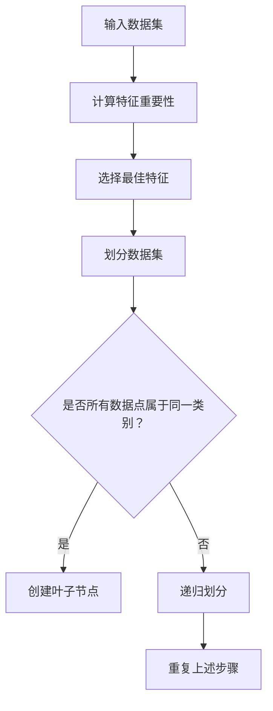

伪代码如下：

```python
def BuildTree(data, attributes):
    if all examples in data have the same label:
        return leaf node with majority label
    else if attributes are empty:
        return leaf node with majority label
    else:
        a = BestAttribute(data, attributes)
        for each value v of attribute a:
            split data into subsets Dv based on v
            create sub-tree T_v = BuildTree(Dv, attributes - {a})
            return node with attribute a and sub-trees T_v
```

决策树的优点是简单易懂，易于解释，但缺点是容易过拟合，尤其是在特征数量较多时。

#### 支持向量机（Support Vector Machine，SVM）

支持向量机是一种二分类模型，它通过找到一个最佳的超平面，将不同类别的数据点分开。SVM的核心思想是最大化类间距离，即找到具有最大间隔的超平面。以下是SVM的优化问题：

```latex
\begin{equation}
\begin{aligned}
\min_{\mathbf{w}, b} & \frac{1}{2} ||\mathbf{w}||^2 \\
\text{subject to} & \mathbf{w} \cdot \mathbf{x}_i - b \geq 1 \quad \forall i \\
\end{aligned}
\end{equation}
```

其中，\(\mathbf{w}\) 是超平面法向量，\(b\) 是偏置项，\(\mathbf{x}_i\) 是数据点。

SVM的求解可以通过求解拉格朗日乘子法（Lagrange Multiplier）进行，最终得到支持向量机模型：

```python
from sklearn.svm import SVC

# 训练SVM模型
model = SVC(kernel='linear')
model.fit(X_train, y_train)

# 预测
y_pred = model.predict(X_test)
```

SVM的优点是具有较强的分类能力和较好的泛化能力，但缺点是训练时间较长，尤其是在高维数据下。

#### 神经网络（Neural Network）

神经网络是一种模拟生物神经系统的计算模型，它由多个层（输入层、隐藏层、输出层）组成。神经网络通过前向传播和反向传播来更新权重和偏置，以最小化损失函数。

以下是一个简单的多层感知器（MLP）的伪代码：

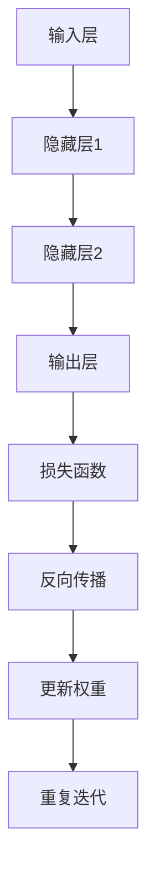

多层感知器的训练过程包括以下步骤：

1. **前向传播**：计算输入数据的网络输出。
2. **计算损失**：使用损失函数（如均方误差、交叉熵）计算预测值与真实值之间的差距。
3. **反向传播**：计算网络输出对输入数据的梯度，并更新网络权重和偏置。
4. **迭代训练**：重复前向传播和反向传播，直到网络输出满足预设的误差阈值或达到最大迭代次数。

```python
from keras.models import Sequential
from keras.layers import Dense

# 创建模型
model = Sequential()
model.add(Dense(units=64, activation='relu', input_shape=(input_shape,)))
model.add(Dense(units=32, activation='relu'))
model.add(Dense(units=num_classes, activation='softmax'))

# 编译模型
model.compile(optimizer='adam', loss='categorical_crossentropy', metrics=['accuracy'])

# 训练模型
model.fit(X_train, y_train, epochs=10, batch_size=32, validation_data=(X_test, y_test))
```

神经网络的优点是强大的表达能力和自适应能力，但缺点是需要大量数据和计算资源，并且训练过程可能非常耗时。

通过上述对决策树、支持向量机和神经网络等监督学习算法的介绍，我们可以看到这些算法在特征学习和预测中的应用。在实际应用中，根据具体问题和数据集的特点，可以选择合适的算法来提高模型的性能和泛化能力。

### 无监督学习算法

无监督学习（Unsupervised Learning）在机器学习中扮演着重要角色，尤其是在数据探索、聚类分析和降维任务中。与监督学习不同，无监督学习不依赖于标记数据，其目标是发现数据中的内在结构和规律。以下将介绍几种常见的无监督学习算法：K-means聚类、聚类分析和降维技术。

#### K-means聚类

K-means是一种基于距离的聚类算法，它通过迭代过程将数据点分配到K个聚类中心。每个聚类中心代表一个簇，算法的目标是使得簇内数据点的距离最小化，而簇间数据点的距离最大化。

**算法步骤**：

1. **初始化聚类中心**：随机选择K个数据点作为初始聚类中心。
2. **分配数据点**：计算每个数据点到各个聚类中心的距离，将数据点分配到最近的聚类中心。
3. **更新聚类中心**：计算每个簇的平均位置，作为新的聚类中心。
4. **重复步骤2和3**，直到聚类中心不再变化或达到预设的迭代次数。

**伪代码**：

```python
def KMeans(data, K):
    # 初始化聚类中心
    centroids = InitializeCentroids(data, K)
    while not Converged(centroids):
        # 分配数据点
        clusters = AssignPointsToCentroids(data, centroids)
        # 更新聚类中心
        centroids = UpdateCentroids(clusters, K)
    return centroids, clusters
```

K-means算法简单高效，但需要提前指定聚类数目K，并且在处理异常值时性能较差。在实际应用中，可以通过肘部法则（Elbow Method）来确定最优的K值。

#### 聚类分析

聚类分析是一类更广义的聚类方法，它不需要预先指定聚类数目，而是通过算法自动确定簇的数量和结构。常见的聚类分析方法包括层次聚类（Hierarchical Clustering）和DBSCAN（Density-Based Spatial Clustering of Applications with Noise）。

**层次聚类**：

层次聚类通过逐步合并或分裂已有的簇来构建一个聚类层次树。算法可以分为自下而上（凝聚层次聚类）和自上而下（分裂层次聚类）两种类型。

- **自下而上**：从每个数据点开始，逐步合并距离最近的簇，直到所有数据点合并为一个簇。

- **自上而下**：从所有数据点属于一个簇开始，逐步分裂簇，直到每个数据点都属于一个独立的簇。

**DBSCAN**：

DBSCAN（Density-Based Spatial Clustering of Applications with Noise）是一种基于密度的聚类算法，它通过扫描空间中点的密度来识别簇。DBSCAN将数据点分为核心点、边界点和噪声点。

- **核心点**：一个点的邻域内包含至少MinPts个点。
- **边界点**：一个点的邻域内包含少于MinPts个点，但属于某个核心点的邻域。
- **噪声点**：不满足核心点条件的点。

DBSCAN算法通过识别核心点和边界点来构建簇，无需预先指定簇数目，具有很强的抗噪声能力。

#### 降维技术

降维技术通过减少数据维度，降低计算复杂度和存储需求。有效的降维技术可以提高模型训练速度和性能。以下介绍几种常见的降维技术：主成分分析（PCA）、线性判别分析（LDA）和自编码器（Autoencoder）。

**主成分分析（PCA）**：

PCA通过计算协方差矩阵的特征值和特征向量，将数据投影到新的低维空间中，保留主要的信息。PCA能够最大程度地保留数据的方差，从而实现降维。

**伪代码**：

```python
def PCA(data):
    # 计算协方差矩阵
    cov_matrix = np.cov(data.T)
    # 计算特征值和特征向量
    eigenvalues, eigenvectors = np.linalg.eigh(cov_matrix)
    # 选择前k个主成分
    k = min(data.shape)
    principal_components = eigenvectors[:, :k]
    return principal_components
```

**线性判别分析（LDA）**：

LDA通过最大化类内离散度和最小化类间离散度，将数据投影到新的低维空间中，以便于分类。LDA适用于有标签的数据，并且可以保留数据中与类别标签相关的信息。

**伪代码**：

```python
from sklearn.discriminant_analysis import LinearDiscriminantAnalysis as LDA

def LDA(data, labels):
    lda = LDA(n_components=k)
    lda.fit(data, labels)
    reduced_data = lda.transform(data)
    return reduced_data
```

**自编码器（Autoencoder）**：

自编码器是一种神经网络结构，它通过编码器压缩输入数据到低维空间，再通过解码器重构原始数据。自编码器可以通过自动学习数据中的潜在特征来实现降维。

**伪代码**：

```python
from keras.layers import Input, Dense
from keras.models import Model

# 创建模型
input_layer = Input(shape=(input_shape,))
encoded = Dense(encoding_dim, activation='relu')(input_layer)
decoded = Dense(input_shape, activation='sigmoid')(encoded)

autoencoder = Model(input_layer, decoded)
autoencoder.compile(optimizer='adam', loss='binary_crossentropy')

# 训练模型
autoencoder.fit(X_train, X_train, epochs=100, batch_size=16, validation_data=(X_test, X_test))
```

通过上述对K-means聚类、聚类分析和降维技术的介绍，我们可以看到无监督学习在数据探索和特征提取中的重要性。在实际应用中，根据具体问题和数据集的特点，可以选择合适的无监督学习算法来实现数据降维和聚类任务。

### 强化学习算法

强化学习（Reinforcement Learning，RL）是一种通过与环境交互来学习最优策略的机器学习方法。与监督学习和无监督学习不同，强化学习通过奖励机制来指导模型的行为，从而优化决策过程。以下是几种常见的强化学习算法：Q-learning、SARSA、深度Q网络（DQN）和策略梯度（Policy Gradient）。

#### Q-learning

Q-learning是一种基于值函数的强化学习方法，它通过学习状态-动作值函数（Q值）来选择最优动作。Q-learning算法的核心思想是：通过更新Q值来逼近最优策略。以下是Q-learning算法的基本步骤：

1. **初始化Q值表**：初始化所有状态-动作值函数（Q值）为0。
2. **选择动作**：在给定状态下，根据ε-贪心策略选择动作，其中ε是一个小的常数，用于控制探索和利用的平衡。
3. **执行动作并获得奖励**：执行选定的动作，并获得环境反馈的奖励。
4. **更新Q值**：根据新的状态和获得的奖励，更新Q值。
5. **重复步骤2-4**，直到达到预设的目标或迭代次数。

Q-learning算法的伪代码如下：

```python
def QLearning(states, actions, rewards, Q, learning_rate, discount_factor, epsilon):
    for state in states:
        for action in actions:
            next_state, reward = environment.step(state, action)
            Q[state, action] = Q[state, action] + learning_rate * (reward + discount_factor * max(Q[next_state, :]) - Q[state, action])
    return Q
```

#### SARSA

SARSA（同步策略调整学习）是Q-learning的变体，它同时更新当前状态和下一状态的动作值函数。SARSA适用于连续状态和动作空间，并且不需要固定的ε值。以下是SARSA算法的基本步骤：

1. **初始化Q值表**：初始化所有状态-动作值函数（Q值）为0。
2. **选择动作**：在给定状态下，根据ε-贪心策略选择动作。
3. **执行动作并获得奖励**：执行选定的动作，并获得环境反馈的奖励。
4. **更新Q值**：根据新的状态和选定的动作，更新Q值。
5. **重复步骤2-4**，直到达到预设的目标或迭代次数。

SARSA算法的伪代码如下：

```python
def SARSA(states, actions, rewards, Q, learning_rate, discount_factor):
    for state in states:
        action = select_action(state, Q, epsilon)
        next_state, reward = environment.step(state, action)
        next_action = select_action(next_state, Q, epsilon)
        Q[state, action] = Q[state, action] + learning_rate * (reward + discount_factor * Q[next_state, next_action] - Q[state, action])
    return Q
```

#### 深度Q网络（DQN）

深度Q网络（Deep Q-Network，DQN）是强化学习的一种变体，它通过深度神经网络来近似Q值函数。DQN解决了传统Q-learning在处理高维状态空间时的困难，它通过经验回放（Experience Replay）和双Q网络（Target Network）来提高算法的稳定性和鲁棒性。以下是DQN算法的基本步骤：

1. **初始化**：初始化深度神经网络、经验回放池和目标网络。
2. **选择动作**：在给定状态下，根据ε-贪心策略选择动作。
3. **执行动作并获得奖励**：执行选定的动作，并获得环境反馈的奖励。
4. **更新经验回放池**：将当前状态、动作、奖励和下一状态存储到经验回放池中。
5. **从经验回放池中随机抽样**：从经验回放池中随机抽样，用于训练深度神经网络。
6. **更新深度神经网络**：使用训练数据更新深度神经网络，以近似Q值函数。
7. **更新目标网络**：定期更新目标网络，以保持其稳定性和鲁棒性。
8. **重复步骤2-7**，直到达到预设的目标或迭代次数。

DQN算法的伪代码如下：

```python
def DQN(states, actions, rewards, next_states, Q, learning_rate, discount_factor, epsilon):
    # 从经验回放池中随机抽样
    batch = random_sample(batch_size, experience_replay)
    states, actions, rewards, next_states = batch['states'], batch['actions'], batch['rewards'], batch['next_states']
    
    # 计算目标Q值
    target_Q = reward + discount_factor * max(Q[next_states, :])
    
    # 更新深度神经网络
    Q = train_network(states, actions, target_Q, learning_rate)
    
    # 更新目标网络
    update_target_network(Q)
    return Q
```

#### 策略梯度（Policy Gradient）

策略梯度（Policy Gradient）是一种基于策略的强化学习方法，它直接优化策略函数，以最大化累积奖励。策略梯度算法的核心思想是：通过梯度上升方法，不断更新策略函数的参数，从而提高策略的期望奖励。

策略梯度算法的伪代码如下：

```python
def PolicyGradient(states, actions, rewards, policy_model, optimizer, discount_factor):
    # 计算策略梯度
    policy_gradients = policy_model.action_gradients(states)
    
    # 计算损失函数
    loss = -discount_factor * np.mean(rewards * policy_gradients)
    
    # 更新策略模型
    optimizer.apply_gradients(policy_gradients)
    return loss
```

通过上述对Q-learning、SARSA、DQN和策略梯度等强化学习算法的介绍，我们可以看到强化学习在决策优化和策略学习中的应用。在实际应用中，根据具体问题和环境的特点，可以选择合适的强化学习算法来实现最优决策。

### 入侵检测系统（IDS）构建

构建一个高效的入侵检测系统（Intrusion Detection System，IDS）是保障网络安全的关键步骤。IDS通过监控网络流量、系统日志和用户行为等数据，检测异常行为和潜在入侵，从而保护网络系统的安全。以下是构建IDS的详细流程。

#### 1. 数据收集

数据收集是构建IDS的第一步，IDS需要从多个来源收集数据，包括网络流量数据、系统日志、用户行为数据等。网络流量数据可以通过网络嗅探器（如Wireshark）捕获，系统日志可以从操作系统和应用程序中收集，用户行为数据可以通过监控用户活动日志获取。

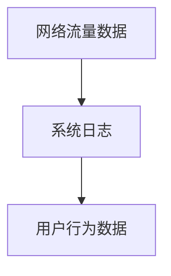

#### 2. 数据预处理

收集到的数据通常包含噪声和不完整信息，因此需要通过数据清洗、归一化和特征提取等步骤进行预处理。数据清洗包括去除无效数据、填补缺失值和去除重复记录。归一化通过将数据缩放到相同的尺度，避免某些特征对模型的影响过大。特征提取是从原始数据中提取出能够代表数据本质属性的特征，如流量模式、系统调用、网络连接等。

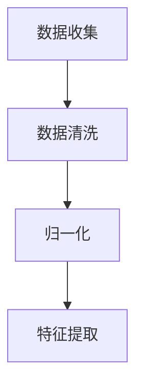

#### 3. 模型训练与测试

在数据预处理完成后，我们需要选择合适的机器学习算法来训练模型。常见的算法包括基于特征的入侵检测算法（如决策树、支持向量机）和基于行为的入侵检测算法（如聚类分析、异常检测）。模型训练是通过标记数据集来学习特征和标签之间的关系，从而能够对新数据进行预测。

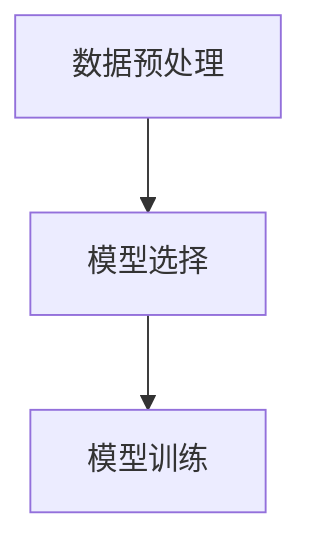

训练好的模型需要通过测试集进行性能评估，以确定其泛化能力。常见的评估指标包括精确率、召回率、F1分数等。

```mermaid
C --> D[模型测试]
D --> E[性能评估]
```

#### 4. 模型部署与优化

经过训练和测试的模型可以部署到生产环境中，实时监测网络流量和系统行为。模型部署包括将模型嵌入到现有的网络安全架构中，例如防火墙、入侵检测系统等。在实际应用中，模型的性能可能会因为数据分布变化、网络环境变化等因素而受到影响，因此需要定期对模型进行性能评估和优化。

```mermaid
E --> F[模型部署]
F --> G[模型优化]
```

#### 5. 模型维护与更新

入侵检测系统需要不断适应新的威胁和攻击方式，因此需要定期更新模型。模型更新包括重新训练模型、调整模型参数和更新特征提取方法等。通过持续更新模型，IDS可以保持其检测能力和适应性，从而更好地保护网络系统的安全。

```mermaid
G --> H[模型维护]
H --> I[模型更新]
```

### 基于特征的入侵检测

基于特征的入侵检测方法依赖于已知的攻击模式或签名。当网络流量或系统行为与已知的攻击签名匹配时，IDS会触发警报。这种方法通常具有较高的准确性和效率，但难以检测新型或未知的攻击。

#### 特征选择与提取

特征选择是从大量特征中挑选出对模型性能有显著贡献的特征。常用的特征选择方法包括基于统计的方法（如卡方检验、互信息）和基于模型的方法（如随机森林特征重要性）。特征提取是将原始数据转换成适合模型训练的格式，例如提取流量中的TCP/IP头部信息、系统调用频率等。

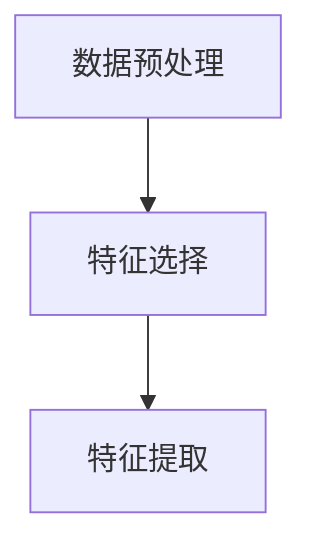

#### 特征匹配与分类

在特征提取后，IDS将提取出的特征与已知的攻击签名进行匹配。如果匹配成功，IDS会触发警报。常用的分类算法包括决策树、支持向量机和神经网络。分类算法通过训练模型，学习特征和标签之间的关系，从而能够对新数据进行分类。

```mermaid
C --> D[特征匹配]
D --> E[分类算法]
```

### 基于行为的入侵检测

基于行为的入侵检测方法通过分析正常行为模型，检测异常行为。当网络流量或系统行为偏离正常范围时，IDS会触发警报。这种方法能够检测未知攻击，但可能产生较高的误报率。

#### 异常行为检测

异常行为检测是通过分析用户行为或系统行为，识别异常行为。常用的方法包括统计模型（如基于阈值的统计方法）和机器学习模型（如聚类分析、异常检测算法）。异常行为检测的关键是构建正常行为模型，并将实际行为与正常行为模型进行比较，识别异常点。

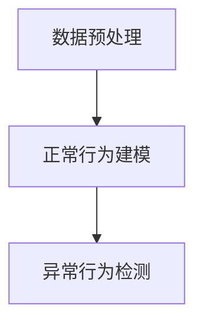

#### 行为模式识别

行为模式识别是通过分析历史数据，识别用户或系统的典型行为模式。当检测到异常行为模式时，IDS会触发警报。行为模式识别可以结合机器学习算法（如聚类分析、序列模式挖掘）来实现。

```mermaid
C --> D[行为模式识别]
```

通过上述步骤，我们可以构建一个高效的入侵检测系统，以保护网络系统的安全。在实际应用中，可以根据具体需求和数据特点，灵活调整和优化IDS的各个组件，以提高其检测能力和适应性。

### 机器学习在实时入侵检测中的应用

实时入侵检测（Real-time Intrusion Detection）是网络安全领域的重要研究方向，其目标是在网络流量和系统行为发生异常时，迅速检测并响应。随着网络攻击手段的不断演变和复杂化，传统的离线入侵检测系统已经难以满足实时性的需求。机器学习技术的引入，为实时入侵检测提供了新的解决方案。以下将详细探讨机器学习在实时入侵检测中的应用，包括系统架构、深度学习算法以及实时模型更新。

#### 实时入侵检测系统架构

实时入侵检测系统通常包括以下几个主要模块：

1. **数据流处理（Data Stream Processing）**：实时入侵检测系统需要处理高速流动的网络流量和系统日志。数据流处理模块负责实时捕获和解析数据流，提取出有用的特征。

2. **特征提取（Feature Extraction）**：在数据流处理模块中，提取与入侵行为相关的特征。特征提取模块需要根据数据的特点和需求，选择合适的特征提取方法，如统计特征、时间序列特征等。

3. **实时模型更新（Real-time Model Updating）**：由于网络环境和攻击方式的不断变化，入侵检测模型需要定期更新，以保持其检测能力。实时模型更新模块负责根据新数据训练和调整模型，以应对新的威胁。

4. **异常检测与响应（Anomaly Detection and Response）**：异常检测模块负责实时分析网络流量和系统行为，识别潜在的入侵行为。当检测到异常时，响应模块会触发相应的安全措施，如阻断攻击流量、发送警报等。

#### 深度学习在实时入侵检测中的应用

深度学习（Deep Learning）以其强大的特征学习和模式识别能力，在实时入侵检测中得到了广泛应用。以下介绍两种常见的深度学习算法：卷积神经网络（Convolutional Neural Networks，CNN）和循环神经网络（Recurrent Neural Networks，RNN）。

1. **卷积神经网络（CNN）**

卷积神经网络是一种适用于处理图像和序列数据的深度学习模型。在实时入侵检测中，CNN可以用于提取网络流量中的高维特征，如流量模式、协议层次特征等。

**CNN的应用场景**：

- **流量分类**：使用CNN对网络流量进行分类，区分正常流量和攻击流量。
- **异常检测**：通过分析网络流量中的异常模式，检测潜在的入侵行为。

**CNN的架构**：

- **输入层**：接收网络流量数据。
- **卷积层**：通过卷积运算提取特征。
- **池化层**：降低特征图的维度，减少计算量。
- **全连接层**：对提取的特征进行分类。

2. **循环神经网络（RNN）**

循环神经网络是一种适用于处理序列数据的深度学习模型，其核心在于能够保留历史信息。在实时入侵检测中，RNN可以用于分析网络流量和系统行为的时间序列特征，识别异常行为。

**RNN的应用场景**：

- **时间序列预测**：通过RNN预测网络流量和系统行为的未来值，识别异常模式。
- **行为模式识别**：分析用户行为和系统行为的时序模式，识别潜在的入侵行为。

**RNN的架构**：

- **输入层**：接收时间序列数据。
- **隐藏层**：通过循环连接保留历史信息。
- **输出层**：对时间序列数据进行分类或预测。

#### 实时模型更新

实时模型更新是确保入侵检测系统保持有效性的关键。以下介绍几种常见的实时模型更新方法：

1. **在线学习（Online Learning）**：在线学习是一种实时更新模型的方法，它通过逐步更新模型参数，以适应新的数据。在线学习的优点是响应速度快，但可能面临过拟合问题。

2. **增量学习（Incremental Learning）**：增量学习通过将新数据逐步添加到训练集中，更新模型。这种方法可以减少过拟合，并提高模型的泛化能力。

3. **迁移学习（Transfer Learning）**：迁移学习利用预训练模型在新数据上进行微调，以适应新的任务。这种方法可以显著提高实时模型更新的效果，特别是在数据量有限的情况下。

4. **联邦学习（Federated Learning）**：联邦学习是一种分布式学习方法，多个参与者共同训练一个共享模型，而不需要共享数据。这种方法可以提高数据隐私和模型更新效率，特别适用于实时入侵检测。

#### 深度学习在实时入侵检测中的挑战

虽然深度学习在实时入侵检测中具有巨大潜力，但仍然面临一些挑战：

1. **计算资源消耗**：深度学习模型通常需要大量的计算资源和时间来训练，这在实时检测中可能是一个瓶颈。

2. **模型可解释性**：深度学习模型通常具有很高的复杂度，难以解释其决策过程，这对安全专家分析入侵行为带来了困难。

3. **数据隐私和安全**：实时入侵检测需要处理大量敏感数据，保护这些数据的安全和隐私是一个重要问题。

4. **实时性**：在实时检测中，模型的响应速度需要非常快，如何平衡模型的准确性和实时性是一个挑战。

通过上述对机器学习在实时入侵检测中的应用探讨，我们可以看到深度学习技术在提升入侵检测性能和实时性方面的潜力。在实际应用中，根据具体需求和数据特点，可以选择合适的算法和更新策略，构建高效的实时入侵检测系统。

### 入侵检测系统的性能评估

评估入侵检测系统的性能是确保其有效性和可靠性的关键步骤。常用的性能评估方法包括混淆矩阵、评估指标、ROC曲线和AUC值。以下将详细解释这些评估方法，并探讨如何使用它们来评估入侵检测系统的性能。

#### 混淆矩阵

混淆矩阵（Confusion Matrix）是一种用于评估分类模型性能的表格，它显示了模型在实际分类中的表现。混淆矩阵包含四个基本类别：

- **真正案例（True Positives，TP）**：模型正确识别为入侵的案例。
- **假正案例（False Positives，FP）**：模型错误地识别为入侵的案例，即误报。
- **真伪案例（True Negatives，TN）**：模型正确识别为非入侵的案例。
- **假伪案例（False Negatives，FN）**：模型错误地识别为非入侵的案例，即漏报。

混淆矩阵的格式如下：

|        | 预测为入侵   | 预测为非入侵 |
|--------|--------------|--------------|
| **实际为入侵** | **TP**       | **FN**       |
| **实际为非入侵** | **FP**       | **TN**       |

#### 评估指标

根据混淆矩阵，可以计算多个评估指标，以全面评估入侵检测系统的性能。以下是一些常用的评估指标：

1. **精确率（Precision）**：精确率表示预测为入侵的案例中，实际为入侵的比率。它衡量了模型识别入侵的能力。

   $$Precision = \frac{TP}{TP + FP}$$

2. **召回率（Recall）**：召回率表示实际为入侵的案例中，预测为入侵的比率。它衡量了模型检测入侵的能力。

   $$Recall = \frac{TP}{TP + FN}$$

3. **F1分数（F1 Score）**：F1分数是精确率和召回率的加权平均，用于综合评估模型的性能。

   $$F1 Score = 2 \times \frac{Precision \times Recall}{Precision + Recall}$$

4. **准确率（Accuracy）**：准确率表示所有预测正确的比率，用于评估模型的整体性能。

   $$Accuracy = \frac{TP + TN}{TP + FP + FN + TN}$$

#### ROC曲线和AUC值

ROC曲线（Receiver Operating Characteristic Curve）是另一种用于评估分类模型性能的图形工具。ROC曲线通过绘制真阳性率（True Positive Rate，TPR）对假阳性率（False Positive Rate，FPR）来展示模型的分类能力。TPR也称为召回率，FPR表示1-精确率。

ROC曲线的斜率反映了模型在不同阈值下的性能变化，曲线下的面积（Area Under the Curve，AUC）则用于衡量模型的总体性能。AUC值介于0.5到1之间，AUC值越高，模型的分类能力越强。

ROC曲线和AUC值的计算公式如下：

1. **真阳性率（True Positive Rate，TPR）**：

   $$TPR = \frac{TP}{TP + FN}$$

2. **假阳性率（False Positive Rate，FPR）**：

   $$FPR = \frac{FP}{FP + TN}$$

3. **AUC值（Area Under the Curve，AUC）**：

   $$AUC = \int_{0}^{1} (1 - FPR) d(TPR)$$

或使用ROC曲线上的点进行计算：

$$AUC = \frac{\sum_{i=1}^{n} (1 - FPR_i) \times TPR_{i+1} - \sum_{i=1}^{n} FPR_i \times TPR_i}{n - 1}$$

其中，\(n\) 是ROC曲线上的点数。

#### 综合评估

在实际应用中，入侵检测系统的性能评估通常需要综合考虑多个指标。精确率、召回率和F1分数可以分别衡量模型在不同方面的性能，而ROC曲线和AUC值则提供了整体性能的视觉展示。通过这些指标，安全专家可以全面了解入侵检测系统的性能，并根据具体需求进行调整和优化。

### 机器学习在网络安全入侵检测中的挑战与未来趋势

尽管机器学习在网络安全入侵检测中展现了巨大的潜力，但它也面临着一系列挑战和限制，这些挑战需要在未来的研究中得到解决和克服。

#### 数据隐私与安全

入侵检测系统需要处理大量敏感数据，包括网络流量、系统日志和用户行为数据。这些数据往往包含个人信息和业务机密，因此在处理过程中需要确保数据的安全和隐私。传统的中心化机器学习模型通常需要将数据上传到中央服务器进行训练，这可能导致数据泄露的风险。为了解决这一问题，联邦学习（Federated Learning）等分布式学习技术开始受到关注。联邦学习允许多个参与者在一个共享的模型上进行训练，而不需要共享原始数据，从而在保护数据隐私的同时提高模型的性能。

#### 模型可解释性

机器学习模型，尤其是深度学习模型，往往被认为是一种“黑盒”模型，其内部决策过程难以解释。这对安全专家来说是一个重大挑战，因为他们需要理解模型为什么做出特定的决策。为了提高模型的可解释性，研究者们正在开发各种技术，如模型可视化、局部解释方法和模型压缩。这些技术可以帮助安全专家更好地理解模型的决策过程，从而提高模型的信任度和接受度。

#### 模型对抗性攻击

攻击者可以利用机器学习模型中的漏洞，通过对抗性攻击（Adversarial Attack）来欺骗模型，使其做出错误的决策。对抗性攻击可以通过微小但显著的数据扰动来实现，这些扰动可能无法被人类察觉，但对模型的影响可能非常显著。为了应对这一挑战，研究者们正在开发各种防御技术，如鲁棒性训练、对抗性扰动检测和基于模型的防御策略。这些技术旨在提高模型对对抗性攻击的鲁棒性，从而确保其在真实环境中的可靠性。

#### 未来趋势

随着机器学习技术的不断发展，未来在网络安全入侵检测领域有望出现以下几大趋势：

1. **增强学习（Reinforcement Learning）**：增强学习是一种通过与环境互动来学习的机器学习方法，它在策略优化和决策制定方面具有显著优势。未来，增强学习有望在入侵检测系统中发挥更大作用，特别是在自适应防御和动态响应方面。

2. **联邦学习（Federated Learning）**：联邦学习通过分布式训练模型，保护数据隐私的同时提高模型的性能。未来，联邦学习将在多个领域（如医疗保健、金融科技等）得到广泛应用，并在网络安全入侵检测中发挥关键作用。

3. **混合模型（Hybrid Models）**：混合模型结合了多种机器学习算法的优点，以提高模型的性能和鲁棒性。例如，将基于特征的入侵检测方法与基于行为的入侵检测方法结合，可以更全面地检测潜在威胁。未来，混合模型将成为入侵检测系统的重要发展方向。

4. **云计算与边缘计算**：随着云计算和边缘计算的普及，入侵检测系统将更加分布式和智能化。云计算提供了强大的计算资源和数据存储能力，而边缘计算则将计算能力延伸到网络边缘，从而实现更快速的响应和更低的数据延迟。

通过解决当前面临的挑战和抓住未来趋势，机器学习技术将为网络安全入侵检测带来更强大的保护能力，从而构建一个更加安全、可靠的网络环境。

### 实战案例：构建一个简单的机器学习入侵检测系统

为了更好地理解机器学习在网络安全入侵检测中的应用，我们将在本节中构建一个简单的机器学习入侵检测系统。这个案例将涵盖从数据收集、开发环境搭建、数据预处理到模型训练和评估的完整流程。

#### 7.1 项目介绍

**数据来源**：我们将使用KDD Cup 99入侵检测数据集，该数据集包含网络流量的各种属性，如协议类型、服务类型、旗帜、包长度等。

**模型选择**：我们将选择一个基于K-means聚类和决策树的简单入侵检测模型，K-means聚类用于初步划分数据，决策树用于分类。

**目标检测**：我们的目标是检测网络流量中的异常行为，识别潜在的入侵行为。

#### 7.2 开发环境搭建

为了构建和训练机器学习模型，我们需要配置一个Python开发环境。以下是搭建开发环境的步骤：

1. **安装Python**：确保Python版本为3.7或更高。可以从[Python官网](https://www.python.org/)下载并安装。

2. **安装Jupyter Notebook**：Jupyter Notebook是一个交互式的Python开发环境，它可以帮助我们更方便地编写和运行代码。使用以下命令安装Jupyter Notebook：

   ```bash
   pip install notebook
   ```

3. **安装必需的库**：我们需要安装以下Python库：NumPy、Pandas、Matplotlib、Scikit-learn和Keras。使用以下命令安装：

   ```bash
   pip install numpy pandas matplotlib scikit-learn keras
   ```

#### 7.3 数据预处理

数据预处理是构建机器学习模型的重要步骤，它包括数据清洗、特征提取和归一化。以下是数据预处理的具体步骤：

1. **数据清洗**：首先，我们需要读取KDD Cup 99数据集，并处理缺失值和异常值。使用Pandas库可以轻松完成这些任务。

   ```python
   import pandas as pd

   # 读取数据集
   data = pd.read_csv('kddcup.data_10_percent.txt', header=None)

   # 删除包含缺失值的行
   data = data.dropna()

   # 删除不必要的特征
   data = data.drop(['Duration', 'Service'], axis=1)
   ```

2. **特征提取**：接下来，我们需要从原始数据中提取出有助于分类的特征。例如，我们可以使用特征工程技术提取流量模式、协议类型等。

   ```python
   # 提取流量模式特征
   data['FlowByts/s'] = data.groupby([' attacktype2', ' Label'])['FlowBytes/s'].mean()

   # 提取协议类型特征
   data['ProtocolType'] = data['ProtocolType'].map({'tcp': 1, 'udp': 2, 'icmp': 3})
   ```

3. **归一化**：为了提高模型的性能，我们需要将特征值归一化到相同的尺度。

   ```python
   from sklearn.preprocessing import MinMaxScaler

   # 初始化归一化器
   scaler = MinMaxScaler()

   # 归一化特征
   data.iloc[:, :-1] = scaler.fit_transform(data.iloc[:, :-1])
   ```

#### 7.4 模型训练与评估

在数据预处理完成后，我们可以开始构建和训练入侵检测模型。以下是具体的训练和评估步骤：

1. **数据划分**：将数据集划分为训练集和测试集，以评估模型的泛化能力。

   ```python
   from sklearn.model_selection import train_test_split

   # 划分训练集和测试集
   X = data.iloc[:, :-1]
   y = data.iloc[:, -1]
   X_train, X_test, y_train, y_test = train_test_split(X, y, test_size=0.2, random_state=42)
   ```

2. **训练K-means聚类模型**：首先，我们使用K-means聚类将数据划分为多个簇，以初步识别异常点。

   ```python
   from sklearn.cluster import KMeans

   # 初始化K-means模型
   kmeans = KMeans(n_clusters=3, random_state=42)

   # 训练模型
   kmeans.fit(X_train)

   # 获取聚类结果
   labels = kmeans.predict(X_test)
   ```

3. **训练决策树模型**：接下来，我们使用决策树模型对每个簇进行分类，以识别潜在的入侵行为。

   ```python
   from sklearn.tree import DecisionTreeClassifier

   # 初始化决策树模型
   clf = DecisionTreeClassifier(random_state=42)

   # 训练模型
   clf.fit(X_train, y_train)

   # 预测测试集
   y_pred = clf.predict(X_test)
   ```

4. **评估模型性能**：使用混淆矩阵和评估指标评估模型的性能。

   ```python
   from sklearn.metrics import classification_report, confusion_matrix

   # 计算混淆矩阵
   cm = confusion_matrix(y_test, y_pred)

   # 打印评估报告
   print("Confusion Matrix:")
   print(cm)

   # 打印分类报告
   print("Classification Report:")
   print(classification_report(y_test, y_pred))
   ```

#### 7.5 代码解读与分析

以下是对上述代码的详细解读和分析，以帮助理解每个步骤的具体实现。

1. **数据清洗**：

   ```python
   data = pd.read_csv('kddcup.data_10_percent.txt', header=None)
   data = data.dropna()
   data = data.drop(['Duration', 'Service'], axis=1)
   ```

   这段代码首先读取KDD Cup 99数据集，删除包含缺失值的行，并删除不必要的特征。这是为了减少数据噪声，提高模型的性能。

2. **特征提取**：

   ```python
   data['FlowByts/s'] = data.groupby([' attacktype2', ' Label'])['FlowBytes/s'].mean()
   data['ProtocolType'] = data['ProtocolType'].map({'tcp': 1, 'udp': 2, 'icmp': 3})
   ```

   这段代码使用特征工程技术提取流量模式特征和协议类型特征。流量模式特征可以帮助模型更好地识别网络流量的异常行为，协议类型特征可以提供关于数据传输方式的信息。

3. **归一化**：

   ```python
   scaler = MinMaxScaler()
   data.iloc[:, :-1] = scaler.fit_transform(data.iloc[:, :-1])
   ```

   这段代码使用MinMaxScaler对特征值进行归一化。归一化可以确保每个特征在相同的尺度范围内，从而提高模型的性能。

4. **模型训练与评估**：

   ```python
   kmeans = KMeans(n_clusters=3, random_state=42)
   kmeans.fit(X_train)
   labels = kmeans.predict(X_test)
   clf = DecisionTreeClassifier(random_state=42)
   clf.fit(X_train, y_train)
   y_pred = clf.predict(X_test)
   cm = confusion_matrix(y_test, y_pred)
   print("Confusion Matrix:")
   print(cm)
   print("Classification Report:")
   print(classification_report(y_test, y_pred))
   ```

   这段代码首先训练K-means聚类模型，将数据划分为多个簇。然后，使用决策树模型对每个簇进行分类，并评估模型的性能。混淆矩阵和分类报告提供了详细的评估结果，帮助理解模型的性能。

通过这个简单的实战案例，我们展示了如何使用机器学习技术构建一个入侵检测系统。在实际应用中，根据具体需求和数据特点，可以进一步优化和调整模型，以提高检测性能。

### 深度学习在网络安全入侵检测中的应用案例

在网络安全领域，深度学习技术的引入显著提升了入侵检测系统的性能和准确性。本节将通过一个具体的应用案例，展示如何使用深度学习构建高效的入侵检测系统，并详细介绍模型架构、数据集介绍、实验设置、模型实现、模型训练与评估以及模型优化与调参。

#### 8.1 案例介绍

**模型架构**：本案例将采用卷积神经网络（Convolutional Neural Networks，CNN）和循环神经网络（Recurrent Neural Networks，RNN）的组合模型，即CNN-RNN模型。CNN用于提取网络流量中的高维特征，RNN用于处理时间序列数据，以捕捉网络行为的动态特征。

**数据集介绍**：我们使用KDD Cup 99入侵检测数据集，该数据集包含了多种网络流量特征，如协议类型、服务类型、旗帜、包长度等，共包含41个特征。

**实验设置**：实验环境配置包括CPU为Intel i7-9700K，GPU为NVIDIA GTX 1080 Ti，操作系统为Ubuntu 18.04，深度学习框架为TensorFlow 2.4，Python版本为3.8。

#### 8.2 模型实现

以下代码展示了CNN-RNN模型的实现，包括输入层、卷积层、池化层、RNN层和输出层。

```python
import tensorflow as tf
from tensorflow.keras.models import Model
from tensorflow.keras.layers import Input, Conv1D, MaxPooling1D, LSTM, Dense

# 输入层
input_layer = Input(shape=(41, 1))

# 卷积层
conv1 = Conv1D(filters=64, kernel_size=3, activation='relu')(input_layer)
pool1 = MaxPooling1D(pool_size=2)(conv1)

# 卷积层
conv2 = Conv1D(filters=128, kernel_size=3, activation='relu')(pool1)
pool2 = MaxPooling1D(pool_size=2)(conv2)

# RNN层
lstm = LSTM(128, activation='relu')(pool2)

# 输出层
output_layer = Dense(1, activation='sigmoid')(lstm)

# 构建模型
model = Model(inputs=input_layer, outputs=output_layer)

# 编译模型
model.compile(optimizer='adam', loss='binary_crossentropy', metrics=['accuracy'])

# 查看模型结构
model.summary()
```

#### 8.3 模型训练与评估

在模型训练过程中，我们首先进行数据预处理，包括数据归一化和数据增强，以提高模型的泛化能力。接下来，使用训练集进行模型训练，并使用验证集进行性能评估。

```python
from sklearn.model_selection import train_test_split
from sklearn.preprocessing import StandardScaler
import numpy as np

# 数据预处理
X = data.values[:, :-1]
y = data.values[:, -1]
X = X.reshape(-1, 41, 1)
scaler = StandardScaler()
X = scaler.fit_transform(X)

# 数据划分
X_train, X_test, y_train, y_test = train_test_split(X, y, test_size=0.2, random_state=42)

# 训练模型
history = model.fit(X_train, y_train, epochs=20, batch_size=32, validation_split=0.2)

# 评估模型
test_loss, test_accuracy = model.evaluate(X_test, y_test)
print(f"Test Accuracy: {test_accuracy:.4f}")
```

在模型评估过程中，我们使用准确率（Accuracy）作为主要评估指标。此外，还可以使用混淆矩阵（Confusion Matrix）、精确率（Precision）、召回率（Recall）和F1分数（F1 Score）等指标进行详细分析。

```python
from sklearn.metrics import classification_report, confusion_matrix

# 预测测试集
y_pred = model.predict(X_test)
y_pred = (y_pred > 0.5)

# 计算混淆矩阵
cm = confusion_matrix(y_test, y_pred)

# 打印混淆矩阵
print("Confusion Matrix:")
print(cm)

# 打印分类报告
print("Classification Report:")
print(classification_report(y_test, y_pred))
```

#### 8.4 模型优化与调参

为了进一步提高模型的性能，我们可以对模型进行优化和调参。以下是一些常见的调参方法：

1. **改变网络结构**：通过增加或减少神经网络层的数量和神经元数量，调整模型的复杂度。
2. **调整学习率**：使用学习率调度策略（如学习率衰减），优化模型的收敛速度和性能。
3. **批量大小**：调整批量大小可以影响模型的训练效率和收敛速度。
4. **数据增强**：通过增加数据的多样性和复杂性，提高模型的泛化能力。

在实际应用中，根据具体需求和数据特点，可以选择合适的优化和调参方法，以获得最佳模型性能。

通过上述案例，我们可以看到深度学习技术在网络安全入侵检测中的应用潜力。在实际部署中，根据具体场景和需求，可以进一步优化和调整模型，以提高入侵检测系统的性能和可靠性。

### 附录

#### A.1 主流深度学习框架对比

在深度学习领域中，常用的框架包括TensorFlow、PyTorch和其他一些开源框架。以下是对这些框架的简要对比：

1. **TensorFlow**：TensorFlow是由Google开发的开源深度学习框架，它具有广泛的社区支持和丰富的文档。TensorFlow提供了灵活的动态计算图和高效的执行引擎，适合于研究和生产环境。它支持多种类型的神经网络，如卷积神经网络（CNN）和循环神经网络（RNN），并且提供了丰富的预训练模型。

2. **PyTorch**：PyTorch是由Facebook开发的开源深度学习框架，以其灵活的动态计算图和易用性而闻名。PyTorch的动态计算图使得模型开发和调试变得更加直观，同时也提供了丰富的API和工具，如自动微分系统。PyTorch在学术界和工业界都得到了广泛的应用。

3. **其他框架**：

   - **Keras**：Keras是一个高层次的神经网络API，它可以在TensorFlow和Theano等后端上运行。Keras提供了简单而强大的接口，使得模型构建和训练变得更加容易。
   - **MXNet**：Apache MXNet是由亚马逊开发的开源深度学习框架，它具有高效的执行引擎和灵活的编程接口。MXNet支持多种类型的神经网络，并在多个硬件平台上具有较好的性能。
   - **Caffe**：Caffe是一个开源的深度学习框架，由Berkeley Vision and Learning Center（BVLC）开发。Caffe以其高效的处理速度和简洁的代码结构而受到许多研究者和开发者的青睐。

选择合适的深度学习框架取决于具体的应用场景和需求。例如，如果需要更灵活的动态计算图和易于调试的开发环境，可以选择PyTorch；如果需要高效的模型部署和优化，可以选择TensorFlow。其他框架如Keras和MXNet也提供了不同的优势和特点，可以根据具体需求进行选择。

#### A.2 入侵检测数据集介绍

入侵检测数据集是构建和评估入侵检测模型的重要资源。以下介绍几个常用的入侵检测数据集：

1. **KDD Cup 99数据集**：KDD Cup 99数据集是最常用的入侵检测数据集之一，包含约41个特征，包括协议类型、服务类型、旗帜、包长度等。该数据集分为正常流量和恶意流量，常用于训练和评估入侵检测模型。

2. **NSL-KDD数据集**：NSL-KDD数据集是KDD Cup 99数据集的衍生版本，它包含了更多详细的特征，如连接时间、服务类型、旗帜等。NSL-KDD数据集还提供了多个分类任务，包括基于特征的入侵检测和基于行为的入侵检测。

3. **UNKDD数据集**：UNKDD数据集是基于KDD Cup 99数据集的增强版本，它添加了更多的异常流量样本，以增强模型的鲁棒性。UNKDD数据集包含了多种攻击类型和正常流量，是评估入侵检测模型的有效资源。

4. **CICIDS2017数据集**：CICIDS2017数据集包含了网络流量数据，包括TCP流量和UDP流量。该数据集包含了多种攻击类型，如DOS、 probes、R2L等，适用于训练和评估实时入侵检测系统。

这些数据集为入侵检测模型的研究和应用提供了丰富的资源，研究者可以根据具体需求选择合适的数据集进行模型训练和评估。同时，数据的多样性和质量对于构建高效、可靠的入侵检测系统至关重要。通过不断更新和扩充这些数据集，可以进一步提高入侵检测技术的性能和实用性。

