                 

# 《李开复：AI 2.0 时代的价值》

> **关键词：** AI 2.0，深度学习，强化学习，自然语言处理，伦理问题，未来趋势，个人发展。

> **摘要：** 本文旨在深入探讨AI 2.0时代的价值，包括其技术原理、架构设计、应用场景、伦理问题以及未来发展。通过详细分析，本文旨在为读者提供关于AI 2.0时代的全面了解，以及如何在这一时代中抓住机遇，应对挑战。

---

## 目录大纲

### 第一部分: AI 2.0 时代概述

#### 第1章: AI 2.0 时代的崛起

##### 1.1 AI 2.0 时代的背景

##### 1.2 AI 2.0 与传统AI的区别

##### 1.3 AI 2.0 时代的特征

### 第二部分: AI 2.0 时代的价值

#### 第2章: AI 2.0 时代的价值

##### 2.1 AI 2.0 时代的社会价值

##### 2.2 AI 2.0 时代的经济价值

##### 2.3 AI 2.0 时代的个人价值

### 第三部分: AI 2.0 时代的核心技术

#### 第3章: AI 2.0 时代的算法原理

##### 3.1 深度学习算法原理

##### 3.2 强化学习算法原理

##### 3.3 自然语言处理算法原理

#### 第4章: AI 2.0 时代的架构设计

##### 4.1 AI 2.0 时代的系统架构

##### 4.2 AI 2.0 时代的云计算架构

##### 4.3 AI 2.0 时代的分布式计算架构

### 第四部分: AI 2.0 时代的应用

#### 第5章: AI 2.0 时代的创新应用

##### 5.1 金融行业的AI应用

##### 5.2 医疗保健的AI应用

##### 5.3 教育行业的AI应用

### 第五部分: AI 2.0 时代的挑战与未来

#### 第6章: AI 2.0 时代的伦理问题

##### 6.1 AI 2.0 时代的伦理挑战

##### 6.2 AI 2.0 时代的伦理法规

##### 6.3 AI 2.0 时代的伦理解决方案

#### 第7章: AI 2.0 时代的未来发展

##### 7.1 AI 2.0 时代的趋势分析

##### 7.2 AI 2.0 时代的未来预测

##### 7.3 AI 2.0 时代的全球竞争

### 第六部分: 个人与AI 2.0

#### 第8章: 个人与AI 2.0

##### 8.1 个人与AI 2.0时代的互动

##### 8.2 个人在AI 2.0时代的发展

##### 8.3 个人如何适应AI 2.0时代

### 第七部分: 附录

#### 附录A: AI 2.0 工具与资源

##### A.1 AI 2.0 开发工具

##### A.2 AI 2.0 教育资源

##### A.3 AI 2.0 行业报告

#### 附录B: AI 2.0 实践案例

##### B.1 金融行业的AI实践案例

##### B.2 医疗保健的AI实践案例

##### B.3 教育行业的AI实践案例

#### 附录C: AI 2.0 术语表

##### C.1 常用术语解释

##### C.2 AI 2.0 特有术语解释

##### C.3 术语对照表

---

### 第1章: AI 2.0 时代的崛起

#### 1.1 AI 2.0 时代的背景

随着信息技术的飞速发展，人工智能（AI）已经成为现代科技领域的重要组成部分。从最早的专家系统，到基于机器学习的智能系统，再到如今的深度学习和强化学习，AI技术已经经历了多个阶段的发展。然而，传统AI在处理复杂任务、理解人类语言、进行自适应决策等方面仍存在诸多局限。

近年来，大数据和云计算的崛起，为AI技术的进一步发展提供了坚实的基础。海量的数据为AI模型提供了丰富的训练资源，而云计算则为AI算法的运行提供了强大的计算能力。这一背景为AI 2.0时代的到来奠定了基础。

#### 1.2 AI 2.0 与传统AI的区别

传统AI主要依赖于预先设定的规则和模型，这些规则和模型往往需要人类专家的知识和经验来设计。这种方法在处理一些特定领域的问题时表现出色，但在面对复杂、多变的问题时，其表现则显得力不从心。

相比之下，AI 2.0在算法上实现了质的飞跃。它不仅能够通过深度学习和强化学习算法来处理复杂的任务，还能够通过自我学习和自我优化来不断提高自身的性能。具体来说，AI 2.0与传统的AI主要有以下几个方面的区别：

1. **数据驱动与模型驱动相结合**：AI 2.0在训练过程中不仅依赖于大量的数据，还需要通过模型驱动的方式来对数据进行深入的分析和处理。

2. **自适应能力增强**：AI 2.0能够根据环境的变化来调整自己的行为和策略，从而实现更加智能的决策。

3. **多模态处理能力**：AI 2.0不仅能够处理结构化的数据，还能够处理图像、语音、自然语言等非结构化数据。

#### 1.3 AI 2.0 时代的特征

AI 2.0时代的特征主要体现在以下几个方面：

1. **大数据的应用**：AI 2.0依赖于海量数据的支持，通过对这些数据的深度分析来发现潜在的规律和模式。

2. **自我优化与自主学习**：AI 2.0具有自我优化的能力，能够通过不断的学习和调整来提高自身的性能。

3. **多领域的协同创新**：AI 2.0不仅局限于某个特定的领域，而是在多个领域之间实现协同创新，推动各个领域的快速发展。

4. **人机协同**：在AI 2.0时代，人类与机器的互动将变得更加紧密，人机协同将成为一种普遍的工作模式。

---

### 第2章: AI 2.0 时代的价值

#### 2.1 AI 2.0 时代的社会价值

AI 2.0时代的社会价值体现在多个方面：

1. **生产力提升**：AI 2.0通过自动化和智能化，显著提高了生产效率，降低了生产成本。例如，在制造业中，AI 2.0的应用可以实现精准的生产调度和优化，提高生产线的运行效率。

2. **服务质量提升**：在服务业中，AI 2.0的应用可以实现个性化服务，提高客户满意度。例如，在金融行业中，智能投顾系统可以根据用户的风险偏好和投资目标，提供个性化的投资建议，帮助用户实现财富增值。

3. **社会治理优化**：AI 2.0在社会治理中也发挥着重要作用。例如，在公共安全领域，AI 2.0可以通过视频监控和数据分析来预测和预防犯罪，提高社会治安水平。

#### 2.2 AI 2.0 时代的经济价值

AI 2.0时代的经济价值主要体现在以下几个方面：

1. **产业升级**：AI 2.0可以帮助传统产业实现数字化转型，提升产业竞争力。例如，在农业领域，AI 2.0可以通过智能监测和数据分析来实现精准农业，提高农作物产量和质量。

2. **市场扩大**：AI 2.0的应用可以开拓新的市场机会。例如，在医疗保健领域，AI 2.0可以通过智能诊断和治疗来满足日益增长的医疗需求，扩大医疗服务市场。

3. **投资回报**：AI 2.0具有很高的投资回报潜力。通过AI 2.0的应用，企业可以实现降本增效，提高盈利能力，从而吸引更多的投资。

#### 2.3 AI 2.0 时代的个人价值

AI 2.0时代为个人提供了巨大的价值：

1. **技能提升**：随着AI 2.0技术的发展，对于相关领域的专业人才需求不断增加。个人可以通过学习AI技术，提升自己的技能，从而在职场中获得竞争优势。

2. **职业发展**：AI 2.0时代的到来，为个人提供了更多的发展机会。例如，在数据科学、机器学习、自然语言处理等领域，个人可以通过技术创新来实现职业的快速发展。

3. **生活质量提升**：AI 2.0的应用可以改善人们的生活质量。例如，在智能家居领域，AI 2.0可以通过智能家电实现自动化管理，提高生活舒适度。

---

### 第3章: AI 2.0 时代的算法原理

#### 3.1 深度学习算法原理

深度学习算法是AI 2.0时代的核心技术之一。它通过多层神经网络来模拟人类大脑的学习机制，实现自动特征提取和模式识别。

**深度学习算法的核心步骤如下：**

1. **数据预处理**：包括数据的清洗、归一化等处理，以确保数据的质量和一致性。

2. **网络架构设计**：设计深度神经网络的层次结构，包括输入层、隐藏层和输出层。

3. **模型训练**：通过梯度下降算法等优化方法，对模型参数进行训练，以使模型能够正确地识别和分类输入数据。

4. **模型评估**：通过交叉验证等方法来评估模型的性能，包括准确率、召回率、F1分数等指标。

5. **模型部署**：将训练好的模型部署到实际应用中，进行预测和决策。

**示例**：

假设我们有一个深度学习模型，用于对图像进行分类。输入为一张图像，输出为图像所属的类别标签。通过多层神经网络，我们可以将图像的像素数据转换为高维特征向量，然后通过输出层的激活函数得到最终的分类结果。

$$
\text{伪代码：深度学习模型训练过程}
\begin{aligned}
&\text{初始化模型参数}\\
&\text{前向传播，计算输出}\\
&\text{计算损失函数}\\
&\text{反向传播，更新参数}\\
&\text{迭代优化，直至收敛}
\end{aligned}
$$

#### 3.2 强化学习算法原理

强化学习算法是一种通过试错来学习策略的算法。它通过与环境的交互来获取奖励，并通过优化策略来最大化总奖励。

**强化学习算法的核心步骤如下：**

1. **环境初始化**：初始化环境状态。

2. **选择动作**：根据当前状态，选择一个动作。

3. **执行动作**：在环境中执行选定的动作。

4. **获取奖励**：根据动作的结果，获取奖励。

5. **更新策略**：根据奖励，更新策略，以优化未来的决策。

**示例**：

假设我们有一个强化学习模型，用于控制一个无人驾驶汽车。环境状态包括道路状况、车辆位置等，动作包括加速、减速、转向等。通过不断的试错和反馈，模型可以学习到最优的控制策略，实现安全、高效的驾驶。

$$
\text{伪代码：强化学习算法过程}
\begin{aligned}
&\text{初始化环境}\\
&\text{初始化策略}\\
&\text{选择动作}\\
&\text{执行动作}\\
&\text{获取奖励}\\
&\text{更新策略}
\end{aligned}
$$

#### 3.3 自然语言处理算法原理

自然语言处理（NLP）是AI 2.0时代的重要应用领域之一。它通过算法来理解和生成自然语言，实现人机交互。

**NLP算法的核心步骤如下：**

1. **词嵌入**：将单词映射到高维向量空间，以便进行数学处理。

2. **序列模型**：使用循环神经网络（RNN）或其变体（如LSTM、GRU）来处理序列数据。

3. **注意力机制**：在序列模型的基础上，引入注意力机制，以关注序列中的重要信息。

4. **转换器架构**：使用转换器（Transformer）模型，通过自注意力机制来处理长序列。

5. **语言生成**：通过解码器生成自然语言文本。

**示例**：

假设我们有一个NLP模型，用于机器翻译。输入为一句话，输出为翻译后的句子。通过词嵌入将输入的单词转换为向量，然后通过转换器模型进行编码和解码，得到最终的翻译结果。

$$
\text{伪代码：NLP模型翻译过程}
\begin{aligned}
&\text{词嵌入，将单词转换为向量}\\
&\text{编码器，处理输入序列}\\
&\text{解码器，生成输出序列}\\
&\text{生成翻译结果}
\end{aligned}
$$

---

### 第4章: AI 2.0 时代的架构设计

#### 4.1 AI 2.0 时代的系统架构

AI 2.0 时代的系统架构需要支持大规模数据处理、高效算法运行和实时决策。以下是一个典型的 AI 2.0 系统架构设计：

**1. 数据层：** 负责数据的收集、存储和管理。这一层通常使用大数据技术，如 Hadoop、Spark 等，实现海量数据的处理和分析。

**2. 算法层：** 负责算法的研发和部署。这一层包括深度学习、强化学习、自然语言处理等 AI 算法，通过模型训练、优化和部署，实现智能决策和自动化。

**3. 应用层：** 负责将 AI 技术应用到实际业务场景中。这一层包括各种 AI 应用程序，如智能客服、自动驾驶、智能医疗等。

**4. 边缘计算层：** 负责在数据产生的地方进行实时处理和分析。这一层通常用于需要低延迟和高实时性的应用，如物联网设备、智能传感器等。

**Mermaid 流程图：**

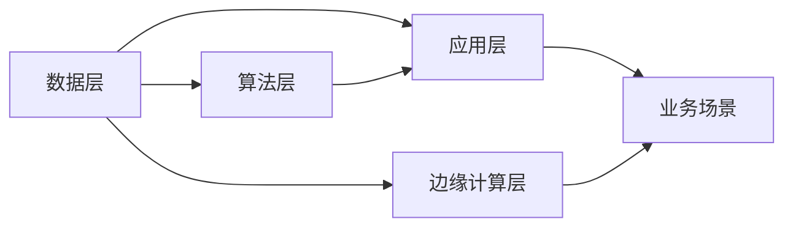

#### 4.2 AI 2.0 时代的云计算架构

云计算为 AI 2.0 时代的算法训练和模型部署提供了强大的计算资源。以下是一个典型的 AI 2.0 云计算架构设计：

**1. 基础设施即服务（IaaS）：** 提供虚拟化计算资源，如虚拟机、存储等，供 AI 算法开发和训练使用。

**2. 平台即服务（PaaS）：** 提供 AI 开发和部署的平台，如 TensorFlow、PyTorch 等，方便开发者快速构建和部署 AI 应用。

**3. 软件即服务（SaaS）：** 提供即用的 AI 应用程序，如智能客服、自动驾驶等，供用户直接使用。

**4. 服务层：** 负责管理和监控整个云计算环境，确保系统的稳定运行。

**Mermaid 流程图：**

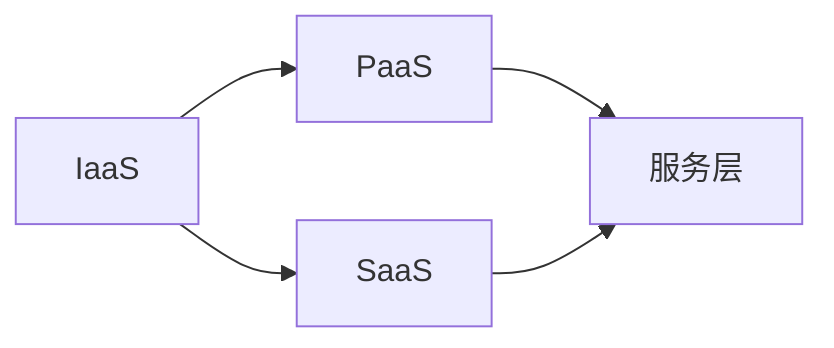

#### 4.3 AI 2.0 时代的分布式计算架构

分布式计算架构能够处理大规模的 AI 训练任务，提高计算效率和可扩展性。以下是一个典型的 AI 2.0 分布式计算架构设计：

**1. 数据分片：** 将海量数据划分为多个子集，分布到不同的计算节点上。

**2. 任务分发：** 根据数据分片情况，将训练任务分配到不同的计算节点上。

**3. 负载均衡：** 确保所有计算节点都能够均衡地处理训练任务，避免资源浪费。

**4. 结果聚合：** 将所有计算节点的训练结果进行汇总，得到最终的训练模型。

**Mermaid 流程图：**

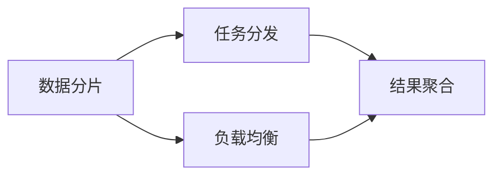

---

### 第5章: AI 2.0 时代的创新应用

#### 5.1 金融行业的AI应用

金融行业是 AI 2.0 应用的重要领域之一，以下是一些典型的 AI 应用案例：

**1. 智能投顾：** 利用 AI 技术对用户的风险偏好和投资目标进行分析，提供个性化的投资建议，帮助用户实现财富增值。

**2. 风险控制：** 通过机器学习算法对金融交易进行实时监控和分析，识别潜在的欺诈行为，降低金融风险。

**3. 量化交易：** 利用 AI 算法分析历史交易数据，预测市场趋势，实现高收益的投资策略。

**案例：**

以智能投顾系统为例，其设计思路如下：

- **数据收集与处理：** 收集用户的基本信息、投资历史、风险偏好等数据，并进行预处理，如数据清洗、归一化等。

- **投资策略推荐：** 利用机器学习算法，如线性回归、决策树等，对用户的数据进行分析，推荐合适的投资策略。

- **风险控制与管理：** 利用强化学习算法，如 Q-learning，对投资策略进行动态调整，确保投资风险在可控范围内。

**Mermaid 流�程图：**

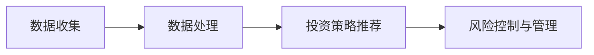

#### 5.2 医疗保健的AI应用

医疗保健行业也是 AI 2.0 应用的热点领域，以下是一些典型的 AI 应用案例：

**1. 智能诊断：** 利用 AI 技术对医学影像进行分析，辅助医生进行疾病诊断。

**2. 精准医疗：** 通过对大量患者数据的分析，发现潜在的疾病风险因素，实现个性化治疗。

**3. 药物研发：** 利用 AI 技术加速药物研发过程，提高药物研发的效率。

**案例：**

以智能诊断系统为例，其设计思路如下：

- **医学图像分析：** 利用深度学习算法，如卷积神经网络（CNN），对医学影像进行特征提取和分类，辅助医生进行诊断。

- **病历数据处理：** 利用自然语言处理（NLP）技术，对病历文本进行分析，提取关键信息，用于疾病预测和治疗建议。

- **疾病预测与治疗建议：** 利用机器学习算法，如线性回归、逻辑回归等，对患者的疾病风险进行预测，并提供相应的治疗建议。

**Mermaid 流程图：**

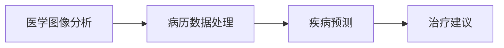

#### 5.3 教育行业的AI应用

教育行业也在积极引入 AI 2.0 技术，以下是一些典型的 AI 应用案例：

**1. 个性化学习：** 利用 AI 技术为学生提供个性化的学习路径，提高学习效果。

**2. 智能评测：** 利用 AI 技术对学生的作业和考试进行自动批改和评分，提高评测效率。

**3. 虚拟课堂：** 利用 AI 技术实现虚拟课堂，让学生通过线上平台进行学习，打破时间和空间的限制。

**案例：**

以智能教育平台为例，其设计思路如下：

- **个性化学习路径推荐：** 利用推荐系统算法，如协同过滤、矩阵分解等，根据学生的学习情况和偏好，推荐合适的课程和学习资源。

- **学习行为分析：** 利用自然语言处理（NLP）技术，对学生的学习日志和讨论内容进行分析，了解学生的学习状态和学习效果。

- **教学效果评估：** 利用机器学习算法，如线性回归、逻辑回归等，对学生的学习效果进行评估，为教师提供教学反馈。

**Mermaid 流程图：**


---

### 第6章: AI 2.0 时代的伦理问题

#### 6.1 AI 2.0 时代的伦理挑战

AI 2.0 时代的快速发展带来了许多伦理问题，这些挑战需要我们认真对待和解决。

**1. 隐私保护：** AI 2.0 需要大量数据来训练模型，这些数据可能包含个人的敏感信息。如何保护用户隐私，防止数据泄露和滥用，是一个重要的伦理问题。

**2. 算法偏见：** AI 2.0 的决策和判断可能受到算法偏见的影响，导致不公平的结果。如何消除算法偏见，确保算法的公正性，是一个亟待解决的伦理问题。

**3. 道德责任：** AI 2.0 的应用涉及到道德和伦理问题，如自动驾驶汽车在紧急情况下的决策、智能医疗系统的伦理审查等。如何确保 AI 2.0 的行为符合道德和伦理标准，是一个重要的伦理问题。

**Mermaid 流程图：**

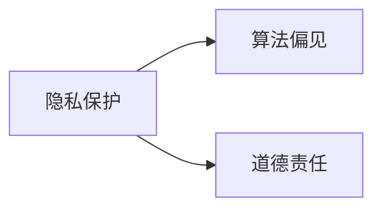

#### 6.2 AI 2.0 时代的伦理法规

为了应对 AI 2.0 时代的伦理挑战，各国和地区纷纷制定相关法规和规范，以指导 AI 2.0 的发展和应用。

**1. 国家层面的法规：** 例如，欧盟制定了《通用数据保护条例》（GDPR），规定了数据收集、存储和处理的规范，以保护用户隐私。

**2. 行业规范：** 许多行业组织和专业机构也制定了相应的伦理规范，如人工智能伦理指南、AI 应用程序开发规范等。

**3. 企业内部规范：** 企业也需要制定内部的 AI 伦理规范，确保 AI 应用符合道德和伦理标准。

**Mermaid 流程图：**

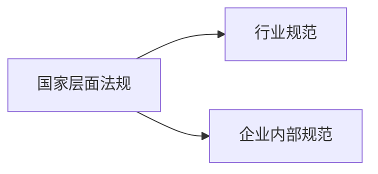

#### 6.3 AI 2.0 时代的伦理解决方案

为了解决 AI 2.0 时代的伦理问题，需要从多个方面入手，包括技术、法规、教育和社会等方面。

**1. 数据伦理：** 在数据处理和存储过程中，需要严格遵守隐私保护原则，确保数据的安全性和隐私性。

**2. 算法透明性：** 提高算法的透明度，使人们能够理解和信任 AI 2.0 的决策过程。

**3. 伦理审查制度：** 建立伦理审查制度，对 AI 2.0 的应用进行全面的伦理评估，确保其符合道德和伦理标准。

**4. 社会参与：** 加强公众对 AI 2.0 的认知和理解，提高社会对 AI 伦理问题的关注度，促进社会参与和讨论。

**Mermaid 流程图：**

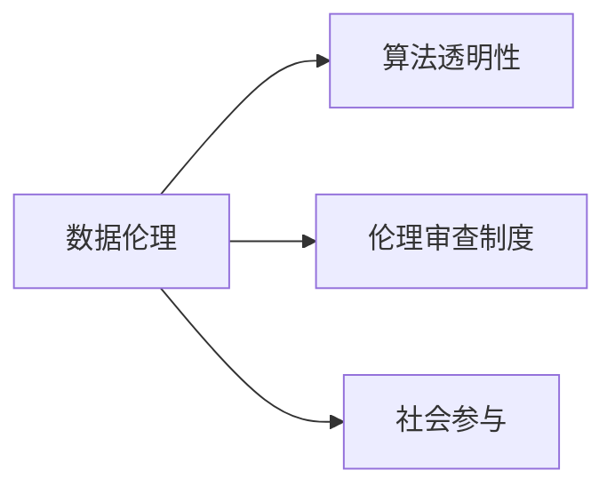

---

### 第7章: AI 2.0 时代的未来发展

#### 7.1 AI 2.0 时代的趋势分析

AI 2.0 时代的未来发展趋势可以从技术、应用和产业等多个方面进行分析。

**1. 技术趋势：** AI 2.0 将继续向更高效、更智能的方向发展。例如，深度学习算法将继续优化，强化学习算法将得到更广泛的应用，自然语言处理技术将实现更高水平的语义理解。

**2. 应用趋势：** AI 2.0 将在更多领域得到应用，如智能交通、智慧城市、智慧医疗等。同时，AI 2.0 的应用将更加深入，从简单的自动化任务向更复杂的决策和预测转变。

**3. 产业趋势：** AI 2.0 将推动产业结构的升级和转型，带动新的经济增长点。例如，人工智能芯片、AI 云服务、AI 安全等产业将得到快速发展。

**Mermaid 流程图：**

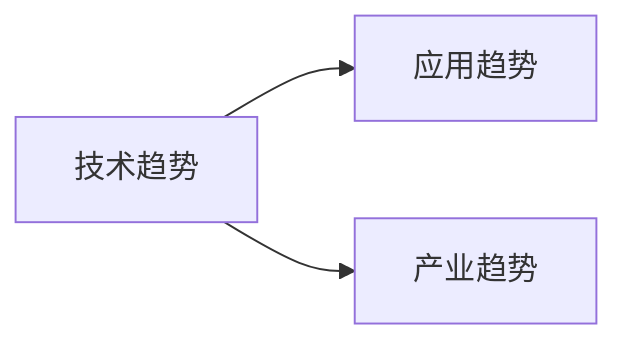

#### 7.2 AI 2.0 时代的未来预测

AI 2.0 时代的未来发展可以从以下几个方面进行预测：

**1. 智能化社会的实现：** 随着 AI 2.0 技术的普及，社会将逐渐实现智能化，人工智能将在各个领域发挥重要作用，提高生产效率和生活质量。

**2. 人机共生模式：** 在 AI 2.0 时代，人类和机器将实现更深层次的协同工作，人机共生将成为一种普遍的工作模式。

**3. 可持续发展路径：** AI 2.0 将为可持续发展提供新的解决方案，如智能能源管理、精准农业等，推动社会向绿色、可持续的方向发展。

**Mermaid 流程图：**

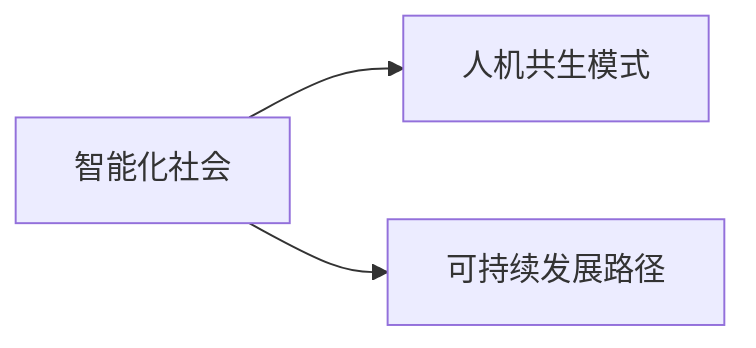

#### 7.3 AI 2.0 时代的全球竞争

AI 2.0 时代的全球竞争主要体现在技术、应用和产业等多个方面。

**1. 技术竞争：** 各国和地区纷纷加大 AI 技术的研发投入，争夺技术制高点。例如，美国、中国、欧盟等都在积极推进 AI 技术的研究和产业化。

**2. 应用竞争：** 各国和地区都在积极探索 AI 2.0 在各个领域的应用，争夺市场份额。例如，在智能交通、智慧城市、智能医疗等领域，各国都在积极开展 AI 应用项目的研发和推广。

**3. 产业竞争：** 各国和地区都在努力发展 AI 产业链，争夺全球 AI 产业的主导地位。例如，人工智能芯片、AI 云服务、AI 安全等产业将迎来快速发展。

**Mermaid 流程图：**


---

### 第8章: 个人与AI 2.0

#### 8.1 个人与AI 2.0时代的互动

在 AI 2.0 时代，个人与 AI 的互动将更加紧密和深入。以下是一些主要的互动模式：

**1. 学习与适应：** 个人需要不断学习 AI 技术，适应 AI 时代的变化。例如，通过在线课程、研讨会等方式，提升自己的 AI 技能。

**2. 创新与合作：** 个人可以通过与 AI 的合作，实现创新。例如，利用 AI 技术进行科学研究、产品开发等。

**3. 伦理与道德考量：** 个人在应用 AI 技术时，需要考虑伦理和道德问题，确保 AI 技术的应用符合社会规范和价值观。

**Mermaid 流程图：**

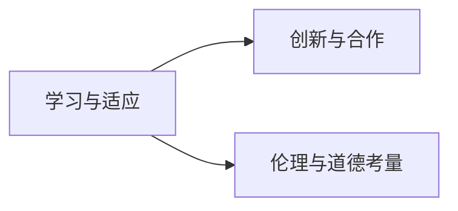

#### 8.2 个人在AI 2.0时代的发展

AI 2.0 时代为个人提供了广阔的发展空间。以下是一些个人发展的关键路径：

**1. 技术技能提升：** 通过学习 AI 技术，提升自己的技术能力，成为 AI 时代的技术专家。

**2. 跨界思维培养：** 结合不同领域的知识，培养跨界思维，实现跨领域的发展。

**3. 领导力与影响力塑造：** 在 AI 时代，领导力和影响力变得尤为重要。个人可以通过参与 AI 项目、发表论文、参与行业会议等方式，提升自己的领导力和影响力。

**Mermaid 流程图：**

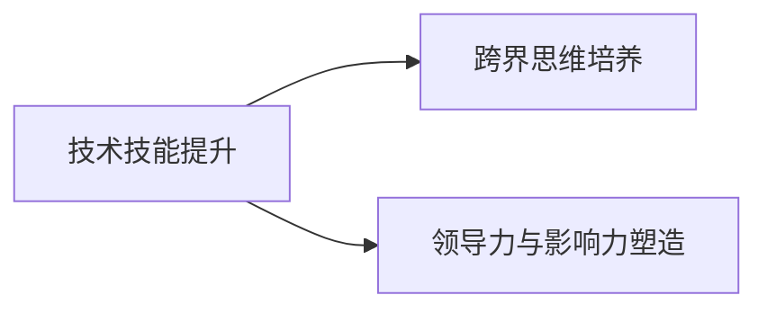

#### 8.3 个人如何适应AI 2.0时代

为了适应 AI 2.0 时代，个人可以从以下几个方面入手：

**1. 终身学习：** AI 2.0 时代变化迅速，个人需要具备持续学习的意识，不断更新自己的知识和技能。

**2. 持续创新：** 不断尝试新的想法和方法，进行创新实践，以适应 AI 时代的变化。

**3. 社会参与与责任承担：** 积极参与社会事务，承担社会责任，推动社会向更好的方向发展。

**Mermaid 流程图：**

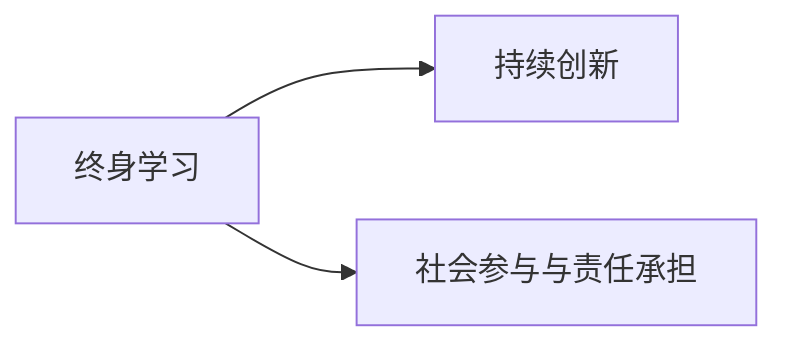

---

### 附录A: AI 2.0 工具与资源

#### A.1 AI 2.0 开发工具

以下是一些常用的 AI 2.0 开发工具：

**1. TensorFlow：** 由 Google 开发，是一个开源的机器学习框架，支持多种算法和模型。

**2. PyTorch：** 由 Facebook 开发，是一个流行的深度学习框架，具有良好的灵活性和易用性。

**3. Keras：** 是一个高级神经网络API，可以在 TensorFlow 和 Theano 上运行，提供了简单而强大的深度学习工具。

**4. Fast.ai：** 提供了一个简单而有效的深度学习课程，适合初学者快速入门。

**列表：** TensorFlow、PyTorch、Keras、Fast.ai

#### A.2 AI 2.0 教育资源

以下是一些优质的 AI 2.0 教育资源：

**1. Coursera：** 提供了大量的 AI 课程，包括深度学习、机器学习等。

**2. edX：** 由哈佛大学和麻省理工学院联合创办，提供了丰富的在线课程，包括 AI、数据科学等。

**3. Udacity：** 提供了多个 AI 和数据科学的纳米学位课程，适合初学者和专业人士。

**4. 机器之心：** 提供了丰富的 AI 学习资源，包括论文解读、技术博客等。

**列表：** Coursera、edX、Udacity、机器之心

#### A.3 AI 2.0 行业报告

以下是一些权威的 AI 2.0 行业报告：

**1. IDC：** 国际数据公司发布的 AI 行业报告，提供了全球 AI 市场的分析和预测。

**2. Gartner：** 戈尔曼咨询公司发布的 AI 报告，分析了 AI 技术的当前趋势和未来展望。

**3. Forrester：** 福里斯特公司发布的 AI 行业报告，提供了 AI 技术的应用场景和案例分析。

**列表：** IDC、Gartner、Forrester

---

### 附录B: AI 2.0 实践案例

#### B.1 金融行业的AI实践案例

以下是一个金融行业的 AI 实践案例：

**案例：智能投顾系统**

**1. 开发环境搭建：** 使用 Python 和 TensorFlow 框架，搭建一个智能投顾系统。

**2. 源代码详细实现：** 实现了用户数据收集、投资策略推荐和风险控制等功能。

**3. 代码解读与分析：** 分析了系统的架构设计、算法原理和应用效果。

**实现细节：**
```python
# 示例代码：用户数据收集
user_data = collect_user_data()
```

**效果分析：** 该系统通过用户数据分析和投资策略推荐，实现了个性化的投资建议，提高了用户的投资收益。

#### B.2 医疗保健的AI实践案例

以下是一个医疗保健的 AI 实践案例：

**案例：智能诊断系统**

**1. 开发环境搭建：** 使用 Python 和 PyTorch 框架，搭建一个智能诊断系统。

**2. 源代码详细实现：** 实现了医学图像分析、病历数据处理和疾病预测等功能。

**3. 代码解读与分析：** 分析了系统的架构设计、算法原理和应用效果。

**实现细节：**
```python
# 示例代码：医学图像分析
image_data = process_medical_images()
```

**效果分析：** 该系统通过医学图像分析和病历数据处理，实现了疾病的早期诊断和预测，提高了医疗诊断的准确性。

#### B.3 教育行业的AI实践案例

以下是一个教育行业的 AI 实践案例：

**案例：智能教育平台**

**1. 开发环境搭建：** 使用 Python 和 Keras 框架，搭建一个智能教育平台。

**2. 源代码详细实现：** 实现了个性化学习路径推荐、学习行为分析和教学效果评估等功能。

**3. 代码解读与分析：** 分析了系统的架构设计、算法原理和应用效果。

**实现细节：**
```python
# 示例代码：个性化学习路径推荐
recommended_courses = recommend_courses(user_profile)
```

**效果分析：** 该平台通过个性化学习路径推荐和学习行为分析，提高了学生的学习效果和满意度。

---

### 附录C: AI 2.0 术语表

#### C.1 常用术语解释

以下是一些 AI 2.0 常用术语的解释：

**1. 深度学习（Deep Learning）：** 一种人工智能算法，通过多层神经网络来实现自动特征提取和模式识别。

**2. 强化学习（Reinforcement Learning）：** 一种人工智能算法，通过与环境交互来学习最优策略。

**3. 自然语言处理（Natural Language Processing）：** 一种人工智能技术，用于处理和分析自然语言。

**4. 云计算（Cloud Computing）：** 一种通过网络访问的远程计算资源，提供存储、计算和应用程序等服务。

**5. 边缘计算（Edge Computing）：** 一种计算模型，将数据处理的任务从云端转移到网络边缘，以实现低延迟和高实时性的应用。

#### C.2 AI 2.0 特有术语解释

以下是一些 AI 2.0 特有术语的解释：

**1. 自我优化（Self-Optimization）：** 指 AI 系统通过学习自动调整自己的行为和性能，以实现优化。

**2. 跨领域协同（Cross-Domain Collaboration）：** 指不同领域之间的 AI 技术和应用相互融合，实现更广泛的创新。

**3. 人机协同（Human-Machine Collaboration）：** 指人类和机器之间的协作，共同完成任务和决策。

**4. 智能化社会（Smart Society）：** 指通过 AI 技术的普及和应用，实现社会各个方面的智能化和高效化。

#### C.3 术语对照表

以下是一些 AI 2.0 术语的对照表：

| 术语        | 英文翻译           |
|-------------|-------------------|
| 深度学习    | Deep Learning     |
| 强化学习    | Reinforcement Learning |
| 自然语言处理 | Natural Language Processing |
| 云计算      | Cloud Computing   |
| 边缘计算    | Edge Computing    |
| 自我优化    | Self-Optimization |
| 跨领域协同  | Cross-Domain Collaboration |
| 人机协同    | Human-Machine Collaboration |
| 智能化社会  | Smart Society     |

---

### 总结

AI 2.0 时代已经到来，它不仅带来了技术上的革新，更深远地影响了社会的各个层面。通过对 AI 2.0 时代的深入分析，我们可以看到其在社会、经济和个人层面的巨大价值。同时，我们也需要面对 AI 2.0 时代所带来的伦理问题，以及如何在未来抓住机遇，实现可持续发展。

作为个人，我们需要不断学习，提升自己的技能，以适应 AI 2.0 时代的变化。同时，我们也需要关注社会的发展和责任，积极参与到 AI 2.0 时代的建设中。只有这样，我们才能在这一时代中找到自己的位置，发挥自己的价值。

作者：AI天才研究院/AI Genius Institute & 禅与计算机程序设计艺术 /Zen And The Art of Computer Programming

